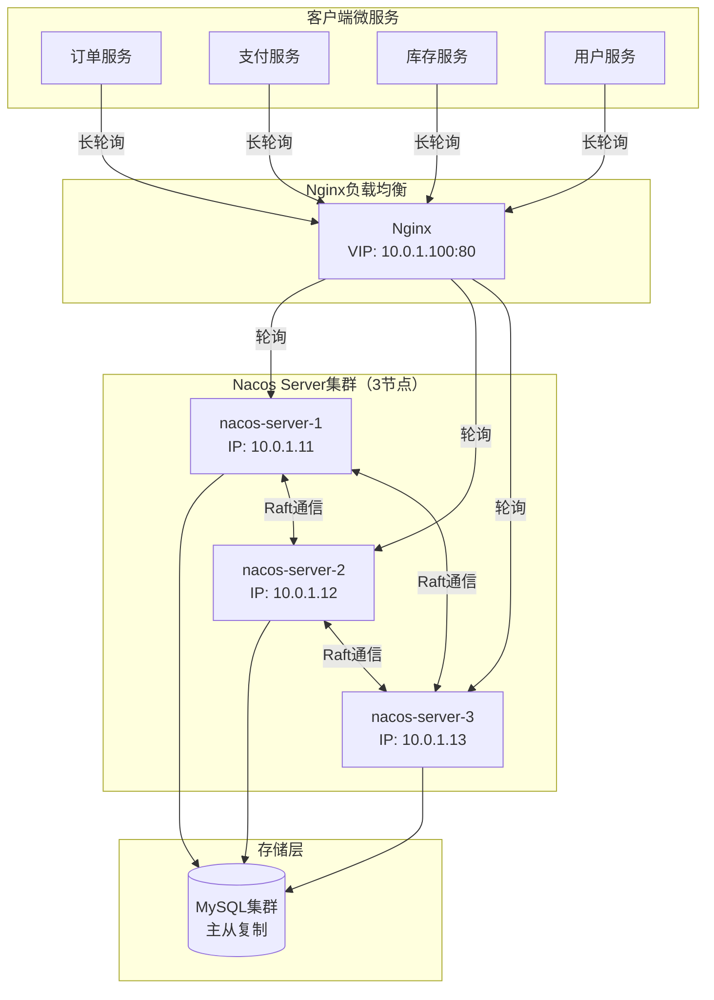
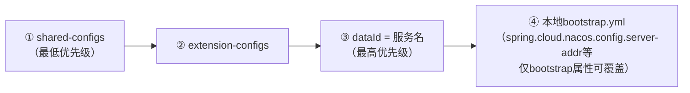
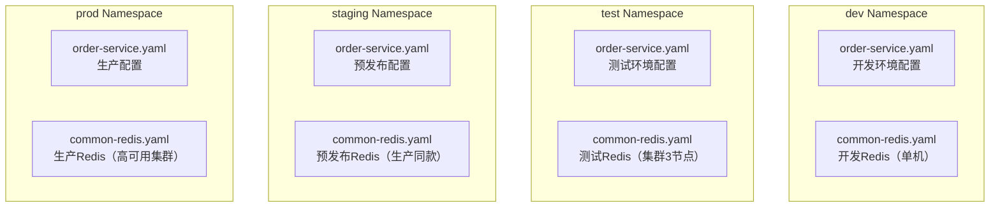
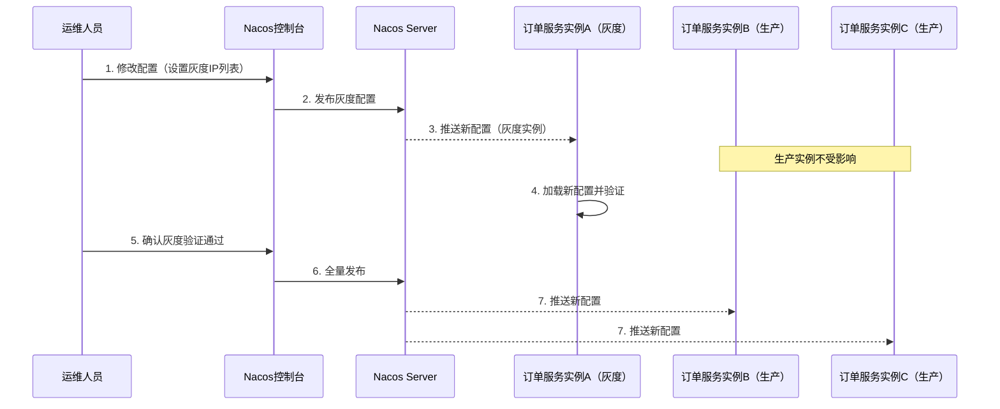
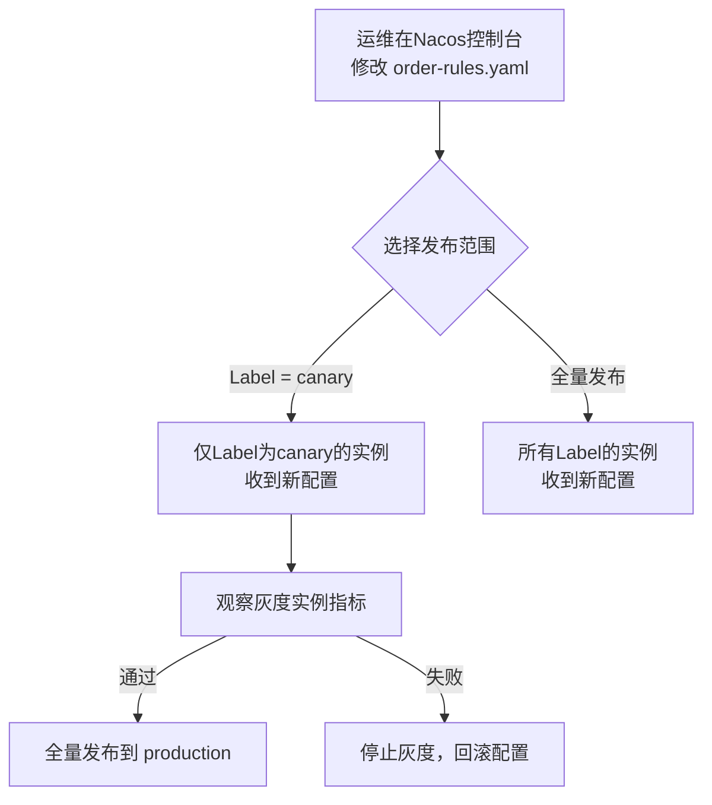

# 案例二：Nacos配置中心实战

Nacos（Dynamic Naming and Configuration Service）是阿里巴巴开源的一款集服务发现与配置管理于一体的中间件，自2018年开源以来已成为国内使用最广泛的配置中心之一。本案例以一个真实的微服务电商系统为背景，完整展示Nacos配置中心从搭建部署、客户端集成、多环境配置管理、动态刷新到灰度发布的全过程，帮助读者掌握Nacos在生产环境中的核心用法和最佳实践。

---

## 一、案例背景：电商平台的配置管理困境

### 1.1 业务场景

某中型电商平台（日活约50万）采用Spring Cloud微服务架构，包含订单服务、支付服务、库存服务、用户服务等12个核心微服务。随着业务快速迭代，配置管理面临越来越大的挑战：

- **配置分散**：每个微服务有独立的 `application.yml`，修改一个公共配置（如Redis地址）需要同时修改多个服务并重新部署
- **环境切换成本高**：开发、测试、预发布、生产四套环境的配置管理依赖人工复制粘贴，经常出现配置遗漏
- **配置变更无法实时生效**：修改限流阈值、功能开关等需要重启服务，大促期间无法快速响应
- **缺乏审计追溯**：谁在什么时间修改了什么配置，没有任何记录，出了问题无法追责

### 1.2 选型决策

团队对比了Apollo、Nacos、Spring Cloud Config三款主流配置中心，最终选择Nacos，原因如下：

| 对比维度 | Apollo | Nacos | Spring Cloud Config |
|---------|--------|-------|---------------------|
| 部署复杂度 | 较高（需4个组件） | 较低（单个Server） | 低（基于Git） |
| 配置推送延迟 | ≤60秒（长轮询） | ≤30秒（长轮询） | 不支持自动推送 |
| 服务发现 | 不支持（需配合Eureka） | 内置支持 | 不支持 |
| 多环境管理 | 原生支持（Portal管理） | Namespace隔离 | Git分支管理 |
| 灰度发布 | 原生支持 | 支持（Label机制） | 不支持 |
| 配置版本管理 | 原生支持 | 支持（版本历史） | Git天然支持 |
| 社区活跃度 | 高 | 极高 | 中等 |
| Spring Cloud集成 | Starter支持 | Starter支持 | 原生集成 |

Nacos的决定性优势在于**配置中心与服务发现一体化**——团队不需要额外部署Eureka或Consul来实现服务注册发现，显著降低了基础设施的运维复杂度。

---

## 二、Nacos服务端部署

### 2.1 架构设计



架构要点：

- **Nginx负载均衡**：客户端统一通过Nginx访问Nacos集群，避免客户端感知多个节点地址
- **三节点集群**：Nacos 2.x使用Raft协议选举Leader，3节点可容忍1个节点故障
- **MySQL外部存储**：生产环境必须使用MySQL存储配置数据，内嵌Derby仅用于开发测试
- **Raft通信**：节点间通过Raft协议保持数据一致性，端口默认为9848（主端口+1000）

### 2.2 单机部署（开发/测试环境）

```bash
# 1. 下载Nacos Server
wget https://github.com/alibaba/nacos/releases/download/2.3.0/nacos-server-2.3.0.tar.gz
tar -xzf nacos-server-2.3.0.tar.gz
cd nacos

# 2. 以单机模式启动（使用内嵌Derby数据库）
sh startup.sh -m standalone

# 3. 验证启动
curl -s http://localhost:8848/nacos/v1/console/health/readiness
# 返回 "UP" 表示启动成功

# 4. 访问管理界面
# 浏览器打开 http://localhost:8848/nacos
# 默认账号密码: nacos/nacos
```

> **注意**：单机模式仅用于开发调试，生产环境必须使用集群模式。单机模式下所有数据存储在内嵌的Derby数据库中，进程重启后数据会丢失。

### 2.3 集群部署（生产环境）

生产环境必须使用MySQL作为外部存储，并部署至少3个节点的Nacos集群。

**第一步：准备MySQL数据库**

```sql
-- 创建Nacos专用数据库
CREATE DATABASE nacos_config DEFAULT CHARACTER SET utf8mb4 COLLATE utf8mb4_general_ci;

-- 创建Nacos专用用户（限制最小权限）
CREATE USER 'nacos'@'10.0.1.%' IDENTIFIED BY 'YourStrongPassword!';
GRANT ALL PRIVILEGES ON nacos_config.* TO 'nacos'@'10.0.1.%';
FLUSH PRIVILEGES;

-- 导入Nacos建表脚本（在conf目录下）
-- mysql -u nacos -p nacos_config < conf/mysql-schema.sql
```

建表脚本执行成功后，会创建以下核心表：

| 表名 | 用途 |
|------|------|
| `config_info` | 配置项主表，存储配置内容 |
| `config_info_aggr` | 配置聚合表 |
| `config_info_beta` | 灰度配置表 |
| `config_tags_relation` | 配置标签关联表 |
| `group_capacity` | 分组容量统计 |
| `his_config_info` | 配置变更历史（版本管理的核心） |
| `permissions` | 权限控制表 |
| `roles` | 角色表 |
| `tenant_capacity` | 租户容量统计 |
| `tenant_info` | 租户（Namespace）信息 |

**第二步：修改Nacos配置文件**

```properties
# conf/application.properties

# ============ 数据源配置 ============
spring.datasource.platform=mysql
db.num=1
db.url.0=jdbc:mysql://10.0.1.50:3306/nacos_config?characterEncoding=utf8&amp;connectTimeout=1000&amp;socketTimeout=3000&amp;autoReconnect=true&amp;useUnicode=true&amp;useSSL=false&amp;serverTimezone=UTC
db.user.0=nacos
db.password.0=YourStrongPassword!

# MySQL高可用时可配置多数据源
# db.num=2
# db.url.1=jdbc:mysql://10.0.1.51:3306/nacos_config?characterEncoding=utf8&amp;connectTimeout=1000&amp;socketTimeout=3000&amp;autoReconnect=true&amp;useUnicode=true&amp;useSSL=false&amp;serverTimezone=UTC
# db.user.1=nacos
# db.password.1=YourStrongPassword!

# ============ Nacos安全配置 ============
# 关闭匿名访问（生产环境必须开启）
nacos.core.auth.enabled=true
nacos.core.auth.server.identity.key=auth-key-from-env
nacos.core.auth.server.identity.value=auth-value-from-env
# Token签名密钥（至少256位，用openssl rand -base64 32生成）
nacos.core.auth.plugin.nacos.token.secret.key=base64-encoded-secret-key-min-256-bits

# ============ 性能调优 ============
# 长轮询线程池（默认128，高并发场景调大）
nacos.config.longPollingThreadCoreSize=256
nacos.config.longPollingThreadMaxSize=512
# 配置缓存刷新间隔
nacos.config.cacheFlushInterval=30000
# 数据库连接池
db.pool.config.minimumIdle=10
db.pool.config.maximumPoolSize=30
db.pool.config.connectionTimeout=30000
db.pool.config.idleTimeout=600000
db.pool.config.maxLifetime=1800000

# ============ 日志配置 ============
server.tomcat.accesslog.enabled=true
server.tomcat.accesslog.pattern=common
```

**第三步：配置集群节点列表**

```bash
# conf/cluster.conf
# 格式: ip:port（端口为主端口，gRPC端口自动为port+1000）

10.0.1.11:8848
10.0.1.12:8848
10.0.1.13:8848
```

> **Nacos 2.x端口说明**：Nacos 2.x使用gRPC通信，除了主端口8848外，还会占用8848+1000=9848（客户端gRPC）和8848+1001=9849（服务端gRPC）。确保防火墙同时放通这三个端口。

**第四步：Nginx负载均衡配置**

```nginx
# /etc/nginx/conf.d/nacos-cluster.conf

upstream nacos_cluster {
    # 使用IP哈希保持长轮询连接的会话亲和性
    # Nacos客户端的长轮询需要打到同一节点，否则会产生无效连接
    ip_hash;
    server 10.0.1.11:8848 weight=1 max_fails=2 fail_timeout=10s;
    server 10.0.1.12:8848 weight=1 max_fails=2 fail_timeout=10s;
    server 10.0.1.13:8848 weight=1 max_fails=2 fail_timeout=10s;
}

server {
    listen 80;
    server_name nacos.example.com;
    
    location /nacos/ {
        proxy_pass http://nacos_cluster/nacos/;
        proxy_set_header Host $host;
        proxy_set_header X-Real-IP $remote_addr;
        proxy_set_header X-Forwarded-For $proxy_add_x_forwarded_for;
        
        # 关键：长轮询需要足够长的超时时间
        # Nacos默认长轮询超时30秒，Nginx超时必须大于此值
        proxy_read_timeout 300s;
        proxy_send_timeout 300s;
        proxy_connect_timeout 10s;
        
        # 支持gRPC（Nacos 2.x需要）
        proxy_http_version 1.1;
        proxy_set_header Upgrade $http_upgrade;
        proxy_set_header Connection "upgrade";
        
        # 关闭缓冲，实现实时推送
        proxy_buffering off;
    }
    
    # 健康检查端点
    location /nacos/v1/console/health/readiness {
        proxy_pass http://nacos_cluster/nacos/v1/console/health/readiness;
        access_log off;
    }
}
```

> **Nginx配置陷阱**：`proxy_read_timeout` 必须大于Nacos的长轮询超时时间（默认30秒）。如果设得太短，Nginx会提前断开连接，导致客户端频繁重建长轮询，产生大量无效连接和日志。

**第五步：JVM调优**

```bash
# conf/jvm.properties（或在startup.sh中设置JAVA_OPT）

# 堆内存：根据配置数量和连接数调整，建议4GB起步
-Xms4g -Xmx4g

# 使用G1GC，适合大内存低延迟场景
-XX:+UseG1GC
-XX:MaxGCPauseMillis=200
-XX:G1HeapRegionSize=16m
-XX:InitiatingHeapOccupancyPercent=40

# GC日志（便于排查GC问题）
-Xlog:gc*:file=${NACOS_HOME}/logs/gc.log:time,uptime,level,tags:filecount=10,filesize=100m

# Metaspace
-XX:MetaspaceSize=256m
-XX:MaxMetaspaceSize=512m
```

**第六步：启动集群并验证**

```bash
# 在每个节点上执行（不要使用root用户启动）
sh startup.sh -m cluster

# 验证集群状态
# 方式一：HTTP接口
curl -s http://10.0.1.11:8848/nacos/v1/console/health/readiness
curl -s http://10.0.1.12:8848/nacos/v1/console/health/readiness
curl -s http://10.0.1.13:8848/nacos/v1/console/health/readiness

# 方式二：通过Nacos控制台查看集群状态
# 打开 http://nacos.example.com/nacos → 集群管理 → 节点列表
# 确认3个节点全部显示 "UP" 状态

# 方式三：检查Raft选举状态
curl -s "http://10.0.1.11:8848/nacos/v1/core/raft/list-peers"
# 返回JSON中应显示3个节点，其中一个为Leader
```

---

## 三、Spring Cloud Nacos客户端集成

### 3.1 Maven依赖引入

```xml
<dependencyManagement>
    <dependencies>
        <!-- Spring Cloud Alibaba版本管理 -->
        <dependency>
            <groupId>com.alibaba.cloud</groupId>
            <artifactId>spring-cloud-alibaba-dependencies</artifactId>
            <version>2022.0.0.0</version>
            <type>pom</type>
            <scope>import</scope>
        </dependency>
        <!-- Spring Cloud版本管理（必须与Spring Boot版本匹配） -->
        <dependency>
            <groupId>org.springframework.cloud</groupId>
            <artifactId>spring-cloud-dependencies</artifactId>
            <version>2022.0.4</version>
            <type>pom</type>
            <scope>import</scope>
        </dependency>
    </dependencies>
</dependencyManagement>

<dependencies>
    <!-- Nacos配置中心 -->
    <dependency>
        <groupId>com.alibaba.cloud</groupId>
        <artifactId>spring-cloud-starter-alibaba-nacos-config</artifactId>
    </dependency>
    <!-- Nacos服务发现（可选：如果不需要Nacos做服务发现可不引入） -->
    <dependency>
        <groupId>com.alibaba.cloud</groupId>
        <artifactId>spring-cloud-starter-alibaba-nacos-discovery</artifactId>
    </dependency>
    <!-- Spring Cloud bootstrap支持（Spring Boot 2.4+需要单独引入） -->
    <dependency>
        <groupId>org.springframework.cloud</groupId>
        <artifactId>spring-cloud-starter-bootstrap</artifactId>
    </dependency>
</dependencies>
```

> **版本兼容性**：Spring Cloud Alibaba与Spring Boot、Spring Cloud有严格的版本对应关系。推荐使用阿里官方的 [版本兼容矩阵](https://github.com/alibaba/spring-cloud-alibaba/wiki/%E7%89%88%E6%9C%AC%E8%AF%B4%E6%98%8E) 选择正确的版本组合，避免运行时出现奇怪的类加载问题。

### 3.2 bootstrap.yml基础配置

`bootstrap.yml` 是Spring Cloud的引导配置文件，优先于 `application.yml` 加载。Nacos客户端必须通过 `bootstrap.yml` 指定Nacos Server地址和命名空间：

```yaml
# bootstrap.yml
spring:
  application:
    name: order-service
  profiles:
    active: ${SPRING_PROFILES_ACTIVE:dev}
  cloud:
    nacos:
      # ===== 服务发现配置 =====
      discovery:
        server-addr: nacos.example.com:80
        namespace: ${NACOS_NAMESPACE:dev}
        group: ORDER_SERVICE
        # 心跳配置
        heart-beat-interval: 5000
        heart-beat-timeout: 15000
        
      # ===== 配置中心配置 =====
      config:
        server-addr: ${spring.cloud.nacos.discovery.server-addr}
        namespace: ${spring.cloud.nacos.discovery.namespace}
        # 配置文件格式（支持yaml/properties/json/xml）
        file-extension: yaml
        # 配置刷新开关（默认true）
        refresh-enabled: true
        # 组名（不同微服务使用不同Group实现隔离）
        group: ORDER_SERVICE
        
        # ===== 共享配置（所有服务通用的配置） =====
        shared-configs:
          # 公共配置：Redis、RocketMQ等中间件连接信息
          - data-id: common-redis.yaml
            group: SHARED_CONFIG
            refresh: true
          - data-id: common-mq.yaml
            group: SHARED_CONFIG
            refresh: true
          # 监控配置
          - data-id: common-actuator.yaml
            group: SHARED_CONFIG
            refresh: false   # 监控配置变更不频繁，关闭自动刷新减少推送压力
            
        # ===== 扩展配置（特定服务组共享的配置） =====
        extension-configs:
          # 订单域共享配置（订单、支付、库存等服务共用）
          - data-id: order-domain-common.yaml
            group: ORDER_DOMAIN
            refresh: true
```

### 3.3 配置加载优先级

Nacos客户端启动时，配置按以下优先级从低到高加载，高优先级会覆盖低优先级中的同名配置项：



**实际应用中的优先级策略**：

| 优先级 | 配置来源 | 典型内容 | 说明 |
|--------|---------|---------|------|
| 最低 | shared-configs | Redis、MQ等公共中间件配置 | 所有服务共享，变更频率低 |
| 中 | extension-configs | 域内共享配置（如订单域通用配置） | 多个相关服务共享 |
| 高 | dataId=服务名.yaml | 服务专属配置（限流、超时等） | 仅当前服务使用 |
| 最高 | Nacos运行时推送 | 灰度配置、紧急修复 | 实时生效，最高优先级 |

### 3.4 配置文件命名规范

在Nacos中创建配置时，dataId的命名建议遵循以下规范：

{服务名}-{配置类型}.{格式后缀}

示例：
order-service.yaml                    # 服务主配置
order-service-dev.yaml                # 服务开发环境配置（如需环境级覆盖）
common-redis.yaml                     # 公共Redis配置
common-mq.yaml                        # 公共消息队列配置
order-domain-common.yaml              # 订单域共享配置
order-rules.yaml                      # 业务规则配置（动态刷新）
order-feature-flags.yaml              # 功能开关配置

---

## 四、多环境配置管理实战

### 4.1 Namespace环境隔离

Namespace是Nacos实现环境隔离的核心机制。每个Namespace是完全独立的配置空间，不同Namespace之间的配置互不可见：



**通过API创建Namespace**：

```python
import requests

class NacosNamespaceManager:
    """Nacos命名空间管理器"""
    
    def __init__(self, server_addr: str):
        self.base_url = f"http://{server_addr}/nacos/v1/console/namespaces"
    
    def create_namespace(self, namespace_id: str, name: str, desc: str) -> bool:
        """创建命名空间"""
        resp = requests.post(self.base_url, params={
            "customNamespaceId": namespace_id,
            "namespaceName": name,
            "namespaceDesc": desc,
        })
        if resp.status_code == 200 and resp.json().get("data"):
            print(f"✅ 命名空间创建成功: {name} ({namespace_id})")
            return True
        print(f"❌ 创建失败: {resp.text}")
        return False
    
    def list_namespaces(self) -> list:
        """列出所有命名空间"""
        resp = requests.get(self.base_url)
        if resp.status_code == 200:
            return resp.json().get("data", [])
        return []


# 创建四套环境的Namespace
manager = NacosNamespaceManager("nacos.example.com:80")
manager.create_namespace("dev", "开发环境", "开发团队使用，连接开发数据库")
manager.create_namespace("test", "测试环境", "QA团队使用，连接测试数据库")
manager.create_namespace("staging", "预发布环境", "与生产环境配置一致，用于上线前验证")
manager.create_namespace("prod", "生产环境", "线上真实流量，变更需审批")
```

**通过环境变量动态切换Namespace**：

```yaml
# bootstrap.yml — 通过环境变量注入Namespace，不同部署环境传不同值
spring:
  cloud:
    nacos:
      config:
        namespace: ${NACOS_NAMESPACE:dev}    # 默认dev，部署时通过环境变量覆盖
      discovery:
        namespace: ${NACOS_NAMESPACE:dev}
```

```bash
# 不同环境启动时注入不同的Namespace
# 开发环境
export NACOS_NAMESPACE=dev
java -jar order-service.jar

# 测试环境
export NACOS_NAMESPACE=test
java -jar order-service.jar

# 生产环境
export NACOS_NAMESPACE=prod
java -jar order-service.jar
```

### 4.2 Group服务分组策略

Group用于在同一Namespace内进一步隔离不同微服务或不同功能域的配置：

| Group命名规范 | 用途 | 示例 |
|--------------|------|------|
| `{SERVICE}_SERVICE` | 服务专属配置组 | ORDER_SERVICE, PAYMENT_SERVICE |
| SHARED_CONFIG | 公共配置组 | Redis、MQ、监控等 |
| `{DOMAIN}_DOMAIN` | 业务域共享配置组 | ORDER_DOMAIN（订单域） |
| SYSTEM_CONFIG | 系统级配置组 | 全局限流、熔断策略 |

**Group选择原则**：

- 每个微服务的专属配置使用 `{SERVICE}_SERVICE` Group
- 多个服务共享的配置（如Redis连接）放到 `SHARED_CONFIG` Group
- 相关服务的域内共享配置（如订单和库存共享的库存阈值）放到 `{DOMAIN}_DOMAIN` Group
- 避免把所有配置都放到 `DEFAULT_GROUP`，否则配置过多时难以管理

### 4.3 配置继承与共享

Nacos通过 `shared-configs` 和 `extension-configs` 实现配置的继承复用：

```yaml
# 典型的配置继承结构示例
# 
# 命名空间: prod
#
# SHARED_CONFIG Group:
#   common-redis.yaml        → 所有服务共享（Redis连接池配置）
#   common-actuator.yaml     → 所有服务共享（Actuator端点配置）
#
# ORDER_DOMAIN Group:
#   order-domain-common.yaml → 订单、支付、库存共享（订单域通用参数）
#
# ORDER_SERVICE Group:
#   order-service.yaml       → 仅订单服务使用（订单专属配置）

# 以下是订单服务的bootstrap.yml，展示了如何继承多层配置
spring:
  cloud:
    nacos:
      config:
        shared-configs:
          - data-id: common-redis.yaml
            group: SHARED_CONFIG
            refresh: true
        extension-configs:
          - data-id: order-domain-common.yaml
            group: ORDER_DOMAIN
            refresh: true
        # dataId默认为 ${spring.application.name}.${file-extension}
        # 即 order-service.yaml（最高优先级）
```

**配置覆盖规则**：当多个配置源中存在同名配置项时，优先级为 `shared-configs < extension-configs < dataId（服务名）`。例如，如果 `common-redis.yaml` 和 `order-service.yaml` 中都定义了 `spring.redis.host`，则订单服务最终使用 `order-service.yaml` 中的值。

---

## 五、动态配置刷新

### 5.1 @RefreshScope的自动刷新

Spring Cloud Nacos通过 `@RefreshScope` 注解实现配置的自动刷新。标注了此注解的Bean在配置变更时会自动销毁并重建。

**刷新机制原理**：当Nacos推送配置变更时，Spring Cloud的 `ConfigurationPropertiesRebinder` 监听器接收到变更事件，销毁所有标注了 `@RefreshScope` 的Bean，然后在下次访问时重新创建并注入新的配置值。这个过程是**懒刷新**的——Bean不会立即重建，而是在第一次被访问时才重建。

```java
/**
 * 订单业务规则配置类
 * @RefreshScope确保配置变更时Bean自动重建
 * 
 * 注意：@RefreshScope创建的是代理Bean，Bean销毁重建期间
 * 如果有其他Bean持有该Bean的引用，可能看到旧值直到引用刷新。
 */
@Component
@RefreshScope
@Slf4j
public class OrderRulesConfig {

    @Value("${rules.rate-limit.order-create:5000}")
    private int createOrderRateLimit;

    @Value("${rules.rate-limit.order-query:10000}")
    private int queryOrderRateLimit;

    @Value("${rules.timeout.payment-wait:900}")
    private int paymentWaitTimeout;

    @Value("${rules.retry.max-attempts:3}")
    private int maxRetryAttempts;

    // getter方法
    public int getCreateOrderRateLimit() { return createOrderRateLimit; }
    public int getQueryOrderRateLimit() { return queryOrderRateLimit; }
    public int getPaymentWaitTimeout() { return paymentWaitTimeout; }
    public int getMaxRetryAttempts() { return maxRetryAttempts; }
}
```

**@RefreshScope的使用注意事项**：

| 注意事项 | 说明 | 建议 |
|---------|------|------|
| 线程安全 | Bean重建期间并发请求可能读到旧值 | 配置类中使用volatile修饰或AtomicReference |
| 有状态Bean | 重建会丢失Bean中的运行时状态 | 不要将会话状态、缓存数据放在@RefreshScope Bean中 |
| 循环依赖 | @RefreshScope可能破坏Bean的循环依赖 | 避免在存在循环依赖的Bean上使用 |
| 性能开销 | 每次配置变更都会触发Bean重建 | 不要将不需要刷新的Bean标注@RefreshScope |

### 5.2 基于@NacosConfigurationProperties的精细刷新

对于需要更精细控制的场景，Nacos原生提供了 `@NacosConfigurationProperties` 注解，支持绑定整个配置对象并自动刷新：

```java
/**
 * 功能开关配置类
 * 使用Nacos原生注解，支持嵌套对象的自动刷新
 */
@Data
@Component
@NacosConfigurationProperties(
    dataId = "order-feature-flags.yaml",
    groupId = "ORDER_SERVICE",
    autoRefreshed = true,
    groupIdKey = "groupId"
)
public class FeatureFlags {

    private Feature newCheckoutFlow = new Feature();
    private Feature aiRecommendation = new Feature();
    private Feature expressRealtimeTracking = new Feature();

    @Data
    public static class Feature {
        private boolean enabled = false;
        private String description;
    }
}
```

**@RefreshScope vs @NacosConfigurationProperties 对比**：

| 特性 | @RefreshScope | @NacosConfigurationProperties |
|------|--------------|-------------------------------|
| 来源 | Spring Cloud（通用） | Nacos原生 |
| 刷新粒度 | 整个Bean销毁重建 | 属性级别热更新 |
| 嵌套对象支持 | 不支持（需要重新创建整个Bean） | 支持（嵌套对象自动刷新） |
| 配置源 | 任意配置源（Nacos、Consul、本地） | 仅Nacos |
| 使用复杂度 | 简单（加注解即可） | 需要指定dataId和groupId |
| 推荐场景 | 简单的@Value注入 | 复杂配置对象、嵌套结构 |

### 5.3 基于@NacosConfigListener的自定义刷新逻辑

某些配置变更需要执行复杂的业务逻辑（如重新初始化连接池、更新限流器参数），这时需要使用监听器手动处理：

```java
/**
 * 配置变更监听器——处理需要自定义刷新逻辑的配置
 */
@Component
@Slf4j
public class NacosConfigChangeHandler {

    @Autowired
    private RateLimiterService rateLimiterService;

    @Autowired
    private DataSourceProperties dataSourceProperties;

    /**
     * 监听业务规则配置变更
     */
    @NacosConfigListener(
        dataId = "order-rules.yaml",
        groupId = "ORDER_SERVICE",
        timeout = 3000
    )
    public void onRulesChange(String newConfig) {
        log.info("订单业务规则配置发生变更");

        try {
            // 解析YAML配置
            YamlPropertiesFactoryBean yamlFactory = new YamlPropertiesFactoryBean();
            yamlFactory.setResources(new ByteArrayResource(newConfig.getBytes(StandardCharsets.UTF_8)));
            Properties props = yamlFactory.getObject();

            // 更新限流阈值
            String newCreateLimit = props.getProperty("rules.rate-limit.order-create");
            if (newCreateLimit != null) {
                int oldLimit = rateLimiterService.getCreateOrderLimit();
                int newLimit = Integer.parseInt(newCreateLimit);
                rateLimiterService.updateCreateOrderLimit(newLimit);
                log.info("下单限流阈值更新: {} -> {}", oldLimit, newLimit);
            }

            String newQueryLimit = props.getProperty("rules.rate-limit.order-query");
            if (newQueryLimit != null) {
                int newLimit = Integer.parseInt(newQueryLimit);
                rateLimiterService.updateQueryOrderLimit(newLimit);
                log.info("查询限流阈值更新为: {}", newLimit);
            }

            // 更新超时参数
            String newPaymentTimeout = props.getProperty("rules.timeout.payment-wait");
            if (newPaymentTimeout != null) {
                // 更新分布式锁的超时时间
                orderService.updatePaymentWaitTimeout(Integer.parseInt(newPaymentTimeout));
            }

        } catch (Exception e) {
            log.error("处理配置变更失败", e);
            // 配置变更处理失败不应该影响服务运行
        }
    }

    /**
     * 监听功能开关配置变更
     */
    @NacosConfigListener(
        dataId = "order-feature-flags.yaml",
        groupId = "ORDER_SERVICE",
        timeout = 3000
    )
    public void onFeatureFlagsChange(String newConfig) {
        log.info("功能开关配置发生变更");

        try {
            YamlPropertiesFactoryBean yamlFactory = new YamlPropertiesFactoryBean();
            yamlFactory.setResources(new ByteArrayResource(newConfig.getBytes(StandardCharsets.UTF_8)));
            Properties props = yamlFactory.getObject();

            // 更新功能开关——使用AtomicBoolean保证线程安全
            featureToggleService.updateFlag("new-checkout-flow",
                Boolean.parseBoolean(props.getProperty("feature.new-checkout-flow.enabled", "false")));
            featureToggleService.updateFlag("ai-recommendation",
                Boolean.parseBoolean(props.getProperty("feature.ai-recommendation.enabled", "false")));

            log.info("功能开关更新完成");
        } catch (Exception e) {
            log.error("处理功能开关变更失败", e);
        }
    }
}
```

### 5.4 限流器的动态刷新实现

限流阈值的动态刷新是配置中心最典型的应用场景之一。以下展示如何在不重启服务的情况下实时更新限流参数：

```java
/**
 * 动态限流服务——支持配置中心实时调参
 */
@Service
@Slf4j
public class RateLimiterService {

    // 使用Guava RateLimiter
    private volatile RateLimiter createOrderLimiter;
    private volatile RateLimiter queryOrderLimiter;

    @PostConstruct
    public void init() {
        this.createOrderLimiter = RateLimiter.create(5000);   // 默认5000 QPS
        this.queryOrderLimiter = RateLimiter.create(10000);   // 默认10000 QPS
    }

    /**
     * 动态更新下单限流阈值
     * 由于RateLimiter.setRate()是线程安全的，可以直接调用
     */
    public void updateCreateOrderLimit(int newQps) {
        RateLimiter oldLimiter = this.createOrderLimiter;
        this.createOrderLimiter = RateLimiter.create(newQps);
        log.warn("下单限流阈值动态调整为 {} QPS", newQps);
    }

    public void updateQueryOrderLimit(int newQps) {
        RateLimiter oldLimiter = this.queryOrderLimiter;
        this.queryOrderLimiter = RateLimiter.create(newQps);
        log.warn("查询限流阈值动态调整为 {} QPS", newQps);
    }

    /**
     * 尝试获取下单许可
     */
    public boolean tryAcquireCreateOrder() {
        return createOrderLimiter.tryAcquire(1, TimeUnit.MILLISECONDS);
    }

    /**
     * 尝试获取查询许可
     */
    public boolean tryAcquireQueryOrder() {
        return queryOrderLimiter.tryAcquire(1, TimeUnit.MILLISECONDS);
    }
}
```

---

## 六、灰度发布实战

### 6.1 基于IP的灰度发布

Nacos支持通过IP白名单实现灰度发布，将新配置先推送给指定的服务实例，验证无误后再全量发布。



**灰度发布操作步骤：**

1. **选择灰度实例**：在Nacos管理界面选择目标配置，点击"灰度发布"
2. **指定灰度IP**：输入灰度实例的IP地址（如 `10.0.2.10`），多个IP用逗号分隔
3. **填写灰度内容**：修改配置内容（如将限流阈值从5000调整为8000）
4. **发布灰度配置**：确认后点击"发布"，只有灰度IP列表中的实例会收到新配置
5. **观察验证**：监控灰度实例的错误率、延迟、CPU等指标，观察10-15分钟
6. **全量发布或回滚**：验证通过后点击"全量发布"；如发现问题则点击"停止灰度"回滚

### 6.2 基于Label的灰度发布

Label（标签）机制适合按机房、数据中心、集群维度进行灰度。与Namespace按环境隔离不同，Label可以在同一Namespace内按标签维度区分配置：

```yaml
# 服务A的bootstrap.yml — 标识为灰度实例
spring:
  cloud:
    nacos:
      config:
        # Label标识此实例的标签
        # 灰度发布时选择匹配此Label的实例
        group: ORDER_SERVICE
        # 配置文件中的label属性
        # Nacos 2.x通过shared-configs的label属性指定
        shared-configs:
          - data-id: order-rules.yaml
            group: ORDER_SERVICE
            # 设置label为canary，灰度发布时通过label过滤
            label: canary
```

```yaml
# 服务B的bootstrap.yml — 正式生产实例
spring:
  cloud:
    nacos:
      config:
        group: ORDER_SERVICE
        shared-configs:
          - data-id: order-rules.yaml
            group: ORDER_SERVICE
            # 正式实例使用默认label（空）或production
            label: production
```

**Label灰度发布流程**：



**Label vs Namespace vs Group 的区别**：

| 维度 | Namespace | Group | Label |
|------|-----------|-------|-------|
| 作用域 | 完全隔离（不同Namespace配置互不可见） | 同一Namespace内的配置分组 | 同一Group内的配置标签 |
| 典型用途 | 环境隔离（dev/test/prod） | 服务隔离（ORDER_SERVICE） | 灰度发布（canary/production） |
| 配置可见性 | 跨Namespace不可见 | 同Namespace可见 | 同Group可见 |
| 客户端指定方式 | `spring.cloud.nacos.config.namespace` | `spring.cloud.nacos.config.group` | `spring.cloud.nacos.config.shared-configs[].label` |
| 灰度发布 | 不适合（影响整个环境） | 不适合（影响整个服务） | 适合（可精确到标签维度） |

### 6.3 基于API的自动化灰度发布

生产环境中推荐通过Nacos Open API实现自动化的灰度发布流程：

```python
import requests
import time
import json

class NacosGrayRelease:
    """Nacos灰度发布控制器"""
    
    def __init__(self, server_addr: str, namespace: str):
        self.server_addr = server_addr
        self.namespace = namespace
        self.base_url = f"http://{server_addr}/nacos/v1/cs/configs"

    def publish_gray(self, data_id: str, group: str,
                     content: str, gray_ips: list) -> bool:
        """发布灰度配置"""
        # 第一步：先将灰度配置写入
        params = {
            "dataId": data_id,
            "group": group,
            "tenant": self.namespace,
            "content": content,
            "type": "yaml",
        }
        resp = requests.post(self.base_url, params=params)
        if resp.status_code != 200 or resp.text != "true":
            raise Exception(f"发布灰度配置失败: {resp.text}")

        # 第二步：设置灰度IP白名单
        gray_params = {
            "dataId": data_id,
            "group": group,
            "tenant": self.namespace,
            "grayIps": ",".join(gray_ips)
        }
        resp = requests.put(
            f"{self.base_url}/gray",
            params=gray_params
        )
        return resp.status_code == 200 and resp.text == "true"

    def publish_full(self, data_id: str, group: str,
                     content: str) -> bool:
        """全量发布配置"""
        params = {
            "dataId": data_id,
            "group": group,
            "tenant": self.namespace,
            "content": content,
            "type": "yaml",
        }
        resp = requests.post(self.base_url, params=params)
        return resp.status_code == 200 and resp.text == "true"

    def stop_gray(self, data_id: str, group: str) -> bool:
        """停止灰度（回滚）"""
        params = {
            "dataId": data_id,
            "group": group,
            "tenant": self.namespace,
        }
        resp = requests.delete(
            f"{self.base_url}/gray",
            params=params
        )
        return resp.status_code == 200 and resp.text == "true"

    def safe_gray_release(self, data_id: str, group: str,
                          content: str, gray_ips: list,
                          observe_seconds: int = 600) -> bool:
        """安全的灰度发布流程：灰度 → 观察 → 全量/回滚"""
        print(f"[1/4] 发布灰度配置到实例: {gray_ips}")
        self.publish_gray(data_id, group, content, gray_ips)

        print(f"[2/4] 观察 {observe_seconds} 秒...")
        time.sleep(observe_seconds)

        print("[3/4] 检查灰度实例健康状态...")
        if not self._check_health(gray_ips):
            print("❌ 灰度实例健康检查失败，执行回滚")
            self.stop_gray(data_id, group)
            return False

        print("[4/4] 灰度验证通过，全量发布")
        self.publish_full(data_id, group, content)
        return True

    def _check_health(self, gray_ips: list) -> bool:
        """检查灰度实例的健康状态（集成Prometheus监控）"""
        # 实际实现应查询Prometheus/Grafana的监控指标
        for ip in gray_ips:
            try:
                resp = requests.get(
                    f"http://{ip}:8080/actuator/health",
                    timeout=5
                )
                if resp.status_code != 200:
                    return False
                health = resp.json()
                if health.get("status") != "UP":
                    return False
            except Exception:
                return False
        return True


# 使用示例
if __name__ == "__main__":
    releaser = NacosGrayRelease(
        server_addr="nacos.example.com:80",
        namespace="prod-20240101"
    )

    new_rules = """
rules:
  rate-limit:
    order-create: 8000    # 从5000调整为8000
    order-query: 15000    # 从10000调整为15000
    order-cancel: 1500
  timeout:
    payment-wait: 900
"""

    releaser.safe_gray_release(
        data_id="order-rules.yaml",
        group="ORDER_SERVICE",
        content=new_rules,
        gray_ips=["10.0.2.10", "10.0.2.11"],
        observe_seconds=600
    )
```

---

## 七、配置版本管理与回滚

### 7.1 Nacos内置的版本管理

Nacos自动记录每次配置变更的历史版本。在管理界面中可以通过"版本历史"查看和对比：


版本历史记录存储在MySQL的 `his_config_info` 表中，每次配置发布都会新增一条历史记录。Nacos不会自动清理历史版本，生产环境建议定期归档超过90天的历史记录。

### 7.2 通过API实现自动化版本管理

```python
import requests
from datetime import datetime

class NacosVersionManager:
    """Nacos配置版本管理器"""
    
    def __init__(self, server_addr: str, namespace: str):
        self.server_addr = server_addr
        self.namespace = namespace
        self.base_url = f"http://{server_addr}/nacos/v1/cs/configs"

    def get_version_history(self, data_id: str, group: str) -> list:
        """获取配置版本历史"""
        params = {
            "dataId": data_id,
            "group": group,
            "tenant": self.namespace,
            "pageNo": 1,
            "pageSize": 100,
        }
        resp = requests.get(f"{self.base_url}/his", params=params)
        if resp.status_code == 200:
            data = resp.json()
            return data.get("pageItems", [])
        return []

    def get_config_by_version(self, data_id: str, group: str,
                               version: int) -> str:
        """获取指定版本的配置内容"""
        params = {
            "dataId": data_id,
            "group": group,
            "tenant": self.namespace,
            "version": version,
        }
        resp = requests.get(self.base_url, params=params)
        if resp.status_code == 200:
            return resp.text
        raise Exception(f"获取版本 {version} 配置失败: {resp.text}")

    def rollback_to_version(self, data_id: str, group: str,
                            target_version: int, operator: str) -> bool:
        """回滚到指定版本"""
        content = self.get_config_by_version(data_id, group, target_version)

        params = {
            "dataId": data_id,
            "group": group,
            "tenant": self.namespace,
            "content": content,
            "type": "yaml",
        }
        resp = requests.post(self.base_url, params=params)

        if resp.status_code == 200 and resp.text == "true":
            print(f"✅ 回滚成功: {data_id} -> 版本 {target_version}")
            print(f"   操作人: {operator}, 时间: {datetime.now()}")
            return True
        return False

    def diff_versions(self, data_id: str, group: str,
                       version_a: int, version_b: int) -> dict:
        """对比两个版本的差异"""
        content_a = self.get_config_by_version(data_id, group, version_a)
        content_b = self.get_config_by_version(data_id, group, version_b)

        # 逐行对比
        lines_a = content_a.strip().split('\n')
        lines_b = content_b.strip().split('\n')

        return {
            "data_id": data_id,
            "version_a": version_a,
            "version_b": version_b,
            "content_a": content_a,
            "content_b": content_b,
            "identical": content_a == content_b,
            "lines_a": len(lines_a),
            "lines_b": len(lines_b),
        }


# 使用示例：在故障时快速回滚
manager = NacosVersionManager(
    server_addr="nacos.example.com:80",
    namespace="prod-20240101"
)

# 查看版本历史
history = manager.get_version_history("order-rules.yaml", "ORDER_SERVICE")
for item in history:
    print(f"版本 {item.get('id')}: {item.get('lastModifiedTime')} "
          f"- {item.get('lastModifiedUser', 'unknown')}")

# 发现异常，回滚到上一个稳定版本
manager.rollback_to_version(
    data_id="order-rules.yaml",
    group="ORDER_SERVICE",
    target_version=3,
    operator="ops-oncall"
)
```

---

## 八、配置加密与安全

### 8.1 敏感配置的加密处理

生产环境中，数据库密码、API密钥等敏感配置不应以明文存储在Nacos中。推荐使用Nacos的加密扩展点或应用层解密：

```java
/**
 * 敏感配置解密器
 * 在应用启动时自动解密配置中心存储的加密值
 */
@Component
@Slf4j
public class SensitiveConfigDecryptor {

    @Value("${config.encryption.master-key-path:/etc/nacos/encryption.key}")
    private String masterKeyPath;

    private SecretKey masterKey;

    @PostConstruct
    public void init() throws Exception {
        // 从本地文件系统加载主密钥（不存储在配置中心）
        byte[] keyBytes = Files.readAllBytes(Paths.get(masterKeyPath));
        this.masterKey = new SecretKeySpec(keyBytes, "AES");
    }

    /**
     * 解密配置值
     * 标识：以 "ENC(" 开头、")" 结尾的值为加密值
     */
    public String decrypt(String encryptedValue) {
        if (encryptedValue == null || !encryptedValue.startsWith("ENC(")) {
            return encryptedValue;  // 非加密值，直接返回
        }

        String cipherBase64 = encryptedValue
            .substring(4, encryptedValue.length() - 1);

        try {
            byte[] cipherBytes = Base64.getDecoder().decode(cipherBase64);
            byte[] iv = new byte[16];
            byte[] cipherData = new byte[cipherBytes.length - 16];
            System.arraycopy(cipherBytes, 0, iv, 0, 16);
            System.arraycopy(cipherBytes, 16, cipherData, 0, cipherData.length);

            Cipher cipher = Cipher.getInstance("AES/CBC/PKCS5Padding");
            cipher.init(Cipher.DECRYPT_MODE, masterKey, new IvParameterSpec(iv));
            byte[] plainBytes = cipher.doFinal(cipherData);
            return new String(plainBytes, StandardCharsets.UTF_8);
        } catch (Exception e) {
            log.error("配置解密失败", e);
            throw new RuntimeException("配置解密失败", e);
        }
    }

    /**
     * 加密配置值（工具方法，用于向Nacos写入加密配置）
     */
    public String encrypt(String plainValue) throws Exception {
        byte[] iv = new byte[16];
        SecureRandom.getInstanceStrong().nextBytes(iv);

        Cipher cipher = Cipher.getInstance("AES/CBC/PKCS5Padding");
        cipher.init(Cipher.ENCRYPT_MODE, masterKey, new IvParameterSpec(iv));
        byte[] cipherBytes = cipher.doFinal(plainValue.getBytes(StandardCharsets.UTF_8));

        // 拼接：iv + cipherText
        byte[] result = new byte[iv.length + cipherBytes.length];
        System.arraycopy(iv, 0, result, 0, iv.length);
        System.arraycopy(cipherBytes, 0, result, iv.length, cipherBytes.length);

        return "ENC(" + Base64.getEncoder().encodeToString(result) + ")";
    }
}
```

### 8.2 在Nacos中的加密配置存储示例

```yaml
# Nacos中的配置（密码使用ENC()包裹）
datasource:
  master:
    url: jdbc:mysql://db-master.prod:3306/order_db
    username: order_user
    password: ENC(AQICAHh...加密后的密文...)

  slave:
    url: jdbc:mysql://db-slave.prod:3306/order_db
    username: order_user
    password: ENC(AQICAHh...加密后的密文...)

# Redis配置
redis:
  host: redis.prod.internal
  port: 6379
  password: ENC(AQICAHh...加密后的密文...)
  database: 0
```

### 8.3 Nacos自身的安全加固

```properties
# Nacos Server安全配置

# 1. 关闭匿名访问（生产环境必须）
nacos.core.auth.enabled=true
nacos.core.auth.server.identity.key=auth-key-from-env
nacos.core.auth.server.identity.value=auth-value-from-env
nacos.core.auth.plugin.nacos.token.secret.key=base64-encoded-secret-key-min-256-bits

# 2. 开启TLS（HTTPS）
server.tomcat.basedir=file:/tmp/nacos/tls
server.tomcat.ssl.enable=true
server.tomcat.ssl.key-store=/etc/nacos/ssl/server.pfx
server.tomcat.ssl.key-store-password=${SSL_KEYSTORE_PASSWORD}
server.tomcat.ssl.key-store-type=PKCS12

# 3. 访问日志（审计）
server.tomcat.accesslog.enabled=true
server.tomcat.accesslog.pattern=common
```

---

## 九、监控与运维

### 9.1 核心监控指标

Nacos的健康运行依赖以下关键监控指标：

| 指标类别 | 指标名称 | 说明 | 告警阈值 |
|---------|---------|------|---------|
| 服务端 | `nacos_monitor_listenCount` | 长轮询监听连接数 | >10000 |
| 服务端 | `nacos_monitor_configCount` | 配置项总数 | >50000 |
| 服务端 | `nacos_monitor_configLongPollTimeoutCount` | 长轮询超时计数 | 持续增长 |
| 服务端 | `nacos_monitor_pushSuccessCount` | 配置推送成功数 | 突然为0 |
| 服务端 | `nacos_monitor_pushFailCount` | 配置推送失败数 | >0 |
| 客户端 | `nacos_client_config_pullCount` | 配置拉取次数 | 基线波动 |
| 客户端 | `nacos_client_config_pullFailCount` | 配置拉取失败数 | >0 |
| JVM | `nacos_server_jvm_heapUsed` | JVM堆内存使用 | >80% |
| JVM | `nacos_server_jvm_gcCount` | GC次数 | Full GC频繁 |

### 9.2 Prometheus + Grafana监控配置

```yaml
# prometheus.yml 配置
scrape_configs:
  - job_name: 'nacos'
    metrics_path: '/nacos/actuator/prometheus'
    static_configs:
      - targets:
          - '10.0.1.11:8848'
          - '10.0.1.12:8848'
          - '10.0.1.13:8848'
    relabel_configs:
      - source_labels: [__address__]
        target_label: instance
```

### 9.3 告警规则配置

```yaml
# alertmanager-rules.yml
groups:
  - name: nacos-alerts
    rules:
      # Nacos节点健康检查
      - alert: NacosInstanceDown
        expr: up{job="nacos"} == 0
        for: 1m
        labels:
          severity: critical
        annotations:
          summary: "Nacos节点不可用: {{ $labels.instance }}"

      # 配置推送失败
      - alert: NacosConfigPushFailure
        expr: increase(nacos_monitor_pushFailCount[5m]) > 0
        for: 0m
        labels:
          severity: warning
        annotations:
          summary: "Nacos配置推送出现失败"

      # 长轮询超时异常
      - alert: NacosLongPollTimeout
        expr: rate(nacos_monitor_configLongPollTimeoutCount[10m]) > 100
        for: 5m
        labels:
          severity: warning
        annotations:
          summary: "Nacos长轮询超时数异常增长"

      # JVM内存告警
      - alert: NacosHighMemory
        expr: nacos_server_jvm_heapUsed / nacos_server_jvm_heapMax > 0.85
        for: 5m
        labels:
          severity: warning
        annotations:
          summary: "Nacos JVM内存使用率超过85%"
```

### 9.4 Nacos健康检查脚本

```bash
#!/bin/bash
# nacos-health-check.sh —— Nacos集群健康检查脚本

NACOS_NODES=("10.0.1.11:8848" "10.0.1.12:8848" "10.0.1.13:8848")
ALERT_THRESHOLD=2

check_node() {
    local node=$1
    local url="http://${node}/nacos/v1/console/health/readiness"

    response=$(curl -s -o /dev/null -w "%{http_code}" --connect-timeout 5 "$url")
    if [ "$response" == "200" ]; then
        echo "✅ $node: 健康"
        return 0
    else
        echo "❌ $node: 不健康 (HTTP $response)"
        return 1
    fi
}

check_cluster_config_count() {
    local node=$1
    local url="http://${node}/nacos/v1/cs/configs?dataId=&amp;group=&amp;pageNo=1&amp;pageSize=1&amp;tenant=prod-20240101"

    total=$(curl -s "$url" | python -c "import sys,json; print(json.load(sys.stdin).get('totalCount',0))" 2>/dev/null)
    echo "📊 $node 配置项总数: $total"
}

echo "========================================="
echo "Nacos集群健康检查 - $(date '+%Y-%m-%d %H:%M:%S')"
echo "========================================="

FAIL_COUNT=0
for node in "${NACOS_NODES[@]}"; do
    if ! check_node "$node"; then
        ((FAIL_COUNT++))
    fi
    check_cluster_config_count "$node"
done

echo ""
echo "-----------------------------------------"
if [ "$FAIL_COUNT" -ge "$ALERT_THRESHOLD" ]; then
    echo "🚨 严重告警: $FAIL_COUNT 个节点不健康，超过告警阈值 $ALERT_THRESHOLD"
    # 发送告警通知
    # curl -X POST https://hooks.slack.com/xxx -d '{"text":"Nacos集群故障"}'
    exit 1
elif [ "$FAIL_COUNT" -gt 0 ]; then
    echo "⚠️  警告: $FAIL_COUNT 个节点不健康"
    exit 0
else
    echo "✅ 所有节点健康"
    exit 0
fi
```

---

## 十、生产环境常见问题与排障

### 10.1 典型故障场景

| 问题现象 | 可能原因 | 排查步骤 | 解决方案 |
|---------|---------|---------|---------|
| 客户端无法启动 | Nacos Server不可用 | 检查Nacos Server日志和健康状态 | 确保本地缓存配置存在 |
| 配置修改后不生效 | 客户端未订阅该配置 | 检查bootstrap.yml中的配置是否正确 | 确认dataId、group、namespace匹配 |
| 长轮询频繁断开 | 网络不稳定或Nginx超时 | 检查网络质量和Nginx proxy_read_timeout | 调大超时时间至300s |
| 配置推送延迟>60秒 | Nacos Server负载过高 | 检查CPU、内存、GC情况 | 水平扩展Nacos节点 |
| 集群节点不同步 | MySQL主从延迟 | 检查MySQL复制状态 | 优化MySQL性能，检查网络 |
| 配置内容被截断 | 配置内容过大 | 检查配置大小 | 单个配置不超过50KB |

### 10.2 Nacos日志分析

```bash
# Nacos日志位置
ls ${NACOS_HOME}/logs/

# 关键日志文件
# - nacos.log          : 主日志
# - config-trace.log   : 配置变更追踪日志
# - access_log.log     : 访问日志
# - naming-raft.log    : 集群Raft日志

# 查看最近的配置变更记录
tail -1000 ${NACOS_HOME}/logs/config-trace.log | grep "PERSISTENT"

# 查看推送失败记录
grep "push failed" ${NACOS_HOME}/logs/nacos.log | tail -20

# 查看集群选举日志
tail -100 ${NACOS_HOME}/logs/naming-raft.log
```

### 10.3 性能调优

```properties
# Nacos Server性能调优参数

# 1. 长轮询线程池大小（默认128，高并发场景适当调大）
nacos.config.longPollingThreadCoreSize=256
nacos.config.longPollingThreadMaxSize=512

# 2. 配置缓存刷新间隔
nacos.config.cacheFlushInterval=30000

# 3. 数据库连接池
db.pool.config.minimumIdle=10
db.pool.config.maximumPoolSize=30
db.pool.config.connectionTimeout=30000

# 4. JVM参数
-Xms4g -Xmx4g
-XX:+UseG1GC
-XX:MaxGCPauseMillis=200
-XX:G1HeapRegionSize=16m
```

---

## 十一、经验总结与最佳实践

### 11.1 Nacos配置管理的最佳实践清单

| 类别 | 最佳实践 | 重要程度 |
|------|---------|---------|
| 环境隔离 | 使用Namespace隔离环境，不要用不同的Nacos实例 | ⭐⭐⭐⭐⭐ |
| 配置分组 | 每个微服务使用独立的Group，公共配置用SHARED_CONFIG Group | ⭐⭐⭐⭐⭐ |
| 敏感信息 | 数据库密码等敏感配置必须加密，使用ENC()包裹 | ⭐⭐⭐⭐⭐ |
| 本地缓存 | 客户端必须保留本地缓存，防止Nacos宕机时服务不可用 | ⭐⭐⭐⭐⭐ |
| 灰度发布 | 限流阈值等关键配置变更必须先灰度、再全量 | ⭐⭐⭐⭐⭐ |
| 配置格式 | 使用YAML格式，避免Properties格式（不支持列表/嵌套） | ⭐⭐⭐⭐ |
| 版本管理 | 配置变更必须填写变更说明，便于事后追溯 | ⭐⭐⭐⭐ |
| 监控告警 | 部署Prometheus监控Nacos健康指标，配置告警规则 | ⭐⭐⭐⭐ |
| 高可用 | 生产环境至少3个Nacos节点 + MySQL主从 | ⭐⭐⭐⭐ |
| 定期清理 | 定期清理废弃的配置项和Namespace | ⭐⭐⭐ |

### 11.2 Nacos vs Apollo的选型建议

| 场景 | 推荐方案 | 理由 |
|------|---------|------|
| 纯Java微服务 + 需要服务发现 | Nacos | 配置中心+服务发现一体化 |
| 多语言技术栈（Java/Go/Python/.NET） | Apollo | 多语言SDK更完善 |
| 对配置发布流程要求极高（审批/审计） | Apollo | Portal的审批流程更成熟 |
| K8s原生部署环境 | Nacos 2.x | 与K8s生态集成更好 |
| 需要灰度发布到特定IP | 两者均支持 | Apollo更直观，Nacos通过API |
| 团队规模小、运维资源有限 | Nacos | 部署运维成本更低 |

### 11.3 演进路线

初始阶段（3-5个服务）
  → Nacos单机模式 + 手动管理配置
  ↓
成长期（10-20个服务）
  → Nacos集群（3节点）+ Namespace隔离 + 灰度发布
  ↓
成熟期（50+服务）
  → Nacos集群 + 自动化灰度发布 + 监控告警 + 配置加密 + 审计日志

---

## 本节小结

本案例以电商平台为背景，完整展示了Nacos配置中心从零到生产的全过程。核心要点包括：

1. **部署架构**：生产环境使用3节点集群 + MySQL外部存储 + Nginx负载均衡，确保高可用
2. **客户端集成**：通过bootstrap.yml配置Nacos Server地址、Namespace、Group和共享配置，掌握配置加载优先级
3. **多环境管理**：通过Namespace实现环境隔离，通过Group实现服务隔离，通过共享配置减少重复
4. **动态刷新**：结合 `@RefreshScope`、`@NacosConfigurationProperties` 和 `@NacosConfigListener` 三种机制，满足不同复杂度的配置刷新需求
5. **灰度发布**：通过IP白名单和Label机制实现配置的渐进式发布，降低变更风险
6. **版本管理**：利用Nacos内置的版本历史和API，实现配置变更的可追溯和快速回滚
7. **安全加固**：敏感配置加密存储、Nacos集群认证、TLS传输加密三层保护
8. **监控运维**：Prometheus + Grafana全链路监控，健康检查脚本自动巡检

Nacos作为配置中心的核心价值在于**以较低的运维成本提供完整的配置管理能力**。对于已经使用Spring Cloud技术栈的团队，Nacos几乎是配置中心的首选方案。
