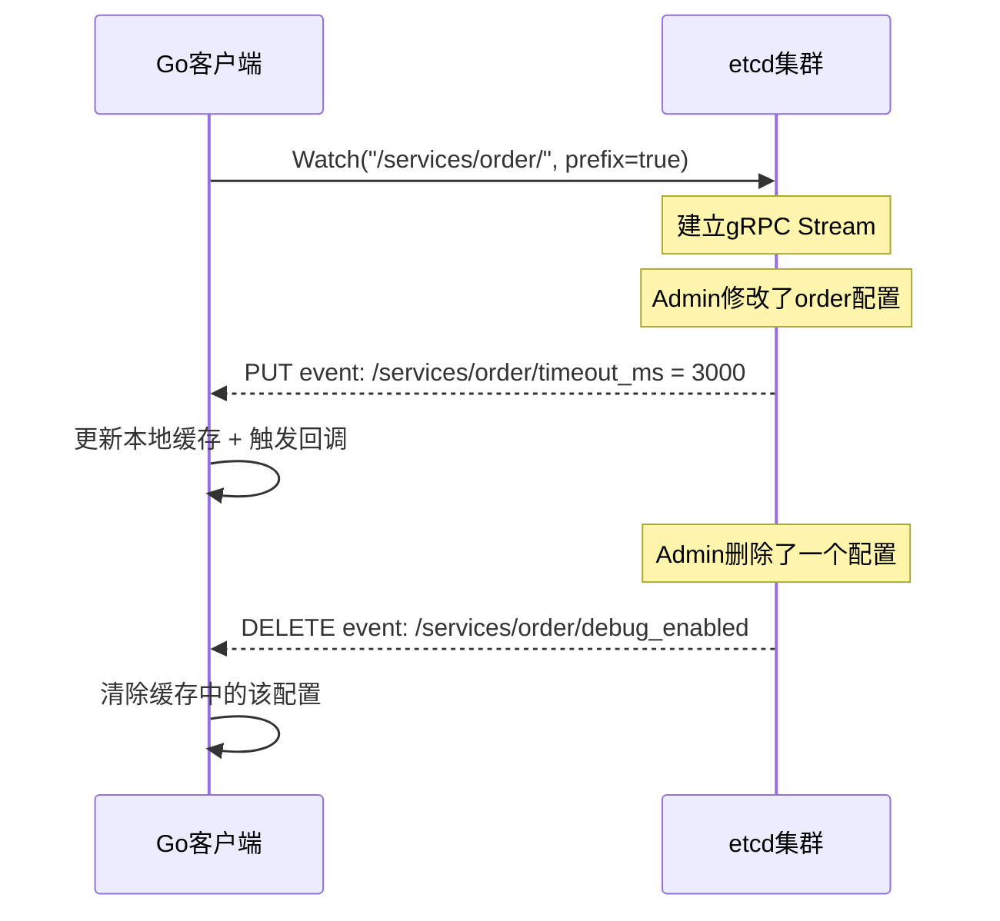

# 配置中心实战案例

理论基础和核心技巧分别回答了"为什么"和"怎么做"，实战案例则回答"做出来是什么样"。本节通过八个完整的工程实战案例，覆盖 Apollo、Nacos、Spring Cloud Config、etcd、Consul KV、Kubernetes ConfigMap、Istio Service Mesh 和 GitOps 八大配置管理方案——每个案例都包含环境搭建、核心集成代码、关键配置、生产级最佳实践和踩坑记录，帮助读者将理论知识转化为可直接投产的工程能力。

---

## 一、案例一：Apollo 配置中心完整集成

### 1.1 案例场景

某电商平台的日订单量从 10 万增长到 500 万，服务数量从 15 个膨胀到 200+ 个。配置管理面临以下困境：

- 200 个服务 × 8 个环境 = 1600 套配置文件，人工维护频繁出错
- 数据库连接池参数调整需要重新发布，一次变更耗时 2-4 小时
- 没有灰度机制，配置变更导致了 3 次线上事故（支付超时、库存扣减异常、短信签名错误）
- 敏感配置（数据库密码、API 密钥）以明文散落在代码仓库中

选型结论：需要一个支持灰度发布、版本管理、权限控制的专业配置中心，Apollo 是最佳选择。

### 1.2 环境搭建

**Docker Compose 一键部署 Apollo：**

```yaml
# docker-compose-apollo.yml
version: '3.8'
services:
  # MySQL - Apollo的元数据库
  apollo-mysql:
    image: mysql:8.0
    environment:
      MYSQL_ROOT_PASSWORD: root123
      MYSQL_DATABASE: ApolloConfigDB
      MYSQL_DATABASE2: ApolloPortalDB
    ports:
      - "3306:3306"
    volumes:
      - ./sql/apollo-configdb.sql:/docker-entrypoint-initdb.d/01-config.sql
      - ./sql/apollo-portaldb.sql:/docker-entrypoint-initdb.d/02-portal.sql
    command: --character-set-server=utf8mb4 --collation-server=utf8mb4_unicode_ci

  # Config Service - 配置读取与推送
  apollo-configservice:
    image: apolloconfig/apollo-configservice:2.2.0
    ports:
      - "8080:8080"
    environment:
      DATASOURCE_URL: jdbc:mysql://apollo-mysql:3306/ApolloConfigDB?characterEncoding=utf8
      DATASOURCE_USERNAME: root
      DATASOURCE_PASSWORD: root123
    depends_on:
      - apollo-mysql
    restart: always

  # Admin Service - 配置变更管理
  apollo-adminservice:
    image: apolloconfig/apollo-adminservice:2.2.0
    ports:
      - "8090:8090"
    environment:
      DATASOURCE_URL: jdbc:mysql://apollo-mysql:3306/ApolloConfigDB?characterEncoding=utf8
      DATASOURCE_USERNAME: root
      DATASOURCE_PASSWORD: root123
    depends_on:
      - apollo-mysql
    restart: always

  # Portal - Web管理界面
  apollo-portal:
    image: apolloconfig/apollo-portal:2.2.0
    ports:
      - "8070:8070"
    environment:
      DATASOURCE_URL: jdbc:mysql://apollo-mysql:3306/ApolloPortalDB?characterEncoding=utf8
      DATASOURCE_USERNAME: root
      DATASOURCE_PASSWORD: root123
      APOLLO_PORTAL_ENVITIES: dev=http://apollo-configservice:8080,pro=http://apollo-configservice:8080
    depends_on:
      - apollo-configservice
      - apollo-adminservice
    restart: always
```

**初始化数据库：** Apollo 需要两个数据库——`ApolloConfigDB`（配置数据）和 `ApolloPortalDB`（用户权限数据）。初始化 SQL 从 [Apollo GitHub 仓库](https://github.com/ctripcorp/apollo) 的 `scripts/sql` 目录获取。

**环境验证：** 启动后访问 `http://localhost:8070`，默认账号 `apollo/admin`，能正常登录即表示搭建成功。

### 1.3 Spring Boot 应用集成

**第一步：添加 Maven 依赖**

```xml
<dependency>
    <groupId>com.ctrip.framework.apollo</groupId>
    <artifactId>apollo-client</artifactId>
    <version>2.2.0</version>
</dependency>
```

**第二步：配置 application.yml**

```yaml
app:
  id: order-service                    # 应用ID，对应Apollo中的AppId
apollo:
  bootstrap:
    enabled: true                      # 启用Apollo配置
    eagerLoad:
      enabled: true                    # 优先加载（在Spring初始化之前）
  meta: http://localhost:8080          # Config Service地址
  cacheDir: /tmp/apollo-cache          # 本地缓存目录
```

**第三步：使用配置值**

```java
@Service
public class OrderService {

    // 方式一：@Value 注入，支持动态刷新
    @Value("${order.timeout.ms:5000}")
    private int orderTimeout;

    // 方式二：@ApolloConfig 注入整个Namespace
    @ApolloConfig("application")
    private Config config;

    // 方式三：从Config对象动态读取
    public int getMaxRetryCount() {
        return config.getIntProperty("order.retry.max", 3);
    }
}
```

**第四步：监听配置变更**

```java
@Component
public class ConfigChangeWatcher {

    private static final Logger log = LoggerFactory.getLogger(ConfigChangeWatcher.class);

    /**
     * 监听指定Key的变化
     */
    @PostConstruct
    public void init() {
        // 监听支付超时参数的变化
        ConfigChange change = ConfigService.getAppConfig()
            .getConfigChange("order.timeout.ms");

        // 监听整个Namespace的变化
        ConfigService.getAppConfig().addChangeListener(
            changeEvent -> {
                log.info("===== 配置变更通知 =====");
                for (String key : changeEvent.changedKeys()) {
                    ConfigChange c = changeEvent.getChange(key);
                    log.info("Key: {}, 旧值: {}, 新值: {}, 变更类型: {}",
                        key, c.getOldValue(), c.getNewValue(), c.getChangeType());
                }
            }
        );
    }
}
```

### 1.4 灰度发布实战

灰度发布是 Apollo 最核心的差异化能力。以下是一次完整的灰度发布流程：

```java
/**
 * 灰度发布操作示例（通过Apollo OpenAPI）
 * 场景：将order.timeout.ms从5000ms改为3000ms，先灰度2台机器
 */
@Component
public class GrayReleaseDemo {

    @Autowired
    private ApolloAdminServiceClient adminClient;

    public void performGrayRelease() {
        // 第一步：提交配置变更（不发布，仅保存）
        // 创建一个发布项，指定灰度规则
        GrayReleaseRule rule = GrayReleaseRule.builder()
            .appId("order-service")
            .clusterName("default")
            .namespaceName("application")
            .grayRules(Map.of(
                "order.timeout.ms", GrayRule.builder()
                    .type(GrayRuleType.IP)
                    .targetInstances(List.of("10.0.1.5", "10.0.2.8"))
                    .newValue("3000")
                    .build()
            ))
            .build();

        // 第二步：推送灰度配置
        adminClient.createGrayReleaseRule(rule);

        // 第三步：灰度实例验证（观察监控指标）
        // 灰度实例的order.timeout.ms = 3000ms
        // 非灰度实例的order.timeout.ms = 5000ms（不变）

        // 第四步：验证通过后全量发布
        adminClient.publishGrayRelease("order-service", "application");
    }
}
```

**灰度发布检查清单：**

| 检查项 | 操作方法 | 通过标准 |
|--------|---------|---------|
| 灰度实例配置生效 | 登录灰度实例，检查/actuator/configprops | 新配置值已生效 |
| 非灰度实例不受影响 | 检查非灰度实例配置 | 仍使用旧值 |
| 业务指标正常 | 对比灰度实例与非灰度实例的错误率 | 无显著差异 |
| 延迟指标正常 | 对比P99延迟 | 延迟无明显增长 |
| 无兼容性问题 | 检查灰度实例与非灰度实例的接口调用 | 调用成功率100% |

### 1.5 生产部署要点

**高可用部署架构：**

                    ┌─────────────┐
                    │  Nginx/LB   │
                    └──────┬──────┘
              ┌────────────┼────────────┐
              ▼            ▼            ▼
     ┌─────────────┐ ┌─────────────┐ ┌─────────────┐
     │Config Svc 1 │ │Config Svc 2 │ │Config Svc 3 │
     └──────┬──────┘ └──────┬──────┘ └──────┬──────┘
            │               │               │
            └───────────────┼───────────────┘
                            ▼
                    ┌──────────────┐
                    │  MySQL (主从) │
                    └──────────────┘

- Config Service 至少部署 3 个实例，通过负载均衡对外服务
- MySQL 部署主从架构，Config Service 配置多数据源
- 客户端 SDK 本地缓存确保 Config Service 全部不可用时仍能正常工作

**性能调优参数：**

```properties
# Config Service JVM参数
-Xms4g -Xmx4g
-XX:+UseG1GC
-XX:MaxGCPauseMillis=200

# 长轮询超时时间（秒），默认60秒
apollo.long_polling_timeout=60

# 客户端本地缓存刷新间隔（毫秒）
apollo.cache.refresh.interval=60000
```

### 1.6 踩坑记录

| 坑点 | 现象 | 根因 | 解决方案 |
|------|------|------|---------|
| 客户端启动失败 | 应用启动时报连接ConfigService超时 | ConfigService未启动完成，客户端就尝试连接 | 开启本地缓存降级：`apollo.bootstrap.eagerLoad.enabled=false` |
| 配置不生效 | @Value注入的值没有更新 | Spring Bean已初始化，不会重新注入 | 改用`@ApolloConfig`+Listener，或使用`@RefreshScope` |
| 长轮询超时告警 | Nginx频繁返回504 | Nginx默认60s超时与长轮询60s冲突 | 将Nginx超时设为120s：`proxy_read_timeout 120s` |
| 灰度配置泄露 | 全量实例都收到了新配置 | 灰度规则配置错误，匹配范围过大 | 灰度前仔细验证IP列表，使用预发布环境验证 |

---

## 二、案例二：Nacos 配置中心实战

### 2.1 案例场景

某互联网公司的微服务架构同时需要注册中心和配置中心。团队评估了 Apollo 和 Nacos：

- Apollo 是独立的配置中心，注册中心需要额外引入 Eureka 或 Consul
- Nacos 1.x 同时提供注册中心和配置中心能力，运维成本更低
- Nacos 2.0 引入 gRPC 长连接，配置推送性能大幅提升
- 团队已有部分 Go/Python 服务，Nacos 的多语言 SDK 支持更好

最终选型 Nacos，一套基础设施同时解决服务发现和配置管理两个问题。

### 2.2 环境搭建

**Docker Compose 部署 Nacos 2.x：**

```yaml
# docker-compose-nacos.yml
version: '3.8'
services:
  nacos-mysql:
    image: mysql:8.0
    environment:
      MYSQL_ROOT_PASSWORD: root123
      MYSQL_DATABASE: nacos_config
    volumes:
      - ./conf/nacos-mysql.sql:/docker-entrypoint-initdb.d/init.sql
    command: --default-authentication-plugin=mysql_native_password

  nacos:
    image: nacos/nacos-server:v2.3.2
    environment:
      MODE: standalone                          # 单机模式（生产用cluster）
      SPRING_DATASOURCE_PLATFORM: mysql
      MYSQL_SERVICE_HOST: nacos-mysql
      MYSQL_SERVICE_PORT: 3306
      MYSQL_SERVICE_USER: root
      MYSQL_SERVICE_PASSWORD: root123
      MYSQL_SERVICE_DB_NAME: nacos_config
      JVM_XMS: 2g                              # JVM堆内存
      JVM_XMX: 2g
    ports:
      - "8848:8848"                             # 主端口（HTTP API）
      - "9848:9848"                             # gRPC端口（客户端通信）
      - "9849:9849"                             # gRPC端口（集群通信）
    depends_on:
      - nacos-mysql
    restart: always
```

**集群部署（生产环境）：**

```yaml
# docker-compose-nacos-cluster.yml（3节点集群）
version: '3.8'
services:
  nacos1:
    image: nacos/nacos-server:v2.3.2
    environment:
      MODE: cluster
      NACOS_SERVERS: "nacos1:8848 nacos2:8848 nacos3:8848"
      SPRING_DATASOURCE_PLATFORM: mysql
      MYSQL_SERVICE_HOST: nacos-mysql
      MYSQL_SERVICE_DB_NAME: nacos_config
    ports:
      - "8848:8848"
      - "9848:9848"

  nacos2:
    image: nacos/nacos-server:v2.3.2
    environment:
      MODE: cluster
      NACOS_SERVERS: "nacos1:8848 nacos2:8848 nacos3:8848"
      SPRING_DATASOURCE_PLATFORM: mysql
      MYSQL_SERVICE_HOST: nacos-mysql
      MYSQL_SERVICE_DB_NAME: nacos_config
    ports:
      - "8849:8848"

  nacos3:
    image: nacos/nacos-server:v2.3.2
    environment:
      MODE: cluster
      NACOS_SERVERS: "nacos1:8848 nacos2:8848 nacos3:8848"
      SPRING_DATASOURCE_PLATFORM: mysql
      MYSQL_SERVICE_HOST: nacos-mysql
      MYSQL_SERVICE_DB_NAME: nacos_config
    ports:
      - "8850:8848"
```

### 2.3 Spring Boot 应用集成

```xml
<!-- pom.xml -->
<dependency>
    <groupId>com.alibaba.cloud</groupId>
    <artifactId>spring-cloud-starter-alibaba-nacos-config</artifactId>
    <version>2023.0.1.0</version>
</dependency>
<dependency>
    <groupId>com.alibaba.cloud</groupId>
    <artifactId>spring-cloud-starter-alibaba-nacos-discovery</artifactId>
    <version>2023.0.1.0</version>
</dependency>
```

```yaml
# bootstrap.yml
spring:
  application:
    name: order-service
  profiles:
    active: dev
  cloud:
    nacos:
      server-addr: localhost:8848
      config:
        file-extension: yaml                      # 配置格式
        group: DEFAULT_GROUP                      # 分组
        namespace: dev                            # 命名空间（对应环境）
        shared-configs:                           # 共享配置
          - data-id: common-datasource.yaml
            group: SHARED_GROUP
            refresh: true
      discovery:
        namespace: dev
```

**配置内容示例（Nacos 控制台创建）：**

```yaml
# data-id: order-service.yaml, group: DEFAULT_GROUP, namespace: dev
server:
  port: 8080

order:
  timeout:
    ms: 5000
  retry:
    max: 3

spring:
  datasource:
    url: jdbc:mysql://dev-db:3306/order_dev
    username: dev_user
    password: ${DB_PASSWORD:dev123}
```

**动态配置刷新：**

```java
@RestController
@RefreshScope   // 关键注解：配置变更时自动刷新Bean
public class OrderController {

    @Value("${order.timeout.ms:5000}")
    private int timeout;

    @Value("${order.retry.max:3}")
    private int maxRetry;

    @GetMapping("/config")
    public Map<String, Object> getConfig() {
        return Map.of(
            "timeout", timeout,
            "maxRetry", maxRetry
        );
    }
}
```

### 2.4 Namespace 多环境隔离

Nacos 通过 Namespace 实现环境隔离，不同 Namespace 的配置和实例完全不可见：

Nacos 控制台
├── Namespace: dev（开发环境，ID: dev-id）
│   ├── Group: DEFAULT_GROUP
│   │   ├── order-service.yaml
│   │   └── user-service.yaml
│   └── Group: PAYMENT_GROUP
│       └── payment-service.yaml
├── Namespace: sit（测试环境，ID: sit-id）
│   ├── Group: DEFAULT_GROUP
│   │   ├── order-service.yaml
│   │   └── user-service.yaml
│   └── Group: PAYMENT_GROUP
│       └── payment-service.yaml
└── Namespace: prod（生产环境，ID: prod-id）
    ├── Group: DEFAULT_GROUP
    │   ├── order-service.yaml
    │   └── user-service.yaml
    └── Group: PAYMENT_GROUP
        └── payment-service.yaml

**API 管理 Namespace：**

```bash
# 创建命名空间
curl -X POST 'http://localhost:8848/nacos/v1/console/namespaces' \
  -d 'customNamespaceId=dev&amp;namespaceName=开发环境&amp;namespaceDesc=Development'

# 列出所有命名空间
curl -X GET 'http://localhost:8848/nacos/v1/console/namespaces'

# 发布配置到指定Namespace
curl -X POST 'http://localhost:8848/nacos/v1/cs/configs' \
  -d 'dataId=order-service.yaml&amp;group=DEFAULT_GROUP&amp;tenant=dev&amp;content=server.port:8080'
```

### 2.5 Nacos 2.0 gRPC 推送实战

Nacos 2.0 最大的改进是用 gRPC 长连接替代了 HTTP 长轮询。客户端连接建立后，服务端通过 gRPC 流直接推送配置变更，无需客户端反复轮询。

**gRPC 推送 vs HTTP 长轮询对比：**

| 指标 | HTTP长轮询（Nacos 1.x） | gRPC长连接（Nacos 2.0+） |
|------|------------------------|-------------------------|
| 推送延迟 | 1-60秒（取决于变更时机） | 毫秒级 |
| 网络开销 | 每次轮询一个HTTP请求 | 建立后零开销 |
| 服务端线程占用 | 每个连接占用一个Tomcat线程 | gRPC异步，线程占用极低 |
| 连接数 | 10万客户端 = 10万HTTP连接 | 10万客户端 = 10万 gRPC流 |
| 断线重连 | 即时（下次请求自动重连） | 即时（gRPC自动重连） |

**Java 客户端使用 gRPC 推送（Nacos 2.x SDK 自动切换）：**

```java
// Nacos 2.x 客户端自动使用gRPC，无需额外配置
ConfigService configService = NacosFactory.createConfigService("localhost:8848");
String config = configService.getConfig("order-service.yaml", "DEFAULT_GROUP", 3000);

// 监听配置变更（通过gRPC推送）
configService.addListener("order-service.yaml", "DEFAULT_GROUP", new Listener() {
    @Override
    public Executor getExecutor() {
        return null;  // 使用默认线程池
    }

    @Override
    public void receiveConfigInfo(String configInfo) {
        // gRPC推送触发，延迟在毫秒级
        log.info("配置变更: {}", configInfo);
        // 解析并应用新配置
    }
});
```

### 2.6 踩坑记录

| 坑点 | 现象 | 根因 | 解决方案 |
|------|------|------|---------|
| gRPC端口未暴露 | 客户端连接失败 | Docker只映射了8848端口 | 必须同时映射9848端口（gRPC） |
| 配置格式错误 | 发布后客户端获取空配置 | YAML格式错误导致解析失败 | 发布前在控制台验证格式 |
| 集群脑裂 | 集群中出现两个Leader | 网络分区导致Raft超时 | 确保集群节点间网络延迟<10ms |
| Namespace ID混淆 | 客户端连到了错误的环境 | 用了namespaceName而非namespaceId | 客户端必须用namespaceId（UUID格式） |

---

## 三、案例三：Spring Cloud Config 集成

### 3.1 案例场景

一家创业公司的微服务架构比较简单——只有 12 个服务，运行在 3 个环境（DEV、STAGING、PROD）。团队的技术栈是 Spring Boot + GitHub。选型考虑：

- 团队规模小（5人），没有专职运维，不想维护 Apollo/Nacos 的复杂基础设施
- 已经在使用 GitHub 管理代码，Git 工作流（PR + Review）天然支持配置变更的审批
- 不需要灰度发布——服务数量少，配置变更频率低

Spring Cloud Config 是最轻量的选择：Config Server 是一个标准的 Spring Boot 应用，配置存储在 Git 仓库中，客户端通过 HTTP 拉取配置。

### 3.2 Config Server 搭建

```java
// ConfigServerApplication.java
@SpringBootApplication
@EnableConfigServer
public class ConfigServerApplication {
    public static void main(String[] args) {
        SpringApplication.run(ConfigServerApplication.class, args);
    }
}
```

```yaml
# application.yml（Config Server）
server:
  port: 8888

spring:
  cloud:
    config:
      server:
        git:
          uri: https://github.com/your-org/config-repo.git    # 配置Git仓库
          default-label: main                                    # 默认分支
          search-paths:                                          # 搜索路径
            - '{application}'                                    # 按应用名查找
            - '{application}/{profile}'                          # 按环境查找
          clone-on-start: true                                   # 启动时克隆仓库
          refresh-rate: 300                                      # 每5分钟刷新一次Git仓库
        # 备用：当Git不可用时使用本地文件
        encrypt:
          enabled: true                                          # 启用配置加密
```

**Git 仓库结构：**

config-repo/
├── order-service/
│   ├── order-service.yml              # 所有环境共享的默认配置
│   ├── order-service-dev.yml          # 开发环境覆盖
│   ├── order-service-staging.yml      # 测试环境覆盖
│   └── order-service-prod.yml         # 生产环境覆盖
├── user-service/
│   ├── user-service.yml
│   ├── user-service-dev.yml
│   ├── user-service-staging.yml
│   └── user-service-prod.yml
└── shared/
    ├── common-datasource.yml          # 共享数据源配置
    └── common-logging.yml             # 共享日志配置

**配置文件内容示例：**

```yaml
# order-service/order-service.yml（默认配置）
order:
  timeout:
    ms: 5000
  retry:
    max: 3
  circuit-breaker:
    enabled: true

# order-service/order-service-prod.yml（生产覆盖）
order:
  timeout:
    ms: 3000
  retry:
    max: 5
```

### 3.3 客户端集成

```xml
<dependency>
    <groupId>org.springframework.cloud</groupId>
    <artifactId>spring-cloud-starter-config</artifactId>
</dependency>
<dependency>
    <groupId>org.springframework.boot</groupId>
    <artifactId>spring-boot-starter-actuator</artifactId>   # 提供/refresh端点
</dependency>
```

```yaml
# bootstrap.yml（客户端）
spring:
  application:
    name: order-service
  profiles:
    active: dev
  cloud:
    config:
      uri: http://localhost:8888                              # Config Server地址
      fail-fast: false                                        # 连接失败不阻止启动
      retry:
        max-attempts: 5                                       # 重试次数
        initial-interval: 1000                                # 初始重试间隔
        multiplier: 1.5                                       # 退避倍率
      # 配置仓库中的共享配置
      shared-configs:
        - name: common-datasource
          profile: default
          label: main
```

**配置刷新机制：**

```java
@RestController
@RefreshScope
public class OrderController {

    @Value("${order.timeout.ms:5000}")
    private int timeout;

    @GetMapping("/order/config")
    public Map<String, Object> config() {
        return Map.of("timeout", timeout);
    }
}
```

```bash
# 手动触发配置刷新
curl -X POST http://localhost:8080/actuator/refresh

# Spring Cloud Bus 自动刷新（推送到所有实例）
# 1. 添加 spring-cloud-starter-bus-amqp 依赖
# 2. Git Webhook 配置：代码变更 → POST /actuator/bus-refresh
# 3. Config Server 收到刷新请求 → 通知所有客户端实例
```

### 3.4 Spring Cloud Bus 自动刷新架构

手动调用 `/actuator/refresh` 只刷新单个实例。通过 Spring Cloud Bus（基于 RabbitMQ/Kafka），可以实现 Git 变更后自动刷新所有实例：

Git Push → Webhook → Config Server /actuator/bus-refresh
                          │
                    ┌─────▼─────┐
                    │ RabbitMQ  │
                    └─────┬─────┘
              ┌───────────┼───────────┐
              ▼           ▼           ▼
         Order-Svc 1  Order-Svc 2  Order-Svc 3
         (刷新配置)    (刷新配置)    (刷新配置)

```yaml
# Config Server 和客户端都需要配置
spring:
  rabbitmq:
    host: localhost
    port: 5672
    username: guest
    password: guest
```

### 3.5 Spring Cloud Config 的局限性

| 局限 | 描述 | 缓解方案 |
|------|------|---------|
| 无灰度发布 | 变更直接全量生效 | 通过CI/CD分批部署 |
| 刷新延迟 | 需要调用/refresh或等Bus通知 | 结合Spring Cloud Bus自动触发 |
| Git依赖 | Git不可用时Config Server无法更新缓存 | clone-on-start克隆到本地 |
| 性能瓶颈 | 每次请求都要读Git文件系统 | 本地文件缓存 + 定期刷新 |
| 无权限控制 | 没有细粒度的角色权限 | 通过Git仓库权限 + Config Server前置网关鉴权 |

---

## 四、案例四：etcd 配置中心实战

### 4.1 案例场景

一个 Kubernetes 原生的技术团队，核心服务用 Go 编写，基础设施大量使用 etcd（K8s 的底层存储就是 etcd）。选型考虑：

- 已经有 etcd 集群（3节点或5节点），不需要额外部署基础设施
- Go 服务需要一个轻量级配置方案，etcd 的官方 Go 客户端非常成熟
- 需要强一致性保证——某些关键配置（限流阈值、熔断参数）必须实时一致
- 不需要灰度发布、Web管理界面等高级功能

etcd 作为配置存储的优势：强一致性（Raft 协议）、原生 Watch 机制、与 K8s 生态天然融合。

### 4.2 etcd 集群搭建

```bash
# 安装 etcd（v3.5.x）
ETCD_VER=v3.5.17
curl -L https://github.com/etcd-io/etcd/releases/download/${ETCD_VER}/etcd-${ETCD_VER}-linux-amd64.tar.gz -o etcd.tar.gz
tar xzf etcd.tar.gz &amp;&amp; cd etcd-${ETCD_VER}-linux-amd64

# 三节点集群启动脚本
# node1 (192.168.1.11)
etcd \
  --name node1 \
  --listen-client-urls http://192.168.1.11:2379 \
  --advertise-client-urls http://192.168.1.11:2379 \
  --listen-peer-urls http://192.168.1.11:2380 \
  --initial-advertise-peer-urls http://192.168.1.11:2380 \
  --initial-cluster node1=http://192.168.1.11:2380,node2=http://192.168.1.12:2380,node3=http://192.168.1.13:2380 \
  --initial-cluster-state new
```

### 4.3 Go 应用集成

```go
package config

import (
    "context"
    "encoding/json"
    "log"
    "sync"
    "time"

    clientv3 "go.etcd.io/etcd/client/v3"
)

// EtcdConfigClient 基于etcd的配置客户端
type EtcdConfigClient struct {
    client  *clientv3.Client
    cache   sync.Map  // 配置本地缓存
    watchers sync.Map // Watch取消函数
}

// NewClient 创建etcd配置客户端
func NewClient(endpoints []string) (*EtcdConfigClient, error) {
    client, err := clientv3.New(clientv3.Config{
        Endpoints:   endpoints,
        DialTimeout: 5 * time.Second,
    })
    if err != nil {
        return nil, err
    }

    return &amp;EtcdConfigClient{client: client}, nil
}

// Get 获取配置值
func (c *EtcdConfigClient) Get(ctx context.Context, key string) (string, error) {
    // 先检查本地缓存
    if val, ok := c.cache.Load(key); ok {
        return val.(string), nil
    }

    // 从etcd读取
    resp, err := c.client.Get(ctx, key)
    if err != nil {
        return "", err
    }

    if len(resp.Kvs) == 0 {
        return "", nil
    }

    value := string(resp.Kvs[0].Value)
    c.cache.Store(key, value)
    return value, nil
}

// Watch 监听配置变更（基于etcd Watch机制）
func (c *EtcdConfigClient) Watch(ctx context.Context, key string, callback func(string, string)) {
    watchCh := c.client.Watch(ctx, key)

    go func() {
        for resp := range watchCh {
            for _, ev := range resp.Events {
                oldValue := ""
                if ev.Type == clientv3.EventTypeModify {
                    oldValue = string(ev.PrevKv.Value)
                }
                newValue := string(ev.Kv.Value)

                // 更新本地缓存
                c.cache.Store(key, newValue)

                // 触发回调
                go callback(oldValue, newValue)
            }
        }
    }()
}

// Put 设置配置值
func (c *EtcdConfigClient) Put(ctx context.Context, key, value string) error {
    _, err := c.client.Put(ctx, key, value)
    return err
}
```

**使用示例：**

```go
func main() {
    client, _ := config.NewClient([]string{
        "192.168.1.11:2379",
        "192.168.1.12:2379",
        "192.168.1.13:2379",
    })
    defer client.Close()

    ctx := context.Background()

    // 读取配置
    timeout, _ := client.Get(ctx, "/services/order/timeout_ms")
    log.Printf("订单超时: %s ms", timeout)

    // 监听配置变更
    client.Watch(ctx, "/services/order/timeout_ms",
        func(oldVal, newVal string) {
            log.Printf("配置变更: %s → %s", oldVal, newVal)
            // 动态更新业务参数
            updateOrderTimeout(newVal)
        })

    // 设置配置
    client.Put(ctx, "/services/order/timeout_ms", "3000")

    // 阻塞，保持watch运行
    select {}
}
```

### 4.4 etcd 配置组织结构

/services/                         # 服务配置根路径
├── order-service/                 # 订单服务
│   ├── config.yaml               # 主配置
│   ├── timeout_ms = 5000         # 单独的配置项（KV模式）
│   ├── retry_max = 3
│   └── circuit-breaker/
│       ├── enabled = true
│       ├── threshold = 5
│       └── timeout = 10000
├── user-service/
│   ├── config.yaml
│   └── cache/
│       ├── ttl = 3600
│       └── max_size = 10000
/shared/                            # 共享配置
├── database/
│   ├── host = prod-db.internal
│   ├── port = 3306
│   └── pool_size = 100
└── redis/
    ├── host = prod-redis.internal
    └── port = 6379

### 4.5 etcd Watch 机制原理

etcd 的 Watch 是实现配置推送的核心。客户端通过 gRPC 流式请求订阅一个或多个 Key（支持前缀匹配），当这些 Key 发生变更时，etcd 服务端通过 gRPC 流实时推送事件：



**etcd Watch 的优势：**
- 基于 gRPC 双向流，真正的实时推送，延迟在毫秒级
- 支持前缀匹配（`/services/order/`），一次 Watch 覆盖多个 Key
- 自动重连——etcd 客户端 SDK 内置了断线重连和 Watch 重建逻辑
- 事件有 Revision——客户端可以从特定 Revision 开始 Watch，不会遗漏事件

---

## 五、案例五：Consul KV 配置管理

### 5.1 案例场景

一家使用 HashiCorp 全家桶（Consul + Vault + Terraform + Nomad）的技术团队。选型考虑：

- 已有 Consul 集群用于服务发现，复用 Consul KV 存储配置不需要额外部署
- 需要与 Vault 集成——敏感配置存储在 Vault 中，Consul KV 存储非敏感配置
- 多数据中心（北京、上海、新加坡）需要跨数据中心的配置同步
- 多语言技术栈（Go、Java、Python），Consul 的 HTTP API 天然支持

### 5.2 环境搭建

```bash
# Docker 启动 Consul（开发模式，生产需集群模式）
docker run -d --name consul \
  -p 8500:8500 \
  -p 8600:8600/udp \
  consul:1.18 agent -dev -client=0.0.0.0

# 验证
curl http://localhost:8500/v1/status/leader
```

### 5.3 KV 存储操作

```bash
# 写入配置
curl -X PUT -d '{
  "database": {
    "host": "prod-db.internal",
    "port": 3306,
    "pool_size": 100
  },
  "redis": {
    "host": "prod-redis.internal",
    "port": 6379
  }
}' http://localhost:8500/v1/kv/services/order-service/config

# 写入单个配置项
curl -X PUT -d '5000' http://localhost:8500/v1/kv/services/order-service/timeout_ms

# 读取配置
curl http://localhost:8500/v1/kv/services/order-service/config?raw

# 列出所有配置（递归）
curl http://localhost:8500/v1/kv/services/?recurse?raw

# 使用Tree格式查看配置目录
curl http://localhost:8500/v1/kv/services/order-service/?keys

# 删除配置
curl -X DELETE http://localhost:8500/v1/kv/services/order-service/old_config
```

### 5.4 Watch 机制实现

Consul 通过 HTTP Blocking Query 实现 Watch——客户端发送带 `index` 参数的请求，服务端 hold 住请求直到该 index 之后有变更：

```python
"""Consul Watch 配置监听客户端"""
import requests
import json
import time
import threading


class ConsulConfigWatcher:
    """基于Consul HTTP Blocking Query的配置监听"""

    def __init__(self, consul_url="http://localhost:8500", token=None):
        self.consul_url = consul_url
        self.token = token
        self.current_index = 0
        self._callbacks = {}

    def watch_key(self, key, callback):
        """监听单个Key的变更"""
        self._callbacks[key] = callback
        thread = threading.Thread(
            target=self._watch_loop, args=(key,), daemon=True
        )
        thread.start()

    def _watch_loop(self, key):
        """Blocking Query循环"""
        while True:
            try:
                params = {
                    "index": self.current_index,
                    "wait": "5m"  # 最长等待5分钟
                }
                headers = {}
                if self.token:
                    headers["X-Consul-Token"] = self.token

                resp = requests.get(
                    f"{self.consul_url}/v1/kv/{key}",
                    params=params,
                    headers=headers,
                    timeout=310  # 略大于wait
                )

                if resp.status_code == 200:
                    data = resp.json()
                    if data:
                        new_index = data[0]["ModifyIndex"]
                        if new_index > self.current_index:
                            self.current_index = new_index
                            value = data[0]["Value"]
                            import base64
                            decoded = base64.b64decode(value).decode()
                            callback = self._callbacks.get(key)
                            if callback:
                                callback(decoded)

            except requests.RequestException as e:
                print(f"Consul连接失败: {e}, 5秒后重试")
                time.sleep(5)


# 使用示例
def on_config_changed(new_value):
    config = json.loads(new_value)
    print(f"配置已更新: {config}")
    # 动态更新业务参数

watcher = ConsulConfigWatcher()
watcher.watch_key("services/order-service/config", on_config_changed)
```

### 5.5 Consul 与 Vault 集成

对于敏感配置（数据库密码、API 密钥），Consul KV 与 HashiCorp Vault 配合使用：

┌────────────────────────────────────────────┐
│              配置分层存储                    │
├────────────────────┬───────────────────────┤
│   Consul KV        │   Vault               │
│   （非敏感配置）     │   （敏感配置）          │
├────────────────────┼───────────────────────┤
│ - 业务参数          │ - 数据库密码           │
│ - 功能开关          │ - API 密钥            │
│ - 服务端口          │ - TLS 证书            │
│ - 日志级别          │ - OAuth Token         │
└────────────────────┴───────────────────────┘

```bash
# Vault中存储敏感配置
vault kv put secret/services/order-service/db \
  username=app_user \
  password="SuperSecret123!"

# Consul中存储非敏感配置（应用启动时从Vault获取密码）
curl -X PUT -d '{
  "database": {
    "host": "prod-db.internal",
    "port": 3306,
    "vault_path": "secret/services/order-service/db"
  }
}' http://localhost:8500/v1/kv/services/order-service/config
```

### 5.6 多数据中心配置同步

Consul 原生支持多数据中心。通过 Consul WAN Gossip 协议，不同数据中心的 Consul 集群可以同步 KV 数据：

```bash
# 跨数据中心读取配置
curl http://beijing.consul.internal:8500/v1/kv/services/order-service/config?dc=shanghai

# 使用 consul-replicate 工具同步KV数据
consul-replicate -prefix "services/" -dc "shanghai" \
  -upstream "beijing.consul.internal:8500" \
  -token="your-acl-token"
```

---

## 六、案例六：Kubernetes ConfigMap/Secrets

### 6.1 案例场景

一个全面拥抱 Kubernetes 的团队，所有服务以容器化方式运行在 K8s 集群中。选型考虑：

- 服务数量 50 个，运行在 3 个 K8s 集群中（开发、预发布、生产）
- 配置变更不需要实时推送——重新部署 Pod 即可应用新配置
- 需要利用 K8s 原生的 RBAC 和 Namespace 隔离能力
- 不需要灰度发布——通过滚动更新实现渐进式变更

K8s ConfigMap/Secrets 是最轻量的配置管理方案，零额外基础设施成本。

### 6.2 ConfigMap 实战

**创建 ConfigMap：**

```bash
# 方式一：从字面量创建
kubectl create configmap order-service-config \
  --from-literal=timeout.ms=5000 \
  --from-literal=retry.max=3 \
  --from-literal=log.level=INFO \
  -n production

# 方式二：从文件创建
kubectl create configmap order-service-config \
  --from-file=config.yaml \
  --from-file=logback.xml \
  -n production

# 方式三：YAML声明式创建
```

```yaml
# configmap.yaml
apiVersion: v1
kind: ConfigMap
metadata:
  name: order-service-config
  namespace: production
  labels:
    app: order-service
    env: production
data:
  # 简单的Key-Value
  timeout.ms: "5000"
  retry.max: "3"
  log.level: "INFO"

  # 完整的配置文件
  application.yaml: |
    server:
      port: 8080
    order:
      timeout:
        ms: 5000
      retry:
        max: 3
      circuit-breaker:
        enabled: true
        threshold: 5

  logback.xml: |
    <configuration>
      <appender name="STDOUT" class="ch.qos.logback.core.ConsoleAppender">
        <encoder>
          <pattern>%d{HH:mm:ss.SSS} [%thread] %-5level %logger{36} - %msg%n</pattern>
        </encoder>
      </appender>
      <root level="INFO">
        <appender-ref ref="STDOUT"/>
      </root>
    </configuration>
```

### 6.3 Secrets 实战

```bash
# 创建Secret（敏感配置）
kubectl create secret generic order-service-secrets \
  --from-literal=database.password='ProdSecure123!' \
  --from-literal=api.key='sk-abcdef1234567890' \
  --from-literal=jwt.secret='my-jwt-signing-key' \
  -n production
```

```yaml
# secret.yaml（注意：data字段是base64编码的值）
apiVersion: v1
kind: Secret
metadata:
  name: order-service-secrets
  namespace: production
type: Opaque
data:
  database.password: UHJvZFNlY3VyZTEyMyE=    # base64(ProdSecure123!)
  api.key: c2stYWJjZGVmZzEyMzQ1Njc4OTA=      # base64(sk-abcdef1234567890)
```

### 6.4 在 Pod 中挂载配置

```yaml
# deployment.yaml
apiVersion: apps/v1
kind: Deployment
metadata:
  name: order-service
  namespace: production
spec:
  replicas: 3
  selector:
    matchLabels:
      app: order-service
  template:
    metadata:
      labels:
        app: order-service
    spec:
      containers:
        - name: order-service
          image: registry.internal/order-service:1.2.0
          ports:
            - containerPort: 8080

          # 方式一：环境变量注入
          env:
            - name: ORDER_TIMEOUT_MS
              valueFrom:
                configMapKeyRef:
                  name: order-service-config
                  key: timeout.ms
            - name: DB_PASSWORD
              valueFrom:
                secretKeyRef:
                  name: order-service-secrets
                  key: database.password

          # 方式二：挂载为文件
          volumeMounts:
            - name: config-volume
              mountPath: /app/config
              readOnly: true
            - name: secret-volume
              mountPath: /app/secrets
              readOnly: true

      volumes:
        - name: config-volume
          configMap:
            name: order-service-config
        - name: secret-volume
          secret:
            secretName: order-service-secrets
```

### 6.5 配置更新与滚动重启

ConfigMap 更新后，已挂载的文件不会自动更新（有延迟），环境变量不会更新。需要触发滚动重启：

```bash
# 方法一：修改ConfigMap后触发滚动重启
kubectl rollout restart deployment/order-service -n production

# 方法二：通过注解标记配置版本，配置变更时更新注解
kubectl annotate deployment order-service \
  config-version="$(date +%s)" \
  -n production

# 方法三：使用Reloader控制器（自动检测ConfigMap变更并重启）
# 安装：kubectl apply -f https://raw.githubusercontent.com/stakater/Reloader/deployments/kubernetes/reloader.yaml
apiVersion: apps/v1
kind: Deployment
metadata:
  name: order-service
  annotations:
    configmap.reloader.stakater.com/reload: "order-service-config"
  # 当order-service-config变更时，自动滚动重启
```

### 6.6 K8s 配置管理的局限性

| 局限 | 描述 | 影响 |
|------|------|------|
| 无实时推送 | ConfigMap变更不会立即生效，需重启Pod | 配置变更需要滚动重启 |
| 无版本管理 | 不支持查看配置变更历史 | 无法对比版本差异、无法一键回滚 |
| 无灰度发布 | ConfigMap对所有Pod同时生效 | 无法小范围验证 |
| 无审计日志 | 变更记录不完整 | 无法追溯谁在什么时候改了什么 |
| Secrets安全弱 | 仅base64编码，非真正加密 | 需要配合Sealed Secrets或External Secrets |
| 大小限制 | ConfigMap最大1MB，Secrets最大1MB | 不适合存储大量配置 |

---

## 七、案例七：Istio Service Mesh 配置管理

### 7.1 案例场景

一个中大型微服务架构团队（100+ 服务），正在从传统微服务架构迁移到 Service Mesh。选型考虑：

- 已有 Apollo 作为应用配置中心，但流量管理策略（重试、超时、熔断、路由）需要独立管理
- 希望流量策略与业务配置分离——开发人员管理业务配置，SRE 管理流量策略
- 需要灰度发布能力——通过流量权重控制灰度比例，比配置中心的IP灰度更灵活
- 希望以 GitOps 方式管理流量策略——声明式配置 + Git 版本控制

Istio 的 VirtualService、DestinationRule 等资源天然就是配置管理对象。

### 7.2 Istio 流量管理配置

**VirtualService —— 路由规则配置：**

```yaml
# virtualservice-order.yaml
apiVersion: networking.istio.io/v1beta1
kind: VirtualService
metadata:
  name: order-service
  namespace: production
spec:
  hosts:
    - order-service
  http:
    # 路由规则：根据Header分流灰度流量
    - match:
        - headers:
            x-canary:
              exact: "true"
      route:
        - destination:
            host: order-service
            subset: canary
    # 默认路由
    - route:
        - destination:
            host: order-service
            subset: stable
      timeout: 5s                          # 超时配置
      retries:
        attempts: 3                        # 重试次数
        perTryTimeout: 2s                  # 每次重试超时
        retryOn: 5xx,reset,connect-failure # 重试条件
```

**DestinationRule —— 负载均衡与熔断配置：**

```yaml
# destinationrule-order.yaml
apiVersion: networking.istio.io/v1beta1
kind: DestinationRule
metadata:
  name: order-service
  namespace: production
spec:
  host: order-service
  trafficPolicy:
    connectionPool:
      tcp:
        maxConnections: 1000               # 最大连接数
        connectTimeout: 5s                 # 连接超时
      http:
        h2UpgradePolicy: DEFAULT
        http1MaxPendingRequests: 512       # HTTP/1.1最大等待请求
        http2MaxRequests: 1024             # HTTP/2最大请求
        maxRequestsPerConnection: 100      # 单连接最大请求数
        maxRetries: 3                      # 最大重试次数
    outlierDetection:                      # 熔断配置
      consecutive5xxErrors: 5              # 连续5次5xx触发熔断
      interval: 30s                        # 检测间隔
      baseEjectionTime: 30s                # 基础驱逐时间
      maxEjectionPercent: 50               # 最大驱逐比例
      minHealthPercent: 30                 # 最小健康比例
    loadBalancer:
      simple: LEAST_REQUEST                # 负载均衡策略
  subsets:
    - name: stable
      labels:
        version: v1
    - name: canary
      labels:
        version: v2
```

### 7.3 灰度发布实战

Istio 的灰度发布通过流量权重实现，比配置中心的 IP 灰度更精细：

```yaml
# 金丝雀发布：10%流量到v2，90%到v1
apiVersion: networking.istio.io/v1beta1
kind: VirtualService
metadata:
  name: order-service-canary
spec:
  hosts:
    - order-service
  http:
    - route:
        - destination:
            host: order-service
            subset: v1
          weight: 90                        # 90%流量
        - destination:
            host: order-service
            subset: v2
          weight: 10                        # 10%流量（金丝雀）
```

**渐进式发布流程：**

步骤1: 100% v1, 0% v2（初始状态）
   ↓ 观察指标，正常
步骤2: 90% v1, 10% v2（第一批金丝雀）
   ↓ 观察指标，正常
步骤3: 70% v1, 30% v2（扩大灰度）
   ↓ 观察指标，正常
步骤4: 50% v1, 50% v2（对半）
   ↓ 观察指标，正常
步骤5: 0% v1, 100% v2（全量切换）

```bash
# 使用istioctl更新流量权重
istioctl patch virtualservice order-service \
  -n production \
  --type merge \
  -p '{"spec":{"http":[{"route":[{"destination":{"host":"order-service","subset":"v1"},"weight":50},{"destination":{"host":"order-service","subset":"v2"},"weight":50}]}]}}'
```

### 7.4 EnvoyFilter 自定义配置

当 Istio 内置的配置能力不满足需求时，可以通过 EnvoyFilter 直接修改 Envoy Sidecar 的行为：

```yaml
# 自定义请求头注入
apiVersion: networking.istio.io/v1alpha3
kind: EnvoyFilter
metadata:
  name: add-tracing-header
  namespace: production
spec:
  workloadSelector:
    labels:
      app: order-service
  configPatches:
    - applyTo: HTTP_FILTER
      match:
        context: SIDECAR_INBOUND
        listener:
          filterChain:
            filter:
              name: envoy.filters.network.http_connection_manager
      patch:
        operation: INSERT_BEFORE
        value:
          name: envoy.filters.http.lua
          typed_config:
            "@type": type.googleapis.com/envoy.extensions.filters.http.lua.v3.Lua
            inlineCode: |
              function envoy_on_request(handle)
                handle:headers():add("x-request-source", "istio-mesh")
                handle:headers():add("x-trace-id", handle:headers():get(":path"))
              end
```

### 7.5 Istio 与 Apollo 的配合

在实践中，Istio 和 Apollo 各司其职：

┌─────────────────────────────────────────────────────┐
│                   配置管理体系                        │
├────────────────────────┬────────────────────────────┤
│   Apollo               │   Istio                     │
│   （业务配置）           │   （流量配置）               │
├────────────────────────┼────────────────────────────┤
│ - 数据库连接参数         │ - 路由规则                  │
│ - 业务阈值参数           │ - 超时/重试策略             │
│ - 功能开关              │ - 熔断降级策略              │
│ - 日志级别              │ - 流量权重（灰度）           │
│ - 第三方服务密钥         │ - 负载均衡策略              │
│ 管理者: 开发团队         │ 管理者: SRE/平台团队         │
└────────────────────────┴────────────────────────────┘

---

## 八、案例八：GitOps 配置管理（ArgoCD + Flux）

### 8.1 案例场景

一个成熟的 DevOps 团队，已经实现了完全的 GitOps 工作流。选型考虑：

- 所有基础设施配置（K8s 资源、Helm Chart、Kustomize overlay）都存储在 Git 仓库中
- 希望配置变更与代码变更走同样的流程：PR → Review → Merge → 自动同步
- 需要配置漂移检测——当有人手动 kubectl apply 修改了集群状态，能自动回滚到 Git 中声明的状态
- 多集群管理——3 个 K8s 集群（dev/staging/prod），需要统一管理配置

### 8.2 ArgoCD 部署与配置

```bash
# 安装ArgoCD
kubectl create namespace argocd
kubectl apply -n argocd -f https://raw.githubusercontent.com/argoproj/argo-cd/stable/manifests/install.yaml

# 获取初始密码
kubectl -n argocd get secret argocd-initial-admin-secret -o jsonpath="{.data.password}" | base64 -d

# 登录CLI
argocd login localhost:8080 --username admin
```

**ArgoCD Application 定义：**

```yaml
# argocd-application.yaml
apiVersion: argoproj.io/v1alpha1
kind: Application
metadata:
  name: order-service-production
  namespace: argocd
spec:
  project: default

  source:
    repoURL: https://github.com/your-org/k8s-manifests.git
    targetRevision: main
    path: environments/production/order-service
    # Kustomize覆盖（生产环境）
    kustomize:
      images:
        - order-service:1.2.0        # 镜像版本

  destination:
    server: https://kubernetes.prod.internal
    namespace: production

  syncPolicy:
    automated:
      prune: true                     # 删除Git中不存在的资源
      selfHeal: true                  # 配置漂移自动修复
    syncOptions:
      - CreateNamespace=true
    retry:
      limit: 5
      backoff:
        duration: 5s
        factor: 2
        maxDuration: 3m

  # 健康检查
  ignoreDifferences:
    - group: apps
      kind: Deployment
      jsonPointers:
        - /spec/replicas              # 忽略HPA调整的副本数
```

### 8.3 Kustomize 多环境配置

k8s-manifests/
├── base/                              # 基础配置（所有环境共享）
│   ├── kustomization.yaml
│   ├── deployment.yaml
│   ├── service.yaml
│   ├── configmap.yaml
│   └── hpa.yaml
├── overlays/                          # 环境覆盖
│   ├── dev/
│   │   ├── kustomization.yaml
│   │   ├── replicas-patch.yaml
│   │   └── configmap-patch.yaml
│   ├── staging/
│   │   ├── kustomization.yaml
│   │   ├── replicas-patch.yaml
│   │   └── configmap-patch.yaml
│   └── production/
│       ├── kustomization.yaml
│       ├── replicas-patch.yaml
│       ├── configmap-patch.yaml
│       └── pdb-patch.yaml            # 生产额外的PodDisruptionBudget

```yaml
# base/kustomization.yaml
apiVersion: kustomize.config.k8s.io/v1beta1
kind: Kustomization
resources:
  - deployment.yaml
  - service.yaml
  - configmap.yaml

commonLabels:
  app: order-service
  team: platform
```

```yaml
# overlays/production/kustomization.yaml
apiVersion: kustomize.config.k8s.io/v1beta1
kind: Kustomization
resources:
  - ../../base
patchesStrategicMerge:
  - replicas-patch.yaml
  - configmap-patch.yaml
  - pdb-patch.yaml

# 生产环境镜像版本锁定
images:
  - name: order-service
    newName: registry.internal/order-service
    newTag: v1.2.0
```

```yaml
# overlays/production/configmap-patch.yaml
apiVersion: v1
kind: ConfigMap
metadata:
  name: order-service-config
data:
  timeout.ms: "3000"                   # 生产环境更严格的超时
  retry.max: "5"                       # 生产环境更多重试
  log.level: "WARN"                    # 生产环境只记录警告
```

### 8.4 Flux 配置同步

Flux 是另一个流行的 GitOps 工具，更轻量，适合 K8s 原生场景：

```yaml
# flux-config.yaml
apiVersion: source.toolkit.fluxcd.io/v1
kind: GitRepository
metadata:
  name: k8s-manifests
  namespace: flux-system
spec:
  interval: 1m                         # 每1分钟检查Git仓库
  url: https://github.com/your-org/k8s-manifests.git
  ref:
    branch: main

---
apiVersion: kustomize.toolkit.fluxcd.io/v1
kind: Kustomization
metadata:
  name: order-service-production
  namespace: flux-system
spec:
  interval: 5m                         # 每5分钟同步一次
  sourceRef:
    kind: GitRepository
    name: k8s-manifests
  path: ./environments/production/order-service
  prune: true
  healthChecks:
    - apiVersion: apps/v1
      kind: Deployment
      name: order-service
      namespace: production
```

### 8.5 GitOps 配置漂移检测与修复

```bash
# ArgoCD检测到配置漂移（有人手动kubectl apply了变更）
# 自动回滚到Git中声明的状态（selfHeal: true）

# 手动触发同步
argocd app sync order-service-production

# 查看同步状态
argocd app get order-service-production

# 输出示例：
# Name:               order-service-production
# Sync Status:        OutOfSync（检测到漂移）
# Health Status:      Degraded
# Operation:          Sync（自动修复中）
```

### 8.6 GitOps 配置变更流程

┌──────────────────────────────────────────────────────────┐
│              GitOps 配置变更全流程                         │
├──────────────────────────────────────────────────────────┤
│                                                          │
│  1. 开发者修改配置文件（YAML/Helm values/Kustomize patch）  │
│         ↓                                                │
│  2. 创建 Pull Request                                    │
│         ↓                                                │
│  3. CI Pipeline 运行（Lint + 单元测试 + 安全扫描）          │
│         ↓                                                │
│  4. Code Review（至少1人审批）                             │
│         ↓                                                │
│  5. Merge到main分支                                     │
│         ↓                                                │
│  6. ArgoCD/Flux 检测到Git变更（1-5分钟内）                 │
│         ↓                                                │
│  7. 自动同步到K8s集群                                     │
│         ↓                                                │
│  8. 健康检查通过 → 变更完成                                │
│         ↓                                                │
│  9. 健康检查失败 → 自动回滚到上一个健康版本                  │
│                                                          │
└──────────────────────────────────────────────────────────┘

---

## 九、八大方案选型决策框架

### 9.1 方案对比总览

| 维度 | Apollo | Nacos | Spring Cloud Config | etcd | Consul KV | K8s ConfigMap | Istio | GitOps |
|------|--------|-------|--------------------|----|----------|-------------|------|-------|
| **配置实时推送** | ✓ 长轮询 | ✓ 长轮询/gRPC | △ Bus/Webhook | ✓ Watch | ✓ Blocking | ✗ 需重启 | ✓ xDS | ✗ 需同步 |
| **灰度发布** | ✓ 原生 | ✗ | ✗ | ✗ | ✗ | ✗ | ✓ 流量权重 | △ Canary |
| **版本管理** | ✓ | ✓ | ✓ Git | △ Lease | △ KV版本 | ✗ | △ Git | ✓ Git |
| **多语言** | △ Java为主 | ✓ 多语言 | ✗ Java | ✓ 多语言 | ✓ 多语言 | ✓ 任何 | ✓ Sidecar | ✓ 任何 |
| **Web管理界面** | ✓ 丰富 | ✓ 丰富 | ✗ | ✗ | ✓ | ✗ | ✓ Kiali | ✓ ArgoCD UI |
| **访问控制** | ✓ RBAC | ✓ RBAC | △ Git权限 | ✓ RBAC | ✓ ACL | ✓ K8s RBAC | ✓ K8s RBAC | ✓ Git+K8s |
| **运维复杂度** | 高 | 中 | 低 | 低 | 中 | 极低 | 高 | 中 |
| **依赖组件** | MySQL | MySQL | Git | 无 | Consul集群 | K8s集群 | K8s+Istio | Git+K8s |

### 9.2 选型决策树

需要配置中心？
│
├─ 已有K8s集群？
│   ├─ 是 → 需要灰度发布/实时推送？
│   │   ├─ 是 → Apollo / Nacos + K8s ConfigMap
│   │   └─ 否 → K8s ConfigMap + Secret + GitOps
│   └─ 否 → 需要注册中心一体化？
│       ├─ 是 → Nacos
│       └─ 否 → 需要灰度发布？
│           ├─ 是 → Apollo
│           └─ 否 → Spring Cloud Config（Java）/ etcd（Go）
│
├─ 已有Consul基础设施？
│   ├─ 是 → Consul KV（复用现有集群）
│   └─ 否 → ...
│
└─ 使用Service Mesh？
    ├─ 是 → Istio管理流量配置 + Apollo/Nacos管理业务配置
    └─ 否 → 按上述逻辑选型

### 9.3 组合方案推荐

实际生产中很少只用单一方案，常见组合：

| 场景 | 推荐组合 | 理由 |
|------|---------|------|
| 传统Java微服务 | Apollo + Spring Cloud Bus | 成熟稳定，灰度能力最强 |
| Go微服务 + K8s | etcd + K8s ConfigMap | 轻量高效，与K8s生态融合 |
| 中台架构 | Nacos（注册+配置） | 一体化运维成本低 |
| 大规模多集群 | Apollo + GitOps | Apollo管理业务配置，GitOps管理基础设施 |
| Service Mesh | Istio + Apollo | Istio管流量策略，Apollo管业务参数 |
| 小团队创业公司 | Spring Cloud Config + Git | 零运维成本，Git工作流天然支持审批 |

---

## 十、本节总结

本节通过八个完整的实战案例，覆盖了配置中心的主流技术方案：

| 案例 | 方案 | 核心场景 | 适合团队 |
|------|------|---------|---------|
| 案例一 | Apollo | Java微服务，需要灰度发布 | 中大型团队 |
| 案例二 | Nacos | 注册+配置一体化 | 中型团队 |
| 案例三 | Spring Cloud Config | 轻量级，Git工作流 | 小团队 |
| 案例四 | etcd | Go服务，K8s原生 | 平台团队 |
| 案例五 | Consul KV | HashiCorp全家桶 | DevOps团队 |
| 案例六 | K8s ConfigMap | 纯容器化，配置变更不频繁 | K8s原生团队 |
| 案例七 | Istio | Service Mesh流量管理 | SRE团队 |
| 案例八 | GitOps | 声明式基础设施管理 | 成熟DevOps团队 |

**关键结论：** 没有银弹——每个方案都有其最适合的场景。选型时应综合考虑团队技术栈、运维能力、功能需求和基础设施现状，而非盲目追求功能最全的方案。在很多场景下，组合使用多个方案（如 Apollo 管业务配置 + GitOps 管基础设施配置）才是最优解。
