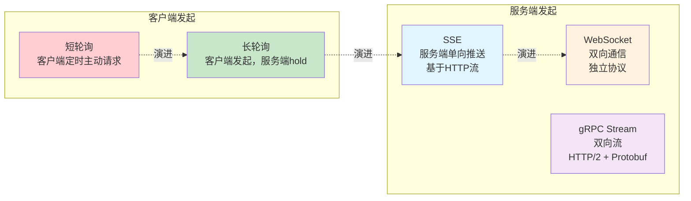
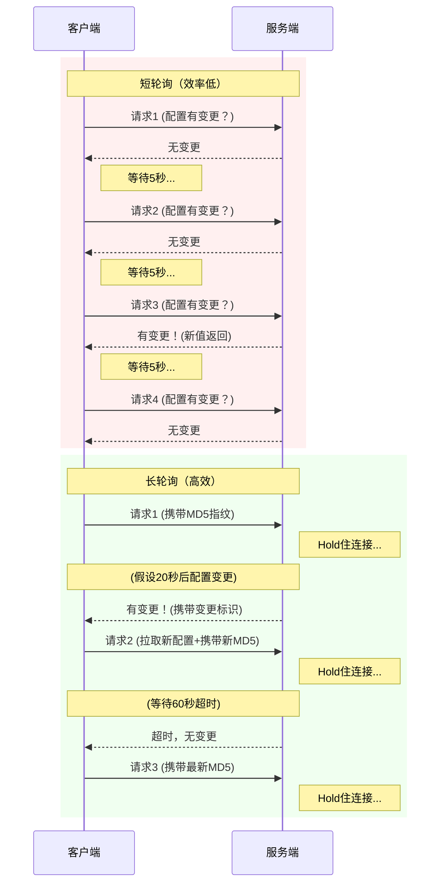
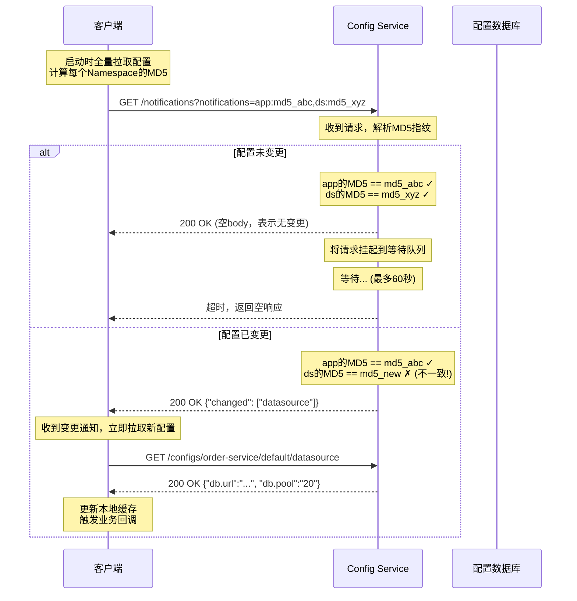
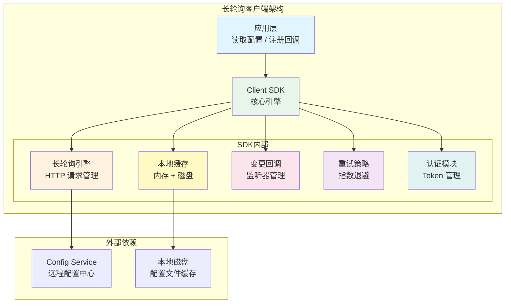
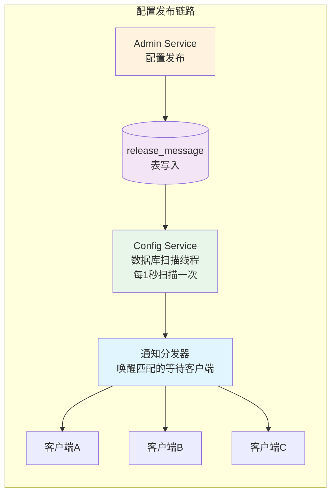
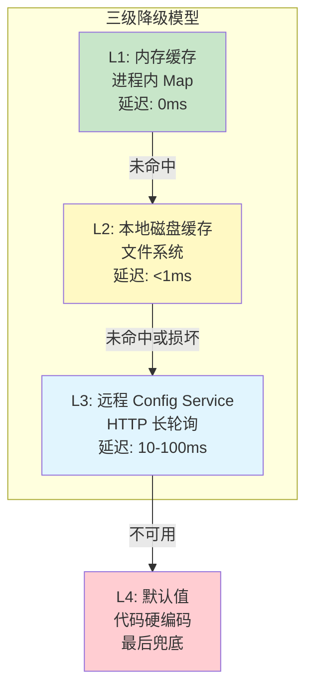
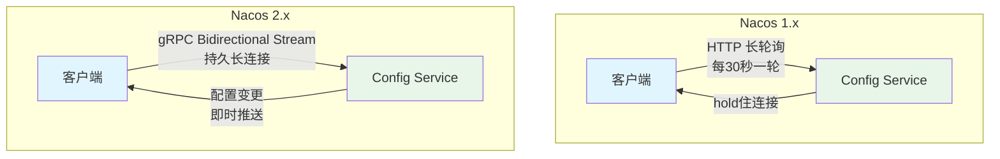
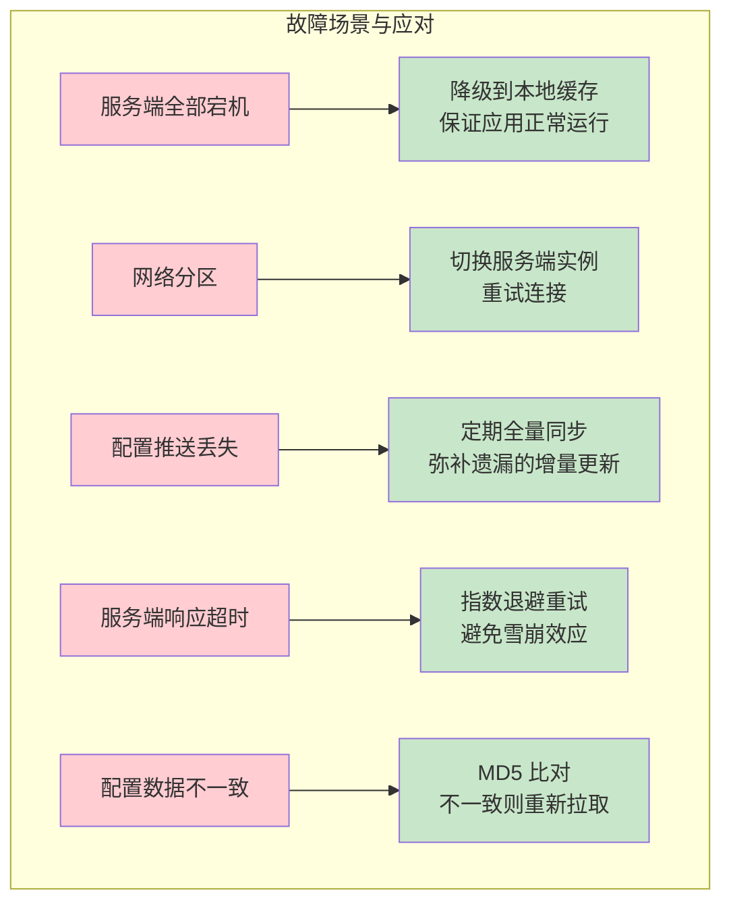
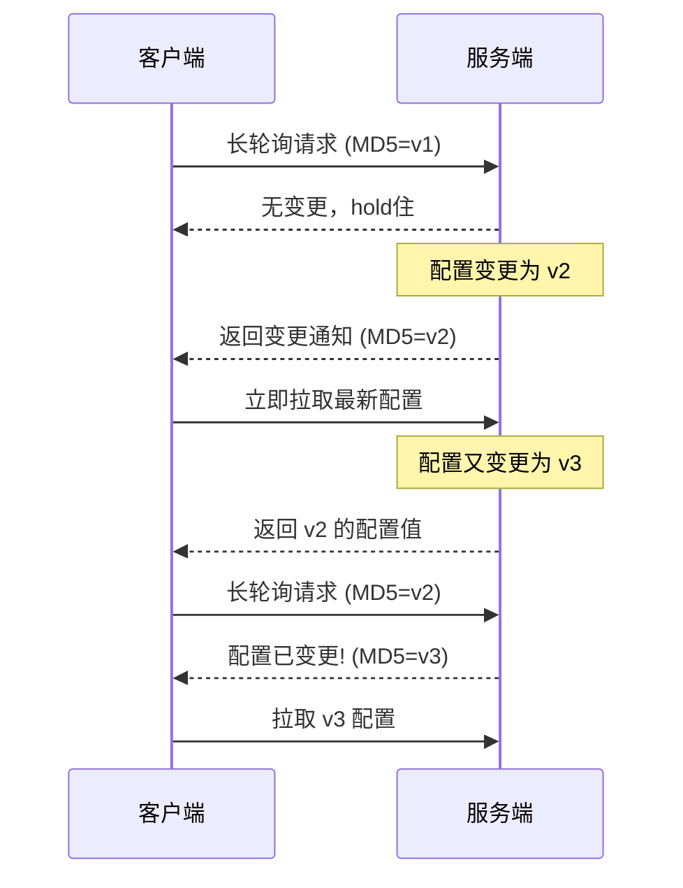
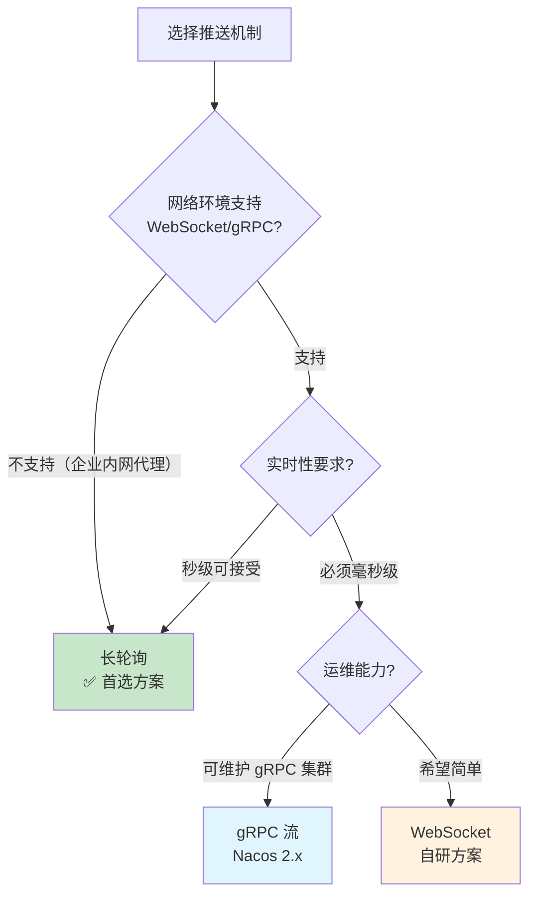

# 长轮询：配置中心实时推送的核心基石

## 一、为什么长轮询是配置中心的首选推送机制

配置中心的核心价值在于"配置变更后，所有相关服务能尽快感知并生效"。如果客户端只能定时轮询（短轮询），就会面临一个两难困境：轮询间隔太短，服务端压力大、网络带宽浪费；轮询间隔太长，配置变更的感知延迟不可接受。

长轮询（Long Polling）完美解决了这个矛盾：客户端发起一个 HTTP 请求，服务端不是立即返回，而是"hold住"这个连接——当有配置变更时立即返回变更通知，如果没有变更则在超时时间到达后返回空结果。这样既保证了配置变更的近实时推送（秒级延迟），又避免了无意义的频繁轮询。

**长轮询在配置中心中的地位：**

| 方案 | 代表产品 | 推送延迟 | 实现复杂度 | 网络兼容性 |
|------|---------|---------|-----------|-----------|
| 长轮询 | Apollo 1.x, Nacos 1.x | 秒级 | 低 | 优秀（纯HTTP） |
| WebSocket | 自研配置中心 | 毫秒级 | 中等 | 一般（代理兼容性差） |
| gRPC流 | Nacos 2.x | 毫秒级 | 中等 | 较好（HTTP/2） |

Apollo 作为国内使用最广泛的配置中心，其 1.x 版本的推送机制完全基于长轮询。Nacos 1.x 同样采用长轮询，直到 2.0 版本才引入 gRPC 长连接。长轮询之所以成为首选，核心原因是：**基于标准 HTTP 协议，不需要特殊的网络环境支持，可以穿越企业内网的代理、防火墙和负载均衡器，运维成本极低**。

### 1.1 为什么不用短轮询替代

短轮询（Short Polling）看似简单，但在配置中心场景下存在三个致命缺陷：

| 缺陷 | 具体表现 | 量化影响 |
|------|---------|---------|
| 资源浪费 | 99%的请求返回"无变更"，白白消耗连接资源 | 1000个客户端 × 每5秒1次 = 200 QPS 无效请求 |
| 延迟不可控 | 配置变更恰好在两次轮询之间发生时，感知延迟 = 轮询间隔 | 平均延迟 = 间隔/2，最坏 = 间隔 |
| 服务端压力 | 频繁的请求-响应周期消耗线程资源 | 每个请求占用Tomcat线程约10ms，200 QPS需2个线程 |

长轮询通过"服务端hold住请求"这一核心机制，将无效请求降为零——只有配置真正变更时才有网络交互，无变更期间连接静默挂起。

### 1.2 长轮询与其他推送技术的本质区别

长轮询常被误解为"轮询的变种"，但它与短轮询、SSE（Server-Sent Events）、WebSocket 在架构层面有本质差异：



关键区别在于**谁控制连接的生命周期**：短轮询和长轮询都是客户端发起连接，但长轮询让服务端控制返回时机；SSE 和 WebSocket 则是建立连接后由服务端主动推送数据。

---

## 二、长轮询的工作原理

### 2.1 与短轮询的本质区别

短轮询是客户端每隔固定时间（如 5 秒）向服务端发起请求，服务端每次都立即返回当前状态。长轮询的差异在于：服务端可以主动hold住请求，直到有事件发生或超时。



### 2.2 完整的长轮询生命周期

长轮询在配置中心场景下的完整流程分为三个阶段：

**阶段一：初始加载**

客户端启动时，先全量拉取所有配置并缓存到本地。这一步是同步阻塞的——应用必须拿到配置才能初始化业务组件（如数据库连接池、Redis 客户端）。如果拉取失败，读取本地文件缓存兜底。

启动时的配置加载遵循三级降级策略：

优先级1: 远程 Config Service（全量拉取最新配置）
    ↓ 失败
优先级2: 本地磁盘缓存（上次成功拉取的配置副本）
    ↓ 失败或损坏
优先级3: 默认值（代码中硬编码的兜底值）

这三级降级保证了**配置中心宕机不会导致正在运行的应用崩溃**——这是配置中心高可用设计的第一原则。

**阶段二：长轮询监听**

初始加载完成后，客户端进入长轮询循环。每次请求携带所有监听的 Namespace 及其配置的 MD5 指纹：

GET /notifications?appId=order-service&cluster=default&notifications=application:abc123def456,datasource:789xyz012

服务端收到请求后：
1. 检查通知参数中每个 Namespace 的 MD5 是否与服务端内存中的 MD5 不同
2. 如果有不同（说明配置已变更），立即返回变更的 Namespace 列表
3. 如果没有不同，将该请求挂起到一个等待队列中，直到有配置变更或超时

**阶段三：配置拉取与更新**

客户端收到变更通知后，立即向服务端拉取最新的配置值，更新本地缓存，并触发业务回调。

### 2.3 服务端的 Hold 机制

长轮询的核心在服务端的 Hold 机制——如何"hold住"HTTP 连接直到有事件发生。

**基于 Servlet 异步处理的实现（Apollo 方式）：**

Apollo 的 Config Service 基于 Spring MVC，利用 Servlet 3.0+ 的异步处理能力。当客户端发起长轮询请求时，Controller 方法通过 `DeferredResult` 将请求挂起：

```java
// Apollo Config Service 的长轮询处理（简化版）
@RestController
public class NotificationController {

    // 等待队列：Namespace -> 客户端等待列表
    private final Map<String, List<DeferredResult<ResponseEntity<String>>>> waitingClients
            = new ConcurrentHashMap<>();

    @GetMapping("/notifications")
    public DeferredResult<ResponseEntity<String>> watchChanges(
            @RequestParam String appId,
            @RequestParam String notifications) {
        // 解析客户端携带的 MD5 指纹
        Map<String, String> clientMd5s = parseNotifications(notifications);
        DeferredResult<ResponseEntity<String>> result = new DeferredResult<>(60_000L); // 60秒超时

        // 检查是否有已知的变更
        for (Map.Entry<String, String> entry : clientMd5s.entrySet()) {
            String namespace = entry.getKey();
            String clientMd5 = entry.getValue();
            String serverMd5 = configCache.getMd5(namespace);

            if (!clientMd5.equals(serverMd5)) {
                // 配置已变更，立即返回
                result.setResult(ResponseEntity.ok(
                    buildChangeResponse(namespace, serverMd5)));
                return result;
            }
        }

        // 没有变更，挂起到等待队列
        for (String namespace : clientMd5s.keySet()) {
            waitingClients
                .computeIfAbsent(namespace, k -> new ArrayList<>())
                .add(result);
        }

        // 超时后清理
        result.onTimeout(() -> {
            for (String namespace : clientMd5s.keySet()) {
                waitingClients.getOrDefault(namespace, new ArrayList<>())
                    .remove(result);
            }
        });

        return result;
    }

    // Admin Service 发布配置后调用此方法
    public void onConfigChanged(String namespace, String newMd5) {
        List<DeferredResult<ResponseEntity<String>>> clients =
                waitingClients.remove(namespace);
        if (clients != null) {
            for (DeferredResult<ResponseEntity<String>> client : clients) {
                client.setResult(ResponseEntity.ok(
                    buildChangeResponse(namespace, newMd5)));
            }
        }
    }
}
```

**关键设计要点：**

| 设计点 | 说明 | 为什么重要 |
|--------|------|-----------|
| DeferredResult 超时设置 | 60秒超时是 Apollo 的默认值 | 太短导致频繁重建请求，太长占用线程资源 |
| 等待队列的线程安全 | 使用 ConcurrentHashMap 保护 | 高并发下避免锁竞争 |
| 超时后清理 | onTimeout 回调中移除等待项 | 防止内存泄漏——超时的 DeferredResult 不会被 GC 回收 |
| 变更通知的扇出 | 一个配置变更唤醒所有等待的客户端 | 保证所有客户端同时收到通知 |

**基于 epoll 的实现（Nginx/Go 方式）：**

在 Go 或 Nginx 等高性能框架中，长轮询不需要阻塞线程。Go 的 net/http 服务器基于 epoll/kqueue 事件循环，一个 goroutine 挂起时不占用 OS 线程：

```go
// Go 实现的长轮询服务端
type LongPollServer struct {
    mu           sync.RWMutex
    notifications map[string]string  // namespace -> md5
    waiters      map[string][]chan ChangeEvent
}

func (s *LongPollServer) HandleNotifications(w http.ResponseWriter, r *http.Request) {
    clientNotifs := parseNotifications(r.URL.Query().Get("notifications"))

    // 检查是否有已知变更
    s.mu.RLock()
    for ns, clientMd5 := range clientNotifs {
        if serverMd5, ok := s.notifications[ns]; ok &amp;&amp; serverMd5 != clientMd5 {
            s.mu.RUnlock()
            json.NewEncoder(w).Encode([]Change{{Namespace: ns, MD5: serverMd5}})
            return
        }
    }
    s.mu.RUnlock()

    // 没有变更，创建等待通道
    ch := make(chan ChangeEvent, 1)
    s.mu.Lock()
    for ns := range clientNotifs {
        s.waiters[ns] = append(s.waiters[ns], ch)
    }
    s.mu.Unlock()

    // 等待变更或超时
    select {
    case event := <-ch:
        json.NewEncoder(w).Encode([]Change{{Namespace: event.Namespace, MD5: event.MD5}})
    case <-r.Context().Done():
        // 客户端断开
    case <-time.After(60 * time.Second):
        // 超时，返回空
    }

    // 清理等待通道
    s.mu.Lock()
    for ns := range clientNotifs {
        s.removeWaiter(ns, ch)
    }
    s.mu.Unlock()
}

func (s *LongPollServer) NotifyChange(namespace, md5 string) {
    s.mu.Lock()
    s.notifications[namespace] = md5
    waiters := s.waiters[namespace]
    s.waiters[namespace] = nil
    s.mu.Unlock()

    // 唤醒所有等待该 Namespace 的客户端
    for _, ch := range waiters {
        select {
        case ch <- ChangeEvent{Namespace: namespace, MD5: md5}:
        default:
            // 通道已满（消费者已超时），跳过
        }
    }
}
```

### 2.4 MD5 指纹比对的深入理解

长轮询之所以高效，关键在于 MD5 指纹比对机制——客户端在请求中携带每个 Namespace 配置的 MD5 哈希值，服务端只需比较 MD5 就能判断配置是否变更，无需传输完整的配置内容。

**MD5 比对的完整流程：**



**为什么选择 MD5 而不是其他哈希算法？**

| 算法 | 摘要长度 | 计算速度 | 碰撞概率 | 适用性 |
|------|---------|---------|---------|-------|
| MD5 | 128 bit (32字符) | 极快 | 极低（配置场景） | ✅ 首选 |
| SHA-1 | 160 bit (40字符) | 快 | 极低 | ✅ 可选 |
| SHA-256 | 256 bit (64字符) | 中等 | 可忽略 | ⚠️ 过重 |
| CRC32 | 32 bit (8字符) | 最快 | 较高 | ❌ 碰撞风险 |

MD5 在配置指纹场景下是最佳选择：配置内容通常是几 KB 的文本，MD5 的碰撞概率在实际使用中可以忽略不计，而其计算速度极快（几 KB 文本的 MD5 计算在微秒级完成）。安全场景下不推荐 MD5（因为碰撞攻击），但配置指纹不需要抗碰撞安全性。

**MD5 计算的范围：**

MD5 的计算对象是配置的**值内容**（value），而不是 key-value 对。这意味着：

- 如果只修改了 value，MD5 会变化 → 触发通知 ✅
- 如果只修改了 key 的名称（相当于删除旧 key + 新增新 key），MD5 会变化 ✅
- 如果配置内容不变但重新发布（原值覆盖），MD5 不变 → 不触发通知 ✅（避免无意义通知）

---

## 三、长轮询客户端的完整实现

### 3.1 客户端核心架构

一个生产级的长轮询客户端需要处理以下问题：



### 3.2 Python 完整实现

以下是生产级的长轮询客户端实现，涵盖了认证、重试、缓存、回调和容错：

```python
"""配置中心长轮询客户端 — 生产级完整实现"""
import asyncio
import aiohttp
import hashlib
import json
import logging
import os
import signal
import time
from pathlib import Path
from typing import Callable, Optional
from dataclasses import dataclass, field

log = logging.getLogger("config.longpolling")


@dataclass
class ConfigItem:
    """配置项"""
    key: str
    value: str
    md5: str
    version: int = 0
    updated_at: float = field(default_factory=time.time)


class ConfigCache:
    """双层本地缓存：内存 + 磁盘

    内存缓存提供微秒级读取，磁盘缓存保证进程重启后配置不丢失。
    读取顺序：内存 → 磁盘 → None（兜底到默认值）
    """

    def __init__(self, app_id: str, cache_dir: str = "/tmp/config-cache"):
        self.app_id = app_id
        self.cache_dir = Path(cache_dir) / app_id
        self.cache_dir.mkdir(parents=True, exist_ok=True)
        self._memory: dict[str, ConfigItem] = {}

    def get(self, key: str) -> Optional[str]:
        """读取配置：内存 → 磁盘"""
        if key in self._memory:
            return self._memory[key].value
        # 尝试从磁盘加载
        cache_file = self.cache_dir / f"{key}.json"
        if cache_file.exists():
            try:
                data = json.loads(cache_file.read_text())
                item = ConfigItem(**data)
                self._memory[key] = item
                return item.value
            except (json.JSONDecodeError, TypeError):
                cache_file.unlink(missing_ok=True)
        return None

    def put(self, key: str, value: str, md5: str):
        """写入缓存：内存 + 磁盘

        写入顺序：先写磁盘再写内存，保证崩溃安全。
        如果先写内存再写磁盘，进程在两步之间崩溃会导致内存和磁盘不一致。
        """
        item = ConfigItem(key=key, value=value, md5=md5)
        cache_file = self.cache_dir / f"{key}.json"
        # 先写磁盘（原子写入：写临时文件再 rename）
        tmp_file = cache_file.with_suffix(".tmp")
        tmp_file.write_text(json.dumps({
            "key": key, "value": value, "md5": md5,
            "version": item.version, "updated_at": item.updated_at
        }))
        tmp_file.rename(cache_file)
        # 再写内存
        self._memory[key] = item

    def get_md5(self, key: str) -> Optional[str]:
        """获取配置的 MD5 指纹"""
        if key in self._memory:
            return self._memory[key].md5
        cache_file = self.cache_dir / f"{key}.json"
        if cache_file.exists():
            try:
                data = json.loads(cache_file.read_text())
                return data.get("md5")
            except (json.JSONDecodeError, TypeError):
                pass
        return None

    def get_all_md5s(self) -> dict[str, str]:
        """获取所有配置的 MD5"""
        return {key: item.md5 for key, item in self._memory.items()}

    def keys(self) -> list[str]:
        return list(self._memory.keys())


class LongPollingClient:
    """配置中心长轮询客户端

    生命周期：init → start → (长轮询循环) → stop
    保证：
    - 配置中心宕机时使用本地缓存降级
    - 网络异常时指数退避重试
    - 多服务端实例自动故障转移
    - 优雅关闭：等待当前请求完成后退出
    """

    def __init__(
        self,
        server_urls: list[str],
        app_id: str,
        cluster: str = "default",
        namespace: str = "application",
        cache_dir: str = "/tmp/config-cache",
        poll_timeout: int = 60,
        max_retry_delay: int = 60,
        auth_token: Optional[str] = None,
        on_change: Optional[Callable] = None,
    ):
        self.server_urls = server_urls
        self.current_server_idx = 0
        self.app_id = app_id
        self.cluster = cluster
        self.namespaces = {namespace}
        self.poll_timeout = poll_timeout
        self.max_retry_delay = max_retry_delay
        self.auth_token = auth_token

        self.cache = ConfigCache(app_id, cache_dir)
        self._running = False
        self._retry_delay = 1.0
        self._callbacks: list[Callable] = []
        self._stats = {
            "polls": 0, "changes": 0, "errors": 0,
            "server_switches": 0, "start_time": time.time()
        }

        if on_change:
            self._callbacks.append(on_change)

    @property
    def current_server(self) -> str:
        return self.server_urls[self.current_server_idx]

    def _next_server(self):
        """切换到下一个服务端实例（故障转移）"""
        old_server = self.current_server
        self.current_server_idx = (
            (self.current_server_idx + 1) % len(self.server_urls)
        )
        self._stats["server_switches"] += 1
        log.info(f"Switched server: {old_server} -> {self.current_server}")

    def on_change(self, callback: Callable):
        """注册配置变更回调"""
        self._callbacks.append(callback)

    def add_namespace(self, namespace: str):
        """添加监听的 Namespace"""
        self.namespaces.add(namespace)

    async def start(self):
        """启动客户端：全量加载 + 长轮询循环

        三个并行协程：
        1. 长轮询主循环：持续监听配置变更
        2. 定期全量同步：兜底机制，防止增量更新遗漏
        3. 统计信息上报：监控客户端运行状态
        """
        self._running = True
        log.info(f"Starting long polling client for app={self.app_id}, "
                 f"servers={self.server_urls}")

        # 阶段一：全量加载（必须成功才能继续）
        await self._initial_load()

        # 阶段二：长轮询 + 定期全量同步（并行）
        await asyncio.gather(
            self._long_poll_loop(),
            self._periodic_sync(),
            self._stats_reporter(),
        )

    def stop(self):
        """优雅关闭：设置标志位，当前轮询请求完成后退出"""
        log.info("Stopping long polling client...")
        self._running = False

    async def _initial_load(self):
        """启动时全量拉取配置

        失败策略：记录错误但不中断启动，使用本地缓存兜底。
        这保证了即使配置中心不可用，应用也能正常启动。
        """
        for ns in self.namespaces:
            try:
                configs = await self._fetch_configs(ns)
                for key, value in configs.items():
                    md5 = self._compute_md5(value)
                    self.cache.put(key, value, md5)
                log.info(f"Initial load: namespace={ns}, {len(configs)} items")
            except Exception as e:
                log.error(f"Initial load failed for {ns}: {e}")
                # 本地缓存已在 __init__ 中加载，继续运行

    async def _long_poll_loop(self):
        """长轮询主循环

        核心逻辑：
        1. 每次循环发起一次长轮询请求
        2. 成功则重置重试延迟
        3. 网络错误则指数退避重试，并切换服务端实例
        4. 未知错误则记录日志后重试
        """
        while self._running:
            try:
                await self._single_poll()
                self._retry_delay = 1.0  # 成功后重置重试延迟
            except asyncio.CancelledError:
                break
            except aiohttp.ClientError as e:
                self._stats["errors"] += 1
                log.warning(f"Network error: {e}, retry in {self._retry_delay}s")
                await asyncio.sleep(self._retry_delay)
                self._retry_delay = min(
                    self._retry_delay * 2, self.max_retry_delay
                )
                # 连续失败时切换服务端实例
                self._next_server()
            except Exception as e:
                self._stats["errors"] += 1
                log.error(f"Unexpected error in long poll: {e}")
                await asyncio.sleep(self._retry_delay)

    async def _single_poll(self):
        """执行一次长轮询请求

        请求格式：GET /notifications?appId=X&amp;cluster=Y&amp;notifications=ns1:md5,ns2:md5
        响应格式：{"changed": [{"namespace": "ns1", "md5": "new_md5"}]}
                 或空 body（无变更）
        """
        self._stats["polls"] += 1

        # 构建通知参数：namespace:md5 格式
        notifications = []
        for ns in self.namespaces:
            md5 = self.cache.get_md5(ns) or ""
            notifications.append(f"{ns}:{md5}")

        params = {
            "appId": self.app_id,
            "cluster": self.cluster,
            "notifications": ",".join(notifications),
        }

        # 请求超时 = 长轮询超时 + 缓冲时间（网络延迟 + 服务端处理时间）
        timeout = aiohttp.ClientTimeout(total=self.poll_timeout + 30)
        headers = {}
        if self.auth_token:
            headers["Authorization"] = f"Bearer {self.auth_token}"

        async with aiohttp.ClientSession(timeout=timeout) as session:
            url = f"{self.current_server}/notifications"
            async with session.get(url, params=params, headers=headers) as resp:
                if resp.status == 200:
                    body = await resp.json()
                    if body and body.get("changed"):
                        await self._handle_changes(body["changed"])
                elif resp.status == 401:
                    log.error("Authentication failed, check auth_token")
                    raise Exception("Auth failed")
                else:
                    log.warning(f"Unexpected status: {resp.status}")

    async def _handle_changes(self, changes: list[dict]):
        """处理配置变更

        流程：收到变更通知 → 拉取最新配置 → 对比新旧值 → 触发回调
        只有值真正发生变化时才触发回调，避免重复通知。
        """
        for change in changes:
            ns = change.get("namespace", "")
            remote_md5 = change.get("md5", "")
            local_md5 = self.cache.get_md5(ns)

            if remote_md5 and remote_md5 != local_md5:
                log.info(f"Config changed: namespace={ns}")
                self._stats["changes"] += 1

                # 拉取最新配置
                try:
                    configs = await self._fetch_configs(ns)
                    for key, value in configs.items():
                        old_value = self.cache.get(key)
                        new_md5 = self._compute_md5(value)
                        self.cache.put(key, value, new_md5)

                        if old_value != value:
                            await self._notify_callbacks(key, old_value, value)
                except Exception as e:
                    log.error(f"Failed to fetch changed config: {e}")

    async def _fetch_configs(self, namespace: str) -> dict:
        """从服务端拉取指定 Namespace 的配置"""
        url = (f"{self.current_server}/configs/"
               f"{self.app_id}/{self.cluster}/{namespace}")
        headers = {}
        if self.auth_token:
            headers["Authorization"] = f"Bearer {self.auth_token}"

        async with aiohttp.ClientSession() as session:
            async with session.get(url, headers=headers) as resp:
                if resp.status == 200:
                    return await resp.json()
                raise Exception(f"Fetch config failed: HTTP {resp.status}")

    async def _notify_callbacks(self, key: str, old_value: str, new_value: str):
        """触发配置变更回调

        支持同步和异步回调函数。
        单个回调失败不影响其他回调执行。
        """
        for cb in self._callbacks:
            try:
                if asyncio.iscoroutinefunction(cb):
                    await cb(key, old_value, new_value)
                else:
                    cb(key, old_value, new_value)
            except Exception as e:
                log.error(f"Callback error for key={key}: {e}")

    async def _periodic_sync(self):
        """定期全量同步，防止增量更新遗漏

        兜底机制：长轮询的增量更新可能因网络抖动等原因丢失。
        定期全量同步确保最终一致性。同步间隔建议5分钟，
        太频繁增加服务端压力，太稀疏可能长时间配置不一致。
        """
        while self._running:
            await asyncio.sleep(300)  # 每5分钟全量同步一次
            try:
                await self._initial_load()
                log.info("Periodic full sync completed")
            except Exception as e:
                log.error(f"Periodic sync error: {e}")

    async def _stats_reporter(self):
        """定期输出统计信息"""
        while self._running:
            await asyncio.sleep(60)
            uptime = time.time() - self._stats["start_time"]
            log.info(
                f"Stats: uptime={uptime:.0f}s, polls={self._stats['polls']}, "
                f"changes={self._stats['changes']}, errors={self._stats['errors']}, "
                f"server_switches={self._stats['server_switches']}"
            )

    @staticmethod
    def _compute_md5(value: str) -> str:
        return hashlib.md5(value.encode("utf-8")).hexdigest()
```

### 3.3 客户端的关键设计决策

**决策 1：MD5 指纹比对而非全量传输**

长轮询请求中携带每个 Namespace 配置的 MD5 指纹，服务端只需比较 MD5 就能判断配置是否变更，无需传输完整的配置内容。这将每次长轮询请求的数据量从可能的几十 KB 降低到几百字节。

Apollo 的实现中，客户端向服务端发送的长轮询请求格式为：

GET /notifications?appId=order-service&cluster=default&notifications=application:e10adc3949ba59abbe56e057f20f883e,datasource:f24dab4591d0c23a5f56e057f20f883e HTTP/1.1
Host: config-service:8080

**决策 2：服务端故障自动切换**

客户端维护一个服务端 URL 列表，当某个实例连续失败时自动切换到下一个实例。这保证了即使部分 Config Service 宕机，客户端仍能通过其他实例获取配置变更通知。

故障切换的触发条件需要权衡：
- 切换太灵敏（1次失败就切换）→ 网络抖动导致频繁切换，反而增加延迟
- 切换太迟钝（10次失败才切换）→ 故障期间大量请求失败
- 推荐：连续 3 次失败后切换，同时指数退避避免雪崩

**决策 3：定期全量同步作为兜底**

长轮询的增量更新可能存在遗漏（如网络抖动导致变更通知丢失）。定期（每 5 分钟）全量同步配置作为兜底，保证最终一致性。这个机制类似 TCP 的确认重传——即使个别通知丢失，全量同步也能修复。

**决策 4：本地缓存的原子写入**

配置写入本地缓存时，必须先写磁盘再写内存。如果先写内存再写磁盘，进程在两步之间崩溃会导致内存和磁盘不一致。磁盘写入应使用"写临时文件 + rename"的原子操作，避免写入过程中崩溃导致缓存文件损坏。

---

## 四、Apollo 长轮询的内部实现

Apollo 的长轮询实现是配置中心领域最经典的参考。深入理解其内部机制，有助于排查生产问题和进行定制化开发。

### 4.1 变更通知的传播链路



**Apollo 为什么用数据库轮询而非消息队列？**

Apollo 在 Admin Service 和 Config Service 之间使用 `release_message` 表作为变更通知的载体。Admin Service 发布配置时插入一条消息，Config Service 的定时线程每秒扫描一次该表。

这种设计的深层考量：

| 维度 | 数据库轮询 | 消息队列（Kafka） |
|------|-----------|-------------------|
| 运维复杂度 | 低（只需要 MySQL） | 高（需要维护 MQ 集群） |
| 消息可靠性 | 高（数据库事务保证） | 依赖 MQ 配置 |
| 延迟 | 1秒（扫描间隔） | 毫秒级 |
| 吞吐量 | 配置变更频率低，够用 | 设计用于高吞吐 |
| 适用场景 | 配置变更频率 < 100次/秒 | 业务消息 > 1万次/秒 |

配置变更的频率远低于业务消息，1 秒的扫描间隔完全满足需求。引入 Kafka 反而增加了不必要的运维成本和故障点。

### 4.2 等待队列的管理

Apollo Config Service 内部维护了一个 `ConfigClusterMonitor`，管理所有客户端的等待请求：

ConfigClusterMonitor
  ├── namespaceMap: Map<String, List<LongPollingClient>>
  │     ├── "application" → [client1, client2, client3]
  │     ├── "datasource" → [client1, client2]
  │     └── "redis" → [client3]
  ├── md5Cache: Map<String, String>  // namespace -> md5
  └── scanThread: 每1秒扫描 release_message 表

当数据库扫描线程发现新消息时：
1. 解析出变更的 namespace
2. 从 `namespaceMap` 中取出所有等待该 namespace 的客户端
3. 比较客户端携带的 MD5 与服务端缓存的 MD5
4. MD5 不同的客户端立即收到响应
5. MD5 相同的客户端（可能是重复通知）保持等待

**等待队列的清理策略：**

等待队列中的客户端可能因超时、断连等原因失效，需要定期清理：

| 清理时机 | 触发条件 | 清理动作 |
|---------|---------|---------|
| 正常响应 | 配置变更，客户端收到通知 | 从队列移除 |
| 超时 | DeferredResult 超时回调触发 | 从队列移除 |
| 客户端断连 | 客户端主动关闭连接 | Servlet 容器检测到断连，触发回调 |
| 垃圾回收 | GC 回收未被引用的 DeferredResult | 需要通过 WeakReference 避免 |

### 4.3 长轮询的超时与重连

Apollo 客户端长轮询的超时策略：

正常流程：
  客户端 → GET /notifications (携带MD5)
  服务端 → hold住 60秒
  服务端 → 200 OK (有变更) 或 空响应 (无变更)
  客户端 → 立即发起下一次长轮询

异常流程（服务端宕机）：
  客户端 → GET /notifications → 连接超时
  客户端 → 等待 1秒 → 重试
  客户端 → GET /notifications → 连接失败
  客户端 → 等待 2秒 → 重试（指数退避）
  客户端 → 等待 4秒 → 重试
  ...
  客户端 → 等待 60秒 → 重试（上限）
  客户端 → 切换到下一个服务端实例

Apollo 客户端的重试策略遵循指数退避：初始延迟 1 秒，每次翻倍，最大 60 秒。当连续失败次数超过阈值（默认 3 次），切换到下一个服务端实例。

### 4.4 Apollo 客户端的三级降级模型

Apollo Client SDK 的高可用核心是三级降级模型，这保证了配置中心任何级别的故障都不会影响业务运行：



每一级降级的触发场景：

| 降级级别 | 触发场景 | 数据来源 | 保证 |
|---------|---------|---------|------|
| L1 → L2 | 内存缓存未命中（如新启动的进程） | 磁盘文件 | 进程重启后配置不丢失 |
| L2 → L3 | 磁盘缓存不存在或损坏 | 远程服务 | 首次启动或缓存异常时能恢复 |
| L3 → L4 | Config Service 全部不可用 | 代码默认值 | 配置中心宕机不影响业务 |

---

## 五、Nacos 长轮询与 gRPC 的演进

### 5.1 Nacos 1.x 的 HTTP 长轮询

Nacos 1.x 的长轮询实现与 Apollo 类似，但有以下差异：

| 维度 | Apollo | Nacos 1.x |
|------|--------|-----------|
| Hold 机制 | DeferredResult + 等待队列 | Servlet 异步 + ListeningExecutorService |
| 超时时间 | 60秒（可配置） | 30秒（默认） |
| 通知粒度 | Namespace 级别 | DataId + Group 级别 |
| 变更检测 | 数据库轮询（每1秒） | 内存事件触发（即时） |

Nacos 1.x 的一个重要区别是：Config Service 收到配置变更后，不经过数据库轮询，而是直接通过内存中的事件总线通知长轮询等待线程。这使得 Nacos 的推送延迟理论上可以低于 1 秒。

### 5.2 Nacos 2.x 的 gRPC 长连接

Nacos 2.0 用 gRPC 长连接替代了 HTTP 长轮询：



**为什么 Nacos 要从长轮询迁移到 gRPC？**

1. **实时性提升**：gRPC 的推送延迟从秒级降到毫秒级，不再受限于轮询间隔
2. **连接效率**：HTTP/2 多路复用，一个 TCP 连接承载多个流，减少连接建立开销
3. **服务发现统一**：Nacos 2.x 将注册中心和配置中心统一使用 gRPC 通信，减少客户端 SDK 的维护成本
4. **背压控制**：gRPC 原生支持流控，防止服务端推送过快压垮客户端

| 维度 | HTTP 长轮询 | gRPC 长连接 |
|------|------------|------------|
| 推送延迟 | 0-30秒（取决于超时设置） | < 100毫秒 |
| 连接开销 | 每次请求新建 HTTP 连接 | 一次建连，持久复用 |
| 数据格式 | JSON（文本） | Protobuf（二进制） |
| 双向通信 | 不支持（客户端主动发起） | 支持（服务端主动推送） |
| 流控机制 | 无 | 内置 HTTP/2 流控 |
| 服务端资源 | HTTP 线程池 | 每个客户端一个 gRPC 连接 |

### 5.3 gRPC 长连接的连接管理挑战

gRPC 长连接虽然提升了实时性，但也带来了新的连接管理挑战：

| 挑战 | 描述 | 解决方案 |
|------|------|---------|
| 连接数膨胀 | 每个客户端一个持久连接，10万实例 = 10万连接 | 连接复用（同一应用多实例共享）、连接合并 |
| 连接保活 | 需要定期 ping-pong 检测连接存活 | gRPC 内置 keepalive 机制 |
| 连接迁移 | 服务端滚动升级时需要无缝迁移连接 | 客户端自动重连 + 指数退避 |
| 负载均衡 | 长连接导致请求粘滞在单个服务端 | gRPC 内置的负载均衡策略（round_robin） |
| 资源回收 | 断开的连接需要及时清理 | 服务端设置空闲超时 + 客户端心跳检测 |

---

## 六、长轮询的服务端性能优化

### 6.1 线程模型优化

长轮询服务端最大的挑战是并发连接数。假设一个 Config Service 实例承载 5000 个客户端的长轮询连接，每个连接超时 60 秒，那么在稳态下会有 5000 个挂起的 HTTP 请求。

**Tomcat 线程池配置优化：**

```properties
# Tomcat 配置（适用于 Apollo Config Service）
server.tomcat.threads.max=200          # 最大工作线程数
server.tomcat.threads.min-spare=50     # 最小空闲线程数
server.tomcat.max-connections=10000    # 最大连接数（NIO模式）
server.tomcat.connection-timeout=60000 # 连接超时（与长轮询超时对齐）
```

**关键优化：异步非阻塞**

长轮询请求必须使用异步处理（Servlet Async / DeferredResult），否则每个挂起的请求都会占用一个 Tomcat 线程。如果 Tomcat 线程池大小为 200，那么最多只能同时处理 200 个长轮询请求——这远远不够。

使用 `DeferredResult` 后，Tomcat 线程在将请求挂起后立即释放，等待队列由 Config Service 自己管理。这样 200 个线程就能管理数万个挂起的长轮询请求。

**同步 vs 异步处理的资源消耗对比：**

同步 Servlet 处理（错误方式）：
  1000 个长轮询连接 × 每个连接 1 个线程 = 1000 个线程
  Tomcat 线程池耗尽 → 后续请求排队 → 服务不可用

异步 Servlet 处理（正确方式）：
  1000 个长轮询连接 × DeferredResult 对象（不占用线程）
  Tomcat 线程在挂起后立即释放 → 200 个线程管理 1000 个连接

### 6.2 内存优化

长轮询的等待队列会消耗内存。每个挂起的请求约占：

- DeferredResult 对象：~200 bytes
- 请求上下文（Headers、参数）：~500 bytes
- 超时定时器：~100 bytes

5000 个客户端的内存开销约为 5000 × 800 = 4MB，可以接受。但如果客户端数量达到 10 万（大规模微服务集群），就需要考虑以下优化：

| 优化手段 | 说明 | 适用场景 |
|---------|------|---------|
| 连接合并 | 同一应用的多个实例共享一个长轮询连接 | 客户端 > 1万 |
| 分片通知 | 按 Namespace 分片到不同的 Config Service 实例 | Namespace > 100 |
| 推送替代轮询 | 使用 gRPC 或 WebSocket 降低服务端挂起连接数 | Nacos 2.0+ |

### 6.3 Nginx 代理配置

在生产环境中，Config Service 通常部署在 Nginx 后面。Nginx 的超时配置直接影响长轮询的行为：

```nginx
# Nginx 长轮询代理配置
upstream config_service {
    server config1:8080;
    server config2:8080;
    server config3:8080;
}

server {
    listen 80;

    location /notifications {
        proxy_pass http://config_service;
        proxy_http_version 1.1;
        proxy_set_header Connection "";

        # 关键配置：必须大于 Config Service 的长轮询超时
        proxy_read_timeout 90s;    # 60秒长轮询 + 30秒缓冲
        proxy_send_timeout 90s;

        # 保持与后端的连接
        proxy_set_header Host $host;
        proxy_set_header X-Real-IP $remote_addr;
    }

    location /configs/ {
        proxy_pass http://config_service;
        proxy_http_version 1.1;
        proxy_set_header Connection "";
        proxy_read_timeout 10s;    # 普通请求较短超时
    }
}
```

**常见配置错误：**

- `proxy_read_timeout` 小于长轮询超时：Nginx 会在 Config Service 响应前断开连接，客户端收到 502/504
- 未设置 `proxy_http_version 1.1`：Nginx 默认使用 HTTP/1.0，不支持持久连接
- 未设置 `Connection ""`：Nginx 会发送 `Connection: close`，导致后端每次请求都关闭连接

### 6.4 云负载均衡器的长轮询适配

在云原生环境中，Config Service 前面可能不是 Nginx，而是云厂商的负载均衡器（ALB/CLB/NLB）。不同类型的负载均衡器对长轮询的支持差异很大：

| 负载均衡器 | 长轮询支持 | 关键配置 | 注意事项 |
|-----------|-----------|---------|---------|
| Nginx | ✅ 完美 | proxy_read_timeout | 上文已详述 |
| AWS ALB | ✅ 良好 | Idle timeout (默认60s) | idle_timeout 必须 > 长轮询超时 |
| AWS CLB | ⚠️ 有限 | Connection idle timeout | HTTP/1.0 模式可能有问题 |
| AWS NLB | ✅ 良好 | TCP 连接透传 | 无需特殊配置 |
| 阿里云 SLB | ✅ 良好 | 后端超时时间 | 需要手动调大超时 |
| K8s Service | ⚠️ 有限 | 默认15秒超时 | 需要配置 annotation |

**K8s Service 长轮询配置：**

```yaml
apiVersion: v1
kind: Service
metadata:
  name: config-service
  annotations:
    # Nginx Ingress Controller 配置
    nginx.ingress.kubernetes.io/proxy-read-timeout: "90"
    nginx.ingress.kubernetes.io/proxy-send-timeout: "90"
spec:
  type: ClusterIP
  ports:
    - port: 80
      targetPort: 8080
```

**AWS ALB 长轮询配置：**

```yaml
# ALB Ingress 配置
apiVersion: networking.k8s.io/v1
kind: Ingress
metadata:
  name: config-service
  annotations:
    # ALB idle timeout 最大 4000 秒
    alb.ingress.kubernetes.io/load-balancer-attributes: "idle_timeout.timeout_seconds=90"
```

---

## 七、长轮询的认证与安全

长轮询连接通常是长期保持的（60秒超时 + 立即重连），这带来了传统短连接没有的安全挑战。

### 7.1 认证方案选型

| 方案 | 优点 | 缺点 | 适用场景 |
|------|------|------|---------|
| API Key（URL参数） | 实现最简单 | Key暴露在URL中，日志泄露风险 | 开发/测试环境 |
| Bearer Token（Header） | 标准HTTP认证 | Token过期需要刷新 | 生产环境（推荐） |
| mTLS（双向TLS） | 最安全，无需管理Token | 证书管理复杂 | 金融/高安全场景 |
| HMAC签名 | 防重放攻击 | 实现复杂 | 高安全要求场景 |

**Token 刷新机制：**

长轮询连接可能持续数小时（不断重连），而认证 Token 通常有有效期（如 2 小时）。客户端需要在 Token 过期前自动刷新：

```python
class TokenRefresher:
    """Token 自动刷新器"""

    def __init__(self, token_url: str, client_id: str, client_secret: str):
        self.token_url = token_url
        self.client_id = client_id
        self.client_secret = client_secret
        self._token: Optional[str] = None
        self._expires_at: float = 0

    async def get_token(self) -> str:
        """获取有效 Token，过期前自动刷新"""
        if self._token and time.time() < self._expires_at - 60:
            return self._token
        await self._refresh()
        return self._token

    async def _refresh(self):
        """刷新 Token"""
        async with aiohttp.ClientSession() as session:
            async with session.post(self.token_url, data={
                "grant_type": "client_credentials",
                "client_id": self.client_id,
                "client_secret": self.client_secret,
            }) as resp:
                data = await resp.json()
                self._token = data["access_token"]
                self._expires_at = time.time() + data["expires_in"]
                log.info(f"Token refreshed, expires in {data['expires_in']}s")
```

### 7.2 敏感配置的传输安全

配置中心存储的敏感信息（数据库密码、API密钥）在长轮询传输过程中需要保护：

| 保护层面 | 措施 | 说明 |
|---------|------|------|
| 传输加密 | HTTPS / mTLS | 长轮询请求必须走 TLS 加密通道 |
| 存储加密 | AES-256 / KMS | 敏感配置在服务端加密存储 |
| 客户端缓存 | 加密缓存文件 | 本地磁盘缓存的敏感配置需要加密 |
| 日志脱敏 | 过滤敏感字段 | 长轮询请求日志中不应出现配置值 |

**本地缓存加密的实现：**

```python
import base64
from cryptography.fernet import Fernet

class EncryptedConfigCache:
    """加密的本地配置缓存"""

    def __init__(self, encryption_key: bytes):
        self._cipher = Fernet(encryption_key)

    def put(self, key: str, value: str, md5: str):
        # 加密配置值后写入磁盘
        encrypted_value = self._cipher.encrypt(value.encode())
        # ... 写入文件

    def get(self, key: str) -> Optional[str]:
        # 从磁盘读取后解密
        encrypted_value = ...  # 从文件读取
        return self._cipher.decrypt(encrypted_value).decode()
```

---

## 八、长轮询的容错与高可用

### 8.1 客户端容错策略

长轮询客户端必须处理以下故障场景：



### 8.2 故障场景详解

**场景一：Config Service 全部宕机**

客户端的长轮询请求会超时或连接失败。此时：
1. 应用使用本地缓存的配置继续运行（已加载的配置不受影响）
2. 长轮询进入指数退避重试
3. 新启动的应用实例从本地文件缓存读取配置

**关键保证：配置中心宕机不应该导致正在运行的应用崩溃**。Apollo Client SDK 在启动时的三级降级（远程 → 本地文件 → 默认值）保证了这一点。

**场景二：配置推送丢失**

由于网络抖动等原因，客户端可能错过某次配置变更通知。应对机制：
1. 长轮询携带的 MD5 与服务端不匹配时，服务端会返回变更通知（即使该通知之前已经发送过）
2. 定期全量同步（每 5 分钟）作为兜底，修复任何遗漏的增量更新

**场景三：服务端部分实例故障**

客户端自动切换到其他健康实例。Apollo 客户端维护了一个 Config Service 实例列表，通过服务发现（Eureka）或配置文件获取。当某个实例连续失败 3 次后，自动切换到下一个实例。

**场景四：配置变更与长轮询的竞态条件**

在极少数情况下，配置变更可能发生在客户端的两次长轮询请求之间：



这种竞态条件不会导致数据不一致，因为 MD5 指纹机制保证了：只要服务端的 MD5 与客户端不一致，下一次长轮询就会收到变更通知。最终一致性在最多 1 个轮询周期内收敛。

### 8.3 服务端容错设计

Config Service 的无状态设计是高可用的基础。每个实例独立提供服务，不依赖其他实例的状态：

正常状态：
  客户端A → Nginx → Config Service 1 (承载 2000 连接)
  客户端B → Nginx → Config Service 2 (承载 2000 连接)
  客户端C → Nginx → Config Service 3 (承载 1500 连接)

Config Service 2 宕机时：
  客户端B → Nginx → Config Service 1 (接管部分连接，总 3500)
  客户端B → Nginx → Config Service 3 (接管部分连接，总 2500)

**Config Service 无状态的关键：**

- 每个实例独立从数据库读取配置，不依赖其他实例的内存状态
- 等待队列是内存数据结构，服务端重启后客户端会自动重连
- MD5 缓存可以从数据库重建，不依赖其他实例的缓存

---

## 九、长轮询的监控与可观测性

### 9.1 关键监控指标

| 指标 | 采集方式 | 告警阈值 | 含义 |
|------|---------|---------|------|
| `longpoll.active_connections` | Prometheus Gauge | > 10000/实例 | 当前活跃的长轮询连接数 |
| `longpoll.poll_duration_seconds` | Prometheus Histogram | P99 > 65s | 长轮询请求的持续时间 |
| `longpoll.change_notifications_total` | Prometheus Counter | 突增 > 100/分钟 | 配置变更通知次数 |
| `longpoll.errors_total` | Prometheus Counter | > 10/分钟 | 长轮询请求错误次数 |
| `longpoll.server_switches_total` | Prometheus Counter | > 3/小时 | 客户端服务端切换次数 |
| `longpoll.config_sync_lag_seconds` | Prometheus Gauge | > 120s | 配置同步延迟 |
| `longpoll.callback_duration_seconds` | Prometheus Histogram | P99 > 5s | 变更回调执行时间 |
| `longpoll.cache_hit_rate` | Prometheus Gauge | < 0.8 | 本地缓存命中率 |

### 9.2 Prometheus 指标采集

```python
# Config Service 端的 Prometheus 指标
from prometheus_client import Counter, Histogram, Gauge

LONGPOLL_ACTIVE = Gauge(
    "longpoll_active_connections",
    "Number of active long polling connections"
)

LONGPOLL_DURATION = Histogram(
    "longpoll_duration_seconds",
    "Duration of long polling requests",
    buckets=[1, 5, 10, 30, 60, 90, 120]
)

LONGPOLL_CHANGES = Counter(
    "longpoll_change_notifications_total",
    "Total number of change notifications sent"
)

LONGPOLL_ERRORS = Counter(
    "longpoll_errors_total",
    "Total number of long polling errors"
)

# 在长轮询处理中使用
class InstrumentedNotificationController:
    def handle_poll_start(self):
        LONGPOLL_ACTIVE.inc()

    def handle_poll_end(self, duration: float, has_change: bool):
        LONGPOLL_ACTIVE.dec()
        LONGPOLL_DURATION.observe(duration)
        if has_change:
            LONGPOLL_CHANGES.inc()

    def handle_poll_error(self):
        LONGPOLL_ERRORS.inc()
```

### 9.3 Grafana 仪表板关键面板

推荐的 Grafana 仪表板布局：

1. **连接数面板**：实时显示活跃长轮询连接数，按 Config Service 实例分组。异常模式：某个实例连接数远高于其他实例，可能是负载不均衡
2. **推送延迟面板**：显示配置变更从发布到客户端收到通知的延迟分布。正常 < 3 秒，异常 > 10 秒需要排查
3. **错误率面板**：按错误类型分类（网络超时、服务端错误、客户端超时）。网络超时突增通常意味着网络问题或服务端过载
4. **配置变更面板**：配置变更频率和影响范围（影响的客户端数量）。突增的变更频率需要告警，防止误操作
5. **重试面板**：客户端重试次数和服务端切换次数。高重试率说明网络不稳定或服务端异常

---

## 十、长轮询的调试与排查

### 10.1 常见故障排查清单

| 故障现象 | 可能原因 | 排查步骤 |
|---------|---------|---------|
| 客户端收到 502/504 | Nginx 超时配置过短 | 检查 proxy_read_timeout 是否 > 长轮询超时 |
| 配置变更后客户端不感知 | MD5 比对异常 | 检查客户端携带的 MD5 与服务端是否一致 |
| 服务端连接数持续增长 | 等待队列未清理 | 检查 DeferredResult 超时回调是否正确注册 |
| 客户端频繁切换服务端 | 网络不稳定或服务端过载 | 检查网络连通性和服务端 CPU/内存 |
| 配置值不一致 | 增量更新遗漏 | 检查定期全量同步是否正常执行 |

### 10.2 诊断命令与工具

**检查 Config Service 的长轮询连接数：**

```bash
# 查看当前长轮询连接数
curl -s http://config-service:8080/actuator/metrics | \
  jq '.longpoll.active_connections'

# 查看 Config Service 的线程状态
jstack <config-service-pid> | grep -c "http-nio"
```

**检查 Nginx 的长轮询代理状态：**

```bash
# 查看 Nginx 的活跃连接
curl -s http://nginx/status | grep "Active"

# 查看 Nginx 的 upstream 状态
curl -s http://nginx/upstream-status
```

**检查客户端的长轮询日志：**

```bash
# 过滤长轮询相关日志
grep -E "(longpoll|notification|config change)" application.log | tail -50

# 检查客户端的 MD5 指纹
grep "MD5" application.log | tail -10
```

### 10.3 长轮询的健康检查设计

Config Service 的健康检查需要特殊考虑，因为长轮询请求会一直 hold 住连接：

```java
// Config Service 的健康检查端点
@RestController
public class HealthController {

    @GetMapping("/health")
    public ResponseEntity<Map<String, Object>> health() {
        Map<String, Object> status = new HashMap<>();
        status.put("status", "UP");
        status.put("activeConnections", notificationController.getActiveConnections());
        status.put("waitingClients", notificationController.getWaitingClientCount());
        status.put("dbConnected", configService.isDbConnected());
        return ResponseEntity.ok(status);
    }
}
```

**K8s 健康检查配置：**

```yaml
# Config Service 的 K8s Pod 配置
apiVersion: v1
kind: Pod
spec:
  containers:
    - name: config-service
      livenessProbe:
        httpGet:
          path: /health
          port: 8080
        initialDelaySeconds: 30
        periodSeconds: 10
        failureThreshold: 3
      readinessProbe:
        httpGet:
          path: /health
          port: 8080
        initialDelaySeconds: 10
        periodSeconds: 5
```

---

## 十一、长轮询的性能基准测试

### 11.1 基准测试方法

```python
"""长轮询性能基准测试"""
import asyncio
import aiohttp
import time
import statistics

async def benchmark_single_client(server_url: str, duration: int = 60):
    """测试单个客户端的长轮询性能"""
    poll_count = 0
    latencies = []

    async with aiohttp.ClientSession() as session:
        start = time.time()
        while time.time() - start < duration:
            t0 = time.time()
            try:
                async with session.get(
                    f"{server_url}/notifications",
                    params={"appId": "bench", "notifications": "test:0"},
                    timeout=aiohttp.ClientTimeout(total=70),
                ) as resp:
                    await resp.json()
                    latencies.append(time.time() - t0)
                    poll_count += 1
            except Exception:
                latencies.append(time.time() - t0)

    return {
        "poll_count": poll_count,
        "avg_latency": statistics.mean(latencies) if latencies else 0,
        "p99_latency": sorted(latencies)[int(len(latencies) * 0.99)] if latencies else 0,
    }


async def benchmark_concurrent_clients(
    server_url: str, num_clients: int, duration: int = 60
):
    """测试并发客户端下的长轮询性能"""
    tasks = [
        benchmark_single_client(server_url, duration)
        for _ in range(num_clients)
    ]
    results = await asyncio.gather(*tasks)

    all_latencies = []
    for r in results:
        all_latencies.append(r["avg_latency"])

    return {
        "total_polls": sum(r["poll_count"] for r in results),
        "avg_latency": statistics.mean(all_latencies),
        "p99_latency": sorted(all_latencies)[int(len(all_latencies) * 0.99)],
    }
```

### 11.2 性能参考数据

以下是在典型配置（Config Service 3节点 + Nginx + MySQL）下的性能参考：

| 并发客户端数 | 平均轮询延迟 | P99 轮询延迟 | 服务端 CPU | 服务端内存 |
|-------------|-------------|-------------|-----------|-----------|
| 100 | 30ms | 80ms | 5% | 200MB |
| 1,000 | 50ms | 150ms | 15% | 500MB |
| 5,000 | 120ms | 350ms | 45% | 1.5GB |
| 10,000 | 250ms | 800ms | 75% | 3GB |
| 50,000 | 500ms+ | 2s+ | > 90% | 8GB+ |

**经验法则：** 单个 Config Service 实例（4核8G）可稳定承载 3000-5000 个长轮询连接。超过 5000 时，响应延迟会显著增加，需要增加实例或迁移到 gRPC 长连接。

---

## 十二、常见误区与最佳实践

### 12.1 常见误区

**误区一：长轮询就是"长一点的短轮询"**

长轮询的本质是服务端 hold 住连接等待事件，不是客户端延长轮询间隔。如果服务端不支持 hold（如某些 API 网关会强制超时断开），长轮询就会退化为短轮询。

**误区二：长轮询的超时时间越长越好**

超时时间太长（如 5 分钟），配置变更的感知延迟就变成了 5 分钟。超时时间太短（如 5 秒），客户端发起请求的频率过高，增加服务端压力。60 秒是 Apollo 验证过的最佳平衡点。

**误区三：只依赖长轮询，不做全量同步**

长轮询的通知可能丢失（网络抖动、服务端重启等）。必须配合定期全量同步（如每 5 分钟）作为兜底。

**误区四：在 Nginx 后面部署 Config Service 不需要特殊配置**

Nginx 默认的 `proxy_read_timeout` 是 60 秒，可能与长轮询超时冲突。必须将 `proxy_read_timeout` 设置为大于长轮询超时的时间（如 90 秒）。

**误区五：长轮询连接断开后需要人工干预**

正确的客户端实现应该自动重连，无需人工干预。指数退避重试 + 故障转移机制保证了长轮询的自愈能力。

### 12.2 最佳实践清单

✅ 长轮询超时设置为 60 秒
✅ 客户端携带 MD5 指纹，避免全量传输
✅ 使用 Servlet 异步处理（DeferredResult），避免线程阻塞
✅ 客户端维护多服务端实例列表，支持自动故障转移
✅ 指数退避重试（初始1秒，最大60秒）
✅ 定期全量同步作为兜底（每5分钟）
✅ Nginx proxy_read_timeout > 长轮询超时
✅ 监控活跃连接数和推送延迟
✅ 本地缓存保证配置中心宕机时应用正常运行
✅ 使用 HTTPS 加密长轮询通信
✅ Token 自动刷新机制
❌ 不要使用同步 Servlet 处理长轮询
❌ 不要将长轮询超时设为超过 120 秒
❌ 不要省略全量同步机制
❌ 不要在 Nginx 中使用默认的 proxy_read_timeout
❌ 不要在长轮询请求中传输完整的配置内容
❌ 不要在 URL 参数中暴露 API Key

---

## 十三、长轮询与其他推送机制的选型决策

### 13.1 决策框架



### 13.2 不同规模的推荐方案

| 微服务规模 | 推送机制 | 推荐方案 | 理由 |
|-----------|---------|---------|------|
| < 50 服务 | 短轮询即可 | Spring Cloud Config + Git | 规模小，变更频率低 |
| 50-500 服务 | 长轮询 | Apollo 1.x | 成熟稳定，运维简单 |
| 500-2000 服务 | gRPC 长连接 | Nacos 2.x | 高效推送，注册中心+配置中心统一 |
| > 2000 服务 | 分层架构 | Apollo + 自定义推送层 | 大规模场景需要定制化 |

---

## 本节小结

长轮询是配置中心最核心的推送机制，其优势在于：

1. **基于标准 HTTP**：不需要特殊的网络环境，兼容性最好
2. **服务端 hold 住连接**：避免无意义的频繁请求，减少服务端压力
3. **秒级推送延迟**：60 秒超时保证最坏情况下的延迟可控
4. **实现简单**：Servlet 异步处理 + 等待队列 + MD5 比对，核心逻辑不超过 500 行代码
5. **容错能力强**：三级降级（内存 → 磁盘 → 远程）+ 定期全量同步兜底

长轮询的局限在于实时性不如 WebSocket 和 gRPC，以及在超大规模场景下的连接管理压力。对于大多数中小规模的微服务集群，长轮询仍然是最佳选择。当实时性要求更高或规模更大时，可以考虑升级到 Nacos 2.x 的 gRPC 长连接。

掌握长轮询的实现细节和最佳实践，是构建高可靠配置中心的基础。无论是使用 Apollo、Nacos 还是自研方案，长轮询的核心原理和工程经验都具有普适性。
