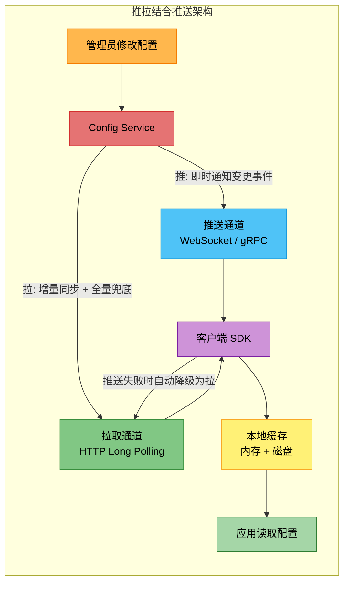
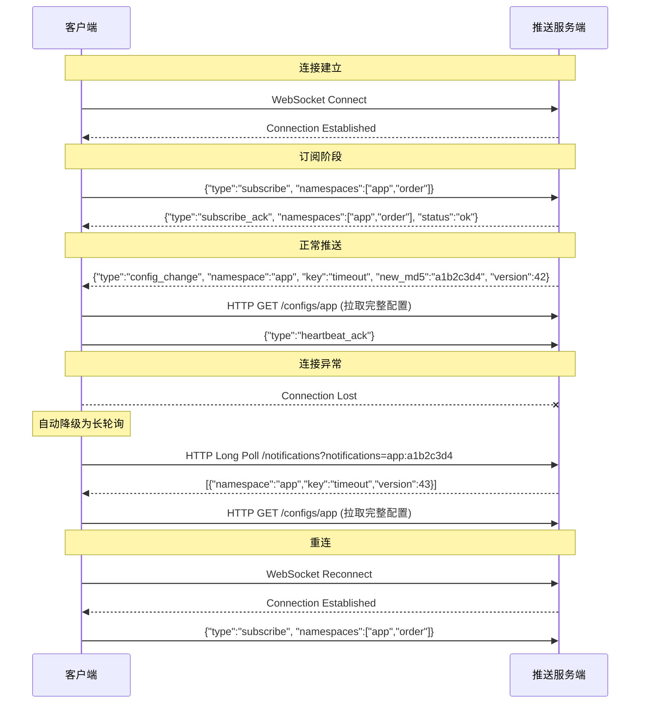
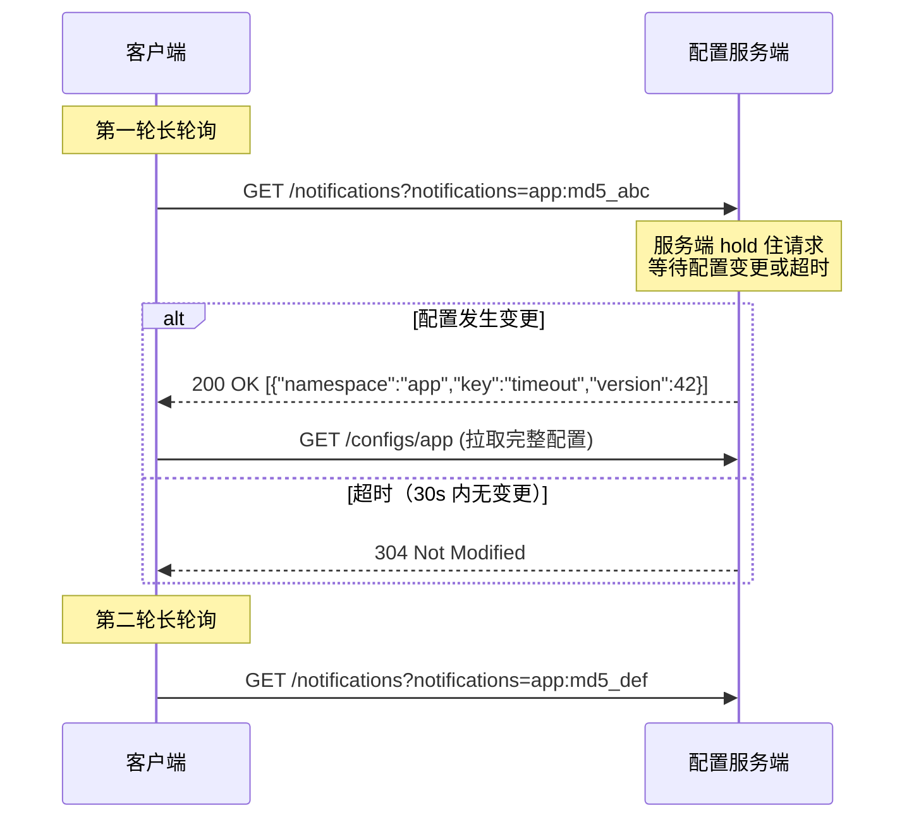
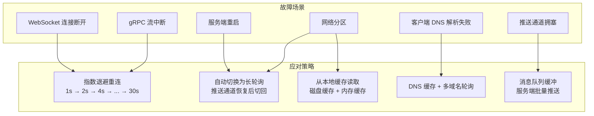
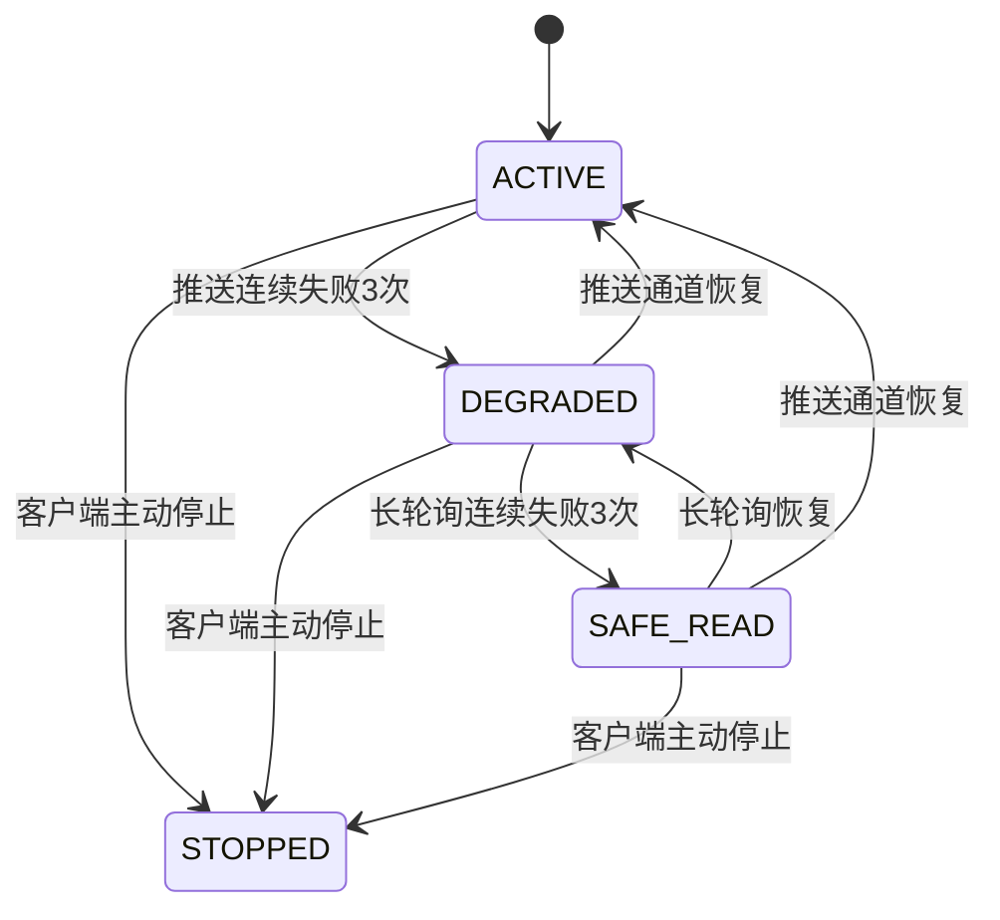
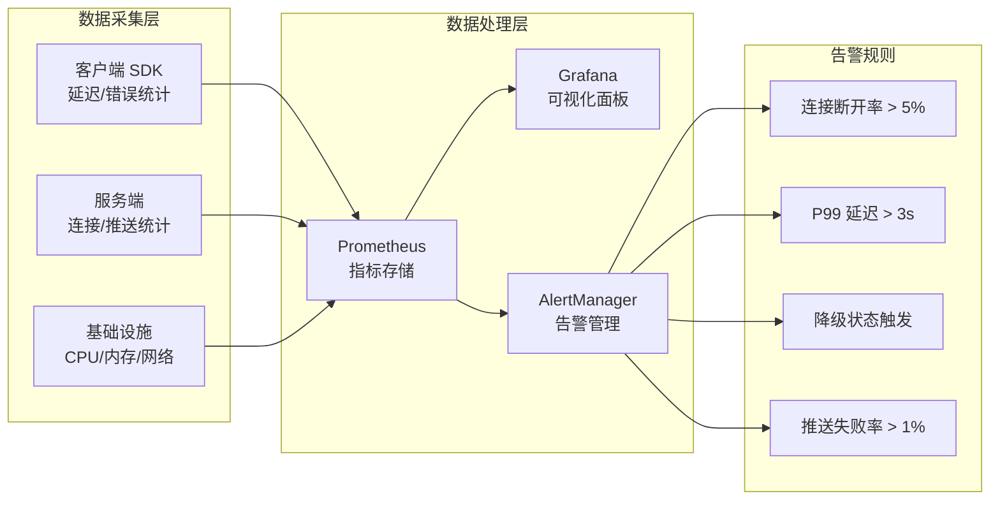

# 推送机制：推拉结合的配置变更通知架构

配置变更是配置中心的核心能力，而推送机制决定了配置变更后客户端感知到新配置的速度和可靠性。理论部分已经介绍了长轮询、WebSocket 和 gRPC 流三种基本推送方式的原理，本节聚焦工程落地——如何在生产环境中设计和实现一套高可靠、低延迟的推送架构。

核心思路是**推拉结合**：用"推"实现毫秒级变更通知，用"拉"保证最终一致性和容错兜底。单纯的推或单纯的拉各有致命缺陷，只有两者协同才能同时满足实时性和可靠性要求。

本节将从架构设计出发，依次讲解 WebSocket、gRPC、HTTP 长轮询三种推送通道的完整实现，再到容错降级、幂等保证、安全加固、性能调优和监控运维，覆盖生产级配置推送系统的全部关键环节。

---

## 推拉结合架构的设计原则

### 为什么不能只用"推"或只用"拉"

| 方案 | 优势 | 致命缺陷 |
|------|------|----------|
| 纯拉（客户端定时轮询） | 实现最简单，兼容性最好 | 延迟 = 轮询间隔，高频轮询浪费资源，1000 客户端 1s 间隔 = 1000 QPS |
| 纯推（服务端主动推送） | 实时性最好，毫秒级感知 | 推送可能丢失（网络闪断），客户端无法自我恢复，缺乏兜底机制 |
| 推拉结合 | 实时 + 可靠，三层保障 | 实现复杂度较高，需要协调两种机制的状态 |

纯推方案的最大风险是**推送丢失**。WebSocket 连接可能因网络抖动断开，gRPC 流可能因服务端重启中断。如果客户端完全依赖推送，一旦推送通道中断，配置变更就无法被感知——直到下次重启应用才可能恢复。这在生产环境中是不可接受的。根据 Apollo 配置中心的生产数据，WebSocket 连接在大规模部署中每小时平均断连率为 0.3%-1.2%，如果不做降级，这意味着每天可能有数十个客户端在某些时段完全丧失配置感知能力。

纯拉方案的问题在于**效率和延迟的矛盾**。如果轮询间隔设为 1 秒，延迟可以接受但服务端压力大（1000 个客户端 = 1000 QPS）；如果间隔设为 60 秒，服务端轻松但配置变更最多延迟 60 秒才被感知。Nacos 1.x 使用的 HTTP 长轮询通过将超时设为 30 秒来平衡这一矛盾，但本质上仍是拉模式，实时性受限于超时窗口。

推拉结合的策略：



### 推拉结合的三层保障机制

推拉结合不是简单地同时使用推和拉，而是分层设计、逐级降级的三重保障体系：

1. **第一层 —— 推送即时通知**：配置变更后，服务端通过 WebSocket 或 gRPC 流即时推送变更事件（仅推送 key 和新 MD5，不推送完整配置值），客户端在毫秒级感知到变更。这一层追求的是**速度**。

2. **第二层 —— 长轮询增量同步**：推送通道异常时，客户端自动降级为长轮询模式。长轮询携带本地所有配置的 MD5 列表，服务端对比后返回有变更的配置标识，客户端再主动拉取完整配置。这一层追求的是**可靠**。

3. **第三层 —— 定时全量同步**：无论推送和长轮询是否正常工作，客户端每隔固定时间（如 5 分钟）执行一次全量拉取，确保即使前两层都出现遗漏，配置最终仍能保持一致。这一层追求的是**最终一致性**。

三层机制的时间特性对比：

| 层级 | 机制 | 变更感知延迟 | 资源消耗 | 适用场景 |
|------|------|-------------|---------|---------|
| 第一层 | WebSocket/gRPC 推送 | 10-100ms | 低（仅推送通知） | 正常运行时的主要通道 |
| 第二层 | HTTP 长轮询 | 1-30s（取决于超时设置） | 中（保持 HTTP 连接） | 推送通道异常时的降级通道 |
| 第三层 | 定时全量同步 | 1-5min（取决于同步间隔） | 高（全量拉取配置） | 终极兜底，确保最终一致 |

### 推送通道的选择决策矩阵

在实际项目中选择推送通道时，需要综合考虑以下因素：

| 决策维度 | 选择长轮询 | 选择 WebSocket | 选择 gRPC 流 |
|----------|-----------|---------------|-------------|
| **团队技术栈** | 无特殊要求，HTTP 通用 | 熟悉 WebSocket API | 已使用 gRPC 生态 |
| **网络环境** | 有企业代理/防火墙，需穿透能力强 | 网络环境可控，代理支持 WS | HTTP/2 已部署，支持多路复用 |
| **延迟要求** | 秒级可接受 | 需要毫秒级 | 需要毫秒级 |
| **客户端规模** | < 1000 实例 | 1000-5000 实例 | > 5000 实例（多路复用优势明显） |
| **配置变更频率** | 低频（每天 < 100 次） | 高频（每分钟 > 10 次） | 高频且实时性要求极高 |
| **实现复杂度预算** | 1-2 天 | 3-5 天 | 5-7 天 |
| **参考实现** | Apollo, Nacos 1.x | 自研方案常见选择 | Nacos 2.0 |
| **协议开销** | HTTP 头重复开销大 | WebSocket 帧头 2-14 字节 | Protobuf 比 JSON 小 3-5 倍 |
| **防火墙兼容性** | 最好（标准 HTTP） | 较好（大部分代理支持） | 较差（需要 HTTP/2 支持） |

**推荐组合方案**：对于大多数生产环境，推荐 **WebSocket 推送 + 长轮询兜底** 的组合。原因：
- WebSocket 实现复杂度适中，实时性足够，P99 延迟可达 100ms 以内
- 长轮询作为兜底通道，保证在网络异常时仍能工作，实现简单且兼容性好
- 大部分企业网络环境支持 WebSocket（不像早期对 WebSocket 有严格限制）
- 不需要额外引入 gRPC 技术栈的依赖，降低维护成本

---

## WebSocket 推送的完整实现

WebSocket 是目前最主流的配置推送通道选择。它基于 TCP 的全双工通信能力，允许服务端主动向客户端推送消息，同时保持低延迟和低开销。

### 服务端：WebSocket 推送服务

WebSocket 推送服务的核心职责是管理大量客户端连接、维护订阅关系、在配置变更时精准推送通知。

```python
"""WebSocket 配置推送服务端"""
import asyncio
import json
import hashlib
import logging
import time
from dataclasses import dataclass, field
from typing import Dict, Set, Optional
from datetime import datetime
from collections import defaultdict

import websockets
from websockets.server import WebSocketServerProtocol

log = logging.getLogger(__name__)


@dataclass
class ConfigChange:
    """配置变更事件"""
    namespace: str
    key: str
    new_md5: str
    old_md5: str
    changed_at: datetime
    operator: str = ""
    version: int = 0  # 全局递增版本号，用于幂等性保证


class ConfigPushServer:
    """
    WebSocket 配置推送服务端
    
    核心职责：
    1. 管理客户端 WebSocket 连接的生命周期
    2. 维护 namespace → 客户端 的订阅关系映射
    3. 配置变更时精准推送给订阅了对应 namespace 的客户端
    4. 处理心跳保活和断线检测
    5. 推送消息的流量控制和背压处理
    """

    def __init__(self, heartbeat_interval: int = 30, max_connections: int = 10000):
        # namespace → {connection_id: websocket}
        self._subscriptions: Dict[str, Dict[str, WebSocketServerProtocol]] = {}
        # connection_id → set of namespaces
        self._client_namespaces: Dict[str, Set[str]] = {}
        # connection_id → connection metadata
        self._connection_meta: Dict[str, dict] = {}
        self._heartbeat_interval = heartbeat_interval
        self._max_connections = max_connections
        self._connection_counter = 0

    async def start(self, host: str = "0.0.0.0", port: int = 9800):
        """启动 WebSocket 服务"""
        log.info(f"Starting config push server on {host}:{port}")
        async with websockets.serve(
            self._handle_connection,
            host,
            port,
            # 关键参数调优
            ping_interval=self._heartbeat_interval,
            ping_timeout=10,
            max_size=1024 * 1024,      # 最大消息 1MB
            max_queue=256,              # 发送队列上限，超过则丢弃（背压）
            compression=None,           # 禁用压缩，减少 CPU 开销
        ) as server:
            log.info("Config push server started")
            await asyncio.Future()  # 永久运行

    async def _handle_connection(self, ws: WebSocketServerProtocol, path: str):
        """处理单个客户端 WebSocket 连接的完整生命周期"""
        if len(self._connection_meta) >= self._max_connections:
            log.warning("Max connections reached, rejecting client")
            await ws.close(1013, "Server is busy")
            return

        self._connection_counter += 1
        conn_id = f"conn_{self._connection_counter}"

        self._client_namespaces[conn_id] = set()
        self._connection_meta[conn_id] = {
            "connected_at": datetime.now(),
            "remote_addr": ws.remote_address,
            "messages_sent": 0,
            "messages_dropped": 0,
            "last_heartbeat": datetime.now(),
        }

        log.info(f"Client connected: {conn_id} from {ws.remote_address}")
        log.info(f"Active connections: {len(self._connection_meta)}")

        try:
            async for message in ws:
                try:
                    data = json.loads(message)
                    await self._handle_message(conn_id, ws, data)
                except json.JSONDecodeError:
                    await self._send_error(ws, "INVALID_JSON", "消息格式错误")
                except Exception as e:
                    log.error(f"Handle message error: {e}")
                    await self._send_error(ws, "INTERNAL_ERROR", str(e))

        except websockets.ConnectionClosed as e:
            log.info(f"Client disconnected: {conn_id} (code={e.code})")
        finally:
            self._cleanup_connection(conn_id)
            log.info(f"Active connections: {len(self._connection_meta)}")

    async def _handle_message(
        self, conn_id: str, ws: WebSocketServerProtocol, data: dict
    ):
        """处理客户端消息：订阅、取消订阅、心跳响应"""
        msg_type = data.get("type")

        if msg_type == "subscribe":
            namespaces = data.get("namespaces", [])
            for ns in namespaces:
                self._subscriptions.setdefault(ns, {})[conn_id] = ws
                self._client_namespaces[conn_id].add(ns)
            log.info(f"{conn_id} subscribed to: {namespaces}")
            await self._send(ws, {
                "type": "subscribe_ack",
                "namespaces": namespaces,
                "status": "ok",
            })

        elif msg_type == "unsubscribe":
            namespaces = data.get("namespaces", [])
            for ns in namespaces:
                if ns in self._subscriptions:
                    self._subscriptions[ns].pop(conn_id, None)
                self._client_namespaces[conn_id].discard(ns)
            log.info(f"{conn_id} unsubscribed from: {namespaces}")

        elif msg_type == "heartbeat_ack":
            self._connection_meta[conn_id]["last_heartbeat"] = datetime.now()

        elif msg_type == "config_fetch":
            # 客户端通过 WebSocket 拉取完整配置（备用通道）
            namespace = data.get("namespace")
            config_value = await self._fetch_config(namespace)
            await self._send(ws, {
                "type": "config_data",
                "namespace": namespace,
                "data": config_value,
            })

        else:
            await self._send_error(ws, "UNKNOWN_TYPE", f"未知消息类型: {msg_type}")

    async def notify_config_change(self, change: ConfigChange):
        """
        配置变更推送的核心方法
        
        当 Admin Service 写入新配置后调用此方法，
        向所有订阅了该 namespace 的客户端推送变更通知。
        推送内容仅包含 namespace 和新 MD5，不包含完整配置值，
        客户端收到后自行拉取完整配置（推拉结合）。
        """
        target_clients = self._subscriptions.get(change.namespace, {})
        if not target_clients:
            log.info(f"No subscribers for namespace: {change.namespace}")
            return

        notification = {
            "type": "config_change",
            "namespace": change.namespace,
            "key": change.key,
            "new_md5": change.new_md5,
            "version": change.version,
            "changed_at": change.changed_at.isoformat(),
        }

        sent_count = 0
        dropped_count = 0

        # 并发推送给所有订阅者
        tasks = []
        for conn_id, ws in target_clients.items():
            tasks.append(self._push_to_client(conn_id, ws, notification))

        results = await asyncio.gather(*tasks, return_exceptions=True)

        for result in results:
            if isinstance(result, Exception):
                dropped_count += 1
            else:
                sent_count += 1

        log.info(
            f"Config change pushed: {change.namespace}/{change.key} "
            f"→ sent={sent_count}, dropped={dropped_count}"
        )

    async def _push_to_client(
        self, conn_id: str, ws: WebSocketServerProtocol, notification: dict
    ):
        """向单个客户端推送消息，处理发送失败"""
        try:
            await asyncio.wait_for(
                self._send(ws, notification),
                timeout=5.0,  # 单个推送超时 5 秒，避免慢客户端阻塞
            )
            self._connection_meta[conn_id]["messages_sent"] += 1
        except asyncio.TimeoutError:
            self._connection_meta[conn_id]["messages_dropped"] += 1
            log.warning(f"Push timeout for {conn_id}, message dropped")
        except websockets.ConnectionClosed:
            self._connection_meta[conn_id]["messages_dropped"] += 1
            raise

    async def _send(self, ws: WebSocketServerProtocol, data: dict):
        """发送 JSON 消息"""
        await ws.send(json.dumps(data, ensure_ascii=False))

    async def _send_error(self, ws: WebSocketServerProtocol, code: str, message: str):
        """发送错误消息"""
        await self._send(ws, {"type": "error", "code": code, "message": message})

    async def _fetch_config(self, namespace: str) -> Optional[dict]:
        """从配置存储中拉取完整配置（子类实现）"""
        return {}

    def _cleanup_connection(self, conn_id: str):
        """清理断开的连接的所有订阅关系"""
        namespaces = self._client_namespaces.pop(conn_id, set())
        for ns in namespaces:
            if ns in self._subscriptions:
                self._subscriptions[ns].pop(conn_id, None)
        self._connection_meta.pop(conn_id, None)

    def get_stats(self) -> dict:
        """获取推送服务的运行统计"""
        total_sent = sum(
            m.get("messages_sent", 0) for m in self._connection_meta.values()
        )
        total_dropped = sum(
            m.get("messages_dropped", 0) for m in self._connection_meta.values()
        )
        return {
            "active_connections": len(self._connection_meta),
            "total_subscriptions": sum(
                len(v) for v in self._subscriptions.values()
            ),
            "total_messages_sent": total_sent,
            "total_messages_dropped": total_dropped,
            "drop_rate": (
                f"{total_dropped / (total_sent + total_dropped) * 100:.2f}%"
                if (total_sent + total_dropped) > 0
                else "0%"
            ),
        }
```

### 客户端：推拉结合的 SDK 实现

客户端 SDK 的核心设计是：同时维护推送通道和长轮询通道，推送通道实时接收变更通知，长轮询通道作为兜底保障。

```python
"""推拉结合的配置客户端 SDK"""
import asyncio
import json
import hashlib
import logging
import time
from dataclasses import dataclass, field
from typing import Dict, Callable, Optional
from enum import Enum

import aiohttp
import websockets

log = logging.getLogger(__name__)


class PushChannelState(Enum):
    """推送通道状态"""
    CONNECTING = "connecting"
    CONNECTED = "connected"
    RECONNECTING = "reconnecting"
    DISCONNECTED = "disconnected"


@dataclass
class LocalConfig:
    """本地缓存的配置项"""
    key: str
    value: str
    md5: str
    version: int
    updated_at: float


class PushPullConfigClient:
    """
    推拉结合的配置客户端 SDK
    
    三层保障机制：
    1. WebSocket 推送通道 —— 毫秒级感知配置变更
    2. 长轮询兜底通道 —— 推送中断时自动降级
    3. 定时全量同步 —— 终极兜底，确保最终一致
    """

    def __init__(
        self,
        server_url: str,           # HTTP 长轮询服务地址
        ws_url: str,               # WebSocket 推送服务地址
        app_id: str,
        cluster: str = "default",
        namespaces: list[str] = None,
        # 推送通道参数
        ws_reconnect_base_delay: float = 1.0,
        ws_reconnect_max_delay: float = 30.0,
        # 长轮询通道参数
        poll_timeout: int = 60,
        poll_retry_base_delay: float = 1.0,
        poll_retry_max_delay: float = 60.0,
        # 全量同步参数
        full_sync_interval: int = 300,   # 5 分钟
    ):
        self.server_url = server_url
        self.ws_url = ws_url
        self.app_id = app_id
        self.cluster = cluster
        self.namespaces = namespaces or ["application"]

        # 本地配置缓存: namespace → {key → LocalConfig}
        self._config_cache: Dict[str, Dict[str, LocalConfig]] = {}
        # 每个 namespace 的 MD5 快照
        self._namespace_md5: Dict[str, str] = {}

        # 回调函数
        self._change_callbacks: list[Callable] = []

        # 推送通道状态
        self._ws_state = PushChannelState.DISCONNECTED
        self._ws_reconnect_delay = ws_reconnect_base_delay
        self._ws_connection = None

        # 长轮询通道状态
        self._poll_retry_delay = poll_retry_base_delay

        # 控制标志
        self._running = False
        self._full_sync_interval = full_sync_interval

        # 统计信息
        self._stats = {
            "ws_notifications_received": 0,
            "ws_reconnect_count": 0,
            "poll_fallback_count": 0,
            "full_sync_count": 0,
            "config_change_count": 0,
            "config_error_count": 0,
        }

    def on_change(self, callback: Callable):
        """注册配置变更回调函数"""
        self._change_callbacks.append(callback)

    async def start(self):
        """启动客户端，同时开启三个通道"""
        self._running = True
        log.info(f"Starting push-pull config client for {self.app_id}")

        # 第一步：启动时全量拉取，确保本地缓存有效
        await self._initial_load()

        # 第二步：并行启动三个通道
        await asyncio.gather(
            self._ws_push_loop(),       # 推送通道
            self._long_poll_loop(),     # 长轮询兜底通道
            self._periodic_full_sync(), # 定时全量同步
        )

    async def stop(self):
        """停止客户端"""
        self._running = False
        if self._ws_connection:
            await self._ws_connection.close()

    # ==================== 第一层：WebSocket 推送通道 ====================

    async def _ws_push_loop(self):
        """WebSocket 推送主循环，含自动重连"""
        while self._running:
            try:
                self._ws_state = PushChannelState.CONNECTING
                async with websockets.connect(
                    self.ws_url,
                    ping_interval=30,
                    ping_timeout=10,
                    close_timeout=5,
                ) as ws:
                    self._ws_connection = ws
                    self._ws_state = PushChannelState.CONNECTED
                    self._ws_reconnect_delay = 1.0  # 连接成功，重置重连延迟
                    log.info(f"WebSocket connected to {self.ws_url}")

                    # 发送订阅请求
                    await ws.send(json.dumps({
                        "type": "subscribe",
                        "namespaces": self.namespaces,
                    }))

                    # 接收推送消息
                    async for message in ws:
                        try:
                            data = json.loads(message)
                            await self._handle_ws_message(data)
                        except json.JSONDecodeError:
                            log.warning(f"Invalid WS message: {message[:100]}")

            except websockets.ConnectionClosed as e:
                log.warning(f"WebSocket closed: {e.code}")
                self._ws_state = PushChannelState.DISCONNECTED
            except Exception as e:
                log.error(f"WebSocket error: {e}")
                self._ws_state = PushChannelState.DISCONNECTED

            # 指数退避重连
            if self._running:
                self._ws_state = PushChannelState.RECONNECTING
                self._stats["ws_reconnect_count"] += 1
                log.info(
                    f"Reconnecting in {self._ws_reconnect_delay:.1f}s "
                    f"(attempt #{self._stats['ws_reconnect_count']})"
                )
                await asyncio.sleep(self._ws_reconnect_delay)
                self._ws_reconnect_delay = min(
                    self._ws_reconnect_delay * 2, 30.0
                )

    async def _handle_ws_message(self, data: dict):
        """处理 WebSocket 推送消息"""
        msg_type = data.get("type")

        if msg_type == "config_change":
            self._stats["ws_notifications_received"] += 1
            namespace = data.get("namespace")
            new_md5 = data.get("new_md5")
            key = data.get("key")

            # MD5 比对，避免重复拉取
            if self._namespace_md5.get(namespace) == new_md5:
                log.debug(f"MD5 match, skip: {namespace}")
                return

            log.info(
                f"WS push received: {namespace}/{key} "
                f"(new_md5={new_md5[:8]}...)"
            )

            # 收到推送通知后，主动拉取完整配置
            await self._fetch_and_update(namespace)

        elif msg_type == "subscribe_ack":
            log.info(f"Subscribe acknowledged: {data.get('namespaces')}")

        elif msg_type == "error":
            log.error(f"WS server error: {data}")

    # ==================== 第二层：长轮询兜底通道 ====================

    async def _long_poll_loop(self):
        """长轮询主循环，推送通道不可用时作为主要通道"""
        async with aiohttp.ClientSession() as session:
            while self._running:
                # 推送通道正常时，降低长轮询频率（仅做心跳检测）
                effective_timeout = (
                    120 if self._ws_state == PushChannelState.CONNECTED
                    else self._poll_timeout
                )

                try:
                    url = f"{self.server_url}/notifications"
                    params = {
                        "appId": self.app_id,
                        "cluster": self.cluster,
                        "notifications": self._build_notification_str(),
                    }
                    async with session.get(
                        url,
                        params=params,
                        timeout=aiohttp.ClientTimeout(total=effective_timeout + 30),
                    ) as resp:
                        if resp.status == 200:
                            changes = await resp.json()
                            if changes:
                                self._stats["poll_fallback_count"] += 1
                                log.info(
                                    f"Long poll received {len(changes)} changes"
                                )
                                for change in changes:
                                    ns = change.get("namespace")
                                    await self._fetch_and_update(ns)
                            self._poll_retry_delay = 1.0

                except asyncio.TimeoutError:
                    pass  # 超时正常，继续下一轮
                except aiohttp.ClientError as e:
                    log.warning(f"Long poll error: {e}")
                    await asyncio.sleep(self._poll_retry_delay)
                    self._poll_retry_delay = min(
                        self._poll_retry_delay * 2, 60.0
                    )

    # ==================== 第三层：定时全量同步 ====================

    async def _periodic_full_sync(self):
        """定时全量同步，终极兜底"""
        while self._running:
            await asyncio.sleep(self._full_sync_interval)
            try:
                self._stats["full_sync_count"] += 1
                log.info(
                    f"Periodic full sync (#{self._stats['full_sync_count']})"
                )
                for ns in self.namespaces:
                    await self._fetch_and_update(ns, force=True)
            except Exception as e:
                log.error(f"Full sync error: {e}")

    # ==================== 公共方法 ====================

    async def _initial_load(self):
        """启动时全量拉取所有 namespace 的配置"""
        for ns in self.namespaces:
            await self._fetch_and_update(ns, force=True)
        log.info(
            f"Initial load complete: "
            f"{sum(len(v) for v in self._config_cache.values())} configs "
            f"across {len(self.namespaces)} namespaces"
        )

    async def _fetch_and_update(self, namespace: str, force: bool = False):
        """
        拉取指定 namespace 的完整配置并更新本地缓存
        
        force=True 时跳过 MD5 比对，强制拉取（用于全量同步）
        """
        try:
            url = (
                f"{self.server_url}/configs/{self.app_id}/"
                f"{self.cluster}/{namespace}"
            )
            async with aiohttp.ClientSession() as session:
                async with session.get(url) as resp:
                    if resp.status != 200:
                        log.error(f"Fetch config failed: HTTP {resp.status}")
                        return

                    data = await resp.json()
                    configs = data.get("configs", {})
                    remote_md5 = data.get("md5", "")

                    # MD5 比对，避免不必要的更新
                    if (
                        not force
                        and self._namespace_md5.get(namespace) == remote_md5
                    ):
                        return

                    # 更新本地缓存
                    old_configs = self._config_cache.get(namespace, {})
                    new_configs = {}

                    for key, value in configs.items():
                        value_str = json.dumps(value, ensure_ascii=False)
                        md5 = hashlib.md5(value_str.encode()).hexdigest()
                        new_configs[key] = LocalConfig(
                            key=key,
                            value=value_str,
                            md5=md5,
                            version=0,
                            updated_at=time.time(),
                        )

                    self._config_cache[namespace] = new_configs
                    self._namespace_md5[namespace] = remote_md5

                    # 触发变更回调
                    self._notify_callbacks(namespace, old_configs, new_configs)

                    log.info(
                        f"Config updated: {namespace} "
                        f"({len(new_configs)} keys, md5={remote_md5[:8]}...)"
                    )

        except Exception as e:
            self._stats["config_error_count"] += 1
            log.error(f"Fetch config error for {namespace}: {e}")

    def _notify_callbacks(
        self, namespace: str, old: dict, new: dict
    ):
        """通知所有注册的回调函数"""
        changed_keys = []
        for key, new_config in new.items():
            old_config = old.get(key)
            if old_config is None or old_config.md5 != new_config.md5:
                changed_keys.append(key)

        if not changed_keys:
            return

        self._stats["config_change_count"] += len(changed_keys)
        for callback in self._change_callbacks:
            try:
                callback(namespace, changed_keys)
            except Exception as e:
                log.error(f"Change callback error: {e}")

    def _build_notification_str(self) -> str:
        """构建长轮询通知参数: ns1:md51,ns2:md52"""
        parts = []
        for ns, md5 in self._namespace_md5.items():
            parts.append(f"{ns}:{md5}")
        return ",".join(parts)

    def get_config(self, namespace: str, key: str, default: str = "") -> str:
        """从本地缓存读取配置值（同步方法，零网络开销）"""
        ns_cache = self._config_cache.get(namespace, {})
        config = ns_cache.get(key)
        return config.value if config else default

    def get_stats(self) -> dict:
        """获取客户端运行统计"""
        return {
            **self._stats,
            "ws_state": self._ws_state.value,
            "cached_namespaces": len(self._config_cache),
            "cached_keys": sum(
                len(v) for v in self._config_cache.values()
            ),
        }
```

### WebSocket 推送协议设计

客户端和服务端之间通过 JSON 消息通信，以下是完整的协议定义：



关键协议字段说明：

| 字段 | 方向 | 类型 | 说明 |
|------|------|------|------|
| type | 双向 | string | 消息类型：subscribe/unsubscribe/config_change/heartbeat_ack/error |
| namespaces | C→S | string[] | 订阅的命名空间列表 |
| namespace | S→C | string | 变更发生的命名空间 |
| key | S→C | string | 变更的配置键 |
| new_md5 | S→C | string | 变更后配置的 MD5 值 |
| version | S→C | int | 全局递增版本号，用于幂等性判断 |

---

## gRPC 流式推送的实现

Nacos 2.0 引入了基于 gRPC 的推送机制，替代了 1.x 版本的 HTTP 长轮询。gRPC 流式推送的核心优势是利用 HTTP/2 的多路复用能力，在单个 TCP 连接上同时维护多个双向流，大幅减少了连接管理的开销。

### gRPC 推送的 Protobuf 定义

```protobuf
// config_push.proto
syntax = "proto3";
package configcenter;

service ConfigPushService {
    // 双向流：客户端和服务端之间建立持久的推送通道
    rpc ConfigStream (stream ConfigRequest) returns (stream ConfigResponse);
    
    // 普通 RPC：客户端主动拉取配置
    rpc FetchConfig (ConfigFetchRequest) returns (ConfigFetchResponse);
}

message ConfigRequest {
    string app_id = 1;
    string cluster = 2;
    string namespace = 3;
    string md5 = 4;           // 本地配置的 MD5，用于比对
    MessageType type = 5;
    
    enum MessageType {
        SUBSCRIBE = 0;         // 订阅
        HEARTBEAT = 1;         // 心跳
        UNSUBSCRIBE = 2;       // 取消订阅
    }
}

message ConfigResponse {
    string namespace = 1;
    string key = 2;
    string new_md5 = 3;
    bytes config_data = 4;     // 变更的完整配置（可选，也可仅推送通知）
    int64 version = 5;
    ConfigChangeType change_type = 6;
    
    enum ConfigChangeType {
        NOTIFICATION = 0;      // 仅通知变更，客户端自行拉取
        FULL_PUSH = 1;         // 直接推送完整配置
    }
}

message ConfigFetchRequest {
    string app_id = 1;
    string cluster = 2;
    string namespace = 3;
    repeated string keys = 4; // 指定拉取的 key，为空则拉取全部
}

message ConfigFetchResponse {
    map<string, string> configs = 1;  // key → value
    string md5 = 2;
    int64 version = 3;
}
```

### gRPC 与 WebSocket 推送的技术对比

| 对比维度 | gRPC 流 | WebSocket |
|----------|---------|-----------|
| 协议基础 | HTTP/2 | TCP |
| 序列化 | Protocol Buffers（二进制） | JSON（文本） |
| 多路复用 | 原生支持，单连接多流 | 需要应用层管理 |
| 头部开销 | HPACK 压缩，极低 | 每帧 2-14 字节 |
| 流控 | 内置窗口流控 | 无内置流控 |
| 浏览器支持 | 需要 gRPC-Web 代理 | 原生支持 |
| 服务端推送 | 双向流，服务端主动推送 | 全双工，服务端主动推送 |
| 数据传输效率 | JSON 的 1/3 ~ 1/5 | 原始 JSON |
| 连接管理 | Channel + Balancer | 原生连接 + 重连逻辑 |
| 典型场景 | 大规模微服务间配置下发 | Web 端 + 通用客户端 |

### gRPC 推送客户端实现

```python
"""gRPC 流式推送客户端"""
import asyncio
import hashlib
import json
import logging
import time
from typing import Dict, Callable, Optional

import grpc

log = logging.getLogger(__name__)


class GrpcConfigPushClient:
    """
    基于 gRPC 双向流的配置推送客户端
    
    相比 HTTP 长轮询的优势：
    1. 单连接多路复用 —— 一个 TCP 连接同时维护多个 namespace 的推送流
    2. Protocol Buffers 序列化 —— 数据传输效率比 JSON 高 3-5 倍
    3. 原生流式通信 —— 无需模拟 hold 住请求，真正的服务端推送
    4. HTTP/2 头部压缩 —— 大量客户端场景下节省带宽
    """

    def __init__(
        self,
        server_addr: str,       # gRPC 服务地址，如 "config-server:9801"
        app_id: str,
        cluster: str = "default",
        namespaces: list[str] = None,
        heartbeat_interval: int = 15,
        reconnect_base_delay: float = 1.0,
        reconnect_max_delay: float = 30.0,
    ):
        self.server_addr = server_addr
        self.app_id = app_id
        self.cluster = cluster
        self.namespaces = namespaces or ["application"]
        self._heartbeat_interval = heartbeat_interval
        self._reconnect_base = reconnect_base_delay
        self._reconnect_max = reconnect_max_delay

        # 本地缓存
        self._config_cache: Dict[str, Dict[str, str]] = {}
        self._namespace_md5: Dict[str, str] = {}

        # gRPC channel 和 stub
        self._channel: Optional[grpc.aio.Channel] = None
        self._stub = None

        # 控制标志
        self._running = False
        self._callbacks: list[Callable] = []

        # 统计
        self._stats = {
            "stream_messages_received": 0,
            "reconnect_count": 0,
            "config_updates": 0,
            "stream_errors": 0,
        }

    async def start(self):
        """启动 gRPC 推送客户端"""
        self._running = True

        # 创建 gRPC channel，配置连接参数
        self._channel = grpc.aio.insecure_channel(
            self.server_addr,
            options=[
                ("grpc.keepalive_time_ms", 30000),           # 30s 心跳
                ("grpc.keepalive_timeout_ms", 10000),        # 10s 心跳超时
                ("grpc.keepalive_permit_without_calls", True),# 无请求时也发心跳
                ("grpc.max_connection_idle_ms", 60000),       # 空闲连接 60s 断开
                ("grpc.initial_reconnect_backoff_ms", 1000),  # 初始重连退避
                ("grpc.max_reconnect_backoff_ms", 30000),     # 最大重连退避
            ],
        )
        # self._stub = ConfigPushServiceStub(self._channel)

        # 初始全量拉取
        await self._initial_load()

        # 启动推送流
        await self._stream_loop()

    async def _stream_loop(self):
        """gRPC 双向流主循环，含自动重连"""
        reconnect_delay = self._reconnect_base

        while self._running:
            try:
                # 创建双向流
                # stream = self._stub.ConfigStream(self._request_generator())
                #
                # async for response in stream:
                #     self._stats["stream_messages_received"] += 1
                #     await self._handle_stream_response(response)

                reconnect_delay = self._reconnect_base  # 重置退避

            except grpc.RpcError as e:
                self._stats["stream_errors"] += 1
                self._stats["reconnect_count"] += 1
                log.warning(
                    f"gRPC stream error: {e.code()} - {e.details()} "
                    f"(reconnect in {reconnect_delay:.1f}s)"
                )
                await asyncio.sleep(reconnect_delay)
                reconnect_delay = min(reconnect_delay * 2, self._reconnect_max)

    async def _request_generator(self):
        """
        生成器：向 gRPC 流发送订阅请求和心跳
        
        这是 gRPC 客户端流的核心 —— 客户端持续向服务端发送消息，
        包括初始订阅、定期心跳和配置变更确认。
        """
        # 1. 首先发送所有 namespace 的订阅请求
        for ns in self.namespaces:
            # yield ConfigRequest(
            #     app_id=self.app_id,
            #     cluster=self.cluster,
            #     namespace=ns,
            #     md5=self._namespace_md5.get(ns, ""),
            #     type=ConfigRequest.SUBSCRIBE,
            # )
            yield None  # placeholder —— 实际使用时替换为真实 protobuf 消息

        # 2. 持续发送心跳
        while self._running:
            await asyncio.sleep(self._heartbeat_interval)
            # yield ConfigRequest(
            #     app_id=self.app_id,
            #     cluster=self.cluster,
            #     namespace="",
            #     md5="",
            #     type=ConfigRequest.HEARTBEAT,
            # )
            yield None  # placeholder —— 实际使用时替换为真实 protobuf 消息

    async def _handle_stream_response(self, response):
        """处理 gRPC 流返回的配置变更"""
        namespace = response.namespace
        change_type = response.change_type

        if change_type == 0:  # NOTIFICATION —— 仅通知，需要主动拉取
            log.info(
                f"gRPC notification: {namespace}/{response.key} "
                f"(new_md5={response.new_md5[:8]}...)"
            )
            await self._fetch_config(namespace)

        elif change_type == 1:  # FULL_PUSH —— 直接推送完整配置
            log.info(f"gRPC full push: {namespace} ({len(response.config_data)} bytes)")
            config_str = response.config_data.decode("utf-8")
            configs = json.loads(config_str)
            self._config_cache[namespace] = configs
            self._namespace_md5[namespace] = response.new_md5
            self._fire_callbacks(namespace)

    async def _fetch_config(self, namespace: str):
        """通过 gRPC 普通 RPC 拉取配置"""
        # response = await self._stub.FetchConfig(
        #     ConfigFetchRequest(
        #         app_id=self.app_id,
        #         cluster=self.cluster,
        #         namespace=namespace,
        #     )
        # )
        # self._config_cache[namespace] = dict(response.configs)
        # self._namespace_md5[namespace] = response.md5
        # self._fire_callbacks(namespace)
        pass

    async def _initial_load(self):
        """启动时全量拉取"""
        for ns in self.namespaces:
            await self._fetch_config(ns)
        log.info("gRPC client initial load complete")

    def _fire_callbacks(self, namespace: str):
        """触发变更回调"""
        for cb in self._callbacks:
            try:
                cb(namespace)
            except Exception as e:
                log.error(f"Callback error: {e}")

    def on_change(self, callback: Callable):
        self._callbacks.append(callback)

    def get_config(self, namespace: str, key: str, default: str = "") -> str:
        """同步读取本地缓存"""
        return self._config_cache.get(namespace, {}).get(key, default)
```

> **说明**：上述 gRPC 代码中的 `_request_generator` 和 `_fetch_config` 方法保留了注释占位，实际项目中需要将 placeholder 替换为从 protobuf 生成的真实 stub 调用。这种设计保留了完整的架构逻辑，同时明确了与 proto 生成代码的对接点。

---

## HTTP 长轮询的完整实现

HTTP 长轮询是最传统也是最稳定的配置变更感知方式，几乎所有配置中心都将其作为兜底方案。虽然实时性不如 WebSocket 和 gRPC，但其**实现简单、兼容性好、穿透能力强**的优势使其成为不可替代的基础通道。

### 长轮询的工作原理



### 服务端：长轮询 API 实现

```python
"""HTTP 长轮询配置服务端"""
import asyncio
import json
import hashlib
import logging
from typing import Dict, Set, Optional
from datetime import datetime
from collections import defaultdict

from aiohttp import web

log = logging.getLogger(__name__)


class LongPollConfigServer:
    """
    HTTP 长轮询配置服务端
    
    核心机制：
    1. 客户端发送带 MD5 的长轮询请求
    2. 服务端 hold 住请求，等待配置变更
    3. 有变更时立即返回变更列表，客户端主动拉取
    4. 超时无变更时返回 304，客户端立即发起下一轮
    
    关键设计：
    - 长轮询超时设为 30s，平衡延迟和服务端连接压力
    - 使用 asyncio.Event 实现配置变更的即时通知
    - 每个 namespace 独立的等待队列，避免广播风暴
    """

    POLL_TIMEOUT = 30  # 秒

    def __init__(self):
        # namespace → {config_key: config_value}
        self._configs: Dict[str, Dict[str, str]] = {}
        # namespace → version（全局递增）
        self._versions: Dict[str, int] = defaultdict(int)
        # namespace → asyncio.Event，用于通知长轮询等待者
        self._change_events: Dict[str, asyncio.Event] = {}
        # 统计
        self._stats = {
            "long_poll_requests": 0,
            "change_notifications": 0,
            "config_fetches": 0,
        }

    def _get_or_create_event(self, namespace: str) -> asyncio.Event:
        """获取或创建 namespace 的变更事件"""
        if namespace not in self._change_events:
            self._change_events[namespace] = asyncio.Event()
        return self._change_events[namespace]

    async def handle_long_poll(self, request: web.Request) -> web.Response:
        """
        长轮询核心接口
        
        请求参数：
        - appId: 应用 ID
        - cluster: 集群名
        - notifications: 当前本地配置的 MD5 快照，格式 "ns1:md51,ns2:md52"
        
        返回：
        - 200: 变更列表 [{"namespace":"app","key":"timeout","version":42}]
        - 304: 无变更
        """
        self._stats["long_poll_requests"] += 1
        notifications = request.query.get("notifications", "")

        # 解析客户端当前的 MD5 快照
        local_md5s = {}
        if notifications:
            for part in notifications.split(","):
                if ":" in part:
                    ns, md5 = part.rsplit(":", 1)
                    local_md5s[ns] = md5

        # 等待配置变更或超时
        all_namespaces = list(local_md5s.keys()) + list(self._configs.keys())
        wait_tasks = []
        for ns in set(all_namespaces):
            event = self._get_or_create_event(ns)
            event.clear()
            wait_tasks.append(self._wait_or_timeout(event, self.POLL_TIMEOUT))

        await asyncio.gather(*wait_tasks)

        # 检查是否有变更
        changes = []
        for ns, local_md5 in local_md5s.items():
            current_config = self._configs.get(ns, {})
            if not current_config:
                continue
            config_str = json.dumps(current_config, sort_keys=True, ensure_ascii=False)
            current_md5 = hashlib.md5(config_str.encode()).hexdigest()
            if current_md5 != local_md5:
                changes.append({
                    "namespace": ns,
                    "version": self._versions[ns],
                })

        if changes:
            self._stats["change_notifications"] += len(changes)
            return web.json_response(changes)
        else:
            raise web.HTTPNotModified()

    async def _wait_or_timeout(self, event: asyncio.Event, timeout: float):
        """等待事件或超时"""
        try:
            await asyncio.wait_for(event.wait(), timeout=timeout)
        except asyncio.TimeoutError:
            pass

    async def handle_fetch_config(self, request: web.Request) -> web.Response:
        """拉取完整配置"""
        app_id = request.match_info.get("app_id")
        cluster = request.match_info.get("cluster")
        namespace = request.match_info.get("namespace")

        self._stats["config_fetches"] += 1
        config = self._configs.get(namespace, {})
        config_str = json.dumps(config, sort_keys=True, ensure_ascii=False)
        md5 = hashlib.md5(config_str.encode()).hexdigest()

        return web.json_response({
            "configs": config,
            "md5": md5,
            "version": self._versions[namespace],
        })

    def update_config(self, namespace: str, key: str, value: str):
        """管理员更新配置（触发长轮询通知）"""
        self._configs.setdefault(namespace, {})[key] = value
        self._versions[namespace] += 1

        # 通知所有等待该 namespace 的长轮询请求
        event = self._get_or_create_event(namespace)
        event.set()

        log.info(
            f"Config updated: {namespace}/{key} "
            f"(version={self._versions[namespace]})"
        )
```

### 长轮询的关键参数设计

| 参数 | 推荐值 | 说明 |
|------|--------|------|
| 超时时间 | 30s | 太短导致频繁重连，太长导致变更感知延迟 |
| HTTP 头部 Keep-Alive | 启用 | 复用 TCP 连接，减少握手开销 |
| 客户端重试间隔 | 0-1s | 304 后立即重试，错误后指数退避 |
| 最大并发连接 | 每实例 500-1000 | 超过后返回 503，让客户端重试其他实例 |
| 响应压缩 | gzip | 减少网络传输量 |

---

## 推送通道的容错与降级策略

生产环境中，推送通道的稳定性直接影响配置变更的感知速度。一个成熟的推送 SDK 需要设计完善的容错和降级策略。

### 故障场景与应对策略



### 降级状态机

```python
"""推送通道降级状态机"""
import time
import logging
from enum import Enum, auto

log = logging.getLogger(__name__)


class ChannelState(Enum):
    """
    推送通道状态机
    
    正常运行时处于 ACTIVE 状态（推送通道活跃），
    推送通道异常时降级为 DEGRADED 状态（切换为长轮询），
    所有通道均异常时进入 SAFE_READ 状态（仅读本地缓存），
    最终完全不可用时进入 STOPPED 状态。
    """
    ACTIVE = auto()       # 推送通道正常，配置通过 WebSocket/gRPC 实时接收
    DEGRADED = auto()     # 推送通道异常，降级为长轮询模式
    SAFE_READ = auto()    # 所有通道异常，仅从本地缓存读取
    STOPPED = auto()      # 客户端停止


class PushChannelFailover:
    """
    推送通道降级管理器
    
    核心逻辑：
    - 推送通道连续失败 3 次 → 降级为长轮询
    - 长轮询连续失败 3 次 → 仅读本地缓存
    - 本地缓存过期超过阈值 → 告警 + 尝试重建连接
    - 任意通道恢复 → 自动升级回 ACTIVE 状态
    """

    # 降级阈值
    MAX_PUSH_FAILURES = 3
    MAX_POLL_FAILURES = 3
    CACHE_EXPIRY_THRESHOLD = 600  # 10 分钟缓存过期则告警

    def __init__(self):
        self._state = ChannelState.ACTIVE
        self._push_failure_count = 0
        self._poll_failure_count = 0
        self._last_successful_sync = time.time()
        self._state_change_callbacks = []

    @property
    def state(self) -> ChannelState:
        return self._state

    def on_push_success(self):
        """推送通道收到消息，重置失败计数"""
        self._push_failure_count = 0
        self._last_successful_sync = time.time()

        if self._state != ChannelState.ACTIVE:
            log.info("Push channel recovered, upgrading to ACTIVE")
            self._transition(ChannelState.ACTIVE)

    def on_push_failure(self):
        """推送通道失败"""
        self._push_failure_count += 1
        log.warning(
            f"Push failure #{self._push_failure_count}/{self.MAX_PUSH_FAILURES}"
        )

        if (
            self._push_failure_count >= self.MAX_PUSH_FAILURES
            and self._state == ChannelState.ACTIVE
        ):
            log.warning("Push channel degraded, falling back to long polling")
            self._transition(ChannelState.DEGRADED)

    def on_poll_success(self):
        """长轮询成功"""
        self._poll_failure_count = 0
        self._last_successful_sync = time.time()

    def on_poll_failure(self):
        """长轮询也失败了"""
        self._poll_failure_count += 1
        log.warning(
            f"Poll failure #{self._poll_failure_count}/{self.MAX_POLL_FAILURES}"
        )

        if (
            self._poll_failure_count >= self.MAX_POLL_FAILURES
            and self._state == ChannelState.DEGRADED
        ):
            log.error("All channels failed, entering SAFE_READ mode")
            self._transition(ChannelState.SAFE_READ)

    def check_cache_freshness(self) -> bool:
        """检查本地缓存是否过期，返回 True 表示缓存仍然有效"""
        elapsed = time.time() - self._last_successful_sync
        if elapsed > self.CACHE_EXPIRY_THRESHOLD:
            log.error(
                f"Local cache expired! Last sync: {elapsed:.0f}s ago "
                f"(threshold: {self.CACHE_EXPIRY_THRESHOLD}s)"
            )
            return False
        return True

    def _transition(self, new_state: ChannelState):
        """状态转换并通知回调"""
        old_state = self._state
        self._state = new_state
        log.info(f"State transition: {old_state.name} → {new_state.name}")

        for callback in self._state_change_callbacks:
            try:
                callback(old_state, new_state)
            except Exception as e:
                log.error(f"State change callback error: {e}")

    def on_state_change(self, callback):
        self._state_change_callbacks.append(callback)
```

### 降级状态的可观测指标



---

## 配置推送的序列号与幂等性

配置推送必须保证幂等性——同一条配置变更通知被多次推送时，客户端的最终状态应该与只收到一次相同。这通过**版本号（或序列号）** 机制实现。

### 版本号驱动的幂等推送

```python
"""配置推送的幂等性保证"""
import hashlib
import json
import logging
from dataclasses import dataclass

log = logging.getLogger(__name__)


@dataclass
class ConfigVersion:
    """配置版本号，全局递增"""
    global_version: int    # 全局递增版本号
    namespace_version: int # 每个 namespace 内部的递增版本号
    md5: str               # 配置内容的 MD5


class IdempotentConfigStore:
    """
    幂等性配置存储
    
    核心机制：
    1. 每次配置变更分配全局递增的版本号
    2. 推送通知携带版本号
    3. 客户端收到推送时比对版本号，跳过已处理的通知
    4. 即使推送消息乱序到达，版本号机制也能保证最终一致性
    """

    def __init__(self):
        self._versions: dict[str, ConfigVersion] = {}
        self._processed_notifications: set[int] = set()
        self._max_processed_history = 10000

    def apply_change(
        self,
        namespace: str,
        new_config: dict,
        global_version: int,
    ) -> ConfigVersion:
        """
        应用配置变更，分配版本号
        
        由服务端调用，在 Admin Service 写入配置后触发。
        """
        config_str = json.dumps(new_config, sort_keys=True, ensure_ascii=False)
        md5 = hashlib.md5(config_str.encode()).hexdigest()

        # namespace 内部版本号递增
        current = self._versions.get(namespace)
        ns_version = (current.namespace_version + 1) if current else 1

        version = ConfigVersion(
            global_version=global_version,
            namespace_version=ns_version,
            md5=md5,
        )
        self._versions[namespace] = version

        log.info(
            f"Config version assigned: {namespace} "
            f"(global={global_version}, ns={ns_version}, md5={md5[:8]}...)"
        )
        return version

    def should_apply(
        self, namespace: str, received_version: int
    ) -> bool:
        """
        判断是否应该应用收到的推送通知
        
        返回 True 表示需要处理（新通知），返回 False 表示已处理过（跳过）。
        这是保证幂等性的关键方法。
        """
        # 通知已处理过，跳过
        if received_version in self._processed_notifications:
            log.debug(f"Notification already processed: v{received_version}")
            return False

        # 版本号比当前版本旧，跳过（乱序到达）
        current = self._versions.get(namespace)
        if current and received_version <= current.global_version:
            log.debug(
                f"Stale version: received v{received_version} "
                f"<= current v{current.global_version}"
            )
            return False

        # 记录已处理的通知
        self._processed_notifications.add(received_version)
        self._cleanup_history()

        return True

    def _cleanup_history(self):
        """清理历史通知记录，防止内存无限增长"""
        if len(self._processed_notifications) > self._max_processed_history:
            # 保留最近一半的记录
            sorted_versions = sorted(self._processed_notifications)
            keep = sorted_versions[len(sorted_versions) // 2:]
            self._processed_notifications = set(keep)
```

### 幂等性在不同推送方式下的保障

| 推送方式 | 乱序风险 | 重复风险 | 幂等保障手段 |
|----------|---------|---------|-------------|
| WebSocket | 低（单连接有序） | 中（重连后可能重复） | 版本号 + MD5 比对 |
| gRPC 流 | 极低（HTTP/2 有序） | 低（流中断重连） | 版本号 + MD5 比对 |
| HTTP 长轮询 | 无（请求-响应模型） | 中（网络重试） | 版本号 + MD5 比对 |
| 定时全量同步 | 无 | 无 | MD5 比对，有变化才更新 |

---

## 推送通道的安全性

配置中心的推送通道承载着敏感的配置信息（数据库密码、API 密钥、证书等），安全防护是生产部署的必要环节。

### 安全威胁与防护措施

| 威胁类型 | 描述 | 防护措施 |
|----------|------|---------|
| 窃听攻击 | 中间人截获推送消息 | TLS 加密传输（WSS / gRPC TLS） |
| 伪造客户端 | 恶意客户端订阅敏感 namespace | Token 认证 + namespace 权限控制 |
| 重放攻击 | 截获推送消息后重复发送 | 版本号 + 时间戳 + nonce 校验 |
| 拒绝服务 | 大量伪造连接耗尽服务端资源 | 连接数限制 + 速率限制 + IP 黑名单 |
| 配置泄露 | 未授权访问敏感配置 | RBAC 权限 + 配置加密存储 |

### Token 认证实现

```python
"""推送通道的 Token 认证中间件"""
import time
import hashlib
import hmac
import json
import logging
from typing import Optional

log = logging.getLogger(__name__)


class PushTokenAuth:
    """
    推送通道的 Token 认证
    
    机制：
    1. 客户端启动时用 app_id + secret 生成 JWT-like Token
    2. Token 包含：app_id、过期时间、namespace 权限列表、签名
    3. 服务端验证 Token 的签名和过期时间
    4. 客户端只能订阅 Token 中授权的 namespace
    
    Token 格式（简化版，生产环境建议使用 JWT）：
    base64(header) . base64(payload) . signature
    """

    def __init__(self, secret_key: str, token_ttl: int = 3600):
        self._secret_key = secret_key.encode()
        self._token_ttl = token_ttl

    def generate_token(
        self, app_id: str, allowed_namespaces: list[str]
    ) -> str:
        """为客户端生成认证 Token"""
        header = {"alg": "HMAC-SHA256", "typ": "push_token"}
        payload = {
            "app_id": app_id,
            "namespaces": allowed_namespaces,
            "iat": int(time.time()),
            "exp": int(time.time()) + self._token_ttl,
        }

        header_b64 = self._base64url(json.dumps(header))
        payload_b64 = self._base64url(json.dumps(payload))
        signature = self._sign(f"{header_b64}.{payload_b64}")

        return f"{header_b64}.{payload_b64}.{signature}"

    def verify_token(self, token: str) -> Optional[dict]:
        """
        验证 Token 有效性
        
        返回 payload（包含 app_id 和 namespaces），
        验证失败返回 None。
        """
        try:
            parts = token.split(".")
            if len(parts) != 3:
                return None

            header_b64, payload_b64, signature = parts

            # 验证签名
            expected_sig = self._sign(f"{header_b64}.{payload_b64}")
            if not hmac.compare_digest(signature, expected_sig):
                log.warning("Token signature mismatch")
                return None

            # 解析 payload
            payload = json.loads(self._base64url_decode(payload_b64))

            # 检查过期时间
            if payload.get("exp", 0) < time.time():
                log.warning(f"Token expired for app: {payload.get('app_id')}")
                return None

            return payload

        except Exception as e:
            log.error(f"Token verification error: {e}")
            return None

    def _sign(self, data: str) -> str:
        """HMAC-SHA256 签名"""
        return self._base64url(
            hmac.new(self._secret_key, data.encode(), hashlib.sha256).digest()
        )

    def _base64url(self, data: str | bytes) -> str:
        """URL-safe Base64 编码"""
        import base64
        if isinstance(data, str):
            data = data.encode()
        return base64.urlsafe_b64encode(data).rstrip(b"=").decode()

    def _base64url_decode(self, s: str) -> bytes:
        """URL-safe Base64 解码"""
        import base64
        padding = 4 - len(s) % 4
        s += "=" * padding
        return base64.urlsafe_b64decode(s)


class NamespacePermissionChecker:
    """namespace 级别的权限检查"""

    @staticmethod
    def can_subscribe(
        token_payload: dict, requested_namespaces: list[str]
    ) -> list[str]:
        """
        检查 Token 是否允许订阅请求的 namespace
        
        返回被允许的 namespace 子集。
        """
        allowed = set(token_payload.get("namespaces", []))
        authorized = [ns for ns in requested_namespaces if ns in allowed]
        rejected = set(requested_namespaces) - set(authorized)

        if rejected:
            log.warning(
                f"Namespace access denied for app {token_payload.get('app_id')}: "
                f"{rejected}"
            )
        return authorized
```

### TLS 加密部署要点

推送通道必须使用 TLS 加密，防止配置信息在传输过程中被窃听：

| 传输层 | 加密方案 | 证书要求 |
|--------|---------|---------|
| WebSocket | WSS（WebSocket Secure） | 标准 TLS 证书，支持 SNI |
| gRPC | gRPC over TLS | 双向 mTLS（推荐）或单向 TLS |
| HTTP 长轮询 | HTTPS | 标准 TLS 证书 |

关键配置建议：
- 使用 TLS 1.2+ 协议，禁用 TLS 1.0/1.1
- 配置 HSTS 头部，强制 HTTPS 访问
- 定期轮换证书（推荐 90 天自动轮换，可用 cert-manager）
- gRPC 场景建议使用 mTLS，客户端和服务端双向认证

---

## 开源配置中心推送实现对比

了解主流配置中心的推送机制实现，可以帮助我们做出更好的架构决策。

### Apollo vs Nacos vs Spring Cloud Config

| 对比维度 | Apollo（携程） | Nacos 2.0（阿里） | Spring Cloud Config |
|----------|---------------|-------------------|---------------------|
| 推送机制 | HTTP 长轮询 | gRPC 双向流 | 无推送，Git Webhook 触发刷新 |
| 客户端感知延迟 | 1-30s（长轮询超时） | < 1s（gRPC 流） | 分钟级（需要 actuator/refresh） |
| 推送内容 | 变更的 namespace 标识 | 变更通知（NOTIFICATION）或完整配置（FULL_PUSH） | 不推送，客户端轮询 |
| 长连接维护 | 无（每次轮询新建连接） | gRPC 长连接 + 心跳 | 无 |
| 多语言支持 | Java, .NET, Go, Python, Node.js | Java, Go, C++, Python | Java 为主 |
| 版本管理 | 支持（灰度发布、回滚） | 支持（版本号） | Git commit 即版本 |
| 配置灰度 | 支持（按 IP、集群灰度） | 支持（标签路由） | 不支持 |
| 连接数压力 | 高（1000 客户端 = 1000 QPS） | 低（多路复用，单连接） | 无推送连接 |
| 生产规模 | 万级客户端 | 万级客户端 | 千级客户端 |

### 各方案的推送架构特点

**Apollo 的长轮询设计**：
- 客户端每 30 秒发一次长轮询请求，携带所有订阅 namespace 的 MD5
- 服务端 hold 住请求 60 秒，有变更立即返回
- 30 秒间隔 + 60 秒超时 = 最大 30 秒感知延迟
- 优势：实现简单，无需维护长连接；劣势：客户端规模大时连接数压力大

**Nacos 2.0 的 gRPC 设计**：
- 客户端通过 gRPC 双向流建立持久连接
- 配置变更时服务端主动推送通知，客户端按需拉取
- 单连接支持多 namespace 的推送，多路复用
- 优势：实时性好，连接数少；劣势：需要 gRPC 技术栈支持

**Spring Cloud Config 的轮询设计**：
- 不提供推送机制，依赖 Spring Cloud Bus + MQ（Kafka/RabbitMQ）实现刷新
- 或通过 actuator/refresh 端点手动触发刷新
- 优势：架构简单，不引入额外组件；劣势：实时性差，运维负担重

---

## 推送性能的基准测试与调优

推送机制上线前，必须进行充分的性能测试，确保在目标规模下满足延迟和吞吐量要求。

### 性能基准测试脚本

```python
"""配置推送性能基准测试"""
import asyncio
import time
import statistics
import logging
from dataclasses import dataclass

log = logging.getLogger(__name__)


@dataclass
class BenchmarkResult:
    """基准测试结果"""
    total_notifications: int
    total_duration_sec: float
    avg_latency_ms: float
    p50_latency_ms: float
    p95_latency_ms: float
    p99_latency_ms: float
    max_latency_ms: float
    throughput_per_sec: float
    success_rate: float


async def benchmark_push_mechanism(
    config_server_url: str,
    num_clients: int = 100,
    num_notifications: int = 1000,
    notification_interval_ms: float = 10.0,
) -> BenchmarkResult:
    """
    推送机制性能基准测试
    
    测试内容：
    1. 启动 num_clients 个模拟客户端，建立推送连接
    2. 服务端以固定间隔发送 num_notifications 条配置变更通知
    3. 记录每条通知从服务端发出到客户端接收的延迟
    4. 输出统计结果：平均延迟、P50/P95/P99、吞吐量、成功率
    
    关键指标：
    - P99 延迟 < 3s（配置推送延迟的生产要求）
    - 吞吐量 > 100 notifications/sec
    - 成功率 > 99.9%
    """
    latencies = []
    received_count = 0
    failed_count = 0

    # 模拟客户端接收配置变更的回调
    async def mock_client_receive(notification_id: int, sent_at: float):
        nonlocal received_count, failed_count
        try:
            # 模拟网络延迟（实际测试中这里是真实网络传输）
            await asyncio.sleep(0.001)  # 1ms 模拟延迟
            latency = (time.time() - sent_at) * 1000  # 转换为毫秒
            latencies.append(latency)
            received_count += 1
        except Exception:
            failed_count += 1

    log.info(
        f"Starting benchmark: {num_clients} clients, "
        f"{num_notifications} notifications"
    )

    start_time = time.time()

    # 模拟服务端推送
    for i in range(num_notifications):
        sent_at = time.time()
        # 并发通知所有客户端
        tasks = [
            mock_client_receive(i, sent_at) for _ in range(num_clients)
        ]
        await asyncio.gather(*tasks)

        # 控制推送间隔
        interval_sec = notification_interval_ms / 1000.0
        await asyncio.sleep(interval_sec)

    total_duration = time.time() - start_time

    # 计算统计指标
    if latencies:
        latencies.sort()
        result = BenchmarkResult(
            total_notifications=num_notifications * num_clients,
            total_duration_sec=total_duration,
            avg_latency_ms=statistics.mean(latencies),
            p50_latency_ms=latencies[len(latencies) // 2],
            p95_latency_ms=latencies[int(len(latencies) * 0.95)],
            p99_latency_ms=latencies[int(len(latencies) * 0.99)],
            max_latency_ms=max(latencies),
            throughput_per_sec=(
                num_notifications * num_clients / total_duration
            ),
            success_rate=(
                received_count / (received_count + failed_count) * 100
            ),
        )
    else:
        result = BenchmarkResult(0, 0, 0, 0, 0, 0, 0, 0, 0)

    log.info(f"Benchmark complete:")
    log.info(f"  Total: {result.total_notifications} notifications")
    log.info(f"  Duration: {result.total_duration_sec:.1f}s")
    log.info(f"  Avg latency: {result.avg_latency_ms:.1f}ms")
    log.info(f"  P50 latency: {result.p50_latency_ms:.1f}ms")
    log.info(f"  P95 latency: {result.p95_latency_ms:.1f}ms")
    log.info(f"  P99 latency: {result.p99_latency_ms:.1f}ms")
    log.info(f"  Throughput: {result.throughput_per_sec:.0f} msg/s")
    log.info(f"  Success rate: {result.success_rate:.2f}%")

    return result
```

### 推送服务端的关键调优参数

| 参数 | 默认值 | 调优建议 | 影响 |
|------|--------|---------|------|
| WebSocket ping_interval | 30s | 15-30s，网络稳定可增大 | 连接保活频率 |
| WebSocket max_queue | 256 | 慢客户端多则减小，避免内存膨胀 | 单连接发送队列上限 |
| 推送单客户端超时 | 5s | 1-10s，取决于客户端网络质量 | 慢客户端不阻塞其他客户端 |
| 长轮询超时 | 60s | 30-120s，按实时性要求调整 | 最大配置感知延迟 |
| 全量同步间隔 | 300s | 120-600s，高频变更则缩短 | 终极兜底延迟 |
| gRPC 心跳间隔 | 15s | 10-30s | 连接存活检测频率 |
| 重连退避上限 | 30s | 10-60s | 恢复速度 vs 服务端压力 |

### 性能测试的四个阶段

1. **冒烟测试**：10 客户端 × 100 通知，验证基本功能正确性
2. **负载测试**：1000 客户端 × 10000 通知，验证生产负载下的性能
3. **压力测试**：5000 客户端 × 50000 通知，找到性能瓶颈
4. **稳定性测试**：1000 客户端持续运行 24 小时，验证内存泄漏和连接稳定性

---

## 推送通道的监控与可观测性

推送通道的监控是保障生产稳定运行的关键。完善的监控体系应覆盖连接状态、推送延迟、错误率和资源消耗四个维度。

### 核心监控指标

| 指标类别 | 指标名 | 采集方式 | 告警阈值 |
|----------|--------|---------|---------|
| **连接状态** | 活跃 WebSocket 连接数 | 服务端实时统计 | < 预期连接数的 80% |
| **连接状态** | 连接建立速率 | 每分钟新连接数 | 异常波动 > 200% |
| **连接状态** | 连接断开速率 | 每分钟断开数 | > 正常值的 3 倍 |
| **推送延迟** | P99 推送延迟 | 客户端上报 | > 3s |
| **推送延迟** | P50 推送延迟 | 客户端上报 | > 1s |
| **错误率** | 推送失败率 | dropped / (sent + dropped) | > 1% |
| **错误率** | 降级次数 | 降级状态机事件 | > 0（触发告警） |
| **错误率** | 长轮询 fallback 次数 | 客户端统计 | 持续增长 |
| **资源消耗** | 服务端内存占用 | 系统监控 | > 80% |
| **资源消耗** | 单连接内存开销 | 服务端统计 | > 10KB/连接 |

### 监控面板设计



### Grafana 仪表盘关键面板

推荐在 Grafana 中配置以下四个面板：

1. **连接概览面板**：实时显示活跃连接数、连接建立/断开速率、连接分布（按 namespace）
2. **推送性能面板**：P50/P95/P99 延迟趋势图、推送吞吐量、推送成功率
3. **降级状态面板**：降级状态分布饼图、降级次数趋势、各通道健康度
4. **错误分析面板**：错误类型分布、错误率趋势、Top 10 错误客户端

---

## 常见陷阱与纠正方法

### 陷阱一：推送通知携带完整配置值

**错误做法**：配置变更时，推送消息直接包含完整配置内容（可能几 KB 甚至几 MB）。

**问题**：推送通道的设计目标是"轻量通知"，承载大量数据会：
- 增加网络带宽消耗（1000 个客户端 × 几 KB = 几 MB 广播）
- 增加序列化/反序列化开销
- 推送消息过大可能触发 WebSocket 的 max_size 限制

**正确做法**：推送仅携带 namespace + key + 新 MD5，客户端收到后主动拉取完整配置。这是推拉结合的核心原则——**推通知，拉数据**。

### 陷阱二：推送通道断线后不降级

**错误做法**：WebSocket 断开后一直尝试重连，长轮询通道完全不启动。

**问题**：如果服务端长时间不可用，客户端在重连循环中既无法收到推送，也无法通过长轮询获取配置变更。

**正确做法**：推送通道断开后立即切换到长轮询模式，同时在后台尝试重连推送通道。推送通道恢复后，再切回推拉结合模式。

### 陷阱三：全量同步间隔过长或过短

**错误做法**：
- 间隔过长（如 30 分钟）：如果推送和长轮询都出问题，配置不一致的窗口期太长
- 间隔过短（如 10 秒）：大量客户端频繁全量拉取，给服务端带来不必要的压力

**正确做法**：生产环境推荐 3-5 分钟的全量同步间隔。这个频率下，即使推送和长轮询同时故障，配置不一致的窗口期不超过 5 分钟，同时对服务端的压力可控。

### 陷阱四：忽略推送消息的乱序问题

**错误做法**：假设推送消息一定按序到达，收到新通知就直接覆盖本地配置。

**问题**：网络环境下消息可能乱序到达。客户端可能先收到 v2 的通知再收到 v1 的通知，如果直接覆盖，最终配置会回退到 v1 的旧值。

**正确做法**：使用全局递增的版本号，客户端收到推送时先比对版本号。只有版本号大于当前本地版本号的通知才被应用，乱序到达的旧通知直接丢弃。

### 陷阱五：回调函数中执行耗时操作

**错误做法**：在配置变更回调中执行数据库操作、HTTP 调用或日志写盘等耗时操作。

**问题**：回调函数运行在推送消息的处理链路中，耗时操作会阻塞后续消息的处理。如果回调执行 1 秒，后续 1 秒内的所有推送消息都会被延迟处理。

**正确做法**：回调函数应该快速返回（< 100ms）。耗时操作通过异步任务队列解耦：

```python
import asyncio

class ConfigChangeHandler:
    """配置变更处理器 —— 异步解耦回调"""

    def __init__(self):
        self._task_queue = asyncio.Queue()

    async def start_worker(self):
        """后台工作者：从队列中取出变更事件异步处理"""
        while True:
            event = await self._task_queue.get()
            try:
                await self._process_event(event)
            except Exception as e:
                logging.error(f"Process event error: {e}")
            finally:
                self._task_queue.task_done()

    async def on_config_change(self, namespace: str, changed_keys: list):
        """
        配置变更回调 —— 仅负责入队，立即返回
        
        这是正确的回调实现方式：
        - 不执行任何耗时操作
        - 不阻塞推送通道的消息处理
        - 异步队列保证事件不丢失
        """
        await self._task_queue.put({
            "namespace": namespace,
            "keys": changed_keys,
            "timestamp": asyncio.get_event_loop().time(),
        })

    async def _process_event(self, event: dict):
        """实际处理配置变更的逻辑"""
        # 清除相关缓存、通知下游服务、更新本地配置引用等
        pass
```

### 陷阱六：重连风暴（Thundering Herd）

**错误做法**：所有客户端在服务端重启后使用相同的重连间隔，导致同一时刻大量连接涌入。

**问题**：1000 个客户端同时重连，服务端在刚启动时承受 1000 QPS 的连接请求，可能再次过载崩溃。

**正确做法**：使用带随机抖动的指数退避重连：

```python
import random

def reconnect_delay(attempt: int, base: float = 1.0, max_delay: float = 30.0) -> float:
    """
    带抖动的指数退避重连延迟
    
    指数退避：1s → 2s → 4s → 8s → 16s → 30s
    随机抖动：在退避时间基础上 ±25% 随机偏移
    效果：大量客户端在重连时自然分散，避免同一时刻涌入
    """
    delay = min(base * (2 ** attempt), max_delay)
    jitter = delay * 0.25 * (2 * random.random() - 1)  # ±25%
    return delay + jitter
```

### 陷阱七：本地缓存未持久化

**错误做法**：配置缓存仅存在于内存中，应用重启后缓存丢失。

**问题**：应用重启时，如果配置中心也不可用（如网络分区），应用无法获取配置，启动失败。

**正确做法**：将配置缓存持久化到磁盘（如 JSON 文件或 SQLite），启动时优先读取磁盘缓存，然后异步更新。这样即使配置中心不可用，应用也能基于上次的配置正常启动。

---

## 生产环境的最佳实践清单

| 实践 | 说明 | 优先级 |
|------|------|--------|
| **推拉结合，三层保障** | 推送通知 + 长轮询兜底 + 定时全量同步 | P0 必须 |
| **推送仅传 MD5，不传配置体** | 推通道只通知变更，客户端主动拉取完整配置 | P0 必须 |
| **本地磁盘缓存兜底** | 推送和长轮询均不可用时，从磁盘缓存读取 | P0 必须 |
| **版本号防乱序** | 全局递增版本号 + 客户端比对，防止乱序覆盖 | P0 必须 |
| **TLS 加密传输** | WSS / gRPC TLS / HTTPS，防止配置泄露 | P0 必须 |
| **Token 认证** | 推送通道接入认证，namespace 级别权限控制 | P0 必须 |
| **降级状态机** | 推送异常 → 降级长轮询 → 降级仅读缓存 | P1 推荐 |
| **推送回调异步解耦** | 回调函数快速返回，耗时操作走异步队列 | P1 推荐 |
| **指数退避重连** | 1s → 2s → 4s → ... → 30s，带随机抖动避免重连风暴 | P1 推荐 |
| **推送通道健康监控** | 连接数、推送延迟、丢弃率、降级次数 | P1 推荐 |
| **心跳保活检测** | WebSocket ping/pong + gRPC keepalive | P2 建议 |
| **推送消息压缩** | 配置值较大时启用 permessage-deflate | P2 建议 |
| **多级连接池** | 大规模场景下 WebSocket 服务端多实例 + 负载均衡 | P2 建议 |
| **配置加密存储** | 敏感配置（密码、密钥）在存储层加密 | P2 建议 |

---

## 本节小结

配置推送机制的设计核心是**推拉结合、三层保障**：

1. **推送层（WebSocket/gRPC）** 负责毫秒级的变更通知，但不承载完整配置数据——只推送 namespace + MD5 变更信号。这是追求**速度**的一层。
2. **拉取层（长轮询）** 作为推送通道的兜底，在推送异常时自动接管，保证配置变更最终能被感知。这是追求**可靠**的一层。
3. **同步层（定时全量同步）** 作为终极兜底，确保即使前两层同时出问题，配置也能在分钟级恢复一致。这是追求**最终一致性**的一层。

在这三层机制之上，还需要关注：
- **幂等性**（版本号防乱序）：保证同一条推送被多次接收时，客户端最终状态一致
- **容错降级**（状态机自动切换）：从 ACTIVE 到 DEGRADED 到 SAFE_READ，逐级降级，永不完全丧失配置感知能力
- **安全性**（TLS + Token + 权限控制）：防止配置信息在推送过程中泄露或被篡改
- **性能调优**（基准测试 + 参数调优）：确保在目标规模下满足 P99 < 3s 的延迟要求
- **监控运维**（Metrics + Dashboard + Alert）：推送通道的健康度实时可观测

掌握了这些工程细节，才能在生产环境中构建一个真正可靠、低延迟、安全可控的配置推送系统。
