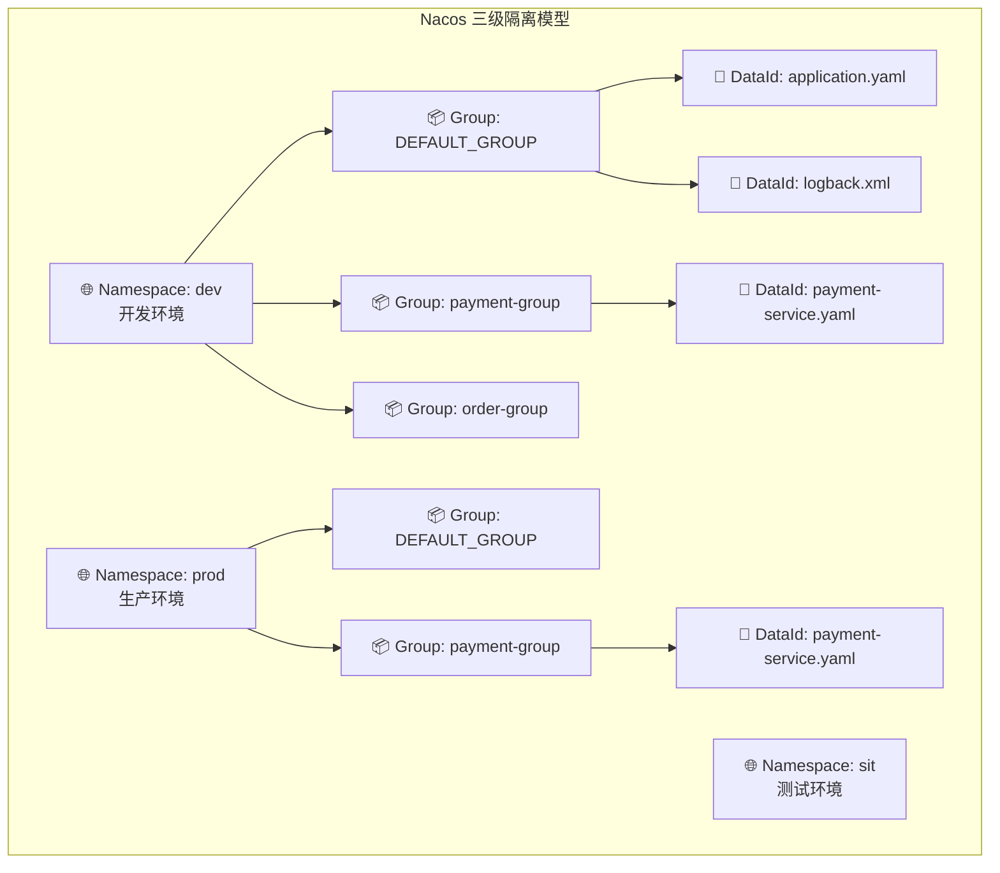
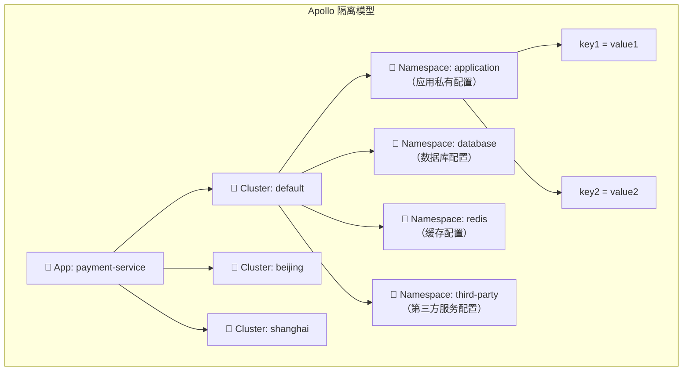
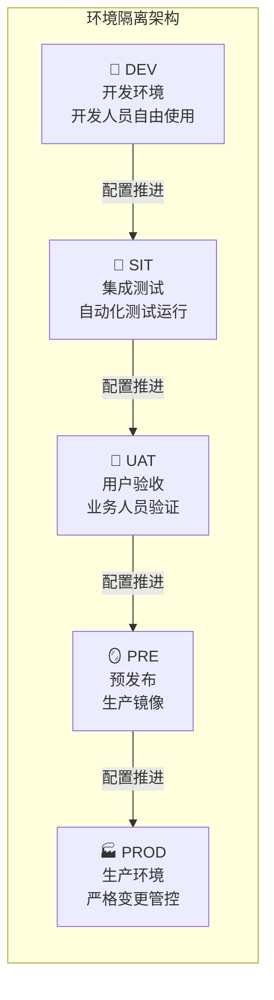
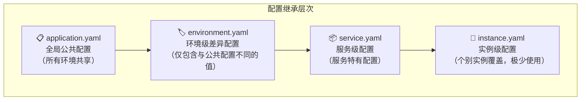
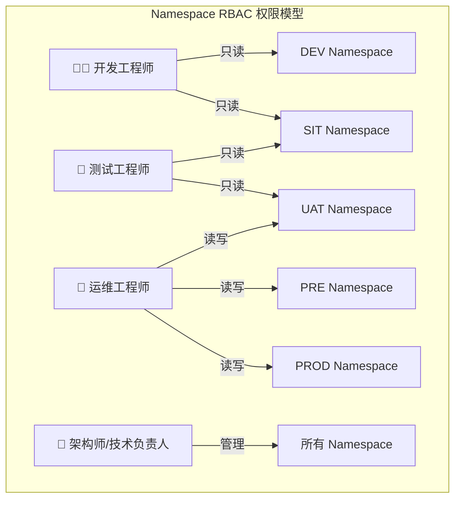
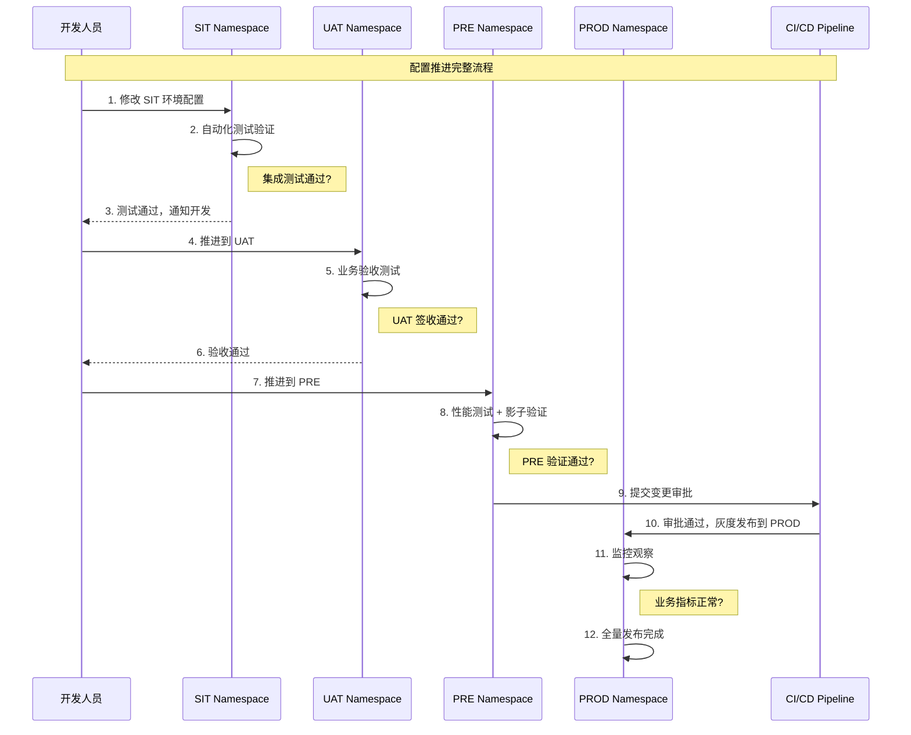

## 三Namespace隔离：多环境多租户的配置隔离策略

在微服务架构中，一个典型的企业级系统同时维护着 5 套环境（DEV / SIT / UAT / PRE / PROD），每套环境下可能有 3 个以上的集群，服务数量在 200-500 之间，配置项总量轻松突破百万级别。如果所有环境的配置混在一起管理，一个开发人员误改了生产环境的数据库连接串，后果不堪设想——轻则服务不可用，重则数据泄露或资金损失。

**Namespace 隔离**是配置中心解决这一问题的核心机制——通过在逻辑上划分独立的配置空间，确保不同环境、不同租户、不同业务线之间的配置互不干扰，同时支持合理的配置继承和覆盖策略，避免大量重复配置。可以将其类比为操作系统的进程隔离：每个 Namespace 就像一个独立的进程空间，彼此看不到对方的内存，只有通过显式的 IPC 机制才能通信。

---

### 1. Namespace 隔离的三级模型

主流配置中心都采用了层级化的配置组织模型，但具体的层级名称和组合方式略有不同。理解这些差异是正确设计隔离策略的前提。

#### 1.1 Nacos 的三级隔离模型

Nacos 采用 **Namespace → Group → DataId** 三级模型，这是目前最灵活的配置隔离架构：



**Namespace（命名空间）** 是最高层级的隔离维度，通常对应不同的环境或不同的租户。Nacos 中每个 Namespace 拥有独立的配置空间、用户权限和配额管理。Namespace 通过唯一的 ID 标识（推荐使用 UUID），支持自定义名称和描述。默认的 public Namespace 是所有配置的公共空间，不建议在生产环境中使用——因为它缺乏访问控制，任何服务都能读写其中的配置。

**Group（分组）** 是第二层级的隔离维度，用于在同一 Namespace 内进一步划分配置。Group 的典型用途包括：按业务线划分（payment-group、order-group、user-group）、按应用类型划分（spring-boot-group、golang-group）、按部署区域划分（cn-east-group、cn-south-group）。Group 没有强制的访问控制，主要起组织管理作用。

**DataId（数据标识）** 是最小粒度的配置单元，通常对应一个具体的配置文件或一组配置项。DataId 建议使用 `服务名.文件格式` 的命名约定，如 `payment-service.yaml`、`order-service.properties`。

```yaml
# Nacos 三级模型的配置组织示例
Namespace: dev (ID: 8a3b7c4d-e5f6-7890-abcd-ef1234567890)
├── Group: DEFAULT_GROUP
│   ├── DataId: application.yaml        # 全局公共配置
│   ├── DataId: logback-spring.xml      # 全局日志配置
│   └── DataId: datasource.yaml         # 公共数据源配置
├── Group: payment-group
│   ├── DataId: payment-service.yaml    # 支付服务配置
│   └── DataId: payment-callback.yaml   # 支付回调配置
└── Group: order-group
    ├── DataId: order-service.yaml      # 订单服务配置
    └── DataId: order-flow.yaml         # 订单流程配置

Namespace: prod (ID: 9b4c8d5e-f6a7-8901-bcde-f12345678901)
├── Group: DEFAULT_GROUP
│   ├── DataId: application.yaml        # 生产环境全局配置
│   └── ...
├── Group: payment-group
│   ├── DataId: payment-service.yaml    # 生产环境支付配置
│   └── DataId: payment-callback.yaml
└── Group: order-group
    └── ...
```

#### 1.2 Apollo 的 Namespace 模型

Apollo 采用了略有不同的隔离策略，其核心概念是 **App → Cluster → Namespace**：



**App（应用）** 是 Apollo 中的最高层级，每个微服务注册为一个 App。App 之间天然隔离——A 服务无法读取 B 服务的配置。这种设计使得权限管理天然粒度化：你只需要管理每个 App 的成员列表，就能控制谁能修改哪个服务的配置。

**Cluster（集群）** 是 App 下的第二层级，用于区分不同数据中心或部署集群。当不同集群需要不同配置（如数据库地址）时，Cluster 隔离变得必要。default 集群是默认选项，适用于大部分场景。Cluster 的设计使得同一服务可以部署在多个机房，每个机房使用不同的基础设施配置，而无需创建多个 App。

**Namespace（命名空间）** 是 Apollo 中最核心的隔离维度，每个 Namespace 代表一组配置的集合。Apollo 的 Namespace 分为两种类型：

- **私有 Namespace**：属于某个特定 App，只有该 App 能读取。用于存储该服务特有的配置
- **公共 Namespace**：跨 App 共享的配置，所有 App 都能引用。用于存储通用配置（如数据源、日志格式）

| 维度 | Nacos | Apollo |
|------|-------|--------|
| 最高层级 | Namespace（环境/租户） | App（应用） |
| 中间层级 | Group（分组） | Cluster（集群） |
| 最低层级 | DataId（配置文件） | Namespace（配置集） |
| 跨应用共享 | 通过公共 Namespace + Group | 通过公共 Namespace |
| 典型用途 | 多环境 + 多租户 | 多应用 + 多集群 |
| 权限粒度 | Namespace 级别 | App × Cluster × Namespace 三维 |

#### 1.3 其他配置中心的隔离模型

除了 Nacos 和 Apollo，其他主流配置中心也各有独特的隔离策略：

**Consul KV Store** 采用 **路径前缀隔离**模型，通过 Key 的路径层级实现逻辑隔离：

```bash
# Consul KV 的路径隔离结构
config/
├── dev/
│   ├── payment-service/
│   │   ├── database.yml
│   │   └── redis.yml
│   └── order-service/
│       └── database.yml
├── sit/
│   ├── payment-service/
│   │   └── database.yml
│   └── ...
└── prod/
    ├── payment-service/
    │   └── database.yml
    └── ...
```

Consul 的优势在于与服务发现深度集成——配置路径可以和服务注册路径统一管理，适合已使用 Consul 作为服务网格的团队。但 Consul 缺乏原生的配置版本管理和灰度推送能力。

**ZooKeeper** 采用 **ZNode 树形结构**隔离，通过 `/` 分隔的路径层级组织配置：

```bash
# ZooKeeper ZNode 配置路径
/config-center/
├── dev/
│   ├── payment-service
│   └── order-service
└── prod/
    ├── payment-service
    └── order-service
```

ZooKeeper 的强一致性保证（ZAB 协议）使得配置变更具有原子性，但 Watcher 机制的限制（一次性触发、需要重新注册）增加了客户端复杂度。对于配置变更频繁的场景，ZooKeeper 的性能不如 Nacos 或 Apollo。

#### 1.4 选择适合的隔离模型

选择哪种模型取决于团队规模、组织架构和技术栈：

| 场景 | 推荐方案 | 理由 |
|------|---------|------|
| 初创团队（<10 服务） | Nacos Namespace + DEFAULT_GROUP | 简单直接，运维成本低 |
| 中型团队（10-50 服务） | Nacos 完整三级模型 | 按业务线分组，灵活度高 |
| 大型企业（50+ 服务） | Apollo App + Cluster + Namespace | 天然支持多应用管理，权限精细 |
| 已有 Consul 基础设施 | Consul KV + 路径前缀 | 与服务发现统一管理 |
| 强一致性要求 | ZooKeeper + ZNode 路径 | ZAB 协议保证配置原子性 |
| 混合技术栈 | Nacos（多语言 SDK 覆盖最广） | Java/Go/Python/C++ SDK |

---

### 2. 多环境隔离方案设计

多环境隔离是 Namespace 最核心的应用场景。一个典型的企业级系统需要管理 5 套环境，每套环境的配置存在大量差异，同时又存在大量可复用的公共配置。

#### 2.1 五层环境架构



每套环境的配置差异主要体现在以下方面：

| 配置维度 | DEV | SIT | UAT | PRE | PROD |
|----------|-----|-----|-----|-----|------|
| 数据库地址 | localhost | 内网测试库 | 内网准生产库 | 生产只读副本 | 生产主库 |
| 缓存地址 | localhost:6379 | 内网测试Redis | 内网准生产Redis | 生产从节点 | 生产主节点 |
| 日志级别 | DEBUG | INFO | INFO | WARN | WARN |
| 连接池大小 | 5 | 10 | 20 | 50 | 100 |
| 限流阈值 | 无限制 | 1000 QPS | 5000 QPS | 20000 QPS | 50000 QPS |
| 超时时间 | 60s | 30s | 15s | 10s | 5s |
| 敏感信息 | mock值 | 测试密钥 | 测试密钥 | 加密值 | 加密值 |
| 第三方回调URL | localhost | 内网地址 | 内网地址 | 预发布域名 | 正式域名 |
| 链路追踪采样率 | 100% | 50% | 20% | 5% | 1% |
| 熔断阈值 | 关闭 | 50%错误率 | 50%错误率 | 30%错误率 | 30%错误率 |

#### 2.2 Nacos 多环境隔离实现

Nacos 通过 Namespace 实现环境隔离，推荐为每个环境创建独立的 Namespace：

```bash
# 创建环境 Namespace
# 开发环境
curl -X POST 'http://localhost:8848/nacos/v1/console/namespaces' \
  -d 'namespaceId=dev-env&amp;namespaceName=开发环境&amp;namespaceDesc=DEV环境配置'

# 测试环境
curl -X POST 'http://localhost:8848/nacos/v1/console/namespaces' \
  -d 'namespaceId=sit-env&amp;namespaceName=测试环境&amp;namespaceDesc=SIT环境配置'

# 生产环境
curl -X POST 'http://localhost:8848/nacos/v1/console/namespaces' \
  -d 'namespaceId=prod-env&amp;namespaceName=生产环境&amp;namespaceDesc=PROD环境配置'
```

客户端通过 Namespace ID 指定读取哪个环境的配置：

```yaml
# application.yaml - Nacos 多环境配置
spring:
  cloud:
    nacos:
      config:
        server-addr: nacos-server:8848
        # 通过环境变量注入 Namespace
        namespace: ${NACOS_NAMESPACE:dev-env}
        group: DEFAULT_GROUP
        file-extension: yaml
        # 共享配置（跨环境复用）
        extension-configs:
          - data-id: common-config.yaml
            group: SHARED_GROUP
            refresh: true
          - data-id: datasource-config.yaml
            group: SHARED_GROUP
            refresh: true
```

```bash
# 启动时通过环境变量指定环境
# DEV 环境
NACOS_NAMESPACE=dev-env java -jar my-service.jar

# SIT 环境
NACOS_NAMESPACE=sit-env java -jar my-service.jar

# PROD 环境
NACOS_NAMESPACE=prod-env java -jar my-service.jar
```

**启动时 Namespace 验证**：服务启动后应立即校验 Namespace 是否正确注入，防止配置读取到错误环境：

```python
import os
import sys
import logging

logger = logging.getLogger(__name__)

def validate_namespace():
    """
    启动时验证 Namespace 配置
    
    防止生产环境误连开发环境数据库的经典事故：
    1. 检查 Namespace 环境变量是否设置
    2. 检查 Namespace 是否在允许列表中
    3. 打印当前环境信息便于排查
    """
    namespace = os.environ.get("NACOS_NAMESPACE")
    allowed_namespaces = ["dev-env", "sit-env", "uat-env", "pre-env", "prod-env"]
    
    if not namespace:
        logger.error("NACOS_NAMESPACE 未设置！服务将使用默认 Namespace，可能导致配置混乱")
        sys.exit(1)
    
    if namespace not in allowed_namespaces:
        logger.error(f"未知的 Namespace: {namespace}，允许值: {allowed_namespaces}")
        sys.exit(1)
    
    logger.info(
        f"✅ 配置环境确认 | Namespace={namespace} "
        f"| Profile={os.environ.get('SPRING_PROFILES_ACTIVE', '未设置')} "
        f"| Host={os.environ.get('HOSTNAME', 'unknown')}"
    )
```

#### 2.3 Apollo 多环境隔离实现

Apollo 通过独立部署 Portal + 环境变量注入实现多环境隔离：

```properties
# Apollo 多环境配置
# application.properties
env=dev
apollo.configService=http://config-server-dev:8080
apollo.bootstrap.enable=true

# 不同环境通过 JVM 参数覆盖
# java -Denv=dev -jar my-service.jar
# java -Denv=sit -jar my-service.jar
# java -Denv=prod -jar my-service.jar
```

Apollo 的环境隔离体现在多个层面：

- **Portal 层面**：Portal 支持关联多个环境，管理员在同一个 Portal 上切换环境查看配置。一个 Portal 可以同时管理 DEV/SIT/UAT/PRE/PROD 五个环境的配置
- **Config Service 层面**：每个环境独立部署一套 Config Service 集群，配置数据存储在各自的数据库中，物理层面彻底隔离
- **客户端层面**：通过 `env` 参数决定连接哪个环境的 Config Service，不同环境的 Config Service 地址可以不同
- **配置内容层面**：不同环境的配置在各自的 Config Service 数据库中独立存储，互不影响

#### 2.4 GitOps 环境隔离

在 GitOps 模式下，环境隔离通过目录结构和分支策略实现：

config-repo/
├── base/                          # 基础配置（所有环境共享）
│   ├── application.yaml
│   ├── logback.xml
│   └── common.properties
├── overlays/                      # 环境差异配置
│   ├── dev/
│   │   ├── kustomization.yaml
│   │   └── config-patch.yaml
│   ├── sit/
│   │   ├── kustomization.yaml
│   │   └── config-patch.yaml
│   ├── uat/
│   │   ├── kustomization.yaml
│   │   └── config-patch.yaml
│   ├── pre/
│   │   ├── kustomization.yaml
│   │   └── config-patch.yaml
│   └── prod/
│       ├── kustomization.yaml
│       └── config-patch.yaml

```yaml
# overlays/prod/kustomization.yaml
apiVersion: kustomize.config.k8s.io/v1beta1
kind: Kustomization

resources:
  - ../../base

patches:
  - path: config-patch.yaml

namespace: production
```

```yaml
# overlays/prod/config-patch.yaml
apiVersion: v1
kind: ConfigMap
metadata:
  name: my-service-config
data:
  spring.profiles.active: "prod"
  db.pool.size: "100"
  log.level: "WARN"
  timeout.ms: "5000"
```

**GitOps 模式下的分支策略**：

```bash
# 推荐的分支策略
main          # 生产配置（PROD），合并需要两人审批
├── release/* # 预发布配置（PRE），从 main 切出
├── staging/* # UAT/SIT 配置，从 main 切出
└── develop/* # 开发配置，开发人员自由提交
```

GitOps 模式的关键优势在于所有配置变更都有 Git 历史记录，支持 `git blame` 追溯每次修改的作者和时间，`git revert` 快速回滚到任意历史版本。

---

### 3. 跨环境配置继承与覆盖

多环境隔离的难点不在于"隔离"本身，而在于如何在隔离的基础上实现配置的合理复用。如果每个环境都维护完整的独立配置，配置总量会膨胀到难以维护的程度；如果共享太多，又容易出现环境间的意外耦合。

#### 3.1 配置继承策略

推荐采用**层级覆盖模型**：公共配置作为基线，各环境在基线上进行增量覆盖。



**配置合并的优先级规则**（从低到高）：

1. **application.yaml**（全局公共配置）—— 最低优先级
2. **environment.yaml**（环境级配置）—— 覆盖全局配置
3. **service.yaml**（服务级配置）—— 覆盖环境级配置
4. **instance.yaml**（实例级配置）—— 最高优先级，仅调试时使用

**为什么需要四层继承？** 以一个真实场景为例：支付服务在 5 个环境中运行，90% 的配置项（如日志格式、序列化方式、线程池参数）在所有环境完全相同。如果不使用继承，每个环境维护 500 个配置项，总共 2500 个配置项；使用继承后，公共层 450 个 + 每环境差异 10 个，总共 500 个配置项——维护量降低 80%。

```python
"""配置继承与合并的实现"""
from typing import Dict, Any, Optional
from dataclasses import dataclass, field
from enum import Enum


class ConfigLevel(Enum):
    """配置层级，数值越大优先级越高"""
    GLOBAL = 0      # 全局公共配置
    ENVIRONMENT = 1  # 环境级配置
    SERVICE = 2      # 服务级配置
    INSTANCE = 3     # 实例级配置


@dataclass
class ConfigItem:
    """单个配置项"""
    key: str
    value: str
    level: ConfigLevel
    source: str  # 配置来源标识（如 Namespace 名称）


class ConfigInheritanceManager:
    """
    配置继承管理器
    
    实现多层级配置的合并逻辑：
    - 高优先级层级的配置覆盖低优先级层级
    - 同一 key 在不同层级出现时，取最高优先级的值
    - 支持审计追踪：每个最终配置项都可以追溯来源
    """
    
    def __init__(self):
        # 按优先级存储各层级的配置
        self._configs: Dict[ConfigLevel, Dict[str, ConfigItem]] = {
            level: {} for level in ConfigLevel
        }
    
    def set_config(self, key: str, value: str, 
                   level: ConfigLevel, source: str = ""):
        """设置某个层级的配置项"""
        self._configs[level][key] = ConfigItem(
            key=key, value=value, level=level, source=source
        )
    
    def get_config(self, key: str) -> Optional[ConfigItem]:
        """
        获取配置项，按优先级从高到低查找
        
        查找顺序：实例级 → 服务级 → 环境级 → 全局级
        返回最高优先级层级中存在的值
        """
        for level in sorted(ConfigLevel, key=lambda l: l.value, reverse=True):
            if key in self._configs[level]:
                return self._configs[level][key]
        return None
    
    def get_all_configs(self) -> Dict[str, ConfigItem]:
        """获取所有配置的最终合并结果"""
        merged = {}
        # 按优先级从低到高覆盖
        for level in sorted(ConfigLevel, key=lambda l: l.value):
            for key, item in self._configs[level].items():
                merged[key] = item
        return merged
    
    def get_config_audit(self, key: str) -> list:
        """
        获取某个配置项的审计信息
        展示该 key 在所有层级中的值和来源
        """
        audit = []
        for level in sorted(ConfigLevel, key=lambda l: l.value):
            if key in self._configs[level]:
                item = self._configs[level][key]
                audit.append({
                    "level": level.name,
                    "value": item.value,
                    "source": item.source,
                    "is_effective": False  # 占位，后面标记
                })
        # 标记最终生效的值
        if audit:
            audit[-1]["is_effective"] = True
        return audit


# === 使用示例 ===
manager = ConfigInheritanceManager()

# 全局公共配置
manager.set_config("log.level", "INFO", ConfigLevel.GLOBAL, "application.yaml")
manager.set_config("db.pool.size", "20", ConfigLevel.GLOBAL, "application.yaml")
manager.set_config("redis.timeout", "3000", ConfigLevel.GLOBAL, "application.yaml")

# 环境级覆盖（生产环境）
manager.set_config("log.level", "WARN", ConfigLevel.ENVIRONMENT, "prod-env")
manager.set_config("db.pool.size", "100", ConfigLevel.ENVIRONMENT, "prod-env")

# 服务级覆盖（支付服务）
manager.set_config("db.pool.size", "150", ConfigLevel.SERVICE, "payment-service")

# 最终结果
final = manager.get_all_configs()
# log.level  = WARN      （来自 prod-env）
# db.pool.size = 150     （来自 payment-service，最高优先级）
# redis.timeout = 3000   （来自全局公共配置，无覆盖）

# 审计追踪
audit = manager.get_config_audit("db.pool.size")
# [
#   {"level": "GLOBAL", "value": "20", "source": "application.yaml", "is_effective": False},
#   {"level": "ENVIRONMENT", "value": "100", "source": "prod-env", "is_effective": False},
#   {"level": "SERVICE", "value": "150", "source": "payment-service", "is_effective": True}
# ]
```

#### 3.2 Nacos 中的配置继承实现

Nacos 通过 `extension-configs` 和 `shared-configs` 实现配置的组合继承：

```yaml
# application.yaml
spring:
  cloud:
    nacos:
      config:
        server-addr: nacos-server:8848
        namespace: ${NACOS_NAMESPACE:dev-env}
        
        # 主配置文件（服务级，最高优先级）
        file-extension: yaml
        
        # 共享配置（环境级，优先级低于主配置）
        # 所有服务共享的环境级配置
        shared-configs:
          - data-id: environment-common.yaml
            group: ENV_GROUP
            refresh: true
          - data-id: datasource-pool.yaml
            group: ENV_GROUP
            refresh: true
        
        # 扩展配置（业务级，优先级低于共享配置）
        extension-configs:
          - data-id: logging-config.yaml
            group: SHARED_GROUP
            refresh: true
          - data-id: security-config.yaml
            group: SHARED_GROUP
            refresh: true
```

Nacos 的配置优先级排序（从低到高）：

1. `shared-configs`（共享配置，按数组顺序，索引越大优先级越高）
2. `extension-configs`（扩展配置，按数组顺序，索引越大优先级越高）
3. `file-extension` 指定的主配置文件（最高优先级）

**配置命名的最佳实践**：

# 推荐的 Nacos DataId 命名规范
{服务名}.yaml                    # 服务私有配置（最高优先级）
{环境}-common.yaml               # 环境公共配置（如 prod-common.yaml）
{模块}-config.yaml               # 模块级共享配置（如 datasource-config.yaml）
application.yaml                 # 全局默认配置（最低优先级）

#### 3.3 Apollo 中的配置继承实现

Apollo 通过 Namespace 的引用关系实现配置继承：

# Apollo 配置继承层次（优先级从低到高）
application (App私有)
  └── 关联公共 Namespace: common-db
        └── 数据库相关配置
  └── 关联公共 Namespace: common-redis
        └── Redis 相关配置
  └── 关联公共 Namespace: common-log
        └── 日志相关配置
  └── application 本身的配置（最高优先级）

Apollo 的公共 Namespace 支持跨 App 引用，一个公共 Namespace 可以被多个 App 同时引用。引用时需要指定一个唯一的 fallback Namespace 名称，当公共 Namespace 的配置项与 App 私有 Namespace 冲突时，App 私有配置优先。

```java
// Apollo 配置引用示例
// 在 Spring Boot 中通过 @ApolloConfig 引用公共 Namespace
@Configuration
public class ConfigProperties {
    
    // 引用公共 Namespace 中的数据库配置
    @Value("${db.url:jdbc:mysql://localhost:3306/default_db}")
    private String dbUrl;
    
    @Value("${db.pool.size:20}")
    private int poolSize;
    
    // App 私有 Namespace 的配置优先
    @Value("${payment.callback.url:}")
    private String callbackUrl;
}
```

---

### 4. 多租户隔离方案

多租户隔离是 SaaS 平台和中台架构中的核心需求。与环境隔离不同，多租户隔离要求不同租户之间的配置完全不可见、不可访问。

#### 4.1 租户隔离模型选择

| 隔离模型 | 隔离级别 | 资源开销 | 运维复杂度 | 适用场景 |
|----------|---------|---------|-----------|---------|
| 独立 Namespace | 物理隔离 | 高（每租户一套配置） | 高 | 大客户、合规要求高 |
| 共享 Namespace + Group | 逻辑隔离 | 中 | 中 | 中小客户、标准SaaS |
| 共享 Namespace + Key前缀 | 最弱隔离 | 低 | 低 | 内部多团队共享 |

**独立 Namespace 模型**（推荐用于 SaaS 平台）：

每个租户分配独立的 Namespace，通过访问控制确保租户只能操作自己的 Namespace。这种模型的隔离级别最高，但也意味着租户数量较多时配置管理开销大。

```bash
# 为每个租户创建独立的 Namespace
# 租户 A
curl -X POST 'http://nacos:8848/nacos/v1/console/namespaces' \
  -d 'namespaceId=tenant-a&amp;namespaceName=租户A&amp;namespaceDesc=SaaS租户A的配置空间'

# 租户 B
curl -X POST 'http://nacos:8848/nacos/v1/console/namespaces' \
  -d 'namespaceId=tenant-b&amp;namespaceName=租户B&amp;namespaceDesc=SaaS租户B的配置空间'
```

**共享 Namespace + Group 模型**（适用于轻量级 SaaS）：

所有租户共享同一个 Namespace，通过 Group 区分不同租户。运维简单，但隔离级别较低，依赖访问控制来保证安全。

```yaml
# 共享 Namespace 下按租户分组
Namespace: saas-platform
├── Group: tenant-a
│   ├── DataId: feature-flags.yaml    # 租户A的功能开关
│   └── DataId: rate-limit.yaml       # 租户A的限流配置
├── Group: tenant-b
│   ├── DataId: feature-flags.yaml    # 租户B的功能开关
│   └── DataId: rate-limit.yaml       # 租户B的限流配置
└── Group: platform-shared
    ├── DataId: platform-config.yaml  # 平台公共配置
    └── DataId: billing-config.yaml   # 计费系统配置
```

**租户数量与模型选择的决策矩阵**：

| 租户数量 | 推荐模型 | 理由 |
|---------|---------|------|
| <50 | 独立 Namespace | 数量可控，隔离性优先 |
| 50-500 | 独立 Namespace + 批量管理工具 | 需要自动化运维 |
| 500-5000 | 按套餐分级：企业版独立 NS，基础版共享 NS | 兼顾隔离性和成本 |
| 5000+ | 共享 Namespace + Group | 独立 NS 的管理开销不可接受 |

#### 4.2 租户配置继承体系

SaaS 平台通常采用"平台默认 → 行业模板 → 租户自定义"三层继承模型：


```python
"""SaaS 多租户配置管理器"""
from typing import Dict, Optional, List
from dataclasses import dataclass
import hashlib
import json


@dataclass
class TenantConfig:
    tenant_id: str
    industry: str  # 行业：finance, ecommerce, education
    plan: str      # 套餐：free, basic, enterprise


class SaaSConfigManager:
    """
    SaaS 多租户配置管理器
    
    实现三层配置继承：
    1. 平台默认配置 → 所有租户共享
    2. 行业模板配置 → 按行业继承
    3. 租户自定义配置 → 最高优先级
    """
    
    def __init__(self):
        self.platform_defaults: Dict[str, str] = {}
        self.industry_templates: Dict[str, Dict[str, str]] = {}
        self.tenant_overrides: Dict[str, Dict[str, str]] = {}
    
    def load_platform_defaults(self, configs: Dict[str, str]):
        """加载平台级默认配置"""
        self.platform_defaults = configs.copy()
    
    def load_industry_template(self, industry: str, configs: Dict[str, str]):
        """加载行业模板配置"""
        self.industry_templates[industry] = configs.copy()
    
    def set_tenant_config(self, tenant_id: str, configs: Dict[str, str]):
        """设置租户自定义配置"""
        self.tenant_overrides[tenant_id] = configs.copy()
    
    def get_effective_config(self, tenant_id: str, industry: str) -> Dict[str, str]:
        """
        获取租户的最终生效配置
        
        合并顺序（优先级从低到高）：
        平台默认 → 行业模板 → 租户自定义
        """
        result = {}
        
        # 第一层：平台默认
        result.update(self.platform_defaults)
        
        # 第二层：行业模板
        if industry in self.industry_templates:
            result.update(self.industry_templates[industry])
        
        # 第三层：租户自定义
        if tenant_id in self.tenant_overrides:
            result.update(self.tenant_overrides[tenant_id])
        
        return result
    
    def get_config_diff(self, tenant_id: str, industry: str) -> Dict:
        """对比租户配置与平台默认的差异，用于审计和排查"""
        effective = self.get_effective_config(tenant_id, industry)
        diff = {
            "inherited_from_platform": {},
            "inherited_from_industry": {},
            "custom_by_tenant": {}
        }
        
        for key, value in effective.items():
            if tenant_id in self.tenant_overrides and \
               key in self.tenant_overrides[tenant_id]:
                diff["custom_by_tenant"][key] = value
            elif industry in self.industry_templates and \
                 key in self.industry_templates[industry]:
                diff["inherited_from_industry"][key] = value
            elif key in self.platform_defaults:
                diff["inherited_from_platform"][key] = value
        
        return diff
    
    def bulk_provision(self, tenants: List[TenantConfig]):
        """
        批量初始化租户配置
        
        新租户开通时，自动创建其 Namespace 并填充继承后的配置
        """
        results = []
        for tenant in tenants:
            effective_config = self.get_effective_config(
                tenant.tenant_id, tenant.industry
            )
            # 实际场景中这里会调用 Nacos/Apollo API 创建 Namespace 并写入配置
            results.append({
                "tenant_id": tenant.tenant_id,
                "namespace_id": f"tenant-{tenant.tenant_id}",
                "config_count": len(effective_config),
                "industry": tenant.industry,
                "plan": tenant.plan
            })
        return results


# === 使用示例 ===
manager = SaaSConfigManager()

# 平台默认配置
manager.load_platform_defaults({
    "log.level": "INFO",
    "cache.ttl": "3600",
    "max.connections": "100",
    "feature.dark.mode": "false",
})

# 金融行业模板（增加金融合规配置）
manager.load_industry_template("finance", {
    "log.level": "WARN",          # 覆盖：金融行业日志级别更高
    "audit.enabled": "true",       # 新增：金融审计
    "data.encryption": "AES256",   # 新增：数据加密
    "max.connections": "500",      # 覆盖：金融行业连接池更大
})

# 租户自定义
manager.set_tenant_config("tenant-001", {
    "max.connections": "1000",     # 覆盖：大客户更高连接数
    "feature.dark.mode": "true",  # 覆盖：该租户启用暗色模式
    "custom.branding": "bank-of-china",  # 新增：自定义品牌
})

# 最终生效配置
config = manager.get_effective_config("tenant-001", "finance")
# {
#   "log.level": "WARN",            ← 来自金融行业模板
#   "cache.ttl": "3600",            ← 来自平台默认
#   "max.connections": "1000",      ← 来自租户自定义（最高优先级）
#   "feature.dark.mode": "true",    ← 来自租户自定义
#   "audit.enabled": "true",        ← 来自金融行业模板
#   "data.encryption": "AES256",    ← 来自金融行业模板
#   "custom.branding": "bank-of-china" ← 来自租户自定义
# }
```

---

### 5. Namespace 访问控制与安全

Namespace 隔离如果缺乏严格的访问控制，形同虚设。生产环境中必须实施最小权限原则，确保每个角色只能访问其职责范围内的 Namespace。

#### 5.1 RBAC 权限模型



Nacos 的权限控制配置：

```bash
# Nacos 权限配置示例

# 创建角色
# 运维角色 - 可操作所有环境
curl -X POST 'http://nacos:8848/nacos/v1/auth/role' \
  -d 'role=ops&amp;username=admin'

# 开发角色 - 只能操作 DEV 和 SIT
curl -X POST 'http://nacos:8848/nacos/v1/auth/role' \
  -d 'role=developer&amp;username=zhangsan'

# 授权角色对 Namespace 的访问权限
# 运维角色 - 所有 Namespace 读写权限
curl -X POST 'http://nacos:8848/nacos/v1/auth/permission' \
  -d 'role=ops&amp;action=rw&amp;namespace=dev-env&amp;resource='
curl -X POST 'http://nacos:8848/nacos/v1/auth/permission' \
  -d 'role=ops&amp;action=rw&amp;namespace=prod-env&amp;resource='

# 开发角色 - DEV 和 SIT 只读权限
curl -X POST 'http://nacos:8848/nacos/v1/auth/permission' \
  -d 'role=developer&amp;action=r&amp;namespace=dev-env&amp;resource='
curl -X POST 'http://nacos:8848/nacos/v1/auth/permission' \
  -d 'role=developer&amp;action=r&amp;namespace=sit-env&amp;resource='
```

Apollo 的权限控制更加精细，支持 **项目级别 + 环境级别 + 权限类型** 的三维权限矩阵：

| 角色 | DEV 权限 | SIT 权限 | UAT 权限 | PRE 权限 | PROD 权限 |
|------|---------|---------|---------|---------|----------|
| 开发人员 | 可编辑 | 只读 | 只读 | 无权限 | 无权限 |
| 测试人员 | 只读 | 可编辑 | 可编辑 | 只读 | 无权限 |
| 运维人员 | 可编辑 | 可编辑 | 可编辑 | 可编辑 | 可编辑（需审批） |
| 架构师 | 全部权限 | 全部权限 | 全部权限 | 全部权限 | 全部权限 |

#### 5.2 敏感配置的 Namespace 隔离策略

敏感配置（数据库密码、API 密钥、证书私钥等）应放在独立的 Namespace 中，并实施更严格的访问控制：

```yaml
# 敏感配置的 Namespace 隔离设计
Namespace: prod
├── Group: app-config
│   ├── DataId: payment-service.yaml       # 业务配置（普通权限可读）
│   └── DataId: order-service.yaml
├── Group: security-config                  # 敏感配置分组
│   ├── DataId: database-credentials.yaml  # 数据库凭证（加密存储）
│   ├── DataId: api-keys.yaml              # 第三方 API 密钥（加密存储）
│   └── DataId: certificates.yaml          # TLS 证书和私钥
└── Group: infra-config                     # 基础设施配置
    ├── DataId: nginx-upstream.yaml        # Nginx 上游配置
    └── DataId: redis-cluster.yaml         # Redis 集群地址
```

**敏感配置的分类与保护等级**：

| 敏感级别 | 配置类型 | 存储方式 | 访问控制 | 审计要求 |
|---------|---------|---------|---------|---------|
| L1-高 | 数据库密码、私钥 | KMS 加密存储 | 仅运维角色 | 每次读取记录审计日志 |
| L2-中 | API 密钥、Token | 配置中心加密 | 运维+架构师 | 变更时记录审计日志 |
| L3-低 | 内网地址、端口 | 明文存储 | 普通权限可读 | 变更时记录审计日志 |

敏感配置的读取应通过专门的 SDK 接口，而非普通配置读取接口：

```python
"""敏感配置的安全读取模式"""
import os
from typing import Optional


class SecureConfigReader:
    """
    安全配置读取器
    
    敏感配置的读取原则：
    1. 永远不在日志中打印敏感值
    2. 内存中使用后尽快清理
    3. 支持自动轮转（定期刷新密钥）
    4. 审计日志记录谁在何时读取了什么敏感配置
    """
    
    def __init__(self, config_client):
        self._client = config_client
        self._sensitive_keys = set()
        self._audit_log = []
    
    def register_sensitive_key(self, key: str):
        """标记某个 key 为敏感配置"""
        self._sensitive_keys.add(key)
    
    def get(self, key: str, default: Optional[str] = None) -> Optional[str]:
        """
        读取配置项
        
        敏感配置额外处理：
        - 记录审计日志
        - 不通过普通 get 接口暴露
        """
        value = self._client.get(key, default)
        
        if key in self._sensitive_keys:
            self._audit_log.append({
                "action": "read_sensitive",
                "key": key,
                "caller": self._get_caller_info(),
                "timestamp": self._current_timestamp()
            })
            # 敏感值不进入普通缓存
            return value
        
        return value
    
    def get_decrypted(self, key: str) -> Optional[str]:
        """
        读取并解密敏感配置
        
        适用于数据库密码、API 密钥等加密存储的配置
        """
        encrypted_value = self.get(key)
        if encrypted_value is None:
            return None
        
        # 实际场景中调用 KMS 解密
        decrypted = self._decrypt(encrypted_value)
        
        self._audit_log.append({
            "action": "decrypt_sensitive",
            "key": key,
            "caller": self._get_caller_info(),
            "timestamp": self._current_timestamp()
        })
        
        return decrypted
    
    def _decrypt(self, encrypted_value: str) -> str:
        """调用 KMS 解密（实际项目中对接密钥管理服务）"""
        # 伪代码：实际使用 KMS SDK
        # return kms_client.decrypt(encrypted_value)
        return encrypted_value
    
    def _get_caller_info(self) -> str:
        """获取调用者信息（服务名 + 实例 IP）"""
        hostname = os.environ.get("HOSTNAME", "unknown")
        pod_ip = os.environ.get("POD_IP", "unknown")
        return f"{hostname}@{pod_ip}"
    
    def _current_timestamp(self) -> float:
        import time
        return time.time()
```

---

### 6. 配置变更在 Namespace 间的传播

当配置在某个 Namespace 中变更后，如何确保对应的客户端及时感知？不同环境之间的配置变更是独立的，但跨环境的配置复制和同步又是常见需求。

#### 6.1 环境间的配置推进流程

配置从 DEV 到 PROD 的推进不是简单的复制，而是一个包含验证、审批、灰度的完整流程：



#### 6.2 配置同步工具实现

在实际生产中，经常需要将某个环境的配置同步到另一个环境（如将 SIT 验证通过的配置推进到 UAT）。这个操作必须有审计记录和变更确认：

```python
"""配置环境推进工具"""
from dataclasses import dataclass
from typing import Dict, List, Optional
from datetime import datetime
import json


@dataclass
class ConfigChangeRecord:
    """配置变更记录"""
    key: str
    old_value: Optional[str]
    new_value: str
    source_namespace: str
    target_namespace: str
    operator: str
    timestamp: str
    approved_by: Optional[str] = None


class ConfigPromotionTool:
    """
    配置环境推进工具
    
    支持配置从低环境向高环境推进，包含以下安全机制：
    1. 变更差异对比：推进前展示所有变更
    2. 审批流程：生产环境推进需要审批
    3. 审计日志：记录所有推进操作
    4. 回滚能力：推进失败时快速回滚
    """
    
    ENV_ORDER = ["dev", "sit", "uat", "pre", "prod"]
    
    def __init__(self, config_client):
        self._client = config_client
        self._promotion_history: List[ConfigChangeRecord] = []
    
    def compare_namespaces(self, source_ns: str, target_ns: str) -> List[Dict]:
        """
        对比源和目标 Namespace 的配置差异
        
        返回所有需要变更的配置项，包含当前值和期望值
        """
        source_configs = self._client.get_all(source_ns)
        target_configs = self._client.get_all(target_ns)
        
        diff = []
        all_keys = set(source_configs.keys()) | set(target_configs.keys())
        
        for key in sorted(all_keys):
            source_val = source_configs.get(key)
            target_val = target_configs.get(key)
            
            if source_val != target_val:
                diff.append({
                    "key": key,
                    "action": "add" if target_val is None else "update",
                    "current_value": target_val,
                    "new_value": source_val,
                })
        
        return diff
    
    def promote(self, source_ns: str, target_ns: str, 
                operator: str, changes: Optional[List[str]] = None,
                approved_by: Optional[str] = None) -> Dict:
        """
        执行配置推进
        
        参数：
        - source_ns: 源环境 Namespace（如 dev-env）
        - target_ns: 目标环境 Namespace（如 sit-env）
        - operator: 操作人
        - changes: 指定要推进的 key 列表（None 表示全部）
        - approved_by: 审批人（PROD 环境必须提供）
        
        返回推进结果
        """
        # 校验环境推进方向（只能从低到高）
        source_idx = self.ENV_ORDER.index(
            source_ns.split("-")[0]
        ) if source_ns.split("-")[0] in self.ENV_ORDER else -1
        target_idx = self.ENV_ORDER.index(
            target_ns.split("-")[0]
        ) if target_ns.split("-")[0] in self.ENV_ORDER else -1
        
        if source_idx >= target_idx:
            return {
                "success": False,
                "error": f"不允许从高环境({source_ns})向低环境({target_ns})推进"
            }
        
        # 生产环境必须有审批人
        if "prod" in target_ns and not approved_by:
            return {
                "success": False,
                "error": "生产环境配置推进必须经过审批"
            }
        
        # 获取差异
        diff = self.compare_namespaces(source_ns, target_ns)
        
        # 如果指定了 changes，只推进指定的 key
        if changes:
            diff = [d for d in diff if d["key"] in changes]
        
        if not diff:
            return {"success": True, "message": "无配置差异，无需推进"}
        
        # 执行推进
        applied_changes = []
        for item in diff:
            source_val = self._client.get(source_ns, item["key"])
            
            # 写入目标 Namespace
            self._client.set(target_ns, item["key"], source_val)
            
            record = ConfigChangeRecord(
                key=item["key"],
                old_value=item["current_value"],
                new_value=source_val,
                source_namespace=source_ns,
                target_namespace=target_ns,
                operator=operator,
                timestamp=datetime.now().isoformat(),
                approved_by=approved_by
            )
            self._promotion_history.append(record)
            applied_changes.append(record)
        
        return {
            "success": True,
            "promoted_count": len(applied_changes),
            "changes": [
                {
                    "key": r.key,
                    "old_value": r.old_value,
                    "new_value": r.new_value
                } for r in applied_changes
            ]
        }
    
    def rollback(self, target_ns: str, keys: List[str], 
                 operator: str) -> Dict:
        """
        回滚指定 Namespace 中的指定配置项
        
        使用最近一次推进前的值进行回滚
        """
        rolled_back = []
        for record in reversed(self._promotion_history):
            if record.target_namespace == target_ns and \
               record.key in keys and \
               record.old_value is not None:
                self._client.set(target_ns, record.key, record.old_value)
                rolled_back.append(record.key)
                keys.remove(record.key)
                if not keys:
                    break
        
        return {
            "success": True,
            "rolled_back_keys": rolled_back,
            "not_found_keys": keys  # 未找到回滚记录的 key
        }
```

#### 6.3 配置漂移检测

在多环境管理中，配置漂移（Configuration Drift）是一个隐蔽但危险的问题：低环境的配置被修改后，没有同步到高环境，导致环境间配置逐渐不一致。配置漂移通常不会立即引发故障，但在环境推进或故障排查时才会暴露，此时往往已经难以追溯。

```python
"""配置漂移检测器"""
from typing import Dict, List, Set
from dataclasses import dataclass


@dataclass
class DriftItem:
    """配置漂移项"""
    key: str
    env_a: str
    env_a_value: str
    env_b: str
    env_b_value: str
    drift_type: str  # missing_in_target, value_mismatch, extra_in_target


class ConfigDriftDetector:
    """
    配置漂移检测器
    
    定期检测各环境间的配置差异，发现潜在的漂移问题。
    
    典型漂移场景：
    1. DEV 新增了配置项，忘记同步到 SIT
    2. SIT 修改了某个值，忘记同步到 UAT
    3. PRE 推进到 PROD 时遗漏了部分配置
    4. 某个环境被手动修改，绕过了标准推进流程
    """
    
    def __init__(self, config_client):
        self._client = config_client
    
    def detect_drift(self, env_a: str, env_b: str, 
                     ignore_keys: Set[str] = None) -> List[DriftItem]:
        """
        检测两个环境间的配置漂移
        
        参数：
        - env_a: 基准环境（通常是低环境）
        - env_b: 对比环境（通常是高环境）
        - ignore_keys: 忽略的 key（如各环境必然不同的配置）
        
        返回漂移项列表
        """
        ignore_keys = ignore_keys or set()
        configs_a = self._client.get_all(env_a)
        configs_b = self._client.get_all(env_b)
        
        drifts = []
        all_keys = set(configs_a.keys()) | set(configs_b.keys())
        
        for key in sorted(all_keys):
            if key in ignore_keys:
                continue
            
            val_a = configs_a.get(key)
            val_b = configs_b.get(key)
            
            if val_a is not None and val_b is None:
                drifts.append(DriftItem(
                    key=key, env_a=env_a, env_a_value=val_a,
                    env_b=env_b, env_b_value="(缺失)",
                    drift_type="missing_in_target"
                ))
            elif val_a is None and val_b is not None:
                drifts.append(DriftItem(
                    key=key, env_a=env_a, env_a_value="(缺失)",
                    env_b=env_b, env_b_value=val_b,
                    drift_type="extra_in_target"
                ))
            elif val_a != val_b:
                drifts.append(DriftItem(
                    key=key, env_a=env_a, env_a_value=val_a,
                    env_b=env_b, env_b_value=val_b,
                    drift_type="value_mismatch"
                ))
        
        return drifts
    
    def detect_cross_env_drift(self, environments: List[str],
                               ignore_keys: Set[str] = None) -> Dict:
        """
        检测多个环境间的配置漂移
        
        返回漂移报告：哪些配置在哪些环境间存在差异
        """
        report = {}
        for i in range(len(environments)):
            for j in range(i + 1, len(environments)):
                env_a, env_b = environments[i], environments[j]
                drifts = self.detect_drift(env_a, env_b, ignore_keys)
                if drifts:
                    report[f"{env_a} vs {env_b}"] = {
                        "count": len(drifts),
                        "missing": [d.key for d in drifts 
                                   if d.drift_type == "missing_in_target"],
                        "mismatched": [d.key for d in drifts 
                                       if d.drift_type == "value_mismatch"],
                        "extra": [d.key for d in drifts 
                                 if d.drift_type == "extra_in_target"],
                    }
        return report
```

---

### 7. 常见问题与排查

Namespace 隔离在实际使用中容易遇到以下问题：

#### 7.1 配置读取到了错误环境的值

**症状**：生产环境的服务读到了开发环境的配置值，导致连接了错误的数据库。

**排查步骤**：

1. 检查启动参数中 Namespace 是否正确注入
2. 检查环境变量 `NACOS_NAMESPACE` 或 `env` 是否被覆盖
3. 检查是否有本地配置文件（`application-local.yaml`）覆盖了远程配置
4. 检查 Nacos/Apollo 控制台确认配置确实存在于正确的 Namespace
5. 检查 Kubernetes Deployment 的 env 配置是否使用了正确的 fieldRef

**根因**：90% 的情况是 Namespace ID 没有正确注入。推荐在服务启动时打印 Namespace 信息用于排查：

```python
import os
import logging

logger = logging.getLogger(__name__)

def log_config_namespace():
    """启动时打印配置 Namespace，便于排查环境问题"""
    namespace = os.environ.get("NACOS_NAMESPACE", "未设置")
    env = os.environ.get("SPRING_PROFILES_ACTIVE", "未设置")
    logger.info(
        f"配置环境信息 | Namespace={namespace} "
        f"| Profile={env} "
        f"| Hostname={os.environ.get('HOSTNAME', 'unknown')}"
    )
```

#### 7.2 Namespace 间配置遗漏

**症状**：新环境的 Namespace 中缺少部分配置项，导致服务启动失败。

**原因分析**：

- 新环境创建时只复制了部分配置
- 公共配置的 Namespace 未关联到新环境
- 配置推进工具遗漏了某些配置项

**预防措施**：使用配置清单（Config Manifest）维护每个环境应有的完整配置：

```yaml
# config-manifest.yaml - 配置清单
# 定义每个环境必须包含的配置项
required_configs:
  - key: db.url
    environments: [dev, sit, uat, pre, prod]
    description: 数据库连接地址
    
  - key: db.pool.size
    environments: [dev, sit, uat, pre, prod]
    description: 数据库连接池大小
    default_values:
      dev: 5
      sit: 10
      uat: 20
      pre: 50
      prod: 100
    
  - key: feature.new-payment
    environments: [dev, sit]
    description: 新支付功能开关（仅在低环境启用）

validation_rules:
  # 生产环境必须包含的配置
  prod_mandatory:
    - db.url
    - db.pool.size
    - redis.url
    - log.level
    - timeout.ms
    
  # 生产环境禁止包含的配置
  prod_forbidden:
    - debug.mode
    - mock.data
    - localhost
```

```python
"""配置清单校验工具"""
from typing import List, Dict


class ConfigManifestValidator:
    """
    配置清单校验器
    
    校验各环境的配置是否完整、合规
    在 CI/CD 流水线中集成使用
    """
    
    def __init__(self, manifest: Dict):
        self.manifest = manifest
    
    def validate(self, namespace: str, configs: Dict[str, str]) -> List[Dict]:
        """
        校验某个 Namespace 的配置是否符合清单要求
        
        返回校验结果列表，包含违规项和建议
        """
        issues = []
        
        # 检查必填配置
        for required in self.manifest.get("required_configs", []):
            key = required["key"]
            if namespace in required.get("environments", []):
                if key not in configs:
                    issues.append({
                        "severity": "error",
                        "key": key,
                        "message": f"环境 {namespace} 缺少必填配置项: {key}",
                        "description": required.get("description", "")
                    })
        
        # 检查生产环境禁止项
        rules = self.manifest.get("validation_rules", {})
        if "prod" in namespace:
            for forbidden_key in rules.get("prod_forbidden", []):
                for config_key in configs:
                    if forbidden_key in config_key.lower():
                        issues.append({
                            "severity": "error",
                            "key": config_key,
                            "message": f"生产环境包含禁止配置: {config_key}",
                            "suggestion": f"该配置包含'{forbidden_key}'，可能不适用于生产环境"
                        })
        
        return issues
```

#### 7.3 跨环境配置泄露

**症状**：通过 API 或控制台发现可以读取其他环境的配置。

**排查方向**：

1. 检查 Nacos/Apollo 的 RBAC 配置是否正确
2. 检查客户端 SDK 版本是否支持 Namespace 隔离（旧版本可能不支持）
3. 检查是否有共享的认证 Token 被复用
4. 检查网络层面的隔离策略（防火墙、VPC）

#### 7.4 环境推进导致生产故障

**症状**：配置从低环境推进到生产后，业务出现异常。

**根本原因分析**：

| 故障类型 | 原因 | 预防措施 |
|----------|------|----------|
| 数据库连接失败 | DEV 的 localhost 地址被推进到 PROD | 配置清单校验 + 推进前差异对比 |
| 性能下降 | 低环境的调试日志级别被推进到 PROD | LOG_LEVEL 等配置不允许推进 |
| 功能异常 | 低环境的 Mock 数据被推进到 PROD | 严格区分环境变量和配置变量 |
| 限流失效 | 低环境无限制的限流阈值被推进到 PROD | 限流配置使用独立 Namespace |

#### 7.5 Namespace 数量膨胀

**症状**：随着时间推移，Namespace 数量越来越多，管理成本剧增。

**根因**：
- 测试分支的临时 Namespace 未清理
- 离职员工创建的 Namespace 无人管理
- 一次性调试 Namespace 被遗忘

**预防与治理**：

```python
"""Namespace 清理策略"""
import time
from typing import Dict, List


class NamespaceCleanupPolicy:
    """
    Namespace 生命周期清理策略
    
    定期扫描并清理不活跃的 Namespace，防止数量膨胀
    """
    
    def __init__(self, config_client):
        self._client = config_client
    
    def find_stale_namespaces(self, namespaces: List[Dict], 
                               max_idle_days: int = 90) -> List[Dict]:
        """
        查找超过指定天数未修改的 Namespace
        
        参数：
        - namespaces: Namespace 列表（包含 id, lastModifiedAt 等信息）
        - max_idle_days: 最大空闲天数
        """
        cutoff = time.time() - (max_idle_days * 86400)
        stale = []
        
        for ns in namespaces:
            last_modified = ns.get("lastModifiedAt", 0) / 1000  # 毫秒转秒
            if last_modified < cutoff and ns["id"] != "public":
                stale.append({
                    "id": ns["id"],
                    "name": ns.get("name", ""),
                    "idle_days": int((time.time() - last_modified) / 86400),
                    "config_count": ns.get("configCount", 0)
                })
        
        return stale
    
    def archive_namespace(self, namespace_id: str) -> Dict:
        """
        归档 Namespace
        
        步骤：
        1. 导出所有配置作为备份
        2. 标记为归档状态
        3. 30 天后自动删除
        """
        # 导出配置
        configs = self._client.get_all(namespace_id)
        # 写入备份存储（对象存储/数据库）
        # storage.put(f"archive/{namespace_id}.json", json.dumps(configs))
        
        return {
            "namespace_id": namespace_id,
            "archived_at": time.time(),
            "config_count": len(configs),
            "auto_delete_at": time.time() + 30 * 86400
        }
```

---

### 8. Namespace 隔离的进阶实践

#### 8.1 动态 Namespace 管理

在 SaaS 场景下，租户的 Namespace 需要支持动态创建和销毁：

```python
"""动态 Namespace 生命周期管理"""
from typing import Optional
from enum import Enum
import time


class NamespaceState(Enum):
    PROVISIONING = "provisioning"  # 创建中
    ACTIVE = "active"              # 活跃
    SUSPENDED = "suspended"        # 暂停（欠费）
    DEPROVISIONING = "deprovisioning"  # 销毁中
    ARCHIVED = "archived"          # 已归档


class NamespaceLifecycleManager:
    """
    Namespace 生命周期管理器
    
    管理多租户 Namespace 的完整生命周期：
    创建 → 激活 → 暂停 → 恢复 → 归档 → 销毁
    """
    
    def __init__(self, config_client):
        self._client = config_client
        self._namespace_states: dict[str, NamespaceState] = {}
    
    def provision(self, tenant_id: str, plan: str, 
                  industry: str) -> dict:
        """
        为新租户创建 Namespace
        
        步骤：
        1. 创建 Namespace
        2. 加载行业模板配置
        3. 应用套餐级别的配额限制
        4. 设置访问控制
        """
        namespace_id = f"tenant-{tenant_id}"
        
        # 创建 Namespace
        self._client.create_namespace(
            id=namespace_id,
            name=f"租户{tenant_id}",
            description=f"租户 {tenant_id} 的配置空间（{industry}行业，{plan}套餐）"
        )
        
        # 根据套餐设置配额
        quotas = self._get_plan_quotas(plan)
        self._client.set_namespace_quota(namespace_id, quotas)
        
        # 应用行业模板
        template = self._get_industry_template(industry)
        for key, value in template.items():
            self._client.set(namespace_id, key, value)
        
        self._namespace_states[namespace_id] = NamespaceState.ACTIVE
        
        return {
            "namespace_id": namespace_id,
            "state": NamespaceState.ACTIVE.value,
            "config_count": len(template),
            "quotas": quotas
        }
    
    def suspend(self, tenant_id: str, reason: str) -> dict:
        """
        暂停租户 Namespace（如欠费）
        
        暂停后：
        - 客户端读取配置会收到提示信息
        - 配置变更操作被禁止
        - 配置数据保留，不删除
        """
        namespace_id = f"tenant-{tenant_id}"
        self._namespace_states[namespace_id] = NamespaceState.SUSPENDED
        
        # 写入暂停标识
        self._client.set(
            namespace_id, 
            "__platform__namespace_status",
            f"suspended|reason={reason}|at={time.time()}"
        )
        
        return {"namespace_id": namespace_id, "state": "suspended"}
    
    def archive(self, tenant_id: str) -> dict:
        """
        归档租户 Namespace
        
        归档流程：
        1. 导出所有配置到备份存储
        2. 从活跃 Namespace 列表中移除
        3. 保留一段时间后可恢复
        """
        namespace_id = f"tenant-{tenant_id}"
        
        # 导出配置备份
        configs = self._client.get_all(namespace_id)
        backup = {
            "tenant_id": tenant_id,
            "configs": configs,
            "archived_at": time.time()
        }
        # 实际场景中写入对象存储
        # storage_client.put(f"backups/{tenant_id}.json", json.dumps(backup))
        
        self._namespace_states[namespace_id] = NamespaceState.ARCHIVED
        
        return {"namespace_id": namespace_id, "state": "archived", "backup_keys": len(configs)}
    
    def _get_plan_quotas(self, plan: str) -> dict:
        """根据套餐获取配额"""
        quotas = {
            "free": {"max_configs": 50, "max_namespaces": 1},
            "basic": {"max_configs": 500, "max_namespaces": 3},
            "enterprise": {"max_configs": 5000, "max_namespaces": 10},
        }
        return quotas.get(plan, quotas["free"])
    
    def _get_industry_template(self, industry: str) -> dict:
        """获取行业模板"""
        templates = {
            "finance": {
                "audit.enabled": "true",
                "data.encryption": "AES256",
                "log.level": "INFO",
            },
            "ecommerce": {
                "audit.enabled": "true",
                "data.encryption": "AES128",
                "log.level": "INFO",
            },
        }
        return templates.get(industry, {"log.level": "INFO"})
```

#### 8.2 Namespace 级别的监控与告警

每个 Namespace 都应该有独立的监控指标和告警规则：

```yaml
# Namespace 监控告警规则
# prometheus-rules.yaml
groups:
  - name: namespace-config-alerts
    rules:
      # 配置变更频率过高（可能误操作）
      - alert: HighConfigChangeRate
        expr: |
          rate(nacos_config_change_total[5m]) > 10
        for: 5m
        labels:
          severity: warning
        annotations:
          summary: "Namespace {{ $labels.namespace }} 配置变更频率过高"
          description: "过去5分钟配置变更速率 {{ $value }}/s，请检查是否有人在频繁操作"
      
      # 客户端配置读取失败
      - alert: ConfigReadFailure
        expr: |
          rate(nacos_config_read_errors_total[5m]) > 0.01
        for: 2m
        labels:
          severity: critical
        annotations:
          summary: "Namespace {{ $labels.namespace }} 配置读取失败率过高"
          description: "失败率 {{ $value | humanizePercentage }}"
      
      # 配置推送延迟
      - alert: ConfigPushLatencyHigh
        expr: |
          histogram_quantile(0.99, 
            rate(nacos_config_push_duration_seconds_bucket[5m])
          ) > 5
        for: 3m
        labels:
          severity: warning
        annotations:
          summary: "Namespace {{ $labels.namespace }} 配置推送 P99 延迟超过 5s"
      
      # 本地缓存过期
      - alert: LocalCacheStale
        expr: |
          nacos_config_local_cache_age_seconds > 300
        for: 5m
        labels:
          severity: critical
        annotations:
          summary: "Namespace {{ $labels.namespace }} 本地缓存已超过 5 分钟未更新"
          description: "可能存在配置推送通道故障"
      
      # 生产环境配置被未授权变更
      - alert: UnauthorizedProdChange
        expr: |
          increase(nacos_config_change_total{namespace=~".*prod.*"}[5m]) > 0
        for: 0m
        labels:
          severity: critical
        annotations:
          summary: "生产环境 Namespace 配置发生变更"
          description: "请确认该变更是否经过审批流程"
```

#### 8.3 Namespace 隔离与 Kubernetes 的融合

在 Kubernetes 环境中，Namespace 概念存在两层含义：K8s Namespace（集群资源隔离）和配置中心 Namespace（配置隔离）。正确映射两者是关键：

```yaml
# K8s Namespace 与配置中心 Namespace 的映射策略
# config-mapping.yaml
apiVersion: v1
kind: ConfigMap
metadata:
  name: config-center-mapping
  namespace: payment-service
data:
  # K8s Namespace 到配置中心 Namespace 的映射
  CONFIG_NAMESPACE_MAP: |
    {
      "dev": "dev-env",
      "sit": "sit-env",
      "uat": "uat-env",
      "pre": "pre-env",
      "prod": "prod-env"
    }
  # 默认配置中心连接信息
  NACOS_SERVER: "nacos-config.nacos-ns:8848"
  NACOS_GROUP: "DEFAULT_GROUP"
---
# Deployment 示例
apiVersion: apps/v1
kind: Deployment
metadata:
  name: payment-service
  namespace: production        # K8s Namespace = production
spec:
  template:
    spec:
      containers:
        - name: payment-service
          env:
            # 通过 K8s Namespace 自动推断配置中心 Namespace
            - name: NACOS_NAMESPACE
              valueFrom:
                fieldRef:
                  fieldPath: metadata.namespace  # 获取 K8s Namespace
            # 或通过 ConfigMap 手动映射
            - name: NACOS_NAMESPACE
              value: "prod-env"  # 直接指定配置中心 Namespace
```

**K8s 与配置中心 Namespace 映射的注意事项**：

1. **名称不一定一致**：K8s 的 Namespace 名称（如 `production`）和配置中心的 Namespace ID（如 `prod-env`）可能不同，需要通过 ConfigMap 做映射
2. **权限要分别管理**：K8s 的 RBAC 控制 Pod 能部署到哪个 Namespace，配置中心的 RBAC 控制服务能读取哪个 Namespace，两者需要协同
3. **网络隔离要考虑**：K8s NetworkPolicy 控制 Pod 间网络通信，配置中心的访问也需要在网络策略中放行

---

### 9. 最佳实践总结

#### 9.1 Namespace 设计原则

| 原则 | 说明 | 反面案例 |
|------|------|---------|
| **一个环境一个 Namespace** | 每套环境（DEV/SIT/UAT/PRE/PROD）使用独立 Namespace | 所有环境共享一个 Namespace，靠 Group 区分 |
| **Namespace ID 使用稳定标识** | 推荐 UUID 或有意义的字符串，不建议使用数字 | Namespace ID 为 1, 2, 3，容易混淆 |
| **公共配置独立管理** | 跨环境共享的配置放在独立的共享 Namespace 或公共配置区 | 每个环境重复维护相同的公共配置 |
| **敏感配置隔离** | 敏感配置（密钥、证书）放在独立 Namespace 或独立 Group | 敏感配置和业务配置混在一起 |
| **配置命名规范化** | DataId 使用 `{服务名}.{格式}` 或 `{模块}-{类型}.{格式}` | DataId 命名随意，如 `test`、`temp`、`abc` |
| **定期审计清理** | 每月检查 Namespace 权限、清理废弃 Namespace | Namespace 只增不减，数量膨胀失控 |

#### 9.2 操作规范

1. **永远不要在生产环境直接修改配置**——先在 DEV 验证，再逐环境推进
2. **修改前备份**——每次配置变更前导出当前配置作为备份
3. **变更后验证**——推送配置后检查客户端是否正确接收（检查本地缓存文件或日志）
4. **灰度先行**——生产环境配置变更必须走灰度流程
5. **定期审计**——每月检查各 Namespace 的配置权限是否合理，清理不再需要的 Namespace
6. **配置变更通知**——重要配置变更后通知相关团队，避免信息不对称

#### 9.3 常见误区

| 误区 | 正确做法 |
|------|---------|
| 所有环境共享一个 Namespace，靠代码区分环境 | 每个环境使用独立 Namespace，启动参数注入 Namespace ID |
| 使用数字 ID 作为 Namespace 标识 | 使用有意义的字符串标识（如 dev-env、prod-env） |
| 配置推进通过手动复制粘贴 | 使用配置推进工具，保留变更记录和审批流程 |
| 公共配置在每个环境各维护一份 | 使用公共 Namespace 或共享配置机制 |
| 忽视 Namespace 的访问控制 | 实施 RBAC，遵循最小权限原则 |
| Namespace 创建后永不清理 | 定期归档不活跃的 Namespace，保持环境整洁 |
| 开发环境使用生产配置进行调试 | 开发环境必须使用独立的测试数据和配置 |
| 只关注隔离不关注继承 | 设计合理的配置继承策略，减少重复配置 |

---

### 10. 本节要点回顾

Namespace 隔离是配置中心最核心的能力之一，它决定了配置管理的组织结构和安全边界。本节覆盖了以下关键知识点：

- **三级隔离模型**：Nacos 的 Namespace → Group → DataId 模型和 Apollo 的 App → Cluster → Namespace 模型各有优势，根据团队规模和技术栈选择。Consul KV 路径前缀和 ZooKeeper ZNode 树形结构也各有适用场景
- **多环境隔离**：每套环境使用独立 Namespace，通过环境变量注入 Namespace ID，公共配置通过共享机制复用。启动时必须验证 Namespace 注入是否正确
- **配置继承与覆盖**：全局 → 环境 → 服务 → 实例的四层继承，高优先级覆盖低优先级，每个配置项可追溯来源。合理的继承策略可将配置维护量降低 80%
- **多租户隔离**：SaaS 场景下，租户 Namespace 的生命周期管理（创建 → 激活 → 暂停 → 归档 → 销毁），按租户数量选择独立 Namespace 还是共享 Namespace
- **访问控制**：RBAC 权限模型，敏感配置的分级保护（L1/L2/L3），加密存储和审计日志
- **配置推进**：从 DEV 到 PROD 的安全推进流程，包含差异对比、审批、灰度和回滚能力
- **配置漂移检测**：定期检测环境间配置差异，防止配置逐渐偏离预期

掌握 Namespace 隔离策略，是构建安全、可维护的配置管理体系的基石。下一节我们将深入实战案例，看 Apollo 和 Nacos 如何在真实项目中落地这些隔离策略。
