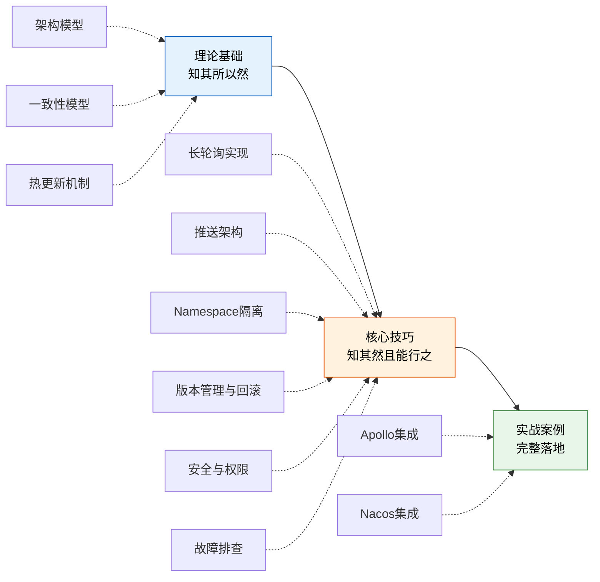
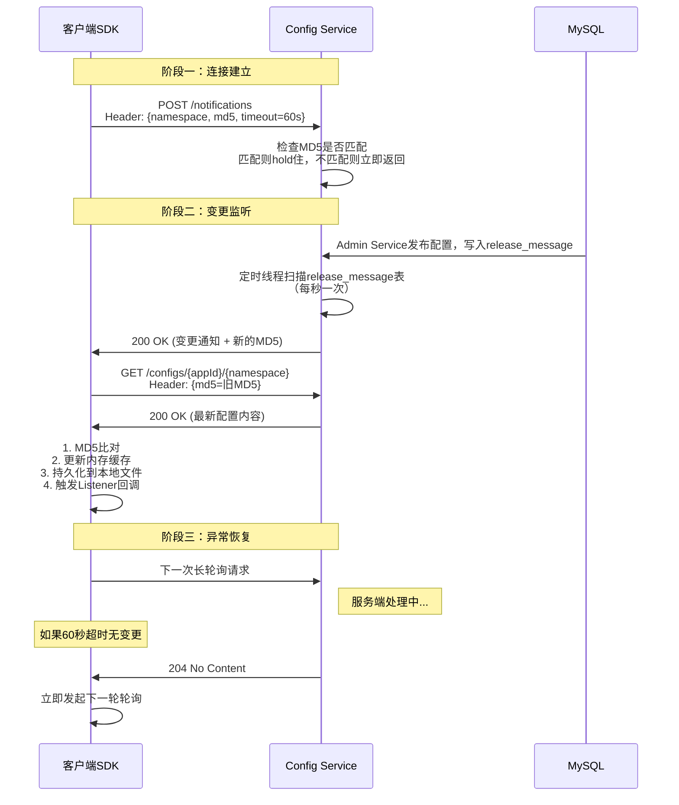
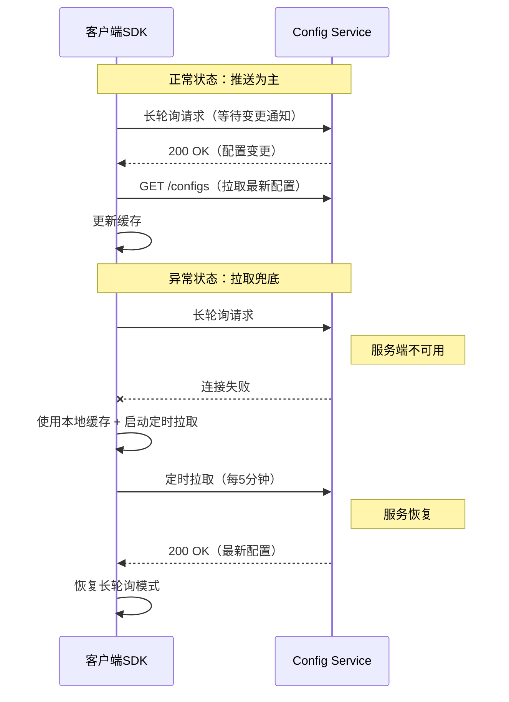
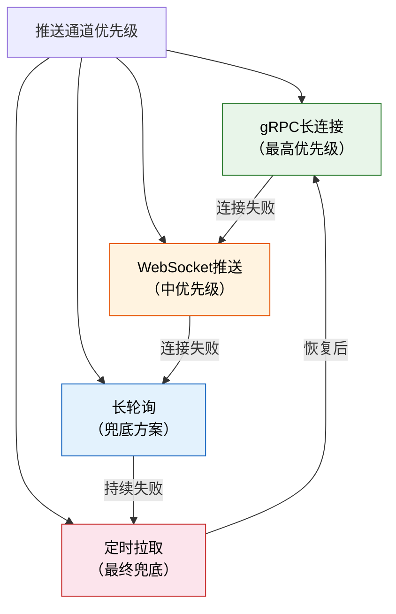
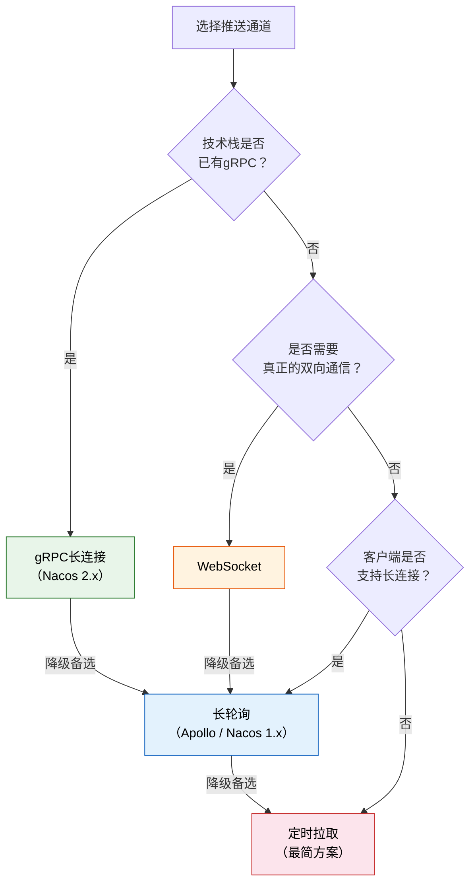
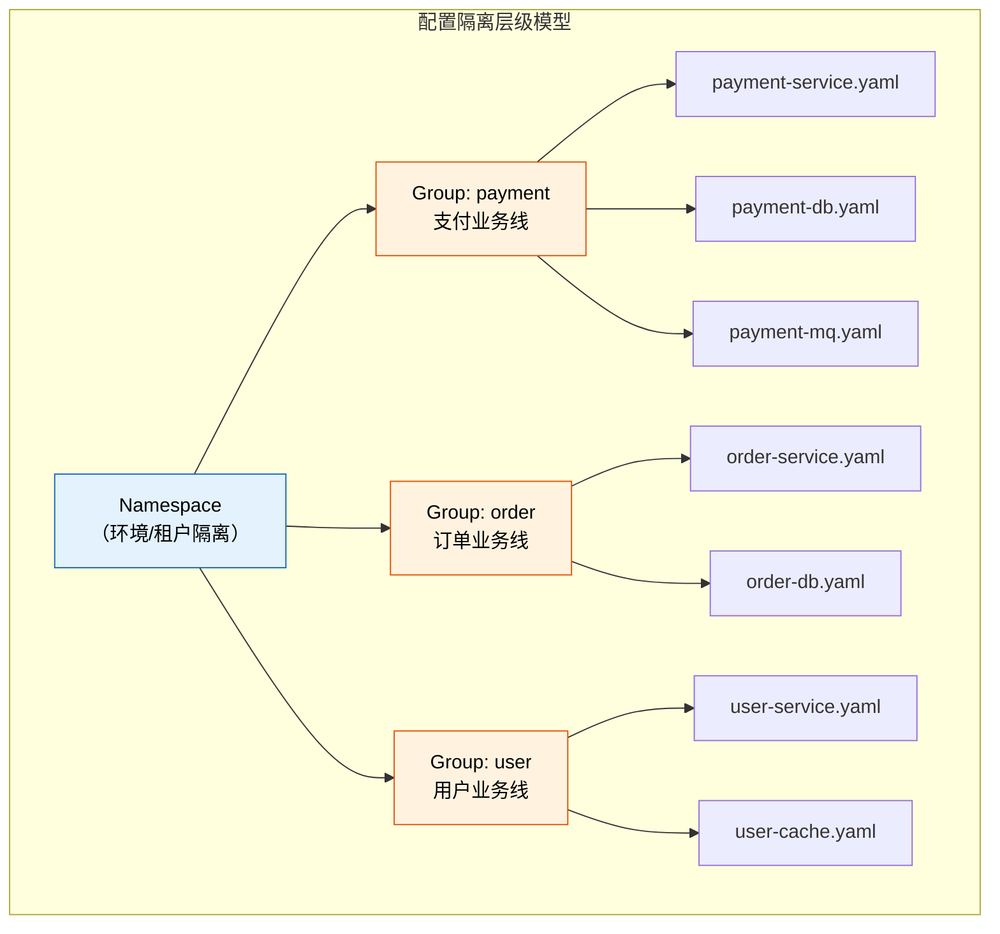
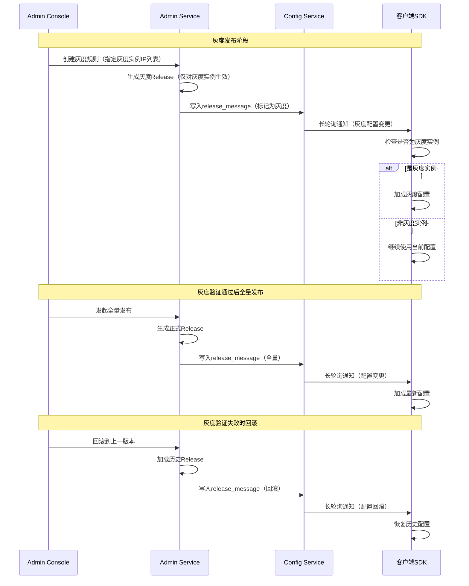
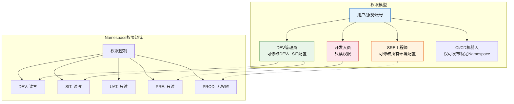
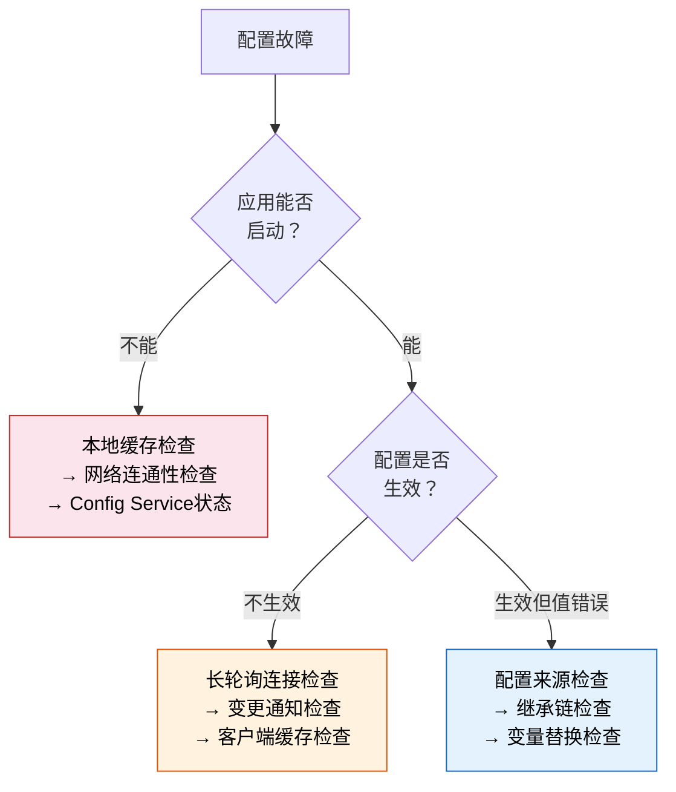
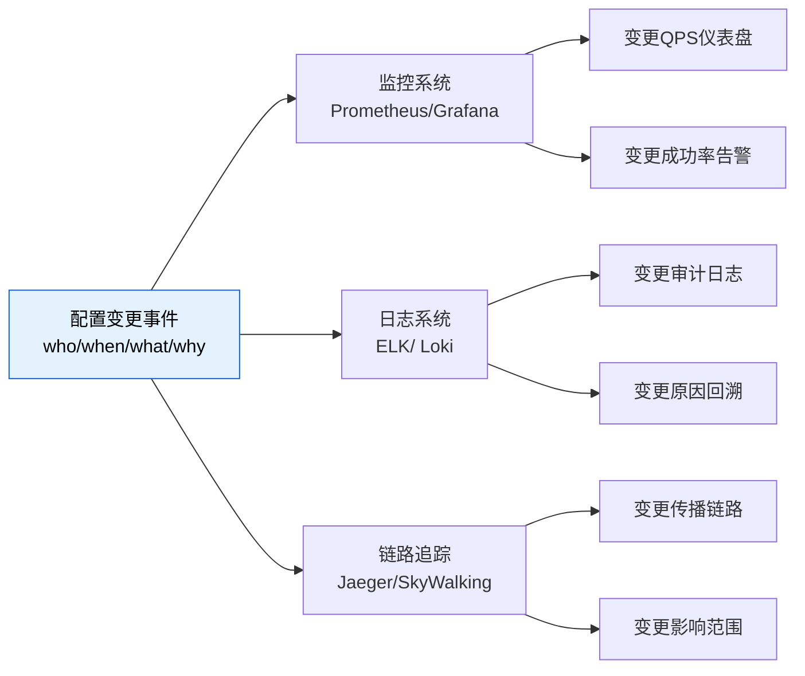

# 配置中心核心技巧

理论基础回答了"为什么这样设计"，核心技巧则回答"怎么落地实现"。本节聚焦配置中心工程实践中的**六大核心能力**——**长轮询的完整实现、推拉结合的推送架构设计、多维度Namespace隔离策略、配置版本管理与回滚机制、配置安全与权限控制、故障排查实战指南**——从原理剖析到可运行的代码实现，帮助读者将理论知识转化为可直接投产的工程能力。

---

## 一、从理论到实践：本节的定位

在理论基础部分，我们已经理解了配置中心的架构模型、一致性保证和热更新机制。但理解原理和真正实现之间存在巨大的鸿沟。核心技巧部分要填补的正是这道鸿沟：

| 理论基础（已学） | 核心技巧（本节） | 转化价值 |
|-----------------|-----------------|---------|
| 长轮询的工作原理 | 从零实现一个生产级长轮询客户端 | 理解底层机制，能排查和调优 |
| WebSocket/gRPC推送机制 | 推拉结合的混合推送架构 | 选择合适的推送方案，平衡实时性与可靠性 |
| Namespace隔离模型 | 多环境多租户的完整隔离方案 | 设计可扩展的配置组织结构 |
| 配置版本管理模型 | 版本追踪、灰度发布与一键回滚 | 保障配置变更安全可控 |
| 配置安全模型 | 加密存储、权限控制与审计日志 | 满足等保合规与数据安全要求 |
| 故障恢复模型 | 常见故障的诊断与修复实战 | 快速定位并解决配置相关问题 |



---

## 二、核心技巧一：长轮询的生产级实现

### 2.1 为什么长轮询值得深入

长轮询是Apollo和Nacos 1.x的核心推送机制，也是配置中心最广泛使用的实时通知方案。它看似简单——"发HTTP请求，服务端hold住不返回"——但要在生产环境中可靠运行，需要处理大量边界情况：

- **网络抖动与超时**：长轮询连接在60秒hold期间可能因网络中断而断开
- **服务端重启**：Config Service滚动发布时，客户端连接被强制断开
- **通知丢失**：超时返回与下一次请求建立之间的间隙（"通知窗口期"），变更通知可能丢失
- **内存管理**：数千个客户端的长轮询连接同时挂起，服务端线程池如何管理
- **心跳保活**：中间代理（Nginx、SLB）可能在空闲时断开长连接
- **SSL/TLS握手开销**：HTTPS下的长轮询需要考虑TLS会话复用，否则频繁握手严重影响性能

### 2.2 长轮询的核心数据流

长轮询的完整生命周期包含三个阶段——**连接建立、变更监听、异常恢复**：



### 2.3 生产级长轮询客户端的关键设计

一个可靠的长轮询客户端需要实现以下核心机制：

**（1）本地缓存三级降级**

配置中心的本地缓存是应用可用性的最后一道防线。当Config Service完全不可达时，应用必须能够基于本地缓存正常启动和运行。三级降级模型的设计原则是：**越快的缓存越脆弱，越慢的缓存越可靠**。

```python
import os
import json
import hashlib
import threading

class ConfigCache:
    """三级缓存降级模型
    
    L1 (内存缓存): 速度最快，进程重启后丢失
    L2 (本地文件): 速度中等，磁盘损坏可能丢失
    L3 (内嵌默认): 速度最慢，但与应用打包在一起，永远不会丢失
    """
    
    def __init__(self, file_cache_dir="/opt/app/config/cache"):
        self._memory_cache = {}
        self._lock = threading.RLock()  # 线程安全：多线程并发读写缓存
        self._file_cache_dir = file_cache_dir
        self._default_config = {}
        
        # 确保文件缓存目录存在
        os.makedirs(file_cache_dir, exist_ok=True)
        
        # 启动时从文件缓存恢复L1
        self._restore_from_file_cache()
    
    def get_config(self, key, default=None):
        """优先级：L1 → L2 → L3
        
        获取配置时自动完成缓存回填：
        - L1命中：直接返回，零IO
        - L2命中：返回并回填L1（避免下次再读磁盘）
        - L3命中：返回并回填L1和L2（最慢路径，仅在灾难恢复时触发）
        """
        with self._lock:
            # L1: 内存缓存（O(1)查找，纳秒级）
            if key in self._memory_cache:
                return self._memory_cache[key].get("value", default)
            
            # L2: 本地文件缓存（磁盘IO，毫秒级）
            config = self._load_from_file(key)
            if config is not None:
                self._memory_cache[key] = {
                    "value": config["value"],
                    "md5": config["md5"]
                }
                return config["value"]
            
            # L3: 内嵌默认配置（已在代码中，无需IO）
            return self._default_config.get(key, default)
    
    def update_config(self, key, value, md5):
        """配置更新后同时写入L1和L2
        
        写入策略：先更新内存，再异步刷盘
        这样即使刷盘失败，内存中仍是最新值
        """
        with self._lock:
            self._memory_cache[key] = {"value": value, "md5": md5}
        
        # 异步写入文件缓存（不阻塞配置读取）
        self._save_to_file_async(key, value, md5)
    
    def get_current_md5(self):
        """获取所有配置项的聚合MD5，用于长轮询的变更检测"""
        with self._lock:
            md5_str = "".join(
                v.get("md5", "") for v in self._memory_cache.values()
            )
            return hashlib.md5(md5_str.encode()).hexdigest()
    
    def _restore_from_file_cache(self):
        """启动时从文件缓存恢复内存缓存"""
        for filename in os.listdir(self._file_cache_dir):
            if filename.endswith(".json"):
                key = filename[:-5]  # 去掉.json后缀
                config = self._load_from_file(key)
                if config:
                    self._memory_cache[key] = {
                        "value": config["value"],
                        "md5": config["md5"]
                    }
    
    def _load_from_file(self, key):
        """从本地文件加载配置"""
        filepath = os.path.join(self._file_cache_dir, f"{key}.json")
        try:
            with open(filepath, "r") as f:
                return json.load(f)
        except (FileNotFoundError, json.JSONDecodeError):
            return None
    
    def _save_to_file_async(self, key, value, md5):
        """异步写入文件缓存"""
        def _do_save():
            filepath = os.path.join(self._file_cache_dir, f"{key}.json")
            try:
                # 先写临时文件，再原子替换（避免写入过程中进程崩溃导致文件损坏）
                tmp_path = filepath + ".tmp"
                with open(tmp_path, "w") as f:
                    json.dump({"value": value, "md5": md5}, f)
                os.replace(tmp_path, filepath)  # 原子操作
            except Exception:
                pass  # 文件缓存写入失败不影响主流程
        
        threading.Thread(target=_do_save, daemon=True).start()
```

> **设计要点**：文件缓存写入使用"临时文件 + `os.replace`"模式，利用操作系统的原子替换保证文件完整性。如果直接写入目标文件，进程在写入中途崩溃会导致文件内容不完整，下次启动时无法恢复。

**（2）超时重连与退避策略**

长轮询断开后不能立即重连——如果服务端正在重启，立即重连只会增加压力。合理的退避策略应遵循**指数退避 + 抖动**：

| 重试次数 | 等待时间 | 计算方式 | 说明 |
|---------|---------|---------|------|
| 第1次 | 0-1秒 | 基础间隔 × 1 + 随机抖动 | 网络瞬断，快速重连 |
| 第2次 | 1-3秒 | 基础间隔 × 2 + 随机抖动 | 可能是短暂抖动 |
| 第3次 | 2-6秒 | 基础间隔 × 4 + 随机抖动 | 开始考虑服务端问题 |
| 第4次及以上 | 最大30秒 | 封顶，避免无限等待 | 可能是服务端故障 |

```python
import random
import time
import logging

logger = logging.getLogger(__name__)

class LongPollingRetryPolicy:
    """指数退避重试策略
    
    退避公式: wait_time = min(base * 2^retry_count + jitter, max_interval)
    
    抖动(Jitter)的作用：
    1. 避免惊群效应 —— 服务端重启后，所有客户端同时重连导致瞬间高并发
    2. 分散重连时间窗口 —— 让不同客户端的重连请求在时间上均匀分布
    3. 增加系统弹性 —— 退避时间不完全确定，降低竞态条件概率
    """
    
    BASE_INTERVAL = 1.0    # 基础间隔（秒）
    MAX_INTERVAL = 30.0    # 最大间隔（秒）
    MAX_RETRIES = 10       # 最大重试次数
    
    def __init__(self):
        self.retry_count = 0
        self.last_success_time = time.time()
    
    def wait(self):
        """计算并执行等待
        
        超过最大重试次数时抛出异常，由上层决定是否降级到定时拉取模式
        """
        if self.retry_count >= self.MAX_RETRIES:
            logger.error(f"长轮询连接无法恢复，已连续失败{self.retry_count}次，降级到定时拉取")
            raise ConnectionFailedException(
                f"超过最大重试次数({self.MAX_RETRIES})，长轮询连接无法恢复"
            )
        
        # 指数退避 + 随机抖动（jitter）
        # jitter范围为 [0, interval*0.5]，避免完全随机导致间隔过短
        interval = min(
            self.BASE_INTERVAL * (2 ** self.retry_count),
            self.MAX_INTERVAL
        )
        jitter = random.uniform(0, interval * 0.5)
        actual_wait = interval + jitter
        
        logger.warning(f"长轮询断开，第{self.retry_count + 1}次重试，等待{actual_wait:.1f}秒")
        time.sleep(actual_wait)
        self.retry_count += 1
    
    def reset(self):
        """连接成功后重置计数
        
        只有在成功收到一次有效响应后才调用，确保退避策略的正确性
        """
        if self.retry_count > 0:
            logger.info(f"长轮询连接恢复，之前的重试次数: {self.retry_count}")
        self.retry_count = 0
        self.last_success_time = time.time()
```

**（3）通知窗口期补偿**

长轮询超时返回（204）到下一次请求建立之间存在一个时间间隙。在这个间隙中，如果恰好有配置变更发生，客户端将不会收到通知。Apollo的补偿机制是：**客户端在收到204后，立即发起下一次长轮询，同时携带本地配置的MD5；如果服务端发现MD5与最新配置不一致（说明间隙中发生了变更），直接返回变更通知而不是继续hold住**。

```python
def long_polling_loop(self):
    """长轮询主循环（含通知窗口期补偿）"""
    retry_policy = LongPollingRetryPolicy()
    
    while self.running:
        try:
            # 携带当前配置的MD5发起长轮询
            # MD5的作用：通知窗口期补偿 + 服务端变更检测
            current_md5 = self.cache.get_current_md5()
            response = self.http_client.post(
                "/notifications",
                headers={
                    "Namespace": self.namespace,
                    "MD5": current_md5,
                    "Timeout": "60"
                },
                timeout=65  # 略大于服务端超时（60秒），避免客户端先超时
            )
            
            if response.status_code == 200:
                # 收到变更通知，拉取最新配置
                new_config = self.fetch_config()
                self.cache.update_config(new_config)
                retry_policy.reset()  # 重置退避计数
            
            # 204（无变更）：直接进入下一轮循环（通知窗口期补偿机制）
            
        except (ConnectionError, Timeout) as e:
            # 网络异常：使用退避策略等待后重试
            retry_policy.wait()
            # 异常期间使用本地缓存，应用不受影响
            logger.warning(f"长轮询异常: {e}，使用本地缓存继续运行")

class ConnectionFailedException(Exception):
    """长轮询连接彻底失败时的异常"""
    pass
```

### 2.4 服务端长轮询的线程管理

Config Service需要同时hold住数万个客户端的长轮询请求。如果每个请求占用一个线程，1万个连接就需要1万个线程——这在资源消耗上是不可接受的。

**解决方案：异步非阻塞IO模型**

```java
// Apollo的长轮询处理：Spring Async + DeferredResult
@RestController
public class NotificationController {
    
    @Autowired
    private ReleaseMessageScanner releaseMessageScanner;
    
    // 用DeferredResult替代直接返回，释放Tomcat线程
    @RequestMapping(value = "/notifications", method = RequestMethod.POST)
    public DeferredResult<ResponseEntity<Void>> handleNotification(
            @RequestParam String appId,
            @RequestParam String cluster,
            @RequestParam String namespace,
            @RequestParam String md5) {
        
        DeferredResult<ResponseEntity<Void>> deferredResult = 
            new DeferredResult<>(60_000L);  // 60秒超时
        
        // 注册到变更监听器（非阻塞）
        ReleaseMessageListener listener = 
            new ReleaseMessageListener(appId, cluster, namespace, md5);
        listener.register(deferredResult);
        
        // 超时后返回204
        deferredResult.onTimeout(() -> {
            listener.unregister();
            deferredResult.setResult(
                ResponseEntity.noContent().build()
            );
        });
        
        // 客户端断开时也要注销（避免内存泄漏）
        deferredResult.onCompletion(() -> {
            listener.unregister();
        });
        
        return deferredResult;
    }
}
```

`DeferredResult`的核心优势：HTTP请求到达后，Tomcat线程立即释放回线程池，不会被长轮询hold住。当配置变更事件到达时，通过回调机制将响应写回客户端。这样，1万个长轮询连接只需要少量Tomcat线程即可处理。

**线程模型对比**：

| 模型 | 1万连接占用资源 | 响应延迟 | 实现复杂度 | 适用规模 |
|------|----------------|---------|-----------|---------|
| 同步阻塞（Thread-per-Connection） | ~10GB内存（1万线程） | 线程调度延迟 | 低 | <100连接 |
| Servlet 3.1异步 | ~1GB内存 | 毫秒级 | 中 | 100-1万连接 |
| DeferredResult / CompletableFuture | ~200MB内存 | 毫秒级 | 中 | 1万-10万连接 |
| Netty / Vert.x全异步 | ~50MB内存 | 亚毫秒级 | 高 | 10万+连接 |

### 2.5 长轮询的客户端SDK线程安全

在实际应用中，配置读取和配置更新通常发生在不同线程——业务线程读取配置，长轮询回调线程更新缓存。如果不做线程安全处理，可能出现**脏读**（读到更新了一半的配置）或**丢失更新**（两个线程同时更新，一个覆盖另一个）。

```python
import threading

class ThreadSafeConfigCache:
    """线程安全的配置缓存
    
    设计选择：
    - 使用 RLock（可重入锁）而非 Lock，允许同一线程嵌套获取锁
    - 读操作也需要加锁，因为dict在Python中虽然线程安全，
      但"读取多个相关配置项"这个复合操作不是原子的
    """
    
    def __init__(self):
        self._configs = {}
        self._lock = threading.RLock()
        self._change_listeners = []  # 变更回调列表
        self._listener_lock = threading.Lock()
    
    def get(self, key, default=None):
        """线程安全的配置读取"""
        with self._lock:
            return self._configs.get(key, default)
    
    def get_all(self):
        """线程安全的批量配置读取（返回快照）"""
        with self._lock:
            return dict(self._configs)  # 返回副本，避免外部修改影响内部状态
    
    def update(self, new_configs):
        """原子性更新：一次性替换整个配置map
        
        关键设计：不是逐个更新，而是整体替换
        这保证了业务线程永远不会读到"部分更新"的状态
        """
        with self._lock:
            old_configs = dict(self._configs)
            self._configs = dict(new_configs)
        
        # 在锁外触发回调（避免死锁：回调中可能又读取配置）
        self._notify_listeners(old_configs, new_configs)
    
    def add_change_listener(self, listener):
        """注册配置变更监听器
        
        listener签名: listener(old_config: dict, new_config: dict) -> None
        """
        with self._listener_lock:
            self._change_listeners.append(listener)
    
    def _notify_listeners(self, old_configs, new_configs):
        """通知所有监听器（在锁外执行，避免死锁）"""
        with self._listener_lock:
            listeners = list(self._change_listeners)  # 复制列表，避免遍历时修改
        
        for listener in listeners:
            try:
                listener(old_configs, new_configs)
            except Exception as e:
                # 监听器异常不应影响配置更新流程
                logging.error(f"配置变更监听器异常: {e}", exc_info=True)
```

> **线程安全的常见陷阱**：
> 1. "dict读操作是线程安全的"——对单个key的读确实是原子的，但"读取一组相关配置"不是
> 2. "GIL保护了Python线程安全"——GIL只保护单个字节码指令，不保护复合操作
> 3. "回调在锁内执行"——如果回调中又尝试获取同一把锁，就会死锁。回调必须在锁外执行

---

## 三、核心技巧二：推拉结合的推送架构设计

### 3.1 为什么需要推拉结合

单一的推送或拉取机制都无法满足生产需求：

| 机制 | 优势 | 劣势 | 失败场景 |
|------|------|------|---------|
| 纯推送（长轮询/WebSocket） | 实时性高 | 通知可能丢失 | 网络抖动导致连接断开 |
| 纯拉取（定时轮询） | 实现简单 | 实时性差，资源浪费 | 高频拉取消耗大量带宽 |
| 推拉结合 | 兼顾实时性和可靠性 | 实现复杂度略高 | 几乎不存在盲区 |

推拉结合的核心思想是：**推送作为主要通知通道，拉取作为兜底补偿**。即使推送通道暂时不可用（网络中断、服务端重启），客户端通过定期拉取也能在一定时间内获取最新配置。

### 3.2 推拉结合的时序模型



### 3.3 多级推送通道的切换策略

在复杂的网络环境中，单一推送通道可能不够可靠。生产级配置中心通常支持多种推送通道并自动切换：



| 通道 | 实时性 | 连接维护成本 | 故障恢复时间 | 适用场景 |
|------|--------|------------|------------|---------|
| gRPC长连接 | 毫秒级 | 中等（HTTP/2多路复用） | 秒级 | 已有gRPC技术栈 |
| WebSocket推送 | 毫秒级 | 中等 | 秒级 | 需要真正的双向通信 |
| 长轮询 | 秒级 | 低（HTTP短连接模拟） | 即时（下次请求自动重连） | 通用场景（首选） |
| 定时拉取 | 分钟级 | 无 | 即时 | 兜底降级 |

**各通道技术选型决策树**：



### 3.4 配置变更事件的可靠投递

配置变更通知的可靠投递是推送架构的核心挑战。需要解决以下问题：

**（1）至少一次投递（At-Least-Once）**

配置变更通知必须保证至少被投递一次。如果客户端没有收到通知，可以通过定期拉取补偿。但**绝不能出现"通知发了但客户端没收到且没有补偿机制"的情况**。

Apollo的实现方式：Admin Service写入数据库后，向`release_message`表插入一条记录。Config Service的定时线程每秒扫描该表，对每条新消息通知对应的长轮询客户端。如果通知失败（客户端已断开），该消息不会被删除——下次扫描时仍会重新通知。

**（2）幂等处理**

客户端可能收到重复的变更通知（网络抖动导致通知重发）。配置更新操作必须是幂等的——通过MD5或版本号比对，相同配置不会重复触发变更回调。

```python
def on_config_changed(self, new_md5):
    """幂等的配置变更处理
    
    幂等保证：相同MD5的配置变更通知不会触发重复处理
    这在以下场景中至关重要：
    - 网络抖动导致同一变更通知被投递多次
    - 服务端重启后重复扫描未消费的消息
    - 客户端重连后服务端重新推送未确认的变更
    """
    if new_md5 == self.current_md5:
        # 配置未变化（重复通知），跳过处理
        logging.debug(f"收到重复的配置变更通知，MD5={new_md5}，跳过处理")
        return
    
    # MD5不同，执行配置更新
    new_config = self.fetch_config()
    self.cache.update_config(new_config)
    self.current_md5 = new_md5
    self.trigger_listeners(new_config)
    logging.info(f"配置变更已生效，新MD5={new_md5}")
```

**（3）变更顺序保证**

在多数配置中心中，配置变更的通知顺序不保证与写入顺序一致。如果配置A和配置B存在依赖关系（如A是数据库地址，B是数据库端口），需要将它们放在同一个Namespace中一起发布，而不是分开发布。

> **最佳实践**：将有依赖关系的配置项放在同一个DataId（配置文件）中。同一个DataId的更新是原子的，要么全部生效，要么全部不变。分开的DataId之间没有顺序保证。

---

## 四、核心技巧三：Namespace隔离策略

### 4.1 Namespace隔离的三层模型

Namespace隔离是配置中心多环境、多租户管理的基础。配置的组织遵循**Namespace → Group → DataId**三级模型，但真正设计一个可扩展的隔离方案，需要深入理解每一层的使用策略。



**三级模型的定位与职责**：

| 层级 | 定位 | 隔离维度 | 典型数量 | 说明 |
|------|------|---------|---------|------|
| Namespace | 环境/租户级隔离 | 按部署环境或租户 | 5-10个 | 物理隔离，不同Namespace的数据完全独立 |
| Group | 业务线/功能模块隔离 | 按业务领域 | 10-50个 | 逻辑隔离，用于权限控制和配置组织 |
| DataId | 具体配置文件 | 按配置职责 | 数百个 | 最小粒度，对应一个具体的配置文件 |

### 4.2 多环境隔离方案设计

一个典型的微服务系统需要管理5-8个环境的配置。合理的Namespace设计应该兼顾**隔离性**和**可维护性**：

| 环境 | Namespace | 数据隔离 | 配置继承关系 | 变更权限 |
|------|-----------|---------|------------|---------|
| DEV | dev | 独立数据库、独立配置 | 无继承（完全独立） | 开发人员可自由修改 |
| SIT | sit | 独立数据库 | 继承DEV的公共配置 | 开发人员可修改 |
| UAT | uat | 独立数据库 | 继承SIT的业务配置 | 开发人员修改需审批 |
| PRE | pre | 使用PROD只读副本 | 继承PROD的全部配置 | 仅运维可修改 |
| PROD | production | 生产数据库 | 最终配置 | 仅SRE可修改，需审批 |

**配置继承机制**：下层环境的配置可以继承上层环境的公共配置，只覆盖需要差异化的部分。例如，SIT环境继承DEV的数据库连接池配置（pool.size=100），但覆盖数据库地址（SIT指向SIT数据库而非DEV数据库）。

```yaml
# DEV Namespace - 基础配置
database.pool.size: 50
database.host: dev-db.internal:3306
database.name: myapp_dev
log.level: DEBUG

# SIT Namespace - 仅覆盖差异项
database.host: sit-db.internal:3306  # 覆盖数据库地址
database.name: myapp_sit              # 覆盖数据库名
# database.pool.size: 50  继承DEV，无需重复配置

# PROD Namespace - 独立完整配置
database.pool.size: 200              # 生产环境加大连接池
database.host: prod-db.internal:3306
database.name: myapp_prod
log.level: INFO
```

### 4.3 Group分组策略

Group在Namespace内部提供二级隔离。常见的分组策略有两种：

**按业务线分组**：适合业务线独立、配置差异大的场景
Namespace: production
├── Group: payment
│   ├── payment-service.yaml
│   └── payment-gateway.yaml
├── Group: order
│   ├── order-service.yaml
│   └── order-inventory.yaml
└── Group: user
    └── user-service.yaml

**按功能模块分组**：适合同一业务线内不同功能模块需要独立配置的场景
Namespace: production
├── Group: service-config        # 服务行为配置
│   ├── payment-service.yaml
│   └── order-service.yaml
├── Group: datasource-config     # 数据源配置
│   ├── payment-db.yaml
│   └── order-db.yaml
└── Group: middleware-config     # 中间件配置
    ├── redis.yaml
    └── mq.yaml

**选择建议**：

| 团队组织方式 | 推荐分组策略 | 原因 |
|------------|------------|------|
| 按业务线组织（支付团队、订单团队各自独立） | 按业务线分组 | 每个团队只关注自己Group内的配置，权限隔离清晰 |
| 按技术领域组织（DBA统一管理所有数据源） | 按功能模块分组 | DBA可集中管理所有数据源配置，跨业务线统一调优 |
| 混合模式（大型团队） | 两级混用 | 顶层按业务线，子组按功能模块，如payment→service-config、payment→db-config |

### 4.4 跨环境配置管理的工程实践

**（1）公共配置提取**

将所有环境共享的配置项提取到一个公共Namespace或公共Group中，避免在每个环境重复配置：

```python
class ConfigInheritance:
    """跨环境配置继承引擎
    
    继承规则：
    1. 从最基础的环境开始合并（DEV → SIT → UAT → PRE → PROD）
    2. 后出现的配置项覆盖先出现的（越靠近目标环境，优先级越高）
    3. 只合并目标环境继承链上的配置，不越级合并
    """
    
    INHERITANCE_CHAIN = ["dev", "sit", "uat", "pre", "production"]
    
    def resolve_config(self, env, data_id):
        """从继承链中合并配置，越靠后的环境优先级越高"""
        merged = {}
        
        # 从最基础的环境开始合并
        for inherit_env in self.INHERITANCE_CHAIN:
            env_config = self.fetch_config(inherit_env, data_id)
            merged.update(env_config)  # 后出现的覆盖先出现的
            
            if inherit_env == env:
                break  # 到达目标环境，停止合并
        
        return merged
    
    def diff_config(self, source_env, target_env, data_id):
        """对比两个环境的配置差异，用于变更审核"""
        source_config = self.resolve_config(source_env, data_id)
        target_config = self.resolve_config(target_env, data_id)
        
        diffs = {}
        all_keys = set(source_config.keys()) | set(target_config.keys())
        
        for key in all_keys:
            if source_config.get(key) != target_config.get(key):
                diffs[key] = {
                    "source": source_config.get(key),
                    "target": target_config.get(key)
                }
        
        return diffs
```

**（2）配置模板与变量替换**

不同环境的配置差异往往只是个别值（如数据库地址、端口号）。通过配置模板 + 变量替换，可以用一份模板生成多环境配置：

```yaml
# 模板：common-template.yaml
database:
  host: ${DB_HOST}
  port: ${DB_PORT:3306}
  name: ${DB_NAME}
  pool:
    size: ${DB_POOL_SIZE:50}
    max_wait: ${DB_MAX_WAIT:3000}

logging:
  level: ${LOG_LEVEL:INFO}
```

| 环境变量 | DEV值 | SIT值 | PROD值 |
|---------|-------|-------|--------|
| DB_HOST | dev-db | sit-db | prod-db |
| DB_PORT | 3306 | 3306 | 3306 |
| DB_NAME | myapp_dev | myapp_sit | myapp_prod |
| DB_POOL_SIZE | 20 | 50 | 200 |
| LOG_LEVEL | DEBUG | DEBUG | INFO |

**（3）配置漂移检测**

"配置漂移"指的是同一环境的不同实例之间配置不一致。这在以下场景中容易发生：手动在Admin Console修改了某台实例的配置、灰度发布后忘记全量发布、实例级配置未及时清理。

```python
class ConfigDriftDetector:
    """配置漂移检测器
    
    定期对比同一Namespace下所有实例的配置，发现不一致时告警
    """
    
    def __init__(self, config_center_client):
        self.client = config_center_client
    
    def detect_drift(self, namespace, data_id):
        """检测配置漂移
        
        返回值：drift_info = {
            "has_drift": bool,
            "expected_md5": str,
            "instances": [{"ip": str, "md5": str, "match": bool}],
            "drift_details": dict  # 配置项级别的差异
        }
        """
        # 获取该Namespace下的所有实例及其配置MD5
        instances = self.client.get_instances(namespace)
        
        # 以出现次数最多的MD5作为"期望值"（多数一致原则）
        md5_counts = {}
        for inst in instances:
            md5 = inst.get("config_md5", "unknown")
            md5_counts[md5] = md5_counts.get(md5, 0) + 1
        
        expected_md5 = max(md5_counts, key=md5_counts.get)
        
        drift_instances = []
        for inst in instances:
            match = inst.get("config_md5") == expected_md5
            drift_instances.append({
                "ip": inst["ip"],
                "md5": inst.get("config_md5"),
                "match": match
            })
        
        has_drift = any(not inst["match"] for inst in drift_instances)
        
        return {
            "has_drift": has_drift,
            "expected_md5": expected_md5,
            "instances": drift_instances
        }
```

### 4.5 实例级配置的使用规范

实例级配置（对特定IP的实例生效）是一种强大的调试工具，但必须严格限制使用范围：

| 适用场景 | 禁止场景 |
|---------|---------|
| 在特定实例上开启DEBUG日志排查问题 | 用实例级配置做"快速上线"跳过审批 |
| 对特定实例进行性能调优验证 | 用实例级配置绕过灰度发布流程 |
| 临时修复某台机器的特定问题 | 长期保留大量实例级配置（应清理） |

**最佳实践**：实例级配置必须设置过期时间（如24小时后自动失效），并定期清理不再需要的实例级覆盖。可以通过配置中心的API实现自动清理：

```python
import time

class InstanceConfigGuard:
    """实例级配置保护器
    
    功能：
    1. 创建实例级配置时自动设置过期时间
    2. 定期清理过期的实例级配置
    3. 生成实例级配置审计报告
    """
    
    DEFAULT_TTL = 24 * 3600  # 默认24小时过期
    
    def create_instance_config(self, ip, namespace, data_id, config, ttl=None):
        """创建实例级配置（附带过期时间）"""
        expire_at = time.time() + (ttl or self.DEFAULT_TTL)
        
        self.client.set_instance_config(
            ip=ip,
            namespace=namespace,
            data_id=data_id,
            config=config,
            metadata={
                "created_at": time.time(),
                "expire_at": expire_at,
                "created_by": self.get_current_user()
            }
        )
    
    def cleanup_expired(self):
        """清理所有过期的实例级配置"""
        all_configs = self.client.list_all_instance_configs()
        cleaned = 0
        
        for config in all_configs:
            expire_at = config.get("metadata", {}).get("expire_at")
            if expire_at and time.time() > expire_at:
                self.client.delete_instance_config(
                    ip=config["ip"],
                    namespace=config["namespace"],
                    data_id=config["data_id"]
                )
                cleaned += 1
        
        return cleaned
```

---

## 五、核心技巧四：配置版本管理与灰度回滚

### 5.1 为什么需要版本管理

配置变更与代码变更一样，需要完整的版本历史和回滚能力。没有版本管理的配置中心就像没有git的代码库——一旦改错就只能手动恢复，无法追溯"谁在什么时候改了什么"。

配置版本管理需要解决三个核心问题：

1. **版本追踪**：每次变更记录完整的快照，支持任意时间点的配置查看
2. **灰度发布**：配置变更逐步生效，而非全量一次性切换
3. **一键回滚**：发现问题时能快速恢复到上一个正确的配置版本

### 5.2 配置版本的数据模型

Apollo的配置版本管理基于`Release`表，每次发布配置时生成一个新版本：

Release表结构：
├── release_id:       版本ID（自增主键）
├── app_id:           应用标识
├── cluster:          集群标识
├── namespace_name:   命名空间
├── configurations:   配置快照（JSON格式，完整内容）
├── comment:          发布说明（如"修复数据库连接超时"）
├── release_key:      版本唯一标识
└── created_by:       发布人

**关键设计**：`configurations`字段存储的是**完整配置快照**而非diff。这使得回滚操作极其简单——直接加载历史快照即可，不需要逐个字段反向diff。

### 5.3 灰度发布的完整流程



### 5.4 回滚机制的实现

```python
class ConfigRollbackManager:
    """配置回滚管理器
    
    回滚策略：
    1. 版本回滚：回到指定历史版本（精确回滚）
    2. 秒级回滚：基于版本快照，回滚速度与配置大小无关
    3. 跨环境回滚：支持从高环境拉取配置到低环境（慎用）
    """
    
    def rollback(self, namespace, data_id, target_version):
        """回滚到指定版本
        
        参数：
            namespace: 目标命名空间
            data_id: 配置文件标识
            target_version: 目标版本ID
        
        回滚步骤：
        1. 校验目标版本是否存在
        2. 加载目标版本的配置快照
        3. 创建新版本（内容为历史快照），记录回滚来源
        4. 通过正常的发布流程生效（确保所有实例收到通知）
        """
        # 1. 获取目标版本
        target_release = self.get_release(namespace, data_id, target_version)
        if not target_release:
            raise ValueError(f"版本 {target_version} 不存在")
        
        # 2. 加载配置快照
        configurations = target_release["configurations"]
        
        # 3. 创建回滚版本（保留回滚记录）
        self.publish(
            namespace=namespace,
            data_id=data_id,
            configurations=configurations,
            comment=f"[ROLLBACK] 回滚到版本 {target_version}",
            rollback_from=self.get_current_version(namespace, data_id),
            rollback_to=target_version
        )
    
    def list_versions(self, namespace, data_id, limit=20):
        """列出配置版本历史"""
        releases = self.get_releases(namespace, data_id, limit)
        return [
            {
                "version": r["release_id"],
                "created_at": r["created_at"],
                "created_by": r["created_by"],
                "comment": r["comment"],
                "is_rollback": r["comment"].startswith("[ROLLBACK]")
            }
            for r in releases
        ]
```

---

## 六、核心技巧五：配置安全与权限控制

### 6.1 配置安全的威胁模型

配置中心存储着数据库密码、API密钥、证书等敏感信息。一旦泄露或被篡改，可能导致：

| 威胁类型 | 风险描述 | 实际案例 |
|---------|---------|---------|
| 配置泄露 | 明文存储的数据库密码被非授权人员查看 | 运维人员通过日志看到密码 |
| 配置篡改 | 恶意修改配置导致服务异常 | 将数据库地址改为攻击者控制的服务器 |
| 越权访问 | 开发人员看到生产环境的敏感配置 | DEV环境的开发者查看到PROD的密钥 |
| 配置注入 | 通过配置注入恶意代码 | 在配置中注入SpEL表达式实现RCE |

### 6.2 敏感配置加密方案

**（1）配置中心侧加密（存储加密）**

在配置中心存储层对敏感配置项进行加密，客户端拉取后自动解密：

```python
from cryptography.fernet import Fernet
import base64
import os

class ConfigEncryptor:
    """配置加密器
    
    加密策略：
    - 使用AES-256对称加密（Fernet封装）
    - 加密密钥通过环境变量注入，不存储在配置中心
    - 支持密钥轮换（新旧密钥并存解密期）
    """
    
    def __init__(self):
        # 加密密钥从环境变量获取，不硬编码
        key = os.environ.get("CONFIG_ENCRYPTION_KEY")
        if not key:
            raise ValueError("CONFIG_ENCRYPTION_KEY 环境变量未设置")
        self.cipher = Fernet(key.encode())
    
    def encrypt_value(self, plain_value):
        """加密配置值"""
        encrypted = self.cipher.encrypt(plain_value.encode())
        # 添加前缀标记，便于识别已加密的值
        return f"ENC({encrypted.decode()})"
    
    def decrypt_value(self, value):
        """解密配置值
        
        自动判断是否需要解密：
        - 以ENC(开头：已加密，自动解密
        - 其他：明文，直接返回
        """
        if value.startswith("ENC(") and value.endswith(")"):
            encrypted = value[4:-1]  # 去掉ENC()前缀
            return self.cipher.decrypt(encrypted.encode()).decode()
        return value  # 明文配置，直接返回
```

**（2）客户端侧加密（传输加密）**

除了存储加密，传输过程也需要保护。在Apollo/Nacos中，客户端与Config Service之间的通信应使用HTTPS：

```yaml
# 客户端配置：启用HTTPS
apollo:
  config:
    config-service:
      url: https://config.example.com
    ssl:
      enabled: true
      # 双向TLS（mTLS）配置
      key-store: classpath:client.jks
      key-store-password: ${SSL_KEYSTORE_PASSWORD}
      trust-store: classpath:ca.jks
      trust-store-password: ${SSL_TRUSTSTORE_PASSWORD}
```

### 6.3 基于Namespace的RBAC权限控制



**Apollo权限模型的核心设计**：

| 角色 | DEV | SIT | UAT | PRE | PROD |
|------|-----|-----|-----|-----|------|
| 开发人员 | 读写 | 读写 | 只读 | 只读 | 无权限 |
| 测试人员 | 只读 | 读写 | 读写 | 只读 | 无权限 |
| 运维/SRE | 读写 | 读写 | 读写 | 读写 | 读写 |
| CI/CD机器人 | 读写 | 读写 | 只读 | 只读 | 读写（需审批） |

### 6.4 配置变更审计日志

每次配置变更都必须记录完整的审计日志，包括"谁在什么时候改了什么、改之前是什么"：

```python
import json
from datetime import datetime

class ConfigAuditLogger:
    """配置变更审计日志
    
    记录维度：
    - WHO: 操作人（用户ID或服务账号）
    - WHEN: 变更时间（精确到毫秒）
    - WHAT: 变更内容（变更前后的完整值）
    - WHERE: 变更位置（Namespace + Group + DataId）
    - WHY: 变更原因（关联的工单号或发布说明）
    """
    
    def log_change(self, namespace, data_id, old_config, new_config, 
                   operator, reason, ticket_id=None):
        """记录配置变更"""
        audit_entry = {
            "timestamp": datetime.utcnow().isoformat(),
            "namespace": namespace,
            "data_id": data_id,
            "operator": operator,
            "reason": reason,
            "ticket_id": ticket_id,
            "old_config": old_config,
            "new_config": new_config,
            "diff": self._compute_diff(old_config, new_config)
        }
        
        # 写入审计日志存储（不可变，只追加）
        self.audit_store.append(audit_entry)
        
        # 同时发送到日志系统（ELK/Loki）
        self.log_collector.info("config_change", extra=audit_entry)
    
    def _compute_diff(self, old_config, new_config):
        """计算配置差异，用于快速定位变更内容"""
        diff = {}
        all_keys = set(old_config.keys()) | set(new_config.keys())
        for key in all_keys:
            old_val = old_config.get(key)
            new_val = new_config.get(key)
            if old_val != new_val:
                diff[key] = {"old": old_val, "new": new_val}
        return diff
```

---

## 七、核心技巧六：故障排查实战指南

### 7.1 故障排查总览

配置中心相关的故障通常表现为应用启动失败、配置不生效、配置值错误三类。排查思路遵循**自底向上**的原则：先检查网络连通性，再检查服务端状态，最后检查配置本身。



### 7.2 常见故障场景与排查步骤

**故障一：应用启动时无法获取配置**

| 步骤 | 检查项 | 命令/工具 | 预期结果 |
|------|--------|----------|---------|
| 1 | 本地缓存是否存在 | `ls /opt/app/config/cache/` | 存在.json文件 |
| 2 | 网络能否到达Config Service | `curl -v http://config:8080/health` | HTTP 200 |
| 3 | AppId是否正确 | 检查应用启动参数或配置文件 | 与Config Service中一致 |
| 4 | Namespace是否存在 | `curl http://config:8080/apps/{appId}/envs/{env}/clusters/{cluster}/namespaces` | 目标Namespace存在 |
| 5 | Config Service是否健康 | 检查Config Service日志 | 无ERROR级别日志 |

**故障二：配置变更后应用未收到通知**

| 步骤 | 检查项 | 命令/工具 | 预期结果 |
|------|--------|----------|---------|
| 1 | 长轮询连接是否正常 | `netstat -an | grep :8080 | grep ESTABLISHED` | 有ESTABLISHED连接 |
| 2 | release_message是否写入 | `SELECT * FROM release_message ORDER BY id DESC LIMIT 5` | 最新记录时间戳匹配 |
| 3 | Config Service扫描线程是否正常 | Config Service的/health接口 | scanRunning=true |
| 4 | 中间件是否截断连接 | 检查Nginx/SLB的proxy_read_timeout | ≥65秒 |
| 5 | 客户端MD5是否匹配 | 检查客户端日志中的MD5比对 | 与服务端一致 |

**故障三：部分实例配置不一致（配置漂移）**

```bash
# 诊断步骤：

# 1. 获取所有实例的配置MD5
for ip in ${INSTANCE_IPS[@]}; do
    echo "Instance: $ip"
    curl -s "http://$ip:8080/actuator/config" | jq '.md5'
done

# 2. 对比各实例的配置版本
diff <(curl -s http://instance-1:8080/actuator/config | jq -S .config) \
     <(curl -s http://instance-2:8080/actuator/config | jq -S .config)

# 3. 检查是否有实例级配置覆盖
curl -s "http://config:8080/apps/{appId}/instances" | jq '.[] | select(.ip=="异常IP")'
```

### 7.3 配置中心自身的高可用保障

配置中心作为基础设施，自身必须高可用。关键设计：

| 组件 | HA方案 | RTO目标 |
|------|--------|--------|
| Config Service | 多实例部署 + 负载均衡 | < 5秒 |
| Admin Service | 多实例部署 + 主备切换 | < 30秒 |
| Portal Service | 多实例部署 + 共享存储 | < 1分钟 |
| MySQL | 主从复制 + 自动故障转移 | < 30秒 |
| 本地缓存 | 客户端三级降级 | 0（始终可用） |

```mermaid
graph TB
    subgraph "客户端"
        APP1["应用实例1<br/>本地缓存"] 
        APP2["应用实例2<br/>本地缓存"]
        APP3["应用实例3<br/>本地缓存"]
    end
    
    subgraph "Config Service集群"
        CS1["Config Service-1"]
        CS2["Config Service-2"]
        CS3["Config Service-3"]
    end
    
    subgraph "Admin Service集群"
        AS1["Admin Service-1"]
        AS2["Admin Service-2"]
    end
    
    subgraph "存储层"
        MYSQL["MySQL主从<br/>（读写分离）"]
    end
    
    APP1 &amp; APP2 &amp; APP3 --> CS1 &amp; CS2 &amp; CS3
    CS1 &amp; CS2 &amp; CS3 --> MYSQL
    AS1 &amp; AS2 --> MYSQL
    
    style APP1 fill:#E8F5E9,stroke:#2E7D32,color:#000
    style APP2 fill:#E8F5E9,stroke:#2E7D32,color:#000
    style APP3 fill:#E8F5E9,stroke:#2E7D32,color:#000
    style CS1 fill:#E3F2FD,stroke:#1565C0,color:#000
    style CS2 fill:#E3F2FD,stroke:#1565C0,color:#000
    style CS3 fill:#E3F2FD,stroke:#1565C0,color:#000
```

### 7.4 配置中心自身的监控

配置中心作为基础设施，其自身的健康状态至关重要。需要监控以下核心指标：

| 指标分类 | 具体指标 | 采集方式 | 告警阈值 |
|---------|---------|---------|---------|
| **可用性** | Config Service HTTP 200比例 | Prometheus + Spring Actuator | < 99.9% |
| **延迟** | 配置读取P99延迟 | 客户端埋点 + APM | > 200ms |
| **推送** | 长轮询连接数 | Config Service Metrics | 突增/突降 50% |
| **推送** | 配置变更传播延迟 | 变更时间戳差值 | > 10s |
| **缓存** | 本地缓存命中率 | 客户端指标上报 | < 90% |
| **资源** | Config Service JVM内存 | JMX | > 80% |
| **存储** | MySQL主从延迟 | DBA监控 | > 5s |

**Prometheus指标采集配置示例**：

```yaml
# prometheus.yml 配置片段
scrape_configs:
  - job_name: 'config-service'
    metrics_path: '/actuator/prometheus'
    scrape_interval: 15s
    static_configs:
      - targets: ['config-1:8080', 'config-2:8080', 'config-3:8080']
    metric_relabel_configs:
      # 只保留关键指标，减少存储开销
      - source_names: ['__name__']
        regex: '(http_server_requests_seconds_|long_polling_|config_cache_)'
        action: keep

# 告警规则
groups:
  - name: config-center
    rules:
      - alert: ConfigServiceHighLatency
        expr: histogram_quantile(0.99, http_server_requests_seconds_bucket{uri="/configs"}) > 0.2
        for: 5m
        labels:
          severity: warning
        annotations:
          summary: "配置中心读取延迟过高"
          
      - alert: LongPollingConnectionDrop
        expr: rate(long_polling_connections_total{status="dropped"}[5m]) > 10
        for: 2m
        labels:
          severity: critical
        annotations:
          summary: "长轮询连接异常断开频率过高"
```

### 7.5 配置变更事件追踪

每次配置变更都应该被追踪，形成完整的可观测链路：



### 7.6 配置灰度发布的监控对照

灰度发布期间，必须能实时对比灰度实例与非灰度实例的指标差异：

```python
class GrayReleaseMonitor:
    """灰度发布监控对比
    
    核心原则：灰度实例的任何指标异常超过阈值，立即告警并建议回滚
    """
    
    def compare_metrics(self, gray_instances, normal_instances):
        """对比灰度实例和正常实例的关键指标"""
        gray_metrics = self.collect_metrics(gray_instances)
        normal_metrics = self.collect_metrics(normal_instances)
        
        alerts = []
        
        # 错误率对比：灰度错误率超过正常1.5倍则告警
        if gray_metrics.error_rate > normal_metrics.error_rate * 1.5:
            alerts.append({
                "level": "CRITICAL",
                "metric": "error_rate",
                "gray": gray_metrics.error_rate,
                "normal": normal_metrics.error_rate,
                "suggestion": "建议立即回滚灰度配置"
            })
        
        # 延迟对比：灰度P99延迟超过正常1.3倍则告警
        if gray_metrics.p99_latency > normal_metrics.p99_latency * 1.3:
            alerts.append({
                "level": "WARNING",
                "metric": "p99_latency",
                "gray": gray_metrics.p99_latency,
                "normal": normal_metrics.p99_latency,
                "suggestion": "观察中，持续恶化则回滚"
            })
        
        # 内存使用对比：灰度内存增长超过20%则告警
        if gray_metrics.memory_usage > normal_metrics.memory_usage * 1.2:
            alerts.append({
                "level": "WARNING",
                "metric": "memory_usage",
                "gray": gray_metrics.memory_usage,
                "normal": normal_metrics.memory_usage,
                "suggestion": "可能存在配置导致的内存泄漏"
            })
        
        return alerts
```

---

## 八、核心技巧总结

### 8.1 技术选型速查

| 场景 | 推荐方案 | 关键考量 |
|------|---------|---------|
| 通用配置推送 | 长轮询（Apollo/Nacos 1.x） | 兼容性好，实现简单，秒级延迟 |
| 高实时性场景 | gRPC推送（Nacos 2.x） | 毫秒级延迟，需要gRPC支持 |
| 超大规模集群 | 推拉结合 + 本地缓存 | 推送为主，定时拉取兜底 |
| 多环境管理 | Namespace + Group三级隔离 | 按环境隔离Namespace，按业务隔离Group |
| 跨环境配置复用 | 配置模板 + 变量替换 | 减少重复配置，统一管理差异项 |
| 调试与排障 | 实例级配置 | 设置过期时间，及时清理 |
| 敏感信息管理 | ENC()加密 + 环境变量注入密钥 | 密钥不落盘，配置值加密存储 |
| 配置变更安全 | 灰度发布 + 版本管理 + 一键回滚 | 先灰度验证，再全量发布 |

### 8.2 设计原则清单

在实现配置中心核心技巧时，始终遵循以下设计原则：

1. **可用性优先于实时性**：配置推送延迟几秒可以接受，但配置中心故障导致应用崩溃不可接受
2. **本地缓存是最后防线**：任何推送通道失效时，本地缓存必须保证应用正常运行
3. **推送失败必须有补偿**：推送通道不可用时，定期拉取作为兜底
4. **所有变更必须幂等**：重复的配置变更通知不能导致重复处理
5. **隔离层级不能混乱**：Namespace隔离环境，Group隔离业务线，DataId对应具体配置文件
6. **实例级配置必须可控**：设置过期时间，定期清理，仅用于调试
7. **敏感配置必须加密**：加密存储、HTTPS传输、密钥不落盘
8. **所有变更必须可审计**：完整的who/when/what/why记录
9. **灰度发布必须可回滚**：先灰度验证，失败立即回滚
10. **配置变更要最小化**：一次只改一个变量，便于定位问题

### 8.3 从核心技巧到实战

掌握了长轮询实现、推送架构设计、Namespace隔离策略、版本管理与回滚、安全控制和故障排查这六大核心技巧后，你就具备了理解主流配置中心方案（Apollo、Nacos）内部实现的能力。接下来的实战案例将展示如何将这些技巧应用到具体的配置中心产品中，从搭建环境到生产部署的全流程。

---

> **核心技巧是连接理论与实战的桥梁。** 掌握了这些工程实现细节，你不仅能理解Apollo和Nacos的内部设计，还能在遇到配置相关故障时快速定位根因、在架构选型时做出有理有据的决策。配置中心的"小事"往往决定着整个微服务架构的稳定性——一个配置错误可能导致全局故障，而一个可靠的配置管理体系则能让数百个微服务井然有序地运行。
