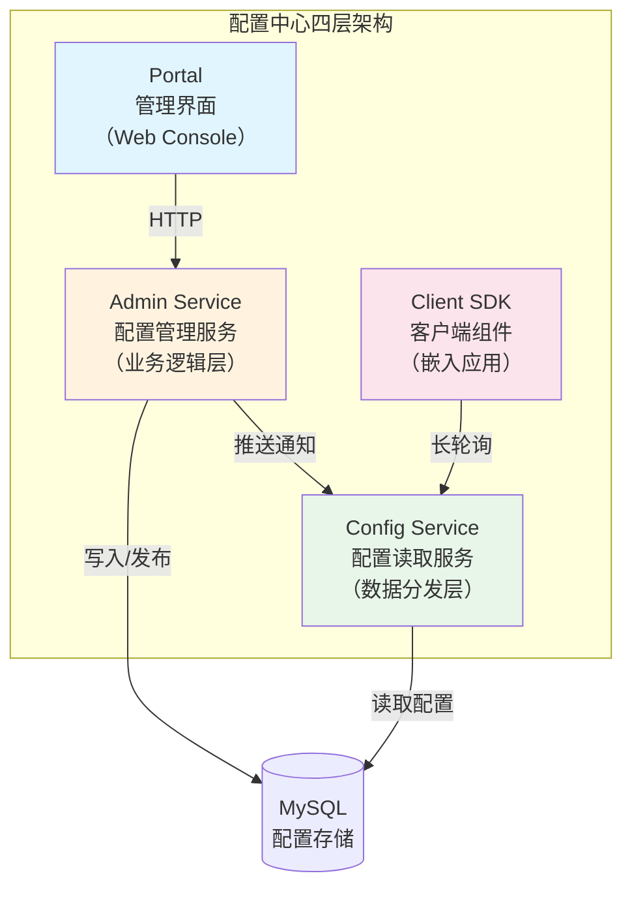
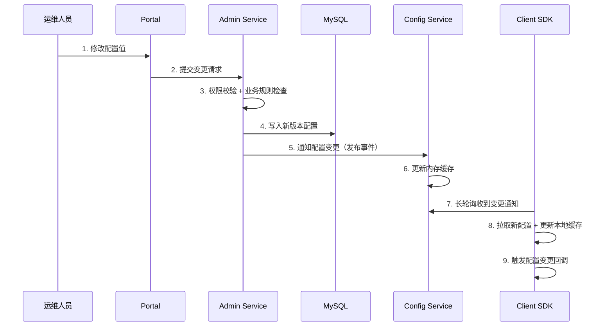
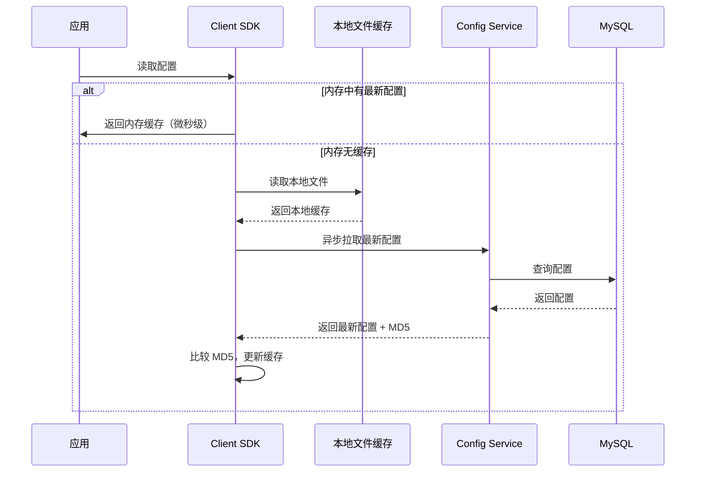
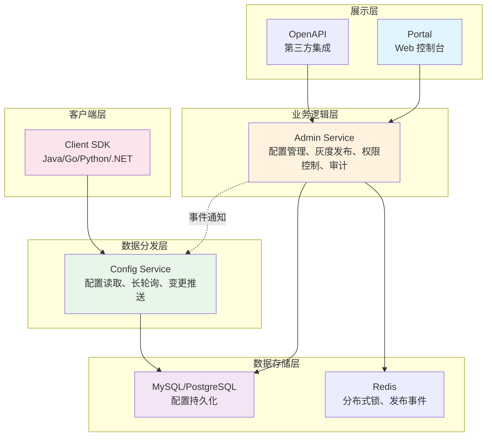
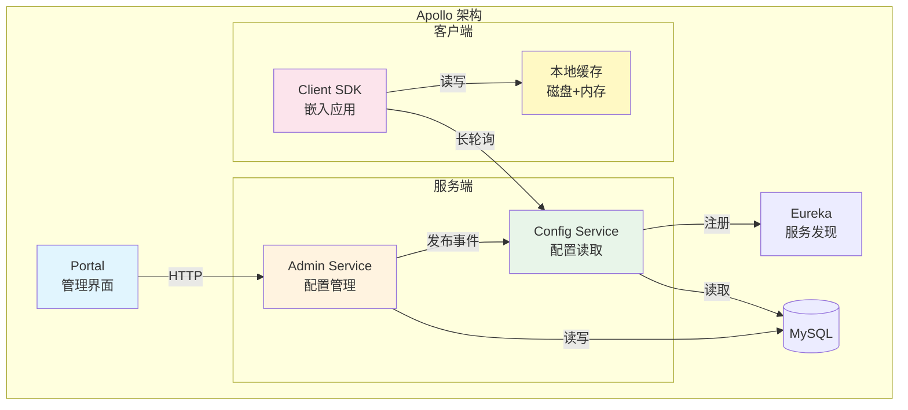
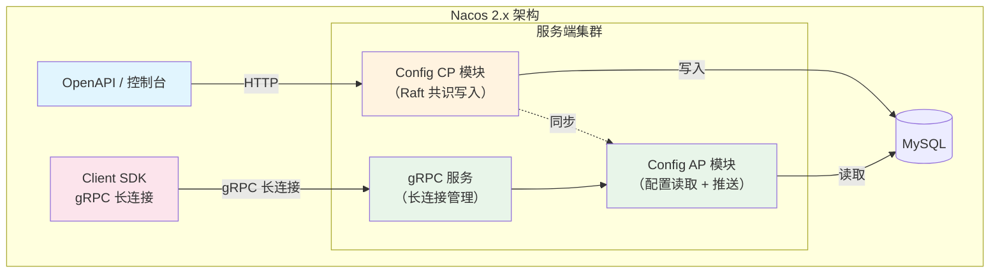
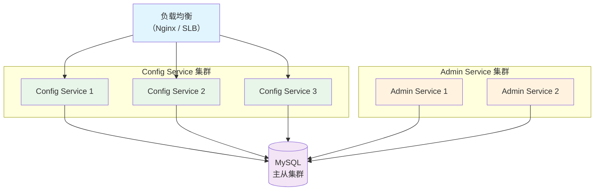
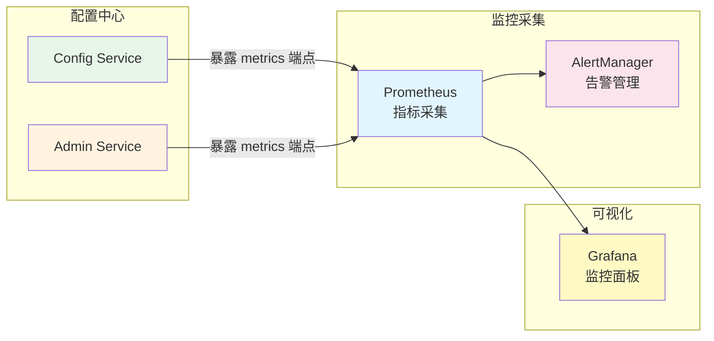

# 配置中心架构模型

## 一、为什么需要理解架构模型

配置中心不是简单地"把配置文件放到一个 Web 界面"。在微服务架构下，配置中心承担着**配置存储、变更推送、权限管控、灰度发布、版本回滚**等多重职责。不理解其内部组件的分工和协作方式，就无法做出正确的选型决策、无法排查生产故障、更无法在 Apollo 和 Nacos 之间做出理性选择。

一个配置中心的选型失误，轻则导致团队频繁踩坑（配置推送延迟、缓存一致性问题），重则引发生产事故（配置丢失、灰度规则错误导致全量生效）。2019 年某互联网公司就曾因为配置中心集群全部宕机且本地缓存过期，导致 200+ 微服务实例无法启动，故障恢复耗时 47 分钟。

本节从架构视角出发，拆解配置中心的组件构成、数据流转、分层设计和高可用机制，为后续章节的推送机制、灰度发布和实战案例打下基础。

---

## 二、配置中心的核心组件

一个完整的配置中心通常由四个核心组件构成。以 Apollo 为典型代表，其架构如下：



### 2.1 Portal（管理界面）

Portal 是面向运维人员和开发者的 Web 控制台，提供配置的可视化管理能力。

**核心职责：**

| 功能 | 说明 |
|------|------|
| 配置编辑 | 在线创建、修改、删除配置项，支持富文本编辑器，语法高亮 |
| 环境切换 | 切换 DEV/SIT/UAT/PRE/PROD 等不同环境的配置视图 |
| 灰度管理 | 设定灰度规则（按 IP、标签、百分比），控制配置的渐进式发布 |
| 版本管理 | 查看变更历史，对比版本差异，执行一键回滚 |
| 权限管理 | 基于 RBAC 的角色权限分配，控制谁能查看/编辑/发布哪些 Namespace |
| 审批流程 | 配置变更提交后触发审批链，需审批通过才能生效 |
| 变更审计 | 完整的操作日志，支持按时间、操作者、应用维度检索 |

**设计要点：**

Portal 本身不直接操作配置存储，而是通过调用 Admin Service 的 API 来完成所有操作。这种解耦使得 Portal 可以有多个实例（前端负载均衡），而业务逻辑集中在 Admin Service 中。在 Apollo 中，Portal 是一个独立的前端应用，通过 REST API 与 Admin Service 通信。前端资源可以打包为静态文件，部署在 Nginx 上，实现极高的可用性。

**Portal 的技术实现细节：**
- 前端框架：Apollo Portal 使用 AngularJS（1.x 时代），Nacos Console 使用 React
- 状态管理：Portal 维护当前选中的环境、集群、命名空间的上下文状态
- 缓存策略：前端缓存已加载的配置列表，减少重复请求
- 响应式设计：支持不同分辨率的屏幕，方便运维人员在不同设备上操作

### 2.2 Admin Service（配置管理服务）

Admin Service 是配置中心的"大脑"，承载所有业务逻辑。

**核心职责：**

| 功能 | 说明 |
|------|------|
| 配置 CRUD | 创建、读取、更新、删除配置项，维护配置元数据 |
| 发布管理 | 管理配置发布的生命周期：草稿→灰度→全量→回滚 |
| 变更通知 | 配置发布后，通知 Config Service 推送变更给客户端 |
| 灰度引擎 | 根据灰度规则计算哪些实例应该接收新配置 |
| 审计日志 | 记录所有配置操作的完整审计链（谁在什么时间做了什么修改） |
| 权限校验 | 拦截非法操作，验证操作者权限 |
| 格式校验 | 验证配置值的格式合法性（如 JSON Schema 校验、类型检查） |

**关键设计：**

Admin Service 是**有状态服务**（依赖数据库），但应用层本身无状态。多个 Admin Service 实例可以水平扩展，通过数据库保证一致性。在 Apollo 中，Admin Service 与 Config Service 部署在同一个 JVM 进程中（但逻辑分离），减少网络开销。这种设计在中小规模部署时简化了运维，但在大规模场景下，读写流量的特征差异要求两者独立扩展。

**Admin Service 的发布状态机：**

草稿（Draft）
  │ 用户点击"发布"
  ▼
待发布（Pending Release）
  │ 权限校验通过 + 审批通过（如需要）
  ▼
发布中（Releasing）
  │ 写入数据库 + 通知 Config Service
  ▼
已发布（Published）
  │ 用户点击"回滚"
  ▼
已回滚（Rolled Back）

每个状态转换都会记录审计日志，包括操作者、操作时间、变更前后的内容快照。

### 2.3 Config Service（配置读取服务）

Config Service 是面向客户端的"数据分发层"，负责将配置高效地推送给应用实例。

**核心职责：**

| 功能 | 说明 |
|------|------|
| 配置读取 | 响应客户端的配置读取请求，返回当前最新配置 |
| 长轮询 | 维护客户端的长轮询连接，配置变更时立即通知 |
| 本地缓存 | 客户端侧缓存配置（内存 + 磁盘双层），保证 Config Service 不可用时应用仍能启动 |
| 配置格式化 | 将配置转换为客户端需要的格式（JSON、Properties、YAML 等） |
| 元数据返回 | 返回配置的版本号、MD5 等元数据，供客户端判断是否需要更新 |
| 健康检查 | 暴露健康检查端点，供负载均衡器和监控系统探活 |

**设计要点：**

Config Service 是**无状态设计**，可以大量水平扩展。客户端通过服务发现或域名访问 Config Service 集群。在 Apollo 中，Config Service 集群通常部署 3-5 个节点，前端通过 Nginx 负载均衡。

**Config Service 的长轮询实现原理：**

客户端发起长轮询请求 → Config Service 挂起该 HTTP 连接
  │
  ├── 有配置变更 → 立即返回变更通知（响应时间 < 100ms）
  │
  ├── 超时（默认 60s） → 返回空响应，客户端重新建立连接
  │
  └── Config Service 宕机 → 客户端连接断开，自动重连其他节点

长轮询的核心优势是**实时性 + 低开销**：配置变更时可以立即通知客户端（毫秒级延迟），而不需要客户端频繁轮询（节省带宽和服务器资源）。

### 2.4 Client SDK（客户端组件）

Client SDK 是嵌入到应用进程中的客户端组件，负责与 Config Service 通信、本地缓存管理和配置变更回调。

**核心职责：**

| 功能 | 说明 |
|------|------|
| 启动加载 | 应用启动时从 Config Service 加载配置，如果连接失败则读取本地缓存 |
| 长轮询监听 | 保持与 Config Service 的长轮询连接，实时感知配置变更 |
| 本地缓存 | 将配置持久化到本地文件系统，保证离线启动能力 |
| 变更回调 | 配置变更后触发注册的监听器，通知应用组件刷新配置 |
| 容错降级 | 网络异常时自动降级到本地缓存，保证应用不因配置中心故障而崩溃 |

**本地缓存的三级降级模型：**

┌─────────────────────────────────────────────────┐
│  L1: 内存缓存（最快，进程重启后丢失）              │
│  ↓ 缓存未命中                                    │
│  L2: 本地文件缓存（磁盘持久化，应用重启可恢复）     │
│  ↓ 缓存未命中                                    │
│  L3: 远程 Config Service（完整数据源）             │
└─────────────────────────────────────────────────┘

这是配置中心高可用的关键设计。**应用永远不应该因为配置中心宕机而无法启动**。Apollo 的 Client SDK 在启动时的读取策略为：先尝试 L3（远程），失败则读 L2（本地文件），再失败读 L1（内存），确保应用可以启动。

**Client SDK 的生命周期管理：**

应用进程启动
  │
  ├─ 1. 初始化 SDK（注册变更监听器）
  ├─ 2. 加载配置（L3 → L2 → L1 降级策略）
  ├─ 3. 建立长轮询连接
  ├─ 4. 运行时监听配置变更（推送 → 拉取 → MD5 比对 → 回调）
  │
应用进程关闭
  │
  ├─ 5. 关闭长轮询连接
  ├─ 6. 持久化当前配置到本地文件
  └─ 7. 释放资源

---

## 三、数据流转模型

配置从创建到生效，经历一条完整的数据流。理解这条数据流是排查配置相关问题的基础。

### 3.1 配置发布流程



### 3.2 各环节的关键设计

**环节 1-2：配置提交**

用户在 Portal 编辑配置后提交。Portal 将变更请求发送给 Admin Service。此时配置处于"草稿"状态，尚未生效。

**环节 3：权限校验与规则检查**

Admin Service 执行以下检查：
- 操作者是否拥有该 Namespace 的编辑权限
- 配置值格式是否合法（如数据库连接串格式、超时时间范围）
- 是否触发审批流程（敏感配置需要审批）
- 灰度规则是否与现有灰度冲突

**环节 4：持久化写入**

配置写入 MySQL，同时记录变更历史。Apollo 使用一张三列联合主键表（`appId + cluster + namespace`）存储配置，变更历史单独一张表，每次变更生成一条记录。

**Apollo 的核心数据库表结构：**

| 表名 | 用途 | 关键字段 |
|------|------|---------|
| `app` | 应用信息 | appId, appName, ownerName, ownerEmail |
| `cluster` | 集群信息 | appId, name |
| `namespace` | 命名空间 | appId, clusterName, namespaceName |
| `item` | 配置项 | namespaceId, key, value, comment |
| `release` | 发布记录 | appId, clusterName, namespaceName, configurations |
| `release_message` | 变更通知 | id, message |
| `audit` | 审计日志 | operationType, namespace, itemName, modifiedBy |

**环节 5-6：变更通知**

Admin Service 通过数据库轮询（Apollo 的实现方式）或事件总线通知 Config Service。Config Service 收到通知后更新本地内存缓存，标记该 Namespace 有新的变更。

**环节 7-9：客户端感知与更新**

客户端的长轮询连接被唤醒，收到变更通知后立即拉取最新配置。拉取时携带本地缓存的 MD5，如果服务端配置未变化则返回 304（Not Modified），减少网络传输。客户端收到新配置后更新内存和本地文件缓存，并触发注册的变更监听器。

### 3.3 配置读取流程

配置读取是高频操作（应用启动时 + 每次长轮询间隔），必须高效：



### 3.4 配置变更的 MD5 校验机制

MD5 校验是配置中心防止无效推送的核心机制：

客户端拉取配置时携带参数：
  - namespace: "order-service"
  - md5: "a1b2c3d4e5f6..."（本地缓存的 MD5 值）

Config Service 处理逻辑：
  1. 从内存缓存读取该 namespace 的最新配置
  2. 计算最新配置的 MD5
  3. 比较客户端传来的 MD5 与最新 MD5
  4. 如果相同 → 返回 HTTP 304（Not Modified）
  5. 如果不同 → 返回 HTTP 200 + 最新配置内容 + 新 MD5

优势：
  - 避免每次都传输完整的配置内容（节省带宽）
  - MD5 计算开销极低（微秒级）
  - 保证客户端最终一致性（最多延迟一个长轮询周期）

---

## 四、分层架构设计

### 4.1 逻辑分层模型

配置中心的架构可以抽象为四层：



| 层级 | 组件 | 核心职责 | 扩展性设计 |
|------|------|---------|-----------|
| 展示层 | Portal, OpenAPI | 配置可视化管理、第三方集成 | 前端负载均衡，支持多实例 |
| 业务逻辑层 | Admin Service | 配置 CRUD、发布管理、灰度引擎、权限校验 | 无状态应用层 + 共享数据库 |
| 数据分发层 | Config Service | 配置读取、长轮询、变更推送 | 完全无状态，水平扩展无上限 |
| 数据存储层 | MySQL, Redis | 配置持久化、分布式锁、事件总线 | 主从复制 + 读写分离 |
| 客户端层 | Client SDK | 本地缓存、长轮询、变更回调 | 嵌入应用进程，无独立部署 |

### 4.2 为什么 Client SDK 要嵌入应用进程

这是配置中心架构中最关键的设计决策之一。Client SDK 不是一个独立的服务，而是以 SDK 的形式嵌入到每个应用进程中。

**原因分析：**

1. **启动时配置可用性**：应用启动需要读取配置（如数据库连接串）。如果 Client SDK 是独立服务，那么"应用启动"依赖"SDK 服务启动"，增加了一层启动依赖链。嵌入进程后，SDK 读取本地缓存即可提供配置，无需外部依赖。

2. **零网络延迟的本地缓存**：内存缓存在进程内访问，微秒级延迟。如果通过 RPC 调用独立的 SDK 服务，至少增加毫秒级网络延迟。

3. **变更回调的即时性**：配置变更后可以直接在进程内触发回调函数，不需要跨进程通信。

4. **故障隔离**：每个应用实例的 SDK 是独立的。一个实例的 SDK 异常不会影响其他实例。

**代价：**

- 每个应用需要引入 SDK 依赖（语言绑定）
- SDK 的 bug 会影响应用进程（如内存泄漏、线程阻塞）
- 多语言场景下需要为每种语言维护一个 SDK

### 4.3 不同语言 SDK 的实现差异

| 语言 | Apollo SDK | Nacos SDK | 实现特点 |
|------|-----------|-----------|---------|
| Java | 官方支持，功能最全 | 官方支持 | Spring Boot Starter 集成，注解驱动 |
| Go | 官方支持（go-apollo） | 官方支持 | 轻量级，协程处理长轮询 |
| Python | 社区维护 | 官方支持 | 异步实现，配合 asyncio |
| .NET | 官方支持 | 社区维护 | NuGet 包，支持 .NET Core |
| Node.js | 社区维护 | 官方支持 | npm 包，支持 TypeScript 类型定义 |
| C/C++ | 无官方 SDK | 无官方 SDK | 需通过 HTTP API 自行封装 |

**Java SDK 的典型使用模式：**

```java
// Apollo SDK 使用示例
@ApolloConfig
public class AppConfig {

    // 方式 1：@Value 注解自动注入
    @Value("${order.timeout:30}")
    private int orderTimeout;

    // 方式 2：ConfigChangeListener 监听变更
    @ApolloConfigChangeListener("order-service.yaml")
    public void onChange(ConfigChangeEvent event) {
        for (String key : event.changedKeys()) {
            ConfigChange change = event.getChange(key);
            log.info("配置变更: {} = {} -> {}",
                key, change.getOldValue(), change.getChangeType());
        }
    }

    // 方式 3：手动获取配置
    public void manualRead() {
        Config config = ConfigService.getAppConfig();
        String value = config.getProperty("order.timeout", "30");
    }
}
```

**Go SDK 的典型使用模式：**

```go
// Apollo Go SDK 使用示例
import "github.com/apolloconfig/agollo/v4"

// 初始化客户端
client, _ := agollo.StartWithConfig(func() (*agollo.AppConfig, error) {
    return &amp;agollo.AppConfig{
        AppID:            "order-service",
        Cluster:          "default",
        NamespaceName:    "application",
        Ip:               "config-service:8080",
        ReleaseKeyPrefix: "apollo.",
    }, nil
})

// 读取配置
value := client.GetValue("order.timeout")

// 监听变更
client.OnUpdate(func(event *agollo.ChangeEvent) {
    for key, change := range event.Changes {
        fmt.Printf("配置变更: %s = %s -> %s\n",
            key, change.OldValue, change.NewValue)
    }
})
```

---

## 五、Apollo 架构详解

Apollo 是携程开源的企业级配置中心，是目前最成熟的配置中心方案之一。其架构是理解配置中心设计的经典范本。

### 5.1 整体架构



### 5.2 Apollo 的关键设计决策

**决策 1：Config Service 与 Admin Service 分离**

Apollo 将"配置读取"和"配置管理"分为两个独立的 Service。这种设计的核心考量是：

- **读写分离**：Config Service 承载的是**读流量**（每个应用实例持续长轮询），QPS 远高于写流量。分离后可以独立扩展 Config Service 的实例数量
- **故障隔离**：Config Service 宕机影响配置读取（有本地缓存兜底），Admin Service 宕机影响配置修改（不影响已发布的配置生效）
- **安全边界**：Config Service 只需要读权限，Admin Service 需要读写权限，分离后攻击面更小

**决策 2：基于数据库的变更通知**

Apollo 不使用 MQ（如 Kafka）来传递配置变更事件，而是让 Config Service 定时轮询数据库（`release_message` 表）。当 Admin Service 发布配置时，向该表插入一条消息；Config Service 的定时线程每秒扫描一次该表，发现新消息后通知对应的长轮询客户端。

**为什么不用 MQ？**

- **降低运维成本**：不需要额外维护 Kafka/RabbitMQ 集群
- **简化部署**：整个配置中心只需要 MySQL，不需要消息中间件
- **保证可靠性**：数据库的事务性保证消息不丢失
- **性能足够**：配置变更频率远低于业务消息，数据库轮询完全能承受

**决策 3：客户端多级缓存**

Apollo Client SDK 的缓存策略：

┌──────────────────────────────────────────────┐
│  启动时读取顺序：                              │
│  1. 内存缓存（上次运行时加载的配置）             │
│  2. 本地文件（{app.id}/config-cache/）         │
│  3. 远程 Config Service（完整配置）             │
│                                               │
│  运行时更新顺序：                              │
│  1. 长轮询收到变更通知                          │
│  2. 拉取最新配置                               │
│  3. MD5 比对（相同则跳过）                      │
│  4. 更新内存缓存                               │
│  5. 持久化到本地文件                            │
│  6. 触发变更回调                               │
└──────────────────────────────────────────────┘

**决策 4：环境隔离模型**

Apollo 的环境隔离通过"集群 + 命名空间"实现：

App (应用)
  └── Cluster (集群)
        ├── default (默认集群)
        ├── staging (预发布集群)
        └── production (生产集群)
              └── Namespace (命名空间)
                    ├── application (应用级配置)
                    ├── database (数据源配置)
                    ├── redis (缓存配置)
                    └── custom (自定义配置)

每个 Namespace 独立管理、独立发布，互不影响。这种设计使得不同团队可以管理不同 Namespace 的配置，实现权限隔离。

### 5.3 Apollo 的数据库设计

Apollo 的核心数据模型围绕"应用-集群-命名空间"三级结构设计：

```sql
-- 应用表
CREATE TABLE app (
    id              INT AUTO_INCREMENT PRIMARY KEY,
    app_id          VARCHAR(64) NOT NULL UNIQUE,  -- 应用唯一标识
    app_name        VARCHAR(256) NOT NULL,         -- 应用名称
    owner_name      VARCHAR(64) NOT NULL,          -- 负责人
    owner_email     VARCHAR(256) NOT NULL,
    created_at      TIMESTAMP DEFAULT CURRENT_TIMESTAMP,
    modified_at     TIMESTAMP DEFAULT CURRENT_TIMESTAMP
);

-- 配置项表
CREATE TABLE item (
    id              INT AUTO_INCREMENT PRIMARY KEY,
    namespace_id    INT NOT NULL,                  -- 关联命名空间
    `key`           VARCHAR(512) NOT NULL,         -- 配置键
    value           TEXT,                          -- 配置值
    comment         VARCHAR(1024),                 -- 配置说明
    line_number     INT,                           -- 行号（用于差异对比）
    created_at      TIMESTAMP DEFAULT CURRENT_TIMESTAMP,
    modified_at     TIMESTAMP DEFAULT CURRENT_TIMESTAMP,
    UNIQUE KEY uk_namespace_key (namespace_id, `key`)
);

-- 发布记录表
CREATE TABLE release (
    id              INT AUTO_INCREMENT PRIMARY KEY,
    app_id          VARCHAR(64) NOT NULL,
    cluster_name    VARCHAR(128) NOT NULL,
    namespace_name  VARCHAR(128) NOT NULL,
    configurations  TEXT NOT NULL,                 -- JSON 格式的完整配置快照
    is_abandoned    TINYINT DEFAULT 0,             -- 是否已回滚
    created_at      TIMESTAMP DEFAULT CURRENT_TIMESTAMP,
    release_key     VARCHAR(64) NOT NULL           -- 用于缓存标识
);

-- 变更通知表（Config Service 轮询此表）
CREATE TABLE release_message (
    id              BIGINT AUTO_INCREMENT PRIMARY KEY,
    message         VARCHAR(1024) NOT NULL,        -- 格式: {appId}+{cluster}+{namespace}
    created_at      TIMESTAMP DEFAULT CURRENT_TIMESTAMP,
    INDEX idx_created_at (created_at)
);
```

---

## 六、Nacos 架构详解

Nacos 是阿里巴巴开源的注册中心 + 配置中心一体化方案。其配置中心部分的架构与 Apollo 有显著差异。

### 6.1 三级配置模型

Nacos 使用 `Namespace → Group → DataId` 三级结构组织配置：

Namespace (环境级别)
  └── Group (服务分组)
        └── DataId (具体配置文件)

| 层级 | 作用 | 默认值 | 典型用法 |
|------|------|--------|---------|
| Namespace | 环境隔离 | public | DEV / SIT / UAT / PROD 各一个 Namespace |
| Group | 服务分组 | DEFAULT_GROUP | 按业务线或团队分组 |
| DataId | 具体配置 | - | 对应一个应用的一个配置文件，如 `order-service.yaml` |

**与 Apollo 的对比：** Apollo 使用 `App → Cluster → Namespace` 三级结构，其中 Namespace 是环境维度，Cluster 是集群维度。Nacos 的 Group 比 Apollo 的 Cluster 更灵活——Group 可以用于任意维度的分组，不仅限于集群。

**Nacos 配置模型的优势：**
- 更接近传统配置文件的组织方式（Namespace/Group/DataId 对应目录/分组/文件）
- 支持配置共享（多个应用共享同一个 Group 下的配置）
- DataId 支持文件名模式匹配（如 `*.yaml`）

**Apollo 配置模型的优势：**
- 以应用为中心的组织方式，更符合微服务架构
- 应用维度的权限管理更自然
- 集群概念支持多机房部署

### 6.2 Nacos 2.x 架构

Nacos 2.x 引入了 gRPC 长连接替代 1.x 的 HTTP 长轮询：



**Nacos 2.x 的关键变化：**

| 维度 | Nacos 1.x | Nacos 2.x |
|------|-----------|-----------|
| 推送机制 | HTTP 长轮询 | gRPC 长连接 |
| 推送延迟 | 秒级 | 毫秒级 |
| 连接管理 | HTTP 连接（短连接模拟长轮询） | gRPC 双向流（真正的长连接） |
| 内存开销 | 较低（HTTP 线程池） | 较高（每个客户端一个 gRPC 连接） |
| 协议一致性 | 配置中心用 HTTP，注册中心用 gRPC | 统一使用 gRPC |

### 6.3 Nacos 的一致性模型

Nacos 在配置中心场景下采用 AP 模式（最终一致性），在注册中心场景下支持 CP 和 AP 两种模式：

**配置中心的 AP 模式：**

写入请求 → 任一 Nacos 节点接收
  │
  ├── 1. 写入本地数据库
  ├── 2. 异步同步到其他节点（Distro 协议）
  ├── 3. 通知客户端配置变更
  │
  └── 最终一致性保证：所有节点最终会持有相同数据

**为什么配置中心选择 AP 而非 CP？**
- 配置变更不需要强一致性（3 秒内全量生效即可）
- CP 模式（Raft）在网络分区时写入会阻塞，影响可用性
- AP 模式在网络分区时仍可写入，分区恢复后自动同步
- 配置变更频率低，最终一致性的延迟窗口可以接受

**Distro 协议的工作原理：**
1. 每个节点负责一部分数据的写入（按 DataId 哈希分片）
2. 写入成功后，异步将变更推送到其他节点
3. 其他节点收到变更后更新本地缓存
4. 如果推送失败，节点会定期拉取全量数据进行对账

### 6.4 Nacos 的推送实现

Nacos 2.x 的配置推送基于 gRPC 长连接的双向流：

Client SDK 建立 gRPC 长连接 → Nacos 服务端
  │
  │  服务端维护连接状态：
  │  - clientId = md5(ip:port:appName)
  │  - 每个连接绑定一组监听的 DataId
  │
  │  配置变更时：
  │  1. 服务端检测到配置 MD5 变化
  │  2. 通过 gRPC 双向流主动推送 ConfigChangeNotifyRequest
  │  3. 客户端收到通知后拉取最新配置
  │
  └── 推送延迟 < 100ms（gRPC 长连接 vs HTTP 长轮询的秒级延迟）

---

## 七、配置中心的高可用设计

配置中心作为基础设施，其自身可用性至关重要。一旦配置中心全面不可用，新启动的应用实例将无法获取配置（虽然本地缓存可以兜底，但本地缓存可能过期或损坏）。

### 7.1 服务端高可用

**集群部署：**



| 组件 | 部署模式 | 最少实例数 | 扩展方式 |
|------|---------|-----------|---------|
| Config Service | 无状态集群 | 3 | 水平扩展，线性提升读吞吐 |
| Admin Service | 无状态集群 + 共享 DB | 2 | 水平扩展，写吞吐受限于 DB |
| MySQL | 主从复制 | 1主2从 | 读写分离 + 分库分表 |
| Portal | 静态前端 + Nginx | 1 | 多节点负载均衡 |

**Config Service 的无状态设计是高可用的核心**。每个 Config Service 实例独立提供服务，不依赖其他实例的状态。客户端通过负载均衡器访问任意一个实例即可。当一个实例宕机时，客户端的长轮询连接断开后会自动重连到其他实例。

### 7.2 客户端高可用

客户端的高可用通过本地缓存保证，核心原则是：**即使配置中心全部宕机，已运行的应用不受影响，新启动的应用也能使用缓存配置启动**。

正常状态：
  应用 → 内存缓存 → Config Service → MySQL

Config Service 全部宕机时：
  应用 → 内存缓存（上次拉取的配置）
  
应用重启且 Config Service 不可用时：
  应用 → 本地文件缓存（最后一次持久化的配置）
  
最极端情况（内存丢失 + 本地文件损坏）：
  应用 → 启动失败（需要人工干预）

### 7.3 容灾降级策略

| 故障场景 | 降级策略 | 影响范围 | 恢复方式 |
|---------|---------|---------|---------|
| 单个 Config Service 宕机 | 负载均衡自动摘除 | 无影响（其他节点接管） | 重启故障节点 |
| 所有 Config Service 宕机 | 客户端使用本地缓存 | 已运行应用不受影响，新配置无法推送 | 恢复 Config Service |
| MySQL 主库宕机 | 从库只读 + Config Service 使用缓存 | 配置读取正常，配置修改暂停 | MySQL 主从切换 |
| 全部基础设施宕机 | 客户端使用本地磁盘缓存 | 新启动应用使用旧配置 | 逐步恢复基础设施 |

### 7.4 多数据中心部署模式

在多数据中心（Multi-IDC）场景下，配置中心需要跨机房同步配置：

**方案一：独立部署 + 数据同步**

IDC-A 配置中心                    IDC-B 配置中心
  ├── Portal                      ├── Portal
  ├── Admin Service               ├── Admin Service
  ├── Config Service              ├── Config Service
  ├── MySQL (主)                  ├── MySQL (从/独立)
  └── Client SDK ←→ Config Service A  └── Client SDK ←→ Config Service B

数据同步：MySQL 主从复制 或 定时全量同步

**方案二：全局配置中心 + 就近访问**

                    全局配置中心
                    ├── Portal
                    ├── Admin Service
                    └── MySQL (主)
                         │
              ┌──────────┼──────────┐
              ▼          ▼          ▼
         IDC-A        IDC-B       IDC-C
      Config SVR    Config SVR   Config SVR
      (只读副本)    (只读副本)   (只读副本)
          │            │            │
      Client SDK   Client SDK   Client SDK

**多数据中心的关键挑战：**
- 数据同步延迟：主从复制通常有秒级延迟
- 网络分区处理：跨机房网络抖动时的降级策略
- 一致性保证：确保所有机房最终持有相同配置
- 故障隔离：单机房故障不影响其他机房的配置读取

---

## 八、配置中心的安全架构

配置中心存储了数据库密码、API 密钥、证书等敏感信息，安全性至关重要。

### 8.1 传输安全

| 层级 | 措施 | 说明 |
|------|------|------|
| 网络层 | TLS/HTTPS | 所有通信链路加密，防止中间人攻击 |
| 应用层 | API Key / Token | 客户端身份认证，防止未授权访问 |
| 传输层 | mTLS（可选） | 双向 TLS 认证，客户端和服务端互相验证身份 |

**Apollo 的通信加密：**
- Portal → Admin Service：HTTP（内网）或 HTTPS（公网）
- Admin Service → MySQL：内网直连，MySQL 启用 SSL
- Client SDK → Config Service：HTTP（内网）或 HTTPS（公网）
- 建议：生产环境全链路启用 HTTPS

### 8.2 存储安全

| 措施 | 说明 |
|------|------|
| 配置值加密 | 敏感配置（密码、密钥）加密存储，数据库中是密文 |
| 数据库加密 | MySQL 启用透明数据加密（TDE） |
| 备份加密 | 配置备份文件加密存储 |
| 密钥管理 | 加密密钥独立于配置中心存储（如 Vault、KMS） |

**Apollo 的配置加密方案：**
- Apollo 本身不内置配置值加密功能
- 推荐方案：使用 Jasypt 或自定义加密器，在 Client SDK 侧解密
- Nacos 支持配置加密：`spring.cloud.nacos.config.encrypt.key` 配置加密密钥

**配置加密的实现模式：**

存储态：  database.password = ENC(abc123def456...)
使用态：  SDK 加载后自动解密 → database.password = "my_secret_password"

加密流程：
  运维人员输入明文 → Portal 调用加密 API → 密文写入数据库

解密流程：
  Client SDK 加载密文 → SDK 调用解密函数 → 明文注入应用上下文

### 8.3 访问控制

**RBAC 权限模型：**

角色（Role）
  ├── 系统管理员（System Admin）
  │     ├── 管理所有应用和命名空间
  │     ├── 管理用户和权限
  │     └── 管理配置中心自身配置
  │
  ├── 应用管理员（App Admin）
  │     ├── 管理指定应用的所有命名空间
  │     ├── 发布配置
  │     └── 管理灰度规则
  │
  ├── 开发者（Developer）
  │     ├── 编辑指定命名空间的配置
  │     ├── 提交发布请求（需审批）
  │     └── 查看变更历史
  │
  └── 只读用户（Reader）
        ├── 查看配置内容
        └── 查看变更历史

**权限粒度控制：**

| 维度 | 说明 | 示例 |
|------|------|------|
| 应用级 | 控制对整个应用的访问 | 开发者只能操作 order-service |
| 命名空间级 | 控制对特定命名空间的访问 | 开发者只能编辑 application，不能编辑 database |
| 操作级 | 控制具体操作权限 | 开发者只能编辑，不能发布；发布需要审批 |
| 环境级 | 控制对特定环境的访问 | 开发者只能操作 DEV 环境，PROD 需要审批 |

### 8.4 审计与合规

配置中心必须记录完整的审计日志，满足合规要求：

**审计日志必须记录的信息：**

| 字段 | 说明 |
|------|------|
| 操作者 | 谁执行了操作（用户名、IP 地址） |
| 操作时间 | 精确到毫秒的操作时间戳 |
| 操作类型 | 创建 / 编辑 / 删除 / 发布 / 回滚 |
| 操作对象 | 应用、集群、命名空间、配置键 |
| 变更内容 | 变更前的值（oldValue）和变更后的值（newValue） |
| 操作结果 | 成功 / 失败（含失败原因） |

---

## 九、与其他架构方案的对比

### 9.1 配置中心 vs Git + CI/CD

在一些团队中，配置管理采用"Git 仓库 + CI/CD 流水线"的方式：修改配置文件 → 提交 Git → 触发 CI/CD → 滚动更新 Pod。

| 维度 | 配置中心 | Git + CI/CD |
|------|---------|-------------|
| 变更延迟 | 秒级（推送机制） | 分钟级（流水线执行时间） |
| 需要重启 | 不需要（热更新） | 需要（滚动更新 Pod） |
| 灰度能力 | 原生支持 | 需要额外开发 |
| 版本管理 | 内置（变更历史 + 回滚） | Git 天然支持 |
| 学习成本 | 需要学习新平台 | Git 工作流团队已熟悉 |
| 运维复杂度 | 需要维护配置中心集群 | 无需额外组件 |
| 适用场景 | 配置变更频繁、需要灰度 | 配置变更不频繁、K8s 环境 |

**选型建议：** 配置变更频率是关键决策因素。如果每天配置变更不超过 5 次，Git + CI/CD 更简单；如果每天变更几十次甚至更多，配置中心的推送能力和灰度能力就不可或缺。

### 9.2 配置中心 vs Kubernetes ConfigMap/Secret

Kubernetes 原生提供了 ConfigMap 和 Secret 来管理配置：

| 维度 | 配置中心 | K8s ConfigMap |
|------|---------|---------------|
| 热更新 | 推送机制，秒级生效 | ConfigMap 更新后需等待 Kubelet 同步（分钟级） |
| 权限管理 | 细粒度 RBAC + 审批 | K8s RBAC（Namespace 级别） |
| 版本回滚 | 一键回滚到任意历史版本 | 依赖 kubectl rollout undo |
| 灰度发布 | 原生支持 | 不支持（全量更新） |
| 多环境管理 | Namespace/集群/环境维度隔离 | 依赖多集群或 Namespace |
| 管理界面 | 专业 Web 控制台 | kubectl + Dashboard |

**互补策略：** 许多企业在 K8s 环境中同时使用两者。配置中心管理应用级别的配置（业务参数、功能开关），K8s ConfigMap/Secret 管理基础设施级别的配置（启动参数、环境变量）。

### 9.3 配置中心 vs etcd/Consul

| 维度 | 配置中心（Apollo/Nacos） | etcd/Consul |
|------|------------------------|-------------|
| 定位 | 应用级配置管理 | 基础设施级 KV 存储 |
| 配置模型 | 多级命名空间 + 灰度发布 | 扁平 KV + Watch |
| 管理界面 | 专业配置管理 UI | 基础 KV 编辑器 |
| 权限管理 | 应用级 RBAC | KV 路径级 ACL |
| 推送机制 | 长轮询/gRPC | Watch 机制 |
| 适用场景 | 微服务应用配置 | 服务发现、分布式锁、Feature Flag |

---

## 十、配置中心的容量规划

### 10.1 存储容量估算

配置中心的存储需求可以通过以下公式估算：

总配置数 = 服务实例数 × 平均配置项数 × 环境数
存储空间 ≈ 总配置数 × 平均每个配置项大小（含元数据）

示例（中等规模微服务系统）：
  200 个服务 × 300 配置项 × 5 环境 = 300,000 条配置
  300,000 × 1KB（含版本历史） = 约 300MB

这个量级对 MySQL 来说毫无压力。但要注意**版本历史表**会随时间增长，需要定期归档。

**版本历史表的归档策略：**

| 策略 | 说明 | 适用场景 |
|------|------|---------|
| 按时间归档 | 保留近 90 天的历史，超过的迁移到归档表 | 变更频繁的系统 |
| 按数量归档 | 每个配置键保留最近 50 条历史 | 变更不频繁但配置项多的系统 |
| 压缩存储 | 历史记录使用 JSON 压缩存储 | 存储空间受限的环境 |

### 10.2 读写 QPS 估算

读 QPS（Config Service）：
  = 服务实例数 × 轮询频率
  = 1000 × (1/60) ≈ 17 QPS（长轮询模式下实际是 hold 住连接）

写 QPS（Admin Service）：
  = 日均配置变更次数 / 86400
  = 500 / 86400 ≈ 0.006 QPS（极低）

长连接数（Config Service）：
  = 服务实例数
  = 1000 个长连接

配置中心的**读 QPS 极低**（因为长轮询模式下客户端连接被 hold 住，不会频繁发起新请求），写 QPS 通常也不高（配置变更不是秒级操作）。主要的资源消耗在于**长连接数**和**内存缓存**。

### 10.3 关键性能指标参考

| 指标 | 典型目标值 | 说明 |
|------|-----------|------|
| 配置读取延迟（P99） | < 50ms | 从 Config Service 读取单条配置 |
| 配置推送延迟（P99） | < 3s | 从配置发布到客户端感知变更 |
| 长轮询超时 | 60s | Apollo 默认值，超时后客户端重新建立连接 |
| 本地缓存读取 | < 1ms | 进程内内存读取 |
| Config Service 单节点连接数 | 5000-10000 | 取决于 JVM 堆大小和网络带宽 |

### 10.4 资源配置参考

| 部署规模 | Config Service | Admin Service | MySQL | 说明 |
|---------|---------------|---------------|-------|------|
| 小型（<100 实例） | 2C4G × 2 | 2C4G × 1 | 4C8G × 1 | 单机房，低可用 |
| 中型（100-1000 实例） | 4C8G × 3 | 4C8G × 2 | 8C16G × 1主1从 | 标准部署 |
| 大型（1000-5000 实例） | 8C16G × 5 | 8C16G × 3 | 16C32G × 1主2从 | 高可用部署 |
| 超大规模（5000+ 实例） | 16C32G × 8+ | 16C32G × 5 | 分库分表 + 读写分离 | 需要定制优化 |

---

## 十一、配置中心的可观测性

配置中心作为基础设施，必须具备完善的监控和告警能力。

### 11.1 核心监控指标

| 类别 | 指标 | 说明 | 告警阈值 |
|------|------|------|---------|
| 可用性 | Config Service 健康实例数 | 集群中健康的实例数量 | < 2 个实例告警 |
| 可用性 | Admin Service 健康实例数 | 集群中健康的实例数量 | < 1 个实例告警 |
| 性能 | 配置读取 P99 延迟 | 客户端读取配置的延迟 | > 100ms 告警 |
| 性能 | 配置推送延迟 | 从发布到客户端感知的时间 | > 5s 告警 |
| 容量 | 长连接数 | Config Service 维护的长连接数 | > 80% 容量告警 |
| 容量 | 内存使用率 | Config Service JVM 堆内存 | > 80% 告警 |
| 业务 | 配置变更次数 | 单位时间内的配置变更频率 | 异常波动告警 |
| 业务 | 配置推送失败率 | 推送失败的占比 | > 1% 告警 |

### 11.2 监控架构



**Apollo 的内置监控：**
- Spring Boot Actuator 端点：`/health`、`/metrics`、`/env`
- 自定义 metrics：配置读取次数、推送延迟、长连接数
- 日志输出：配置变更事件、异常信息

### 11.3 告警策略

| 告警级别 | 触发条件 | 处理方式 |
|---------|---------|---------|
| P0（致命） | Config Service 全部宕机 | 立即响应，启动应急预案 |
| P1（严重） | Config Service 实例数 < 2 | 30 分钟内响应 |
| P2（警告） | 推送延迟 > 5s 或内存 > 80% | 2 小时内响应 |
| P3（通知） | 配置变更频率异常 | 工作时间处理 |

---

## 十二、配置中心的演进历程

理解配置中心的发展历程，有助于把握其设计思想的演变。

### 12.1 四个演进阶段

阶段 1：文件配置（2010 年以前）
  ├── 配置存储：本地 properties/yml 文件
  ├── 变更方式：修改文件 → 重启应用
  ├── 问题：每次变更都需要重启，运维成本高
  └── 适用场景：单体应用，配置变更极少

阶段 2：集中式配置（2010-2015）
  ├── 配置存储：数据库（MySQL）
  ├── 变更方式：修改数据库 → 重启应用（或定时刷新）
  ├── 问题：重启仍不可避免，数据库成为单点
  └── 适用场景：小型微服务系统

阶段 3：配置中心（2015-2020）
  ├── 配置存储：专用配置中心（Apollo/Nacos/Spring Cloud Config）
  ├── 变更方式：推送机制，秒级生效，无需重启
  ├── 特点：灰度发布、版本管理、权限控制
  └── 适用场景：中大型微服务系统

阶段 4：云原生配置管理（2020 至今）
  ├── 配置存储：配置中心 + K8s ConfigMap + GitOps
  ├── 变更方式：多渠道融合，智能调度
  ├── 特点：配置即代码、声明式管理、多集群同步
  └── 适用场景：云原生架构、多云/混合云

### 12.2 各阶段的典型方案

| 阶段 | 典型方案 | 开源时间 | 核心创新 |
|------|---------|---------|---------|
| 文件配置 | properties/yml 文件 | - | 配置与代码分离 |
| 集中式配置 | 自研配置管理平台 | - | 配置集中存储 |
| 配置中心 | Spring Cloud Config | 2015 | Git 作为配置源 + 动态刷新 |
| 配置中心 | Apollo | 2016 | 企业级配置中心，完整的管理能力 |
| 配置中心 | Nacos | 2018 | 注册中心 + 配置中心一体化 |
| 云原生配置 | K8s ConfigMap | 2016 | 容器化配置管理 |
| 云原生配置 | ArgoCD + ConfigMap | 2019 | GitOps 驱动的配置管理 |

### 12.3 未来趋势

1. **配置即代码（Configuration as Code）**：配置与应用代码一样纳入版本控制，通过 GitOps 流水线管理
2. **智能配置管理**：基于 AI 的配置推荐、异常检测、自动调优
3. **多集群配置同步**：跨云、跨区域的配置自动同步和一致性保证
4. **配置安全左移**：在 CI/CD 阶段就进行配置安全扫描和合规检查
5. **Serverless 配置管理**：适配 FaaS/Serverless 架构的轻量级配置方案

---

## 十三、配置中心的设计原则总结

### 13.1 六大设计原则

1. **客户端优先**：配置中心的核心用户是应用实例（Client SDK），而非运维人员（Portal）。设计时优先保证客户端的读取性能和可用性。

2. **离线可用**：应用必须能在配置中心完全不可用的情况下正常启动和运行。本地缓存不是可选特性，而是必选特性。

3. **读写分离**：配置读取（高频、低延迟要求）和配置管理（低频、高一致性要求）的特征完全不同，应该分离为独立的组件。

4. **最终一致性**：配置变更不需要强一致性。"配置发布后 3 秒内全量实例生效"在绝大多数场景下是可接受的。追求强一致（如分布式事务）会严重增加复杂度。

5. **安全纵深**：从存储加密、传输加密、访问控制到审计日志，安全措施应该覆盖配置的全生命周期。

6. **可观测性**：配置变更事件、推送状态、客户端缓存命中率等指标必须可监控，否则配置相关的故障将无法定位。

### 13.2 架构选型决策树

你的场景是什么？
│
├── 配置变更频繁（每天 > 10 次）
│   ├── 需要灰度发布
│   │   ├── 已有 Java 技术栈 → Apollo（最成熟，功能最全）
│   │   ├── 需要注册中心 + 配置中心 → Nacos（一体化方案）
│   │   └── Go/多语言环境 → Nacos 2.x（gRPC 原生支持）
│   └── 不需要灰度
│       ├── K8s 环境 → Nacos + K8s ConfigMap 互补
│       └── 非 K8s 环境 → Nacos（轻量部署）
│
├── 配置变更不频繁（每天 < 10 次）
│   ├── 已有 K8s 环境
│   │   ├── 配置量少 → K8s ConfigMap/Secret + CI/CD
│   │   └── 配置量大 → Git + Helm + CI/CD
│   └── 非 K8s 环境
│       ├── 需要版本管理 → Git + CI/CD
│       └── 简单场景 → 环境变量 + 启动脚本
│
├── 需要注册中心 + 配置中心统一管理
│   └── Nacos（天然支持双中心）
│
├── Kubernetes / etcd 基础设施级配置
│   └── etcd（轻量级 KV + Watch）
│
├── 企业级微服务（500+ 服务实例）
│   ├── Apollo（最成熟的方案，社区活跃）
│   └── 自研（定制化需求强的大型企业）
│
└── 多云/混合云场景
    └── Nacos（支持多集群同步）+ GitOps

---

## 十四、常见误区与最佳实践

### 14.1 常见误区

| 误区 | 正确认知 |
|------|---------|
| "配置中心可以替代所有配置管理" | 配置中心适合应用级动态配置，基础设施配置（JVM 参数、环境变量）仍需要其他方案 |
| "Apollo 和 Nacos 功能完全相同" | Apollo 专注于配置管理，功能更完善；Nacos 是注册中心 + 配置中心一体化，各有侧重 |
| "配置中心不需要高可用" | 配置中心是基础设施，宕机会影响所有微服务的配置获取 |
| "本地缓存不重要" | 本地缓存是配置中心高可用的最后一道防线，必须精心设计 |
| "配置变更不需要灰度" | 生产环境的配置变更必须支持灰度，否则一次错误配置可能导致全量故障 |
| "配置中心越复杂越好" | 简单场景用简单方案（Git + CI/CD），不要为了用配置中心而用配置中心 |

### 14.2 最佳实践

1. **渐进式采用**：先在 DEV 环境验证，再推广到 PRE/PROD
2. **配置分类管理**：将配置按变更频率、敏感度、环境维度分类，采用不同的管理策略
3. **灰度先行**：任何生产配置变更都先灰度 10%，观察 15 分钟再全量
4. **监控告警**：配置中心上线后立即配置监控和告警，不要等到出问题才补
5. **定期演练**：每季度进行一次配置中心故障演练，验证本地缓存降级能力
6. **配置审计**：所有配置变更必须记录审计日志，满足合规要求

---

> 本节从架构视角全景式地拆解了配置中心的组件构成、数据流转、分层设计、安全架构、可观测性和演进历程。理解这些架构模型后，接下来我们将深入配置热更新的实现原理——配置从"发布"到"生效"的完整链路中，每一个环节都有精巧的设计考量。
