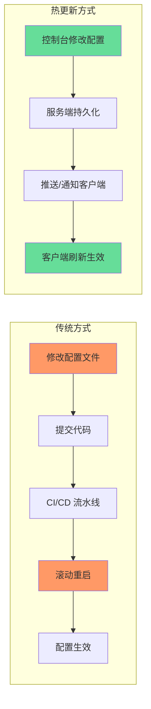
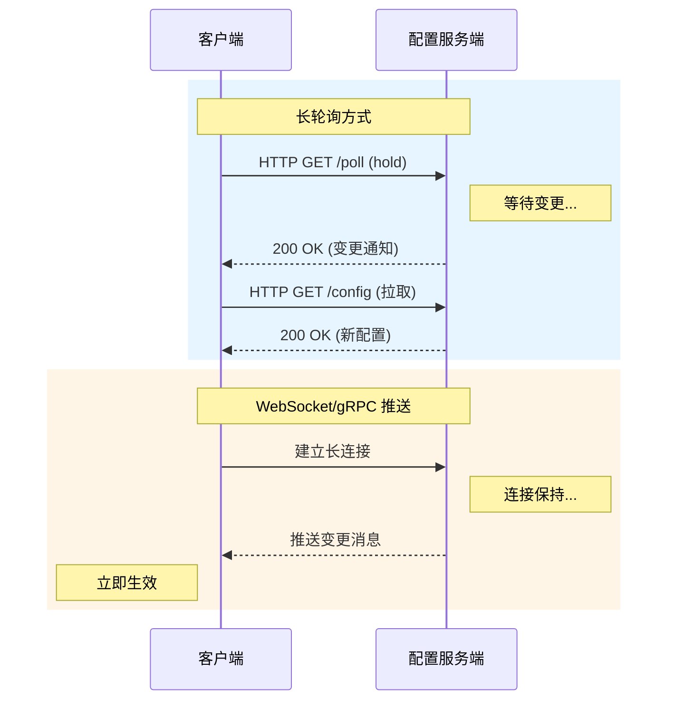
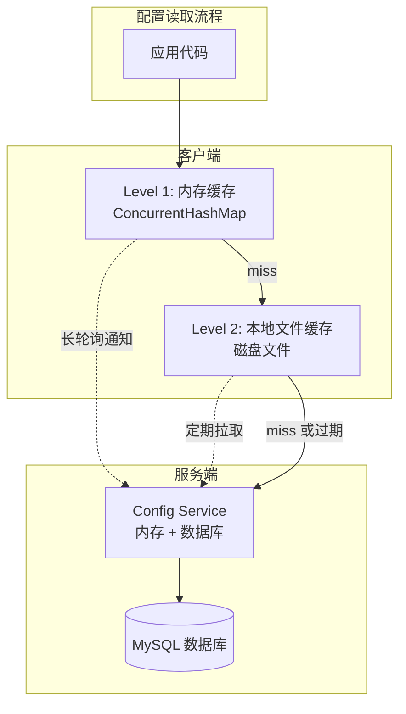
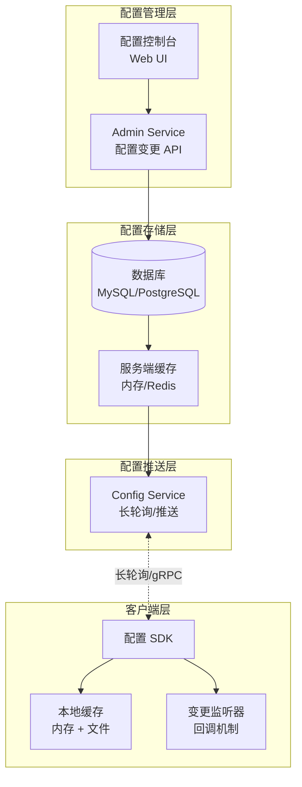
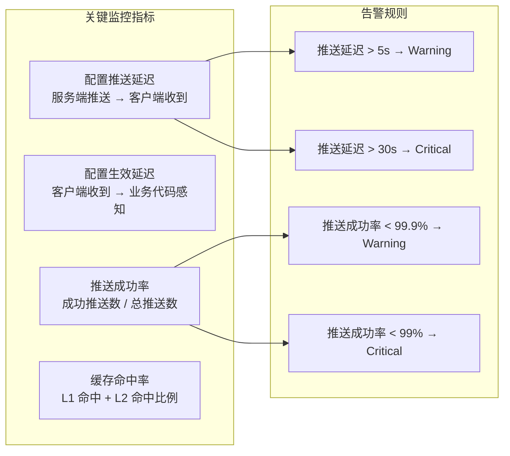
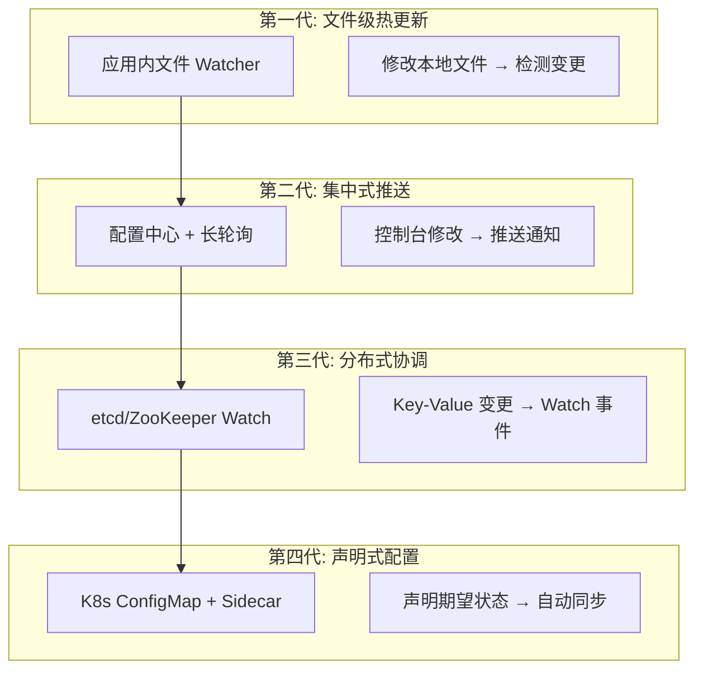

# 配置热更新机制

## 什么是配置热更新

配置热更新（Hot Reload / Hot Configuration Update）是指在应用程序**不重启、不停服**的前提下，动态感知配置变更并立即生效的技术能力。它是配置中心最核心的价值所在——如果没有热更新，配置中心不过是一个"集中存放配置文件的网页"，与把配置文件放在 Git 仓库里没有本质区别。

一个典型的热更新场景：

14:00  运维在 Apollo 控制台将 payment-service 的 retry.max 从 3 改为 5
14:00  Config Service 接收到变更，持久化到数据库
14:01  长轮询检测到变更，通知客户端
14:01  客户端拉取新配置，触发本地刷新回调
14:01  下一次支付重试自动使用新值 retry.max=5

整个过程无需重启任何服务实例，配置变更在**秒级**生效。对比传统方式——修改配置文件、走 CI/CD 流水线、滚动重启——热更新将变更时间从**小时级**压缩到**秒级**，这对于故障应急、运营调参等场景具有决定性意义。



### 热更新的业务价值：用数据说话

配置热更新不是一个"锦上添花"的功能，而是直接影响系统可用性和运维效率的关键能力。以下是一组典型数据对比：

| 指标 | 无热更新（传统方式） | 有热更新（配置中心） | 改善幅度 |
|------|-------------------|-------------------|---------|
| 配置变更生效时间 | 30-120 分钟（含 CI/CD + 滚动重启） | 3-10 秒 | 提升 200-1200 倍 |
| 故障应急响应 | 需要运维登录服务器修改配置并重启 | 控制台一键修改，秒级生效 | 故障 MTTR 降低 60-80% |
| 误操作恢复时间 | 回滚代码 + 重新部署（分钟级） | 控制台一键回滚（秒级） | 恢复时间降低 90%+ |
| 配置变更的人力成本 | 至少 2 人协作（开发 + 运维） | 1 人即可完成 | 人力成本降低 50% |
| 月均配置变更次数上限 | 受限于发布窗口（通常 2-4 次/月） | 无限制（随时可变） | 运营灵活性大幅提升 |

### 真实故障案例：热更新缺失的代价

**案例一：电商大促的数据库连接池危机**

某电商平台在双十一零点大促前，发现数据库连接池配置为 100，需要调整为 500 以应对流量洪峰。由于没有配置热更新能力，调整需要走完整的 CI/CD 流水线：

19:00  运维提交连接池配置变更 PR
19:15  CI 流水线开始构建（20 分钟）
19:35  构建完成，开始滚动重启 200 个实例
19:55  重启过程中，部分实例已停止接收流量
20:05  重启完成，但数据库连接池预热需要 10 分钟
20:15  所有实例连接池就绪
20:30  流量开始攀升（比预期提前 30 分钟）
20:35  连接池被打满，大量请求超时

最终因为连接池未就绪导致了 5 分钟的服务降级。如果有热更新能力，整个操作只需要在控制台修改一个参数，3 秒内全量生效。

**案例二：支付系统的风控阈值误调**

某支付平台的风控工程师误将单笔转账限额从 5 万调为 500 万，错误配置在 10 分钟内被全量推送。在这 10 分钟内，一笔 480 万元的异常转账被放行。虽然最终通过事后追回挽回了损失，但该事件触发了监管审计。如果有灰度发布 + 热更新能力，可以先推送给 1% 的流量进行验证，再决定是否全量。

**案例三：微服务雪崩——配置变更引发的连锁反应**

某社交平台在调整限流配置时，同时修改了 5 个配置项（限流阈值、超时时间、重试次数、熔断窗口、降级开关），但配置中心不支持批量变更合并。5 个配置项在 2 秒内先后生效，不同实例在不同时刻读到不同的配置组合。部分实例限流阈值已提高但超时时间未调整，导致大量慢请求堆积，最终触发了级联熔断。事后复盘发现，如果有**配置快照**机制保证原子性，这次事故完全可以避免。

## 配置热更新的核心原理

### 变更检测：如何发现配置变了

配置热更新的第一步是**变更检测**——客户端需要及时发现远端配置发生了变化。根据检测方式的不同，分为两大流派：

#### 拉模式（Pull）

客户端主动定期查询配置服务端，检查配置是否有更新。这是最简单但也最粗暴的方式。

**短轮询（Short Polling）**：客户端每隔固定间隔（如 30 秒）发起 HTTP 请求，查询配置版本号。如果版本号与本地不一致，则拉取新配置。

```python
# 短轮询示例
import time
import requests

class ConfigPoller:
    def __init__(self, config_url, interval=30):
        self.config_url = config_url
        self.interval = interval
        self.local_version = 0
    
    def poll(self):
        while True:
            resp = requests.get(f"{self.config_url}/version")
            remote_version = resp.json()["version"]
            if remote_version > self.local_version:
                config_resp = requests.get(f"{self.config_url}/config")
                self.apply(config_resp.json())
                self.local_version = remote_version
            time.sleep(self.interval)
    
    def apply(self, new_config):
        # 将新配置注入到运行中的应用
        pass
```

短轮询的致命缺陷在于**延迟与资源的矛盾**：

| 轮询间隔 | 配置生效延迟 | 服务端 QPS（1000 实例） | 评价 |
|---------|------------|----------------------|------|
| 1 秒 | 平均 0.5 秒 | 1000 QPS | 延迟可接受，但服务端压力大 |
| 30 秒 | 平均 15 秒 | 33 QPS | 服务端轻松，但延迟不可接受 |
| 5 秒 | 平均 2.5 秒 | 200 QPS | 折中方案，但仍然不够精确 |

对于配置变更频率低的系统，短轮询尚可接受；但对于故障应急等场景，15 秒的延迟可能意味着大量错误请求已经产生。

#### 长轮询（Long Polling）

长轮询是短轮询的改进版，也是 Apollo 和 Nacos 1.x 的核心推送机制。它的工作原理是：客户端发起 HTTP 请求后，服务端**hold 住连接不立即返回**，直到配置发生变更或超时（通常 60 秒）才返回响应。

客户端                                服务端
  |                                    |
  |---- GET /notifications?timeout=60  -->|
  |                                    |  (hold 住连接，等待变更)
  |                                    |  ... 5 秒过去了 ...
  |                                    |  (检测到配置变更)
  |<---- 200 OK {version: v28} -------|  (立即返回)
  |                                    |
  |  (拉取新配置，应用变更)             |
  |                                    |
  |---- GET /notifications?timeout=60  -->|
  |                                    |  (继续 hold)
  |                                    |  ... 55 秒过去了，无变更
  |<---- 200 OK {version: v28} -------|  (超时返回，版本未变)
  |                                    |
  |  (无变更，直接进入下一轮)            |
  |                                    |
  |---- GET /notifications?timeout=60  -->|

长轮询相比短轮询的优势：

| 对比维度 | 短轮询 | 长轮询 |
|---------|--------|--------|
| 实时性 | 取决于轮询间隔 | 秒级（变更即推送） |
| 服务端压力 | 固定频率，与实例数成正比 | 无变更时连接 hold 住，不消耗 CPU |
| 网络开销 | 每次请求都传输完整 HTTP 头 | 大部分请求无数据返回 |
| 实现复杂度 | 极低 | 中等（需要管理挂起的连接） |
| 兼容性 | 任何 HTTP 客户端 | 需要支持长连接的 HTTP 客户端 |

**长轮询的工程实现要点：**

长轮询看似简单，但在工程实现中有几个关键细节需要处理：

1. **超时策略**：服务端 hold 连接的时间不宜过长（通常 60 秒），否则客户端和服务端之间的负载均衡器（如 Nginx、SLB）可能会主动断开空闲连接。Apollo 默认使用 60 秒超时。
2. **连接管理**：客户端需要维护一个专用的长轮询线程，该线程在等待响应期间处于阻塞状态。如果长轮询线程异常退出，需要自动重建。
3. **重连策略**：长轮询连接断开后，客户端应该使用指数退避（Exponential Backoff）策略重连，避免瞬间大量重连造成"连接风暴"。
4. **负载均衡**：多实例部署时，长轮询请求应随机选择 Config Service 节点，避免所有客户端集中到同一个节点。

```java
// Apollo 客户端的长轮询线程管理
public class LongPollingService {
    private final ExecutorService longPollingExecutor = 
        Executors.newSingleThreadExecutor(r -> {
            Thread t = new Thread(r, "apollo-long-polling");
            t.setDaemon(true);  // 守护线程，不阻止 JVM 退出
            return t;
        });
    
    public void startLongPolling() {
        longPollingExecutor.submit(() -> {
            while (!Thread.currentThread().isInterrupted()) {
                try {
                    // 发起长轮询请求
                    HttpResponse response = httpClient.execute(pollRequest);
                    if (response.isConfigChanged()) {
                        // 检测到变更，触发配置拉取
                        onConfigChanged();
                    }
                } catch (Exception e) {
                    // 连接异常，指数退避重试
                    Thread.sleep(calculateBackoff());
                }
            }
        });
    }
}
```

```go
// Go 语言的长轮询实现
func (c *ConfigClient) startLongPolling(ctx context.Context) {
    for {
        select {
        case <-ctx.Done():
            return
        default:
        }
        
        url := fmt.Sprintf("%s/notifications?timeout=60", c.configServer)
        req, _ := http.NewRequestWithContext(ctx, "GET", url, nil)
        
        resp, err := c.httpClient.Do(req)
        if err != nil {
            // 指数退避重连
            time.Sleep(c.nextBackoff())
            continue
        }
        c.resetBackoff()
        
        if resp.StatusCode == http.StatusOK {
            var notification ChangeNotification
            json.NewDecoder(resp.Body).Decode(&amp;notification)
            
            if notification.HasChanges {
                // 变更通知到达，拉取最新配置
                c.fetchAndApply(notification.Namespace)
            }
        }
        resp.Body.Close()
    }
}
```

#### 推模式（Push）

推模式是服务端主动将配置变更推送到客户端，代表方案是 **WebSocket** 和 **gRPC 长连接**（Nacos 2.x）。

**WebSocket 推送**：客户端与服务端建立 WebSocket 长连接，配置变更时服务端直接推送消息。延迟最低（毫秒级），但需要运维保障 WebSocket 连接的稳定性。

**gRPC 长连接**：Nacos 2.x 引入的方案，使用 gRPC 的双向流（Bi-directional Stream）实现推送。相比 WebSocket，gRPC 具有更好的性能和类型安全性，且天然支持服务端负载均衡。



#### 三种推送机制的选型决策

在实际技术选型中，选择哪种推送机制需要综合考虑以下因素：

| 决策维度 | 推荐方案 | 理由 |
|---------|---------|------|
| 中小规模微服务（<500 实例） | 长轮询 | 实现简单、运维成本低、延迟可接受（秒级） |
| 大规模微服务（>1000 实例） | gRPC 推送 | 高并发下的性能优势明显，连接管理更高效 |
| 对延迟极度敏感（金融交易） | WebSocket 推送 | 毫秒级延迟，但需要额外的连接稳定性保障 |
| 云原生 K8s 环境 | K8s ConfigMap Watch | 与 K8s 原生机制深度集成 |
| 需要最大化兼容性 | 长轮询 | HTTP 1.1 兼容所有环境，无需特殊协议支持 |

### 变更通知：配置变了，通知谁

变更检测解决的是"配置变了"的问题，但下一个问题是"谁需要被告知"。在微服务架构中，一个配置项可能被数十个服务的数百个实例使用，通知机制需要精准且高效。

#### 通知粒度

| 粒度 | 说明 | 适用场景 |
|------|------|---------|
| 全量通知 | 配置变更后通知所有订阅者 | 配置项少、实例少的简单场景 |
| Namespace 级别通知 | 只通知受影响的 Namespace 的订阅者 | 多 Namespace 隔离的场景 |
| Key 级别通知 | 精确到具体配置项变更 | 大规模配置、需要精细控制的场景 |

Apollo 采用的是 **Namespace 级别通知**：当某个 Namespace 下的配置变更时，只有订阅了该 Namespace 的客户端会收到通知。这避免了无关客户端收到大量无用通知（"配置风暴"问题）。

#### 批量合并

高频配置变更场景下（如运营人员批量修改 10 个配置项），如果每个变更都触发一次推送通知，客户端会收到 10 次通知并执行 10 次配置刷新，造成不必要的开销。成熟的配置中心通常实现了**变更合并**策略：

- **时间窗口合并**：在 500ms 时间窗口内收到的多次变更合并为一次通知
- **版本号合并**：客户端只关注最终版本号，不关心中间经历了几次变更

#### 通知去重与幂等

在分布式网络环境下，同一条变更通知可能被重复推送（如网络抖动导致重试）。客户端的处理逻辑必须保证**幂等性**：

```java
// 幂等性保障：基于版本号去重
public class IdempotentConfigHandler {
    private volatile long lastAppliedVersion = 0;
    
    public void onNotification(ConfigChangeNotification notification) {
        // 重复通知：版本号 <= 已应用版本，直接忽略
        if (notification.getVersion() <= lastAppliedVersion) {
            log.debug("忽略重复通知，当前版本={}, 通知版本={}", 
                lastAppliedVersion, notification.getVersion());
            return;
        }
        
        // 新版本通知：应用变更
        ConfigSnapshot newConfig = fetchConfig(notification);
        applyConfig(newConfig);
        lastAppliedVersion = notification.getVersion();
    }
}
```

### 本地刷新：新配置怎么生效

收到变更通知并拉取新配置后，如何让新配置在运行中的应用里生效？这是热更新最复杂的环节，不同类型的配置需要不同的刷新策略。

#### 简单值配置的刷新

对于简单的配置项（字符串、数字、布尔值），最直接的方式是通过**内存变量的重新赋值**：

```java
// 方式一：通过 @Value + @RefreshScope 自动刷新（Spring Cloud）
@RefreshScope
@Component
public class PaymentConfig {
    @Value("${payment.retry.max:3}")
    private int retryMax;
    
    // 每次读取 retryMax 时获取的是最新值
    public int getRetryMax() { return retryMax; }
}

// 方式二：通过配置对象手动刷新
@Component
public class DynamicConfig {
    private volatile PaymentProperties paymentProps;
    
    // 配置变更回调中更新引用
    public void onConfigChange(PaymentProperties newProps) {
        this.paymentProps = newProps;  // volatile 保证可见性
    }
    
    public int getRetryMax() {
        return paymentProps.getRetryMax();
    }
}
```

这里有一个关键的并发安全问题：Java 中对基本类型字段的写操作不是原子的。如果配置字段是 `int`、`long` 等基本类型，更新过程中其他线程可能读到**半更新**的值。解决方案有两种：

1. **使用 volatile 引用**：不要直接修改字段值，而是替换整个配置对象引用（如上面的方式二）。引用赋值是原子的，配合 volatile 保证可见性
2. **使用 AtomicReference**：原子地替换配置对象

```java
// AtomicReference 方案
private final AtomicReference<AppConfig> configRef = 
    new AtomicReference<>(new AppConfig());

public void onConfigChange(AppConfig newConfig) {
    configRef.set(newConfig);  // 原子替换
}

public AppConfig getConfig() {
    return configRef.get();  // 原子读取
}
```

**Go 语言的配置刷新模式：**

Go 语言中，由于没有 Java 的 volatile 关键字，通常使用 `atomic.Value` 或 `sync.RWMutex` 实现安全的配置刷新：

```go
// 方式一：atomic.Value（推荐，无锁）
type DynamicConfig struct {
    current atomic.Value // 存储 *AppConfig
}

func NewDynamicConfig(initial *AppConfig) *DynamicConfig {
    dc := &amp;DynamicConfig{}
    dc.current.Store(initial)
    return dc
}

func (dc *DynamicConfig) OnConfigChange(newConfig *AppConfig) {
    dc.current.Store(newConfig)  // 原子替换
}

func (dc *DynamicConfig) Get() *AppConfig {
    return dc.current.Load().(*AppConfig)  // 原子读取
}

// 方式二：sync.RWMutex（适合需要批量更新的场景）
type DynamicConfig struct {
    mu      sync.RWMutex
    current *AppConfig
}

func (dc *DynamicConfig) OnConfigChange(newConfig *AppConfig) {
    dc.mu.Lock()
    dc.current = newConfig
    dc.mu.Unlock()
}

func (dc *DynamicConfig) Get() *AppConfig {
    dc.mu.RLock()
    defer dc.mu.RUnlock()
    return dc.current
}
```

#### 数据源配置的刷新

数据库连接池、Redis 连接等基础设施配置的热更新远比简单值复杂。原因是这些组件在初始化时就建立了连接池，运行期间修改连接参数（如 URL、密码）不会影响已建立的连接。

以 HikariCP 连接池为例，连接池参数（如 `maximumPoolSize`）支持动态调整：

```java
// HikariCP 的动态调参
HikariDataSource dataSource = ...;

// 修改最大连接数（立即生效，无需重启）
dataSource.setMaximumPoolSize(50);

// 但修改数据库 URL 需要重建连接池
// 这意味着需要先关闭旧连接池，再创建新连接池
// 这个过程需要确保没有正在执行的 SQL 事务
```

对于需要**完整重建**的场景（如数据库地址变更），安全的做法是：

```java
public class DynamicDataSource {
    private volatile DataSource currentDataSource;
    private final ReentrantLock lock = new ReentrantLock();
    
    public void onDataSourceConfigChange(DataSourceProperties newProps) {
        lock.lock();
        try {
            DataSource oldDataSource = this.currentDataSource;
            // 创建新连接池
            this.currentDataSource = buildDataSource(newProps);
            // 等待旧连接池中的活跃连接完成
            Thread.sleep(5000); // 等待事务完成
            // 关闭旧连接池
            oldDataSource.close();
        } finally {
            lock.unlock();
        }
    }
}
```

**更安全的连接池切换策略：**

上面的 `Thread.sleep(5000)` 是一种粗暴的等待方式。更安全的做法是使用连接池的**优雅关闭**机制：

```java
public class SafeDataSourceSwitcher {
    private volatile HikariDataSource currentDs;
    
    public void switchDataSource(HikariConfig newConfig) {
        HikariDataSource newDs = new HikariDataSource(newConfig);
        HikariDataSource oldDs = this.currentDs;
        
        // 原子替换引用，新请求使用新连接池
        this.currentDs = newDs;
        
        // 优雅关闭旧连接池：等待所有活跃查询完成
        // HikariCP 支持 setConnectionTimeout 控制等待时间
        oldDs.close();  // close() 会等待活跃连接完成
        
        // 如果使用其他连接池，可以主动检查活跃连接数
        // while (oldDs.getActiveConnections() > 0) {
        //     Thread.sleep(100);
        // }
    }
}
```

#### Bean 方法返回值的刷新

Spring 生态中，很多配置通过 `@Bean` 方法创建对象时注入。一旦 Bean 创建完成，其内部状态就固定了。要实现这些 Bean 的热更新，有几种策略：

```java
// 策略一：@RefreshScope（Spring Cloud）
// 原理：配置变更时销毁当前 Bean，下次获取时重新创建
@RefreshScope
@Bean
public RestTemplate restTemplate(@Value("${http.timeout:5000}") int timeout) {
    SimpleClientHttpRequestFactory factory = new SimpleClientHttpRequestFactory();
    factory.setConnectTimeout(timeout);
    factory.setReadTimeout(timeout);
    return new RestTemplate(factory);
}

// 策略二：使用 Supplier 包装（更优雅）
@Component
public class RestTemplateProvider {
    private volatile RestTemplate restTemplate;
    
    @PostConstruct
    public void init() {
        refresh();
    }
    
    public void refresh() {
        // 每次刷新时重新创建 RestTemplate
        this.restTemplate = createRestTemplate();
    }
    
    public RestTemplate get() {
        return restTemplate;  // volatile 保证可见性
    }
    
    private RestTemplate createRestTemplate() {
        // 从当前最新配置创建
        ...
    }
}
```

**@RefreshScope 的内部原理：**

`@RefreshScope` 的底层实现依赖 Spring 的 `Scope` 机制。当配置变更事件触发时，Spring Cloud 会调用 `ContextRefresher.refresh()` 方法：

1. 重新拉取远程配置
2. 创建一个新的 Environment，与当前 Environment 进行 Diff
3. 销毁所有 `@RefreshScope` 标注的 Bean（从 `DefaultListableBeanFactory` 中移除）
4. 发布 `EnvironmentChangeEvent`，触发其他监听器

```java
// Spring Cloud 内部流程（简化版）
public class ContextRefresher {
    public synchronized Set<String> refresh() {
        // 1. 拉取新配置
        Map<String, Object> before = extract(this.context.getEnvironment().getPropertySources());
        addConfigFilesToEnvironment();
        Set<String> changed = diff(before, after);
        
        // 2. 销毁 @RefreshScope Bean
        this.context.publishEvent(new EnvironmentChangeEvent(changed));
        
        // 3. 下次获取时重新创建
        for (String name : this.context.getBeanNamesForType(RefreshScope.class)) {
            ((RefreshScope) this.context.getBean(name)).destroy();
        }
        
        return changed;
    }
}
```

### 生效策略：配置刷新的执行模型

配置热更新的生效策略决定了配置变更后的行为模式，主要分为三种：

#### 同步生效

配置变更后立即影响下一次业务调用。这是最理想的模型，适用于大多数场景：

```java
// 同步生效模型
public class CircuitBreaker {
    private volatile CircuitBreakerConfig config;
    
    public boolean shouldTrip(int failureCount) {
        // 每次调用都读取最新配置
        return failureCount >= config.getFailureThreshold();
    }
}
```

#### 异步生效

配置变更后需要经过一段过渡期才能完全生效。典型场景是线程池参数调整：

```java
// 线程池参数的异步生效
ThreadPoolExecutor executor = ...;

// 修改核心线程数不会立即生效
// 需要调用 prestartAllCoreThreads() 启动新线程
executor.setCorePoolSize(20);
executor.prestartAllCoreThreads();

// 修改最大线程数，需要等队列满了才创建新线程
executor.setMaximumPoolSize(100);
```

#### 延迟生效

某些配置变更需要等待特定条件满足后才生效，如日志级别的切换：

```java
// Logback 动态日志级别
// 通过 JMX 或 Logback 的 StatusManager 动态修改
LoggerContext loggerContext = (LoggerContext) LoggerFactory.getILoggerFactory();
Logger rootLogger = loggerContext.getLogger("com.example");
rootLogger.setLevel(Level.DEBUG);  // 立即生效，但只影响当前 Logger 实例
```

#### 生效策略的选择指南

不同类型的配置项天然适合不同的生效策略，选错策略可能导致严重问题：

| 配置类型 | 推荐生效策略 | 原因 | 典型示例 |
|---------|------------|------|---------|
| 开关/阈值类 | 同步生效 | 读取频率高，延迟敏感 | 限流阈值、降级开关、超时时间 |
| 资源池类 | 异步生效 | 需要渐进式调整，避免资源抖动 | 线程池大小、连接池大小、队列容量 |
| 连接地址类 | 延迟生效 + 优雅切换 | 需要等待旧连接释放，风险高 | 数据库 URL、Redis 地址、MQ 地址 |
| 日志类 | 延迟生效 | 等待下一个日志事件触发 | 日志级别、日志输出格式 |
| 算法参数类 | 同步生效 | 实时影响业务逻辑 | 重试策略、熔断参数、负载均衡权重 |

## 配置热更新的一致性模型

配置热更新面临的核心难题是**分布式一致性**：当配置变更发生后，所有服务实例是否能在同一时刻看到新值？现实中，"同一时刻"是不可能的，因此需要在一致性和可用性之间做出权衡。

### 最终一致性模型

最终一致性是 Apollo 和 Nacos 采用的主流模型。其核心思想是：配置变更后，允许存在一个短暂的**不一致窗口**，在此期间不同实例可能使用新旧不同版本的配置，但经过一段时间后所有实例都会收敛到新值。

时间线:
  T0    T1    T2    T3    T4    T5
  |     |     |     |     |     |
  变更   实例A  实例B  实例C  实例D  全部收敛
  发布   收到   收到   收到   收到   完成
  
  T0~T1: 不一致窗口（实例A已更新，其他仍在用旧值）
  T1~T4: 逐步收敛窗口（部分实例已更新）
  T5: 全部收敛完成

最终一致性的**典型收敛时间**：

| 推送机制 | 理论延迟 | 实际延迟（P99） | 影响因素 |
|---------|---------|---------------|---------|
| 短轮询 | 1 个轮询周期 | 轮询间隔 | 间隔设置 |
| 长轮询 | 即时（推送后立即返回） | < 3 秒 | 网络延迟、客户端处理 |
| WebSocket | 即时（服务端主动推送） | < 1 秒 | 连接稳定性 |
| gRPC 流 | 即时 | < 1 秒 | 连接稳定性 |

### 强一致性模型

强一致性意味着配置变更后，所有实例必须在**同一时刻**读到新值。这在技术上需要使用分布式共识协议（如 Raft、Paxos），实现成本极高，且牺牲了可用性（CAP 理论中的 CP 选择）。

强一致性在配置中心场景中几乎不被采用，原因有三：

1. **性能代价过高**：每次配置读取都需要走共识协议，延迟从毫秒级上升到数十毫秒
2. **可用性风险**：网络分区时，强一致性模型会导致部分实例无法读取配置
3. **实际需求不高**：配置变更的不一致窗口通常在秒级，对业务的影响可接受

### 一致性模型的权衡：什么场景需要强一致？

虽然配置中心普遍采用最终一致性，但某些特殊场景确实需要更强的一致性保证：

| 场景 | 一致性要求 | 原因 | 实现方案 |
|------|----------|------|---------|
| 金融交易风控规则 | 强一致 | 不一致窗口内可能放行异常交易 | 灰度发布 + 双版本并行 + 流量切换 |
| 安全密钥轮转 | 强一致 | 新旧密钥并存期间可能导致认证失败 | 密钥版本号 + 客户端同时持有双密钥 |
| 数据库密码变更 | 强一致 | 新密码生效但旧连接未释放会导致连接失败 | 连接池优雅切换（前面已详述） |
| 普通业务参数调优 | 最终一致 | 几秒的不一致窗口可接受 | 标准推送机制即可 |

对于需要强一致的场景，常见的工程策略是**双版本并行**：新配置先推送，确认全量收敛后再切换流量，而不是直接覆盖旧配置。

### Apollo 的一致性策略

Apollo 采取了一种务实的**多级缓存 + 最终一致**策略，在一致性和性能之间取得了良好平衡：



**三级缓存策略详解：**

1. **L1 内存缓存**：配置数据存储在 `ConcurrentHashMap` 中，读取延迟为纳秒级。应用代码读取配置时首先命中 L1。
2. **L2 本地文件缓存**：配置数据序列化为 JSON 文件存储在本地磁盘。当 Config Service 不可用时，L1 过期后可以从 L2 恢复，实现**降级容灾**。
3. **远程 Config Service**：通过长轮询保持与服务端的连接，配置变更时接收通知并更新 L1 和 L2。

**Apollo 的本地读取保证：** Apollo 客户端启动时从 Config Service 拉取全量配置并缓存在本地。运行期间通过长轮询感知变更。即使 Config Service 完全不可用，客户端仍然可以从本地缓存读取配置，应用正常运行。这保证了**配置读取不依赖配置中心的实时可用性**。

### Nacos 2.x 的一致性策略

Nacos 2.x 引入了 AP/CP 双模式架构：

- **配置管理**采用 AP 模式（Distro 协议），保证最终一致性
- **服务发现**支持 CP 模式（Raft 协议），保证强一致性

配置管理选择 AP 模式的原因是：配置中心对可用性的要求远高于一致性。即使短暂的数据不一致，也不会导致服务不可用；但如果配置中心不可用导致服务无法启动，后果更严重。

```java
// Nacos 2.x 客户端配置监听示例
ConfigService configService = NacosFactory.createConfigService(properties);
String dataId = "application.properties";
String group = "DEFAULT_GROUP";
String namespace = "production";

// 注册监听器，配置变更时自动回调
configService.addListener(dataId, group, new Listener() {
    @Override
    public Executor getExecutor() {
        return null; // 使用默认线程池
    }
    
    @Override
    public void receiveConfigInfo(String configInfo) {
        // 配置变更回调，在此处理配置刷新逻辑
        System.out.println("配置变更: " + configInfo);
        refreshConfig(configInfo);
    }
});
```

## K8s ConfigMap 热更新机制

在 Kubernetes 环境中，ConfigMap 是原生的配置管理方案。理解 ConfigMap 的热更新机制对于云原生应用至关重要。

### ConfigMap 的更新原理

当 ConfigMap 被修改后，Kubelet 会定期（默认 60 秒）检查 ConfigMap 是否变更。如果检测到变更，Kubelet 会更新挂载到 Pod 中的文件。**但需要注意的是：Pod 中的应用程序需要主动感知文件变化，才能实现真正的热更新。**

ConfigMap 修改 → Kubelet 检测（~60s） → 更新挂载文件 → 应用感知文件变更 → 应用刷新配置
     ↑                                                              ↑
  运维操作                                                      需要应用配合

### 三种 ConfigMap 热更新方案

#### 方案一：Volume Mount + 文件监听

将 ConfigMap 以 Volume 方式挂载到 Pod，应用监听文件变化：

```yaml
# Deployment 配置
apiVersion: apps/v1
kind: Deployment
metadata:
  name: my-app
spec:
  template:
    spec:
      containers:
      - name: app
        volumeMounts:
        - name: config-volume
          mountPath: /etc/config
      volumes:
      - name: config-volume
        configMap:
          name: app-config
```

```go
// Go 应用中的文件监听（使用 fsnotify）
package main

import (
    "encoding/json"
    "log"
    "os"
    "sync/atomic"
    
    "github.com/fsnotify/fsnotify"
)

type AppConfig struct {
    MaxRetries int    `json:"maxRetries"`
    Timeout    int    `json:"timeout"`
    Debug      bool   `json:"debug"`
}

var currentConfig atomic.Value

func watchConfigFile(path string) {
    watcher, _ := fsnotify.NewWatcher()
    defer watcher.Close()
    
    watcher.Add(path)
    
    // 初始加载
    loadConfig(path)
    
    for event := range watcher.Events {
        if event.Op&amp;fsnotify.Write == fsnotify.Write {
            log.Printf("检测到配置文件变更: %s", event.Name)
            loadConfig(path)
        }
    }
}

func loadConfig(path string) {
    data, _ := os.ReadFile(path)
    var config AppConfig
    json.Unmarshal(data, &amp;config)
    currentConfig.Store(config)
    log.Printf("配置已更新: %+v", config)
}
```

**ConfigMap 更新延迟分析：**

| 阶段 | 延迟 | 说明 |
|------|------|------|
| Kubelet 同步周期 | 0-60 秒（默认 60 秒） | Kubelet 定期检查 ConfigMap 变更 |
| 文件写入 | < 1 秒 | Kubelet 检测到变更后立即更新文件 |
| 应用感知 | 取决于监听实现 | fsnotify 实时监听 vs 应用主动轮询 |
| **总计** | **1-62 秒** | 相比配置中心的秒级推送，延迟较高 |

#### 方案二：Envoy Sidecar + SDS（Service Mesh）

在 Service Mesh 架构中，Envoy Sidecar 通过 SDS（Secret Discovery Service）监听 ConfigMap 变更，实现配置的热更新：

```yaml
# Envoy 配置热更新的 xDS 机制
# Envoy 通过监听 ConfigMap 变更，自动更新路由规则、限流策略等
```

#### 方案三：Reloader Operator（推荐）

Reloader 是一个 Kubernetes Operator，可以在 ConfigMap 变更时自动触发 Pod 滚动重启：

```yaml
# 使用 Reloader 自动触发重启
apiVersion: apps/v1
kind: Deployment
metadata:
  name: my-app
  annotations:
    reloader.stakater.com/auto: "true"  # 自动监听 ConfigMap 变更
spec:
  template:
    spec:
      containers:
      - name: app
        # ...
```

### ConfigMap vs 配置中心对比

| 维度 | K8s ConfigMap | Apollo/Nacos |
|------|--------------|-------------|
| 热更新延迟 | 1-62 秒 | 3-10 秒 |
| 配置粒度 | 文件级 | Key 级别 |
| 灰度发布 | 不支持（需额外工具） | 原生支持 |
| 版本回滚 | 依赖 K8s 历史版本 | 内置版本管理 |
| 权限管控 | K8s RBAC | 细粒度权限控制 |
| 多环境管理 | 需要多个 ConfigMap | Namespace 隔离 |
| 适用场景 | 云原生应用、简单配置 | 微服务系统、复杂配置管理 |

## 配置热更新的实现架构

### 整体架构

一个完整的配置热更新系统由四个层次组成：



### 客户端 SDK 核心组件

配置中心客户端 SDK 是热更新能力的载体，核心组件包括：

| 组件 | 职责 | 关键设计 |
|------|------|---------|
| ConfigService | 与服务端通信，拉取/推送配置 | 长轮询线程池管理、超时重连 |
| LocalCacheManager | 管理本地多级缓存 | 内存/文件双层缓存、过期策略 |
| ConfigChangeEventBus | 配置变更事件的分发 | 观察者模式、线程安全 |
| ConfigInterpolator | 配置占位符解析 | 支持 `${key}` 引用其他配置 |
| FileWatcher | 本地配置文件变更监听 | 防止本地文件覆盖远程配置 |

### 配置变更的事件传播模型

成熟的配置中心采用**观察者模式（Observer Pattern）**实现配置变更的事件传播：

```java
// 事件传播流程
1. SDK 感知到配置变更（长轮询返回 / WebSocket 推送）
2. 拉取最新配置并更新本地缓存
3. 构造 ConfigChangeEvent，包含变更的 key、旧值、新值
4. 遍历所有注册的 Listener，逐一通知
5. Listener 在回调中执行具体的刷新逻辑

// 伪代码
public void onRemoteConfigChange(ConfigChange remoteChange) {
    // 1. 更新本地缓存
    localCache.put(remoteChange.getKey(), remoteChange.getNewValue());
    
    // 2. 构造事件
    ConfigChangeEvent event = new ConfigChangeEvent(
        remoteChange.getKey(),
        remoteChange.getOldValue(),
        remoteChange.getNewValue()
    );
    
    // 3. 通知所有监听器（在独立线程池中异步执行，避免阻塞推送线程）
    listenerExecutor.submit(() -> {
        for (ConfigChangeListener listener : listeners) {
            try {
                listener.onChange(event);
            } catch (Exception e) {
                log.error("配置变更监听器执行异常", e);
            }
        }
    });
}
```

这种设计的关键考量是**回调的隔离性**：每个 Listener 的执行互不影响，一个 Listener 的异常不会阻塞其他 Listener 的执行。同时，Listener 在独立线程池中异步执行，避免阻塞配置推送线程。

## 配置热更新的常见陷阱

### 陷阱一：配置生效的非原子性

当一次变更涉及多个配置项时，可能出现**部分生效**的问题：

配置变更: {
    "payment.retry.max": 5,        // 已生效
    "payment.timeout.ms": 10000,   // 尚未生效
    "payment.circuit.enabled": true // 尚未生效
}

在变更传播的窗口期内，业务代码可能读到不一致的配置组合（retry.max 已更新为 5，但 timeout.ms 仍然是旧值 5000）。这种**配置项之间的不一致**可能导致业务逻辑异常。

**解决方案：**

```java
// 方案一：配置版本号 + 一致性检查
public class ConfigVersionManager {
    private volatile long configVersion;
    
    public void onConfigChange(Map<String, String> newConfigs, long newVersion) {
        synchronized (this) {
            // 只有版本号匹配时才应用
            if (newVersion == this.configVersion + 1) {
                applyAll(newConfigs);
                this.configVersion = newVersion;
            }
        }
    }
}

// 方案二：配置快照
public class ConfigSnapshot {
    private volatile Map<String, String> snapshot;
    
    public void onConfigChange(Map<String, String> newConfigs) {
        // 创建完整快照，原子替换
        Map<String, String> newSnapshot = new HashMap<>(newConfigs);
        this.snapshot = newSnapshot;  // volatile + 引用替换 = 原子性
    }
    
    public String get(String key) {
        return snapshot.get(key);  // 读取始终是完整一致的快照
    }
}
```

### 陷阱二：配置缓存的"幽灵读"

配置变更后，由于多级缓存的刷新时序不同，可能出现**幽灵读**——读到已经过时的旧值：

T0: 配置变更 v28 发布
T0: L1 缓存被通知，开始刷新
T0.1: 应用代码读取配置 → 命中 L1 → 读到旧值 v27（L1 尚未完成刷新）
T0.2: L1 刷新完成，存入 v28
T0.3: 应用代码再次读取 → 命中 L1 → 读到新值 v28

这在高并发场景下尤为常见。解决思路是**乐观锁 + 重试**：

```java
public String getConfigWithRetry(String key) {
    String value = localCache.get(key);
    if (value == null) {
        // 缓存未命中，从远程拉取
        value = remoteFetch(key);
        localCache.put(key, value);
    }
    return value;
}
```

### 陷阱三：配置回滚的执行顺序

当配置变更导致故障需要回滚时，回滚操作本身也需要热更新生效。但如果回滚的配置项和上次变更的顺序不一致，可能产生新的不一致状态。

**最佳实践**：配置回滚应该以**版本为单位**进行整体回滚，而不是逐个配置项回滚。

```java
// 正确：版本级回滚
public void rollbackToVersion(long targetVersion) {
    ConfigSnapshot snapshot = versionStore.get(targetVersion);
    localCache.replaceAll(snapshot);  // 原子替换整个快照
    notifyAllListeners(new RollbackEvent(targetVersion));
}

// 错误：逐项回滚
public void rollbackKey(String key) {
    // 这会导致各配置项处于不同版本，可能产生不一致
    localCache.put(key, oldValue);
}
```

### 陷阱四：Spring Bean 的刷新范围

使用 `@RefreshScope` 时，Bean 的刷新范围需要仔细控制：

```java
// 危险：整个 Service 被刷新
@RefreshScope
@Service
public class PaymentService {
    // 这里的所有依赖都会被重新注入
    // 如果 Service 内部持有数据库连接等资源，刷新会导致资源泄漏
}

// 安全：只刷新配置类
@Component
@RefreshScope
public class PaymentProperties {
    @Value("${payment.retry.max:3}")
    private int retryMax;
}

@Service
public class PaymentService {
    private final PaymentProperties properties;  // 不会被刷新
    
    public PaymentService(PaymentProperties properties) {
        this.properties = properties;
    }
}
```

**原则**：只刷新纯配置类（POJO），不要刷新持有状态或资源的 Service Bean。

### 陷阱五：配置热更新与启动流程的交互

配置热更新在应用启动阶段可能产生竞争条件：

1. 应用启动，从本地缓存加载配置 v27
2. 初始化数据库连接池，使用配置 v27 的连接参数
3. SDK 初始化完成，开始长轮询
4. 长轮询立即收到配置变更 v28
5. 更新本地缓存为 v28
6. 但数据库连接池已经在步骤 2 使用 v27 初始化完成
7. 数据库连接池继续使用旧的连接参数

**解决方案**：启动流程中应该引入一个**配置就绪检查点**：

```java
@SpringBootApplication
public class Application {
    public static void main(String[] args) {
        SpringApplication app = new SpringApplication(Application.class);
        
        // 添加启动阶段监听器，确保配置就绪后再初始化 Bean
        app.addInitializers(context -> {
            // 等待配置中心连接建立
            ConfigService configService = context.getBean(ConfigService.class);
            configService.waitForConfigReady(30, TimeUnit.SECONDS);
        });
        
        app.run(args);
    }
}
```

### 陷阱六：配置监听器中的长事务

配置变更监听器中执行耗时操作（如数据库迁移、远程调用），可能阻塞配置推送线程，导致后续的配置变更被延迟：

```java
// 危险：监听器中执行长事务
configService.addListener(event -> {
    // 这个操作可能需要 30 秒
    databaseMigrate(event.getNewValue());
    // 在此期间，其他配置变更的推送被阻塞
});

// 安全：监听器中只做轻量操作
configService.addListener(event -> {
    // 立即更新内存缓存
    localCache.update(event.getKey(), event.getNewValue());
    // 耗时操作提交到异步队列
    asyncExecutor.submit(() -> databaseMigrate(event.getNewValue()));
});
```

### 陷阱七：配置变更导致的内存泄漏

频繁的配置变更如果每次都创建新对象而不释放旧对象，可能导致内存泄漏：

```java
// 危险：每次变更都创建新对象
public void onConfigChange(ConfigProperties newProps) {
    // 旧的 connections 列表没有被清理
    this.connections = createConnections(newProps);  // 内存泄漏
}

// 安全：使用连接池模式
public void onConfigChange(ConfigProperties newProps) {
    ConnectionPool oldPool = this.connectionPool;
    this.connectionPool = createPool(newProps);  // 替换引用
    oldPool.close();  // 优雅关闭旧连接池
}
```

## 配置热更新的安全考量

配置热更新在带来便利的同时，也引入了新的安全风险。一个错误的配置变更可能比代码 Bug 更危险——因为它直接在生产环境生效，没有代码审查的缓冲。

### 配置变更的权限控制

| 权限级别 | 操作范围 | 适用角色 | 控制方式 |
|---------|---------|---------|---------|
| 只读 | 查看配置内容 | 开发工程师 | Apollo 权限管理 |
| 编辑 | 修改非敏感配置 | 高级开发工程师 | Namespace 级别权限 |
| 发布 | 发布配置变更到生产 | 运维工程师、Tech Lead | 发布审批流程 |
| 管理 | 管理权限分配、Namespace 创建 | 架构师、SRE 负责人 | 管理员角色 |

### 敏感配置的加密存储

热更新场景下，敏感配置（数据库密码、API Key、证书）的安全存储尤为重要。Apollo 提供了**加密配置**功能：

```properties
# Apollo 配置加密示例
# 普通配置
payment.retry.max=5

# 加密配置（值以 cipher: 前缀标识）
db.password=cipher:AES:encrypted_base64_string_here
api.secret=cipher:RSA:encrypted_base64_string_here
```

加密配置的解密流程：

1. 运维在 Apollo 控制台输入明文密码
2. Apollo 使用配置的加密算法加密后存储到数据库
3. 推送到客户端时，客户端 SDK 使用对应的解密密钥还原明文
4. 解密后的明文只存在于客户端内存中，不落盘

### 配置变更的审计日志

每一次配置变更都应该被记录，以便事后审计和问题排查：

```java
// 配置变更审计日志
public class ConfigAuditLogger {
    
    public void auditConfigChange(ConfigChangeEvent event) {
        AuditLog log = AuditLog.builder()
            .timestamp(Instant.now())
            .namespace(event.getNamespace())
            .key(event.getKey())
            .oldValue(maskSensitiveValue(event.getOldValue()))
            .newValue(maskSensitiveValue(event.getNewValue()))
            .operator(event.getOperator())
            .source(event.getSource())  // console / API / SDK
            .build();
        
        // 写入审计日志（与配置变更异步，不阻塞主流程）
        auditLogService.asyncWrite(log);
    }
    
    private String maskSensitiveValue(String value) {
        // 对密码、密钥等敏感字段进行脱敏
        if (isSensitiveKey(value)) {
            return "***MASKED***";
        }
        return value;
    }
}
```

### 配置变更的熔断保护

如果配置变更触发了异常行为（如大量错误），需要自动熔断配置推送：

```java
// 配置变更熔断器
public class ConfigChangeCircuitBreaker {
    private final AtomicInteger failureCount = new AtomicInteger(0);
    private volatile State state = State.CLOSED;  // CLOSED=正常, OPEN=熔断
    
    private static final int FAILURE_THRESHOLD = 5;  // 连续失败阈值
    private static final long RESET_TIMEOUT = 60_000;  // 熔断恢复时间 60s
    
    public boolean shouldAllow() {
        if (state == State.OPEN) {
            if (System.currentTimeMillis() - lastFailureTime > RESET_TIMEOUT) {
                state = State.HALF_OPEN;
                return true;
            }
            return false;
        }
        return true;
    }
    
    public void recordFailure() {
        if (failureCount.incrementAndGet() >= FAILURE_THRESHOLD) {
            state = State.OPEN;
            lastFailureTime = System.currentTimeMillis();
            // 告警通知
            alertService.sendAlert("配置变更熔断触发，暂停推送");
        }
    }
}
```

## 配置热更新的性能优化

### 批量变更合并

运营人员一次性修改 20 个配置项时，应该合并为一次推送而不是 20 次：

```java
// 服务端合并策略
public class ChangeAggregator {
    private final ConcurrentLinkedQueue<ConfigChange> pendingChanges = 
        new ConcurrentLinkedQueue<>();
    
    public void addChange(ConfigChange change) {
        pendingChanges.offer(change);
    }
    
    // 定时任务：每 500ms 将累积的变更合并推送
    @Scheduled(fixedDelay = 500)
    public void flush() {
        List<ConfigChange> batch = new ArrayList<>();
        ConfigChange change;
        while ((change = pendingChanges.poll()) != null) {
            batch.add(change);
        }
        if (!batch.isEmpty()) {
            pushBatchToClients(batch);
        }
    }
}
```

### 配置数据压缩

大规模配置中心可能有数万个配置项。每次长轮询返回完整配置数据会造成不必要的网络开销。优化方案是**增量推送**：只推送变更的配置项，而不是全量数据。

全量推送: 
  请求: GET /config?namespace=production
  响应: { "20000 个配置项的完整 JSON" }  → ~500KB

增量推送:
  请求: GET /poll?version=28
  响应: { "changes": [{"key": "retry.max", "value": "5"}] }  → ~200B

Apollo 默认使用**增量推送 + 客户端全量拉取**的混合模式：长轮询返回变更通知（增量），客户端收到通知后主动拉取全量配置。这既保证了推送效率，又避免了客户端与服务端状态不一致的问题。

### 长轮询连接池管理

客户端实例需要与 Config Service 维持长轮询连接。在大规模部署中，连接管理需要考虑：

| 问题 | 影响 | 解决方案 |
|------|------|---------|
| 连接风暴 | 大量客户端同时重连，服务端瞬间压力 | 退避重连（Exponential Backoff） |
| 僵尸连接 | 网络异常导致连接残留 | 心跳检测 + 超时清理 |
| 负载不均 | 客户端集中连接到某个 Config Service 节点 | 客户端随机选择 + 服务端健康检查 |

```java
// 退避重连策略
public class BackoffReconnectStrategy {
    private static final long INITIAL_DELAY_MS = 1000;
    private static final long MAX_DELAY_MS = 60000;
    private long currentDelay = INITIAL_DELAY_MS;
    
    public long getNextDelay() {
        long delay = currentDelay;
        // 指数退避 + 随机抖动，避免惊群效应
        currentDelay = Math.min(currentDelay * 2, MAX_DELAY_MS);
        long jitter = (long)(delay * 0.3 * ThreadLocalRandom.current().nextDouble());
        return delay + jitter;
    }
    
    public void reset() {
        currentDelay = INITIAL_DELAY_MS;
    }
}
```

## 配置热更新的测试策略

配置热更新的正确性验证是一个被普遍忽视的领域。很多团队只在开发环境手动测试配置变更，到了生产环境才发现各种边界情况。

### 测试金字塔

          /  E2E 测试  \        配置中心 → 应用 → 业务验证
         /  集成测试     \      配置推送 → SDK → 监听器 → 刷新
        /  单元测试        \    ConfigSnapshot、版本管理、并发安全

### 单元测试：配置快照的并发安全

```java
@Test
public void testConfigSnapshotConcurrency() throws InterruptedException {
    ConfigSnapshot snapshot = new ConfigSnapshot();
    int threadCount = 100;
    int opsPerThread = 10000;
    
    // 模拟并发写入和读取
    ExecutorService executor = Executors.newFixedThreadPool(threadCount);
    CountDownLatch latch = new CountDownLatch(threadCount);
    
    for (int i = 0; i < threadCount; i++) {
        final int version = i;
        executor.submit(() -> {
            try {
                for (int j = 0; j < opsPerThread; j++) {
                    // 写入：模拟配置变更
                    snapshot.update(createConfig(version));
                    
                    // 读取：模拟业务代码读取配置
                    AppConfig config = snapshot.get();
                    assertNotNull("配置不应为 null", config);
                    // 读取到的配置应该是完整的，不应是半更新状态
                    assertTrue("配置版本应合法", config.getVersion() >= 0);
                }
            } finally {
                latch.countDown();
            }
        });
    }
    
    latch.await();
    executor.shutdown();
}
```

### 集成测试：端到端热更新验证

```java
@SpringBootTest
@TestPropertySource(properties = {
    "apollo.bootstrap.enabled=true"
})
public class HotReloadIntegrationTest {
    
    @Autowired
    private ConfigService configService;
    
    @Autowired
    private DynamicConfig dynamicConfig;
    
    @Test
    public void testConfigHotReload() throws Exception {
        // 1. 记录初始配置值
        int initialValue = dynamicConfig.getRetryMax();
        assertEquals(3, initialValue);
        
        // 2. 通过 Apollo API 修改配置
        configService.publishConfig(
            "payment.retry.max", 
            "DEFAULT_GROUP", 
            "5", 
            "test-operator"
        );
        
        // 3. 等待配置推送到达客户端（最多 10 秒）
        Awaitility.await()
            .atMost(10, TimeUnit.SECONDS)
            .pollInterval(500, TimeUnit.MILLISECONDS)
            .untilAsserted(() -> {
                // 4. 验证配置已生效
                assertEquals(5, dynamicConfig.getRetryMax());
            });
    }
}
```

### 压力测试：高并发下的配置刷新

```java
@Test
public void testHighConcurrencyConfigRefresh() throws Exception {
    // 模拟 1000 个并发配置变更
    ConfigChangeCircuitBreaker breaker = new ConfigChangeCircuitBreaker();
    AtomicLong successCount = new AtomicLong(0);
    AtomicLong errorCount = new AtomicLong(0);
    
    IntStream.range(0, 1000).parallel().forEach(i -> {
        try {
            // 模拟配置变更
            ConfigChangeEvent event = new ConfigChangeEvent(
                "test.key", "old_value_" + i, "new_value_" + i
            );
            dynamicConfig.onConfigChange(event);
            successCount.incrementAndGet();
        } catch (Exception e) {
            errorCount.incrementAndGet();
        }
    });
    
    // 验证：无错误，配置为最新值
    assertEquals(1000, successCount.get());
    assertEquals(0, errorCount.get());
    // 配置最终值应该是最后一次写入的值
    assertNotNull(dynamicConfig.get("test.key"));
}
```

## 配置热更新的监控与可观测性

热更新机制本身也需要被监控，否则配置变更出了问题都无法察觉：



**推荐的监控埋点：**

```java
// 配置变更全链路追踪
public class MonitoredConfigListener implements ConfigChangeListener {
    
    private final MeterRegistry meterRegistry;
    
    @Override
    public void onChange(ConfigChangeEvent event) {
        long startTime = System.currentTimeMillis();
        
        try {
            // 处理配置变更
            doOnChange(event);
            
            // 记录成功指标
            meterRegistry.counter("config_change_success",
                "namespace", event.getNamespace(),
                "key", event.getKey()
            ).increment();
            
        } catch (Exception e) {
            // 记录失败指标
            meterRegistry.counter("config_change_failure",
                "namespace", event.getNamespace(),
                "error", e.getClass().getSimpleName()
            ).increment();
            
            throw e;
        } finally {
            // 记录生效延迟
            long latency = System.currentTimeMillis() - startTime;
            meterRegistry.timer("config_change_latency",
                "namespace", event.getNamespace()
            ).record(latency, TimeUnit.MILLISECONDS);
        }
    }
}
```

**必须监控的 8 个核心指标：**

| 指标名称 | 类型 | 含义 | 告警阈值 |
|---------|------|------|---------|
| config_push_delay | Timer | 服务端推送 → 客户端收到 | > 5s Warning, > 30s Critical |
| config_apply_delay | Timer | 客户端收到 → 应用生效 | > 1s Warning |
| config_push_success_rate | Gauge | 推送成功率 | < 99.9% Warning |
| config_cache_hit_rate | Gauge | L1+L2 缓存命中率 | < 95% Warning |
| config_long_poll_reconnect_total | Counter | 长轮询重连次数 | 突增 Warning |
| config_listener_exception_total | Counter | 监听器异常次数 | > 0 Critical |
| config_change_total | Counter | 配置变更总次数 | 用于趋势分析 |
| config_version_lag | Gauge | 客户端版本与服务端版本的差值 | > 5 Warning |

## 配置热更新的技术演进



**各代技术对比：**

| 代际 | 代表技术 | 配置模型 | 推送机制 | 适用场景 |
|------|---------|---------|---------|---------|
| 第一代 | Spring Cloud Config Reload | 本地文件 | File Watcher | 单体应用 |
| 第二代 | Apollo / Nacos 1.x | 集中管理 + 长轮询 | Long Polling | 微服务系统 |
| 第三代 | etcd / Nacos 2.x | 分布式 KV | Watch / gRPC Stream | 云原生基础设施 |
| 第四代 | K8s ConfigMap + Envoy | 声明式 + Sidecar | Volume Mount + 信号 | Service Mesh |

**未来趋势：**

1. **GitOps 配置管理**：配置变更以 Git Commit 为入口，通过 ArgoCD/Flux 等工具自动同步到集群
2. **配置即代码（Configuration as Code）**：配置的生命周期完全通过代码管理，支持单元测试和集成测试
3. **AI 驱动的智能调参**：基于监控数据和机器学习，自动调整线程池大小、连接池参数等运行时配置
4. **配置热更新 + OpenTelemetry 联动**：配置变更自动触发 Trace/Blog/Metrics 采集，实现配置变更的全链路可观测

## 本节小结

配置热更新是配置中心的灵魂能力，其技术实现涉及**变更检测、变更通知、本地刷新、一致性保证**四个核心环节。理解这些环节的工作原理和权衡，是正确使用和运维配置中心的基础。

关键要点回顾：

1. **推送机制选择**：长轮询是性价比最高的方案，WebSocket/gRPC 适合对实时性要求极高的场景
2. **一致性模型**：最终一致性是配置中心的务实选择，强一致性的代价过高
3. **本地刷新安全**：使用 volatile 引用替换，避免字段级更新导致的并发问题
4. **多级缓存**：内存 + 文件双层缓存保证配置读取的高可用
5. **监控不可少**：推送延迟、成功率、缓存命中率是必须监控的核心指标
6. **安全第一**：敏感配置加密存储，配置变更要有审计日志和权限控制
7. **测试先行**：配置热更新的并发安全性需要通过单元测试和压力测试验证

> 下一节我们将探讨灰度发布原理——在热更新的基础上，如何安全地将配置变更逐步推送到生产环境。
