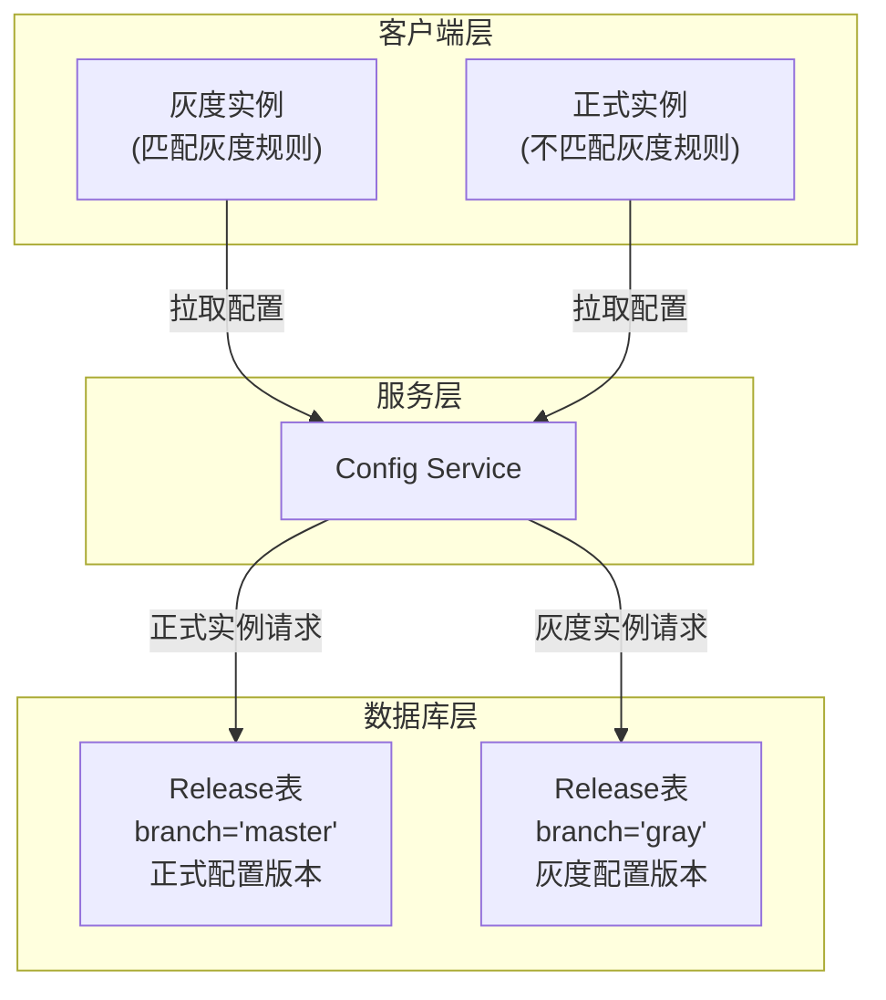
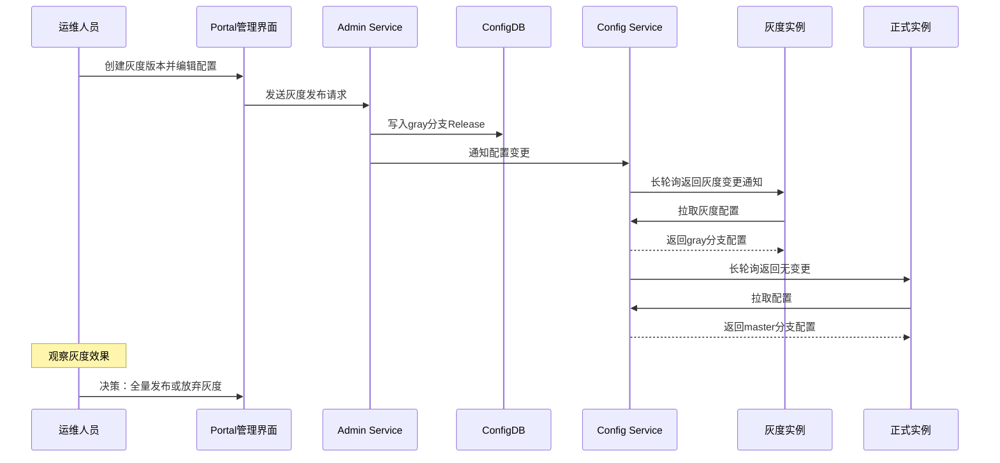
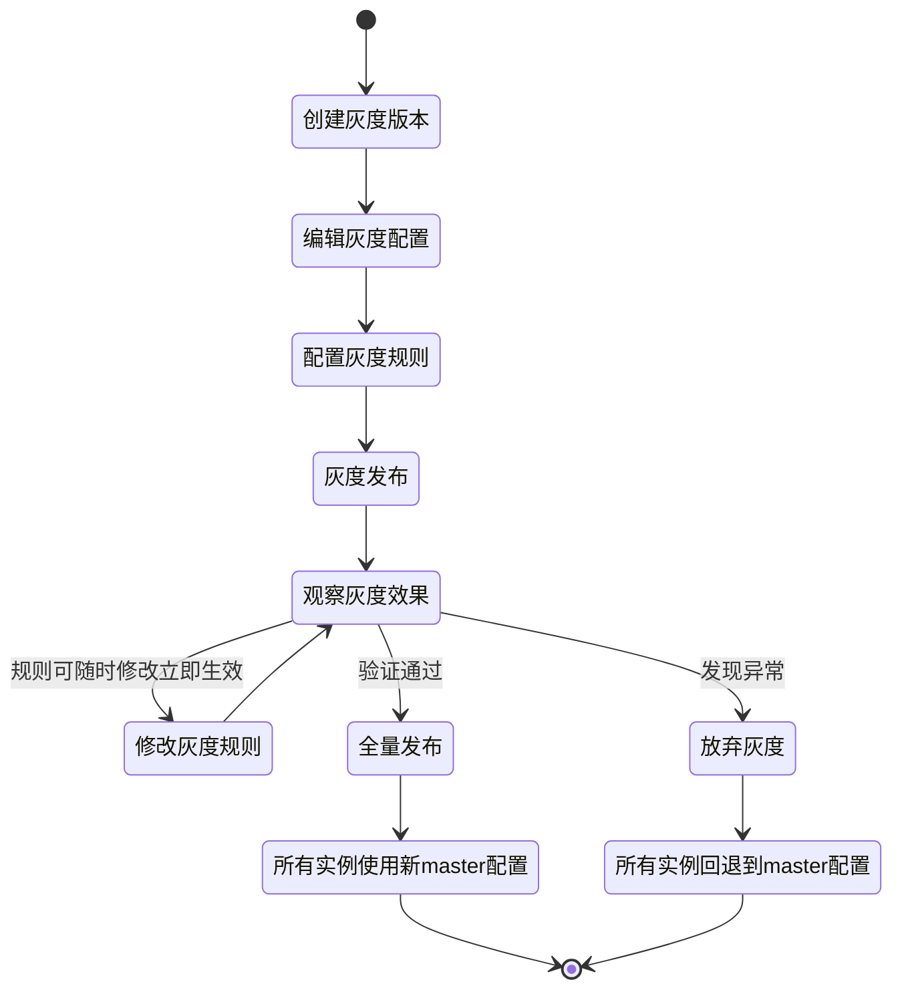
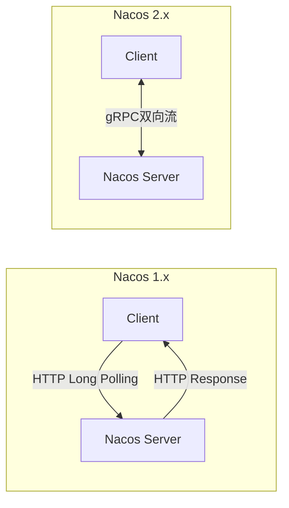

# 三、配置灰度发布：从原理到工程实践

***

## 1. 灰度发布的本质与必要性

### 1.1 为什么配置变更需要灰度

在分布式系统中，配置变更是最高频的操作之一，也是风险最集中的操作之一。一次错误的配置变更可能导致：

- **全量故障**：错误配置被推送到所有实例，引发级联故障。例如将数据库连接池大小从100误改为1，可能导致数据库连接耗尽、服务雪崩。
- **性能劣化**：超时时间配置不当导致慢查询堆积，吞吐量骤降。
- **数据不一致**：缓存策略配置错误导致缓存击穿，数据库被打穿。
- **安全漏洞**：权限配置放开导致敏感接口暴露。

灰度发布（Gray Release / Canary Release）的核心思想是**将配置变更的风险控制在最小范围内**：新配置先推送给少量实例进行验证，确认无误后再逐步扩大到全量实例。这与代码发布的灰度发布（Canary Deployment）异曲同工，但配置灰度有其独特之处——配置变更不需要重新部署，生效速度更快，回滚也更便捷。

### 1.2 灰度发布与全量发布的对比

| 维度 | 全量发布 | 灰度发布 |
|------|----------|----------|
| 生效范围 | 所有实例同时生效 | 部分实例先生效 |
| 影响面 | 故障影响100%流量 | 故障仅影响灰度比例的流量 |
| 回滚速度 | 秒级（配置中心推送） | 秒级（放弃灰度） |
| 验证方式 | 发布后观察全局指标 | 对比灰度实例与非灰度实例指标 |
| 操作复杂度 | 低（一键发布） | 中等（需设置灰度规则） |
| 适用场景 | 低风险配置变更 | 高风险/不确定的配置变更 |
| 风险等级 | 高 | 低 |

### 1.3 灰度发布的技术前提

要实现配置灰度发布，配置中心需要具备以下基础能力：

1. **版本隔离**：能够同时维护两套配置（灰度版本和正式版本），且互不干扰。
2. **实例识别**：能够区分不同客户端实例，通常通过IP地址或标签（Label）来实现。
3. **规则引擎**：能够根据规则判断哪些实例应该接收灰度配置。
4. **定向推送**：能够将配置变更只推送给匹配灰度规则的实例。
5. **监控反馈**：能够实时查看灰度实例的状态和配置使用情况。

***

## 2. 灰度发布的架构模型

### 2.1 双分支配置模型

灰度发布的架构核心是**灰度/正式双分支模型**。每个Namespace的配置在数据库中维护两条分支记录：



这种双分支模型的关键特性：

- **master分支**：存储正式发布的配置，所有非灰度实例使用此分支的配置。
- **gray分支**：存储灰度发布的配置，仅灰度实例使用此分支的配置。
- **分支独立**：gray分支的变更不影响master分支，master分支的变更也不影响gray分支。
- **最终合并**：灰度验证通过后，gray分支的配置被合并到master分支，成为新的正式版本。

### 2.2 灰度发布的完整数据流



### 2.3 灰度规则匹配引擎

灰度规则匹配引擎是灰度发布的技术核心，负责决定每个客户端实例应该接收哪个分支的配置。匹配引擎在Config Service端执行，客户端无需感知灰度逻辑。

```python
class GrayRuleEngine:
    """灰度规则匹配引擎"""
    
    def match(self, client_ip: str, client_labels: dict, 
              gray_rule: 'GrayReleaseRule') -> bool:
        """
        判断客户端是否为灰度实例
        三种规则之间是 OR 关系——满足任一规则即为灰度实例
        """
        # 1. IP规则匹配
        if self._match_ip(client_ip, gray_rule.ip_list):
            return True
        
        # 2. 标签规则匹配（多标签之间是 AND 关系）
        if self._match_labels(client_labels, gray_rule.labels):
            return True
        
        # 3. 百分比规则匹配
        if self._match_percentage(client_ip, gray_rule.percentage):
            return True
        
        return False
    
    def _match_ip(self, client_ip: str, ip_list: str) -> bool:
        """IP匹配：支持精确IP和CIDR格式"""
        if not ip_list:
            return False
        for rule_ip in ip_list.split(","):
            rule_ip = rule_ip.strip()
            if client_ip == rule_ip:
                return True
            if "/" in rule_ip:
                if self._ip_in_cidr(client_ip, rule_ip):
                    return True
        return False
    
    def _match_labels(self, client_labels: dict, 
                      rule_labels: dict) -> bool:
        """标签匹配：所有标签都匹配才视为灰度实例（AND逻辑）"""
        if not rule_labels:
            return False
        for key, value in rule_labels.items():
            if client_labels.get(key) != value:
                return False
        return True
    
    def _match_percentage(self, client_ip: str, 
                          percentage: int) -> bool:
        """百分比匹配：基于IP哈希的确定性分配"""
        if percentage <= 0 or percentage >= 100:
            return False
        hash_value = abs(hash(client_ip)) % 100
        return hash_value < percentage
```

### 2.4 三种灰度策略的深度对比

| 策略 | 匹配维度 | 适用规模 | 灵活性 | 维护成本 | 确定性 |
|------|----------|----------|--------|----------|--------|
| IP灰度 | 实例IP地址 | 小（<50台） | 低 | 高（需维护IP列表） | 精确 |
| 标签灰度 | 自定义标签（key-value） | 中大（任意规模） | 高 | 中（需客户端配合） | 精确 |
| 百分比灰度 | IP哈希取模 | 大（>100台） | 中 | 低（无需维护列表） | 近似 |

**选择建议**：

- **测试验证阶段**：使用IP灰度，精确选择1-2台测试机进行验证。
- **按维度灰度**：使用标签灰度，按机房、版本、数据中心等维度灰度。
- **大规模渐进发布**：使用百分比灰度，从1%开始逐步扩大到100%。
- **混合使用**：IP灰度 + 百分比灰度组合，先IP验证再百分比扩大。

***

## 3. Apollo灰度发布的实现详解

Apollo是配置中心灰度发布的标杆实现，其灰度机制经过携程大规模生产环境的验证。

### 3.1 Apollo灰度发布的工作流

Apollo灰度发布遵循严格的六步流程：

步骤1: 创建灰度版本
  └─ 在Portal的命名空间页面，点击"创建灰度"按钮
     └─ 系统在ApolloConfigDB中创建 branch='gray' 的 Release 记录

步骤2: 编辑灰度配置
  └─ 在灰度配置编辑界面修改需要灰度的配置项
     └─ 修改的是 gray 分支的配置内容

步骤3: 配置灰度规则
  └─ 选择灰度规则类型：
     ├─ IP灰度：指定哪些实例IP接收灰度配置
     ├─ 标签灰度（v1.9.0+）：指定哪些标签组合的实例接收灰度配置
     └─ 百分比灰度（v1.12.0+）：指定多少比例的实例接收灰度配置

步骤4: 发布灰度
  └─ 点击"灰度发布"按钮
     └─ 灰度配置推送给匹配规则的实例
     └─ 不匹配的实例继续使用 master 分支配置

步骤5: 观察灰度效果
  └─ 通过Portal的"实例列表"查看各实例的配置使用情况
     ├─ 可以看到哪些实例使用的是灰度配置
     └─ 可以实时查看灰度实例的配置内容

步骤6: 最终决策
  ├─ 全量发布：将灰度配置合并到 master 分支，所有实例生效
  └─ 放弃灰度：删除灰度版本，所有实例回退到 master 分支配置

### 3.2 Apollo的灰度规则引擎

#### IP灰度规则

IP灰度是Apollo最基础的灰度规则，从最初版本就支持。Config Service收到客户端请求时提取客户端IP，与灰度规则中的IP列表进行匹配。

灰度规则的IP存储在 `grayreleaseRule` 表的 `ip` 字段中，支持精确IP匹配和CIDR格式匹配：

```json
// grayreleaseRule 表 ip 字段
"10.0.0.1,10.0.0.2,192.168.1.0/24"
```

适用场景：选择特定测试机器进行配置验证、选择特定机房/区域的实例进行灰度、小规模的定向灰度。局限性在于需要预先知道实例的IP地址，IP变更时需要更新规则。

#### 标签灰度规则（Apollo 1.9.0+）

客户端在启动时配置自定义标签（key-value对），存储在 `META-INF/app.properties` 中：

```properties
# META-INF/app.properties
app.id=my-app
app.labels=region=shanghai,version=v2,datacenter=dc1
```

灰度规则数据格式：

```json
{
  "labels": {
    "region": "shanghai",
    "version": "v2"
  }
}
```

多个标签之间是AND关系——所有标签都匹配才视为灰度实例。这种设计让标签灰度具备了多维度组合条件的能力，例如同时按机房（region=shanghai）和服务版本（version=v2）进行灰度。

#### 百分比灰度规则（Apollo 1.12.0+）

基于客户端IP的哈希值进行百分比判断：

```java
private boolean isPercentageMatched(String clientIp, int percentage) {
    long hash = Math.abs(hashString(clientIp));
    return (hash % 100) < percentage;
}

// 使用MurmurHash保证均匀分布
private long hashString(String str) {
    return Hashing.murmur3_32()
        .hashString(str, StandardCharsets.UTF_8).asLong();
}
```

同一IP的哈希结果是确定性的（MurmurHash），保证同一实例不会在灰度/非灰度之间随机切换。这是百分比灰度的关键设计点——如果使用 `java.util.Random`，每次判断结果可能不同，导致实例状态不稳定。

#### 规则组合与优先级

Apollo的三种灰度规则之间是**OR关系**——只要满足其中任一规则即判定为灰度实例。执行顺序为IP规则优先、标签规则次之、百分比规则最后。这种OR组合的设计允许同时使用多种策略，例如：先用IP灰度验证特定机器，再用百分比灰度逐步扩大范围。

### 3.3 Apollo灰度配置的分发机制

Config Service是灰度配置分发的技术核心。每次客户端请求配置时，Config Service根据灰度规则判断返回哪个分支的配置：

```java
@RestController
public class ConfigController {
    
    @RequestMapping("/configs/{appId}/{cluster}/{namespace}")
    public ApolloConfig getConfig(
        @PathVariable String appId,
        @PathVariable String cluster,
        @PathVariable String namespace,
        @RequestParam(value = "ip", required = false) String clientIp) {
        
        // 1. 获取灰度规则
        GrayReleaseRule grayRule = grayRuleService.findReleaseRule(
            appId, cluster, namespace);
        
        // 2. 判断客户端是否匹配灰度规则
        boolean isGrayInstance = false;
        if (grayRule != null &amp;&amp; !grayRule.isAbandoned()) {
            isGrayInstance = grayRuleService.isGrayRuleMatched(
                clientIp, grayRule);
        }
        
        // 3. 根据判断结果获取对应分支的配置
        Release release;
        if (isGrayInstance) {
            release = releaseService.findGrayRelease(
                appId, cluster, namespace);
        } else {
            release = releaseService.findRelease(
                appId, cluster, namespace);
        }
        
        // 4. 构建并返回配置
        return buildApolloConfig(release);
    }
}
```

关键设计要点：

- **灰度判断在服务端完成**：客户端SDK在拉取配置时只需携带本机IP地址，灰度规则匹配完全在Config Service端执行，客户端无需感知灰度逻辑。
- **灰度规则的实时性**：灰度规则修改后立即生效，无需重新发布配置。Config Service每次请求都重新判断灰度状态。
- **灰度规则废弃检测**：Config Service会检查灰度规则的 `isAbandoned` 标记，已废弃的灰度规则不会生效。

### 3.4 Apollo灰度回滚机制

Apollo中"灰度回滚"的准确含义是**放弃灰度（Abandon Gray Release）**——将灰度配置删除，让所有实例回退到master分支的配置。

回滚流程：

步骤1: 用户在Portal点击"放弃灰度"按钮
  └─ Portal调用 Admin Service 的 API

步骤2: Admin Service执行回滚操作
  ├─ 1. 将 grayreleaseRule 表中对应的规则标记为已废弃（isAbandoned=1）
  ├─ 2. 将 ApolloConfigDB 中 branch='gray' 的 Release 记录标记为 isAbandoned=1
  └─ 3. 触发通知机制

步骤3: 通知灰度实例
  ├─ Config Service 通过长轮询通知机制通知灰度实例
  ├─ 灰度实例收到通知后，重新拉取配置
  ├─ 由于灰度规则已废弃，Config Service 返回 master 分支配置
  └─ 灰度实例回退到 master 分支配置

步骤4: 完成回滚
  └─ 所有实例均使用 master 分支的配置

回滚后的API实现：

```java
@RestController
public class GrayReleaseController {
    
    @DeleteMapping("/apps/{appId}/envs/{env}/clusters/{cluster}/namespaces/{namespace}/gray")
    public void abandonGrayRelease(
        @PathVariable String appId,
        @PathVariable String env,
        @PathVariable String cluster,
        @PathVariable String namespace) {
        
        // 1. 废弃灰度规则
        grayRuleService.abandonGrayRule(appId, cluster, namespace);
        
        // 2. 废弃灰度发布版本
        releaseService.abandonGrayRelease(appId, cluster, namespace);
        
        // 3. 通知Config Service
        notificationService.notifyGrayReleaseAbandoned(
            appId, cluster, namespace);
    }
}
```

需要注意的重要区别：**灰度回滚 ≠ 全量回滚**。灰度回滚只是删除gray分支，不影响master分支。如果master分支的配置之前已经被全量发布过，灰度回滚不会影响master的配置。回滚速度取决于长轮询周期，默认在5秒内所有灰度实例完成回退。

### 3.5 Apollo灰度发布的数据库设计

Apollo通过两个核心表支撑灰度发布：

**grayreleaseRule 表（ApolloPortalDB）** — 存储灰度规则：

```sql
CREATE TABLE `grayreleaseRule` (
  `Id` bigint(20) NOT NULL AUTO_INCREMENT COMMENT '自增主键',
  `AppId` varchar(32) NOT NULL DEFAULT '0' COMMENT 'AppID',
  `ClusterName` varchar(32) NOT NULL DEFAULT '0' COMMENT '集群名',
  `NamespaceName` varchar(128) NOT NULL DEFAULT '0' COMMENT '命名空间名',
  `Branch` varchar(128) NOT NULL DEFAULT '0' COMMENT '灰度分支名',
  `GrayRules` varchar(16384) NOT NULL DEFAULT '' COMMENT '灰度规则(JSON)',
  `IsAbandoned` bit(1) NOT NULL DEFAULT b'0' COMMENT '是否废弃',
  `IsPublished` bit(1) NOT NULL DEFAULT b'0' COMMENT '是否已发布灰度',
  `DataChangeCreatedBy` varchar(32) NOT NULL DEFAULT '' COMMENT '创建人',
  `DataChangeCreatedTime` timestamp NOT NULL DEFAULT CURRENT_TIMESTAMP,
  `DataChangeLastModifiedBy` varchar(32) DEFAULT '' COMMENT '最后修改人',
  `DataChangeLastModifiedTime` timestamp NULL DEFAULT NULL,
  PRIMARY KEY (`Id`),
  KEY `AppIdClusterNameNamespaceName` 
    (`AppId`,`ClusterName`,`NamespaceName`)
) ENGINE=InnoDB DEFAULT CHARSET=utf8 COMMENT='灰度发布规则表';
```

**release 表（ApolloConfigDB）** — 存储灰度和正式两个分支的配置版本：

```sql
CREATE TABLE `release` (
  `Id` bigint(20) NOT NULL AUTO_INCREMENT COMMENT '自增主键',
  `ReleaseId` bigint(20) NOT NULL DEFAULT 0 COMMENT '发布ID',
  `AppId` varchar(32) NOT NULL DEFAULT '0' COMMENT 'AppID',
  `ClusterName` varchar(32) NOT NULL DEFAULT '0' COMMENT '集群名',
  `NamespaceName` varchar(128) NOT NULL DEFAULT '0' COMMENT '命名空间名',
  `Configurations` longtext NOT NULL COMMENT '配置内容(JSON格式)',
  `IsAbandoned` bit(1) NOT NULL DEFAULT b'0' COMMENT '是否废弃',
  `Comment` varchar(2048) DEFAULT '' COMMENT '发布说明',
  `DataChangeCreatedBy` varchar(32) NOT NULL DEFAULT '' COMMENT '创建人',
  `DataChangeCreatedTime` timestamp NOT NULL DEFAULT CURRENT_TIMESTAMP,
  PRIMARY KEY (`Id`),
  KEY `AppIdClusterNameNamespaceName` 
    (`AppId`,`ClusterName`,`NamespaceName`)
) ENGINE=InnoDB DEFAULT CHARSET=utf8 COMMENT='发布版本表';
```

通过 `branch` 字段区分gray和master两个分支，通过 `IsAbandoned` 字段标记废弃状态。每次灰度发布或全量发布都会创建新的Release记录，形成版本历史链。

### 3.6 Apollo灰度发布的完整生命周期



***

## 4. Nacos灰度发布的实现详解

Nacos作为阿里巴巴开源的注册中心和配置中心一体化解决方案，也提供了灰度发布能力，但实现方式和Apollo有显著差异。

### 4.1 Nacos灰度发布的三种模式

#### 基于IP的灰度

在Nacos控制台中指定灰度IP列表，只有这些IP的实例获取灰度配置：

```json
{
  "grayRuleName": "灰度规则1",
  "grayType": "IP",
  "grayValue": "192.168.1.100,192.168.1.101"
}
```

#### 基于标签的灰度

客户端设置灰度标签，服务端根据标签匹配：

```java
// Nacos客户端配置灰度标签
Properties props = new Properties();
props.put(PropertyKeyConst.SERVER_ADDR, "127.0.0.1:8848");
props.put(PropertyKeyConst.NAMESPACE, "production");
props.put("nacos.config.gray.label", "gray");

ConfigService configService = NacosFactory.createConfigService(props);
```

在Spring Cloud中通过YAML配置：

```yaml
spring:
  cloud:
    nacos:
      config:
        server-addr: ${NACOS_SERVER:127.0.0.1:8848}
        namespace: ${NAMESPACE:production}
        group: ${GROUP:DEFAULT_GROUP}
        label: ${GRAY_LABEL:normal}
        file-extension: yaml
```

#### 基于百分比的灰度

Nacos的百分比灰度通过设置权重值，将一定比例的客户端分配到灰度配置。与Apollo的IP哈希确定性分配不同，Nacos 2.x的百分比灰度依赖客户端SDK在启动时计算自身是否命中灰度比例：

```java
// Nacos客户端计算百分比灰度命中
public class NacosGrayPercentageCalculator {
    
    private final int percentage; // 灰度百分比（0-100）
    private final String clientIp;
    
    public NacosGrayPercentageCalculator(int percentage, String clientIp) {
        this.percentage = percentage;
        this.clientIp = clientIp;
    }
    
    public boolean isGrayInstance() {
        // 使用MurmurHash保证确定性：同一IP始终得到相同结果
        int hash = Math.abs(Hashing.murmur3_32()
            .hashString(clientIp, StandardCharsets.UTF_8).asInt()) % 100;
        return hash < percentage;
    }
}
```

百分比灰度的适用场景与局限性：
- **适用**：大规模集群的渐进式发布（如1000+实例从1%逐步扩大）
- **局限**：Nacos的百分比灰度粒度较粗，无法精确指定哪些实例进入灰度——完全依赖哈希算法的均匀分布。在实例IP分布不均匀（如同一子网集中部署）时，可能出现某个子网的所有实例都被选中的情况
- **对比Apollo**：Apollo的百分比灰度由服务端Config Service统一计算，结果一致且可控；Nacos的计算分散在客户端，存在客户端版本差异导致计算结果不一致的风险

### 4.2 Nacos 2.x的gRPC灰度推送

Nacos 2.0版本从HTTP Long Polling迁移到gRPC协议，灰度推送机制也因此升级：



gRPC相比Long Polling的关键改进：

| 特性 | Long Polling (1.x) | gRPC (2.x) |
|------|-------------------|-------------|
| 通信方式 | HTTP轮询 | 长连接双向流 |
| 推送延迟 | 秒级（取决于轮询间隔） | 毫秒级 |
| 连接开销 | 大量HTTP短连接 | 少量gRPC长连接 |
| 资源消耗 | 高（频繁创建连接） | 低（连接复用） |
| 灰度推送 | 被动拉取 | 主动推送 |
| 客户端负载 | 高（每个namespace一个连接） | 低（单连接多路复用） |

灰度配置推送流程：

1. 客户端通过gRPC连接Nacos Server，连接时携带元数据（IP、标签、版本等）。
2. 客户端发起配置订阅请求，包含namespace、group、dataId、label。
3. 服务端根据灰度规则匹配客户端，决定返回灰度配置还是正式配置。
4. 配置变更时，服务端通过gRPC Server Stream主动推送灰度变更给匹配的客户端。

### 4.3 Nacos灰度规则匹配伪代码

```java
public boolean matchGrayRule(ConfigGrayRule rule, ClientInfo client) {
    switch (rule.getGrayType()) {
        case IP:
            return rule.getIpList().contains(client.getIp());
        case LABEL:
            return rule.getLabel().equals(client.getLabel());
        case PERCENTAGE:
            int hash = Math.abs(client.getIp().hashCode() % 100);
            return hash <= rule.getWeight();
        default:
            return false;
    }
}
```

***

## 5. Apollo与Nacos灰度能力深度对比

| 特性 | Apollo | Nacos |
|------|--------|-------|
| 灰度发布支持 | 原生支持，功能完善 | 支持，但功能相对简单 |
| 灰度规则类型 | IP灰度、标签灰度、百分比灰度（三种内置） | IP白名单、标签、百分比（需SDK配合） |
| 灰度管理界面 | 专业的灰度管理页面，含实例列表监控 | 控制台提供基础灰度管理 |
| 灰度发布流程 | 完整六步流程（创建→编辑→规则→发布→观察→全量/放弃） | 简化流程（编辑→灰度发布→全量） |
| 灰度实例监控 | 内置实例列表实时查看灰度状态 | 基于连接状态判断 |
| 配置回滚 | 一键放弃灰度，秒级生效 | 需要手动重新发布正式配置 |
| 版本管理 | gray/master双分支版本管理，支持版本对比 | 单一版本，历史版本管理较弱 |
| 权限控制 | 细粒度RBAC权限，灰度发布独立权限 | 基础权限控制 |
| 推送机制 | HTTP长轮询 | HTTP长轮询(1.x) / gRPC(2.x) |
| 配置加密 | 支持配置加密存储 | 支持配置加密 |
| 适用场景 | 企业级配置管理，对灰度流程要求严格 | 微服务架构，与Spring Cloud Alibaba深度集成 |

**选型建议**：

- 如果团队对灰度发布的流程管控、回滚能力、监控能力有高要求，Apollo是更好的选择。
- 如果团队已经在使用Spring Cloud Alibaba生态（Dubbo、Sentinel、Seata等），Nacos的生态集成优势更明显。
- 对于中小规模集群，Nacos的灰度功能已经足够；对于大规模集群和金融级场景，Apollo的灰度能力更值得信赖。

***

## 6. 配置版本管理与灰度回滚

### 6.1 配置版本管理的核心模型

配置版本管理记录每次配置变更的历史，支持查看历史版本、版本对比和回滚。版本管理的核心数据结构：

```python
from datetime import datetime
from typing import Optional


class ConfigVersion:
    """配置版本实体"""
    
    def __init__(self, version_id: int, namespace: str, key: str,
                 value: str, created_by: str, created_at: datetime,
                 comment: str, branch: str = "master"):
        self.version_id = version_id
        self.namespace = namespace
        self.key = key
        self.value = value
        self.created_by = created_by
        self.created_at = created_at
        self.comment = comment
        self.branch = branch  # "master" 或 "gray"


class ConfigVersionManager:
    """配置版本管理器"""
    
    def __init__(self, config_repo, version_repo):
        self.config_repo = config_repo
        self.version_repo = version_repo
    
    async def publish(self, namespace: str, key: str, value: str,
                      operator: str, comment: str,
                      gray_rules: Optional[dict] = None):
        """发布配置（支持灰度规则）"""
        version = ConfigVersion(
            version_id=await self._next_version_id(namespace, key),
            namespace=namespace, key=key, value=value,
            created_by=operator, created_at=datetime.utcnow(),
            comment=comment,
            branch="gray" if gray_rules else "master"
        )
        await self.version_repo.save(version)
        
        if gray_rules:
            await self._gray_publish(namespace, key, value, gray_rules)
        else:
            await self._full_publish(namespace, key, value)
    
    async def rollback(self, namespace: str, key: str,
                       target_version: int, operator: str):
        """回滚到指定版本"""
        version = await self.version_repo.get(
            namespace, key, target_version
        )
        if not version:
            raise VersionNotFound(namespace, key, target_version)
        
        await self.publish(
            namespace, key, version.value, operator,
            f"Rollback to version {target_version}"
        )
    
    async def diff(self, namespace: str, key: str,
                   version_a: int, version_b: int) -> dict:
        """版本对比"""
        va = await self.version_repo.get(namespace, key, version_a)
        vb = await self.version_repo.get(namespace, key, version_b)
        return {
            "version_a": version_a,
            "version_b": version_b,
            "content_a": va.value,
            "content_b": vb.value,
            "branch_a": va.branch,
            "branch_b": vb.branch,
            "diff": self._compute_diff(va.value, vb.value)
        }
```

### 6.2 灰度回滚的三种场景

| 场景 | 操作 | 效果 | 速度 |
|------|------|------|------|
| 灰度回滚 | 放弃灰度（Abandon Gray） | 删除gray分支，所有实例回退到master配置 | 秒级 |
| 全量回滚 | 回滚到历史版本 | 将master分支回退到指定历史版本，重新全量发布 | 秒级 |
| 灰度→全量 | 合并灰度（Merge Gray） | 将gray分支配置合并到master，所有实例使用新配置 | 秒级 |

### 6.3 版本对比的实现

版本对比是灰度发布中非常重要的辅助功能，帮助运维人员在全量发布前确认灰度配置与正式配置的差异：

```python
import difflib
import json


class ConfigDiffer:
    """配置版本差异对比器"""
    
    def compute_diff(self, old_config: str, 
                     new_config: str) -> list:
        """
        计算两个配置版本的差异
        返回类似 unified diff 的结果
        """
        old_lines = old_config.splitlines(keepends=True)
        new_lines = new_config.splitlines(keepends=True)
        
        diff = list(difflib.unified_diff(
            old_lines, new_lines,
            fromfile='master (正式版本)',
            tofile='gray (灰度版本)',
            lineterm=''
        ))
        return diff
    
    def compute_kv_diff(self, old_kv: dict, 
                        new_kv: dict) -> dict:
        """
        计算KV格式配置的差异
        返回增加、删除、修改的配置项
        """
        added = {}
        removed = {}
        modified = {}
        
        all_keys = set(old_kv.keys()) | set(new_kv.keys())
        for key in all_keys:
            if key not in old_kv:
                added[key] = new_kv[key]
            elif key not in new_kv:
                removed[key] = old_kv[key]
            elif old_kv[key] != new_kv[key]:
                modified[key] = {
                    "old": old_kv[key],
                    "new": new_kv[key]
                }
        
        return {
            "added": added,
            "removed": removed,
            "modified": modified,
            "total_changes": len(added) + len(removed) + len(modified)
        }
```

***

## 7. 配置灰度发布的进阶实践

### 7.1 灰度发布与配置加密的协同

生产环境中的灰度配置往往包含敏感信息（如数据库密码、API密钥）。灰度发布与配置加密的协同流程：

```python
class SecureGrayPublisher:
    """安全灰度发布器"""
    
    def __init__(self, encryptor, version_manager):
        self.encryptor = encryptor
        self.version_manager = version_manager
    
    async def secure_gray_publish(self, namespace: str, key: str,
                                  value: str, is_sensitive: bool,
                                  operator: str, gray_rules: dict):
        """安全灰度发布"""
        # 1. 敏感配置加密
        if is_sensitive:
            encrypted_value = await self.encryptor.encrypt(
                value, key_id=f"{namespace}:{key}"
            )
            # 加密后的配置标记前缀，Config Service自动识别
            publish_value = f"cipher:{encrypted_value}"
        else:
            publish_value = value
        
        # 2. 灰度发布
        await self.version_manager.publish(
            namespace, key, publish_value, operator,
            f"Gray publish {'(encrypted)' if is_sensitive else ''}",
            gray_rules=gray_rules
        )
```

关键点在于：灰度实例和正式实例使用相同的解密机制，加密配置在两个分支中都是透明的。灰度发布不会因为加密机制而产生差异化行为。

### 7.2 灰度发布的监控与告警

灰度发布期间的监控是保证灰度安全的最后一道防线：

```python
class GrayReleaseMonitor:
    """灰度发布监控器"""
    
    def __init__(self, metrics_client, alert_client):
        self.metrics = metrics_client
        self.alert = alert_client
    
    async def compare_metrics(self, gray_instances: list,
                              normal_instances: list,
                              observation_window: int = 300):
        """
        对比灰度实例和正常实例的核心指标
        observation_window: 观察窗口（秒）
        """
        gray_metrics = await self._collect_metrics(
            gray_instances, observation_window
        )
        normal_metrics = await self._collect_metrics(
            normal_instances, observation_window
        )
        
        comparison = {
            "error_rate": {
                "gray": gray_metrics["error_rate"],
                "normal": normal_metrics["error_rate"],
                "diff": gray_metrics["error_rate"] - normal_metrics["error_rate"]
            },
            "p99_latency": {
                "gray": gray_metrics["p99_latency"],
                "normal": normal_metrics["p99_latency"],
                "diff": gray_metrics["p99_latency"] - normal_metrics["p99_latency"]
            },
            "throughput": {
                "gray": gray_metrics["throughput"],
                "normal": normal_metrics["throughput"]
            }
        }
        
        # 检查是否需要告警
        if comparison["error_rate"]["diff"] > 0.01:
            await self.alert.send(
                level="CRITICAL",
                message=f"灰度实例错误率比正常实例高"
                        f" {comparison['error_rate']['diff']*100:.2f}%"
            )
        
        if comparison["p99_latency"]["diff"] > 500:  # 500ms
            await self.alert.send(
                level="WARNING",
                message=f"灰度实例P99延迟比正常实例高"
                        f" {comparison['p99_latency']['diff']:.0f}ms"
            )
        
        return comparison
```

### 7.3 渐进式灰度发布策略

成熟的灰度发布应该遵循渐进式策略，逐步扩大灰度范围：

阶段1: 测试环境验证（100%灰度）
  └─ 在测试环境全量验证配置变更的正确性
  └─ 观察时间：直到确认无误

阶段2: 生产灰度1%
  └─ 选择1台实例进行灰度
  └─ 观察时间：至少15分钟
  └─ 检查项：日志无异常、指标无波动、功能正常

阶段3: 生产灰度10%
  └─ 扩大到10%的实例
  └─ 观察时间：至少30分钟
  └─ 检查项：错误率、延迟、吞吐量

阶段4: 生产灰度30%
  └─ 扩大到30%的实例
  └─ 观察时间：至少1小时

阶段5: 生产灰度50%
  └─ 扩大到50%的实例
  └─ 观察时间：至少2小时（覆盖业务高峰期）

阶段6: 全量发布
  └─ 验证通过后全量发布
  └─ 保持观察30分钟

### 7.4 灰度发布的自动化实现

对于大规模集群，手工灰度效率低下，可以通过API实现自动化灰度流程：

```python
import asyncio
from enum import Enum


class GrayPhase(Enum):
    """灰度阶段"""
    TEST = "test"
    PROD_1PCT = "prod_1pct"
    PROD_10PCT = "prod_10pct"
    PROD_30PCT = "prod_30pct"
    PROD_50PCT = "prod_50pct"
    FULL = "full"
    ROLLBACK = "rollback"


class AutoGrayRelease:
    """自动化灰度发布器"""
    
    PHASE_CONFIG = {
        GrayPhase.PROD_1PCT:  {"percentage": 1,  "observe_seconds": 900},
        GrayPhase.PROD_10PCT: {"percentage": 10, "observe_seconds": 1800},
        GrayPhase.PROD_30PCT: {"percentage": 30, "observe_seconds": 3600},
        GrayPhase.PROD_50PCT: {"percentage": 50, "observe_seconds": 7200},
    }
    
    def __init__(self, config_center_client, monitor, notifier):
        self.client = config_center_client
        self.monitor = monitor
        self.notifier = notifier
    
    async def execute(self, namespace: str, key: str,
                      new_value: str, operator: str):
        """执行自动化灰度发布"""
        current_phase = GrayPhase.PROD_1PCT
        
        while current_phase != GrayPhase.FULL:
            phase_config = self.PHASE_CONFIG.get(current_phase)
            if not phase_config:
                break
            
            # 1. 更新灰度比例
            await self.client.update_gray_percentage(
                namespace, key, phase_config["percentage"]
            )
            await self.notifier.send(
                f"灰度进入阶段 {current_phase.value}，"
                f"灰度比例 {phase_config['percentage']}%"
            )
            
            # 2. 观察期
            await asyncio.sleep(phase_config["observe_seconds"])
            
            # 3. 检查指标
            health = await self.monitor.check_health()
            if not health.is_healthy:
                await self.notifier.send(
                    f"灰度阶段 {current_phase.value} 健康检查失败，"
                    f"自动回滚"
                )
                await self.client.abandon_gray(namespace, key)
                return GrayPhase.ROLLBACK
            
            # 4. 进入下一阶段
            current_phase = self._next_phase(current_phase)
        
        # 5. 全量发布
        await self.client.merge_gray(namespace, key, operator)
        await self.notifier.send(
            f"灰度全量发布完成，配置 {key} 已全量生效"
        )
        return GrayPhase.FULL
    
    def _next_phase(self, phase: GrayPhase) -> GrayPhase:
        order = [
            GrayPhase.PROD_1PCT, GrayPhase.PROD_10PCT,
            GrayPhase.PROD_30PCT, GrayPhase.PROD_50PCT,
            GrayPhase.FULL
        ]
        idx = order.index(phase)
        return order[idx + 1] if idx + 1 < len(order) else GrayPhase.FULL
```

### 7.5 灰度发布的权限与审批

生产环境的灰度发布需要严格的权限控制和审批流程：

```python
class GrayReleaseApproval:
    """灰度发布审批流程"""
    
    async def submit_gray_request(self, request: dict) -> str:
        """提交灰度发布申请"""
        # 1. 校验配置格式
        validation = await self._validate_config(
            request["namespace"], request["key"], request["value"]
        )
        if not validation.is_valid:
            raise ConfigValidationError(validation.errors)
        
        # 2. 影响范围评估
        impact = await self._assess_impact(request)
        
        # 3. 创建审批单
        approval_id = await self._create_approval(
            request=request,
            impact=impact,
            approvers=self._get_approvers(request["namespace"]),
            required_approvals=self._get_required_count(request)
        )
        
        return approval_id
    
    async def approve(self, approval_id: str, approver: str):
        """审批通过"""
        approval = await self._get_approval(approval_id)
        approval.add_approval(approver)
        
        if approval.is_fully_approved():
            # 自动触发灰度发布
            await self._trigger_gray_release(approval.request)
    
    async def reject(self, approval_id: str, approver: str,
                     reason: str):
        """审批拒绝"""
        await self._reject_approval(approval_id, approver, reason)
```

***

## 8. 真实故障案例与经验教训

### 8.1 案例一：数据库连接池配置变更引发全站雪崩

**背景**：某电商平台在流量高峰期（日活500万），运维人员直接全量发布数据库连接池配置，将 `maximumPoolSize` 从200改为50，意图优化数据库负载。

**故障过程**：
- 14:00 全量推送配置，200+微服务实例同时生效
- 14:01 连接池耗尽，大量请求排队等待数据库连接
- 14:02 超时请求堆积，线程池被打满
- 14:03 级联故障扩散，订单、支付、商品等多个核心链路不可用
- 14:15 紧急回滚配置，但恢复需要逐个重启服务清空连接池
- 14:30 服务基本恢复，累计影响15分钟，损失订单金额约300万元

**根因分析**：
1. 没有使用灰度发布——配置变更直接推送到所有实例
2. 没有在测试环境验证——50个连接对200+并发线程显然不够
3. 没有设置监控告警——故障扩散15分钟才被发现

**如果使用灰度发布**：先在1台实例灰度验证，立刻发现连接池不足的问题，损失为零。

### 8.2 案例二：百分比灰度的哈希分布陷阱

**背景**：某社交平台使用Nacos百分比灰度发布缓存TTL配置，设置10%灰度比例，计划逐步扩大。

**故障现象**：灰度比例设为10%后，监控发现灰度实例的缓存命中率从95%骤降到60%，但正常实例指标完全正常。

**根因分析**：该平台的实例IP分布不均匀——80%的实例集中在 `10.0.1.x` 和 `10.0.2.x` 两个子网段。Nacos的IP哈希算法在连续IP段上分布不均匀，导致实际命中率远高于10%，大量实例同时切换到新TTL配置，缓存频繁失效。

**修复方案**：
1. 放弃百分比灰度，改用标签灰度（按机房维度）
2. 在灰度规则中引入随机盐值（Salt），打散连续IP段的哈希分布：

```java
// 改进的哈希算法：引入随机盐值
private int hashWithSalt(String clientIp, String salt) {
    String combined = clientIp + ":" + salt;
    return Math.abs(Hashing.murmur3_32()
        .hashString(combined, StandardCharsets.UTF_8).asInt()) % 100;
}
```

### 8.3 案例三：灰度回滚失败——长轮询间隙导致配置残留

**背景**：某金融平台灰度发布限流阈值配置后发现异常，执行灰度回滚。回滚操作显示成功，但15分钟后仍有3个实例使用旧的灰度配置，导致这3个实例的限流阈值偏高，触发了风控告警。

**根因分析**：Apollo的灰度回滚通过长轮询通知机制推送变更。如果某个实例的长轮询连接恰好在HTTP响应返回后、下一次请求发起前的间隙（最长60秒）收到回滚通知，通知会丢失。该实例会一直使用本地缓存的灰度配置，直到下一次长轮询请求才能拉取到最新状态。

**修复方案**：
1. 回滚后主动等待60秒（一个完整的长轮询周期）
2. 通过Portal的实例列表API检查所有实例的配置版本
3. 对未回退的实例触发一次主动的配置拉取（重启或手动清除本地缓存）

***

## 9. 云原生环境下的灰度发布

### 9.1 Kubernetes环境的灰度挑战

在Kubernetes环境中，Pod的生命周期由调度器管理，实例IP不固定，传统的IP灰度策略完全失效。容器化环境的灰度发布需要适配以下挑战：

| 挑战 | 传统环境 | K8s容器环境 |
|------|----------|-------------|
| 实例标识 | 固定IP | 动态IP，随Pod重启变化 |
| 实例发现 | IP列表管理 | Service/Endpoint动态注册 |
| 标签管理 | 配置文件静态配置 | K8s Label动态附加 |
| 配置注入 | 环境变量/配置文件 | ConfigMap/Secret挂载 |

### 9.2 基于K8s Label的灰度方案

在Kubernetes中，灰度发布的最佳实践是利用Pod的Label作为灰度标识：

```yaml
# 灰度实例的Pod模板
apiVersion: apps/v1
kind: Deployment
metadata:
  name: my-service-gray
  labels:
    app: my-service
    release: gray        # 灰度标识
    version: v2.1.0      # 新版本号
spec:
  replicas: 2            # 灰度副本数
  selector:
    matchLabels:
      app: my-service
      release: gray
  template:
    metadata:
      labels:
        app: my-service
        release: gray
    spec:
      containers:
      - name: my-service
        image: my-service:v2.1.0
        env:
        - name: APPOLO_LABELS
          value: "release=gray,version=v2.1.0"
```

配置中心（Apollo/Nacos）通过标签灰度规则匹配这些Label，实现精确的灰度路由。Service通过标签选择器控制流量分配：

```yaml
# Service只选择灰度实例（用于内部测试）
apiVersion: v1
kind: Service
metadata:
  name: my-service-gray
spec:
  selector:
    app: my-service
    release: gray
  ports:
  - port: 8080
```

### 9.3 配置中心与Service Mesh的协同

在使用Istio等Service Mesh的环境中，灰度发布可以实现更精细的流量控制：

```yaml
# Istio VirtualService实现流量灰度
apiVersion: networking.istio.io/v1beta1
kind: VirtualService
metadata:
  name: my-service
spec:
  hosts:
  - my-service
  http:
  - match:
    - headers:
        x-gray-release:
          exact: "true"
    route:
    - destination:
        host: my-service
        subset: gray
  - route:
    - destination:
        host: my-service
        subset: stable
```

在这种架构下，配置灰度和流量灰度可以独立控制：配置中心负责"哪些实例使用新配置"，Service Mesh负责"哪些请求路由到新版本实例"。两者的灰度策略可以不同步——例如配置灰度已经100%，但流量灰度仍然保持10%。

***

## 10. 常见问题与最佳实践

### 10.1 灰度配置不生效

**典型症状**：灰度发布后，预期中的实例仍然使用旧配置。

**排查步骤**：

1. **检查客户端IP**：确认Config Service收到的客户端IP与灰度规则中的IP一致。在NAT/Docker/容器环境中，客户端上报的IP可能不是配置中心看到的IP。
   ```bash
   # 查看客户端实际对外IP
   curl ifconfig.me
   # 查看容器内IP
   hostname -I
   # 查看Apollo客户端上报的IP（日志中搜索）
   grep "appId" /opt/data/applications/{appId}/config-cache/*.properties
   ```

2. **检查灰度规则状态**：确认灰度规则未被误标记为 `IsAbandoned`。
   ```sql
   -- 直接查询数据库确认灰度规则状态
   SELECT Id, AppId, NamespaceName, IsAbandoned, IsPublished, 
          GrayRules, DataChangeCreatedTime
   FROM grayreleaseRule 
   WHERE AppId = 'your-app' 
     AND NamespaceName = 'application';
   ```

3. **检查长轮询连接**：确认客户端与Config Service之间的长轮询连接正常。网络问题可能导致配置变更通知丢失。
   ```bash
   # 检查客户端到Config Service的连接状态
   netstat -anp | grep 8080
   # Apollo长轮询端点健康检查
   curl -v http://config-service:8080/notifications?appId=your-app&amp;cluster=default&amp;namespace=application&amp;notifications=%5B%5D
   ```

4. **检查本地缓存**：客户端SDK可能使用了本地缓存的配置。尝试清除本地缓存后重启。
   ```bash
   # Apollo本地缓存目录
   ls -la /opt/data/applications/{appId}/config-cache/
   # 清除缓存并重启
   rm -rf /opt/data/applications/{appId}/config-cache/
   systemctl restart your-service
   ```

5. **启用调试日志**：
   - Apollo：设置 `logging.level.com.ctrip.framework.apollo=DEBUG`
   - Nacos：设置 `com.alibaba.nacos.client.log.level=debug`

### 10.2 灰度实例配置不一致

**典型症状**：同一灰度规则下的不同实例，收到的配置内容不同。

**原因分析**：
- 客户端重连时灰度标签丢失
- 多实例的标签配置不一致
- 长轮询/gRPC连接在配置变更前断开，部分实例拉取到了旧版本
- Config Service集群不同节点的灰度规则缓存不同步

**解决方案**：统一客户端配置模板，通过环境变量管理灰度标签，确保所有灰度实例的标签一致。同时确保Config Service集群使用共享的灰度规则存储（如共享数据库）。

### 10.3 灰度回滚后配置残留

**典型症状**：灰度回滚后，部分实例仍然使用灰度配置。

**原因分析**：灰度回滚后，Config Service通过长轮询通知灰度实例。如果某个灰度实例的长轮询连接恰好在超时后的间隙中（最长60秒），它可能错过变更通知。

**解决方案**：回滚后等待至少一个完整的长轮询周期（通常60秒），然后通过Portal的实例列表检查所有实例是否已回退。如有遗漏，手动触发一次配置全量拉取。

### 10.4 灰度规则修改后不生效

**典型症状**：修改灰度规则（如调整IP列表或百分比）后，部分实例仍然使用旧规则的结果。

**原因分析**：
- Config Service集群多节点之间灰度规则缓存不同步——修改操作只更新了部分节点
- 客户端在规则修改前已经建立了长轮询连接，修改后未触发通知
- Nacos 2.x的gRPC连接在规则修改时可能处于重连状态

**排查与修复**：
```bash
# 1. 检查Config Service集群各节点的灰度规则缓存一致性
for node in config-service-1 config-service-2 config-service-3; do
  echo "=== $node ==="
  curl -s http://$node:8080/grayrules?appId=your-app&amp;cluster=default&amp;namespace=application | python -m json.tool
done

# 2. 如果发现不一致，重启Config Service节点触发缓存刷新
# 3. 客户端侧：检查日志中的灰度匹配结果
grep "gray" /path/to/service/logs/application.log | tail -20
```

### 10.5 灰度发布最佳实践清单

1. **灰度前验证**：在测试环境充分验证配置变更的正确性，不要在生产环境灰度时才发现格式错误。
2. **避开高峰期**：灰度发布应在业务低峰期进行，避免在流量高峰期操作。
3. **配置格式校验**：灰度发布前校验配置格式（JSON语法、YAML格式、数值范围等），防止错误配置导致服务异常。
4. **监控先行**：灰度发布前确保监控和告警已就绪，能够实时对比灰度实例与正常实例的指标差异。
5. **回滚预案**：每次灰度发布都应有明确的回滚方案——确认回滚按钮可用、回滚后的验证步骤已准备。
6. **变更记录**：记录每次灰度发布的操作人、操作时间、变更内容、灰度规则和验证结果，便于事后追溯。
7. **灰度比例渐进**：遵循 1% → 10% → 30% → 50% → 100% 的渐进式策略，每个阶段至少观察15分钟。
8. **不要跳过灰度**：对于生产环境的高风险配置变更（如数据库连接串、线程池参数、限流阈值），必须使用灰度发布，不能直接全量发布。

***

## 11. 本节小结

配置灰度发布是配置中心最核心的安全保障机制之一。本节从以下几个维度进行了系统性的探讨：

**道（理论层面）**：灰度发布的核心思想是将配置变更的风险控制在最小范围内。通过双分支配置模型（gray/master），实现灰度配置与正式配置的完全隔离。三种灰度策略（IP、标签、百分比）之间是OR关系，覆盖了从小规模验证到大规模渐进发布的各种场景。

**法（方法层面）**：Apollo提供了完整的灰度发布工作流——创建灰度→编辑配置→配置规则→发布→观察→全量/放弃。Nacos通过Namespace/Group/DataId三级结构和gRPC推送机制，提供了更灵活的灰度能力。

**术（实操层面）**：Config Service端的灰度规则匹配引擎是技术核心，客户端无需感知灰度逻辑。灰度回滚通过废弃gray分支实现，秒级生效。版本管理通过双分支Release记录实现完整的变更历史追溯。

**器（工具层面）**：Apollo Portal提供专业的灰度管理界面和实例监控视图，支持一键回滚。Nacos Console提供基础的灰度管理。两者都支持通过API实现自动化灰度流程。

配置灰度发布的最终目标是**让配置变更像代码发布一样安全可控**——通过灰度机制将风险隔离在小范围内，通过监控反馈及时发现问题，通过回滚机制快速恢复，最终实现配置变更的零事故率。
