# 配置加密与安全

## 为什么配置安全是配置中心的生死线

配置中心存储着整个微服务系统最敏感的数据：数据库密码、Redis 密钥、第三方 API Token、TLS 证书私钥、支付网关密钥。一旦这些信息泄露，攻击者可以：

- **直接访问数据库**，拖走所有用户数据
- **冒充合法服务**调用内部 API，伪造交易
- **植入后门**，长期潜伏窃取业务数据
- **横向渗透**，从一个服务的凭证蔓延到整个集群

这不是理论推演。2019 年 Capital One 数据泄露事件中，攻击者利用 WAF 配置中的 SSRF 漏洞获取了 AWS IAM 角色凭证，最终泄露了超过 1 亿用户的个人信息。配置安全的任何疏忽都可能成为攻击链的第一环。

2023 年 GitGuardian 的《State of Secrets Sprawl》报告显示，代码仓库中检测到的秘密数量同比增长了 67%，平均每个仓库包含超过 12 个硬编码密钥。配置中心作为密钥的集中存储点，一旦被攻破，影响面呈指数级放大。

配置中心的安全体系需要覆盖**四个维度**：

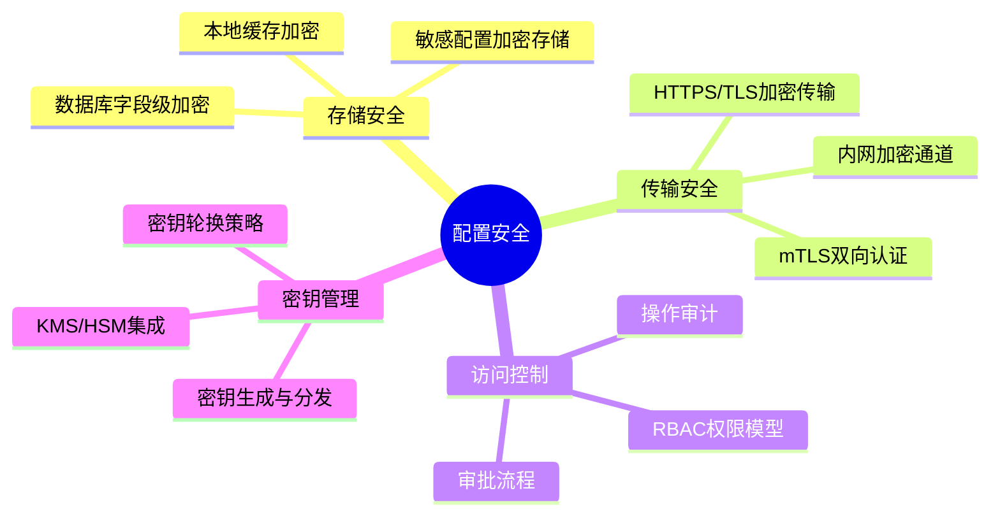

---

## 一、配置加密的核心原理

### 1.1 对称加密：AES

对称加密是配置中心最常用的加密方式——加密和解密使用同一个密钥。其核心优势是**性能高**，适合对大量配置数据进行加解密。

**AES-256-GCM** 是目前推荐的对称加密算法，相比老版本的 AES-CBC 有两个关键优势：

| 特性 | AES-CBC | AES-256-GCM |
|------|---------|-------------|
| 加密模式 | 分组链接模式 | 认证加密模式（AEAD） |
| 数据完整性 | 需额外 HMAC 校验 | 内置完整性校验 |
| 防篡改能力 | 无（可被篡改密文） | 有（篡改后解密失败） |
| 并行化 | 不支持（必须串行） | 支持（GCM 可并行） |
| 性能 | 基准 | 更快（硬件加速 AES-NI） |

**为什么不能用 AES-CBC？** CBC 模式存在两个致命缺陷：第一，密文可被翻转比特位而不被检测（长度扩展攻击）；第二，如果 IV 重复使用，相同的明文分组产生相同的密文分组，攻击者可以通过统计分析恢复部分明文。2011 年 BEAST 攻击正是利用 CBC 的弱点破解了 HTTPS 加密。GCM 模式通过引入认证标签（Authentication Tag）从根本上解决了这些问题。

AES-256-GCM 的工作流程：

明文配置:     "db.password=Sup3rS3cret!"
                              ↓
密钥 (256bit): "a1b2c3d4e5f6..." (由 KMS 生成和管理)
                              ↓
随机 IV:       "x9y8z7..." (每次加密不同，96 bit)
                              ↓
                     AES-256-GCM 加密
                              ↓
密文:          "kL8mN2pQ5..." 
认证标签:      "t4R7s..."     (128 bit，用于校验完整性)

**Java 实现示例：**

```java
import javax.crypto.Cipher;
import javax.crypto.SecretKey;
import javax.crypto.spec.GCMParameterSpec;
import javax.crypto.spec.SecretKeySpec;
import java.security.SecureRandom;
import java.util.Base64;

public class ConfigEncryptor {
    
    private static final String ALGORITHM = "AES/GCM/NoPadding";
    private static final int GCM_IV_LENGTH = 12;    // 96 bit
    private static final int GCM_TAG_LENGTH = 128;  // 128 bit
    
    private final SecretKey secretKey;
    
    public ConfigEncryptor(byte[] keyBytes) {
        this.secretKey = new SecretKeySpec(keyBytes, "AES");
    }
    
    /**
     * 加密配置值
     * @param plaintext 明文配置值
     * @return Base64 编码的密文（包含 IV + 密文 + 认证标签）
     */
    public String encrypt(String plaintext) throws Exception {
        // 1. 生成随机 IV（每次加密必须不同）
        byte[] iv = new byte[GCM_IV_LENGTH];
        new SecureRandom().nextBytes(iv);
        
        // 2. 初始化加密器
        Cipher cipher = Cipher.getInstance(ALGORITHM);
        GCMParameterSpec spec = new GCMParameterSpec(GCM_TAG_LENGTH, iv);
        cipher.init(Cipher.ENCRYPT_MODE, secretKey, spec);
        
        // 3. 执行加密
        byte[] ciphertext = cipher.doFinal(plaintext.getBytes("UTF-8"));
        
        // 4. 将 IV + 密文拼接后 Base64 编码
        // IV 不是密钥，可以和密文一起存储
        byte[] combined = new byte[iv.length + ciphertext.length];
        System.arraycopy(iv, 0, combined, 0, iv.length);
        System.arraycopy(ciphertext, 0, combined, iv.length, ciphertext.length);
        
        return Base64.getEncoder().encodeToString(combined);
    }
    
    /**
     * 解密配置值
     * @param encrypted Base64 编码的密文
     * @return 明文配置值
     */
    public String decrypt(String encrypted) throws Exception {
        // 1. Base64 解码
        byte[] combined = Base64.getDecoder().decode(encrypted);
        
        // 2. 分离 IV 和密文
        byte[] iv = new byte[GCM_IV_LENGTH];
        byte[] ciphertext = new byte[combined.length - GCM_IV_LENGTH];
        System.arraycopy(combined, 0, iv, 0, iv.length);
        System.arraycopy(combined, iv.length, ciphertext, 0, ciphertext.length);
        
        // 3. 初始化解密器
        Cipher cipher = Cipher.getInstance(ALGORITHM);
        GCMParameterSpec spec = new GCMParameterSpec(GCM_TAG_LENGTH, iv);
        cipher.init(Cipher.DECRYPT_MODE, secretKey, spec);
        
        // 4. 执行解密（如果密文被篡改，这里会抛出 AEADBadTagException）
        byte[] plaintext = cipher.doFinal(ciphertext);
        return new String(plaintext, "UTF-8");
    }
}
```

**Python 实现示例（使用 cryptography 库）：**

```python
import os
import base64
from cryptography.hazmat.primitives.ciphers.aead import AESGCM


class ConfigEncryptor:
    """AES-256-GCM 配置加密器"""
    
    def __init__(self, key: bytes):
        """
        初始化加密器
        Args:
            key: 256-bit (32 bytes) 密钥，从 KMS 获取
        """
        if len(key) != 32:
            raise ValueError("密钥必须为 256-bit (32 bytes)")
        self.aesgcm = AESGCM(key)
    
    def encrypt(self, plaintext: str) -> str:
        """
        加密配置值
        Returns:
            Base64 编码的密文（nonce + ciphertext + tag）
        """
        # 96-bit 随机 nonce（每次加密必须不同）
        nonce = os.urandom(12)
        
        # 加密并附加认证标签
        ciphertext = self.aesgcm.encrypt(
            nonce,
            plaintext.encode("utf-8"),
            None  # 无额外认证数据（AAD）
        )
        
        # 拼接 nonce + 密文后 Base64 编码
        combined = nonce + ciphertext
        return base64.b64encode(combined).decode("ascii")
    
    def decrypt(self, encrypted: str) -> str:
        """
        解密配置值
        Raises:
            cryptography.exceptions.InvalidTag: 密文被篡改或密钥错误
        """
        combined = base64.b64decode(encrypted)
        
        # 分离 nonce 和密文
        nonce = combined[:12]
        ciphertext = combined[12:]
        
        # 解密（篡改会抛出 InvalidTag 异常）
        plaintext = self.aesgcm.decrypt(nonce, ciphertext, None)
        return plaintext.decode("utf-8")


# 使用示例
key = os.urandom(32)  # 实际应从 KMS 获取
encryptor = ConfigEncryptor(key)

encrypted = encryptor.encrypt("db.password=Sup3rS3cret!")
print(f"密文: {encrypted}")

decrypted = encryptor.decrypt(encrypted)
print(f"明文: {decrypted}")
```

**关键安全要点：**

1. **IV/Nonce 必须随机生成**：每次加密使用不同的 IV。如果 IV 重复，相同的明文会产生相同的密文，攻击者可以通过统计分析破解。GCM 模式下 IV 重用尤其危险——攻击者可以利用两个密文的异或关系恢复明文
2. **密钥不能硬编码**：密钥必须从 KMS 获取，绝不能写在代码或配置文件中。如果密钥在 Git 仓库中泄露，必须立即视为已泄露并轮换
3. **认证标签不能丢**：GCM 模式的认证标签（Tag）是防篡改的关键，密文存储时必须包含 Tag。缺少 Tag 等于放弃了完整性校验
4. **明文长度不能泄露**：GCM 模式下密文长度等于明文长度。如果配置值的长度本身是敏感信息（如"密码是12位"），需要先填充到固定长度再加密

### 1.2 非对称加密：RSA 与 ECC

非对称加密使用一对密钥：公钥加密，私钥解密。其核心优势是**密钥分发安全**——不需要预先共享密钥。

| 特性 | RSA-2048 | RSA-4096 | ECC (P-256) | ECC (P-384) |
|------|----------|----------|-------------|-------------|
| 密钥长度 | 2048 bit | 4096 bit | 256 bit | 384 bit |
| 安全强度 | ~112 bit | ~140 bit | ~128 bit | ~192 bit |
| 加密速度 | 中 | 慢 | 快 | 中 |
| 密文膨胀 | ~256 byte | ~512 byte | ~64 byte | ~96 byte |
| 适用场景 | 兼容性要求高 | 最高安全要求 | 高性能 + 高安全 | 金融级安全 |

**RSA 与 ECC 的选择原则：** 如果系统运行在现代基础设施上（Java 8+、Go、Python 3.6+），优先选择 ECC——相同安全强度下密钥更短、加解密更快、证书更小。仅在需要兼容老旧系统（如 Java 6/7）时才使用 RSA。

在配置中心场景中，非对称加密主要用于两个用途：

**用途一：安全分发对称密钥**

这是最常见的混合加密模式——用 RSA/ECC 加密对称密钥（如 AES 密钥），用对称密钥加密实际配置数据：

KMS 生成 AES 密钥 K
    ↓
RSA 公钥加密 K → 加密后的 K（安全传输给客户端）
    ↓
AES 密钥 K 加密配置数据 → 加密后的配置
    ↓
客户端用 RSA 私钥解密得到 K → 用 K 解密配置

**为什么不用非对称加密直接加密配置数据？** 三个原因：第一，RSA-2048 每次最多加密 245 字节，无法加密大段配置；第二，RSA 加解密速度比 AES 慢 1000 倍以上；第三，RSA 会将密文膨胀到 256 字节，大量配置传输时带宽消耗巨大。混合加密兼顾了密钥分发的安全性和数据加密的性能。

**用途二：配置签名验证**

确保配置在传输过程中未被篡改：

```java
import java.security.Signature;

public class ConfigSigner {
    
    private final java.security.PrivateKey privateKey;
    private final java.security.PublicKey publicKey;
    
    /**
     * 对配置内容签名
     */
    public String sign(String configContent) throws Exception {
        Signature signature = Signature.getInstance("SHA256withECDSA");
        signature.initSign(privateKey);
        signature.update(configContent.getBytes("UTF-8"));
        byte[] sig = signature.sign();
        return Base64.getEncoder().encodeToString(sig);
    }
    
    /**
     * 验证配置签名
     * @return true 表示配置未被篡改
     */
    public boolean verify(String configContent, String signatureStr) throws Exception {
        Signature signature = Signature.getInstance("SHA256withECDSA");
        signature.initVerify(publicKey);
        signature.update(configContent.getBytes("UTF-8"));
        byte[] sig = Base64.getDecoder().decode(signatureStr);
        return signature.verify(sig);
    }
}
```

### 1.3 哈希与摘要：HMAC-SHA256

哈希算法是**单向**的——只能加密，不能解密。在配置中心场景中，哈希有三个核心用途：

**用途一：配置指纹（变更检测）**

Apollo 客户端使用 MD5 校验配置是否变更，避免重复传输。更安全的做法是使用 SHA-256：

配置内容: "db.password=Sup3rS3cret!\nredis.timeout=3000"
                              ↓
                    SHA-256 哈希
                              ↓
配置指纹: "e3b0c44298fc1c149afbf4c8996fb924..." (64 hex chars)

**为什么不用 MD5 做配置指纹？** MD5 已被证实存在碰撞攻击（两个不同的输入产生相同的哈希值），虽然在配置指纹场景中碰撞风险极低（攻击者需要控制配置内容），但 SHA-256 的性能开销几乎可以忽略，没有理由使用有安全隐患的算法。Apollo 后续版本已逐步迁移到 SHA-256。

**用途二：HMAC 签名（完整性校验）**

HMAC（Hash-based Message Authentication Code）结合了哈希算法和共享密钥，比单纯哈希更安全——攻击者即使知道哈希算法，没有密钥也无法伪造签名：

```python
import hmac
import hashlib


class ConfigIntegrityChecker:
    """基于 HMAC-SHA256 的配置完整性校验器"""
    
    def __init__(self, secret_key: bytes):
        self.secret_key = secret_key
    
    def compute_mac(self, config_content: str) -> str:
        """计算配置的 HMAC 签名"""
        mac = hmac.new(
            self.secret_key,
            config_content.encode("utf-8"),
            hashlib.sha256
        )
        return mac.hexdigest()
    
    def verify_mac(self, config_content: str, expected_mac: str) -> bool:
        """验证配置的 HMAC 签名（常量时间比较，防时序攻击）"""
        actual_mac = self.compute_mac(config_content)
        return hmac.compare_digest(actual_mac, expected_mac)


# 使用示例
secret = b"shared-secret-from-kms"  # 服务端和客户端共享的密钥
checker = ConfigIntegrityChecker(secret)

config = "db.password=Sup3rS3cret!\nredis.timeout=3000"
mac = checker.compute_mac(config)
print(f"HMAC: {mac}")

# 验证
assert checker.verify_mac(config, mac)       # 正确
assert not checker.verify_mac(config + "!", mac)  # 篡改后验证失败
```

**用途三：配置值不可逆脱敏**

某些场景下需要对配置值进行不可逆脱敏（如日志中记录配置 key 的使用频率但不暴露 value），可以使用 SHA-256 做单向摘要：

原始值:  "Sup3rS3cret!"
SHA-256: "8b1a9953c4611296a827abf8c47804d7..." (不可逆)

### 1.4 三种加密方式的选型决策

| 场景 | 推荐算法 | 原因 |
|------|---------|------|
| 配置数据加密存储 | AES-256-GCM | 高性能、防篡改、支持大数据 |
| 密钥安全分发 | RSA/ECC + AES 混合加密 | 兼顾密钥分发安全和数据加密性能 |
| 配置签名验证 | ECDSA（或 HMAC-SHA256） | 确保配置传输未被篡改 |
| 配置变更检测 | SHA-256 指纹 | 快速检测配置是否变更 |
| 密码存储 | bcrypt/Argon2 | 配置中心一般不存用户密码 |
| 敏感值脱敏 | SHA-256 单向哈希 | 不可逆，用于日志脱敏 |

---

## 二、密钥管理：KMS 架构设计

加密的强度取决于密钥管理的安全性。如果密钥和密文放在同一台机器上，加密就毫无意义。密钥管理是配置安全中最关键、也最容易被忽视的环节。

### 2.1 密钥层级体系

成熟的密钥管理采用**三层密钥架构**，每一层密钥由上一层密钥加密保护：

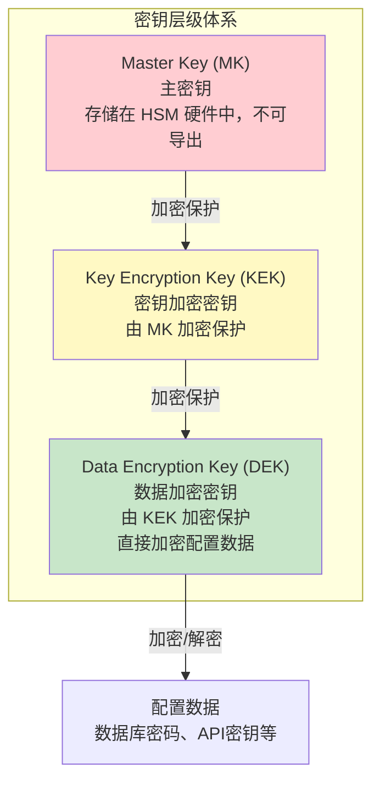

| 层级 | 名称 | 用途 | 存储位置 | 轮换频率 |
|------|------|------|---------|---------|
| L1 | Master Key (MK) | 加密 KEK | HSM 硬件安全模块 | 1-3 年 |
| L2 | Key Encryption Key (KEK) | 加密 DEK | KMS 服务（加密存储） | 90-180 天 |
| L3 | Data Encryption Key (DEK) | 加密配置数据 | KMS 管理，缓存在内存 | 30-90 天 |

**为什么需要三层？**

假设攻击者入侵了数据库，获取了所有加密配置。如果密钥也存在数据库中（常见错误），攻击者同时获得密文和密钥，加密形同虚设。

三层架构的效果：
- 攻击者获取密文 → 需要 DEK 才能解密
- DEK 被 KEK 加密保护 → 需要 KEK 才能解密 DEK
- KEK 被 MK 加密保护 → MK 在 HSM 中，无法导出
- **攻击者必须攻破 HSM 才能获取根密钥**——这是硬件级安全

**一个真实的反面案例：** 某金融科技公司曾将所有配置密钥直接存在 MySQL 的 `secret_keys` 表中（AES 加密），同时配置数据也在同一个 MySQL 实例。攻击者通过 SQL 注入获取了密钥表，整个加密体系瞬间瓦解。如果采用三层架构，即使密钥表泄露，攻击者拿到的也只是被 KEK 加密的 DEK，而 KEK 又被 HSM 中的 MK 保护。

### 2.2 KMS（密钥管理系统）架构

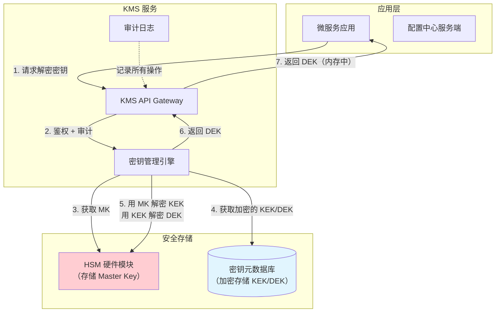

**KMS 的核心能力：**

| 能力 | 说明 | 为什么重要 |
|------|------|-----------|
| 密钥生成 | 使用密码学安全的随机数生成器创建密钥 | 人工生成的密钥熵值不足 |
| 密钥存储 | 密钥以加密形式存储，根密钥在 HSM 中 | 即使数据库泄露也无法解密 |
| 密钥分发 | 通过安全通道分发密钥给授权服务 | 防止密钥在传输过程中被截获 |
| 密钥轮换 | 定期自动更换密钥，旧密钥归档 | 缩小密钥泄露的影响窗口 |
| 访问控制 | 谁可以使用哪个密钥，在什么条件下使用 | 防止内部人员滥用密钥 |
| 审计日志 | 记录所有密钥操作（生成、使用、轮换、销毁） | 满足合规审计要求 |

### 2.3 主流 KMS 服务对比

在实际选型中，大多数团队不会自建 KMS，而是使用云厂商提供的托管服务：

| 维度 | AWS KMS | Azure Key Vault | GCP Cloud KMS | 阿里云 KMS |
|------|---------|----------------|---------------|------------|
| HSM 等级 | FIPS 140-2 L2/L3 | FIPS 140-2 L2/L3 | FIPS 140-2 L2 | FIPS 140-2 L2/L3 |
| 对称加密 | AES-256 | AES-256 | AES-256 | AES-256/SM4 |
| 非对称加密 | RSA/ECC | RSA/ECC | RSA/ECC | RSA/ECC/SM2 |
| 密钥自动轮换 | 支持 | 支持 | 支持 | 支持 |
| 定价 | $1/key/月 + API 调用费 | $0.03/10K 操作 | $0.06/10K 操作 | ¥1/key/月 |
| 中国合规 | 不适用 | Azure 世纪互联 | 不适用 | 原生支持等保 |
| 国密支持 | 不支持 | 不支持 | 不支持 | SM2/SM3/SM4 |

**选型建议：**
- 国内业务且有合规要求（等保三级、金融监管）→ 阿里云 KMS 或自建 Vault
- 国际业务且已上 AWS → AWS KMS（与 IAM、EKS 深度集成）
- 多云架构 → HashiCorp Vault（云厂商无关，下一节详述）

### 2.4 HashiCorp Vault：云厂商无关的密钥管理

HashiCorp Vault 是目前最流行的开源密钥管理工具，也是配置中心加密的最佳搭档。相比云厂商 KMS，Vault 的优势在于**云厂商无关**和**功能更全面**。

**Vault 在配置中心的典型部署模式：**

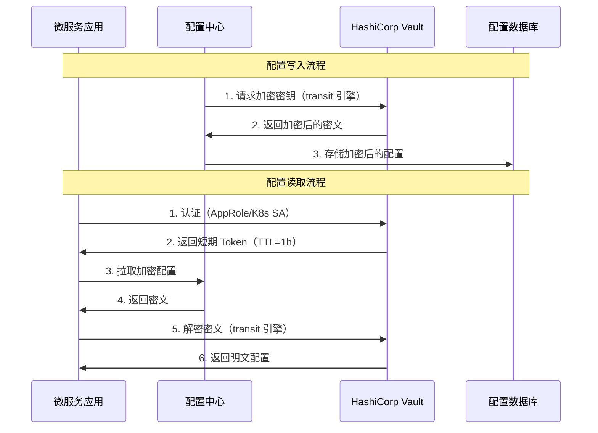

**Vault Transit 引擎配置（自动加密/解密）：**

```hcl
# 启用 Transit 引擎
vault secrets enable transit

# 创建加密密钥（支持自动轮换）
vault write -f transit/keys/apollo-config type=aes256-gcm96

# 加密配置值
vault write -f transit/encrypt/apollo-config \
    plaintext=$(echo -n 'Sup3rS3cret!' | base64)

# 解密配置值
vault write -f transit/decrypt/apollo-config \
    ciphertext="vault:v1:..."

# 自动轮换密钥（不影响旧密文解密）
vault write -f transit/keys/apollo-config/rotate
```

**Vault 的核心安全特性：**

| 特性 | 说明 | 配置中心场景的价值 |
|------|------|-------------------|
| Transit 引擎 | 加密即服务，密钥永不离开 Vault | 配置中心无需管理加密密钥 |
| AppRole 认证 | 基于 RoleID + SecretID 的自动化认证 | 微服务启动时自动获取短期 Token |
| 动态密钥 | 按需生成临时数据库凭证 | 数据库密码自动轮换 |
| 审计日志 | 记录所有 Vault 操作 | 满足合规审计要求 |
| 密钥轮换 | 一键轮换，旧密文自动重加密 | 无停机密钥轮换 |
| Shamir 密封 | 主密钥分片，需要 M-of-N 恢复 | 防止单点密钥泄露 |

### 2.5 密钥轮换策略

密钥轮换是密钥管理中最重要的安全实践。定期轮换密钥可以限制密钥泄露的影响范围——即使密钥被泄露，攻击者也只能在轮换窗口内使用该密钥。

**密钥轮换的完整流程：**

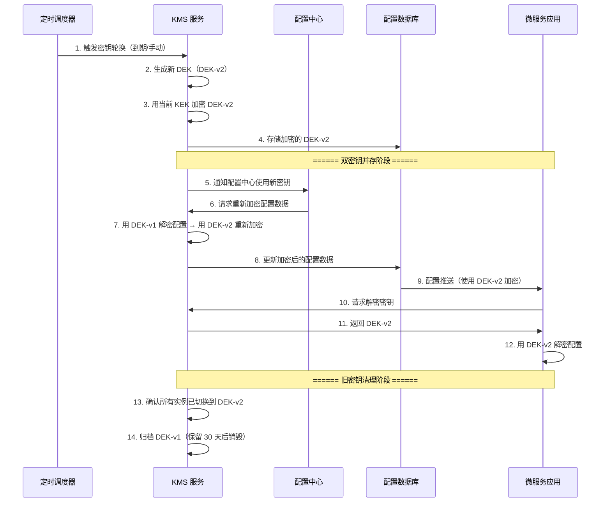

**轮换窗口的安全设计：**

轮换过程中存在一个关键风险：部分实例可能还在使用旧密钥。解决方法是**双密钥并存**——在轮换窗口内，KMS 同时接受新旧两个密钥的解密请求：

```java
public class KeyRotatingDecryptor {
    
    private volatile SecretKey currentKey;    // 当前密钥
    private volatile SecretKey previousKey;   // 上一轮密钥（轮换期间保留）
    
    /**
     * 自动尝试两个密钥解密
     * 轮换期间：先尝试 currentKey，失败再尝试 previousKey
     * 轮换完成后：previousKey 被清理，只用 currentKey
     */
    public String decrypt(String encrypted) throws Exception {
        try {
            // 优先使用当前密钥
            return doDecrypt(encrypted, currentKey);
        } catch (Exception e1) {
            try {
                // 降级到上一轮密钥
                return doDecrypt(encrypted, previousKey);
            } catch (Exception e2) {
                throw new RuntimeException("密钥解密失败，密钥可能已过期", e2);
            }
        }
    }
    
    /**
     * 密钥轮换回调
     */
    public void onKeyRotation(SecretKey newKey) {
        this.previousKey = this.currentKey;  // 旧密钥降级为 previous
        this.currentKey = newKey;            // 新密钥升级为 current
        
        // 延迟清理旧密钥（等待所有实例完成轮换）
        scheduledExecutor.schedule(() -> {
            this.previousKey = null;
        }, 24, TimeUnit.HOURS);
    }
}
```

**轮换策略的频率建议：**

| 密钥类型 | 建议轮换周期 | 理由 |
|---------|------------|------|
| DEK（数据加密密钥） | 30-90 天 | 直接加密数据，轮换窗口要短 |
| KEK（密钥加密密钥） | 90-180 天 | 加密其他密钥，影响范围更大 |
| Master Key | 1-3 年 | 在 HSM 中，轮换需停机维护 |
| TLS 证书 | 90 天（配合自动续签） | 缩短证书泄露的影响窗口 |
| API 密钥 | 每次发布新版本 | 开发者习惯变更时轮换 |

### 2.6 HSM 集成

HSM（Hardware Security Module，硬件安全模块）是密钥管理的最高安全等级。HSM 是一台专用硬件设备，Master Key 永远不会离开 HSM 的物理边界。

| HSM 等级 | 安全标准 | 适用场景 | 代表产品 |
|----------|---------|---------|---------|
| FIPS 140-2 Level 1 | 基本物理安全 | 开发测试环境 | 软件模拟 HSM |
| FIPS 140-2 Level 2 | 防篡改封装 | 一般生产环境 | AWS CloudHSM |
| FIPS 140-2 Level 3 | 主动篡改检测 | 金融、政务 | Thales Luna、AWS CloudHSM |
| FIPS 140-2 Level 4 | 物理入侵响应 | 最高安全要求 | 军工级别 |

---

## 三、配置中心的加密实践

### 3.1 Apollo 的加密方案

Apollo 提供了内置的配置加密支持，核心机制是 **KeyMaker** 接口和 **DES 加密覆盖**。

**Apollo 的加密模型：**

用户在 Portal 输入明文配置
    ↓
Admin Service 调用 KeyMaker 加密
    ↓
加密后的密文写入 MySQL
    ↓
Config Service 推送密文给客户端
    ↓
Client SDK 调用 KeyMaker 解密
    ↓
应用使用明文配置

**自定义 KeyMaker 实现（推荐 AES-256-GCM）：**

```java
import com.ctrip.framework.apollo.core.utils.AES;
import com.ctrip.framework.apollo.spi.KeyMaker;
import org.springframework.stereotype.Component;

/**
 * Apollo 自定义密钥管理器
 * 替换默认的 DES 加密为 AES-256-GCM
 */
@Component
public class ApolloKeyMaker implements KeyMaker {
    
    // 密钥从 KMS 获取，不硬编码
    private final byte[] encryptionKey;
    
    public ApolloKeyMaker(KmsClient kmsClient) {
        // 从 KMS 获取数据加密密钥
        this.encryptionKey = kmsClient.getDataKey("apollo-config-key");
    }
    
    @Override
    public String makeKey() {
        // 返回 Base64 编码的密钥
        return Base64.getEncoder().encodeToString(encryptionKey);
    }
}
```

**Apollo 配置加密的完整流程：**

| 步骤 | 组件 | 操作 | 说明 |
|------|------|------|------|
| 1 | Portal | 用户输入 `{cipher}加密后的值` | `{cipher}` 前缀标识加密配置 |
| 2 | Admin Service | 检测到 `{cipher}` 前缀 | 调用 KeyMaker 获取密钥 |
| 3 | Admin Service | 使用密钥对值部分解密存储 | 数据库中存储的是密文 |
| 4 | Config Service | 读取密文，推送给客户端 | 传输密文，不解密 |
| 5 | Client SDK | 检测到密文标识，调用 KeyMaker 解密 | 应用层获取明文 |

### 3.2 Nacos 的加密方案

Nacos 2.x 引入了配置加密插件机制，支持通过扩展 `ConfigFilter` 实现自定义加密：

```java
import com.alibaba.nacos.api.config.ConfigFilterConstants;
import com.alibaba.nacos.api.config.filter.IConfigFilter;
import com.alibaba.nacos.api.exception.NacosException;
import java.util.Properties;

/**
 * Nacos 配置加密过滤器
 * 在配置读写链路中自动加解密
 */
public class AesConfigFilter implements IConfigFilter {
    
    private static final String ENCRYPT_PREFIX = "encrypted:";
    private ConfigEncryptor encryptor;
    
    @Override
    public void init(Properties properties) {
        // 从 properties 中获取 KMS 配置
        String kmsEndpoint = properties.getProperty("filter.aes.kms.endpoint");
        String keyId = properties.getProperty("filter.aes.kms.key.id");
        this.encryptor = new AesConfigEncryptor(kmsEndpoint, keyId);
    }
    
    @Override
    public void doFilter(FilterConfig config, FilterChain chain) throws NacosException {
        if (config.getReadableConfigType() == ConfigType.NORMAL) {
            // 写入时：加密
            if (config.getContent().startsWith(ENCRYPT_PREFIX)) {
                String plaintext = config.getContent()
                    .substring(ENCRYPT_PREFIX.length());
                String ciphertext = encryptor.encrypt(plaintext);
                config.setContent(ENCRYPT_PREFIX + ciphertext);
            }
            
            // 读取时：解密
            if (config.getContent().startsWith(ENCRYPT_PREFIX)) {
                String ciphertext = config.getContent()
                    .substring(ENCRYPT_PREFIX.length());
                String plaintext = encryptor.decrypt(ciphertext);
                config.setContent(plaintext);
            }
        }
        chain.doFilter(config);
    }
    
    @Override
    public int getOrder() {
        return 0;  // 最高优先级，确保在其他过滤器之前执行
    }
    
    @Override
    public void shutdown() {
        // 清理资源
    }
}
```

**Nacos 加密配置（application.properties）：**

```properties
# Nacos 加密过滤器配置
nacos.config.filter.aes.enabled=true
nacos.config.filter.aes.kms.endpoint=https://kms.example.com
nacos.config.filter.aes.kms.key.id=apollo-config-key
nacos.config.filter.aes.kms.region=cn-hangzhou
```

### 3.3 加密方案对比

| 维度 | Apollo | Nacos | 自建方案 |
|------|--------|-------|---------|
| 加密方式 | KeyMaker 接口 | ConfigFilter 插件 | 自行实现 |
| 默认算法 | DES（弱，需替换） | AES-GCM（可配置） | 完全自定义 |
| 密钥管理 | 需自行集成 KMS | 需自行集成 KMS | 完全自定义 |
| 透明加解密 | 支持（{cipher} 前缀） | 支持（Filter 链） | 自行实现 |
| 密钥轮换 | 需手动处理 | 需手动处理 | 可实现自动轮换 |
| 审计日志 | 依赖 Admin Service | 依赖管理控制台 | 需自行实现 |

---

## 四、传输层安全：TLS 与 mTLS

### 4.1 单向 TLS（客户端验证服务端）

最基本的传输加密——客户端验证服务端身份，防止中间人攻击。

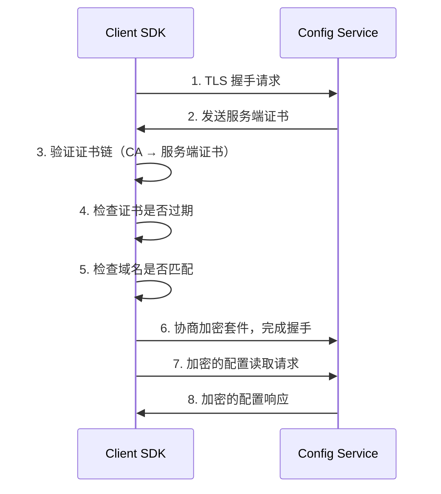

**配置示例（Java）：**

```java
// 客户端配置 TLS
Properties properties = new Properties();
properties.put("apollo.configService", "https://config.example.com");
properties.put("apollo.ssl.trustStore", "/path/to/truststore.jks");
properties.put("apollo.ssl.trustStorePassword", "changeit");
```

**必须使用 TLS 1.3 的理由：** TLS 1.2 虽然目前仍被认为是安全的，但 TLS 1.3 移除了不安全的加密套件（如 RC4、3DES），将握手从 2-RTT 减少到 1-RTT（0-RTT 恢复），并默认启用前向保密（Forward Secrecy）。配置中心作为内部核心服务，没有理由不使用 TLS 1.3。

### 4.2 双向 TLS（mTLS）

mTLS（mutual TLS）在单向 TLS 的基础上增加了**客户端证书验证**——服务端也要验证客户端的身份。这是微服务间通信的最高安全标准。

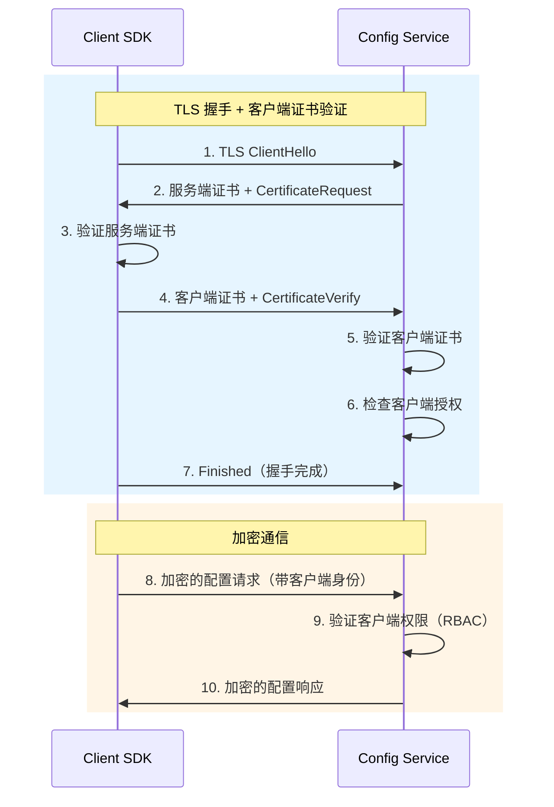

**mTLS 与单向 TLS 的关键区别：**

| 特性 | 单向 TLS | mTLS |
|------|---------|------|
| 客户端验证 | 验证服务端身份 | 验证服务端身份 |
| 服务端验证 | 不验证客户端 | 验证客户端身份 |
| 安全等级 | 防止中间人攻击 | 防止中间人 + 未授权访问 |
| 证书管理 | 服务端需要证书 | 服务端 + 客户端都需要证书 |
| 适用场景 | 公网访问 | 内部微服务通信 |

**在 Kubernetes 中实现 mTLS 的推荐方案：** 使用 Istio 或 Linkerd 的 Sidecar 模式，自动为每个 Pod 注入 Envoy 代理，由控制面统一管理证书的签发和轮换，应用无需感知 mTLS 的复杂性。

### 4.3 证书管理最佳实践

证书管理生命周期:
    
  申请 → 签发 → 部署 → 监控 → 轮换 → 吊销 → 销毁
    
  关键注意事项:
  ├── 证书有效期: 生产环境建议 90 天（短有效期 + 自动轮换）
  ├── 私钥保护: 存储在安全位置，绝不上传到 Git 仓库
  ├── 证书链完整性: 必须包含完整的 CA 证书链
  ├── 域名匹配: SAN（Subject Alternative Name）必须正确配置
  └── 吊销检查: 配置 CRL 或 OCSP 证书吊销检查

**自动化证书管理工具对比：**

| 工具 | 适用场景 | 自动续签 | 与 K8s 集成 |
|------|---------|---------|------------|
| cert-manager | Kubernetes 环境 | 支持 | 原生支持 |
| Let's Encrypt + Certbot | 传统服务器 | 支持 | 需手动配置 |
| Vault PKI 引擎 | 企业内部 CA | 支持 | 通过 Vault Agent |
| AWS Private CA | AWS 环境 | 支持 | 通过 ACM |

---

## 五、访问控制：RBAC 权限模型

### 5.1 RBAC 核心概念

RBAC（Role-Based Access Control，基于角色的访问控制）是配置中心最常用的权限管理模型。其核心思想是：**用户不直接拥有权限，而是通过角色间接获得权限**。

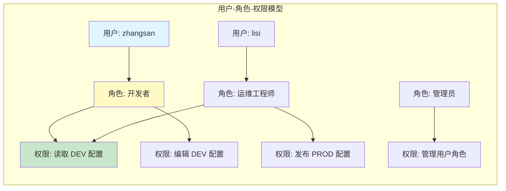

### 5.2 Apollo 的权限模型

Apollo 使用**四层权限体系**，权限粒度从粗到细：

| 层级 | 权限维度 | 说明 | 示例 |
|------|---------|------|------|
| L1 | App 级别 | 对整个应用的管理权限 | 能否管理 payment-service 的所有配置 |
| L2 | Cluster 级别 | 对集群的管理权限 | 能否管理 production 集群 |
| L3 | Namespace 级别 | 对命名空间的读写权限 | 能否编辑 application namespace |
| L4 | 配置项级别 | 对单个配置项的操作权限 | 能否修改 db.password |

**Apollo 权限配置示例：**

```java
// Apollo 权限校验逻辑（简化版）
public class ApolloPermissionChecker {
    
    /**
     * 检查用户是否有权执行指定操作
     */
    public boolean checkPermission(String userId, String operation, 
                                    String appId, String cluster, 
                                    String namespace) {
        // 1. 获取用户所有角色
        List<Role> roles = getRolesForUser(userId);
        
        // 2. 获取操作对应的权限要求
        Permission requiredPerm = getRequiredPermission(operation);
        
        // 3. 遍历角色，检查是否包含所需权限
        for (Role role : roles) {
            // 角色权限范围：可能限定在特定环境
            RolePermission rolePerm = getRolePermission(role, appId);
            
            if (rolePerm.includesCluster(cluster) 
                &amp;&amp; rolePerm.includesNamespace(namespace)
                &amp;&amp; rolePerm.hasPermission(requiredPerm)) {
                return true;  // 有权限
            }
        }
        
        return false;  // 无权限
    }
}
```

### 5.3 Nacos 的权限模型

Nacos 的权限模型相对简单，基于**命名空间级别**的读写权限：

| 操作 | 权限要求 | 说明 |
|------|---------|------|
| 读取配置 | 读权限 | 仅读取配置内容 |
| 创建/修改配置 | 写权限 | 创建新配置或修改已有配置 |
| 删除配置 | 写权限 | 删除配置项 |
| 管理命名空间 | 管理权限 | 创建/删除命名空间 |
| 管理用户权限 | 管理权限 | 分配/撤销其他用户的权限 |

### 5.4 审批流程设计

敏感配置变更（如数据库密码、支付密钥）应强制走审批流程，确保变更经过多人确认：

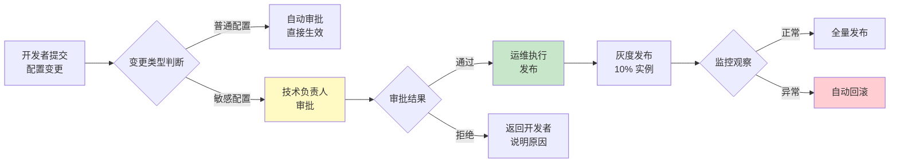

**敏感配置的判定标准：**

| 配置类型 | 敏感等级 | 审批要求 | 原因 |
|---------|---------|---------|------|
| 数据库密码 | 高 | 双人审批 | 泄露可直接访问所有数据 |
| API 密钥 | 高 | 双人审批 | 泄露可冒充合法调用 |
| 日志级别 | 低 | 自动审批 | 无安全风险 |
| 连接池大小 | 低 | 自动审批 | 影响有限，可快速回滚 |
| 加密密钥 | 极高 | 三人审批 + 安全团队 | 泄露影响全系统 |

---

## 六、配置安全实战：从加密到审计

### 6.1 配置加密的完整流程

以一个实际场景为例——在 Apollo 中安全配置数据库密码：

┌─────────────────────────────────────────────────────────────┐
│                     安全配置管理流程                          │
│                                                              │
│  1. 开发者准备配置                                            │
│     ├── 明文密码: db.password=Sup3rS3cret!                   │
│     └── 需要加密存储                                         │
│                                                              │
│  2. KMS 加密                                                 │
│     ├── 请求 DEK: kms.getDataKey("db-password-key")         │
│     ├── 加密: AES-256-GCM(password, dek)                    │
│     └── 结果: db.password={cipher}kL8mN2pQ5...              │
│                                                              │
│  3. Apollo 配置发布                                           │
│     ├── Portal: 输入 {cipher}kL8mN2pQ5...                   │
│     ├── Admin Service: 识别 {cipher} 前缀，存储密文          │
│     └── 数据库: 存储加密后的值                                │
│                                                              │
│  4. 客户端解密                                                │
│     ├── Config Service 推送密文                              │
│     ├── Client SDK 识别密文，请求 KMS 获取 DEK              │
│     └── AES-256-GCM.decrypt(ciphertext, dek) → 明文         │
│                                                              │
│  5. 审计记录                                                  │
│     ├── 谁: zhangsan                                        │
│     ├── 什么时间: 2025-01-15 14:30:00                       │
│     ├── 修改了什么: production/payment-service/db.password   │
│     ├── 旧值: [已加密，不可见]                                │
│     └── 审批人: lisi                                        │
└─────────────────────────────────────────────────────────────┘

### 6.2 本地缓存加密

Apollo 和 Nacos 的 Client SDK 会将配置缓存到本地文件系统。如果服务器被入侵，攻击者可以直接读取本地缓存获取明文配置。解决方案是**对本地缓存文件进行加密**：

```java
/**
 * 加密的本地缓存管理器
 * 在 Apollo Client SDK 的本地缓存基础上增加加密层
 */
public class EncryptedLocalCache {
    
    private final ConfigEncryptor encryptor;
    private final Path cacheDir;
    
    /**
     * 写入缓存时加密
     */
    public void writeCache(String namespace, String content) throws Exception {
        // 加密配置内容
        String encrypted = encryptor.encrypt(content);
        
        // 写入缓存文件（文件名加 .enc 后缀）
        Path cacheFile = cacheDir.resolve(namespace + ".properties.enc");
        Files.writeString(cacheFile, encrypted);
    }
    
    /**
     * 读取缓存时解密
     */
    public String readCache(String namespace) throws Exception {
        Path cacheFile = cacheDir.resolve(namespace + ".properties.enc");
        
        if (!Files.exists(cacheFile)) {
            return null;
        }
        
        // 读取并解密
        String encrypted = Files.readString(cacheFile);
        return encryptor.decrypt(encrypted);
    }
}
```

### 6.3 配置审计日志

完整的配置审计日志应该记录每一次配置操作的完整上下文：

```json
{
  "event_id": "evt-20250115-143000-001",
  "timestamp": "2025-01-15T14:30:00+08:00",
  "event_type": "config.publish",
  "user": {
    "id": "user-001",
    "name": "zhangsan",
    "role": "developer",
    "ip": "10.0.1.100"
  },
  "target": {
    "app_id": "payment-service",
    "cluster": "production",
    "namespace": "application",
    "key": "db.password"
  },
  "change": {
    "old_value": "[ENCRYPTED]",
    "new_value": "[ENCRYPTED]",
    "change_reason": "季度密钥轮换",
    "approval": {
      "approver": "lisi",
      "approved_at": "2025-01-15T14:25:00+08:00",
      "approval_id": "apr-20250115-001"
    }
  },
  "release": {
    "release_type": "gray",
    "gray_rule": "IP: 10.0.1.50-10.0.1.60",
    "gray_percentage": 10
  },
  "result": "success"
}
```

**审计日志的保存与检索：**

| 保留策略 | 适用场景 | 说明 |
|---------|---------|------|
| 保留 180 天 | 一般业务系统 | 满足大多数合规要求 |
| 保留 365 天 | 金融、政务系统 | 满足等保三级要求 |
| 永久保留 | 最高安全要求 | 用于长期安全审计 |
| 写入 WORM 存储 | 合规审计 | 防止日志被篡改或删除 |

---

## 七、安全加固最佳实践

### 7.1 敏感配置识别与分类

在实施加密之前，首先需要识别哪些配置属于敏感信息：

| 敏感等级 | 配置类型 | 示例 | 加密要求 |
|---------|---------|------|---------|
| P0-极敏感 | 加密密钥本身 | AES 密钥、RSA 私钥 | HSM 存储，永远不明文 |
| P1-高敏感 | 数据库凭证 | DB 密码、连接串 | AES-256-GCM 加密存储 |
| P1-高敏感 | 第三方服务密钥 | API Key、Secret | AES-256-GCM 加密存储 |
| P1-高敏感 | 证书私钥 | TLS 私钥 | 加密存储 + 访问控制 |
| P2-中敏感 | 服务间认证凭证 | Token、Session Secret | AES-256-GCM 加密存储 |
| P3-低敏感 | 业务配置 | 超时时间、重试次数 | 明文存储可接受 |
| P4-公开 | 功能开关 | Feature Flag | 明文存储可接受 |

### 7.2 常见攻击向量与防御

配置安全不仅仅是加密存储，还需要防范多种攻击手段：

| 攻击向量 | 攻击方式 | 防御措施 |
|---------|---------|---------|
| 内存泄露 | 进程内存 dump、/proc/PID/mem 读取 | 解密后不长期驻留内存，使用后立即清零 |
| Swap 文件 | 内存交换到磁盘产生明文泄露 | 禁用 Swap 或使用 dm-crypt 加密 Swap |
| 日志泄露 | 配置值被打印到应用日志 | 代码审查 + 日志脱敏规则 + 自动扫描 |
| 调试端口 | Spring Actuator、JMX 暴露配置 | 生产环境禁用所有调试端点 |
| Git 泄露 | 配置文件被提交到代码仓库 | pre-commit hook 扫描 + git-secrets |
| 容器逃逸 | 从容器中读取环境变量或挂载文件 | 最小权限 + seccomp + 禁止特权模式 |
| 侧信道攻击 | 通过 CPU 缓存时序分析密钥 | 使用常量时间比较算法（hmac.compare_digest） |

**防止日志泄露的代码模式：**

```java
/**
 * 敏感配置的日志脱敏工具
 * 防止配置值被意外打印到日志中
 */
public class SensitiveDataMasker {
    
    // 敏感配置 key 的匹配模式
    private static final Pattern SENSITIVE_KEYS = Pattern.compile(
        "(password|secret|token|apikey|api_key|private_key|credential|auth).*",
        Pattern.CASE_INSENSITIVE
    );
    
    /**
     * 对配置 Map 中的敏感值进行脱敏
     */
    public static Map<String, String> maskSensitive(Map<String, String> configs) {
        Map<String, String> masked = new LinkedHashMap<>(configs);
        for (Map.Entry<String, String> entry : masked.entrySet()) {
            if (SENSITIVE_KEYS.matcher(entry.getKey()).matches()) {
                String value = entry.getValue();
                if (value != null &amp;&amp; value.length() > 4) {
                    // 保留前2位和后2位，中间用 *** 替代
                    entry.setValue(value.substring(0, 2) 
                        + "***" 
                        + value.substring(value.length() - 2));
                }
            }
        }
        return masked;
    }
}
```

### 7.3 加密操作的常见误区

| 误区 | 正确做法 | 为什么错误 |
|------|---------|-----------|
| 密钥硬编码在代码中 | 从 KMS 动态获取 | 代码泄露 = 密钥泄露 |
| 密钥和密文存同一数据库 | 密钥存储在独立 KMS | 数据库泄露 = 全部暴露 |
| 使用 MD5 做"加密" | 使用 AES-256-GCM | MD5 是哈希算法，不可逆 |
| 使用 ECB 模式 | 使用 GCM/CBC 模式 | ECB 模式会泄露明文模式 |
| 不做密钥轮换 | 定期轮换密钥 | 长期使用增加泄露风险 |
| 所有配置都加密 | 按敏感等级分级加密 | 不必要加密增加性能开销 |
| 忽略本地缓存加密 | 本地缓存也需加密 | 服务器被入侵可读取缓存 |
| 自己实现加密算法 | 使用标准加密库 | 自制算法几乎必然有漏洞 |
| 密钥在 CI/CD 中明文传递 | 使用 Vault 或加密环境变量 | 流水线日志可泄露密钥 |

### 7.4 加密对性能的影响

加密不是免费的。在实施加密前，需要评估对系统性能的影响：

| 操作 | 耗时 | 对配置读取的影响 | 优化策略 |
|------|------|----------------|---------|
| AES-256-GCM 加密 | ~10μs/KB | 可忽略 | 硬件 AES-NI 加速 |
| AES-256-GCM 解密 | ~10μs/KB | 可忽略 | 硬件 AES-NI 加速 |
| RSA-2048 解密 | ~2ms/次 | 首次加载有感知 | 仅解密 DEK，缓存 DEK |
| KMS API 调用 | ~50-200ms | 首次加载 + 密钥轮换 | 本地缓存 DEK |
| TLS 握手 | ~50-100ms | 首次连接 | 复用 TLS 连接 |

**优化建议：**

1. **DEK 缓存**：解密后的 DEK 缓存在内存中（设置 TTL），避免每次读取配置都调用 KMS
2. **批量解密**：一次拉取多个配置时，批量解密减少调用次数
3. **硬件加速**：现代 CPU 支持 AES-NI 指令集，AES 加解密性能接近内存带宽
4. **异步解密**：非阻塞解密，避免阻塞主线程

### 7.5 CI/CD 管道中的配置安全

配置加密的最后一公里是 CI/CD 管道——这是密钥最容易泄露的环节之一：

CI/CD 管道中的密钥保护策略:

  开发者提交代码
       ↓
  pre-commit hook ──→ 扫描代码中的硬编码密钥
       ↓（通过）
  CI 构建 ──→ 从 Vault 获取构建密钥（不写入环境变量日志）
       ↓
  CI 测试 ──→ 使用临时数据库凭证（Vault 动态密钥，TTL=1h）
       ↓
  CD 部署 ──→ Vault 注入配置到 Kubernetes Secret
       ↓
  应用启动 ──→ 从 KMS 获取 DEK → 解密配置 → 运行

**关键防护措施：**

| 环节 | 风险 | 防护 |
|------|------|------|
| Git 提交 | 密钥被提交到仓库 | git-secrets / truffleHog pre-commit hook |
| CI 构建日志 | 环境变量被打印到日志 | CI 平台自动 mask 以 SECRET_ 开头的变量 |
| Docker 镜像 | 密钥被 bake 进镜像层 | 多阶段构建 + 运行时从 KMS 获取 |
| K8s Secret | Secret 以 base64 明文存储在 etcd | 启用 etcd 加密 + External Secrets Operator |
| 运行时 | 进程内存/环境变量泄露 | 最小权限 + 内存清零 + 禁用调试端点 |

---

## 八、配置安全架构全景

将所有安全维度整合到一个完整的架构中：

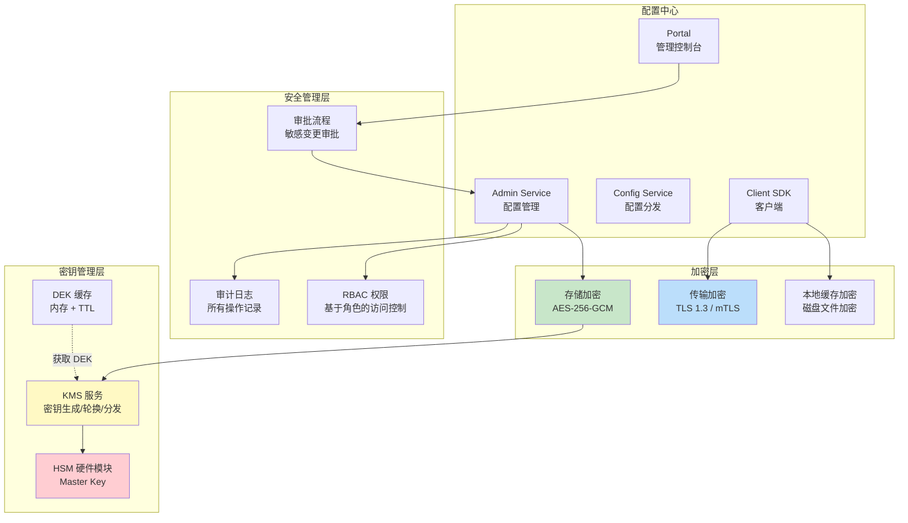

**安全检查清单：**

| 检查项 | 状态 | 说明 |
|--------|------|------|
| 敏感配置已加密存储 | ☐ | 使用 AES-256-GCM 加密所有 P0-P2 级配置 |
| 密钥存储在 KMS 中 | ☐ | 禁止硬编码密钥 |
| 配置传输使用 TLS 1.3 | ☐ | 所有配置中心通信加密 |
| 内部服务使用 mTLS | ☐ | 微服务间双向认证 |
| 本地缓存已加密 | ☐ | Client SDK 本地缓存文件加密 |
| RBAC 权限已配置 | ☐ | 最小权限原则 |
| 审批流程已启用 | ☐ | 敏感配置变更必须审批 |
| 审计日志已开启 | ☐ | 所有操作可追溯 |
| 密钥轮换策略已制定 | ☐ | 定期轮换，双密钥并存 |
| 安全扫描已通过 | ☐ | 定期检查配置中的明文密钥 |
| CI/CD 密钥保护 | ☐ | pre-commit hook + Vault 动态密钥 |
| 日志脱敏已配置 | ☐ | 敏感配置值不在日志中明文出现 |

---

## 九、常见安全事件与应急响应

配置安全不是"部署完就结束"的事情，还需要建立应急响应机制：

### 9.1 配置泄露的应急响应流程

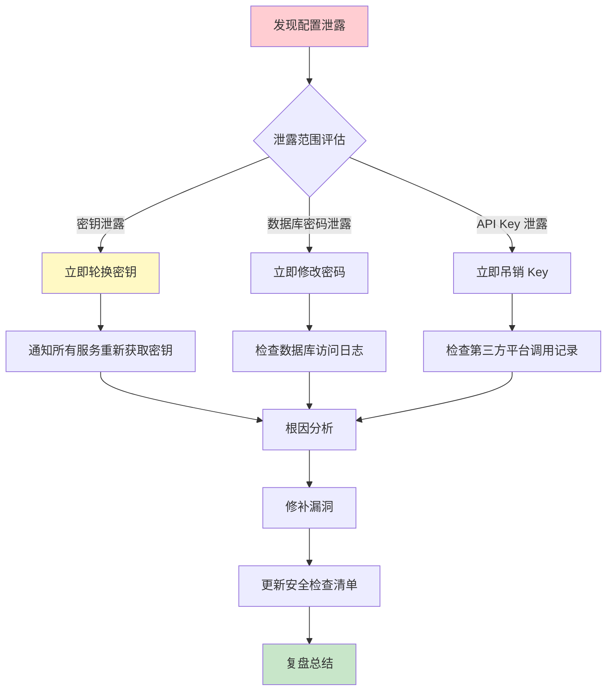

### 9.2 事件响应时效要求

| 事件类型 | 响应时效 | 处理措施 |
|---------|---------|---------|
| 生产数据库密码泄露 | 15 分钟内 | 修改密码 + 检查访问日志 + 排查泄露源 |
| 加密密钥泄露 | 30 分钟内 | 密钥轮换 + 重新加密所有配置 |
| API Key 泄露 | 1 小时内 | 吊销 Key + 检查调用记录 + 重新签发 |
| 配置中心被入侵 | 2 小时内 | 隔离环境 + 全面审计 + 恢复 |
| 本地缓存被窃取 | 4 小时内 | 轮换密钥 + 加固服务器 + 评估影响 |

**配置安全的持续改进是一个循环过程：加密 → 监控 → 审计 → 发现问题 → 改进 → 加密。没有一劳永逸的安全方案，只有不断提升的防御能力。**
