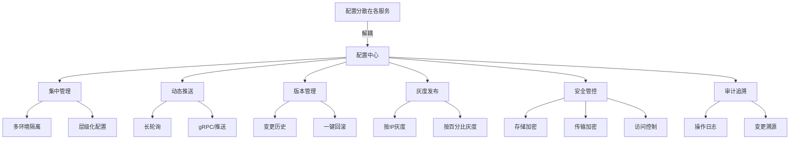
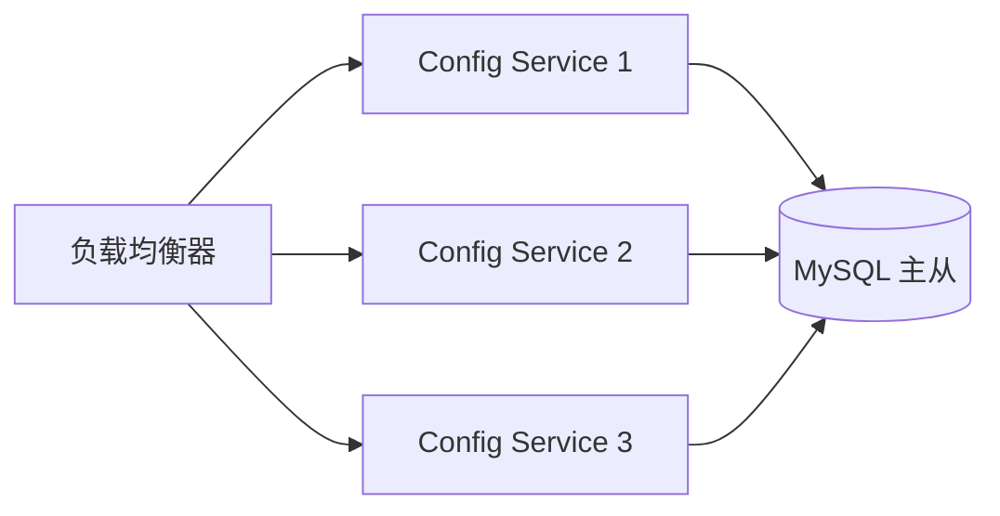
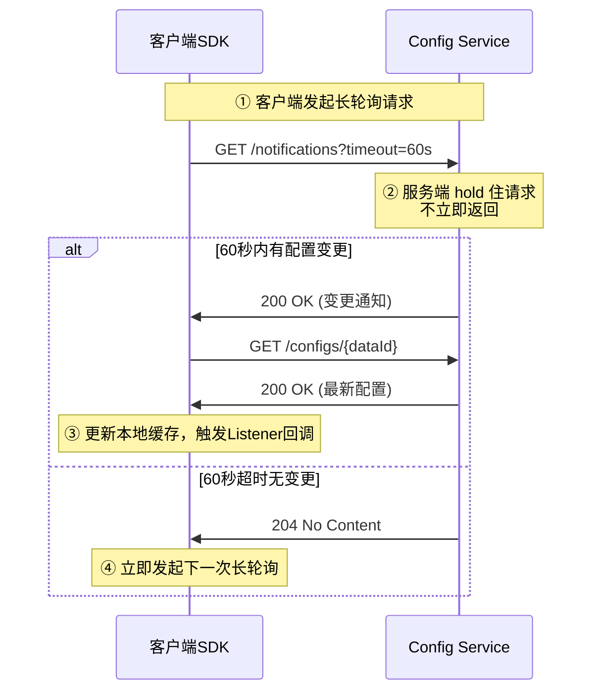
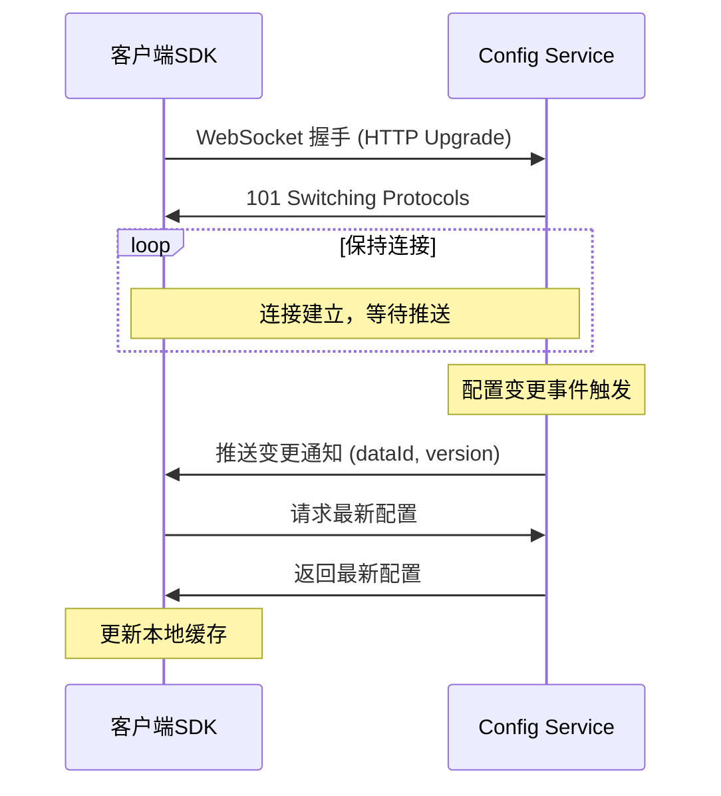
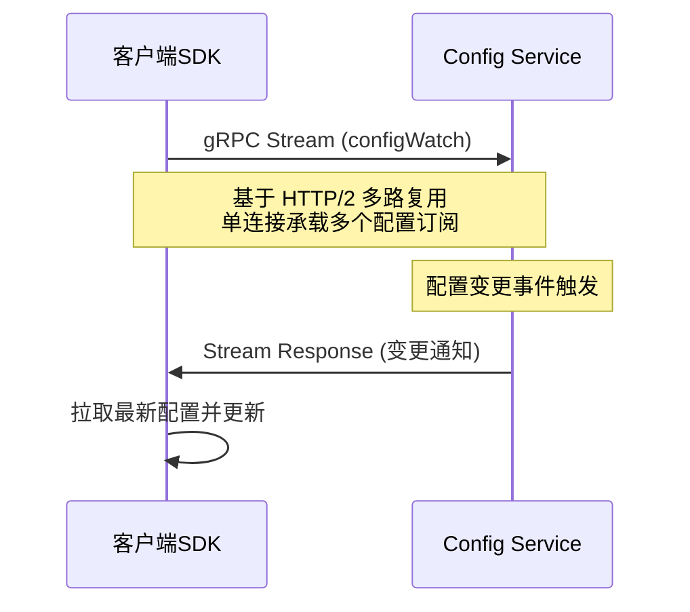
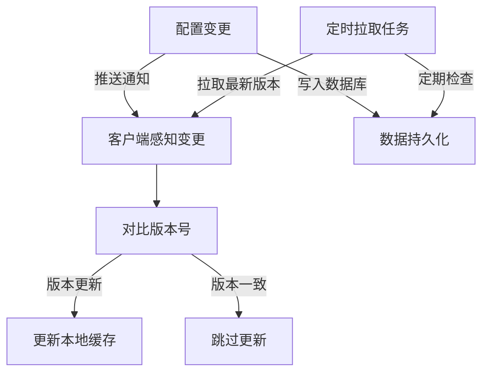
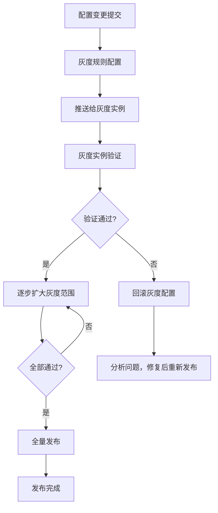
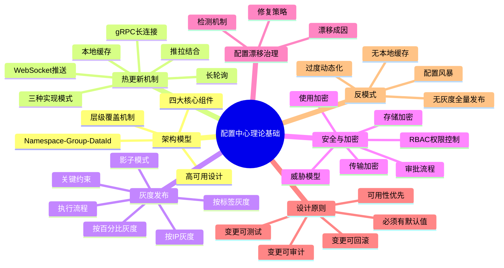

# 配置中心理论基础

配置中心是微服务架构中最容易被低估、却最不该被低估的基础设施组件。一个配置变更导致的线上故障，可能比一次代码缺陷影响范围更广、回滚速度更慢。2023 年某头部互联网公司的一次生产事故中，运维人员误将数据库连接池最大值从 200 改为 20，导致支付链路瞬间过载，影响持续 47 分钟，损失超过千万——而修改的仅仅是一个配置项。

本节从架构模型、热更新机制、灰度发布、配置安全和配置漂移治理五个维度，系统性地阐述配置中心的理论基础，为后续的核心技巧和实战案例奠定认知框架。

---

## 一、配置管理的演进：从文件到服务

### 1.1 单体时代的配置管理

在单体应用时代，配置文件（`application.properties`、`application.yaml`、`.env`）与代码一起打包部署。这种模式简单直接：

my-app/
├── src/main/resources/
│   ├── application.properties        # 主配置
│   ├── application-dev.properties    # 开发环境覆盖
│   └── application-prod.properties   # 生产环境覆盖
├── pom.xml
└── ...

配置的修改流程为：**修改文件 → 提交代码 → CI/CD 构建 → 部署上线**。这个流程对单体应用来说虽然笨重，但在服务数量为 1-3 个时是可接受的。典型的配置生命周期如下：

开发者本地修改 → Git 提交 → 代码 Review → CI 构建 → staging 验证 → 生产发布 → 重启生效
      │                                                    │
      └──── 全程耗时 2-8 小时 ──────────────────────────────┘

单体时代配置管理的核心特征：

| 特征 | 表现 | 影响 |
|------|------|------|
| 配置与代码绑定 | 同一仓库、同一部署包 | 配置变更必须走完整发布流程 |
| 环境差异靠文件区分 | application-{env}.properties | 环境越多，文件越多 |
| 没有版本对比能力 | 需要 diff 不同分支的配置文件 | 难以追溯"谁改了什么" |
| 敏感信息混入代码 | 数据库密码写在 properties 中 | 代码泄露即密码泄露 |

### 1.2 微服务时代的配置困境

当系统演进到微服务架构后，配置管理面临四个维度的复杂度爆炸：

| 维度 | 单体应用 | 微服务系统（200+服务） | 放大倍数 |
|------|---------|----------------------|---------|
| 配置文件数量 | 5-10 个 | 1,000-5,000 个 | 100-500x |
| 配置项总量 | 50-100 个 | 50,000-200,000 个 | 500-2000x |
| 变更频率 | 每周 1-2 次 | 每天 10-50 次 | 10-50x |
| 修改影响范围 | 重启 1 个服务 | 可能需要重启 50+ 服务 | 50x+ |
| 环境数量 | 2-3 个 | 5-8 个（DEV/SIT/UAT/PRE/PROD/...） | 2-3x |

这带来了五个核心痛点：

**（1）发布耦合**：修改一个数据库连接池参数，需要改代码、走 CI/CD、重新发布整个服务。一个参数的变更可能耗时数小时，而业务方的需求往往是"现在就要生效"。

**（2）配置分散**：200 个服务的配置文件分散在数百台服务器上，修改一个通用参数（如日志级别）需要登录每台机器逐一修改，极易遗漏。在实际运维中，遗漏一台实例意味着灰度窗口被破坏。

**（3）缺乏审批**：配置变更没有审批流程，任何有服务器权限的人都能直接修改生产配置，误操作直接导致线上故障。更危险的是，这种操作没有审计记录，出了问题无法追溯。

**（4）无法回滚**：配置改坏了无法快速回滚，只能手动反向修改，排查和恢复过程漫长。在高压状态下，人工反向修改本身就容易出错。

**（5）安全隐患**：数据库密码、API 密钥等敏感配置以明文形式散落在代码仓库和配置文件中，一旦代码泄露，所有敏感信息一并暴露。GitHub 扫描显示，每年有超过 10 万个含有 AWS 密钥的代码仓库被公开提交。

### 1.3 配置中心的诞生

配置中心的本质是**将配置从代码中解耦出来，作为独立的基础设施服务运行**。它需要提供六大核心能力：

| 能力 | 描述 | 解决的痛点 | 实现复杂度 |
|------|------|-----------|-----------|
| 集中管理 | 所有服务的配置统一存储和管理 | 配置分散 | 低 |
| 动态推送 | 配置变更后实时推送到客户端 | 发布耦合 | 高 |
| 版本管理 | 每次变更记录版本，支持对比和回滚 | 无法回滚 | 中 |
| 灰度发布 | 先小范围验证，再全量推广 | 变更风险高 | 高 |
| 安全管控 | 加密存储、传输加密、访问控制 | 安全隐患 | 中 |
| 审计追溯 | 所有操作记录完整审计日志 | 缺乏审批 | 低 |



### 1.4 配置中心 vs GitOps：何时选择谁

一个常见的困惑是：配置中心和 GitOps（以 Git 作为配置的单一事实来源）有什么区别？何时选择谁？

| 对比维度 | 配置中心 | GitOps |
|---------|---------|--------|
| 生效方式 | 动态推送，秒级生效 | 需要 CI/CD 流水线，分钟到小时级 |
| 版本管理 | 内置版本历史 + UI 对比 | Git 原生 commit history |
| 审批流程 | 内置审批 + 发布权限控制 | PR Review + Merge 策略 |
| 适用场景 | 需要运行时动态变更的配置 | 基础设施配置、K8s 资源声明 |
| 灰度能力 | 原生支持 | 需额外工具链 |
| 一致性模型 | 最终一致（推拉结合） | 声明式一致（期望状态 vs 实际状态） |

**最佳实践**：两者不是互斥关系，而是互补关系。基础设施层（K8s ConfigMap、Ingress 规则等）用 GitOps 管理，应用层业务配置用配置中心管理。配置中心负责"运行时变更"，GitOps 负责"部署时配置"。

---

## 二、配置中心架构模型

### 2.1 核心组件

一个生产级配置中心通常由四个核心组件组成，各司其职：

**配置管理服务（Config Service）** 是面向客户端的核心组件，负责配置的读取和变更通知。它采用无状态设计，可以水平扩展，配置数据持久化在数据库中并通过多级缓存（本地缓存 + 远程缓存）加速读取。Config Service 是最高频被访问的组件——每个服务实例启动时都需要拉取全量配置，运行过程中也可能频繁读取。一个 200 实例的服务集群，每次配置发布都意味着至少 200 次拉取请求。

**管理服务（Admin Service）** 是面向运维和开发者的写入组件，负责配置的创建、修改、删除和发布操作。所有写操作都通过 Admin Service 进行，它需要严格的权限控制和操作审计。配置变更写入数据库后，通过事件机制通知 Config Service 更新缓存。Admin Service 的设计通常采用 CQRS 模式——读写分离，写入走 Admin Service，读取走 Config Service，两者独立扩展。

**配置门户（Portal）** 是 Web 管理界面，提供配置的可视化编辑、版本对比、灰度发布管理、审批流程和审计日志查看等功能。Portal 与 Admin Service 分离，确保 API 层的安全性。Portal 可以独立部署、独立扩缩容，不影响核心的配置读写链路。

**客户端 SDK** 嵌入到每个业务应用中，负责从 Config Service 拉取配置、监听变更并更新本地缓存。SDK 是配置中心可靠性的最后一道防线——当 Config Service 不可用时，SDK 必须使用本地缓存提供配置，确保应用正常运行。SDK 的设计原则是"零配置依赖"——即使完全无法连接配置中心，应用也能用默认配置启动。

                      +------------------+
                      |   Portal (Web)   |
                      +--------+---------+
                               |
                      +--------v---------+
                      |   Admin Service  |
                      |  (写操作/审批)    |
                      +--------+---------+
                               |
                      +--------v---------+
                      |    Database      |
                      | (配置持久化存储)   |
                      +--------+---------+
                               |
                      +--------v---------+
                      |   Config Service |
                      |  (读操作/推送)    |
                      +--------+---------+
                         /     |      \
                        /      |       \
                +-----+  +-----+  +-----+
                | SDK |  | SDK |  | SDK |
                +-----+  +-----+  +-----+
                 App A    App B    App C

### 2.2 数据模型：Namespace-Group-DataId

配置中心的数据组织遵循**三层隔离模型**，这是理解配置管理的关键：

**Namespace（命名空间）** 是最高层级的隔离单元，通常对应一个环境（DEV/SIT/UAT/PROD）或一个租户。不同 Namespace 之间的配置完全隔离，互不可见。Apollo 默认提供 `application` 命名空间，用户可以按需创建 `production`、`staging` 等命名空间。

**Group（分组）** 是同一 Namespace 下的二级隔离，用于区分不同的业务线或功能模块。例如在 `production` 命名空间下，可以有 `payment`、`order`、`user` 等分组。

**DataId（数据标识）** 是具体的配置文件或配置集，通常对应一个服务的配置。例如 `payment-service.yaml`、`order-service.properties`。

Namespace: production                    # 生产环境
├── Group: payment                       # 支付业务线
│   ├── DataId: payment-service.yaml     # 支付服务配置
│   ├── DataId: payment-db.yaml          # 支付数据库配置
│   └── DataId: payment-mq.yaml          # 支付消息队列配置
├── Group: order                         # 订单业务线
│   ├── DataId: order-service.yaml
│   └── DataId: order-db.yaml
└── Group: user                          # 用户业务线
    └── DataId: user-service.yaml

不同配置中心的数据模型命名略有差异，但核心思想一致：

| 配置中心 | 最高层级 | 中间层级 | 最低层级 |
|---------|---------|---------|---------|
| Apollo | Namespace | Group | DataId |
| Nacos | Namespace | Group | DataId |
| Spring Cloud Config | Application | Profile | Label |
| Consul KV | Path | Folder | Key |
| etcd | Prefix | Directory | Key |

### 2.3 配置的层级覆盖机制

配置中心支持多层级配置，下层配置优先级高于上层，实现"全局默认 + 局部覆盖"的灵活管理：

全局公共配置（最低优先级）
  │
  ├── 服务级配置
  │     │
  │     ├── 集群级配置
  │     │     │
  │     │     └── 实例级配置（最高优先级）
  │     │
  │     └── 集群级配置
  │
  └── 服务级配置

**实际示例**：假设 `payment-service` 在生产环境有两个集群（集群A在北京，集群B在上海）：

```yaml
# 全局公共配置（所有服务共享）
database.pool.size: 100
log.level: INFO
redis.timeout: 3000

# payment-service 服务级配置
payment.callback.url: https://pay.example.com/notify
payment.retry.max: 3
payment.timeout.ms: 5000

# payment-service 集群A（北京）覆盖
payment.db.host: db-bj.internal:3306

# payment-service 集群B（上海）覆盖
payment.db.host: db-sh.internal:3306

# payment-service 实例级覆盖（调试用）
# 仅对 10.0.1.5 这个实例生效
log.level: DEBUG
```

最终 10.0.1.5 实例的 `log.level` 值为 `DEBUG`（实例级覆盖了全局的 `INFO`），`payment.db.host` 为 `db-bj.internal:3306`（集群级覆盖）。

### 2.4 高可用架构设计

配置中心本身的高可用至关重要——如果配置中心不可用，所有依赖它的服务都会受影响。生产级配置中心的高可用设计包含三个层面：

**服务端高可用**：Config Service 和 Admin Service 部署多个实例（至少 3 个），通过负载均衡器（Nginx/HAProxy）对外提供服务。数据库采用主从复制或集群模式，确保数据层高可用。



**客户端高可用**：SDK 本地缓存 + 多级降级，确保配置中心不可用时应用正常运行。Apollo 的降级策略：

Level 1: 内存中的最新配置（实时生效）
    ↓ 不可用时
Level 2: 本地文件缓存（上次成功拉取）
    ↓ 不可用时
Level 3: JAR 包内嵌默认配置
    ↓ 不可用时
Level 4: 应用代码中的硬编码默认值

**跨机房高可用**：在多机房部署场景下，每个机房部署独立的配置中心集群，通过数据同步机制保持配置一致。客户端 SDK 优先连接本机房的 Config Service，本机房不可用时自动切换到其他机房。

---

## 三、配置热更新机制

配置热更新是配置中心最核心的能力——配置变更后，应用无需重启即可感知并生效。这是配置中心区别于"把配置文件放在 Git 仓库"的根本原因。

### 3.1 长轮询（Long Polling）

长轮询是目前最主流的配置推送机制，Apollo 和 Nacos 1.x 均采用此方案。其核心思想是**用 HTTP 请求的 hold 机制实现伪推送**：



**长轮询的优势**：
- 基于标准 HTTP 协议，兼容性好，无需特殊网络支持
- 实现简单，客户端和服务端都不需要维护长连接状态
- 服务端压力可控——空闲时只有一个挂起的 HTTP 连接，不消耗额外 CPU
- 对负载均衡器友好，无需特殊配置（不同于 WebSocket 需要 sticky session）

**长轮询的局限**：
- 实时性为秒级（取决于轮询间隔），不是真正的毫秒级推送
- 大量客户端同时轮询时，服务端需要维护大量挂起的 HTTP 线程（Apollo 的优化：每个 DataId 一个挂起请求，而非每个实例一个）
- 存在短暂的"通知窗口期"——在超时返回到下一次请求建立之间的间隙，配置变更可能丢失（需通过版本号对比补偿）

**Apollo 的长轮询实现细节**：Apollo 服务端维护一个 `notifications` 映射表，当配置变更时，遍历所有挂起的长轮询请求，检查其关注的 Namespace 是否有变更，有则立即返回。这使得通知延迟通常在 1-2 秒内。

### 3.2 WebSocket 推送

WebSocket 提供真正的服务端推送能力，配置变更后可以毫秒级通知客户端：



**优势**：实时性高（毫秒级）、双向通信、连接建立后开销小

**劣势**：需要 WebSocket 基础设施支持（负载均衡器、防火墙等）、连接管理复杂、断线重连需要额外逻辑。在大规模场景下（10 万+连接），WebSocket 的内存开销和连接管理成本不容忽视。

### 3.3 gRPC 长连接

Nacos 2.x 引入了基于 gRPC 的推送机制。gRPC 基于 HTTP/2，天然支持多路复用和服务端推送：



**优势**：高性能（二进制协议）、强类型接口定义（Proto 文件）、支持双向流、多路复用减少连接数

**劣势**：需要 gRPC 支持，对传统 Java/Spring 技术栈集成成本较高。在跨语言场景中优势明显，但在纯 Java 生态中可能引入不必要的复杂度。

### 3.4 推拉结合模式

实际生产中，最可靠的方案是**推拉结合**：

1. **推**：配置变更时，Config Service 主动通知客户端（通过长轮询/WebSocket/gRPC）
2. **拉**：客户端定期主动拉取最新配置，作为推送的补偿机制



这种模式确保即使推送通道出现异常（网络抖动、连接断开），客户端也能通过定期拉取获取最新配置。Apollo 的设计就是典型的推拉结合：长轮询作为主要通知通道，客户端 SDK 启动时和运行过程中都会定期拉取配置作为兜底。

**版本号对比机制**：客户端每次拉取配置时都会携带当前版本号，服务端对比后返回"有变更"或"无变更"。这是推拉结合模式的核心——避免重复拉取相同配置，减少不必要的网络开销。

### 3.5 配置本地缓存

客户端 SDK 必须实现本地缓存机制，这是配置中心高可用的关键保障：

Config Service
      │
      ▼
  内存配置（最新）
      │
      ▼ 服务不可用时
  本地文件缓存（上次成功拉取的配置）
      │
      ▼ 本地缓存也损坏时
  内嵌默认配置（打包在应用中的 default 配置）

Apollo 客户端的本地缓存策略：
- **首次启动**：从 Config Service 拉取配置，同时写入本地文件缓存（`.bundle` 文件）
- **运行中**：优先使用内存中的最新配置，长轮询监听变更
- **Config Service 不可用**：使用本地文件缓存，应用正常运行
- **本地缓存也损坏**：使用 JAR 包中的默认配置，记录告警日志

**本地缓存文件格式**：Apollo 使用二进制 `.bundle` 文件存储配置，包含配置内容和 MD5 校验码。客户端启动时会校验文件完整性，防止损坏的缓存导致配置异常。

**关键原则：任何情况下，应用都不应该因为配置中心不可用而启动失败或运行异常。**

### 3.6 热更新的三种实现模式

配置热更新在应用层的实现有三种模式，适用于不同场景：

| 模式 | 实现方式 | 适用场景 | 注意事项 |
|------|---------|---------|---------|
| Listener 回调 | 注册 Listener，变更时触发回调 | 需要主动执行逻辑（如刷新连接池） | 回调逻辑要轻量，避免阻塞 |
| @RefreshScope | Spring Cloud 注解，自动重建 Bean | 简单的配置值替换 | 需要重新初始化 Bean，有性能开销 |
| 手动拉取 | 代码中主动调用 getConfig() | 频繁变化的配置（如限流阈值） | 每次调用都有网络开销 |

```java
// Listener 回调模式示例（Apollo）
config.addChangeListener(new ConfigChangeListener() {
    @Override
    public void onChange(ConfigChangeEvent event) {
        for (String key: event.changedKeys()) {
            ConfigChange change = event.getChange(key);
            log.info("配置变更: {} {} -> {}", 
                key, change.getOldValue(), change.getNewValue());
            // 更新本地缓存的配置值
            refreshConfig(key, change.getNewValue());
        }
    }
});
```

```java
// @RefreshScope 模式示例（Spring Cloud）
@RefreshScope
@Service
public class PaymentService {
    @Value("${payment.timeout.ms:5000}")
    private int timeoutMs;  // 配置变更后，此 Bean 会被重建
}
```

---

## 四、灰度发布理论

### 4.1 为什么需要灰度发布

配置变更导致的线上故障是最常见的运维事故之一。一个典型的案例：将支付服务的超时时间从 3000ms 改为 500ms，如果没有灰度发布，全量生效后发现第三方支付网关本身响应就慢，导致大量超时——此时已经影响了 100% 的用户。

灰度发布的核心思想是**先小范围验证，确认无误后再全量推广**，将配置变更的风险控制在可接受范围内。

灰度发布的价值可以用数学模型来量化：

风险 = 变更影响范围 × 变更失败概率 × 故障恢复时间

无灰度：风险 = 100% × P(失败) × T(恢复)
有灰度：风险 = 5% × P(失败) × T(恢复)

风险降低 = 1 - 5%/100% = 95%

### 4.2 灰度发布的四种策略

**按 IP 灰度**：指定特定的实例 IP 接收新配置。适用于精准测试特定实例的场景，如选择一台流量较小的实例进行验证。

```json
{
  "灰度规则": {
    "类型": "IP",
    "目标实例": ["10.0.1.5", "10.0.2.8"],
    "配置项": {"payment.timeout.ms": 500}
  }
}
```

**按标签灰度**：基于实例的自定义标签（如 `region=bj`、`team=payment`）进行灰度。适用于按团队、机房、集群等维度进行灰度。

```json
{
  "灰度规则": {
    "类型": "标签",
    "匹配条件": {"region": "beijing", "env": "pre"},
    "配置项": {"payment.timeout.ms": 500}
  }
}
```

**按百分比灰度**：随机选择一定比例的实例接收新配置。适用于大规模集群的渐进式发布。

```json
{
  "灰度规则": {
    "类型": "百分比",
    "比例": 10,
    "配置项": {"payment.timeout.ms": 500}
  }
}
```

**影子模式（Shadow Mode）**：新配置生效但不影响实际业务逻辑，仅用于观察和验证。配置在内部生效但对外行为不变，适用于高风险变更的事前验证。例如，将数据库连接切换到影子库，验证新连接串是否可用，但实际业务流量仍走原库。

### 4.3 灰度发布的执行流程



灰度发布的典型时间线：

T+0min   : 提交配置变更
T+1min   : 灰度规则生效，5% 实例接收新配置
T+5min   : 观察监控指标（错误率、延迟、成功率）
T+10min  : 指标正常，扩大到 20%
T+15min  : 指标正常，扩大到 50%
T+20min  : 指标正常，全量发布
T+25min  : 发布完成，持续观察 1 小时

### 4.4 灰度发布的关键约束

- **灰度实例与非灰度实例的配置必须保持兼容**：如果灰度实例的 API 格式发生了变化，非灰度实例无法理解新格式，会导致调用失败。这是灰度发布最容易忽略的问题。
- **灰度发布需要可观测性支撑**：灰度实例的监控指标（错误率、延迟、成功率）必须能与非灰度实例进行对比。没有监控的灰度等于裸奔。
- **回滚速度要快于生效速度**：灰度发现问题后，回滚操作应该在秒级完成。如果回滚需要分钟级，灰度的意义大打折扣。
- **灰度窗口要足够长**：配置变更的效果可能需要时间才能完全体现（如缓存预热、连接池调整），灰度观察时间不能太短。

---

## 五、配置安全与加密

### 5.1 配置安全的威胁模型

配置中心存储了系统中最敏感的信息，面临以下安全威胁：

| 威胁类型 | 描述 | 风险等级 | 发生概率 |
|---------|------|---------|---------|
| 明文存储泄露 | 数据库密码、API 密钥以明文存储在配置中心 | 极高 | 中 |
| 传输过程窃听 | 配置在客户端与服务端之间明文传输 | 高 | 低（内网场景） |
| 越权访问 | 低权限用户访问生产环境配置 | 高 | 中 |
| 误操作发布 | 错误配置直接推送到生产环境 | 高 | 高 |
| 审计缺失 | 配置变更无记录，无法追溯责任人 | 中 | 中 |
| SDK 缓存泄露 | 本地缓存文件被未授权访问 | 中 | 低 |

### 5.2 配置加密的三层模型

**存储加密**：配置值在写入数据库前进行加密（如 AES-256-GCM），数据库中存储的是密文。即使数据库被攻破，攻击者也无法直接获取敏感配置。Apollo 支持通过自定义 `Crypto` 类实现加密解密逻辑。

```java
// Apollo 自定义加密示例
public class CustomCrypto implements Crypto {
    @Override
    public String encrypt(String plaintext) {
        // 使用 AES-256-GCM 加密
        return AESUtil.encrypt(plaintext, secretKey);
    }
    
    @Override
    public String decrypt(String ciphertext) {
        // 使用 AES-256-GCM 解密
        return AESUtil.decrypt(ciphertext, secretKey);
    }
}
```

**传输加密**：Config Service 与客户端之间的通信使用 HTTPS/TLS 加密，防止传输过程中的中间人攻击。生产环境必须强制启用 HTTPS，禁止 HTTP 明文传输。具体措施包括：
- 服务端配置 TLS 1.2+ 证书
- 客户端 SDK 配置证书校验（禁止 `trustAll` 模式）
- 内部服务间通信使用 mTLS（双向认证）

**使用加密**：敏感配置在客户端内存中使用时也需要保护。例如，数据库连接池创建后，密码应该立即从内存中清除；密码只在需要建立连接时临时解密使用。

### 5.3 访问控制与审批流程

配置中心需要实现基于角色的访问控制（RBAC）：

| 角色 | 权限 | 适用人群 | 审批要求 |
|------|------|---------|---------|
| 只读（Viewer） | 查看配置，无修改权限 | 开发人员、测试人员 | 无需审批 |
| 编辑（Editor） | 修改非生产环境配置 | 开发人员、运维人员 | 无需审批 |
| 发布（Deployer） | 发布配置到生产环境 | 运维人员、SRE | 需要审批 |
| 管理（Admin） | 所有权限，包括命名空间管理 | 团队负责人、架构师 | 需要审批 |

关键配置（如数据库连接串、支付密钥）的变更应配置审批流程：

开发人员提交变更 → 主管审批 → 安全审核（可选）→ 运维发布 → 生效

**最小权限原则**：每个人只拥有完成工作所需的最小权限。开发人员不应该拥有生产环境的发布权限，运维人员不应该拥有代码仓库的写权限。

### 5.4 配置安全最佳实践

- **永远不要在代码仓库中存储敏感配置**，包括 `.properties`、`.yaml`、`.env` 文件。使用 `.gitignore` 排除这些文件，并在 CI/CD 中配置扫描工具（如 `git-secrets`、`truffleHog`）进行检测。
- **生产环境配置与开发环境配置完全隔离**，使用不同的命名空间和访问凭证。生产环境的配置中心地址、端口、凭证都应该与开发环境不同。
- **定期轮转敏感配置**，如数据库密码每 90 天更换一次。使用配置中心的批量更新能力，一次变更所有引用该密码的服务。
- **启用操作审计日志**，记录所有配置变更的 who/when/what/why。审计日志应该独立存储，防止被篡改。
- **配置变更限制变更窗口**，高风险变更只允许在工作时间进行。非工作时间的变更需要额外审批。

---

## 六、配置漂移治理

配置漂移（Configuration Drift）是指系统中实际运行的配置与预期配置不一致的现象。这是配置中心容易忽视但危害巨大的问题。

### 6.1 配置漂移的成因

| 漂移类型 | 描述 | 典型场景 |
|---------|------|---------|
| 手动修改漂移 | 运维人员直接登录服务器修改配置 | 紧急修复后忘记同步到配置中心 |
| 环境差异漂移 | 不同环境的配置不一致 | staging 和 production 的配置不同步 |
| 版本漂移 | 配置中心的版本与实际运行版本不一致 | 灰度发布后部分实例未更新 |
| 缓存漂移 | SDK 本地缓存与配置中心不一致 | 网络抖动导致缓存未更新 |

### 6.2 配置漂移检测机制

**定期对比检测**：定时将配置中心的配置与实例实际运行的配置进行对比，发现差异立即告警。

```python
# 配置漂移检测伪代码
def detect_drift(config_center_config, instance_config):
    drift_items = []
    for key in config_center_config:
        if key in instance_config:
            if config_center_config[key] != instance_config[key]:
                drift_items.append({
                    'key': key,
                    'expected': config_center_config[key],
                    'actual': instance_config[key]
                })
        else:
            drift_items.append({
                'key': key,
                'expected': config_center_config[key],
                'actual': 'MISSING'
            })
    return drift_items
```

**心跳上报机制**：客户端 SDK 定期上报当前配置版本号和 MD5，配置中心对比后发现漂移。

**配置指纹**：为每组配置生成唯一指纹（MD5/SHA256），实例启动时和运行中定期上报指纹，与配置中心的指纹对比。

### 6.3 配置漂移的修复策略

1. **自动修复**：检测到漂移后，SDK 自动拉取最新配置并更新本地缓存。适用于版本漂移和缓存漂移。
2. **手动确认修复**：检测到漂移后，通知运维人员确认是否需要修复。适用于手动修改漂移，因为需要判断是"有意修改"还是"意外漂移"。
3. **强制同步**：配置中心主动向所有实例推送最新配置，强制覆盖本地配置。适用于紧急修复场景。

---

## 七、主流配置中心方案对比

| 特性 | Apollo | Nacos | Spring Cloud Config | Consul KV | etcd |
|------|--------|-------|---------------------|-----------|------|
| 开源方 | 携程 | 阿里巴巴 | Spring/Pivotal | HashiCorp | CoreOS |
| 推送机制 | 长轮询 | 长轮询/gRPC | Webhook/Git Hook | 长轮询/Watch | Watch |
| 配置格式 | 多格式 | 多格式 | Git仓库 | KV | KV |
| 多环境支持 | 原生支持 | Namespace | Profile/Branch | Datacenter | Prefix |
| 灰度发布 | 原生支持 | 不支持 | 不支持 | 不支持 | 不支持 |
| 版本管理 | 原生支持 | 原生支持 | Git自带 | 不原生 | 不原生 |
| 权限控制 | RBAC | RBAC | Git权限 | ACL | RBAC |
| 语言支持 | Java | Java/Go/Python等 | Java | 多语言 | 多语言 |
| 注册中心 | 独立 | 合一 | 独立(Consul/Eureka) | 合一 | 独立 |
| 社区活跃度 | 高 | 极高 | 中 | 高 | 高 |
| 部署复杂度 | 中（需MySQL） | 低（单机/集群） | 低（Git仓库） | 中 | 中 |
| 客户端性能 | 高 | 高 | 中（轮询） | 中 | 高 |

**选型建议**：
- **Java/Spring 生态，需要灰度发布**：首选 Apollo
- **需要注册中心+配置中心一体化**：首选 Nacos
- **已有 Consul 基础设施**：使用 Consul KV
- **云原生/K8s 生态**：使用 etcd 或 ConfigMap + Operator
- **轻量级/简单场景**：Spring Cloud Config + Git
- **多语言/跨平台**：Nacos 或 Consul

---

## 八、配置中心的设计原则与反模式

### 8.1 核心设计原则

**（1）可用性优先于一致性**：配置中心不可用时，应用必须能用本地缓存正常运行。宁可配置稍有延迟，也不能因为配置中心故障导致所有服务瘫痪。这是 CAP 定理在配置中心的具体体现——选择 AP 而非 CP。

**（2）配置必须有默认值**：每个配置项都应该有合理的默认值。当配置中心不可用或配置项缺失时，应用使用默认值继续运行，而不是抛出异常。默认值应该是"最保守但安全"的值。

**（3）变更必须可审计**：所有配置变更都必须记录操作人、操作时间、变更内容和变更原因。审计日志不是可选项，而是生产环境的必备项。审计日志应该保留至少 180 天。

**（4）变更必须可回滚**：每次配置变更都应该支持一键回滚。回滚操作应该比变更操作更简单、更快速。Apollo 的版本管理天然支持这一点——每次发布都会记录版本号，回滚只需选择目标版本并发布。

**（5）配置变更应该可测试**：配置变更前应该能在测试环境验证效果。配置中心应该支持将生产配置导出到测试环境进行预验证。

### 8.2 常见反模式

| 反模式 | 描述 | 后果 | 正确做法 |
|--------|------|------|---------|
| 配置风暴 | 每个微小改动都通过配置中心 | 配置中心压力过大，变更频率失控 | 合理区分"需要动态变更"和"可以静态配置"的内容 |
| 过度动态化 | 所有配置都做成动态的 | 系统复杂度大幅增加，调试困难 | 只有真正需要运行时变更的配置才通过配置中心管理 |
| 敏感信息明文 | 密码、密钥以明文存储 | 泄露后影响全局安全 | 使用加密存储 + 访问控制 |
| 无本地缓存 | 依赖配置中心实时获取 | 配置中心故障时应用无法启动 | 必须实现本地文件缓存作为兜底 |
| 无灰度直接全量 | 配置变更直接全量推送 | 一次错误配置影响所有实例 | 关键配置变更必须经过灰度验证 |
| 配置即代码 | 把所有配置都写在代码中 | 配置变更必须重新发布 | 区分"代码配置"和"运行时配置" |
| 忽视配置测试 | 配置变更后不验证 | 生产环境配置错误导致故障 | 建立配置变更的自动化测试流程 |
| 单点配置中心 | 只部署一个配置中心实例 | 配置中心故障影响所有服务 | 至少部署 3 个实例，跨机房部署 |

### 8.3 配置变更的"黄金法则"

在配置中心的实践中，有一条被反复验证的黄金法则：

> **任何配置变更都应该像代码变更一样被对待——有 Review、有测试、有灰度、有回滚方案。**

具体来说：

变更前：明确变更原因 → 评估影响范围 → 准备回滚方案
变更中：灰度发布 → 监控指标 → 逐步扩大
变更后：验证效果 → 观察 1 小时 → 记录审计日志

---

## 九、本节知识框架

本节从理论层面系统性地阐述了配置中心的五个核心领域：



理解这些理论基础后，下一节将深入长轮询的工程实现、推送机制的细节、Namespace 隔离策略等核心技巧，为后续的实战案例打下坚实基础。
