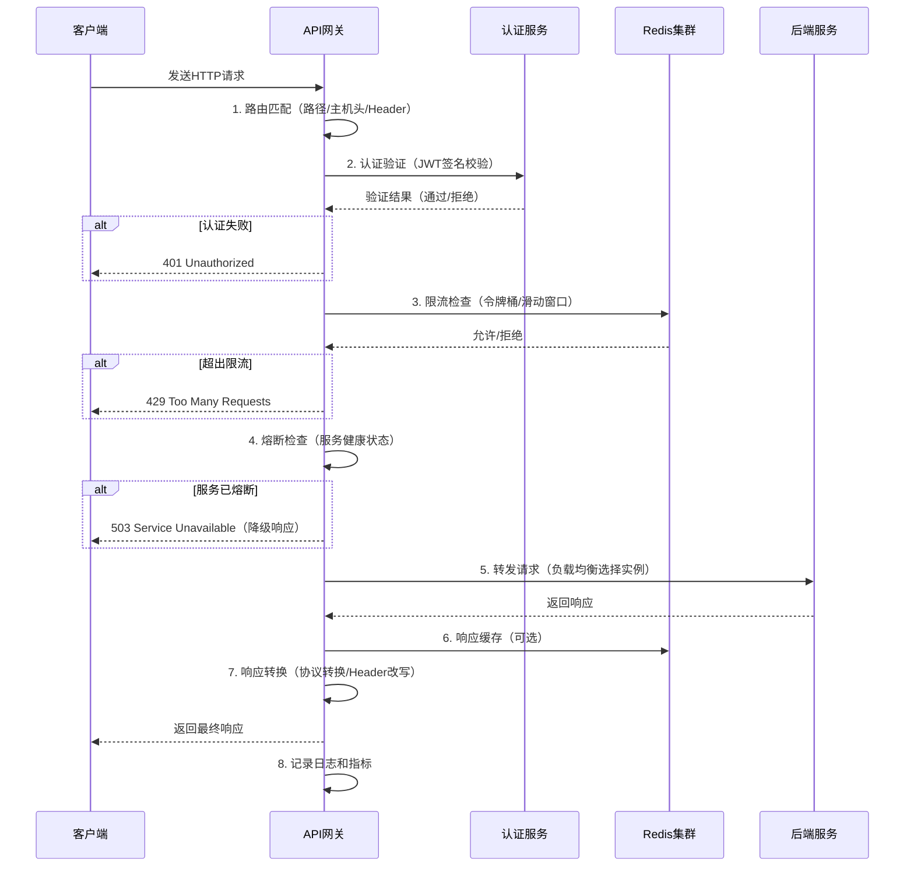

# 第57章 API网关 — 章节概览

## 本章定位

API网关（API Gateway）是微服务架构中最关键的基础设施组件之一。它作为所有客户端请求的统一入口，承担路由分发、身份验证、流量控制、协议转换、日志审计等一系列横切关注点（Cross-Cutting Concerns）的职责。在没有API网关的架构中，每个微服务都需要独立处理这些通用逻辑，导致大量重复开发、安全策略分散、运维复杂度飙升。

本章从"为什么需要API网关"出发，系统讲解API网关的核心功能、设计原理、主流实现方案和生产级最佳实践，最终通过Kong和APISIX两个开源网关的实战案例，帮助读者从理论到落地完整掌握API网关技术栈。

## 知识体系全景图

下图展示了本章内容的逻辑关系和学习路径：

```mermaid
graph TD
    subgraph 理论层["理论基础 — 理解原理"]
        T1["路由机制<br/>请求如何找到目标服务"]
        T2["认证授权<br/>如何验证身份与权限"]
        T3["限流策略<br/>如何保护后端不被压垮"]
        T4["熔断保护<br/>如何隔离故障防止雪崩"]
    end
    
    subgraph 技巧层["核心技巧 — 掌握实操"]
        S1["路径路由<br/>精确匹配/前缀/正则/变量提取"]
        S2["JWT验证<br/>签发/校验/刷新/撤销"]
        S3["令牌桶限流<br/>算法原理/分布式实现/Redis集成"]
    end
    
    subgraph 实战层["实战案例 — 落地部署"]
        P1["Kong实战<br/>基于Nginx+Lua的网关部署"]
        P2["APISIX实战<br/>基于etcd+Lua的云原生网关"]
    end
    
    subgraph 收尾["总结与提升"]
        E1["常见误区<br/>避坑指南"]
        E2["练习方法<br/>动手巩固"]
        E3["本章小结<br/>知识回顾"]
    end

    T1 --> S1
    T2 --> S2
    T3 --> S3
    S1 &amp; S2 &amp; S3 --> P1 &amp; P2
    P1 &amp; P2 --> E1 --> E2 --> E3
```

## 章节结构与内容导读

本章共包含以下内容板块，建议按顺序阅读，由理论到实践逐步深入：

### 一、理论基础（4篇）

理论基础板块是本章的知识根基，重点讲解API网关四大核心功能的原理与设计思想。每篇均包含原理讲解、算法分析、代码示例和性能对比。

| 篇目 | 核心内容 | 关键知识点 |
|------|----------|------------|
| 路由机制 | 请求如何精确到达目标服务 | 基于路径/主机头/请求头的路由策略，路由匹配算法（Trie树），优先级处理，路径重写与变量提取 |
| 认证授权 | 如何验证调用者身份与权限 | JWT/OAuth2/API Key/mTLS四种认证方式对比，Token生命周期管理，RBAC与ABAC授权模型 |
| 限流策略 | 如何防止突发流量击穿后端 | 固定窗口/滑动窗口/漏桶/令牌桶四种算法对比，分布式限流方案，限流粒度（用户/接口/IP/服务级） |
| 熔断保护 | 如何在部分服务故障时保障整体可用 | 熔断器状态机（关闭/打开/半开），Hystrix/resilience4j设计模式，服务降级与优雅降级策略 |

**阅读建议**：如果你已经熟悉某个功能的原理，可以快速浏览后直接进入对应的核心技巧部分。

### 二、核心技巧（3篇）

核心技巧板块将理论转化为可操作的代码实现，每篇都提供完整的代码示例和配置模板。

| 篇目 | 核心内容 | 产出物 |
|------|----------|--------|
| 路径路由 | 高性能路径匹配引擎的实现 | 路由配置模板、路径匹配算法代码、路径重写规则 |
| JWT验证 | 生产级JWT认证模块的完整实现 | JWT签发/验证/刷新/撤销代码、Token黑名单方案 |
| 令牌桶限流 | 可扩展的分布式限流方案 | 令牌桶算法实现、Redis集成代码、限流规则配置 |

**阅读建议**：这部分是动手实践的核心，建议边读边跑代码，每个示例都亲自动手验证。

### 三、实战案例（2篇）

实战案例板块通过两个主流开源网关的完整部署和配置，展示API网关在真实项目中的应用。

| 案例 | 网关选型 | 核心场景 |
|------|----------|----------|
| 案例一 | **Kong**（基于Nginx+Lua/OpenResty） | Docker Compose部署、路由配置、插件启用（限流/JWT/日志）、性能调优 |
| 案例二 | **APISIX**（基于etcd+Lua/Nginx） | Kubernetes部署、动态路由配置、自定义插件开发、与Prometheus/Grafana集成 |

**阅读建议**：两个案例各有侧重。Kong适合快速上手，APISIX适合云原生场景。建议至少完成一个案例的完整操作。

### 四、常见误区

本节总结了API网关设计和运维中最容易踩的10个坑，每个误区都配有错误示例和正确做法对照。包括但不限于：

- **单点故障**：网关本身的高可用设计
- **过度路由**：路由规则膨胀导致的性能退化
- **限流失效**：分布式场景下限流计数器不一致
- **认证绕过**：JWT验证中的常见安全漏洞
- **监控盲区**：缺少链路追踪导致的排查困难

### 五、练习方法

提供5个递进式练习，从基础概念理解到架构设计实战：

1. **基础理解**（30分钟）：画架构图、梳理核心概念
2. **动手实操**（60分钟）：搭建网关环境、配置路由和插件
3. **问题排查**（45分钟）：模拟故障、定位并修复
4. **性能优化**（60分钟）：压测、识别瓶颈、实施优化
5. **架构设计**（90分钟）：根据业务需求设计完整网关方案

### 六、本章小结

回顾全章核心知识点，提供关键公式与模型速查表、最佳实践清单，以及下一步学习方向的建议。

## 预备知识

在阅读本章之前，建议具备以下基础知识：

| 知识领域 | 具体要求 | 缺失时的建议 |
|----------|----------|-------------|
| HTTP协议 | 理解请求方法、状态码、Header机制 | 先阅读第20章HTTP协议基础 |
| 微服务架构 | 理解服务拆分、服务发现、负载均衡 | 先阅读第55章微服务架构 |
| 分布式系统 | 理解CAP理论、一致性模型、分布式锁 | 先阅读第54章分布式系统 |
| Linux基础 | 熟悉命令行操作、Docker使用 | 先阅读第10章Linux基础 |
| YAML/JSON | 能读懂配置文件 | 基础语法了解即可，不需要精通 |

## 学习路线图

根据你的基础和目标，推荐以下学习路线：

**路线一：快速上手（2-3小时）**
适合有微服务经验、需要快速搭建API网关的读者：

章节概览(本篇) → 核心技巧/路径路由 → 核心技巧/JWT验证
→ 实战案例/Kong实战 → 常见误区

**路线二：系统学习（6-8小时）**
适合希望全面掌握API网关的读者：

章节概览(本篇) → 理论基础/路由机制 → 理论基础/认证授权
→ 理论基础/限流策略 → 理论基础/熔断保护
→ 核心技巧/路径路由 → 核心技巧/JWT验证 → 核心技巧/令牌桶限流
→ 实战案例/Kong实战 → 实战案例/APISIX实战
→ 常见误区 → 练习方法 → 本章小结

**路线三：架构师视角（4-5小时）**
适合需要做技术选型和架构决策的读者：

章节概览(本篇) → 理论基础/全部4篇 → 实战案例/两个案例
→ 常见误区 → 本章小结

## 主流API网关方案对比

在深入学习本章内容之前，先了解市场上主流的API网关方案，有助于建立全局视角：

| 特性 | Kong | APISIX | Envoy | AWS API Gateway | Nginx |
|------|------|--------|-------|----------------|-------|
| 内核 | Nginx+Lua | Nginx+Lua | C++ | AWS托管 | Nginx |
| 配置中心 | PostgreSQL | etcd | xDS API | AWS控制台 | 文件/Consul |
| 动态路由 | 需reload | 实时生效 | 实时生效 | 实时生效 | 需reload |
| 插件机制 | Lua插件 | Lua+多语言 | Wasm/Filter | Lambda | Lua模块 |
| 学习曲线 | 中等 | 中等 | 低 | 低 | 低 |
| 社区活跃度 | 高 | 高 | 高 | — | 高 |
| 适用场景 | 通用微服务 | 云原生/Service Mesh | Service Mesh | AWS生态 | 传统Web |

**选型建议**：
- 如果你的技术栈以AWS为主，优先考虑AWS API Gateway
- 如果需要Service Mesh集成，Envoy是事实标准
- 如果追求动态配置和云原生，APISIX是首选
- 如果团队熟悉Nginx生态且需要丰富插件，Kong是稳妥之选

## 核心术语速查

阅读本章前，先熟悉以下关键术语：

| 术语 | 英文 | 含义 |
|------|------|------|
| API网关 | API Gateway | 微服务架构的统一入口，负责请求路由、认证、限流等 |
| 路由 | Routing | 根据请求特征（路径/主机头/Header）将请求分发到目标服务 |
| 限流 | Rate Limiting | 控制客户端在一定时间窗口内的请求次数，防止过载 |
| 熔断 | Circuit Breaker | 当后端服务故障率超过阈值时，暂时停止向其转发请求，防止雪崩 |
| 负载均衡 | Load Balancing | 将请求均匀分发到多个服务实例，避免单点过载 |
| 令牌桶 | Token Bucket | 一种限流算法，以恒定速率生成令牌，请求需要消耗令牌才能通过 |
| 漏桶 | Leaky Bucket | 一种限流算法，请求进入固定容量的队列，以恒定速率处理 |
| JWT | JSON Web Token | 一种紧凑的、URL安全的令牌格式，用于在各方之间安全传输声明 |
| OAuth2 | Open Authorization 2.0 | 一种授权框架，允许第三方应用获取有限的API访问权限 |
| mTLS | Mutual TLS | 双向TLS认证，客户端和服务器都需提供证书进行身份验证 |
| BFF | Backend for Frontend | 为特定前端定制的后端聚合层，常用于API网关的请求聚合场景 |
| 灰度发布 | Canary Release | 将新版本服务先暴露给小部分用户，观察无异常后再全量发布 |

## API网关的典型请求生命周期

理解一个请求在API网关中的完整流转路径，是后续学习各功能模块的基础：



## 本章数据与案例来源

本章的代码示例和配置模板基于以下真实项目和生产经验：

- **Kong Gateway 3.x** — 开源版Kong的最新稳定版本，全球超过10,000家企业使用
- **Apache APISIX 3.x** — Apache基金会顶级项目，CNCF云原生计算基金会成员
- **Envoy Proxy** — 由Lyft开发的高性能L7代理，Service Mesh数据平面事实标准
- **Netflix Hystrix** — 熔断器模式的开创性实现（已进入维护模式，但设计思想影响深远）
- **resilience4j** — Hystrix的轻量级替代品，Java生态熔断/限流的事实标准

## 如何使用本章

**对于初学者**：从本篇概览开始，按"路线一：快速上手"的顺序阅读，先跑通一个最小可用的网关，再回头补理论。

**对于有经验的开发者**：快速浏览本篇概览和理论基础部分，重点关注"核心技巧"和"实战案例"中的新知识点和生产级实践。

**对于架构师/技术负责人**：重点关注理论基础中的设计原理对比、常见误区中的反模式，以及实战案例中的架构决策和性能数据，这些对技术选型和架构评审最有价值。

**对于面试准备者**：本章涵盖了API网关设计、限流算法对比、熔断器状态机、JWT安全等高频面试考点，建议通读理论部分并能手写核心算法代码。
