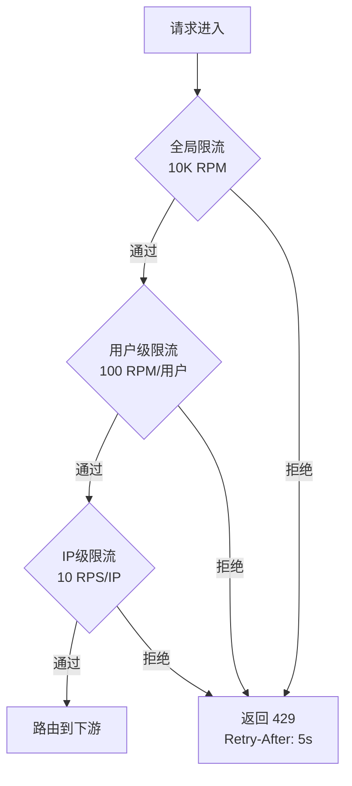
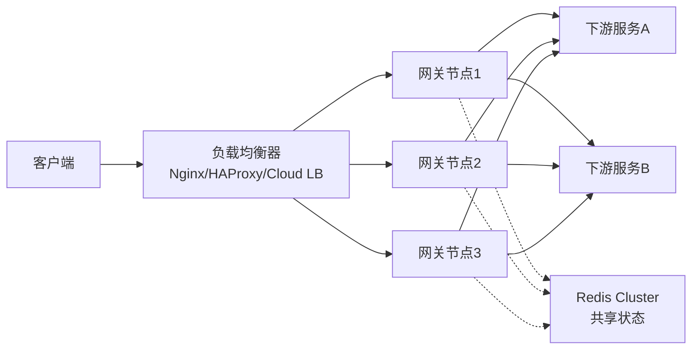
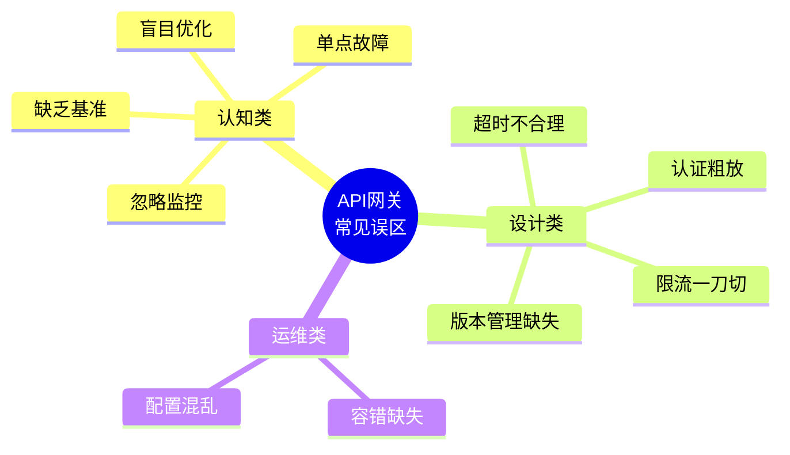

## API 网关常见误区与避坑指南

在 API 网关的设计、开发与运维实践中，团队往往因经验不足或认知偏差而陷入一些反复出现的误区。这些误区轻则导致性能下降、运维成本增加，重则引发线上故障甚至安全事故。本节系统梳理 API 网关领域最常见的十大误区，逐一剖析其成因、危害和纠正方法，帮助读者建立正确的认知框架。

---

### 误区一：忽略监控与可观测性

**典型表现**

许多团队在部署 API 网关时，只关注核心转发功能是否正常工作，却没有建立配套的监控体系。具体表现为：

- 没有采集网关的关键性能指标（延迟、吞吐量、错误率）
- 缺少分布式链路追踪，无法定位跨服务的性能瓶颈
- 告警规则缺失或过于粗放，问题发现严重滞后
- 日志没有结构化，排查问题时只能肉眼翻查原始日志

**为什么这是个误区**

API 网关是所有微服务流量的唯一入口，承担着路由、限流、认证、熔断等关键职责。一旦网关出现性能抖动或配置错误，所有下游服务都会受到影响。没有监控的网关就像一辆没有仪表盘的高速赛车——你不知道自己正在以多快的速度冲向悬崖。

**危害分析**

| 场景 | 缺少监控的后果 | 修复成本 |
|------|----------------|----------|
| 上游流量突增 | 无法及时感知，网关过载导致全站不可用 | 业务损失 + 排查时间 + 信誉损失 |
| 某条路由配置错误 | 错误请求无声无息地转发到下游，污染数据库 | 数据修复 + 回滚配置 |
| 慢查询拖垮网关 | P99 延迟飙升但无人知晓，用户体验持续恶化 | 用户流失 + 排查时间 |
| 限流阈值不合理 | 正常流量被误杀，或恶意流量未被拦截 | 线上事故 + 紧急调参 |

**正确做法：构建三层可观测性体系**

1. **指标（Metrics）**：使用 Prometheus 采集网关的核心指标，配合 Grafana 建立实时看板。关键指标包括：
   - `gateway_requests_total`：按路由、状态码、方法分组的请求总数
   - `gateway_request_duration_seconds`：请求延迟的直方图（P50/P95/P99）
   - `gateway_active_connections`：当前活跃连接数
   - `gateway_rate_limit_rejected_total`：被限流拒绝的请求数

2. **链路追踪（Tracing）**：集成 OpenTelemetry 或 Jaeger，为每个请求生成唯一 Trace ID，贯穿网关到下游服务的完整调用链。

3. **日志（Logging）**：所有访问日志结构化输出（JSON 格式），包含 Trace ID、路由名称、耗时、状态码等字段，接入 ELK 或 Loki 进行检索。

```yaml
# Kong 网关 Prometheus 插件配置示例
plugins:
  - name: prometheus
    config:
      per_consumer: true          # 按消费者统计
      status_code_metrics: true    # 按状态码统计
      latency_metrics: true        # 延迟分布
      bandwidth_metrics: true      # 带宽统计
      upstream_health_metrics: true # 上游健康状态
```

---

### 误区二：盲目过早优化

**典型表现**

项目初期就花费大量时间去优化网关的极致性能：

- 在日均 QPS 不到 100 的系统上纠结 epoll 和 io_uring 的选择
- 引入 Lua 脚本自定义网关逻辑，增加大量维护成本
- 花数周时间调优连接池参数，但系统瓶颈根本不在这里
- 为了追求微秒级延迟，放弃成熟方案而选择自研网关

**为什么这是个误区**

Donald Knuth 说过："过早优化是万恶之源。"在没有性能数据支撑的情况下盲目优化，往往是在错误的方向上浪费资源。真实的性能瓶颈可能根本不在网关层，而是在数据库查询、序列化反序列化、网络传输等其他环节。

**危害分析**

- **维护成本飙升**：自研或过度定制的网关逻辑难以维护，新人上手困难
- **功能迭代受阻**：性能优化占用大量开发时间，业务功能交付延迟
- **引入新风险**：非必要的复杂组件增加了故障点和攻击面
- **决策缺乏依据**：没有性能基线数据，优化方向可能是错的

**正确做法：数据驱动的渐进式优化**

1. **先有监控，再谈优化**：建立完整的指标采集体系（参考误区一），获取真实的性能基线数据。

2. **Profiler 定位瓶颈**：使用性能分析工具找到真正的热点路径：

```bash
# 使用 wrk 进行基准测试
wrk -t12 -c400 -d30s --latency http://localhost:8080/api/v1/users

# 使用 Go pprof 分析网关内存和 CPU 热点（以 Kong + Go 插件为例）
curl http://localhost:6060/debug/pprof/heap > heap.prof
go tool pprof heap.prof

# 使用 Flame Graph 可视化
go tool pprof -http=:8081 heap.prof
```

3. **遵循 80/20 法则**：集中精力优化那 20% 真正影响性能的代码路径，而不是全面铺开。

4. **设定明确目标**：优化前明确目标指标（如"P99 延迟从 50ms 降到 30ms"），优化后验证是否达标，达标即停止。

| 阶段 | QPS 范围 | 推荐策略 |
|------|----------|----------|
| 初创期 | < 1K | 使用成熟开源方案，不定制优化 |
| 增长期 | 1K-50K | 基于监控数据做针对性优化 |
| 规模期 | 50K-500K | 引入缓存、本地负载均衡、多级限流 |
| 超大规模 | > 500K | 考虑自研或深度定制网关内核 |

---

### 误区三：超时配置不合理

**典型表现**

- 超时时间设置过短：正常请求频繁超时，用户看到大量 504 错误
- 超时时间设置过长：下游服务故障时，网关线程被长时间阻塞，最终级联雪崩
- 所有路由使用同一个全局超时，没有根据业务特性差异化设置
- 只设置了网关到下游的超时，没有设置客户端到网关的超时

**为什么这是个误区**

超时是分布式系统中最关键的保护机制之一。不合理的超时配置会导致两种极端：要么过于激进导致正常请求失败，要么过于宽松导致故障蔓延。根据 Netflix 的工程实践经验，超时配置不当是微服务系统中引发级联故障的第一大原因。

**危害分析**

超时过短的场景：
  客户端 → [网关 3s超时] → [订单服务 8s处理]
  结果：所有订单请求超时，但订单服务其实在正常工作

超时过长的场景：
  客户端 → [网关 60s超时] → [支付服务已死，挂起60s]
  结果：60s内线程被占满，其他正常路由也无法服务

**正确做法：分层差异化超时设计**

```yaml
# Kong 路由级超时配置示例
services:
  - name: user-service
    connect_timeout: 5000      # 连接超时 5s
    write_timeout: 10000       # 写超时 10s
    read_timeout: 10000        # 读超时 10s
    retries: 2                 # 重试 2 次

  - name: payment-service
    connect_timeout: 3000      # 支付服务连接超时更严格
    write_timeout: 30000       # 但处理超时更宽松（涉及三方回调）
    read_timeout: 30000
    retries: 0                 # 支付服务不重试（避免重复扣款）

  - name: report-service
    connect_timeout: 5000
    write_timeout: 120000      # 报表生成需要更长时间
    read_timeout: 120000
    retries: 0                 # 长耗时操作不重试
```

**超时配置的核心原则**：

1. **超时时间 = 业务可容忍的最长等待时间**，而不是下游服务的处理时间
2. **遵循超时链**：客户端超时 > 网关超时 > 下游服务超时，每层递减至少 20%
3. **只读操作可重试，写操作谨慎重试**：幂等操作可以安全重试，非幂等操作重试可能导致数据不一致
4. **超时配合熔断**：超时只是第一道防线，还需要熔断器在连续超时时快速失败

---

### 误区四：认证授权设计过于粗放

**典型表现**

- 所有 API 使用同一个认证方式，没有区分公开接口和敏感接口
- JWT Token 没有过期机制，一旦泄露永久有效
- API Key 在前端代码中硬编码，随代码提交到公开仓库
- 授权粒度只有"有没有权限"，没有按角色、资源、操作维度细分
- 认证逻辑在每个微服务中重复实现，不统一由网关处理

**为什么这是个误区**

API 网关是安全防护的第一道关卡，认证授权设计不当意味着攻击者可以绕过安全控制直接访问内部服务。根据 OWASP API Security Top 10，"Broken Object Level Authorization"（BOLA）和"Broken Authentication"连续多年占据漏洞排名前两位。

**危害分析**

| 漏洞类型 | 具体危害 | 真实案例 |
|----------|----------|----------|
| 硬编码 API Key | 密钥泄露，攻击者可冒充合法用户 | 2019 年多个 Android 应用 API Key 泄露事件 |
| JWT 无过期 | Token 泄露后攻击者可长期持有访问权限 | 大量企业级应用的安全审计报告 |
| 认证逻辑分散 | 各服务实现不一致，部分接口完全无认证 | 微服务架构常见安全隐患 |
| 授权粒度不足 | 普通用户可访问管理员接口 | BOLA 漏洞占 API 漏洞的 40% |

**正确做法：构建纵深防御体系**

```yaml
# Kong 认证插件配置示例
plugins:
  # 全局限流 + 认证
  - name: rate-limiting
    config:
      minute: 100
      policy: redis

  # JWT 认证（全局）
  - name: jwt
    config:
      claims_to_verify:
        - exp           # 强制过期检查
        - nbf           # 生效时间检查
      key_claim_name: iss
      secret_is_base64: false

# 特定敏感路由的额外安全措施
routes:
  - name: admin-users-delete
    paths: ["/api/v1/admin/users/*/delete"]
    plugins:
      # 要求 OAuth2 scope
      - name: oauth2
        config:
          scopes: ["admin:delete"]
      # IP 白名单
      - name: ip-restriction
        config:
          allow: ["10.0.0.0/8", "172.16.0.0/12"]
```

**最佳实践清单**：

1. **统一认证入口**：所有认证逻辑集中在网关层处理，下游服务只信任网关传递的认证信息
2. **最小权限原则**：每个 API 只开放必要的最小权限范围
3. **Token 生命周期管理**：设置合理的过期时间，实现 Token 刷新机制
4. **敏感操作二次验证**：高风险操作（删除、支付、修改密码）要求二次认证
5. **审计日志**：所有认证失败和授权拒绝都必须记录审计日志

---

### 误区五：限流策略一刀切

**典型表现**

- 对所有 API 使用相同的限流阈值，不区分业务优先级
- 只做单机限流，不做分布式限流，在多节点部署时限流失效
- 限流后的响应只有 429 状态码，没有提供 Retry-After 头信息
- 没有区分正常用户和恶意爬虫，导致正常用户被限流影响
- 限流阈值设置后从不调整，随着业务增长或流量模式变化而失效

**为什么这是个误区**

限流的本质是保护系统不被过载。但"一刀切"的限流策略无法适应真实的业务场景：核心交易 API 和日志上报 API 的重要性完全不同，高峰期和低谷期的流量差异可达数十倍。不分场景地使用同一套限流规则，要么导致核心业务被误杀，要么让非核心业务占用过多资源。

**正确做法：多维度精细化限流**

```yaml
# Kong 多级限流配置示例
plugins:
  # 全局基础限流
  - name: rate-limiting
    config:
      minute: 10000
      policy: redis
      redis_host: redis-cluster.local
      fault_tolerant: false    # Redis不可用时直接拒绝（安全优先）

  # 用户级限流（防止单用户滥用）
  - name: rate-limiting
    config:
      minute: 100
      policy: redis
      limit_by: consumer       # 按消费者限流

  # IP 级限流（防止恶意爬虫）
  - name: rate-limiting
    config:
      second: 10
      policy: local            # IP限流用本地计数器即可
```



**限流策略矩阵**：

| 维度 | 适用场景 | 实现方式 | 典型阈值 |
|------|----------|----------|----------|
| 全局限流 | 保护网关整体容量 | Redis 集中计数 | 10K-100K RPM |
| 用户级限流 | 防止单用户过度占用 | Redis + Consumer ID | 50-500 RPM |
| IP 级限流 | 防止爬虫和 DDoS | 本地令牌桶 | 5-20 RPS |
| 路由级限流 | 保护关键下游服务 | Redis + Route ID | 按下游能力设定 |
| 业务级限流 | 区分核心/非核心 API | Redis + Header 标记 | 差异化设置 |

**限流后的响应规范**：

HTTP/1.1 429 Too Many Requests
Content-Type: application/json
Retry-After: 5
X-RateLimit-Limit: 100
X-RateLimit-Remaining: 0
X-RateLimit-Reset: 1719403200

{
  "error": "rate_limit_exceeded",
  "message": "请求频率超过限制，请稍后重试",
  "retry_after": 5
}

---

### 误区六：容错设计缺失

**典型表现**

- 下游服务完全不可用时，网关返回 502/503 错误，没有任何降级策略
- 没有实现熔断器，一个慢服务拖垮整个网关
- 重试策略不当，对非幂等操作盲目重试导致数据不一致
- 没有实现服务发现，服务实例下线后网关仍然向其转发流量

**为什么这是个误区**

微服务架构的核心假设是"部分失败是常态"。下游服务可能因为网络波动、部署重启、资源耗尽等原因随时变得不可用或响应缓慢。如果网关没有容错机制，单个服务的故障会通过网关扩散到所有依赖方，形成雪崩效应。

根据 Amazon 的公开数据，在大规模微服务系统中，单个请求的失败概率 = 1 - (1 - p)^n（p 为单个依赖的失败概率，n 为依赖数量）。当 n=100、p=0.1% 时，请求失败概率高达 9.5%。

**正确做法：实现完整的容错体系**

```yaml
# APISIX 熔断+重试配置示例
plugins:
  proxy-rewrite:
    retries: 2
    retry_timeout: 5
    retry_on:
      - http_502
      - http_503
      - http_504
      - connect_error

  # 熔断器（通过 fault-injection 模拟 + upstream 健康检查实现）
upstreams:
  - name: order-service
    type: roundrobin
    checks:
      active:
        http_path: /health
        healthy:
          interval: 5
          successes: 2
        unhealthy:
          interval: 2
          http_failures: 3
          tcp_failures: 3
          timeouts: 3
```

**容错模式全景**：

| 模式 | 作用 | 实现要点 | 适用场景 |
|------|------|----------|----------|
| 超时（Timeout） | 限制等待时间 | 设置合理的超时阈值 | 所有外部调用 |
| 重试（Retry） | 应对临时故障 | 仅重试幂等操作，指数退避 | 读操作、幂等写操作 |
| 熔断（Circuit Breaker） | 快速失败 | 连续失败 N 次后打开，定期半开探测 | 所有下游调用 |
| 降级（Fallback） | 保底方案 | 返回缓存数据或默认值 | 非核心功能 |
| 隔离（Bulkhead） | 限制爆炸半径 | 按服务/路由限制并发数 | 多下游服务场景 |
| 舱壁（Isolation） | 资源隔离 | 独立线程池/连接池 | 关键业务隔离 |

---

### 误区七：配置管理混乱

**典型表现**

- 网关配置通过修改本地文件 + 重启实现，每次变更需要停服
- 多个环境（dev/staging/prod）的配置通过手动复制同步，容易遗漏
- 配置变更没有版本控制和回滚机制，改错了无法恢复
- 不同团队各自修改网关配置，缺乏统一的审批和发布流程
- 配置项分散在多个文件中，没有统一的配置管理平台

**为什么这是个误区**

API 网关的配置直接决定了流量的路由规则、安全策略和限流参数。配置管理混乱意味着每次变更都是高风险操作。根据 PagerDuty 的统计，配置变更引发的故障占生产环境事故总数的 35% 以上。

**正确做法：配置即代码（Configuration as Code）**

```yaml
# 使用 GitOps 管理网关配置（以 APISIX + Git 为例）
# 1. 所有配置存储在 Git 仓库中
# 2. 配置变更通过 Pull Request 审批
# 3. 合并后自动同步到网关集群

# config/production/routes.yaml
routes:
  - uri: /api/v1/users/*
    upstream:
      nodes:
        "user-service:8080": 1
    plugins:
      jwt-auth:
        consumer: user-consumer
      limit-req:
        rate: 100
        burst: 20

# config/staging/routes.yaml（测试环境使用更宽松的限流）
routes:
  - uri: /api/v1/users/*
    upstream:
      nodes:
        "user-service:8080": 1
    plugins:
      jwt-auth:
        consumer: user-consumer
      limit-req:
        rate: 1000    # 测试环境限流宽松
        burst: 200
```

**配置管理最佳实践**：

1. **版本控制**：所有配置文件纳入 Git 管理，每次变更有完整的提交记录和变更说明
2. **自动化同步**：使用 CI/CD 流水线将配置变更自动部署到目标环境，避免手动操作
3. **灰度发布**：配置变更先在少量实例上验证，确认无误后全量推送
4. **一键回滚**：保留最近 N 个版本的配置快照，出问题时秒级回滚
5. **配置审计**：记录所有配置变更的时间、操作人、变更内容，支持事后审计

---

### 误区八：忽视 API 版本管理

**典型表现**

- API 没有版本号，接口变更直接修改现有 API
- 版本号放在 Header 中，不直观且不易调试
- 旧版本 API 不维护、不兼容，强制所有客户端同时升级
- 多个版本的 API 同时运行但共用相同的下游服务，导致维护困难

**为什么这是个误区**

API 是网关与客户端之间的契约。不管理版本意味着任何接口变更都可能破坏现有客户端的功能。对于移动端应用（用户可能不会立即更新）和第三方集成方（无法控制其升级节奏），这种破坏性影响尤为严重。

**正确做法：URL 路径版本化 + 共存策略**

```yaml
# Kong API 版本管理示例
services:
  # V1 版本（维护模式）
  - name: user-service-v1
    url: http://user-service:8080
    routes:
      - paths: ["/api/v1/users"]
        plugins:
          - name: request-transformer
            config:
              add:
                headers: ["X-API-Version: v1"]

  # V2 版本（活跃开发）
  - name: user-service-v2
    url: http://user-service-v2:8080
    routes:
      - paths: ["/api/v2/users"]
```

**版本管理策略对比**：

| 策略 | 实现方式 | 优点 | 缺点 |
|------|----------|------|------|
| URL 路径版本 | `/api/v1/users` | 直观、易调试、易缓存 | URL 变动大 |
| Header 版本 | `Accept: application/vnd.api.v1+json` | URL 干净 | 不直观、调试困难 |
| Query 参数版本 | `/api/users?version=1` | 简单 | 难以缓存、语义不清 |
| 内容协商 | `Accept` 头协商版本 | RESTful 正统 | 实现复杂 |

**推荐策略**：对大多数团队来说，URL 路径版本是最务实的选择。简单、直观、工具链支持好。

---

### 误区九：部署架构单点故障

**典型表现**

- 只部署了一个网关实例，挂掉后所有 API 不可用
- 网关与下游服务部署在同一个可用区，机房故障时一起挂
- 没有健康检查和自动摘除机制，故障实例持续接收流量
- 网关进程没有配置优雅退出，重启时正在处理的请求被强制中断

**为什么这是个误区**

单点故障（Single Point of Failure）是分布式系统设计中的大忌。API 网关作为流量入口，一旦不可用意味着整个微服务体系对外不可达。根据 Gartner 的报告，API 网关故障造成的业务损失平均为每小时 30 万美元。

**正确做法：高可用部署架构**



**高可用部署清单**：

1. **至少 3 个网关节点**：满足 N+2 冗余，任意一个节点故障不影响服务
2. **跨可用区部署**：网关节点分布在不同的可用区，抵御机房级故障
3. **前端负载均衡**：使用 L4/L7 负载均衡器分发流量，支持健康检查和自动摘除
4. **共享状态外置**：限流计数器、会话数据等共享状态存储在 Redis 集群中，避免节点间状态不一致
5. **优雅退出（Graceful Shutdown）**：收到终止信号后停止接收新请求，等待现有请求处理完毕后再退出

```bash
# Kong 优雅退出配置
# kong.conf
nginx_main_worker_shutdown = graceful

# 系统服务配置
[Service]
ExecStop=/bin/kill -SIGQUIT $MAINPID
TimeoutStopSec=30
```

---

### 误区十：忽视性能基准测试

**典型表现**

- 上线前没有进行压力测试，不清楚网关的容量上限
- 使用 `curl` 或 Postman 手动测试代替专业的压测工具
- 测试环境与生产环境配置差异大，测试结果不可靠
- 压测只关注吞吐量，忽略延迟分布和错误率
- 没有建立持续的性能基准（Performance Baseline），无法感知性能退化

**为什么这是个误区**

不进行性能测试就像在不知道桥梁承重限制的情况下让卡车过桥——你不知道什么时候会坍塌。更重要的是，没有性能基线就无法判断后续的代码变更或配置调整是否引入了性能退化。

**正确做法：建立完整的性能测试体系**

```bash
# 1. 基准测试脚本（使用 wrk）
#!/bin/bash
# benchmark.sh

echo "=== API Gateway Benchmark ==="
echo "Target: ${1:-http://localhost:8080}"
echo "Duration: 30s"

# 阶梯式加压
for concurrent in 50 100 200 500 1000; do
    echo ""
    echo "--- Concurrency: $concurrent ---"
    wrk -t4 -c$concurrent -d30s --latency \
        -s ./scripts/post.lua \
        "${1:-http://localhost:8080}/api/v1/users"
done

# 2. 混合场景测试（使用 k6）
```

```javascript
// k6 混合场景测试脚本
import http from 'k6/http';
import { check, sleep } from 'k6';

export const options = {
  stages: [
    { duration: '1m', target: 100 },   // 1分钟内爬升到100用户
    { duration: '5m', target: 100 },   // 保持100用户5分钟
    { duration: '1m', target: 500 },   // 1分钟内爬升到500用户
    { duration: '5m', target: 500 },   // 保持500用户5分钟（压力测试）
    { duration: '2m', target: 0 },     // 2分钟内降到0
  ],
  thresholds: {
    http_req_duration: ['p(99)<200'],    // P99延迟 < 200ms
    http_req_failed: ['rate<0.01'],      // 错误率 < 1%
  },
};

export default function () {
  // 模拟真实流量分布：读多写少
  const scenarios = [
    { method: 'GET', url: 'http://localhost:8080/api/v1/users', weight: 70 },
    { method: 'POST', url: 'http://localhost:8080/api/v1/orders', weight: 20 },
    { method: 'DELETE', url: 'http://localhost:8080/api/v1/sessions', weight: 10 },
  ];

  const rand = Math.random() * 100;
  let cumulative = 0;
  let selected;

  for (const s of scenarios) {
    cumulative += s.weight;
    if (rand <= cumulative) { selected = s; break; }
  }

  const res = http.request(selected.method, selected.url);
  check(res, {
    'status is 2xx': (r) => r.status >= 200 &amp;&amp; r.status < 300,
    'latency < 200ms': (r) => r.timings.duration < 200,
  });

  sleep(1);
}
```

**性能测试关键指标**：

| 指标 | 含义 | 目标参考值 | 告警阈值 |
|------|------|------------|----------|
| Throughput (RPS) | 每秒请求数 | 依据业务需求 | 低于基线 20% |
| P50 延迟 | 50% 请求的延迟上界 | < 10ms | 超过基线 50% |
| P95 延迟 | 95% 请求的延迟上界 | < 50ms | 超过基线 100% |
| P99 延迟 | 99% 请求的延迟上界 | < 200ms | 超过基线 200% |
| Error Rate | 错误请求比例 | < 0.1% | > 1% |
| CPU Usage | 网关节点 CPU 使用率 | < 70% | > 85% |
| Memory Usage | 网关节点内存使用率 | < 80% | > 90% |

---

### 总结：避坑路线图

API 网关的常见误区可以归纳为三大类：

1. **认知类误区**（误区一、二、九、十）：缺乏对可观测性、性能优化、高可用和基准测试的重视。这类误区的根源是经验不足，解决方法是建立正确的认知框架。

2. **设计类误区**（误区三、四、五、八）：超时、认证、限流、版本管理的设计不当。这类误区的根源是缺乏系统性的设计思维，解决方法是参考业界最佳实践并结合业务特点做出合理决策。

3. **运维类误区**（误区六、七）：容错和配置管理的缺失。这类误区的根源是重开发轻运维，解决方法是将运维实践内化到开发流程中。



避开这些误区不是一次性的工作，而是需要在团队中持续推广的工程文化。建议团队定期进行 API 网关的健康检查，对照本节的清单逐项审查，发现问题及时纠正，逐步构建一个安全、可靠、高性能的 API 网关体系。
