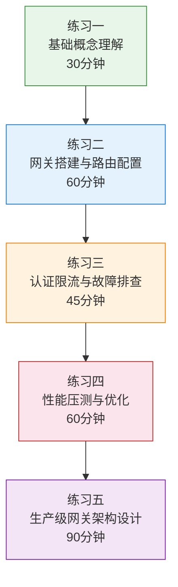
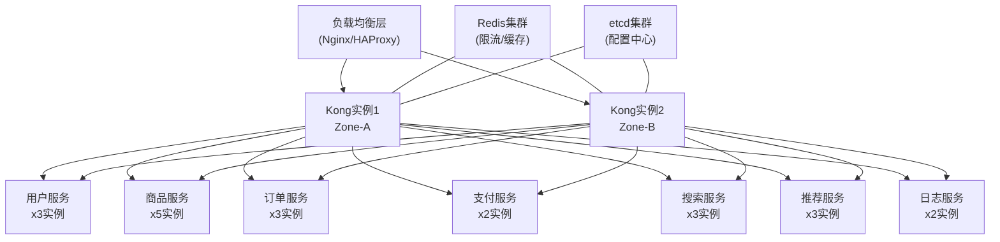

## 练习方法

本章提供了五个递进式练习，从概念理解到架构设计，逐步深化对API网关的掌握。每个练习都基于本章讲解的真实工具（Kong、APISIX）和技术（JWT、令牌桶限流、熔断器），你可以直接动手操作而非纸上谈兵。建议按照顺序完成，每个练习完成后对照检查标准自评，确保真正掌握再进入下一个。



---

### 练习一：基础概念理解（预计30分钟）

**目标**：能够清晰描述API网关在微服务架构中的定位，画出请求完整生命周期的流转图，并用自己的话解释路由、认证、限流、熔断四大核心功能的工作原理。

**前置准备**：阅读本章00-章节概览、理论基础四篇（路由机制、认证授权、限流策略、熔断保护）。

#### 步骤1：画出API网关的请求生命周期（10分钟）

在纸上或使用Mermaid工具，画出一个HTTP请求从客户端发出到收到响应的完整流转路径。你的图中必须包含以下关键环节：

客户端请求
    │
    ▼
┌─────────────────────┐
│   1. 路由匹配        │  ← 根据路径/方法/Header找到目标服务
│   2. 认证验证        │  ← JWT/API Key/OAuth2身份校验
│   3. 限流检查        │  ← 令牌桶/滑动窗口判断是否超限
│   4. 熔断判断        │  ← 检查目标服务的健康状态
│   5. 转发请求        │  ← 负载均衡选择实例并转发
│   6. 响应处理        │  ← 协议转换/Header改写/缓存
│   7. 日志与监控      │  ← 记录请求指标和链路追踪
└─────────────────────┘
    │
    ▼
客户端响应

**自检要点**：
- 是否标注了每个环节的输入和输出（如路由匹配的输入是请求特征，输出是目标服务地址）
- 是否标注了失败路径（认证失败返回401、限流拒绝返回429、熔断打开返回503）
- 是否理解为什么这些环节必须按此顺序执行（如认证必须在限流之前，否则攻击者可以用大量未认证请求耗尽限流配额）

#### 步骤2：梳理四大核心功能的原理对比（10分钟）

填写以下对比表，用自己的话而非复制原文：

| 功能 | 解决什么问题 | 核心算法/机制 | 类比（用生活中的例子解释） |
|------|-------------|--------------|--------------------------|
| 路由 | | | |
| 认证授权 | | | |
| 限流 | | | |
| 熔断 | | | |

**填写提示**：
- 路由：参考理论基础/路由机制中的Trie树匹配、多维度匹配（路径/Header/方法）
- 认证授权：参考理论基础/认证授权中的JWT签发验证流程、OAuth2授权码模式
- 限流：参考理论基础/限流策略中的四种算法对比（固定窗口/滑动窗口/漏桶/令牌桶）
- 熔断：参考理论基础/熔断保护中的状态机（关闭→打开→半开）

#### 步骤3：用自己的话解释关键场景（10分钟）

对以下三个场景，分别写出2-3句话的解释，说明API网关在其中扮演的角色：

1. **场景A**：电商平台大促期间，某商品详情页API突然涌入10倍流量
2. **场景B**：微服务架构中，用户服务因数据库故障完全不可用
3. **场景C**：第三方开发者通过开放平台API接入，需要限制其调用频率

**检查标准**：
- [ ] 能画出包含7个环节的完整请求生命周期图
- [ ] 能清晰解释四大核心功能的原理和适用场景
- [ ] 能用生活类比说明每个功能的作用
- [ ] 能针对具体场景说明网关的处理流程

---

### 练习二：Kong网关搭建与路由配置（预计60分钟）

**目标**：独立完成Kong网关的本地部署、路由规则配置和基本转发验证，掌握从零搭建可用API网关的全过程。

**前置准备**：确保本地已安装Docker和Docker Compose。

#### 步骤1：部署Kong网关（20分钟）

使用Docker Compose部署Kong及其依赖的PostgreSQL数据库：

```yaml
# docker-compose.yml
version: '3.8'

services:
  kong-database:
    image: postgres:15
    container_name: kong-database
    environment:
      POSTGRES_DB: kong
      POSTGRES_USER: kong
      POSTGRES_PASSWORD: kongpass
    volumes:
      - kong-database-data:/var/lib/postgresql/data
    healthcheck:
      test: ["CMD-SHELL", "pg_isready -U kong"]
      interval: 10s
      timeout: 5s
      retries: 5

  kong-migration:
    image: kong:3.9
    command: kong migrations bootstrap
    depends_on:
      kong-database:
        condition: service_healthy
    environment:
      KONG_DATABASE: postgres
      KONG_PG_HOST: kong-database
      KONG_PG_USER: kong
      KONG_PG_PASSWORD: kongpass

  kong:
    image: kong:3.9
    container_name: kong
    depends_on:
      kong-database:
        condition: service_healthy
      kong-migration:
        condition: service_completed_successfully
    environment:
      KONG_DATABASE: postgres
      KONG_PG_HOST: kong-database
      KONG_PG_USER: kong
      KONG_PG_PASSWORD: kongpass
      KONG_PROXY_ACCESS_LOG: /dev/stdout
      KONG_ADMIN_ACCESS_LOG: /dev/stdout
      KONG_PROXY_ERROR_LOG: /dev/stderr
      KONG_ADMIN_ERROR_LOG: /dev/stderr
      KONG_PROXY_LISTEN: "0.0.0.0:8000, 0.0.0.0:8443 ssl"
      KONG_ADMIN_LISTEN: "0.0.0.0:8001"
    ports:
      - "8000:8000"    # 代理端口
      - "8443:8443"    # 代理SSL端口
      - "8001:8001"    # 管理API端口

volumes:
  kong-database-data:
```

部署并验证：

```bash
# 启动服务
docker compose up -d

# 等待Kong完全启动（约30秒）
sleep 30

# 验证Kong管理API可用
curl -s http://localhost:8001/status | python3 -m json.tool

# 预期输出应包含：
# "database": { "reachable": true }
# "server": { "connections_active": 0 }
```

**常见问题排查**：
- 如果Kong启动失败，用 `docker compose logs kong` 查看日志
- 常见原因：数据库未就绪（增加healthcheck等待时间）、端口冲突（修改映射端口）
- 如果 `kong migrations bootstrap` 失败，需要先删除旧数据卷：`docker compose down -v`

#### 步骤2：启动模拟后端服务（10分钟）

启动一个简单的HTTP服务作为后端，用于验证路由转发：

```bash
# 使用Python快速启动一个模拟后端
python3 -c "
from http.server import HTTPServer, BaseHTTPRequestHandler
import json

class Handler(BaseHTTPRequestHandler):
    def do_GET(self):
        self.send_response(200)
        self.send_header('Content-Type', 'application/json')
        self.end_headers()
        response = {
            'service': 'user-service',
            'path': self.path,
            'method': 'GET',
            'headers': dict(self.headers)
        }
        self.wfile.write(json.dumps(response, indent=2).encode())

    def do_POST(self):
        content_length = int(self.headers.get('Content-Length', 0))
        body = self.rfile.read(content_length) if content_length else b''
        self.send_response(200)
        self.send_header('Content-Type', 'application/json')
        self.end_headers()
        response = {
            'service': 'user-service',
            'path': self.path,
            'method': 'POST',
            'body': body.decode() if body else None
        }
        self.wfile.write(json.dumps(response, indent=2).encode())

    def log_message(self, format, *args):
        print(f'[Backend] {args[0]}')

HTTPServer(('0.0.0.0', 9000), Handler).serve_forever()
" &amp;
```

验证后端可用：

```bash
curl http://localhost:9000/api/v1/users
# 应返回JSON，包含 "path": "/api/v1/users"
```

#### 步骤3：配置路由规则（20分钟）

通过Kong Admin API逐步配置服务、路由和插件：

```bash
# 1. 创建Service——声明后端服务地址
curl -i -X POST http://localhost:8001/services/ \
  --data name=user-service \
  --data url=http://host.docker.internal:9000

# 2. 创建Route——将特定路径映射到该服务
curl -i -X POST http://localhost:8001/services/user-service/routes \
  --data name=user-api-v1 \
  --data 'paths[]=/api/v1/users' \
  --data 'methods[]=GET' \
  --data 'methods[]=POST' \
  --data 'strip_path=false'

# 3. 验证路由转发是否生效
curl -s http://localhost:8000/api/v1/users | python3 -m json.tool
# 预期：返回后端服务的响应，path字段为"/api/v1/users"

# 4. 创建第二条路由——模拟API版本共存
curl -i -X POST http://localhost:8001/services/user-service/routes \
  --data name=user-api-v2 \
  --data 'paths[]=/api/v2/users' \
  --data 'methods[]=GET' \
  --data 'strip_path=false'

# 5. 通过不同路径验证版本路由
curl -s http://localhost:8000/api/v1/users | python3 -m json.tool
curl -s http://localhost:8000/api/v2/users | python3 -m json.tool

# 6. 测试不存在的路由（应返回404）
curl -s -o /dev/null -w "%{http_code}" http://localhost:8000/api/v3/users
# 预期：404
```

**进阶挑战**：配置路径重写，将 `/api/v1/users` 重写为 `/users` 转发给后端：

```bash
# 添加request-transformer插件实现路径重写
curl -i -X POST http://localhost:8001/services/user-service/plugins \
  --data name=request-transformer-advanced \
  --data 'config.replace.uri=/users'

# 验证重写效果
curl -s http://localhost:8000/api/v1/users | python3 -m json.tool
# 预期：后端收到的path应该是 "/users" 而非 "/api/v1/users"
```

#### 步骤4：验证与记录（10分钟）

整理你的实验结果，回答以下问题：

1. Kong的Service、Route、Plugin三者的关系是什么？（建议画图说明）
2. 当路由匹配失败时，Kong返回什么状态码？如何自定义这个行为？
3. `strip_path=false` 和 `strip_path=true` 的区别是什么？分别在什么场景下使用？

**检查标准**：
- [ ] Kong网关成功启动，管理API可访问
- [ ] 模拟后端服务正常运行
- [ ] 至少配置了2条路由规则并验证转发正确
- [ ] 理解Service/Route/Plugin的关系模型
- [ ] 完成了路径重写的进阶挑战（加分项）

---

### 练习三：JWT认证、限流配置与故障排查（预计45分钟）

**目标**：在已部署的Kong网关上配置JWT认证和限流插件，模拟常见故障并学会排查。将理论基础中的安全和限流知识转化为实操能力。

**前置条件**：已完成练习二，Kong网关和模拟后端正在运行。

#### 步骤1：配置JWT认证（15分钟）

```bash
# 1. 创建Consumer（代表一个API使用者）
curl -i -X POST http://localhost:8001/consumers \
  --data username=app-frontend \
  --data custom_id=frontend-app-001

# 2. 为Consumer创建JWT凭证
curl -i -X POST http://localhost:8001/consumers/app-frontend/jwt \
  --data algorithm=HS256 \
  --data key=my-app-key

# 记下输出中的 "secret" 值，后续签名时需要

# 3. 启用JWT插件
curl -i -X POST http://localhost:8001/routes/user-api-v1/plugins \
  --data name=jwt

# 4. 测试未认证请求（应返回401）
curl -s -o /dev/null -w "%{http_code}" http://localhost:8000/api/v1/users
# 预期：401

# 5. 生成JWT Token并测试认证通过
# 使用Python生成JWT
python3 -c "
import jwt, time

# 从上一步获取的secret填入此处
secret = 'YOUR_SECRET_HERE'

payload = {
    'iss': 'my-app-key',      # 签发者，对应JWT凭证的key
    'sub': 'user-12345',      # 用户ID
    'exp': int(time.time()) + 3600,  # 1小时后过期
    'iat': int(time.time()),  # 签发时间
}
token = jwt.encode(payload, secret, algorithm='HS256')
print(token)
"

# 6. 使用Token访问API（应返回200）
curl -s -H 'Authorization: Bearer <上一步生成的token>' \
  http://localhost:8000/api/v1/users | python3 -m json.tool
```

**排查练习**：如果返回401，检查以下常见原因：
- `iss` 字段是否与创建JWT凭证时的 `key` 一致
- `exp` 是否已过期
- Token格式是否正确（`Bearer ` 前缀 + 空格）

#### 步骤2：配置多级限流（15分钟）

```bash
# 1. 为路由添加基础限流——每分钟60次
curl -i -X POST http://localhost:8001/routes/user-api-v1/plugins \
  --data name=rate-limiting \
  --data config.minute=60 \
  --data config.policy=local \
  --data config.fault_tolerant=true

# 2. 通过循环请求触发限流
for i in $(seq 1 65); do
  code=$(curl -s -o /dev/null -w "%{http_code}" \
    -H "Authorization: Bearer <your-token>" \
    http://localhost:8000/api/v1/users)
  echo "请求 $i: 状态码 $code"
done

# 预期：前60次返回200，之后返回429

# 3. 检查限流相关的响应头
curl -s -D- -H "Authorization: Bearer <your-token>" \
  http://localhost:8000/api/v1/users 2>/dev/null | head -20

# 关注以下Header：
# RateLimit-Limit: 60        ← 窗口内允许的总请求数
# RateLimit-Remaining: 42    ← 剩余可用请求数
# RateLimit-Reset: 1234567   ← 窗口重置的Unix时间戳
# Retry-After: 30            ← 被限流后建议等待的秒数
```

**限流响应解读**：当收到429时，响应体通常包含：

```json
{
  "message": "API rate limit exceeded",
  "request_id": "abc123"
}
```

#### 步骤3：模拟故障并排查（15分钟）

按照以下步骤模拟三种常见故障，并使用诊断工具定位问题：

**故障1：后端服务不可用**

```bash
# 停止后端服务
kill %1  # 杀掉后台运行的Python服务

# 访问API，观察Kong返回什么
curl -s http://localhost:8000/api/v1/users | python3 -m json.tool
# 预期：502 Bad Gateway

# 排查步骤：
# 1. 检查Kong的upstream健康状态
curl -s http://localhost:8001/upstreams/user-service/healthchecks/history

# 2. 查看Kong错误日志
docker compose logs kong --tail=20

# 3. 恢复后端服务，确认自动恢复
python3 -c "
from http.server import HTTPServer, BaseHTTPRequestHandler
import json
class H(BaseHTTPRequestHandler):
    def do_GET(self):
        self.send_response(200)
        self.send_header('Content-Type','application/json')
        self.end_headers()
        self.wfile.write(json.dumps({'status':'recovered'}).encode())
    def log_message(self, f, *a): pass
HTTPServer(('0.0.0.0',9000),H).serve_forever()
" &amp;

sleep 5  # 等待健康检查通过
curl -s http://localhost:8000/api/v1/users
# 预期：200 OK
```

**故障2：路由配置错误**

```bash
# 删除已有的路由，模拟路由丢失
curl -i -X DELETE http://localhost:8001/routes/user-api-v1

# 访问API
curl -s -o /dev/null -w "%{http_code}" http://localhost:8000/api/v1/users
# 预期：404

# 排查：列出当前所有路由
curl -s http://localhost:8001/routes | python3 -m json.tool
# 发现缺少预期的路由，重新创建即可
```

**故障3：认证插件配置异常**

```bash
# 禁用JWT插件（模拟插件配置错误导致认证失效）
curl -i -X DELETE http://localhost:8001/routes/user-api-v1/plugins/<plugin-id>

# 此时不带Token也能访问API（安全隐患！）
curl -s -o /dev/null -w "%{http_code}" http://localhost:8000/api/v1/users
# 预期：200（本应返回401，说明认证丢失）

# 排查：检查路由上挂载的插件列表
curl -s http://localhost:8001/routes/user-api-v1/plugins | python3 -m json.tool

# 修复：重新启用JWT插件
curl -i -X POST http://localhost:8001/routes/user-api-v1/plugins \
  --data name=jwt
```

**检查标准**：
- [ ] JWT认证成功配置，401和200两种场景都验证通过
- [ ] 限流插件生效，能观察到429响应和相关Header
- [ ] 能排查后端不可用（502）、路由丢失（404）、插件异常三种故障
- [ ] 能使用Kong Admin API查看路由、插件、上游健康状态

---

### 练习四：性能压测与优化（预计60分钟）

**目标**：使用wrk对Kong网关进行基准性能测试，识别性能瓶颈并实施针对性优化，建立数据驱动的性能优化思维。

**前置条件**：Kong网关和模拟后端正常运行，已安装wrk（`apt-get install wrk` 或 `brew install wrk`）。

#### 步骤1：建立性能基线（15分钟）

```bash
# 1. 确认后端服务单机性能（不经过网关）
wrk -t4 -c100 -d30s --latency http://localhost:9000/api/v1/users

# 记录基线指标：
# Requests/sec: ___
# Latency (avg): ___
# Latency (p99): ___

# 2. 通过Kong网关压测
wrk -t4 -c100 -d30s --latency http://localhost:8000/api/v1/users

# 对比两组数据，计算网关引入的额外延迟
# 网关额外延迟 = 网关平均延迟 - 后端单机平均延迟
```

**记录基线数据表**：

| 指标 | 后端直连 | 经过Kong | 网关开销 |
|------|---------|---------|---------|
| QPS | | | |
| 平均延迟 | | | |
| P99延迟 | | | |
| 错误率 | | | |

#### 步骤2：开启插件后的性能对比（20分钟）

逐步叠加插件，观察每个插件对性能的影响：

```bash
# 场景1：仅路由转发（无额外插件）
wrk -t4 -c100 -d30s --latency http://localhost:8000/api/v1/users
# 记录：QPS=___, P99=___

# 场景2：开启限流插件
curl -i -X POST http://localhost:8001/routes/user-api-v1/plugins \
  --data name=rate-limiting \
  --data config.minute=100000 \
  --data config.policy=local
wrk -t4 -c100 -d30s --latency http://localhost:8000/api/v1/users
# 记录：QPS=___, P99=___（限流检查的额外开销）

# 场景3：开启限流 + JWT认证
curl -i -X POST http://localhost:8001/routes/user-api-v1/plugins \
  --data name=jwt
wrk -t4 -c100 -d30s --latency http://localhost:8000/api/v1/users
# 记录：QPS=___, P99=___（JWT签名校验的额外开销）
```

**插件性能影响分析表**：

| 场景 | 插件组合 | QPS | P99延迟 | 相对基线变化 |
|------|---------|-----|---------|-------------|
| 1 | 仅路由 | | | — |
| 2 | +限流 | | | |
| 3 | +JWT | | | |

**分析要点**：JWT签名校验通常比限流引入更高的延迟开销，因为涉及密码学计算。在高QPS场景下，考虑使用JWT缓存或短期Token减少签名校验频率。

#### 步骤3：并发梯度测试（15分钟）

测试不同并发级别下网关的性能表现，找到拐点：

```bash
# 依次测试不同并发数，每组持续15秒
for concurrency in 10 50 100 200 500 1000; do
  echo "=== 并发数: $concurrency ==="
  wrk -t4 -c${concurrency} -d15s --latency \
    http://localhost:8000/api/v1/users 2>&amp;1 | \
    grep -E "Requests/sec|Latency|Socket errors"
  echo ""
done
```

**分析拐点**：当并发数增加到某个值后，QPS不再增长甚至下降，同时P99延迟急剧上升，这就是性能拐点。拐点的并发数是网关在当前配置下的合理最大并发能力。

#### 步骤4：实施优化（10分钟）

根据测试结果，尝试以下优化措施并验证效果：

```bash
# 优化1：调整Nginx worker连接数（通过Kong配置）
# 编辑 kong.conf 或通过环境变量
# KONG_NGINX_WORKER_PROCESSES=auto（默认值）
# KONG_NGINX_WORKER_CONNECTIONS=4096（默认值可能偏低）

# 优化2：启用响应缓存（减少后端调用）
curl -i -X POST http://localhost:8001/routes/user-api-v1/plugins \
  --data name=proxy-cache \
  --data config.response_code=200 \
  --data config.request_method=GET \
  --data config.content_type="application/json" \
  --data config.cache_ttl=60

# 优化3：关闭不必要的日志（减少I/O开销）
# 在生产环境中谨慎使用，此处仅为演示

# 重新压测验证优化效果
wrk -t4 -c100 -d30s --latency http://localhost:8000/api/v1/users
```

**检查标准**：
- [ ] 完成了后端直连 vs 网关转发的基线对比
- [ ] 测试了3种以上插件组合的性能影响
- [ ] 完成了并发梯度测试，找到了性能拐点
- [ ] 实施了至少1项优化措施并验证了效果
- [ ] 所有数据有记录，分析有结论

---

### 练习五：生产级网关架构设计（预计90分钟）

**目标**：综合运用全章知识，为一个真实业务场景设计完整的API网关架构方案，包括技术选型、路由设计、安全策略、高可用方案和监控体系。

#### 步骤1：明确业务场景（15分钟）

**场景描述**：某互联网公司有一个电商平台，包含以下微服务：

| 服务 | QPS预估 | 延迟要求 | 特殊需求 |
|------|---------|---------|---------|
| 用户服务 | 5,000 | P99 < 50ms | 支持第三方OAuth2登录 |
| 商品服务 | 20,000 | P99 < 100ms | 高频读取，允许缓存 |
| 订单服务 | 3,000 | P99 < 200ms | 写操作为主，需防重复提交 |
| 支付服务 | 1,000 | P99 < 500ms | 涉及第三方回调，不能重试 |
| 搜索服务 | 10,000 | P99 < 150ms | 支持多语言、模糊匹配 |
| 推荐服务 | 15,000 | P99 < 300ms | 允许降级为缓存数据 |
| 日志上报 | 50,000 | P99 < 1000ms | 非核心，允许丢失 |

**技术约束**：
- 团队规模：5人后端团队，熟悉Nginx但不熟悉Lua
- 部署环境：Kubernetes集群（3节点）
- 预算：优先开源方案，无AWS/Azure预算
- 历史系统：现有Nginx负载均衡器，可作为入口层

#### 步骤2：技术选型（20分钟）

根据场景约束，完成以下技术选型决策，并写出理由：

**网关选型对比**：

| 评估维度 | Kong | APISIX | Envoy | 你的选择 |
|---------|------|--------|-------|---------|
| 学习曲线（团队Nginx背景） | | | | |
| Kubernetes原生支持 | | | | |
| 动态路由能力 | | | | |
| 插件生态丰富度 | | | | |
| 社区支持和文档质量 | | | | |
| 性能（同等硬件下QPS） | | | | |
| 运维复杂度 | | | | |

**你的选型结论**：______

**理由**（至少3点）：

#### 步骤3：设计路由与安全策略（25分钟）

为上述7个服务设计完整的路由规则、认证策略和限流策略：

**路由规划表**：

| 路由规则 | 路径模式 | HTTP方法 | 后端服务 | 认证方式 | 限流阈值 |
|---------|---------|---------|---------|---------|---------|
| 用户-注册 | /api/v1/auth/register | POST | 用户服务 | 无（公开） | 10/min/IP |
| 用户-登录 | /api/v1/auth/login | POST | 用户服务 | 无（公开） | 5/min/IP |
| 用户-信息 | /api/v1/users/* | GET | 用户服务 | JWT | 100/min/用户 |
| | | | | | |

（请补充完整路由规划表，覆盖所有服务的所有主要API端点）

**限流策略矩阵**：

| 限流维度 | 适用服务 | 限流方式 | Redis/本地 | 阈值 | 降级策略 |
|---------|---------|---------|-----------|------|---------|
| | | | | | |

**安全策略设计**：
- 哪些API需要JWT认证？
- 哪些API需要IP白名单？
- 是否需要mTLS（服务间通信加密）？
- 如何处理JWT Token刷新和撤销？

#### 步骤4：设计高可用与容错方案（15分钟）



为以下场景设计容错方案：

| 故障场景 | 影响范围 | 应对策略 | 恢复时间目标 |
|---------|---------|---------|------------|
| 单个Kong实例宕机 | | | |
| Redis集群不可用 | | | |
| 用户服务完全不可用 | | | |
| 支付服务响应超时（>3s） | | | |
| 搜索服务错误率>50% | | | |
| 推荐服务完全不可用 | | | |

#### 步骤5：设计监控告警体系（15分钟）

**Prometheus + Grafana监控看板设计**：

列出你需要监控的核心指标，并说明每个指标的告警阈值：

| 指标名称 | 含义 | 采集方式 | 告警阈值 | 严重级别 |
|---------|------|---------|---------|---------|
| gateway_requests_total | 总请求数 | Prometheus插件 | — | — |
| gateway_request_duration_seconds | 请求延迟 | Prometheus插件 | P99 > 200ms | Warning |
| gateway_rate_limit_rejected_total | 被限流拒绝数 | Prometheus插件 | | |
| gateway_5xx_errors_total | 5xx错误数 | Prometheus插件 | | |
| gateway_upstream_health | 上游健康状态 | 主动健康检查 | | |
| gateway_active_connections | 活跃连接数 | Prometheus插件 | | |
| gateway_bandwidth_bytes | 带宽使用 | Prometheus插件 | | |

**告警规则设计**：
- 什么情况下触发 Warning 级别告警？
- 什么情况下触发 Critical 级别告警？
- 如何避免告警风暴（同一根因触发多条告警）？

#### 步骤6：方案自评（选做）

用以下评分标准评估你的方案完整度：

| 维度 | 评估问题 | 得分(1-5) |
|------|---------|----------|
| 技术选型 | 选型理由是否充分？是否考虑了团队能力？ | |
| 路由设计 | 是否覆盖所有服务？路径设计是否合理？ | |
| 安全策略 | 是否有认证/授权/限流的分层设计？ | |
| 高可用 | 是否消除了单点故障？容错策略是否完整？ | |
| 监控告警 | 是否覆盖关键指标？告警阈值是否合理？ | |
| 可落地性 | 方案是否可执行？是否考虑了实施顺序？ | |

**总分 25+**：方案质量较高，可以直接用于技术评审
**总分 18-24**：方案基本可行，建议补充薄弱维度
**总分 < 18**：建议重新审视方案，参考本章理论基础和常见误区部分

**检查标准**：
- [ ] 完成了网关选型对比，结论有充分理由
- [ ] 设计了覆盖所有服务的路由规则和限流策略
- [ ] 设计了分层的安全策略（公开/认证/高权限三级）
- [ ] 为至少3个故障场景设计了容错方案
- [ ] 设计了包含核心指标和告警规则的监控体系

---

### 练习总结与进阶建议

完成五个练习后，你已经具备了API网关从搭建到运维的基本能力。以下是进一步提升的方向：

| 进阶方向 | 推荐内容 | 预计耗时 |
|---------|---------|---------|
| 插件开发 | 用Lua为Kong/APISIX编写自定义插件（如请求签名验证） | 4-6小时 |
| Service Mesh | 学习Envoy + Istio的sidecar模式，理解网关的演进方向 | 8-10小时 |
| 多集群网关 | 设计跨地域、多集群的网关联邦架构 | 6-8小时 |
| 安全攻防 | 深入学习API安全（OWASP API Security Top 10）的攻防实践 | 4-6小时 |
| 参与开源 | 向Kong/APISIX社区贡献代码或文档，深入理解网关内核 | 持续 |

**最重要的建议**：理论学习到一定程度后，一定要在真实项目中实践。哪怕只是一个个人项目的API网关搭建，实际动手解决部署、配置、排错过程中遇到的问题，远比读十篇文档更有价值。
