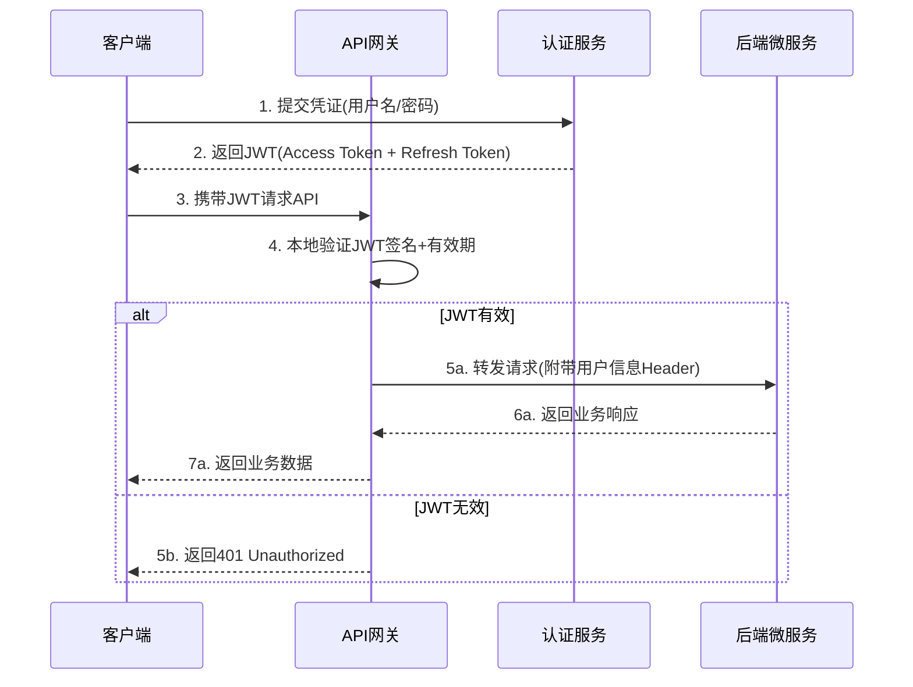
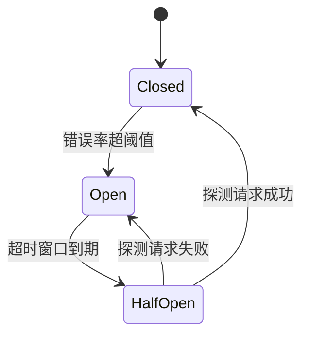
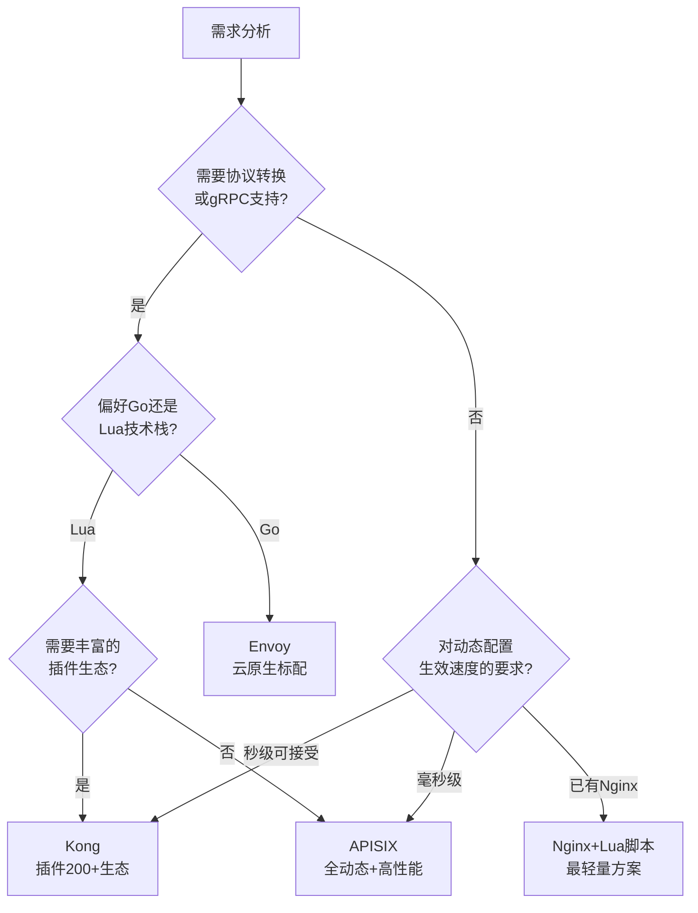

# 本章小结

API网关是微服务架构中最关键的基础设施组件——它作为系统的统一入口，将路由分发、认证授权、限流控制、熔断保护、协议转换等横切关注点从各微服务中抽离出来，集中到一个高性能、高可用的代理层统一处理。本章从理论基础出发，系统讲解了API网关的四大核心机制（路由、认证、限流、熔断），深入剖析了路径路由匹配、JWT验证、令牌桶算法等关键技术细节，并通过 Kong 和 Apache APISIX 两个生产级案例展示了完整的企业级部署方案。本节将全章知识体系做一次结构化回顾与凝练，帮助读者建立清晰的API网关心智模型。

---

## 一、核心概念回顾

### 1.1 API网关的本质定位

API网关本质上是一个**反向代理（Reverse Proxy）**，但它远不止于简单的请求转发。在微服务架构中，它承担着"交通警察"的角色——所有进出系统的流量都必须经过网关，由网关负责鉴权、限流、路由、协议转换等横切关注点的统一处理。

没有API网关时，系统面临的核心问题：

| 问题 | 具体表现 | 带来的代价 |
|------|---------|-----------|
| **客户端复杂性** | 客户端需要知道每个微服务的地址、端口、协议 | 维护成本高，服务变更时客户端必须同步修改 |
| **跨切面关注点分散** | 认证、限流、日志等逻辑在每个服务中重复实现 | 代码重复，安全策略不统一，升级维护困难 |
| **协议多样性** | 不同服务使用HTTP、gRPC、WebSocket等不同协议 | 客户端需要适配多种协议 |
| **版本管理困难** | API变更需要协调多个服务同步上线 | 发布风险高，回滚困难 |
| **安全风险** | 每个服务直接暴露在外部网络中 | 攻击面大，难以统一安全策略 |

API网关通过提供统一入口，将上述问题集中解决。下图展示了API网关在微服务架构中的位置：

```mermaid
graph TB
    subgraph "客户端层"
        C1["Web浏览器"]
        C2["移动App"]
        C3["第三方服务"]
        C4["IoT设备"]
    end

    subgraph "API网关层"
        GW["API网关"]
        GW --> R["路由匹配"]
        GW --> A["认证授权"]
        GW --> RL["限流控制"]
        GW --> CB["熔断保护"]
        GW --> LB["负载均衡"]
    end

    subgraph "微服务层"
        S1["用户服务"]
        S2["订单服务"]
        S3["商品服务"]
        S4["支付服务"]
    end

    C1 &amp; C2 &amp; C3 &amp; C4 --> GW
    R --> S1 &amp; S2 &amp; S3 &amp; S4
```

### 1.2 API网关的九大核心职责

API网关的职责可以划分为四大基础能力和五大增强能力：

| 能力类别 | 具体职责 | 核心作用 |
|---------|---------|---------|
| **路由分发** | 基于路径/主机头/请求头的智能路由 | 将请求导向正确的后端服务 |
| **认证授权** | JWT验证、OAuth2、API Key、mTLS | 确保只有合法请求能到达后端 |
| **限流控制** | 令牌桶、滑动窗口、分布式限流 | 防止流量洪峰冲垮后端服务 |
| **熔断保护** | 断路器模式、故障隔离、降级 | 快速失败，避免级联故障 |
| **协议转换** | HTTP→gRPC、REST→GraphQL | 统一外部协议，适配内部异构 |
| **请求聚合** | BFF模式、响应合并 | 减少客户端请求数，优化移动端体验 |
| **版本管理** | URI/Header/查询参数版本控制 | 支持API平滑演进 |
| **可观测性** | 统一日志、指标采集、分布式追踪 | 统一监控和问题排查 |
| **API治理** | OpenAPI规范、生命周期管理、开发者门户 | 规范化API的开发和使用 |

### 1.3 API网关请求处理链路

一个典型的API网关请求处理链路如下：

客户端请求
  │
  ▼
TLS终止（HTTPS解密）
  │
  ▼
路由匹配（URL/主机头/请求头）
  │
  ▼
认证验证（JWT/API Key/OAuth2）
  │
  ▼
限流检查（令牌桶/滑动窗口）
  │
  ▼
熔断检查（后端服务健康状态）
  │
  ▼
负载均衡（轮询/加权/最少连接）
  │
  ▼
请求改写（Header注入/路径改写）
  │
  ▼
转发到后端微服务

**关键设计决策**：限流必须放在认证之后。原因是限流需要基于已认证的身份信息（用户ID、API Key）进行精细化控制。如果放在认证之前，只能按IP限流，无法区分不同用户的配额。

---

## 二、四大核心机制详解

### 2.1 路由机制：请求分发的枢纽

路由是API网关最基础的功能——根据预定义规则将请求分发到正确的后端服务。本章深入讲解了路由匹配、路径改写和负载均衡三大子问题。

#### 路径匹配模式对比

| 匹配模式 | 规则语法 | 匹配示例 | 非匹配示例 | 适用场景 |
|----------|---------|---------|-----------|---------|
| **精确匹配** | `/api/users` | `/api/users` | `/api/users/123` | 单一资源端点 |
| **前缀匹配** | `/api/users` | `/api/users`、`/api/users/123` | `/api/user` | 服务级路由 |
| **通配符匹配** | `/api/*/profile` | `/api/john/profile` | `/api/john/settings` | 动态路径段 |
| **正则匹配** | `^/api/v(\d+)/users$` | `/api/v2/users` | `/api/v2/orders` | 复杂模式提取 |
| **模板匹配** | `/api/users/{id}` | `/api/users/123` | `/api/users/abc/def` | RESTful资源 |

**路由冲突处理策略**：当多条规则可能同时匹配同一个请求时，不同网关采用不同策略：

- **最长前缀优先**（Kong、APISIX）：匹配更具体的规则，`/api/users/admin` 优于 `/api/users`
- **先配置先匹配**（Nginx location指令）：取决于配置顺序，需要仔细排列
- **优先级数字**（某些网关）：显式指定 priority 字段，数字越大优先级越高

#### 路径改写三种模式

模式一：前缀替换
外部: /api/v2/users/123
改写: /internal/user-service/v1/users/123
规则: /api/v2/users → /internal/user-service/v1/users

模式二：路径剥离（Strip Prefix）
外部: /gateway/orders/456/confirm
改写: /orders/456/confirm
规则: 剥离 /gateway 前缀

模式三：正则替换
外部: /api/v2/users/123
改写: /users?id=123&version=v2
规则: ^/api/v(\d+)/users/(\d+)$ → /users?id=$2&version=v1

### 2.2 认证授权：安全的第一道防线

认证授权是API网关最核心的安全能力。本章重点讲解了JWT（JSON Web Token）验证机制，它是当前API网关场景中最主流的身份认证方案。

#### JWT在API网关中的工作流程



**为什么API网关选择JWT而非Session：**

| 对比维度 | Session | JWT |
|---------|---------|-----|
| 存储位置 | 服务端内存/Redis | 客户端（自包含） |
| 扩展性 | 需要共享Session存储 | 无状态，天然支持水平扩展 |
| 跨域支持 | Cookie受同源策略限制 | Header传输，无跨域限制 |
| 微服务友好 | 需要Session集中存储 | 各服务独立验证，无需共享状态 |
| 性能 | 每次请求需查询Session | 本地密码学验证，零网络IO |
| 吊销能力 | 删除Session即可 | 需要额外机制（黑名单/短有效期） |

#### JWT三段式结构

Header.Payload.Signature

**Header**：声明签名算法和令牌类型
```json
{
  "alg": "RS256",
  "typ": "JWT",
  "kid": "2024-01-key-rotation"
}
```

**Payload**：包含声明（Claims），分为三类：

| 声明 | 含义 | 最佳实践 |
|------|------|---------|
| `iss` | 签发者标识 | 使用完整URL，如 `https://auth.example.com` |
| `sub` | 用户唯一标识 | 使用不可预测的内部ID而非邮箱/用户名 |
| `aud` | 目标受众 | API网关必须校验，防止令牌被其他服务滥用 |
| `exp` | 过期时间 | Access Token建议15分钟以内 |
| `jti` | 令牌唯一标识 | 用于令牌黑名单/吊销 |

**Signature**：使用私钥对 Header + Payload 签名，确保令牌未被篡改。

#### 安全配置要点

| 配置项 | 推荐值 | 原因 |
|--------|--------|------|
| 签名算法 | RS256（非对称） | 私钥不经过网关，降低泄露风险 |
| Access Token有效期 | 15分钟 | 窗口期短，泄露影响有限 |
| Refresh Token有效期 | 7天 | 平衡用户体验和安全性 |
| 必校验字段 | iss + aud + exp + jti | 防伪造、防滥用、防过期、防重放 |
| 密钥轮换周期 | 90天 | 降低密钥泄露的长期风险 |

### 2.3 限流策略：流量洪峰的防护堤

限流是API网关最核心的流量治理能力，它通过控制单位时间内允许通过的请求数量，防止后端服务因过载而崩溃。

#### 限流与其他流量治理手段的区别

| 手段 | 目标 | 作用时机 | 触发条件 |
|------|------|----------|---------|
| **限流** | 控制请求速率，防止过载 | 请求到达时 | 请求量超过阈值（预防性） |
| **熔断** | 快速失败，避免等待故障服务 | 后端服务异常时 | 错误率超过阈值（响应性） |
| **降级** | 返回降级结果，保障核心功能 | 系统资源紧张时 | 资源不足或熔断触发后 |
| **排队** | 延迟处理，平滑流量 | 请求到达时 | 队列未满时排队，满时拒绝 |

**核心区分**：限流是**预防性措施**——不管后端是否健康，都按固定规则控制流量；熔断是**响应性措施**——只在检测到后端故障时才触发。两者互补而非替代。

#### 四大限流算法对比

| 算法 | 核心原理 | 优点 | 缺点 | 适用场景 |
|------|---------|------|------|---------|
| **固定窗口** | 时间窗口内计数器 | 实现最简单 | 窗口边界突发问题 | 低精度要求的简单场景 |
| **滑动窗口** | 时间窗口滑动，避免边界问题 | 平滑度好，无边界问题 | 内存消耗较大 | 需要精确限流的场景 |
| **令牌桶** | 固定速率生成令牌，请求消耗令牌 | 允许突发流量 | 参数调整需要经验 | 大多数API网关默认选择 |
| **漏桶** | 固定速率处理请求，超出排队 | 输出完全平滑 | 无法应对突发流量 | 需要严格匀速输出的场景 |

**令牌桶算法详解**：令牌桶是API网关中最常用的限流算法。其核心思想是：以固定速率向桶中添加令牌，桶有最大容量；每个请求消耗一个令牌，桶空时请求被拒绝。令牌桶的关键优势是**允许短时突发流量**——桶中积累的令牌可以应对突发请求，而固定速率保证了长期平均速率的稳定。

令牌桶的核心参数：
- **填充速率（Refill Rate）**：每秒向桶中添加的令牌数，决定平均吞吐量上限
- **桶容量（Bucket Size）**：桶能容纳的最大令牌数，决定突发流量的上限
- **实际吞吐**：min(请求速率, 填充速率)，但允许短暂超过填充速率（消耗桶内令牌）

### 2.4 熔断保护：级联故障的防火墙

熔断器（Circuit Breaker）模式是防御分布式系统级联故障的核心手段。当后端服务出现异常时，熔断器快速失败，避免请求堆积和线程阻塞，保护整个系统不被拖垮。

#### 熔断器三态模型



| 状态 | 行为 | 触发条件 |
|------|------|---------|
| **关闭（Closed）** | 正常放行所有请求，同时统计失败率 | 初始状态 |
| **打开（Open）** | 直接拒绝所有请求，返回降级响应 | 失败率超过阈值 |
| **半开（Half-Open）** | 放行少量探测请求，测试后端是否恢复 | 超时窗口到期后自动进入 |

#### 关键配置参数

| 参数 | 典型值 | 说明 |
|------|--------|------|
| 失败率阈值 | 50% | 触发熔断的最低错误率 |
| 最小请求数 | 20 | 统计失败率前需要的最低请求量 |
| 滑动窗口 | 10秒 | 统计失败率的时间窗口 |
| 打开状态持续时间 | 30秒 | 熔断后等待恢复的冷却时间 |
| 半开状态探测数 | 5 | 半开时放行的探测请求数 |

#### 降级策略

当熔断触发后，API网关需要返回合理的降级响应：

| 降级策略 | 做法 | 适用场景 |
|---------|------|---------|
| **返回缓存** | 从缓存中读取最近的响应返回 | 可容忍短暂数据延迟的读场景 |
| **返回默认值** | 返回预定义的默认响应 | 有合理默认值的非关键接口 |
| **排队等待** | 将请求放入队列，后端恢复后处理 | 允许延迟但不允许丢失的写场景 |
| **快速失败** | 直接返回503 Service Unavailable | 无法降级的场景，让客户端自行重试 |

---

## 三、关键公式与性能模型

### 3.1 核心性能公式

| 概念 | 公式 | 说明 | 实际应用 |
|------|------|------|---------|
| 吞吐量 | QPS = 并发数 / 平均延迟 | Little定律 | 100并发 / 10ms延迟 = 10,000 QPS |
| 可用性 | SLA = 正常时间 / 总时间 | 99.9% = 年停机8.76小时 | SLA目标制定的基准 |
| 延迟百分位 | P99 = 排序后第99百分位值 | 比平均值更真实地反映用户体验 | 网关性能评估的核心指标 |
| 容量规划 | 总QPS = Σ(各服务QPS) × 安全系数(1.5~3) | 网关容量需覆盖所有后端服务之和 | 上线前的容量评估 |
| 令牌桶吞吐 | 实际吞吐 = min(请求速率, 填充速率) + 突发容量 | 令牌桶的非线性吞吐特性 | 限流参数调优 |
| 熔断恢复时间 | 恢复时间 = 冷却窗口 + 探测成功窗口 | 从熔断到完全恢复的时间 | 故障恢复SLA计算 |

### 3.2 API网关选型决策模型



### 3.3 主流网关性能对比

| 指标 | Kong（开源版） | Apache APISIX | Envoy | Nginx+Lua |
|------|---------------|---------------|-------|-----------|
| 单核RPS | ~10K | 18K+ | 15K+ | 10-15K |
| 配置生效 | 秒级（PostgreSQL） | 毫秒级（etcd） | 秒级（xDS） | Reload（秒级） |
| 插件热加载 | 需重启/reload | 支持，无需重启 | 需重新编译 | 需reload |
| 插件生态 | 200+官方插件 | 80+官方插件 | 有限原生插件 | 依赖Lua生态 |
| 配置存储 | PostgreSQL/Cassandra | etcd（3节点） | xDS API | 静态文件 |
| 学习曲线 | 中等 | 中等 | 较陡 | 较低 |
| 社区活跃度 | 成熟稳定 | 高速增长 | 非常活跃 | 广泛使用 |
| 中文社区 | 较弱 | 官方支持 | 较弱 | 广泛 |

---

## 四、生产级部署实战要点

### 4.1 Kong部署架构最佳实践

Kong基于Nginx/OpenResty构建，生产环境推荐的架构：

| 组件 | 部署方案 | 配置要求 |
|------|---------|---------|
| Kong节点 | 3节点集群，无状态 | 每节点4核8GB+，Nginx worker数=CPU核数 |
| PostgreSQL | 主从架构 | 主库16GB+内存，从库用于读扩展和备份 |
| 负载均衡 | L4负载均衡（HAProxy/NLB） | 健康检查 + 会话保持（如需） |
| 监控 | Prometheus + Grafana + Kong Vitals | 采集QPS、延迟、错误率、插件执行耗时 |

Kong插件启用顺序（关键）：

请求进入
  → IP黑名单（最先拦截恶意IP）
  → 认证插件（key-auth / jwt / oauth2）
  → 限流插件（rate-limiting）
  → 请求变换（request-transformer）
  → 路由转发到后端
  → 响应变换（response-transformer）
  → 日志插件（tcp-log / http-log）

### 4.2 APISIX部署架构最佳实践

APISIX的核心优势是"全动态"——所有配置变更毫秒级生效，无需重启或reload。

APISIX架构三层次：

| 层次 | 组件 | 职责 |
|------|------|------|
| **数据平面** | Nginx/OpenResty | 请求处理，本地缓存路由和插件配置，极低延迟 |
| **控制平面** | etcd集群（3节点） | 配置中心，通过Watch机制毫秒级推送变更到数据平面 |
| **插件层** | Lua/外部插件（Python/Java/Go） | 认证、限流、日志等功能扩展，支持热加载 |

APISIX关键概念关系：

| 概念 | 说明 | 关系 |
|------|------|------|
| Route（路由） | 请求匹配规则 | Route → Service → Upstream |
| Service（服务） | 一组路由的抽象 | 可共享上游和插件 |
| Upstream（上游） | 后端服务实例集合 | 包含负载均衡策略和健康检查 |
| Plugin（插件） | 功能扩展 | 挂载在Route/Service/Global上 |
| Consumer（消费者） | API调用方 | 用于认证鉴权 |
| SSL（证书） | HTTPS证书管理 | 全局或SNI级别配置 |

### 4.3 监控体系建设

API网关的可观测性建设是生产部署的关键环节。一个完整的监控体系需要覆盖三个维度：

**Metrics（指标）**：
- 请求级指标：QPS、延迟（P50/P99/P999）、错误率（4xx/5xx）
- 资源级指标：CPU使用率、内存占用、连接数、文件描述符
- 业务级指标：各服务的调用量、成功率、平均延迟
- 限流级指标：限流触发次数、被拒绝请求比例
- 熔断级指标：熔断状态变更次数、降级响应比例

**Logging（日志）**：
- 结构化日志：JSON格式，包含 request_id、upstream_addr、响应时间、状态码
- 日志聚合：ELK（Elasticsearch + Logstash + Kibana）或 Loki
- 日志告警：ERROR级别日志实时告警

**Tracing（分布式追踪）**：
- 全链路追踪：为每个请求生成唯一 trace_id，贯穿网关→后端服务全链路
- 工具选型：Jaeger、Zipkin、OpenTelemetry
- 采样策略：生产环境建议 1%-5% 采样率，异常请求100%采集

---

## 五、最佳实践清单

### 5.1 设计阶段

| 实践要点 | 具体要求 | 常见错误 |
|---------|---------|---------|
| 明确网关职责边界 | 网关只做横切关注点，业务逻辑留在微服务 | 把业务逻辑塞进网关插件 |
| 选择合适的技术方案 | 根据团队技术栈、性能要求、生态需求选型 | 盲目追求最新网关，忽视团队学习成本 |
| 设计容错降级方案 | 每个插件/路由都要有降级策略 | 所有流量都走同一条处理链路 |
| 制定监控告警策略 | 上线前就完成监控覆盖，而非事后补建 | 先上线再补监控，故障时无法定位 |
| 规划API版本策略 | 从项目初期就确定版本管理方案 | 后期再统一版本，历史接口难以清理 |
| 设计密钥管理方案 | JWT密钥轮换、API Key生命周期管理 | 密钥写死在代码中，永不过期 |

### 5.2 实现阶段

| 实践要点 | 具体要求 | 常见错误 |
|---------|---------|---------|
| 限流放在认证之后 | 先识别用户身份，再做精细化限流 | 限流放在认证之前，只能按IP限流 |
| JWT校验必须完整 | 验证签名 + 检查iss/aud/exp + 检查jti | 只验证签名，不检查过期和受众 |
| 熔断阈值需标定 | 基于压测数据设定失败率阈值 | 拍脑袋设定50%阈值，不考虑实际负载 |
| 网关无状态设计 | 网关节点不存储任何会话状态 | 在网关内存中存储用户会话 |
| 错误响应标准化 | 统一错误格式：{code, message, request_id} | 各服务返回不同格式的错误 |
| 超时链路设计 | 网关超时 > 后端超时 > 下游超时 | 网关超时小于后端，导致连接泄漏 |

### 5.3 部署阶段

| 实践要点 | 具体要求 | 常见错误 |
|---------|---------|---------|
| 高可用部署 | 至少3节点 + L4负载均衡 + 健康检查 | 单节点部署，无故障转移能力 |
| 配置变更灰度 | 先改10%节点验证，再全量推送 | 一次性修改所有节点配置 |
| SSL证书管理 | 自动化证书轮换，监控证书过期时间 | 手动管理证书，证书过期导致服务中断 |
| 压力测试 | 上线前用 wrk/vegeta 做全链路压测 | 不做压测直接上线，大促时被打垮 |
| 回滚方案 | 配置版本化，支持一键回滚到上一版本 | 没有回滚方案，出问题只能手动恢复 |
| 资源限制 | 为每个服务设置独立的连接池和超时 | 所有服务共享连接池，一个慢服务拖垮全部 |

### 5.4 运维阶段

| 实践要点 | 具体要求 | 常见错误 |
|---------|---------|---------|
| 监控面板巡检 | 每日查看QPS/延迟/错误率趋势 | 从不看监控面板，直到故障报警才关注 |
| 热点分析 | 定期分析慢查询、热点路由、高频限流 | 不分析热点，性能劣化无法及时发现 |
| 日志清理 | 配置日志轮转策略，控制磁盘使用 | 日志无限增长，磁盘写满导致网关崩溃 |
| 混沌工程 | 定期注入故障（延迟、错误、节点宕机），验证熔断和降级 | 从不测试故障场景，真出事时无法应对 |
| 版本升级 | 评估插件兼容性，灰度升级 | 大版本升级不测试，插件不兼容导致故障 |
| 安全审计 | 定期检查JWT密钥、API Key泄露、权限配置 | 从不审计安全配置，直到数据泄露才重视 |

---

## 六、常见误区与纠正

本章识别了API网关实践中最具危害的高频误区，以下是最关键的纠正要点：

| 误区 | 错误做法 | 正确做法 | 根因分析 |
|------|---------|---------|---------|
| **网关当业务网关用** | 在网关插件中实现业务逻辑（如订单状态校验） | 网关只做横切关注点（认证、限流、日志） | 网关是基础设施，不是业务层；业务逻辑变更不应触发网关变更 |
| **限流和熔断混淆** | 用限流替代熔断，或用熔断替代限流 | 限流是预防（固定规则），熔断是响应（后端故障） | 两者触发条件和目的完全不同，互补而非替代 |
| **JWT只验签名不验内容** | 只验证签名正确性，忽略iss/aud/exp/jti | 完整验证签名+所有必要Claims | 可能接受其他服务签发的令牌、过期令牌、被吊销的令牌 |
| **忽略路径匹配冲突** | 多条路由规则可能匹配同一请求，不处理优先级 | 使用最长前缀匹配或显式设置优先级 | 请求可能被路由到错误的后端服务 |
| **网关不做超时控制** | 网关没有设置全局超时，后端响应慢导致线程堆积 | 网关全局超时 + 每个路由独立超时 | 慢后端拖垮整个网关，所有服务受影响 |
| **限流粒度过粗** | 全局限流，所有用户共享配额 | 按用户/API Key/服务分级限流 | 大客户被普通用户的流量挤占配额 |
| **配置变更不灰度** | 一次性修改所有网关节点的路由配置 | 先修改1个节点验证，再逐步推送全集群 | 配置错误导致全网关流量中断 |
| **不做API版本管理** | 所有接口共用一个版本，变更时直接修改 | URI版本（/v1/、/v2/）或Header版本 | 新版上线时旧客户端无法工作，回滚困难 |
| **忽略网关自身的高可用** | 单节点网关部署，无负载均衡 | 至少3节点 + L4负载均衡 + 健康检查 | 网关成为单点故障，宕机导致所有服务不可达 |
| **密钥永不轮换** | JWT签名密钥从创建到废弃从不更换 | 定期轮换密钥（90天），使用kid标识当前密钥 | 密钥泄露后无法追溯，也无法优雅切换 |

---

## 七、技术选型速查

根据业务需求快速选择API网关方案：

| 你的场景 | 推荐网关 | 理由 |
|---------|---------|------|
| 需要丰富的现成插件 | Kong | 200+官方插件，开箱即用 |
| 需要毫秒级配置生效 | APISIX | etcd Watch机制，全动态 |
| 已有Nginx，轻量集成 | Nginx + Lua脚本 | 最轻量，无额外依赖 |
| 需要gRPC/HTTP2协议转换 | Envoy | 原生支持，Istio服务网格标配 |
| Go技术栈，偏好云原生 | Envoy / Traefik | Go生态友好，K8s原生集成 |
| 小团队，快速上手 | Traefik | 自动服务发现，配置最简单 |
| 金融级安全要求 | Kong + 自定义认证插件 | 企业级安全认证，支持mTLS |
| 需要GraphQL网关 | Apollo Federation / Mercurius | 专为GraphQL设计的联邦网关 |

---

## 八、思考题

### 基础题

1. **API网关解决了哪些核心问题？** 从客户端复杂性、安全、流量控制、协议转换四个角度，对比有网关和无网关的微服务架构差异。

2. **限流为什么必须放在认证之后？** 从IP限流 vs 用户限流的粒度差异角度分析。如果放在认证之前会带来哪些安全风险？

3. **JWT的三段式结构各自的作用是什么？** 为什么Payload部分只做Base64编码而不做加密？如果需要保护敏感信息，应该如何处理？

### 进阶题

4. **令牌桶和滑动窗口限流在突发流量场景下表现有何不同？** 假设限流阈值为100 QPS，在一个1秒窗口内第0.1秒到达了150个请求，两种算法分别会如何处理？画出时间线说明。

5. **Kong和APISIX在配置生效机制上有什么本质区别？** 这种区别在什么场景下会产生显著影响？（提示：考虑大促期间的动态限流调整）

6. **设计一个完整的JWT吊销方案**：当用户登出或账号被封禁时，如何让已签发的JWT立即失效？对比黑名单、短有效期+Refresh Token、Token版本号三种方案的优劣。

### 实战题

7. **设计一个电商大促的API网关方案**：某电商平台预计大促期间QPS从日常5万飙升到50万。请设计完整的网关架构，包括：
   - 限流策略（全局+用户级+服务级三层限流的参数设计）
   - 熔断方案（各服务的熔断阈值和降级策略）
   - 监控告警（需要关注哪些指标？阈值如何设定？）
   - 容量规划（网关节点数、负载均衡方案）

8. **对比Kong和APISIX在同一业务场景下的部署差异**：假设你有一个日活100万的社交App，后端有用户、消息、推荐三个微服务，需要支持JWT认证、IP限流和请求日志。分别设计基于Kong和APISIX的部署方案，说明各自的配置方式和运维差异。

---

## 九、下一步学习建议

### 9.1 深入方向

| 方向 | 具体内容 | 推荐理由 |
|------|---------|---------|
| 网关源码阅读 | Kong的OpenResty/Lua插件机制、APISIX的etcd Watch机制 | 理解网关的内部工作原理 |
| 服务网格（Service Mesh） | Istio + Envoy，理解sidecar模式 | API网关的下一步演进方向 |
| GraphQL网关 | Apollo Federation、Schema Stitching | 面向BFF场景的下一代网关 |
| API治理 | OpenAPI规范、API生命周期管理 | 从单个网关到企业级API管理平台 |
| 性能调优 | Nginx worker模型、epoll优化、内核参数调优 | 压榨网关的极限性能 |
| 安全深入 | OAuth2.0/OIDC完整流程、mTLS双向认证、JWT安全攻击 | 理解认证授权的攻防全景 |

### 9.2 推荐资源

**书籍**：
- 《Building Microservices》（Sam Newman）——微服务架构的权威参考，API网关章节深入讲解了网关在微服务中的定位
- 《Microservices Patterns》（Chris Richardson）——API Gateway Pattern、BFF Pattern的系统讲解
- 《Programming Kong》（Kong官方文档）——Kong网关的完整使用指南

**开源项目源码**：
- Kong（Lua/OpenResty）——理解Nginx+Lua的网关扩展机制
- Apache APISIX（Lua/etcd）——学习全动态配置管理的工程实现
- Envoy Proxy（C++）——理解现代L7代理的架构设计，服务网格数据平面的标杆
- Traefik（Go）——学习Go语言实现的云原生网关，自动服务发现机制

**论文与规范**：
- RFC 7519（JWT规范）——理解JWT协议的标准定义
- RFC 6749（OAuth 2.0）——理解授权框架的完整设计
- Google SRE Book 中关于负载均衡和过载保护的章节

**动手实践**：
- 用Docker Compose搭建Kong + 3个微服务的完整环境，配置路由、认证、限流
- 用APISIX Dashboard可视化配置所有插件，对比Kong Admin API的操作体验
- 用wrk/vegeta对网关做压力测试，观察不同限流参数下的吞吐和延迟变化
- 模拟后端服务故障，验证熔断器的三态切换和降级响应

---

## 十、全章知识图谱

```mermaid
graph TB
    GW["API网关"]

    GW --> F["基础理论"]
    GW --> R["路由机制"]
    GW --> A["认证授权"]
    GW --> RL["限流策略"]
    GW --> CB["熔断保护"]
    GW --> K["Kong实战"]
    GW --> AP["APISIX实战"]

    F --> F1["为什么需要网关"]
    F --> F2["九大核心职责"]
    F --> F3["请求处理链路"]

    R --> R1["路径匹配模式（精确/前缀/通配/正则/模板）"]
    R --> R2["路由冲突处理（最长前缀/先配置先匹配）"]
    R --> R3["路径改写（前缀替换/剥离/正则替换）"]
    R --> R4["负载均衡策略"]

    A --> A1["JWT三段式结构"]
    A --> A2["JWT vs Session对比"]
    A --> A3["Claims校验（iss/aud/exp/jti）"]
    A --> A4["密钥轮换策略"]
    A --> A5["OAuth2 / API Key / mTLS"]

    RL --> RL1["固定窗口限流"]
    RL --> RL2["滑动窗口限流"]
    RL --> RL3["令牌桶限流"]
    RL --> RL4["漏桶限流"]
    RL --> RL5["分布式限流 + Redis"]

    CB --> CB1["三态模型（Closed/Open/Half-Open）"]
    CB --> CB2["失败率阈值与冷却窗口"]
    CB --> CB3["降级策略（缓存/默认值/排队/快速失败）"]

    K --> K1["架构设计（PostgreSQL配置存储）"]
    K --> K2["插件配置（认证/限流/日志）"]
    K --> K3["集群部署与监控"]

    AP --> AP1["架构设计（etcd配置中心）"]
    AP --> AP2["全动态配置热加载"]
    AP --> AP3["插件热加载与外部插件"]
```



---

API网关看似只是一个"请求转发器"，但本章的深度剖析告诉我们，一个生产级API网关的设计涉及路由匹配算法、认证安全模型、限流数学模型、熔断状态机、可观测性体系等多个维度的技术决策。每一次看似简单的配置背后，都有其设计原理和工程权衡。记住：**API网关不是银弹，它只是微服务架构工具箱中最关键的那一个工具。** 在很多场景下，客户端直接调用、服务网格边车代理、GraphQL联邦网关可能是更好的选择。技术选型的本质是权衡，而权衡的基础是对每种方案深入、准确的理解。
