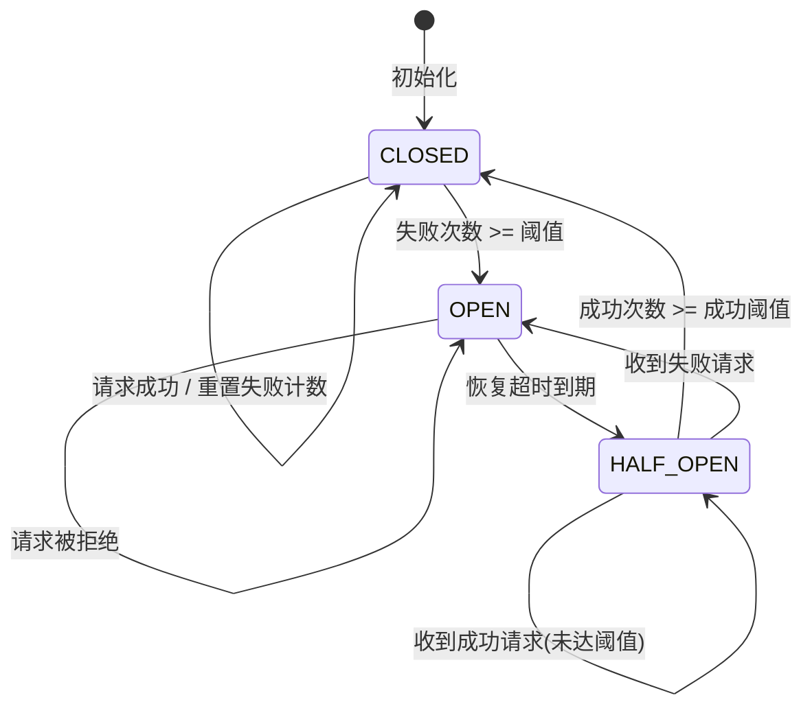

# 第57章 - API网关

## 章节概览

API网关（API Gateway）是现代微服务架构中的核心基础设施组件，它作为系统的统一入口，负责处理所有客户端请求的路由、认证、限流、协议转换等横切关注点。随着微服务架构的普及和API经济的兴起，API网关已经成为企业数字化转型中不可或缺的技术组件。

本章将深入探讨API网关的设计原理、核心功能和最佳实践。我们将从理论基础出发，详细讲解路由机制、认证授权、限流策略、熔断机制、协议转换等核心技术；通过实战案例展示如何在真实项目中设计和实现高效的API网关；分析常见的设计误区和反模式；最后提供系统的练习方法，帮助读者掌握API网关的设计与实现。

### 核心知识点

1. **路由机制**：基于路径、主机头、请求头的智能路由分发
2. **认证授权**：JWT、OAuth2、API Key、mTLS等多维度安全防护
3. **限流策略**：滑动窗口、令牌桶、分布式限流与Redis集成
4. **熔断保护**：服务降级、故障隔离、优雅降级策略
5. **负载均衡**：轮询、加权轮询、最少连接、一致性哈希与健康检查
6. **协议转换**：HTTP到gRPC、REST到GraphQL的无缝转换
7. **请求聚合**：BFF模式、响应合并、数据裁剪
8. **API版本管理**：URI版本、Header版本、查询参数版本控制
9. **网关架构**：Kong、Nginx、APISIX的架构设计与插件系统
10. **API治理**：OpenAPI规范、API生命周期管理、开发者门户
11. **WebSocket支持**：长连接管理、心跳保活、消息路由
12. **Kubernetes集成**：Gateway API、Ingress Controller、云原生部署

### 学习目标

- 理解API网关在微服务架构中的核心地位和作用
- 掌握路由、认证、限流、熔断等关键功能的设计原理
- 学会设计高可用、高性能的API网关架构
- 能够在实际项目中合理选型和配置API网关
- 理解API治理和生命周期管理的最佳实践

***

**预计学习时间**：6-8小时

**前置知识**：HTTP协议基础、微服务架构概念、分布式系统基础

**适用场景**：微服务架构、API管理、云原生应用、企业集成

***

## 理论基础

### 1. API网关概述

API网关是一种服务器，它充当API的前端门面，接收所有API请求，将它们路由到适当的后端服务，并将响应返回给客户端。在微服务架构中，API网关扮演着至关重要的角色，它提供了统一的入口点，简化了客户端与后端服务的交互。

#### 1.1 为什么需要API网关

在没有API网关的微服务架构中，客户端需要直接与多个后端服务交互，这带来了以下问题：

1. **客户端复杂性**：客户端需要知道每个服务的地址和端口
2. **跨切面关注点分散**：认证、限流、日志等功能需要在每个服务中重复实现
3. **协议多样性**：不同服务可能使用不同的协议（HTTP、gRPC、WebSocket等）
4. **版本管理困难**：API变更需要协调多个服务
5. **安全风险**：每个服务都暴露在外部网络中

API网关通过提供统一的入口点，将这些横切关注点集中处理，大大简化了系统架构。下图展示了API网关在微服务架构中的位置和请求处理流程：

```mermaid
graph TB
    subgraph "客户端层"
        C1[Web浏览器]
        C2[移动App]
        C3[第三方服务]
        C4[IoT设备]
    end
    
    subgraph "API网关层"
        GW[API网关]
        GW --> R[路由匹配]
        GW --> A[认证授权]
        GW --> RL[限流控制]
        GW --> CB[熔断保护]
        GW --> LB[负载均衡]
    end
    
    subgraph "微服务层"
        S1[用户服务]
        S2[订单服务]
        S3[商品服务]
        S4[支付服务]
        S5[搜索服务]
    end
    
    subgraph "基础设施层"
        CACHE[(Redis缓存)]
        DB[(数据库)]
        MQ[消息队列]
        LOG[日志系统]
        MET[监控系统]
    end
    
    C1 &amp; C2 &amp; C3 &amp; C4 --> GW
    R --> S1 &amp; S2 &amp; S3 &amp; S4 &amp; S5
    S1 &amp; S2 &amp; S3 &amp; S4 &amp; S5 --> CACHE &amp; DB &amp; MQ
    GW -.-> LOG &amp; MET
```

#### 1.2 API网关的核心职责

```python
class APIGateway:
    """API网关核心职责示例"""
    
    def __init__(self):
        self.router = Router()
        self.authenticator = Authenticator()
        self.rate_limiter = RateLimiter()
        self.circuit_breaker = CircuitBreaker()
        self.load_balancer = LoadBalancer()
    
    async def handle_request(self, request: Request) -> Response:
        """处理请求的完整流程"""
        # 1. 路由匹配
        route = self.router.match(request)
        if not route:
            return Response(status=404, body="Route not found")
        
        # 2. 认证验证
        auth_result = await self.authenticator.authenticate(request)
        if not auth_result.success:
            return Response(status=401, body="Unauthorized")
        
        # 3. 限流检查
        if not self.rate_limiter.allow(request):
            return Response(status=429, body="Too many requests")
        
        # 4. 熔断检查
        if self.circuit_breaker.is_open(route.service):
            return Response(status=503, body="Service unavailable")
        
        # 5. 负载均衡选择实例
        instance = self.load_balancer.select(route.service)
        
        # 6. 转发请求
        response = await self.forward_request(request, instance)
        
        # 7. 记录指标
        self.record_metrics(request, response)
        
        return response
```

上述代码展示了API网关处理一个请求的完整生命周期。在实际实现中，每个环节都通过插件系统解耦，可以独立配置和扩展。完整的请求处理流程如下：

```mermaid
flowchart TD
    REQ[客户端请求] --> ROUTE{路由匹配}
    ROUTE -->|无匹配| ERR404[返回 404]
    ROUTE -->|匹配成功| AUTH{认证验证}
    AUTH -->|失败| ERR401[返回 401]
    AUTH -->|通过| RATE{限流检查}
    RATE -->|超限| ERR429[返回 429]
    RATE -->|通过| CB{熔断检查}
    CB -->|熔断中| ERR503[返回 503]
    CB -->|正常| LB[负载均衡选择实例]
    LB --> FORWARD[转发请求到后端服务]
    FORWARD -->|成功| RESP[返回响应给客户端]
    FORWARD -->|失败| RETRY{重试?}
    RETRY -->|是| LB
    RETRY -->|否| ERR500[返回 500]
    RESP --> METRICS[记录指标和日志]
    ERR404 &amp; ERR401 &amp; ERR429 &amp; ERR503 &amp; ERR500 --> METRICS
```

***

### 2. 路由机制

路由是API网关最基本的功能，它决定了请求应该被转发到哪个后端服务。路由的效率直接影响网关的吞吐量——在高并发场景下，路由匹配可能成为性能瓶颈。现代API网关支持多种路由策略，每种策略适用于不同的业务场景。路由设计的关键在于平衡灵活性和性能：过于灵活的路由规则（如正则匹配）会增加CPU开销，而过于简单的路由（如仅支持精确匹配）又无法满足复杂业务需求。

#### 2.1 基于路径的路由

基于路径的路由是最常见的路由方式，它根据请求的URL路径将请求分发到不同的服务。

```yaml
# 基于路径的路由配置示例
routes:
  - path: /api/v1/users/**
    service: user-service
    strip_prefix: /api/v1
    
  - path: /api/v1/orders/**
    service: order-service
    strip_prefix: /api/v1
    
  - path: /api/v1/products/**
    service: product-service
    strip_prefix: /api/v1
```

路径路由的实现需要考虑以下因素：

1. **路径匹配算法**：精确匹配、前缀匹配、正则匹配
2. **路径重写**：在转发前修改请求路径
3. **路径变量提取**：从路径中提取参数传递给后端服务
4. **优先级处理**：多个路由规则匹配时的优先级

```python
class PathRouter:
    """基于路径的路由器实现"""
    
    def __init__(self):
        self.routes = []
        self.route_trie = Trie()
    
    def add_route(self, path: str, service: str, options: dict):
        """添加路由规则"""
        route = {
            'path': path,
            'service': service,
            'pattern': self._compile_pattern(path),
            'options': options
        }
        self.routes.append(route)
        self.route_trie.insert(path, route)
    
    def match(self, request_path: str) -> Optional[dict]:
        """匹配请求路径"""
        # 1. 尝试精确匹配
        for route in self.routes:
            if route['pattern'].exact_match(request_path):
                return route
        
        # 2. 尝试前缀匹配
        for route in self.routes:
            if route['pattern'].prefix_match(request_path):
                return route
        
        # 3. 尝试正则匹配
        for route in self.routes:
            if route['pattern'].regex_match(request_path):
                return route
        
        return None
    
    def _compile_pattern(self, path: str):
        """编译路径模式"""
        # 将路径模式转换为正则表达式
        # 例如: /users/{id} -> /users/([^/]+)
        pattern = re.sub(r'\{(\w+)\}', r'([^/]+)', path)
        return re.compile(f'^{pattern}$')
```

#### 2.2 基于主机头的路由

基于主机头的路由允许根据请求的Host头将请求分发到不同的服务，这在多租户系统中特别有用。

```python
class HostRouter:
    """基于主机头的路由器"""
    
    def __init__(self):
        self.host_routes = {}
        self.wildcard_routes = {}
    
    def add_route(self, host: str, service: str):
        """添加基于主机的路由"""
        if host.startswith('*.'):
            # 通配符路由
            domain = host[2:]
            self.wildcard_routes[domain] = service
        else:
            # 精确路由
            self.host_routes[host] = service
    
    def match(self, request: Request) -> Optional[str]:
        """匹配请求的主机头"""
        host = request.headers.get('Host', '')
        
        # 1. 精确匹配
        if host in self.host_routes:
            return self.host_routes[host]
        
        # 2. 通配符匹配
        for domain, service in self.wildcard_routes.items():
            if host.endswith(domain):
                return service
        
        return None
```

#### 2.3 基于请求头的路由

基于请求头的路由提供了更灵活的路由策略，可以根据请求头中的特定字段进行路由。

```python
class HeaderRouter:
    """基于请求头的路由器"""
    
    def __init__(self):
        self.header_rules = []
    
    def add_rule(self, header_name: str, header_value: str, service: str):
        """添加基于请求头的路由规则"""
        self.header_rules.append({
            'header': header_name,
            'value': header_value,
            'service': service
        })
    
    def match(self, request: Request) -> Optional[str]:
        """匹配请求头"""
        for rule in self.header_rules:
            header_value = request.headers.get(rule['header'])
            if header_value and self._match_value(header_value, rule['value']):
                return rule['service']
        return None
    
    def _match_value(self, actual: str, expected: str) -> bool:
        """匹配请求头值"""
        if expected.startswith('*'):
            return actual.endswith(expected[1:])
        if expected.endswith('*'):
            return actual.startswith(expected[:-1])
        return actual == expected
```

***

### 3. 认证与授权

认证（Authentication）和授权（Authorization）是API网关最重要的安全功能之一。网关需要验证请求者的身份，并确定其是否有权限访问请求的资源。不同的认证方式在安全性、性能和适用场景上有显著差异：

| 认证方式 | 安全级别 | 性能开销 | 适用场景 | 关键特点 |
|---------|---------|---------|---------|---------|
| **JWT** | 中-高 | 低（本地验证） | 分布式系统、微服务 | 无状态、可携带用户信息、支持细粒度权限 |
| **OAuth2** | 高 | 中（需远程验证） | 第三方集成、SSO | 标准授权框架、支持多种授权模式 |
| **API Key** | 低 | 极低（简单比对） | 内部API、低安全要求 | 简单易用、难以实现细粒度权限 |
| **mTLS** | 极高 | 中（TLS握手） | 服务间通信、金融级安全 | 双向证书验证、基础设施依赖重 |

在实际生产环境中，通常采用多种认证方式的组合——例如对外API使用JWT认证，第三方集成使用OAuth2，内部服务间使用mTLS，开放API使用API Key+限流。

#### 3.1 JWT认证

JWT（JSON Web Token）是一种开放标准（RFC 7519），用于在各方之间安全地传输信息。JWT认证是API网关中最常用的认证方式之一。

```python
import jwt
from datetime import datetime, timedelta

class JWTAuthenticator:
    """JWT认证器"""
    
    def __init__(self, secret_key: str, algorithm: str = 'HS256'):
        self.secret_key = secret_key
        self.algorithm = algorithm
    
    def generate_token(self, payload: dict, expires_in: int = 3600) -> str:
        """生成JWT令牌"""
        # 添加标准声明
        payload.update({
            'iat': datetime.utcnow(),
            'exp': datetime.utcnow() + timedelta(seconds=expires_in),
            'iss': 'api-gateway'
        })
        
        return jwt.encode(payload, self.secret_key, algorithm=self.algorithm)
    
    def verify_token(self, token: str) -> dict:
        """验证JWT令牌"""
        try:
            payload = jwt.decode(
                token, 
                self.secret_key, 
                algorithms=[self.algorithm]
            )
            return {'valid': True, 'payload': payload}
        except jwt.ExpiredSignatureError:
            return {'valid': False, 'error': 'Token expired'}
        except jwt.InvalidTokenError as e:
            return {'valid': False, 'error': str(e)}
    
    def refresh_token(self, token: str, expires_in: int = 3600) -> str:
        """刷新JWT令牌"""
        result = self.verify_token(token)
        if not result['valid']:
            raise ValueError('Invalid token')
        
        # 生成新令牌
        payload = result['payload']
        del payload['exp']
        del payload['iat']
        
        return self.generate_token(payload, expires_in)
```

#### 3.2 OAuth2认证

OAuth2是一种授权框架，允许第三方应用获取对HTTP服务的有限访问权限。API网关通常作为OAuth2的资源服务器。

```python
class OAuth2Authenticator:
    """OAuth2认证器"""
    
    def __init__(self, auth_server_url: str, client_id: str, client_secret: str):
        self.auth_server_url = auth_server_url
        self.client_id = client_id
        self.client_secret = client_secret
        self.token_cache = {}
    
    async def authenticate(self, request: Request) -> dict:
        """OAuth2认证"""
        # 1. 提取访问令牌
        access_token = self._extract_token(request)
        if not access_token:
            return {'success': False, 'error': 'No access token provided'}
        
        # 2. 检查缓存
        if access_token in self.token_cache:
            cached = self.token_cache[access_token]
            if cached['expires_at'] > time.time():
                return {'success': True, 'user': cached['user']}
        
        # 3. 验证令牌
        user_info = await self._introspect_token(access_token)
        if not user_info:
            return {'success': False, 'error': 'Invalid access token'}
        
        # 4. 缓存结果
        self.token_cache[access_token] = {
            'user': user_info,
            'expires_at': time.time() + 300  # 5分钟缓存
        }
        
        return {'success': True, 'user': user_info}
    
    async def _introspect_token(self, token: str) -> Optional[dict]:
        """向授权服务器验证令牌"""
        async with aiohttp.ClientSession() as session:
            async with session.post(
                f'{self.auth_server_url}/introspect',
                data={'token': token},
                auth=aiohttp.BasicAuth(self.client_id, self.client_secret)
            ) as response:
                if response.status == 200:
                    data = await response.json()
                    if data.get('active'):
                        return data
        return None
```

#### 3.3 API Key认证

API Key认证是最简单的认证方式，适用于对安全性要求不高的场景。

```python
class APIKeyAuthenticator:
    """API Key认证器"""
    
    def __init__(self, api_key_store: dict):
        self.api_key_store = api_key_store  # {api_key: client_info}
        self.usage_tracker = {}
    
    def authenticate(self, request: Request) -> dict:
        """API Key认证"""
        # 1. 提取API Key
        api_key = self._extract_api_key(request)
        if not api_key:
            return {'success': False, 'error': 'No API key provided'}
        
        # 2. 验证API Key
        client_info = self.api_key_store.get(api_key)
        if not client_info:
            return {'success': False, 'error': 'Invalid API key'}
        
        # 3. 检查API Key状态
        if not client_info.get('active', True):
            return {'success': False, 'error': 'API key is disabled'}
        
        # 4. 记录使用情况
        self._track_usage(api_key)
        
        return {'success': True, 'client': client_info}
    
    def _extract_api_key(self, request: Request) -> Optional[str]:
        """从请求中提取API Key"""
        # 从请求头提取
        api_key = request.headers.get('X-API-Key')
        if api_key:
            return api_key
        
        # 从查询参数提取
        api_key = request.query_params.get('api_key')
        if api_key:
            return api_key
        
        return None
```

#### 3.4 mTLS认证

mTLS（双向TLS）是一种更安全的认证方式，要求客户端和服务器都提供证书进行身份验证。

```python
class MTLSAuthenticator:
    """mTLS认证器"""
    
    def __init__(self, ca_cert_path: str, crl_path: Optional[str] = None):
        self.ca_cert_path = ca_cert_path
        self.crl_path = crl_path
        self.trusted_certs = self._load_trusted_certs()
    
    def authenticate(self, request: Request) -> dict:
        """mTLS认证"""
        # 1. 获取客户端证书
        client_cert = request.get('client_certificate')
        if not client_cert:
            return {'success': False, 'error': 'No client certificate provided'}
        
        # 2. 验证证书链
        if not self._verify_certificate_chain(client_cert):
            return {'success': False, 'error': 'Invalid certificate chain'}
        
        # 3. 检查证书是否被吊销
        if self._is_certificate_revoked(client_cert):
            return {'success': False, 'error': 'Certificate has been revoked'}
        
        # 4. 提取客户端信息
        client_info = self._extract_client_info(client_cert)
        
        return {'success': True, 'client': client_info}
    
    def _verify_certificate_chain(self, cert: dict) -> bool:
        """验证证书链
        
        验证流程：
        1. 检查证书是否由受信任的CA签发（逐级向上验证直到根CA）
        2. 检查证书是否在有效期内（notBefore <= now <= notAfter）
        3. 验证证书签名的完整性
        4. 检查证书密钥用途（KeyUsage）是否包含客户端认证
        """
        from cryptography import x509
        from cryptography.hazmat.primitives.asymmetric import padding
        import datetime
        
        try:
            # 1. 解析证书
            client_cert = x509.load_der_x509_certificate(cert['der_bytes'])
            
            # 2. 验证有效期
            now = datetime.datetime.utcnow()
            if now < client_cert.not_valid_before or now > client_cert.not_valid_after:
                return False
            
            # 3. 验证证书链：从客户端证书逐级向上验证
            current_cert = client_cert
            while True:
                issuer_cn = current_cert.issuer.get_attributes_for_oid(x509.oid.NameOID.COMMON_NAME)
                if not issuer_cn:
                    return False
                
                # 查找签发者证书
                issuer_cert = self._find_issuer_cert(current_cert, self.trusted_certs)
                if issuer_cert is None:
                    # 到达自签名根证书，检查是否在受信任列表中
                    return current_cert.subject == current_cert.issuer and current_cert in self.trusted_certs
                
                # 验证签名
                issuer_cert_public_key = issuer_cert.public_key()
                try:
                    issuer_cert_public_key.verify(
                        current_cert.signature,
                        current_cert.tbs_certificate_bytes,
                        padding.PKCS1v15(),
                        current_cert.signature_hash_algorithm
                    )
                except Exception:
                    return False
                
                # 检查密钥用途
                try:
                    key_usage = current_cert.extensions.get_extension_for_class(x509.KeyUsage)
                    if not key_usage.value.digital_signature:
                        return False
                except x509.ExtensionNotFound:
                    pass  # 某些证书可能没有KeyUsage扩展
                
                # 向上验证
                current_cert = issuer_cert
                if current_cert.subject == current_cert.issuer:
                    # 到达根证书
                    return current_cert in self.trusted_certs
            
        except Exception:
            return False
    
    def _find_issuer_cert(self, cert, trusted_certs):
        """根据Issuer信息查找对应的受信任证书"""
        for trusted in trusted_certs:
            if cert.issuer == trusted.subject:
                return trusted
        return None
    
    def _extract_client_info(self, cert: dict) -> dict:
        """从证书中提取客户端信息"""
        return {
            'common_name': cert.get('subject', {}).get('commonName'),
            'organization': cert.get('subject', {}).get('organization'),
            'serial_number': cert.get('serialNumber'),
            'fingerprint': cert.get('fingerprint')
        }
```

***

### 4. 限流策略

限流（Rate Limiting）是API网关的重要功能，用于保护后端服务免受过载请求的影响。不同的限流算法在精度、性能和适用场景上有显著差异，选择合适的算法需要综合考虑系统特性、性能要求和业务需求。以下是四种主要限流算法的对比：

| 算法 | 原理 | 优点 | 缺点 | 适用场景 |
|------|------|------|------|----------|
| **固定窗口** | 在固定时间窗口内计数 | 实现简单，内存占用低 | 存在窗口边界突发问题（两个窗口交界处可能通过2倍流量） | 对精度要求不高的简单限流 |
| **滑动窗口** | 以当前时间为起点，回溯一个完整窗口 | 无边界问题，限流平滑 | 需要存储每个请求的时间戳，内存占用较高 | 需要精确限流的场景 |
| **令牌桶** | 以固定速率向桶中放入令牌，请求消耗令牌 | 允许突发流量，同时保持平均速率 | 实现较复杂，需要精确的时间计算 | 需要允许突发但控制平均速率的场景 |
| **漏桶** | 请求以固定速率从桶中漏出，超出则丢弃 | 输出速率完全恒定 | 无法处理突发流量，延迟较高 | 需要严格控制输出速率的场景 |

在分布式环境下，限流还需要考虑跨节点的数据同步问题。通常使用Redis作为集中式计数器，通过Lua脚本或Pipeline保证操作的原子性。

#### 4.1 固定窗口限流

固定窗口限流是最简单的限流算法，它在固定的时间窗口内限制请求次数。

```python
class FixedWindowRateLimiter:
    """固定窗口限流器"""
    
    def __init__(self, max_requests: int, window_seconds: int):
        self.max_requests = max_requests
        self.window_seconds = window_seconds
        self.counters = {}  # {key: (count, window_start)}
    
    def allow(self, key: str) -> bool:
        """检查是否允许请求"""
        current_time = time.time()
        window_start = int(current_time / self.window_seconds) * self.window_seconds
        
        if key not in self.counters:
            self.counters[key] = (0, window_start)
        
        count, start = self.counters[key]
        
        # 如果窗口已过期，重置计数器
        if start < window_start:
            count = 0
            start = window_start
        
        # 检查是否超过限制
        if count >= self.max_requests:
            return False
        
        # 更新计数器
        self.counters[key] = (count + 1, start)
        return True
```

#### 4.2 滑动窗口限流

滑动窗口限流解决了固定窗口限流的边界问题，提供了更平滑的限流效果。

```python
class SlidingWindowRateLimiter:
    """滑动窗口限流器"""
    
    def __init__(self, max_requests: int, window_seconds: int):
        self.max_requests = max_requests
        self.window_seconds = window_seconds
        self.request_logs = {}  # {key: [timestamp1, timestamp2, ...]}
    
    def allow(self, key: str) -> bool:
        """检查是否允许请求"""
        current_time = time.time()
        window_start = current_time - self.window_seconds
        
        if key not in self.request_logs:
            self.request_logs[key] = []
        
        # 清理过期的请求记录
        self.request_logs[key] = [
            t for t in self.request_logs[key] if t > window_start
        ]
        
        # 检查是否超过限制
        if len(self.request_logs[key]) >= self.max_requests:
            return False
        
        # 记录请求
        self.request_logs[key].append(current_time)
        return True
```

#### 4.3 令牌桶限流

令牌桶算法允许突发流量，同时保持平均速率限制。

```python
class TokenBucketRateLimiter:
    """令牌桶限流器"""
    
    def __init__(self, rate: float, capacity: int):
        self.rate = rate  # 每秒生成的令牌数
        self.capacity = capacity  # 桶容量
        self.tokens = capacity  # 当前令牌数
        self.last_refill = time.time()
    
    def allow(self, key: str = None) -> bool:
        """检查是否允许请求"""
        current_time = time.time()
        
        # 计算应该添加的令牌数
        elapsed = current_time - self.last_refill
        tokens_to_add = elapsed * self.rate
        
        # 更新令牌数（不超过容量）
        self.tokens = min(self.capacity, self.tokens + tokens_to_add)
        self.last_refill = current_time
        
        # 检查是否有足够的令牌
        if self.tokens >= 1:
            self.tokens -= 1
            return True
        
        return False
```

#### 4.4 分布式限流（基于Redis）

在分布式环境中，需要使用Redis等分布式存储来实现全局限流。

```python
import redis
from typing import Optional

class DistributedRateLimiter:
    """分布式限流器（基于Redis）"""
    
    def __init__(self, redis_client: redis.Redis, max_requests: int, window_seconds: int):
        self.redis = redis_client
        self.max_requests = max_requests
        self.window_seconds = window_seconds
    
    async def allow(self, key: str) -> bool:
        """检查是否允许请求"""
        current_time = time.time()
        window_start = current_time - self.window_seconds
        
        # 使用Redis事务确保原子性
        pipe = self.redis.pipeline()
        
        # 1. 清理过期的请求记录
        pipe.zremrangebyscore(key, 0, window_start)
        
        # 2. 统计当前窗口内的请求数
        pipe.zcard(key)
        
        # 3. 添加当前请求
        pipe.zadd(key, {f'{current_time}': current_time})
        
        # 4. 设置键的过期时间
        pipe.expire(key, self.window_seconds)
        
        results = pipe.execute()
        
        # 获取请求数（第二个命令的结果）
        request_count = results[1]
        
        # 检查是否超过限制
        return request_count < self.max_requests
    
    async def get_remaining(self, key: str) -> int:
        """获取剩余请求数"""
        current_time = time.time()
        window_start = current_time - self.window_seconds
        
        # 清理过期记录并获取当前计数
        self.redis.zremrangebyscore(key, 0, window_start)
        count = self.redis.zcard(key)
        
        return max(0, self.max_requests - count)
```

***

### 5. 熔断机制

熔断（Circuit Breaker）是一种保护机制，当后端服务出现故障时，网关会自动停止转发请求，避免故障扩散。其核心思想源自电路中的保险丝——当电流过大时自动断开，防止设备损坏。在分布式系统中，熔断器通过监控下游服务的健康状态，在故障达到阈值时主动切断请求，防止级联故障（Cascading Failure）扩散到整个系统。

#### 5.1 熔断器状态机

熔断器有三种状态，其状态转换遵循严格的规则：



各状态的行为：

| 状态 | 行为 | 触发条件 |
|------|------|----------|
| **CLOSED（关闭）** | 正常转发所有请求，记录成功/失败次数 | 初始状态；从HALF_OPEN恢复成功 |
| **OPEN（打开）** | 拒绝所有请求，直接返回503错误 | 失败计数达到failure_threshold |
| **HALF_OPEN（半开）** | 允许有限数量的试探请求通过 | 距上次失败超过recovery_timeout |

```python
class CircuitBreaker:
    """熔断器实现"""
    
    # 状态常量
    CLOSED = 'CLOSED'  # 正常状态
    OPEN = 'OPEN'      # 熔断状态
    HALF_OPEN = 'HALF_OPEN'  # 半开状态
    
    def __init__(
        self, 
        failure_threshold: int = 5,
        recovery_timeout: int = 60,
        success_threshold: int = 3
    ):
        self.failure_threshold = failure_threshold
        self.recovery_timeout = recovery_timeout
        self.success_threshold = success_threshold
        
        self.state = self.CLOSED
        self.failure_count = 0
        self.success_count = 0
        self.last_failure_time = None
    
    def record_success(self):
        """记录成功请求"""
        if self.state == self.HALF_OPEN:
            self.success_count += 1
            if self.success_count >= self.success_threshold:
                self._reset()
        else:
            self.failure_count = 0
    
    def record_failure(self):
        """记录失败请求"""
        self.failure_count += 1
        self.last_failure_time = time.time()
        
        if self.state == self.CLOSED:
            if self.failure_count >= self.failure_threshold:
                self._trip()
        elif self.state == self.HALF_OPEN:
            self._trip()
    
    def allow_request(self) -> bool:
        """检查是否允许请求"""
        if self.state == self.CLOSED:
            return True
        
        if self.state == self.OPEN:
            # 检查是否应该进入半开状态
            if self._should_attempt_reset():
                self._half_open()
                return True
            return False
        
        if self.state == self.HALF_OPEN:
            return True
        
        return False
    
    def _trip(self):
        """触发熔断"""
        self.state = self.OPEN
        self.last_failure_time = time.time()
    
    def _half_open(self):
        """进入半开状态"""
        self.state = self.HALF_OPEN
        self.success_count = 0
    
    def _reset(self):
        """重置熔断器"""
        self.state = self.CLOSED
        self.failure_count = 0
        self.success_count = 0
        self.last_failure_time = None
    
    def _should_attempt_reset(self) -> bool:
        """检查是否应该尝试重置"""
        if self.last_failure_time is None:
            return True
        return time.time() - self.last_failure_time >= self.recovery_timeout
```

***

### 6. 协议转换

API网关的一个重要功能是协议转换，它允许客户端使用一种协议与网关通信，而网关使用另一种协议与后端服务通信。协议转换解决了异构系统集成的核心痛点：前端通常使用HTTP/REST（因为浏览器原生支持），而后端微服务可能使用gRPC（高性能内部通信）、WebSocket（实时双向通信）或GraphQL（灵活数据查询）。API网关作为协议翻译层，屏蔽了后端协议的复杂性，让客户端无需关心底层通信细节。

常见的协议转换场景：

| 客户端协议 | 后端协议 | 典型应用 |
|-----------|---------|---------|
| HTTP/REST | gRPC | 移动端/浏览器访问高性能微服务 |
| HTTP/REST | GraphQL | 遗留REST系统逐步迁移到GraphQL |
| HTTP | WebSocket | 实时推送、聊天功能代理 |
| HTTP | Thrift | Java微服务生态集成 |

#### 6.1 HTTP到gRPC转换

```python
import grpc
from google.protobuf import json_format

class HTTPToGRPCConverter:
    """HTTP到gRPC转换器"""
    
    def __init__(self, grpc_channel: grpc.Channel):
        self.grpc_channel = grpc_channel
        self.service_stubs = {}
    
    async def convert_and_forward(
        self, 
        http_request: Request,
        service_name: str,
        method_name: str
    ) -> Response:
        """转换HTTP请求为gRPC调用"""
        try:
            # 1. 获取gRPC存根
            stub = self._get_stub(service_name)
            
            # 2. 解析HTTP请求体为Protobuf消息
            request_message = self._parse_request(
                http_request, 
                service_name, 
                method_name
            )
            
            # 3. 调用gRPC方法
            method = getattr(stub, method_name)
            response_message = await method(request_message)
            
            # 4. 将Protobuf响应转换为JSON
            response_json = json_format.MessageToDict(response_message)
            
            return Response(
                status=200,
                body=response_json,
                content_type='application/json'
            )
            
        except grpc.RpcError as e:
            return self._handle_grpc_error(e)
    
    def _parse_request(
        self, 
        request: Request, 
        service_name: str, 
        method_name: str
    ):
        """解析HTTP请求为Protobuf消息"""
        # 获取请求消息类型
        request_type = self._get_request_type(service_name, method_name)
        
        # 解析JSON请求体
        request_message = request_type()
        json_format.ParseDict(request.json(), request_message)
        
        return request_message
    
    def _handle_grpc_error(self, error: grpc.RpcError) -> Response:
        """处理gRPC错误"""
        status_code = error.code()
        
        # 映射gRPC状态码到HTTP状态码
        status_mapping = {
            grpc.StatusCode.NOT_FOUND: 404,
            grpc.StatusCode.INVALID_ARGUMENT: 400,
            grpc.StatusCode.UNAUTHENTICATED: 401,
            grpc.StatusCode.PERMISSION_DENIED: 403,
            grpc.StatusCode.INTERNAL: 500,
            grpc.StatusCode.UNAVAILABLE: 503,
        }
        
        http_status = status_mapping.get(status_code, 500)
        
        return Response(
            status=http_status,
            body={'error': error.details()},
            content_type='application/json'
        )
```

#### 6.2 REST到GraphQL转换

```python
class RESTToGraphQLConverter:
    """REST到GraphQL转换器"""
    
    def __init__(self, graphql_client):
        self.graphql_client = graphql_client
        self.query_templates = {}
    
    async def convert_and_forward(
        self, 
        request: Request,
        resource: str,
        operation: str
    ) -> Response:
        """转换REST请求为GraphQL查询"""
        try:
            # 1. 构建GraphQL查询
            query = self._build_query(request, resource, operation)
            
            # 2. 执行GraphQL查询
            result = await self.graphql_client.execute(query)
            
            # 3. 转换响应格式
            response = self._transform_response(result, operation)
            
            return Response(
                status=200,
                body=response,
                content_type='application/json'
            )
            
        except Exception as e:
            return Response(
                status=500,
                body={'error': str(e)},
                content_type='application/json'
            )
    
    def _build_query(
        self, 
        request: Request, 
        resource: str, 
        operation: str
    ) -> dict:
        """构建GraphQL查询"""
        if operation == 'GET':
            # 查询单个资源
            if '{id}' in request.path:
                return self._build_single_query(request, resource)
            # 查询资源列表
            return self._build_list_query(request, resource)
        elif operation == 'POST':
            # 创建资源
            return self._build_mutation(request, resource, 'create')
        elif operation == 'PUT':
            # 更新资源
            return self._build_mutation(request, resource, 'update')
        elif operation == 'DELETE':
            # 删除资源
            return self._build_mutation(request, resource, 'delete')
```

***

### 7. 负载均衡

负载均衡（Load Balancing）是API网关将请求分配到多个后端服务实例的核心能力。合理的负载均衡策略不仅能提升系统吞吐量，还能提高资源利用率和系统可用性。不同的负载均衡算法在公平性、性能和适用场景上有显著差异：

| 算法 | 原理 | 优点 | 缺点 | 适用场景 |
|------|------|------|------|----------|
| **轮询（Round Robin）** | 依次将请求分配给每个实例 | 实现简单，分配均匀 | 不考虑实例负载差异 | 实例性能相近的场景 |
| **加权轮询** | 根据权重按比例分配 | 支持异构实例 | 权重需手动调整 | 实例性能不同的场景 |
| **最少连接** | 将请求分配给当前连接数最少的实例 | 动态感知负载 | 需要维护连接计数 | 长连接、请求处理时间差异大的场景 |
| **一致性哈希** | 根据请求特征哈希到固定实例 | 相同请求路由到同一实例，缓存友好 | 节点变化时影响大 | 需要会话亲和性或缓存的场景 |
| **随机** | 随机选择实例 | 实现简单，大规模下趋近均匀 | 短期可能不均匀 | 实例同构且请求量大的场景 |

#### 7.1 负载均衡器实现

```python
import random
import hashlib
from typing import List, Optional
from collections import defaultdict
import bisect

class LoadBalancer:
    """负载均衡器基类"""
    
    def __init__(self, instances: List[dict]):
        """
        Args:
            instances: 实例列表，每个元素为 {'host': str, 'port': int, 'weight': int, 'healthy': bool}
        """
        self.instances = instances
        self.connection_counts = defaultdict(int)
    
    def select(self, key: str = None) -> Optional[dict]:
        """选择一个实例"""
        healthy = [i for i in self.instances if i.get('healthy', True)]
        if not healthy:
            return None
        return self._do_select(healthy, key)
    
    def _do_select(self, instances: List[dict], key: str) -> Optional[dict]:
        raise NotImplementedError
    
    def mark_healthy(self, instance: dict):
        instance['healthy'] = True
    
    def mark_unhealthy(self, instance: dict):
        instance['healthy'] = False


class RoundRobinBalancer(LoadBalancer):
    """轮询负载均衡器"""
    
    def __init__(self, instances: List[dict]):
        super().__init__(instances)
        self.current_index = 0
    
    def _do_select(self, instances, key):
        instance = instances[self.current_index % len(instances)]
        self.current_index += 1
        return instance


class WeightedRoundRobinBalancer(LoadBalancer):
    """加权轮询负载均衡器（平滑加权随机）"""
    
    def _do_select(self, instances, key):
        total_weight = sum(i.get('weight', 1) for i in instances)
        selected = random.choices(
            instances,
            weights=[i.get('weight', 1) for i in instances],
            k=1
        )[0]
        return selected


class LeastConnectionsBalancer(LoadBalancer):
    """最少连接负载均衡器"""
    
    def _do_select(self, instances, key):
        return min(instances, key=lambda i: self.connection_counts[id(i)])
    
    def release(self, instance: dict):
        self.connection_counts[id(instance)] -= 1
    
    def acquire(self, instance: dict):
        self.connection_counts[id(instance)] += 1


class ConsistentHashBalancer(LoadBalancer):
    """一致性哈希负载均衡器"""
    
    def __init__(self, instances: List[dict], virtual_nodes: int = 150):
        super().__init__(instances)
        self.virtual_nodes = virtual_nodes
        self.ring = {}
        self.sorted_keys = []
        self._build_ring()
    
    def _build_ring(self):
        """构建哈希环"""
        self.ring.clear()
        self.sorted_keys.clear()
        for instance in self.instances:
            for i in range(self.virtual_nodes):
                node_key = f"{instance['host']}:{instance.get('port', 80)}:vn{i}"
                hash_val = self._hash(node_key)
                self.ring[hash_val] = instance
                self.sorted_keys.append(hash_val)
        self.sorted_keys.sort()
    
    def _do_select(self, instances, key):
        if key is None:
            key = str(random.random())
        hash_val = self._hash(key)
        idx = bisect.bisect_right(self.sorted_keys, hash_val)
        if idx >= len(self.sorted_keys):
            idx = 0
        return self.ring[self.sorted_keys[idx]]
    
    def _hash(self, key: str) -> int:
        return int(hashlib.md5(key.encode()).hexdigest(), 16)
```

#### 7.2 健康检查机制

健康检查是负载均衡的基础——只有健康的实例才会被分配流量。API网关通常支持两种健康检查模式：

| 检查模式 | 原理 | 优点 | 缺点 | 适用场景 |
|---------|------|------|------|---------|
| **主动健康检查** | 网关定期向后端发送探测请求 | 能及时发现故障 | 增加额外流量开销 | 关键服务、需要快速故障转移 |
| **被动健康检查** | 通过正常请求的响应判断健康状态 | 无额外开销 | 发现故障较慢 | 非关键服务、流量充足的场景 |

```python
import asyncio
import time
from enum import Enum

class HealthStatus(Enum):
    HEALTHY = "healthy"
    UNHEALTHY = "unhealthy"
    DEGRADED = "degraded"

class HealthChecker:
    """健康检查器"""
    
    def __init__(self, check_interval=10, timeout=5, unhealthy_threshold=3, healthy_threshold=2):
        self.check_interval = check_interval
        self.timeout = timeout
        self.unhealthy_threshold = unhealthy_threshold
        self.healthy_threshold = healthy_threshold
        self.instances = {}
    
    def register_instance(self, instance: dict):
        key = f"{instance['host']}:{instance.get('port', 80)}"
        self.instances[key] = {
            'instance': instance,
            'status': HealthStatus.HEALTHY,
            'fail_count': 0,
            'success_count': 0,
            'last_check': 0
        }
    
    async def check_instance(self, instance: dict, check_func) -> HealthStatus:
        """执行健康检查"""
        key = f"{instance['host']}:{instance.get('port', 80)}"
        state = self.instances.get(key)
        if not state:
            return HealthStatus.UNHEALTHY
        
        try:
            is_healthy = await asyncio.wait_for(check_func(instance), timeout=self.timeout)
            if is_healthy:
                state['fail_count'] = 0
                state['success_count'] += 1
                if state['success_count'] >= self.healthy_threshold:
                    state['status'] = HealthStatus.HEALTHY
                    instance['healthy'] = True
            else:
                state['success_count'] = 0
                state['fail_count'] += 1
                if state['fail_count'] >= self.unhealthy_threshold:
                    state['status'] = HealthStatus.UNHEALTHY
                    instance['healthy'] = False
        except asyncio.TimeoutError:
            state['success_count'] = 0
            state['fail_count'] += 1
            if state['fail_count'] >= self.unhealthy_threshold:
                state['status'] = HealthStatus.UNHEALTHY
                instance['healthy'] = False
        
        state['last_check'] = time.time()
        return state['status']
    
    async def start_checking(self, check_func, interval=None):
        """启动持续健康检查"""
        interval = interval or self.check_interval
        while True:
            for key, state in self.instances.items():
                await self.check_instance(state['instance'], check_func)
            await asyncio.sleep(interval)


async def http_health_check(instance: dict) -> bool:
    """HTTP健康检查示例"""
    import aiohttp
    url = f"http://{instance['host']}:{instance.get('port', 80)}/health"
    async with aiohttp.ClientSession() as session:
        async with session.get(url, timeout=aiohttp.ClientTimeout(total=5)) as resp:
            return resp.status == 200
```

***

### 8. 请求聚合

请求聚合（Request Aggregation）是API网关的一个高级功能，它允许将多个后端服务的响应合并为一个响应返回给客户端。在微服务架构中，一个页面展示往往需要从多个服务获取数据——例如电商首页需要同时获取用户信息、推荐商品、最近订单和通知。如果客户端直接调用每个服务，会产生大量HTTP请求，增加网络延迟和客户端复杂度。请求聚合在网关层完成数据编排，客户端只需一次请求即可获取完整数据，大幅降低延迟和复杂度。

#### 8.1 BFF模式

BFF（Backend For Frontend）模式为不同的客户端提供专门的API网关。

```python
class BFFGateway:
    """BFF网关实现"""
    
    def __init__(self):
        self.service_clients = {}
        self.response_transformers = {}
    
    async def handle_mobile_request(self, request: Request) -> Response:
        """处理移动端请求"""
        # 移动端需要精简的响应
        if request.path == '/api/mobile/dashboard':
            return await self._get_mobile_dashboard(request)
        
        return Response(status=404)
    
    async def handle_web_request(self, request: Request) -> Response:
        """处理Web端请求"""
        # Web端需要完整的响应
        if request.path == '/api/web/dashboard':
            return await self._get_web_dashboard(request)
        
        return Response(status=404)
    
    async def _get_mobile_dashboard(self, request: Request) -> Response:
        """获取移动端仪表盘数据（精简版）"""
        # 并行调用多个服务
        user_info, order_summary, notifications = await asyncio.gather(
            self._get_user_info(request.user_id),
            self._get_order_summary(request.user_id),
            self._get_notifications(request.user_id, limit=5)
        )
        
        # 合并响应
        return Response(body={
            'user': {
                'name': user_info['name'],
                'avatar': user_info['avatar']
            },
            'order_summary': order_summary,
            'notifications': notifications
        })
    
    async def _get_web_dashboard(self, request: Request) -> Response:
        """获取Web端仪表盘数据（完整版）"""
        # 并行调用多个服务
        user_info, order_summary, notifications, recommendations = await asyncio.gather(
            self._get_user_info(request.user_id),
            self._get_order_summary(request.user_id),
            self._get_notifications(request.user_id, limit=20),
            self._get_recommendations(request.user_id)
        )
        
        # 合并响应
        return Response(body={
            'user': user_info,
            'order_summary': order_summary,
            'notifications': notifications,
            'recommendations': recommendations
        })
```

***

### 9. API版本管理

API版本管理是API网关的重要功能，它允许在不破坏现有客户端的情况下演进API。当API发生不兼容变更（如字段删除、类型变化）时，需要通过版本管理确保旧版本客户端继续正常工作。常见的版本管理策略有三种：

| 策略 | 实现方式 | 优点 | 缺点 | 推荐场景 |
|------|---------|------|------|---------|
| **URI版本** | `/v1/users`, `/v2/users` | 直观、易于调试、缓存友好 | URL膨胀、违反REST原则 | 公开API、版本差异大的场景 |
| **Header版本** | `Accept: application/vnd.api.v1+json` | URL干净、符合REST原则 | 调试不便、缓存复杂 | 内部API、版本差异小的场景 |
| **查询参数** | `/users?version=1` | 实现简单 | URL污染、缓存不友好 | 快速原型、临时方案 |

**版本管理最佳实践**：
- 同时维护的版本不超过3个（当前版本 + 前一版本 + 新版本预览）
- 为废弃版本设置明确的Sunset日期，至少提前6个月通知
- 通过`Deprecation`和`Sunset` HTTP头告知客户端版本状态

#### 9.1 URI版本控制

```python
class URIVersionRouter:
    """基于URI的版本路由器"""
    
    def __init__(self):
        self.version_routes = {}
    
    def add_route(self, version: str, path: str, service: str):
        """添加版本路由"""
        if version not in self.version_routes:
            self.version_routes[version] = []
        
        self.version_routes[version].append({
            'path': path,
            'service': service
        })
    
    def match(self, request: Request) -> Optional[dict]:
        """匹配请求的版本"""
        # 从URI中提取版本号
        version = self._extract_version(request.path)
        
        if version and version in self.version_routes:
            # 在对应版本中查找路由
            for route in self.version_routes[version]:
                if self._path_match(request.path, route['path']):
                    return route
        
        # 默认使用最新版本
        return self._match_latest_version(request)
    
    def _extract_version(self, path: str) -> Optional[str]:
        """从路径中提取版本号"""
        # 支持格式: /v1/users, /v2/users
        match = re.match(r'^/v(\d+)/', path)
        if match:
            return f'v{match.group(1)}'
        return None
```

#### 9.2 Header版本控制

```python
class HeaderVersionRouter:
    """基于Header的版本路由器"""
    
    def __init__(self, header_name: str = 'Accept'):
        self.header_name = header_name
        self.version_routes = {}
    
    def add_route(self, version: str, path: str, service: str):
        """添加版本路由"""
        if version not in self.version_routes:
            self.version_routes[version] = []
        
        self.version_routes[version].append({
            'path': path,
            'service': service
        })
    
    def match(self, request: Request) -> Optional[dict]:
        """匹配请求的版本"""
        # 从Header中提取版本号
        version = self._extract_version(request.headers.get(self.header_name, ''))
        
        if version and version in self.version_routes:
            # 在对应版本中查找路由
            for route in self.version_routes[version]:
                if self._path_match(request.path, route['path']):
                    return route
        
        # 默认使用最新版本
        return self._match_latest_version(request)
    
    def _extract_version(self, header_value: str) -> Optional[str]:
        """从Header中提取版本号"""
        # 支持格式: application/vnd.myapi.v1+json
        match = re.search(r'vnd\.\w+\.v(\d+)\+json', header_value)
        if match:
            return f'v{match.group(1)}'
        return None
```

***

### 10. 主流API网关架构

#### 10.1 Kong网关

Kong是最流行的开源API网关之一，它基于Nginx和Lua构建，具有高性能和可扩展性。

```lua
-- Kong插件示例：自定义认证插件
local CustomAuthHandler = {
  PRIORITY = 1000,
  VERSION = "1.0.0",
}

function CustomAuthHandler:access(conf)
  -- 获取请求头中的认证信息
  local auth_header = kong.request.get_header("Authorization")
  
  if not auth_header then
    return kong.response.exit(401, {
      message = "Missing authorization header"
    })
  end
  
  -- 验证认证信息
  local token = string.match(auth_header, "Bearer%s+(.+)")
  if not token then
    return kong.response.exit(401, {
      message = "Invalid authorization format"
    })
  end
  
  -- 验证token
  local user_info = verify_token(token)
  if not user_info then
    return kong.response.exit(401, {
      message = "Invalid token"
    })
  end
  
  -- 设置上游请求头
  kong.service.request.set_header("X-User-ID", user_info.id)
  kong.service.request.set_header("X-User-Role", user_info.role)
end

return CustomAuthHandler
```

#### 10.2 APISIX网关

APISIX是Apache基金会的顶级项目，它是一个云原生、高性能、可扩展的API网关。

```yaml
# APISIX路由配置示例
routes:
  - uri: /api/v1/users/*
    host: api.example.com
    plugins:
      jwt-auth:
        key: user-key
        secret: my-secret-key
      limit-count:
        count: 100
        time_window: 60
        rejected_code: 429
      prometheus:
        prefer_name: true
    upstream:
      type: roundrobin
      nodes:
        - host: user-service
          port: 8080
          weight: 1
```

#### 10.3 Nginx作为API网关

Nginx可以通过Lua模块或Nginx Plus作为API网关使用。

```nginx
# Nginx API网关配置示例
http {
    # 定义上游服务
    upstream user_service {
        server user-service-1:8080 weight=1;
        server user-service-2:8080 weight=1;
    }
    
    upstream order_service {
        server order-service-1:8080 weight=1;
        server order-service-2:8080 weight=1;
    }
    
    # 限流配置
    limit_req_zone $binary_remote_addr zone=api_limit:10m rate=100r/s;
    
    server {
        listen 80;
        server_name api.example.com;
        
        # 限流应用
        limit_req zone=api_limit burst=200 nodelay;
        
        # 用户服务路由
        location /api/v1/users/ {
            # JWT验证
            auth_jwt "API Gateway";
            auth_jwt_key_file /etc/nginx/jwt_key.pem;
            
            # 路径重写
            rewrite ^/api/v1/(.*) /$1 break;
            
            # 代理配置
            proxy_pass http://user_service;
            proxy_set_header Host $host;
            proxy_set_header X-Real-IP $remote_addr;
            proxy_set_header X-Request-ID $request_id;
        }
        
        # 订单服务路由
        location /api/v1/orders/ {
            rewrite ^/api/v1/(.*) /$1 break;
            proxy_pass http://order_service;
        }
    }
}
```

***

### 11. 插件系统设计

现代API网关通常采用插件架构，允许用户扩展网关功能而无需修改核心代码。插件系统的设计决定了网关的可扩展性和可维护性。一个优秀的插件系统需要支持：插件的动态加载/卸载、优先级控制（决定执行顺序）、请求/响应链式处理、以及插件间的隔离。

插件执行遵循责任链模式（Chain of Responsibility），请求阶段按优先级从高到低执行，响应阶段按优先级从低到高逆序执行：


#### 11.1 插件接口设计

```python
from abc import ABC, abstractmethod
from typing import Optional, Dict, Any

class GatewayPlugin(ABC):
    """API网关插件基类"""
    
    @property
    @abstractmethod
    def name(self) -> str:
        """插件名称"""
        pass
    
    @property
    @abstractmethod
    def version(self) -> str:
        """插件版本"""
        pass
    
    @property
    def priority(self) -> int:
        """插件优先级（数值越小，优先级越高）"""
        return 1000
    
    @abstractmethod
    async def on_request(self, request: Request, context: Dict[str, Any]) -> Optional[Response]:
        """请求处理钩子
        
        Args:
            request: 请求对象
            context: 上下文信息
            
        Returns:
            None: 继续处理
            Response: 直接返回响应（中断处理链）
        """
        pass
    
    @abstractmethod
    async def on_response(self, request: Request, response: Response, context: Dict[str, Any]) -> Response:
        """响应处理钩子
        
        Args:
            request: 请求对象
            response: 响应对象
            context: 上下文信息
            
        Returns:
            处理后的响应
        """
        pass
    
    async def on_error(self, request: Request, error: Exception, context: Dict[str, Any]) -> Optional[Response]:
        """错误处理钩子
        
        Args:
            request: 请求对象
            error: 异常对象
            context: 上下文信息
            
        Returns:
            None: 继续处理
            Response: 错误响应
        """
        return None
```

#### 11.2 插件管理器

```python
class PluginManager:
    """插件管理器"""
    
    def __init__(self):
        self.plugins: Dict[str, GatewayPlugin] = {}
        self.plugin_chain: list = []
    
    def register_plugin(self, plugin: GatewayPlugin):
        """注册插件"""
        self.plugins[plugin.name] = plugin
        self._rebuild_chain()
    
    def unregister_plugin(self, plugin_name: str):
        """注销插件"""
        if plugin_name in self.plugins:
            del self.plugins[plugin_name]
            self._rebuild_chain()
    
    def _rebuild_chain(self):
        """重建插件链"""
        self.plugin_chain = sorted(
            self.plugins.values(),
            key=lambda p: p.priority
        )
    
    async def execute_request_chain(
        self, 
        request: Request, 
        context: Dict[str, Any]
    ) -> Optional[Response]:
        """执行请求处理链"""
        for plugin in self.plugin_chain:
            response = await plugin.on_request(request, context)
            if response is not None:
                return response
        return None
    
    async def execute_response_chain(
        self, 
        request: Request, 
        response: Response, 
        context: Dict[str, Any]
    ) -> Response:
        """执行响应处理链"""
        for plugin in reversed(self.plugin_chain):
            response = await plugin.on_response(request, response, context)
        return response
```

***

### 12. API生命周期管理

#### 12.1 OpenAPI规范

OpenAPI规范（以前称为Swagger）是描述RESTful API的标准格式。

```yaml
# OpenAPI 3.0规范示例
openapi: 3.0.0
info:
  title: User Service API
  description: 用户服务API
  version: 1.0.0
  contact:
    name: API Support
    email: support@example.com

servers:
  - url: https://api.example.com/v1
    description: 生产环境
  - url: https://staging-api.example.com/v1
    description: 预发布环境

paths:
  /users:
    get:
      summary: 获取用户列表
      operationId: getUsers
      tags:
        - users
      parameters:
        - name: page
          in: query
          description: 页码
          schema:
            type: integer
            default: 1
        - name: limit
          in: query
          description: 每页数量
          schema:
            type: integer
            default: 20
      responses:
        '200':
          description: 成功
          content:
            application/json:
              schema:
                type: object
                properties:
                  users:
                    type: array
                    items:
                      $ref: '#/components/schemas/User'
                  total:
                    type: integer
    
    post:
      summary: 创建用户
      operationId: createUser
      tags:
        - users
      requestBody:
        required: true
        content:
          application/json:
            schema:
              $ref: '#/components/schemas/CreateUserRequest'
      responses:
        '201':
          description: 创建成功
          content:
            application/json:
              schema:
                $ref: '#/components/schemas/User'

components:
  schemas:
    User:
      type: object
      properties:
        id:
          type: string
          format: uuid
        name:
          type: string
        email:
          type: string
          format: email
        created_at:
          type: string
          format: date-time
    
    CreateUserRequest:
      type: object
      required:
        - name
        - email
      properties:
        name:
          type: string
        email:
          type: string
          format: email
```

#### 12.2 API生命周期管理器

```python
class APILifecycleManager:
    """API生命周期管理器"""
    
    # API状态
    DRAFT = 'DRAFT'
    ACTIVE = 'ACTIVE'
    DEPRECATED = 'DEPRECATED'
    RETIRED = 'RETIRED'
    
    def __init__(self):
        self.apis = {}
        self.version_history = {}
    
    def register_api(self, api_spec: dict):
        """注册API"""
        api_id = api_spec['info']['x-api-id']
        version = api_spec['info']['version']
        
        if api_id not in self.apis:
            self.apis[api_id] = {
                'spec': api_spec,
                'status': self.DRAFT,
                'versions': []
            }
        
        self.apis[api_id]['versions'].append({
            'version': version,
            'spec': api_spec,
            'status': self.DRAFT,
            'created_at': datetime.now()
        })
    
    def publish_api(self, api_id: str, version: str):
        """发布API"""
        api = self.apis.get(api_id)
        if not api:
            raise ValueError(f'API not found: {api_id}')
        
        for v in api['versions']:
            if v['version'] == version:
                v['status'] = self.ACTIVE
                v['published_at'] = datetime.now()
                return
        
        raise ValueError(f'Version not found: {version}')
    
    def deprecate_api(self, api_id: str, version: str, sunset_date: datetime):
        """废弃API"""
        api = self.apis.get(api_id)
        if not api:
            raise ValueError(f'API not found: {api_id}')
        
        for v in api['versions']:
            if v['version'] == version:
                v['status'] = self.DEPRECATED
                v['sunset_date'] = sunset_date
                return
        
        raise ValueError(f'Version not found: {version}')
    
    def retire_api(self, api_id: str, version: str):
        """退役API"""
        api = self.apis.get(api_id)
        if not api:
            raise ValueError(f'API not found: {api_id}')
        
        for v in api['versions']:
            if v['version'] == version:
                v['status'] = self.RETIRED
                v['retired_at'] = datetime.now()
                return
        
        raise ValueError(f'Version not found: {version}')
```

***

### 13. 开发者门户

开发者门户是API网关的重要组成部分，它为API消费者提供文档、测试工具和API密钥管理等功能。一个完善的开发者门户应该包含以下核心功能：

| 功能模块 | 描述 | 价值 |
|---------|------|------|
| **API文档** | 自动生成的交互式文档（如Swagger UI） | 降低API使用门槛 |
| **API Explorer** | 在线测试工具，可直接发送API请求 | 加速API集成 |
| **密钥管理** | API Key申请、轮转、撤销 | 安全管控 |
| **用量监控** | 实时查看API调用次数、错误率、延迟 | 透明化使用情况 |
| **SDK下载** | 多语言SDK和示例代码 | 提升开发效率 |
| **通知中心** | API变更、维护窗口、版本废弃通知 | 及时获取重要信息 |

```python
class DeveloperPortal:
    """开发者门户"""
    
    def __init__(self, api_gateway_url: str):
        self.api_gateway_url = api_gateway_url
        self.developers = {}
        self.api_keys = {}
        self.subscriptions = {}
    
    def register_developer(self, developer_info: dict) -> str:
        """注册开发者"""
        developer_id = str(uuid.uuid4())
        self.developers[developer_id] = {
            **developer_info,
            'id': developer_id,
            'created_at': datetime.now(),
            'status': 'active'
        }
        return developer_id
    
    def generate_api_key(self, developer_id: str) -> str:
        """生成API密钥"""
        if developer_id not in self.developers:
            raise ValueError('Developer not found')
        
        api_key = f'ak_{uuid.uuid4().hex}'
        self.api_keys[api_key] = {
            'developer_id': developer_id,
            'created_at': datetime.now(),
            'status': 'active',
            'usage': 0
        }
        
        return api_key
    
    def subscribe_api(self, developer_id: str, api_id: str, plan: str):
        """订阅API"""
        if developer_id not in self.developers:
            raise ValueError('Developer not found')
        
        subscription_id = str(uuid.uuid4())
        self.subscriptions[subscription_id] = {
            'developer_id': developer_id,
            'api_id': api_id,
            'plan': plan,
            'created_at': datetime.now(),
            'status': 'active'
        }
        
        return subscription_id
    
    def get_api_documentation(self, api_id: str, version: str) -> dict:
        """获取API文档"""
        # 返回OpenAPI规范和文档
        return {
            'api_id': api_id,
            'version': version,
            'documentation_url': f'{self.api_gateway_url}/docs/{api_id}/{version}',
            'swagger_url': f'{self.api_gateway_url}/swagger/{api_id}/{version}',
            'try_it_url': f'{self.api_gateway_url}/try/{api_id}/{version}'
        }
```

***

### 14. CORS处理与SSL/TLS终止

#### 14.1 CORS处理

跨域资源共享（CORS）是API网关必须处理的安全机制。浏览器的同源策略限制了JavaScript发起的跨域请求，网关需要在响应中注入正确的CORS头，否则前端应用将无法调用API。

```python
class CORSMiddleware:
    """CORS中间件"""
    
    def __init__(self, config: dict):
        self.allowed_origins = config.get('allowed_origins', ['*'])
        self.allowed_methods = config.get('allowed_methods', ['GET', 'POST', 'PUT', 'DELETE', 'OPTIONS'])
        self.allowed_headers = config.get('allowed_headers', ['Authorization', 'Content-Type'])
        self.allow_credentials = config.get('allow_credentials', False)
        self.max_age = config.get('max_age', 86400)  # 预检请求缓存时间
    
    async def handle(self, request, response=None):
        origin = request.headers.get('Origin', '')
        
        # 预检请求处理（OPTIONS方法）
        if request.method == 'OPTIONS':
            return self._handle_preflight(origin)
        
        # 简单请求和非简单请求
        if self._is_origin_allowed(origin):
            response.headers['Access-Control-Allow-Origin'] = origin
            if self.allow_credentials:
                response.headers['Access-Control-Allow-Credentials'] = 'true'
            response.headers['Vary'] = 'Origin'
        
        return response
    
    def _handle_preflight(self, origin: str):
        if not self._is_origin_allowed(origin):
            return Response(status=403)
        
        headers = {
            'Access-Control-Allow-Origin': origin,
            'Access-Control-Allow-Methods': ', '.join(self.allowed_methods),
            'Access-Control-Allow-Headers': ', '.join(self.allowed_headers),
            'Access-Control-Max-Age': str(self.max_age),
            'Vary': 'Origin'
        }
        if self.allow_credentials:
            headers['Access-Control-Allow-Credentials'] = 'true'
        
        return Response(status=204, headers=headers)
    
    def _is_origin_allowed(self, origin: str) -> bool:
        if '*' in self.allowed_origins:
            return True
        return origin in self.allowed_origins
```

**CORS配置安全要点**：
- 生产环境禁止使用 `Access-Control-Allow-Origin: *`，必须指定具体的可信域名
- `allow_credentials: true` 时，`Access-Control-Allow-Origin` 不能为通配符
- `Access-Control-Max-Age` 建议设置为较大值（如86400秒），减少预检请求频率
- 对敏感API（如支付、修改数据），可以限制 `Access-Control-Allow-Methods` 仅包含必要方法

#### 14.2 SSL/TLS终止

SSL/TLS终止是指在API网关层解密HTTPS请求，将明文HTTP转发给后端服务。这样做的好处是：后端服务无需处理TLS加解密，集中管理证书，减轻后端CPU负担。

```nginx
# Nginx SSL/TLS终止配置
server {
    listen 443 ssl http2;
    server_name api.example.com;
    
    # SSL证书配置
    ssl_certificate /etc/ssl/certs/api.example.com.pem;
    ssl_certificate_key /etc/ssl/private/api.example.com.key;
    
    # TLS协议版本（禁用不安全的TLS 1.0/1.1）
    ssl_protocols TLSv1.2 TLSv1.3;
    
    # 加密套件（优先使用ECDHE，支持前向保密）
    ssl_ciphers ECDHE-ECDSA-AES128-GCM-SHA256:ECDHE-RSA-AES128-GCM-SHA256:ECDHE-ECDSA-AES256-GCM-SHA384:ECDHE-RSA-AES256-GCM-SHA384;
    ssl_prefer_server_ciphers on;
    
    # HSTS头（强制浏览器使用HTTPS）
    add_header Strict-Transport-Security "max-age=63072000; includeSubDomains; preload" always;
    
    # 会话缓存（减少TLS握手次数）
    ssl_session_cache shared:SSL:10m;
    ssl_session_timeout 10m;
    ssl_session_tickets off;  # 禁用session ticket以支持前向保密
    
    # OCSP Stapling（加速证书验证）
    ssl_stapling on;
    ssl_stapling_verify on;
    resolver 8.8.8.8 8.8.4.4 valid=300s;
    
    location / {
        # 后端使用HTTP（明文），网关负责TLS解密
        proxy_pass http://backend_upstream;
        proxy_set_header X-Forwarded-Proto $scheme;
        proxy_set_header X-Real-IP $remote_addr;
    }
}
```

**证书管理最佳实践**：
- 使用Let's Encrypt或cert-manager实现证书自动续期
- 监控证书到期时间，提前30天告警
- 使用ECDSA证书代替RSA证书（性能更好、密钥更短）
- 启用OCSP Stapling加速客户端证书验证
- 配置TLS 1.3优先，仅在需要兼容旧客户端时保留TLS 1.2

***

### 15. Kubernetes环境中的API网关

在Kubernetes环境中，API网关通常以Ingress Controller或独立Deployment的形式部署。选择合适的部署方式和网关产品对系统性能和运维效率有重要影响。

#### 15.1 Ingress Controller vs 独立网关

| 维度 | Ingress Controller | 独立网关（如Kong/APISIX） |
|------|-------------------|--------------------------|
| **部署方式** | 作为K8s Ingress Controller运行 | 独立Deployment + Service |
| **配置方式** | K8s Ingress/Gateway API资源 | 网关原生配置（Admin API/CRD） |
| **功能丰富度** | 基础路由、TLS终止、简单限流 | 完整插件生态、高级流量管理 |
| **性能** | 取决于底层实现 | 通常更优（专用优化） |
| **适用场景** | 简单路由需求、标准K8s环境 | 复杂API管理、企业级需求 |

#### 15.2 Kubernetes网关API（Gateway API）

Gateway API是Kubernetes SIG-Network推出的新一代网关标准，逐步替代传统Ingress资源，提供更丰富的流量管理能力。

```yaml
# Gateway API示例配置
apiVersion: gateway.networking.k8s.io/v1
kind: Gateway
metadata:
  name: api-gateway
  namespace: production
spec:
  gatewayClassName: istio  # 或 kong, traefik, envoy
  listeners:
    - name: https
      protocol: HTTPS
      port: 443
      tls:
        mode: Terminate
        certificateRefs:
          - name: api-tls-cert
      allowedRoutes:
        namespaces:
          from: All
---
apiVersion: gateway.networking.k8s.io/v1
kind: HTTPRoute
metadata:
  name: user-service-route
  namespace: production
spec:
  parentRefs:
    - name: api-gateway
  hostnames:
    - "api.example.com"
  rules:
    - matches:
        - path:
            type: PathPrefix
            value: /api/v1/users
      backendRefs:
        - name: user-service
          port: 8080
          weight: 100
      filters:
        - type: RequestHeaderModifier
          requestHeaderModifier:
            add:
              - name: X-Gateway
                value: kubernetes-gateway
    - matches:
        - path:
            type: PathPrefix
            value: /api/v1/orders
      backendRefs:
        - name: order-service
          port: 8080
          weight: 90
        - name: order-service-v2
          port: 8080
          weight: 10  # 金丝雀发布：10%流量到v2
```

#### 15.3 Kubernetes环境网关部署最佳实践

1. **高可用部署**：网关Deployment至少3个副本，使用Pod反亲和性分散到不同节点
2. **资源限制**：设置合理的requests/limits，网关通常需要较高的CPU（路由/认证计算）和内存（连接状态）
3. **HPA自动扩缩**：基于CPU/内存使用率或自定义指标（QPS、延迟）自动扩缩
4. **健康检查**：配置readiness和liveness探针，确保流量只路由到健康Pod
5. **网络策略**：使用NetworkPolicy限制只有网关可以访问后端服务
6. **服务网格集成**：与Istio/Linkerd集成时，网关作为入口控制器，服务网格管理内部通信

```yaml
# 高可用网关Deployment配置
apiVersion: apps/v1
kind: Deployment
metadata:
  name: api-gateway
  namespace: production
spec:
  replicas: 3
  strategy:
    type: RollingUpdate
    rollingUpdate:
      maxUnavailable: 1
      maxSurge: 1
  selector:
    matchLabels:
      app: api-gateway
  template:
    metadata:
      labels:
        app: api-gateway
    spec:
      affinity:
        podAntiAffinity:
          preferredDuringSchedulingIgnoredDuringExecution:
            - weight: 100
              podAffinityTerm:
                labelSelector:
                  matchExpressions:
                    - key: app
                      operator: In
                      values: ['api-gateway']
                topologyKey: kubernetes.io/hostname
      containers:
        - name: gateway
          image: apache/apisix:3.9.0
          ports:
            - containerPort: 8080
            - containerPort: 9180  # Admin API
          resources:
            requests:
              cpu: 500m
              memory: 512Mi
            limits:
              cpu: 2000m
              memory: 2Gi
          readinessProbe:
            httpGet:
              path: /health
              port: 8080
            initialDelaySeconds: 10
            periodSeconds: 5
          livenessProbe:
            httpGet:
              path: /health
              port: 8080
            initialDelaySeconds: 30
            periodSeconds: 10
          env:
            - name: APISIX_CONF
              value: /usr/local/apisix/conf/config.yaml
```

***

## 核心技巧

### 1. 高性能路由设计

#### 1.1 路由表优化

路由匹配是API网关的核心操作，优化路由匹配算法可以显著提升网关性能。

```python
class OptimizedRouter:
    """高性能路由器实现"""
    
    def __init__(self):
        # 使用Trie树进行快速路径匹配
        self.static_routes = {}  # 静态路由（精确匹配）
        self.param_routes = []   # 参数路由（模式匹配）
        self.regex_routes = []   # 正则路由（复杂匹配）
    
    def add_route(self, path: str, handler: dict):
        """添加路由（自动分类）"""
        if self._is_static(path):
            self.static_routes[path] = handler
        elif self._is_parametric(path):
            self.param_routes.append({
                'pattern': self._compile_pattern(path),
                'handler': handler
            })
        else:
            self.regex_routes.append({
                'pattern': re.compile(path),
                'handler': handler
            })
        
        # 按优先级排序
        self.param_routes.sort(key=lambda r: r['pattern'].priority, reverse=True)
    
    def match(self, path: str) -> Optional[dict]:
        """匹配路由（按优先级查找）"""
        # 1. 静态路由（O(1)查找）
        if path in self.static_routes:
            return self.static_routes[path]
        
        # 2. 参数路由（模式匹配）
        for route in self.param_routes:
            match = route['pattern'].match(path)
            if match:
                return {
                    'handler': route['handler'],
                    'params': match.groupdict()
                }
        
        # 3. 正则路由（复杂匹配）
        for route in self.regex_routes:
            match = route['pattern'].match(path)
            if match:
                return {
                    'handler': route['handler'],
                    'params': match.groupdict()
                }
        
        return None
    
    def _is_static(self, path: str) -> bool:
        """判断是否为静态路由"""
        return '{' not in path and '*' not in path
    
    def _is_parametric(self, path: str) -> bool:
        """判断是否为参数路由"""
        return '{' in path
```

#### 1.2 路由缓存

对于频繁访问的路由，使用缓存可以显著提升性能。

```python
from functools import lru_cache
from typing import Tuple

class CachedRouter:
    """带缓存的路由器"""
    
    def __init__(self, max_cache_size: int = 10000):
        self.router = OptimizedRouter()
        self.cache = {}
        self.max_cache_size = max_cache_size
        self.cache_hits = 0
        self.cache_misses = 0
    
    def match(self, path: str) -> Optional[dict]:
        """匹配路由（带缓存）"""
        # 检查缓存
        if path in self.cache:
            self.cache_hits += 1
            return self.cache[path]
        
        self.cache_misses += 1
        
        # 执行路由匹配
        result = self.router.match(path)
        
        # 缓存结果
        if len(self.cache) < self.max_cache_size:
            self.cache[path] = result
        
        return result
    
    def invalidate_cache(self):
        """清除缓存"""
        self.cache.clear()
    
    def get_cache_stats(self) -> dict:
        """获取缓存统计"""
        total = self.cache_hits + self.cache_misses
        hit_rate = self.cache_hits / total if total > 0 else 0
        
        return {
            'hits': self.cache_hits,
            'misses': self.cache_misses,
            'hit_rate': hit_rate,
            'size': len(self.cache)
        }
```

***

### 2. 认证性能优化

#### 2.1 JWT验证优化

JWT验证是CPU密集型操作，可以通过缓存和异步处理来优化。

```python
import asyncio
from concurrent.futures import ThreadPoolExecutor

class OptimizedJWTAuthenticator:
    """优化的JWT认证器"""
    
    def __init__(self, secret_key: str, max_workers: int = 4):
        self.secret_key = secret_key
        self.executor = ThreadPoolExecutor(max_workers=max_workers)
        self.token_cache = {}  # {token_hash: (payload, expiry)}
        self.cache_ttl = 300  # 5分钟缓存
    
    async def authenticate(self, request: Request) -> dict:
        """异步认证"""
        token = self._extract_token(request)
        if not token:
            return {'success': False, 'error': 'No token provided'}
        
        # 检查缓存
        token_hash = self._hash_token(token)
        if token_hash in self.token_cache:
            payload, expiry = self.token_cache[token_hash]
            if time.time() < expiry:
                return {'success': True, 'payload': payload}
        
        # 异步验证token
        loop = asyncio.get_event_loop()
        result = await loop.run_in_executor(
            self.executor,
            self._verify_token_sync,
            token
        )
        
        if result['valid']:
            # 缓存结果
            self.token_cache[token_hash] = (
                result['payload'],
                time.time() + self.cache_ttl
            )
        
        return result
    
    def _verify_token_sync(self, token: str) -> dict:
        """同步验证token（在线程池中执行）"""
        try:
            payload = jwt.decode(token, self.secret_key, algorithms=['HS256'])
            return {'valid': True, 'payload': payload}
        except jwt.ExpiredSignatureError:
            return {'valid': False, 'error': 'Token expired'}
        except jwt.InvalidTokenError as e:
            return {'valid': False, 'error': str(e)}
    
    def _hash_token(self, token: str) -> str:
        """计算token的哈希值"""
        import hashlib
        return hashlib.sha256(token.encode()).hexdigest()
```

#### 2.2 认证结果缓存

```python
class AuthResultCache:
    """认证结果缓存"""
    
    def __init__(self, redis_client, ttl: int = 300):
        self.redis = redis_client
        self.ttl = ttl
    
    async def get(self, key: str) -> Optional[dict]:
        """获取缓存的认证结果"""
        data = await self.redis.get(f'auth:{key}')
        if data:
            return json.loads(data)
        return None
    
    async def set(self, key: str, result: dict):
        """缓存认证结果"""
        await self.redis.setex(
            f'auth:{key}',
            self.ttl,
            json.dumps(result)
        )
    
    async def invalidate(self, key: str):
        """使缓存失效"""
        await self.redis.delete(f'auth:{key}')
```

***

### 3. 限流策略优化

#### 3.1 多级限流

实现多级限流可以在不同粒度上保护系统。

```python
class MultiLevelRateLimiter:
    """多级限流器"""
    
    def __init__(self, redis_client):
        self.redis = redis_client
        self.limiters = {
            'global': DistributedRateLimiter(redis_client, 10000, 60),
            'service': {},  # 每个服务的限流器
            'user': {},     # 每个用户的限流器
            'ip': {}        # 每个IP的限流器
        }
    
    async def allow(
        self, 
        request: Request,
        service: str,
        user_id: Optional[str] = None
    ) -> Tuple[bool, str]:
        """检查是否允许请求"""
        # 1. 全局限流
        if not await self.limiters['global'].allow('global'):
            return False, 'Global rate limit exceeded'
        
        # 2. 服务级限流
        service_limiter = self._get_service_limiter(service)
        if not await service_limiter.allow(service):
            return False, f'Service {service} rate limit exceeded'
        
        # 3. 用户级限流
        if user_id:
            user_limiter = self._get_user_limiter(user_id)
            if not await user_limiter.allow(user_id):
                return False, f'User {user_id} rate limit exceeded'
        
        # 4. IP级限流
        ip = request.remote_addr
        ip_limiter = self._get_ip_limiter(ip)
        if not await ip_limiter.allow(ip):
            return False, f'IP {ip} rate limit exceeded'
        
        return True, 'OK'
    
    def _get_service_limiter(self, service: str) -> DistributedRateLimiter:
        """获取服务级限流器"""
        if service not in self.limiters['service']:
            self.limiters['service'][service] = DistributedRateLimiter(
                self.redis, 1000, 60
            )
        return self.limiters['service'][service]
    
    def _get_user_limiter(self, user_id: str) -> DistributedRateLimiter:
        """获取用户级限流器"""
        if user_id not in self.limiters['user']:
            self.limiters['user'][user_id] = DistributedRateLimiter(
                self.redis, 100, 60
            )
        return self.limiters['user'][user_id]
    
    def _get_ip_limiter(self, ip: str) -> DistributedRateLimiter:
        """获取IP级限流器"""
        if ip not in self.limiters['ip']:
            self.limiters['ip'][ip] = DistributedRateLimiter(
                self.redis, 200, 60
            )
        return self.limiters['ip'][ip]
```

#### 3.2 自适应限流

根据系统负载动态调整限流阈值。

```python
class AdaptiveRateLimiter:
    """自适应限流器"""
    
    def __init__(self, redis_client, base_limit: int = 1000):
        self.redis = redis_client
        self.base_limit = base_limit
        self.current_limit = base_limit
        self.metrics = {
            'cpu_usage': 0,
            'memory_usage': 0,
            'error_rate': 0,
            'response_time': 0
        }
    
    async def adjust_limit(self):
        """根据系统指标调整限流阈值"""
        # 获取系统指标
        await self._update_metrics()
        
        # 计算调整因子
        factor = self._calculate_factor()
        
        # 调整限流阈值
        self.current_limit = int(self.base_limit * factor)
        
        # 确保在合理范围内
        self.current_limit = max(100, min(self.current_limit, self.base_limit * 2))
    
    def _calculate_factor(self) -> float:
        """计算调整因子"""
        factor = 1.0
        
        # CPU使用率影响
        if self.metrics['cpu_usage'] > 80:
            factor *= 0.5
        elif self.metrics['cpu_usage'] > 60:
            factor *= 0.8
        
        # 内存使用率影响
        if self.metrics['memory_usage'] > 80:
            factor *= 0.6
        elif self.metrics['memory_usage'] > 60:
            factor *= 0.9
        
        # 错误率影响
        if self.metrics['error_rate'] > 0.1:
            factor *= 0.3
        elif self.metrics['error_rate'] > 0.05:
            factor *= 0.7
        
        # 响应时间影响
        if self.metrics['response_time'] > 1000:  # 1秒
            factor *= 0.5
        elif self.metrics['response_time'] > 500:
            factor *= 0.8
        
        return factor
    
    async def allow(self, key: str) -> bool:
        """检查是否允许请求"""
        # 使用Redis实现滑动窗口限流
        current_time = time.time()
        window_start = current_time - 60
        
        pipe = self.redis.pipeline()
        pipe.zremrangebyscore(f'rate:{key}', 0, window_start)
        pipe.zcard(f'rate:{key}')
        pipe.zadd(f'rate:{key}', {str(current_time): current_time})
        pipe.expire(f'rate:{key}', 60)
        
        results = pipe.execute()
        count = results[1]
        
        return count < self.current_limit
```

***

### 4. 熔断器优化

#### 4.1 分组熔断

对不同的服务或端点使用独立的熔断器。

```python
class GroupedCircuitBreaker:
    """分组熔断器"""
    
    def __init__(self):
        self.breakers = {}  # {group_key: CircuitBreaker}
    
    def get_breaker(self, group_key: str) -> CircuitBreaker:
        """获取或创建熔断器"""
        if group_key not in self.breakers:
            self.breakers[group_key] = CircuitBreaker(
                failure_threshold=5,
                recovery_timeout=60,
                success_threshold=3
            )
        return self.breakers[group_key]
    
    def allow_request(self, group_key: str) -> bool:
        """检查是否允许请求"""
        breaker = self.get_breaker(group_key)
        return breaker.allow_request()
    
    def record_success(self, group_key: str):
        """记录成功请求"""
        breaker = self.get_breaker(group_key)
        breaker.record_success()
    
    def record_failure(self, group_key: str):
        """记录失败请求"""
        breaker = self.get_breaker(group_key)
        breaker.record_failure()
    
    def get_status(self) -> dict:
        """获取所有熔断器状态"""
        return {
            key: {
                'state': breaker.state,
                'failure_count': breaker.failure_count
            }
            for key, breaker in self.breakers.items()
        }
```

#### 4.2 渐进式恢复

熔断器恢复时，逐步增加允许的请求数量。

```python
class GradualRecoveryCircuitBreaker(CircuitBreaker):
    """渐进式恢复熔断器"""
    
    def __init__(self, *args, **kwargs):
        super().__init__(*args, **kwargs)
        self.recovery_requests = 0
        self.max_recovery_requests = 10
    
    def allow_request(self) -> bool:
        """检查是否允许请求"""
        if self.state == self.CLOSED:
            return True
        
        if self.state == self.OPEN:
            if self._should_attempt_reset():
                self._half_open()
                self.recovery_requests = 0
                return True
            return False
        
        if self.state == self.HALF_OPEN:
            # 渐进式恢复：限制请求数量
            if self.recovery_requests < self.max_recovery_requests:
                self.recovery_requests += 1
                return True
            return False
        
        return False
    
    def record_success(self):
        """记录成功请求"""
        if self.state == self.HALF_OPEN:
            self.success_count += 1
            if self.success_count >= self.success_threshold:
                # 逐步增加恢复请求数
                self.max_recovery_requests = min(
                    self.max_recovery_requests * 2,
                    100
                )
                self._reset()
        else:
            self.failure_count = 0
```

***

### 5. 协议转换优化

#### 5.1 连接池管理

高效管理后端服务连接池。

```python
import aiohttp
from typing import Dict

class ConnectionPoolManager:
    """连接池管理器"""
    
    def __init__(self, max_connections: int = 100):
        self.pools: Dict[str, aiohttp.ClientSession] = {}
        self.max_connections = max_connections
    
    async def get_session(self, service_url: str) -> aiohttp.ClientSession:
        """获取或创建连接会话"""
        if service_url not in self.pools:
            connector = aiohttp.TCPConnector(
                limit=self.max_connections,
                limit_per_host=20,
                ttl_dns_cache=300,
                enable_cleanup_closed=True
            )
            timeout = aiohttp.ClientTimeout(total=30)
            self.pools[service_url] = aiohttp.ClientSession(
                connector=connector,
                timeout=timeout
            )
        
        return self.pools[service_url]
    
    async def close(self):
        """关闭所有连接池"""
        for session in self.pools.values():
            await session.close()
        self.pools.clear()
```

#### 5.2 请求批处理

将多个请求合并为一个请求发送。

```python
class RequestBatcher:
    """请求批处理器"""
    
    def __init__(self, batch_size: int = 10, batch_timeout: float = 0.1):
        self.batch_size = batch_size
        self.batch_timeout = batch_timeout
        self.pending_requests = []
        self.batch_lock = asyncio.Lock()
    
    async def add_request(self, request: dict) -> Any:
        """添加请求到批次"""
        future = asyncio.Future()
        
        async with self.batch_lock:
            self.pending_requests.append({
                'request': request,
                'future': future
            })
            
            # 如果达到批次大小，立即处理
            if len(self.pending_requests) >= self.batch_size:
                await self._process_batch()
        
        # 等待结果
        return await future
    
    async def _process_batch(self):
        """处理批次请求"""
        if not self.pending_requests:
            return
        
        # 取出所有待处理请求
        batch = self.pending_requests[:]
        self.pending_requests.clear()
        
        # 批量处理
        requests = [item['request'] for item in batch]
        results = await self._execute_batch(requests)
        
        # 返回结果
        for item, result in zip(batch, results):
            item['future'].set_result(result)
    
    async def _execute_batch(self, requests: list) -> list:
        """执行批量请求"""
        # 实现具体的批量请求逻辑
        pass
```

***

### 6. 监控与可观测性

#### 6.1 指标收集

```python
from prometheus_client import Counter, Histogram, Gauge

class GatewayMetrics:
    """网关指标收集器"""
    
    def __init__(self):
        # 请求计数器
        self.request_count = Counter(
            'gateway_requests_total',
            'Total requests',
            ['method', 'path', 'status']
        )
        
        # 请求延迟直方图
        self.request_latency = Histogram(
            'gateway_request_duration_seconds',
            'Request duration in seconds',
            ['method', 'path']
        )
        
        # 活跃连接数
        self.active_connections = Gauge(
            'gateway_active_connections',
            'Number of active connections'
        )
        
        # 限流计数器
        self.rate_limit_hits = Counter(
            'gateway_rate_limit_hits_total',
            'Total rate limit hits',
            ['key']
        )
        
        # 熔断器状态
        self.circuit_breaker_state = Gauge(
            'gateway_circuit_breaker_state',
            'Circuit breaker state (0=closed, 1=open, 2=half-open)',
            ['service']
        )
    
    def record_request(self, method: str, path: str, status: int, duration: float):
        """记录请求指标"""
        self.request_count.labels(method=method, path=path, status=status).inc()
        self.request_latency.labels(method=method, path=path).observe(duration)
    
    def record_rate_limit_hit(self, key: str):
        """记录限流命中"""
        self.rate_limit_hits.labels(key=key).inc()
    
    def update_circuit_breaker_state(self, service: str, state: str):
        """更新熔断器状态"""
        state_value = {'CLOSED': 0, 'OPEN': 1, 'HALF_OPEN': 2}.get(state, 0)
        self.circuit_breaker_state.labels(service=service).set(state_value)
```

#### 6.2 分布式追踪

```python
import opentelemetry.trace as trace
from opentelemetry.propagate import inject, extract

class DistributedTracer:
    """分布式追踪器"""
    
    def __init__(self, service_name: str):
        self.tracer = trace.get_tracer(service_name)
    
    async def trace_request(
        self, 
        request: Request,
        handler: Callable
    ) -> Response:
        """追踪请求"""
        # 提取追踪上下文
        context = extract(request.headers)
        
        with self.tracer.start_as_current_span(
            f"{request.method} {request.path}",
            context=context,
            kind=trace.SpanKind.SERVER
        ) as span:
            # 设置Span属性
            span.set_attribute("http.method", request.method)
            span.set_attribute("http.url", str(request.url))
            span.set_attribute("http.user_agent", request.headers.get("User-Agent", ""))
            
            try:
                # 执行请求处理
                response = await handler(request)
                
                # 记录响应状态
                span.set_attribute("http.status_code", response.status_code)
                
                return response
            except Exception as e:
                # 记录错误
                span.set_attribute("error", True)
                span.set_attribute("error.message", str(e))
                raise
```

***

### 7. 请求/响应转换

请求/响应转换是API网关的重要能力，允许在转发过程中修改请求头、请求体、响应头和响应体，实现数据脱敏、格式适配、字段映射等功能。

```python
class RequestResponseTransformer:
    """请求/响应转换器"""
    
    def __init__(self):
        self.request_transformers = []
        self.response_transformers = []
    
    def add_request_transformer(self, transformer: callable):
        self.request_transformers.append(transformer)
    
    def add_response_transformer(self, transformer: callable):
        self.response_transformers.append(transformer)
    
    async def transform_request(self, request):
        for transformer in self.request_transformers:
            request = await transformer(request)
        return request
    
    async def transform_response(self, response):
        for transformer in self.response_transformers:
            response = await transformer(response)
        return response


# 常用转换器示例

# 1. 请求头注入
async def add_request_id_header(request):
    import uuid
    request.headers['X-Request-ID'] = str(uuid.uuid4())
    return request

# 2. 响应数据脱敏
async def mask_sensitive_fields(response):
    sensitive_fields = ['password', 'credit_card', 'ssn', 'phone']
    if isinstance(response.body, dict):
        for field in sensitive_fields:
            if field in response.body:
                value = str(response.body[field])
                response.body[field] = value[:3] + '****' + value[-4:] if len(value) > 7 else '****'
    return response

# 3. 字段映射（适配不同客户端版本）
async def field_mapping_v1_to_v2(response):
    """将v1响应格式转换为v2格式"""
    if isinstance(response.body, dict):
        response.body = {
            'user_id': response.body.get('id'),
            'user_name': response.body.get('name'),
            'created': response.body.get('created_at'),
            'metadata': {
                'version': 'v2'
            }
        }
    return response

# 4. 响应裁剪（减少数据传输量）
async def trim_response_fields(response):
    """裁剪不必要的响应字段"""
    keep_fields = ['id', 'name', 'email', 'avatar']
    if isinstance(response.body, dict):
        response.body = {k: v for k, v in response.body.items() if k in keep_fields}
    return response
```

实际场景中的典型转换模式：
- **认证头注入**：从JWT中提取用户信息，注入 `X-User-ID`、`X-User-Role` 等头传递给后端
- **请求ID注入**：生成唯一请求ID并注入头中，用于全链路追踪
- **响应脱敏**：对手机号、身份证号、银行卡号等敏感字段自动脱敏
- **字段映射**：为不同版本的客户端提供适配的响应格式
- **大小写转换**：统一请求/响应字段的命名风格（如snake_case转camelCase）

***

### 8. WebSocket网关支持

WebSocket是实现双向实时通信的标准协议。API网关支持WebSocket需要处理连接升级、心跳保活、消息路由和连接管理等特殊问题。

```python
import websockets
import asyncio
import json
from typing import Dict, Set

class WebSocketGateway:
    """WebSocket网关"""
    
    def __init__(self):
        self.connections: Dict[str, Set[websockets.WebSocketServerProtocol]] = {}
        self.user_connections: Dict[str, Set[str]] = {}  # user_id -> {connection_id}
        self.heartbeat_interval = 30  # 心跳间隔（秒）
        self.max_connections_per_user = 5  # 每用户最大连接数
    
    async def handle_connection(self, websocket, path):
        """处理WebSocket连接"""
        connection_id = str(id(websocket))
        
        try:
            # 1. 认证
            auth_result = await self._authenticate(websocket)
            if not auth_result['success']:
                await websocket.close(1008, 'Authentication failed')
                return
            
            user_id = auth_result['user_id']
            
            # 2. 注册连接
            self._register_connection(connection_id, user_id, websocket)
            
            # 3. 消息处理循环
            async for message in websocket:
                await self._handle_message(connection_id, user_id, message)
        
        except websockets.ConnectionClosed:
            pass
        finally:
            self._unregister_connection(connection_id)
    
    async def _authenticate(self, websocket) -> dict:
        """从WebSocket握手请求中提取认证信息"""
        # 从查询参数或首条消息中提取token
        token = websocket.path.split('token=')[-1] if 'token=' in websocket.path else None
        if not token:
            # 等待首条认证消息
            try:
                msg = await asyncio.wait_for(websocket.recv(), timeout=10)
                data = json.loads(msg)
                token = data.get('token')
            except (asyncio.TimeoutError, json.JSONDecodeError):
                return {'success': False}
        
        # 验证token（复用JWT认证逻辑）
        payload = verify_jwt(token)
        if not payload:
            return {'success': False}
        
        return {'success': True, 'user_id': payload.get('user_id')}
    
    def _register_connection(self, conn_id: str, user_id: str, websocket):
        # 检查连接数限制
        if user_id in self.user_connections:
            if len(self.user_connections[user_id]) >= self.max_connections_per_user:
                raise ConnectionError('Max connections exceeded')
            self.user_connections[user_id].add(conn_id)
        else:
            self.user_connections[user_id] = {conn_id}
    
    def _unregister_connection(self, conn_id: str):
        for user_id, conns in self.user_connections.items():
            conns.discard(conn_id)
    
    async def broadcast_to_user(self, user_id: str, message: dict):
        """向指定用户的所有连接广播消息"""
        conn_ids = self.user_connections.get(user_id, set())
        for conn_id in conn_ids:
            # 查找对应的websocket连接并发送
            pass
    
    async def send_to_all(self, message: dict):
        """向所有连接广播"""
        pass
```

WebSocket网关的关键设计考量：
- **连接升级**：网关需正确处理HTTP Upgrade头，将连接从HTTP切换到WebSocket协议
- **心跳保活**：定期发送ping/pong帧检测连接活性，及时清理僵尸连接
- **消息路由**：根据用户ID或频道将消息路由到正确的后端服务或目标客户端
- **连接管理**：跟踪所有活跃连接，支持连接数限制和用户级别的连接管理
- **负载均衡**：WebSocket是长连接，需要使用一致性哈希或IP哈希确保同一用户连接到同一网关实例

***

### 9. 安全最佳实践

#### 9.1 请求验证

```python
class RequestValidator:
    """请求验证器"""
    
    def __init__(self):
        self.validators = []
    
    def add_validator(self, validator: Callable):
        """添加验证器"""
        self.validators.append(validator)
    
    async def validate(self, request: Request) -> Tuple[bool, Optional[str]]:
        """验证请求"""
        for validator in self.validators:
            is_valid, error = await validator(request)
            if not is_valid:
                return False, error
        return True, None

# 常用验证器
class ContentTypeValidator:
    """Content-Type验证器"""
    
    def __init__(self, allowed_types: list):
        self.allowed_types = allowed_types
    
    async def __call__(self, request: Request) -> Tuple[bool, Optional[str]]:
        content_type = request.headers.get('Content-Type', '')
        if content_type and not any(ct in content_type for ct in self.allowed_types):
            return False, f'Invalid Content-Type: {content_type}'
        return True, None

class RequestSizeValidator:
    """请求大小验证器"""
    
    def __init__(self, max_size: int):
        self.max_size = max_size
    
    async def __call__(self, request: Request) -> Tuple[bool, Optional[str]]:
        content_length = request.headers.get('Content-Length')
        if content_length and int(content_length) > self.max_size:
            return False, f'Request too large: {content_length} bytes'
        return True, None
```

#### 9.2 安全头注入

```python
class SecurityHeadersMiddleware:
    """安全头中间件"""
    
    SECURITY_HEADERS = {
        'X-Content-Type-Options': 'nosniff',
        'X-Frame-Options': 'DENY',
        'X-XSS-Protection': '1; mode=block',
        'Strict-Transport-Security': 'max-age=31536000; includeSubDomains',
        'Content-Security-Policy': "default-src 'self'",
        'Referrer-Policy': 'strict-origin-when-cross-origin'
    }
    
    async def __call__(self, request: Request, handler: Callable) -> Response:
        response = await handler(request)
        
        # 添加安全头
        for header, value in self.SECURITY_HEADERS.items():
            response.headers[header] = value
        
        return response
```

***

### 10. 配置管理

#### 10.1 动态配置

```python
class DynamicConfigManager:
    """动态配置管理器"""
    
    def __init__(self, config_source: str):
        self.config_source = config_source
        self.config = {}
        self.watchers = []
    
    async def load_config(self):
        """加载配置"""
        if self.config_source.startswith('etcd://'):
            self.config = await self._load_from_etcd()
        elif self.config_source.startswith('consul://'):
            self.config = await self._load_from_consul()
        elif self.config_source.startswith('file://'):
            self.config = await self._load_from_file()
        
        # 通知观察者
        await self._notify_watchers()
    
    def watch(self, callback: Callable):
        """监听配置变化"""
        self.watchers.append(callback)
    
    async def _notify_watchers(self):
        """通知所有观察者"""
        for watcher in self.watchers:
            await watcher(self.config)
```

这些核心技巧涵盖了API网关设计和实现中的关键优化点，包括性能优化、安全加固、监控可观测性等方面。在实际应用中，应根据具体场景选择合适的优化策略。

***

## 实战案例

### 1. 电商平台API网关设计

#### 1.1 业务背景

某大型电商平台需要设计一个统一的API网关，用于管理所有对外暴露的API接口。平台包含以下核心服务：

- 用户服务（User Service）
- 商品服务（Product Service）
- 订单服务（Order Service）
- 支付服务（Payment Service）
- 搜索服务（Search Service）

#### 1.2 架构设计

```python
class ECommerceAPIGateway:
    """电商平台API网关"""
    
    def __init__(self):
        self.router = Router()
        self.authenticator = JWTAuthenticator(secret_key='ecommerce-secret')
        self.rate_limiter = MultiLevelRateLimiter(redis_client)
        self.circuit_breaker = GroupedCircuitBreaker()
        self.metrics = GatewayMetrics()
        
        # 注册路由
        self._register_routes()
    
    def _register_routes(self):
        """注册所有路由"""
        # 用户服务路由
        self.router.add_route('/api/v1/users/**', {
            'service': 'user-service',
            'strip_prefix': '/api/v1',
            'auth_required': True,
            'rate_limit': {'requests': 100, 'window': 60}
        })
        
        # 商品服务路由
        self.router.add_route('/api/v1/products/**', {
            'service': 'product-service',
            'strip_prefix': '/api/v1',
            'auth_required': False,  # 商品列表公开
            'rate_limit': {'requests': 200, 'window': 60}
        })
        
        # 订单服务路由
        self.router.add_route('/api/v1/orders/**', {
            'service': 'order-service',
            'strip_prefix': '/api/v1',
            'auth_required': True,
            'rate_limit': {'requests': 50, 'window': 60}
        })
        
        # 支付服务路由
        self.router.add_route('/api/v1/payments/**', {
            'service': 'payment-service',
            'strip_prefix': '/api/v1',
            'auth_required': True,
            'rate_limit': {'requests': 20, 'window': 60}
        })
        
        # 搜索服务路由
        self.router.add_route('/api/v1/search/**', {
            'service': 'search-service',
            'strip_prefix': '/api/v1',
            'auth_required': False,
            'rate_limit': {'requests': 500, 'window': 60}
        })
    
    async def handle_request(self, request: Request) -> Response:
        """处理请求"""
        start_time = time.time()
        
        try:
            # 1. 路由匹配
            route = self.router.match(request.path)
            if not route:
                return Response(status=404, body={'error': 'Route not found'})
            
            # 2. 认证验证
            if route['options']['auth_required']:
                auth_result = await self.authenticator.authenticate(request)
                if not auth_result['success']:
                    return Response(status=401, body={'error': auth_result['error']})
                request.user = auth_result['payload']
            
            # 3. 限流检查
            rate_limit = route['options'].get('rate_limit', {})
            if rate_limit:
                allowed = await self.rate_limiter.allow(
                    request,
                    route['service'],
                    request.user.get('id') if hasattr(request, 'user') else None
                )
                if not allowed:
                    return Response(status=429, body={'error': 'Rate limit exceeded'})
            
            # 4. 熔断检查
            if not self.circuit_breaker.allow_request(route['service']):
                return Response(status=503, body={'error': 'Service unavailable'})
            
            # 5. 转发请求
            response = await self._forward_request(request, route)
            
            # 6. 记录成功
            self.circuit_breaker.record_success(route['service'])
            
            return response
            
        except Exception as e:
            # 记录失败
            if route:
                self.circuit_breaker.record_failure(route['service'])
            
            return Response(status=500, body={'error': 'Internal server error'})
            
        finally:
            # 记录指标
            duration = time.time() - start_time
            self.metrics.record_request(
                request.method,
                request.path,
                response.status_code if 'response' in locals() else 500,
                duration
            )
```

#### 1.3 移动端BFF实现

```python
class MobileBFFGateway:
    """移动端BFF网关"""
    
    def __init__(self, service_clients: dict):
        self.service_clients = service_clients
    
    async def get_home_page(self, user_id: str) -> dict:
        """获取首页数据（移动端优化版）"""
        # 并行调用多个服务
        user_info, recommendations, orders, notifications = await asyncio.gather(
            self._get_user_info(user_id),
            self._get_recommendations(user_id, limit=5),
            self._get_recent_orders(user_id, limit=3),
            self._get_notifications(user_id, limit=5),
            return_exceptions=True
        )
        
        # 处理异常
        recommendations = recommendations if not isinstance(recommendations, Exception) else []
        orders = orders if not isinstance(orders, Exception) else []
        notifications = notifications if not isinstance(notifications, Exception) else []
        
        # 组装响应（精简版，适合移动端）
        return {
            'user': {
                'name': user_info['name'],
                'avatar': user_info['avatar'],
                'level': user_info['level']
            },
            'recommendations': [
                {
                    'id': p['id'],
                    'name': p['name'],
                    'price': p['price'],
                    'image': p['images'][0] if p['images'] else None
                }
                for p in recommendations
            ],
            'recent_orders': [
                {
                    'id': o['id'],
                    'status': o['status'],
                    'total': o['total'],
                    'items_count': len(o['items'])
                }
                for o in orders
            ],
            'notifications': notifications
        }
    
    async def get_product_detail(self, product_id: str, user_id: str) -> dict:
        """获取商品详情（移动端优化版）"""
        # 并行调用
        product, reviews, similar_products = await asyncio.gather(
            self._get_product(product_id),
            self._get_product_reviews(product_id, limit=5),
            self._get_similar_products(product_id, limit=4)
        )
        
        # 组装响应
        return {
            'product': {
                'id': product['id'],
                'name': product['name'],
                'price': product['price'],
                'original_price': product.get('original_price'),
                'images': product['images'][:5],  # 限制图片数量
                'description': product['description'][:500],  # 截断描述
                'specs': product['specs'],
                'stock': product['stock']
            },
            'reviews': {
                'average_rating': reviews.get('average_rating'),
                'count': reviews.get('count'),
                'items': reviews.get('items', [])
            },
            'similar_products': [
                {
                    'id': p['id'],
                    'name': p['name'],
                    'price': p['price'],
                    'image': p['images'][0] if p['images'] else None
                }
                for p in similar_products
            ]
        }
```

***

### 2. 微服务API网关配置

#### 2.1 Kong网关配置

```yaml
# Kong网关配置示例
services:
  - name: user-service
    url: http://user-service:8080
    routes:
      - name: user-routes
        paths:
          - /api/v1/users
        strip_path: true
    plugins:
      - name: jwt
        config:
          claims_to_verify:
            - exp
      - name: rate-limiting
        config:
          minute: 100
          policy: redis
          redis_host: redis
          redis_port: 6379
      - name: cors
        config:
          origins:
            - "*"
          methods:
            - GET
            - POST
            - PUT
            - DELETE
          headers:
            - Authorization
            - Content-Type
  
  - name: product-service
    url: http://product-service:8080
    routes:
      - name: product-routes
        paths:
          - /api/v1/products
        strip_path: true
    plugins:
      - name: rate-limiting
        config:
          minute: 200
          policy: redis
```

#### 2.2 APISIX网关配置

```yaml
# APISIX网关配置示例
routes:
  - uri: /api/v1/users/*
    host: api.example.com
    plugins:
      jwt-auth:
        key: user-key
        secret: my-secret-key
      limit-count:
        count: 100
        time_window: 60
        rejected_code: 429
        key: consumer_name
      response-rewrite:
        headers:
          X-Request-ID: $request_id
    upstream:
      type: roundrobin
      nodes:
        - host: user-service
          port: 8080
          weight: 1
      retries: 3
      timeout:
        connect: 5
        send: 5
        read: 5

  - uri: /api/v1/products/*
    host: api.example.com
    plugins:
      limit-count:
        count: 200
        time_window: 60
        rejected_code: 429
        key: remote_addr
      proxy-cache:
        cache_zone: disk_cache_one
        cache_key:
          - "$uri"
          - "$request_method"
        cache_http_status:
          - 200
        cache_method:
          - GET
        hide_cache_headers: true
    upstream:
      type: roundrobin
      nodes:
        - host: product-service
          port: 8080
          weight: 1
```

***

### 3. 自定义插件开发

#### 3.1 请求日志插件

```python
class RequestLoggingPlugin(GatewayPlugin):
    """请求日志插件"""
    
    @property
    def name(self) -> str:
        return "request-logging"
    
    @property
    def version(self) -> str:
        return "1.0.0"
    
    @property
    def priority(self) -> int:
        return 100  # 高优先级
    
    async def on_request(self, request: Request, context: Dict[str, Any]) -> Optional[Response]:
        """记录请求日志"""
        context['request_start_time'] = time.time()
        
        log_data = {
            'timestamp': datetime.now().isoformat(),
            'method': request.method,
            'path': request.path,
            'query': dict(request.query_params),
            'headers': dict(request.headers),
            'remote_addr': request.remote_addr,
            'user_agent': request.headers.get('User-Agent', '')
        }
        
        # 异步写入日志
        await self._write_log(log_data)
        
        return None  # 继续处理
    
    async def on_response(self, request: Request, response: Response, context: Dict[str, Any]) -> Response:
        """记录响应日志"""
        duration = time.time() - context.get('request_start_time', time.time())
        
        log_data = {
            'timestamp': datetime.now().isoformat(),
            'method': request.method,
            'path': request.path,
            'status_code': response.status_code,
            'duration': duration,
            'response_size': len(response.body) if response.body else 0
        }
        
        await self._write_log(log_data)
        
        # 添加响应头
        response.headers['X-Request-ID'] = context.get('request_id', '')
        response.headers['X-Response-Time'] = f'{duration:.3f}s'
        
        return response
    
    async def _write_log(self, log_data: dict):
        """写入日志"""
        # 实际实现中应该使用异步日志库
        print(json.dumps(log_data))
```

#### 3.2 请求签名验证插件

```python
class SignatureVerificationPlugin(GatewayPlugin):
    """请求签名验证插件"""
    
    @property
    def name(self) -> str:
        return "signature-verification"
    
    @property
    def version(self) -> str:
        return "1.0.0"
    
    def __init__(self, secret_key: str):
        self.secret_key = secret_key
    
    async def on_request(self, request: Request, context: Dict[str, Any]) -> Optional[Response]:
        """验证请求签名"""
        # 获取签名头
        signature = request.headers.get('X-Signature')
        timestamp = request.headers.get('X-Timestamp')
        
        if not signature or not timestamp:
            return Response(
                status=401,
                body={'error': 'Missing signature headers'}
            )
        
        # 检查时间戳（防止重放攻击）
        current_time = int(time.time())
        request_time = int(timestamp)
        if abs(current_time - request_time) > 300:  # 5分钟有效期
            return Response(
                status=401,
                body={'error': 'Request expired'}
            )
        
        # 计算期望的签名
        expected_signature = self._calculate_signature(
            request.method,
            request.path,
            timestamp,
            request.body
        )
        
        # 验证签名
        if signature != expected_signature:
            return Response(
                status=401,
                body={'error': 'Invalid signature'}
            )
        
        return None
    
    def _calculate_signature(
        self, 
        method: str, 
        path: str, 
        timestamp: str, 
        body: bytes
    ) -> str:
        """计算签名"""
        import hmac
        import hashlib
        
        # 构建签名字符串
        sign_string = f'{method}\n{path}\n{timestamp}\n'
        if body:
            sign_string += hashlib.sha256(body).hexdigest()
        
        # 计算HMAC
        signature = hmac.new(
            self.secret_key.encode(),
            sign_string.encode(),
            hashlib.sha256
        ).hexdigest()
        
        return signature
```

***

### 4. 性能优化实践

#### 4.1 响应缓存

```python
class ResponseCachePlugin(GatewayPlugin):
    """响应缓存插件"""
    
    @property
    def name(self) -> str:
        return "response-cache"
    
    @property
    def version(self) -> str:
        return "1.0.0"
    
    def __init__(self, redis_client, ttl: int = 300):
        self.redis = redis_client
        self.ttl = ttl
    
    async def on_request(self, request: Request, context: Dict[str, Any]) -> Optional[Response]:
        """检查缓存"""
        # 只缓存GET请求
        if request.method != 'GET':
            return None
        
        # 生成缓存键
        cache_key = self._generate_cache_key(request)
        
        # 检查缓存
        cached = await self.redis.get(cache_key)
        if cached:
            response_data = json.loads(cached)
            return Response(
                status=response_data['status'],
                body=response_data['body'],
                headers=response_data['headers']
            )
        
        context['cache_key'] = cache_key
        return None
    
    async def on_response(self, request: Request, response: Response, context: Dict[str, Any]) -> Response:
        """缓存响应"""
        # 只缓存成功的GET请求
        if request.method != 'GET' or response.status_code != 200:
            return response
        
        cache_key = context.get('cache_key')
        if not cache_key:
            return response
        
        # 缓存响应
        response_data = {
            'status': response.status_code,
            'body': response.body,
            'headers': dict(response.headers)
        }
        
        await self.redis.setex(
            cache_key,
            self.ttl,
            json.dumps(response_data)
        )
        
        # 添加缓存头
        response.headers['X-Cache'] = 'MISS'
        
        return response
    
    def _generate_cache_key(self, request: Request) -> str:
        """生成缓存键"""
        import hashlib
        
        key_parts = [
            request.method,
            request.path,
            str(sorted(request.query_params.items()))
        ]
        
        key_string = '|'.join(key_parts)
        return f'cache:{hashlib.md5(key_string.encode()).hexdigest()}'
```

***

### 5. 监控告警实践

#### 5.1 告警规则配置

```yaml
# Prometheus告警规则
groups:
  - name: api_gateway_alerts
    rules:
      - alert: HighErrorRate
        expr: |
          sum(rate(gateway_requests_total{status=~"5.."}[5m])) 
          / 
          sum(rate(gateway_requests_total[5m])) 
          > 0.05
        for: 2m
        labels:
          severity: critical
        annotations:
          summary: "High error rate detected"
          description: "Error rate is {{ $value | humanizePercentage }} (threshold: 5%)"
      
      - alert: HighLatency
        expr: |
          histogram_quantile(0.95, 
            sum(rate(gateway_request_duration_seconds_bucket[5m])) by (le)
          ) > 1
        for: 2m
        labels:
          severity: warning
        annotations:
          summary: "High latency detected"
          description: "95th percentile latency is {{ $value }}s (threshold: 1s)"
      
      - alert: CircuitBreakerOpen
        expr: gateway_circuit_breaker_state == 1
        for: 0m
        labels:
          severity: critical
        annotations:
          summary: "Circuit breaker is open"
          description: "Circuit breaker for {{ $labels.service }} is open"
      
      - alert: RateLimitExceeded
        expr: |
          sum(rate(gateway_rate_limit_hits_total[5m])) by (key) > 100
        for: 1m
        labels:
          severity: warning
        annotations:
          summary: "Rate limit exceeded frequently"
          description: "Rate limit for {{ $labels.key }} exceeded {{ $value }} times/s"
```

这些实战案例展示了API网关在真实项目中的应用，包括电商平台的完整网关设计、主流网关的配置方法、自定义插件开发、性能优化实践以及监控告警配置。

***

## 常见误区

### 1. 架构设计误区

#### 1.1 误区一：API网关应该是单点故障

**错误认知**：认为API网关作为系统的入口，必须是单点，这样才能保证一致性。

**正确做法**：API网关应该是高可用的，通过多实例部署和负载均衡来避免单点故障。

```python
# 错误：单点网关
class SingleGateway:
    def __init__(self):
        self.instance = GatewayInstance()
    
    async def handle_request(self, request):
        return await self.instance.handle(request)

# 正确：高可用网关集群
class HighAvailabilityGateway:
    def __init__(self):
        self.instances = [
            GatewayInstance() for _ in range(3)
        ]
        self.load_balancer = RoundRobinBalancer(self.instances)
        self.health_checker = HealthChecker(self.instances)
    
    async def handle_request(self, request):
        # 选择健康的实例
        instance = self.load_balancer.select()
        if not instance:
            raise ServiceUnavailableError("No healthy gateway instances")
        
        return await instance.handle(request)
```

#### 1.2 误区二：所有逻辑都应该放在网关

**错误认知**：认为API网关应该处理所有业务逻辑，包括数据转换、业务规则验证等。

**正确做法**：API网关应该只处理横切关注点（认证、限流、路由等），业务逻辑应该在后端服务中实现。

```python
# 错误：网关包含业务逻辑
class OverloadedGateway:
    async def create_order(self, request):
        # 验证用户信息（应该在用户服务中）
        user = await self.user_service.get_user(request.user_id)
        if not user.is_active:
            return Response(status=400, body="User is inactive")
        
        # 验证商品库存（应该在商品服务中）
        for item in request.items:
            product = await self.product_service.get_product(item.product_id)
            if product.stock < item.quantity:
                return Response(status=400, body="Insufficient stock")
        
        # 创建订单（这是应该在网关做的）
        order = await self.order_service.create_order(request)
        
        return Response(status=201, body=order)

# 正确：网关只做横切关注点
class ProperGateway:
    async def create_order(self, request):
        # 认证（网关职责）
        auth_result = await self.authenticate(request)
        if not auth_result.success:
            return Response(status=401)
        
        # 限流（网关职责）
        if not await self.rate_limiter.allow(request):
            return Response(status=429)
        
        # 路由转发（网关职责）
        return await self.forward_to_service('order-service', request)
```

#### 1.3 误区三：API网关不需要版本管理

**错误认知**：认为API网关只是一个转发层，不需要版本管理。

**正确做法**：API网关本身也需要版本管理，包括配置版本、插件版本等。

```python
# 错误：没有版本管理
class NoVersionGateway:
    def __init__(self):
        self.config = load_config()  # 直接加载配置

# 正确：带版本管理的网关
class VersionedGateway:
    def __init__(self):
        self.config_manager = ConfigManager()
        self.plugin_manager = PluginManager()
    
    async def deploy_config(self, config_version: str):
        """部署指定版本的配置"""
        config = await self.config_manager.get_version(config_version)
        
        # 验证配置
        if not self._validate_config(config):
            raise InvalidConfigError("Invalid configuration")
        
        # 灰度发布
        await self._canary_deploy(config)
        
        # 全量发布
        await self._full_deploy(config)
    
    async def rollback(self, target_version: str):
        """回滚到指定版本"""
        await self.deploy_config(target_version)
```

***

### 2. 性能优化误区

#### 2.1 误区四：限流阈值设置越高越好

**错误认知**：认为限流阈值设置得越高，系统就能处理更多请求。

**正确做法**：限流阈值应该根据系统实际承载能力来设置，过高会导致系统过载。

```python
# 错误：设置过高的限流阈值
class AggressiveRateLimiter:
    def __init__(self):
        self.limit = 100000  # 设置过高的阈值

# 正确：基于系统能力设置限流阈值
class SmartRateLimiter:
    def __init__(self):
        self.base_limit = 1000
        self.current_limit = self.base_limit
        self.system_metrics = SystemMetrics()
    
    async def adjust_limit(self):
        """根据系统指标动态调整限流阈值"""
        metrics = await self.system_metrics.get_current()
        
        # 基于CPU使用率调整
        if metrics.cpu_usage > 80:
            self.current_limit = int(self.base_limit * 0.5)
        elif metrics.cpu_usage > 60:
            self.current_limit = int(self.base_limit * 0.8)
        else:
            self.current_limit = self.base_limit
        
        # 基于错误率调整
        if metrics.error_rate > 0.1:
            self.current_limit = int(self.current_limit * 0.3)
```

#### 2.2 误区五：缓存所有响应

**错误认知**：认为缓存所有响应可以提高性能。

**正确做法**：只缓存适合缓存的响应，如GET请求、幂等请求等。

```python
# 错误：缓存所有响应
class CacheEverythingPlugin:
    async def on_response(self, request, response):
        # 缓存所有响应，包括POST、PUT等
        await self.cache.set(request.path, response)
        return response

# 正确：智能缓存
class SmartCachePlugin:
    CACHEABLE_METHODS = ['GET', 'HEAD', 'OPTIONS']
    CACHEABLE_STATUS = [200, 201, 204]
    
    async def on_response(self, request, response):
        # 只缓存可缓存的请求
        if request.method not in self.CACHEABLE_METHODS:
            return response
        
        if response.status_code not in self.CACHEABLE_STATUS:
            return response
        
        # 检查Cache-Control头
        cache_control = response.headers.get('Cache-Control', '')
        if 'no-cache' in cache_control or 'no-store' in cache_control:
            return response
        
        # 缓存响应
        await self.cache.set(request.path, response)
        return response
```

***

### 3. 安全误区

#### 3.1 误区六：API网关可以替代后端服务的安全措施

**错误认知**：认为有了API网关的认证和授权，后端服务就不需要安全措施了。

**正确做法**：API网关和后端服务都应该有自己的安全措施，形成纵深防御。

```python
# 错误：后端服务不做安全验证
class InsecureService:
    async def get_user(self, user_id):
        # 直接返回数据，不做权限检查
        return await self.db.get_user(user_id)

# 正确：纵深防御
class SecureService:
    async def get_user(self, request, user_id):
        # 1. 验证请求来源（网关已经验证过，但服务也应该验证）
        if not self._verify_request_source(request):
            raise UnauthorizedError("Invalid request source")
        
        # 2. 验证用户权限
        if not self._check_permission(request.user, user_id):
            raise ForbiddenError("No permission to access this user")
        
        # 3. 获取数据
        user = await self.db.get_user(user_id)
        
        # 4. 数据脱敏（根据请求者权限）
        return self._mask_sensitive_data(user, request.user)
```

#### 3.2 误区七：API Key比JWT更安全

**错误认知**：认为API Key比JWT更安全，因为API Key是固定的。

**正确做法**：JWT和API Key各有优缺点，应该根据场景选择合适的认证方式。

```python
# API Key的缺点
class APIKeyIssues:
    """
    1. API Key是长期有效的，一旦泄露，攻击者可以长期使用
    2. API Key不包含用户信息，需要额外查询
    3. API Key难以实现细粒度的权限控制
    """
    
    # 如果API Key泄露
    async def handle_request(self, request):
        api_key = request.headers.get('X-API-Key')
        # 即使API Key泄露，攻击者也可以访问所有授权的API
        return await self.process_request(api_key, request)

# JWT的优点
class JWTAdvantages:
    """
    1. JWT有过期时间，即使泄露，影响时间有限
    2. JWT包含用户信息，无需额外查询
    3. JWT可以实现细粒度的权限控制
    """
    
    async def handle_request(self, request):
        token = request.headers.get('Authorization')
        # 验证JWT
        payload = self.verify_jwt(token)
        
        # 检查权限
        if not self.check_permission(payload, request.path):
            raise ForbiddenError("No permission")
        
        return await self.process_request(payload, request)
```

***

### 4. 运维误区

#### 4.1 误区八：API网关不需要监控

**错误认知**：认为API网关只是转发请求，不需要专门的监控。

**正确做法**：API网关是系统的关键组件，需要全面的监控和告警。

```python
# 错误：没有监控
class UnmonitoredGateway:
    async def handle_request(self, request):
        # 直接处理请求，不记录任何指标
        return await self.forward_request(request)

# 正确：全面监控
class MonitoredGateway:
    def __init__(self):
        self.metrics = GatewayMetrics()
        self.logger = GatewayLogger()
        self.tracer = DistributedTracer()
    
    async def handle_request(self, request):
        start_time = time.time()
        
        with self.tracer.start_span('gateway-request') as span:
            try:
                response = await self.forward_request(request)
                
                # 记录成功指标
                self.metrics.record_success(request, response)
                
                return response
                
            except Exception as e:
                # 记录错误指标
                self.metrics.record_error(request, e)
                
                # 记录错误日志
                self.logger.error(f"Request failed: {e}")
                
                raise
                
            finally:
                # 记录延迟指标
                duration = time.time() - start_time
                self.metrics.record_latency(request, duration)
```

#### 4.2 误区九：API网关配置不需要备份

**错误认知**：认为API网关配置可以随时重新生成，不需要备份。

**正确做法**：API网关配置是关键资产，需要定期备份和版本控制。

```python
# 错误：没有配置备份
class NoBackupGateway:
    def __init__(self):
        self.config = load_config()
    
    # 如果配置丢失，需要手动重新配置

# 正确：配置版本控制
class VersionControlledGateway:
    def __init__(self):
        self.config_repo = GitConfigRepository()
        self.config_manager = ConfigManager()
    
    async def deploy_config(self, config: dict):
        """部署配置"""
        # 1. 提交到版本控制
        commit_id = await self.config_repo.commit(config)
        
        # 2. 验证配置
        if not await self._validate_config(config):
            await self.config_repo.rollback(commit_id)
            raise InvalidConfigError("Invalid configuration")
        
        # 3. 部署配置
        await self.config_manager.deploy(config)
    
    async def rollback(self, target_commit: str):
        """回滚配置"""
        config = await self.config_repo.get(target_commit)
        await self.config_manager.deploy(config)
```

***

### 5. 设计模式误区

#### 5.1 误区十：API网关应该是通用的

**错误认知**：认为API网关应该设计成通用的，可以处理所有类型的请求。

**正确做法**：API网关应该针对具体场景进行优化，不同场景可能需要不同的网关。

```python
# 错误：试图设计一个通用网关
class UniversalGateway:
    """
    试图用一个网关处理所有场景：
    - Web API
    - 移动端API
    - 内部服务调用
    - 第三方集成
    """
    async def handle_request(self, request):
        # 复杂的路由逻辑
        # 复杂的认证逻辑
        # 复杂的限流逻辑
        pass

# 正确：针对场景优化的网关
class WebAPIGateway:
    """Web API网关"""
    async def handle_request(self, request):
        # 针对Web场景优化
        # - 支持CORS
        # - 支持Session
        # - 支持CSRF保护
        pass

class MobileAPIGateway:
    """移动端API网关"""
    async def handle_request(self, request):
        # 针对移动端优化
        # - 响应数据精简
        # - 支持离线缓存
        # - 支持推送通知
        pass

class InternalGateway:
    """内部服务网关"""
    async def handle_request(self, request):
        # 针对内部服务优化
        # - 简化认证（mTLS）
        # - 高性能路由
        # - 服务发现集成
        pass
```

这些常见误区涵盖了API网关设计、性能优化、安全、运维和设计模式等方面的典型错误。理解这些误区有助于设计和实现更好的API网关。

***

## 练习方法

### 1. 基础练习

#### 1.1 实现简单的路由路由器

**目标**：实现一个支持路径匹配的路由器。

**要求**：
1. 支持静态路径匹配（如 `/users`）
2. 支持参数路径匹配（如 `/users/{id}`）
3. 支持通配符匹配（如 `/files/*`）
4. 实现路由优先级

```python
# 练习：实现SimpleRouter
class SimpleRouter:
    def __init__(self):
        self.routes = []
    
    def add_route(self, path: str, handler: callable):
        """添加路由"""
        # TODO: 实现路由添加逻辑
        pass
    
    def match(self, request_path: str) -> Optional[dict]:
        """匹配路由"""
        # TODO: 实现路由匹配逻辑
        pass

# 测试用例
router = SimpleRouter()
router.add_route('/users', lambda: 'user list')
router.add_route('/users/{id}', lambda id: f'user {id}')
router.add_route('/files/*', lambda path: f'file {path}')

assert router.match('/users') == {'handler': 'user list', 'params': {}}
assert router.match('/users/123') == {'handler': 'user 123', 'params': {'id': '123'}}
assert router.match('/files/test.txt') == {'handler': 'file test.txt', 'params': {'path': 'test.txt'}}
```

#### 1.2 实现JWT认证器

**目标**：实现一个JWT认证器。

**要求**：
1. 支持JWT令牌生成
2. 支持JWT令牌验证
3. 支持令牌过期检查
4. 支持令牌刷新

```python
# 练习：实现JWTAuthenticator
class JWTAuthenticator:
    def __init__(self, secret_key: str):
        self.secret_key = secret_key
    
    def generate_token(self, payload: dict, expires_in: int = 3600) -> str:
        """生成JWT令牌"""
        # TODO: 实现JWT生成逻辑
        pass
    
    def verify_token(self, token: str) -> dict:
        """验证JWT令牌"""
        # TODO: 实现JWT验证逻辑
        pass
    
    def refresh_token(self, token: str, expires_in: int = 3600) -> str:
        """刷新JWT令牌"""
        # TODO: 实现JWT刷新逻辑
        pass

# 测试用例
auth = JWTAuthenticator('my-secret-key')
token = auth.generate_token({'user_id': '123'}, expires_in=3600)
result = auth.verify_token(token)
assert result['valid'] == True
assert result['payload']['user_id'] == '123'
```

#### 1.3 实现简单限流器

**目标**：实现一个基于滑动窗口的限流器。

**要求**：
1. 支持固定窗口限流
2. 支持滑动窗口限流
3. 支持多级限流
4. 支持限流统计

```python
# 练习：实现RateLimiter
class RateLimiter:
    def __init__(self, max_requests: int, window_seconds: int):
        self.max_requests = max_requests
        self.window_seconds = window_seconds
        self.requests = []
    
    def allow(self, key: str) -> bool:
        """检查是否允许请求"""
        # TODO: 实现限流逻辑
        pass
    
    def get_remaining(self, key: str) -> int:
        """获取剩余请求数"""
        # TODO: 实现剩余请求数计算
        pass

# 测试用例
limiter = RateLimiter(max_requests=10, window_seconds=60)
for i in range(10):
    assert limiter.allow('user1') == True
assert limiter.allow('user1') == False
assert limiter.get_remaining('user1') == 0
```

***

### 2. 进阶练习

#### 2.1 实现熔断器

**目标**：实现一个完整的熔断器。

**要求**：
1. 支持三种状态：关闭、打开、半开
2. 支持失败计数和阈值配置
3. 支持自动恢复
4. 支持渐进式恢复

```python
# 练习：实现CircuitBreaker
class CircuitBreaker:
    CLOSED = 'CLOSED'
    OPEN = 'OPEN'
    HALF_OPEN = 'HALF_OPEN'
    
    def __init__(
        self, 
        failure_threshold: int = 5,
        recovery_timeout: int = 60,
        success_threshold: int = 3
    ):
        self.failure_threshold = failure_threshold
        self.recovery_timeout = recovery_timeout
        self.success_threshold = success_threshold
        self.state = self.CLOSED
        self.failure_count = 0
        self.success_count = 0
        self.last_failure_time = None
    
    def record_success(self):
        """记录成功请求"""
        # TODO: 实现成功记录逻辑
        pass
    
    def record_failure(self):
        """记录失败请求"""
        # TODO: 实现失败记录逻辑
        pass
    
    def allow_request(self) -> bool:
        """检查是否允许请求"""
        # TODO: 实现请求检查逻辑
        pass

# 测试用例
breaker = CircuitBreaker(failure_threshold=3, recovery_timeout=10)
assert breaker.allow_request() == True

# 触发熔断
for _ in range(3):
    breaker.record_failure()
assert breaker.allow_request() == False
assert breaker.state == CircuitBreaker.OPEN

# 等待恢复
time.sleep(11)
assert breaker.allow_request() == True
assert breaker.state == CircuitBreaker.HALF_OPEN

# 成功恢复
for _ in range(3):
    breaker.record_success()
assert breaker.state == CircuitBreaker.CLOSED
```

#### 2.2 实现请求聚合器

**目标**：实现一个请求聚合器。

**要求**：
1. 支持并行调用多个服务
2. 支持响应合并
3. 支持错误处理
4. 支持超时控制

```python
# 练习：实现RequestAggregator
class RequestAggregator:
    def __init__(self, service_clients: dict):
        self.service_clients = service_clients
    
    async def aggregate(self, requests: list) -> dict:
        """聚合多个请求"""
        # TODO: 实现请求聚合逻辑
        pass
    
    async def _call_service(self, service_name: str, request: dict) -> dict:
        """调用单个服务"""
        # TODO: 实现服务调用逻辑
        pass

# 测试用例
aggregator = RequestAggregator({
    'user-service': MockClient({'name': 'John'}),
    'order-service': MockClient({'total': 100})
})

result = await aggregator.aggregate([
    {'service': 'user-service', 'path': '/users/1'},
    {'service': 'order-service', 'path': '/orders/user/1'}
])

assert result['user-service']['name'] == 'John'
assert result['order-service']['total'] == 100
```

#### 2.3 实现协议转换器

**目标**：实现HTTP到gRPC的协议转换器。

**要求**：
1. 支持HTTP请求转换为gRPC调用
2. 支持gRPC响应转换为HTTP响应
3. 支持错误码映射
4. 支持元数据传递

```python
# 练习：实现ProtocolConverter
class ProtocolConverter:
    def __init__(self, grpc_channel):
        self.grpc_channel = grpc_channel
    
    async def convert_http_to_grpc(
        self, 
        http_request: Request,
        service_name: str,
        method_name: str
    ) -> Response:
        """将HTTP请求转换为gRPC调用"""
        # TODO: 实现协议转换逻辑
        pass
    
    def _map_error_code(self, grpc_code: int) -> int:
        """映射gRPC错误码到HTTP状态码"""
        # TODO: 实现错误码映射
        pass

# 测试用例
converter = ProtocolConverter(mock_grpc_channel)
http_request = Request(method='GET', path='/users/1')
response = await converter.convert_http_to_grpc(
    http_request, 
    'UserService', 
    'GetUser'
)
assert response.status_code == 200
```

***

### 3. 高级练习

#### 3.1 实现完整的API网关

**目标**：实现一个包含所有核心功能的API网关。

**要求**：
1. 路由管理
2. 认证授权
3. 限流熔断
4. 协议转换
5. 请求聚合
6. 监控告警
7. 配置管理

```python
# 练习：实现CompleteAPIGateway
class CompleteAPIGateway:
    def __init__(self, config: dict):
        self.router = Router()
        self.authenticator = Authenticator()
        self.rate_limiter = RateLimiter()
        self.circuit_breaker = CircuitBreaker()
        self.protocol_converter = ProtocolConverter()
        self.request_aggregator = RequestAggregator()
        self.metrics = MetricsCollector()
        self.config_manager = ConfigManager(config)
    
    async def handle_request(self, request: Request) -> Response:
        """处理请求"""
        # TODO: 实现完整的请求处理流程
        pass
    
    async def start(self):
        """启动网关"""
        # TODO: 实现网关启动逻辑
        pass
    
    async def stop(self):
        """停止网关"""
        # TODO: 实现网关停止逻辑
        pass

# 测试用例
gateway = CompleteAPIGateway({
    'routes': [...],
    'auth': {...},
    'rate_limit': {...},
    'circuit_breaker': {...}
})
await gateway.start()
```

#### 3.2 实现插件系统

**目标**：实现一个可扩展的插件系统。

**要求**：
1. 插件注册和注销
2. 插件生命周期管理
3. 插件优先级和执行顺序
4. 插件间通信

```python
# 练习：实现PluginSystem
class PluginSystem:
    def __init__(self):
        self.plugins = {}
        self.plugin_chain = []
    
    def register_plugin(self, plugin: GatewayPlugin):
        """注册插件"""
        # TODO: 实现插件注册逻辑
        pass
    
    def unregister_plugin(self, plugin_name: str):
        """注销插件"""
        # TODO: 实现插件注销逻辑
        pass
    
    async def execute_request_chain(
        self, 
        request: Request, 
        context: dict
    ) -> Optional[Response]:
        """执行请求处理链"""
        # TODO: 实现请求处理链
        pass
    
    async def execute_response_chain(
        self, 
        request: Request, 
        response: Response, 
        context: dict
    ) -> Response:
        """执行响应处理链"""
        # TODO: 实现响应处理链
        pass

# 测试用例
plugin_system = PluginSystem()
plugin_system.register_plugin(LoggingPlugin())
plugin_system.register_plugin(AuthPlugin())
plugin_system.register_plugin(RateLimitPlugin())
```

#### 3.3 实现分布式限流器

**目标**：实现基于Redis的分布式限流器。

**要求**：
1. 支持多种限流算法
2. 支持分布式环境
3. 支持动态配置
4. 支持限流统计

```python
# 练习：实现DistributedRateLimiter
class DistributedRateLimiter:
    def __init__(self, redis_client):
        self.redis = redis_client
    
    async def sliding_window_limit(
        self, 
        key: str, 
        max_requests: int, 
        window_seconds: int
    ) -> bool:
        """滑动窗口限流"""
        # TODO: 实现滑动窗口限流
        pass
    
    async def token_bucket_limit(
        self, 
        key: str, 
        rate: float, 
        capacity: int
    ) -> bool:
        """令牌桶限流"""
        # TODO: 实现令牌桶限流
        pass
    
    async def leaky_bucket_limit(
        self, 
        key: str, 
        rate: float, 
        capacity: int
    ) -> bool:
        """漏桶限流"""
        # TODO: 实现漏桶限流
        pass

# 测试用例
limiter = DistributedRateLimiter(redis_client)
for i in range(10):
    assert await limiter.sliding_window_limit('user1', 10, 60) == True
assert await limiter.sliding_window_limit('user1', 10, 60) == False
```

***

### 4. 项目实战练习

#### 4.1 搭建微服务API网关

**目标**：使用Kong或APISIX搭建一个完整的微服务API网关。

**步骤**：
1. 安装和配置Kong/APISIX
2. 配置上游服务
3. 配置路由规则
4. 配置认证插件
5. 配置限流插件
6. 配置监控插件
7. 测试和验证

#### 4.2 开发自定义网关插件

**目标**：为Kong或APISIX开发一个自定义插件。

**步骤**：
1. 选择插件类型（认证、限流、日志等）
2. 设计插件接口
3. 实现插件逻辑
4. 编写单元测试
5. 集成到网关
6. 性能测试

#### 4.3 设计企业级API网关

**目标**：设计一个企业级API网关解决方案。

**步骤**：
1. 需求分析
2. 架构设计
3. 技术选型
4. 核心功能实现
5. 高可用设计
6. 监控告警设计
7. 文档编写

***

### 5. 学习资源

#### 5.1 推荐书籍

1. 《微服务架构设计模式》 - Chris Richardson（微服务架构设计的权威指南，包含API网关模式的详细讲解）
2. 《API设计模式》 - JJ Geewax（RESTful API设计的最佳实践，适合API网关设计参考）
3. 《云原生架构》 - 郝林（云原生环境下的API网关和网关设计）
4. 《Envoy Proxy实战》 - 深入理解Envoy代理的架构和扩展机制
5. 《高可用可伸缩微服务架构》 - 大规模微服务架构下的网关设计实践

#### 5.2 推荐开源项目

1. Kong - https://github.com/Kong/kong（最成熟的开源API网关，基于Nginx+Lua）
2. APISIX - https://github.com/apache/apisix（云原生API网关，Apache顶级项目，插件支持多语言）
3. Envoy - https://github.com/envoyproxy/envoy（云原生L4/L7代理，Istio数据面，C++实现）
4. Traefik - https://github.com/traefik/traefik（云原生边缘路由器，自动服务发现）
5. Tyk - https://github.com/TykTechnologies/tyk（Go实现的全功能API网关）
6. KrakenD - https://github.com/krakend/krakend（专注请求聚合和BFF模式的API网关）

#### 5.3 推荐在线课程

1. Microservices Architecture - Coursera
2. API Design and Development - Udemy
3. Cloud Native Development - Pluralsight

这些练习方法从基础到高级，涵盖了API网关的核心概念和实践。建议按照顺序逐步完成，每个练习都应该编写完整的代码和测试用例。

***

## 本章小结

### 核心概念回顾

本章深入探讨了API网关的设计原理、核心功能和最佳实践。API网关作为微服务架构的核心组件，承担着统一入口、安全防护、流量管理、协议转换等重要职责。

#### 1. API网关的核心价值

API网关解决了微服务架构中的多个关键问题：

1. **统一入口**：为客户端提供单一的访问点，简化了客户端与后端服务的交互
2. **安全防护**：集中处理认证、授权、限流等安全相关功能
3. **流量管理**：通过路由、负载均衡、熔断等机制管理服务流量
4. **协议转换**：支持不同协议之间的转换，如HTTP到gRPC、REST到GraphQL
5. **可观测性**：提供统一的日志、监控和追踪能力

***

### 关键技术总结

#### 2.1 路由机制

路由是API网关最基本的功能，本章介绍了三种主要的路由方式：

- **基于路径的路由**：根据URL路径将请求分发到不同的服务
- **基于主机头的路由**：根据请求的Host头进行路由，适用于多租户场景
- **基于请求头的路由**：根据请求头中的特定字段进行路由，提供更灵活的路由策略

路由设计的关键在于：
- 路径匹配算法的选择（精确匹配、前缀匹配、正则匹配）
- 路由优先级的处理
- 路径重写和参数提取
- 性能优化（如路由缓存）

#### 2.2 认证授权

认证授权是API网关最重要的安全功能，本章介绍了四种主要的认证方式：

1. **JWT认证**：无状态、可扩展，适合分布式环境
2. **OAuth2认证**：标准的授权框架，适合第三方集成
3. **API Key认证**：简单易用，适合对安全性要求不高的场景
4. **mTLS认证**：最高安全级别，适合内部服务间通信

认证设计的最佳实践：
- 根据安全需求选择合适的认证方式
- 实现认证结果缓存，提升性能
- 支持多种认证方式的组合使用
- 实现统一的认证失败处理

#### 2.3 限流策略

限流是保护后端服务的重要机制，本章介绍了四种限流算法：

1. **固定窗口限流**：最简单，但存在边界问题
2. **滑动窗口限流**：解决了边界问题，提供更平滑的限流效果
3. **令牌桶限流**：允许突发流量，同时保持平均速率限制
4. **分布式限流**：基于Redis实现全局限流，适用于分布式环境

限流设计的最佳实践：
- 实现多级限流（全局限流、服务级限流、用户级限流、IP级限流）
- 根据系统负载动态调整限流阈值
- 提供限流统计和告警能力
- 设计合理的限流响应（如429状态码、Retry-After头）

#### 2.4 熔断机制

熔断是保护系统稳定性的重要机制，本章介绍了熔断器的状态机设计：

- **关闭状态**：正常处理请求
- **打开状态**：停止转发请求，直接返回错误
- **半开状态**：允许部分请求通过，测试服务是否恢复

熔断设计的最佳实践：
- 实现分组熔断，对不同服务使用独立的熔断器
- 实现渐进式恢复，逐步增加允许的请求数量
- 提供熔断状态监控和告警
- 设计合理的熔断参数（失败阈值、恢复超时、成功阈值）

#### 2.5 协议转换

协议转换是API网关的高级功能，本章介绍了两种主要的转换场景：

1. **HTTP到gRPC转换**：将HTTP请求转换为gRPC调用
2. **REST到GraphQL转换**：将REST请求转换为GraphQL查询

协议转换的关键技术：
- 请求消息的序列化和反序列化
- 响应格式的转换
- 错误码的映射
- 元数据的传递

#### 2.6 请求聚合

请求聚合是API网关的高级功能，本章介绍了BFF模式：

- **BFF模式**：为不同的客户端提供专门的API网关
- **并行调用**：同时调用多个后端服务
- **响应合并**：将多个服务的响应合并为一个响应
- **数据裁剪**：根据客户端需求精简响应数据

***

### 主流网关对比

本章介绍了四个主流的API网关：

| 特性 | Kong | APISIX | Envoy | Nginx |
|------|------|--------|-------|-------|
| 开发语言 | Lua | Lua | C++ | C |
| 内核基础 | OpenResty | OpenResty | 自研 | 原生 |
| 配置存储 | PostgreSQL/Cassandra | etcd | xDS动态配置 | 文件 |
| 插件系统 | Lua插件 | Lua/Java/Go插件 | C++ WASM/Lua | 模块扩展 |
| 性能 | 高 | 高 | 极高 | 极高 |
| 社区活跃度 | 高 | 高 | 极高 | 极高 |
| 云原生支持 | 好 | 好 | 极好(K8s原生) | 一般 |
| 管理界面 | 有 | 有 | 有(如Kiali) | 无（Plus版本有） |
| 服务网格集成 | 一般 | 一般 | 原生支持(Istio数据面) | 一般 |

选择建议：
- **Kong**：适合需要丰富插件生态和企业级支持的场景，生态最成熟
- **APISIX**：适合云原生环境，配置管理方便，插件支持多语言（Lua/Java/Go）
- **Envoy**：适合Kubernetes原生环境，是Istio服务网格的数据面，性能和扩展性最优
- **Nginx**：适合对性能要求极高且需求简单的场景，学习成本最低

***

### 最佳实践总结

#### 4.1 架构设计最佳实践

1. **高可用设计**：API网关应该是无状态的，支持多实例部署
2. **可扩展性**：采用插件架构，支持功能扩展
3. **安全性**：实现纵深防御，网关和后端服务都应有安全措施
4. **可观测性**：提供完整的日志、监控和追踪能力

#### 4.2 性能优化最佳实践

1. **路由优化**：使用Trie树等高效数据结构，实现路由缓存
2. **认证优化**：实现认证结果缓存，使用异步处理
3. **限流优化**：实现多级限流，根据系统负载动态调整
4. **连接优化**：使用连接池，复用后端连接

#### 4.3 安全最佳实践

1. **认证授权**：根据安全需求选择合适的认证方式
2. **请求验证**：验证请求格式、大小、内容等
3. **安全头注入**：添加安全相关的HTTP头
4. **日志审计**：记录所有请求和响应，便于审计

#### 4.4 运维最佳实践

1. **配置管理**：实现配置版本控制和动态配置
2. **监控告警**：实现全面的监控和告警
3. **灰度发布**：支持配置的灰度发布和回滚
4. **故障处理**：实现熔断、降级、限流等保护机制

***

### 常见问题解答

#### Q1: API网关和服务网格有什么区别？

**A**: API网关和服务网格解决不同层面的问题，但可以协同工作：

| 维度 | API网关 | 服务网格 |
|------|---------|----------|
| **流量方向** | 南北向（外部客户端 → 内部服务） | 东西向（服务间通信） |
| **核心功能** | 认证、限流、路由、协议转换 | 服务发现、负载均衡、熔断、mTLS |
| **部署位置** | 集群入口 | 每个服务旁的Sidecar代理 |
| **配置粒度** | API级别 | 服务级别 |
| **代表产品** | Kong, APISIX, Envoy | Istio, Linkerd, Consul Connect |

在实际架构中，API网关负责处理外部流量的安全和路由，服务网格负责内部服务间的通信管理和可观测性。两者都使用Envoy作为底层代理时，可以共享配置和遥测数据，形成完整的流量管理体系。

#### Q2: 如何选择API网关？

**A**: 选择API网关时需要考虑以下因素：
- **性能需求**：高吞吐场景选Envoy或Nginx，一般场景Kong/APISIX足够
- **功能需求**：需要丰富插件选Kong，需要多语言插件选APISIX，需要服务网格集成选Envoy
- **可扩展性需求**：APISIX支持Lua/Java/Go多语言插件，扩展性最强
- **团队技术栈**：Lua团队选Kong/APISIX，Go团队选APISIX（Go插件），C++团队选Envoy
- **社区支持和文档质量**：Nginx和Envoy社区最活跃，文档最完善
- **运维成本**：Nginx最轻量，Kong需要PostgreSQL，APISIX需要etcd

#### Q3: API网关的性能瓶颈在哪里？

**A**: API网关的性能瓶颈通常在：
- **认证验证**：JWT验证涉及签名计算（CPU密集型），OAuth2需要远程调用授权服务器（IO密集型）
- **限流检查**：分布式限流需要Redis网络往返，增加1-2ms延迟
- **协议转换**：HTTP到gRPC需要JSON序列化/反序列化和Protobuf编解码
- **后端服务响应时间**：网关本身延迟通常<5ms，但后端慢查询会导致请求排队

优化方法包括：缓存认证结果（减少90%+的重复验证）、使用高效的限流算法（令牌桶优于滑动窗口）、优化协议转换逻辑（预编译Protobuf描述符）、使用连接池复用后端连接、启用HTTP/2多路复用。

#### Q4: API网关如何支持WebSocket长连接？

**A**: API网关支持WebSocket需要处理以下关键问题：
1. **协议升级**：正确处理HTTP Upgrade头，将HTTP连接升级为WebSocket协议
2. **负载均衡**：WebSocket是长连接，需使用一致性哈希或IP哈希确保同一客户端路由到同一网关实例
3. **心跳保活**：定期发送ping/pong帧检测连接活性，及时清理僵尸连接（建议30秒间隔）
4. **连接数限制**：设置每用户、每IP的连接数上限，防止资源耗尽
5. **消息路由**：根据用户ID或频道将消息路由到正确的后端服务
6. **断线重连**：客户端断开后支持自动重连，网关需缓存用户订阅信息以恢复状态

Kong和APISIX都提供了WebSocket支持插件，Envoy原生支持WebSocket代理。

#### Q5: 如何处理API网关的故障？

**A**: 处理API网关故障的方法：
1. **多实例部署**：至少部署3个网关实例，通过负载均衡器（如HAProxy/Cloud LB）分发流量
2. **健康检查和故障转移**：实现主动健康检查（HTTP探测），3次失败自动摘除故障实例
3. **熔断机制**：对每个下游服务配置独立熔断器，故障时快速失败而非超时等待
4. **降级策略**：核心接口（如登录、支付）配置降级响应，非核心接口（如推荐、评论）可直接返回空结果
5. **监控告警**：配置错误率>5%、P95延迟>1s、熔断器打开等告警规则，5分钟内响应

***

### 下一步学习

学习完本章后，建议继续学习以下内容：

1. **服务网格**：深入了解服务网格（如Istio、Linkerd）的架构和实现，理解API网关与服务网格的协作模式
2. **云原生网关**：学习基于Envoy的云原生网关设计，掌握xDS协议和动态配置机制
3. **GraphQL网关**：深入了解GraphQL Federation架构，学习如何在网关层实现GraphQL查询合并
4. **API治理**：学习API全生命周期管理，包括设计、发布、监控、下线的标准化流程
5. **安全架构**：深入了解API安全和零信任架构，学习OWASP API Security Top 10
6. **性能调优**：学习API网关的性能基准测试方法，掌握P99延迟优化技巧
7. **实时通信**：深入WebSocket和Server-Sent Events（SSE）在网关层的实现，掌握长连接管理的最佳实践
8. **eBPF网关**：了解基于eBPF的新型网络代理（如Cilium），探索内核级API网关的可能性

***

### 本章要点

1. API网关是微服务架构的核心组件，提供统一入口、安全防护、流量管理等功能
2. 路由机制是API网关最基本的功能，支持基于路径、主机头、请求头的路由，使用Trie树等高效数据结构优化性能
3. 认证授权是API网关最重要的安全功能，支持JWT、OAuth2、API Key、mTLS等多种方式，应根据安全需求组合使用
4. 限流策略是保护后端服务的重要机制，支持固定窗口、滑动窗口、令牌桶、漏桶等算法，分布式环境需使用Redis实现全局计数
5. 熔断机制是保护系统稳定性的重要机制，通过CLOSED/OPEN/HALF_OPEN三态实现故障隔离和自动恢复
6. 协议转换是API网关的高级功能，支持HTTP到gRPC、REST到GraphQL、HTTP到WebSocket等转换
7. 请求聚合是API网关的高级功能，通过BFF模式为不同客户端提供优化的API，减少客户端请求数
8. 插件系统是API网关可扩展性的基础，采用责任链模式实现请求/响应的链式处理
9. 主流API网关包括Kong、APISIX、Envoy、Nginx，各有优缺点，应根据场景选择
10. API网关设计需要综合考虑性能、安全性、可扩展性和可维护性，避免将业务逻辑放入网关
11. 负载均衡是API网关的核心能力，需要根据场景选择合适的算法并配合健康检查实现故障自动转移
12. WebSocket网关需要特殊处理协议升级、心跳保活和连接管理，是实时应用的关键基础设施
13. 在Kubernetes环境中，Gateway API是新一代网关标准，提供比Ingress更丰富的流量管理能力
14. 请求/响应转换让网关成为数据适配层，实现认证头注入、数据脱敏、格式适配等功能

通过本章的学习，读者应该能够理解API网关的核心概念和设计原理，掌握API网关的关键技术，能够在实际项目中设计和实现高效的API网关。