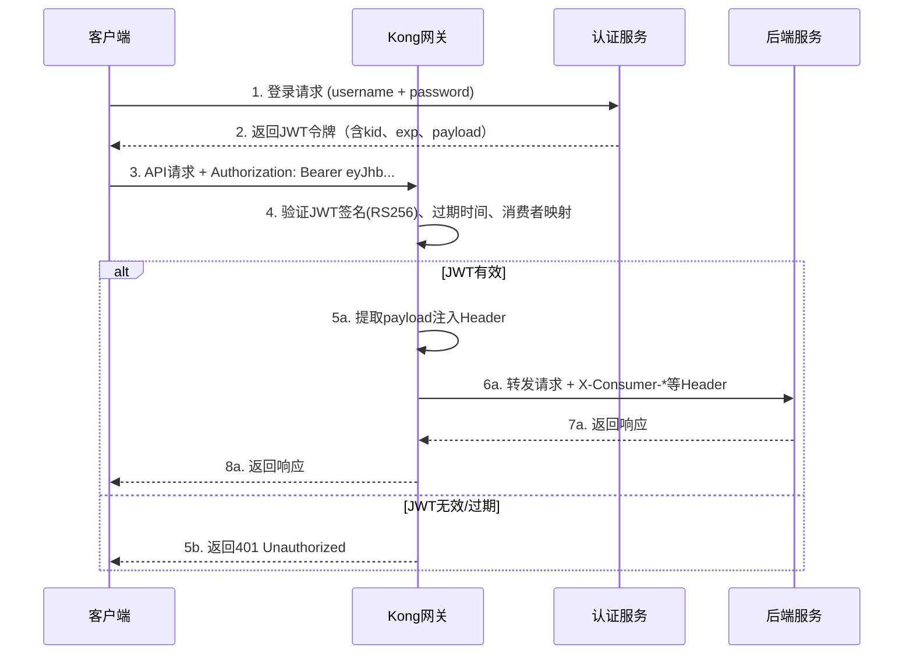
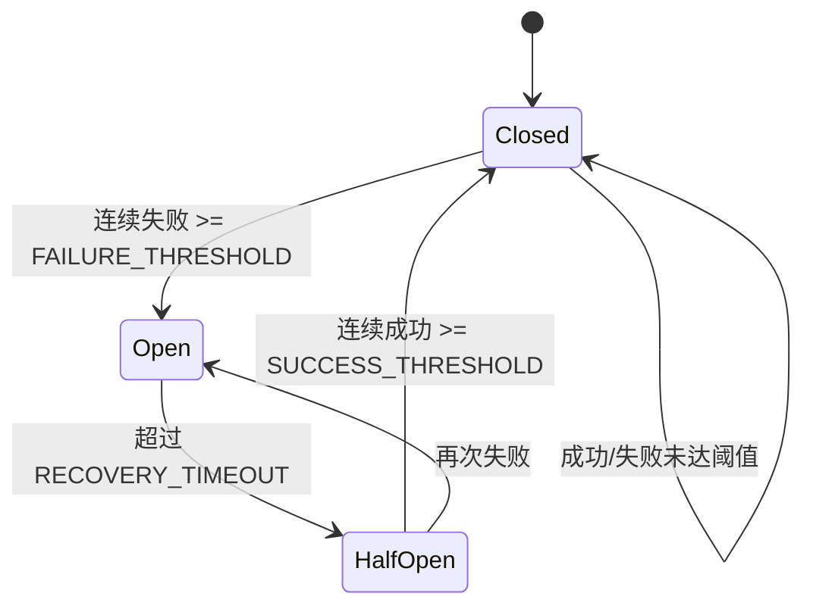
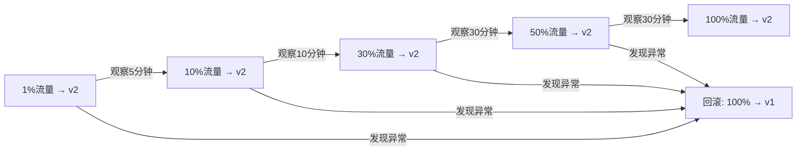
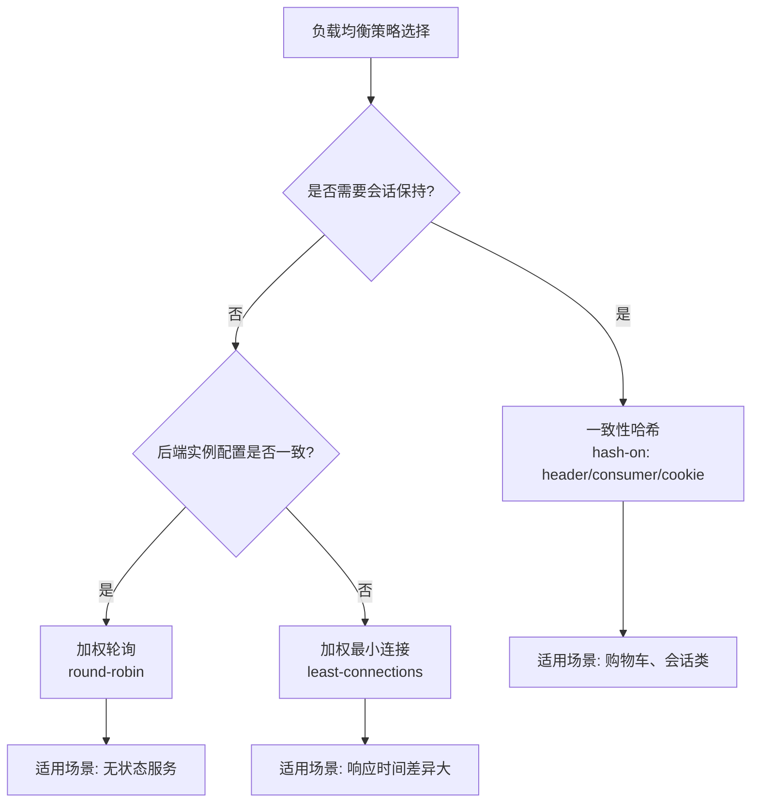
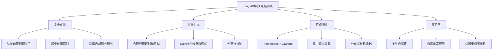
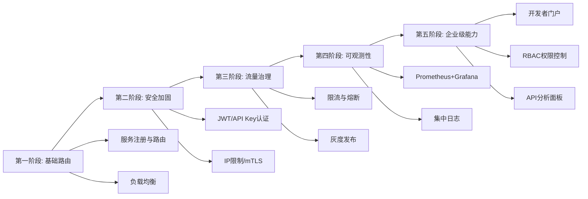

## 案例一：Kong实战——从零搭建企业级API网关

本案例以一个真实的电商平台微服务架构为背景，完整演示如何从零搭建Kong API网关，涵盖安装部署、服务注册、路由配置、插件启用、安全加固、限流熔断、灰度发布、可观测性建设等全流程。通过这个案例，你将掌握Kong在生产环境中的最佳实践，能够独立完成企业级API网关的规划、部署和运维。

### 1. 案例背景与架构设计

#### 1.1 业务场景

某中型电商平台（日活用户约50万，峰值QPS约3万）采用微服务架构，后端包含以下核心服务：

| 服务名称 | 职责 | 技术栈 | 部署方式 |
|---------|------|--------|---------|
| 用户服务 | 注册、登录、个人信息管理 | Spring Boot + MySQL | 3副本 |
| 商品服务 | 商品列表、详情、搜索 | Go + Elasticsearch | 4副本 |
| 订单服务 | 下单、支付、退款 | Spring Boot + PostgreSQL | 3副本 |
| 库存服务 | 库存查询与扣减 | Go + Redis | 3副本 |
| 通知服务 | 短信、邮件、站内信 | Node.js + RabbitMQ | 2副本 |

**面临的痛点：**

- 每个服务独立暴露端口，客户端需维护多个服务地址，联调和迁移成本高
- 认证逻辑在每个服务中重复实现，安全策略不统一，存在认证绕过风险
- 大促期间流量突增（峰值可达日常10-50倍），缺乏统一的限流和熔断机制
- 缺少统一的API版本管理和灰度发布能力，每次发版都是全量切换，故障影响面大
- 日志分散在各服务中，缺乏统一的请求追踪，排查问题效率极低
- 第三方合作伙伴接入时，每个服务都需要单独对接鉴权方案，开发周期长

#### 1.2 架构方案

引入Kong作为统一的API网关层，所有客户端请求先经过Kong，再由Kong转发到后端微服务：

```mermaid
graph TB
    subgraph 客户端
        A[Web前端] 
        B[iOS App]
        C[Android App]
        D[第三方合作伙伴]
    end
    
    subgraph Kong API网关集群
        E[Kong Node 1]
        F[Kong Node 2]
        G[Kong Node 3]
        H[PostgreSQL 主库]
        I[PostgreSQL 从库]
    end
    
    subgraph 后端微服务
        J[用户服务 x3]
        K[商品服务 x4]
        L[订单服务 x3]
        M[库存服务 x3]
        N[通知服务 x2]
    end
    
    subgraph 可观测性
        O[Prometheus]
        P[Grafana]
        Q[Kong Vitals]
    end
    
    A &amp; B &amp; C &amp; D --> E &amp; F &amp; G
    E &amp; F &amp; G --> H
    H --> I
    E &amp; F &amp; G --> J &amp; K &amp; L &amp; M &amp; N
    E &amp; F &amp; G --> O
    O --> P
    E &amp; F &amp; G --> Q
```

**选型理由：**

- **性能**：Kong基于Nginx/OpenResty，单节点吞吐量可达数万QPS，本案例峰值3万QPS对3节点集群绰绰有余
- **插件生态**：200+官方插件覆盖认证、限流、日志、变换等需求，社区插件更丰富，避免重复造轮子
- **声明式配置**：支持Admin API和Declarative Config两种配置方式，便于自动化运维和GitOps工作流
- **集群方案成熟**：PostgreSQL作为配置存储，支持多节点水平扩展，配置变更自动同步
- **企业支持**：Kong Enterprise提供开发者门户、分析面板、RBAC等企业级功能，满足后续演进需求

### 2. 环境准备与安装部署

#### 2.1 基础环境要求

| 组件 | 最低配置 | 推荐配置 | 说明 |
|-----|---------|---------|------|
| 操作系统 | Ubuntu 20.04+ / CentOS 7+ | Ubuntu 22.04 LTS | 需64位系统 |
| CPU | 2核 | 4核+ | Nginx worker进程数等于CPU核数 |
| 内存 | 4GB | 8GB+ | Kong自身约占用512MB，需预留给Nginx工作进程 |
| 磁盘 | 20GB SSD | 100GB SSD | 日志和临时文件存储 |
| 网络 | 100Mbps | 1Gbps+ | 需开放8000(代理)、8443(代理HTTPS)、8001(Admin API)端口 |
| PostgreSQL | 12+ | 15+ | 配置存储，建议主从架构 |
| Redis | 可选 | 6.0+ | 分布式限流计数器（本地限流可不部署） |

#### 2.2 使用Docker Compose部署（推荐开发/测试环境）

Docker Compose方式适合快速搭建开发和测试环境，可以在几分钟内启动完整的Kong集群：

```yaml
# docker-compose.yml
version: '3.8'

services:
  # PostgreSQL - Kong配置存储
  kong-database:
    image: postgres:15-alpine
    container_name: kong-database
    environment:
      POSTGRES_DB: kong
      POSTGRES_USER: kong
      POSTGRES_PASSWORD: kong_pass_2024
    volumes:
      - kong-db-data:/var/lib/postgresql/data
    healthcheck:
      test: ["CMD-SHELL", "pg_isready -U kong"]
      interval: 10s
      timeout: 5s
      retries: 5
    networks:
      - kong-net

  # 数据库初始化
  kong-migration:
    image: kong:3.6
    command: kong migrations bootstrap
    depends_on:
      kong-database:
        condition: service_healthy
    environment:
      KONG_DATABASE: postgres
      KONG_PG_HOST: kong-database
      KONG_PG_PORT: 5432
      KONG_PG_USER: kong
      KONG_PG_PASSWORD: kong_pass_2024
    networks:
      - kong-net

  # Kong 网关节点1
  kong-node1:
    image: kong:3.6
    container_name: kong-node1
    depends_on:
      kong-database:
        condition: service_healthy
      kong-migration:
        condition: service_completed_successfully
    environment:
      KONG_DATABASE: postgres
      KONG_PG_HOST: kong-database
      KONG_PG_PORT: 5432
      KONG_PG_USER: kong
      KONG_PG_PASSWORD: kong_pass_2024
      KONG_PROXY_LISTEN: "0.0.0.0:8000, 0.0.0.0:8443 ssl"
      KONG_ADMIN_LISTEN: "0.0.0.0:8001"
      KONG_LOG_LEVEL: info
      KONG_PROXY_ERROR_LOG: /dev/stderr
      KONG_ADMIN_ERROR_LOG: /dev/stderr
    ports:
      - "8000:8000"    # HTTP代理
      - "8443:8443"    # HTTPS代理
      - "8001:8001"    # Admin API
    healthcheck:
      test: ["CMD", "kong", "health"]
      interval: 15s
      timeout: 5s
      retries: 3
    networks:
      - kong-net

  # Kong 网关节点2
  kong-node2:
    image: kong:3.6
    container_name: kong-node2
    depends_on:
      kong-database:
        condition: service_healthy
    environment:
      KONG_DATABASE: postgres
      KONG_PG_HOST: kong-database
      KONG_PG_PORT: 5432
      KONG_PG_USER: kong
      KONG_PG_PASSWORD: kong_pass_2024
      KONG_PROXY_LISTEN: "0.0.0.0:8000, 0.0.0.0:8443 ssl"
      KONG_ADMIN_LISTEN: "0.0.0.0:8001"
      KONG_LOG_LEVEL: info
    ports:
      - "8010:8000"
      - "8453:8443"
      - "8011:8001"
    networks:
      - kong-net

  # Redis - 分布式限流计数器
  kong-redis:
    image: redis:7-alpine
    container_name: kong-redis
    command: redis-server --maxmemory 256mb --maxmemory-policy allkeys-lru
    ports:
      - "6379:6379"
    networks:
      - kong-net

volumes:
  kong-db-data:

networks:
  kong-net:
    driver: bridge
```

启动集群：

```bash
# 启动所有服务
docker compose up -d

# 验证所有容器状态
docker compose ps
# 确认 kong-node1, kong-node2, kong-database, kong-migration, kong-redis 全部 healthy

# 验证Kong健康状态
curl -s http://localhost:8001/status | jq .
```

预期输出：

```json
{
  "database": {
    "reachable": true,
    "name": "postgres"
  },
  "server": {
    "total_requests": 0,
    "connections_active": 0,
    "connections_handled": 0,
    "connections_reading": 0,
    "connections_waiting": 0,
    "connections_writing": 0
  },
  "memory": {
    "lua_shared_dicts": {
      "kong": 76.0,
      "kong_db_cache": 76.0,
      "kong_locks": 76.0,
      "kong_proxied_by_header": 76.0
    }
  }
}
```

> **常见坑**：如果 `database.reachable` 返回 `false`，通常是数据库初始化未完成或密码不匹配。执行 `docker compose logs kong-migration` 查看迁移日志，确认没有报错。

#### 2.3 生产环境裸机/VM部署

生产环境推荐裸机或虚拟机部署，可以获得更好的性能和更灵活的系统调优：

```bash
# ===== Ubuntu 22.04 部署步骤 =====

# 1. 安装依赖
sudo apt-get update
sudo apt-get install -y curl apt-transport-https gnupg

# 2. 添加Kong APT仓库
curl -1sLf 'https://packages.konghq.com/public/gateway-36/gpg.E0336F46BD5140C0.key' | \
  sudo gpg --dearmor -o /usr/share/keyrings/kong-gateway-36-archive-keyring.gpg

echo "deb [signed-by=/usr/share/keyrings/kong-gateway-36-archive-keyring.gpg] \
  https://packages.konghq.com/public/gateway-36/deb/ubuntu $(lsb_release -cs) main" | \
  sudo tee /etc/apt/sources.list.d/kong-gateway-36.list

# 3. 安装Kong
sudo apt-get update
sudo apt-get install -y kong=3.6.1

# 4. 编辑Kong配置
sudo cp /etc/kong/kong.conf.default /etc/kong/kong.conf
sudo vim /etc/kong/kong.conf
```

关键配置项：

```nginx
# /etc/kong/kong.conf - 生产环境关键配置

# 数据库配置
database = postgres
postgres host = 10.0.1.100
postgres port = 5432
postgres user = kong
postgres password = ${KONG_PG_PASSWORD}  # 通过环境变量注入，不要明文写入
postgres database = kong

# 代理配置
proxy_listen = 0.0.0.0:8000, 0.0.0.0:8443 ssl
admin_listen = 127.0.0.1:8001  # Admin API仅本地访问，生产环境绝对不能暴露到公网

# 性能调优
nginx_worker_processes = auto  # 自动匹配CPU核数
upstream_keepalive_pool_size = 60
upstream_keepalive_max_requests = 1000
upstream_keepalive_idle_timeout = 60

# 日志配置
proxy_access_log = /var/log/kong/access.log
proxy_error_log = /var/log/kong/error.log
admin_access_log = /var/log/kong/admin_access.log

# 安全配置
hide_client_headers = true  # 隐藏Server响应头，防止指纹识别
# headers_upstream = false  # 可选：不转发客户端的某些Header
```

```bash
# 5. 创建日志目录
sudo mkdir -p /var/log/kong
sudo chown kong:kong /var/log/kong

# 6. 初始化数据库
sudo kong migrations bootstrap

# 7. 启动Kong
sudo systemctl enable kong
sudo systemctl start kong

# 8. 验证
curl -s http://127.0.0.1:8001/status | jq '.database.reachable'
# 输出: true
```

> **安全提醒**：生产环境中 `admin_listen` 必须绑定 `127.0.0.1`，绝不能暴露到公网。Admin API拥有完整的管理权限，一旦泄露等于将整个网关控制权拱手让人。如果需要远程管理，通过SSH隧道或VPN访问。

### 3. 核心配置：服务与路由

#### 3.1 注册后端服务

Kong通过Service对象定义后端服务的地址和连接参数。Service本质上是一个抽象层，将逻辑服务名与实际的后端地址解耦：

```bash
# 注册用户服务
curl -i -X POST http://localhost:8001/services/ \
  --data name=user-service \
  --data url='http://user-service.internal:8080' \
  --data connect_timeout=5000 \
  --data write_timeout=10000 \
  --data read_timeout=10000 \
  --data retries=3

# 注册商品服务
curl -i -X POST http://localhost:8001/services/ \
  --data name=product-service \
  --data url='http://product-service.internal:8080' \
  --data connect_timeout=5000 \
  --data write_timeout=10000 \
  --data read_timeout=10000

# 注册订单服务（写操作超时更长）
curl -i -X POST http://localhost:8001/services/ \
  --data name=order-service \
  --data url='http://order-service.internal:8080' \
  --data connect_timeout=5000 \
  --data write_timeout=15000 \
  --data read_timeout=15000

# 注册库存服务
curl -i -X POST http://localhost:8001/services/ \
  --data name=inventory-service \
  --data url='http://inventory-service.internal:8080'

# 注册通知服务
curl -i -X POST http://localhost:8001/services/ \
  --data name=notification-service \
  --data url='http://notification-service.internal:3000'
```

**Service对象关键参数说明：**

| 参数 | 含义 | 推荐值 | 说明 |
|-----|------|-------|------|
| connect_timeout | 连接超时(ms) | 3000-5000 | Kong→后端的TCP连接超时，过长会导致Kong连接池被占满 |
| write_timeout | 写超时(ms) | 10000 | 发送请求体到后端的超时，上传/大报文场景需加大 |
| read_timeout | 读超时(ms) | 10000-30000 | 等待后端响应的超时，复杂查询场景需加大 |
| retries | 失败重试次数 | 2-3 | 仅对5xx和连接错误重试，4xx不会重试 |
| path | 路径前缀 | / | 转发时附加的路径前缀 |

#### 3.2 配置路由规则

路由（Route）是Kong的入口，定义了请求如何匹配并转发到对应的Service。每个路由可以匹配多个路径、HTTP方法、Host头等条件：

```bash
# 用户服务路由
curl -i -X POST http://localhost:8001/services/user-service/routes \
  --data name=user-routes \
  --data 'paths[]=/api/v1/users' \
  --data 'paths[]=/api/v1/auth' \
  --data 'methods[]=GET' \
  --data 'methods[]=POST' \
  --data 'methods[]=PUT' \
  --data 'methods[]=DELETE' \
  --data strip_path=true \
  --data preserve_host=false

# 商品服务路由 - 支持前缀匹配
curl -i -X POST http://localhost:8001/services/product-service/routes \
  --data name=product-routes \
  --data 'paths[]=/api/v1/products' \
  --data 'paths[]=/api/v1/categories' \
  --data 'paths[]=/api/v1/search' \
  --data 'methods[]=GET' \
  --data 'methods[]=POST' \
  --data strip_path=true

# 订单服务路由
curl -i -X POST http://localhost:8001/services/order-service/routes \
  --data name=order-routes \
  --data 'paths[]=/api/v1/orders' \
  --data 'paths[]=/api/v1/payments' \
  --data 'methods[]=GET' \
  --data 'methods[]=POST' \
  --data 'methods[]=PUT' \
  --data strip_path=true

# 库存服务路由（内部服务，仅允许内网访问）
curl -i -X POST http://localhost:8001/services/inventory-service/routes \
  --data name=inventory-routes \
  --data 'paths[]=/api/v1/inventory' \
  --data 'methods[]=GET' \
  --data 'methods[]=POST' \
  --data strip_path=true \
  --data hosts[]=internal.example.com

# 通知服务路由
curl -i -X POST http://localhost:8001/services/notification-service/routes \
  --data name=notification-routes \
  --data 'paths[]=/api/v1/notifications' \
  --data 'methods[]=GET' \
  --data 'methods[]=POST' \
  --data strip_path=true
```

**路由匹配规则详解：**

- **paths匹配**：`/api/v1/products` 会匹配 `/api/v1/products`、`/api/v1/products/123`、`/api/v1/products/123/reviews` 等所有以此为前缀的路径。Kong的路由匹配是前缀匹配，不是精确匹配
- **strip_path=true**：转发时去掉匹配的路径前缀。例如客户端请求 `/api/v1/users/123`，后端收到 `/users/123`。如果 `strip_path=false`，后端收到完整路径 `/api/v1/users/123`
- **methods过滤**：仅匹配指定的HTTP方法，其他方法返回404。这是一种基本的HTTP方法保护
- **hosts过滤**：基于Host头的匹配，用于区分内外网或不同域名。可以和paths组合使用，实现更精确的路由

> **strip_path陷阱**：当strip_path=true且Service配置了path前缀时，两个路径会拼接。例如路由paths=`/api/v1/users`，Service path=`/v1`，strip_path=true，那么 `/api/v1/users/123` 会先去掉匹配前缀变成 `/users/123`，再加上Service的path前缀变成 `/v1/users/123`。设计路由时务必考虑这一行为。

#### 3.3 基于声明式配置（Declarative Config）

生产环境中推荐使用声明式配置配合GitOps流程，将所有服务和路由定义在一个YAML文件中，通过版本控制管理变更：

```yaml
# kong.yml - 声明式配置文件
_format_version: "3.0"

services:
  # 用户服务
  - name: user-service
    url: http://user-service.internal:8080
    connect_timeout: 5000
    write_timeout: 10000
    read_timeout: 10000
    retries: 3
    routes:
      - name: user-routes
        paths:
          - /api/v1/users
          - /api/v1/auth
        methods:
          - GET
          - POST
          - PUT
          - DELETE
        strip_path: true
        preserve_host: false

  # 商品服务
  - name: product-service
    url: http://product-service.internal:8080
    connect_timeout: 5000
    write_timeout: 10000
    read_timeout: 10000
    retries: 3
    routes:
      - name: product-routes
        paths:
          - /api/v1/products
          - /api/v1/categories
          - /api/v1/search
        methods:
          - GET
          - POST
        strip_path: true

  # 订单服务
  - name: order-service
    url: http://order-service.internal:8080
    connect_timeout: 5000
    write_timeout: 15000
    read_timeout: 15000
    retries: 2
    routes:
      - name: order-routes
        paths:
          - /api/v1/orders
          - /api/v1/payments
        methods:
          - GET
          - POST
          - PUT
        strip_path: true

  # 库存服务（内部）
  - name: inventory-service
    url: http://inventory-service.internal:8080
    routes:
      - name: inventory-routes
        paths:
          - /api/v1/inventory
        hosts:
          - internal.example.com
        methods:
          - GET
          - POST
        strip_path: true

  # 通知服务
  - name: notification-service
    url: http://notification-service.internal:3000
    routes:
      - name: notification-routes
        paths:
          - /api/v1/notifications
        methods:
          - GET
          - POST
        strip_path: true
```

```bash
# 加载声明式配置（dbless模式或覆盖模式）
kong start -c /etc/kong/kong.conf --conf /path/to/kong.yml

# 或通过Admin API热加载（不会中断现有连接）
curl -X POST http://localhost:8001/config \
  --data-binary @kong.yml

# 查看当前生效的配置（增量 diff）
curl -X POST http://localhost:8001/config \
  --data-binary @kong.yml \
  --data query=check_hash=true
```

**声明式配置 vs Admin API 的选择：**

| 维度 | 声明式配置 | Admin API |
|------|-----------|-----------|
| 配置管理 | Git版本控制，可审计可回滚 | 即时生效，无版本记录 |
| 操作方式 | 文件加载或热加载 | 逐条REST API调用 |
| 适合场景 | 大规模配置变更、CI/CD | 临时调试、小规模调整 |
| 风险 | 配置文件错误会全量覆盖 | 单条API出错影响范围小 |
| 推荐 | 生产环境首选 | 开发调试辅助 |

### 4. 安全加固：认证与授权

安全是API网关最核心的职责之一。Kong将认证、授权等横切关注点集中到网关层处理，后端服务只需关注业务逻辑。

#### 4.1 全局JWT认证

对外暴露的API（用户、商品、订单）统一启用JWT认证，所有请求必须携带有效的JWT令牌：

```bash
# 全局启用JWT插件（对所有路由生效）
curl -i -X POST http://localhost:8001/plugins \
  --data name=jwt \
  --data config.key_claim_name=kid \
  --data config.uri_param_names=jwt \
  --data config.header_names=Authorization \
  --data config.header_prefix=Bearer

# 创建JWT消费者（即接入方）
curl -i -X POST http://localhost:8001/consumers \
  --data username=web-app \
  --data custom_id=web_frontend_2024

# 为消费者关联JWT凭证
curl -i -X POST http://localhost:8001/consumers/web-app/jwt \
  --data rsa_public_key="$(cat /path/to/public_key.pem)" \
  --data algorithm=RS256

# 输出中包含关键信息：
# key: <自动生成的JWT标识>
# rsa_public_key: <公钥指纹>
```

**JWT认证流程：**



Kong验证JWT后，会自动向后端注入以下Header，后端服务通过这些Header获取用户身份：

| Header名称 | 含义 | 示例值 |
|------------|------|-------|
| X-Consumer-Id | 消费者唯一ID | a1b3c4d5e6f7 |
| X-Consumer-Username | 消费者用户名 | web-app |
| X-Consumer-Custom-Id | 自定义标识 | web_frontend_2024 |
| X-Credential-Id | 凭证ID | jwt_credential_id_value |
| X-JWT-Claims | JWT的claims（可选配置） | {"sub":"user123","exp":...} |

> **安全提示**：JWT的私钥应妥善保管在密钥管理系统中（如Vault），绝不能泄露。定期轮换密钥，建议每90天更换一次。Kong支持RS256、ES256等非对称算法，生产环境建议使用RS256或ES256，避免使用HS256（对称算法需要在网关存储密钥）。

#### 4.2 全局限用Key-Auth（API Key认证）

对第三方合作伙伴使用API Key认证，与JWT并存。API Key适合服务端到服务端的调用场景：

```bash
# 启用key-auth插件
curl -i -X POST http://localhost:8001/plugins \
  --data name=key-auth \
  --data config.key_names=apikey,X-API-Key \
  --data config.hide_credentials=true

# 创建第三方消费者
curl -i -X POST http://localhost:8001/consumers \
  --data username=partner-company-a \
  --data custom_id=partner_001

# 为该消费者生成API Key
curl -i -X POST http://localhost:8001/consumers/partner-company-a/key-auth
# 输出中包含 key: <生成的API Key>
```

**认证插件优先级与组合策略：**

Kong支持同时启用多个认证插件。当多个认证插件同时存在时，Kong要求请求满足**所有**插件的认证要求。但实际场景中更常见的做法是按路由级别启用不同的认证方式：

```bash
# 公开API路由 - JWT认证（前端用户）
curl -i -X POST http://localhost:8001/routes/user-routes/plugins \
  --data name=jwt

# 第三方API路由 - API Key认证（合作伙伴）
curl -i -X POST http://localhost:8001/routes/external-api-routes/plugins \
  --data name=key-auth \
  --data config.key_names=apikey
```

#### 4.3 IP限制（内部服务保护）

对库存服务等内部接口，限制仅允许内网IP访问，防止外部直接绕过认证访问内部服务：

```bash
# 库存服务路由启用IP限制
curl -i -X POST http://localhost:8001/routes/inventory-routes/plugins \
  --data name=ip-restriction \
  --data 'config.allow[]=10.0.0.0/8' \
  --data 'config.allow[]=172.16.0.0/12' \
  --data 'config.allow[]=192.168.0.0/16' \
  --data config.status=403 \
  --data config.message="Internal service - access denied"
```

#### 4.4 mTLS双向认证（高级安全场景）

对于安全等级最高的服务间通信（如支付回调），可以启用mTLS（双向TLS认证），双方都需要出示证书：

```bash
# 创建CA证书（用于签发服务证书）
# openssl req -x509 -nodes -days 3650 -newkey rsa:2048 \
#   -keyout ca-key.pem -out ca-cert.pem -subj "/CN=Internal CA"

# 在Kong中配置TLS证书
curl -i -X POST http://localhost:8001/certificates \
  -F "cert=@/path/to/server-cert.pem" \
  -F "key=@/path/to/server-key.pem" \
  -F "certificates[]=@/path/to/ca-cert.pem" \
  --data snis[]=api.example.com

# 启用mTLS插件（客户端证书验证）
curl -i -X POST http://localhost:8001/plugins \
  --data name=mtls-auth \
  --data config.ca_certificates[]=ca-cert-uuid \
  --data config.config认证方式=and \
  --data config.skip_consumer_lookup=false
```

mTLS的典型应用场景：

- 支付网关与银行系统之间的通信
- 内部服务间的高安全等级调用
- 合规要求（如PCI-DSS、金融行业监管要求）

### 5. 流量治理：限流与熔断

流量治理是API网关的核心能力之一。在大促、秒杀等流量突增场景下，合理的限流和熔断策略可以保护后端服务不被打垮，保证核心业务可用。

#### 5.1 全局限流（保护后端不被打垮）

```bash
# 全局限流：每秒10000请求，使用Redis作为计数器（支持多节点共享）
curl -i -X POST http://localhost:8001/plugins \
  --data name=rate-limiting \
  --data config.second=10000 \
  --data config.policy=redis \
  --data config.redis_host=kong-redis \
  --data config.redis_port=6379 \
  --data config.redis_database=0 \
  --data config.fault_tolerant=true \
  --data config.hide_client_headers=false \
  --data config.error_code=429 \
  --data config.error_message="请求过于频繁，请稍后重试"
```

**限流策略按服务差异化配置：**

```bash
# 用户服务 - 登录接口更严格（防暴力破解）
curl -i -X POST http://localhost:8001/routes/user-routes/plugins \
  --data name=rate-limiting \
  --data config.second=100 \
  --data config.policy=redis \
  --data config.redis_host=kong-redis \
  --data config.limit_by=consumer

# 商品服务 - 搜索接口高并发（允许较高流量）
curl -i -X POST http://localhost:8001/routes/product-routes/plugins \
  --data name=rate-limiting \
  --data config.second=5000 \
  --data config.policy=redis \
  --data config.redis_host=kong-redis

# 订单服务 - 下单接口严格限流（防刷单）
curl -i -X POST http://localhost:8001/routes/order-routes/plugins \
  --data name=rate-limiting \
  --data config.minute=30 \
  --data config.policy=redis \
  --data config.redis_host=kong-redis \
  --data config.limit_by=consumer
```

> **注意**：限流的 `config.policy` 参数有三个选项：`local`（单节点计数，多节点不共享）、`redis`（推荐，多节点共享计数）、`cluster`（使用Kong数据库，性能最差）。多节点部署时必须使用 `redis`，否则每个节点各自计数，实际限流阈值会是配置值的N倍。

**限流响应头说明：**

Kong在响应中自动注入以下Header，客户端可据此做降级处理：

| Header | 含义 | 示例 |
|--------|------|------|
| RateLimit-Limit | 窗口内允许的最大请求数 | 100 |
| RateLimit-Remaining | 窗口内剩余可用请求数 | 47 |
| RateLimit-Reset | 窗口重置的剩余秒数 | 32 |
| Retry-After | 建议重试等待时间（秒） | 12 |

客户端应根据这些Header实现自适应降级：当 `Remaining` 接近0时，主动降低请求频率或切换到备用接口。

#### 5.2 熔断保护（防止级联故障）

Kong社区版不内置熔断插件，通过自定义OpenResty Lua脚本实现。熔断器遵循经典的三态模型：Closed（正常）→ Open（熔断）→ Half-Open（试探恢复）：

```lua
-- 自定义熔断器插件: kong/plugins/circuit-breaker/handler.lua
local kong = kong
local ngx = ngx
local now = ngx.now

local CircuitBreaker = {
  PRIORITY = 910,  -- 在限流插件之前执行
  VERSION = "1.0.0",
}

-- 配置参数
local FAILURE_THRESHOLD = 5      -- 连续失败5次触发熔断
local RECOVERY_TIMEOUT = 30      -- 熔断30秒后进入半开状态
local SUCCESS_THRESHOLD = 3      -- 半开状态连续成功3次恢复

-- 存储每个服务的熔断状态（内存级，重启后重置）
-- 生产环境建议替换为Redis或kong.ctx.shared持久化
local states = {}

-- access阶段：检查熔断状态，决定是否放行请求
function CircuitBreaker:access(conf)
  local service_obj = kong.router and kong.router.get_service()
  if not service_obj then return end
  
  local service_name = service_obj.name
  local state = states[service_name]

  if state then
    if state.state == "open" then
      -- 检查是否超过恢复超时，尝试进入半开状态
      if now() - state.last_fail_time > RECOVERY_TIMEOUT then
        state.state = "half-open"
        state.half_open_successes = 0
        kong.log.info("Circuit breaker half-open for: ", service_name)
      else
        -- 熔断中，直接返回503
        local retry_after = math.ceil(RECOVERY_TIMEOUT - (now() - state.last_fail_time))
        kong.response.exit(503, {
          message = "Service temporarily unavailable",
          retry_after = retry_after
        })
      end
    end
  end
end

-- header_filter阶段：根据后端响应状态码更新熔断状态
function CircuitBreaker:header_filter(conf)
  local status = kong.response.get_status()
  local service_obj = kong.router and kong.router.get_service()
  if not service_obj then return end
  
  local service_name = service_obj.name

  if not states[service_name] then
    states[service_name] = { state = "closed", fail_count = 0 }
  end

  local s = states[service_name]

  if status >= 500 then
    -- 后端返回5xx，记录失败
    s.fail_count = (s.fail_count or 0) + 1
    s.last_fail_time = now()

    if s.state == "half-open" then
      -- 半开状态失败，重新熔断
      s.state = "open"
      s.fail_count = 0
      kong.log.warn("Circuit breaker re-opened for: ", service_name)
    elseif s.fail_count >= FAILURE_THRESHOLD then
      -- 连续失败达到阈值，触发熔断
      s.state = "open"
      s.fail_count = 0
      kong.log.warn("Circuit breaker opened for: ", service_name)
    end
  elseif status >= 200 and status < 400 then
    if s.state == "half-open" then
      s.half_open_successes = (s.half_open_successes or 0) + 1
      if s.half_open_successes >= SUCCESS_THRESHOLD then
        -- 半开状态连续成功足够次数，恢复正常
        s.state = "closed"
        s.fail_count = 0
        kong.log.info("Circuit breaker closed for: ", service_name)
      end
    else
      -- 正常状态，重置失败计数
      s.fail_count = 0
      s.state = "closed"
    end
  end
end

return CircuitBreaker
```

**熔断器状态流转说明：**



> **生产环境注意事项**：上述示例使用内存存储状态，Kong节点重启后状态会丢失。生产环境应将状态持久化到Redis，或使用OpenResty的 `lua_shared_dict` 实现跨worker共享（但不跨节点）。多节点场景下，建议每个节点独立维护熔断状态，避免网络延迟影响判断。

#### 5.3 请求超时与重试策略

超时和重试需要按业务场景精细化配置。不同操作的幂等性和时延特征不同，不能一刀切：

```bash
# 为订单服务设置更长的超时（支付回调可能较慢）
curl -i -X PATCH http://localhost:8001/services/order-service \
  --data connect_timeout=5000 \
  --data write_timeout=30000 \
  --data read_timeout=30000 \
  --data retries=1  # 支付相关接口仅重试1次，避免重复扣款

# 为商品搜索设置较短超时 + 更多重试（读操作可安全重试）
curl -i -X PATCH http://localhost:8001/services/product-service \
  --data connect_timeout=3000 \
  --data write_timeout=5000 \
  --data read_timeout=10000 \
  --data retries=3
```

**重试策略最佳实践：**

| 场景 | 重试次数 | 超时设置 | 说明 |
|-----|---------|---------|------|
| 读操作（GET） | 3次 | 短（5-10s） | 读操作天然幂等，可安全重试 |
| 写操作（POST/PUT） | 1次 | 长（15-30s） | 非幂等操作需谨慎，依赖幂等键防重复 |
| 支付回调 | 0-1次 | 很长（30s+） | 依赖幂等键防重复扣款 |
| 搜索查询 | 3次 | 短（5s） | 可快速失败快速重试 |
| WebSocket | 不重试 | N/A | 长连接不适合重试机制 |

> **重试的陷阱**：当后端服务已经过载时，重试会加剧问题（重试风暴）。Kong默认只对5xx和连接错误重试，4xx不重试。但如果后端因过载返回5xx，所有客户端的重试请求会进一步压垮后端。建议配合熔断器使用，当熔断器打开时自动停止重试。

### 6. API版本管理与灰度发布

API版本管理是痛点中提到的核心需求之一。没有版本管理，接口变更会导致客户端崩溃；没有灰度发布，新版本上线就是一次豪赌。

#### 6.1 基于路径的版本管理

最简单直观的版本管理方式，通过URL路径区分版本：

```bash
# v1版本路由（旧版本，保留兼容）
curl -i -X POST http://localhost:8001/services/user-service-v1/routes \
  --data name=user-routes-v1 \
  --data 'paths[]=/api/v1/users' \
  --data strip_path=true

# v2版本路由（新版本，功能增强）
curl -i -X POST http://localhost:8001/services/user-service-v2/routes \
  --data name=user-routes-v2 \
  --data 'paths[]=/api/v2/users' \
  --data strip_path=true
```

**版本管理策略对比：**

| 策略 | 实现方式 | 优点 | 缺点 |
|------|---------|------|------|
| 路径版本 | `/api/v1/`, `/api/v2/` | 直观、易于路由、缓存友好 | URL变长、客户端需手动切换 |
| Header版本 | `Accept: application/vnd.api.v2+json` | URL简洁、语义清晰 | 调试不便、CDN缓存复杂 |
| 查询参数 | `/users?version=2` | 实现简单 | 容易遗忘、缓存不友好 |
| 消费者版本 | 不同consumer走不同后端 | 无感切换 | 粒度粗、管理复杂 |

推荐使用路径版本，因为它最直观、最易于调试和监控。当需要废弃旧版本时，通过Kong的路由优先级机制控制流量分配。

#### 6.2 基于权重的灰度发布

灰度发布通过权重路由逐步切换流量，实现新版本的渐进式上线：

```bash
# 步骤1：注册新版本服务
curl -i -X POST http://localhost:8001/services/ \
  --data name=order-service-v2 \
  --data url='http://order-service-v2.internal:8080' \
  --data connect_timeout=5000 \
  --data write_timeout=15000

# 步骤2：创建灰度路由（通过Header条件匹配）
curl -i -X POST http://localhost:8001/services/order-service-v2/routes \
  --data name=order-routes-canary \
  --data 'paths[]=/api/v1/orders' \
  --data 'headers[]=X-Canary: true' \
  --data strip_path=true

# 步骤3：通过消费者级别灰度（内测用户优先）
curl -i -X POST http://localhost:8001/consumers/beta-tester-group/plugins \
  --data name=request-transformer \
  --data 'config.add.headers[]=X-Canary: true'
```

更精细的灰度发布通过Upstream权重控制：

```bash
# 创建带权重的upstream，按比例分流
curl -i -X POST http://localhost:8001/upstreams/order-upstream/targets \
  --data target=order-service-v1.internal:8080 \
  --data weight=90  # 90%流量到v1

curl -i -X POST http://localhost:8001/upstreams/order-upstream/targets \
  --data target=order-service-v2.internal:8080 \
  --data weight=10  # 10%流量到v2（灰度）
```

**灰度发布流程模板：**



每个阶段的观察指标：
- 5xx错误率是否上升
- P99延迟是否异常增长
- CPU/内存使用率是否正常
- 业务指标（如下单成功率）是否正常

> **灰度回滚**：如果任何阶段发现异常，立即通过Admin API将权重调回0%即可实现秒级回滚。这也是使用Kong做灰度发布的核心优势——不需要重启服务，不需要重新部署，只需修改权重。

### 7. 请求/响应变换

#### 7.1 请求头注入

```bash
# 为所有请求注入请求ID和来源标识
curl -i -X POST http://localhost:8001/plugins \
  --data name=request-transformer \
  --data 'config.add.headers[]=X-Request-ID:$(request_id)' \
  --data 'config.add.headers[]=X-Gateway-Timestamp:$(now)' \
  --data 'config.add.headers[]=X-Forwarded-By: Kong'

# 为特定路由添加内部认证Header（从Vault获取敏感值）
curl -i -X POST http://localhost:8001/routes/inventory-routes/plugins \
  --data name=request-transformer \
  --data 'config.add.headers[]=X-Internal-Token: $(vault://env/INTERNAL_SERVICE_TOKEN)'
```

#### 7.2 响应体裁剪

```bash
# 商品列表接口裁剪敏感字段（供应商信息、成本价等不应暴露给前端）
curl -i -X POST http://localhost:8001/routes/product-routes/plugins \
  --data name=response-transformer \
  --data 'config.remove.json_fields[]=*.internal_code' \
  --data 'config.remove.json_fields[]=*.supplier_info' \
  --data 'config.remove.json_fields[]=*.cost_price'
```

#### 7.3 CORS配置

```bash
# 全局CORS配置
curl -i -X POST http://localhost:8001/plugins \
  --data name=cors \
  --data 'config.origins[]=https://www.example.com' \
  --data 'config.origins[]=https://admin.example.com' \
  --data 'config.methods[]=GET' \
  --data 'config.methods[]=POST' \
  --data 'config.methods[]=PUT' \
  --data 'config.methods[]=DELETE' \
  --data 'config.methods[]=OPTIONS' \
  --data 'config.headers[]=Authorization' \
  --data 'config.headers[]=Content-Type' \
  --data 'config.headers[]=X-API-Key' \
  --data config.max_age=3600 \
  --data config.credentials=true \
  --data config.exposed_headers[]=X-Request-ID
```

> **CORS安全提示**：`config.origins` 不要使用通配符 `*`，特别是 `credentials=true` 时浏览器不允许 `*` 作为Origin。始终明确列出允许的域名。

#### 7.4 请求体大小限制

防止超大请求耗尽后端资源：

```bash
# 限制请求体最大10MB
curl -i -X POST http://localhost:8001/plugins \
  --data name=request-size-limiting \
  --data config.allowed_payload_size=10 \
  --data config.size_unit=megabytes \
  --data config.require_content_length=true
```

### 8. 负载均衡

#### 8.1 Kong内置负载均衡算法

Kong默认使用基于权重的轮询算法，也支持一致性哈希和最小连接数：

```bash
# 更新用户服务为多上游（负载均衡到多个后端实例）
curl -i -X POST http://localhost:8001/upstreams/user-upstream/targets \
  --data target=10.0.1.11:8080 \
  --data weight=100

curl -i -X POST http://localhost:8001/upstreams/user-upstream/targets \
  --data target=10.0.1.12:8080 \
  --data weight=100

curl -i -X POST http://localhost:8001/upstreams/user-upstream/targets \
  --data target=10.0.1.13:8080 \
  --data weight=50  # 第三个实例权重较低（配置较低的机器）

# 更新Service指向自定义upstream
curl -i -X PATCH http://localhost:8001/services/user-service \
  --data host=user-upstream
```

**负载均衡算法选择：**



**算法详细对比：**

| 算法 | 工作方式 | 优点 | 缺点 | 适用场景 |
|------|---------|------|------|---------|
| 轮询(round-robin) | 依次分配请求 | 简单均匀 | 不考虑后端负载 | 无状态服务、实例配置一致 |
| 加权轮询 | 按权重比例分配 | 适配不同配置的实例 | 静态权重，不感知实时负载 | 实例配置不同的集群 |
| 最小连接(least-connections) | 分配给当前连接数最少的节点 | 自适应负载 | 需要追踪连接数 | 长连接、处理时间差异大 |
| 一致性哈希 | 按key哈希分配到固定节点 | 天然会话亲和性 | 节点变化时影响大 | 缓存亲和、会话保持 |

#### 8.2 健康检查

```bash
# 配置主动健康检查（Kong主动探测后端）
curl -i -X PATCH http://localhost:8001/upstreams/user-upstream \
  --data config.active.http_path=/health \
  --data config.active.https_verify=false \
  --data config.active.timeout=3 \
  --data config.active.healthy.interval=10 \
  --data 'config.active.healthy.http_statuses[]=200' \
  --data 'config.active.healthy.http_statuses[]=201' \
  --data config.active.unhealthy.interval=5 \
  --data config.active.unhealthy.tcp_failures=3 \
  --data config.active.unhealthy.http_failures=5 \
  --data config.active.unhealthy.timeouts=3

# 配置被动健康检查（根据实际流量判断后端是否健康）
curl -i -X PATCH http://localhost:8001/upstreams/user-upstream \
  --data 'config.passive.healthy.http_statuses[]=200' \
  --data config.passive.unhealthy.tcp_failures=3 \
  --data config.passive.unhealthy.http_failures=5 \
  --data config.passive.unhealthy.timeouts=3
```

**健康检查机制说明：**

| 检查类型 | 工作方式 | 适用场景 | 资源消耗 |
|---------|---------|---------|---------|
| 主动检查 | Kong定时向后端发探测请求 | 需要快速发现故障节点 | 中等（产生额外探测流量） |
| 被动检查 | Kong根据实际流量判断 | 低流量服务、节省资源 | 无额外消耗 |
| 主动+被动 | 结合两种检查 | 生产环境推荐 | 较高但最可靠 |

> **健康检查最佳实践**：后端服务必须提供一个轻量级的 `/health` 端点，该端点应该检查关键依赖（数据库连接、Redis连接等）的可用性。健康检查端点的响应时间应控制在100ms以内，避免健康检查本身成为负担。

### 9. 可观测性建设

可观测性是生产环境的命脉。没有可观测性的网关就像没有仪表盘的飞机——飞着飞着就不知道在哪了。

#### 9.1 日志插件配置

```bash
# 文件日志（本地调试用）
curl -i -X POST http://localhost:8001/plugins \
  --data name=file-log \
  --data config.path=/var/log/kong/request.log \
  --data config.reopen=false

# HTTP日志（推送到集中式日志系统，推荐生产环境）
curl -i -X POST http://localhost:8001/plugins \
  --data name=http-log \
  --data config.http_endpoint=http://logstash.internal:5044/kong \
  --data config.method=POST \
  --data config.content_type=application/json \
  --data config.timeout=5000 \
  --data config.retry_count=3 \
  --data config.flush_timeout=2 \
  --data config.keepalive=60000

# TCP日志（推送到Fluentd/Logstash，性能比HTTP更好）
curl -i -X POST http://localhost:8001/plugins \
  --data name=tcp-log \
  --data config.host=fluentd.internal \
  --data config.port=24224 \
  --data config.tls=false \
  --data config.keepalive=60000
```

**日志插件选择指南：**

| 插件 | 传输方式 | 性能 | 可靠性 | 适用场景 |
|------|---------|------|--------|---------|
| file-log | 本地文件 | 最高 | 需配合日志收集Agent | 开发调试 |
| http-log | HTTP POST | 中等 | 有重试机制 | 中小规模、日志量不大 |
| tcp-log | TCP长连接 | 较高 | 需后端保证可靠接收 | 大规模、配合Fluentd/Logstash |
| syslog-log | Syslog协议 | 较高 | 系统级可靠性 | 已有Syslog基础设施 |

**HTTP日志推送的典型日志格式：**

```json
{
  "request": {
    "method": "POST",
    "uri": "/api/v1/orders",
    "url": "http://order-service.internal:8080/orders",
    "size": 512,
    "querystring": {},
    "headers": {
      "Host": "api.example.com",
      "Authorization": "Bearer eyJhb...",
      "Content-Type": "application/json",
      "X-Request-ID": "req-a1b2c3d4e5f6"
    }
  },
  "response": {
    "status": 201,
    "size": 1024,
    "headers": {
      "Content-Type": "application/json",
      "X-Request-ID": "req-a1b2c3d4e5f6"
    },
    "latencies": {
      "request": 125,
      "kong": 8,
      "proxy": 117,
      "receive": 1
    }
  },
  "upstream": {
    "address": "10.0.2.21:8080",
    "status_code": 201
  },
  "consumer": {
    "id": "consumer-uuid-123",
    "username": "web-app"
  },
  "started_at": 1719398400123
}
```

**延迟分解说明：**

日志中的 `latencies` 字段是排查性能问题的关键：
- `kong`（8ms）：Kong自身处理耗时（插件执行、路由匹配等），正常情况下应该在1-10ms
- `proxy`（117ms）：后端服务处理耗时（包含网络传输），这是关注的重点
- `request`（125ms）：总请求延迟，约等于 kong + proxy
- `receive`（1ms）：接收响应体的耗时

如果 `kong` 延迟异常偏高，说明插件执行有性能问题；如果 `proxy` 延迟高，需要排查后端服务。

#### 9.2 Prometheus指标集成

```bash
# 启用Prometheus插件
curl -i -X POST http://localhost:8001/plugins \
  --data name=prometheus \
  --data config.status_code_metrics=true \
  --data config.latency_metrics=true \
  --data config.bandwidth_metrics=true \
  --data config.upstream_health_metrics=true

# 验证指标端点
curl -s http://localhost:8001/metrics | head -50
```

Prometheus采集的关键指标：

| 指标名称 | 类型 | 含义 |
|---------|------|------|
| kong_http_requests_total | Counter | HTTP请求总数（按状态码、路由、方法分） |
| kong_http_latency_seconds | Histogram | 请求延迟分布（按路由、服务分） |
| kong_http_status_count | Counter | HTTP状态码计数 |
| kong_bandwidth_bytes | Counter | 入/出流量字节数 |
| kong_upstream_target_health | Gauge | 上游目标健康状态 |
| kong_data_plane_last_seen | Gauge | 数据面最后同步时间 |

#### 9.3 Grafana监控大盘

推荐的Grafana Dashboard关键面板配置：

```yaml
# Prometheus查询示例
panels:
  # QPS面板 - 监控总流量趋势
  - title: "总QPS"
    expr: sum(rate(kong_http_requests_total[1m])) by (service)
    
  # 错误率面板 - 及时发现异常
  - title: "5xx错误率"
    expr: |
      sum(rate(kong_http_requests_total{code=~"5.."}[5m])) by (service)
      /
      sum(rate(kong_http_requests_total[5m])) by (service)
    threshold: 0.01  # 1%告警线
    
  # 延迟面板 - 发现性能瓶颈
  - title: "P99延迟"
    expr: histogram_quantile(0.99, sum(rate(kong_http_latency_seconds_bucket[5m])) by (le, service))
    
  # 上游健康 - 监控后端可用性
  - title: "上游健康实例数"
    expr: sum(kong_upstream_target_health) by (upstream)
    
  # 限流触发率 - 评估限流阈值是否合理
  - title: "限流触发率"
    expr: sum(rate(kong_http_requests_total{code="429"}[5m])) by (service)
```

**告警规则建议：**

| 指标 | 告警条件 | 严重级别 | 处理动作 |
|------|---------|---------|---------|
| 5xx错误率 | > 1% 持续5分钟 | Warning | 检查后端健康状态 |
| 5xx错误率 | > 5% 持续2分钟 | Critical | 立即排查，考虑熔断/回滚 |
| P99延迟 | > 2秒 持续5分钟 | Warning | 排查慢查询和后端负载 |
| 限流触发率 | > 10% 持续10分钟 | Info | 评估是否需要调整限流阈值 |
| 上游健康实例 | < 预期数的50% | Critical | 紧急扩容或排查故障 |

### 10. 性能调优与生产优化

#### 10.1 Nginx层面调优

```nginx
# /etc/kong/nginx-kong.conf 中的关键调优项

# Worker进程数（与CPU核数一致）
worker_processes auto;

# 连接数优化
events {
    worker_connections 4096;
    multi_accept on;
    use epoll;
}

http {
    # 缓冲区优化
    client_body_buffer_size 16k;
    client_header_buffer_size 1k;
    large_client_header_buffers 4 8k;
    client_max_body_size 10m;

    # 代理缓冲区优化
    proxy_buffer_size 16k;
    proxy_buffers 4 32k;
    proxy_busy_buffers_size 64k;
    proxy_connect_timeout 5s;
    proxy_send_timeout 10s;
    proxy_read_timeout 10s;

    # Keepalive优化（减少TCP握手开销）
    upstream_keepalive_pool_size 60;       # 每个worker的连接池大小
    upstream_keepalive_max_requests 1000;  # 连接最大请求数
    upstream_keepalive_idle_timeout 60;    # 空闲连接超时

    # Gzip压缩（减少传输量）
    gzip on;
    gzip_min_length 1024;
    gzip_comp_level 6;
    gzip_types application/json application/javascript text/css text/plain;
}
```

#### 10.2 Linux内核调优

```bash
# /etc/sysctl.conf
# TCP连接优化
net.core.somaxconn = 65535           # 监听队列最大长度
net.ipv4.tcp_max_syn_backlog = 65535  # SYN队列长度
net.ipv4.ip_local_port_range = 1024 65535  # 可用临时端口范围

# TCP复用（快速回收关闭的连接）
net.ipv4.tcp_tw_reuse = 1
net.ipv4.tcp_fin_timeout = 15        # FIN_WAIT2超时时间

# 文件描述符（Kong每个连接消耗一个fd）
fs.file-max = 2097152
fs.nr_open = 2097152

# 网络缓冲区
net.core.rmem_max = 16777216
net.core.wmem_max = 16777216
net.ipv4.tcp_rmem = 4096 87380 16777216
net.ipv4.tcp_wmem = 4096 65536 16777216

# 应用
sudo sysctl -p

# 文件描述符限制（/etc/security/limits.conf）
kong soft nofile 1048576
kong hard nofile 1048576
```

#### 10.3 Kong缓存优化

Kong使用Lua Shared Dictionary缓存配置数据和认证信息。默认缓存较小，生产环境需要调大：

```bash
# 在kong.conf中配置（需要重启Kong生效）
# db_cache_size = 256m  # 默认50MB，生产建议256MB+

# 预热缓存（重启后主动加载配置到缓存，避免冷启动延迟）
curl -X POST http://localhost:8001/cache/purge
```

### 11. 常见问题与排查

#### 11.1 问题诊断清单

| 问题现象 | 可能原因 | 排查命令 | 解决方案 |
|---------|---------|---------|---------|
| 502 Bad Gateway | 后端服务不可达 | `curl http://service:port/health` | 检查后端健康状态和网络连通性 |
| 504 Gateway Timeout | 后端响应过慢 | 检查后端慢查询和负载 | 增大read_timeout或优化后端 |
| 429 Too Many Requests | 触发限流 | 查看RateLimit-*响应头 | 调整限流阈值或优化客户端调用频率 |
| 401 Unauthorized | JWT过期或无效 | `curl -s http://kong:8001/consumers` | 检查JWT签发和消费者配置 |
| 403 Forbidden | IP被限制或缺少认证 | 检查ip-restriction和认证插件配置 | 确认请求来源IP和认证凭证 |
| 连接被拒绝 | Kong未启动或端口配置错误 | `systemctl status kong` | 检查Kong配置和日志 |
| 响应慢但后端正常 | Kong自身瓶颈 | 检查Nginx连接数和worker利用率 | 调优Nginx和内核参数 |
| 配置不生效 | 插件作用域不正确 | `curl -s http://localhost:8001/plugins` | 检查插件是全局还是绑定了特定路由 |

#### 11.2 常用诊断命令

```bash
# 查看Kong健康状态
kong health

# 查看所有配置的服务
curl -s http://localhost:8001/services | jq '.data[].name'

# 查看某服务的路由
curl -s http://localhost:8001/services/user-service/routes | jq '.data[].paths'

# 查看已启用的插件及其作用范围
curl -s http://localhost:8001/plugins?enabled=true | jq '.data[] | {name: .name, service: .service.name, route: .route.name}'

# 查看消费者列表及其凭证
curl -s http://localhost:8001/consumers | jq '.data[].username'

# 查看Kong错误日志（最近100条错误和警告）
tail -100 /var/log/kong/error.log | grep -i "error\|warn"

# 查看Nginx连接状态
curl -s http://localhost:8001/nginx_status

# 查看限流相关的日志
grep "rate-limiting" /var/log/kong/error.log | tail -20

# 查看Kong的Lua共享字典使用情况（排查内存问题）
curl -s http://localhost:8001/status | jq '.memory.lua_shared_dicts'

# 压测（使用wrk，模拟高并发场景）
wrk -t12 -c400 -d30s -s post.lua http://localhost:8000/api/v1/products
```

#### 11.3 故障排查流程

当API网关出现异常时，建议按以下顺序排查：

1. **确认Kong自身是否健康**：`kong health`，检查进程和数据库连接
2. **检查后端服务状态**：直接访问后端健康端点，确认是后端问题还是网关问题
3. **查看错误日志**：`/var/log/kong/error.log`，找到具体错误信息
4. **检查插件配置**：确认认证、限流、CORS等插件配置是否正确
5. **网络层面排查**：`telnet`/`curl` 测试端到端连通性
6. **性能层面排查**：检查Nginx连接数、worker利用率、系统资源

### 12. 经验总结与最佳实践

#### 12.1 架构设计原则



#### 12.2 关键经验

1. **网关层保持轻量**：Kong只做路由、认证、限流、日志等横切关注点，业务逻辑下沉到后端服务。不要在网关上写复杂的请求转换逻辑，网关的每个插件都会增加延迟。

2. **认证统一下沉**：所有对外API的认证逻辑集中在Kong处理，后端服务通过X-Consumer-* Header获取身份信息，无需重复实现认证。这不仅减少了代码重复，更重要的是统一了安全策略。

3. **限流分层配置**：全局限流（防突发，保护整体）→ 路由级限流（防单接口过载）→ 消费者级限流（防单用户滥用），三层组合使用。限流阈值要根据实际流量数据调整，不能拍脑袋。

4. **超时需分场景设置**：读操作短超时+多次重试，写操作长超时+少重试，支付等关键操作不重试或仅1次重试。错误的超时设置会导致连接池耗尽或重复操作。

5. **监控先行**：上线前必须配置Prometheus + Grafana，否则出了问题只能盲猜。至少监控四个核心指标：QPS、错误率、P99延迟、上游健康状态。有了监控数据才能做数据驱动的调优。

6. **灰度发布用权重路由**：新版本上线时，通过Kong的权重路由逐步切换流量：1% → 10% → 50% → 100%，每个阶段观察5-10分钟。发现异常秒级回滚。

7. **声明式配置 + GitOps**：将kong.yml纳入版本管理，通过CI/CD流水线自动部署配置变更，避免手动操作Admin API导致配置漂移。每次配置变更都有commit记录，出了问题可以快速回滚。

8. **定期清理消费者和凭证**：建立消费者生命周期管理机制，定期清理过期的API Key和JWT凭证，防止安全风险累积。建议至少每季度清理一次。

9. **Admin API安全**：Admin API必须绑定 `127.0.0.1`，通过SSH隧道或VPN远程访问。启用Admin API的认证（basic-auth或key-auth），不要裸奔。

10. **优雅重启**：Kong支持 `kong reload` 实现零停机重启（在Worker层面），升级插件或修改配置后用reload而不是restart，避免中断现有连接。

#### 12.3 Kong与其他网关对比

| 维度 | Kong | APISIX | Nginx (原生) | Envoy |
|-----|------|--------|-------------|-------|
| 核心引擎 | OpenResty/Lua | OpenResty/Lua | Nginx C | C++ |
| 配置存储 | PostgreSQL | etcd | 配置文件 | xDS API |
| 插件生态 | 200+ (成熟) | 80+ (增长中) | 需自研 | 50+ (WASM) |
| 动态配置 | 需重启或Admin API | 全动态 | 需reload | 全动态 |
| 管理界面 | Kong Manager (企业版) | Apache APISIX Dashboard | 无 | 无 (Istio有) |
| 社区活跃度 | ★★★★★ | ★★★★☆ | ★★★★★ | ★★★★☆ |
| 学习曲线 | 中等 | 中等 | 较低 | 较高 |
| 适合场景 | 企业级API管理 | 高性能低延迟 | 简单代理 | Service Mesh |
| 社区版限制 | 无 | 无 | 无 | 无 |
| 商业版功能 | Portal, Analytics, RBAC | Tengine企业版 | NGINX Plus | Tetrate |

#### 12.4 何时选择Kong

**推荐使用Kong的场景：**

- 需要完善的企业级API管理能力（开发者门户、API生命周期、分析面板）
- 团队熟悉Lua/OpenResty技术栈，有自定义插件开发需求
- 需要丰富的开箱即用插件（认证、限流、日志、变换等200+插件）
- 后端使用PostgreSQL作为配置存储，运维团队熟悉PG
- 需要商业支持和SLA保障（Kong Enterprise）
- 已有微服务架构，需要统一的API入口和流量管控

**不推荐使用Kong的场景：**

- 超高性能、超低延迟要求（考虑APISIX或原生Envoy）
- 需要完全动态配置、不接受任何重启（考虑APISIX + etcd）
- 简单的反向代理/负载均衡（Nginx原生即可，无需引入Kong）
- 已采用Service Mesh架构（考虑Istio + Envoy）
- 团队无Lua/OpenResty经验且不需要自定义插件（考虑APISIX，配置更简单）

#### 12.5 演进路线

随着业务发展，Kong的使用可以逐步演进：



第一到第四阶段是任何团队都应该尽快完成的基础建设，第五阶段是按需演进的企业级能力。切忌一步到位——先跑通核心功能，再逐步完善。
