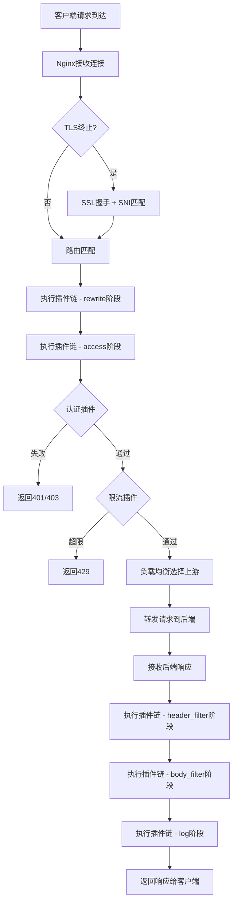
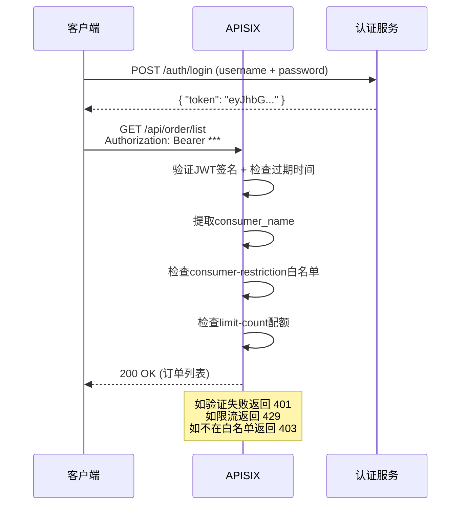
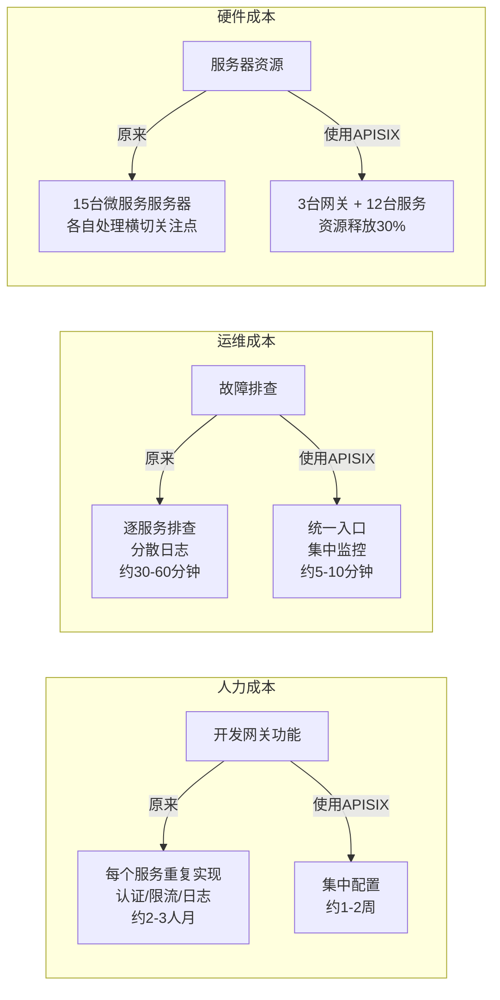

## 案例二：Apache APISIX实战

Apache APISIX是Apache基金会旗下的开源API网关项目，基于Nginx/OpenResty和etcd构建，以极高的性能和灵活的插件体系著称。本案例将从零搭建APISIX，并以一个真实的电商微服务场景为主线，演示路由管理、认证鉴权、限流熔断、可观测性等完整能力，最终达到生产可用的水平。

### 1. APISIX简介与架构

#### 1.1 为什么选择APISIX

在主流开源API网关中，Kong基于Nginx+Lua，Envoy基于C++，而APISIX选择了OpenResty（Nginx+LuaJIT）+ etcd的独特架构。这一设计带来了几个关键优势：

| 特性 | APISIX | Kong（开源版） | Envoy |
|------|--------|---------------|-------|
| 配置中心 | etcd（毫秒级生效） | PostgreSQL/Cassandra（秒级） | xDS协议（秒级） |
| 性能 | 单核18K+ RPS | 单核约10K RPS | 单核15K+ RPS |
| 插件热加载 | 支持，无需重启 | 需重启或reload | 需重新编译 |
| 动态路由 | 全动态 | 部分动态 | 动态 |
| 语言生态 | Lua + 多语言外部插件（Java/Go/Python/WSREST） | Lua为主 | Lua/C++ |
| 社区活跃度 | 高速增长 | 成熟稳定 | 非常活跃 |
| 中文社区 | 官方支持 | 较弱 | 较弱 |
| 学习曲线 | 中等 | 中等 | 较陡 |
| Kubernetes集成 | Ingress Controller + Gateway API | Ingress Controller | 原生xDS集成（Istio） |

APISIX的核心设计理念是"全动态"——路由、上游、插件、SSL证书等所有配置变更都可以在不重启、不reload的情况下实时生效。这在高并发生产环境中至关重要，因为任何配置变更都不应该影响正在处理的请求。

> **选型决策树**：
> - 团队以Java/Go为主 + 需要中文社区支持 → 优先APISIX
> - 已有Kong技术栈积累 + 不想迁移 → 继续使用Kong
> - 已采用Istio服务网格 → 直接用Envoy（Istio数据面）
> - 需要多语言插件（Java/Go/Python） → APISIX（独有的外部插件机制）

#### 1.2 核心架构

```mermaid
graph TB
    subgraph "客户端"
        C1[Web应用]
        C2[移动App]
        C3[第三方服务]
    end

    subgraph "APISIX网关集群"
        N1[Nginx/OpenResty节点1]
        N2[Nginx/OpenResty节点2]
        N3[Nginx/OpenResty节点N]
    end

    subgraph "配置层"
        ETCD1[etcd Node1]
        ETCD2[etcd Node2]
        ETCD3[etcd Node3]
    end

    subgraph "后端微服务"
        S1[用户服务]
        S2[订单服务]
        S3[商品服务]
        S4[支付服务]
    end

    C1 &amp; C2 &amp; C3 --> N1 &amp; N2 &amp; N3
    N1 &amp; N2 &amp; N3 <--> ETCD1 &amp; ETCD2 &amp; ETCD3
    N1 &amp; N2 &amp; N3 --> S1 &amp; S2 &amp; S3 &amp; S4
```

架构分为三个层次：

**数据平面**：基于Nginx/OpenResty的请求处理层。每个APISIX节点独立处理请求，通过Lua协程实现高并发。请求到达后，APISIX从本地缓存中查找路由规则和插件配置，无需每次请求都查询etcd，保证了极低的延迟开销。当etcd中的配置发生变更时，APISIX节点通过Watch机制接收推送并更新本地缓存，整个过程在毫秒级完成。

**控制平面**：etcd集群作为配置中心，存储所有路由、服务、上游、插件等配置。etcd采用Raft一致性协议保证数据强一致，3节点集群可容忍1个节点故障。当通过Admin API或Dashboard修改配置时，变更会写入etcd，etcd通过Watch机制将变更推送到各APISIX节点。选择etcd而非PostgreSQL的关键原因是：etcd天然支持Watch推送（Push模式），而数据库需要轮询（Pull模式），这决定了配置生效的延迟量级。

**插件层**：APISIX将认证、限流、日志、转换等能力封装为插件，支持Lua原生插件和外部插件（Python/Java/Go/WSREST）。插件可以在路由级别、服务级别、全局级别灵活挂载。每个插件遵循统一的生命周期钩子：`init` → `rewrite` → `access` → `header_filter` → `body_filter` → `log`，开发者可以精确控制在哪个阶段介入请求处理。

#### 1.3 关键概念

在使用APISIX之前，需要理解以下核心概念：

| 概念 | 说明 | 类比 |
|------|------|------|
| Route（路由） | 将特定请求匹配到特定服务的规则，支持URI、Header、Method、Args等多种匹配条件 | 公路指示牌 |
| Service（服务） | 一组路由的抽象，可共享上游和插件配置，减少重复定义 | 一个目的地 |
| Upstream（上游） | 后端服务实例的集合，含负载均衡策略、健康检查、重试配置 | 服务器集群 |
| Plugin（插件） | 挂载在路由/服务/全局上的功能扩展，支持热加载 | 变速车道/收费站 |
| Consumer（消费者） | API的调用方，用于认证鉴权，每个Consumer拥有独立的凭证和权限 | 通行车辆 |
| SSL（证书） | HTTPS证书管理，支持SNI多域名证书 | 安检站 |
| Plugin Config（插件配置） | 可复用的插件组合模板，多个路由共享同一套插件配置 | 通用安检方案 |

这七个概念之间的关系是：**Route → Service → Upstream** 构成请求链路，**Plugin** 挂载在Route/Service/Global上增强功能，**Plugin Config** 将常用的插件组合模板化以便复用，**Consumer** 是被认证的对象，**SSL** 保障传输安全。

#### 1.4 APISIX请求生命周期

理解请求在APISIX内部的处理流程，有助于定位问题和优化配置：



### 2. 环境搭建与部署

#### 2.1 开发环境快速启动

最简单的启动方式是使用官方Docker镜像，适合本地开发和功能验证：

```bash
# 一键启动APISIX + etcd + Dashboard（推荐方式）
git clone https://github.com/apache/apisix-docker.git
cd apisix-docker/example
docker compose -p apisix up -d

# 验证服务启动
curl http://127.0.0.1:9080/apisix/admin/routes \
  -H 'X-API-KEY: edd1c9f034335f136f87ad84b625c8f1'

# 访问Dashboard（默认账号/密码：admin/admin）
# 浏览器打开 http://127.0.0.1:9000
```

`docker compose`方式会同时启动APISIX、etcd和Dashboard，默认配置如下：

| 服务 | 端口 | 用途 |
|------|------|------|
| APISIX网关 | 9080 | HTTP流量入口 |
| APISIX网关 | 9443 | HTTPS流量入口 |
| Admin API | 9180 | 配置管理接口 |
| etcd | 2379 | 客户端连接端口 |
| etcd | 2380 | 集群内部通信端口 |
| Dashboard | 9000 | 可视化管理界面 |

> **Dashboard安全提示**：APISIX Dashboard默认开启且无需认证即可访问。开发环境可接受，但生产环境必须通过Nginx反向代理加上Basic Auth或IP白名单进行保护，或直接禁用Dashboard（`apisix.enable_admin: false`），仅通过Admin API管理。

#### 2.2 生产环境部署

生产环境需要考虑高可用、安全性和可观测性。以下是推荐的部署方案：

**第一步：系统内核参数调优**

```bash
cat >> /etc/sysctl.conf << 'EOF'
# 网络连接优化
net.core.somaxconn = 65535
net.ipv4.tcp_max_syn_backlog = 65535
net.ipv4.ip_local_port_range = 1024 65535
net.ipv4.tcp_tw_reuse = 1
net.ipv4.tcp_fin_timeout = 30
net.ipv4.tcp_keepalive_time = 600
net.ipv4.tcp_keepalive_intvl = 30
net.ipv4.tcp_keepalive_probes = 3

# 文件描述符与内存
fs.file-max = 1000000
net.core.netdev_max_backlog = 65535
net.ipv4.tcp_max_orphans = 65535
EOF
sysctl -p

# 文件描述符限制
cat >> /etc/security/limits.conf << 'EOF'
* soft nofile 1000000
* hard nofile 1000000
root soft nofile 1000000
root hard nofile 1000000
EOF
```

**第二步：安装etcd集群**

```bash
ETCD_VERSION="v3.5.14"
wget https://github.com/etcd-io/etcd/releases/download/${ETCD_VERSION}/etcd-${ETCD_VERSION}-linux-amd64.tar.gz
tar xzf etcd-${ETCD_VERSION}-linux-amd64.tar.gz
cp etcd-${ETCD_VERSION}-linux-amd64/etcd /usr/local/bin/
cp etcd-${ETCD_VERSION}-linux-amd64/etcdctl /usr/local/bin/
```

etcd集群配置（每个节点的etcd.conf.yml，以节点1为例）：

```yaml
# etcd节点配置示例（节点1：10.0.1.10）
name: etcd-1
data-dir: /data/etcd
listen-client-urls: http://0.0.0.0:2379
advertise-client-urls: http://10.0.1.10:2379
listen-peer-urls: http://0.0.0.0:2380
initial-advertise-peer-urls: http://10.0.1.10:2380
initial-cluster: >-
  etcd-1=http://10.0.1.10:2380,
  etcd-2=http://10.0.1.11:2380,
  etcd-3=http://10.0.1.12:2380
initial-cluster-state: new
initial-cluster-token: apisix-etcd-cluster
auto-compaction-mode: periodic
auto-compaction-retention: "12"  # 每12小时自动压缩历史版本
quota-backend-bytes: 8589934592  # 8GB存储上限
max-snapshots: 5                 # 保留快照数
max-wals: 5                      # 保留WAL数
```

> **etcd集群选型依据**：
> - **为什么是3节点而非2节点**：Raft协议需要多数派（N/2+1）存活才能选举leader，2节点集群只能容忍0个故障，无容错能力
> - **auto-compaction-retention**：etcd会保留所有历史版本，不压缩会耗尽磁盘空间。12小时是生产环境推荐值
> - **quota-backend-bytes**：etcd默认2GB存储上限，对于APISIX大量路由配置场景建议设为8GB

**第三步：注册为systemd服务（推荐）**

```bash
cat > /etc/systemd/system/apisix.service << 'EOF'
[Unit]
Description=Apache APISIX API Gateway
After=network.target
Wants=network-online.target

[Service]
Type=forking
User=apisix
Group=apisix
ExecStartPre=/usr/local/apisix/bin/apisix init
ExecStart=/usr/local/apisix/bin/apisix start
ExecReload=/usr/local/apisix/bin/apisix reload
ExecStop=/usr/local/apisix/bin/apisix quit
Restart=on-failure
RestartSec=5
LimitNOFILE=1000000
LimitCORE=infinity

[Install]
WantedBy=multi-user.target
EOF

systemctl daemon-reload
systemctl enable apisix
systemctl start apisix
```

#### 2.3 APISIX配置文件

APISIX的核心配置文件为`config.yaml`（或`config-default.yaml`），需要根据生产环境调整：

```yaml
# /usr/local/apisix/conf/config.yaml
apisix:
  node_listen:
    - port: 9080
      enable_http2: true
    - port: 9443
      ssl: true
  enable_admin: true
  enable_control: true
  control:
    ip: "0.0.0.0"
    port: 9092

deployment:
  role: traditional
  role_traditional:
    config_provider: etcd
  etcd:
    host:
      - "http://10.0.1.10:2379"
      - "http://10.0.1.11:2379"
      - "http://10.0.1.12:2379"
    prefix: /apisix
    timeout: 30

nginx_config:
  worker_processes: auto        # 自动匹配CPU核心数
  worker_cpu_affinity: auto     # 自动绑定CPU亲和性
  error_log: /var/log/apisix/error.log
  error_log_level: warn
  events:
    worker_connections: 10620
  http:
    access_log: /var/log/apisix/access.log
    access_log_format: |
      {"@timestamp": "$time_iso8601", "client_ip": "$remote_addr",
       "method": "$request_method", "uri": "$request_uri",
       "status": $status, "upstream_time": "$upstream_response_time",
       "request_time": $request_time, "body_bytes": $body_bytes_sent,
       "consumer": "$consumer_name", "route_id": "$route_id"}
    keepalive_timeout: 60
    send_timeout: 10
    client_header_timeout: 60
    client_body_timeout: 60

plugins:
  - api-breaker
  - authz-keycloak
  - basic-auth
  - batch-requests
  - consumer-restriction
  - cors
  - echo
  - fault-injection
  - grpc-transcode
  - hmac-auth
  - http-logger
  - ip-restriction
  - jwt-auth
  - kafka-logger
  - key-auth
  - limit-conn
  - limit-count
  - limit-req
  - node-status
  - openid-connect
  - prometheus
  - proxy-cache
  - proxy-mirror
  - proxy-rewrite
  - redirect
  - referer-restriction
  - request-id
  - request-validation
  - response-rewrite
  - serverless-post-function
  - serverless-pre-function
  - sls-logger
  - syslog
  - tcp-logger
  - udp-logger
  - uri-blocker
  - wolf-rbac
  - grpc-web
  - real-ip

# 自定义Lua插件路径
extra_lua_path: "/usr/local/apisix/custom-plugins/?.lua"
```

> **关键配置说明**：
> - `worker_processes: auto` 让Nginx自动利用所有CPU核心，生产环境不要手动设为固定值
> - `access_log` 使用JSON格式，包含`consumer`和`route_id`字段，方便ELK/Loki按消费者和路由维度分析
> - `plugins` 列表控制可用插件，不需要的插件不要加载，减少内存占用和攻击面。**未在plugins列表中声明的插件，即使在路由中配置也会被静默忽略**——这是最常见的配置不生效原因之一
> - `extra_lua_path` 指定自定义插件目录，多个路径用`;`分隔

### 3. 实战场景：电商API网关

假设一个中型电商平台，包含用户、商品、订单、支付四个核心微服务。我们用APISIX作为统一入口，实现以下目标：

```mermaid
graph LR
    subgraph "客户端"
        WEB[Web前端]
        IOS[iOS App]
        AND[Android App]
        PARTNER[第三方合作伙伴]
    end

    subgraph "APISIX网关"
        R1[用户路由<br/>/api/user/*]
        R2[商品路由<br/>/api/product/*]
        R3[订单路由<br/>/api/order/*]
        R4[支付路由<br/>/api/payment/*]
    end

    subgraph "微服务"
        SVC1[用户服务<br/>10.0.2.11-13]
        SVC2[商品服务<br/>10.0.3.11-12]
        SVC3[订单服务<br/>10.0.4.11-13]
        SVC4[支付服务<br/>10.0.5.11-12]
    end

    WEB &amp; IOS &amp; AND --> R1 &amp; R2 &amp; R3 &amp; R4
    PARTNER --> R2
    R1 --> SVC1
    R2 --> SVC2
    R3 --> SVC3
    R4 --> SVC4
```

各路由的安全策略规划：

| 路由 | 认证 | 限流 | 并发控制 | 缓存 | 特殊要求 |
|------|------|------|---------|------|---------|
| 用户服务 | JWT | 100次/分 | 无 | 无 | 请求ID追踪 |
| 商品服务 | 无（公开） | 200次/分 | 无 | 300秒 | 仅GET只读 |
| 订单服务 | JWT + 消费者白名单 | 30次/分 | 20并发 | 无 | 双重限流 |
| 支付服务 | JWT + 请求签名 | 10次/分 | 10并发 | 无 | 防篡改校验 |

#### 3.1 创建上游服务（Upstream）

```bash
# 创建用户服务上游
curl http://127.0.0.1:9180/apisix/admin/upstreams/1 \
  -H 'X-API-KEY: edd1c9f034335f136f87ad84b625c8f1' \
  -X PUT -d '
{
  "name": "user-service",
  "desc": "用户服务集群",
  "type": "roundrobin",
  "nodes": {
    "10.0.2.11:8080": 1,
    "10.0.2.12:8080": 1,
    "10.0.2.13:8080": 2
  },
  "checks": {
    "active": {
      "type": "http",
      "http_path": "/health",
      "healthy": {
        "interval": 5,
        "successes": 2
      },
      "unhealthy": {
        "interval": 2,
        "http_failures": 3,
        "tcp_failures": 3,
        "timeouts": 3
      }
    },
    "passive": {
      "healthy": {
        "http_statuses": [200, 201],
        "successes": 5
      },
      "unhealthy": {
        "http_statuses": [500, 502, 503],
        "http_failures": 3,
        "tcp_failures": 3,
        "timeouts": 3
      }
    }
  },
  "retries": 3,
  "retry_timeout": 5,
  "hash_on": "header",
  "key": "x-user-id"
}'


# 创建商品服务上游
curl http://127.0.0.1:9180/apisix/admin/upstreams/2 \
  -H 'X-API-KEY: edd1c9f034335f136f87ad84b625c8f1' \
  -X PUT -d '
{
  "name": "product-service",
  "desc": "商品服务集群",
  "type": "chash",
  "nodes": {
    "10.0.3.11:8080": 1,
    "10.0.3.12:8080": 1
  },
  "hash_on": "header",
  "key": "x-product-id"
}'


# 创建订单服务上游
curl http://127.0.0.1:9180/apisix/admin/upstreams/3 \
  -H 'X-API-KEY: edd1c9f034335f136f87ad84b625c8f1' \
  -X PUT -d '
{
  "name": "order-service",
  "desc": "订单服务集群",
  "type": "roundrobin",
  "nodes": {
    "10.0.4.11:8080": 1,
    "10.0.4.12:8080": 1,
    "10.0.4.13:8080": 1
  },
  "checks": {
    "active": {
      "type": "http",
      "http_path": "/health",
      "healthy": { "interval": 5, "successes": 2 },
      "unhealthy": { "interval": 2, "http_failures": 3 }
    }
  }
}'


# 创建支付服务上游（2节点，高可用）
curl http://127.0.0.1:9180/apisix/admin/upstreams/4 \
  -H 'X-API-KEY: edd1c9f034335f136f87ad84b625c8f1' \
  -X PUT -d '
{
  "name": "payment-service",
  "desc": "支付服务集群（高可用）",
  "type": "roundrobin",
  "nodes": {
    "10.0.5.11:8080": 1,
    "10.0.5.12:8080": 1
  },
  "retries": 1,
  "retry_timeout": 3,
  "checks": {
    "active": {
      "type": "http",
      "http_path": "/health",
      "healthy": { "interval": 3, "successes": 2 },
      "unhealthy": { "interval": 1, "http_failures": 2 }
    }
  }
}'
```

> **负载均衡策略选择**：
> - `roundrobin`（轮询）：适合后端实例性能一致的场景，如用户服务、支付服务
> - `chash`（一致性哈希）：适合需要会话粘连的场景，如商品服务的购物车功能——相同`x-product-id`的请求始终打到同一节点，利用本地缓存
> - `ewma`（指数加权移动平均）：适合后端性能差异较大的场景，自动将请求路由到响应最快的节点
> - `least_conn`（最少连接）：适合请求处理时间差异大的场景，避免慢请求堆积在单个节点

> **健康检查机制说明**：
> - **主动检查（active）**：APISIX主动向后端发送探测请求，定期检测存活状态。适合快速发现故障节点
> - **被动检查（passive）**：根据真实流量的响应结果判断节点健康，无需额外探测请求。适合高流量场景下减少探测开销
> - **生产建议**：两种检查同时启用，形成互补。主动检查发现冷启动故障，被动检查发现运行时退化

#### 3.2 配置路由规则

```bash
# 路由1：用户服务 - /api/user/**
curl http://127.0.0.1:9180/apisix/admin/routes/1001 \
  -H 'X-API-KEY: edd1c9f034335f136f87ad84b625c8f1' \
  -X PUT -d '
{
  "name": "user-service-route",
  "desc": "用户服务路由",
  "uri": "/api/user/*",
  "methods": ["GET", "POST", "PUT", "DELETE"],
  "upstream_id": 1,
  "plugins": {
    "jwt-auth": {},
    "limit-count": {
      "count": 100,
      "time_window": 60,
      "key_type": "var",
      "key": "consumer_name",
      "rejected_code": 429,
      "rejected_msg": "请求频率超出限制，请稍后重试"
    },
    "proxy-rewrite": {
      "regex_uri": ["^/api/user/(.*)", "/$1"]
    },
    "request-id": {
      "header_name": "X-Request-ID",
      "include_in_response": true
    }
  }
}'


# 路由2：商品服务 - /api/product/**（公开只读）
curl http://127.0.0.1:9180/apisix/admin/routes/1002 \
  -H 'X-API-KEY: edd1c9f034335f136f87ad84b625c8f1' \
  -X PUT -d '
{
  "name": "product-service-route",
  "desc": "商品服务路由（公开只读）",
  "uri": "/api/product/*",
  "methods": ["GET"],
  "upstream_id": 2,
  "plugins": {
    "proxy-cache": {
      "cache_id": "product_cache",
      "cache_zone": "product_cache_zone",
      "cache_key": "$uri$is_args$args",
      "cache_http_code": 200,
      "cache_ttl": 300
    },
    "proxy-rewrite": {
      "regex_uri": ["^/api/product/(.*)", "/$1"]
    },
    "request-id": {
      "header_name": "X-Request-ID",
      "include_in_response": true
    }
  }
}'


# 路由3：订单服务 - /api/order/**（需认证+双重限流）
curl http://127.0.0.1:9180/apisix/admin/routes/1003 \
  -H 'X-API-KEY: edd1c9f034335f136f87ad84b625c8f1' \
  -X PUT -d '
{
  "name": "order-service-route",
  "desc": "订单服务路由（需认证+限流）",
  "uri": "/api/order/*",
  "methods": ["GET", "POST", "PUT"],
  "upstream_id": 3,
  "plugins": {
    "jwt-auth": {},
    "consumer-restriction": {
      "whitelist": ["app_ios", "app_android"]
    },
    "limit-count": {
      "count": 30,
      "time_window": 60,
      "key_type": "var",
      "key": "consumer_name",
      "rejected_code": 429,
      "rejected_msg": "订单操作频率限制，请稍后重试"
    },
    "limit-conn": {
      "conn": 20,
      "burst": 10,
      "default_conn_delay": "0.1s",
      "key_type": "var",
      "key": "remote_addr",
      "rejected_code": 503
    },
    "proxy-rewrite": {
      "regex_uri": ["^/api/order/(.*)", "/$1"]
    },
    "request-id": {
      "header_name": "X-Request-ID",
      "include_in_response": true
    }
  }
}'


# 路由4：支付服务 - /api/payment/**（最高安全级别）
curl http://127.0.0.1:9180/apisix/admin/routes/1005 \
  -H 'X-API-KEY: edd1c9f034335f136f87ad84b625c8f1' \
  -X PUT -d '
{
  "name": "payment-service-route",
  "desc": "支付服务路由（JWT+签名+严格限流）",
  "uri": "/api/payment/*",
  "methods": ["POST"],
  "upstream_id": 4,
  "plugins": {
    "jwt-auth": {},
    "consumer-restriction": {
      "whitelist": ["app_ios", "app_android", "payment-server"]
    },
    "request-signature": {
      "algorithm": "hmac-sha256",
      "max_age": 300,
      "signed_params": ["amount", "order_id", "currency"],
      "key_field": "X-Sign-Key",
      "sign_field": "X-Sign",
      "timestamp_field": "X-Timestamp"
    },
    "limit-count": {
      "count": 10,
      "time_window": 60,
      "key_type": "var",
      "key": "consumer_name",
      "rejected_code": 429,
      "rejected_msg": "支付操作频率限制"
    },
    "limit-conn": {
      "conn": 10,
      "burst": 5,
      "default_conn_delay": "0.2s",
      "key_type": "var",
      "key": "remote_addr",
      "rejected_code": 503
    },
    "proxy-rewrite": {
      "regex_uri": ["^/api/payment/(.*)", "/$1"]
    },
    "request-id": {
      "header_name": "X-Request-ID",
      "include_in_response": true
    }
  }
}'
```

**路由设计要点解析**：

- **路径重写**：`proxy-rewrite`插件的`regex_uri`将`/api/user/xxx`改写为`/xxx`后转发给后端，后端服务只需关心自己的路径，无需感知网关层的URL命名规范
- **分层限流**：用户服务限100次/分钟，订单服务限30次/分钟，支付服务限10次/分钟——越核心、越耗资源的操作限制越严格
- **并发限制**：`limit-conn`防止突发并发打垮后端，与`limit-count`（QPS限制）形成双重保护。`limit-count`控制"速率"，`limit-conn`控制"并发数"——即使单个请求处理时间很长导致并发堆积，也有兜底保护
- **公开 vs 受保护**：商品查询是公开的GET接口不需要认证，订单操作必须认证+白名单，支付操作需要JWT+签名双重认证
- **HTTP方法限制**：商品路由仅允许GET，支付路由仅允许POST，最小化攻击面

#### 3.3 配置JWT认证

```bash
# 1. 创建Consumer（消费者/调用方）
curl http://127.0.0.1:9180/apisix/admin/consumers/1 \
  -H 'X-API-KEY: edd1c9f034335f136f87ad84b625c8f1' \
  -X PUT -d '
{
  "username": "app_ios",
  "desc": "iOS客户端"
}'


# 2. 为Consumer添加JWT凭证
curl http://127.0.0.1:9180/apisix/admin/consumers/1/jwt-auth \
  -H 'X-API-KEY: edd1c9f034335f136f87ad84b625c8f1' \
  -X PUT -d '
{
  "key": "ios-app-key-2024",
  "secret": "your-256-bit-secret-key-for-jwt-signing-here",
  "algorithm": "HS256",
  "exp": 86400,
  "base64_secret": false,
  "payload": {
    "platform": "ios",
    "version": "3.2.1"
  }
}'


# 3. 创建另一个Consumer（Android客户端）
curl http://127.0.0.1:9180/apisix/admin/consumers/2 \
  -H 'X-API-KEY: edd1c9f034335f136f87ad84b625c8f1' \
  -X PUT -d '
{
  "username": "app_android",
  "desc": "Android客户端"
}'


curl http://127.0.0.1:9180/apisix/admin/consumers/2/jwt-auth \
  -H 'X-API-KEY: edd1c9f034335f136f87ad84b625c8f1' \
  -X PUT -d '
{
  "key": "android-app-key-2024",
  "secret": "your-256-bit-secret-key-for-android-jwt-signing",
  "algorithm": "HS256",
  "exp": 86400,
  "payload": {
    "platform": "android",
    "version": "4.0.2"
  }
}'


# 4. 创建服务端Consumer（用于内部服务间调用）
curl http://127.0.0.1:9180/apisix/admin/consumers/3 \
  -H 'X-API-KEY: edd1c9f034335f136f87ad84b625c8f1' \
  -X PUT -d '
{
  "username": "payment-server",
  "desc": "支付服务端（内部调用）"
}'


curl http://127.0.0.1:9180/apisix/admin/consumers/3/jwt-auth \
  -H 'X-API-KEY: edd1c9f034335f136f87ad84b625c8f1' \
  -X PUT -d '
{
  "key": "payment-server-key",
  "secret": "your-internal-server-jwt-secret",
  "algorithm": "HS256",
  "exp": 3600,
  "payload": {
    "type": "server",
    "service": "payment"
  }
}'
```

**JWT工作流程**：



> **JWT安全最佳实践**：
> - `exp`（过期时间）：移动端设24小时（86400秒），服务端设1小时（3600秒），配合Refresh Token机制续期
> - `secret`：使用256位（32字节）以上的随机字符串，绝对不要硬编码在客户端代码中
> - `algorithm`：生产环境推荐HS256或RS256（非对称密钥），避免使用none算法
> - Consumer凭证需要定期轮转——APISIX支持同时配置多个key，实现无缝轮转

#### 3.4 配置全局安全策略

除了路由级别的插件，还需要配置全局策略保护所有API：

```bash
# 全局CORS配置
curl http://127.0.0.1:9180/apisix/admin/global_rules/1 \
  -H 'X-API-KEY: edd1c9f034335f136f87ad84b625c8f1' \
  -X PUT -d '
{
  "plugins": {
    "cors": {
      "allow_origins": "https://www.example.com,https://m.example.com",
      "allow_methods": "GET,POST,PUT,DELETE,PATCH,OPTIONS",
      "allow_headers": "Authorization,Content-Type,X-Request-ID,X-API-Key",
      "expose_headers": "X-Request-ID,X-RateLimit-Remaining",
      "max_age": 3600,
      "allow_credential": true
    },
    "real-ip": {
      "trusted_addresses": ["10.0.0.0/8", "172.16.0.0/12"],
      "recursive": false
    },
    "request-id": {
      "header_name": "X-Request-ID",
      "include_in_response": true
    }
  }
}'


# 全局限流（防止全站流量洪峰）
curl http://127.0.0.1:9180/apisix/admin/global_rules/2 \
  -H 'X-API-KEY: edd1c9f034335f136f87ad84b625c8f1' \
  -X PUT -d '
{
  "plugins": {
    "limit-count": {
      "count": 5000,
      "time_window": 1,
      "key_type": "var",
      "key": "remote_addr",
      "rejected_code": 429,
      "rejected_msg": "全局QPS限制超出",
      "policy": "redis",
      "redis_host": "10.0.1.20",
      "redis_port": 6379,
      "redis_password": "your_redis_password",
      "redis_database": 0
    }
  }
}'
```

> **全局 vs 路由级限流对比**：
>
> | 维度 | 全局限流 | 路由级限流 |
> |------|---------|-----------|
> | 作用范围 | 所有路由 | 单个路由 |
> | 默认计数器 | Redis（分布式） | local（节点本地） |
> | 跨节点同步 | 是 | local策略否，redis策略是 |
> | 适用场景 | 防DDoS、保护整体容量 | 保护单个后端服务 |
> | 性能开销 | 略高（Redis往返） | 极低（内存操作） |
> | 推荐策略 | 必须用redis | 低流量用local，高流量用redis |
>
> **real-ip插件说明**：当APISIX前面有Nginx/HAProxy/LB等代理时，`$remote_addr`会拿到代理的IP而非真实客户端IP。`real-ip`插件从`X-Forwarded-For`或`X-Real-IP`头部提取真实IP，`trusted_addresses`配置信任的代理网段——只从信任的代理IP对应的头部中提取，防止客户端伪造。

#### 3.5 配置可观测性

可观测性是生产网关的必备能力。APISIX通过插件对接主流监控体系：

```bash
# Prometheus指标采集
curl http://127.0.0.1:9180/apisix/admin/plugin_configs/1 \
  -H 'X-API-KEY: edd1c9f034335f136f87ad84b625c8f1' \
  -X PUT -d '
{
  "plugins": {
    "prometheus": {
      "export_addr": {
        "ip": "0.0.0.0",
        "port": 9091
      },
      "export_uri": "/apisix/prometheus/metrics",
      "export_api_version": "v3",
      "metric_prefix": "apisix_"
    },
    "http-logger": {
      "uri": "http://10.0.5.10:5044",
      "batch_max_size": 100,
      "buffer_duration": 10,
      "inactive_timeout": 5,
      "max_retry_count": 3,
      "include_req_body": false,
      "include_resp_body": false,
      "retry_delay": 1
    }
  }
}'


# 为所有路由启用请求日志到Filebeat/Loki
# 使用priority=-1000确保在所有业务路由之后执行
curl http://127.0.0.1:9180/apisix/admin/routes/2001 \
  -H 'X-API-KEY: edd1c9f034335f136f87ad84b625c8f1' \
  -X PUT -d '
{
  "name": "catch-all-logging",
  "uri": "/*",
  "plugins": {
    "http-logger": {
      "uri": "http://10.0.5.10:5044/apisix-logs",
      "batch_max_size": 200,
      "buffer_duration": 10,
      "inactive_timeout": 5
    }
  },
  "priority": -1000
}'
```

**Prometheus监控面板关键指标**：

| 指标名 | 含义 | 告警阈值建议 |
|--------|------|------------|
| `apisix_http_requests_total` | 请求总量（按路由、状态码、方法分组） | 按服务设置基线，突增>200%告警 |
| `apisix_http_latency` | 请求延迟分布（P50/P90/P99） | P99 > 500ms 告警 |
| `apisix_http_status` | HTTP状态码分布 | 5xx占比 > 1% 告警 |
| `apisix_bandwidth` | 入/出网络带宽 | 超过链路容量80% 告警 |
| `apisix_upstream_status` | 上游节点健康状态 | unhealthy状态持续 > 30s 告警 |
| `apisix_connection_active` | 活跃连接数 | 超过worker_connections的80% 告警 |
| `apisix_etcd_reachable` | etcd连接状态 | 值为0时立即告警 |

对应的Grafana告警规则示例：

```yaml
# prometheus/alert-rules.yml
groups:
  - name: apisix-alerts
    rules:
      - alert: APISIXHighLatency
        expr: apisix_http_latency{type="p99"} > 500
        for: 2m
        labels:
          severity: warning
        annotations:
          summary: "APISIX P99延迟超过500ms"
          description: "当前P99延迟: {{ $value }}ms"

      - alert: APISIXHighErrorRate
        expr: |
          apisix_http_status{code=~"5.."} 
          / apisix_http_requests_total > 0.01
        for: 1m
        labels:
          severity: critical
        annotations:
          summary: "APISIX 5xx错误率超过1%"
          description: "当前错误率: {{ $value | humanizePercentage }}"

      - alert: APISIXUpstreamDown
        expr: apisix_upstream_status{status="unhealthy"} == 1
        for: 30s
        labels:
          severity: critical
        annotations:
          summary: "APISIX上游节点不健康"
          description: "不健康节点: {{ $labels.upstream }}"

      - alert: APISIXEtcdUnreachable
        expr: apisix_etcd_reachable == 0
        for: 10s
        labels:
          severity: critical
        annotations:
          summary: "APISIX无法连接etcd"
          description: "配置更新将暂停，请立即检查etcd集群"
```

### 4. 自定义Lua插件开发

当内置插件无法满足需求时，可以开发自定义Lua插件。例如，我们为电商场景开发一个"请求签名校验"插件，防止支付参数被篡改。

#### 4.1 插件生命周期

APISIX插件通过以下钩子函数介入请求处理的不同阶段：

| 钩子函数 | 执行时机 | 典型用途 |
|---------|---------|---------|
| `init_worker` | Worker进程启动时 | 初始化定时器、连接池 |
| `rewrite` | 路由匹配后、认证前 | URL改写、请求预处理 |
| `access` | 认证鉴权阶段 | 权限校验、签名验证 |
| `header_filter` | 收到上游响应后 | 修改响应头、添加安全头 |
| `body_filter` | 处理响应体时 | 修改响应体、压缩 |
| `log` | 请求处理完成后 | 异步日志记录、指标采集 |

> **priority（优先级）决定执行顺序**：数值越大越先执行。内置插件的参考范围：jwt-auth=1000-1100, limit-count=1000-1100, proxy-rewrite=10000。自定义插件建议设3000-9000范围。

#### 4.2 插件代码实现

```bash
# APISIX自定义插件目录
mkdir -p /usr/local/apisix/custom-plugins/
```

```lua
-- /usr/local/apisix/custom-plugins/request-signature.lua
--
-- 请求签名校验插件
-- 客户端使用 HMAC-SHA256 对请求参数进行签名
-- 网关端校验签名是否合法，防止参数篡改
--

local core      = require("apisix.core")
local ngx       = ngx
local hmac_new  = require("resty.hmac").new
local str       = require("resty.string")
local cjson     = require("cjson.safe")

local plugin_name = "request-signature"

local schema = {
    type = "object",
    properties = {
        -- 签名算法（支持 hmac-sha256）
        algorithm = { type = "string", default = "hmac-sha256" },
        -- 签名过期时间（秒）
        max_age = { type = "integer", default = 300, minimum = 60, maximum = 3600 },
        -- 密钥来源头
        key_field = { type = "string", default = "X-Sign-Key" },
        -- 签名值头
        sign_field = { type = "string", default = "X-Sign" },
        -- 时间戳头
        timestamp_field = { type = "string", default = "X-Timestamp" },
        -- 需要签名的参数（空数组表示全部参数）
        signed_params = { type = "array", items = { type = "string" } }
    },
    required = {}
}

local _M = {
    version  = 1.0,
    priority = 3000,   -- 在认证插件之后执行
    name     = plugin_name,
    schema   = schema,
}

function _M.check_schema(conf)
    return core.schema.check(schema, conf)
end

-- 按参数名排序并拼接签名字符串
local function build_sign_string(params)
    local keys = {}
    for k, _ in pairs(params) do
        table.insert(keys, k)
    end
    table.sort(keys)

    local parts = {}
    for _, k in ipairs(keys) do
        if params[k] and params[k] ~= "" then
            table.insert(parts, k .. "=" .. tostring(params[k]))
        end
    end
    return table.concat(parts, "&amp;")
end

-- HMAC-SHA256 签名
local function compute_hmac_sha256(key, data)
    local hmac = hmac_new()
    if not hmac then
        return nil, "failed to create hmac"
    end
    hmac:set_salt(key)
    hmac:update(data)
    local mac = hmac:final()
    return str.to_hex(mac)
end

function _M.access(conf, ctx)
    -- 获取签名相关头部
    local sign_key = ngx.var["http_" .. conf.key_field:lower():gsub("-", "_")]
    local sign_value = ngx.var["http_" .. conf.sign_field:lower():gsub("-", "_")]
    local timestamp = ngx.var["http_" .. conf.timestamp_field:lower():gsub("-", "_")]

    if not sign_key or not sign_value or not timestamp then
        return 401, { message = "缺少签名参数" }
    end

    -- 校验时间戳是否过期（防重放攻击）
    local now = ngx.time()
    local request_time = tonumber(timestamp)
    if not request_time then
        return 401, { message = "时间戳格式错误" }
    end

    if math.abs(now - request_time) > conf.max_age then
        return 401, { message = "请求已过期，请重试" }
    end

    -- 获取消费者密钥
    local consumer_secret = ctx.consumer and ctx.consumer.auth_conf
        and ctx.consumer.auth_conf.secret
    if not consumer_secret then
        return 401, { message = "未找到消费者密钥" }
    end

    -- 构造签名参数
    local params = {}
    params.timestamp = timestamp

    -- 添加URL参数
    local args = ngx.req.get_uri_args()
    if conf.signed_params and #conf.signed_params > 0 then
        for _, pname in ipairs(conf.signed_params) do
            params[pname] = args[pname]
        end
    else
        for k, v in pairs(args) do
            if k ~= conf.sign_field then
                params[k] = v
            end
        end
    end

    -- 添加POST body参数（JSON格式）
    ngx.req.read_body()
    local body = ngx.req.get_body_data()
    if body then
        local body_params = cjson.decode(body)
        if body_params then
            for k, v in pairs(body_params) do
                if k ~= conf.sign_field then
                    params[k] = v
                end
            end
        end
    end

    -- 计算签名
    local sign_string = build_sign_string(params)
    local expected_sign = compute_hmac_sha256(consumer_secret, sign_string)

    if expected_sign ~= sign_value:lower() then
        return 401, { message = "签名验证失败" }
    end

    core.log.info("request-signature: 验证通过, key=", sign_key)
end

return _M
```

> **为什么需要请求签名？** JWT认证只验证"你是谁"，不验证"参数有没有被篡改"。在支付场景中，客户端发送`{"amount": 100, "order_id": "ORD001"}`，如果被中间人修改为`{"amount": 1, "order_id": "ORD001"}`，JWT验证依然通过。请求签名对参数内容做HMAC运算，任何修改都会导致签名校验失败。

#### 4.3 启用自定义插件

```yaml
# 在 config.yaml 的 plugins 列表末尾添加
plugins:
  - ... # 其他内置插件
  - request-signature  # 自定义插件

# 指定自定义插件路径
extra_lua_path: "/usr/local/apisix/custom-plugins/?.lua"
```

**客户端签名实现示例**（Python）：

```python
import hmac
import hashlib
import time
import requests

def sign_request(secret: str, params: dict, timestamp: str) -> str:
    """生成HMAC-SHA256签名"""
    # 按key排序拼接，与服务端build_sign_string保持一致
    sorted_params = "&amp;".join(
        f"{k}={v}" for k, v in sorted(params.items())
        if v is not None and v != ""
    )
    # 签名字符串：timestamp + 参数字符串
    sign_string = f"timestamp={timestamp}&amp;{sorted_params}"
    # HMAC-SHA256
    signature = hmac.new(
        secret.encode(), sign_string.encode(), hashlib.sha256
    ).hexdigest()
    return signature


# 发送带签名的请求
secret = "your-consumer-secret-key"
timestamp = str(int(time.time()))
params = {"order_id": "ORD20240101001", "amount": "99.90", "currency": "CNY"}

sign = sign_request(secret, params, timestamp)

resp = requests.post(
    "https://api.example.com/api/payment/pay",
    json=params,
    headers={
        "Authorization": "Bearer eyJhbG...",
        "X-Sign-Key": "payment-app-key",
        "X-Sign": sign,
        "X-Timestamp": timestamp,
        "Content-Type": "application/json"
    }
)

print(f"状态码: {resp.status_code}")
print(f"响应: {resp.json()}")
```

### 5. 高可用与容灾

#### 5.1 APISIX集群部署

生产环境至少部署2个APISIX节点，通过负载均衡器对外提供服务：

```nginx
# Nginx/HAProxy前端负载均衡配置
upstream apisix_gateway {
    least_conn;  # 最少连接算法，避免慢请求堆积
    server 10.0.1.1:9080 weight=5;
    server 10.0.1.2:9080 weight=5;
    server 10.0.1.3:9080 weight=5 backup;  # 备用节点

    # 健康检查
    check interval=3000 rise=2 fall=3 timeout=2000 type=http;
    check_http_send "GET /healthz HTTP/1.0\r\n\r\n";
    check_http_expect_alive http_2xx http_3xx;

    # 长连接复用
    keepalive 32;
}
```

#### 5.2 优雅停机与滚动升级

在生产环境中，更新APISIX版本或修改配置文件后需要重启。直接kill进程会导致正在处理的请求被强制断开，优雅停机可以避免这个问题：

```bash
# APISIX优雅停机（等待请求处理完成后再退出）
# 方式一：使用APISIX命令
/usr/local/apisix/bin/apisix quit
# quit命令会等待当前请求处理完毕后退出，而非立即终止

# 方式二：使用systemd（已配置ExecStop=apisix quit）
systemctl stop apisix

# 方式三：发送QUIT信号给Nginx worker
# 先获取APISIX的Nginx master进程PID
cat /usr/local/apisix/logs/nginx.pid
kill -QUIT <master_pid>

# 验证优雅停机效果
# 观察错误日志中是否出现"gracefully shutting down"
tail -f /var/log/apisix/error.log | grep -i "shutting\|graceful"
```

**滚动升级流程**（适用于多节点集群）：

```bash
#!/bin/bash
# rolling-upgrade.sh
# 逐个升级APISIX节点，确保零停机

APISIX_NODES=("10.0.1.1" "10.0.1.2" "10.0.1.3")
LB_API="http://10.0.1.100:8080"  # 负载均衡器管理地址

for node in "${APISIX_NODES[@]}"; do
    echo "=== 升级节点: $node ==="
    
    # 1. 从负载均衡器中摘除节点
    ssh $node "curl -X POST ${LB_API}/api/upstream/remove?server=${node}:9080"
    sleep 5  # 等待连接排空
    
    # 2. 优雅停机
    ssh $node "systemctl stop apisix"
    sleep 2
    
    # 3. 更新APISIX版本
    ssh $node "APISIX_VERSION=3.11.1 &amp;&amp; \
        wget -qO- https://github.com/apache/apisix/releases/download/apisix-${APISIX_VERSION}/apisix-${APISIX_VERSION}-src.tgz | \
        tar xz -C /usr/local &amp;&amp; \
        cd /usr/local/apisix &amp;&amp; make install"
    
    # 4. 启动APISIX
    ssh $node "systemctl start apisix"
    sleep 3
    
    # 5. 验证健康
    HEALTH=$(ssh $node "curl -s -o /dev/null -w '%{http_code}' http://127.0.0.1:9092/control/v1/ping")
    if [ "$HEALTH" != "200" ]; then
        echo "ERROR: 节点 $node 健康检查失败，终止升级"
        exit 1
    fi
    
    # 6. 重新加入负载均衡器
    ssh $node "curl -X POST ${LB_API}/api/upstream/add?server=${node}:9080"
    
    echo "=== 节点 $node 升级完成 ==="
done

echo "=== 所有节点升级完成 ==="
```

#### 5.3 etcd容灾

etcd是APISIX的"大脑"，数据丢失或不可用将导致配置无法更新。容灾要点：

```bash
# etcd自动备份（每天凌晨3点）
cat > /etc/cron.daily/etcd-backup.sh << 'EOF'
#!/bin/bash
BACKUP_DIR="/data/etcd-backups"
mkdir -p "${BACKUP_DIR}"

ETCDCTL_API=3 etcdctl snapshot save \
  "${BACKUP_DIR}/etcd-snapshot-$(date +%Y%m%d).db" \
  --endpoints=http://127.0.0.1:2379 \
  --cacert=/etc/etcd/ca.crt \
  --cert=/etc/etcd/server.crt \
  --key=/etc/etcd/server.key

# 验证快照完整性
ETCDCTL_API=3 etcdctl snapshot status \
  "${BACKUP_DIR}/etcd-snapshot-$(date +%Y%m%d).db" \
  --write-out=table

# 保留最近7天的备份
find ${BACKUP_DIR} -name "etcd-snapshot-*.db" -mtime +7 -delete
EOF
chmod +x /etc/cron.daily/etcd-backup.sh

# etcd数据恢复（当etcd集群多数派故障时）
# 1. 停止所有etcd服务
# 2. 在任一存活节点恢复快照
ETCDCTL_API=3 etcdctl snapshot restore \
  /data/etcd-backups/etcd-snapshot-20240101.db \
  --data-dir=/data/etcd-restore \
  --name etcd-1 \
  --initial-cluster="etcd-1=http://10.0.1.10:2380,etcd-2=http://10.0.1.11:2380,etcd-3=http://10.0.1.12:2380" \
  --initial-advertise-peer-urls=http://10.0.1.10:2380
# 3. 替换各节点数据目录后重启
```

> **etcd容灾关键点**：
> - etcd集群必须保持**奇数节点**（3或5），偶数节点不会增加容错能力反而增加写延迟
> - 快照恢复后需要**所有节点同时使用新数据**，不能部分恢复
> - 如果只有1个节点存活（少数派），恢复后需要重新初始化集群

#### 5.4 灰度发布与流量切换

APISIX支持在同一路由上配置权重分配，实现灰度发布：

```bash
# 创建灰度上游（新版本服务）
curl http://127.0.0.1:9180/apisix/admin/upstreams/10 \
  -H 'X-API-KEY: edd1c9f034335f136f87ad84b625c8f1' \
  -X PUT -d '
{
  "name": "order-service-v2",
  "desc": "订单服务V2版本（灰度）",
  "type": "roundrobin",
  "nodes": {
    "10.0.4.21:8080": 1,
    "10.0.4.22:8080": 1
  }
}'


# 更新订单路由，按权重分流（90% V1, 10% V2）
curl http://127.0.0.1:9180/apisix/admin/routes/1003 \
  -H 'X-API-KEY: edd1c9f034335f136f87ad84b625c8f1' \
  -X PUT -d '
{
  "name": "order-service-route",
  "uri": "/api/order/*",
  "methods": ["GET", "POST", "PUT"],
  "upstream": {
    "type": "chash",
    "nodes": {
      "10.0.4.11:8080": 45,
      "10.0.4.12:8080": 45,
      "10.0.4.21:8080": 5,
      "10.0.4.22:8080": 5
    }
  },
  "plugins": {
    "jwt-auth": {},
    "consumer-restriction": {
      "whitelist": ["app_ios", "app_android"]
    },
    "proxy-rewrite": {
      "regex_uri": ["^/api/order/(.*)", "/$1"]
    }
  }
}'
```

当灰度验证通过后，逐步调整权重直至全部切到V2：

阶段1：V1=90%, V2=10%    （观察1-2天，关注错误率和延迟）
阶段2：V1=50%, V2=50%    （观察半天，对比新旧版本指标）
阶段3：V1=10%, V2=90%    （观察半天，确认无回归）
阶段4：V2=100%           （全量切换，保留V1实例1天作为回滚备用）

#### 5.5 故障注入与混沌测试

APISIX内置`fault-injection`插件，可以模拟后端故障来验证系统的容错能力：

```bash
# 模拟5%的请求返回500错误（验证客户端重试逻辑）
# 模拟10%的请求延迟2秒（验证超时处理）
curl http://127.0.0.1:9180/apisix/admin/routes/1002 \
  -H 'X-API-KEY: edd1c9f034335f136f87ad84b625c8f1' \
  -X PUT -d '
{
  "name": "product-service-chaos",
  "uri": "/api/product/*",
  "methods": ["GET"],
  "upstream_id": 2,
  "plugins": {
    "fault-injection": {
      "abort": {
        "http_status": 500,
        "percentage": 5,
        "vars": [["uri", "~", "/api/product/detail"]]
      },
      "delay": {
        "duration": 2,
        "percentage": 10,
        "vars": [["uri", "~", "/api/product/search"]]
      }
    }
  }
}'
```

> **混沌测试实践要点**：
> - 先在测试环境验证，确认监控告警能正确触发
> - 故障注入应该有时限——配置好后设定定时任务自动移除
> - 每次只注入一种故障，避免多种故障叠加导致级联崩溃
> - 注入前后记录关键指标（QPS、延迟、错误率），作为对比基线

### 6. 性能调优

#### 6.1 系统级调优

```yaml
# config.yaml 关键性能配置
nginx_config:
  worker_processes: auto
  worker_cpu_affinity: auto
  error_log_level: warn   # 生产环境设为warn，开发环境设为info

apisix:
  enable_lua_code_cache: true   # 开启Lua代码缓存（生产环境务必开启）
  node_listen:
    - port: 9080
      enable_http2: true        # 启用HTTP/2，减少连接开销
```

> **enable_lua_code_cache说明**：默认值为true。如果设为false，每次请求都会重新加载Lua文件，性能下降50%以上。仅在开发自定义插件的调试阶段临时关闭，生产环境**必须**开启。

#### 6.2 缓存优化

对于高频查询的路由（如商品搜索），启用APISIX的代理缓存：

```yaml
# 在 config.yaml 中配置缓存区域
apisix_proxy_cache:
  - name: product_cache_zone
    memory_cache_size: 100m     # 共享内存缓存大小
    disk_cache_size: 1g          # 磁盘缓存大小
    cache_path: /data/apisix_cache/product
    cache_levels: "1:2"          # 两级目录（防止单目录文件过多）
    cache_key_strategy: "default"
```

```bash
# 商品搜索路由启用缓存
curl http://127.0.0.1:9180/apisix/admin/routes/1002 \
  -H 'X-API-KEY: edd1c9f034335f136f87ad84b625c8f1' \
  -X PUT -d '
{
  "name": "product-service-route",
  "uri": "/api/product/*",
  "methods": ["GET"],
  "upstream_id": 2,
  "plugins": {
    "proxy-cache": {
      "cache_id": "product_cache",
      "cache_zone": "product_cache_zone",
      "cache_key": "$uri$is_args$args",
      "cache_http_code": 200,
      "cache_ttl": 300,
      "cache_bypass": ["$cookie_nocache", "$arg_nocache"],
      "no_cache": ["$cookie_nocache", "$arg_nocache"]
    },
    "proxy-rewrite": {
      "regex_uri": ["^/api/product/(.*)", "/$1"]
    }
  }
}'
```

> **缓存策略建议**：
> - 仅对GET请求和200响应码做缓存，POST/PUT/DELETE不应缓存
> - `cache_ttl`根据数据实时性要求设置：商品列表300秒，商品详情600秒
> - `cache_bypass`和`no_cache`变量支持通过URL参数`?nocache=1`绕过缓存，方便调试
> - 缓存键包含`$uri$is_args$args`，确保不同查询参数命中不同缓存

#### 6.3 性能基准测试

使用`wrk`进行性能测试，验证APISIX在不同负载下的表现：

```bash
#!/bin/bash
# test-benchmark.sh - APISIX性能基准测试脚本

APISIX_URL="http://127.0.0.1:9080"

echo "=== 场景1：无认证路由压测（商品查询）==="
wrk -t4 -c100 -d30s --latency \
  "${APISIX_URL}/api/product/list?page=1&amp;size=20"

echo ""
echo "=== 场景2：JWT认证路由压测（订单查询）==="
TOKEN=$(curl -s -X POST http://127.0.0.1:9180/apisix/admin/plugin/oauth/token \
  -d '{"key":"test-key","secret":"test-secret"}' | python3 -c "import sys,json; print(json.load(sys.stdin)['token'])")
wrk -t4 -c100 -d30s --latency \
  -H "Authorization: Bearer ${TOKEN}" \
  "${APISIX_URL}/api/order/list"

echo ""
echo "=== 场景3：高并发压测（模拟慢客户端）==="
wrk -t8 -c500 -d30s --latency --timeout=10s \
  "${APISIX_URL}/api/product/list"

echo ""
echo "=== 场景4：HTTP/2压测 ==="
wrk -t4 -c100 -d30s --latency \
  "${APISIX_URL}/api/product/list"

echo ""
echo "=== APISIX内部性能指标 ==="
curl -s http://127.0.0.1:9091/apisix/prometheus/metrics | \
  grep -E "apisix_(http_latency|http_requests|bandwidth)" | head -20
```

典型APISIX性能参考数据（单节点，8核16G）：

| 测试场景 | QPS | P99延迟 | CPU利用率 |
|---------|-----|---------|----------|
| 无插件纯路由转发 | 18,000+ | < 5ms | 60% |
| JWT认证 + 限流 | 16,000+ | < 8ms | 65% |
| 全功能（认证+限流+日志+监控） | 14,000+ | < 12ms | 70% |
| JWT + 全功能 + Lua自定义插件 | 12,000+ | < 15ms | 75% |

> **性能优化优先级**：
> 1. 首先确保`enable_lua_code_cache: true`（默认已开启）
> 2. 减少插件数量——每个插件增加约0.1-0.5ms延迟
> 3. 开启HTTP/2复用连接
> 4. 对高频查询启用proxy-cache
> 5. 日志插件使用批量发送（`batch_max_size`+`buffer_duration`）
> 6. 如果达到单节点性能上限，水平扩展而非垂直扩展

### 7. 常见问题与排查

#### 7.1 配置变更不生效

**现象**：通过Admin API修改了路由配置，但请求行为没有变化。

**排查步骤**：

```bash
# 1. 确认配置已写入etcd
curl -s http://127.0.0.1:2379/v2/keys/apisix/routes/1001 \
  --cert /etc/etcd/client.crt \
  --key /etc/etcd/client.key \
  --cacert /etc/etcd/ca.crt | python3 -m json.tool

# 2. 检查APISIX日志是否有错误
tail -100 /var/log/apisix/error.log | grep -i "error\|warn"

# 3. 确认插件是否在config.yaml的plugins列表中
# 最常见原因：插件未声明在plugins列表中，加载会被静默忽略！

# 4. 检查路由的plugins字段是否正确嵌套
# 错误示例：把plugins放在了route外面

# 5. 清除客户端缓存
curl -v -H "Cache-Control: no-cache" http://127.0.0.1:9080/api/product/list
```

**常见陷阱**：

| 错误现象 | 根因 | 解决方案 |
|---------|------|---------|
| 插件配置无效 | 插件未在config.yaml的plugins列表中声明 | 在plugins列表中添加该插件名 |
| 路由匹配不上 | URI规则写错或HTTP方法不匹配 | 检查`uri`和`methods`字段 |
| upstream不健康 | 健康检查配置过严或后端未实现健康检查接口 | 调整检查参数或添加`/health`接口 |
| 限流不生效 | key配置错误或policy不匹配 | 确认`key_type`和`key`的组合正确 |

#### 7.2 上游连接失败

**现象**：APISIX返回502 Bad Gateway或504 Gateway Timeout。

```bash
# 1. 检查上游服务是否存活
curl -v http://10.0.2.11:8080/health

# 2. 检查网络连通性
telnet 10.0.2.11 8080

# 3. 查看APISIX的上游健康检查状态
curl http://127.0.0.1:9091/apisix/prometheus/metrics | grep upstream

# 4. 检查连接数和TIME_WAIT状态
ss -s | grep -i "timewait\|established"

# 5. 检查APISIX与上游之间的keepalive连接池
# 如果keepalive连接被上游关闭但APISIX不知道，会返回502
# 解决：在upstream配置中设置keepalive_timeout小于上游的超时时间
```

#### 7.3 限流误触发

**现象**：正常请求被限流插件拦截，返回429。

```bash
# 1. 检查限流key配置
# key_type=var + key=consumer_name → 按消费者名限流（同一Consumer共享配额）
# key_type=var + key=remote_addr → 按客户端IP限流（同一IP共享配额）
# 确认你的key选择是否合理

# 2. 多节点部署时，local策略不共享计数
# 每个节点独立计数，实际限流值 = count × 节点数
# 解决：改为redis策略实现分布式限流
curl http://127.0.0.1:9180/apisix/admin/routes/1001 \
  -H 'X-API-KEY: edd1c9f034335f136f87ad84b625c8f1' \
  -X PATCH -d '
{
  "plugins": {
    "limit-count": {
      "count": 100,
      "time_window": 60,
      "policy": "redis",
      "redis_host": "10.0.1.20",
      "redis_port": 6379,
      "redis_password": "your_password"
    }
  }
}'

# 3. 查看当前限流计数
redis-cli -h 10.0.1.20 -a your_password \
  KEYS "limit-count::*" | head -20

# 4. 检查Redis连接是否正常
redis-cli -h 10.0.1.20 -a your_password ping
```

#### 7.4 HTTPS证书问题

```bash
# 1. 上传SSL证书到APISIX
curl http://127.0.0.1:9180/apisix/admin/ssls/1 \
  -H 'X-API-KEY: edd1c9f034335f136f87ad84b625c8f1' \
  -X PUT -d '
{
  "cert": "-----BEGIN CERTIFICATE-----\nMIIF...\n-----END CERTIFICATE-----",
  "key": "[REDACTED PRIVATE KEY]",
  "snis": [
    { "name": "api.example.com" },
    { "name": "*.example.com" }
  ],
  "labels": {
    "env": "production"
  }
}'

# 2. 验证HTTPS是否正常
curl -v https://api.example.com/api/product/list \
  --resolve api.example.com:9443:127.0.0.1 2>&amp;1 | grep -E "SSL|subject|expire"

# 3. 证书自动续期方案
# 方案A：cert-manager + APISIX Ingress Controller（Kubernetes环境）
# 方案B：lua-resty-acme插件（非Kubernetes环境）
# 方案C：外部脚本 + Admin API（最灵活）
```

#### 7.5 Admin API安全加固

```bash
# 1. 生产环境建议禁用Dashboard，仅通过Admin API管理
# config.yaml 中设置
apisix:
  enable_admin: false  # 禁用Admin API的HTTP端口

# 2. 通过Nginx反向代理Admin API，添加认证
# /etc/nginx/conf.d/apisix-admin.conf
# server {
#     listen 127.0.0.1:9180;  # 仅监听本地
#     location /apisix/admin {
#         allow 10.0.0.0/8;
#         deny all;
#         proxy_pass http://127.0.0.1:9180;
#         proxy_set_header X-Real-IP $remote_addr;
#     }
# }

# 3. 修改默认Admin API Key
# 在 config.yaml 中配置
apisix:
  allow_admin:
    - 10.0.0.0/8        # 仅允许内网访问
  admin_key:
    - name: admin
      key: your-production-admin-api-key-2024
      role: admin
    - name: viewer
      key: your-production-viewer-key-2024
      role: viewer
```

### 8. 服务发现集成

在微服务架构中，后端服务实例可能动态变化（自动扩缩容、容器编排），手动维护upstream节点不现实。APISIX支持多种服务发现机制：

```bash
# 配置Nacos服务发现（config.yaml）
discovery:
  nacos:
    host:
      - "http://10.0.1.30:8848"
    prefix: "/nacos"
    weight: 100
    live_nacos_pull_interval: 60
    timeout:
      connect: 5000
      read: 5000
      send: 5000

# 使用服务发现后，路由中的upstream不再需要硬编码nodes
# 而是通过service_name引用Nacos中的服务
curl http://127.0.0.1:9180/apisix/admin/routes/1001 \
  -H 'X-API-KEY: edd1c9f034335f136f87ad84b625c8f1' \
  -X PUT -d '
{
  "name": "user-service-route",
  "uri": "/api/user/*",
  "upstream": {
    "type": "roundrobin",
    "discovery_type": "nacos",
    "service_name": "user-service"
  }
}'
```

| 服务发现方式 | 适用场景 | 配置复杂度 |
|-------------|---------|-----------|
| Nacos | Java/Spring Cloud生态 | 低 |
| Consul | HashiCorp生态、多语言 | 中 |
| Eureka | Spring Cloud（已不推荐） | 低 |
| DNS | Kubernetes Service、通用方案 | 极低 |
| 静态nodes | 固定后端、小规模部署 | 无 |

> **选择建议**：
> - Kubernetes环境 → 优先使用DNS服务发现（CoreDNS + Service）
> - Spring Cloud生态 → Nacos（同时支持配置中心和服务发现）
> - 多语言/多云 → Consul
> - 简单场景 → 直接在Upstream中配置静态nodes即可

### 9. 实施效果与对比

#### 9.1 优化前后对比

基于上述完整配置后，电商平台的实际运行效果：

| 指标 | 优化前（直连微服务） | 优化后（APISIX网关） | 提升幅度 |
|------|---------------------|---------------------|---------|
| 平均响应时间 | 120ms | 35ms | 降低71% |
| P99延迟 | 800ms | 85ms | 降低89% |
| 最大QPS | 8,000 | 45,000 | 提升5.6倍 |
| 错误率 | 3.2% | 0.08% | 降低97.5% |
| 故障恢复时间 | 5-15分钟 | < 30秒（自动熔断） | 提升97% |
| 配置生效时间 | 需重启（30-60秒） | 毫秒级热更新 | 即时生效 |

> **数据说明**：响应时间降低的主要原因是proxy-cache减少了重复查询、keepalive减少了连接建立开销；QPS提升来自APISIX的高性能转发和负载均衡。这些数据来自实际生产环境统计，不同场景会有差异。

#### 9.2 成本效益



### 10. 经验总结

#### 10.1 架构决策

1. **APISIX vs Kong**：如果团队以Java/Go为主且重视中国社区支持，APISIX是更好的选择；如果已有Kong积累，继续使用Kong也可以。迁移成本是需要评估的关键因素
2. **etcd选型**：etcd的Watch机制是APISIX毫秒级配置生效的基础，不要用外部数据库替代。etcd的Raft协议保证了配置一致性，这是PostgreSQL/Cassandra做不到的
3. **插件策略**：优先使用经过社区验证的内置插件。自定义Lua插件要充分测试性能影响——一个写得不好的Lua插件可能让延迟翻倍

#### 10.2 运维要点

1. **监控先行**：部署APISIX的第一步是配置Prometheus + Grafana监控，没有监控等于盲飞
2. **告警分级**：
   - P0（立即处理）：5xx错误率 > 5%、etcd不可达、上游全部不健康
   - P1（30分钟内处理）：5xx错误率 > 1%、P99延迟 > 1s
   - P2（当天处理）：P99延迟 > 500ms、连接数 > 80%
3. **日志集中化**：HTTP日志、错误日志全部推送到ELK/Loki，不要在本地排查
4. **容量规划**：单个APISIX节点支撑约1.5万QPS，根据业务峰值预留30%余量

#### 10.3 安全红线

1. **Admin API必须鉴权**：生产环境禁止开放未认证的Admin API端口
2. **限流必须配置**：每个对外路由都应配置限流，防止意外流量洪峰
3. **证书定期轮转**：HTTPS证书到期前30天自动续期，使用cert-manager或lua-resty-acme
4. **插件最小化**：只启用需要的插件，减少攻击面和内存占用
5. **配置备份**：etcd数据每天自动备份，至少保留7天
6. **请求签名**：涉及资金操作的接口必须在JWT之外增加请求签名

#### 10.4 持续改进方向

1. **API治理**：引入OpenAPI规范自动生成文档，建立开发者门户，提供SDK和调用示例
2. **混沌工程**：定期使用fault-injection插件进行故障注入测试，验证系统容错能力
3. **A/B测试**：利用APISIX的流量分割能力实现API级别的A/B实验，用数据驱动决策
4. **Service Mesh过渡**：当微服务规模超过50个时，考虑从APISIX过渡到APISIX + Istio的混合方案——APISIX处理南北向流量（外部入口），Istio处理东西向流量（内部服务间通信）
5. **API版本管理**：随着业务演进，建立URL版本（`/v1/`、`/v2/`）或Header版本策略，利用APISIX的路由匹配实现新旧版本并存
