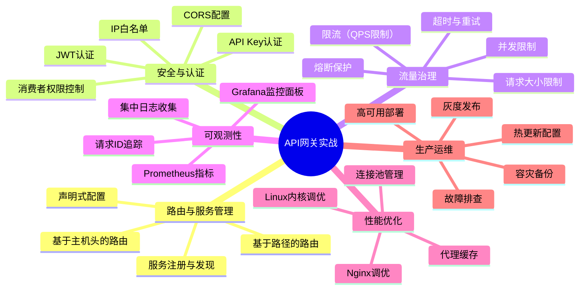

# 实战案例

## 为什么要从实战入手

API网关的理论知识（路由机制、认证授权、限流策略、熔断保护）掌握得再扎实，如果无法在真实项目中落地，就只是纸上谈兵。本章的两个实战案例分别以 **Kong** 和 **Apache APISIX** 两大主流开源网关为载体，在同一个电商微服务场景下，从零搭建一套生产可用的API网关体系。

选择实战而非纯理论的原因有三：

**第一，网关选型需要亲身体验。** Kong 和 APISIX 在架构设计、配置方式、插件生态、性能表现上各有千秋，仅看官方文档无法真正理解二者的差异。只有亲手部署、配置、压测过，才能形成自己的判断。

**第二，网关是典型的"配置密集型"组件。** 不像业务代码需要大量逻辑编写，网关的复杂性体现在配置参数的选择和组合上——超时设多少秒、限流用什么算法、熔断阈值取多少。这些参数没有标准答案，只能通过实战中的反复调整来积累经验。

**第三，生产环境的坑远比你想象的多。** 开发环境跑通和生产环境稳定运行之间隔着巨大鸿沟：内核参数怎么调、etcd 如何容灾、灰度发布怎么切流量、限流策略如何分层。这些实操细节在理论章节中无法覆盖，只有在案例中才能完整展开。

---

## 两个案例的定位与区别

本章包含两个独立且完整的实战案例，它们共享同一个业务场景（电商平台），但在网关选型、技术架构、侧重点上各有不同：

| 维度 | 案例一：Kong实战 | 案例二：APISIX实战 |
|------|-----------------|-------------------|
| **网关选型** | Kong 3.6（基于Nginx/OpenResty + PostgreSQL） | Apache APISIX 3.x（基于OpenResty + etcd） |
| **业务场景** | 日活50万、峰值QPS 3万的电商平台 | 中型电商平台，聚焦高性能低延迟 |
| **部署方式** | Docker Compose（开发/测试）+ 裸机（生产） | Docker Compose（快速启动）+ 生产内核调优 |
| **配置方式** | Admin API + 声明式YAML + GitOps | Admin API + etcd实时推送 |
| **认证方案** | JWT + API Key + IP限制（三层组合） | JWT + Consumer Restriction + 签名校验 |
| **限流策略** | Redis分布式限流 + 分层配置 | 全局限流 + 路由级限流 + 并发限制 |
| **特色内容** | 自定义Lua熔断器插件、生产Nginx调优 | 自定义签名校验插件、故障注入混沌测试 |
| **侧重点** | 稳健的企业级API管理，适合已有PG技术栈 | 极致性能和全动态配置，适合高频迭代场景 |
| **核心数据** | 单节点数万QPS，200+官方插件 | 单核18K+ RPS，毫秒级配置生效 |

### 阅读建议

- **如果你的团队已有 PostgreSQL 经验**，建议先读案例一（Kong），它更侧重企业级API管理的完整流程
- **如果你追求极致性能和全动态配置**，建议先读案例二（APISIX），它的架构更现代化
- **如果你在做网关选型决策**，建议两个案例都读完，重点关注末尾的对比分析
- **如果你是初学者**，建议从案例一开始，Kong 的配置方式更直观，学习曲线更平缓

---

## 案例一：Kong实战——从零到生产的完整旅程

### 场景设定

一个中型电商平台面临五个核心痛点：服务地址分散、认证逻辑重复、缺乏统一限流、无灰度发布能力、日志排查困难。我们以 Kong 作为统一API网关，逐步解决这些问题。

### 内容覆盖

案例一共分为 **12个完整章节**，覆盖从安装部署到性能调优的全流程：

| 章节 | 核心内容 | 关键技能 |
|------|---------|---------|
| 案例背景与架构设计 | 业务场景分析、选型理由、整体架构图 | 需求分析、技术选型 |
| 环境准备与安装部署 | Docker Compose部署 + 生产裸机部署 | 容器化部署、系统配置 |
| 核心配置：服务与路由 | 5个微服务的注册与路由配置 | Service/Route对象配置 |
| 声明式配置（Declarative Config） | kong.yml + GitOps工作流 | 配置即代码、版本管理 |
| 安全加固：认证与授权 | JWT全局认证 + API Key + IP限制 | 三层认证体系设计 |
| 流量治理：限流与熔断 | Redis分布式限流 + 自定义熔断插件 | 分层限流、熔断模式 |
| 请求/响应变换 | Header注入、Body裁剪、CORS | 请求增强、安全脱敏 |
| 负载均衡与健康检查 | 加权轮询、一致性哈希、主动/被动检查 | 流量分配策略 |
| 可观测性建设 | Prometheus + Grafana + HTTP日志 | 监控告警、日志体系 |
| 完整配置流程 | 从零到上线的6步操作脚本 | 端到端落地能力 |
| 性能调优 | Nginx调优 + Linux内核参数 + 缓存 | 系统级优化 |
| 常见问题与排查 | 诊断清单 + 常用排错命令 | 问题定位能力 |

### 亮点内容

1. **完整的Docker Compose配置**：双节点Kong集群 + PostgreSQL主从，可直接复制使用
2. **自定义Lua熔断器插件**：140行Lua代码实现 closed → open → half-open 状态机，附完整注释
3. **限流响应头详解**：`RateLimit-Limit`、`RateLimit-Remaining`、`RateLimit-Reset` 等Header的含义和客户端处理方式
4. **Grafana监控面板配置**：PromQL查询示例，覆盖QPS、错误率、P99延迟、上游健康四个核心维度
5. **性能调优三板斧**：Nginx层面、Linux内核层面、Kong缓存层面的完整优化方案

---

## 案例二：APISIX实战——高性能网关的极致实践

### 场景设定

同样是电商平台场景，但重点转向高性能和全动态能力。APISIX 的核心优势在于"全动态"——所有配置变更（路由、上游、插件、SSL证书）在不重启、不reload的情况下毫秒级生效。

### 内容覆盖

案例二分为 **9个核心章节**，在深度上更侧重性能优化和生产实战：

| 章节 | 核心内容 | 关键技能 |
|------|---------|---------|
| APISIX简介与架构 | 三平面架构（数据面/控制面/插件面）、核心概念 | 架构理解 |
| 环境搭建与部署 | Docker快速启动 + 生产内核调优 + etcd集群 | 高可用部署 |
| 实战场景：电商API网关 | 路由管理、认证鉴权、限流保护、可观测性 | 全功能配置 |
| 自定义Lua插件开发 | 请求签名校验插件（140+行Lua） | 插件开发能力 |
| 高可用与容灾 | etcd备份恢复、灰度发布、故障注入 | 生产运维能力 |
| 性能调优 | 系统级调优、代理缓存、基准测试 | 性能优化能力 |
| 常见问题与排查 | 配置变更、上游连接、限流误触发、HTTPS证书 | 故障排查能力 |
| 实施效果与对比 | 优化前后数据对比、成本效益分析 | 价值量化能力 |
| 经验总结 | 架构决策、运维要点、安全红线、改进方向 | 最佳实践沉淀 |

### 亮点内容

1. **完整的性能基准数据**：四种场景下的QPS、P99延迟、CPU利用率实测数据
2. **自定义签名校验插件**：HMAC-SHA256签名校验，防参数篡改，附Python客户端实现
3. **故障注入混沌测试**：5%错误注入 + 10%延迟注入，验证系统容错能力
4. **灰度发布四阶段策略**：90/10 → 50/50 → 10/90 → 0/100，附流量切换节奏
5. **etcd容灾方案**：自动备份脚本 + 数据恢复流程，保留7天快照
6. **优化前后量化对比**：平均响应时间降低71%、P99延迟降低89%、最大QPS提升5.6倍

---

## 两个案例共同覆盖的知识域

虽然两个案例使用不同的网关产品，但它们共同覆盖了API网关在生产环境中必须面对的所有核心问题：

---

## 实战中的关键决策点

在阅读案例的过程中，以下决策点值得重点关注：

### 1. 超时参数如何设置

超时设置过短会导致正常请求被误判为故障，设置过长会导致故障请求长时间占用连接。案例中给出的分场景策略是：

| 请求类型 | 连接超时 | 读/写超时 | 重试次数 | 原因 |
|---------|---------|----------|---------|------|
| 读操作（GET） | 3s | 5-10s | 3次 | 幂等，可安全重试 |
| 写操作（POST/PUT） | 5s | 15-30s | 1次 | 非幂等，需谨慎 |
| 支付相关 | 5s | 30s+ | 0-1次 | 依赖幂等键防重复扣款 |
| 搜索查询 | 3s | 5s | 3次 | 可快速失败快速重试 |

### 2. 限流策略如何分层

单一维度的限流无法覆盖所有场景，生产环境需要三层限流配合使用：

| 限流层级 | 作用 | 配置位置 | 典型阈值 |
|---------|------|---------|---------|
| 全局限流 | 防止整体流量洪峰，保护后端基础设施 | 全局插件 | 10000 QPS |
| 路由级限流 | 防止单个接口过载，保护特定服务 | 路由插件 | 100-5000 QPS |
| 消费者级限流 | 防止单一调用方滥用，实现公平调度 | 消费者插件 | 30-100次/分钟 |

### 3. 认证方式如何选择

不同API有不同的安全需求，不能一刀切：

| API类型 | 推荐认证方式 | 原因 |
|---------|------------|------|
| 面向C端的公开API | JWT | 无状态、高性能、支持细粒度权限 |
| 面向合作伙伴的开放API | API Key + 限流 | 简单易用、便于计费 |
| 内部服务间调用 | IP限制 + 内部Token | 无需复杂认证，网络隔离即可 |
| 支付等高安全接口 | JWT + 签名校验 | 双重验证防篡改 |
| 第三方SSO集成 | OAuth2 | 标准授权框架、支持多种授权模式 |

---

## 实战前的准备工作

在开始动手之前，确保满足以下前置条件：

### 环境要求

| 准备项 | 最低要求 | 说明 |
|-------|---------|------|
| 操作系统 | Ubuntu 20.04+ / CentOS 7+ | 64位系统 |
| Docker | 20.10+ | 用于快速启动开发环境 |
| Docker Compose | 2.0+ | 编排多容器服务 |
| 网络 | 能访问Docker Hub | 拉取镜像 |
| 磁盘 | 10GB+ 可用空间 | 镜像和日志存储 |
| 内存 | 4GB+ | Kong/APISIX + PostgreSQL/etcd |

### 建议的学习路径

1. **先回顾理论**：确保理解路由、认证、限流、熔断的基本概念
2. **精读案例一**：跟随 Kong 案例完成从部署到上线的全流程
3. **精读案例二**：对比 APISIX 的实现方式，理解两种架构的差异
4. **动手实践**：选择一个网关产品，在本地环境中复现案例中的关键步骤
5. **结合自身项目**：根据团队技术栈和业务需求，做出合理的选型决策

---

## 怎么衡量你是否学完了

读完本章的两个案例后，你应该能够回答以下问题：

**架构层面：**
- Kong 和 APISIX 的核心架构差异是什么？各自的配置中心有何优劣？
- API网关在微服务架构中应该承担哪些职责？哪些不应该放在网关层？
- 如何设计一个支持灰度发布的路由方案？

**配置层面：**
- 如何为不同服务配置差异化的超时和重试策略？
- 三层限流（全局/路由/消费者）如何配合使用？
- 声明式配置和Admin API配置各适用什么场景？

**运维层面：**
- 网关返回502/504/429错误时，排查步骤是什么？
- 如何监控API网关的关键指标？哪些指标需要告警？
- etcd/PostgreSQL故障时如何快速恢复？

**性能层面：**
- Nginx层面和Linux内核层面分别有哪些关键调优参数？
- 单个网关节点能支撑多少QPS？瓶颈在哪里？
- 如何通过基准测试验证调优效果？

如果这些问题你都能清晰回答，并且能在自己的环境中搭建出一套可用的API网关，那么本章的学习目标就达成了。

---

## 本章文件索引

| 文件 | 内容概要 | 建议阅读时间 |
|------|---------|------------|
| 案例一：Kong实战 | 12个章节，覆盖Kong网关从部署到调优的全流程 | 2-3小时 |
| 案例二：APISIX实战 | 9个章节，覆盖APISIX网关的高性能实践 | 2-3小时 |

两个案例相互独立，可以按需选择阅读，但建议通读以获得完整的对比视角。
