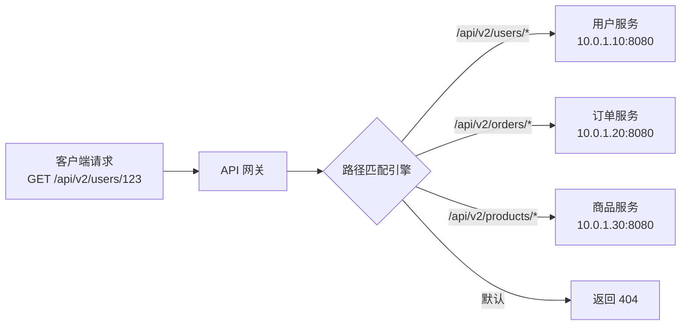
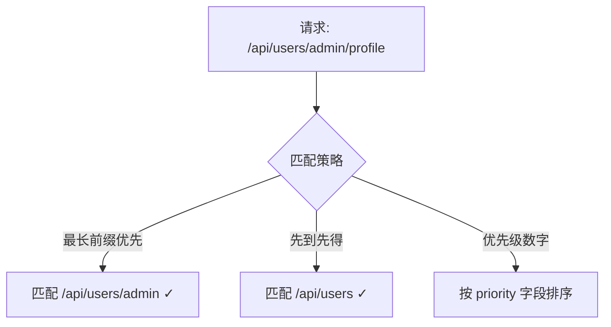
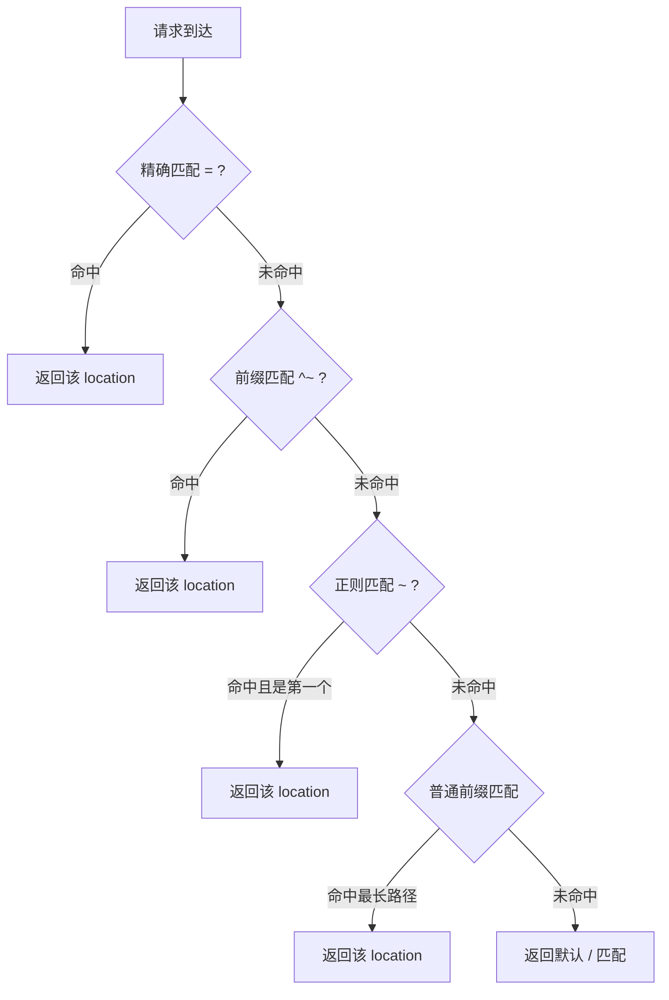
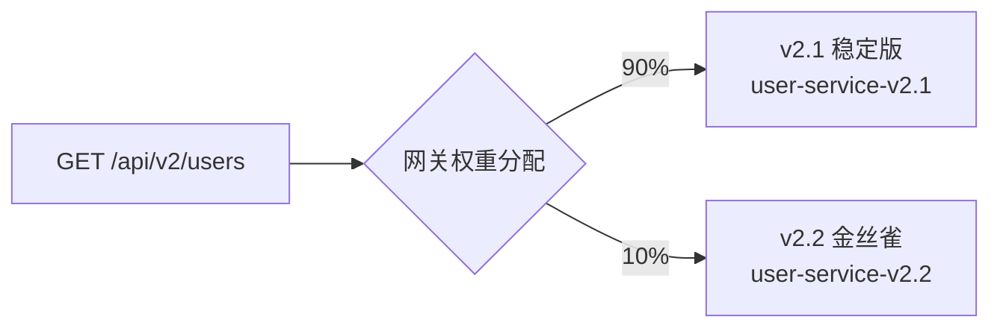
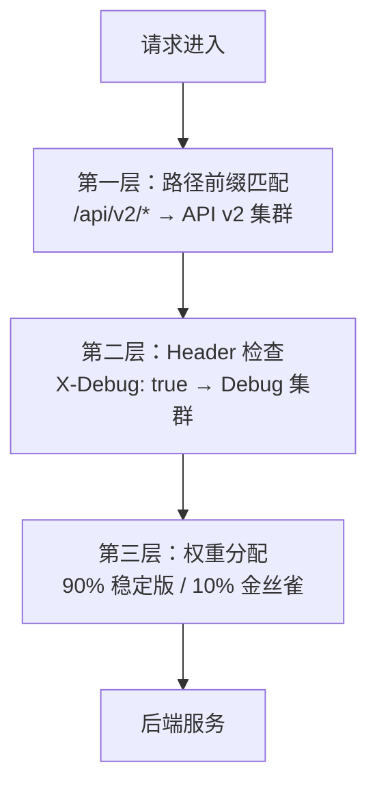
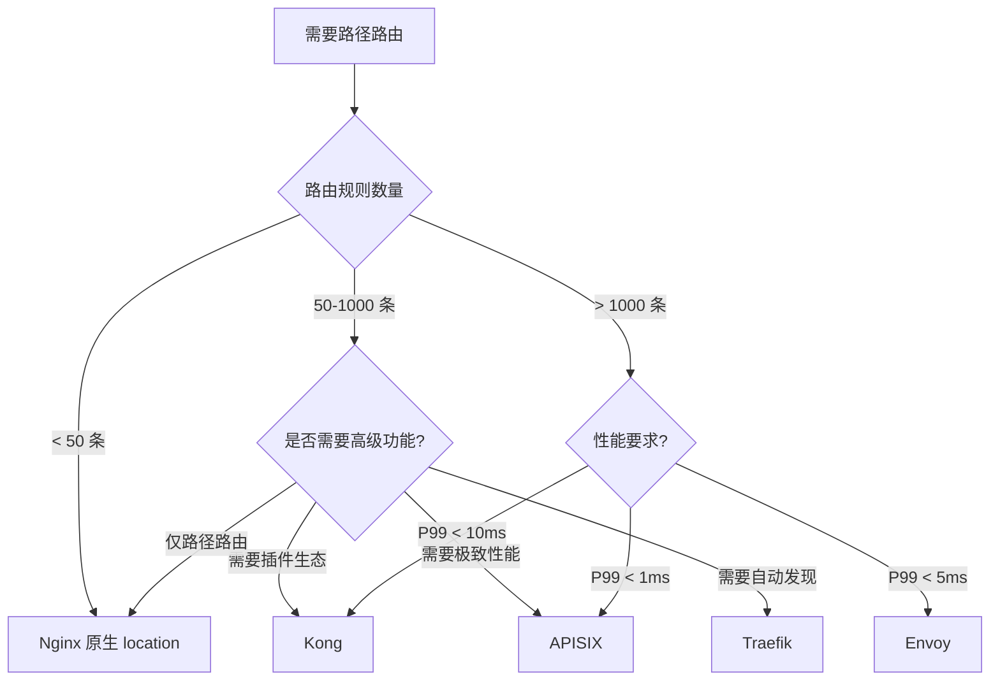

## 一路径路由

路径路由（Path-Based Routing）是 API 网关最基础、最高频的路由策略——根据请求 URL 的路径将流量分发到不同的后端服务。几乎每一个微服务架构的入口都依赖路径路由来实现服务发现和请求分发。理解它的匹配机制、性能特征和工程陷阱，是构建可靠网关的第一步。

### 1. 核心概念与工作原理

#### 1.1 什么是路径路由

路径路由的本质是：**网关收到一个 HTTP 请求后，从 URL 路径中提取特征，通过预定义的规则将其匹配到一个或多个后端服务**。

一个典型的请求流转过程如下：



路径路由解决的核心问题：

- **服务拆分后的流量入口统一**：微服务拆分后，外部客户端只接触一个网关地址，由网关负责将请求导向正确的内部服务
- **API 版本管理**：通过路径前缀（如 `/api/v1/`、`/api/v2/`）实现新旧版本并存
- **灰度发布与 A/B 测试**：将特定路径的流量导向新版本服务
- **安全隔离**：将管理后台（`/admin/`）和公开接口（`/public/`）路由到不同后端
- **协议桥接**：同一网关入口同时服务 REST、gRPC、WebSocket 等不同协议的请求

#### 1.2 路径匹配模式

不同的 API 网关支持不同粒度的路径匹配。掌握这些模式的差异是正确配置路由的前提：

| 匹配模式 | 规则语法 | 匹配示例 | 非匹配示例 | 适用场景 | 时间复杂度 |
|----------|---------|---------|-----------|---------|-----------|
| **精确匹配** | `/api/users` | `/api/users` | `/api/users/123` | 单一资源端点 | O(1) 哈希 |
| **前缀匹配** | `/api/users` | `/api/users`、`/api/users/123` | `/api/user` | 服务级路由 | O(k) Trie |
| **通配符匹配** | `/api/*/profile` | `/api/john/profile` | `/api/john/settings` | 动态路径段 | O(k) 树遍历 |
| **正则匹配** | `^/api/v(\\d+)/users$` | `/api/v2/users` | `/api/v2/orders` | 复杂模式提取 | O(k) DFA |
| **模板匹配** | `/api/users/{id}` | `/api/users/123` | `/api/users/abc/def` | RESTful 资源 | O(k) Trie |
| **路径段匹配** | `/api/users/**` | `/api/users/a/b/c` | `/api/orders/1` | 深层嵌套资源 | O(k) Radix Tree |

> **关键区分：通配符 `*` vs 路径段 `**`**
> 多数网关中，`*` 匹配单个路径段（不含 `/`），`**` 匹配多级路径段。例如路由 `/api/users/**` 会匹配 `/api/users/a/b/c`，而 `/api/users/*` 只匹配 `/api/users/123`，不匹配 `/api/users/123/orders`。Kong 的 `paths` 使用前缀匹配（等效 `**`），APISIX 的 `uri` 用 `*` 表示单段通配。

**关键区别：前缀匹配 vs 精确匹配**

很多初学者混淆这两者，导致路由冲突。假设你配置了两条规则：

规则 A: 前缀匹配 /api/users → 用户服务
规则 B: 前缀匹配 /api/users/admin → 管理服务

当请求 `GET /api/users/admin/profile` 到达时，不同网关的处理策略不同：

- **最长前缀优先**（Kong、APISIX）：匹配规则 B，因为 `/api/users/admin` 是更长的前缀
- **先配置先匹配**（Nginx location 指令）：取决于 `location` 指令的顺序和修饰符
- **全部遍历**（某些简单网关）：可能同时匹配两条，需要配置优先级



> **生产建议**：在网关选型时，务必确认其路径匹配策略。最长前缀优先是最符合直觉的行为，可避免大多数路由冲突。如果使用 Nginx，善用 `^~` 修饰符避免正则意外覆盖前缀规则。

#### 1.3 路径改写（Path Rewrite）

路径路由常常伴随路径改写——网关对外暴露统一的路径结构，但内部服务可能有不同的路径命名。路径改写有三种常见模式：

**模式一：前缀替换**

将外部路径的前缀替换为内部路径的前缀：

外部: /api/v2/users/123
改写: /internal/user-service/v1/users/123
规则: /api/v2/users → /internal/user-service/v1/users

**模式二：路径剥离（Strip Prefix）**

移除网关前缀，将剩余路径透传给后端：

外部: /gateway/orders/456/confirm
改写: /orders/456/confirm
规则: /gateway → 移除 /gateway 前缀

**模式三：正则重写**

使用正则表达式进行精细的路径变换：

外部: /legacy/v1/users/123
改写: /users/123?version=1
规则: ^/legacy/v(\d+)/users/(.+)$ → /users/$2?version=$1

**模式四：路径规范化（Path Normalization）**

对路径进行规范化处理后再匹配，解决编码差异和大小写问题：

外部: /API/Users/123    （大小写不一致）
外部: /api/users/%31%32%33  （URL 编码）
规范化后: /api/users/123
规则: 对路径先 toLowerCase() + decodeURIComponent() 再匹配

三种改写模式的对比：

| 模式 | 复杂度 | 灵活性 | 性能 | 典型用例 |
|------|--------|--------|------|---------|
| 前缀替换 | 低 | 中 | 极快 | API 版本迁移 |
| 路径剥离 | 低 | 低 | 极快 | 网关前缀统一 |
| 正则重写 | 高 | 高 | 较慢 | 遗留系统兼容 |
| 路径规范化 | 中 | 中 | 快 | 多客户端兼容 |

> **陷阱提醒**：路径改写后，后端服务收到的 `Request-URI` 已经改变。如果后端依赖原始路径做日志审计或访问控制，需要在改写前将原始路径保存到自定义 Header（如 `X-Original-URI`），否则会丢失溯源信息。

### 2. 主流网关的路径路由实现

#### 2.1 Nginx：location 指令的匹配优先级

Nginx 不是严格的 API 网关，但作为最常用的反向代理，它的 `location` 匹配规则是理解路径路由的基础。Nginx 的匹配优先级如下：

```nginx
# 1. 精确匹配（= 修饰符）—— 优先级最高，命中即停止
location = /api/health {
    return 200 'OK';
}

# 2. 前缀匹配 + 无修饰符 + 最短路径优先（^~ 修饰符）
# 注意：^~ 的优先级高于正则
location ^~ /api/users {
    proxy_pass http://user-service;
}

# 3. 正则匹配（~ 区分大小写 / ~* 不区分大小写）—— 按配置顺序，第一个命中即停止
location ~ ^/api/v(\d+)/orders {
    proxy_pass http://order-service;
}

# 4. 普通前缀匹配（无修饰符）—— 最长匹配，不支持正则
location /api/ {
    proxy_pass http://default-service;
}

# 5. 默认匹配（/ 修饰符）—— 兜底
location / {
    return 404 'Not Found';
}
```

**Nginx location 匹配优先级速查表：**



**常见陷阱：** `proxy_pass` 后面有无 URI 会改变路径行为：

```nginx
# 情况 A：proxy_pass 不带路径 → 完整 URI 透传
# 请求 /api/users/123 → 转发到 http://backend/api/users/123
location /api/ {
    proxy_pass http://backend;
}

# 情况 B：proxy_pass 带路径 → 替换 location 匹配的部分
# 请求 /api/users/123 → 转发到 http://backend/users/123
location /api/ {
    proxy_pass http://backend/;
}

# 情况 C：proxy_pass 带路径（末尾有斜杠）→ 等同于 B
location /api/ {
    proxy_pass http://backend/v1/;
}

# 情况 D：proxy_pass 带变量 → 必须完整拼接 URI
# 请求 /api/users/123 → 转发到 http://backend/api/users/123
set $upstream http://backend;
location /api/ {
    proxy_pass $upstream;
}
```

> **重要区别**：情况 A 和 B 的差异在于 `proxy_pass` 是否包含 URI 部分。不带 URI 时，Nginx 将完整的原始请求 URI（包括 `location` 匹配的部分）追加到 `proxy_pass` 指定的地址后面；带 URI 时，`location` 匹配的部分会被 `proxy_pass` 中的 URI 替换。这个行为在 `location` 使用正则匹配时有所不同——正则匹配下 `proxy_pass` 不应包含 URI，否则可能出错。

#### 2.2 Kong：声明式路由配置

Kong 的路由以声明式方式定义，支持多种匹配条件的组合：

```yaml
# Kong 路由配置 (deck 或 admin API)
services:
  - name: user-service
    url: http://user-service:8080
    routes:
      - name: user-routes
        paths:
          - /api/v2/users
          - /api/v3/users
        strip_path: true          # 剥离匹配的路径前缀
        preserve_host: false       # 不传递原始 Host 头
        protocols:
          - http
          - https
        methods:
          - GET
          - POST
          - PUT
          - DELETE

  - name: order-service
    url: http://order-service:8080
    routes:
      - name: order-routes
        paths:
          - /api/v2/orders
        strip_path: false          # 不剥离，完整透传
```

Kong 路由的路径匹配特点：

- 支持**多个路径**绑定同一服务，无需重复配置
- `strip_path: true` 会自动剥离匹配的路径前缀
- 路径匹配是**最长前缀优先**
- 支持路径正则匹配，但性能略低于前缀匹配
- 支持路径参数 `{id}` 形式的模板匹配，自动提取为 URI captures

#### 2.3 Apache APISIX：基于 Radix Tree 的高性能匹配

APISIX 使用 Radix Tree（基数树）数据结构存储路由规则，匹配性能达到 O(k)，其中 k 是路径长度：

```yaml
# APISIX 路由配置 (admin API)
curl http://127.0.0.1:9180/apisix/admin/routes/1 -X PUT -d '
{
  "uri": "/api/users/*",
  "host": "api.example.com",
  "upstream": {
    "type": "roundrobin",
    "nodes": {
      "user-service-1:8080": 1,
      "user-service-2:8080": 1
    }
  },
  "plugins": {
    "proxy-rewrite": {
      "regex_uri": ["^/api/users/(.*)", "/users/$1"]
    }
  }
}'
```

APISIX 的路径匹配能力：

| 特性 | 说明 |
|------|------|
| `uri` | 支持精确、前缀（`*`）、正则（`~`）三种匹配 |
| `uri_bloc` | 按路径段拆分匹配，适合多级路径 |
| 正则性能 | 内置正则缓存，首次编译后复用 |
| Radix Tree | 路由数量上千时仍保持亚毫秒级匹配 |
| 路由 ID | 支持自定义路由 ID，便于版本管理和回滚 |

#### 2.4 Envoy Proxy：Route Table 配置

Envoy 使用层级化的 Route Configuration，适合大规模微服务场景：

```yaml
# Envoy 路由配置片段
virtual_hosts:
  - name: api-backend
    domains: ["api.example.com"]
    routes:
      - match:
          path: /api/health
        route:
          cluster: health-check-service

      - match:
          prefix: /api/v2/users
        route:
          cluster: user-service-v2
          prefix_rewrite: /users        # 路径前缀替换
          timeout: 30s

      - match:
          safe_regex:
            google_re2: {}
            regex: "^/api/v(\\d+)/orders/(\\d+)$"
        route:
          cluster: order-service
          regex_rewrite:
            pattern:
              google_re2: {}
              regex: "^/api/v(\\d+)/orders/(\\d+)$"
            substitution: "/orders/\\2?version=\\1"
```

Envoy 的路径匹配优势：

- 支持 `path`（精确）、`prefix`（前缀）、`safe_regex`（正则）三种
- 支持**多条件组合匹配**：path + header + query parameter + method
- 内置 **Hedged Routing**：可以在匹配后向多个集群同时发送请求，取最快返回
- 支持 **Route Action 的超时、重试、重定向**等高级配置
- 通过 xDS API 实现**热更新**，无需重启或 reload

#### 2.5 Traefik：声明式 + 自动发现

Traefik 的路径路由通过中间件和路由规则声明式配置，支持动态服务发现：

```yaml
# Traefik 路由配置 (Docker labels 或 file provider)
http:
  routers:
    user-router:
      rule: "PathPrefix(`/api/users`)"
      service: user-service
      middlewares:
        - strip-prefix
      entryPoints: ["web"]

    order-router:
      rule: "PathPrefix(`/api/orders`)"
      service: order-service
      entryPoints: ["web"]

  middlewares:
    strip-prefix:
      stripPrefix:
        prefixes:
          - /api/users
          - /api/orders

  services:
    user-service:
      loadBalancer:
        servers:
          - url: "http://user-service:8080"
    order-service:
      loadBalancer:
        servers:
          - url: "http://order-service:8080"
```

Traefik 的路径匹配规则语法：

| 规则 | 说明 |
|------|------|
| `Path('/exact')` | 精确匹配 |
| `PathPrefix('/prefix')` | 前缀匹配 |
| `PathRegexp('/regex')` | 正则匹配 |
| 组合：`PathPrefix('/api') && Method('GET')` | 路径 + 方法组合 |

#### 2.6 Istio / Service Mesh 中的路径路由

在 Service Mesh 架构中，路径路由下沉到 Sidecar 代理（Envoy），由 Istio 的 VirtualService 声明：

```yaml
# Istio VirtualService 路径路由
apiVersion: networking.istio.io/v1beta1
kind: VirtualService
metadata:
  name: user-service
spec:
  hosts:
    - user-service
  http:
    # 精确路径匹配
    - match:
        - uri:
            exact: /api/v1/users/health
      route:
        - destination:
            host: user-service
            subset: stable

    # 前缀匹配 + 路径改写
    - match:
        - uri:
            prefix: /api/v2/users
      rewrite:
        uri: /users
      route:
        - destination:
            host: user-service
            subset: stable
          weight: 90
        - destination:
            host: user-service
            subset: canary
          weight: 10

    # 正则匹配提取版本号
    - match:
        - uri:
            regex: ^/api/v(\d+)/users/(\d+)
      route:
        - destination:
            host: user-service
```

Istio 路径路由与传统网关的关键差异：

- 路径匹配发生在**每个 Pod 的 Sidecar** 中，而非集中式网关
- 路由规则通过 xDS 协议下发，变更延迟在秒级
- 天然支持**金丝雀发布**（weight-based routing）
- 路径匹配与**负载均衡、熔断、重试**等策略在同一配置中声明
- 可与 `host`、`headers`、`queryParams` 等条件组合

### 3. 高级路由模式

#### 3.1 基于路径权重的灰度发布

在新版本上线时，按路径流量比例进行灰度：



**Kong + Canary 插件示例：**

```yaml
services:
  - name: user-service-canary
    url: http://user-service-v2.2:8080
    plugins:
      - name: canary
        config:
          weight: 10                    # 10% 流量导向金丝雀
          start: "2026-01-01T00:00:00"
          end: "2026-02-01T00:00:00"
          hash: ""                      # 空表示随机分配
```

**Envoy 权重路由示例：**

```yaml
routes:
  - match:
      prefix: /api/v2/users
    route:
      weighted_clusters:
        clusters:
          - name: user-service-stable
            weight: 90
          - name: user-service-canary
            weight: 10
```

#### 3.2 路径参数提取

从 URL 路径中提取参数并传递给后端服务，避免后端二次解析：

**Kong 的路径参数：**

```yaml
routes:
  - name: user-detail
    paths:
      - /api/users/{user_id}          # 自动提取为 request.params.user_id
      - /api/users/{user_id}/orders/{order_id}
    plugins:
      - name: request-transformer
        config:
          add:
            headers:
              - X-User-ID:$(uri_captures.user_id)
              - X-Order-ID:$(uri_captures.order_id)
```

**Envoy 的路径参数提取：**

```yaml
routes:
  - match:
      path_template: /api/users/{user_id}/orders/{order_id}
    route:
      cluster: order-service
    typed_per_filter_config:
      envoy.filters.http.buffer:
        "@type": type.googleapis.com/envoy.extensions.filters.http.lua.v3.Lua
        inline_code: |
          function envoy_on_request(handle)
            local path = handle:headers():get(":path")
            local user_id = string.match(path, "/api/users/([^/]+)/")
            handle:headers():add("X-User-ID", user_id or "")
          end
```

#### 3.3 多级路径路由（路由链）

将路径路由与其他策略组合，构建复杂的路由链：



**Traefik 多级路由配置：**

```yaml
http:
  routers:
    api-v2-router:
      rule: "PathPrefix(`/api/v2/`) &amp;&amp; Headers(`X-Debug`, `true`)"
      service: debug-service
      priority: 100          # 高优先级

    api-v2-normal:
      rule: "PathPrefix(`/api/v2/`)"
      service: api-v2-stable
      priority: 10           # 低优先级
```

#### 3.4 路径路由的容错设计

路径路由不只是转发，还需要处理各种异常情况：

```yaml
# Kong 的路径路由 + 后端故障转移
services:
  - name: user-service-primary
    url: http://user-primary:8080
    routes:
      - paths: [/api/users]
    connect_timeout: 5000
    write_timeout: 30000
    read_timeout: 30000
    retries: 3

# 备用服务（主服务不可用时使用）
  - name: user-service-fallback
    url: http://user-fallback:8080
    routes:
      - paths: [/api/users]
    plugins:
      - name: response-transformer
        config:
          add:
            headers:
              - X-Served-By: fallback
```

#### 3.5 WebSocket 路径路由

WebSocket 连接通过 HTTP Upgrade 握手建立，路径路由在握手阶段完成匹配。配置要点：

```nginx
# Nginx WebSocket 路径路由
location /ws/notifications {
    proxy_pass http://notification-service;
    proxy_http_version 1.1;
    proxy_set_header Upgrade $http_upgrade;
    proxy_set_header Connection "upgrade";
    proxy_set_header Host $host;
    proxy_read_timeout 86400s;    # 长连接超时设为 24 小时
    proxy_send_timeout 86400s;
}

location /ws/chat {
    proxy_pass http://chat-service;
    proxy_http_version 1.1;
    proxy_set_header Upgrade $http_upgrade;
    proxy_set_header Connection "upgrade";
    proxy_read_timeout 86400s;
}
```

```yaml
# Kong WebSocket 路由
services:
  - name: notification-service
    url: http://notification-service:8080
    protocol: websocket              # Kong 3.x+ 支持 websocket 协议
    routes:
      - name: ws-notifications
        paths: [/ws/notifications]
        protocols:
          - http
          - https
```

WebSocket 路径路由的特殊考量：

- Upgrade 握手必须经过路径路由匹配，成功后连接保持到后端
- 路由匹配失败时应返回 `403 Forbidden` 而非 `404 Not Found`（表示路径存在但不允许升级）
- 长连接场景下，超时配置必须与 WebSocket 的 ping/pong 周期匹配
- 负载均衡策略应使用**粘性会话**（Sticky Session），避免同一连接被分配到不同后端
- 路由变更（如版本迁移）时，已建立的 WebSocket 连接不受影响，新连接才会走新路由

#### 3.6 路径路由与 API 版本管理

路径路由是实现 API 版本管理最常用的方式。常见的版本策略：

| 策略 | 路径格式 | 示例 | 优点 | 缺点 |
|------|---------|------|------|------|
| URI 版本号 | `/v{N}/resource` | `/v2/users` | 直观、易于路由 | URL 变长、客户端需感知版本 |
| 子域名 | `v2.api.com/resource` | `v2.api.com/users` | 路径干净 | DNS 管理复杂 |
| Header 版本 | `Accept: application/vnd.api.v2+json` | — | URL 不变 | 路由规则复杂、调试困难 |
| 查询参数 | `/users?version=2` | — | 最灵活 | 缓存友好性差、易遗漏 |

**基于路径的版本管理最佳实践：**

```yaml
# Kong 多版本路由配置
services:
  # v1 用户服务
  - name: user-service-v1
    url: http://user-svc-v1:8080
    routes:
      - name: user-v1
        paths: [/api/v1/users]
        strip_path: true
        plugins:
          - name: request-transformer
            config:
              add:
                headers:
                  - X-API-Version: v1

  # v2 用户服务
  - name: user-service-v2
    url: http://user-svc-v2:8080
    routes:
      - name: user-v2
        paths: [/api/v2/users]
        strip_path: true
        plugins:
          - name: request-transformer
            config:
              add:
                headers:
                  - X-API-Version: v2

  # v1 和 v2 共用的后端适配层（可选）
  - name: user-adapter
    url: http://user-adapter:8080
    routes:
      - name: user-compat
        paths: [/api/v1/users/legacy]    # 遗留接口走适配层
        strip_path: true
```

> **版本退役策略**：通过路径路由实现版本退役时，建议分三步：(1) 在旧版本路径添加 Deprecation Header 告知客户端；(2) 将旧版本流量重定向到新版本（`301 Moved Permanently`）；(3) 在确认所有客户端迁移完成后移除旧路由。整个过程可在路径路由层面完成，无需修改后端代码。

### 4. 路径匹配的性能优化

#### 4.1 数据结构选择

路径匹配的性能取决于底层数据结构：

| 数据结构 | 匹配复杂度 | 构建复杂度 | 内存占用 | 适用场景 |
|----------|-----------|-----------|---------|---------|
| 线性遍历 | O(n) | O(1) | 低 | 规则 < 100 条 |
| 哈希表 | O(1) | O(n) | 高 | 精确匹配 |
| Trie（前缀树） | O(k) | O(n×k) | 中 | 前缀匹配 |
| Radix Tree（基数树） | O(k) | O(n×k) | 中低 | APISIX 默认 |
| DFA（确定有限自动机） | O(k) | 高 | 高 | 正则匹配 |

其中 n 是规则数量，k 是路径长度。

**Radix Tree 是目前性能最优的选择**，APISIX 正是采用这一结构。它的优势在于：

- 路径匹配时间与规则数量无关
- 内存占用比普通 Trie 低 3-5 倍（通过路径压缩）
- 支持前缀、正则等多种匹配模式

#### 4.2 路由配置优化原则

原则一：按匹配频率排序
高频路径放在前面，减少匹配次数
routes:
  - path: /api/health          # 每秒 10000 次 → 放最前面
  - path: /api/users           # 每秒 5000 次
  - path: /api/admin/debug     # 每秒 10 次 → 放最后

原则二：使用精确匹配替代前缀匹配
能用精确匹配的场景不用前缀匹配
差异：/api/health 精确匹配 vs /api 前缀匹配
前者匹配一个端点，后者匹配所有 /api/* 路径

原则三：减少正则匹配的使用
90% 的路由可以用前缀匹配搞定
仅在需要路径参数提取或复杂模式时才用正则

原则四：合理拆分路由域
将不同业务域的路由拆分到独立的 virtual_host / 服务组
减少单个匹配域内的规则数量

#### 4.3 基准测试方法

在生产环境变更路由配置前，先做基准测试：

```bash
# 使用 wrk 对比不同匹配策略的性能
# 精确匹配基准
wrk -t4 -c100 -d30s http://gateway/api/health

# 前缀匹配基准
wrk -t4 -c100 -d30s http://gateway/api/users/123

# 正则匹配基准
wrk -t4 -c100 -d30s http://gateway/api/v2/users/123

# 对比不同路由规则数量下的性能退化
# 在 100、1000、10000 条规则下分别测试
for count in 100 1000 10000; do
  echo "=== ${count} rules ==="
  # 添加 ${count} 条测试路由
  add_test_routes ${count}
  wrk -t4 -c100 -d10s http://gateway/api/health
done
```

**典型基准测试结果（参考值）：**

| 匹配模式 | 100 条规则 P99 | 1000 条规则 P99 | 10000 条规则 P99 |
|---------|---------------|----------------|-----------------|
| 精确匹配（哈希） | < 0.01ms | < 0.01ms | < 0.01ms |
| 前缀匹配（Trie） | < 0.05ms | < 0.08ms | < 0.12ms |
| 前缀匹配（Radix Tree） | < 0.03ms | < 0.04ms | < 0.06ms |
| 正则匹配（DFA 缓存） | < 0.1ms | < 0.3ms | < 0.8ms |
| 线性遍历 | < 0.05ms | < 0.3ms | < 3ms |

> **注意**：以上数据为典型参考值，实际性能取决于硬件配置、路径长度、正则复杂度等因素。生产环境务必以自己的基准测试为准。

### 5. 常见误区与排查

#### 5.1 误区一：路径匹配顺序问题

**问题描述：** 配置了 `/api` 和 `/api/users` 两个前缀匹配，请求 `/api/users/123` 匹配了错误的规则。

**根因：** 不同网关的默认匹配策略不同。Nginx 的 `location /api/` 和 `location /api/users/` 都是前缀匹配，但 Nginx 选择**最长匹配**。而某些网关按**配置顺序**匹配。

**解决方案：**

```bash
# Nginx：使用 ^~ 修饰符确保前缀匹配优先于正则
location ^~ /api/users/ {
    proxy_pass http://user-service;
}

# Kong：使用 paths 数组的顺序和 strip_path 配合
# Kong 默认最长前缀优先，一般无需额外处理

# APISIX：路由自动按 Radix Tree 最长匹配
# 无需手动调整顺序
```

#### 5.2 误区二：路径尾部斜杠不一致

**问题描述：** `/api/users` 和 `/api/users/` 被视为不同的路径，导致部分请求 404。

**根因：** HTTP 标准中，路径尾部斜杠是有意义的。`/api/users` 是一个资源，`/api/users/` 是一个目录。大多数网关严格区分这两者。

**解决方案：**

```nginx
# Nginx：使用 if 指令重定向
location /api/users {
    # 如果请求路径不是 /api/users 且以 /api/users/ 开头
    if ($request_uri ~ "^/api/users/[^/].*$") {
        rewrite ^(/api/users)/(.*)$ $1/$2 last;
    }
    proxy_pass http://user-service;
}

# 或者使用 Lua 模块统一处理
location /api/users {
    access_by_lua_block {
        local uri = ngx.var.uri
        -- 统一去掉尾部斜杠
        if uri:sub(-1) == "/" then
            ngx.var.uri = uri:sub(1, -2)
        end
    }
    proxy_pass http://user-service;
}
```

#### 5.3 误区三：忽略路径编码

**问题描述：** 路径中包含中文或特殊字符时路由失败。

**根因：** URL 编码（Percent-Encoding）导致实际路径与预期不一致。例如 `/api/users/张三` 会被编码为 `/api/users/%E5%BC%A0%E4%B8%89`。

**解决方案：**

```bash
# 在路由规则中使用编码后的路径，或确保网关自动解码
# Kong：默认支持路径解码
# Envoy：需要在 route 中配置 auto_sni 和 path normalization

# Nginx 中使用 $request_uri（原始编码路径）或 $uri（已解码路径）
location /api/users {
    # $uri 是已解码的，适合做路径匹配
    set $decoded_uri $uri;
    proxy_pass http://user-service;
}
```

#### 5.4 误区四：路径路由的性能退化

**问题描述：** 随着路由规则数量增加，匹配延迟显著上升。

**根因：** 某些网关使用线性遍历匹配，路由规则从 100 增加到 10000 时，匹配延迟可能增长 100 倍。

**诊断方法：**

```bash
# 检查网关的路由匹配耗时
# Kong：启用 latency header
# 在响应中会包含 X-Kong-Upstream-Latency 和 X-Kong-Proxy-Latency

# APISIX：使用 response-rewrite 插件注入路由匹配耗时
plugins:
  - name: response-rewrite
    config:
      add:
        headers:
          - X-Routing-Time: $upstream_x_routing_time

# Envoy：使用内置的 tracing 功能
# 在 tracing span 中可以看到路由匹配的耗时
```

**优化方案：** 将高频路由使用精确匹配，低频路由使用正则匹配，中间路由使用前缀匹配。

#### 5.5 误区五：路径路由与 gRPC 的兼容

**问题描述：** gRPC 请求通过路径路由时出现路径不匹配。

**根因：** gRPC 使用 HTTP/2，其路径格式为 `/<package>/<service>/<method>`，与 REST 风格的路径不同。

```protobuf
// gRPC 的路径格式
// POST /my.package.UserService/GetUser
// Content-Type: application/grpc

// 而 REST 格式是
// GET /api/v1/users/123
```

**解决方案：**

```nginx
# Nginx 处理 gRPC 路由
location /my.package.UserService/ {
    grpc_pass grpc://user-service-grpc:50051;
    grpc_read_timeout 300s;
    grpc_send_timeout 300s;
}

# Kong 使用 gRPC 路由类型
routes:
  - name: grpc-user-route
    protocols:
      - grpc
      - grpcs
    paths:
      - /my.package.UserService
    service: user-grpc-service
```

#### 5.6 误区六：路径遍历攻击（安全陷阱）

**问题描述：** 恶意用户通过路径遍历（Path Traversal）绕过路由规则，访问到未授权的后端资源。

**攻击示例：**

# 正常请求
GET /api/v2/users/123

# 路径遍历攻击
GET /api/v2/users/..%2F..%2F..%2Fetc/passwd
GET /api/v2/users/....//....//....//etc/passwd     （双重编码绕过）
GET /api/v2/users/%2e%2e/%2e%2e/%2e%2e/etc/passwd  （URL编码绕过）

**根因：** 路径规范化（Normalization）不一致。网关可能将 `..` 解析后匹配到 `/api/` 前缀，但后端收到的是规范化后的路径，导致越权访问。

**防御方案：**

```nginx
# Nginx：在路由匹配前进行路径规范化
location /api/ {
    # 拒绝包含 .. 的请求
    if ($request_uri ~* "\.\.") {
        return 400 "Bad Request: path traversal detected";
    }
    proxy_pass http://backend;
}

# 更完善的方式：使用 lua 实现路径规范化
location /api/ {
    access_by_lua_block {
        local uri = ngx.var.request_uri
        -- 解码后检查是否包含 ..
        local decoded = ngx.unescape_uri(uri)
        if decoded:find("%.%.", 1, true) or decoded:find("..", 1, true) then
            ngx.status = 400
            ngx.say("Path traversal detected")
            return ngx.exit(400)
        end
    }
    proxy_pass http://backend;
}
```

```yaml
# APISIX：启用 path-normalize 插件
plugins:
  - name: path-normalize
    config:
      merge_slashes: true           # 合并连续斜杠
      utf8: true                    # UTF-8 规范化

# Envoy：配置 path normalization
route_config:
  request_headers_to_add:
    - header:
        key: x-path-normalized
        value: "%DOWNSTREAM_REQUEST_PATH%"
  typed_per_filter_config:
    envoy.filters.http.cors:
      "@type": type.googleapis.com/envoy.extensions.filters.http.cors.v3.Cors
```

**路径安全检查清单：**

- 网关是否对路径进行规范化后再匹配（避免双重编码绕过）
- 后端是否验证收到的路径与预期一致（防御网关与后端的规范化差异）
- 是否拒绝包含 `..`、`~`、`;`、`%00`（null byte）的路径
- 是否限制路径最大长度（防止 DoS 攻击，建议限制在 2048 字符以内）
- 是否对 URL 编码进行多层解码检查（防止 `%252e%252e` 等多次编码绕过）

#### 5.7 误区七：路径路由与缓存的交互

**问题描述：** CDN 或反向代理缓存将不同路径的响应混淆，导致用户看到错误的数据。

**根因：** 缓存 key 未包含路径参数差异。例如 `/api/users/123` 和 `/api/users/456` 被视为相同缓存 key。

**解决方案：**

```nginx
# Nginx 缓存配置：确保路径参数参与缓存 key
proxy_cache_key "$scheme$host$request_uri";  # $request_uri 包含完整路径

# Kong 缓存插件配置
plugins:
  - name: proxy-cache
    config:
      cache_key: "${request_uri}"     # 使用完整路径作为缓存键
      response_code: [200]
      request_method: [GET]
      cache_ttl: 300
```

### 6. 监控与可观测性

#### 6.1 关键监控指标

路径路由层面需要监控的核心指标：

| 指标 | 含义 | 告警阈值 | 采集方式 |
|------|------|---------|---------|
| 路由匹配延迟 | 从请求到达路由引擎到匹配完成的时间 | P99 > 1ms | tracing span |
| 路由匹配失败率 | 未能匹配任何规则的请求比例 | > 1% | access log 分析 |
| 404 比例 | 返回 404 的请求占总请求比例 | > 5% | HTTP status code 统计 |
| 后端路由分布 | 各后端服务接收的请求量 | 偏差 > 50% | per-route metrics |
| 路由规则数量 | 当前网关加载的路由规则总数 | > 10000 | admin API 查询 |
| 路径改写耗时 | 路径改写操作的处理时间 | P99 > 0.5ms | 内置 metrics |

#### 6.2 日志分析

```bash
# Nginx 日志分析：找出匹配失败的请求
# 访问日志中 status=404 的请求
awk '$9 == 404 {print $7}' /var/log/nginx/access.log | sort | uniq -c | sort -rn | head -20

# 分析各路由的延迟分布
awk '{print $7, $NF}' /var/log/nginx/access.log | \
  grep -oP 'upstream_response_time \K[0-9.]+' | \
  sort -n | awk 'BEGIN{cnt=0;sum=0} {cnt++;sum+=$1; a[cnt]=$1} END{
    print "P50:", a[int(cnt*0.5)], 
    "P95:", a[int(cnt*0.95)], 
    "P99:", a[int(cnt*0.99)],
    "Avg:", sum/cnt
  }'

# Kong：使用 kong-log-helper 分析路由日志
kong log --filter 'route.name == "user-routes"' access.log
```

#### 6.3 分布式追踪中的路由可视化

```yaml
# 在 OpenTelemetry 中标记路由匹配信息
# Kong + OTel 插件
plugins:
  - name: opentelemetry
    config:
      attributes:
        - key: http.route
          value: "{route.paths[0]}"       # 注入路由匹配的路径
          type: string
        - key: http.route.name
          value: "{route.name}"
          type: string
        - key: http.route.strip_path
          value: "{route.strip_path}"
          type: boolean
```

### 7. 路径路由的测试策略

路径路由配置变更可能引发严重的线上事故。建立系统化的测试策略至关重要：

#### 7.1 单元测试：路由规则验证

```yaml
# 使用 decK (Kong) 的声明式配置验证
# deck validate kong.yml

# 使用 APISIX 的路由测试脚本
# test_route_match.sh
#!/bin/bash
# 验证路由匹配是否符合预期

test_cases=(
  "/api/users/123:user-service:200"
  "/api/users:order-service:404"
  "/api/orders/456:order-service:200"
  "/api/v2/users/789:user-service-v2:200"
)

for case in "${test_cases[@]}"; do
  IFS=':' read -r path expected_service expected_status <<< "$case"
  status=$(curl -s -o /dev/null -w "%{http_code}" "http://gateway${path}")
  if [ "$status" != "$expected_status" ]; then
    echo "FAIL: ${path} expected ${expected_status}, got ${status}"
    exit 1
  fi
done
echo "All route tests passed"
```

#### 7.2 集成测试：路径改写验证

```bash
# 验证路径改写后后端收到的路径是否正确
# 在后端服务中启用 echo 模式，返回收到的请求路径

# 测试 strip_path
curl -s http://gateway/api/users/123 | jq '.path'
# 期望输出: "/users/123" (已剥离 /api 前缀)

# 测试正则改写
curl -s http://gateway/legacy/v1/users/123 | jq '.path'
# 期望输出: "/users/123?version=1"

# 测试路径编码
curl -s "http://gateway/api/users/%E5%BC%A0%E4%B8%89" | jq '.path'
# 期望输出: "/users/张三" (已解码)
```

#### 7.3 回归测试：变更影响分析

路由配置变更前，使用 diff 工具分析影响范围：

```bash
# 比较新旧路由配置的差异
diff -u old_routes.yml new_routes.yml

# 使用 dry-run 模式验证新配置
# Kong
deck diff --state new_routes.yml --for kong

# APISIX
curl http://127.0.0.1:9180/apisix/admin/routes/1 -X PATCH -d '...' --dry-run

# 验证所有已有 API 端点在新配置下仍然可达
for endpoint in /api/v1/users /api/v1/orders /api/v1/products; do
  status=$(curl -s -o /dev/null -w "%{http_code}" "http://gateway${endpoint}")
  echo "${endpoint}: ${status}"
done
```

### 8. 实战案例：电商平台的路径路由设计

#### 8.1 场景描述

一个电商平台有以下服务：
- 用户服务：处理注册、登录、个人信息
- 商品服务：商品浏览、搜索
- 订单服务：下单、支付、退款
- 管理后台：商品管理、订单管理
- 静态资源：图片、JS、CSS

#### 8.2 路由架构设计

```mermaid
graph TD
    A[外部流量] --> B[CDN / 负载均衡]
    B --> C[API 网关集群]
    C --> D{路径前缀匹配}
    
    D -->|/api/v1/users/*| E[用户服务集群]
    D -->|/api/v1/products/*| F[商品服务集群]
    D -->|/api/v1/orders/*| G[订单服务集群]
    D -->|/admin/*| H[管理后台服务]
    D -->|/static/*| I[CDN 回源]
    D -->|/health| J[健康检查]
    D -->|*| K[默认 404]
    
    E --> L[(MySQL 用户库)]
    F --> M[(MySQL 商品库) + ES 搜索]
    G --> N[(MySQL 订单库) + Redis 缓存)]
```

#### 8.3 完整路由配置

```yaml
# Kong 完整路由配置
services:
  # 用户服务
  - name: user-service
    url: http://user-svc:8080
    connect_timeout: 5000
    read_timeout: 30000
    retries: 3
    routes:
      - name: user-public
        paths: [/api/v1/users]
        strip_path: true
        protocols: [https]
        methods: [GET, POST]
      - name: user-auth
        paths: [/api/v1/auth]
        strip_path: true
        protocols: [https]
        methods: [POST]
        plugins:
          - name: rate-limiting
            config:
              minute: 10
              policy: redis

  # 商品服务
  - name: product-service
    url: http://product-svc:8080
    routes:
      - name: product-browse
        paths: [/api/v1/products]
        strip_path: true
        protocols: [https]
        plugins:
          - name: proxy-cache
            config:
              response_code: [200]
              request_method: [GET]
              content_type: [application/json]
              cache_ttl: 60
      - name: product-search
        paths: [/api/v1/search]
        strip_path: true
        protocols: [https]
        plugins:
          - name: rate-limiting
            config:
              minute: 30
              policy: redis

  # 订单服务
  - name: order-service
    url: http://order-svc:8080
    routes:
      - name: order-management
        paths: [/api/v1/orders]
        strip_path: true
        protocols: [https]
        methods: [GET, POST, PUT, DELETE]
        plugins:
          - name: request-size-limiting
            config:
              allowed_payload_size: 10

  # 管理后台
  - name: admin-service
    url: http://admin-svc:8080
    routes:
      - name: admin-routes
        paths: [/admin]
        strip_path: true
        protocols: [https]
        plugins:
          - name: ip-restriction
            config:
              allow: [10.0.0.0/8, 172.16.0.0/12]
          - name: basic-auth
            config:
              hide_credentials: true
```

#### 8.4 灰度发布实战

用户服务从 v2.1 升级到 v2.2，通过路径路由实现灰度：

```bash
# 步骤一：创建金丝雀服务
curl -X POST http://kong:8001/services \
  --data name=user-service-canary \
  --data url=http://user-svc-v2.2:8080

# 步骤二：创建金丝雀路由
curl -X POST http://kong:8001/services/user-service-canary/routes \
  --data name=user-canary \
  --data "paths[]=/api/v2/users" \
  --data "strip_path=true"

# 步骤三：安装 canary 插件并设置 5% 流量
curl -X POST http://kong:8001/routes/user-canary/plugins \
  --data name=canary \
  --data config.weight=5 \
  --data "config.start=2026-01-01T00:00:00" \
  --data "config.end=2026-01-08T00:00:00"

# 步骤四：观察一周后，如无问题逐步提升比例
# 5% → 20% → 50% → 100%
curl -X PATCH http://kong:8001/plugins/{plugin-id} \
  --data config.weight=20
```

### 9. 路径路由选型决策树

面对具体的项目需求，如何选择路径路由方案：



各方案的综合对比：

| 维度 | Nginx | Kong | APISIX | Envoy | Traefik |
|------|-------|------|--------|-------|---------|
| 路由匹配性能 | 极快 | 快 | 极快 | 快 | 快 |
| 路径改写 | 需手动配置 | 内置插件 | 内置插件 | 内置 | 内置中间件 |
| 正则支持 | location 指令 | 路由属性 | Radix Tree | regex match | PathRegexp |
| 动态更新 | 需 reload | Admin API 热更新 | Admin API 热更新 | xDS API | 文件/Provider 热更新 |
| 可观测性 | 需第三方 | 内置 Dashboard | 内置 Dashboard | 内置 Tracing | 内置 Dashboard |
| 学习曲线 | 低 | 中 | 中高 | 高 | 低 |
| 适用规模 | 小中型 | 中大型 | 大型 | 大型 | 中小型 |
| WebSocket 支持 | 需配置 Upgrade | 内置 | 内置 | 内置 | 内置 |
| gRPC 支持 | grpc_pass | 原生 | 原生 | 原生 | 需配置 |

### 10. 生产环境路径路由配置检查清单

在将路径路由配置推送到生产环境之前，逐项确认：

| 检查项 | 说明 | 优先级 |
|--------|------|--------|
| 路由无冲突 | 确认没有两条规则匹配同一个路径到不同后端 | P0 |
| 尾部斜杠处理 | 统一策略：自动添加/移除尾部斜杠 | P1 |
| 路径编码正确 | 中文、特殊字符在编码/解码后仍能正确匹配 | P1 |
| 路径遍历防护 | 拒绝包含 `..` 的请求，防止越权访问 | P0 |
| strip_path 一致 | 确认每个路由的 strip_path 设置符合后端预期 | P0 |
| 超时配置合理 | connect_timeout / read_timeout 与业务匹配 | P1 |
| 重试策略正确 | 写操作不应自动重试（幂等性问题） | P0 |
| 健康检查路径 | /health 等探针路径使用精确匹配，避免被业务路由截获 | P1 |
| 版本退役标记 | 旧版本路由添加 Deprecation Header | P2 |
| 回归测试通过 | 所有已有 API 端点在新配置下仍可达 | P0 |

### 11. 总结

路径路由是 API 网关的基石功能，看似简单（匹配路径 → 转发请求），但深入到工程实践中会涉及匹配优先级、路径改写、性能优化、灰度发布、安全防护等多个维度。

**关键要点回顾：**

1. **匹配模式选择**：精确匹配 > 前缀匹配 > 正则匹配，能简单就不复杂
2. **路径改写四模式**：前缀替换、路径剥离、正则重写、路径规范化，根据场景选择
3. **性能核心**：Radix Tree 是大规模路由的最优数据结构，路由数量超过 1000 条时务必关注匹配算法
4. **常见陷阱**：匹配顺序、尾部斜杠、URL 编码、路径遍历攻击、gRPC 路径格式——这些都是生产环境踩过的坑
5. **可观测性**：路由匹配延迟、404 比例、路由分布是必须监控的三个核心指标
6. **安全防线**：路径遍历防护是路径路由层面的第一道安全屏障，必须在网关层统一实施
7. **测试先行**：任何路由配置变更都应经过单元测试、集成测试、回归测试三道关卡

路径路由只是 API 网关能力的第一步。掌握了它，你就有了构建更复杂路由策略（如 Header 路由、权重路由、熔断路由）的基础。下一步，让我们进入 JWT 验证——解决"这个请求是谁发的"的问题。
