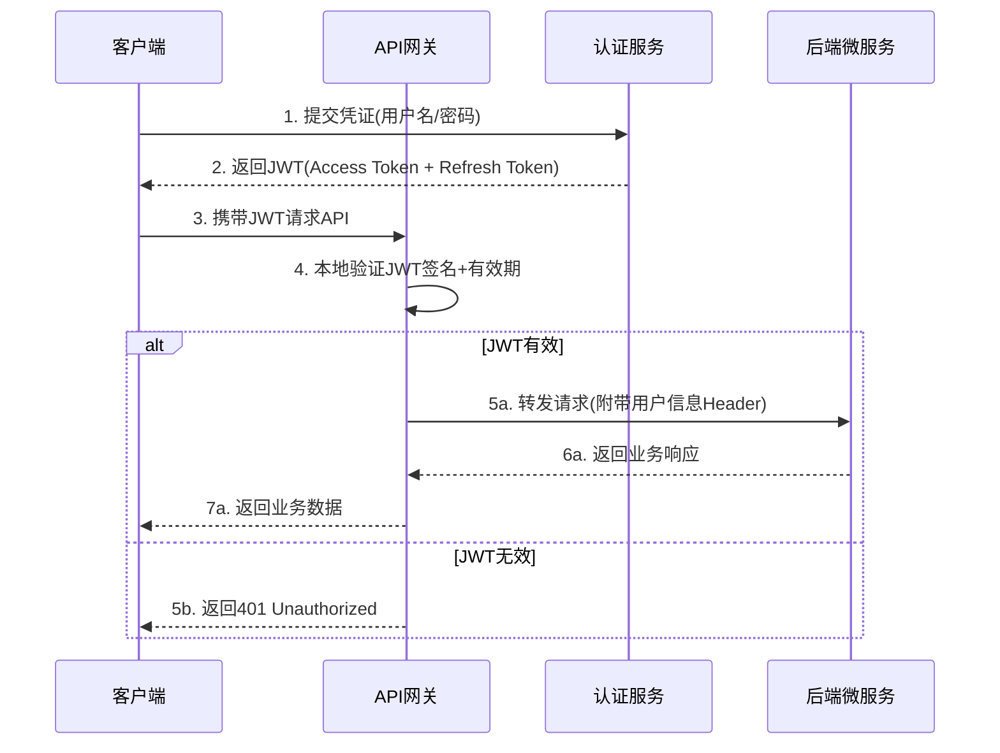
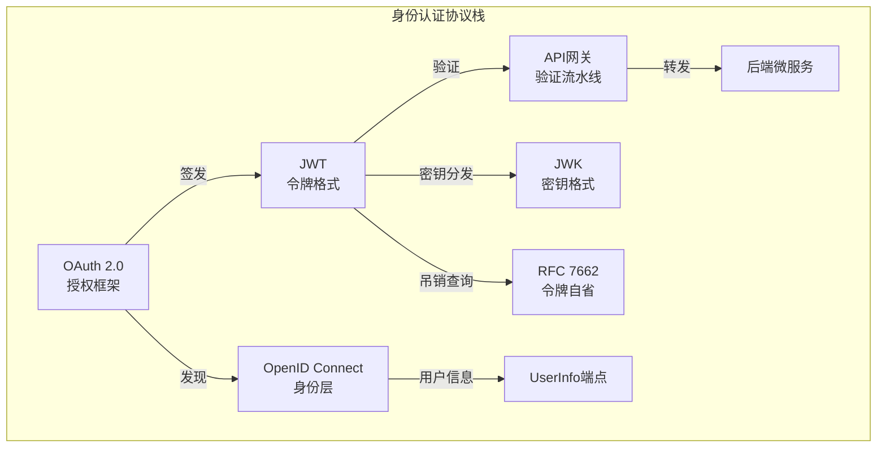
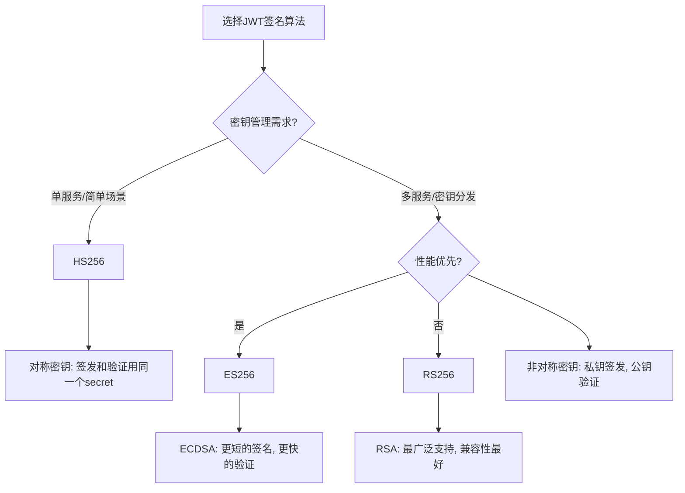
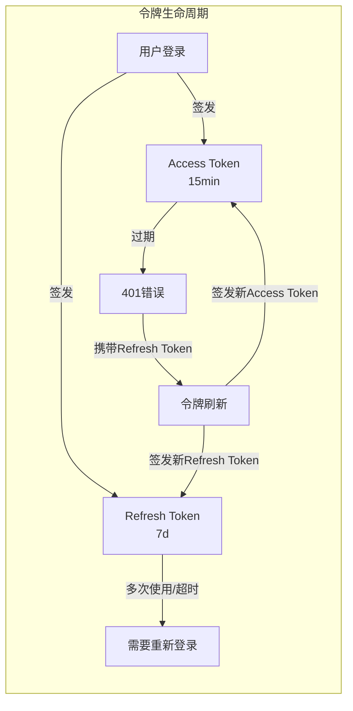
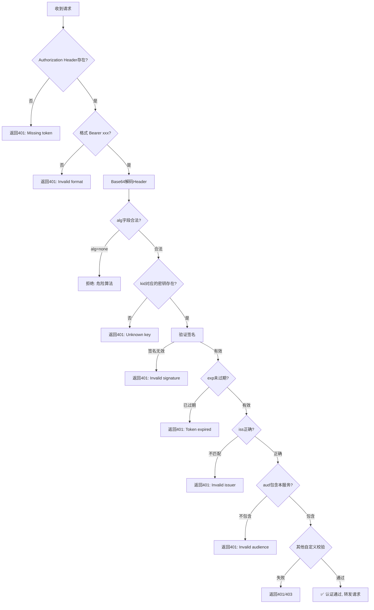
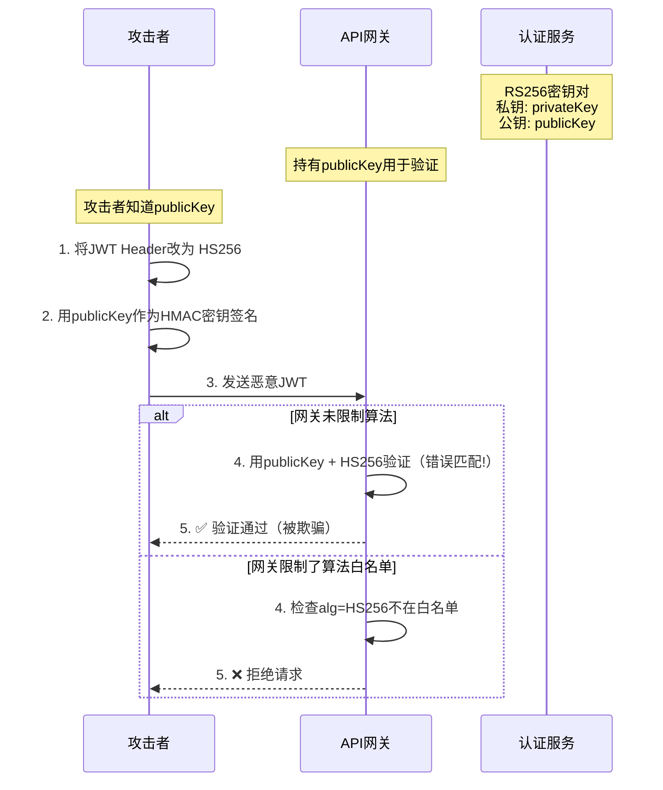
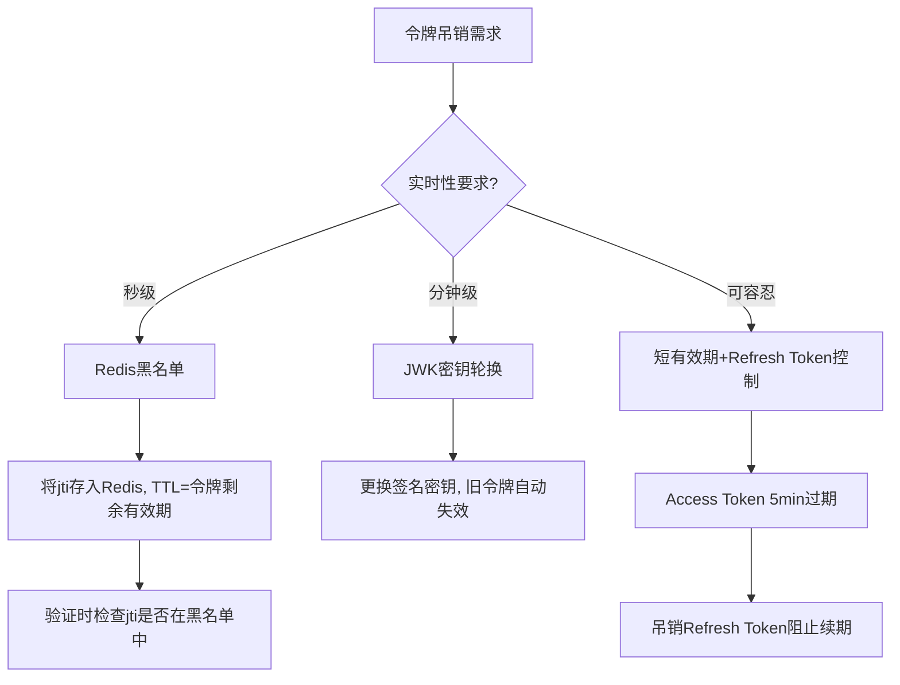
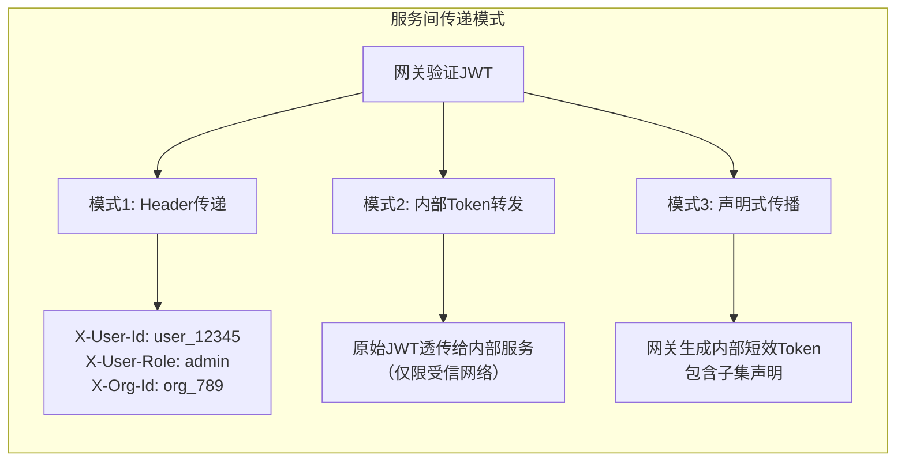
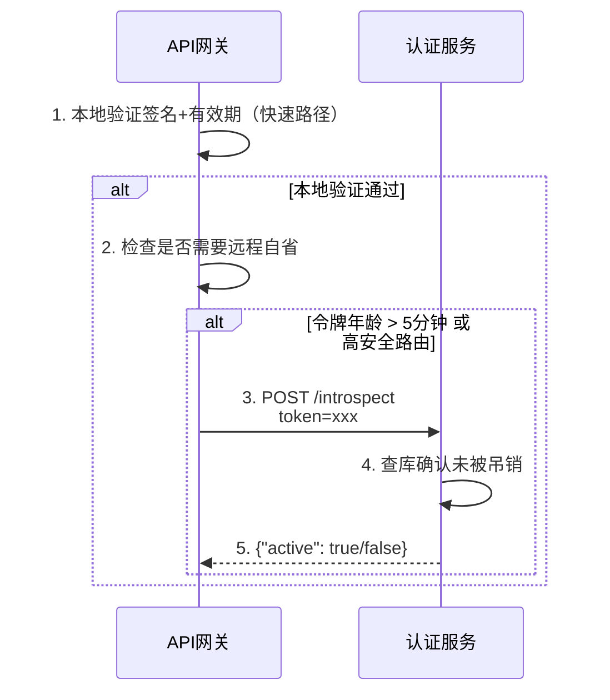

## JWT验证

### 1. 概述与背景

JWT（JSON Web Token，定义于 RFC 7519）是 API 网关中最主流的身份认证机制。在微服务架构中，客户端只需携带一个紧凑的自包含令牌，网关即可在不回源查询数据库的情况下完成身份验证，将认证开销从"每次请求查库"降低到"本地密码学校验"，这是它在 API 网关场景中被广泛采用的根本原因。



**为什么API网关选择JWT而非Session：**

| 对比维度 | Session | JWT |
|---------|---------|-----|
| 存储位置 | 服务端内存/Redis | 客户端（自包含） |
| 扩展性 | 需要共享Session存储 | 无状态，天然支持水平扩展 |
| 跨域支持 | Cookie受同源策略限制 | Header传输，无跨域限制 |
| 微服务友好 | 需要Session集中存储 | 各服务独立验证，无需共享状态 |
| 性能 | 每次请求需查询Session | 本地密码学验证，零网络IO |
| 吊销能力 | 删除Session即可 | 需要额外机制（黑名单/短有效期） |

**JWT在生态中的位置：**

JWT并非独立工作，它通常嵌入在更广泛的身份认证协议体系中。理解其定位有助于正确选型：



**Python依赖安装：**

```bash
# 核心JWT库
pip install PyJWT[crypto]

# Go模块
go get github.com/golang-jwt/jwt/v5
```

### 2. JWT协议深入解析

#### 2.1 JWT的三段式结构

JWT由三部分组成，以点号（`.`）分隔：`Header.Payload.Signature`

eyJhbG...se64

完整的JWT示例（解码前的原始形式）：

eyJhbGciOiJSUzI1NiIsInR5cCI6IkpXVCIsImtpZCI6IjIwMjQtMDEta2V5LXJvdGF0aW9uIn0
.
eyJpc3MiOiJodHRwczovL2F1dGguZXhhbXBsZS5jb20iLCJzdWIiOiJ1c2VyXzEyMzQ1IiwiYXVkI
joiYXBpLmV4YW1wbGUuY29tIiwiZXhwIjoxNzE5ODAwMDAwfQ
.
SflKxwRJSMeKKF2QT4fwpMeJf36POk6yJV_adQssw5c

**第一部分：Header（头部）**

```json
{
  "alg": "RS256",
  "typ": "JWT",
  "kid": "2024-01-key-rotation"
}
```

| 字段 | 含义 | 说明 |
|------|------|------|
| `alg` | 签名算法 | `HS256`（对称）、`RS256`（非对称）、`ES256`（椭圆曲线） |
| `typ` | 令牌类型 | 固定值 `JWT`，部分场景也使用 `at+jwt`（Access Token） |
| `kid` | 密钥ID | 用于密钥轮换时标识当前使用的密钥 |

**第二部分：Payload（载荷）**

Payload包含一组声明（Claims），分为三类：

```json
{
  "iss": "https://auth.example.com",
  "sub": "user_12345",
  "aud": "api.example.com",
  "exp": 1719800000,
  "iat": 1719796400,
  "nbf": 1719796400,
  "jti": "abcdef123456",
  "scope": "read write",
  "role": "admin",
  "org_id": "org_789"
}
```

**标准声明（Registered Claims）：**

| 声明 | 全称 | 含义 | 最佳实践 |
|------|------|------|----------|
| `iss` | Issuer | 签发者标识 | 使用完整URL，如 `https://auth.example.com` |
| `sub` | Subject | 用户唯一标识 | 使用不可预测的内部ID而非邮箱/用户名 |
| `aud` | Audience | 目标受众 | API网关必须校验，防止令牌被其他服务滥用 |
| `exp` | Expiration | 过期时间（Unix时间戳） | Access Token建议15分钟以内 |
| `iat` | Issued At | 签发时间 | 用于检测令牌是否过于陈旧 |
| `nbf` | Not Before | 生效时间 | 配合 `iat` 防止提前使用 |
| `jti` | JWT ID | 令牌唯一标识 | 用于令牌黑名单/吊销 |

**私有声明（Private Claims）注意事项：**

| 声明 | 用途 | 安全提醒 |
|------|------|----------|
| `scope` | 权限范围（如 `read write admin`） | 避免过度授权，遵循最小权限原则 |
| `role` | 用户角色 | 配合 RBAC 在网关层做粗粒度鉴权 |
| `org_id` | 组织ID | 多租户场景下的租户隔离标识 |
| `device_id` | 设备标识 | 用于设备绑定和异常检测 |

**第三部分：Signature（签名）**

签名的生成过程：

签名 = SignatureAlgorithm(Header + "." + Payload, 密钥)

- **HS256（对称）**：`HMAC-SHA256(base64(header).base64(payload), secret)`
- **RS256（非对称）**：`RSA-SHA256(base64(header).base64(payload), privateKey)` 验证用 `publicKey`
- **ES256（非对称）**：`ECDSA-SHA256(base64(header).base64(payload), privateKey)` 验证用 `publicKey`

#### 2.2 签名算法选型



| 算法 | 密钥类型 | 签名长度 | 验证速度 | 安全强度 | 适用场景 |
|------|---------|---------|---------|---------|---------|
| HS256 | 对称（共享密钥） | 32字节 | 最快 | 256位 | 单体应用、内部服务 |
| HS384 | 对称（共享密钥） | 48字节 | 快 | 384位 | 中等安全需求 |
| RS256 | 非对称（RSA 2048bit） | 256字节 | 较慢 | ~112位 | 多服务架构、公钥分发场景 |
| ES256 | 非对称（EC P-256） | 64字节 | 快 | 128位 | 高性能+高安全要求 |

**关键决策建议：**

API网关场景强烈推荐 **RS256 或 ES256**。原因是网关只持有公钥用于验证，私钥仅在认证服务中，即使网关被攻破也不会泄露签名能力。HS256需要所有服务共享同一密钥，密钥泄露风险更高。

**算法选型决策矩阵：**

| 决策因素 | 选HS256 | 选RS256 | 选ES256 |
|---------|---------|---------|---------|
| 服务数量 | 单体或少量 | 多个微服务 | 多个微服务 |
| 密钥分发 | 可共享 | 需公钥分发 | 需公钥分发 |
| 性能要求 | 极高 | 中等 | 高 |
| 生态兼容 | 通用 | 最广泛 | 新项目 |
| Token体积 | 不敏感 | 可接受 | 敏感（移动端） |

#### 2.3 访问令牌与刷新令牌



**为什么需要两种令牌：**

- **Access Token（访问令牌）**：短有效期（5-15分钟），承载用户身份和权限，每个API请求都携带。短有效期限制了令牌泄露后的攻击窗口。
- **Refresh Token（刷新令牌）**：长有效期（天到周），仅用于获取新的Access Token。存储在客户端安全区域（HttpOnly Cookie / 安全存储），不随API请求传输，降低被拦截风险。

**Refresh Token轮换策略：**

Refresh Token的安全性直接影响整个认证体系。每次使用Refresh Token刷新时，应该同时签发一个新的Refresh Token（Rotation），使旧的立即失效。这样即使Refresh Token被截获，攻击者也只有一次使用窗口：

```python
def refresh_access_token(refresh_token: str) -> dict:
    """刷新Access Token，同时轮换Refresh Token"""
    # 1. 验证Refresh Token签名和有效性
    payload = verify_refresh_token(refresh_token)
    
    # 2. 检查Refresh Token是否已被使用过（检测重放）
    jti = payload["jti"]
    if r.exists(f"refresh_used:{jti}"):
        # Refresh Token被重用 → 可能被盗 → 吊销整个Token Family
        revoke_token_family(payload["sub"])
        raise SecurityAlert("Refresh Token reuse detected")
    
    # 3. 标记当前Refresh Token为已使用
    r.setex(f"refresh_used:{jti}", 7 * 86400, "1")
    
    # 4. 签发新的Access Token + 新的Refresh Token
    new_access = issue_access_token(payload["sub"])
    new_refresh = issue_refresh_token(payload["sub"])
    
    return {"access_token": new_access, "refresh_token": new_refresh}
```

### 3. API网关中的JWT验证流程

#### 3.1 验证流水线

网关收到携带JWT的请求后，需要按严格顺序执行以下校验步骤：



**验证顺序的重要性：**

验证步骤的顺序并非随意安排。正确的顺序遵循"先快速后昂贵"的原则：

| 顺序 | 检查项 | 耗时 | 原因 |
|------|--------|------|------|
| 1 | Header格式 | <1μs | 字符串匹配，最便宜 |
| 2 | 算法白名单 | <1μs | Base64解码+JSON解析 |
| 3 | kid密钥查找 | <1μs | 内存哈希表查找 |
| 4 | 签名验证 | 10-125μs | 密码学运算，最昂贵 |
| 5 | 过期时间 | <1μs | 整数比较 |
| 6 | iss/aud验证 | <1μs | 字符串比较 |
| 7 | 业务校验 | 变化 | 可能涉及Redis/DB查询 |

#### 3.2 完整的验证实现（Python + Flask）

```python
import jwt
import time
import json
import base64
import logging
from functools import wraps
from flask import Flask, request, jsonify, g
from cryptography.x509 import load_pem_x509_certificate
from cryptography.hazmat.backends import default_backend

app = Flask(__name__)
logger = logging.getLogger("jwt.gateway")

# ============ 密钥配置 ============
# RS256公钥：从认证服务获取，定期轮换
SIGNING_KEY = """-----BEGIN PUBLIC KEY-----
MIIBIjANBgkqhkiG9w0BAQEFAAOCAQ8AMIIBCgKCAQEA0Z3VS5JJcds3xfn/ygWe
GhFIAcK0qMdaS3JCP5J4LJ0J4R5F7b8K2P3v4d5e6f7g8h9i0j1k2l3m4n5o6p7q8
r9s0t1u2v3w4x5y6z7a8b9c0d1e2f3g4h5i6j7k8l9m0n1o2p3q4r5s6t7u8v9w0
-----END PUBLIC KEY-----"""

# 缓存已加载的公钥，避免每次验证重复解析
_cached_public_key = None

def get_signing_key():
    global _cached_public_key
    if _cached_public_key is None:
        cert = load_pem_x509_certificate(
            SIGNING_KEY.encode(), default_backend()
        )
        _cached_public_key = cert.public_key()
    return _cached_public_key


# ============ 白名单验证 ============
# 危险算法黑名单：绝不允许使用
BLOCKED_ALGORITHMS = {"none", "None", "NONE"}

# 允许的算法白名单
ALLOWED_ALGORITHMS = ["RS256"]


# ============ 核心验证函数 ============
def verify_token(token: str) -> dict:
    """
    完整的JWT验证流水线，按顺序执行所有校验。
    
    Raises:
        jwt.ExpiredSignatureError: 令牌已过期
        jwt.InvalidIssuerError: 签发者不匹配
        jwt.InvalidAudienceError: 受众不匹配
        jwt.InvalidSignatureError: 签名无效
        ValueError: 算法不被允许
    """
    # 步骤1：解码Header，检查算法（不验证签名）
    try:
        unverified_header = jwt.get_unverified_header(token)
    except jwt.DecodeError:
        raise ValueError("无法解析令牌Header")
    
    # 步骤2：算法白名单校验——防御alg=none攻击
    algorithm = unverified_header.get("alg", "")
    if algorithm in BLOCKED_ALGORITHMS:
        raise ValueError(f"危险算法被拒绝: {algorithm}")
    if algorithm not in ALLOWED_ALGORITHMS:
        raise ValueError(f"算法不在白名单中: {algorithm}")
    
    # 步骤3：完整验证（签名+过期+签发者+受众）
    payload = jwt.decode(
        token,
        get_signing_key(),
        algorithms=ALLOWED_ALGORITHMS,
        issuer="https://auth.example.com",
        audience="api.example.com",
        options={
            "require": ["exp", "iss", "sub", "aud"],
            "verify_exp": True,
            "verify_iss": True,
            "verify_aud": True,
        }
    )
    
    # 步骤4：自定义业务校验
    if payload.get("active") is False:
        raise ValueError("用户账号已被禁用")
    
    return payload


# ============ Flask认证中间件 ============
def require_auth(f):
    @wraps(f)
    def decorated(*args, **kwargs):
        # 提取Authorization Header
        auth_header = request.headers.get("Authorization", "")
        if not auth_header.startswith("Bearer "):
            return jsonify({"error": "缺少Bearer令牌"}), 401
        
        token = auth_header[7:]  # 去掉 "Bearer " 前缀
        
        try:
            payload = verify_token(token)
        except jwt.ExpiredSignatureError:
            return jsonify({"error": "令牌已过期", "code": "TOKEN_EXPIRED"}), 401
        except jwt.InvalidSignatureError:
            return jsonify({"error": "签名验证失败", "code": "INVALID_SIGNATURE"}), 401
        except jwt.InvalidIssuerError:
            return jsonify({"error": "签发者不匹配", "code": "INVALID_ISSUER"}), 401
        except jwt.InvalidAudienceError:
            return jsonify({"error": "受众不匹配", "code": "INVALID_AUDIENCE"}), 401
        except ValueError as e:
            return jsonify({"error": str(e), "code": "INVALID_TOKEN"}), 401
        
        # 将用户信息注入请求上下文，供后端服务使用
        g.user_id = payload["sub"]
        g.scopes = payload.get("scope", "").split()
        g.org_id = payload.get("org_id")
        
        return f(*args, **kwargs)
    return decorated


# ============ API路由 ============
@app.route("/api/v1/profile")
@require_auth
def get_profile():
    return jsonify({
        "user_id": g.user_id,
        "org_id": g.org_id,
        "scopes": g.scopes
    })


@app.route("/api/v1/admin/users")
@require_auth
def admin_list_users():
    # 权限检查：需要admin角色
    if "admin" not in g.scopes:
        return jsonify({"error": "权限不足"}), 403
    return jsonify({"users": []})
```

#### 3.3 Go语言实现（高性能网关）

```go
package middleware

import (
    "context"
    "crypto/rsa"
    "encoding/json"
    "errors"
    "net/http"
    "strings"
    "sync"
    "time"

    "github.com/golang-jwt/jwt/v5"
)

// JWTPayload 自定义Claims
type JWTPayload struct {
    jwt.RegisteredClaims
    Role  string   `json:"role"`
    Scopes []string `json:"scopes"`
    OrgID string   `json:"org_id"`
}

// JWTValidator 验证器，管理公钥缓存
type JWTValidator struct {
    publicKey     *rsa.PublicKey
    issuer        string
    audience      string
    mu            sync.RWMutex
    allowedAlgs   []string
}

// NewJWTValidator 创建验证器实例
func NewJWTValidator(pubKey *rsa.PublicKey, issuer, audience string) *JWTValidator {
    return &amp;JWTValidator{
        publicKey:   pubKey,
        issuer:      issuer,
        audience:    audience,
        allowedAlgs: []string{"RS256"},
    }
}

// ValidateToken 验证JWT并返回Claims
func (v *JWTValidator) ValidateToken(tokenStr string) (*JWTPayload, error) {
    // 使用解析回调，在签名验证前拦截危险算法
    parser := jwt.NewParser(
        jwt.WithAllowedMethods(v.allowedAlgs),
    )

    token, err := parser.ParseWithClaims(tokenStr, &amp;JWTPayload{},
        func(token *jwt.Token) (interface{}, error) {
            // 强制校验签名方法类型，防止算法混淆攻击
            if _, ok := token.Method.(*jwt.SigningMethodRSA); !ok {
                return nil, errors.New("unexpected signing method: " +
                    token.Method.Alg())
            }
            v.mu.RLock()
            defer v.mu.RUnlock()
            return v.publicKey, nil
        },
    )

    if err != nil || !token.Valid {
        return nil, errors.New("invalid token")
    }

    claims, ok := token.Claims.(*JWTPayload)
    if !ok {
        return nil, errors.New("failed to parse claims")
    }

    // 自定义验证
    if claims.Issuer != v.issuer {
        return nil, errors.New("invalid issuer")
    }
    if !claims.Audience.Contains(v.audience) {
        return nil, errors.New("invalid audience")
    }
    if claims.ExpiresAt != nil &amp;&amp; claims.ExpiresAt.Before(time.Now()) {
        return nil, errors.New("token expired")
    }

    return claims, nil
}

// AuthMiddleware 返回JWT认证中间件
func AuthMiddleware(validator *JWTValidator) func(http.Handler) http.Handler {
    return func(next http.Handler) http.Handler {
        return http.HandlerFunc(func(w http.ResponseWriter, r *http.Request) {
            authHeader := r.Header.Get("Authorization")
            if authHeader == "" || !strings.HasPrefix(authHeader, "Bearer ") {
                http.Error(w, `{"error":"missing token"}`, http.StatusUnauthorized)
                return
            }

            tokenStr := strings.TrimPrefix(authHeader, "Bearer ")
            claims, err := validator.ValidateToken(tokenStr)
            if err != nil {
                http.Error(w, `{"error":"`+err.Error()+`"}`, http.StatusUnauthorized)
                return
            }

            // 将用户信息注入请求Context
            ctx := context.WithValue(r.Context(), "user_id", claims.Subject)
            ctx = context.WithValue(ctx, "scopes", claims.Scopes)
            ctx = context.WithValue(ctx, "org_id", claims.OrgID)
            next.ServeHTTP(w, r.WithContext(ctx))
        })
    }
}
```

### 4. 安全加固：攻击与防御

#### 4.1 JWT常见攻击手法

| 攻击类型 | 攻击原理 | 防御措施 |
|---------|---------|---------|
| **alg=none攻击** | 篡改Header中的alg为none，绕过签名验证 | 网关端强制算法白名单，拒绝none算法 |
| **算法混淆攻击** | 将RS256降级为HS256，用公钥作为HMAC密钥签名 | 验证时显式指定允许的算法列表 |
| **密钥泄露** | 弱密钥被暴力破解（如`secret`、`123456`） | RS256（2048bit+）、密钥定期轮换 |
| **令牌泄露** | XSS窃取存储在localStorage中的令牌 | HttpOnly Cookie + 短有效期Access Token |
| **重放攻击** | 截获有效令牌后重复使用 | jti黑名单 + 短有效期 + HTTPS传输 |
| **令牌注入** | 将合法用户A的令牌注入到用户B的请求中 | 绑定客户端指纹（jkt/JWT Confirmation） |
| **中间人攻击** | 拦截传输中的令牌 | 全站HTTPS + HSTS |
| **密钥注入** | 将JWK端点中注入恶意密钥 | 验证JWK的kid与预期值匹配，使用硬编码公钥兜底 |
| **JWT炸弹** | 构造超大Payload导致内存/带宽耗尽 | 限制Token最大长度（如8KB），拒绝解码失败的大Token |

#### 4.2 算法混淆攻击详解

这是最隐蔽也最危险的JWT攻击之一。攻击流程如下：



**防御代码（关键片段）：**

```python
# ❌ 错误写法：不指定算法，由JWT Header决定
payload = jwt.decode(token, public_key)  # 危险! 可能被HS256绕过

# ✅ 正确写法：强制指定算法白名单
payload = jwt.decode(
    token,
    public_key,
    algorithms=["RS256"]  # 只接受RS256
)
```

#### 4.3 令牌吊销机制

JWT的无状态特性意味着一旦签发就无法主动失效。以下是几种常用的吊销策略：



**Redis黑名单实现：**

```python
import redis
import jwt
import time

r = redis.Redis(host='localhost', port=6379, db=0)

def revoke_token(token: str):
    """吊销令牌：将jti存入Redis黑名单"""
    payload = jwt.decode(token, options={"verify_signature": False})
    jti = payload["jti"]
    exp = payload["exp"]
    
    # TTL设为令牌过期时间，过期后自动清理
    ttl = max(exp - int(time.time()), 0)
    r.setex(f"jwt:blacklist:{jti}", ttl, "1")

def is_token_revoked(token: str) -> bool:
    """检查令牌是否已被吊销"""
    payload = jwt.decode(token, options={"verify_signature": False})
    jti = payload["jti"]
    return r.exists(f"jwt:blacklist:{jti}") > 0
```

**令牌吊销策略对比：**

| 策略 | 实时性 | 额外IO | 实现复杂度 | 适用场景 |
|------|--------|--------|-----------|---------|
| Redis黑名单 | 秒级 | 每次请求1次Redis查询 | 低 | 需要即时吊销（如用户登出） |
| JWK密钥轮换 | 分钟级 | 无（密钥分发时） | 中 | 定期安全轮换 |
| 短有效期 | 分钟级 | 无 | 低 | 默认策略，兜底方案 |
| Token自省 | 秒级 | 每次请求1次HTTP调用 | 中 | 高安全场景（如金融） |
| 每次签发新Key | 分钟级 | 无 | 高 | 安全要求极高，配合短有效期 |

### 5. 高级场景

#### 5.1 JWK（JSON Web Key）与密钥轮换

在大规模系统中，硬编码公钥是不可持续的。JWK允许认证服务以标准化格式发布公钥，网关动态获取和缓存。

```json
{
  "keys": [
    {
      "kty": "RSA",
      "kid": "2024-01",
      "use": "sig",
      "alg": "RS256",
      "n": "0vx7agoebGcQSuuPiLJXZptN9nndrQmbXEps2aiAFbWhM...",
      "e": "AQAB"
    },
    {
      "kty": "RSA",
      "kid": "2024-06-rotation",
      "use": "sig",
      "alg": "RS256",
      "n": "yK2bR8Q9n4tVzW3aL5mJ7pD1fH3gB9kN0rS2vX4cE6...",
      "e": "AQAB"
    }
  ]
}
```

```python
import jwt
import requests
from functools import lru_cache
import time

JWKS_URL = "https://auth.example.com/.well-known/jwks.json"

# 带TTL的JWK缓存
_jwks_cache = {"data": None, "expires_at": 0}
JWKS_CACHE_TTL = 3600  # 1小时

def get_jwks() -> dict:
    """获取JWK集合，带TTL缓存"""
    now = time.time()
    if _jwks_cache["data"] and _jwks_cache["expires_at"] > now:
        return _jwks_cache["data"]
    
    resp = requests.get(JWKS_URL, timeout=5)
    resp.raise_for_status()
    data = resp.json()
    
    _jwks_cache["data"] = data
    _jwks_cache["expires_at"] = now + JWKS_CACHE_TTL
    return data

def get_key_by_kid(kid: str):
    """根据kid查找对应的公钥"""
    jwks = get_jwks()
    for key_data in jwks.get("keys", []):
        if key_data["kid"] == kid:
            return jwt.algorithms.RSAAlgorithm.from_jwk(key_data)
    raise ValueError(f"未找到kid={kid}对应的密钥")

def verify_with_jwks(token: str) -> dict:
    """使用JWK验证JWT"""
    header = jwt.get_unverified_header(token)
    kid = header.get("kid")
    if not kid:
        raise ValueError("令牌Header中缺少kid")
    
    public_key = get_key_by_kid(kid)
    return jwt.decode(token, public_key, algorithms=["RS256"])
```

**密钥轮换最佳实践：**

1. **重叠期**：新旧密钥并存至少24小时，确保所有客户端有时间更新
2. **kid标识**：每次轮换使用不同的kid，网关根据kid自动选择正确密钥
3. **自动获取**：通过JWKS端点自动拉取，而非手动配置
4. **缓存策略**：缓存JWKS但设置合理TTL（如1小时），定期刷新
5. **密钥失效保护**：即使JWKS端点不可用，网关应能使用缓存的密钥继续验证

#### 5.2 跨服务Token传递

在微服务架构中，网关验证JWT后需要将用户身份传递给后端服务：



**模式对比：**

| 模式 | 做法 | 优点 | 缺点 |
|------|------|------|------|
| Header传递 | 将JWT声明拆解为独立Header | 简单直接，后端无需JWT库 | Header过多有性能开销，需防伪造 |
| 原始Token透传 | 直接转发原始JWT | 零转换开销 | 内部网络需加密，令牌暴露面大 |
| 声明式传播 | 网关签发内部短效Token | 最安全，最小权限 | 网关需要签名能力，增加复杂度 |

**推荐方案：Header传递 + mTLS保护**

```python
# 网关转发时注入用户信息Header
@app.before_request
def forward_user_context():
    # g.user_id, g.scopes 在认证中间件中已设置
    pass

@app.route("/api/v1/<path:path>", methods=["GET", "POST", "PUT", "DELETE"])
@require_auth
def proxy(path):
    headers = {
        "X-User-Id": g.user_id,
        "X-User-Scopes": " ".join(g.scopes),
        "X-Request-Id": str(uuid.uuid4()),
        "X-Forwarded-For": request.remote_addr,
    }
    if g.org_id:
        headers["X-Org-Id"] = g.org_id
    
    resp = requests.request(
        method=request.method,
        url=f"http://backend-service/{path}",
        headers=headers,
        data=request.get_data(),
        timeout=10
    )
    return resp.content, resp.status_code
```

**Header伪造防护：**

后端服务在接收Header时，必须验证这些Header确实来自网关，而非客户端直接注入：

```python
# 后端服务：验证Header来源
@app.before_request
def verify_gateway_headers():
    """只信任来自网关IP的Header"""
    allowed_gateway_ips = {"10.0.0.1", "10.0.0.2"}
    if request.remote_addr not in allowed_gateway_ips:
        # 不是网关发来的 → 忽略所有X-User-* Header
        return
    # 网关发来的 → 信任Header
    g.user_id = request.headers.get("X-User-Id")
```

#### 5.3 JWT自省（Introspection）

对于需要实时验证令牌有效性的场景（如确认令牌是否已被吊销），RFC 7662定义了Token Introspection端点：



**自省与本地验证的决策矩阵：**

| 场景 | 验证方式 | 原因 |
|------|---------|------|
| 普通API（读取） | 仅本地验证 | 性能优先，短有效期兜底 |
| 敏感操作（支付） | 本地验证 + 远程自省 | 安全优先，确保未被吊销 |
| 令牌年龄 < 5分钟 | 仅本地验证 | 新鲜令牌，吊销概率极低 |
| 令牌年龄 > 5分钟 | 本地验证 + 远程自省 | 可能已被吊销，需确认 |
| 高频API（>1000 QPS） | 仅本地验证 | 自省延迟不可接受 |
| 低频API（<10 QPS） | 本地验证 + 远程自省 | 可接受额外延迟 |

#### 5.4 RFC 8725：JWT最佳实践合规

RFC 8725（JWT Best Current Practices）总结了JWT实现中的常见陷阱。以下是API网关必须检查的合规项：

| 合规项 | 要求 | 检查方法 |
|--------|------|---------|
| 防alg=none | 禁止接受alg=none的令牌 | 算法白名单检查 |
| 防密钥混淆 | 禁止算法降级（如RS256→HS256） | 显式指定算法列表 |
| 防JSON解析泛型 | 使用类型安全的Claims解析 | 使用结构化Claims类型 |
| 限制Token大小 | 拒绝超大Token | 限制最大8KB |
| 限制exp范围 | 拒绝far-future的exp | 检查exp不超过当前+24h |
| 验证aud | 必须验证audience声明 | 强制aud校验 |
| 验证iss | 必须验证issuer声明 | 强制iss校验 |
| 验证typ | 检查typ声明 | 确保typ为JWT |

### 6. 生产环境实战

#### 6.1 主流网关的JWT配置

**Kong Gateway：**

```yaml
# kong.yml - 服务配置
services:
  - name: user-service
    url: http://user-service:8080
    plugins:
      - name: jwt
        config:
          key_claim_name: kid
          claims_to_verify:
            - exp
            - nbf
          run_on_preflight: false
          maximum_expiration: 900  # 15分钟上限
```

**NGINX + lua-resty-jwt：**

```nginx
http {
    lua_package_path "/usr/local/openresty/lualib/;;";
    
    server {
        listen 80;
        
        location /api/ {
            access_by_lua_block {
                local jwt = require "resty.jwt"
                local validators = require "resty.jwt-validators"
                
                local auth_header = ngx.req.get_headers()["Authorization"]
                if not auth_header then
                    ngx.status = 401
                    ngx.say('{"error":"missing token"}')
                    return ngx.exit(401)
                end
                
                local token = auth_header:match("Bearer%s+(.+)")
                if not token then
                    ngx.status = 401
                    ngx.say('{"error":"invalid format"}')
                    return ngx.exit(401)
                end
                
                local jwt_obj = jwt:verify(
                    -- 公钥（从JWK端点获取或硬编码）
                    public_key,
                    token,
                    {
                        iss = validators.equals("https://auth.example.com"),
                        aud = validators.equals("api.example.com"),
                        exp = validators.is_not_expired(),
                    }
                )
                
                if not jwt_obj.verified then
                    ngx.status = 401
                    ngx.say('{"error":"' .. jwt_obj.reason .. '"}')
                    return ngx.exit(401)
                end
                
                -- 注入用户信息到Header
                ngx.req.set_header("X-User-Id", jwt_obj.payload.sub)
            }
            
            proxy_pass http://backend-service;
        }
    }
}
```

**Envoy Proxy（JWT Filter）：**

```yaml
# envoy.yaml - JWT验证过滤器
http_filters:
  - name: envoy.filters.http.jwt_authn
    typed_config:
      "@type": type.googleapis.com/envoy.extensions.filters.http.jwt_authn.v3.JwtAuthentication
      providers:
        auth_provider:
          issuer: "https://auth.example.com"
          audiences:
            - "api.example.com"
          remote_jwks:
            http_uri:
              uri: "https://auth.example.com/.well-known/jwks.json"
              cluster: auth_service
              timeout: 5s
            cache_duration: 3600s
          forward: true
          forward_payload_header: "x-jwt-payload"
      rules:
        - match:
            prefix: /api/
          requires:
            provider_name: auth_provider
```

#### 6.2 性能优化

**验证性能基准：**

| 算法 | 验证速度（ops/sec） | CPU单次耗时 | 适用QPS |
|------|---------------------|-------------|---------|
| HS256 (Python) | ~30,000 | ~33μs | 高 |
| RS256 (Python) | ~8,000 | ~125μs | 中 |
| RS256 (Go) | ~50,000 | ~20μs | 极高 |
| ES256 (Go) | ~80,000 | ~12μs | 极高 |

**优化策略一：公钥缓存**

```python
# ❌ 每次验证都解析公钥字符串
def verify_bad(token):
    public_key = load_pem_public_key(pem_bytes)  # 每次都解析
    return jwt.decode(token, public_key, algorithms=["RS256"])

# ✅ 缓存解析后的公钥对象
from functools import lru_cache

@lru_cache(maxsize=1)
def get_cached_public_key():
    return load_pem_public_key(pem_bytes)

def verify_good(token):
    return jwt.decode(token, get_cached_public_key(), algorithms=["RS256"])
```

**优化策略二：Header预检**

在签名验证前，先快速检查是否能拒绝：

```python
def fast_reject_check(token: str) -> Optional[str]:
    """快速预检，能提前拒绝的就不做完整验证"""
    # 检查格式
    parts = token.split(".")
    if len(parts) != 3:
        return "格式错误"
    
    # 快速解码Header检查算法
    try:
        header = json.loads(base64url_decode(parts[0]))
    except Exception:
        return "Header解析失败"
    
    if header.get("alg") in ("none", "None"):
        return "危险算法"
    
    # 快速解码Payload检查过期时间（不验证签名）
    try:
        payload = json.loads(base64url_decode(parts[1]))
        if payload.get("exp", 0) < time.time():
            return "已过期"
    except Exception:
        return "Payload解析失败"
    
    return None  # 无快速拒绝原因，需完整验证
```

**优化策略三：批量验证**

对于需要同时验证多个令牌的场景（如批量API调用聚合）：

```python
from concurrent.futures import ThreadPoolExecutor

def batch_verify(tokens: list) -> list:
    """并行验证多个JWT"""
    with ThreadPoolExecutor(max_workers=8) as executor:
        results = list(executor.map(verify_token_safe, tokens))
    return results

def verify_token_safe(token: str) -> dict:
    try:
        return {"valid": True, "payload": verify_token(token)}
    except Exception as e:
        return {"valid": False, "error": str(e)}
```

**优化策略四：延迟自省**

不是所有请求都需要远程自省。通过本地缓存+延迟策略减少网络调用：

```python
from functools import lru_cache
import time

# 缓存最近的自省结果，避免重复调用
_introspection_cache = {}
CACHE_TTL = 30  # 30秒缓存

def should_introspect(token: str) -> bool:
    """判断是否需要远程自省"""
    payload = jwt.decode(token, options={"verify_signature": False})
    
    # 规则1：高安全路由始终自省
    if request.path.startswith("/api/v1/payment/"):
        return True
    
    # 规则2：令牌年龄超过5分钟
    token_age = time.time() - payload.get("iat", 0)
    if token_age > 300:
        return True
    
    return False
```

### 7. 监控与运维

#### 7.1 关键监控指标

```bash
# 使用Prometheus监控JWT验证指标
cat << 'EOF' > jwt_metrics.yaml
# 需要监控的JWT相关指标
jwt_verification_total:
  labels: [status, algorithm, error_type]
  description: "JWT验证总次数，按结果分"

jwt_verification_latency_seconds:
  labels: [algorithm]
  description: "JWT验证延迟分布（直方图）"

jwt_token_expiry_seconds:
  labels: []
  description: "令牌剩余有效期分布"

jwt_key_rotation_total:
  labels: [kid]
  description: "密钥轮换次数"
EOF
```

**Prometheus指标埋点示例（Python）：**

```python
from prometheus_client import Counter, Histogram, Gauge

# 验证结果计数
JWT_VERIFY_TOTAL = Counter(
    'jwt_verification_total',
    'JWT verification attempts',
    ['status', 'algorithm', 'error_type']
)

# 验证延迟直方图
JWT_VERIFY_LATENCY = Histogram(
    'jwt_verification_latency_seconds',
    'JWT verification latency',
    ['algorithm'],
    buckets=[0.00001, 0.00005, 0.0001, 0.0005, 0.001, 0.005, 0.01]
)

# 令牌剩余有效期
JWT_TOKEN_TTL = Gauge(
    'jwt_token_ttl_seconds',
    'Token remaining TTL'
)

def verify_with_metrics(token: str, algorithm: str = "RS256"):
    with JWT_VERIFY_LATENCY.labels(algorithm=algorithm).time():
        try:
            payload = verify_token(token)
            JWT_VERIFY_TOTAL.labels(status="success", algorithm=algorithm, error_type="").inc()
            
            # 记录令牌剩余有效期
            ttl = payload.get("exp", 0) - time.time()
            JWT_TOKEN_TTL.set(ttl)
            
            return payload
        except Exception as e:
            error_type = type(e).__name__
            JWT_VERIFY_TOTAL.labels(status="error", algorithm=algorithm, error_type=error_type).inc()
            raise
```

**关键告警规则：**

| 指标 | 告警条件 | 含义 |
|------|---------|------|
| `jwt_verification_error_rate` | > 5% 持续5分钟 | 可能存在攻击或客户端问题 |
| `jwt_verification_p99_latency` | > 50ms | 验证性能劣化 |
| `jwt_expired_token_ratio` | > 30% | 客户端未及时刷新令牌 |
| `jwt_unknown_kid_count` | > 0 | 可能是密钥轮换后客户端未更新 |
| `jwt_alg_none_count` | > 0 | 可能存在alg=none攻击尝试 |

#### 7.2 审计日志

```python
import logging
import json
import time

audit_logger = logging.getLogger("jwt.audit")

def log_jwt_event(event_type: str, token_info: dict, 
                  status: str, extra: dict = None):
    """记录JWT相关审计日志"""
    log_entry = {
        "timestamp": int(time.time()),
        "event": event_type,
        "status": status,
        "kid": token_info.get("kid"),
        "alg": token_info.get("alg"),
        "issuer": token_info.get("iss"),
        "subject_hash": hash(token_info.get("sub", "")),
        "expires_at": token_info.get("exp"),
        "client_ip": request.remote_addr if request else None,
        "request_id": request.id if request else None,
    }
    if extra:
        log_entry.update(extra)
    
    audit_logger.info(json.dumps(log_entry))
```

**注意**：审计日志中绝对不要记录完整的JWT令牌或用户明文标识。使用hash处理subject，防止日志泄露用户身份。

#### 7.3 生产故障排查

**常见故障场景与排查路径：**

| 故障现象 | 可能原因 | 排查步骤 |
|---------|---------|---------|
| 大量401 Unauthorized | 密钥轮换后客户端未更新 | 检查unknown_kid_count指标 |
| 验证延迟飙升 | 公钥缓存失效、JWKS端点超时 | 检查JWKS拉取日志、缓存命中率 |
| 令牌验证通过但后端拒绝 | aud/iss配置不一致 | 对比网关和后端的aud/iss配置 |
| 间歇性401 | 时钟偏差导致exp误判 | 检查服务器时钟同步（NTP） |
| Refresh Token刷新失败 | Token Family被撤销 | 检查refresh_used缓存，确认是否重放 |

### 8. 常见误区

#### 误区一：在JWT中存放敏感信息

JWT的Payload是Base64编码而非加密。任何人都可以解码查看内容。

```bash
# 任何人都能解码JWT Payload
echo 'eyJpc3...0ifQ' | base64 -d
# 输出: {"iss":"https://auth.example.com"}
```

**正确做法**：JWT中只存放非敏感的身份标识和元数据。敏感数据放在后端数据库，通过sub字段关联查询。

#### 误区二：JWT有效期过长

Access Token的有效期不应超过15分钟。过长的有效期意味着一旦泄露，攻击者有更长的利用窗口。

```python
# ❌ 错误：24小时有效期
payload = {"exp": int(time.time()) + 86400}

# ✅ 正确：15分钟有效期
payload = {"exp": int(time.time()) + 900}
```

#### 误区三：忽略aud字段验证

不验证aud字段意味着为服务A签发的令牌可以被用于访问服务B。

```python
# ❌ 错误：不验证受众
jwt.decode(token, key, algorithms=["RS256"])

# ✅ 正确：强制验证受众
jwt.decode(token, key, algorithms=["RS256"], audience="api.example.com")
```

#### 误区四：信任客户端传入的用户ID

JWT验证通过后，用户标识应从JWT的sub字段提取，而非从客户端请求参数中获取。

```python
# ❌ 错误：信任客户端传入
user_id = request.args.get("user_id")

# ✅ 正确：从验证后的JWT中提取
user_id = g.user_id  # 来自JWT的sub字段
```

#### 误区五：将JWT存储在localStorage

localStorage容易受到XSS攻击。应该使用HttpOnly + Secure + SameSite=Strict的Cookie，或者移动端的Secure Storage。

#### 误区六：不验证Token大小

攻击者可能构造超大Payload导致内存耗尽。应该在解码前检查Token大小：

```python
MAX_TOKEN_SIZE = 8192  # 8KB

def verify_token_safe(token: str) -> dict:
    # 检查Token大小
    if len(token.encode()) > MAX_TOKEN_SIZE:
        raise ValueError("Token exceeds maximum size")
    
    # 检查段数
    if token.count(".") != 2:
        raise ValueError("Invalid Token format")
    
    return verify_token(token)
```

#### 误区七：忽略时钟偏差

不同服务器之间可能存在几秒到几分钟的时钟偏差。验证exp时应留出余量：

```python
# 考虑时钟偏差的验证
CLOCK_SKEW_SECONDS = 30  # 允许30秒偏差

def verify_with_clock_skew(token: str) -> dict:
    payload = jwt.decode(
        token,
        key,
        algorithms=["RS256"],
        options={"verify_exp": True}
    )
    
    # 额外检查：拒绝过于超前的exp（防止未来令牌攻击）
    now = time.time()
    if payload["exp"] > now + 86400:  # 超过24小时后过期
        raise ValueError("Token expiry too far in the future")
    
    return payload
```

### 9. 最佳实践清单

1. **始终使用HTTPS**：JWT以明文传输，必须通过TLS保护
2. **强制算法白名单**：`algorithms=["RS256"]`，绝不让客户端决定算法
3. **短期Access Token**：15分钟以内，配合Refresh Token使用
4. **验证所有标准声明**：exp、iss、aud缺一不可
5. **使用非对称签名**：RS256或ES256，网关只持有公钥
6. **密钥定期轮换**：通过JWK端点自动分发
7. **实现令牌吊销**：Redis黑名单 + jti字段
8. **分离令牌职责**：Access Token用于API访问，Refresh Token用于令牌续期
9. **日志脱敏**：审计日志中不记录完整令牌和明文用户信息
10. **速率限制**：对认证端点和令牌刷新端点实施限流
11. **Refresh Token轮换**：每次刷新签发新Refresh Token，检测重用攻击
12. **限制Token大小**：拒绝超过8KB的令牌，防止资源耗尽攻击
13. **验证Token来源**：后端服务验证Header来自网关IP，防止客户端伪造

### 10. 本节小结

JWT验证是API网关身份认证的核心环节。本节从协议原理到工程实现，系统性地阐述了：

- JWT的三段式结构和各字段的含义与最佳取值
- API网关中完整的验证流水线（从Header检查到自定义业务校验）
- Python和Go两种语言的生产级实现代码
- 七种常见攻击手法及对应的防御措施
- JWK密钥轮换、跨服务Token传递等高级场景
- RFC 8725合规检查清单
- 主流网关（Kong/NGINX/Envoy）的配置示例
- 性能优化策略和监控运维方案
- 七个常见误区及纠正方法

核心要记住：JWT验证的安全性取决于实现的严谨性。一个遗漏的检查点（如未验证算法、未验证audience）就可能导致整个认证体系被绕过。安全不是一次性工作，而是持续的警惕和加固。在生产环境中，建议定期进行JWT实现的安全审计，对照RFC 8725清单逐项检查，确保没有遗漏。
