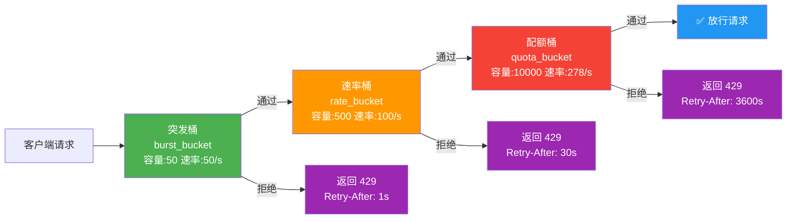
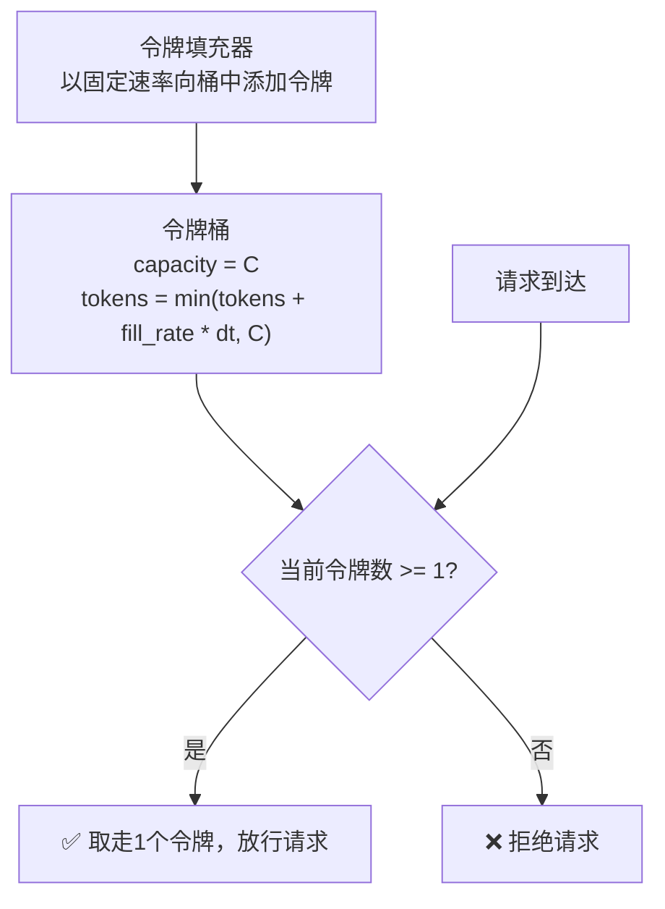
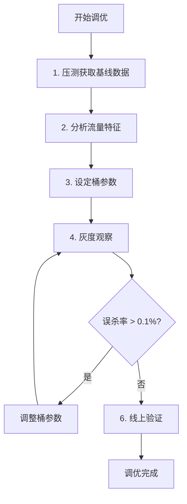

# 三令牌桶限流

## 为什么需要"三层"令牌桶

单一令牌桶存在一个根本性矛盾：**桶容量决定突发容忍度，令牌填充速率决定长期吞吐量**。在生产级API网关中，业务流量呈现多层次特征——毫秒级突发、秒级波动、分钟级趋势——单一粒度的令牌桶无法同时兼顾所有层级的流量控制。

三令牌桶限流通过叠加三个不同时间粒度的令牌桶来解决这个问题：

| 层级 | 粒度 | 核心职责 | 典型配置 |
|------|------|----------|----------|
| **突发桶** | 毫秒/秒级 | 允许合理的短时突发，保护系统免受瞬时尖峰冲击 | 桶容量=50，填充速率=50/s |
| **速率桶** | 秒/分钟级 | 控制持续请求速率，确保后端服务不被持续高流量压垮 | 桶容量=500，填充速率=100/s |
| **配额桶** | 小时/天级 | 管理全局配额，实现计费级别的流量管控 | 桶容量=10000，填充速率=278/s |

三个桶串联工作，请求必须**同时通过**三个桶的检查才能被放行。任一桶拒绝，请求即被限流。这种设计使得：

- 短时突发（如100个请求在50ms内到达）不会被误杀，因为突发桶有余量
- 持续高流量（如每秒200请求连续10分钟）会被速率桶拦住，防止后端过载
- 日级别配额用尽后立即拒绝，无需等到月底结算



## 令牌桶算法回顾

在深入三桶设计之前，快速回顾单令牌桶的核心机制：



令牌桶有两个关键参数：

- **桶容量（Capacity, C）**：桶中最多可存放的令牌数。决定突发容忍度——容量越大，允许的瞬时突发流量越大。
- **填充速率（Fill Rate, r）**：每秒向桶中添加的令牌数。决定稳态吞吐量——速率越高，长期允许通过的请求越多。

令牌桶的数学特性：在任意时间窗口 [t₁, t₂] 内，通过的请求总数不超过 `r × (t₂ - t₁) + C`。这意味着突发流量不会超过桶容量 C，而长期速率不会超过填充速率 r。

## 三桶设计详解

### 突发桶：处理瞬时流量尖峰

突发桶是第一道防线，负责处理毫秒到秒级的流量突发。它的特点是**桶容量相对较大、填充速率较低**，允许短时间的突发涌入，但不允许持续高流量。

**设计要点：**

1. **桶容量设置**：取决于业务可接受的最大突发量。例如，一个用户在100ms内发送了30个请求，如果业务允许这种操作（如批量查询），突发桶容量应 >= 30。
2. **填充速率设置**：等于允许的稳态突发速率。例如，你允许每秒50次请求通过突发层，则填充速率为50/s。
3. **响应头信息**：返回 `X-RateLimit-Burst-Remaining` 和 `X-RateLimit-Burst-Limit`，让客户端了解突发余量。

```python
import time
import threading
from dataclasses import dataclass, field
from typing import Optional


@dataclass
class TokenBucket:
    """单个令牌桶实现"""
    capacity: float          # 桶容量
    fill_rate: float         # 每秒填充的令牌数
    tokens: float = 0.0      # 当前令牌数
    last_fill_time: float = field(default_factory=time.monotonic)
    lock: threading.Lock = field(default_factory=threading.Lock)

    def __post_init__(self):
        self.tokens = self.capacity  # 初始时桶满

    def allow(self, tokens: int = 1) -> tuple[bool, dict]:
        """
        尝试从桶中取走指定数量的令牌。

        Returns:
            (allowed, info): allowed为是否放行，info包含限流状态信息
        """
        with self.lock:
            now = time.monotonic()
            # 先填充令牌
            elapsed = now - self.last_fill_time
            self.tokens = min(self.capacity, self.tokens + elapsed * self.fill_rate)
            self.last_fill_time = now

            info = {
                'remaining': int(self.tokens),
                'limit': int(self.capacity),
            }

            if self.tokens >= tokens:
                self.tokens -= tokens
                info['remaining'] = int(self.tokens)
                return True, info
            else:
                # 计算需要等待多久才有足够令牌
                deficit = tokens - self.tokens
                wait_seconds = deficit / self.fill_rate
                info['retry_after'] = round(wait_seconds, 2)
                return False, info


class SingleTokenBucketLimiter:
    """单层令牌桶限流器"""

    def __init__(self, capacity: int, fill_rate: float):
        self.bucket = TokenBucket(capacity=capacity, fill_rate=fill_rate)

    def allow(self, request_id: str = "") -> tuple[bool, dict]:
        allowed, info = self.bucket.allow()
        return allowed, {
            'X-RateLimit-Limit': info['limit'],
            'X-RateLimit-Remaining': info['remaining'],
            'Retry-After': info.get('retry_after'),
        }
```

### 速率桶：控制持续吞吐量

速率桶是第二道防线，控制秒到分钟级别的持续流量。它的特点是**桶容量适中、填充速率稳定**，确保后端服务的长期负载不超过设计值。

**设计要点：**

1. **桶容量设置**：通常为填充速率的5-10倍。例如，允许100 QPS的持续流量，桶容量设为500-1000，允许短时间的中等突发。
2. **填充速率设置**：等于后端服务的可持续最大吞吐量。这需要通过压测确定——不是网关的理论值，而是后端在不触发熔断、不丢请求的情况下能稳定处理的速率。
3. **与突发桶的配合**：速率桶的容量应 >= 突发桶的容量。因为突发桶已经过滤了最极端的瞬时尖峰，速率桶主要处理的是更长周期的流量趋势。

```python
class RateBucket:
    """
    速率桶：控制秒级到分钟级的持续流量。

    与突发桶的区别在于更平滑的令牌消耗策略：
    - 使用滑动窗口而非瞬时判断
    - 对超限请求返回精确的等待时间
    """

    def __init__(self, capacity: int, fill_rate: float):
        self.capacity = capacity
        self.fill_rate = fill_rate  # 令牌/秒
        self.tokens = float(capacity)
        self.last_update = time.monotonic()
        self.lock = threading.Lock()
        # 滑动窗口：记录最近N秒的请求时间戳
        self.request_history: list[float] = []
        self.window_seconds = 60  # 默认60秒滑动窗口

    def _refill(self):
        """根据时间差填充令牌"""
        now = time.monotonic()
        elapsed = now - self.last_update
        self.tokens = min(self.capacity, self.tokens + elapsed * self.fill_rate)
        self.last_update = now

        # 清理过期的请求记录
        cutoff = now - self.window_seconds
        self.request_history = [t for t in self.request_history if t > cutoff]

    def allow(self, tokens: int = 1) -> tuple[bool, dict]:
        with self.lock:
            self._refill()

            info = {
                'limit': self.capacity,
                'remaining': int(self.tokens),
                'window': self.window_seconds,
            }

            if self.tokens >= tokens:
                self.tokens -= tokens
                self.request_history.append(time.monotonic())
                info['remaining'] = int(self.tokens)
                info['current_rps'] = len(self.request_history) / min(
                    time.monotonic() - (self.request_history[0] if self.request_history else time.monotonic()),
                    self.window_seconds
                )
                return True, info
            else:
                # 计算令牌可用时间
                deficit = tokens - self.tokens
                wait_seconds = deficit / self.fill_rate
                info['retry_after'] = round(wait_seconds, 2)
                return False, info
```

### 配额桶：全局流量管控

配额桶是第三道防线，管理小时到天级别的全局配额。它的特点是**桶容量大、填充速率低**，实现类似于"每月10万次免费调用"这样的计费级限流。

**设计要点：**

1. **桶容量设置**：对应周期内的总配额。例如，每天允许100万次请求，则桶容量为1000000。
2. **填充速率设置**：`桶容量 / 周期秒数`。每天100万次 → 1000000 / 86400 ≈ 11.57 tokens/s。
3. **与付费体系对接**：不同等级的用户有不同的配额桶配置，桶参数从用户等级配置表中读取。

```python
class QuotaBucket:
    """
    配额桶：管理长周期（小时/天/月）的全局配额。

    典型场景：
    - 免费用户：每天1000次请求
    - 付费用户：每天100000次请求
    - 企业用户：每天10000000次请求
    """

    # 用户等级对应的桶配置
    TIER_CONFIGS = {
        'free':     {'capacity': 1000,    'period_hours': 24},
        'basic':    {'capacity': 10000,   'period_hours': 24},
        'pro':      {'capacity': 100000,  'period_hours': 24},
        'enterprise': {'capacity': 10000000, 'period_hours': 24},
    }

    def __init__(self, tier: str):
        config = self.TIER_CONFIGS.get(tier, self.TIER_CONFIGS['free'])
        self.capacity = config['capacity']
        period_seconds = config['period_hours'] * 3600
        self.fill_rate = self.capacity / period_seconds
        self.tokens = float(self.capacity)
        self.last_update = time.monotonic()
        self.lock = threading.Lock()

    def _refill(self):
        now = time.monotonic()
        elapsed = now - self.last_update
        self.tokens = min(self.capacity, self.tokens + elapsed * self.fill_rate)
        self.last_update = now

    def allow(self, tokens: int = 1) -> tuple[bool, dict]:
        with self.lock:
            self._refill()

            info = {
                'limit': self.capacity,
                'remaining': int(self.tokens),
                'period': 'daily',
            }

            if self.tokens >= tokens:
                self.tokens -= tokens
                info['remaining'] = int(self.tokens)
                return True, info
            else:
                # 配额耗尽，需要等到下一个周期
                # 但令牌桶会持续填充，所以实际等待时间是令牌恢复时间
                deficit = tokens - self.tokens
                wait_seconds = deficit / self.fill_rate
                info['retry_after'] = round(wait_seconds, 2)
                return False, info
```

## 三桶组合：完整限流器

将三个桶串联起来，形成完整的三令牌桶限流器。每个请求必须依次通过三个桶的检查：

```python
from typing import Optional
from dataclasses import dataclass


@dataclass
class RateLimitConfig:
    """三令牌桶限流配置"""
    # 突发桶配置
    burst_capacity: int = 50         # 最大突发量
    burst_fill_rate: float = 50.0    # 令牌填充速率/秒

    # 速率桶配置
    rate_capacity: int = 500         # 速率桶容量
    rate_fill_rate: float = 100.0    # 持续速率限制/秒

    # 配额桶配置
    quota_tier: str = 'free'         # 用户等级: free/basic/pro/enterprise


class TripleTokenBucketLimiter:
    """
    三令牌桶限流器：同时从三个维度控制流量。

    请求必须同时通过三个桶才能被放行：
    1. 突发桶 — 拦截瞬时流量尖峰
    2. 速率桶 — 控制持续吞吐量
    3. 配额桶 — 管理全局配额
    """

    def __init__(self, config: RateLimitConfig):
        self.burst_bucket = TokenBucket(
            capacity=config.burst_capacity,
            fill_rate=config.burst_fill_rate,
        )
        self.rate_bucket = RateBucket(
            capacity=config.rate_capacity,
            fill_rate=config.rate_fill_rate,
        )
        self.quota_bucket = QuotaBucket(tier=config.quota_tier)
        # 用户维度的限流器实例缓存
        self._user_limiters: dict[str, 'TripleTokenBucketLimiter'] = {}

    def allow(self, tokens: int = 1, user_id: str = "") -> tuple[bool, dict]:
        """
        检查请求是否被允许。

        Args:
            tokens: 本次请求消耗的令牌数（复杂操作可消耗多于1个）
            user_id: 用户ID，用于返回用户级别的状态信息

        Returns:
            (allowed, headers): allowed为是否放行，headers为HTTP响应头信息
        """
        headers = {}

        # 第一层：突发桶检查
        burst_ok, burst_info = self.burst_bucket.allow(tokens)
        headers['X-RateLimit-Burst-Limit'] = burst_info['limit']
        headers['X-RateLimit-Burst-Remaining'] = burst_info['remaining']
        if not burst_ok:
            headers['Retry-After'] = str(burst_info.get('retry_after', 1))
            headers['X-RateLimit-Reset-Reason'] = 'burst'
            return False, headers

        # 第二层：速率桶检查
        rate_ok, rate_info = self.rate_bucket.allow(tokens)
        headers['X-RateLimit-Limit'] = rate_info['limit']
        headers['X-RateLimit-Remaining'] = rate_info['remaining']
        if not rate_ok:
            headers['Retry-After'] = str(rate_info.get('retry_after', 30))
            headers['X-RateLimit-Reset-Reason'] = 'rate'
            return False, headers

        # 第三层：配额桶检查
        quota_ok, quota_info = self.quota_bucket.allow(tokens)
        headers['X-Quota-Limit'] = quota_info['limit']
        headers['X-Quota-Remaining'] = quota_info['remaining']
        if not quota_ok:
            headers['Retry-After'] = str(quota_info.get('retry_after', 3600))
            headers['X-RateLimit-Reset-Reason'] = 'quota'
            return False, headers

        return True, headers
```

## 分布式部署：Redis实现

单机令牌桶无法满足分布式API网关的需求。当多个网关节点共享流量时，需要使用Redis实现分布式令牌桶，确保全局一致的限流效果。

### Redis Lua脚本实现

Redis的原子性保证了令牌桶操作的线程安全。使用Lua脚本可以在单次网络往返中完成令牌的填充、判断和扣减：

```lua
-- triple_bucket.lua
-- 三令牌桶限流的Redis Lua脚本
-- KEYS: [burst_key, rate_key, quota_key]
-- ARGV: [burst_capacity, burst_fill_rate, rate_capacity, rate_fill_rate,
--        quota_capacity, quota_fill_rate, tokens, now]

local burst_key      = KEYS[1]
local rate_key       = KEYS[2]
local quota_key      = KEYS[3]

local burst_capacity  = tonumber(ARGV[1])
local burst_fill_rate = tonumber(ARGV[2])
local rate_capacity   = tonumber(ARGV[3])
local rate_fill_rate  = tonumber(ARGV[4])
local quota_capacity  = tonumber(ARGV[5])
local quota_fill_rate = tonumber(ARGV[6])
local tokens_needed   = tonumber(ARGV[7])
local now             = tonumber(ARGV[8])

-- 通用令牌桶逻辑
local function check_bucket(key, capacity, fill_rate)
    local data = redis.call('HMGET', key, 'tokens', 'last_fill')
    local current_tokens = tonumber(data[1])
    local last_fill = tonumber(data[2])

    if current_tokens == nil then
        current_tokens = capacity
        last_fill = now
    end

    -- 填充令牌
    local elapsed = math.max(0, now - last_fill)
    current_tokens = math.min(capacity, current_tokens + elapsed * fill_rate)

    if current_tokens >= tokens_needed then
        current_tokens = current_tokens - tokens_needed
        redis.call('HMSET', key, 'tokens', current_tokens, 'last_fill', now)
        redis.call('EXPIRE', key, math.ceil(capacity / fill_rate) * 2)
        return {1, math.floor(current_tokens), capacity}  -- allowed, remaining, limit
    else
        redis.call('HMSET', key, 'tokens', current_tokens, 'last_fill', now)
        redis.call('EXPIRE', key, math.ceil(capacity / fill_rate) * 2)
        local wait = (tokens_needed - current_tokens) / fill_rate
        return {0, math.floor(current_tokens), capacity, math.ceil(wait)}
    end
end

-- 依次检查三个桶
local burst_result = check_bucket(burst_key, burst_capacity, burst_fill_rate)
if burst_result[1] == 0 then
    return {0, 'burst', burst_result[3], burst_result[2], burst_result[4]}
end

local rate_result = check_bucket(rate_key, rate_capacity, rate_fill_rate)
if rate_result[1] == 0 then
    return {0, 'rate', rate_result[3], rate_result[2], rate_result[4]}
end

local quota_result = check_bucket(quota_key, quota_capacity, quota_fill_rate)
if quota_result[1] == 0 then
    return {0, 'quota', quota_result[3], quota_result[2], quota_result[4]}
end

return {1, 'ok', burst_result[3], burst_result[2]}
```

### Python Redis客户端封装

```python
import redis
import time
import hashlib
import os
from typing import Optional


class DistributedTripleBucketLimiter:
    """
    基于Redis的分布式三令牌桶限流器。

    使用Lua脚本保证原子性，支持多网关节点共享限流状态。
    """

    SCRIPT_PATH = os.path.join(os.path.dirname(__file__), 'triple_bucket.lua')

    def __init__(self, redis_client: redis.Redis, default_config: RateLimitConfig):
        self.redis = redis_client
        self.default_config = default_config
        # 预加载Lua脚本
        with open(self.SCRIPT_PATH, 'r') as f:
            self.script = self.redis.script_load(f.read())

    def _make_keys(self, identifier: str, config: RateLimitConfig) -> dict:
        """根据限流维度生成Redis key"""
        now_hour = int(time.time() // 3600)
        return {
            'burst': f"rl:burst:{identifier}",
            'rate': f"rl:rate:{identifier}",
            'quota': f"rl:quota:{identifier}:{now_hour}",
        }

    def allow(
        self,
        identifier: str,
        tokens: int = 1,
        config: Optional[RateLimitConfig] = None,
    ) -> tuple[bool, dict]:
        """
        检查请求是否被允许。

        Args:
            identifier: 限流维度标识（如 "user:12345" 或 "api_key:abc-def"）
            tokens: 消耗的令牌数
            config: 可选的自定义配置，覆盖默认配置

        Returns:
            (allowed, info): allowed为是否放行，info包含详细状态
        """
        cfg = config or self.default_config
        keys = self._make_keys(identifier, cfg)
        now = time.time()

        result = self.redis.evalsha(
            self.script,
            3,  # number of KEYS
            keys['burst'],
            keys['rate'],
            keys['quota'],
            # ARGV
            cfg.burst_capacity,    # burst_capacity
            cfg.burst_fill_rate,   # burst_fill_rate
            cfg.rate_capacity,     # rate_capacity
            cfg.rate_fill_rate,    # rate_fill_rate
            QuotaBucket.TIER_CONFIGS[cfg.quota_tier]['capacity'],  # quota_capacity
            (QuotaBucket.TIER_CONFIGS[cfg.quota_tier]['capacity']
             / (QuotaBucket.TIER_CONFIGS[cfg.quota_tier]['period_hours'] * 3600)),  # quota_fill_rate
            tokens,
            now,
        )

        allowed = result[0] == 1
        reset_reason = result[1] if not allowed else None
        limit = result[2] if len(result) > 2 else None
        remaining = result[3] if len(result) > 3 else None
        retry_after = result[4] if len(result) > 4 else None

        info = {
            'allowed': allowed,
            'limit': limit,
            'remaining': remaining,
            'reset_reason': reset_reason,
            'retry_after': retry_after,
        }
        return allowed, info
```

## Nginx/OpenResty实现

对于使用Nginx或OpenResty作为API网关的场景，可以通过Lua模块实现三令牌桶：

```lua
-- nginx_lua/triple_bucket.lua
local redis = require "resty.redis"
local cjson = require "cjson"

local _M = {}

-- Redis连接池配置
local REDIS_HOST = os.getenv("REDIS_HOST") or "127.0.0.1"
local REDIS_PORT = tonumber(os.getenv("REDIS_PORT") or 6379)
local POOL_SIZE = 100
local POOL_TIMEOUT = 1000  -- 毫秒

-- 默认限流配置
local DEFAULT_CONFIG = {
    burst_capacity  = 50,
    burst_fill_rate = 50,
    rate_capacity   = 500,
    rate_fill_rate  = 100,
    quota_capacity  = 10000,
    quota_fill_rate = 278,
}

function _M.check(identifier, config)
    config = config or DEFAULT_CONFIG
    local now = ngx.now(true)

    -- 获取Redis连接
    local red, err = redis:new()
    if not red then
        ngx.log(ngx.ERR, "redis new failed: ", err)
        return true  -- 降级：Redis不可用时放行
    end

    local ok, err = red:connect(REDIS_HOST, REDIS_PORT)
    if not ok then
        ngx.log(ngx.ERR, "redis connect failed: ", err)
        return true  -- 降级放行
    end

    -- 三个key
    local burst_key = "rl:burst:" .. identifier
    local rate_key  = "rl:rate:" .. identifier
    local quota_key = "rl:quota:" .. identifier .. ":" .. math.floor(now / 3600)

    -- 使用预加载的Lua脚本（生产环境用 redis.call EVALSHA）
    local result, err = red:eval([[
        local function check_bucket(key, capacity, fill_rate, now, tokens)
            local data = redis.call('HMGET', key, 'tokens', 'last_fill')
            local cur = tonumber(data[1]) or capacity
            local last = tonumber(data[2]) or now
            local elapsed = math.max(0, now - last)
            cur = math.min(capacity, cur + elapsed * fill_rate)
            if cur >= tokens then
                cur = cur - tokens
                redis.call('HMSET', key, 'tokens', cur, 'last_fill', now)
                redis.call('EXPIRE', key, math.ceil(capacity / fill_rate) * 2)
                return {1, math.floor(cur), capacity}
            else
                redis.call('HMSET', key, 'tokens', cur, 'last_fill', now)
                redis.call('EXPIRE', key, math.ceil(capacity / fill_rate) * 2)
                return {0, math.floor(cur), capacity, math.ceil((tokens - cur) / fill_rate)}
            end
        end
        local burst = check_bucket(KEYS[1], ARGV[1], ARGV[2], ARGV[7], ARGV[8])
        if burst[1] == 0 then return {0, 'burst', burst[3], burst[2], burst[4]} end
        local rate = check_bucket(KEYS[2], ARGV[3], ARGV[4], ARGV[7], ARGV[8])
        if rate[1] == 0 then return {0, 'rate', rate[3], rate[2], rate[4]} end
        local quota = check_bucket(KEYS[3], ARGV[5], ARGV[6], ARGV[7], ARGV[8])
        if quota[1] == 0 then return {0, 'quota', quota[3], quota[2], quota[4]} end
        return {1, 'ok', burst[3], burst[2]}
    ]], 3, burst_key, rate_key, quota_key,
        config.burst_capacity, config.burst_fill_rate,
        config.rate_capacity, config.rate_fill_rate,
        config.quota_capacity, config.quota_fill_rate,
        now, 1)

    -- 归还连接到连接池
    red:set_keepalive(POOL_TIMEOUT, POOL_SIZE)

    if not result then
        ngx.log(ngx.ERR, "evalsha failed: ", err)
        return true  -- 降级放行
    end

    if result[1] == 0 then
        local reason = result[2]
        local limit = result[3]
        local remaining = result[4]
        local retry_after = result[5] or 1

        ngx.header["X-RateLimit-Limit"] = limit
        ngx.header["X-RateLimit-Remaining"] = remaining
        ngx.header["Retry-After"] = math.ceil(retry_after)
        ngx.header["X-RateLimit-Reset-Reason"] = reason
        ngx.status = 429
        ngx.say(cjson.encode({
            error = "Too Many Requests",
            message = string.format("Rate limit exceeded (%s tier)", reason),
            retry_after = retry_after,
        }))
        ngx.exit(429)
        return false
    end

    -- 放行，设置响应头
    ngx.header["X-RateLimit-Burst-Remaining"] = result[3]
    return true
end

return _M
```

Nginx配置示例：

```nginx
# nginx.conf 三令牌桶限流配置
lua_package_path "/etc/nginx/lua/?.lua;;";

server {
    listen 443 ssl http2;
    server_name api.example.com;

    # 所有API请求经过三令牌桶检查
    location /api/ {
        access_by_lua_block {
            local triple_bucket = require "triple_bucket"

            -- 提取限流维度标识
            -- 可以按用户ID、API Key、IP等维度限流
            local user_id = ngx.var.http_x_user_id or ngx.var.remote_addr
            local identifier = "user:" .. user_id

            -- 自定义限流配置（可选）
            local config = nil  -- 使用默认配置
            if ngx.var.http_x_api_tier == "enterprise" then
                config = {
                    burst_capacity  = 500,
                    burst_fill_rate = 500,
                    rate_capacity   = 5000,
                    rate_fill_rate  = 1000,
                    quota_capacity  = 10000000,
                    quota_fill_rate = 1157,
                }
            end

            triple_bucket.check(identifier, config)
        }

        proxy_pass http://upstream_backend;
        proxy_set_header Host $host;
        proxy_set_header X-Real-IP $remote_addr;
    }
}
```

## 限流后的响应设计

良好的限流响应不仅告诉客户端"被限流了"，还应该告诉它"什么时候可以重试"、"为什么被限流"。这直接影响用户体验和客户端重试策略的效率。

### 标准HTTP响应头

| 响应头 | 含义 | 示例 |
|--------|------|------|
| `X-RateLimit-Limit` | 当前桶的容量上限 | `500` |
| `X-RateLimit-Remaining` | 当前桶的剩余令牌数 | `127` |
| `X-RateLimit-Reset-Reason` | 被限流的具体桶层 | `burst` / `rate` / `quota` |
| `Retry-After` | 建议的重试等待秒数 | `3` |
| `X-Quota-Limit` | 配额桶的总配额 | `10000` |
| `X-Quota-Remaining` | 配额桶的剩余量 | `2341` |

### JSON响应体

```json
{
    "error": {
        "code": 429,
        "type": "rate_limit_exceeded",
        "message": "请求过于频繁，请稍后重试",
        "details": {
            "limit_type": "rate",
            "retry_after": 3,
            "current_rps": 152,
            "allowed_rps": 100,
            "quota_remaining": 8765
        },
        "documentation_url": "https://docs.example.com/rate-limits"
    }
}
```

### 客户端重试策略

客户端收到429响应后的正确重试策略：

```python
import time
import random


def make_request_with_retry(client, url, max_retries=3):
    """
    带限流感知的请求重试。

    重试策略：
    1. 优先使用服务器返回的 Retry-After 头
    2. 使用指数退避 + 随机抖动（jitter）
    3. 识别配额耗尽（quota）时提前终止，避免无效重试
    """
    for attempt in range(max_retries + 1):
        response = client.get(url)

        if response.status_code != 429:
            return response

        reset_reason = response.headers.get('X-RateLimit-Reset-Reason', '')

        # 配额耗尽：不重试，直接返回
        if reset_reason == 'quota':
            return response

        # 解析重试等待时间
        retry_after = int(response.headers.get('Retry-After', 0))
        if retry_after <= 0:
            # 指数退避 + 随机抖动
            base_wait = 2 ** attempt
            jitter = random.uniform(0, base_wait * 0.5)
            retry_after = base_wait + jitter

        time.sleep(retry_after)

    # 重试次数耗尽，返回最后一次响应
    return response
```

## 三桶参数调优

三令牌桶的效果取决于参数的合理配置。错误的参数不仅无法有效限流，还可能误杀正常请求或放过异常流量。

### 参数调优方法论



### 参数计算公式

| 参数 | 计算公式 | 说明 |
|------|----------|------|
| 突发桶容量 | `正常请求峰值 × 安全系数(1.2~1.5)` | 安全系数留出20%~50%的余量 |
| 突发桶填充速率 | `正常请求平均QPS × 0.8` | 略低于平均QPS，避免突发桶太松 |
| 速率桶容量 | `突发桶容量 × 5~10` | 允许中等持续突发 |
| 速率桶填充速率 | `后端可持续最大QPS × 0.9` | 保留10%的余量给后端自身处理能力 |
| 配额桶容量 | `业务合同约定的月/日配额` | 直接来自业务需求 |
| 配额桶填充速率 | `桶容量 / 周期秒数` | 均匀分配到整个周期 |

### 典型场景参数参考

| 业务场景 | 突发桶 | 速率桶 | 配额桶 |
|----------|--------|--------|--------|
| 用户登录接口 | 容量=10 速率=2/s | 容量=50 速率=5/s | 容量=100/天 速率=0.0012/s |
| 商品搜索接口 | 容量=100 速率=100/s | 容量=2000 速率=500/s | 容量=100000/天 速率=1.16/s |
| 文件上传接口 | 容量=5 速率=1/s | 容量=20 速率=2/s | 容量=1000/天 速率=0.012/s |
| 开放API（第三方） | 容量=20 速率=10/s | 容量=200 速率=50/s | 容量=50000/天 速率=0.58/s |
| 内部微服务调用 | 容量=500 速率=1000/s | 容量=10000 速率=5000/s | 不限 |

## 监控与告警

三令牌桶限流器需要完善的监控体系，以便及时发现限流配置不当或异常流量。

### 关键监控指标

```python
import time
from dataclasses import dataclass, field
from typing import Optional


@dataclass
class RateLimitMetrics:
    """三令牌桶限流器的监控指标"""
    # 限流计数
    total_requests: int = 0
    allowed_requests: int = 0
    rejected_burst: int = 0
    rejected_rate: int = 0
    rejected_quota: int = 0

    # 延迟记录
    check_latencies: list = field(default_factory=list)

    # 时间窗口统计
    window_start: float = field(default_factory=time.time)
    window_seconds: int = 60

    def record(self, allowed: bool, reset_reason: Optional[str], check_latency_ms: float):
        """记录一次限流检查的结果"""
        self.total_requests += 1
        if allowed:
            self.allowed_requests += 1
        elif reset_reason == 'burst':
            self.rejected_burst += 1
        elif reset_reason == 'rate':
            self.rejected_rate += 1
        elif reset_reason == 'quota':
            self.rejected_quota += 1

        self.check_latencies.append(check_latency_ms)

    def get_stats(self) -> dict:
        """获取当前窗口的统计数据"""
        now = time.time()
        elapsed = now - self.window_start

        if elapsed < self.window_seconds:
            return {}  # 窗口未满，暂不输出

        reject_rate = (
            (self.rejected_burst + self.rejected_rate + self.rejected_quota)
            / max(self.total_requests, 1) * 100
        )
        avg_latency = (
            sum(self.check_latencies[-1000:]) / len(self.check_latencies[-1000:])
            if self.check_latencies else 0
        )

        stats = {
            'total_requests': self.total_requests,
            'allowed_requests': self.allowed_requests,
            'reject_rate_percent': round(reject_rate, 2),
            'reject_by_burst': self.rejected_burst,
            'reject_by_rate': self.rejected_rate,
            'reject_by_quota': self.rejected_quota,
            'avg_check_latency_ms': round(avg_latency, 3),
            'requests_per_second': round(self.total_requests / elapsed, 1),
        }

        # 重置窗口
        self.window_start = now
        self.total_requests = 0
        self.allowed_requests = 0
        self.rejected_burst = 0
        self.rejected_rate = 0
        self.rejected_quota = 0
        self.check_latencies.clear()

        return stats
```

### Prometheus指标暴露

```python
from prometheus_client import Counter, Histogram, Gauge

# 限流请求计数（按桶层分类）
rate_limit_rejected_total = Counter(
    'api_gateway_rate_limit_rejected_total',
    'Total rejected requests by limiter tier',
    ['tier', 'service', 'identifier_type']
)

# 限流通过请求计数
rate_limit_allowed_total = Counter(
    'api_gateway_rate_limit_allowed_total',
    'Total allowed requests',
    ['service']
)

# 限流检查延迟
rate_limit_check_duration = Histogram(
    'api_gateway_rate_limit_check_duration_seconds',
    'Time spent on rate limit check',
    ['tier'],
    buckets=[0.0001, 0.0005, 0.001, 0.005, 0.01, 0.05, 0.1]
)

# 各桶剩余令牌数
rate_limit_tokens_remaining = Gauge(
    'api_gateway_rate_limit_tokens_remaining',
    'Current remaining tokens in bucket',
    ['tier', 'identifier']
)
```

### 告警规则

| 告警条件 | 严重级别 | 含义 |
|----------|----------|------|
| burst层拒绝率 > 30% | Warning | 突发桶配置可能过紧，或遭遇流量尖峰 |
| rate层拒绝率 > 50% | Critical | 后端可能承受不了当前流量，需检查 |
| quota层拒绝率 > 10% | Warning | 大量用户配额耗尽，考虑是否需要扩容 |
| 限流检查延迟 P99 > 5ms | Critical | Redis可能出现性能瓶颈 |
| 全局拒绝率 < 0.01% | Info | 限流配置可能过于宽松，未起到保护作用 |

## 常见误区与陷阱

### 误区一：三个桶的参数设置相同

```python
# ❌ 错误：三个桶完全相同的配置
config = RateLimitConfig(
    burst_capacity=500,   burst_fill_rate=500,
    rate_capacity=500,    rate_fill_rate=500,   # 与突发桶相同，失去意义
    quota_tier='free',
)

# ✅ 正确：三个桶各司其职
config = RateLimitConfig(
    burst_capacity=50,    burst_fill_rate=50,     # 短时突发
    rate_capacity=500,    rate_fill_rate=100,      # 持续速率
    quota_tier='free',                             # 全局配额
)
```

### 误区二：忽视降级策略

当Redis不可用时，如果直接拒绝所有请求，会导致服务完全不可用。正确的做法是降级到本地令牌桶：

```python
class ResilientTripleBucketLimiter:
    """
    带降级能力的三令牌桶限流器。

    降级策略：
    - Redis可用：使用分布式限流（全局精确）
    - Redis不可用：降级到本地限流（精度降低但不阻断服务）
    """

    def __init__(self, redis_client, config: RateLimitConfig):
        self.distributed_limiter = DistributedTripleBucketLimiter(redis_client, config)
        self.local_limiter = TripleTokenBucketLimiter(config)
        self.redis_healthy = True
        self.health_check_interval = 5  # 秒
        self.last_health_check = 0

    def _check_redis_health(self) -> bool:
        now = time.time()
        if now - self.last_health_check < self.health_check_interval:
            return self.redis_healthy

        try:
            self.distributed_limiter.redis.ping()
            self.redis_healthy = True
        except Exception:
            self.redis_healthy = False

        self.last_health_check = now
        return self.redis_healthy

    def allow(self, identifier: str, tokens: int = 1) -> tuple[bool, dict]:
        if self._check_redis_health():
            try:
                return self.distributed_limiter.allow(identifier, tokens)
            except Exception:
                self.redis_healthy = False

        # 降级到本地限流
        return self.local_limiter.allow(tokens, identifier)
```

### 误区三：只看通过率不看响应延迟

限流器本身也有性能开销。如果Redis往返延迟过高（> 1ms），每个请求多增加1ms的延迟在高并发下会显著影响吞吐量。需要持续监控限流检查本身的延迟。

### 误区四：配额桶的周期对齐问题

```python
# ❌ 错误：使用本地时间做周期标识，时区切换会导致配额错乱
quota_key = f"rl:quota:{user_id}:{int(time.time() // 86400)}"

# ✅ 正确：使用UTC时间做周期标识
import calendar
now_utc = calendar.timegm(time.gmtime())
quota_key = f"rl:quota:{user_id}:{now_utc // 86400}"
```

### 误区五：没有考虑令牌预扣与回滚

在复杂场景下，一个请求可能在限流检查通过后、实际处理前失败。此时令牌已被扣减但请求并未生效。对于高价值操作（如扣款、库存扣减），需要在请求处理失败时回滚令牌：

```python
class TransactionalTripleBucketLimiter:
    """
    支持事务性令牌回滚的限流器。

    用于请求处理可能失败的场景，确保限流计数的准确性。
    """

    def __init__(self, limiter: TripleTokenBucketLimiter):
        self.limiter = limiter
        self._pending_returns: dict[str, int] = {}

    def begin_request(self, identifier: str, tokens: int = 1) -> tuple[bool, str]:
        """请求开始时预扣令牌，返回事务ID"""
        allowed, headers = self.limiter.allow(tokens, identifier)
        if not allowed:
            return False, ""

        txn_id = f"txn_{id(identifier)}_{time.time_ns()}"
        self._pending_returns[txn_id] = tokens
        return True, txn_id

    def commit_request(self, txn_id: str):
        """请求处理成功，确认令牌消耗"""
        self._pending_returns.pop(txn_id, None)

    def rollback_request(self, txn_id: str):
        """请求处理失败，回滚令牌"""
        tokens = self._pending_returns.pop(txn_id, None)
        if tokens:
            # 将令牌还回突发桶（最可能需要的层级）
            with self.limiter.burst_bucket.lock:
                self.limiter.burst_bucket.tokens = min(
                    self.limiter.burst_bucket.capacity,
                    self.limiter.burst_bucket.tokens + tokens,
                )
```

## 与Kong/APISIX的集成

在生产环境中，三令牌桶通常不是从零实现，而是基于开源API网关的限流插件进行扩展配置。

### Kong插件配置

Kong的 `rate-limiting` 插件原生支持多维度限流，可以通过组合多个插件实例实现三层效果：

```yaml
# Kong服务级三令牌桶配置
# 通过三个 rate-limiting 插件叠加实现

# 第一层：突发桶（1秒窗口）
plugins:
  - name: rate-limiting
    config:
      minute: null
      second: 50           # 每秒50个请求
      policy: redis
      redis_host: redis-cluster.internal
      redis_port: 6379
      fault_tolerant: true
      hide_client_headers: false
      error_code: 429
      error_message: "Burst limit exceeded"
    run_on: first

  # 第二层：速率桶（1分钟窗口）
  - name: rate-limiting
    config:
      minute: 6000          # 每分钟6000个请求（100 QPS持续）
      second: null
      policy: redis
      redis_host: redis-cluster.internal
      redis_port: 6379
      fault_tolerant: true
      error_code: 429
      error_message: "Rate limit exceeded"

  # 第三层：配额桶（1天窗口，按用户维度）
  - name: rate-limiting
    config:
      day: 100000           # 每天10万个请求（用户级）
      minute: null
      second: null
      policy: redis
      redis_host: redis-cluster.internal
      redis_port: 6379
      fault_tolerant: true
      limit_by: consumer     # 按消费者（用户）维度
      error_code: 429
      error_message: "Daily quota exceeded"
```

### APISIX插件配置

APISIX的 `limit-req` 和 `limit-count` 插件可以更灵活地组合：

```yaml
# APISIX三令牌桶路由配置
routes:
  - uri: /api/v1/*
    plugins:
      # 第一层：漏桶控制突发（APISIX用漏桶近似突发桶）
      limit-req:
        rate: 50
        burst: 50           # 允许突发50个
        rejected_code: 429
        key_type: var
        key: remote_addr

      # 第二层：计数器控制分钟级速率
      limit-count:
        count: 6000
        time_window: 60
        rejected_code: 429
        key_type: var
        key: consumer_name  # 按消费者限流

      # 第三层：按天配额
      limit-count:
        count: 100000
        time_window: 86400
        rejected_code: 429
        key_type: var
        key: consumer_name
```

## 本节小结

三令牌桶限流是API网关中最实用的多层级流量控制方案，其核心思想是：

1. **分而治之**：将流量控制分解为突发、速率、配额三个维度，每个维度独立配置、互不干扰
2. **层层递进**：请求必须同时通过三个桶才能放行，任一桶拒绝即被限流
3. **分布式优先**：生产环境必须基于Redis等共享存储实现多节点一致的限流效果
4. **降级保底**：Redis不可用时自动降级到本地限流，确保服务可用性
5. **可观测**：完善的监控指标和告警规则是限流策略持续优化的基础

三令牌桶不是银弹——它的效果完全取决于参数调优的质量。在实际落地时，应通过压测获取流量基线数据，结合业务特征设定合理的桶参数，然后在灰度环境中持续观察和微调，最终找到既能保护后端、又不误杀正常请求的平衡点。
