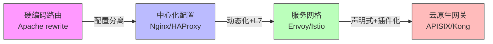
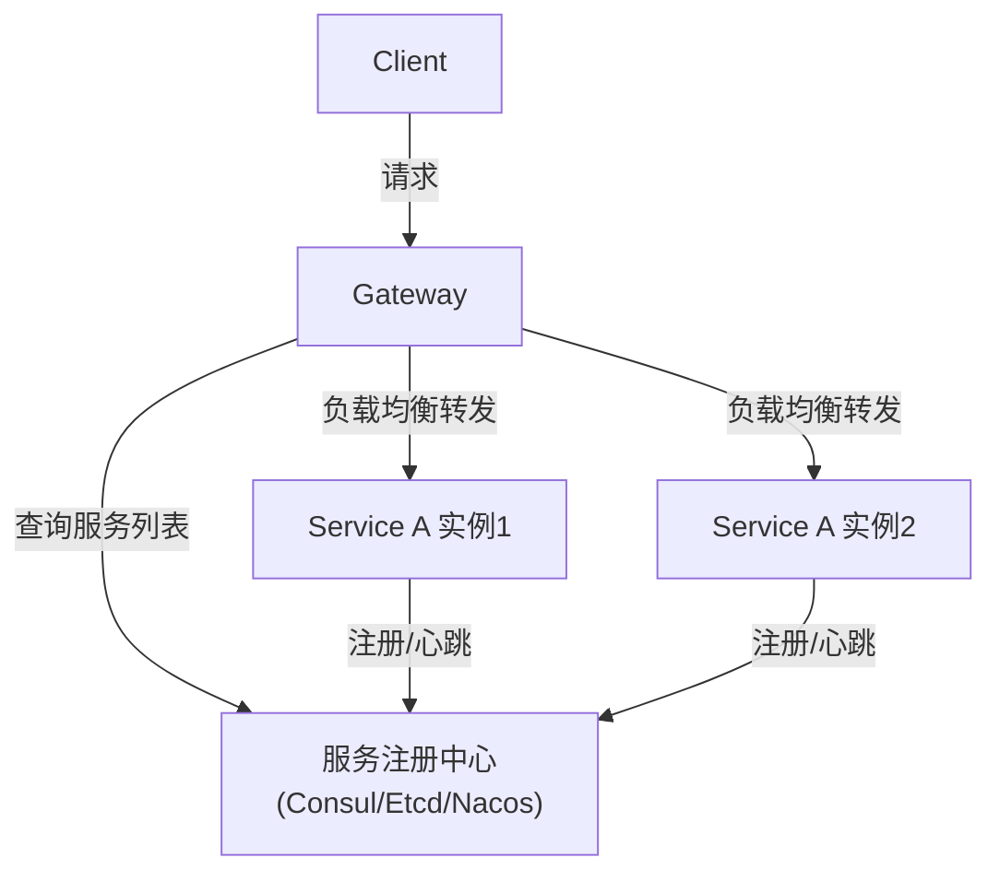

## 路由机制

### 1. 概述与背景

路由机制是API网关最基础、最核心的能力——它决定了一个进来的HTTP请求应该被转发到哪个后端服务。在微服务架构中，客户端不直接访问各个微服务，而是统一通过API网关入口，由网关根据预定义的路由规则将请求分发到正确的服务实例。这种间接层（Indirection Layer）是整个API网关架构的基石。

**为什么路由机制如此关键？**

从架构角度看，路由机制承担了三重职责：

- **请求分发**：将外部请求精确映射到内部服务，屏蔽微服务拓扑的复杂性
- **流量编排**：实现灰度发布、A/B测试、流量镜像等高级流量管理能力
- **安全边界**：作为唯一的外部入口，路由规则本身构成了第一道访问控制防线

**路由机制的历史演进**

| 阶段 | 时期 | 代表方案 | 特点 |
|------|------|----------|------|
| 硬编码阶段 | 2000年代初 | Apache mod_rewrite | 规则写在配置文件中，修改需重启服务 |
| 配置中心化 | 2010年左右 | Nginx upstream、HAProxy | 配置与代码分离，支持热加载 |
| 服务网格 | 2017年后 | Envoy/Istio | 路由规则声明式定义，动态下发，支持L7全特性 |
| 云原生网关 | 2020年后 | APISIX、Kong Gateway | 声明式+可编程，插件化扩展，多维度路由 |



### 2. 路由匹配原理

路由匹配是网关收到请求后执行的第一个核心操作。网关从路由表中查找与当前请求特征匹配的规则，匹配成功则按规则执行转发；匹配失败则返回404或执行默认路由。

#### 2.1 路由匹配维度

一个完整的HTTP请求包含多个可匹配维度，现代API网关通常支持以下匹配条件：

| 匹配维度 | 示例 | 说明 |
|----------|------|------|
| HTTP方法 | GET、POST、PUT、DELETE、PATCH | 最基础的匹配维度 |
| 路径（Path） | `/api/v1/users` | 支持精确匹配、前缀匹配、正则匹配 |
| 请求头（Header） | `X-Api-Version: 2` | 用于版本控制、租户隔离 |
| 查询参数 | `?format=json` | 区分同一路径的不同响应格式 |
| 请求体字段 | JSON路径如 `$.type == "order"` | 高级匹配，需要解析请求体 |
| 来源IP/网段 | `10.0.0.0/8` | 内网流量与外网流量的差异化路由 |
| JWT声明（Claims） | `role == "admin"` | 基于身份信息的路由决策 |
| Cookie | `session_type=beta` | 灰度用户识别 |
| gRPC方法 | `/user.UserService/GetUser` | gRPC特有的方法级路由 |

#### 2.2 匹配策略

网关在执行路由匹配时，需要确定两件事：**匹配算法**和**优先级规则**。

**路由表的组织方式**主要有两种：

1. **线性遍历**：逐条检查路由规则，第一个匹配的生效。实现简单，但路由数量多时性能线性下降。适合路由规则不超过几千条的场景。
2. **基数树（Radix Tree）**：将路径构建为前缀树结构，查找时间从O(n)降为O(k)，k为路径深度。APISIX的路由匹配就采用了这种结构。

**优先级规则**（当多条规则同时匹配时）：

精确匹配 > 正则匹配 > 前缀匹配
更多约束条件 > 更少约束条件
更早定义的规则（先到先得） > 更晚定义的规则

以下是一个多维度匹配的实例：

```yaml
# 路由规则示例（APISIX格式）
routes:
  - id: user-api-v2
    uri: /api/v2/users/*
    methods: ["GET", "POST"]
    headers:
      X-Api-Version: "2"
    upstream:
      service: user-service-v2

  - id: user-api-v1
    uri: /api/v1/users/*
    methods: ["GET", "POST"]
    upstream:
      service: user-service-v1

  - id: fallback
    uri: /*
    upstream:
      service: default-service
```

对于请求 `GET /api/v2/users/123`，Header包含 `X-Api-Version: 2`，它会匹配 `user-api-v2`（精确匹配路径+v2版本头）；而 `GET /api/v1/users/456` 无版本头则匹配 `user-api-v1`。

#### 2.3 路径匹配模式详解

路径匹配是路由中最常用的维度，各模式的语义和适用场景差异很大：

| 匹配模式 | 语法示例 | 匹配范围 | 典型用途 |
|----------|----------|----------|----------|
| 精确匹配 | `/api/users` | 仅匹配该路径 | 单一API端点 |
| 前缀匹配 | `/api/v1/*` | 以该前缀开头的所有路径 | 整个API版本的流量 |
| 正则匹配 | `/user/(\d+)/profile` | 提取路径参数 | RESTful资源路由 |
| 通配符匹配 | `/static/**` | 任意深度的子路径 | 静态资源服务 |
| 路径参数 | `/user/{id}/order/{orderId}` | 支持类型约束 | 语义化REST路由 |

**路径重写**是路由匹配的附属能力。网关在匹配成功后，通常需要对路径进行改写再转发给后端：

```nginx
# Nginx路径重写示例
location ~ ^/api/v1/(.*)$ {
    proxy_pass http://backend/$1;          # 剥离 /api/v1 前缀
    proxy_set_header X-Original-URI $request_uri;
}

location ~ ^/legacy/users/(.*)$ {
    rewrite ^/legacy/users/(.*)$ /api/v2/users/$1 break;  # 新旧路径映射
    proxy_pass http://user-service;
}
```

常见的路径重写场景：
- **剥离网关前缀**：客户端调用 `/gateway/orders`，网关改写为 `/orders` 转发给订单服务
- **版本迁移**：将 `/legacy/v1/xxx` 透明映射到 `/api/v3/xxx`
- **路径扁平化**：将 `/a/b/c/resource` 映射为 `/resource`，简化后端路由

### 3. 负载均衡策略

路由匹配确定了目标服务后，负载均衡负责从该服务的多个实例中选择一个来处理请求。负载均衡策略直接影响系统的性能、可靠性和资源利用率。

#### 3.1 常见负载均衡算法

| 算法 | 原理 | 优点 | 缺点 | 适用场景 |
|------|------|------|------|----------|
| 轮询（Round Robin） | 依次分发到每个实例 | 实现简单，均匀分配 | 不考虑实例负载差异 | 实例性能同构 |
| 加权轮询 | 按权重比例分配 | 兼顾异构实例 | 权重需手动配置 | 新旧实例混部 |
| 随机（Random） | 随机选择一个实例 | 无需状态，分布均匀 | 可能产生碰撞 | 无状态服务 |
| 最少连接（Least Connections） | 选择当前连接数最少的实例 | 自适应负载 | 需维护连接计数 | 长连接/WebSocket场景 |
| IP哈希 | 根据客户端IP哈希选择实例 | 同客户端路由到同实例（会话粘滞） | 节点变更时分布不均 | 需要会话保持的场景 |
| 最短响应时间 | 选择平均响应时间最短的实例 | 性能最优导向 | 统计可能滞后 | 对延迟敏感的API |
| 一致性哈希 | 根据请求的某个键做一致性哈希 | 缓存友好，节点变动影响小 | 需合理选择哈希键 | 带缓存的服务 |

#### 3.2 健康检查

负载均衡的前提是网关清楚哪些后端实例是健康的。健康检查分为两种模式：

**主动健康检查（Active Health Check）**：网关定期向后端实例发送探测请求（如 `GET /health`），根据响应状态判断实例是否健康。

```yaml
# 主动健康检查配置示例（APISIX）
upstream:
  type: roundrobin
  nodes:
    "10.0.0.1:8080": 5
    "10.0.0.2:8080": 5
    "10.0.0.3:8080": 3
  checks:
    active:
      http_path: /health
      healthy:
        interval: 3        # 每3秒探测一次
        successes: 2       # 连续2次成功=健康
      unhealthy:
        interval: 1        # 不健康时每1秒探测
        http_failures: 3   # 连续3次失败=不健康
        timeouts: 2        # 2次超时=不健康
```

**被动健康检查（Passive Health Check）**：网关不主动探测，而是根据实际流量中的失败情况判断。当某个实例在指定时间窗口内的错误率超过阈值时，自动将其摘除。被动检查的缺点是在低流量场景下可能无法及时发现故障实例。

生产环境中，最佳实践是**主被动结合**：被动检查快速摘除故障节点，主动检查负责恢复检测。

### 4. 高级路由能力

#### 4.1 灰度发布（Canary Release）

通过路由机制实现灰度发布，是API网关最实用的高级能力之一。核心思路是：将一小部分流量导向新版本服务，验证无误后再逐步扩大比例。

```yaml
# 基于权重的灰度路由（APISIX）
# 90%流量到v1，10%流量到v2
routes:
  - id: order-api
    uri: /api/orders/*
    plugins:
      traffic-split:
        rules:
          - weighted_upstreams:
              - upstream_id: order-v1
                weight: 90
              - upstream_id: order-v2
                weight: 10
```

灰度发布的路由策略可以按不同维度实施：

| 维度 | 实现方式 | 示例 |
|------|----------|------|
| 按比例 | 权重分配 | 5%流量到新版本 |
| 按用户 | Header/Cookie匹配 | 内部员工优先体验 |
| 按地域 | 来源IP地理库 | 先在某个区域灰度 |
| 按租户 | 租户ID路由 | VIP客户优先验证 |

#### 4.2 流量镜像（Traffic Mirroring）

流量镜像也叫影子流量，将生产流量的副本发送到新版本服务，但新版本的响应不返回给客户端。这可以在不影响用户体验的情况下，用真实流量验证新版本的行为。

```nginx
# Nginx流量镜像配置
server {
    location /api/orders {
        mirror /mirror;                     # 镜像到/mirror
        mirror_request_body on;             # 镜像请求体
        proxy_pass http://order-service-v1;
    }
    location /mirror {
        internal;                           # 仅内部访问
        proxy_pass http://order-service-v2$request_uri;
    }
}
```

#### 4.3 金丝雀发布与蓝绿部署

| 概念 | 路由行为 | 回滚速度 |
|------|----------|----------|
| 蓝绿部署 | 路由瞬间从旧版本切换到新版本 | 秒级（切回旧路由） |
| 金丝雀发布 | 路由渐进式调整（10%→50%→100%） | 秒级（将权重归零） |
| A/B测试 | 按用户特征分流到不同版本 | 秒级（移除分流规则） |

#### 4.4 基于请求内容的路由

有些场景需要根据请求体内容做路由决策，这比基于路径/Header的路由复杂得多，因为网关需要解析请求体：

```python
# 基于请求体字段的路由逻辑（伪代码）
def route_by_body(request):
    content_type = request.headers.get('Content-Type')
    
    if content_type == 'application/json':
        body = json.loads(request.body)
        
        # 根据订单类型路由到不同的处理服务
        order_type = body.get('order_type')
        if order_type == 'express':
            return 'express-order-service'
        elif order_type == 'standard':
            return 'standard-order-service'
        elif order_type == 'international':
            return 'international-order-service'
    
    # 默认路由
    return 'default-order-service'
```

这类路由需要注意：网关在解析请求体后需要将原始body重新传递给后端，否则后端收到的会是空body。同时，请求体路由会对网关的CPU和内存产生额外开销，在高吞吐场景下需要谨慎使用。

### 5. 服务发现与路由联动

在微服务架构中，服务实例的IP地址和端口是动态变化的（容器调度、弹性伸缩等），路由规则不能硬编码后端地址，需要与服务发现系统联动。

#### 5.1 服务发现模式

| 模式 | 工作原理 | 代表方案 |
|------|----------|----------|
| 客户端发现 | 客户端查询注册中心，自行选择实例 | Eureka + Ribbon |
| 服务端发现 | 网关查询注册中心，代理转发 | Nginx + Consul、Envoy + EDS |
| DNS发现 | 通过DNS解析获取实例列表 | Kubernetes Service、CoreDNS |



#### 5.2 动态路由更新

当后端服务实例发生变更时，网关需要及时更新路由表。主要的推送机制有：

1. **轮询拉取**：网关定期从注册中心拉取最新服务列表。延迟由轮询间隔决定，适合变更不频繁的场景。
2. **长轮询（Long Polling）**：网关发起长连接请求，注册中心有变更时立即响应。延迟低，实现简单。Nacos采用此方案。
3. **推送订阅（Push）**：注册中心主动推送变更到网关。延迟最低，但需要维护长连接。Consul的Watch、etcd的Watch都是此模式。
4. **xDS协议**：Envoy定义的标准化动态配置协议，包括LDS（监听器）、RDS（路由）、CDS（集群）、EDS（端点）四种资源类型，支持全动态更新，是服务网格的标准方案。

### 6. 路由配置的管理与治理

#### 6.1 声明式 vs 编程式路由

| 方式 | 说明 | 优点 | 缺点 |
|------|------|------|------|
| 声明式（YAML/JSON） | 在配置文件中定义路由规则 | 版本化、可审计、易于理解 | 无法表达复杂条件逻辑 |
| 编程式（代码） | 在插件/中间件中编写路由逻辑 | 灵活、可动态生成规则 | 调试困难、难以全局审计 |
| 声明式+编程式 | 声明式为主，插件处理复杂场景 | 兼顾灵活性和可维护性 | 需要约定边界 |

生产环境中推荐采用**声明式为主、编程式补充**的方式。简单路由用配置文件管理，复杂路由逻辑（如根据请求内容动态决策）放到插件中实现。

#### 6.2 路由配置的版本管理

路由配置应当纳入版本控制（Git），与代码变更一起经历Code Review和CI/CD流程：

路由配置变更流程：
1. 开发者提交路由配置变更到Git仓库
2. CI自动校验配置语法和依赖关系
3. Code Review审批
4. CD系统自动灰度下发到网关集群
5. 监控验证无异常后全量生效

#### 6.3 路由的可观测性

路由是网关最核心的环节，必须配备完善的监控和日志：

**关键监控指标**：
- 路由命中率：各条路由规则被匹配的次数和比例
- 路由匹配耗时：从收到请求到确定路由规则的时间（通常应 < 1ms）
- 404率：未匹配到任何路由的请求比例，异常升高可能表示配置遗漏
- 各上游服务的QPS分布：确认流量是否按预期分配

```python
# 路由命中监控的Prometheus指标示例
from prometheus_client import Counter, Histogram

# 路由命中计数
route_hits = Counter(
    'gateway_route_hits_total',
    'Total route matches',
    ['route_id', 'method', 'status']
)

# 路由匹配耗时
route_match_duration = Histogram(
    'gateway_route_match_duration_seconds',
    'Route matching latency',
    buckets=[0.0001, 0.0005, 0.001, 0.005, 0.01]
)
```

### 7. 主流网关的路由实现对比

| 特性 | Kong (Nginx/OctoStream) | APISIX (Nginx/OpenResty) | Envoy (C++) | Nginx (原生) |
|------|-------------------------|--------------------------|-------------|-------------|
| 路由匹配 | 前缀、正则、精确 | RadixTree，支持全维度 | 路由表+正则 | location匹配 |
| 动态路由 | 需reload或Admin API | 完全动态，毫秒级生效 | xDS动态下发 | 需reload |
| 匹配维度 | 方法、路径、Header、Host | 方法、路径、Header、参数、Claims、Cookie、请求体 | 几乎所有HTTP属性 | 方法、路径、Header |
| 路由数量性能 | 万级路由时需优化 | 百万级路由仍高效（RadixTree） | 万级路由高效 | 数千级最佳 |
| 插件扩展 | Lua插件 | Lua+WASM+多语言 | WASM+Lua+原生C++ | 原生模块 |
| 路由更新延迟 | 毫秒级（Admin API） | 毫秒级（etcd Watch） | 毫秒级（xDS） | 秒级（reload） |

### 8. 常见误区与最佳实践

#### 8.1 常见误区

**误区一：路由规则越多越好**
过多的路由规则会增加维护成本和匹配延迟。应该按业务域分组，合并可以合并的规则，用变量和模板减少重复。

**误区二：忽略默认路由**
没有配置默认路由（fallback）时，未匹配的请求直接返回404，容易导致排查困难。建议始终配置一条兜底路由，并记录日志便于发现配置遗漏。

**误区三：路由和鉴权分离导致的安全漏洞**
路由匹配成功但尚未执行鉴权时，如果直接将请求转发给后端，可能绕过安全检查。正确做法是路由、鉴权、限流等中间件按严格顺序串行执行。

**误区四：路径重写不留痕迹**
路径重写后，后端服务看到的路径与客户端发送的不一致，排查问题时容易混淆。建议通过自定义Header保留原始路径：

```nginx
# 重写时保留原始路径信息
location /api/v1/users {
    rewrite ^/api/v1/users(.*)$ /users$1 break;
    proxy_set_header X-Original-URI /api/v1/users$request_uri;
    proxy_pass http://user-service;
}
```

**误区五：硬编码后端地址**
直接在路由配置中写死后端IP:Port，一旦实例变更就需要修改配置。必须通过服务发现动态获取后端实例列表。

#### 8.2 最佳实践

1. **路由命名规范**：采用 `{业务域}-{功能}-{版本}` 格式（如 `order-payment-v2`），便于在监控面板中快速定位。

2. **渐进式匹配**：先配置宽松的前缀匹配做整体流量管理，再配置精确匹配处理特殊逻辑，形成分层路由结构。

3. **路由与上游分离**：路由规则只负责匹配和转发决策，负载均衡配置放在上游（Upstream）对象中，两者解耦便于独立管理。

4. **生产灰度流程标准化**：建立标准的灰度发布路由配置模板，包括权重分配、回滚条件、监控告警阈值，避免每次发布都重新设计。

5. **定期审计路由表**：移除不再使用的废弃路由（可能指向已下线的服务），避免路由表膨胀和安全风险。

### 9. 总结

路由机制是API网关的核心中的核心。理解路由需要掌握三个层面：

- **基础层**：路径匹配、方法过滤、Header匹配——这是每个API网关必须支持的基本能力
- **进阶层**：负载均衡策略、健康检查、服务发现联动——决定了路由的可靠性和性能
- **高级层**：灰度发布、流量镜像、基于内容的路由——这些能力让路由从简单的转发变成了流量编排的利器

在实际选型和设计中，需要根据团队规模、技术栈、性能要求和运维能力综合考虑。不是功能最多的网关就最适合，而是**匹配你当前和未来2-3年需求**的方案才是最优选择。
