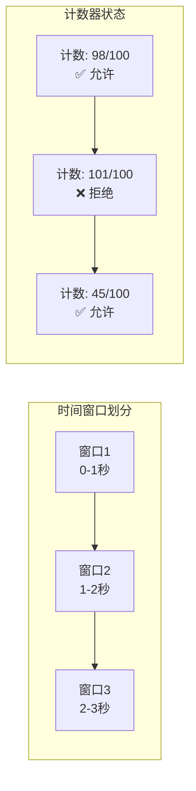
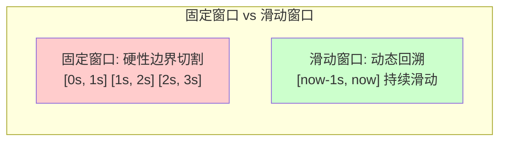
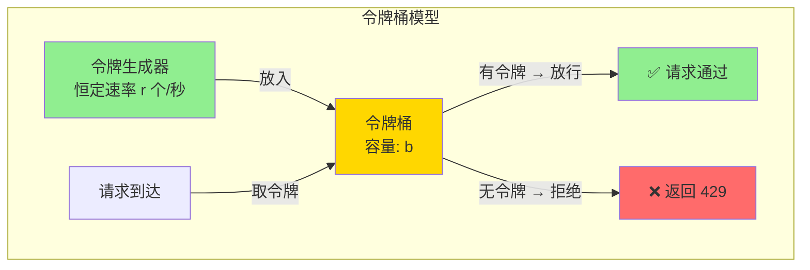
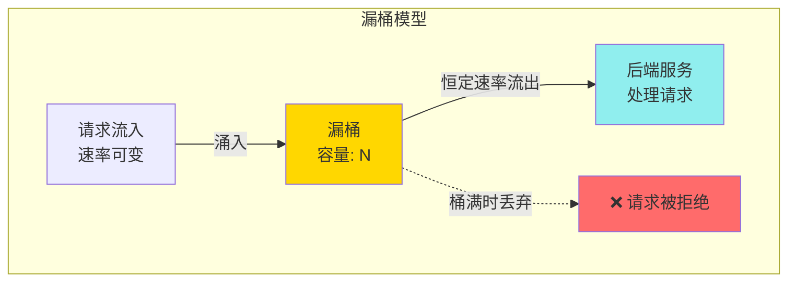
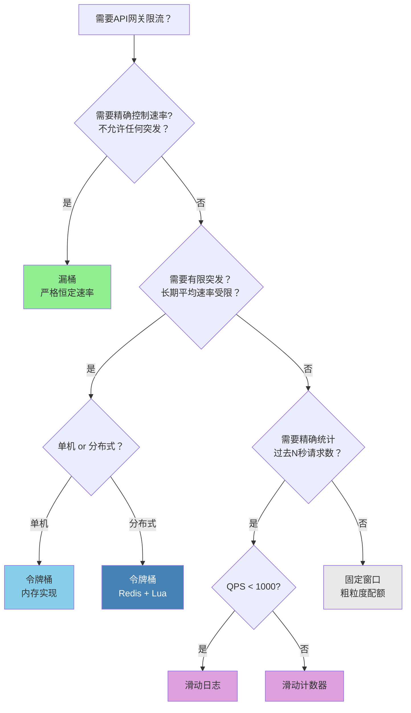

# API网关限流策略

API网关作为微服务架构的统一入口，是抵御流量洪峰的第一道防线。限流（Rate Limiting）是网关最核心的流量治理能力之一——它通过控制单位时间内允许通过的请求数量，防止后端服务因过载而崩溃，保障系统的整体稳定性和可用性。

限流的本质是**在有限资源下做出取舍**：当请求量超出系统承载能力时，网关必须决定哪些请求可以通过、哪些应该被拒绝。一个设计精良的限流策略，既要保证正常用户的体验，又要在流量尖峰时保护后端服务不被打垮。

**五种核心限流算法速览：**

| 算法 | 核心思想 | 精度 | 允许突发 | 推荐场景 |
|------|----------|------|----------|----------|
| 固定窗口 | 按固定时间段计数 | 低 | 是（无限制） | 粗粒度配额 |
| 滑动日志 | 记录每个请求时间戳 | 100% | 否 | 低QPS精确限流 |
| 滑动计数器 | 子窗口加权近似 | ~95%+ | 否 | 高QPS通用限流 |
| 令牌桶 | 恒定速率填充令牌 | 高 | 是（有限） | 大多数API网关 |
| 漏桶 | 恒定速率漏出请求 | 高 | 否 | 严格恒定速率 |

---

## 一、为什么需要限流

### 1.1 流量失控的真实危害

在生产环境中，失去限流保护的系统面临的威胁远比想象中严重：

- **级联故障**：单个服务过载后，响应时间急剧上升，导致上游服务线程阻塞，故障沿调用链逐级传播，最终引发全系统雪崩
- **资源耗尽**：无限制的并发请求会迅速耗尽数据库连接池、内存、CPU等关键资源，即使是健康的请求也无法正常处理
- **数据不一致**：在高并发写入场景下，数据库可能因连接耗尽而中断事务，导致数据丢失或状态不一致
- **恶意攻击**：DDoS、CC攻击等恶意流量如果未被网关拦截，会直接冲击后端服务，造成业务中断
- **成本失控**：在云原生架构中，无限制的流量直接转化为计算资源的消耗，可能在数分钟内产生巨额账单

**真实案例：2024年某电商平台大促事故**

某电商平台在618大促期间，由于搜索接口未设置独立限流（仅依赖全局QPS限制），黄牛脚本以每秒3000次的频率调用搜索接口。全局限流阈值为5000 QPS，搜索接口占用了3000 QPS后，其他正常接口只剩2000 QPS的配额。搜索接口的后端Elasticsearch集群因查询压力过大，P99延迟从50ms飙升到8秒，导致整个商品页面加载超时。最终损失预估超过500万元GMV。

**教训**：全局限流是最后的防线，但**按接口维度的差异化限流**才是保护业务的关键。

### 1.2 限流在API网关中的位置

在请求处理链路中，限流通常位于认证之后、路由转发之前：

客户端请求 → TLS终止 → 路由匹配 → 认证验证 → 【限流检查】→ 熔断检查 → 负载均衡 → 后端服务

将限流放在认证之后，是因为限流需要基于已认证的身份信息（如用户ID、API Key）进行精细化控制。如果放在认证之前，只能按IP限流，无法区分不同用户的配额。

但在某些安全场景下，**认证前也需要一层粗粒度限流**：在TLS终止之后、认证验证之前，按IP做基础的连接速率限制（如每秒50次），用于拦截明显的DDoS攻击流量，避免认证服务本身被打垮。这就是多级限流的典型应用。

### 1.3 限流与其他流量治理手段的区别

| 手段 | 目标 | 作用时机 | 典型实现 |
|------|------|----------|----------|
| 限流(Rate Limiting) | 控制请求速率，防止过载 | 请求到达时 | 令牌桶、滑动窗口 |
| 熔断(Circuit Breaking) | 快速失败，避免等待故障服务 | 后端服务异常时 | 断路器模式 |
| 降级(Degradation) | 返回降级结果，保障核心功能 | 系统资源紧张时 | 返回缓存数据/默认值 |
| 排队(Queuing) | 延迟处理，平滑流量 | 请求到达时 | 消息队列、等待队列 |
| 背压(Backpressure) | 上游感知下游承受能力 | 下游过载时 | 反应式流、TCP窗口 |

限流和熔断经常被混淆。简单区分：限流是**预防性措施**——不管后端是否健康，都按固定规则控制流量；熔断是**响应性措施**——只在检测到后端故障时才触发。两者互补而非替代。

一个典型的服务保护链路：**限流（入口守门）→ 熔断（故障隔离）→ 降级（降级兜底）→ 排队（削峰填谷）**。限流拦截过量请求，熔断快速释放对故障服务的等待，降级保证核心功能可用，排队将瞬时尖峰平滑化。

---

## 二、固定窗口限流（Fixed Window）

### 2.1 基本原理

固定窗口是最简单的限流算法。它将时间轴划分为等长的固定时间段（如每秒、每分钟），在每个窗口内维护一个计数器。每收到一个请求，计数器加一；当计数器超过阈值时，后续请求被拒绝。



固定窗口的窗口划分通常以自然时间对齐（如Unix时间戳整除窗口大小），这保证了多个实例无需协调就能使用相同的窗口边界。

### 2.2 实现代码

```python
import time
import threading

class FixedWindowLimiter:
    """固定窗口限流器"""
    
    def __init__(self, max_requests: int, window_seconds: int):
        """
        Args:
            max_requests: 每个窗口允许的最大请求数
            window_seconds: 窗口长度（秒）
        """
        self.max_requests = max_requests
        self.window_seconds = window_seconds
        self.counters = {}  # {window_key: count}
        self.lock = threading.Lock()
    
    def _get_window_key(self) -> int:
        """计算当前窗口的标识"""
        return int(time.time() // self.window_seconds)
    
    def allow(self) -> bool:
        """判断是否允许当前请求通过"""
        with self.lock:
            window_key = self._get_window_key()
            
            # 检查是否进入新窗口
            if window_key not in self.counters:
                # 清理过期窗口，只保留当前窗口
                self.counters = {window_key: 0}
            
            # 检查是否超限
            if self.counters[window_key] >= self.max_requests:
                return False
            
            self.counters[window_key] += 1
            return True
    
    def current_count(self) -> int:
        """获取当前窗口的请求计数"""
        with self.lock:
            window_key = self._get_window_key()
            return self.counters.get(window_key, 0)
```

### 2.3 优缺点分析

**优点：**
- 实现极其简单，只需一个计数器和一个时间戳
- 内存占用极小，每个限流键只需存储一个整数和一个时间戳
- 判断逻辑是O(1)复杂度，对性能几乎无影响
- 无需额外依赖（不需要Redis、不需要复杂数据结构）

**缺点——临界突刺问题：**

固定窗口最大的缺陷是**临界突刺（Boundary Burst）**。假设限制为每秒100个请求，用户在第1秒的最后100ms发了100个请求，然后在第2秒的最前100ms又发了100个请求。虽然每个窗口内的计数都未超限，但在相邻窗口交界处的200ms内实际通过了200个请求——瞬时流量达到了限制的2倍。

第1秒(窗口A):   |████████████████████░░|  100个请求(最后100ms集中涌入)
第2秒(窗口B):   |░░████████████████████|  100个请求(最前100ms集中涌入)
                    ↑
            200ms内通过200个请求 → 瞬时QPS翻倍！

**极端情况下的倍率分析**：如果窗口长度为T，请求集中在窗口末尾的ε时间内，理论最大瞬时QPS可以达到阈值的T/ε倍。例如窗口为60秒，请求集中在最后1秒内，瞬时QPS可达平均阈值的60倍。这在实际生产中可能触发后端服务的瞬时过载，是固定窗口不被推荐用于高精度限流场景的根本原因。

### 2.4 适用场景

- 对精度要求不高的粗粒度限流（如每天10000次调用的API配额）
- 内存和性能极其敏感的嵌入式网关
- 作为多级限流中最外层的粗筛
- 原型验证阶段的快速实现

---

## 三、滑动窗口限流（Sliding Window）

### 3.1 基本原理

滑动窗口是对固定窗口的改进。它的核心思想是：**不按固定时间点切割窗口，而是以当前时刻为基准，向前回溯一个固定长度的时间段作为统计窗口**。这样就消除了固定窗口的边界问题。



当时间从第1.3秒滑动到第1.5秒时：
- 固定窗口仍使用第1秒的计数器
- 滑动窗口的统计区间从[0.3s, 1.3s]变为[0.5s, 1.5s]，实时反映最近1秒的流量

### 3.2 滑动日志实现

最精确的滑动窗口实现是记录每个请求的精确时间戳，称为**滑动日志（Sliding Log）**：

```python
import time
import threading
from collections import deque

class SlidingWindowLogLimiter:
    """滑动日志限流器 - 精确但内存消耗大"""
    
    def __init__(self, max_requests: int, window_seconds: int):
        self.max_requests = max_requests
        self.window_seconds = window_seconds
        self.logs = deque()  # 存储每个请求的时间戳
        self.lock = threading.Lock()
    
    def allow(self) -> bool:
        """判断是否允许当前请求"""
        now = time.time()
        window_start = now - self.window_seconds
        
        with self.lock:
            # 清理过期的日志记录
            while self.logs and self.logs[0] <= window_start:
                self.logs.popleft()
            
            # 检查是否超限
            if len(self.logs) >= self.max_requests:
                return False
            
            # 记录当前请求
            self.logs.append(now)
            return True
    
    def get_retry_after(self) -> float:
        """获取需要等待的秒数（用于返回 429 响应的 Retry-After 头）"""
        if not self.logs:
            return 0
        oldest = self.logs[0]
        wait = oldest + self.window_seconds - time.time()
        return max(0, wait)
```

**滑动日志的精度最高**，能完美解决临界突刺问题。但缺点是内存消耗与限流阈值成正比——如果每秒允许10000个请求，就需要存储10000个时间戳。在高QPS场景下，内存占用不可忽视。以10000 QPS、60秒窗口为例，单个限流键需要存储60万个float64时间戳，约占4.8MB内存。如果有1万个不同的限流键，仅限流日志就需要约48GB内存——这在实际系统中完全不可行。

### 3.3 滑动计数器实现

为了平衡精度和内存，实践中更常用**滑动计数器（Sliding Counter）**方案：它将窗口拆分为多个子窗口，通过对相邻两个窗口的加权计算来近似滑动窗口的统计值。

```python
import time
import threading
import math

class SlidingWindowCounterLimiter:
    """滑动计数器限流器 - 精度与内存的最佳平衡"""
    
    def __init__(self, max_requests: int, window_seconds: int, sub_windows: int = 10):
        """
        Args:
            max_requests: 窗口内最大请求数
            window_seconds: 窗口长度（秒）
            sub_windows: 子窗口数量，越多越精确
        """
        self.max_requests = max_requests
        self.window_seconds = window_seconds
        self.sub_windows = sub_windows
        self.sub_window_size = window_seconds / sub_windows
        
        # 每个子窗口的计数器
        self.counters = {}  # {sub_window_key: count}
        self.lock = threading.Lock()
    
    def _get_sub_window_key(self, timestamp: float = None) -> int:
        """获取指定时间所属的子窗口标识"""
        ts = timestamp or time.time()
        return int(ts // self.sub_window_size)
    
    def allow(self) -> bool:
        """判断是否允许当前请求"""
        now = time.time()
        current_key = self._get_sub_window_key(now)
        
        with self.lock:
            # 清理过期的子窗口
            cutoff = current_key - self.sub_windows
            self.counters = {
                k: v for k, v in self.counters.items() if k > cutoff
            }
            
            # 计算当前窗口的加权请求数
            total = self._calculate_weighted_count(now, current_key)
            
            if total >= self.max_requests:
                return False
            
            self.counters[current_key] = self.counters.get(current_key, 0) + 1
            return True
    
    def _calculate_weighted_count(self, now: float, current_key: int) -> float:
        """通过加权计算近似滑动窗口内的请求总数"""
        total = 0.0
        
        # 当前子窗口内已过去的时间比例
        current_sub_start = current_key * self.sub_window_size
        elapsed_in_current = now - current_sub_start
        current_weight = elapsed_in_current / self.sub_window_size
        total += self.counters.get(current_key, 0) * current_weight
        
        # 完整的过往子窗口
        for key, count in self.counters.items():
            if key < current_key and key > current_key - self.sub_windows:
                total += count
        
        return total
```

**加权计算的核心思想**：假设当前处于某个子窗口的30%位置，那么该子窗口的请求按30%的比例折算。例如当前子窗口已有30个请求，折算后贡献9个。加上前面完整子窗口的所有请求，就得到了近似的滑动窗口请求数。

**精度与子窗口数量的关系**：子窗口数量越多，精度越高，但内存和计算开销也越大。经验数据如下：

| 子窗口数 | 最大误差 | 适用场景 |
|----------|----------|----------|
| 5 | ~20% | 极高QPS（>10万），精度不是核心诉求 |
| 10 | ~10% | 通用高QPS场景（推荐默认值） |
| 30 | ~3% | 中等QPS，需要较高精度 |
| 60 | ~1% | 低QPS（<1000），接近滑动日志精度 |

**极端行为分析**：滑动计数器在子窗口边界处可能出现"先拒绝后立即允许"的振荡。例如当前子窗口刚过1%（权重0.01），已有100个请求，折算为1个；但下一个请求到来时，已过到2%（权重0.02），100个折算为2个——这种微小振荡在实际场景中影响可以忽略。

### 3.4 滑动窗口方案对比

| 维度 | 滑动日志 | 滑动计数器 |
|------|----------|------------|
| 精度 | 100%精确 | 近似（子窗口越多越精确） |
| 内存 | O(N)，N为限流阈值 | O(M)，M为子窗口数（通常10-60） |
| 时间复杂度 | O(1)均摊 | O(M)最坏（遍历子窗口） |
| 实现复杂度 | 简单 | 中等 |
| 适用场景 | 低QPS精确限流 | 高QPS通用限流 |

### 3.5 滑动窗口的优缺点

**优点：**
- 彻底解决固定窗口的临界突刺问题
- 流量控制更平滑，后端服务不会遭遇突发冲击
- 滑动计数器方案在精度和性能间取得了良好平衡

**缺点：**
- 实现复杂度高于固定窗口
- 滑动日志在高QPS场景下内存消耗大
- 需要维护时间窗口的滑动状态，增加了系统开销
- 滑动计数器的精度取决于子窗口数量的配置，需要根据场景调优

---

## 四、令牌桶限流（Token Bucket）

### 4.1 基本原理

令牌桶是目前最广泛使用的限流算法，被AWS、Google Cloud、Nginx（变体）等主流平台采用。它的核心思想是：**以固定速率向桶中放入令牌，每个请求需要从桶中取走一个令牌才能通过**。桶有容量上限，满则不再放令牌。



关键参数：
- **填充速率（Rate）**：每秒放入桶中的令牌数量，决定长期平均吞吐量
- **桶容量（Burst/Bucket Size）**：桶能容纳的最大令牌数，决定允许的突发流量上限

### 4.2 为什么令牌桶允许突发

理解令牌桶的关键在于理解"桶"的蓄水效应。假设填充速率为10个/秒，桶容量为50：

- 系统空闲时，桶中会逐渐积累令牌，最多50个
- 当突然涌入50个请求时，桶中有足够的令牌一次性放行
- 突发过后，桶需要50秒才能重新蓄满（50个令牌 ÷ 10个/秒）

这意味着令牌桶天然支持**有限突发（Bounded Burst）**——既允许短时间的流量尖峰，又通过桶容量限制了突发的上限。这与现实世界的很多限流需求高度吻合：用户可以偶尔短时间爆发使用，但不能持续高频调用。

**桶容量的设定原则**：

桶容量通常设为填充速率的1-10倍。具体取决于业务场景：
- **即时响应型API**（如登录、支付）：桶容量 = 填充速率 × 1~2，限制突发
- **批量操作型API**（如导出、同步）：桶容量 = 填充速率 × 5~10，允许合理的批量突发
- **搜索/推荐类API**：桶容量 = 填充速率 × 2~5，平衡响应性和后端压力

### 4.3 实现代码

```python
import time
import threading

class TokenBucketLimiter:
    """令牌桶限流器"""
    
    def __init__(self, rate: float, capacity: int):
        """
        Args:
            rate: 令牌填充速率（个/秒）
            capacity: 桶的最大容量
        """
        self.rate = rate
        self.capacity = capacity
        self.tokens = capacity  # 初始满桶
        self.last_refill = time.monotonic()
        self.lock = threading.Lock()
    
    def _refill(self):
        """根据时间流逝补充令牌"""
        now = time.monotonic()
        elapsed = now - self.last_refill
        
        # 按速率计算应补充的令牌数
        tokens_to_add = elapsed * self.rate
        
        if tokens_to_add > 0:
            # 补充令牌，但不超过桶容量
            self.tokens = min(self.capacity, self.tokens + tokens_to_add)
            self.last_refill = now
    
    def allow(self, tokens: int = 1) -> bool:
        """
        尝试获取令牌
        Args:
            tokens: 本次请求需要的令牌数（支持批量扣减）
        """
        with self.lock:
            self._refill()
            
            if self.tokens >= tokens:
                self.tokens -= tokens
                return True
            return False
    
    def wait_and_consume(self, tokens: int = 1, timeout: float = 5.0) -> bool:
        """等待直到获取到令牌或超时"""
        deadline = time.monotonic() + timeout
        
        while time.monotonic() < deadline:
            if self.allow(tokens):
                return True
            # 计算需要等待的时间
            wait_time = (tokens - self.tokens) / self.rate
            time.sleep(min(wait_time, 0.1))  # 最多睡100ms
        
        return False
```

**注意 `time.monotonic()` 的使用**：生产代码中必须使用单调时钟（`time.monotonic()`）而非墙钟（`time.time()`）。墙钟可能因NTP校时、闰秒等原因发生跳变——如果系统时钟突然向前跳1秒，令牌桶会瞬间补充大量令牌，等同于限流失效。

### 4.4 分布式令牌桶

在多实例部署的API网关中，每个实例都有独立的令牌桶会导致限流不精确——N个实例各自持有100个令牌，实际总容量变成N×100。解决方案是使用Redis实现中心化的令牌桶。

```python
import redis
import time
import uuid

class DistributedTokenBucket:
    """基于Redis的分布式令牌桶"""
    
    # Lua脚本保证原子性
    LUA_SCRIPT = """
    local key = KEYS[1]
    local rate = tonumber(ARGV[1])          -- 填充速率
    local capacity = tonumber(ARGV[2])      -- 桶容量
    local requested = tonumber(ARGV[3])     -- 请求的令牌数
    local now = tonumber(ARGV[4])           -- 当前时间戳(秒,浮点)
    
    -- 获取桶的当前状态
    local bucket = redis.call('HMGET', key, 'tokens', 'last_refill')
    local tokens = tonumber(bucket[1]) or capacity
    local last_refill = tonumber(bucket[2]) or now
    
    -- 计算应补充的令牌
    local elapsed = math.max(0, now - last_refill)
    tokens = math.min(capacity, tokens + elapsed * rate)
    
    -- 判断是否允许
    local allowed = 0
    if tokens >= requested then
        tokens = tokens - requested
        allowed = 1
    end
    
    -- 更新桶状态
    redis.call('HMSET', key, 'tokens', tokens, 'last_refill', now)
    redis.call('EXPIRE', key, math.ceil(capacity / rate) * 2)
    
    return {allowed, tokens}
    """
    
    def __init__(self, redis_client, key: str, rate: float, capacity: int):
        self.redis = redis_client
        self.key = f"ratelimit:{key}"
        self.rate = rate
        self.capacity = capacity
        self.script = self.redis.register_script(self.LUA_SCRIPT)
    
    def allow(self, tokens: int = 1) -> dict:
        """判断是否允许请求，返回 {allowed: bool, remaining: float}"""
        now = time.time()
        result = self.script(
            keys=[self.key],
            args=[self.rate, self.capacity, tokens, now]
        )
        return {
            'allowed': bool(result[0]),
            'remaining': float(result[1])
        }
```

**为什么用Lua脚本？** Redis的`HMGET`和`HMSET`不是原子操作。如果不使用Lua脚本，在高并发下可能出现"先读后写"的竞态条件：两个并发请求同时读到tokens=1，都认为有令牌可扣，导致超发。Lua脚本在Redis单线程中原子执行，从根本上避免了这个问题。

**Redis故障降级策略**：分布式令牌桶对Redis有强依赖，Redis不可用时需要有明确的降级策略：

| 策略 | 行为 | 风险 |
|------|------|------|
| 安全模式（fail-closed） | Redis不可用时拒绝所有请求 | 误伤正常流量 |
| 宽松模式（fail-open） | Redis不可用时放行所有请求 | 失去限流保护 |
| 本地降级 | 切换到本地令牌桶，限制总QPS为单实例阈值 | 总QPS = 单实例阈值 × 实例数 |

**推荐：本地降级**。在Redis不可用时，每个网关实例切换到本地令牌桶，将速率设为 `全局阈值 / 实例数`。虽然总QPS可能略超（实例间不同步），但至少保证了基本的保护能力。Kong的`rate-limiting`插件的`fault_tolerant: true`选项就是这种策略。

### 4.5 令牌桶的优缺点

**优点：**
- 天然支持有限突发，符合大多数业务场景
- 长期平均速率严格等于填充速率
- 参数直观：速率和桶容量直接对应业务含义
- 分布式实现成熟，Redis + Lua脚本是标准方案

**缺点：**
- 突发容量的设定需要经验，设太大会让后端承压，设太小会误伤正常用户
- 在Redis方案中，每次请求都需要一次Redis网络往返，可能成为性能瓶颈
- 不适合需要精确统计"过去N秒内请求总数"的场景
- 多实例场景下，如果使用本地令牌桶，各实例间不同步导致总量偏高

---

## 五、漏桶限流（Leaky Bucket）

### 5.1 基本原理

漏桶算法的核心思想是**流量整形（Traffic Shaping）**：不管流入的请求速率如何波动，经过漏桶后都会以恒定速率流出。漏桶就像一个底部有小孔的水桶——水（请求）流入的速度可以变化，但流出的速度始终恒定。



### 5.2 实现代码

```python
import time
import threading
import collections

class LeakyBucketLimiter:
    """漏桶限流器"""
    
    def __init__(self, rate: float, capacity: int):
        """
        Args:
            rate: 漏出速率（每秒处理的请求数）
            capacity: 桶的最大容量（可排队的请求数）
        """
        self.rate = rate
        self.capacity = capacity
        self.water = 0.0  # 当前桶中的水量
        self.last_leak = time.monotonic()
        self.lock = threading.Lock()
    
    def _leak(self):
        """让水漏出"""
        now = time.monotonic()
        elapsed = now - self.last_leak
        
        # 按速率漏水
        leaked = elapsed * self.rate
        self.water = max(0, self.water - leaked)
        self.last_leak = now
    
    def allow(self) -> bool:
        """判断是否允许请求进入桶"""
        with self.lock:
            self._leak()
            
            if self.water < self.capacity:
                self.water += 1
                return True
            
            return False  # 桶满，拒绝
    
    def enqueue(self, request) -> bool:
        """将请求放入队列等待处理"""
        with self.lock:
            self._leak()
            
            if self.water < self.capacity:
                self.water += 1
                # 实际实现中这里会将request放入异步队列
                return True
            
            return False
```

### 5.3 漏桶与令牌桶的本质区别

虽然漏桶和令牌桶看起来类似，但它们控制流量的方式有根本区别：

| 对比维度 | 漏桶 | 令牌桶 |
|----------|------|--------|
| 控制目标 | 平滑输出速率 | 控制输入速率 |
| 突发处理 | 不允许突发（恒定流出） | 允许有限突发（桶中有存量令牌） |
| 适用场景 | 需要严格恒定速率的场景 | 允许短时间突发的场景 |
| 流量整形 | 强制整形为恒定流 | 允许一定程度的不均匀 |
| 类比 | 水龙头恒定滴水 | 银行取款（有日限额和单笔限额） |

在API网关中，**令牌桶通常比漏桶更实用**。因为大多数业务场景都允许一定的突发——用户偶尔的批量操作不应该被强制排队延迟。漏桶更适合底层网络设备（如交换机、路由器）的流量整形场景。

---

## 六、算法全面对比与选型

### 6.1 全面对比

| 维度 | 固定窗口 | 滑动日志 | 滑动计数器 | 令牌桶 | 漏桶 |
|------|----------|----------|------------|--------|------|
| 精度 | 低（临界突刺） | 100%精确 | 近似（95%+） | 高 | 高 |
| 内存 | O(1) | O(N) | O(M) | O(1) | O(1) |
| 允许突发 | 是（无限制） | 取决于实现 | 取决于实现 | 是（有限） | 否 |
| 实现复杂度 | ★☆☆ | ★☆☆ | ★★☆ | ★★☆ | ★★☆ |
| 分布式实现 | 简单 | 复杂 | 中等 | 成熟(Redis) | 成熟 |
| 代表应用 | 简单内部限流 | 低QPS精确场景 | Nginx(变体) | AWS/GCP/Kong | 网络设备 |

### 6.2 选型决策树



---

## 七、分布式限流实战

### 7.1 为什么需要分布式限流

在微服务架构中，API网关通常部署多个实例以实现高可用和水平扩展。如果每个实例独立限流，会出现以下问题：

限流阈值: 1000 QPS
网关实例数: 5

每个实例独立限流时:
实例1: 1000 QPS (独立计数)
实例2: 1000 QPS (独立计数)
实例3: 1000 QPS (独立计数)
实例4: 1000 QPS (独立计数)
实例5: 1000 QPS (独立计数)
──────────────────────
实际通过: 5000 QPS ← 远超预期的1000！

### 7.2 基于Redis的中心化限流

使用Redis作为中心化的状态存储是最常见的分布式限流方案。核心要点是利用Redis的原子操作或Lua脚本来保证并发安全。

```python
import redis
import time

class RedisRateLimiter:
    """基于Redis的分布式滑动窗口限流器"""
    
    # Lua脚本：原子性地执行滑动窗口检查
    LUA_SLIDING_WINDOW = """
    local key = KEYS[1]
    local window = tonumber(ARGV[1])      -- 窗口大小(秒)
    local limit = tonumber(ARGV[2])       -- 窗口内最大请求数
    local now = tonumber(ARGV[3])         -- 当前时间戳
    
    -- 移除窗口外的记录
    redis.call('ZREMRANGEBYSCORE', key, 0, now - window * 1000)
    
    -- 统计当前窗口内的请求数
    local count = redis.call('ZCARD', key)
    
    if count < limit then
        -- 未超限，记录当前请求
        redis.call('ZADD', key, now, now .. '-' .. math.random(1000000))
        redis.call('EXPIRE', key, window)
        return {1, limit - count - 1}
    else
        -- 已超限
        return {0, 0}
    end
    """
    
    def __init__(self, redis_client, key: str, limit: int, window: int = 1):
        """
        Args:
            redis_client: Redis连接
            key: 限流键（如 user:12345 或 api:/users）
            limit: 窗口内最大请求数
            window: 窗口大小（秒）
        """
        self.redis = redis_client
        self.key = f"rl:{key}"
        self.limit = limit
        self.window = window
        self.script = self.redis.register_script(self.LUA_SLIDING_WINDOW)
    
    def allow(self) -> dict:
        """检查是否允许请求"""
        now = time.time() * 1000  # 毫秒精度
        result = self.script(
            keys=[self.key],
            args=[self.window, self.limit, now]
        )
        return {
            'allowed': bool(result[0]),
            'remaining': max(0, int(result[1]))
        }

# 使用示例
r = redis.Redis(host='localhost', port=6379, db=0)

# 按用户限流：每用户每秒最多100个请求
user_limiter = RedisRateLimiter(r, key="user:10086", limit=100, window=1)

# 按API路径限流：/api/search 每秒最多5000个请求
api_limiter = RedisRateLimiter(r, key="api:/search", limit=5000, window=1)

# 检查
result = user_limiter.allow()
if not result['allowed']:
    print(f"请求被限流，剩余配额: {result['remaining']}")
```

### 7.3 Redis方案的性能考量

中心化限流的最大挑战是Redis的网络延迟。每次请求都需要一次Redis往返（RTT），在本地Redis通常0.1-0.5ms，跨机房可能1-5ms。对于高QPS场景，这是一个不可忽视的开销。

**性能影响量化**：
- 假设Redis RTT为0.5ms，单实例1万QPS，意味着每秒有5秒花在Redis调用上（50%时间片）
- 如果RTT为2ms（跨机房），单实例只能支撑约5000 QPS

优化策略：

**策略一：本地预检 + Redis确认**

```python
class HybridRateLimiter:
    """混合限流器：本地预检减少Redis调用"""
    
    def __init__(self, redis_limiter, local_limit_ratio: float = 0.8):
        """
        local_limit_ratio: 本地预检阈值占总限制的比例
        当本地计数超过 80% 时才去Redis做精确检查
        """
        self.redis_limiter = redis_limiter
        self.local_count = 0
        self.local_limit = int(redis_limiter.limit * local_limit_ratio)
        self.window_start = time.time()
        self.lock = threading.Lock()
    
    def allow(self) -> bool:
        now = time.time()
        
        with self.lock:
            # 窗口重置
            if now - self.window_start >= self.redis_limiter.window:
                self.local_count = 0
                self.window_start = now
            
            # 本地预检：如果本地计数远未达到阈值，直接放行
            if self.local_count < self.local_limit:
                self.local_count += 1
                return True
        
        # 本地计数接近阈值，调用Redis精确检查
        result = self.redis_limiter.allow()
        if result['allowed']:
            with self.lock:
                self.local_count += 1
        return result['allowed']
```

**策略二：批量请求合并**

将多个限流检查请求合并为一次Redis调用，使用Redis的Pipeline或Lua脚本一次处理多个限流键，减少网络往返次数。例如，同时检查用户限流、API限流和IP限流，只需一次Redis调用而非三次。

**策略三：Redis Cluster + 本地缓存**

使用Redis Cluster分散压力，同时在本地缓存最近的限流结果，允许短暂的不精确以换取更低的延迟。本地缓存的有效期通常设为100-500ms，在精度和性能之间取得平衡。

**策略四：滑动窗口改用固定窗口**

在分布式场景下，将滑动窗口降级为固定窗口可以显著减少Redis操作。固定窗口只需要一次INCR操作（O(1)），而滑动窗口需要ZADD + ZREMRANGEBYSCORE + ZCARD（三次操作）。如果精度要求不高，固定窗口的性能优势非常明显。

### 7.4 多级限流架构

在大规模系统中，通常采用多级限流来平衡精度和性能：


- **第一层（网关本地）**：用内存限流器做粗筛，拦截明显的过量请求（如单机QPS超5000就拒绝），减少Redis压力
- **第二层（Redis中心化）**：精确的用户级/API级限流，确保全局一致性
- **第三层（后端服务）**：服务自身的保护性限流，作为最后的防线

**多级限流的配置示例**（以Kong为例）：

```yaml
# 第一层：本地粗粒度限流
plugins:
  - name: rate-limiting
    config:
      minute: 5000           # 单机每分钟5000次
      policy: local           # 本地计数器，无Redis依赖

# 第二层：全局精确限流
  - name: rate-limiting
    config:
      minute: 100            # 全局每分钟100次
      policy: redis           # Redis中心化计数
      redis_host: redis.internal
```

---

## 八、限流的维度与粒度

### 8.1 常见限流维度

限流不仅可以按全局QPS控制，还可以在多个维度进行精细化管理：

| 限流维度 | 限流键示例 | 适用场景 |
|----------|------------|----------|
| 全局 | `global` | 整体系统保护 |
| 用户 | `user:{id}` | 防止单用户滥用 |
| API路径 | `api:{method}:{path}` | 保护特定接口 |
| 客户端IP | `ip:{addr}` | 防DDoS攻击 |
| API Key | `apikey:{key}` | 第三方开发者配额 |
| 租户 | `tenant:{id}` | SaaS多租户隔离 |
| 地理区域 | `region:{code}` | 区域流量控制 |
| 认证类型 | `auth:{type}` | 未认证用户更严格限流 |
| 服务等级 | `tier:{free|pro|enterprise}` | 按付费等级差异化 |

### 8.2 多维度组合限流

实际生产中，一个请求通常需要同时通过多个维度的限流检查：

```python
class MultiDimensionRateLimiter:
    """多维度限流器"""
    
    def __init__(self):
        self.limiters = {}
    
    def add_dimension(self, name: str, limiter):
        """添加限流维度"""
        self.limiters[name] = limiter
    
    def check_all(self, context: dict) -> dict:
        """
        检查所有维度的限流
        context: {
            'user_id': '12345',
            'api_path': '/api/users',
            'client_ip': '192.168.1.1',
            'api_key': 'ak_xxxx',
        }
        """
        results = {}
        
        # 按优先级检查（宽松的先检查，严格的后检查）
        # 这样可以避免在严格维度上消耗配额后被宽松维度拒绝
        for name, limiter in self.limiters.items():
            key = self._resolve_key(name, context)
            result = limiter.allow(key)
            results[name] = result
            
            if not result['allowed']:
                return {
                    'allowed': False,
                    'rejected_by': name,
                    'details': results,
                    'retry_after': result.get('retry_after', 0)
                }
        
        return {'allowed': True, 'details': results}
    
    def _resolve_key(self, dimension: str, context: dict) -> str:
        """根据维度和上下文生成限流键"""
        mappings = {
            'user': f"user:{context.get('user_id', 'anonymous')}",
            'api': f"api:{context.get('api_path', '/')}",
            'ip': f"ip:{context.get('client_ip', 'unknown')}",
            'apikey': f"apikey:{context.get('api_key', 'none')}",
        }
        return mappings.get(dimension, f"unknown:{dimension}")
```

### 8.3 限流优先级设计

多维度限流中的维度检查顺序很重要。推荐的优先级：

1. **IP维度最先检查**——拦截攻击流量，保护后续检查的计算资源
2. **API Key次之**——按客户配额控制，粒度较粗
3. **用户维度第三**——按用户身份控制，粒度中等
4. **API路径最后检查**——最细粒度的接口级控制

原则是：**先用低成本维度过滤大量流量，再用高成本维度做精细控制**。

**为什么顺序重要？** 假设未认证用户的IP限流是10次/秒，用户限流是100次/秒。如果先检查用户维度，攻击者用伪造的User-Agent绕过了用户检查，然后才被IP维度拦截——此时IP维度的Redis查询已经浪费了。先检查IP维度可以在最早阶段拦截攻击流量。

---

## 九、HTTP 429响应与限流信息传递

### 9.1 标准响应格式

当请求被限流时，API网关应返回标准的HTTP 429状态码，并通过响应头传递限流信息：

```http
HTTP/1.1 429 Too Many Requests
Content-Type: application/json
Retry-After: 3
X-RateLimit-Limit: 100
X-RateLimit-Remaining: 0
X-RateLimit-Reset: 1719374400

{
    "error": {
        "code": "RATE_LIMITED",
        "message": "请求频率超出限制，请稍后重试",
        "details": {
            "limit": 100,
            "window": "1s",
            "retry_after": 3
        }
    }
}
```

### 9.2 响应头规范

| 响应头 | 含义 | 示例 |
|--------|------|------|
| `Retry-After` | 建议等待的秒数 | `3` |
| `X-RateLimit-Limit` | 当前窗口的总配额 | `100` |
| `X-RateLimit-Remaining` | 当前窗口的剩余配额 | `0` |
| `X-RateLimit-Reset` | 配额重置的时间戳（Unix秒） | `1719374400` |
| `X-RateLimit-Policy` | 使用的限流策略名称 | `100;w=1`（每秒100次） |

`X-RateLimit-Policy` 遵循 IETF draft-ietf-httpapi-ratelimit-headers 规范，格式为 `limit;window`，其中 window 用 `s`（秒）、`m`（分）、`h`（时）、`d`（日）表示。

**最佳实践：始终返回限流响应头**，即使请求未被限流。让客户端提前知道配额状态，可以主动降速，减少429的发生。Google Cloud API就是这样做的——每个响应都包含 `X-RateLimit-*` 头。

### 9.3 客户端友好限流

好的限流设计应该让客户端能够优雅地处理429响应：

```python
import time
import random
import asyncio

class RateLimitClient:
    """支持限流重试的客户端"""
    
    def __init__(self, base_url: str, max_retries: int = 3):
        self.base_url = base_url
        self.max_retries = max_retries
    
    async def request_with_retry(self, method: str, path: str, **kwargs):
        """带限流重试的请求"""
        for attempt in range(self.max_retries):
            response = await self._do_request(method, path, **kwargs)
            
            if response.status != 429:
                return response
            
            # 计算重试等待时间
            retry_after = response.headers.get('Retry-After')
            if retry_after:
                wait_time = int(retry_after)
            else:
                # 指数退避 + 随机抖动
                wait_time = min(
                    (2 ** attempt) + random.uniform(0, 1),
                    30  # 最多等30秒
                )
            
            print(f"请求被限流，第{attempt+1}次重试，等待{wait_time:.1f}秒...")
            await asyncio.sleep(wait_time)
        
        raise Exception("重试次数耗尽，请求仍被限流")
```

**指数退避的参数选择**：
- 基础等待时间：1秒（首次重试）
- 乘数：2（每次翻倍）
- 最大等待时间：30秒（防止过长等待）
- 随机抖动：0~1秒（防止多个客户端同时重试造成雷群效应）

---

## 十、非HTTP场景的限流

### 10.1 WebSocket连接限流

WebSocket是长连接协议，传统的"每秒N次请求"限流模型不太适用。WebSocket的限流维度通常包括：

- **连接速率限制**：限制同一客户端每秒建立的新连接数（如5次/秒）
- **消息频率限制**：限制单个连接每秒发送的消息数（如20条/秒）
- **连接总数限制**：限制同一用户同时持有的WebSocket连接数（如3个）
- **消息大小限制**：限制单条消息的最大字节数（如64KB）

```python
class WebSocketRateLimiter:
    """WebSocket连接限流器"""
    
    def __init__(self):
        self.connection_count = {}     # {user_id: count}
        self.message_rate = {}         # {conn_id: SlidingWindowCounter}
        self.connection_rate = {}      # {user_id: SlidingWindowCounter}
    
    def check_connect(self, user_id: str, max_connections: int = 3,
                      max_connect_rate: float = 5.0) -> bool:
        """检查是否允许建立新连接"""
        # 检查连接总数
        current = self.connection_count.get(user_id, 0)
        if current >= max_connections:
            return False
        
        # 检查连接建立速率
        if user_id not in self.connection_rate:
            self.connection_rate[user_id] = SlidingWindowCounterLimiter(
                max_requests=int(max_connect_rate),
                window_seconds=1
            )
        return self.connection_rate[user_id].allow()
    
    def check_message(self, conn_id: str, max_msg_rate: float = 20.0) -> bool:
        """检查是否允许发送消息"""
        if conn_id not in self.message_rate:
            self.message_rate[conn_id] = SlidingWindowCounterLimiter(
                max_requests=int(max_msg_rate),
                window_seconds=1
            )
        return self.message_rate[conn_id].allow()
```

### 10.2 gRPC限流

gRPC使用HTTP/2传输，限流可以在两个层面实现：

- **连接级限流**：通过HTTP/2的`SETTINGS_MAX_CONCURRENT_STREAMS`限制单个连接的并发流数
- **消息级限流**：在gRPC拦截器中实现，类似HTTP的网关限流

```python
import grpc
from grpc_interceptor import ServerInterceptor

class RateLimitInterceptor(ServerInterceptor):
    """gRPC限流拦截器"""
    
    def __init__(self, limiter):
        self.limiter = limiter
    
    def intercept_service(self, continuation, handler_call_details):
        # 从metadata中提取限流键
        method = handler_call_details.method
        # 获取客户端身份（从metadata中提取）
        
        if not self.limiter.allow():
            return grpc.abort(
                grpc.StatusCode.RESOURCE_EXHAUSTED,
                "Rate limit exceeded"
            )
        
        return continuation(handler_call_details)
```

---

## 十一、常见误区与最佳实践

### 11.1 常见误区

**误区一：所有接口使用相同的限流阈值**

不同的接口消耗的后端资源差异巨大。一个简单的用户信息查询可能只消耗1ms CPU，而一个复杂的搜索接口可能消耗500ms CPU和大量数据库连接。为它们设置相同的QPS限制是不合理的。

正确做法是根据后端资源消耗制定差异化的限流策略。搜索接口可能限制50 QPS，而用户信息接口可以允许5000 QPS。

**误区二：限流只在网关层做**

网关限流是第一道防线，但不是唯一的。如果所有流量都依赖网关限流，一旦网关被绕过（如内部服务直接调用），后端就失去了保护。应该在每个服务的关键路径上都设置本地限流作为兜底。

**误区三：忽略限流对用户体验的影响**

简单粗暴地返回429会让用户困惑。应该在响应中包含清晰的错误信息、重试建议和配额说明。对于Web应用，可以在前端显示友好的"请求过于频繁"提示，而不是让用户看到一个莫名其妙的错误页面。

**误区四：用固定窗口做精细化限流**

固定窗口的临界突刺问题在高并发场景下会被放大。如果你的接口对后端保护有严格要求，至少应该使用滑动窗口或令牌桶。

**误区五：限流键设计不合理**

将限流键设计为`user:12345`，但没有考虑用户切换设备、使用代理等场景，导致限流失效。合理的限流键应该结合多个因素（用户ID + API Key + 设备指纹）来确保准确性。

**误区六：Redis故障时无降级策略**

分布式限流强依赖Redis，但不设计降级策略会导致Redis故障时整个网关瘫痪。必须在设计阶段就确定Redis不可用时的行为（安全模式/宽松模式/本地降级）。

**误区七：限流阈值上线后不调整**

限流阈值不是一劳永逸的。随着业务增长、用户行为变化、后端服务扩容，阈值需要定期审查和调整。建议每季度review一次限流配置。

### 11.2 最佳实践清单

| 实践 | 说明 |
|------|------|
| 分级限流 | 全局 → 用户 → API路径，层层递进 |
| 返回限流信息 | 始终返回Retry-After和X-RateLimit-*头 |
| 差异化阈值 | 根据接口资源消耗制定不同的限制 |
| 本地 + 远程 | 本地预检减少Redis调用，远程保证全局一致性 |
| 监控告警 | 监控限流触发率，异常时及时告警 |
| 灰度调整 | 限流阈值变更通过灰度发布，避免突变导致大面积拒绝 |
| 幂等设计 | 被限流的请求应设计为可安全重试（幂等性） |
| 白名单机制 | 为内部服务、监控探针设置免限流白名单 |
| 限流键版本化 | 使用 `rl:v1:user:12345` 格式，方便未来限流策略变更时迁移 |
| 超配额通知 | 在响应头中包含配额使用情况，让客户端主动调整行为 |

---

## 十二、主流网关的限流实现

### 12.1 Kong Gateway

Kong内置了`rate-limiting`插件，支持多种后端存储：

```yaml
# Kong限流插件配置
plugins:
  - name: rate-limiting
    config:
      minute: 100          # 每分钟100次
      hour: 1000           # 每小时1000次
      policy: redis         # 使用Redis作为计数器后端
      redis_host: redis.internal
      redis_port: 6379
      fault_tolerant: true  # Redis不可用时是否放行
      hide_client_headers: false  # 是否返回限流头
```

Kong的限流插件支持同时设置多个时间窗口（second/minute/hour/day），请求必须通过所有窗口的检查才会被放行。这天然支持了多维度的配额控制（如每秒10次 + 每分钟100次 + 每天10000次）。

### 12.2 Apache APISIX

APISIX的限流插件更加灵活，支持多种限流算法：

```yaml
# APISIX限流插件配置
plugins:
  limit-req:
    rate: 100              # 令牌桶填充速率
    burst: 50              # 桶容量（允许突发）
    key_type: var          # 限流键类型
    key: remote_addr       # 按客户端IP限流
    rejected_code: 429     # 拒绝时的状态码
    
  limit-count:
    count: 1000            # 窗口内最大请求数
    time_window: 60        # 窗口大小（秒）
    key_type: var
    key: consumer_name     # 按消费者名称限流
    policy: redis
    redis_host: redis
```

### 12.3 Nginx限流

Nginx通过`limit_req`模块实现漏桶算法限流：

```nginx
# 定义限流区域：按客户端IP，每秒10个请求，允许突发20个
limit_req_zone $binary_remote_addr zone=api_limit:10m rate=10r/s;

server {
    listen 80;
    
    location /api/ {
        # 使用漏桶算法限流
        # burst=20：允许突发20个请求排队
        # nodelay：突发请求不延迟处理（但超过burst直接拒绝）
        limit_req zone=api_limit burst=20 nodelay;
        
        # 自定义429错误页面
        limit_req_status 429;
        
        proxy_pass http://backend;
    }
}
```

`nodelay`参数是Nginx限流的关键选项。没有它时，突发请求会被强制排队延迟处理（真正的漏桶行为）；加上它后，突发请求会立即处理，只有超出burst的请求才会被拒绝（更接近令牌桶的行为）。

### 12.4 Envoy

Envoy通过`local_ratelimit`和`ratelimit`过滤器实现限流，支持本地和全局两种模式：

```yaml
# Envoy本地限流配置
http_filters:
- name: envoy.filters.http.local_ratelimit
  typed_config:
    "@type": type.googleapis.com/envoy.extensions.filters.http.local_ratelimit.v3.LocalRateLimit
    stat_prefix: http_local_rate_limiter
    token_bucket:
      max_tokens: 100
      tokens_per_fill: 10
      fill_interval: 1s
    filter_enabled:
      runtime_key: local_rate_limit_enabled
      default_value:
        numerator: 100
        denominator: HUNDRED
    filter_enforced:
      runtime_key: local_rate_limit_enforced
      default_value:
        numerator: 100
        denominator: HUNDRED
    response_headers_to_add:
    - append: false
      header:
        key: x-local-rate-limit
        value: 'true'
```

---

## 十三、限流的监控与调优

### 13.1 关键监控指标

| 指标 | 含义 | 告警阈值建议 |
|------|------|-------------|
| 限流触发率 | 被限流请求占总请求的比例 | > 5% 持续5分钟 |
| 限流QPS | 每秒被限流的请求数 | 突增 > 10倍 |
| 429响应占比 | 429响应在所有响应中的比例 | > 2% |
| Redis延迟 | 限流检查的Redis调用延迟 | P99 > 5ms |
| 令牌桶剩余 | 当前令牌桶中的剩余令牌数 | 长期为0 |
| 限流维度分布 | 各维度触发限流的比例 | 某维度突然占比过高 |

### 13.2 Prometheus监控查询

将限流指标暴露为Prometheus格式，可以使用以下PromQL查询进行监控：

```yaml
# 限流触发率（过去5分钟）
rate(rate_limit_rejected_total[5m]) / rate(http_requests_total[5m])

# 限流QPS趋势
sum(rate(rate_limit_rejected_total[1m])) by (api_path)

# 按用户维度的限流分布
topk(10, sum(rate(rate_limit_rejected_total[5m])) by (user_id))

# Redis限流延迟P99
histogram_quantile(0.99, rate(redis_ratelimit_latency_seconds_bucket[5m]))

# 令牌桶消耗速率
sum(rate(token_bucket_consumed_total[1m])) by (key) /
sum(rate(token_bucket_refilled_total[1m])) by (key)
```

### 13.3 阈值调优方法

限流阈值的设定不是一劳永逸的，需要根据实际流量持续调优：

1. **基线采集**：先不限流，采集1-2周的正常流量数据，包括每秒请求数、请求分布、用户行为模式
2. **设定初始阈值**：取P99.9的正常流量值作为限流阈值，确保99.9%的正常用户不受影响
3. **灰度发布**：先在5%的流量上启用限流，观察指标变化
4. **逐步扩大**：确认无误后逐步扩大到100%流量
5. **持续监控**：定期检查限流触发率，根据业务增长动态调整

```python
# 限流阈值自适应调整的思路
class AdaptiveRateLimiter:
    """自适应限流器 - 根据系统负载动态调整阈值"""
    
    def __init__(self, initial_limit: int):
        self.base_limit = initial_limit
        self.current_limit = initial_limit
        self.cpu_threshold = 70.0  # CPU使用率阈值
        self.latency_threshold = 200  # 响应延迟阈值(ms)
    
    def adjust_based_on_metrics(self, cpu_usage: float, avg_latency: float):
        """根据系统指标动态调整限流阈值"""
        if cpu_usage > self.cpu_threshold or avg_latency > self.latency_threshold:
            # 系统压力大，收紧限流
            self.current_limit = max(
                self.base_limit // 4,  # 最多降到初始值的1/4
                int(self.current_limit * 0.8)  # 每次降低20%
            )
        elif cpu_usage < self.cpu_threshold * 0.5 and avg_latency < self.latency_threshold * 0.5:
            # 系统空闲，逐步放宽限流
            self.current_limit = min(
                self.base_limit,
                int(self.current_limit * 1.1)  # 每次提升10%
            )
```

### 13.4 限流测试方法论

验证限流策略是否生效，需要系统性的测试方法：

**1. 单元测试：验证算法正确性**

```python
import time
import threading

def test_token_bucket_accuracy():
    """验证令牌桶的速率准确性"""
    limiter = TokenBucketLimiter(rate=100, capacity=100)
    allowed_count = 0
    
    # 消耗初始令牌
    for _ in range(100):
        if limiter.allow():
            allowed_count += 1
    assert allowed_count == 100, f"初始令牌应为100，实际{allowed_count}"
    
    # 等待1秒，验证补充速率
    time.sleep(1)
    allowed_count = 0
    for _ in range(100):
        if limiter.allow():
            allowed_count += 1
    assert 95 <= allowed_count <= 105, f"1秒后应补充约100个，实际{allowed_count}"
```

**2. 压力测试：验证高并发下的行为**

```python
import concurrent.futures
import statistics

def stress_test_rate_limiter(limiter, total_requests=10000, concurrency=100):
    """多线程压力测试限流器"""
    results = []
    
    def make_request():
        start = time.monotonic()
        allowed = limiter.allow()
        elapsed = time.monotonic() - start
        return allowed, elapsed
    
    with concurrent.futures.ThreadPoolExecutor(max_workers=concurrency) as executor:
        futures = [executor.submit(make_request) for _ in range(total_requests)]
        results = [f.result() for f in concurrent.futures.as_completed(futures)]
    
    allowed = sum(1 for a, _ in results if a)
    rejected = total_requests - allowed
    latencies = [e * 1000 for _, e in results]  # 转换为毫秒
    
    print(f"总请求: {total_requests}")
    print(f"允许: {allowed} ({allowed/total_requests*100:.1f}%)")
    print(f"拒绝: {rejected} ({rejected/total_requests*100:.1f}%)")
    print(f"限流检查延迟 P50: {statistics.median(latencies):.3f}ms")
    print(f"限流检查延迟 P99: {sorted(latencies)[int(len(latencies)*0.99)]:.3f}ms")
    
    return allowed, rejected
```

**3. 场景测试：模拟真实流量模式**

- 模拟正常流量：验证限流不影响正常请求
- 模拟突发流量：验证突发保护是否生效
- 模拟持续高压：验证限流是否持续有效
- 模拟Redis故障：验证降级策略是否按预期工作

### 13.5 限流策略演进路线


限流策略的演进路径通常是从简单的固定窗口开始，随着系统复杂度和流量规模的增长，逐步升级到更精细的分布式限流方案，最终实现基于系统实时指标的自适应限流。每个阶段都解决特定的痛点，不必一开始就追求最高级的方案——过度设计同样是反模式。
