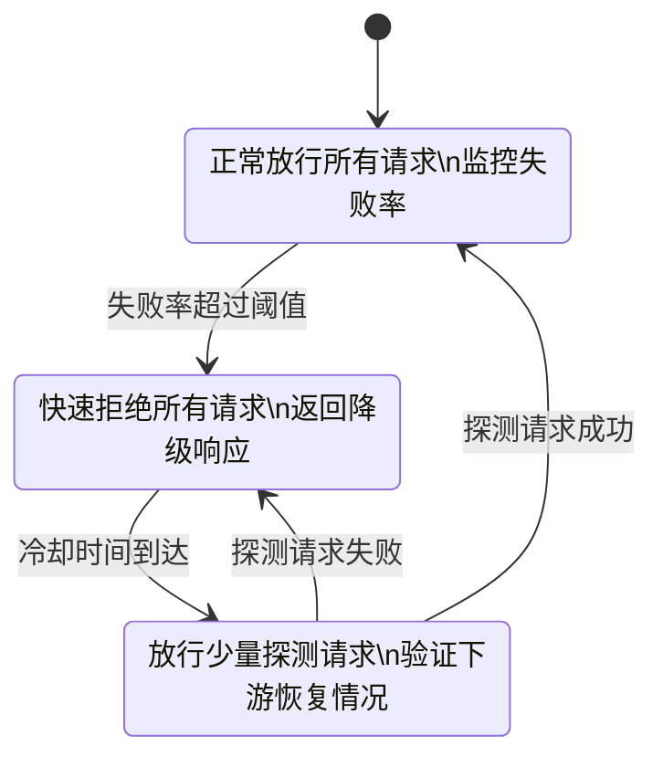
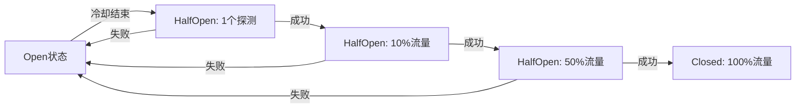
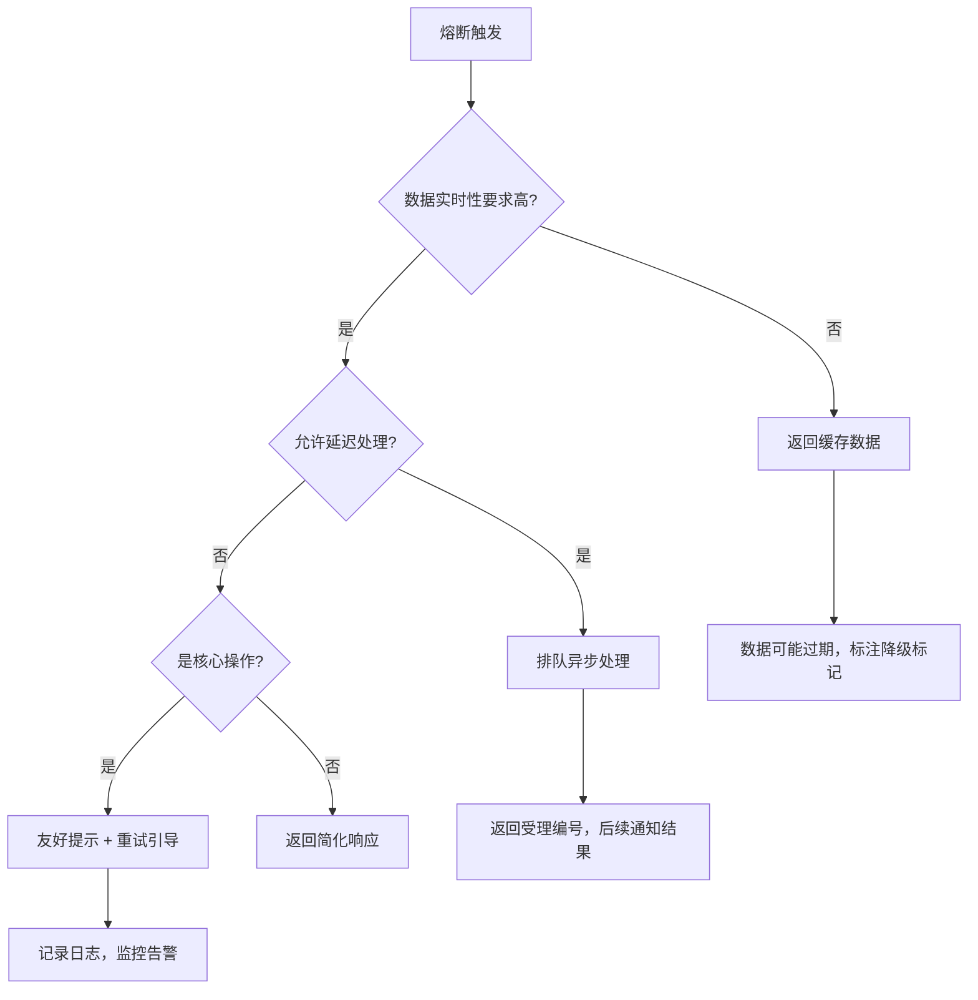
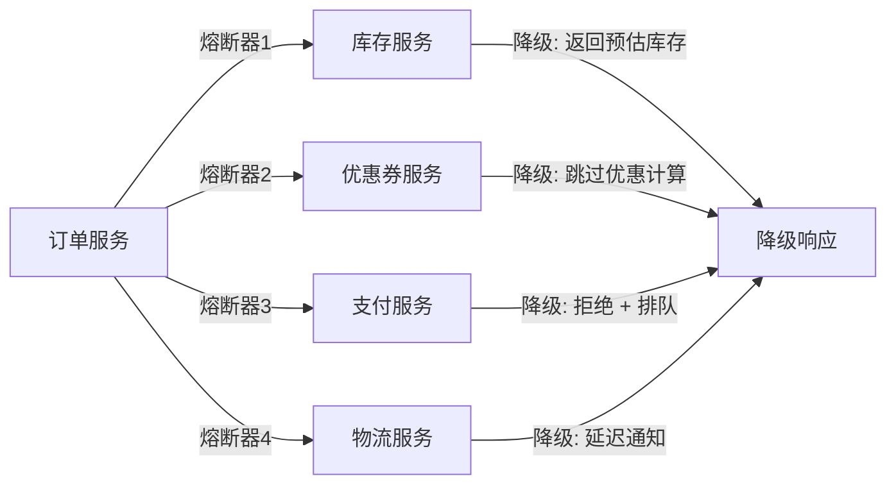
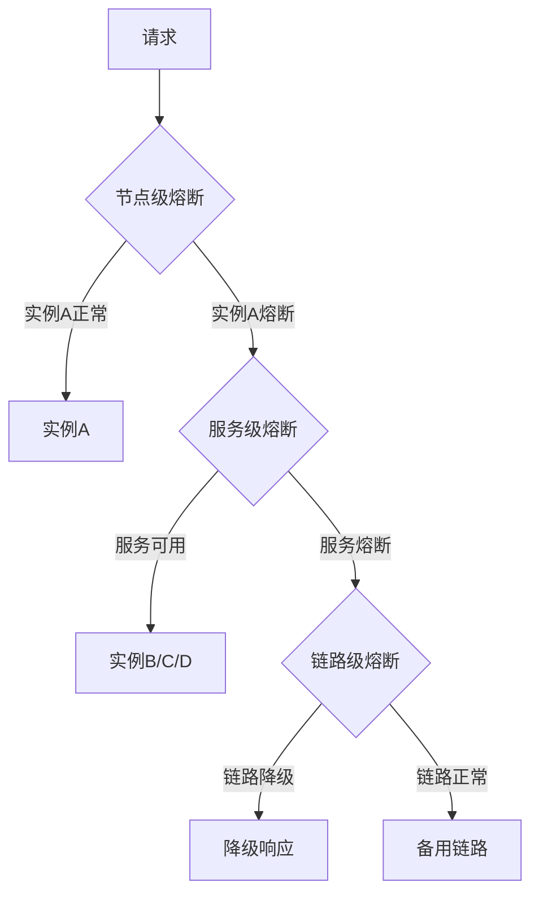

## 熔断保护

### 1. 概述与背景

#### 1.1 什么是熔断保护

熔断保护（Circuit Breaker）是一种分布式系统中的容错机制，其核心思想源自电力工程中的断路器——当电流异常过载时自动断开电路以保护设备。在软件领域，熔断保护用于监控下游服务的调用状态，当失败率超过阈值时自动"断开"调用链路，防止故障级联扩散，从而保护整个系统的可用性。

在 API 网关架构中，熔断保护承担着"最后一道防线"的角色。API 网关作为所有外部请求的统一入口，背后连接着数十甚至数百个微服务。任何一个下游服务的故障，都可能通过网关传播到整个系统。熔断保护机制确保当某个下游服务出现异常时，网关能够快速失败（fail fast），返回预设的降级响应，而不是让请求无限等待或反复重试，最终拖垮整个系统。

#### 1.2 为什么需要熔断保护

没有熔断保护的微服务系统面临以下致命风险：

**级联故障（Cascading Failure）**：当服务 A 调用服务 B，服务 B 又调用服务 C，如果服务 C 响应变慢，服务 B 的线程池会被阻塞的请求耗尽，随后服务 A 也会因调用 B 超时而耗尽资源，最终整个调用链路上的所有服务全部瘫痪。2012 年 Amazon 的 Prime Day 大规模宕机、2017 年 Amazon S3 的"打字删除"事件，本质上都是级联故障的典型案例。

**资源耗尽**：持续向故障服务发送请求会消耗大量线程、连接、内存等资源。一个下游服务的 5 秒超时，可能瞬间让网关的 200 个线程全部阻塞，导致所有请求（包括调用正常服务的请求）都无法处理。

**雪崩效应**：在自动扩缩容场景下，故障服务的慢响应会导致调用方不断扩容，扩出来的实例继续调用故障服务，形成资源的无效消耗，最终触发整个集群的资源耗尽。

#### 1.3 熔断器的三种状态

熔断器的工作模型基于有限状态机，包含三个核心状态：



| 状态 | 行为 | 触发条件 | 目的 |
|------|------|----------|------|
| **Closed（关闭）** | 正常放行所有请求，同时统计失败率 | 初始状态 / HalfOpen 探测成功 | 正常转发流量 |
| **Open（打开）** | 拒绝所有请求，直接返回降级响应 | Closed 状态下失败率超过阈值 | 快速失败，保护系统 |
| **HalfOpen（半开）** | 放行有限数量的探测请求，其余拒绝 | Open 状态冷却时间结束 | 验证下游是否恢复 |

#### 1.4 熔断保护与其他容错机制的关系

| 机制 | 作用层级 | 触发时机 | 核心目标 |
|------|----------|----------|----------|
| **超时控制** | 单次请求 | 每次调用 | 限制单次请求的等待时间 |
| **重试机制** | 单次请求 | 请求失败时 | 对偶发故障进行自动恢复 |
| **限流** | 入口层 | 请求进入时 | 控制流量总量，保护自身 |
| **熔断保护** | 调用链路 | 失败率累积达标时 | 隔离故障服务，保护下游 |
| **降级策略** | 应用层 | 熔断触发后 | 提供可接受的替代体验 |

这五种机制层层递进：限流是"入口管控"，超时和重试是"单次请求保护"，熔断是"链路级保护"，降级是"兜底体验保障"。在实际系统中，它们通常组合使用，构建多层防护体系。

### 2. 核心原理

#### 2.1 失败率计算模型

熔断器的核心决策依赖于对"失败率"的精确计算。常见的计算模型包括：

**滑动窗口模型**：在固定时间窗口内统计失败请求数与总请求数的比值。例如 Netflix Hystrix 采用 10 秒滚动窗口，每 1 秒为一个 bucket，维护最近 10 个 bucket 的统计数据。

失败率 = 窗口内失败请求数 / 窗口内总请求数 × 100%

**计数器模型**：维护一个固定时间周期内的请求计数器，到达周期后重置。优点是实现简单，缺点是存在窗口边界的统计偏差——一个周期末尾的大量失败和下一个周期开头的大量失败可能分别不触发阈值，但合在一起应该触发。

**加权滑动窗口模型**：对不同时间点的请求赋予不同权重，近期的请求权重更高。这能更灵敏地反映最近的服务状态变化。

```python
class WeightedSlidingWindow:
    """加权滑动窗口熔断器统计"""
    def __init__(self, window_size_seconds=10, bucket_count=10):
        self.window_size = window_size_seconds
        self.bucket_count = bucket_count
        self.bucket_interval = window_size_seconds / bucket_count
        self.buckets = [Bucket() for _ in range(bucket_count)]
        self.current_bucket_idx = 0
        self.last_bucket_time = time.time()

    def record_success(self):
        self._rotate_if_needed()
        self.buckets[self.current_bucket_idx].add(success=True)

    def record_failure(self):
        self._rotate_if_needed()
        self.buckets[self.current_bucket_idx].add(success=False)

    def get_failure_rate(self):
        total, failures = 0, 0
        now = time.time()
        for i in range(self.bucket_count):
            bucket = self.buckets[i]
            age = now - bucket.start_time
            if age < self.window_size:
                total += bucket.total
                failures += bucket.failures
        return failures / total if total > 0 else 0.0

    def _rotate_if_needed(self):
        now = time.time()
        elapsed = now - self.last_bucket_time
        while elapsed >= self.bucket_interval:
            self.current_bucket_idx = (self.current_bucket_idx + 1) % self.bucket_count
            self.buckets[self.current_bucket_idx].reset()
            self.last_bucket_time += self.bucket_interval
            elapsed -= self.bucket_interval
```

#### 2.2 状态转换机制

熔断器状态转换不是简单的阈值判断，而是一套精密的控制逻辑：

**Closed → Open 的转换**：当滑动窗口内的失败率超过配置阈值（通常 50%~80%），且窗口内的最小请求数达到统计下限（通常 10~20 次），熔断器进入 Open 状态。设置最小请求数是为了避免"小样本偏差"——如果窗口内只有 1 个请求且失败了，失败率就是 100%，但这不代表服务真的不可用。

**Open → HalfOpen 的转换**：进入 Open 状态后，熔断器启动一个冷却计时器（通常 5~30 秒）。冷却时间结束后自动进入 HalfOpen 状态。冷却时间的选择是一门权衡艺术：太短则可能在服务尚未恢复时就发送探测请求，太长则会延迟故障恢复的检测。

**HalfOpen → Closed 的转换**：HalfOpen 状态下，熔断器放行固定数量的探测请求（通常 1~5 个）。如果探测请求全部成功，说明下游服务已恢复，熔断器回到 Closed 状态。如果有任何失败，重新回到 Open 状态并重置冷却计时器。

#### 2.3 触发策略对比

| 策略 | 配置项 | 适用场景 | 优缺点 |
|------|--------|----------|--------|
| **失败率触发** | failureRateThreshold=50% | 通用场景 | 直观清晰；但低流量时可能统计不准 |
| **慢调用率触发** | slowCallRateThreshold=80%, slowCallDurationThreshold=1s | 对延迟敏感的服务 | 能发现"还活着但太慢"的问题；阈值需要根据 SLA 调整 |
| **失败次数触发** | failureCountThreshold=20 | 对失败敏感的核心链路 | 简单直接；不受流量波动影响 |
| **组合触发** | 失败率>50% OR 慢调用率>80% | 生产环境推荐 | 覆盖面广；配置复杂度略高 |

#### 2.4 半开状态的探测策略

探测策略直接影响熔断器从 Open 恢复到 Closed 的速度和准确性：

**固定数量探测**：每次 HalfOpen 放行固定数量（如 1 个）请求。优点是保守安全，缺点是恢复速度慢。

**渐进式探测**：从 1 个请求开始，逐步增加到正常流量的 10%、25%、50%，每一步成功后递增。这类似网络协议中的"慢启动"策略，能平滑地将流量切回恢复中的服务。



### 3. 关键指标

#### 3.1 核心度量指标

| 指标 | 含义 | 健康值 | 告警阈值 | 采集方式 |
|------|------|--------|----------|----------|
| **失败率** | 失败请求 / 总请求 × 100% | < 1% | > 10%（触发熔断 50%） | 窗口统计 |
| **慢调用率** | 慢请求 / 总请求 × 100% | < 5% | > 30%（触发熔断 80%） | 响应时间分布 |
| **熔断器状态** | Closed / Open / HalfOpen | Closed | Open 超过 60s | 状态机监控 |
| **请求拒绝数** | 被熔断器拒绝的请求数 | 0 | > 0（Open 状态时） | 计数器 |
| **降级触发数** | 进入降级逻辑的请求数 | 0 | > 0（降级功能监控） | 事件埋点 |
| **恢复时间** | Open → Closed 的时长 | < 30s | > 120s | 时间戳差值 |

#### 3.2 关键性能参数

|| 参数 | 含义 | 推荐值 | 说明 ||
|------|------|--------|------|------|
| failureRateThreshold | 失败率阈值 | 50% | 超过此值触发熔断 |
| slowCallRateThreshold | 慢调用率阈值 | 80% | 超过此值触发熔断 |
| slowCallDurationThreshold | 慢调用判定时间 | 1s | 响应超过此值算慢调用 |
| slidingWindowSize | 滑动窗口大小 | 10s | 统计数据的时间范围 |
| minimumNumberOfCalls | 最小请求数 | 10 | 低于此数不计算失败率 |
| waitDurationInOpenState | Open 状态等待时间 | 5s | 进入 HalfOpen 前的冷却时间 |
| permittedNumberOfCallsInHalfOpenState | HalfOpen 放行请求数 | 1 | 探测阶段允许的请求数 |
| slidingWindowType | 窗口类型 | TIME_BASED | 基于时间还是基于计数 |

### 4. 主流实现框架

#### 4.1 Resilience4j

Resilience4j 是 Java 生态中最流行的轻量级熔断器框架，是 Netflix Hystrix 的继任者，已被 Spring Cloud 官方推荐。

```java
// Resilience4j 熔断器配置
CircuitBreakerConfig config = CircuitBreakerConfig.custom()
    .failureRateThreshold(50)                    // 失败率阈值 50%
    .slowCallRateThreshold(80)                   // 慢调用率阈值 80%
    .slowCallDurationThreshold(Duration.ofSeconds(1))  // 慢调用判定 1s
    .slidingWindowType(SlidingWindowType.TIME_BASED)   // 时间滑动窗口
    .slidingWindowSize(10)                        // 窗口 10 秒
    .minimumNumberOfCalls(10)                     // 最少 10 次调用
    .waitDurationInOpenState(Duration.ofSeconds(5))     // Open 等待 5 秒
    .permittedNumberOfCallsInHalfOpenState(1)     // HalfOpen 放行 1 个
    .recordExceptions(IOException.class, TimeoutException.class)
    .ignoreExceptions(BusinessException.class)
    .build();

CircuitBreaker breaker = CircuitBreaker.of("paymentService", config);

// 使用装饰器包装业务逻辑
Supplier<String> decoratedSupplier = Decorators.ofSupplier(() -> callPaymentService())
    .withCircuitBreaker(breaker)
    .withRetry(Retry.ofDefaults())
    .withFallback(List.of(TimeoutException.class), e -> "fallback-response")
    .decorate();

// 执行调用
try {
    String result = decoratedSupplier.get();
} catch (CallNotPermittedException e) {
    // 熔断器打开，请求被拒绝
    String fallback = callFallbackService();
}
```

Spring Cloud 中的声明式配置：

```yaml
resilience4j:
  circuitbreaker:
    instances:
      paymentService:
        slidingWindowSize: 10
        permittedNumberOfCallsInHalfOpenState: 1
        failureRateThreshold: 50
        waitDurationInOpenState: 5s
        slidingWindowType: TIME_BASED
        minimumNumberOfCalls: 10
        registerHealthIndicator: true
        eventConsumerBufferSize: 100
  timelimiter:
    instances:
      paymentService:
        timeoutDuration: 3s
```

#### 4.2 Envoy / Istio 网关层熔断

Envoy 作为 Service Mesh 的数据面代理，在网关层提供了原生的熔断能力。它的工作方式与应用级熔断器有本质区别——Envoy 在 L4/L7 层直接拦截流量，不需要修改业务代码。

```yaml
# Envoy Outlier Detection 配置（被动健康检查）
static_resources:
  clusters:
  - name: payment-service
    type: STRICT_DNS
    lb_policy: ROUND_ROBIN
    outlier_detection:
      # 连续 5 次 5xx 错误后将节点标记为不健康
      consecutive_5xx: 5
      # 50% 错误率触发驱逐（需至少 100 个请求）
      failure_percent_threshold: 50
      # 每 10 秒扫描一次
      interval: 10s
      # 驱逐时间 30 秒后重新探测
      base_ejection_time: 30s
      # 最长驱逐时间 = 基础时间 × 3 = 90s
      max_ejection_percent: 30
      # 成功探测 3 次后恢复
      consecutive_local_origin_success: 3
```

Envoy 的熔断与应用级熔断器的关键区别：

| 维度 | Envoy 网关级熔断 | Resilience4j 应用级熔断 |
|------|-------------------|------------------------|
| 工作层级 | L4/L7 代理层 | 应用进程内 |
| 是否需要修改代码 | 否 | 是 |
| 粒度 | 节点级（per-endpoint） | 服务调用级 |
| 统计维度 | 连接级 / HTTP 响应码 | 业务异常 / 超时 |
| 配置方式 | 声明式 YAML | 代码 + 配置 |
| 跨语言 | 统一代理，无需关心 | 每种语言各有一套 |

#### 4.3 多语言实现对比

| 框架 | 语言 | 特点 | GitHub Stars |
|------|------|------|-------------|
| Resilience4j | Java | 轻量级，函数式，Spring 生态首选 | 24k+ |
| Polly | C# / .NET | .NET 生态的事实标准，支持多种策略组合 | 19k+ |
| pybreaker | Python | 纯 Python 实现，API 简洁 | 1.2k+ |
| gobreaker | Go | 受 Netflix Hystrix 启发，Go 风格 | 3.8k+ |
| opossum | Node.js | 事件驱动，性能出色 | 4.5k+ |

```python
# Python - pybreaker 示例
import pybreaker

# 配置熔断器
breaker = pybreaker.CircuitBreaker(
    fail_max=5,             # 连续 5 次失败后熔断
    reset_timeout=30,       # 30 秒后进入 HalfOpen
    name="payment_breaker",
    exclude=[ValueError],   # ValueError 不计入失败
)

@breaker
def call_payment_service(order_id):
    """调用支付服务"""
    response = http_client.post(f"/payments/{order_id}", timeout=3)
    response.raise_for_status()
    return response.json()

# 当熔断器打开时抛出 CircuitBreakerError
try:
    result = call_payment_service("order_123")
except pybreaker.CircuitBreakerError:
    # 进入降级逻辑
    result = fallback_payment()
```

```go
// Go - gobreaker 示例
import "github.com/sony/gobreaker/v2"

var cb *gobreaker.CircuitBreaker[gobreaker.Settings]

func init() {
    cb = gobreaker.NewCircuitBreaker[gobreaker.Settings](
        gobreaker.Settings{
            Name:        "payment-service",
            MaxRequests: 1,             // HalfOpen 状态允许 1 个探测请求
            Interval:    10 * time.Second, // 统计窗口 10 秒
            Timeout:     30 * time.Second, // Open → HalfOpen 冷却 30 秒
            ReadyToTrip: func(counts gobreaker.Counts) bool {
                return counts.ConsecutiveFailures > 5
            },
            OnStateChange: func(name string, from, to gobreaker.State) {
                log.Printf("熔断器 %s: %s → %s", name, from, to)
            },
        },
    )
}

func CallPaymentService(orderID string) ([]byte, error) {
    result, err := cb.Execute(func() (any, error) {
        resp, err := http.Post("http://payment-service/pay/"+orderID, ...)
        if err != nil {
            return nil, err
        }
        defer resp.Body.Close()
        return io.ReadAll(resp.Body)
    })
    if err != nil {
        return nil, err // 包含 CircuitBreakerError
    }
    return result.([]byte), nil
}
```

### 5. 降级策略设计

熔断器打开后，系统不会返回错误，而是执行预设的降级策略。降级策略的设计直接决定了用户体验的下限。

#### 5.1 降级策略矩阵

| 降级类型 | 实现方式 | 适用场景 | 用户体验 |
|----------|----------|----------|----------|
| **返回缓存数据** | 从 Redis/本地缓存返回上次成功结果 | 数据变更不频繁的查询 | 数据可能有延迟，但可用 |
| **返回默认值** | 返回预设的安全默认值 | 配置类、基础信息查询 | 功能受限，核心可用 |
| **返回简化响应** | 只返回核心字段，跳过非关键计算 | 列表页、详情页 | 信息量减少，但不报错 |
| **排队等待** | 请求进入队列，服务恢复后异步处理 | 订单提交、消息发送 | 延迟增加，但不丢数据 |
| **拒绝并提示** | 返回友好提示，引导用户稍后重试 | 支付、转账等关键操作 | 明确告知状态，体验可控 |

```python
class CircuitBreaker降级策略:
    """熔断降级策略组合"""

    def __init__(self):
        self.cache = RedisCache(ttl=300)

    async def query_with_fallback(self, user_id):
        """带降级的用户信息查询"""
        try:
            # 主路径：调用用户服务
            data = await self.user_service.get_user(user_id)
            # 成功后更新缓存
            await self.cache.set(f"user:{user_id}", data)
            return data
        except CircuitBreakerError:
            # 降级路径 1：返回缓存数据
            cached = await self.cache.get(f"user:{user_id}")
            if cached:
                return cached
            # 降级路径 2：返回简化默认值
            return {
                "user_id": user_id,
                "name": "用户",
                "avatar": "/static/default-avatar.png",
                "_fallback": True
            }
```

#### 5.2 降级策略选择决策树



### 6. 实际应用场景

#### 6.1 电商订单链路的熔断设计

电商下单是一个典型的分布式调用链：订单服务 → 库存服务 → 优惠券服务 → 支付服务 → 物流服务。每个环节都可能出现故障，熔断保护必须精细到每个环节。



**各环节熔断配置**：

| 服务 | 失败率阈值 | 超时时间 | 降级策略 | 理由 |
|------|-----------|---------|----------|------|
| 库存服务 | 30% | 500ms | 返回预估库存 + 标记可能不准 | 库存可以卖超后补偿，不能让下单流程卡死 |
| 优惠券服务 | 50% | 1s | 跳过优惠计算，按原价处理 | 优惠可以事后补偿，不影响核心流程 |
| 支付服务 | 20% | 3s | 拒绝下单 + 提示稍后重试 | 支付必须可靠，宁可不卖不能出错 |
| 物流服务 | 40% | 2s | 创建订单但延迟通知运单号 | 物流不影响下单成功，可异步处理 |

#### 6.2 API 网关的全局限流 + 熔断组合

在网关层面，限流和熔断需要协同工作：

请求进入 → 全局限流检查 → 路由匹配 → 目标服务熔断检查 → 转发请求 → 返回响应
              │                            │
              ↓ 超限                        ↓ 熔断
         返回 429                    返回 503 + 降级响应

```yaml
# Kong 网关熔断 + 限流配置
plugins:
- name: rate-limiting
  config:
    minute: 1000
    policy: redis
    redis_host: redis.internal
- name: circuit-breaker
  config:
    threshold: 50
    timeout: 30
    targets:
    - service: payment-service
      threshold: 20     # 支付服务更严格
      timeout: 60
    - service: recommendation-service
      threshold: 80     # 推荐服务更宽松
      timeout: 15
```

#### 6.3 微服务网格中的全局熔断状态同步

在 Service Mesh 架构中，每个服务实例都运行一个 Sidecar 代理（如 Envoy），每个代理独立维护自己的熔断状态。当多个代理同时检测到某个上游服务故障时，它们会各自执行熔断，但可能因为采样偏差导致熔断状态不一致。

解决思路：

1. **共享状态**：通过 xDS 协议由控制平面（如 Istiod）统一下发熔断配置和健康状态
2. **收敛策略**：所有代理使用相同的统计窗口和阈值配置，确保判断依据一致
3. **全局视角**：在网关层设置全局熔断器，对整个服务（而非单个实例）进行熔断判定

### 7. 常见误区与最佳实践

#### 7.1 常见误区

| 误区 | 问题描述 | 正确做法 |
|------|----------|----------|
| 熔断阈值一刀切 | 所有服务使用相同失败率阈值 | 根据服务重要性和 SLA 差异化配置 |
| 只设不调 | 上线后从不调整熔断参数 | 建立熔断参数的定期评审机制 |
| 忽略 HalfOpen | 熔断打开后只等不探 | 合理配置 HalfOpen 探测策略 |
| 降级等于报错 | 降级直接返回 500 错误 | 降级应返回有意义的响应，保持用户体验 |
| 熔断不告警 | 熔断触发后无人知晓 | 熔断事件必须接入监控告警体系 |
| 不区分故障类型 | 所有异常都计入失败率 | 区分瞬时故障和持久故障，排除客户端错误 |

#### 7.2 生产环境最佳实践

**配置管理**：
- 熔断参数必须可动态调整，不能硬编码在代码中
- 通过配置中心（如 Nacos、Apollo）实现运行时热更新
- 为每个服务建立独立的熔断配置 Profile，记录参数变更历史

**监控体系**：
- 熔断器状态变化必须触发告警（Closed → Open 是关键事件）
- 监控熔断器的拒绝请求数、降级触发数、恢复时间
- 建立熔断热力图，直观展示各服务的健康状况

```python
# Prometheus 指标埋点示例
from prometheus_client import Counter, Histogram, Gauge

# 熔断器状态指标
circuit_breaker_state = Gauge(
    'circuit_breaker_state',
    'Circuit breaker state: 0=closed, 1=half-open, 2=open',
    ['service_name']
)

# 熔断拒绝计数
circuit_breaker_rejections = Counter(
    'circuit_breaker_rejections_total',
    'Total requests rejected by circuit breaker',
    ['service_name', 'method']
)

# 降级触发计数
fallback_triggered = Counter(
    'fallback_triggered_total',
    'Total fallback executions',
    ['service_name', 'fallback_type']
)

# 监听熔断器状态变化事件
def on_state_change(event):
    circuit_breaker_state.labels(event.service).set(
        {'CLOSED': 0, 'HALF_OPEN': 1, 'OPEN': 2}[event.new_state]
    )
    if event.new_state == 'OPEN':
        alert_manager.fire(
            severity='warning',
            message=f'服务 {event.service} 熔断器打开，失败率: {event.failure_rate:.1%}'
        )
```

**故障演练**：
- 定期进行混沌工程实验，人为注入故障验证熔断器行为
- 验证降级路径是否正常工作，降级响应是否符合预期
- 验证熔断恢复后流量切换是否平滑

#### 7.3 熔断参数调优指南

调优熔断参数是一个迭代过程，需要结合实际流量特征：

1. **基线建立**：先观察服务在正常状态下的成功率、响应时间分布
2. **阈值设定**：将失败率阈值设为正常失败率的 3~5 倍
3. **窗口选择**：窗口大小应覆盖至少一个完整的请求周期（如 10~30 秒）
4. **冷却时间**：根据服务的恢复时间来设置，通常为平均恢复时间的 1.5 倍
5. **灰度验证**：先在非核心服务上验证参数，再推广到核心服务
6. **持续调优**：根据监控数据定期评估和调整参数

### 8. 进阶：高级熔断模式

#### 8.1 分层熔断（Tiered Circuit Breaker）

在复杂的微服务架构中，单层熔断不够精细。分层熔断在不同层级设置不同的熔断策略：

- **节点级熔断**：针对单个服务实例，将故障实例从负载均衡池中摘除
- **服务级熔断**：针对整个服务（所有实例），当多数实例异常时触发
- **链路级熔断**：针对特定调用链路，只熔断问题链路，不影响其他链路



#### 8.2 自适应熔断（Adaptive Circuit Breaker）

传统熔断器依赖固定阈值，自适应熔断器能根据系统负载自动调整阈值：

- **低负载时**：提高失败率阈值，避免因少量失败就熔断
- **高负载时**：降低失败率阈值，更敏感地检测故障
- **资源紧张时**：缩短冷却时间，加快恢复探测

```python
class AdaptiveThreshold:
    """自适应熔断阈值"""
    def __init__(self, base_threshold=50):
        self.base_threshold = base_threshold

    def get_current_threshold(self):
        cpu_usage = get_cpu_usage()
        memory_usage = get_memory_usage()
        qps = get_current_qps()

        # 资源使用率高时降低阈值（更敏感）
        resource_factor = 1.0 - (cpu_usage + memory_usage) / 200
        # 高流量时降低阈值
        traffic_factor = max(0.5, 1.0 - qps / 100000)

        adjusted = self.base_threshold * resource_factor * traffic_factor
        return max(20, min(80, adjusted))  # 限制在 20%~80% 之间
```

#### 8.3 基于 AIOps 的智能熔断

利用机器学习模型对熔断决策进行优化：

- **异常检测**：基于历史数据训练异常检测模型，识别非典型故障模式
- **预测性熔断**：在服务实际故障前，通过指标趋势预测即将发生的故障，提前触发熔断
- **自动调参**：根据服务运行数据自动优化熔断参数，减少人工调优成本

### 9. 总结

熔断保护是 API 网关和微服务架构中不可或缺的容错机制。它的核心价值在于：

1. **快速失败**：避免无意义的等待和重试，节约系统资源
2. **故障隔离**：将故障限制在局部，防止级联扩散
3. **优雅降级**：通过预设的降级策略，保持核心功能可用
4. **自动恢复**：通过 HalfOpen 状态的探测机制，实现故障恢复后的自动切换

在实际落地中，熔断保护不是孤立存在的，需要与超时控制、重试机制、限流策略、降级设计等协同工作，共同构建健壮的分布式系统。关键在于：**根据业务特征差异化配置参数，建立完善的监控告警体系，定期进行故障演练验证，持续迭代优化熔断策略**。
