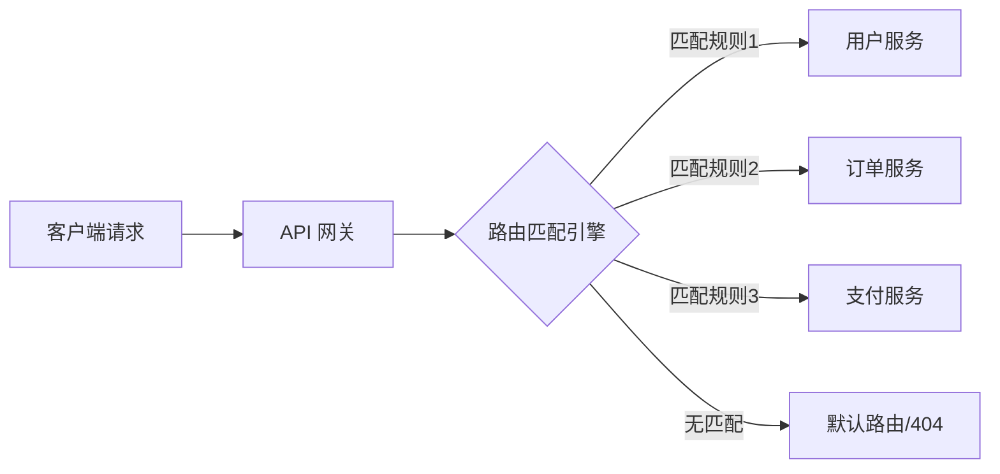
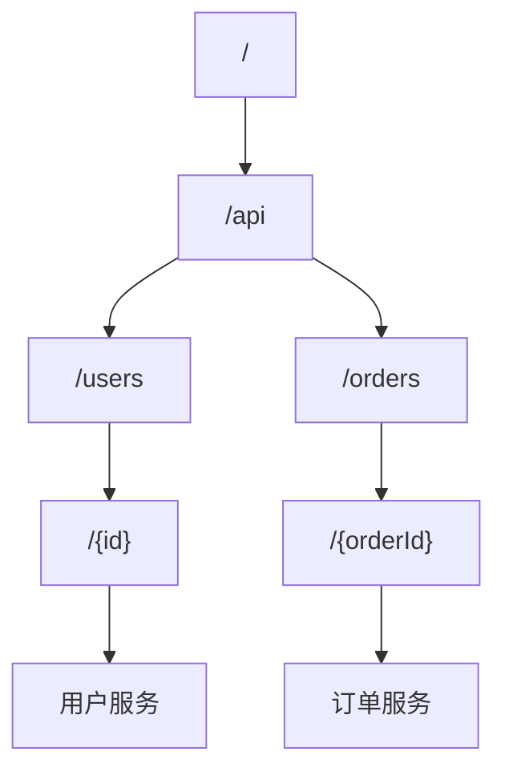
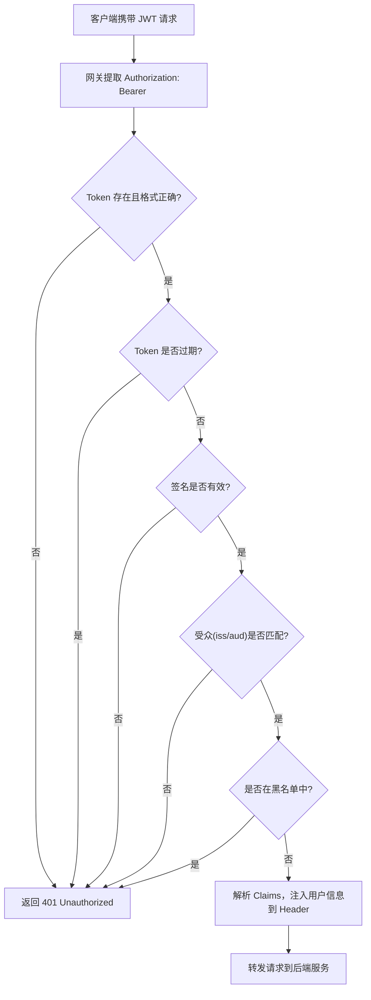
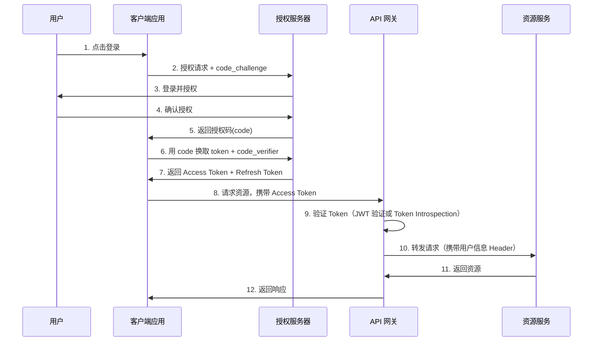
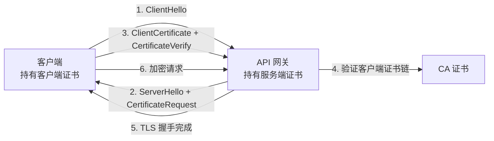
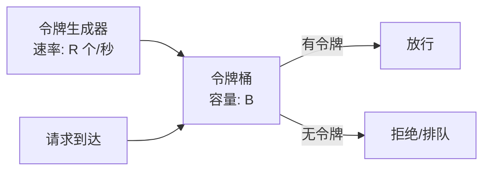
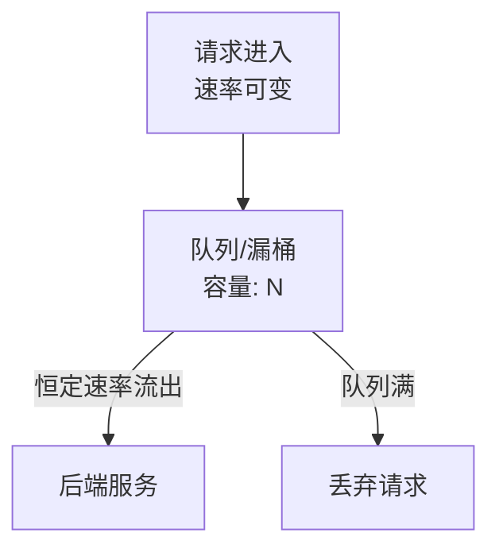
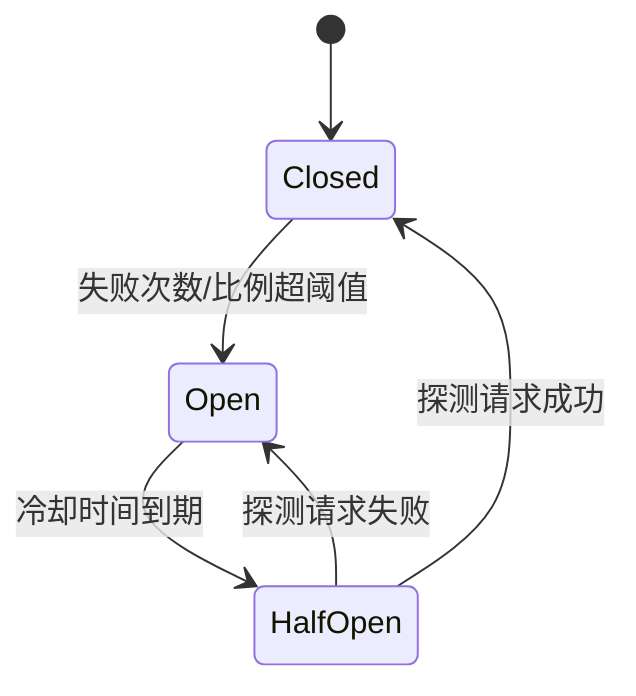
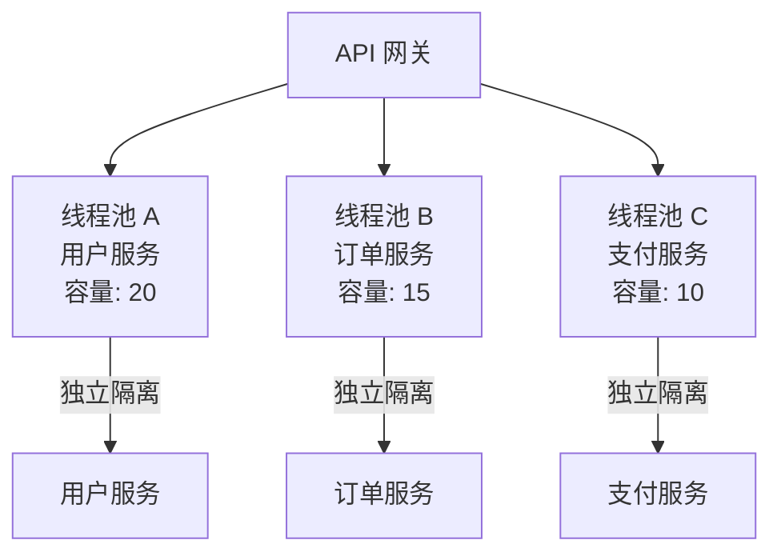
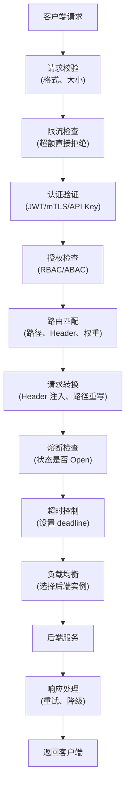

# API 网关理论基础

API 网关（API Gateway）是微服务架构中最关键的基础设施之一，承担着请求入口统一管控的核心职责。本章系统梳理 API 网关的四大理论支柱：路由机制、认证授权、限流策略与熔断保护——从底层原理到工程实践，为后续的架构设计与实战落地奠定坚实基础。

---

## 一、路由机制

路由机制是 API 网关最基础也最核心的能力。它决定每一个进入网关的请求"去往何处"，直接影响服务的可用性、延迟和资源利用率。

### 1.1 路由的基本概念

路由本质上是一组**匹配规则 + 转发动作**的映射。网关根据请求的特征（路径、Header、Host、查询参数等）匹配到预设规则，然后将请求转发到对应的后端服务。



一个完整的路由规则通常包含以下要素：

| 要素 | 说明 | 示例 |
|------|------|------|
| **匹配条件** | 请求的哪些特征参与匹配 | 路径前缀、HTTP 方法、Header |
| **目标服务** | 请求应转发到哪个后端 | `http://user-service:8080` |
| **重写规则** | 转发前对 URL 做的变换 | `/api/v1/users` → `/users` |
| **超时设置** | 该路由的超时时间 | 30 秒 |
| **重试策略** | 失败时是否重试、重试几次 | 最多 3 次，间隔 1 秒 |
| **权重分配** | 流量比例（用于灰度发布） | 新版本 10%，旧版本 90% |

### 1.2 路由匹配算法

不同网关采用不同的匹配策略，核心区别在于**匹配优先级**和**匹配粒度**。

#### 精确匹配 vs 前缀匹配

精确匹配要求路径完全一致（`/api/users` 只匹配 `/api/users`），前缀匹配则允许路径前缀相同即可（`/api/users` 也能匹配 `/api/users/123`）。大多数网关默认使用前缀匹配，并支持配置精确匹配。

#### 正则匹配

正则匹配提供最灵活的表达能力，适用于复杂路径模式。例如：

/users/{id:\d+}        # 只匹配数字 ID
/items/([^/]+)/detail  # 提取第一段路径作为参数

正则匹配的代价是性能——每次匹配都需要执行正则表达式计算，当路由规则数量达到数千条时，线性扫描 + 正则匹配会成为性能瓶颈。

#### 路由树（Radix Tree）

高性能网关（如 Kong、Traefik）使用**基数树（Radix Tree / Trie）**存储路由规则。基数树通过公共前缀压缩，将路由匹配的平均时间复杂度从 O(n) 降低到 O(k)，其中 k 是路径长度而非规则数量。



在上面的树结构中，请求 `GET /api/users/123` 的匹配路径为：`/` → `/api` → `/users` → `/{id}`，只需 4 步即可完成，与路由规则总数无关。

### 1.3 负载均衡策略

当一个服务有多个实例时，网关需要决定将请求分发给哪个实例。不同的负载均衡策略适用于不同的场景：

| 策略 | 原理 | 适用场景 | 缺点 |
|------|------|----------|------|
| **轮询（Round Robin）** | 依次分配给每个实例 | 实例性能均匀 | 不考虑实例负载差异 |
| **加权轮询** | 按权重比例分配 | 实例性能不均（如不同规格机器） | 权重需手动配置 |
| **最少连接（Least Connections）** | 选择当前连接数最少的实例 | 请求处理时间差异大 | 需要实时统计连接数 |
| **随机（Random）** | 随机选择实例 | 实例数量足够多 | 短期内可能不均衡 |
| **一致性哈希** | 按请求特征（如用户 ID）哈希到固定实例 | 需要会话亲和性（Session Affinity） | 新增/删除节点时有数据迁移 |
| **P2C（Power of Two Choices）** | 随机选两个，选负载更低的 | 大规模集群的均衡与性能兼顾 | 实现相对复杂 |

#### 一致性哈希的工程细节

一致性哈希解决了传统哈希在节点增减时大规模重映射的问题。核心思想是将节点和请求都映射到同一个哈希环上：

          Node A (hash=10)
              |
              |
  Node C -----+----- Node B
  (hash=80)   |      (hash=40)
              |
          请求 X (hash=55) → 顺时针找到 Node B

但简单的一致性哈希存在**数据倾斜**问题——节点在哈希环上分布不均匀，导致某些节点承担过多请求。工程上通常使用**虚拟节点（Virtual Nodes）**解决：每个物理节点映射多个虚拟节点到哈希环上，使分布趋于均匀。一般虚拟节点数量设为 100~200 即可达到满意效果。

### 1.4 高级路由模式

#### 灰度发布（Canary Release）

灰度发布允许新版本服务接收少量真实流量，验证稳定后再逐步放量。路由规则按权重分配流量：

```yaml
# 服务网关路由配置示例
routes:
  - name: users-stable
    match:
      prefix: /api/users
    upstream: user-service-v1
    weight: 90

  - name: users-canary
    match:
      prefix: /api/users
      headers:
        x-canary: "true"   # 特定 Header 走新版
    upstream: user-service-v2
    weight: 10
```

灰度发布的关键在于**流量染色**：可以通过 Header、Cookie、用户 ID 哈希等方式标识哪些请求应走新版本。常用策略有：

- **按用户 ID 哈希**：同一用户始终访问同一版本，体验一致
- **按百分比随机**：简单直接，但同一用户可能看到不同版本
- **按 Header/Cookie**：适合测试人员手动验证
- **按地域/设备**：先在特定地区验证，再全量发布

#### 路径重写与剥离

当网关暴露的 URL 结构与后端服务不一致时，需要路径重写：

| 原始路径 | 重写规则 | 转发路径 | 说明 |
|----------|----------|----------|------|
| `/api/v1/users/123` | 剥离 `/api/v1` | `/users/123` | 后端服务不需要 API 前缀 |
| `/legacy/users` | 重写为 `/v2/accounts` | `/v2/accounts` | 旧路径映射到新路径 |
| `/users/{id}` | 重写为 `/user?id={id}` | `/user?id=123` | RESTful → 查询参数风格 |

---

## 二、认证授权

认证（Authentication）回答"你是谁"，授权（Authorization）回答"你能做什么"。API 网关作为统一入口，通常在此处集中实现认证授权逻辑，避免每个后端服务重复实现。

### 2.1 认证方式对比

| 认证方式 | 安全性 | 实现复杂度 | 适用场景 | 无状态 |
|----------|--------|-----------|----------|--------|
| **API Key** | 低 | 低 | 第三方 API、简单场景 | 是 |
| **JWT（JSON Web Token）** | 中高 | 中 | 微服务间认证、单点登录 | 是 |
| **OAuth 2.0** | 高 | 高 | 开放平台、第三方授权 | 是 |
| **mTLS（双向 TLS）** | 极高 | 高 | 服务间通信、零信任网络 | 是 |
| **HMAC 签名** | 高 | 中 | Webhook 验证、开放 API | 是 |
| **Session Cookie** | 中 | 低 | 传统 Web 应用 | 否 |

### 2.2 JWT 认证详解

JWT 是目前 API 网关最常用的认证方案。一个 JWT 由三部分组成：Header、Payload、Signature。

eyJhbGciOiJSUzI1NiJ9.eyJpc3MiOiJodHRwczovL2FwaS5leGFtcGxlLmNvbSIsInN1YiI6IjEyMzQ1Njc4OTAiLCJleHAiOjE3MTk0NDQwMDAsInNjb3BlIjoiZHVkZSIsInJvbGUiOiJ1c2VyIn0.signature

**Header**（元信息）：

```json
{
  "alg": "RS256",       // 签名算法：RSA + SHA-256
  "typ": "JWT",         // 令牌类型
  "kid": "key-2024-01"  // 密钥 ID，用于密钥轮换
}
```

**Payload**（声明/Claims）：

```json
{
  "iss": "https://api.example.com",   // 签发者
  "sub": "1234567890",                 // 主题（用户 ID）
  "aud": "https://api.example.com",   // 受众
  "exp": 1719444000,                   // 过期时间（Unix 时间戳）
  "nbf": 1719440400,                   // 生效时间
  "iat": 1719440400,                   // 签发时间
  "jti": "unique-token-id",           // JWT ID，防重放
  "scope": "read write",              // 权限范围
  "roles": ["admin", "user"]          // 自定义声明
}
```

**Signature**（签名）：

signature = RSA_SHA256(
  base64UrlEncode(header) + "." + base64UrlEncode(payload),
  private_key
)

#### JWT 在网关中的验证流程



#### JWT 的安全陷阱

1. **算法混淆攻击**：攻击者将 Header 的 `alg` 改为 `none`，某些库可能跳过签名验证。**防护**：网关必须白名单校验允许的算法。

2. **密钥泄露**：JWT 使用非对称加密时，私钥一旦泄露，攻击者可伪造任意令牌。**防护**：使用硬件安全模块（HSM）存储密钥，定期轮换，设置较短的过期时间。

3. **令牌过期后的无感撤销**：JWT 本身是无状态的，一旦签发就无法主动失效（除非用黑名单机制）。**防护**：设置短过期时间（5~15 分钟），配合 Refresh Token 实现无感续期。

4. **Payload 明文可读**：JWT 的 Payload 只是 Base64 编码，不是加密。**防护**：不要在 Payload 中存放敏感信息（密码、密钥等）。

### 2.3 OAuth 2.0 授权流程

OAuth 2.0 是开放平台和第三方应用授权的标准协议。API 网关在其中通常扮演**资源服务器（Resource Server）**的角色，验证 Access Token 的有效性。

最常用的授权流程是**授权码模式（Authorization Code Grant with PKCE）**：



#### Token Introspection（令牌自省）

当 Access Token 是不透明的（Opaque Token）而非 JWT 时，网关无法本地验证，需要调用授权服务器的 Introspection 端点查询：

POST /oauth2/introspect
Content-Type: application/x-www-form-urlencoded

token=2YotnFZFEjr1zCsicMWpAA
&token_type_hint=access_token

响应示例：

```json
{
  "active": true,
  "scope": "read write",
  "client_id": "my-app",
  "sub": "1234567890",
  "exp": 1719444000,
  "iat": 1719440400
}
```

**性能考量**：Introspection 需要每次请求都调用授权服务器，引入额外网络延迟。优化手段包括：

- 对验证结果进行短时间缓存（如 30 秒），用 `Cache-Control` 头控制
- 优先使用 JWT（本地验证），仅在必要时用 Introspection
- 在授权服务器端部署高性能缓存层（如 Redis）

### 2.4 mTLS（双向 TLS）

mTLS 在标准 TLS 的基础上，要求客户端也提供证书，实现双向身份验证。这是零信任架构中服务间通信的基础认证方式。



**证书管理的关键问题**：

- **证书轮换**：mTLS 证书通常有效期较短（如 90 天），需要自动化轮换机制（如 cert-manager、Vault PKI）
- **证书吊销**：使用 CRL（证书吊销列表）或 OCSP（在线证书状态协议）检查证书是否已被吊销
- **CA 信任链**：确保网关信任所有合法的客户端 CA，同时拒绝非信任 CA 签发的证书

---

## 三、限流策略

限流是保护后端服务免受过载冲击的关键手段。API 网关在入口处实施限流，可以在流量到达后端之前就拦截超额请求。

### 3.1 经典限流算法

#### 令牌桶（Token Bucket）

令牌桶算法以固定速率向桶中添加令牌，每个请求消耗一个令牌。桶有容量上限，满了则丢弃新令牌。



**参数说明**：

- `R`（填充速率）：每秒产生的令牌数，等于允许的平均 QPS
- `B`（桶容量）：桶的最大容量，等于允许的突发流量大小

**时间复杂度**：O(1)。每次请求只需计算当前时间与上次填充时间的差值，更新令牌数量。

**Go 语言实现示例**：

```go
type TokenBucket struct {
    tokens     float64
    capacity   float64
    refillRate float64  // tokens per second
    lastRefill time.Time
    mu         sync.Mutex
}

func (tb *TokenBucket) Allow() bool {
    tb.mu.Lock()
    defer tb.mu.Unlock()

    now := time.Now()
    elapsed := now.Sub(tb.lastRefill).Seconds()
    tb.tokens += elapsed * tb.refillRate
    if tb.tokens > tb.capacity {
        tb.tokens = tb.capacity
    }
    tb.lastRefill = now

    if tb.tokens >= 1 {
        tb.tokens--
        return true
    }
    return false
}
```

#### 滑动窗口计数器（Sliding Window Counter）

滑动窗口是固定窗口的改进版本。固定窗口（如"每分钟限制 100 次"）在窗口边界存在**临界突发**问题——第 59 秒和第 61 秒各发 100 次请求，实际 2 秒内就有 200 次。

滑动窗口通过**加权计算**解决这个问题：

当前窗口请求数 = 上一个窗口请求数 × 重叠比例 + 当前窗口请求数

示例：窗口大小 60 秒，限制 100 次/分钟
假设当前时间是某分钟的第 20 秒：
  重叠比例 = (60 - 20) / 60 = 0.667
  如果上一分钟有 80 次，本分钟已有 50 次：
  估算值 = 80 × 0.667 + 50 = 103.33 > 100 → 拒绝

**优点**：精度高、内存占用小（只需记录上一窗口的计数）、实现简单。

#### 滑动窗口日志（Sliding Window Log）

记录每个请求的精确时间戳，窗口滑动时删除过期记录。精度最高但内存开销大——每分钟限 10000 次需要存储 10000 个时间戳。适用于对精度要求极高且请求量不大的场景。

#### 漏桶（Leaky Bucket）

漏桶以恒定速率处理请求，多余请求排入队列。与令牌桶的区别是：令牌桶允许突发（桶内有余量令牌时），漏桶**严格平滑**流量。



**适用场景**：需要严格控制请求发送速率的场景（如第三方 API 调用，防止触发对方限流）。

#### 算法对比总结

| 算法 | 突发流量 | 平滑度 | 内存开销 | 实现复杂度 | 典型应用 |
|------|---------|--------|---------|-----------|---------|
| 令牌桶 | 允许（桶容量内） | 中等 | O(1) | 低 | 大多数 API 网关默认算法 |
| 滑动窗口计数器 | 精确控制 | 较高 | O(1) | 低 | 需要精确限流的场景 |
| 滑动窗口日志 | 精确控制 | 最高 | O(n) | 中 | 高精度计费、审计 |
| 漏桶 | 不允许 | 最高 | O(n) | 中 | 对外 API 调用、流量整形 |

### 3.2 分布式限流

在多实例网关部署中，每个实例独立限流会导致总允许量 = 单实例限制 × 实例数，超出预期。分布式限流需要在所有实例间共享限流状态。

#### Redis + Lua 原子操作

最常见的分布式限流实现方案是利用 Redis 的原子操作：

```lua
-- Redis Lua 脚本：令牌桶算法
local key = KEYS[1]                    -- 限流键，如 "rate:api:users:123"
local capacity = tonumber(ARGV[1])      -- 桶容量
local rate = tonumber(ARGV[2])          -- 填充速率
local now = tonumber(ARGV[3])           -- 当前时间戳（毫秒）
local requested = tonumber(ARGV[4])     -- 请求的令牌数

-- 获取当前桶状态
local bucket = redis.call('hmget', key, 'tokens', 'last_refill')
local tokens = tonumber(bucket[1]) or capacity
local last_refill = tonumber(bucket[2]) or now

-- 计算新令牌
local elapsed = math.max(0, now - last_refill)
tokens = math.min(capacity, tokens + elapsed * rate / 1000)

-- 判断是否允许
local allowed = 0
if tokens >= requested then
    tokens = tokens - requested
    allowed = 1
end

-- 更新状态
redis.call('hmset', key, 'tokens', tokens, 'last_refill', now)
redis.call('pexpire', key, math.ceil(capacity / rate * 1000) * 2)

return { allowed, tokens }
```

**调用方式**：

```go
result, err := rdb.EvalSha(ctx, sha, []string{"rate:api:users:123"},
    capacity, rate, time.Now().UnixMilli(), 1).Result()
allowed := result.([]interface{})[0].(int64)
remaining := result.([]interface{})[1].(float64)
```

**性能优化**：

- 使用 Redis Cluster 时，确保同一限流键的所有操作路由到同一分片（通过 `{key}` 的 Hash Tag 机制）
- 考虑使用本地限流 + 全局限流的**两级限流**架构：本地先做粗粒度拦截，减少 Redis 调用
- Redis Pipeline 批量执行多个限流检查，减少网络往返

#### 令牌同步方案

另一种思路是定期从中心化存储同步令牌到各网关实例，实例本地执行限流，减少实时 Redis 依赖：

中心令牌服务（Redis）
    │ 每 100ms 同步一次
    ├── 网关实例 A（本地令牌池）
    ├── 网关实例 B（本地令牌池）
    └── 网关实例 C（本地令牌池）

**权衡**：实时性降低（最多 100ms 延迟），但 Redis 压力大幅下降。适合对精度要求不高（误差 < 10%）的场景。

### 3.3 限流维度与粒度

限流可以从多个维度实施，网关需要支持灵活的限流规则组合：

| 限流维度 | 键（Key）示例 | 适用场景 |
|----------|-------------|----------|
| **全局限流** | `rate:global` | 保护整个网关不过载 |
| **API/路径限流** | `rate:api:/users` | 保护特定 API 不被打爆 |
| **用户限流** | `rate:user:{userId}` | 防止单用户滥用 |
| **IP 限流** | `rate:ip:{clientIP}` | 防止恶意爬虫/攻击 |
| **租户限流** | `rate:tenant:{tenantId}` | SaaS 多租户隔离 |
| **组合限流** | `rate:api:{api}:user:{userId}` | 每用户对每个 API 的限流 |
| **认证级别限流** | `rate:auth:anonymous` / `rate:auth:authenticated` | 区分已登录和未登录用户 |

**限流响应头**（遵循 IETF RateLimit Header Fields 草案）：

RateLimit-Limit: 100          # 窗口内总限额
RateLimit-Remaining: 42       # 当前窗口剩余量
RateLimit-Reset: 1719444060   # 窗口重置时间（Unix 时间戳）

### 3.4 限流响应策略

当请求被限流时，网关的响应方式影响客户端体验：

| 响应策略 | HTTP 状态码 | 说明 |
|----------|-----------|------|
| **直接拒绝** | 429 Too Many Requests | 标准做法，客户端需实现退避逻辑 |
| **排队等待** | 200（延迟返回） | 将请求放入队列，按处理速率出队 |
| **降级返回** | 200（返回缓存/默认值） | 对读请求返回缓存数据 |
| **随机丢弃** | 503 Service Unavailable | 告诉客户端稍后重试 |

**推荐做法**：返回 429 状态码 + `Retry-After` 头，告知客户端多久后可重试。

---

## 四、熔断保护

熔断保护（Circuit Breaker）是分布式系统中防止故障级联扩散的关键机制。当后端服务出现故障或延迟异常时，网关及时"熔断"，避免无效请求堆积导致自身和整个链路崩溃。

### 4.1 熔断器的状态机

熔断器是一个有限状态机，有三种核心状态：



| 状态 | 行为 | 转换条件 |
|------|------|----------|
| **关闭（Closed）** | 正常放行所有请求，同时统计失败情况 | 失败次数/比例超阈值 → Open |
| **打开（Open）** | 直接拒绝所有请求，不调用后端 | 冷却时间到期 → HalfOpen |
| **半开（HalfOpen）** | 放行少量探测请求试探后端恢复情况 | 探测成功 → Closed；失败 → Open |

### 4.2 故障检测策略

熔断器需要准确判断后端是否故障，常用的检测策略包括：

#### 基于失败次数

最简单的策略：在固定时间窗口内，如果失败次数达到阈值则触发熔断。

配置示例：
  failure_threshold: 5          # 5 次失败触发
  evaluation_window: 60s        # 60 秒内的计数
  recovery_timeout: 30s         # 熔断后 30 秒进入半开

#### 基于失败比例

当请求量较大时，基于比例比基于次数更合理。例如 100 个请求中有 50 个失败（50%）比 5 个请求中有 5 个失败（100%）更说明问题。

配置示例：
  failure_rate_threshold: 50%    # 失败率超过 50% 触发
  slow_call_rate_threshold: 80%  # 慢调用率超过 80% 触发
  minimum_calls: 10              # 至少 10 个请求才开始计算
  evaluation_window: 60s

#### 基于慢调用

即使没有错误响应，如果大量请求响应时间过长，也说明后端存在问题（如数据库慢查询、GC 停顿）：

配置示例：
  slow_call_duration: 3s          # 超过 3 秒视为慢调用
  slow_call_rate_threshold: 60%   # 慢调用率超过 60% 触发熔断

### 4.3 熔断后的降级策略

熔断只是"止血"，真正的用户体验由降级策略决定：

| 降级策略 | 实现方式 | 适用场景 |
|----------|----------|----------|
| **返回缓存数据** | 从 Redis/本地缓存返回过期数据 | 查询类接口 |
| **返回默认值** | 返回预设的合理默认值 | 非核心功能（如推荐列表） |
| **快速失败** | 返回友好的错误提示 | 不可降级的核心功能 |
| **功能开关** | 关闭故障依赖的功能模块 | 复杂业务系统 |
| **排队重试** | 告知客户端稍后重试 | 支付等对一致性要求高的场景 |

**降级响应示例**：

```json
{
  "code": 503,
  "message": "服务暂时不可用，已返回缓存数据",
  "data": { ... },  // 缓存数据
  "degraded": true,
  "cache_time": "2024-06-25T10:30:00Z"
}
```

### 4.4 超时与重试

超时和重试是与熔断紧密相关的保护机制。

#### 超时设置原则

- **网关总超时 > 下游服务超时 > 数据库超时**：确保超时层级合理，避免网关先超时导致下游仍在执行
- **考虑重试时间**：如果允许重试 2 次，网关超时应 ≥ 单次超时 × (1 + 重试次数)
- **连接超时和读取超时分开设置**：连接超时通常较短（3~5 秒），读取超时根据业务确定

```yaml
# 网关路由超时配置示例
routes:
  - name: user-service
    timeout:
      connect: 3s       # 连接建立超时
      read: 10s          # 等待响应超时
      write: 10s         # 发送请求超时
    retry:
      max_attempts: 3
      initial_interval: 500ms
      max_interval: 5s
      multiplier: 2.0
      retry_on:
        - "502"
        - "503"
        - "connection_error"
        - "timeout"
```

#### 重试的危险：重试风暴

重试虽然提高了成功率，但不当的重试会放大故障。假设后端已过载，每次请求重试 3 次，网关有 3 个实例：

原始流量: 1000 QPS
后端视角: 1000 × 3(重试) × 3(网关实例) = 9000 QPS

流量被放大了 9 倍！这就是**重试风暴（Retry Storm）**。

**防护措施**：

1. **指数退避 + 抖动（Jitter）**：重试间隔逐渐增大，并加入随机抖动，避免所有客户端同时重试

```python
import random

def retry_delay(attempt, base=0.5, max_delay=30):
    # 指数退避
    delay = min(base * (2 ** attempt), max_delay)
    # 加入随机抖动（±50%）
    jitter = delay * 0.5 * random.uniform(-1, 1)
    return delay + jitter
```

2. **重试预算（Retry Budget）**：限制重试占总请求量的比例，如不超过 10%
3. **幂等性检查**：确保重试不会导致副作用（如重复下单）
4. **断路器 + 重试**：熔断状态下的请求直接拒绝，不再重试

### 4.5 舱壁隔离（Bulkhead）

舱壁隔离借鉴了船舶设计的思想——将船体分隔成多个独立舱室，一个舱室进水不会导致整艘船沉没。



**为什么需要舱壁隔离？**

如果没有隔离，所有服务共用一个线程池。当某个慢服务（如订单服务）占满线程池时，连快速的用户服务也会被阻塞。这就是**故障级联**。

无隔离：
  订单服务慢 → 占满线程池 → 用户服务请求排队 → 用户服务也变慢

有隔离：
  订单服务慢 → 占满自己的线程池 → 用户服务不受影响

**隔离维度**：

| 维度 | 实现方式 | 适用场景 |
|------|----------|----------|
| **线程池隔离** | 每个服务独立线程池 | 传统同步调用 |
| **信号量隔离** | 限制并发调用数 | 响应快、调用链短的场景 |
| **连接池隔离** | 每个服务独立 TCP 连接池 | HTTP/数据库连接管理 |

### 4.6 主流熔断框架对比

| 框架 | 语言 | 核心特性 | 适用场景 |
|------|------|----------|----------|
| **Resilience4j** | Java | 轻量、函数式、模块化（CircuitBreaker/RateLimiter/Retry/Bulkhead 独立可组合） | Java 微服务（替代 Hystrix） |
| **Sentinel** | Java | 阿里开源、丰富的流量控制规则、Dashboard 可视化、支持集群限流 | 大规模分布式系统 |
| **Hystrix** | Java | Netflix 开源、线程池隔离（已停止维护） | 遗留系统 |
| **Polly** | .NET | .NET 生态标准、策略组合灵活 | .NET 微服务 |
| **opossum** | Node.js | 简洁 API、支持事件驱动 | Node.js 服务 |
| **自研** | 任意 | 完全定制、无外部依赖 | 特殊需求场景 |

**Resilience4j 状态机配置示例**：

```yaml
resilience4j:
  circuitbreaker:
    instances:
      userService:
        slidingWindowSize: 10           # 统计窗口大小
        slidingWindowType: COUNT_BASED  # 基于计数的窗口
        minimumNumberOfCalls: 5         # 最少请求数
        failureRateThreshold: 50        # 失败率阈值 50%
        slowCallRateThreshold: 80       # 慢调用率阈值 80%
        slowCallDurationThreshold: 3s   # 慢调用定义
        waitDurationInOpenState: 30s    # Open 状态持续时间
        permittedNumberOfCallsInHalfOpenState: 3  # HalfOpen 探测数
        automaticTransitionFromOpenToHalfOpenEnabled: true
```

---

## 五、四大机制的协同工作

路由、认证、限流、熔断并非独立运作，而是按特定顺序在请求处理管道中协同工作。

### 5.1 请求处理管道



### 5.2 执行顺序的理由

为什么限流在认证之前？因为限流是最快的检查（内存操作，微秒级），而认证需要解析 Token、验证签名（毫秒级）。将最快的检查放在最前面，可以在恶意流量到达认证逻辑之前就将其拦截，节省计算资源。

为什么熔断在路由之后？因为熔断的状态是针对具体后端服务的，必须先确定目标服务才能检查对应的熔断器状态。

---

## 六、常见误区与最佳实践

### 6.1 常见误区

| 误区 | 问题 | 正确做法 |
|------|------|----------|
| 所有认证都放在网关 | 网关成为单点瓶颈 | 网关做基础认证，细粒度授权放在服务层 |
| 限流阈值一刀切 | 不同 API 的承受能力不同 | 按 API、用户等级分别配置 |
| 熔断后不做降级 | 用户看到白屏/错误 | 必须配合降级策略 |
| 重试不设上限 | 重试风暴放大故障 | 设置最大重试次数 + 指数退避 |
| JWT 设置太长过期时间 | 令牌泄露后长期有效 | Access Token 5~15 分钟，用 Refresh Token 续期 |
| 忽略慢调用 | 只关注错误率，忽略延迟 | 同时监控慢调用率和错误率 |
| 网关承担过多职责 | 网关变成"万能网关" | 遵循"薄网关"原则，业务逻辑下沉到服务 |

### 6.2 监控指标

网关的四大机制都需要配合完善的监控：

路由：
  - 请求总量（QPS/RPS）
  - 响应时间分布（P50/P90/P99）
  - 各路由的流量分布

认证：
  - 认证失败率
  - Token 过期率
  - 平均认证耗时

限流：
  - 限流触发次数
  - 各维度限流分布（用户/IP/API）
  - 429 响应占比

熔断：
  - 熔断器状态变化
  - 降级触发次数
  - 探测成功率
  - 后端服务健康度

---

## 本章小结

API 网关的四大理论支柱构成了请求处理的完整防护链：

1. **路由机制**——决定请求去向，是网关最基础的能力
2. **认证授权**——确保请求合法，保护后端服务安全
3. **限流策略**——控制流量节奏，防止后端过载
4. **熔断保护**——隔离故障，防止级联崩溃

四者按"校验 → 限流 → 认证 → 路由 → 熔断"的顺序协同工作，共同构成了 API 网关的防线。理解这些理论基础，是设计高可用、高性能网关架构的前提。在后续章节中，我们将基于这些理论，展开具体的架构设计与工程实现。
