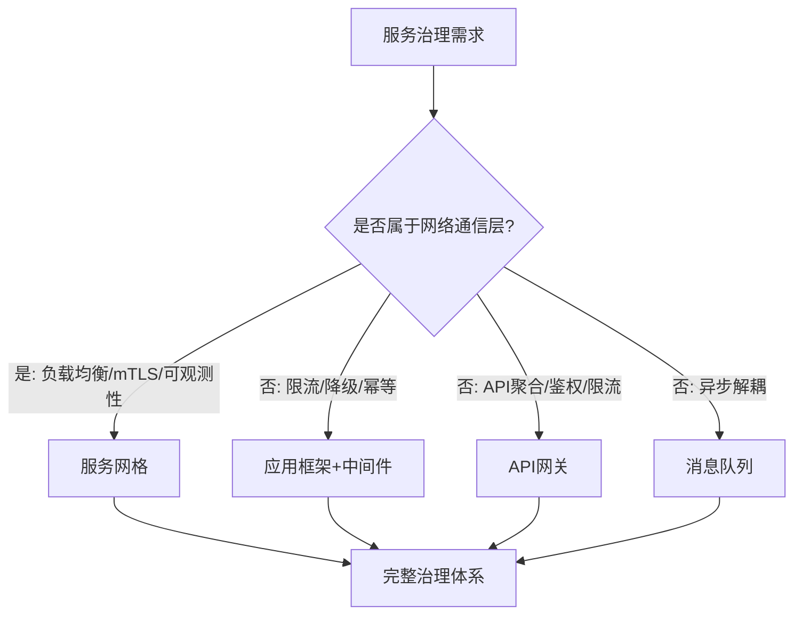
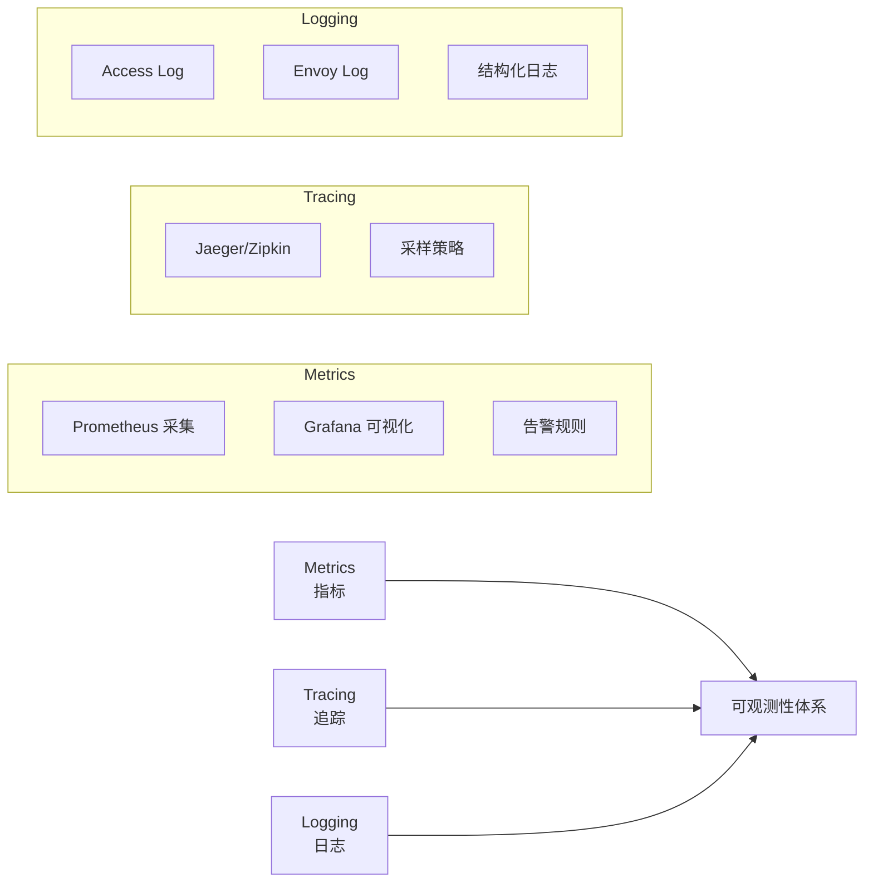
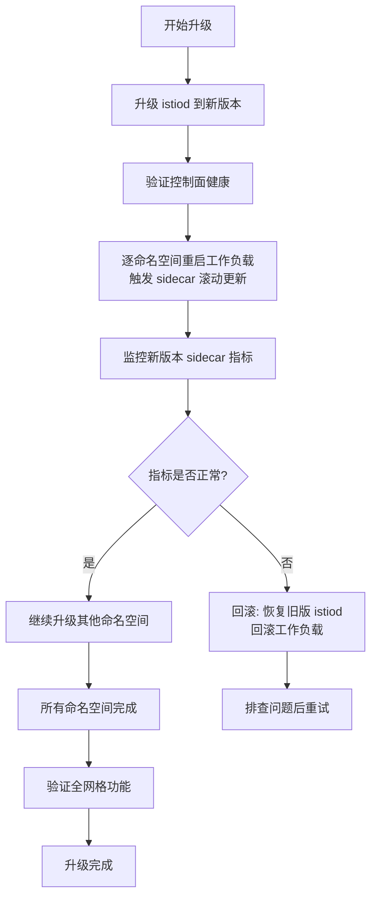

## 常见误区与避坑指南

服务网格（Service Mesh）将原本分散在各应用中的网络逻辑——负载均衡、熔断、重试、可观测性、mTLS——集中到基础设施层。架构优势显著，但在实际落地过程中，团队因认知偏差、架构选型失当或运维经验不足而踩坑的案例屡见不鲜。

本节梳理了生产环境中高频出现的 **八大误区**，从认知层面的根本错误到具体配置中的细节陷阱，帮助团队在引入服务网格时少走弯路。

---

### 误区一：把服务网格当作银弹——认为引入即解决所有问题

**典型表现**

- 引入 Istio 后停止优化应用代码，期望 sidecar 自动解决延迟、吞吐量问题
- 认为有了服务网格就不需要 API 网关
- 将服务网格视为微服务治理的唯一解，忽略其他治理手段（限流、降级框架等）

**根因分析**

服务网格的本质是 **基础设施层的网络代理**，它解决的是服务间通信的横切关注点（cross-cutting concerns），而非业务逻辑问题。Istio 官方文档明确指出，服务网格无法替代以下能力：

- 应用层的重试逻辑（业务级幂等性）
- 消息队列的解耦能力
- 数据库层面的连接池管理
- 缓存策略与一致性保证

**正确做法**



采用 **分层治理** 的思路：

| 治理层级 | 负责方 | 典型能力 | 工具示例 |
|---------|--------|---------|---------|
| 基础设施层 | 服务网格 | mTLS、流量路由、分布式追踪 | Istio、Linkerd |
| 应用框架层 | 开发团队 | 重试、超时、限流、降级 | Resilience4j、Sentinel |
| 网关层 | 平台团队 | API 聚合、认证鉴权、WAF | Kong、APISIX |
| 消息中间件层 | 架构团队 | 事件驱动、异步解耦 | Kafka、RabbitMQ |

---

### 误区二：在所有场景下都部署 Sidecar 模式

**典型表现**

- 将服务网格强制应用到数据库连接（MySQL、PostgreSQL）
- 对延迟极度敏感的高频调用（<1ms P99 要求）也走 sidecar
- 所有命名空间统一注入 sidecar，不做区分
- 在 batch job、定时任务中也注入 sidecar

**根因分析**

Sidecar 代理每次请求都会经过 **两次额外的网络跳转**（应用→sidecar→目标 sidecar→目标应用），这带来：

- **延迟开销**：每跳增加 1-5ms（取决于策略复杂度），高频调用下累积效应显著
- **资源开销**：每个 sidecar 消耗约 50-100MB 内存 + 0.1-0.5 CPU 核
- **连接池竞争**：sidecar 会管理自己的连接池，与应用侧连接池形成双层竞争

对数据库场景的特殊影响：

- 数据库连接通常是长连接 + 连接池，sidecar 拦截后会破坏连接复用语义
- 数据库协议（MySQL binary protocol、PostgreSQL extended query）经过代理后可能产生兼容性问题
- 事务语义（两阶段提交、Savepoint）在代理层无法正确传播

**正确做法**

```yaml
# 使用 namespace 级别的注入控制
apiVersion: v1
kind: Namespace
metadata:
  name: sensitive-workloads
  labels:
    istio-injection: disabled  # 禁用自动注入
---
# 仅对需要的 Deployment 手动注入
apiVersion: apps/v1
kind: Deployment
metadata:
  name: web-api
  labels:
    sidecar.istio.io/inject: "true"  # 手动启用
spec:
  template:
    metadata:
      labels:
        sidecar.istio.io/inject: "true"
```

**应该跳过 sidecar 的场景：**

| 场景 | 原因 | 替代方案 |
|------|------|---------|
| 数据库直连 | 协议兼容性、连接池破坏 | 数据库中间件或 Operator 管理的连接池 |
| 极低延迟调用（<1ms） | sidecar 延迟不可接受 | 共享进程模式（ambient mesh）或应用内 SDK |
| Batch Job | 生命周期短暂，启动开销浪费 | 仅在需要可观测性时注入 |
| DaemonSet 工作负载 | 与节点级代理冲突 | 使用特权模式或 hostNetwork |

---

### 误区三：过度配置——堆砌所有高级特性

**典型表现**

- 为每个 VirtualService 配置复杂的流量规则（金丝雀 + 灰度 + 故障注入 + 超时 + 重试）
- 无差别启用所有 Istio 插件（Kiali + Jaeger + Prometheus + Grafana + Zipkin）
- 在所有路径上开启分布式追踪（包括健康检查接口）
- 为每个服务配置自定义 EnvoyFilter

**根因分析**

过度配置带来三个核心问题：

1. **运维复杂度指数增长**：配置项之间存在隐式依赖，改动一处可能触发连锁反应
2. **性能损耗叠加**：每个策略（重试、超时、限流、追踪采样）都会增加 CPU 和内存开销
3. **故障排查困难**：多层策略叠加后，行为难以预测，问题定位变成解谜游戏

**正确做法**

遵循 **渐进式启用** 原则：

阶段 1（第 1-2 周）：基础连通性
  ├── 部署 sidecar，验证服务间通信
  └── 开启基本的 mTLS 和流量路由

阶段 2（第 3-4 周）：核心可靠性
  ├── 添加超时和重试策略（仅关键路径）
  ├── 配置健康检查和就绪探针
  └── 开启基础监控指标

阶段 3（第 5-8 周）：高级流量管理
  ├── 金丝雀发布规则
  ├── 故障注入测试
  └── 分布式追踪（采样率 1%-5%）

阶段 4（持续优化）：精细化调优
  ├── 根据实际数据调整参数
  ├── 移除不必要的策略
  └── 性能基准测试对比

**配置精简示例——只关注关键路径：**

```yaml
# 简洁有效的 VirtualService 配置
apiVersion: networking.istio.io/v1beta1
kind: VirtualService
metadata:
  name: order-service
spec:
  hosts:
    - order-service
  http:
    - match:
        - uri:
            prefix: /api/v1/orders
      route:
        - destination:
            host: order-service
            subset: stable
      timeout: 5s
      retries:
        attempts: 3
        perTryTimeout: 2s
        retryOn: 5xx,reset,connect-failure
      # 不在健康检查路径上配置复杂策略
    - match:
        - uri:
            exact: /healthz
      route:
        - destination:
            host: order-service
      timeout: 1s
      retries: {}  # 健康检查不重试
```

---

### 误区四：忽视监控和可观测性——部署后无感知

**典型表现**

- 部署服务网格后未接入任何监控系统
- 不知道 sidecar 的资源消耗（CPU、内存、连接数）
- 没有配置 Grafana Dashboard 或告警规则
- 忽略 Envoy 的内部统计指标（`envoy_cluster_upstream_cx_total` 等）
- 未启用 access log 或未对接日志平台

**根因分析**

服务网格引入了新的基础设施层，如果缺乏可观测性，相当于在黑盒中运行。常见后果：

- 性能退化无法及时发现（sidecar 内存泄漏、连接池耗尽）
- 流量规则的变更效果无法量化验证
- 故障发生时缺乏数据支撑，只能靠猜

**正确做法**

构建 **三层可观测性** 体系：



**关键监控指标清单：**

| 指标类别 | 指标名称 | 含义 | 告警阈值建议 |
|---------|---------|------|------------|
| 网络 | `istio_requests_total` | 请求总数 | — |
| 网络 | `istio_request_duration_milliseconds` | 请求延迟 P50/P99 | P99 > 2s |
| 网络 | `istio_request_duration_milliseconds_bucket` | 延迟分布 | — |
| 网络 | `istio_response_code` | 响应码分布 | 5xx > 1% |
| 资源 | `container_memory_usage_bytes` | sidecar 内存 | > 150MB |
| 资源 | `container_cpu_usage_seconds_total` | sidecar CPU | > 0.5 核 |
| 连接 | `envoy_cluster_upstream_cx_total` | 上游连接数 | 突增 200% |
| 连接 | `envoy_cluster_upstream_cx_overflow` | 连接溢出 | > 0 |
| 错误 | `envoy_cluster_upstream_cx_connect_fail` | 连接失败 | 持续增长 |
| 资源 | `envoy_cluster_circuit_breakers_default_cx_open` | 熔断开启 | > 0 |

**Grafana Dashboard 推荐配置：**

```json
{
  "dashboard": {
    "title": "Service Mesh Overview",
    "panels": [
      {
        "title": "请求成功率",
        "expr": "1 - (sum(rate(istio_requests_total{response_code=~\"5.*\"}[5m])) by (destination_service) / sum(rate(istio_requests_total[5m])) by (destination_service))",
        "thresholds": [
          { "value": 0.99, "color": "red" },
          { "value": 0.999, "color": "green" }
        ]
      },
      {
        "title": "P99 延迟",
        "expr": "histogram_quantile(0.99, sum(rate(istio_request_duration_milliseconds_bucket[5m])) by (le, destination_service))"
      }
    ]
  }
}
```

---

### 误区五：安全配置形同虚设——mTLS 只是开了没验证

**典型表现**

- 启用 mTLS 后不做端到端验证，误以为全网格已加密
- PERMISSIVE 模式长期不切换到 STRICT 模式
- 未配置授权策略（AuthorizationPolicy），服务间完全开放
- 证书轮换策略缺失，默认使用 Istio 自管 CA
- 在生产环境使用自签名 CA 且不做定期轮换

**根因分析**

Istio 的安全模型有多个层级，仅开启 mTLS 只是第一步：

1. **mTLS 只解决传输加密**：不解决访问控制（谁能访问谁）
2. **PERMISSIVE 模式下仍接受明文流量**：无法防止降级攻击
3. **默认 CA 是 Istio 自签名**：生产环境应集成外部 CA（如 cert-manager + Vault）
4. **证书默认 24 小时轮换**：高安全场景需缩短

**正确做法**

安全配置的完整路径：

```yaml
# 1. 全局 STRICT 模式
apiVersion: security.istio.io/v1
kind: PeerAuthentication
metadata:
  name: default
  namespace: istio-system
spec:
  mtls:
    mode: STRICT
---
# 2. 命名空间级授权策略——仅允许特定服务间通信
apiVersion: security.istio.io/v1
kind: AuthorizationPolicy
metadata:
  name: order-service-policy
  namespace: production
spec:
  selector:
    matchLabels:
      app: order-service
  action: ALLOW
  rules:
    - from:
        - source:
            principals:
              - "cluster.local/ns/production/sa/api-gateway"
              - "cluster.local/ns/production/sa/payment-service"
      to:
        - operation:
            methods: ["GET", "POST"]
            paths: ["/api/v1/orders/*"]
---
# 3. 拒绝所有未明确允许的流量
apiVersion: security.istio.io/v1
kind: AuthorizationPolicy
metadata:
  name: deny-all
  namespace: production
spec:
  {}  # 空规则 = DENY ALL
```

**生产环境安全审计清单：**

| 审计项 | 检查方法 | 预期结果 |
|--------|---------|---------|
| mTLS 模式 | `istioctl x describe pod <pod>` | STRICT（无明文流量） |
| 授权策略 | `kubectl get authorizationpolicy -A` | 每个服务都有策略 |
| 证书链 | `openssl s_client -connect <svc>:8043` | 由可信 CA 签发 |
| 证书轮换 | 检查 istiod 配置 | 默认 24h 或更短 |
| Secret 访问控制 | RBAC 审计 | 仅 istiod 可读写 |
| 未加密流量告警 | 监控 `istio_tcp_connections_closed` | 无非 mTLS 连接 |

---

### 误区六：Sidecar 资源配置不当——要么浪费要么 OOM

**典型表现**

- 使用 Istio 默认的 sidecar 资源配置（requests: 100m CPU, 128Mi memory）
- 所有服务使用相同的 sidecar 资源配置，不做差异化
- 未设置资源上限（limits），导致 sidecar 在高负载下 OOM
- 未做压测就上线，运行后才发现资源瓶颈

**根因分析**

Sidecar 的资源消耗与 **服务的流量模式** 直接相关：

- 高 QPS 服务（>1000 RPS）：连接数和缓冲区需求大，CPU 密集
- 高吞吐量服务（大文件上传/下载）：内存缓冲区需求高
- 低流量服务：默认配置通常足够，甚至浪费

Istio 默认配置在高负载下常见的问题：

- 连接池上限不足（`maxConnections: 1024`），导致新连接被拒绝
- 缓冲区不够（`initialStreamWindowSize`），gRPC 流控受阻
- 并发限流过严（`maxConcurrentStreams: 2147483647`），实际受 TCP 层影响

**正确做法**

根据服务特征分级配置：

```yaml
# 高流量服务的 sidecar 资源配置
apiVersion: apps/v1
kind: Deployment
metadata:
  name: payment-service
spec:
  template:
    metadata:
      annotations:
        # 资源配置
        sidecar.istio.io/proxyCPU: "200m"
        sidecar.istio.io/proxyCPULimit: "1000m"
        sidecar.istio.io/proxyMemory: "256Mi"
        sidecar.istio.io/proxyMemoryLimit: "512Mi"
        # 连接池调优
        proxy.istio.io/config: |
          concurrency: 4  # 工作线程数，匹配 CPU
          tracing:
            sampling: 0.01  # 1% 采样率
          proxyStatsMatcher:
            inclusionRegexps:
            - ".*upstream_rq_retry.*"
            - ".*upstream_cx_destroy.*"
    spec:
      containers:
        - name: app
          resources:
            requests:
              cpu: "500m"
              memory: "512Mi"
            limits:
              cpu: "2000m"
              memory: "1Gi"
```

**资源分级参考表：**

| 服务等级 | QPS 范围 | Sidecar CPU | Sidecar Memory | 连接池上限 |
|---------|---------|-------------|---------------|-----------|
| 低流量 | <100 | 100m-200m | 128Mi-256Mi | 默认 |
| 中流量 | 100-1000 | 200m-500m | 256Mi-512Mi | 2x 默认 |
| 高流量 | >1000 | 500m-1000m | 512Mi-1Gi | 4x 默认 |
| 极高流量 | >5000 | 1000m-2000m | 1Gi-2Gi | 自定义 |

---

### 误区七：升级策略缺失——大版本升级导致全网中断

**典型表现**

- Istio 大版本升级时直接全量替换（从 1.18 直接升到 1.20）
- 升级前不做数据面验证，盲目相信向后兼容
- 没有回滚方案，升级失败后只能手动恢复
- 控制面和数据面同时升级，无法独立验证

**根因分析**

Istio 的升级有其特殊性：

1. **控制面（istiod）** 和 **数据面（sidecar）** 的版本可以有差异，但有兼容性范围限制
2. **CRD 变更** 在大版本升级时可能不兼容旧版本
3. **Envoy API 版本** 升级可能导致旧配置失效
4. **网络配置** 变更可能导致新旧 sidecar 之间的通信异常

**正确做法**

Istio 官方推荐的 **金丝雀升级** 流程：



**升级前检查清单：**

```bash
# 1. 检查当前版本兼容矩阵
istioctl version

# 2. 预检升级兼容性
istioctl x precheck --filename <new-version-profile.yaml>

# 3. 备份当前配置
kubectl get istiooperator -n istio-system -o yaml > istio-backup.yaml
kubectl get virtualservices,destinationrules,gateways,peerauthentications,authorizationpolicies -A -o yaml > mesh-config-backup.yaml

# 4. 检查 CRD 兼容性
kubectl get crd | grep istio | while read crd rest; do
  echo "Checking $crd..."
  kubectl api-resources --api-group=$(echo $crd | cut -d. -f1-2) 2>/dev/null || echo "WARNING: $crd may need manual CRD update"
done

# 5. 验证数据面/控制面版本差异
istioctl proxy-status
# 确保所有 proxy 版本在控制面支持的范围内
```

---

### 误区八：忽视团队能力建设——工具先行，人员未就绪

**典型表现**

- 引入服务网格前未做团队培训，运维人员不理解 sidecar 工作原理
- 开发团队不了解流量规则的配置方式，完全依赖平台团队
- 没有制定服务网格的使用规范和最佳实践文档
- 故障演练缺失，出了问题才知道怎么排查

**根因分析**

服务网格引入了一个新的基础设施层，它需要 **平台团队、开发团队、运维团队** 三方协作：

- 平台团队：安装、升级、维护服务网格控制面
- 开发团队：配置 VirtualService、DestinationRule 等资源
- 运维团队：监控、告警、故障排查

任何一个角色的缺失都会导致服务网格从"基础设施赋能"变成"基础设施负担"。

**正确做法**

建立 **渐进式的团队能力建设** 路径：


**各阶段关键活动：**

| 阶段 | 目标 | 关键活动 | 交付物 |
|------|------|---------|--------|
| 认知建设 | 全员理解原理 | 技术分享、架构评审、白皮书 | 《服务网格技术白皮书》 |
| 小规模试点 | 1-2 个服务验证 | 试点服务选型、问题清单、性能基线 | 《试点报告》+《操作手册》 |
| 扩展推广 | 覆盖核心服务 | 配置模板、CI/CD 集成、监控大盘 | 《配置规范》+《故障 Runbook》 |
| 持续运营 | 稳定运行 | 故障演练、升级流程、容量规划 | 《运维手册》+《应急预案》 |

**故障演练（Chaos Mesh）示例：**

```yaml
# 模拟 sidecar OOM 场景，验证应用降级能力
apiVersion: chaos-mesh.org/v1alpha1
kind: PodChaos
metadata:
  name: sidecar-oom-chaos
  namespace: production
spec:
  action: pod-kill
  mode: one
  selector:
    namespaces:
      - production
    labelSelectors:
      app: order-service
  scheduler:
    cron: "@every 24h"
  duration: "5m"
```

---

### 误区总结与自检清单

在引入和运维服务网格的过程中，可以用以下清单做定期自检：

| 误区 | 自检问题 | 健康状态判断标准 |
|------|---------|----------------|
| 银弹思维 | 是否过度依赖网格能力？ | 应用层治理与网格治理职责清晰 |
| 全面部署 | 是否所有工作负载都注入了 sidecar？ | 至少排除数据库、batch job |
| 过度配置 | 配置文件是否简洁可维护？ | 每个 VirtualService 规则 <10 条 |
| 忽视监控 | 是否有网格级监控大盘？ | 三大支柱（Metrics/Tracing/Logging）齐全 |
| 安全缺失 | mTLS 是否真正生效？ | STRICT 模式 + 授权策略覆盖 |
| 资源不当 | sidecar 是否做过压测调优？ | 按流量等级分级配置 |
| 升级失控 | 是否有升级 SOP？ | 金丝雀升级 + 回滚方案 |
| 人员不足 | 团队是否具备运维能力？ | 有规范文档 + 故障演练 |

---

### 延伸阅读

- Istio 官方文档：[常见问题](https://istio.io/latest/docs/ops/common-problems/)
- CNCF Service Mesh Landscape：[服务网格生态全景](https://landscape.cncf.io/card-mode?category=service-mesh&group=projects-and-products)
- Envoy Proxy 文档：[性能调优指南](https://www.envoyproxy.io/docs/envoy/latest/configuration/overview/performance)
- 《Production Ready Kubernetes》：第 9 章 服务网格生产化实践
