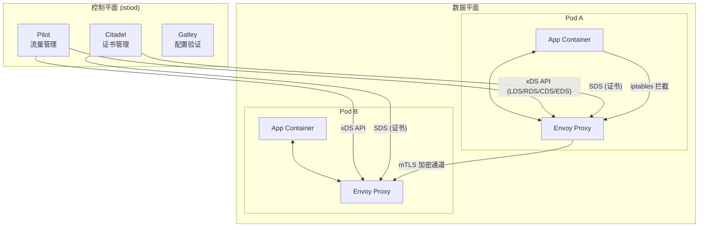

# 练习方法

本章的练习方法遵循"理解→搭建→配置→排障→优化→设计"六阶递进路径，每个练习都以真实场景为载体，覆盖从入门到精通的完整能力谱。建议配合第 58 章各节理论内容同步进行，理论读完一节就做对应练习，效果最佳。

---

## 练习一：架构理解与概念辨析（预计 30 分钟）

**目标**：能独立画出服务网格的核心架构图，用自己的话解释 Sidecar、控制平面、数据平面、xDS API 等概念，并能区分 Istio 与 Linkerd 的设计哲学差异。

### 步骤一：精读理论并提取核心概念（10 分钟）

阅读本章理论基础四节后，列出以下核心概念并逐一写出定义：

| 概念 | 用自己的话解释（不能照抄原文） |
|------|--------------------------|
| Sidecar 模式 | _（示例：每个服务旁边放一个"贴身保镖"，所有进出通信都经过保镖处理，服务本体不需要知道安全、路由这些事）_ |
| 控制平面 vs 数据平面 | |
| xDS API 体系（LDS/RDS/CDS/EDS/SDS） | |
| VirtualService 的路由决策逻辑 | |
| DestinationRule 的流量策略含义 | |
| mTLS 双向认证的工作流程 | |
| Ambient Mesh vs 传统 Sidecar 的区别 | |

### 步骤二：画出服务网格架构图（10 分钟）

使用 Mermaid 或手绘完成以下三张图：

**图 1：Istio 整体架构图**

标注以下组件及其关系：
- 控制平面：istiod（Pilot + Citadel + Galley）
- 数据平面：Envoy Proxy（每个 Pod 一个）
- xDS API 连接方向
- 应用容器与 Sidecar 的流量路径



**图 2：请求在服务网格中的完整生命周期**

标注一个 HTTP 请求从客户端发出到服务端响应的完整路径（经过几次 iptables 拦截、几次 Envoy 处理、几次 TLS 握手）。

**图 3：控制平面对比图**

画出 Istio 与 Linkerd 的架构差异——重点标注数据平面的代理实现（Envoy vs linkerd2-proxy）、控制平面组件、部署复杂度。

### 步骤三：概念辨析测试（10 分钟）

回答以下问题，每个问题用 2-3 句话说明：

1. **为什么服务网格选择 Sidecar 模式而不是在应用中嵌入 SDK？**
   - 提示：从技术栈绑定、升级成本、可观测性碎片化三个角度分析

2. **iptables 拦截和 eBPF 拦截的性能差异有多大？各自适用什么场景？**
   - 提示：iptables ~2ms 延迟，eBPF ~0.5ms 延迟，eBPF 需要 Linux 4.19+

3. **VirtualService 和 DestinationRule 的职责分别是什么？为什么它们必须配合使用？**
   - 提示：VirtualService 负责"去哪"（路由决策），DestinationRule 负责"怎么处理"（负载均衡、熔断、连接池）

4. **PERMISSIVE 和 STRICT mTLS 模式有什么区别？什么场景用哪个？**
   - 提示：PERMISSIVE 允许明文和加密共存（迁移期）， STRICT 只允许加密（生产环境）

5. **xDS API 中的 SDS 是做什么的？证书轮换机制如何工作？**

**检查标准**：
- [ ] 能画出完整的 Istio 架构图，标注所有核心组件
- [ ] 能画出请求在网格中的完整生命周期
- [ ] 能用非技术语言向同事解释服务网格的核心价值
- [ ] 能区分 Istio 和 Linkerd 的设计差异
- [ ] 5 个辨析问题全部有实质内容（非空话套话）

---

## 练习二：环境搭建与 Bookinfo 跑通（预计 60 分钟）

**目标**：在本地或测试集群中搭建完整的 Istio 环境，成功部署 Bookinfo 示例应用，验证 Sidecar 注入和流量路由生效。

### 步骤一：安装 Istio（15 分钟）

```bash
# 1. 下载 Istio（以 1.22.x 为例，选最新稳定版）
curl -L https://istio.io/downloadIstio | ISTIO_VERSION=1.22.2 sh -
cd istio-1.22.2
export PATH=$PWD/bin:$PATH

# 2. 验证安装
istioctl version --remote=false

# 3. 使用 demo 配置安装（适合学习和测试）
# 为什么选 demo 而不是 default？demo 包含 Grafana、Jaeger、Kiali 等全套可观测性组件
istioctl install --set profile=demo -y

# 4. 验证安装是否成功
istioctl verify-install

# 5. 检查 istiod 是否正常运行
kubectl get pods -n istio-system
# 期望输出：istiod-xxx  Running  1/1

# 6. 检查 Istio 分析器是否报告问题
istioctl analyze --all-namespaces
```

**常见安装问题排查**：

| 问题 | 原因 | 解决方案 |
|------|------|---------|
| `istioctl install` 超时 | 集群网络不通或资源不足 | 检查 `kubectl cluster-info`，确保节点有足够 CPU/内存 |
| istiod CrashLoopBackOff | 配置冲突或 CRD 未安装 | `kubectl delete pods -n istio-system -l app=istiod` 重启 |
| `istioctl verify-install` 报错 | 版本不匹配 | 确保 kubectl 和 istioctl 使用相同版本的 API |

### 步骤二：部署 Bookinfo 应用（15 分钟）

```bash
# 1. 创建测试命名空间
kubectl create namespace bookinfo

# 2. 启用自动 Sidecar 注入
kubectl label namespace bookinfo istio-injection=enabled

# 3. 验证命名空间标签
kubectl get namespace bookinfo --show-labels
# 期望输出包含：istio-injection=enabled

# 4. 部署 Bookinfo 应用
kubectl apply -f samples/bookinfo/platform/kube/bookinfo.yaml -n bookinfo

# 5. 等待所有 Pod 就绪（每个 Pod 应包含 2 个容器：app + istio-proxy）
kubectl get pods -n bookinfo
# 期望：所有 Pod 的 READY 列显示 2/2
```

**关键验证点**：每个 Pod 必须有 2/2 READY（app 容器 + istio-proxy sidecar）。如果只有 1/2，说明 Sidecar 注入失败，检查命名空间标签。

### 步骤三：配置流量路由（20 分钟）

```bash
# 1. 创建 Istio Gateway（入口网关）
kubectl apply -f samples/bookinfo/networking/bookinfo-gateway.yaml -n bookinfo

# 2. 获取网关访问地址
export INGRESS_PORT=$(kubectl -n istio-system get service istio-ingressgateway \
  -o jsonpath='{.spec.ports[?(@.name=="http2")].nodePort}')
export INGRESS_HOST=$(kubectl get po -l istio-ingressgateway \
  -n istio-system -o jsonpath='{.items[0].status.hostIP}')
echo "访问地址: http://$INGRESS_HOST:$INGRESS_PORT/productpage"

# 3. 验证应用可访问（应返回 HTML 页面）
curl -s http://$INGRESS_HOST:$INGRESS_PORT/productpage | head -20

# 4. 配置 VirtualService 将所有流量路由到 v1（稳定版本）
kubectl apply -f samples/bookinfo/networking/virtual-service-all-v1.yaml -n bookinfo

# 5. 多次刷新页面，确认只看到 v1 的评分（1 星）
# 这说明路由规则已生效，所有流量都被导向 v1
```

### 步骤四：验证可观测性组件（10 分钟）

```bash
# 1. 部署 Kiali 仪表盘（服务拓扑可视化）
kubectl apply -f samples/addons/kiali.yaml -n istio-system

# 2. 部署 Prometheus（指标收集）
kubectl apply -f samples/addons/prometheus.yaml -n istio-system

# 3. 部署 Grafana（仪表盘展示）
kubectl apply -f samples/addons/grafana.yaml -n istio-system

# 4. 启用端口转发访问 Kiali
kubectl port-forward -n istio-system svc/kiali 20001:20001 &amp;
# 浏览器访问 http://localhost:20001
# 用户名: admin，密码: admin

# 5. 在 Kiali 中查看 Bookinfo 服务拓扑图
# 应该能看到：productpage → reviews → ratings
#                 productpage → details
```

**检查标准**：
- [ ] Istio 安装成功，`istioctl verify-install` 无报错
- [ ] Bookinfo 所有 Pod 状态 2/2
- [ ] 通过网关 URL 能访问 productpage 页面
- [ ] VirtualService 路由规则生效（只看到 v1 版本内容）
- [ ] Kiali 能展示服务拓扑图

---

## 练习三：流量管理实战（预计 60 分钟）

**目标**：掌握金丝雀发布、故障注入、流量镜像三种核心流量管理能力，能独立配置并验证效果。

### 步骤一：金丝雀发布——渐进式流量分割（20 分钟）

**场景**：reviews 服务有 v1（无星级）、v2（黑色星级）、v3（红色星级）三个版本，需要先将 10% 流量切到 v3 测试，确认无问题后逐步扩大。

```yaml
# 1. 先将所有流量导向 v1
kubectl apply -f - <<'EOF'
apiVersion: networking.istio.io/v1beta1
kind: VirtualService
metadata:
  name: reviews
  namespace: bookinfo
spec:
  hosts:
    - reviews
  http:
    - route:
        - destination:
            host: reviews
            subset: v1
          weight: 100
EOF

# 2. 定义版本子集
kubectl apply -f - <<'EOF'
apiVersion: networking.istio.io/v1beta1
kind: DestinationRule
metadata:
  name: reviews
  namespace: bookinfo
spec:
  host: reviews
  subsets:
    - name: v1
      labels:
        version: v1
    - name: v2
      labels:
        version: v2
    - name: v3
      labels:
        version: v3
EOF

# 3. 第一轮：10% 流量到 v3，90% 到 v1
kubectl apply -f - <<'EOF'
apiVersion: networking.istio.io/v1beta1
kind: VirtualService
metadata:
  name: reviews
  namespace: bookinfo
spec:
  hosts:
    - reviews
  http:
    - route:
        - destination:
            host: reviews
            subset: v1
          weight: 90
        - destination:
            host: reviews
            subset: v3
          weight: 10
EOF

# 4. 验证：多次刷新 productpage 页面（至少 20 次）
# 统计看到红色星级（v3）的比例，应该接近 10%
# 可以用脚本自动化验证：
for i in $(seq 1 100); do
  curl -s http://$INGRESS_HOST:$INGRESS_PORT/productpage \
    -H "Cookie: bookinfo_reviews=ratings-v3" | grep -c "red"
done | awk '{sum+=$1} END {print "v3 命中率: " sum "%"}'

# 5. 第二轮：50/50 分割
# 调整 weight 为 v1:50, v3:50，再次验证

# 6. 第三轮：100% 切到 v3（全量发布）
# 调整 weight 为 v3:100
```

**思考题**：
- 金丝雀发布过程中，如果 v3 的错误率飙升到 5%，应该怎么处理？
- 答：立即回滚 VirtualService 将 weight 调回 v1:100，并结合 `istioctl analyze` 检查配置

### 步骤二：故障注入——测试系统弹性（20 分钟）

**场景**：模拟 ratings 服务出现延迟和间歇性错误，验证上游 reviews 服务的容错能力。

```yaml
# 1. 注入 5 秒延迟（10% 的请求）
kubectl apply -f - <<'EOF'
apiVersion: networking.istio.io/v1beta1
kind: VirtualService
metadata:
  name: ratings
  namespace: bookinfo
spec:
  hosts:
    - ratings
  http:
    - fault:
        delay:
          percentage:
            value: 10.0
          fixedDelay: 5s
      route:
        - destination:
            host: ratings
            subset: v1
EOF

# 2. 验证延迟效果
# 多次访问 productpage，约 10% 的请求会明显变慢（5 秒延迟）
# 在浏览器开发者工具 Network 面板中观察 TTFB 变化

# 3. 同时注入 5xx 错误（5% 的请求返回 503）
kubectl apply -f - <<'EOF'
apiVersion: networking.istio.io/v1beta1
kind: VirtualService
metadata:
  name: ratings
  namespace: bookinfo
spec:
  hosts:
    - ratings
  http:
    - fault:
        delay:
          percentage:
            value: 10.0
          fixedDelay: 5s
        abort:
          percentage:
            value: 5.0
          httpStatus: 503
      route:
        - destination:
            host: ratings
            subset: v1
EOF

# 4. 验证错误注入效果
# 约 5% 的请求会看到 ratings 不可用（显示 "Sorry, product ratings are currently unavailable"）

# 5. 清除故障注入（重要！测试完毕后必须恢复）
kubectl delete virtualservice ratings -n bookinfo
```

**思考题**：
- 故障注入和混沌工程有什么区别？
- 答：故障注入是混沌工程的一种手段。混沌工程强调在生产环境对系统进行可控实验，验证系统在真实故障下的表现；故障注入是具体的技术手段，用于模拟延迟、错误、网络分区等故障场景。

### 步骤三：流量镜像——零风险预发布验证（20 分钟）

**场景**：将生产流量镜像一份到新版本，观察新版本在真实流量下的表现，不影响用户体验。

```yaml
# 1. 将 production 流量镜像到 v3
kubectl apply -f - <<'EOF'
apiVersion: networking.istio.io/v1beta1
kind: VirtualService
metadata:
  name: reviews
  namespace: bookinfo
spec:
  hosts:
    - reviews
  http:
    - route:
        - destination:
            host: reviews
            subset: v1
          weight: 100
      mirror:
        host: reviews
        subset: v3
      mirrorPercentage:
        value: 100.0
EOF

# 2. 验证镜像效果
# 用户看到的仍然是 v1 的内容（无星级）
# 但 v3 同时也在处理相同请求（后台运行，不返回给用户）
# 可以通过 Kiali 或 Prometheus 查看 v3 的请求指标

# 3. 通过 Prometheus 查询 v3 的实际处理量
kubectl port-forward -n istio-system svc/prometheus 9090:9090 &amp;
# 在 Grafana 或 Prometheus 查询面板执行：
# istio_requests_total{destination_version="v3"}

# 4. 观察 v3 的错误率和延迟
# 如果 v3 表现正常，就可以安全地将流量切换到 v3

# 5. 清除镜像配置
kubectl delete virtualservice reviews -n bookinfo
```

**检查标准**：
- [ ] 金丝雀发布：成功实现 10%→50%→100% 的流量分割
- [ ] 故障注入：成功模拟延迟和错误，能观察到系统行为变化
- [ ] 流量镜像：用户无感知，新版本在后台处理真实流量
- [ ] 所有测试后都恢复了原始配置

---

## 练习四：安全通信配置（预计 45 分钟）

**目标**：为 Bookinfo 应用配置 mTLS 全链路加密和细粒度授权策略，验证安全策略生效。

### 步骤一：启用严格 mTLS（15 分钟）

```yaml
# 1. 查看当前 mTLS 状态（应为 PERMISSIVE）
istioctl x describe pod $(kubectl get pods -n bookinfo -l app=productpage \
  -o jsonpath='{.items[0].metadata.name}') -n bookinfo

# 2. 为 bookinfo 命名空间启用严格 mTLS
kubectl apply -f - <<'EOF'
apiVersion: security.istio.io/v1beta1
kind: PeerAuthentication
metadata:
  name: default
  namespace: bookinfo
spec:
  mtls:
    mode: STRICT
EOF

# 3. 验证 mTLS 生效
# 重启 Pod 使新策略生效
kubectl rollout restart deployment productpage-v1 -n bookinfo
kubectl rollout restart deployment reviews-v1 -n bookinfo
kubectl rollout restart deployment ratings-v1 -n bookinfo
kubectl rollout restart deployment details-v1 -n bookinfo

# 等待 Pod 就绪
kubectl get pods -n bookinfo -w

# 4. 验证加密通道
istioctl x describe pod $(kubectl get pods -n bookinfo -l app=productpage \
  -o jsonpath='{.items[0].metadata.name}') -n bookinfo
# 应显示：mTLS: STRICT

# 5. 测试：如果某个服务不在网格内，严格模式会导致连接失败
# 这正是严格模式的安全价值——拒绝任何未加密的流量
```

### 步骤二：配置细粒度授权（15 分钟）

```yaml
# 1. 创建命名空间级别的默认拒绝策略（零信任起点）
kubectl apply -f - <<'EOF'
apiVersion: security.istio.io/v1beta1
kind: AuthorizationPolicy
metadata:
  name: deny-all
  namespace: bookinfo
spec:
  {}  # 空 spec = 拒绝所有流量
EOF

# 2. 只允许 productpage 访问 details 和 reviews
kubectl apply -f - <<'EOF'
apiVersion: security.istio.io/v1beta1
kind: AuthorizationPolicy
metadata:
  name: allow-productpage-to-details-reviews
  namespace: bookinfo
spec:
  selector:
    matchLabels:
      app: details
  action: ALLOW
  rules:
    - from:
        - source:
            principals: ["cluster.local/ns/bookinfo/sa/bookinfo-productpage"]
      to:
        - operation:
            methods: ["GET"]
---
apiVersion: security.istio.io/v1beta1
kind: AuthorizationPolicy
metadata:
  name: allow-productpage-to-reviews
  namespace: bookinfo
spec:
  selector:
    matchLabels:
      app: reviews
  action: ALLOW
  rules:
    - from:
        - source:
            principals: ["cluster.local/ns/bookinfo/sa/bookinfo-productpage"]
      to:
        - operation:
            methods: ["GET"]
EOF

# 3. 验证授权策略
# productpage 应能正常访问 details 和 reviews
# 但 reviews 不能直接访问 ratings（除非显式允许）
```

### 步骤三：验证与清理（15 分钟）

```bash
# 1. 验证安全策略不影响正常业务
curl -s http://$INGRESS_HOST:$INGRESS_PORT/productpage | head -10
# 应正常返回页面

# 2. 查看 Envoy 的访问日志，确认 mTLS 和授权策略生效
kubectl logs $(kubectl get pods -n bookinfo -l app=productpage \
  -o jsonpath='{.items[0].metadata.name}') -c istio-proxy -n bookinfo | tail -5
# 日志中应显示 upstream cluster 包含 mTLS 信息

# 3. 使用 istioctl 检查授权策略是否正确应用
istioctl analyze --all-namespaces

# 4. 清除安全策略（恢复原状）
kubectl delete peerauthentication default -n bookinfo
kubectl delete authorizationpolicy --all -n bookinfo
```

**检查标准**：
- [ ] 严格 mTLS 已启用，所有服务间通信加密
- [ ] 零信任授权策略已配置，默认拒绝 + 按需放行
- [ ] 业务功能不受安全策略影响
- [ ] 能从 Envoy 日志中确认 mTLS 生效

---

## 练习五：故障排查实战（预计 45 分钟）

**目标**：模拟三种常见的服务网格故障场景，使用 istioctl、Envoy 日志、Prometheus 等工具独立定位和解决问题。

### 场景一：Sidecar 注入失败（15 分钟）

**症状**：部署新服务后，Pod 只有 1/1 READY，服务无法正常通信。

```bash
# 1. 检查 Pod 状态
kubectl get pods -n bookinfo
# 发现某个 Pod READY 1/2

# 2. 查看 Pod 事件
kubectl describe pod <pod-name> -n bookinfo | grep -A 10 Events
# 常见原因：
# - 命名空间未启用 Sidecar 注入
# - 镜像拉取失败
# - 资源不足

# 3. 检查 Sidecar 注入状态
kubectl get namespace bookinfo -o yaml | grep istio-injection
# 如果没有 istio-injection=enabled，说明命名空间标签缺失

# 4. 修复：为命名空间添加注入标签
kubectl label namespace bookinfo istio-injection=enabled --overwrite

# 5. 重启 Pod 使注入生效
kubectl rollout restart deployment <deployment-name> -n bookinfo

# 6. 验证：Pod 变为 2/2 READY
kubectl get pods -n bookinfo -w
```

### 场景二：VirtualService 配置冲突（15 分钟）

**症状**：配置了路由规则但不生效，或者多个 VirtualService 互相冲突。

```bash
# 1. 使用 istioctl analyze 检查配置
istioctl analyze -n bookinfo
# 可能输出：Warning: VirtualService "reviews" has overlapping host patterns

# 2. 查看 Envoy 是否收到路由配置
istioctl proxy-config routes $(kubectl get pods -n bookinfo -l app=productpage \
  -o jsonpath='{.items[0].metadata.name}') -n bookinfo

# 3. 检查 VirtualService 的匹配规则
kubectl get virtualservice reviews -n bookinfo -o yaml
# 常见问题：
# - hosts 字段不匹配
# - http 规则顺序错误（Istio 按顺序匹配，第一个命中即停止）
# - 缺少对应的 DestinationRule

# 4. 使用 Envoy 管理接口验证路由
kubectl exec -it $(kubectl get pods -n bookinfo -l app=productpage \
  -o jsonpath='{.items[0].metadata.name}') -c istio-proxy -n bookinfo -- \
  curl -s localhost:15000/config_dump | python3 -m json.tool | grep -A 5 "virtual_hosts"

# 5. 修复配置后，验证路由生效
# 多次刷新页面观察版本变化
```

### 场景三：mTLS 握手失败（15 分钟）

**症状**：服务间通信报错 `connection reset` 或 `upstream connect error`。

```bash
# 1. 检查 Envoy 日志中的 TLS 错误
kubectl logs $(kubectl get pods -n bookinfo -l app=reviews \
  -o jsonpath='{.items[0].metadata.name}') -c istio-proxy -n bookinfo | grep -i "ssl"
# 可能看到：SSL handshake error、certificate verify failed

# 2. 检查证书状态
istioctl proxy-config secret $(kubectl get pods -n bookinfo -l app=reviews \
  -o jsonpath='{.items[0].metadata.name}') -n bookinfo

# 3. 验证 mTLS 模式是否一致
istioctl x describe pod $(kubectl get pods -n bookinfo -l app=reviews \
  -o jsonpath='{.items[0].metadata.name}') -n bookinfo
# 查看 mTLS mode 是 STRICT 还是 PERMISSIVE

# 4. 常见原因：
# - 一端是 STRICT，另一端不在网格内（无 Sidecar）
# - 证书过期未轮换
# - 命名空间标签不一致

# 5. 修复：确保所有服务都启用 Sidecar 注入
kubectl get pods -n bookinfo -o jsonpath='{range .items[*]}{.metadata.name}{"\t"}{range .spec.containers[*]}{.name}{" "}{end}{"\n"}{end}' | grep -v istio-proxy
# 如果有 Pod 不含 istio-proxy，说明该服务不在网格内

# 6. 临时方案：将 mTLS 降级为 PERMISSIVE
kubectl apply -f - <<'EOF'
apiVersion: security.istio.io/v1beta1
kind: PeerAuthentication
metadata:
  name: default
  namespace: bookinfo
spec:
  mtls:
    mode: PERMISSIVE
EOF
```

**检查标准**：
- [ ] 能独立使用 `istioctl analyze` 诊断配置问题
- [ ] 能查看 Envoy 日志定位 TLS/路由问题
- [ ] 能使用 `istioctl proxy-config` 检查代理配置
- [ ] 三种场景都能定位根因并实施修复

---

## 练习六：性能评估与优化（预计 60 分钟）

**目标**：量化 Sidecar 代理引入的性能开销，识别瓶颈并实施针对性优化。

### 步骤一：建立性能基线（15 分钟）

```bash
# 1. 部署负载测试工具（fortio 是 Istio 官方推荐的测试工具）
kubectl apply -f samples/httpbin/sample-client/fortio-deploy.yaml -n bookinfo

# 2. 测试无 Sidecar 的延迟基线（先临时禁用注入）
kubectl label namespace default istio-injection=disabled 2>/dev/null || true

# 3. 启动负载测试
kubectl exec fortio-deploy-xxx -c fortio -n bookinfo -- \
  fortio load -c 10 -qps 100 -t 30s \
  http://productpage.bookinfo.svc.cluster.local:9080/productpage

# 记录关键指标：
# - Average: xx ms
# - P99: xx ms
# - QPS: xx
# - Errors: xx%

# 4. 启用 Sidecar 后重新测试
kubectl label namespace bookinfo istio-injection=enabled
kubectl rollout restart deployment productpage-v1 -n bookinfo
kubectl rollout restart deployment details-v1 -n bookinfo
kubectl rollout restart deployment reviews-v1 -n bookinfo

# 等待 Pod 就绪后再次测试
kubectl exec fortio-deploy-xxx -c fortio -n bookinfo -- \
  fortio load -c 10 -qps 100 -t 30s \
  http://productpage.bookinfo.svc.cluster.local:9080/productpage

# 5. 对比两次结果
```

**Sidecar 开销基准参考**：

| 指标 | 无 Sidecar | 有 Sidecar（mTLS 关闭） | 有 Sidecar（mTLS 开启） | 可接受范围 |
|------|-----------|----------------------|----------------------|-----------|
| P50 延迟 | 5ms | 6ms (+1ms) | 7ms (+2ms) | < 3ms 增量 |
| P99 延迟 | 20ms | 23ms (+3ms) | 26ms (+6ms) | < 15ms 增量 |
| 最大 QPS | 1000 | 950 (-5%) | 900 (-10%) | 下降 < 10% |

### 步骤二：识别性能瓶颈（20 分钟）

```bash
# 1. 查看 Envoy 资源使用
kubectl top pods -n bookinfo --containers | grep istio-proxy
# 关注 CPU 和 Memory 使用量

# 2. 查看 Envoy 统计信息
kubectl exec $(kubectl get pods -n bookinfo -l app=productpage \
  -o jsonpath='{.items[0].metadata.name}') -c istio-proxy -n bookinfo -- \
  curl -s localhost:15000/stats | grep -E "upstream_rq_(2xx|5xx|timeout)"

# 3. 查看连接池状态
kubectl exec $(kubectl get pods -n bookinfo -l app=productpage \
  -o jsonpath='{.items[0].metadata.name}') -c istio-proxy -n bookinfo -- \
  curl -s localhost:15000/stats | grep "cx_pool"

# 4. 使用 Prometheus 查询关键指标（通过端口转发访问）
# 在 Prometheus 查询面板执行以下 PromQL：

# 延迟分布
# histogram_quantile(0.99, sum(rate(istio_request_duration_milliseconds_bucket[5m])) by (le))

# 错误率
# sum(rate(istio_requests_total{response_code=~"5.*"}[5m])) / sum(rate(istio_requests_total[5m]))

# Sidecar CPU 使用率
# container_cpu_usage_seconds_total{container="istio-proxy"}
```

### 步骤三：实施针对性优化（25 分钟）

```yaml
# 优化一：调整连接池参数（减少连接建立开销）
kubectl apply -f - <<'EOF'
apiVersion: networking.istio.io/v1beta1
kind: DestinationRule
metadata:
  name: reviews
  namespace: bookinfo
spec:
  host: reviews
  trafficPolicy:
    connectionPool:
      tcp:
        maxConnections: 100
        connectTimeout: 5s
      http:
        http1MaxPendingRequests: 100
        http2MaxRequests: 1000
        maxRequestsPerConnection: 10  # 避免长连接导致的负载不均
        maxRetries: 3
    outlierDetection:
      consecutive5xxErrors: 5
      interval: 30s
      baseEjectionTime: 30s
      maxEjectionPercent: 50  # 关键：避免全部实例被驱逐
  subsets:
    - name: v1
      labels:
        version: v1
EOF

# 优化二：配置负载均衡策略（根据场景选择）
# 默认 ROUND_ROBIN 适合均匀负载
# 对于请求处理时间差异大的场景，使用 LEAST_REQUEST
kubectl apply -f - <<'EOF'
apiVersion: networking.istio.io/v1beta1
kind: DestinationRule
metadata:
  name: reviews
  namespace: bookinfo
spec:
  host: reviews
  trafficPolicy:
    loadBalancer:
      simple: LEAST_REQUEST  # 选择当前负载最低的实例
    connectionPool:
      tcp:
        maxConnections: 100
      http:
        http2MaxRequests: 1000
EOF

# 优化三：调整重试策略（避免重试风暴）
kubectl apply -f - <<'EOF'
apiVersion: networking.istio.io/v1beta1
kind: VirtualService
metadata:
  name: reviews
  namespace: bookinfo
spec:
  hosts:
    - reviews
  http:
    - route:
        - destination:
            host: reviews
            subset: v1
      retries:
        attempts: 3              # 最多重试 3 次
        perTryTimeout: 2s        # 每次重试超时 2s
        retryOn: "5xx,reset,connect-failure"  # 只在特定错误时重试
      timeout: 10s               # 总超时 10s
EOF
```

**检查标准**：
- [ ] 完成了有/无 Sidecar 的性能对比测试
- [ ] 量化了 Sidecar 引入的延迟和资源开销
- [ ] 识别出主要性能瓶颈
- [ ] 实施了至少两项针对性优化
- [ ] 优化后性能有可量化提升

---

## 练习七：综合设计——完整流量管理方案（预计 90 分钟）

**目标**：根据一个真实业务场景，设计包含金丝雀发布、故障注入、mTLS、限流降级的完整服务网格方案。

### 业务场景

你负责一个电商系统的订单服务（order-service），包含以下组件：
- order-service：订单核心服务，处理下单、查询
- inventory-service：库存服务，扣减/恢复库存
- payment-service：支付服务，处理支付逻辑
- notification-service：通知服务，发送订单确认通知

要求：
1. 支持订单服务 v1→v2 的金丝雀发布（5%→25%→50%→100%）
2. 支付服务必须启用 mTLS 加密
3. 库存服务需要熔断保护（连续 3 次失败自动隔离实例）
4. 通知服务允许 10% 的故障率，但不能影响核心订单流程

### 设计要求

**第一步：需求分析（20 分钟）**

绘制服务依赖关系图，标注每对服务间需要的流量管理策略：

order-service
  ├──→ inventory-service（需要熔断保护）
  ├──→ payment-service（需要 mTLS 加密）
  └──→ notification-service（允许降级）

**第二步：方案设计（40 分钟）**

完成以下配置文件：

1. **命名空间与 Sidecar 注入**：为所有服务配置自动注入
2. **VirtualService**：为 order-service 配置金丝雀路由（40 分钟内完成 4 个版本的渐进式切换方案）
3. **DestinationRule**：为 inventory-service 配置熔断（连续 3 次 5xx 错误触发驱逐，最大驱逐 30%）
4. **PeerAuthentication**：为 payment-service 启用严格 mTLS
5. **AuthorizationPolicy**：只有 order-service 可以调用 payment-service
6. **故障注入**：为 notification-service 配置 10% 的故障注入

**第三步：方案评审（30 分钟）**

检查清单：

| 检查项 | 是否完成 | 说明 |
|--------|---------|------|
| 金丝雀发布路径完整（4 个阶段） | | |
| 熔断参数合理（不会误杀正常实例） | | |
| mTLS 覆盖所有关键路径 | | |
| 授权策略遵循最小权限原则 | | |
| 故障注入不会影响核心链路 | | |
| 重试策略避免重试风暴 | | |
| 所有配置有回滚方案 | | |

**参考答案的核心要点**：

```yaml
# 金丝雀发布——渐进式切换（以第一阶段 5% 为例）
apiVersion: networking.istio.io/v1beta1
kind: VirtualService
metadata:
  name: order-service
spec:
  hosts:
    - order-service
  http:
    # 测试流量直接到 v2
    - match:
        - sourceLabels:
            app: test-client
      route:
        - destination:
            host: order-service
            subset: v2
    # 生产流量按权重分配
    - route:
        - destination:
            host: order-service
            subset: v1
          weight: 95
        - destination:
            host: order-service
            subset: v2
          weight: 5
      retries:
        attempts: 2
        perTryTimeout: 3s
        retryOn: "5xx,connect-failure"
      timeout: 15s
```

**检查标准**：
- [ ] 需求分析完整，服务依赖关系清晰
- [ ] 所有 6 项配置都有对应 YAML 文件
- [ ] 方案通过评审检查清单
- [ ] 每项配置都考虑了回滚方案

---

## 练习时间规划参考

| 练习 | 难度 | 预计时间 | 前置要求 |
|------|------|---------|---------|
| 练习一：架构理解 | ★★☆☆☆ | 30 分钟 | 阅读理论基础 |
| 练习二：环境搭建 | ★★★☆☆ | 60 分钟 | K8s 集群环境 |
| 练习三：流量管理 | ★★★★☆ | 60 分钟 | 完成练习二 |
| 练习四：安全通信 | ★★★★☆ | 45 分钟 | 完成练习二 |
| 练习五：故障排查 | ★★★★★ | 45 分钟 | 完成练习二三四 |
| 练习六：性能优化 | ★★★★★ | 60 分钟 | 完成练习二三 |
| 练习七：综合设计 | ★★★★★ | 90 分钟 | 完成全部练习 |

**建议学习路径**：
1. **第一天**：练习一 + 练习二（理解架构 + 搭建环境）
2. **第二天**：练习三 + 练习四（流量管理 + 安全通信）
3. **第三天**：练习五 + 练习六（故障排查 + 性能优化）
4. **第四天**：练习七（综合设计）
