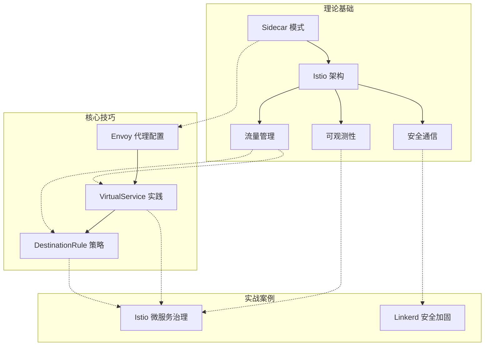

# 本章小结

## 知识体系全景回顾

本章从理论到实践，系统性地覆盖了服务网格（Service Mesh）的核心知识体系。下图展示了本章所有知识点的逻辑关系：



---

## 一、理论基础核心要点

### 1.1 Sidecar 模式：服务网格的架构基石

Sidecar 模式是整个服务网格的架构根基。其核心思想是：**将网络通信逻辑从应用代码中剥离，以独立代理进程的形式运行在每个服务实例旁边**。

**三种流量拦截机制的对比**：

| 机制 | 实现方式 | 性能开销 | 适用场景 | 代表实现 |
|------|---------|---------|---------|---------|
| iptables 拦截 | 内核态 NAT 重定向 | 中等（~2ms 延迟增加） | 通用场景，兼容性最好 | Istio 默认模式 |
| eBPF 拦截 | 内核态可编程过滤 | 极低（~0.5ms 延迟增加） | 高性能场景，需 Linux 4.19+ | Cilium Service Mesh |
| 应用层代理 | 进程间 socket 通信 | 较低 | 需要精确控制的场景 | gRPC 直接集成 |

**Sidecar 注入的关键决策**：

```yaml
# 自动注入（推荐用于生产环境）
apiVersion: v1
kind: Namespace
metadata:
  name: production
  labels:
    istio-injection: enabled

# 手动注入（适用于调试或特殊场景）
# istioctl kube-inject -f deployment.yaml | kubectl apply -f -

# 选择性排除（某些 Pod 不需要 Sidecar）
apiVersion: v1
kind: Pod
metadata:
  annotations:
    sidecar.istio.io/inject: "false"
```

**Sidecar 模式的核心价值**：

- **零侵入性**：应用代码无需任何修改，支持任意编程语言
- **协议无关**：透明拦截 HTTP、gRPC、TCP、WebSocket 等所有协议
- **统一管控**：通信策略集中管理，避免各服务自行实现导致的不一致
- **独立演进**：基础设施升级不影响业务代码，业务升级不影响基础设施

### 1.2 Istio 架构：控制平面与数据平面的协作

Istio 架构采用经典的控制平面-数据平面分离设计：

**控制平面（istiod）的三大职责**：

| 组件 | 原始名称 | 核心职责 | 关键 API |
|------|---------|---------|---------|
| Pilot | 流量管理 | 服务发现、路由规则转换、xDS 配置分发 | LDS/RDS/CDS/EDS |
| Citadel | 安全 | 证书签发与轮换、mTLS 管理、SPIFFE 身份 | SDS |
| Galley | 配置验证 | 配置校验、摄取、分发 | 配置验证 Webhook |

**数据平面（Envoy Proxy）的处理管线**：

入站请求 → Listener Filter → Network Filter → HTTP Filter Chain → Cluster → 后端服务
                                    │
                                    ├─ JWT 认证过滤器
                                    ├─ RBAC 访问控制过滤器
                                    ├─ CORS 跨域过滤器
                                    ├─ 故障注入过滤器
                                    └─ 路由过滤器

**xDS API 体系——Envoy 的配置发现机制**：

| API | 全称 | 功能 | 更新粒度 |
|-----|------|------|---------|
| LDS | Listener Discovery Service | 动态配置监听器（端口、协议） | 单个监听器 |
| RDS | Route Discovery Service | 动态配置路由规则 | 单个路由表 |
| CDS | Cluster Discovery Service | 动态配置上游服务集群 | 单个集群 |
| EDS | Endpoint Discovery Service | 动态配置服务实例端点 | 单个端点 |
| SDS | Secret Discovery Service | 动态管理 TLS 证书 | 单个证书 |

### 1.3 流量管理：精细控制服务间通信

流量管理是服务网格最核心的能力，涉及三个关键 CRD 的协作：

**VirtualService + DestinationRule + Gateway 协作模型**：

| CRD | 核心职责 | 生活类比 | 关键字段 |
|-----|---------|---------|---------|
| VirtualService | 流量路由决策（去哪） | GPS 导航仪 | hosts、http.match、http.route |
| DestinationRule | 到达后的处理策略（怎么处理） | 交通规则 | subsets、trafficPolicy、loadBalancer |
| Gateway | 边界流量接入（从哪来） | 城市入口收费站 | servers、selector、tls |

**五种核心流量管理能力**：

1. **流量分割**：按权重在多版本间分配流量，支持金丝雀发布和蓝绿部署
2. **故障注入**：模拟延迟和错误，测试系统弹性
3. **重试与超时**：自动重试失败请求，设置超时保护
4. **熔断**：自动隔离异常实例，防止故障扩散
5. **负载均衡**：支持轮询、最少连接、一致性哈希等策略

### 1.4 安全通信：认证、授权、加密三位一体

服务网格安全覆盖三个层面：

**安全通信三层防护模型**：

| 层级 | 能力 | Istio 资源 | 关键配置 |
|------|------|-----------|---------|
| 认证（Authentication） | 验证服务身份 | PeerAuthentication | mtls.mode: STRICT |
| 授权（Authorization） | 控制访问权限 | AuthorizationPolicy | action: ALLOW/DENY |
| 加密（Encryption） | 保护数据传输 | PeerAuthentication + DestinationRule | tls.mode: ISTIO_MUTUAL |

**mTLS 工作流程**：

1. 客户端 Envoy 向服务端发起 TLS 握手请求
2. 服务端 Envoy 提供由 Citadel 签发的 X.509 证书
3. 客户端 Envoy 验证证书有效性（CA 签名、有效期、SAN）
4. 双方协商加密算法，建立加密通道
5. 后续所有通信通过加密通道进行，证书定期自动轮换

### 1.5 可观测性：分布式追踪、指标、日志

可观测性是服务网格的第三大核心能力，提供三个维度的诊断数据：

**三大可观测性支柱**：

| 维度 | 数据类型 | 典型工具 | 核心价值 |
|------|---------|---------|---------|
| 分布式追踪 | Trace/Span | Jaeger、Zipkin | 定位跨服务调用链的延迟瓶颈 |
| 指标（Metrics） | Counter/Histogram/Gauge | Prometheus + Grafana | 监控系统健康状态和性能趋势 |
| 访问日志 | 结构化日志 | Fluentd、ELK | 排查具体请求的处理细节 |

**Istio 核心指标**：

| 指标名称 | 类型 | 说明 | 典型告警阈值 |
|---------|------|------|------------|
| istio_requests_total | Counter | 请求总数（含状态码、源/目标） | 错误率 > 1% |
| istio_request_duration_milliseconds | Histogram | 请求延迟分布 | P99 > 500ms |
| istio_request_bytes | Histogram | 请求体大小 | — |
| istio_response_bytes | Histogram | 响应体大小 | — |
| istio_tcp_connections_opened_total | Counter | TCP 连接打开数 | 连接数突增 |
| istio_tcp_sent_bytes_total | Counter | TCP 发送字节数 | 带宽异常 |

---

## 二、核心技巧实战要点

### 2.1 Envoy 代理配置要点

**关键配置项与调优建议**：

```yaml
# Envoy 连接池配置（DestinationRule 中设置）
trafficPolicy:
  connectionPool:
    tcp:
      maxConnections: 100          # 最大 TCP 连接数
      connectTimeout: 5s           # 连接超时
    http:
      http1MaxPendingRequests: 100 # HTTP/1.1 最大等待请求数
      http2MaxRequests: 1000       # HTTP/2 最大并发请求
      maxRequestsPerConnection: 10 # 单连接最大请求数（避免长连接）
      maxRetries: 3                # 最大重试次数

# 异常检测（熔断）配置
  outlierDetection:
    consecutive5xxErrors: 5        # 连续 5 次 5xx 错误触发熔断
    interval: 30s                  # 检测间隔
    baseEjectionTime: 30s          # 基础驱逐时间
    maxEjectionPercent: 50         # 最大驱逐比例（避免全部驱逐）
```

**Envoy 调试命令速查**：

```bash
# 查看 Envoy 配置摘要
istioctl proxy-config listeners <pod-name> --port 15001
istioctl proxy-config routes <pod-name>
istioctl proxy-config clusters <pod-name>

# 查看 Envoy 统计信息
istioctl proxy-status
kubectl exec -it <pod-name> -c istio-proxy -- \
  curl localhost:15000/stats | grep upstream_rq

# 查看完整的 Envoy 配置（JSON 格式）
istioctl proxy-config bootstrap <pod-name> -o json
```

### 2.2 VirtualService 高级路由技巧

**基于权重的金丝雀发布完整配置**：

```yaml
apiVersion: networking.istio.io/v1beta1
kind: VirtualService
metadata:
  name: myapp-canary
spec:
  hosts:
    - myapp
  http:
    # 规则一：内部测试流量直接到 v2
    - match:
        - sourceLabels:
            app: test-client
      route:
        - destination:
            host: myapp
            subset: v2
    # 规则二：生产流量按权重分配
    - route:
        - destination:
            host: myapp
            subset: stable
          weight: 90
        - destination:
            host: myapp
            subset: canary
          weight: 10
      retries:
        attempts: 3
        perTryTimeout: 2s
        retryOn: "5xx,reset,connect-failure"
      timeout: 10s
```

**故障注入测试配置**：

```yaml
apiVersion: networking.istio.io/v1beta1
kind: VirtualService
metadata:
  name: fault-injection-test
spec:
  hosts:
    - payment-service
  http:
    - fault:
        delay:
          percentage:
            value: 10.0
          fixedDelay: 5s
        abort:
          percentage:
            value: 5.0
          httpStatus: 503
      route:
        - destination:
            host: payment-service
```

### 2.3 DestinationRule 策略配置

**四种负载均衡策略对比**：

| 策略 | 算法 | 适用场景 | 特点 |
|------|------|---------|------|
| ROUND_ROBIN | 轮询 | 通用场景 | 简单均匀，无状态 |
| LEAST_REQUEST | 最少请求 | 请求处理时间不均 | 选择当前负载最低的实例 |
| RANDOM | 随机 | 大规模集群 | 简单高效，统计均匀 |
| CONSISTENT_HASH | 一致性哈希 | 需要会话亲和 | 同一客户端总是路由到同一实例 |

**子集（Subset）定义与管理**：

```yaml
apiVersion: networking.istio.io/v1beta1
kind: DestinationRule
metadata:
  name: myapp-destination
spec:
  host: myapp
  trafficPolicy:
    connectionPool:
      tcp:
        maxConnections: 100
      http:
        http1MaxPendingRequests: 100
        http2MaxRequests: 1000
    outlierDetection:
      consecutive5xxErrors: 5
      interval: 30s
      baseEjectionTime: 30s
      maxEjectionPercent: 50
  subsets:
    - name: stable
      labels:
        version: v1
    - name: canary
      labels:
        version: v2
```

---

## 三、实战案例核心经验

### 3.1 Istio 微服务治理实战要点

**部署前检查清单**：

```bash
# 1. 验证 Istio 安装状态
istioctl analyze --all-namespaces

# 2. 检查 Sidecar 注入状态
kubectl get pods -n <namespace> -o jsonpath='{range .items[*]}{.metadata.name}{"\t"}{range .spec.containers[*]}{.name}{" "}{end}{"\n"}{end}' | grep istio-proxy

# 3. 验证 mTLS 状态
istioctl x describe pod <pod-name> -n <namespace>

# 4. 检查配置冲突
istioctl analyze <yaml-file>
```

**生产环境推荐配置**：

- 启用严格 mTLS：`PeerAuthentication` 设置 `mtls.mode: STRICT`
- 配置合理的重试策略：最多 3 次重试，每次超时 2-3 秒
- 设置连接池上限：避免单实例过载
- 启用访问日志：`meshConfig.accessLogFile: /dev/stdout`
- 配置分布式追踪：采样率根据流量调整（生产环境建议 1-10%）

### 3.2 Linkerd 安全加固实战要点

**Istio vs Linkerd 选型对比**：

| 维度 | Istio | Linkerd |
|------|-------|---------|
| 代理实现 | Envoy（C++） | linkerd2-proxy（Rust） |
| 资源占用 | 每 Pod 50-100MB | 每 Pod 10-20MB |
| 延迟增加 | 约 1-3ms | 约 0.5-1ms |
| 启动速度 | 3-5 秒 | < 1 秒 |
| CRD 数量 | 20+ 个 | 约 8 个 |
| 学习曲线 | 陡峭 | 平缓 |
| 社区生态 | 最大，插件丰富 | 较小但增长快 |
| 适用场景 | 功能全面、大规模集群 | 轻量级、快速上手 |

**选型决策框架**：

- **选择 Istio**：需要丰富的流量管理能力、复杂的路由规则、大规模集群（500+ 服务）、已有 Envoy 经验
- **选择 Linkerd**：追求极致轻量、低延迟、快速部署、小团队首次尝试服务网格

---

## 四、关键公式与性能模型

### 4.1 服务网格性能基准

| 概念 | 公式/模型 | 说明 |
|------|-----------|------|
| 吞吐量 | QPS = 并发数 / 平均延迟 | Little 定律，评估系统处理能力 |
| 可用性 | SLA = 正常时间 / 总时间 | 99.9% = 8.76 小时/年停机 |
| 延迟 | P99 = 排序后第 99 百分位值 | 尾延迟指标，比平均值更有意义 |
| 容量规划 | QPS × 单次请求资源 = 总资源需求 | 评估集群规模的基础 |
| Sidecar 开销 | 延迟增加 = P99_proxy - P99_direct | 评估代理引入的性能损耗 |
| 熔断触发 | 连续失败次数 ≥ 阈值 → 驱逐实例 | 保护下游服务的机制 |

### 4.2 服务网格延迟分解模型

一个请求在服务网格中的完整延迟组成：

总延迟 = 应用处理延迟 + Sidecar 代理延迟 + 网络传输延迟

其中 Sidecar 代理延迟包含：
├─ iptables/eBPF 拦截延迟（~0.1-2ms）
├─ TLS 握手延迟（首次连接 ~5-10ms，复用连接 ~0ms）
├─ 路由匹配延迟（< 0.1ms）
├─ 负载均衡决策延迟（< 0.1ms）
├─ 可观测性数据采集延迟（~0.1ms）
└─ 日志写入延迟（异步，不计入请求延迟）

**典型延迟指标**：

| 指标 | 无 Sidecar | 有 Sidecar（mTLS 关闭） | 有 Sidecar（mTLS 开启） |
|------|-----------|----------------------|----------------------|
| P50 延迟 | 5ms | 6ms | 7ms |
| P99 延迟 | 20ms | 23ms | 26ms |
| P999 延迟 | 50ms | 58ms | 65ms |

---

## 五、常见误区与纠正

### 误区一：服务网格是银弹，所有微服务都应该用

**纠正**：服务网格适合中大规模微服务系统（通常 50+ 服务），小规模系统引入服务网格会增加不必要的复杂度。评估标准：

- 服务数量 < 20：考虑轻量级方案（如库封装）
- 服务数量 20-50：评估团队能力和运维成本
- 服务数量 > 50：强烈建议引入服务网格

### 误区二：Sidecar 代理的性能开销可以忽略不计

**纠正**：Sidecar 代理会引入 1-3ms 的延迟和 50-100MB 的内存开销。对于延迟敏感的场景（如金融交易、实时游戏），需要：

- 使用 eBPF 替代 iptables 减少拦截开销
- 启用连接池复用减少 TLS 握手次数
- 合理设置采样率减少可观测性开销
- 考虑 Linkerd 等轻量级替代方案

### 误区三：启用 mTLS 后不需要关注安全

**纠正**：mTLS 只解决了传输加密和身份认证，还需要：

- 配置 AuthorizationPolicy 实现细粒度访问控制
- 定期轮换证书（Istio 默认自动轮换）
- 监控未加密流量的告警
- 审计异常访问模式

### 误区四：配置 VirtualService 就够了

**纠正**：VirtualService 只负责路由决策，还需要 DestinationRule 定义负载均衡、熔断、连接池等策略。缺少 DestinationRule 的 VirtualService 是不完整的。

### 误区五：服务网格部署后就不需要管了

**纠正**：服务网格需要持续运维：

- 定期 `istioctl analyze` 检查配置健康
- 监控 Sidecar 的资源使用趋势
- 定期升级 Istio 版本（安全补丁）
- 审查和清理过期的路由规则

---

## 六、生产环境最佳实践清单

### 设计阶段

- [ ] 评估服务网格的必要性（服务数量、团队能力、运维成本）
- [ ] 选择合适的实现方案（Istio vs Linkerd vs 其他）
- [ ] 设计命名空间和标签策略（用于流量管理和权限隔离）
- [ ] 规划 mTLS 策略（PERMISSIVE 渐进过渡到 STRICT）
- [ ] 设计可观测性方案（追踪、指标、日志的采集和存储）

### 部署阶段

- [ ] 使用 `istioctl verify-install` 验证安装完整性
- [ ] 先在测试环境验证 Sidecar 注入不影响应用启动
- [ ] 逐步启用命名空间级别的自动注入
- [ ] 配置 PodDisruptionBudget 保障升级时的服务可用性
- [ ] 验证 mTLS 证书签发和轮换机制正常工作

### 运行阶段

- [ ] 部署 Prometheus + Grafana 监控仪表盘
- [ ] 配置关键指标告警（错误率 > 1%、P99 > 500ms）
- [ ] 定期执行 `istioctl analyze --all-namespaces`
- [ ] 监控 Sidecar 的 CPU/内存使用趋势
- [ ] 保留访问日志用于安全审计和问题排查

### 优化阶段

- [ ] 根据实际流量调整连接池参数
- [ ] 优化重试策略（避免重试风暴）
- [ ] 调整分布式追踪采样率（生产环境 1-10%）
- [ ] 定期清理不再使用的 VirtualService 和 DestinationRule
- [ ] 跟进 Istio 新版本的性能改进和安全补丁

---

## 七、故障排查速查表

### 常见问题诊断流程

| 症状 | 可能原因 | 诊断命令 | 解决方案 |
|------|---------|---------|---------|
| 请求超时 | Sidecar 未注入、目标服务不可达 | `istioctl proxy-status` | 确认 Pod 有 istio-proxy 容器 |
| 503 错误 | 无可用端点、熔断触发 | `istioctl proxy-config clusters` | 检查端点注册和熔断配置 |
| 连接被拒绝 | mTLS 握手失败、证书过期 | `istioctl x describe pod` | 检查 PeerAuthentication 配置 |
| 延迟升高 | 连接池耗尽、负载不均 | `curl localhost:15000/stats` | 调整 connectionPool 参数 |
| 配置不生效 | VirtualService 优先级冲突 | `istioctl analyze` | 检查配置命名空间和优先级 |

### 调试命令速查

```bash
# 查看 Pod 的 Sidecar 注入状态
kubectl get pod <pod> -o jsonpath='{.spec.containers[*].name}'

# 查看 Envoy 的路由配置
istioctl proxy-config routes <pod>

# 查看 Envoy 的集群配置
istioctl proxy-config clusters <pod>

# 查看 Istio 控制平面日志
kubectl logs -n istio-system deploy/istiod

# 查看 Sidecar 代理日志
kubectl logs <pod> -c istio-proxy

# 执行 istio 配置分析
istioctl analyze -n <namespace>

# 查看 mTLS 状态
istioctl x describe pod <pod> -n <namespace>
```

---

## 八、下一步学习建议

### 深入方向

**进阶理论**：
1. **Envoy 源码阅读**：深入理解 Filter Chain、xDS API 的实现细节，推荐阅读 Envoy 官方文档的 Architecture Overview 章节
2. **零信任网络架构**：研究 NIST SP 800-207 标准，理解 BeyondCorp 和零信任安全模型的设计哲学
3. **eBPF 网络编程**：学习 eBPF 在服务网格中的应用，了解 Cilium Service Mesh 的内核级网络方案

**实践项目**：
4. **从零搭建 Istio 环境**：在本地 Minikube 或 Kind 集群中完整部署 Istio，配置 Bookinfo 示例应用
5. **多集群服务网格**：实践 Istio 多集群部署，理解跨集群的服务发现和流量路由
6. **混沌工程集成**：将 Istio 故障注入与 Chaos Mesh 结合，构建完整的弹性测试体系

**社区参与**：
7. **Istio 官方文档翻译**：参与 Istio 中文社区的文档翻译工作
8. **服务网格性能基准测试**：使用 Istio 的官方性能测试工具，对比不同配置下的性能表现
9. **Service Mesh Interface (SMI) 标准**：了解 SMI 规范，理解服务网格的标准化趋势

### 推荐学习资源

**官方文档**：
- Istio 官方文档：https://istio.io/latest/docs/
- Envoy 官方文档：https://www.envoyproxy.io/docs/envoy/latest/
- Linkerd 官方文档：https://linkerd.io/2/overview/

**书籍推荐**：
- 《Istio Service Mesh 实战》——系统性讲解 Istio 的架构与实践
- 《Envoy Proxy 深入解析》——深入理解 Envoy 的设计与实现
- 《云原生服务网格实战》——覆盖 Istio、Linkerd、Consul Connect 等多种方案

**开源项目**：
- Istio（https://github.com/istio/istio）——最成熟的服务网格实现
- Envoy（https://github.com/envoyproxy/envoy）——高性能 L7 代理
- Linkerd（https://github.com/linkerd/linkerd2）——轻量级服务网格
- Cilium（https://github.com/cilium/cilium）——基于 eBPF 的网络方案

---

## 九、思考题与实践挑战

### 基础理解

1. **Sidecar 模式与 SDK 模式的核心区别是什么？各有什么优劣？** 提示：从侵入性、语言绑定、升级成本、运维复杂度四个维度对比。

2. **Istio 中 VirtualService、DestinationRule、Gateway 三个 CRD 各自的职责是什么？它们如何协作完成一次完整的流量管理？** 提示：画出一个请求从外部进入网格到到达后端服务的完整流转图。

3. **mTLS 是如何实现服务间身份认证的？证书的签发和轮换机制是什么？** 提示：理解 SPIFFE 身份标准和 Citadel 的证书管理流程。

### 进阶思考

4. **在什么场景下你会选择 Linkerd 而不是 Istio？反之亦然？** 提示：考虑集群规模、团队经验、资源限制、功能需求等因素。

5. **如何设计一个渐进式的服务网格迁移策略，将现有的 Spring Cloud 微服务架构迁移到 Istio？** 提示：从 PERMISSIVE mTLS 开始，逐步启用 STRICT 模式。

6. **服务网格的 Sidecar 代理引入了额外的延迟和资源开销，如何评估和优化这些开销？** 提示：使用 eBPF、连接池复用、采样率调整等手段。

### 实践挑战

7. **在本地 Kind 集群中部署 Istio 和 Bookinfo 示例应用，配置金丝雀发布规则，验证流量分割是否按预期工作。**

8. **使用 `istioctl analyze` 和 `istioctl proxy-config` 系列命令排查一个配置错误的 VirtualService，记录排查过程。**

9. **设计一个包含 mTLS、AuthorizationPolicy、JWT 验证的完整安全方案，用 YAML 配置实现并验证效果。**

---

本章小结到此结束。服务网格是云原生架构中处理服务间通信的核心基础设施，掌握它将帮助你构建更安全、更可观测、更易管理的微服务系统。建议从 Bookinfo 示例应用开始动手实践，在实际操作中加深理解。
