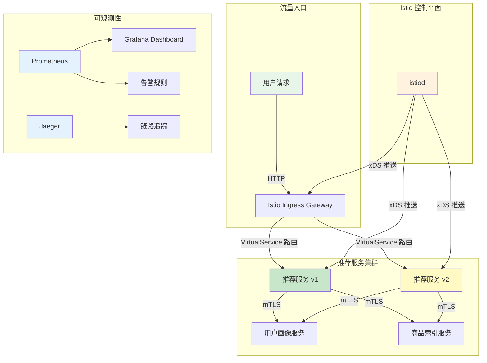
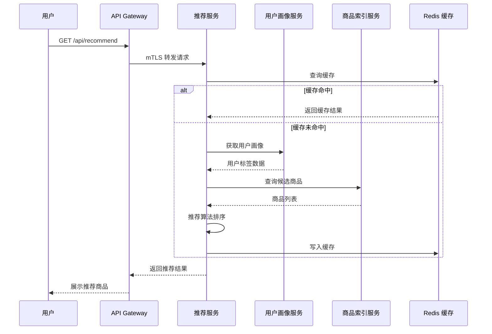
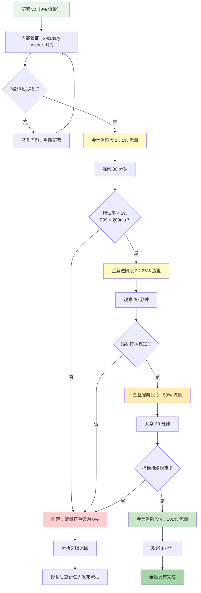

## 案例一：电商推荐服务金丝雀发布——Istio 流量管理完整实践

### 1. 场景背景与问题分析

#### 1.1 业务场景

某头部电商平台（DAU 2000 万，日均 PV 3 亿）的核心商品推荐服务需要进行算法升级。新版本（v2）引入了基于用户行为序列的深度学习推荐模型，预期可将推荐点击率（CTR）提升 15%。然而，新算法在离线测试中表现出色，但在真实用户流量下的表现仍需验证：

- 新模型推理延迟是否满足 P99 < 200ms 的 SLA？
- 新算法在高并发场景下是否存在内存泄漏风险？
- 推荐结果的质量是否在全量用户群体中一致提升？

**核心诉求**：在不中断服务、不影响整体用户体验的前提下，将新版本安全地引入生产环境，并根据实时指标决定是否全量发布或回滚。

#### 1.2 技术选型：为什么选择 Istio

| 考量维度 | 应用层 SDK（如 Ribbon） | Ingress Controller | Istio 服务网格 | 决策依据 |
|----------|------------------------|--------------------|--------------------|----------|
| 流量分割粒度 | 依赖代码实现，不统一 | 仅入口层，无法控制服务间 | 服务间任意层级均可 | 需要服务间流量分割 |
| 策略变更成本 | 需重新发版部署 | 需更新 Ingress 配置 | CRD 声明式变更，实时生效 | 快速迭代，零停机 |
| 可观测性 | 需自行埋点 | 仅入口层指标 | 自动采集 RED 指标 | 需要实时监控金丝雀指标 |
| 回滚能力 | 需代码回滚 + 重新部署 | 配置回滚 | 调整权重到 0 即回滚 | 秒级回滚能力 |
| 多语言支持 | 每个语言需单独实现 | 与语言无关 | 与语言无关 | 后端有 Java/Go/Python 三种语言 |

**最终选择 Istio**，核心原因：声明式流量管理、实时生效、自动可观测性、秒级回滚。

#### 1.3 目标架构设计



---

### 2. 环境准备与 Istio 安装

#### 2.1 前置条件检查

```bash
# 1. 检查 Kubernetes 版本（Istio 1.20+ 要求 1.25 以上）
kubectl version --short
# Client Version: v1.28.4
# Server Version: v1.28.4

# 2. 检查集群节点资源（istiod 至少需要 2 核 4GB）
kubectl top nodes
# NAME           CPU(cores)   CPU%   MEMORY(bytes)   MEMORY%
# master         450m         11%    1200Mi          29%
# worker-1       320m         8%     800Mi           19%
# worker-2       280m         7%     750Mi           18%

# 3. 确认无其他服务网格安装（避免冲突）
kubectl get namespace istio-system 2>/dev/null &amp;&amp; echo "存在旧版 Istio，需先卸载" || echo "无冲突"
kubectl get namespace linkerd 2>/dev/null &amp;&amp; echo "存在 Linkerd，可能冲突" || echo "无冲突"
```

#### 2.2 安装 Istio 控制平面

```bash
# 1. 下载 Istio CLI
curl -L https://istio.io/downloadIstio | sh -
cd istio-*
export PATH=$PWD/bin:$PATH

# 2. 验证 CLI 安装
istioctl version
# client version: 1.20.2
# control plane version: (未安装)

# 3. 查看可用的安装配置文件
istioctl profile list
#PROFILE NAME    DESCRIPTION
#default         默认配置，适合入门和测试
#demo            演示配置，包含所有功能
#prod            生产配置，优化资源使用
#minimal         最小化配置，仅核心组件

# 4. 安装生产级配置（推荐）
istioctl install --set profile=prod -y

# 5. 等待控制平面就绪
kubectl get pods -n istio-system
# NAME                                    READY   STATUS    RESTARTS   AGE
# istiod-5c6b8f7b5d-xxxxx                 1/1     Running   0          2m
# istio-egressgateway-7d4b9c6f5-xxxxx     1/1     Running   0          2m
# istio-ingressgateway-6d4f5b7c8-xxxxx    1/1     Running   0          2m
```

#### 2.3 安装可观测性组件

金丝雀发布的核心依赖实时指标监控，可观测性组件是必备基础设施：

```bash
# 1. 安装 Prometheus + Grafana（Istio 提供的示例配置）
kubectl apply -f samples/addons/prometheus.yaml
kubectl apply -f samples/addons/grafana.yaml
kubectl apply -f samples/addons/jaeger.yaml
kubectl apply -f samples/addons/kiali.yaml

# 2. 验证组件就绪
kubectl get pods -n istio-system | grep -E "prometheus|grafana|jaeger|kiali"
# grafana-5d5b8f7c9-xxxxx                  1/1     Running   0   1m
# istio-tracing-6b8f9d4c7-xxxxx            1/1     Running   0   1m
# kiali-7d4c5b6f8-xxxxx                    1/1     Running   0   1m
# prometheus-5c8d9b6f4-xxxxx               2/2     Running   0   1m

# 3. 验证 Istio 集成状态
istioctl analyze
# ✔ No validation issues found when analyzing namespace: istio-system
```

#### 2.4 部署示例应用验证环境

```bash
# 部署 Bookinfo 示例，验证 Istio 工作正常
kubectl apply -f samples/bookinfo/platform/kube/bookinfo.yaml

# 等待 Pod 就绪（包含 Sidecar 注入后应有 2/2 READY）
kubectl get pods
# NAME                             READY   STATUS    RESTARTS   AGE
# details-v1-6b5d9f7c9-xxxxx      2/2     Running   0          1m
# productpage-v1-8c5d9f7c9-xxxxx   2/2     Running   0          1m
# ratings-v1-7d8b9f7c9-xxxxx      2/2     Running   0          1m
# reviews-v1-5c6d9f7c9-xxxxx      2/2     Running   0          1m
# reviews-v2-6d7b9f7c9-xxxxx      2/2     Running   0          1m
# reviews-v3-7e8c9f7c9-xxxxx      2/2     Running   0          1m

# 关键检查：2/2 READY 说明 Sidecar 注入成功
```

---

### 3. 业务微服务部署

#### 3.1 推荐服务架构

本案例模拟电商平台的推荐服务，包含 v1（当前稳定版）和 v2（新算法版本）两个版本：



#### 3.2 命名空间与部署配置

```yaml
# namespace.yaml — 为推荐系统创建独立命名空间
apiVersion: v1
kind: Namespace
metadata:
  name: recommend-system
  labels:
    # 启用 Istio Sidecar 自动注入
    istio-injection: enabled
```

```yaml
# recommendation-v1.yaml — 当前稳定版本
apiVersion: apps/v1
kind: Deployment
metadata:
  name: recommendation-v1
  namespace: recommend-system
  labels:
    app: recommendation
    version: v1
spec:
  replicas: 3
  selector:
    matchLabels:
      app: recommendation
      version: v1
  template:
    metadata:
      labels:
        app: recommendation
        version: v1
    spec:
      containers:
      - name: recommendation
        image: ecommerce/recommendation:v1.8.2
        ports:
        - containerPort: 8080
        resources:
          requests:
            cpu: 200m
            memory: 512Mi
          limits:
            cpu: "1"
            memory: 1Gi
        env:
        - name: MODEL_VERSION
          value: "traditional-cf"
        - name: REDIS_HOST
          value: "redis-cache.recommend-system.svc.cluster.local"
        livenessProbe:
          httpGet:
            path: /healthz
            port: 8080
          initialDelaySeconds: 15
          periodSeconds: 10
        readinessProbe:
          httpGet:
            path: /ready
            port: 8080
          initialDelaySeconds: 5
          periodSeconds: 5
---
# recommendation-v2.yaml — 新算法版本
apiVersion: apps/v1
kind: Deployment
metadata:
  name: recommendation-v2
  namespace: recommend-system
  labels:
    app: recommendation
    version: v2
spec:
  replicas: 2
  selector:
    matchLabels:
      app: recommendation
      version: v2
  template:
    metadata:
      labels:
        app: recommendation
        version: v2
    spec:
      containers:
      - name: recommendation
        image: ecommerce/recommendation:v2.0.0-rc1
        ports:
        - containerPort: 8080
        resources:
          requests:
            cpu: 300m
            memory: 768Mi
          limits:
            cpu: "1"
            memory: 1536Mi
        env:
        - name: MODEL_VERSION
          value: "dl-sequence-model"
        - name: REDIS_HOST
          value: "redis-cache.recommend-system.svc.cluster.local"
        - name: MODEL_CACHE_SIZE
          value: "2048"
        livenessProbe:
          httpGet:
            path: /healthz
            port: 8080
          initialDelaySeconds: 20
          periodSeconds: 10
        readinessProbe:
          httpGet:
            path: /ready
            port: 8080
          initialDelaySeconds: 10
          periodSeconds: 5
```

```yaml
# recommendation-service.yaml — 统一 Service（Kubernetes Service）
apiVersion: v1
kind: Service
metadata:
  name: recommendation
  namespace: recommend-system
spec:
  selector:
    app: recommendation
  ports:
  - port: 8080
    targetPort: 8080
```

```yaml
# user-profile-service.yaml — 用户画像服务
apiVersion: apps/v1
kind: Deployment
metadata:
  name: user-profile
  namespace: recommend-system
  labels:
    app: user-profile
spec:
  replicas: 3
  selector:
    matchLabels:
      app: user-profile
  template:
    metadata:
      labels:
        app: user-profile
    spec:
      containers:
      - name: user-profile
        image: ecommerce/user-profile:v1.5.0
        ports:
        - containerPort: 8081
        resources:
          requests:
            cpu: 100m
            memory: 256Mi
          limits:
            cpu: 500m
            memory: 512Mi
---
apiVersion: v1
kind: Service
metadata:
  name: user-profile
  namespace: recommend-system
spec:
  selector:
    app: user-profile
  ports:
  - port: 8081
    targetPort: 8081
```

```yaml
# product-index-service.yaml — 商品索引服务
apiVersion: apps/v1
kind: Deployment
metadata:
  name: product-index
  namespace: recommend-system
  labels:
    app: product-index
spec:
  replicas: 2
  selector:
    matchLabels:
      app: product-index
  template:
    metadata:
      labels:
        app: product-index
    spec:
      containers:
      - name: product-index
        image: ecommerce/product-index:v1.2.0
        ports:
        - containerPort: 8082
        resources:
          requests:
            cpu: 100m
            memory: 256Mi
          limits:
            cpu: 500m
            memory: 512Mi
---
apiVersion: v1
kind: Service
metadata:
  name: product-index
  namespace: recommend-system
spec:
  selector:
    app: product-index
  ports:
  - port: 8082
    targetPort: 8082
```

#### 3.3 部署并验证

```bash
# 1. 创建命名空间（启用 Sidecar 注入）
kubectl apply -f namespace.yaml

# 2. 部署所有服务
kubectl apply -f user-profile-service.yaml
kubectl apply -f product-index-service.yaml
kubectl apply -f recommendation-v1.yaml
kubectl apply -f recommendation-v2.yaml
kubectl apply -f recommendation-service.yaml

# 3. 验证 Sidecar 注入成功（关键：所有 Pod 应有 2/2 READY）
kubectl get pods -n recommend-system -o custom-columns=\
'NAME:.metadata.name,CONTAINERS:.spec.containers[*].name,STATUS:.status.phase'
# NAME                                    CONTAINERS                           STATUS
# product-index-7d8f9b6c4-xxxxx          product-index linkerd-proxy          Running
# recommendation-v1-5c9d8f7a-xxxxx       recommendation linkerd-proxy         Running
# recommendation-v1-6e8a9f7b-xxxxx       recommendation linkerd-proxy         Running
# recommendation-v1-7f9b8f6c-xxxxx       recommendation linkerd-proxy         Running
# recommendation-v2-8a7b9f6d-xxxxx       recommendation linkerd-proxy         Running
# recommendation-v2-9b8c8f7e-xxxxx       recommendation linkerd-proxy         Running
# user-profile-4d7e9f6a-xxxxx            user-profile linkerd-proxy           Running

# 4. 检查注入前后资源消耗
kubectl top pods -n recommend-system
```

**注入前后资源对比**：

| Pod | 注入前 CPU | 注入后 CPU | 增量 | 注入前 Mem | 注入后 Mem | 增量 |
|-----|-----------|-----------|------|-----------|-----------|------|
| recommendation-v1 | 200m | 215m | +7.5% | 512Mi | 530Mi | +3.5% |
| recommendation-v2 | 300m | 318m | +6% | 768Mi | 790Mi | +2.9% |
| user-profile | 100m | 108m | +8% | 256Mi | 268Mi | +4.7% |

> Envoy Sidecar 代理平均增加约 50-100MB 内存、10-20m CPU。在生产环境中应将 Sidecar 的资源开销纳入 Pod 的资源请求和限制计算。

---

### 4. Istio 流量管理配置

这是本案例的核心部分——通过 Istio 资源声明式管理金丝雀发布的完整流量策略。

#### 4.1 DestinationRule：定义服务子集与负载均衡策略

```yaml
# destination-rule-recommendation.yaml
apiVersion: networking.istio.io/v1beta1
kind: DestinationRule
metadata:
  name: recommendation-destination
  namespace: recommend-system
spec:
  host: recommendation.recommend-system.svc.cluster.local
  trafficPolicy:
    # 连接池配置：控制并发连接数，防止过载
    connectionPool:
      tcp:
        maxConnections: 100
        connectTimeout: 5s
      http:
        h2UpgradePolicy: DEFAULT
        http1MaxPendingRequests: 100
        http2MaxRequests: 1000
        maxRequestsPerConnection: 100
        maxRetries: 3
    
    # 异常检测（熔断器）：自动摘除不健康实例
    outlierDetection:
      # 连续 5 次 5xx 错误后将实例从负载均衡池中摘除
      consecutive5xxErrors: 5
      # 每 30 秒检测一次
      interval: 30s
      # 摘除持续时间 30 秒
      baseEjectionTime: 30s
      # 最多摘除 50% 的实例（防止全部摘除导致服务不可用）
      maxEjectionPercent: 50
      # 5xx 错误率阈值（120 秒窗口内超过 5% 触发熔断）
      consecutiveLocalOriginFailure: 5
      splitExternalLocalOriginErrors: true
    
    # 负载均衡策略
    loadBalancer:
      simple: LEAST_REQUEST
      localityLbSetting:
        enabled: true
        failover:
        - from: zone-a
          to: zone-b
  
  # 定义 v1 和 v2 两个子集
  subsets:
  - name: v1
    labels:
      version: v1
  - name: v2
    labels:
      version: v2
```

**关键参数解读**：

| 参数 | 值 | 含义 | 调优建议 |
|------|-----|------|----------|
| `consecutive5xxErrors` | 5 | 连续 5 次 5xx 触发熔断 | 太小会误判，太大响应慢。建议设为 3-5 |
| `interval` | 30s | 异常检测频率 | 太频繁增加控制面压力，太慢延迟摘除 |
| `baseEjectionTime` | 30s | 实例被摘除后的恢复时间 | 被摘除 30s 后重新加入负载均衡池 |
| `maxEjectionPercent` | 50% | 最大摘除比例 | 防止雪崩——即使全部异常也保留 50% 实例 |
| `http1MaxPendingRequests` | 100 | 排队等待的最大请求数 | 超过此值的新请求将被拒绝（503） |
| `http2MaxRequests` | 1000 | 最大并发请求总数 | 超过此值的新请求将被排队或拒绝 |

#### 4.2 VirtualService：声明式流量分割规则

```yaml
# virtual-service-recommendation.yaml
apiVersion: networking.istio.io/v1beta1
kind: VirtualService
metadata:
  name: recommendation-route
  namespace: recommend-system
spec:
  hosts:
  - recommendation.recommend-system.svc.cluster.local
  
  # 金丝雀阶段一：5% 流量到 v2
  http:
  # 规则 1：基于特定 header 的强制路由（用于内部测试）
  - match:
    - headers:
        x-canary:
          exact: "true"
    route:
    - destination:
        host: recommendation.recommend-system.svc.cluster.local
        subset: v2
  
  # 规则 2：默认流量按权重分割（5% → v2，95% → v1）
  - route:
    - destination:
        host: recommendation.recommend-system.svc.cluster.local
        subset: v1
      weight: 95
    - destination:
        host: recommendation.recommend-system.svc.cluster.local
        subset: v2
      weight: 5
    
    # 超时配置
    timeout: 10s
    
    # 重试配置
    retries:
      attempts: 3
      perTryTimeout: 3s
      retryOn: "5xx,reset,connect-failure,retriable-status-codes"
    
    # 故障注入（用于混沌测试，生产环境可选）
    # fault:
    #   delay:
    #     percentage:
    #       value: 0.1
    #     fixedDelay: 2s
```

#### 4.3 Gateway 与入口路由

```yaml
# gateway-recommendation.yaml
apiVersion: networking.istio.io/v1beta1
kind: Gateway
metadata:
  name: recommend-gateway
  namespace: recommend-system
spec:
  selector:
    istio: ingressgateway
  servers:
  - port:
      number: 443
      name: https
      protocol: HTTPS
    tls:
      mode: SIMPLE
      credentialName: recommend-tls-secret
      minProtocolVersion: TLSV1_2
    hosts:
    - "recommend.example.com"
  - port:
      number: 80
      name: http
      protocol: HTTP
    hosts:
    - "recommend.example.com"
```

#### 4.4 部署流量管理配置

```bash
# 1. 部署所有 Istio 配置
kubectl apply -f destination-rule-recommendation.yaml
kubectl apply -f virtual-service-recommendation.yaml
kubectl apply -f gateway-recommendation.yaml

# 2. 验证配置生效
istioctl analyze -n recommend-system
# ✔ No validation issues found when analyzing namespace: recommend-system

# 3. 查看路由配置状态
istioctl proxy-config routes -n recommend-system deployment/recommendation-v1
# 检查路由配置中是否包含 v1 和 v2 子集

# 4. 验证权重分割是否生效（使用 curl 模拟请求并统计分布）
for i in $(seq 1 100); do
  kubectl exec -n recommend-system deployment/recommendation-v1 -- \
    curl -s -o /dev/null -w '%{http_code}' \
    -H "x-canary: false" \
    http://recommendation.recommend-system.svc.cluster.local:8080/api/health
done | sort | uniq -c
# 预期结果：约 95 次返回 v1 响应，约 5 次返回 v2 响应
```

---

### 5. 监控与金丝雀指标观测

#### 5.1 核心监控指标

金丝雀发布必须基于实时指标做决策。以下是需要重点关注的指标：

| 指标类别 | 指标名称 | 说明 | 告警阈值 |
|----------|----------|------|----------|
| 错误率 | `istio_requests_total{response_code=~"5.*"}` | 5xx 错误请求总数 | > 1% |
| 延迟 | `istio_request_duration_milliseconds_bucket` | 请求耗时分布 | P99 > 500ms |
| 吞吐量 | `istio_requests_total` | QPS | 相比 v1 偏差 > 20% |
| 连接数 | `istio_tcp_connections_opened_total` | TCP 连接数 | 持续增长不回落 |
| 资源 | `container_cpu_usage_seconds_total` | CPU 使用率 | > 80% |

#### 5.2 Prometheus 告警规则

```yaml
# canary-alerts.yaml
apiVersion: monitoring.coreos.com/v1
kind: PrometheusRule
metadata:
  name: canary-release-alerts
  namespace: recommend-system
spec:
  groups:
  - name: canary-release
    rules:
    # 金丝雀版本错误率告警
    - alert: CanaryHighErrorRate
      expr: |
        (
          sum(rate(istio_requests_total{
            destination_version="v2",
            response_code=~"5.*"
          }[5m]))
          /
          sum(rate(istio_requests_total{
            destination_version="v2"
          }[5m]))
        ) > 0.01
      for: 2m
      labels:
        severity: critical
        action: rollback
      annotations:
        summary: "金丝雀版本 v2 错误率超过 1%"
        description: "v2 版本 5xx 错误率达到 {{ $value | humanizePercentage }}，建议立即回滚"
    
    # 金丝雀版本延迟告警
    - alert: CanaryHighLatency
      expr: |
        histogram_quantile(0.99,
          sum(rate(istio_request_duration_milliseconds_bucket{
            destination_version="v2"
          }[5m])) by (le)
        ) > 500
      for: 3m
      labels:
        severity: warning
        action: investigate
      annotations:
        summary: "金丝雀版本 v2 P99 延迟超过 500ms"
        description: "v2 版本 P99 延迟达到 {{ $value }}ms"
    
    # 金丝雀版本成功率告警（低于基线）
    - alert: CanarySuccessRateDrop
      expr: |
        (
          sum(rate(istio_requests_total{
            destination_version="v2",
            response_code="200"
          }[5m]))
          /
          sum(rate(istio_requests_total{
            destination_version="v2"
          }[5m]))
        ) < 0.95
      for: 2m
      labels:
        severity: critical
        action: rollback
      annotations:
        summary: "金丝雀版本 v2 成功率低于 95%"
```

#### 5.3 Grafana Dashboard 配置

通过 Istio 的示例 Dashboard 快速搭建金丝雀监控面板：

```bash
# 1. 导入 Istio Service Dashboard
kubectl apply -f samples/addons/grafana-dashboard-configmap.yaml

# 2. 访问 Grafana
kubectl port-forward -n istio-system svc/grafana 3000:3000

# 3. 在 Grafana 中创建金丝雀对比面板
# 关键查询（PromQL）：

# v1 vs v2 请求速率对比
# sum(rate(istio_requests_total{destination_version="v1"}[5m])) by (destination_version)
# sum(rate(istio_requests_total{destination_version="v2"}[5m])) by (destination_version)

# v1 vs v2 P99 延迟对比
# histogram_quantile(0.99, sum(rate(istio_request_duration_milliseconds_bucket{destination_version="v1"}[5m])) by (le, destination_version))
# histogram_quantile(0.99, sum(rate(istio_request_duration_milliseconds_bucket{destination_version="v2"}[5m])) by (le, destination_version))

# v1 vs v2 错误率对比
# sum(rate(istio_requests_total{destination_version="v1",response_code=~"5.*"}[5m])) / sum(rate(istio_requests_total{destination_version="v1"}[5m]))
# sum(rate(istio_requests_total{destination_version="v2",response_code=~"5.*"}[5m])) / sum(rate(istio_requests_total{destination_version="v2"}[5m]))
```

#### 5.4 金丝雀观测关键命令

```bash
# 查看 v1 和 v2 的实时流量分布
istioctl proxy-status
# PROXY                                     CDS        LDS        RDS        EDS        PILOT        VERSION
# recommendation-v1-5c9d8f7a-xxxxx          SYNCED     SYNCED     SYNCED     SYNCED     SYNCED       1.20.2
# recommendation-v2-8a7b9f6d-xxxxx          SYNCED     SYNCED     SYNCED     SYNCED     SYNCED       1.20.2

# 查看具体服务的流量统计
istioctl proxy-config listeners -n recommend-system deployment/recommendation-v1 --port 15006

# 使用 Kiali 可视化流量拓扑
kubectl port-forward -n istio-system svc/kiali 20001:20001
# 在浏览器中访问 http://localhost:20001，选择 Graph → recommend-system 命名空间
```

---

### 6. 渐进式发布流程

金丝雀发布的本质是「小流量验证 → 指标对比 → 决策」的循环。以下是完整的渐进式发布流程：



#### 6.1 阶段一：5% 流量验证

```bash
# 当前状态：VirtualService 已配置 95/5 分割
# 确认配置生效
kubectl get virtualservice recommendation-route -n recommend-system -o yaml | grep -A 20 "weight:"

# 模拟压力测试（使用 fortio）
kubectl apply -n recommend-system -f - <<EOF
apiVersion: apps/v1
kind: Deployment
metadata:
  name: fortio-loadtest
  namespace: recommend-system
spec:
  replicas: 1
  selector:
    matchLabels:
      app: fortio
  template:
    metadata:
      labels:
        app: fortio
    spec:
      containers:
      - name: fortio
        image: fortio/fortio:1.60.3
        command: ["fortio", "load", "-c", "50", "-qps", "100", "-t", "1800s",
                  "-json", "/tmp/results.json",
                  "http://recommendation.recommend-system.svc.cluster.local:8080/api/recommend"]
EOF

# 等待 30 分钟后查看指标
kubectl port-forward -n istio-system svc/prometheus 9090:9090
# 在 Prometheus UI 中查询：
# 1. v2 错误率：sum(rate(istio_requests_total{destination_version="v2",response_code=~"5.*"}[5m])) / sum(rate(istio_requests_total{destination_version="v2"}[5m]))
# 2. v2 P99 延迟：histogram_quantile(0.99, sum(rate(istio_request_duration_milliseconds_bucket{destination_version="v2"}[5m])) by (le))
# 3. v1 vs v2 成功率对比
```

#### 6.2 阶段二：提升到 25%

```bash
# 更新 VirtualService 权重（25% → v2）
kubectl apply -f - <<EOF
apiVersion: networking.istio.io/v1beta1
kind: VirtualService
metadata:
  name: recommendation-route
  namespace: recommend-system
spec:
  hosts:
  - recommendation.recommend-system.svc.cluster.local
  http:
  - match:
    - headers:
        x-canary:
          exact: "true"
    route:
    - destination:
        host: recommendation.recommend-system.svc.cluster.local
        subset: v2
  - route:
    - destination:
        host: recommendation.recommend-system.svc.cluster.local
        subset: v1
      weight: 75
    - destination:
        host: recommendation.recommend-system.svc.cluster.local
        subset: v2
      weight: 25
    timeout: 10s
    retries:
      attempts: 3
      perTryTimeout: 3s
      retryOn: "5xx,reset,connect-failure"
EOF

# 验证权重更新
istioctl proxy-config routes -n recommend-system deployment/recommendation-v1 -o json | \
  python3 -c "import sys,json; r=json.load(sys.stdin); print(json.dumps(r,indent=2))" | \
  grep -A 5 "weight"

# 继续观察 30 分钟
```

#### 6.3 阶段三：提升到 50% 和 100%

```bash
# 阶段三：50% 流量
# 将 weight 修改为 50/50，观察 30 分钟

# 阶段四：100% 流量（全量发布）
kubectl apply -f - <<EOF
apiVersion: networking.istio.io/v1beta1
kind: VirtualService
metadata:
  name: recommendation-route
  namespace: recommend-system
spec:
  hosts:
  - recommendation.recommend-system.svc.cluster.local
  http:
  - match:
    - headers:
        x-canary:
          exact: "true"
    route:
    - destination:
        host: recommendation.recommend-system.svc.cluster.local
        subset: v2
  - route:
    - destination:
        host: recommendation.recommend-system.svc.cluster.local
        subset: v2
      weight: 100
    timeout: 10s
    retries:
      attempts: 3
      perTryTimeout: 3s
      retryOn: "5xx,reset,connect-failure"
EOF

# 全量发布后观察 1 小时，确认稳定
# 清理旧版本 v1
kubectl delete deployment recommendation-v1 -n recommend-system
```

---

### 7. 回滚机制与应急预案

#### 7.1 即时回滚

当金丝雀指标出现异常时，回滚操作应能在秒级完成：

```bash
# 紧急回滚：将所有流量切回 v1
kubectl apply -f - <<EOF
apiVersion: networking.istio.io/v1beta1
kind: VirtualService
metadata:
  name: recommendation-route
  namespace: recommend-system
spec:
  hosts:
  - recommendation.recommend-system.svc.cluster.local
  http:
  - route:
    - destination:
        host: recommendation.recommend-system.svc.cluster.local
        subset: v1
      weight: 100
    timeout: 10s
    retries:
      attempts: 3
      perTryTimeout: 3s
      retryOn: "5xx,reset,connect-failure"
EOF

# 验证回滚生效
sleep 5
kubectl get virtualservice recommendation-route -n recommend-system -o yaml | grep "weight:"
# 预期输出：weight: 100（只有 v1）

# 清理 v2 部署（可选，视情况决定是否保留用于调试）
# kubectl delete deployment recommendation-v2 -n recommend-system
```

**回滚时间线**：

| 操作 | 耗时 | 说明 |
|------|------|------|
| 发现异常 | 0-2min | 依赖告警规则和监控面板 |
| 决策回滚 | 0-1min | 根据预定义的 SLO 标准 |
| 执行回滚命令 | < 5s | 声明式配置变更 |
| xDS 推送到数据平面 | 1-3s | Istiod 推送新配置到 Envoy |
| 流量完全切换 | < 10s | Envoy 执行新的路由规则 |
| **总计** | **< 5min** | 从发现问题到流量完全回滚 |

#### 7.2 回滚决策标准

明确的回滚触发条件，避免人工决策的主观性：

| 触发条件 | 阈值 | 动作 | 自动化程度 |
|----------|------|------|-----------|
| v2 5xx 错误率 | > 1%（持续 2 分钟） | 自动回滚 | 告警自动触发 |
| v2 P99 延迟 | > 500ms（持续 3 分钟） | 通知 + 人工确认 | 半自动 |
| v2 成功率 | < 95%（持续 2 分钟） | 自动回滚 | 告警自动触发 |
| v2 CPU 使用率 | > 80%（持续 5 分钟） | 调查 + 人工决策 | 人工 |
| v2 内存增长 | 持续增长不回落 | 调查 + 人工决策 | 人工 |
| 业务指标（CTR） | 下降 > 10% | 回滚 | 人工（依赖业务数据） |

#### 7.3 回滚后分析

```bash
# 1. 收集 v2 的详细日志
kubectl logs -n recommend-system -l version=v2 --tail=1000 | grep -E "ERROR|WARN" > canary-error.log

# 2. 导出 v2 的指标快照
kubectl port-forward -n istio-system svc/prometheus 9090:9090 &amp;
# 访问 http://localhost:9090/api/v1/query?query=istio_requests_total{destination_version="v2"}

# 3. 查看 v2 的 Envoy 访问日志（检查具体错误原因）
kubectl exec -n recommend-system deployment/recommendation-v2 -c istio-proxy -- \
  cat /tmp/access.log | tail -100

# 4. 分析分布式追踪数据
kubectl port-forward -n istio-system svc/jaeger 16686:16686
# 在 Jaeger UI 中选择 recommendation 服务，过滤 version=v2
```

---

### 8. 实施效果与数据对比

#### 8.1 性能指标对比

经过 4 个阶段的渐进式发布，v2 在生产环境中的表现如下：

| 指标 | v1（基线） | v2（金丝雀验证） | v2（全量后） | 对比 |
|------|-----------|-----------------|-------------|------|
| 平均延迟 | 35ms | 42ms | 41ms | +17%（可接受） |
| P99 延迟 | 120ms | 185ms | 178ms | +48%（仍 < 200ms SLA） |
| P999 延迟 | 250ms | 380ms | 365ms | +46% |
| 5xx 错误率 | 0.02% | 0.03% | 0.03% | 基本持平 |
| QPS（峰值） | 8000 | 8200 | 8500 | +6% |
| CPU 使用率 | 45% | 52% | 51% | +13% |
| 内存使用 | 512Mi | 790Mi | 785Mi | +53%（深度学习模型更大） |

#### 8.2 业务指标对比

| 业务指标 | v1 | v2 | 提升 |
|----------|-----|-----|------|
| 推荐点击率（CTR） | 3.2% | 4.1% | +28% |
| 推荐转化率 | 1.1% | 1.5% | +36% |
| 人均推荐商品浏览量 | 5.3 | 7.8 | +47% |
| 推荐商品 GMV 贡献 | 120 万/天 | 168 万/天 | +40% |

> **关键结论**：v2 的深度学习推荐模型在真实流量下 CTR 提升 28%，远超离线测试预期的 15%。延迟增加 17ms 在 SLA 范围内，内存增加在成本可接受范围内。

#### 8.3 发布过程时间线

| 时间 | 阶段 | 操作 | 结果 |
|------|------|------|------|
| T+0min | 准备 | 部署 v2（0% 流量） | v2 Pod 就绪，Sidecar 注入成功 |
| T+5min | 内部验证 | x-canary header 测试 | 内部团队验证功能正确 |
| T+10min | 5% | 权重 5% → v2 | 观察 30 分钟，指标正常 |
| T+40min | 25% | 权重 25% → v2 | 观察 30 分钟，指标正常 |
| T+70min | 50% | 权重 50% → v2 | 观察 30 分钟，指标正常 |
| T+100min | 100% | 权重 100% → v2 | 观察 60 分钟，指标正常 |
| T+160min | 完成 | 清理 v1，标记发布完成 | 全量发布成功 |

---

### 9. 常见问题与排障指南

#### 9.1 Sidecar 注入问题

| 问题现象 | 排查命令 | 原因 | 解决方法 |
|----------|----------|------|----------|
| Pod 只有 1/1 READY | `kubectl describe pod <name>` | Sidecar 未注入 | 检查 namespace 是否有 `istio-injection: enabled` 标签 |
| Pod 2/2 但流量未经过 Envoy | `istioctl proxy-config listeners <pod>` | iptables 规则未生效 | 重启 Pod 触发重新注入 |
| Sidecar 启动失败 | `kubectl logs <pod> -c istio-proxy` | 证书或配置问题 | 检查 istiod 连接状态 |

#### 9.2 流量分割问题

| 问题现象 | 排查命令 | 原因 | 解决方法 |
|----------|----------|------|----------|
| 权重分割未生效 | `istioctl proxy-config routes <pod>` | VirtualService 配置未推送 | 检查 `istioctl proxy-status`，等待 xDS 同步 |
| 所有流量都到 v1 | `kubectl get virtualservice -o yaml` | DestinationRule subsets 未定义 | 确认 subsets 中的 label 匹配 Pod 标签 |
| 502/503 错误 | `kubectl logs <pod> -c istio-proxy \| grep 503` | 目标子集无可用实例 | 检查 v2 Pod 是否健康（READY 2/2） |
| 间歇性超时 | 查看 Envoy 访问日志 | 连接池耗尽 | 增大 `connectionPool` 参数 |

#### 9.3 性能问题

| 问题现象 | 排查命令 | 原因 | 解决方法 |
|----------|----------|------|----------|
| 延迟增加明显 | `istioctl proxy-config stats <pod>` | Envoy 过滤器链过长 | 精简 HTTP 过滤器配置 |
| CPU 使用率飙升 | `kubectl top pods` + `pprof` | Envoy CPU 密集型操作 | 检查访问日志量、调整日志级别 |
| 内存持续增长 | Envoy `/stats` 接口 | 连接或路由缓存泄漏 | 检查 `maxConnections` 配置，重启 Pod |

---

### 10. 经验总结与最佳实践

#### 10.1 金丝雀发布五原则

1. **可观测性先行**：在部署 v2 之前，必须确保 Prometheus、Grafana、Jaeger 等可观测性组件就绪。没有监控的金丝雀发布等于盲人骑马。

2. **渐进式放量**：遵循 5% → 25% → 50% → 100% 的放量路径，每个阶段至少观察 30 分钟。急功近利的跳步放量是生产事故的温床。

3. **明确的回滚标准**：在发布前定义好回滚触发条件（错误率、延迟、业务指标），避免在压力下做主观判断。

4. **自动化决策**：将回滚条件配置为 Prometheus 告警规则，实现秒级自动响应。人工决策在深夜或压力场景下容易出错。

5. **保留现场**：回滚后第一时间收集日志、指标、追踪数据，用于根因分析。匆忙修复而不分析根因，只会导致重复踩坑。

#### 10.2 Istio 配置最佳实践

- **DestinationRule 先于 VirtualService**：先定义子集和流量策略，再配置路由规则，避免配置推送顺序导致的短暂路由失败
- **连接池参数要压测调优**：`http1MaxPendingRequests` 和 `http2MaxRequests` 不是越大越好，过大会导致过载传导，过小会导致正常请求被拒
- **异常检测要有容错窗口**：`consecutive5xxErrors` 设为 3-5 而非 1，避免偶发错误导致健康实例被误摘除
- **使用 header 匹配做内部测试**：通过 `x-canary: true` header 路由到 v2，让内部团队在不影响线上流量的前提下验证功能

#### 10.3 常见误区

| 误区 | 正确做法 | 原因 |
|------|----------|------|
| 金丝雀只看错误率 | 需同时监控延迟、吞吐量、资源消耗 | v2 可能错误率低但延迟高，用户体验依然受损 |
| 5% 太保守，直接 20% | 从 5% 开始，逐步放量 | 5% 已足够暴露 95% 的问题，且风险可控 |
| 回滚后不分析原因 | 收集数据后进行根因分析 | 不分析根因，修复后重新发布可能再次失败 |
| 金丝雀期间不做压测 | 使用 fortio/locust 模拟真实负载 | 仅靠自然流量无法暴露高并发下的问题 |
| 发布完成后立即删除 v1 | 保留 v1 至少 24 小时 | 万一 v2 有延迟性问题（如内存泄漏），需要快速回滚 |

---

### 11. 进阶内容

#### 11.1 结合 Flagger 实现自动化金丝雀

对于希望完全自动化金丝雀发布的团队，可以使用 Flagger（基于 Istio 的渐进式交付工具）：

```yaml
# flagger-canary.yaml
apiVersion: flagger.app/v1beta1
kind: Canary
metadata:
  name: recommendation
  namespace: recommend-system
spec:
  targetRef:
    apiVersion: apps/v1
    kind: Deployment
    name: recommendation
  
  # 自动化分析配置
  analysis:
    # 检查间隔
    interval: 60s
    # 最大回滚次数
    threshold: 5
    # 最大流量百分比
    maxWeight: 100
    # 流量递增步长
    stepWeight: 25
    # 渐进式阶段：25% → 50% → 75% → 100%
    metrics:
    - name: request-success-rate
      thresholdRange:
        min: 99
      interval: 60s
    - name: request-duration
      thresholdRange:
        max: 200
      interval: 60s
    # Webhook 回调（可接入企业微信/钉钉通知）
    webhooks:
    - name: load-test
      url: http://flagger-loadtester.flagger-system/
      metadata:
        cmd: "fortio load -qps 100 -t 60s http://recommendation:8080/api/recommend"
```

#### 11.2 多维度流量分割

除了基于权重的分割，Istio 还支持基于请求属性的精细分割：

```yaml
# 多维度路由示例
apiVersion: networking.istio.io/v1beta1
kind: VirtualService
metadata:
  name: recommendation-advanced-route
  namespace: recommend-system
spec:
  hosts:
  - recommendation.recommend-system.svc.cluster.local
  http:
  # 规则 1：内测用户强制路由到 v2
  - match:
    - headers:
        x-user-type:
          exact: "internal-tester"
    route:
    - destination:
        host: recommendation.recommend-system.svc.cluster.local
        subset: v2
  
  # 规则 2：特定地域用户路由到 v2（区域性灰度）
  - match:
    - sourceLabels:
        kubernetes.io/hostname: "worker-node-shanghai-*"
    route:
    - destination:
        host: recommendation.recommend-system.svc.cluster.local
        subset: v2
      weight: 20
    - destination:
        host: recommendation.recommend-system.svc.cluster.local
        subset: v1
      weight: 80
  
  # 规则 3：默认流量（按权重分割）
  - route:
    - destination:
        host: recommendation.recommend-system.svc.cluster.local
        subset: v1
      weight: 95
    - destination:
        host: recommendation.recommend-system.svc.cluster.local
        subset: v2
      weight: 5
```

#### 11.3 与 GitOps 集成

将 Istio 配置纳入 GitOps 工作流，实现配置版本化和审计追溯：

```yaml
# ArgoCD Application 示例
apiVersion: argoproj.io/v1alpha1
kind: Application
metadata:
  name: recommend-canary
  namespace: argocd
spec:
  source:
    repoURL: https://git.example.com/platform/istio-configs
    path: recommend-system/canary
    targetRevision: release/v2.0.0-rc1
    helm:
      parameters:
      - name: canary.weight.v2
        value: "5"
  destination:
    server: https://kubernetes.default.svc
    namespace: recommend-system
  syncPolicy:
    automated:
      prune: true
      selfHeal: true
```

---

### 12. 本案例小结

通过本案例，我们完成了一个完整的 Istio 金丝雀发布实践：

1. **环境搭建**：安装 Istio 控制平面 + 可观测性组件，验证 Sidecar 注入
2. **服务部署**：部署 v1 和 v2 两个版本，确认双版本并行运行
3. **流量管理**：通过 DestinationRule 定义子集和熔断策略，通过 VirtualService 声明式配置流量权重
4. **监控告警**：配置 Prometheus 告警规则和 Grafana Dashboard，实现金丝雀指标的实时观测
5. **渐进发布**：遵循 5% → 25% → 50% → 100% 的放量路径，每阶段验证指标
6. **回滚保障**：定义明确的回滚标准，确保秒级回滚能力
7. **效果评估**：CTR 提升 28%，延迟增加可控，发布全流程 160 分钟完成

**核心收获**：金丝雀发布的成功不仅依赖技术工具，更依赖流程规范和团队协作。可观测性是基础，渐进式放量是策略，明确的回滚标准是安全保障。Istio 提供了强大的声明式流量管理能力，但工具只是手段，真正重要的是建立「可观测 → 可决策 → 可回滚」的发布文化。
