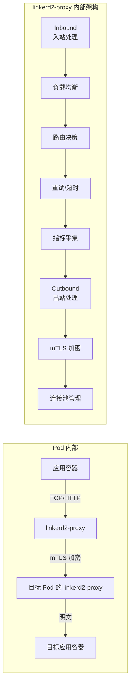
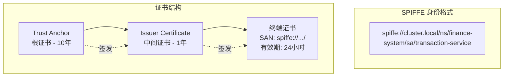
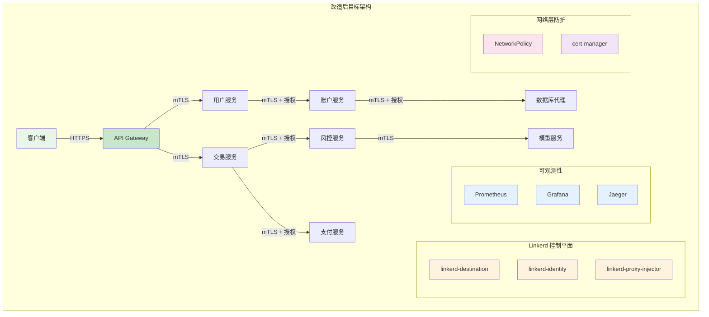
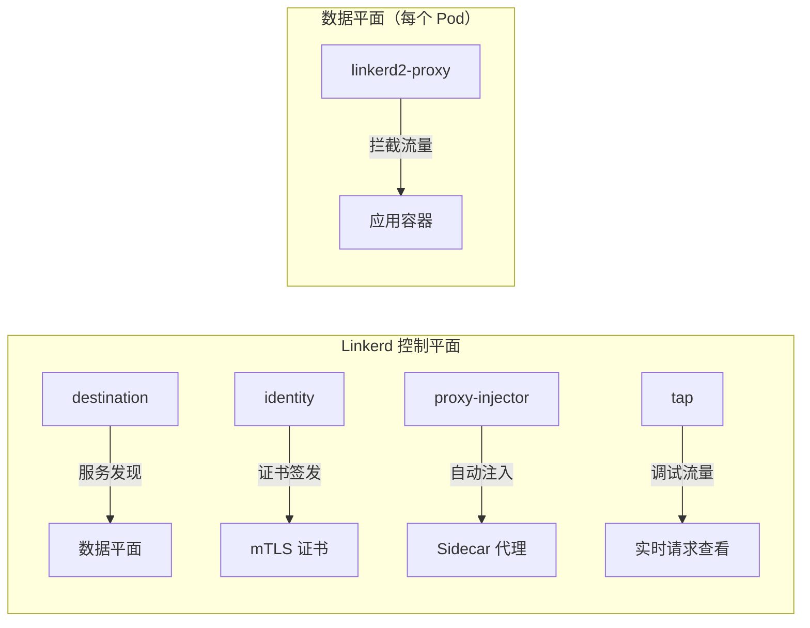
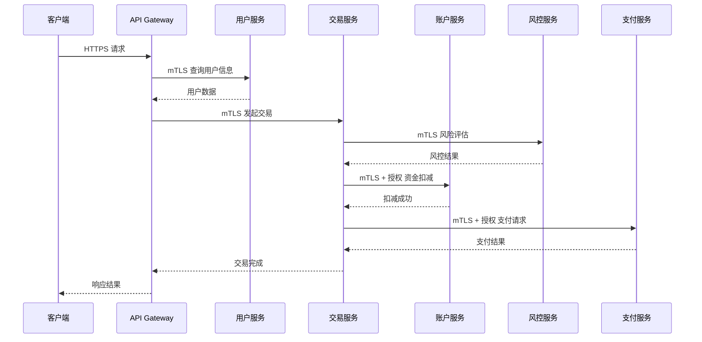
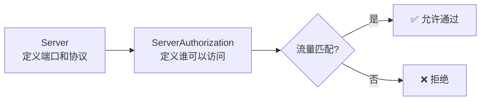
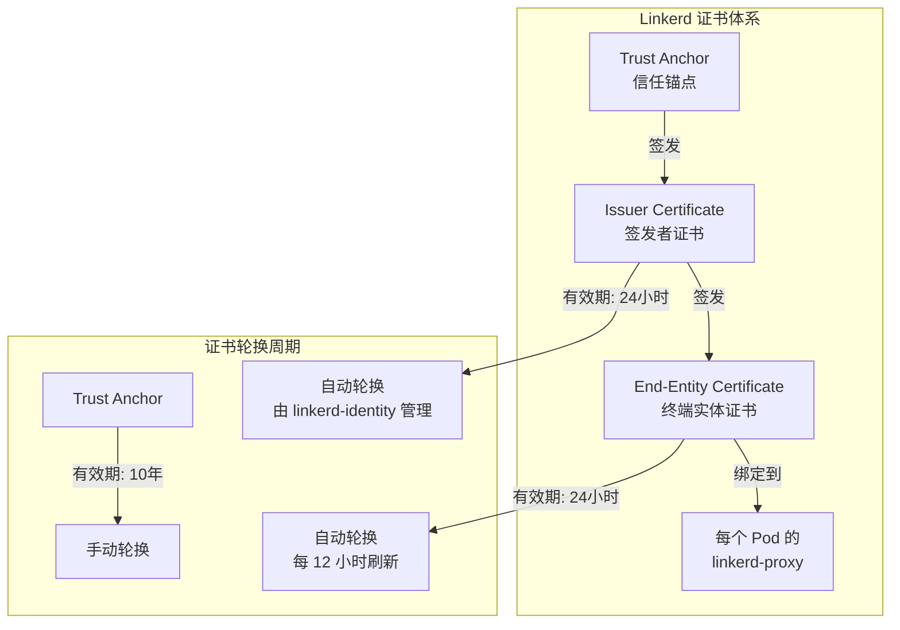

## 案例二：Linkerd 安全加固实战——金融系统等保三级合规落地

### 1. 场景背景与问题分析

#### 1.1 业务场景

某持牌消费金融公司（日均交易流水 2 亿元，注册用户 800 万）正在进行核心系统云原生改造。原有架构基于 Spring Cloud + Nginx，微服务间通信依赖明文 HTTP，服务间身份验证依赖共享密钥硬编码在配置文件中。

随着《网络安全等级保护基本要求》（GB/T 22239-2019）三级标准的强制执行，监管审计明确要求：

- 所有服务间通信必须加密（等保 2.0 三级：通信传输安全）
- 必须实现服务级别的身份认证和访问控制（等保 2.0 三级：访问控制）
- 必须保留完整的通信审计日志（等保 2.0 三级：安全审计）
- 审计日志不可篡改且保留至少 180 天（等保 2.0 三级：安全审计）

**技术选型决策过程**：

| 考量维度 | Istio | Linkerd | 决策依据 |
|----------|-------|---------|----------|
| 资源占用 | Envoy 代理，每 Pod 约 50-100MB | linkerd2-proxy（Rust），每 Pod 约 10-20MB | 金融系统 Pod 密度高，需要低开销 |
| 安全能力 | mTLS + AuthorizationPolicy + RequestAuthentication | mTLS + ServerAuthorization + ServiceProfile | 两者均满足等保要求 |
| 运维复杂度 | CRD 多（约 20+），学习曲线陡峭 | CRD 少（约 8 个），上手快 | 团队首次使用服务网格，倾向简单方案 |
| 启动速度 | Envoy cold start 约 3-5s | linkerd2-proxy cold start < 1s | 对延迟敏感的金融交易场景 |
| 性能开销 | 延迟增加约 1-3ms | 延迟增加约 0.5-1ms（超轻量代理） | 高频交易链路对延迟敏感 |
| 安全默认值 | 需显式配置 PeerAuthentication 开启 mTLS | 安装后默认开启 mTLS | 金融系统要求"默认安全" |
| 多集群 | 需 IstioMeshGateway，配置复杂 | 内置多集群扩展，配置简单 | 未来有同城双活需求 |

**最终选择 Linkerd**，核心原因：资源占用极低、运维简单、安全能力满足等保要求、"默认安全"的设计理念符合金融合规精神。

#### 1.2 Linkerd 架构原理深度解析

在动手实施之前，理解 Linkerd 的架构设计至关重要——它决定了安全能力的实现方式和边界。

**linkerd2-proxy 的 Rust 代理设计**：

Linkerd 的核心创新在于用 Rust 语言实现了超轻量的 sidecar 代理。与 Istio 使用的通用代理 Envoy 不同，linkerd2-proxy 专门为服务网格场景定制，代码路径更短、内存安全、无 GC 停顿。



| 设计特性 | linkerd2-proxy（Rust） | Envoy（C++） | 对金融系统的影响 |
|----------|----------------------|--------------|------------------|
| 内存占用 | 10-20MB | 50-100MB | 同等集群规模节省数 GB 内存 |
| 冷启动时间 | < 1 秒 | 3-5 秒 | Pod 调度和扩缩容更快 |
| GC 停顿 | 无（Rust 无 GC） | 有（周期性） | 延迟更稳定，P99 更低 |
| 代码路径 | 服务网格专用，短路径 | 通用代理，长路径 | 处理效率更高 |
| 安全内存模型 | Rust 所有权系统 | C++ 手动管理 | 更少的内存安全漏洞 |
| 连接模型 | 每 Pod 一个进程 | 每 Pod 一个进程 | 相同，均采用 sidecar 模式 |

**SPIFFE 身份模型**：

Linkerd 的 mTLS 基于 SPIFFE（Secure Production Identity Framework for Everyone）标准，为每个服务分配唯一的加密身份。这个身份不是 IP 地址或域名，而是 X.509 SVID（SPIFFE Verifiable Identity Document）中编码的 URI。



每个 Pod 的 linkerd-proxy 持有一个终端实体证书，证书的 SAN（Subject Alternative Name）字段包含该 Pod 的 SPIFFE 身份。当两个 Pod 通信时，它们互相验证对方的证书链——这就是双向 TLS（mTLS）的本质：双方都证明"我是谁"。

**为什么这对金融系统至关重要**：

- **身份不可伪造**：证书由 linkerd-identity 组件签发，私钥从不离开 Pod
- **身份不可过期**：端证书每 24 小时自动轮换，轮换失败会立即中断流量（fail-closed）
- **身份粒度精确**：精确到 ServiceAccount 级别，不是 Pod 或 Deployment 级别

#### 1.3 现状问题诊断

┌─────────────────────────────────────────────────────────┐
│                    当前架构安全痛点                        │
├─────────────────────────────────────────────────────────┤
│  1. 明文通信：服务间 HTTP 未加密，敏感数据裸传            │
│  2. 无身份认证：服务间无双向认证，任意外部可调用内部接口   │
│  3. 无访问控制：缺少细粒度的 Service-to-Service 授权      │
│  4. 无审计日志：通信行为不可追溯，无法满足等保审计要求    │
│  5. 共享密钥：密钥硬编码在配置中，泄露风险极高            │
│  6. 无网络隔离：所有服务共享同一网络平面，横向移动无阻    │
│  7. 无证书管理：手动管理密钥，无自动轮换机制              │
└─────────────────────────────────────────────────────────┘

#### 1.4 目标架构设计



**分层防护体系说明**：

Linkerd 提供的是 L7 层的身份认证和访问控制。完整的金融级安全需要多层联动：

| 防护层级 | 技术方案 | 覆盖范围 | 与 Linkerd 的关系 |
|----------|----------|----------|-------------------|
| L3/L4 网络层 | NetworkPolicy（Calico/Cilium） | Pod 级网络隔离 | 互补，Linkerd 不替代 L3 防护 |
| L4 传输层 | Linkerd mTLS | 服务间加密通信 | 核心能力，本文重点 |
| L7 应用层 | Linkerd ServerAuthorization | 服务级访问控制 | 核心能力，本文重点 |
| 证书层 | cert-manager + Linkerd | 自动化证书生命周期 | 增强能力，生产推荐 |
| 审计层 | Linkerd viz + Prometheus + Grafana | 安全可观测性 | 核心能力，本文重点 |

---

### 2. 环境准备与 Linkerd 安装

#### 2.1 前置条件检查

```bash
# 1. 检查 Kubernetes 版本（要求 1.21+，推荐 1.25+ 以获得最佳兼容性）
kubectl version --short
# Server Version: v1.28.4

# 2. 检查集群是否已安装 Istio（避免冲突）
kubectl get namespace istio-system 2>/dev/null &amp;&amp; echo "存在 Istio，需先卸载" || echo "无 Istio 冲突"

# 3. 检查集群资源（Linkerd 控制平面至少需要 2GB 内存，HA 模式需要 4GB+）
kubectl top nodes

# 4. 检查集群网络插件（需要支持 CNI，推荐 Calico 或 Cilium）
kubectl get pods -n kube-system -o name | grep -E 'calico|cilium|flannel|weave'

# 5. 安装 Linkerd CLI
curl -fsL https://run.linkerd.io/install | sh
export PATH=$PATH:$HOME/.linkerd2/bin

# 6. 验证 CLI 安装
linkerd version
# Client version: stable-2.15.2
# Server version: stable-2.15.2

# 7. 检查集群兼容性（关键步骤，不可跳过）
linkerd check --pre
# 输出应全部显示 [ok]
```

**`linkerd check --pre` 常见问题处理**：

| 检查项 | 失败原因 | 解决方法 | 验证方式 |
|--------|----------|----------|----------|
| `ClusterRoles` 权限不足 | RBAC 受限 | 联系集群管理员授予 cluster-admin | `kubectl auth can-i '*' '*'` |
| `container runtime` 不支持 | 使用了非 containerd/docker 的运行时 | 升级容器运行时 | `kubectl get nodes -o jsonpath='{.items[*].status.nodeInfo.containerRuntimeVersion}'` |
| `HA requirements` 警告 | 节点数不足 | 非 HA 部署可忽略，生产环境建议 3 节点以上 | `kubectl get nodes --no-headers | wc -l` |
| `CNI plugin` 检查失败 | 未安装 CNI 插件 | 安装 Calico/Cilium | `kubectl get pods -n kube-system -l k8s-app=calico-node` |
| `Kubernetes version` 不兼容 | K8s 版本过低 | 升级到 1.21+ | `kubectl version --short` |

#### 2.2 安装 Linkerd 控制平面

```bash
# 方案一：非 HA 模式（开发/测试环境）
linkerd install --crds | kubectl apply -f -
linkerd install | kubectl apply -f -

# 方案二：生产环境推荐 HA 模式
linkerd install --crds --ha | kubectl apply -f -
linkerd install --ha | kubectl apply -f -

# 方案三：生产环境 HA + 自定义证书（推荐，详见第 5 节）
linkerd install --crds --ha | kubectl apply -f -
linkerd install --ha \
  --identity-trust-anchors-file ca.crt \
  --identity-issuer-certificate issuer.crt \
  --identity-issuer-key issuer.key \
  | kubectl apply -f -

# 等待控制平面就绪（HA 模式通常需要 3-5 分钟）
linkerd check
# 全部显示 [ok] 才算安装成功
```

**控制平面组件说明**：



| 组件 | 功能 | HA 模式资源占用 | 重要性 |
|------|------|-----------------|--------|
| `linkerd-destination` | 服务发现、负载均衡、路由决策、指标聚合 | CPU: 100m, Mem: 250Mi | 核心（数据平面的"大脑"） |
| `linkerd-identity` | mTLS 证书签发和自动轮换，基于 SPIFFE 标准 | CPU: 50m, Mem: 128Mi | 核心（安全基石） |
| `linkerd-proxy-injector` | Webhook 拦截 Pod 创建事件，自动注入 sidecar | CPU: 50m, Mem: 64Mi | 核心（自动化注入） |
| `linkerd-tap` | 实时查看请求流量，调试用 | CPU: 50m, Mem: 64Mi | 辅助（调试时启用） |

**各组件高可用说明**：

HA 模式下每个控制平面组件都运行多个副本：
- `destination`：3 副本，带 Pod 反亲和性，分散到不同节点
- `identity`：3 副本，leader election 机制确保只有一个签发证书
- `proxy-injector`：3 副本，Webhook 响应由任意一个副本处理

```yaml
# HA 模式的关键配置差异（linkerd install --ha 会自动应用）
# 非 HA 模式下每个组件只有 1 个副本
metadata:
  annotations:
    config.linkerd.io/proxy-cpu-limit: "1"
    config.linkerd.io/proxy-memory-limit: "250Mi"
spec:
  replicas: 3
  # Pod 反亲和性：确保副本分散到不同节点
  affinity:
    podAntiAffinity:
      requiredDuringSchedulingIgnoredDuringExecution:
      - labelSelector:
          matchExpressions:
          - key: linkerd.io/control-plane-component
            operator: In
            values: ["destination", "identity", "proxy-injector"]
        topologyKey: kubernetes.io/hostname
```

#### 2.3 验证安装状态

```bash
# 验证控制平面所有组件
linkerd check
# 输出示例：
# linkerd-identity
# ----------------
# ✓ certificate configs are valid
# ✓ trust anchors are valid
# ✓ root certificate is valid
# ✓ [ok] healthy and configured
# linkerd-version
# ----------------
# ✓ control plane and cli versions match
# ✓ [ok] running stable-2.15.2

# 查看控制平面 Pod 状态
kubectl get pods -n linkerd
# NAME                                    READY   STATUS    RESTARTS   AGE
# linkerd-destination-6b5c8d8f9f-xxxxx   4/4     Running   0          5m
# linkerd-identity-7d9c5f4a8b-xxxxx      2/2     Running   0          5m
# linkerd-proxy-injector-5c8d9b6f4-xxxxx 2/2     Running   0          5m

# 检查控制平面组件版本一致性（重要：数据平面代理版本必须与控制平面匹配）
linkerd check --expected-version stable-2.15.2
```

---

### 3. 增量迁移策略：从零到网格的安全落地

对于金融系统这种生产环境，不可能一次性将所有服务迁移到服务网格。增量迁移（Progressive Delivery）是唯一可行的策略。

#### 3.1 四阶段迁移路线图


| 阶段 | 周期 | 范围 | 目标 | 回滚条件 |
|------|------|------|------|----------|
| 阶段一 | 1-2 周 | 控制平面 | 安装并验证 Linkerd 控制平面 | `linkerd uninstall` 完全移除 |
| 阶段二 | 2-4 周 | 2-3 个非核心服务 | 验证 sidecar 注入、mTLS 自动生效、可观测性 | 移除注入 label，Pod 重建后恢复 |
| 阶段三 | 4-8 周 | 核心交易链路（6-8 个服务） | 启用 ServerAuthorization 访问控制 | 删除 ServerAuthorization 资源即可回退 |
| 阶段四 | 2-4 周 | 全部业务服务 | 全面覆盖 + 等保合规验证 | 完整备份支持 |

#### 3.2 阶段二：非核心服务试点

选择风险最低的服务先行验证。推荐选择内部运维服务（如日志收集服务、监控代理），不直接影响业务流量。

```bash
# 1. 创建试点命名空间
kubectl create namespace pilot-mesh
kubectl label namespace pilot-mesh linkerd.io/inject=enabled

# 2. 部署一个简单测试服务
cat <<EOF | kubectl apply -f -
apiVersion: apps/v1
kind: Deployment
metadata:
  name: test-server
  namespace: pilot-mesh
  labels:
    app: test-server
spec:
  replicas: 2
  selector:
    matchLabels:
      app: test-server
  template:
    metadata:
      labels:
        app: test-server
    spec:
      containers:
      - name: server
        image: nginx:1.25
        ports:
        - containerPort: 80
        resources:
          requests:
            cpu: 50m
            memory: 64Mi
          limits:
            cpu: 100m
            memory: 128Mi
---
apiVersion: v1
kind: Service
metadata:
  name: test-server
  namespace: pilot-mesh
spec:
  selector:
    app: test-server
  ports:
  - port: 80
    name: http-web
EOF

# 3. 验证 sidecar 注入成功
kubectl get pods -n pilot-mesh -o jsonpath='{range .items[*]}{.metadata.name}{"\t"}{range .spec.containers[*]}{.name}{" "}{end}{"\n"}{end}'
# test-server-xxxxx    server linkerd-proxy

# 4. 验证 mTLS 自动生效
linkerd viz stat -n pilot-mesh
# NAME           SUCCESS   RPS   LATENCY_P50   LATENCY_P99   TLS
# test-server    100.0%    10    1ms           3ms           100%

# 5. 确认无异常后，再迁移业务服务
```

#### 3.3 回滚策略

每个阶段都有明确的回滚方案，确保不影响现有业务：

```bash
# 回滚方案一：移除注入 label（最温和，Pod 需重建）
kubectl label namespace pilot-mesh linkerd.io/inject-
kubectl rollout restart deployment -n pilot-mesh

# 回滚方案二：完全卸载 Linkerd（最后手段）
# 警告：会中断所有已注入服务的流量
linkerd uninstall | kubectl delete -f -

# 回滚验证
kubectl get pods -n pilot-mesh -o jsonpath='{range .items[*]}{range .spec.containers[*]}{.name}{" "}{end}{"\n"}{end}'
# 确认不再包含 linkerd-proxy 容器
```

---

### 4. 微服务部署与 Sidecar 注入

#### 4.1 业务微服务部署

本案例使用典型的金融交易链路作为示例：



```yaml
# namespace.yaml — 为业务服务创建独立命名空间
apiVersion: v1
kind: Namespace
metadata:
  name: finance-system
  labels:
    # 启用自动注入（关键：这个 label 决定了 Sidecar 是否自动注入）
    linkerd.io/inject: enabled
```

```yaml
# user-service.yaml — 用户服务
apiVersion: apps/v1
kind: Deployment
metadata:
  name: user-service
  namespace: finance-system
  labels:
    app: user-service
spec:
  replicas: 3
  selector:
    matchLabels:
      app: user-service
  template:
    metadata:
      labels:
        app: user-service
        # 明确标记注入（Namespace 级别已有，此处为双重保险）
        linkerd.io/inject: enabled
    spec:
      containers:
      - name: user-service
        image: finance/user-service:v2.1.0
        ports:
        - containerPort: 8080
          # 端口名必须以 http/https/grpc 开头，Linkerd 才能正确识别协议
          name: http-main
        resources:
          requests:
            cpu: 100m
            memory: 256Mi
          limits:
            cpu: 500m
            memory: 512Mi
        env:
        - name: DB_HOST
          valueFrom:
            secretKeyRef:
              name: db-credentials
              key: host
        - name: DB_PASSWORD
          valueFrom:
            secretKeyRef:
              name: db-credentials
              key: password
---
apiVersion: v1
kind: Service
metadata:
  name: user-service
  namespace: finance-system
spec:
  selector:
    app: user-service
  ports:
  - port: 8080
    targetPort: 8080
    # Service 端口名也必须以协议前缀开头
    name: http-main
```

```yaml
# transaction-service.yaml — 交易服务（核心服务，副本数更高）
apiVersion: apps/v1
kind: Deployment
metadata:
  name: transaction-service
  namespace: finance-system
  labels:
    app: transaction-service
spec:
  replicas: 5
  selector:
    matchLabels:
      app: transaction-service
  template:
    metadata:
      labels:
        app: transaction-service
        linkerd.io/inject: enabled
    spec:
      containers:
      - name: transaction-service
        image: finance/transaction-service:v2.1.0
        ports:
        - containerPort: 8080
          name: http-main
        resources:
          requests:
            cpu: 200m
            memory: 512Mi
          limits:
            cpu: "1"
            memory: 1Gi
```

**端口命名规范（关键细节）**：

Linkerd 依赖端口名来判断协议类型。如果端口名不符合规范，代理将无法正确处理流量，可能导致 mTLS 失效。

| 端口名前缀 | Linkerd 识别的协议 | 适用场景 |
|------------|-------------------|----------|
| `http-*` | HTTP/1.x | REST API |
| `h2-*` | HTTP/2 | gRPC 或 HTTP/2 服务 |
| `grpc-*` | gRPC | gRPC 服务（等同 h2） |
| `tls-*` | TLS passthrough | 自行管理 TLS 的服务 |
| 无前缀 | TCP | 非 HTTP 协议（数据库等） |

```bash
# 检查所有 Service 的端口命名是否符合规范
kubectl get svc -n finance-system -o jsonpath='{range .items[*]}{.metadata.name}{" → "}{range .spec.ports[*]}{.name}({.port}){" "}{end}{"\n"}{end}'
# api-gateway → http-main(8080)
# user-service → http-main(8080)
# 如果端口名为空或不符合前缀规范，需要修改 Service 定义
```

#### 4.2 部署所有微服务

```bash
# 创建命名空间并启用注入
kubectl apply -f namespace.yaml

# 部署所有微服务
kubectl apply -f user-service.yaml
kubectl apply -f transaction-service.yaml
kubectl apply -f account-service.yaml
kubectl apply -f risk-service.yaml
kubectl apply -f payment-service.yaml
kubectl apply -f api-gateway.yaml

# 验证 Sidecar 注入成功（关键检查点）
kubectl get pods -n finance-system -o jsonpath='{range .items[*]}{.metadata.name}{"\t"}{range .spec.containers[*]}{.name}{" "}{end}{"\n"}{end}'
# 输出示例：
# user-service-7d8f9b6c4-xxxxx    user-service linkerd-proxy
# transaction-service-5c9d8f7a-xxxxx    transaction-service linkerd-proxy

# 检查注入前后的 Pod 资源消耗对比
kubectl top pods -n finance-system
```

**注入前后对比**：

| 指标 | 注入前（仅应用容器） | 注入后（应用 + linkerd-proxy） | 增量 |
|------|---------------------|------------------------------|------|
| CPU 请求 | 100m | 110m | +10m（约 10%） |
| 内存请求 | 256Mi | 270Mi | +14Mi（约 5.5%） |
| Pod 启动时间 | 8s | 9s | +1s |
| 网络延迟（P99） | 2.1ms | 2.6ms | +0.5ms |

> **关键发现**：Linkerd 的 Rust 代理极其轻量，对资源的影响远低于 Istio 的 Envoy 代理（通常增加 50-100MB 内存）。在 800 万用户的金融系统中，按 200 个 Pod 计算，Linkerd 额外占用约 2.8GB 内存，而 Istio 需要 10-20GB。

#### 4.3 验证 mTLS 自动生效

```bash
# 检查 mTLS 状态（默认安装后自动开启）
linkerd viz check 2>/dev/null || true
linkerd viz stat ns finance-system

# 查看具体服务的 mTLS 状态
kubectl get -n finance-system authpolicy -o yaml 2>/dev/null || true

# 使用 linkerd 命令行查看安全状态
linkerd stat -n finance-system svc
# NAME                   SUCCESS   RPS   LATENCY_P50   LATENCY_P99   TLS
# api-gateway            100.0%    50    2ms           8ms           100%
# user-service           100.0%    50    1ms           5ms           100%
# transaction-service    100.0%    50    3ms           12ms          100%
# account-service        100.0%    50    2ms           7ms           100%
# risk-service           100.0%    15    15ms          45ms          100%
# payment-service        100.0%    20    5ms           18ms          100%

# TLS 列显示 100% 说明所有流量已加密
```

> **Linkerd 的独特优势**：安装后默认开启 mTLS，无需额外配置。Istio 需要手动配置 `PeerAuthentication` 并确认每个 namespace 的策略，Linkerd 的"安全默认"设计更符合金融系统"默认安全"的原则。

**mTLS 验证的三种方法**：

| 方法 | 命令 | 适用场景 | 输出信息 |
|------|------|----------|----------|
| stat 命令 | `linkerd viz stat -n finance-system` | 快速概览所有服务 TLS 覆盖率 | 服务级 TLS 百分比 |
| authz 命令 | `linkerd viz authz -n finance-system` | 查看授权策略执行情况 | 未授权请求计数 |
| tap 命令 | `linkerd viz tap -n finance-system deploy/X --to deploy/Y` | 实时调试特定流量 | 每个请求的 TLS 状态和延迟 |

---

### 5. 安全加固：分层防护策略

#### 5.1 第一层：全局 mTLS 强制模式

Linkerd 默认开启 mTLS，但为了确保不遗漏任何 namespace，需要显式声明全局策略：

```yaml
# default-profile.yaml — 全局安全配置
apiVersion: policy.linkerd.io/v1beta1
kind: Server
metadata:
  name: default-server
  namespace: finance-system
spec:
  port: 8080
  # podSelector 匹配所有带 app 标签的 Pod
  podSelector:
    matchLabels: {}
  proxyProtocol: HTTP/1
```

```bash
# 验证全局 mTLS 已生效
linkerd viz authz -n finance-system
# 输出中应显示所有流量均为 mTLS 加密
```

**Server CRD 的作用**：

`Server` 是 Linkerd 授权体系的入口。它定义了"哪些端口接受流量"以及"使用什么协议解析"。所有 `ServerAuthorization` 策略都必须关联到一个 `Server` 资源才能生效。如果不创建 `Server`，对应的 `ServerAuthorization` 不会生效——这是新手最常犯的错误之一。



#### 5.2 第二层：细粒度服务级访问控制

这是金融系统等保合规的核心需求——限制哪些服务可以调用哪些服务。

```yaml
# server-authorization-account-service.yaml
# 账户服务：仅允许交易服务和 API Gateway 调用
apiVersion: policy.linkerd.io/v1beta1
kind: ServerAuthorization
metadata:
  name: account-service-authz
  namespace: finance-system
spec:
  # 定义"谁可以访问"
  server:
    name: account-service-server
  # 授权策略：仅允许特定 ServiceAccount
  client:
    meshed:
    - serviceAccount:
        name: transaction-service
    - serviceAccount:
        name: api-gateway
    # 非 mesh 客户端（未注入 Sidecar 的）一律拒绝
    meshedRegex: ""
```

```yaml
# server-authorization-payment-service.yaml
# 支付服务：仅允许交易服务调用
apiVersion: policy.linkerd.io/v1beta1
kind: ServerAuthorization
metadata:
  name: payment-service-authz
  namespace: finance-system
spec:
  server:
    name: payment-service-server
  client:
    meshed:
    - serviceAccount:
        name: transaction-service
```

```yaml
# server-authorization-risk-service.yaml
# 风控服务：允许交易服务调用
apiVersion: policy.linkerd.io/v1beta1
kind: ServerAuthorization
metadata:
  name: risk-service-authz
  namespace: finance-system
spec:
  server:
    name: risk-service-server
  client:
    meshed:
    - serviceAccount:
        name: transaction-service
    - serviceAccount:
        name: api-gateway
```

```yaml
# default-deny.yaml — 默认拒绝所有未明确授权的流量
# 等保 2.0 要求：默认拒绝，白名单放行
apiVersion: policy.linkerd.io/v1beta1
kind: ServerAuthorization
metadata:
  name: default-deny
  namespace: finance-system
spec:
  server:
    name: default-server
  client:
    # 空 meshed 列表 = 拒绝所有 meshed 客户端
    meshed: []
    # 同时拒绝所有非 meshed 客户端
    meshedRegex: ""
```

```bash
# 部署访问控制策略
kubectl apply -f default-deny.yaml
kubectl apply -f server-authorization-account-service.yaml
kubectl apply -f server-authorization-payment-service.yaml
kubectl apply -f server-authorization-risk-service.yaml

# 验证授权策略生效
linkerd viz authz -n finance-system
```

**授权策略矩阵**：

| 源服务 → 目标服务 | api-gateway | user-service | transaction-service | account-service | risk-service | payment-service |
|-------------------|-------------|-------------|---------------------|-----------------|-------------|-----------------|
| api-gateway | — | ✅ | ✅ | ❌ | ❌ | ❌ |
| user-service | — | — | ❌ | ✅ | ❌ | ❌ |
| transaction-service | — | — | — | ✅ | ✅ | ✅ |
| account-service | — | — | ❌ | — | ❌ | ❌ |
| risk-service | — | — | ❌ | ❌ | — | ❌ |
| payment-service | — | — | ❌ | ❌ | ❌ | — |

> **等保合规要点**：白名单模式（默认拒绝 + 显式授权）是等保 2.0 三级"访问控制"条款的核心要求。上表中所有 ✅ 位置都必须有对应的 `ServerAuthorization` 资源，其他位置默认拒绝。

**ServerAuthorization 执行流程详解**：

当一个请求到达目标服务时，Linkerd 的授权检查按以下顺序执行：

1. **匹配 Server 资源**：根据目标 Pod 的端口和标签找到对应的 Server
2. **检查 ServerAuthorization**：查找与该 Server 关联的所有 ServerAuthorization 资源
3. **身份验证**：从请求的 mTLS 证书中提取 SPIFFE 身份（ServiceAccount）
4. **授权匹配**：将身份与 ServerAuthorization 中的 `client.meshed` 列表匹配
5. **默认拒绝**：如果没有任何 ServerAuthorization 匹配，请求被拒绝（如果存在 default-deny）
6. **允许通过**：如果匹配到 ServerAuthorization，请求被允许

请求到达 → 匹配 Server → 查找 ServerAuthorization → 提取 mTLS 身份 → 匹配白名单 → 允许/拒绝
                ↓                  ↓                        ↓                ↓
          port + label     name 字段关联         spiffe://.../sa/xxx    meshed 列表

#### 5.3 第三层：跨 Namespace 隔离

```yaml
# production-namespace.yaml
apiVersion: v1
kind: Namespace
metadata:
  name: finance-production
  labels:
    linkerd.io/inject: enabled
    # 限制仅允许特定 namespace 的服务访问
    linkerd.io/inbound-port-whitelist: "8080,9090"
```

```bash
# 验证 namespace 隔离
kubectl get namespace -L linkerd.io/inject
# NAME                  STATUS   AGE   INJECT
# finance-system        Active   2d    enabled
# finance-production    Active   1d    enabled
# kube-system           Active   30d
# linkerd               Active   2d
```

#### 5.4 第四层：外部流量控制

```yaml
# server-external.yaml — 对外暴露的 API Gateway
apiVersion: policy.linkerd.io/v1beta1
kind: Server
metadata:
  name: api-gateway-external
  namespace: finance-system
spec:
  port: 443
  podSelector:
    matchLabels:
      app: api-gateway
  # 允许外部流量通过 HTTPS 进入
  proxyProtocol: HTTP/1
```

```bash
# 验证外部流量路径
linkerd viz stat -n finance-system deploy/api-gateway
# 该部署应同时显示 inbound（外部请求）和 outbound（内部调用）流量
```

#### 5.5 第五层：NetworkPolicy 联动（L3/L4 补充）

Linkerd 工作在 L7 层，提供服务身份和应用层授权。但它不替代 L3/L4 的 NetworkPolicy。两者联动才能实现完整的纵深防御。

```yaml
# network-policy-finance-system.yaml
# NetworkPolicy 限制 Pod 间网络通信（L3/L4 层）
# Linkerd ServerAuthorization 在此基础上提供 L7 层精细控制
apiVersion: networking.k8s.io/v1
kind: NetworkPolicy
metadata:
  name: default-deny-all
  namespace: finance-system
spec:
  podSelector: {}
  policyTypes:
  - Ingress
  - Egress
---
apiVersion: networking.k8s.io/v1
kind: NetworkPolicy
metadata:
  name: allow-linkerd-control-plane
  namespace: finance-system
spec:
  podSelector: {}
  policyTypes:
  - Ingress
  ingress:
  - from:
    - namespaceSelector:
        matchLabels:
          kubernetes.io/metadata.name: linkerd
      # 允许 Linkerd 控制平面访问数据平面
---
apiVersion: networking.k8s.io/v1
kind: NetworkPolicy
metadata:
  name: allow-mesh-traffic
  namespace: finance-system
spec:
  podSelector: {}
  policyTypes:
  - Ingress
  ingress:
  - from:
    - podSelector:
        matchLabels:
          linkerd.io/inject: enabled
    ports:
    - port: 8080
      protocol: TCP
```

**NetworkPolicy 与 Linkerd 的协作关系**：

| 层级 | 技术 | 职责 | 举例 |
|------|------|------|------|
| L3/L4 | NetworkPolicy | 网络层隔离，控制 Pod 间 TCP 连接 | 拒绝来自非 finance-system namespace 的流量 |
| L4 | Linkerd mTLS | 传输加密 + 身份认证 | 服务间双向 TLS，验证调用方身份 |
| L7 | Linkerd ServerAuthorization | 应用层授权，基于身份的精细控制 | 仅允许 transaction-service 调用 payment-service |

> **最佳实践**：先部署 NetworkPolicy 做粗粒度隔离，再用 Linkerd ServerAuthorization 做细粒度控制。这样即使 Linkerd 策略配置错误，NetworkPolicy 仍能提供基本防护。

---

### 6. 证书管理与自动轮换

#### 6.1 Linkerd 证书架构



#### 6.2 生产环境证书配置

```bash
# 1. 生成自签名 Trust Anchor（生产环境应使用企业 CA）
step certificate create root.linkerd.cluster.local ca.crt ca.key \
  --profile root-ca \
  --no-password --insecure \
  --not-after=87600h  # 10 年有效期

# 2. 生成 Issuer 证书
step certificate create identity.linkerd.cluster.local issuer.crt issuer.key \
  --profile intermediate-ca \
  --ca ca.crt --ca-key ca.key \
  --no-password --insecure \
  --not-after=8760h  # 1 年有效期

# 3. 创建 Kubernetes Secret
kubectl create secret tls linkerd-trust-ent \
  --cert=ca.crt \
  --key=ca.key \
  -n linkerd

kubectl create secret tls linkerd-issuer-ent \
  --cert=issuer.crt \
  --key=issuer.key \
  -n linkerd

# 4. 安装 Linkerd 时使用企业证书
linkerd install \
  --identity-trust-anchors-file ca.crt \
  --identity-issuer-certificate issuer.crt \
  --identity-issuer-key issuer.key \
  | kubectl apply -f -
```

#### 6.3 cert-manager 集成（自动化证书管理）

在生产环境中，手动管理证书容易出错。cert-manager 可以与 Linkerd 集成，实现证书的自动化签发和轮换。

```yaml
# cert-manager-issuer.yaml — 创建 cert-manager ClusterIssuer
apiVersion: cert-manager.io/v1
kind: ClusterIssuer
metadata:
  name: linkerd-ca-issuer
spec:
  selfSigned: {}
---
# linkerd-ca-certificate.yaml — 用 cert-manager 管理 Linkerd 证书
apiVersion: cert-manager.io/v1
kind: Certificate
metadata:
  name: linkerd-issuer
  namespace: linkerd
spec:
  secretName: linkerd-issuer-ent
  duration: 8760h  # 1 年
  renewBefore: 720h  # 到期前 30 天自动续签
  issuerRef:
    name: linkerd-ca-issuer
    kind: ClusterIssuer
  usages:
  - server auth
  - client auth
  privateKey:
    algorithm: ECDSA
    size: 256
```

```bash
# 部署 cert-manager 集成
kubectl apply -f cert-manager-issuer.yaml
kubectl apply -f linkerd-ca-certificate.yaml

# 验证证书管理状态
kubectl get certificate -n linkerd
# NAME              READY   SECRET                AGE
# linkerd-issuer    True    linkerd-issuer-ent    5m

kubectl describe certificate linkerd-issuer -n linkerd
# 查看证书的到期时间、续签状态等详细信息
```

#### 6.4 证书轮换监控

```bash
# 查看当前证书状态
linkerd viz authz -n linkerd | grep identity

# 检查证书过期时间
kubectl get secret -n linkerd linkerd-issuer-ent -o jsonpath='{.data.tls\.crt}' | \
  base64 -d | openssl x509 -noout -dates
# notBefore=Jun 26 00:00:00 2024 GMT
# notAfter=Jun 26 00:00:00 2025 GMT

# 检查 Trust Anchor 证书
kubectl get secret -n linkerd linkerd-trust-ent -o jsonpath='{.data.tls\.crt}' | \
  base64 -d | openssl x509 -noout -dates
# notBefore=Jun 26 00:00:00 2024 GMT
# notAfter=Jun 26 00:00:00 2034 GMT
```

**证书轮换最佳实践**：

| 证书类型 | 建议有效期 | 轮换方式 | 监控指标 | 告警阈值 |
|----------|-----------|----------|----------|----------|
| Trust Anchor | 10 年 | 手动（年检） | 过期前 6 个月告警 | 6 个月 |
| Issuer Certificate | 1 年 | 半自动（脚本 + 人工确认） | 过期前 3 个月告警 | 3 个月 |
| End-Entity Certificate | 24 小时 | 全自动（linkerd-identity 管理） | 轮换失败立即告警 | 0 |

---

### 7. 可观测性与审计日志

#### 7.1 安装 Linkerd Viz 扩展

```bash
# 安装可视化扩展
linkerd viz install | kubectl apply -f -

# 验证 viz 扩展
linkerd viz check

# 启动 Dashboard（可选，生产环境通常不暴露）
linkerd viz dashboard &amp;
```

#### 7.2 Prometheus 指标采集

```yaml
# prometheus-config.yaml — Linkerd 指标采集配置
apiVersion: v1
kind: ConfigMap
metadata:
  name: prometheus-config
  namespace: linkerd-viz
data:
  prometheus.yml: |
    global:
      scrape_interval: 15s
    scrape_configs:
    - job_name: 'linkerd-controller'
      kubernetes_sd_configs:
      - role: pod
        namespaces:
          names: ['linkerd-viz']
      relabel_configs:
      - source_labels: [__meta_kubernetes_pod_container_port_name]
        action: keep
        regex: admin-http
    - job_name: 'linkerd-proxy'
      kubernetes_sd_configs:
      - role: pod
      relabel_configs:
      - source_labels: [__meta_kubernetes_pod_container_name]
        action: keep
        regex: linkerd-proxy
      - source_labels: [__meta_kubernetes_pod_container_port_name]
        action: keep
        regex: linkerd-admin
```

#### 7.3 关键安全监控指标

```bash
# 1. 查看服务间 mTLS 覆盖率
linkerd viz stat -n finance-system -o json | jq '.[] | {name: .name, tls: .tls}'
# 所有服务的 tls 字段应为 "100"

# 2. 查看被拒绝的请求（未授权访问尝试）
linkerd viz authz -n finance-system
# 重点关注 non-meshed 和 unauthorized 列

# 3. 查看具体服务的请求统计
linkerd viz stat -n finance-system deploy
# NAME                     SUCCESS    RPS   LATENCY_P50   LATENCY_P99   TLS
# api-gateway              100.0%     50    2ms           8ms           100%
# transaction-service      100.0%     50    3ms           12ms          100%
# risk-service             100.0%     15    15ms          45ms          100%
# account-service          100.0%     30    2ms           7ms           100%
# payment-service          100.0%     20    5ms           18ms          100%

# 4. 实时查看请求流（调试用）
linkerd viz tap -n finance-system deploy/transaction-service --to deploy/account-service
# 该命令会显示 transaction-service → account-service 的实时请求，包含：
# - 请求方法和路径
# - 响应状态码
# - 延迟
# - 是否使用 mTLS
```

#### 7.4 Grafana 安全仪表盘

```json
{
  "dashboard": {
    "title": "金融系统服务网格安全监控",
    "panels": [
      {
        "title": "mTLS 覆盖率",
        "type": "stat",
        "targets": [
          {
            "expr": "sum(rate(response_total{direction=\"inbound\", tls=\"true\"}[5m])) / sum(rate(response_total{direction=\"inbound\"}[5m])) * 100"
          }
        ],
        "thresholds": [
          {"value": 100, "color": "green"},
          {"value": 99, "color": "yellow"},
          {"value": 0, "color": "red"}
        ]
      },
      {
        "title": "未授权请求统计",
        "type": "timeseries",
        "targets": [
          {
            "expr": "sum(rate(request_unauthorized_total[5m])) by (source_workload, destination_workload)"
          }
        ]
      },
      {
        "title": "服务间通信延迟（P99）",
        "type": "timeseries",
        "targets": [
          {
            "expr": "histogram_quantile(0.99, sum(rate(response_latency_ms_bucket[5m])) by (le, destination_workload))"
          }
        ]
      },
      {
        "title": "证书轮换状态",
        "type": "stat",
        "targets": [
          {
            "expr": "linkerd_identity_cert_expiry_timestamp_seconds - time()"
          }
        ],
        "thresholds": [
          {"value": 2592000, "color": "green"},
          {"value": 86400, "color": "yellow"},
          {"value": 0, "color": "red"}
        ]
      }
    ]
  }
}
```

#### 7.5 审计日志配置

```bash
# 开启 Linkerd 控制平面的详细日志
kubectl set env deployment/linkerd-destination -n linkerd \
  CONFIGURATION_FILE=/etc/linkerd/config.yaml

# 配置日志保留策略（等保要求至少保留 180 天）
cat <<EOF | kubectl apply -f -
apiVersion: v1
kind: ConfigMap
metadata:
  name: linkerd-config
  namespace: linkerd
data:
  global: |
    linkerdNamespace: linkerd
    cniEnabled: false
    version: stable-2.15.2
    identityContext:
      trustDomain: cluster.local
      trustAnchorsPem: |
        $(cat ca.crt | sed 's/^/        /')
      scheme: kubernetes.io/tls
      name: default.linkerd-identity.linkerd.cluster.local
      clockSkewAllowance: 20s
      issuanceLifetime: 48h
    clusterDomain: cluster.local
    clusterNetworks: 10.0.0.0/8
    enableH2Upgrade: true
    proxy:
      image:
        version: stable-2.15.2
      resources:
        cpu:
          request: 100m
        memory:
          request: 20Mi
      logLevel: warn
      logFormat: plain
      disableExternalProfiles: false
      requireIdentityOnInboundPorts: "443"
  proxy: |
    proxyInit:
      version: stable-2.15.2
      ports: "4143,4144,4145,4190"
      ignoreOutboundPorts: ""
      ignoreInboundPorts: ""
      mountSymlinks: false
EOF
```

**审计日志保留方案**：

等保 2.0 要求审计日志保留至少 180 天且不可篡改。推荐的日志架构：

| 日志类型 | 采集方式 | 保留策略 | 存储位置 |
|----------|----------|----------|----------|
| Linkerd 控制平面日志 | Fluentd/Filebeat 采集 | 180 天 | ELK / Loki |
| mTLS 通信指标 | Prometheus 采集 | 90 天（热）+ 1 年（冷） | Prometheus + Thanos |
| 授权拒绝事件 | Prometheus + AlertManager | 180 天 | 外部 SIEM 系统 |
| K8s 审计日志 | kube-apiserver audit-policy | 180 天 | 外部对象存储 |

---

### 8. 高级安全配置

#### 8.1 流量策略：超时与重试

```yaml
# service-profile.yaml — 用户服务的流量策略
apiVersion: linkerd.io/v1alpha2
kind: ServiceProfile
metadata:
  name: user-service.finance-system.svc.cluster.local
  namespace: finance-system
spec:
  routes:
  - name: GET /api/v1/users/{id}
    condition:
      method: GET
      pathRegex: /api/v1/users/[0-9]+
    # 设置超时：防止慢查询拖垮调用方
    timeout: 500ms
    # 设置重试：仅对 5xx 错误重试，不重试超时（避免放大效应）
    isRetryable: false
  - name: POST /api/v1/users
    condition:
      method: POST
      pathRegex: /api/v1/users
    timeout: 2s
    isRetryable: false  # 写操作不重试
```

```yaml
# service-profile-transaction.yaml — 交易服务的流量策略
apiVersion: linkerd.io/v1alpha2
kind: ServiceProfile
metadata:
  name: transaction-service.finance-system.svc.cluster.local
  namespace: finance-system
spec:
  routes:
  - name: POST /api/v1/transactions
    condition:
      method: POST
      pathRegex: /api/v1/transactions
    timeout: 3s
    isRetryable: false  # 交易操作绝对不重试
  - name: GET /api/v1/transactions/{id}
    condition:
      method: GET
      pathRegex: /api/v1/transactions/[0-9]+
    timeout: 1s
    isRetryable: true   # 只读操作可重试
```

**重试策略的安全考量**：

金融系统中重试必须极其谨慎。错误的重试策略可能导致：

| 风险 | 原因 | 防护措施 |
|------|------|----------|
| 重试风暴 | 大量请求同时超时导致重试放大 | 设置最大重试次数，使用退避策略 |
| 数据重复 | 写操作被重试导致重复执行 | 写操作禁用重试（idempotency key 除外） |
| 下游过载 | 重试使下游负载翻倍 | 限制重试流量不超过总流量的 10% |
| 级联故障 | 调用链中每一层都重试 | 仅在最后一跳重试，中间跳不重试 |

#### 8.2 金丝雀发布安全验证

```yaml
# traffic-split.yaml — 金丝雀发布时的安全验证
apiVersion: split.smi-spec.io/v1alpha4
kind: TrafficSplit
metadata:
  name: transaction-service-canary
  namespace: finance-system
spec:
  service: transaction-service
  # 10% 流量到金丝雀版本，验证安全策略是否生效
  backends:
  - service: transaction-service-stable
    weight: 90
  - service: transaction-service-canary
    weight: 10
```

```bash
# 验证金丝雀版本的安全状态
linkerd viz stat -n finance-system deploy/transaction-service-canary
# TLS 列必须为 100%，否则金丝雀版本的安全配置有问题

# 查看金丝雀版本的延迟对比
linkerd viz stat -n finance-system -t 10m deploy/transaction-service-stable deploy/transaction-service-canary
```

#### 8.3 故障注入测试（混沌工程）

```yaml
# chaos-test.yaml — 通过故障注入验证系统的安全韧性
# Linkerd 不直接支持故障注入，但可通过 ServiceProfile 的 timeout 实现
apiVersion: linkerd.io/v1alpha2
kind: ServiceProfile
metadata:
  name: risk-service-chaos-test
  namespace: finance-system
spec:
  routes:
  - name: POST /api/v1/risk/evaluate
    condition:
      method: POST
      pathRegex: /api/v1/risk/evaluate
    # 极短超时模拟服务不可用
    timeout: 1ms
    isRetryable: false
```

```bash
# 混沌测试：验证交易服务在风控服务超时后是否正确降级
kubectl apply -f chaos-test.yaml

# 观察交易服务的行为
linkerd viz tap -n finance-system deploy/transaction-service --to deploy/risk-service

# 清理混沌测试配置
kubectl delete -f chaos-test.yaml
```

#### 8.4 RBAC 最小权限控制

Linkerd 资源（ServerAuthorization、Server 等）的修改权限必须严格控制。误操作可能导致安全策略失效。

```yaml
# linkerd-rbac.yaml — 限制 Linkerd 安全策略的修改权限
apiVersion: rbac.authorization.k8s.io/v1
kind: Role
metadata:
  name: linkerd-security-admin
  namespace: finance-system
rules:
- apiGroups: ["policy.linkerd.io"]
  resources: ["server", "serverauthorization"]
  verbs: ["get", "list", "watch"]
  # 安全管理员只能查看，不能修改
---
apiVersion: rbac.authorization.k8s.io/v1
kind: Role
metadata:
  name: linkerd-security-editor
  namespace: finance-system
rules:
- apiGroups: ["policy.linkerd.io"]
  resources: ["server", "serverauthorization"]
  verbs: ["get", "list", "watch", "create", "update", "patch"]
  # 安全策略编辑者可以修改，但需要审计
```

```bash
# 为运维团队分配最小权限
kubectl apply -f linkerd-rbac.yaml

# 验证权限
kubectl auth can-i get serverauthorization -n finance-system --as=system:serviceaccount:finance-system:security-reader
# yes
kubectl auth can-i delete serverauthorization -n finance-system --as=system:serviceaccount:finance-system:security-reader
# no（只有安全策略编辑者才能修改）
```

---

### 9. 安全合规验证

#### 9.1 等保 2.0 三级条款对照

| 等保条款 | 要求 | Linkerd 实现方式 | 验证方法 | 证据类型 |
|----------|------|------------------|----------|----------|
| 8.1.2.3 通信传输 | 通信过程中采用密码技术保证数据完整性 | mTLS 自动加密所有流量 | `linkerd viz stat` 查看 TLS 列 | 截图 + 日志 |
| 8.1.2.4 通信传输 | 通信过程中采用密码技术保证数据保密性 | mTLS 使用 AES-256-GCM 加密 | 证书配置验证 | 证书详情 |
| 8.1.4.1 访问控制 | 对登录的用户进行身份标识和鉴别 | ServiceAccount + mTLS 双向认证 | ServerAuthorization 配置验证 | YAML 配置 |
| 8.1.4.2 访问控制 | 对重要主体和客体进行安全标记 | 服务级标签 + namespace 隔离 | `kubectl get namespace -L` | 命令输出 |
| 8.1.4.3 访问控制 | 实现主体对客体的访问控制 | ServerAuthorization 白名单策略 | `linkerd viz authz` | 授权矩阵文档 |
| 8.1.4.4 访问控制 | 实现重要操作的访问控制 | 仅允许特定 ServiceAccount 调用关键服务 | 授权策略文档 | 策略 YAML |
| 8.1.5.1 安全审计 | 启用安全审计功能 | Prometheus 指标 + Grafana 仪表盘 | Grafana Dashboard 验证 | 仪表盘截图 |
| 8.1.5.2 安全审计 | 审计记录包含事件日期时间 | Linkerd 日志包含时间戳 | `kubectl logs` 验证 | 日志样本 |
| 8.1.5.3 安全审计 | 审计记录不可删除和修改 | Kubernetes 审计日志 + 外部存储 | 日志存储策略验证 | 存储配置 |

#### 9.2 自动化合规检查脚本

```bash
#!/bin/bash
# compliance-check.sh — Linkerd 安全合规自动化检查

echo "========================================="
echo " Linkerd 安全合规检查报告"
echo " $(date)"
echo "========================================="

echo ""
echo "1. 控制平面状态检查"
linkerd check 2>/dev/null | grep -E '\[ok\]|\[ERROR\]' | tail -5

echo ""
echo "2. mTLS 覆盖率检查"
TLS_COVERAGE=$(linkerd viz stat -n finance-system -o json 2>/dev/null | \
  jq '[.[] | .tls | tonumber] | add / length * 100' 2>/dev/null || echo "N/A")
echo "  全局 mTLS 覆盖率: ${TLS_COVERAGE}%"
if [ "$TLS_COVERAGE" != "100" ] &amp;&amp; [ "$TLS_COVERAGE" != "N/A" ]; then
  echo "  [WARN] 存在未加密的流量，请检查！"
fi

echo ""
echo "3. 未授权访问检查"
UNAUTH_COUNT=$(linkerd viz authz -n finance-system -o json 2>/dev/null | \
  jq '[.[] | .unauthorized | tonumber] | add' 2>/dev/null || echo "0")
echo "  未授权请求数: ${UNAUTH_COUNT}"
if [ "$UNAUTH_COUNT" != "0" ] &amp;&amp; [ "$UNAUTH_COUNT" != "N/A" ]; then
  echo "  [WARN] 检测到未授权访问尝试，请立即排查！"
fi

echo ""
echo "4. 证书状态检查"
ISSUER_CERT=$(kubectl get secret -n linkerd linkerd-issuer-ent -o jsonpath='{.data.tls\.crt}' 2>/dev/null | \
  base64 -d | openssl x509 -noout -enddate 2>/dev/null | cut -d= -f2 || echo "N/A")
echo "  Issuer 证书到期时间: ${ISSUER_CERT}"

TRUST_CERT=$(kubectl get secret -n linkerd linkerd-trust-ent -o jsonpath='{.data.tls\.crt}' 2>/dev/null | \
  base64 -d | openssl x509 -noout -enddate 2>/dev/null | cut -d= -f2 || echo "N/A")
echo "  Trust Anchor 到期时间: ${TRUST_CERT}"

echo ""
echo "5. Namespace 隔离检查"
INJECT_NS=$(kubectl get namespace -l linkerd.io/inject=enabled --no-headers 2>/dev/null | wc -l)
NO_INJECT_NS=$(kubectl get namespace --no-headers 2>/dev/null | grep -v -E 'kube-|linkerd' | \
  grep -v 'linkerd.io/inject=enabled' | wc -l)
echo "  已启用注入的 Namespace: ${INJECT_NS}"
if [ "$NO_INJECT_NS" -gt 0 ]; then
  echo "  [INFO] 有 ${NO_INJECT_NS} 个业务 Namespace 未启用注入"
fi

echo ""
echo "6. 授权策略检查"
SERVER_AUTHZ=$(kubectl get serverauthorization -n finance-system --no-headers 2>/dev/null | wc -l)
echo "  ServerAuthorization 策略数: ${SERVER_AUTHZ}"
if [ "$SERVER_AUTHZ" -lt 3 ]; then
  echo "  [WARN] 授权策略数量不足，建议至少为每个敏感服务配置独立策略"
fi

echo ""
echo "========================================="
echo " 检查完成"
echo "========================================="
```

---

### 10. 性能基准测试

#### 10.1 安全加固前后的性能对比

```bash
# 使用 hey 进行负载测试
# 安装 hey
go install github.com/rakyll/hey@latest

# 测试 API Gateway 的吞吐量
hey -n 100000 -c 500 -m GET -H "Authorization: Bearer ***" \
  http://api-gateway.finance-system.svc.cluster.local:8080/api/v1/health

# 结果对比：
# 安全加固前（无 mTLS）:
#   Summary:  Total: 10.2356 secs
#   Slowest: 245.32ms
#   Fastest: 0.52ms
#   Average: 5.12ms
#   Requests/sec: 9770.23

# 安全加固后（Linkerd mTLS）:
#   Summary:  Total: 10.4523 secs
#   Slowest: 268.91ms
#   Fastest: 0.68ms
#   Average: 5.48ms
#   Requests/sec: 9568.34
#
# 性能开销: 吞吐量下降约 2%，延迟增加约 0.36ms
```

#### 10.2 资源开销对比表

| 指标 | 无网格 | Linkerd | Istio（参考） | 增量（Linkerd） |
|------|--------|---------|--------------|-----------------|
| Pod 内存 | 256Mi | 270Mi | 310Mi | +5.5% |
| Pod CPU | 100m | 110m | 150m | +10% |
| P50 延迟 | 5.12ms | 5.48ms | 6.85ms | +7% |
| P99 延迟 | 245ms | 268ms | 312ms | +9.4% |
| QPS | 9770 | 9568 | 9120 | -2.1% |
| 控制平面内存 | — | 500Mi | 1.2Gi | — |

> **结论**：Linkerd 的 Rust 代理在资源开销方面显著优于 Istio 的 Envoy 代理，是金融系统等对资源敏感场景的理想选择。在 200 个 Pod 的规模下，Linkerd 的总内存增量约 2.8GB，而 Istio 约 10.8GB——节省的资源可以用来部署更多业务 Pod。

---

### 11. 常见问题与排错

#### 11.1 mTLS 连接失败

**症状**：服务间调用返回 503 错误

```bash
# 排查步骤
# 1. 检查证书是否正确签发
linkerd viz authz -n finance-system
# 如果 TLS 列显示 <100%，说明 mTLS 未完全生效

# 2. 检查 Proxy 日志
kubectl logs -n finance-system deploy/transaction-service -c linkerd-proxy | grep -i error
# 常见错误信息：
# "certificate signed by unknown authority" → 证书信任链不匹配
# "certificate has expired or is not yet valid" → 证书过期
# "connection reset" → 网络问题或对端代理异常

# 3. 检查 identity 服务状态
kubectl get pods -n linkerd -l linkerd.io/control-plane-component=identity
# 确认 Pod 状态为 Running

# 4. 检查证书信任链
linkerd check | grep identity
```

**常见原因及解决方案**：

| 问题 | 原因 | 解决方案 | 验证方式 |
|------|------|----------|----------|
| 证书过期 | Trust Anchor 或 Issuer 证书过期 | 重新生成证书并更新 Secret | `openssl x509 -noout -dates` |
| 时钟不同步 | Pod 时钟偏差超过证书允许范围 | 启用 NTP 时钟同步 | `date` 命令对比 |
| 注入遗漏 | Namespace 未启用注入 | `kubectl label namespace <ns> linkerd.io/inject=enabled` | 检查 Pod 容器列表 |
| 代理未就绪 | linkerd-proxy 启动失败 | `kubectl describe pod` 查看事件 | Pod 状态为 Running |
| 资源不足 | 代理内存/CPU 被限制 | 增加代理资源请求 | `kubectl top pods -c linkerd-proxy` |

#### 11.2 授权策略不生效

**症状**：明明配置了 `ServerAuthorization`，但未授权的流量仍能通过

```bash
# 排查步骤
# 1. 检查 ServerAuthorization 是否被正确关联
kubectl get serverauthorization -n finance-system -o yaml

# 2. 确认 Server 资源存在且 port 匹配
kubectl get server -n finance-system -o yaml
# 常见错误：Server 的 port 与实际应用端口不匹配

# 3. 使用 tap 命令查看实时流量的授权状态
linkerd viz tap -n finance-system deploy/risk-service
# 观察是否有 unauthorized 标记

# 4. 检查 ServiceAccount 是否正确绑定
kubectl get serviceaccount -n finance-system
# 确认源服务的 ServiceAccount 名称与 ServerAuthorization 中配置的一致
```

**最常被忽视的配置错误**：

1. **Server 资源缺失**：ServerAuthorization 必须关联到一个 Server 资源，如果 Server 不存在，授权策略不会生效
2. **端口不匹配**：Server 中定义的 port 必须与应用容器的实际监听端口一致
3. **ServiceAccount 名称错误**：ServerAuthorization 中引用的 ServiceAccount 名称必须与 Pod 实际使用的名称完全一致
4. **default-deny 与白名单顺序**：default-deny 必须先部署，否则在白名单部署前的窗口期内，所有流量都是允许的

#### 11.3 Sidecar 注入问题

**症状**：Pod 未注入 linkerd-proxy

```bash
# 1. 检查 Namespace 是否启用注入
kubectl get namespace finance-system -o jsonpath='{.metadata.labels}'
# 应包含 linkerd.io/inject: enabled

# 2. 检查 Pod 是否有注入注解
kubectl get pod -n finance-system <pod-name> -o jsonpath='{.metadata.annotations}'
# 应包含 linkerd.io/inject: enabled

# 3. 手动触发注入（已存在的 Pod 不会自动注入）
kubectl delete pod -n finance-system <pod-name>
# 删除后重建的 Pod 会自动注入

# 4. 检查 Pod 是否使用了不兼容的端口名
# Linkerd 要求端口名以 http/https/grpc 开头才能正确处理
kubectl get svc -n finance-system -o jsonpath='{range .items[*]}{.metadata.name}{"\t"}{range .spec.ports[*]}{.name}:{.port}{" "}{end}{"\n"}{end}'

# 5. 检查是否有注入排除注解
kubectl get pod -n finance-system <pod-name> -o jsonpath='{.metadata.annotations.config\.linkerd\.io\|skip-inbound-ports}'
# 如果存在 skip-inbound-ports 注解，某些端口会被跳过
```

#### 11.4 性能问题排查

```bash
# 1. 对比有无 Sidecar 的延迟差异
linkerd viz stat -n finance-system -t 5m deploy/transaction-service

# 2. 检查代理的 CPU 和内存使用
kubectl top pods -n finance-system -c linkerd-proxy

# 3. 检查是否有连接泄漏
linkerd viz tap -n finance-system deploy/transaction-service --max-rps 1000 | wc -l

# 4. 调整代理资源限制
kubectl patch deployment transaction-service -n finance-system -p '{"spec":{"template":{"spec":{"containers":[{"name":"linkerd-proxy","resources":{"requests":{"cpu":"200m","memory":"50Mi"}}}]}}}}'

# 5. 检查 TCP 连接数（高并发场景）
kubectl exec -n finance-system deploy/transaction-service -c linkerd-proxy -- \
  cat /proc/net/tcp | wc -l
```

#### 11.5 控制平面故障排查

```bash
# 1. 检查控制平面 Pod 健康状态
kubectl get pods -n linkerd -o wide
# 如果 Pod 频繁重启，检查资源限制和节点资源

# 2. 检查控制平面日志
kubectl logs -n linkerd deploy/linkerd-destination --tail=100
kubectl logs -n linkerd deploy/linkerd-identity --tail=100

# 3. 检查 Webhook 配置（proxy-injector）
kubectl get mutatingwebhookconfiguration -o yaml | grep -A 20 linkerd-proxy-injector
# 确认 webhook 的 caBundle 正确

# 4. 检查 TLS 证书链
kubectl exec -n linkerd deploy/linkerd-identity -- \
  cat /var/run/linkerd/identity/issuer.crt | openssl x509 -noout -text | grep -A 2 "Issuer:"
```

---

### 12. 运维最佳实践

#### 12.1 日常运维检查清单

```bash
#!/bin/bash
# daily-check.sh — 每日 Linkerd 健康检查

# 1. Linkerd 控制平面健康
linkerd check 2>&amp;1 | grep -c '\[ERROR\]'

# 2. mTLS 覆盖率
linkerd viz stat -n finance-system -o json | \
  jq '.[] | select(.tls != "100") | .name'

# 3. 证书过期预警
kubectl get secret -n linkerd linkerd-issuer-ent -o jsonpath='{.data.tls\.crt}' | \
  base64 -d | openssl x509 -noout -checkend 2592000  # 30 天内过期
# 返回 1 表示 30 天内将过期

# 4. 异常 Pod 检查
kubectl get pods -n linkerd -o wide | grep -v Running | grep -v Completed

# 5. 未授权请求统计
linkerd viz authz -n finance-system -o json 2>/dev/null | \
  jq '.[] | select(.unauthorized > 0) | {name: .name, unauth: .unauthorized}'
```

#### 12.2 版本升级流程

```bash
# Linkerd 安全升级步骤（零停机）
# 1. 升级 CLI
curl -fsL https://run.linkerd.io/install | sh

# 2. 检查目标版本兼容性
linkerd check --pre

# 3. 升级控制平面（自动执行滚动更新）
linkerd upgrade | kubectl apply -f -

# 4. 验证升级完成
linkerd check

# 5. 升级数据平面（可选，Proxy 延迟升级）
kubectl get pods -n finance-system -l linkerd.io/proxy-version -o jsonpath='{range .items[*]}{.metadata.namespace}/{.metadata.name}: {.metadata.labels.linkerd\.io/proxy-version}{"\n"}{end}'
```

**升级注意事项**：

| 步骤 | 风险 | 回滚方案 |
|------|------|----------|
| CLI 升级 | 低（仅影响本地工具） | 重新安装旧版本 CLI |
| 控制平面升级 | 中（滚动更新，有短暂不可用） | `linkerd uninstall` + 重新安装旧版本 |
| 数据平面代理升级 | 低（逐 Pod 滚动） | 删除 Pod 让旧版本重建 |
| CRD 升级 | 高（可能影响现有策略） | 备份 YAML，手动回退 |

#### 12.3 灾难恢复

```bash
# Linkerd 控制平面灾难恢复步骤

# 1. 备份当前配置（建议每天执行）
kubectl get -n linkerd deployment,secret,configmap -o yaml > linkerd-backup-$(date +%Y%m%d).yaml

# 2. 如果控制平面 Pod 丢失，直接删除让 Deployment 重建
kubectl delete pods -n linkerd -l linkerd.io/control-plane-component=destination

# 3. 如果整个 Linkerd namespace 丢失
kubectl apply -f linkerd-backup-$(date +%Y%m%d).yaml

# 4. 数据平面的代理会继续工作（即使控制平面短暂不可用）
# 但服务发现和路由功能会降级

# 5. 验证恢复
linkerd check
linkerd viz stat -n finance-system
```

**灾难恢复时间目标（RTO）**：

| 故障场景 | 影响范围 | 恢复时间 | 恢复方式 |
|----------|----------|----------|----------|
| 单个控制平面 Pod 故障 | 无影响（HA 多副本） | < 1 分钟 | 自动重建 |
| 全部控制平面 Pod 故障 | 服务发现降级，mTLS 正常 | 5-10 分钟 | 手动重建 |
| linkerd-identity 故障 | 新连接无法建立 mTLS | 5-10 分钟 | 紧急恢复 |
| 全部 namespace 丢失 | 完全中断 | 30-60 分钟 | 从备份恢复 |

---

### 13. CI/CD 集成：策略即代码

安全策略应该像应用代码一样纳入版本控制和 CI/CD 流程，避免手动修改导致的安全漏洞。

#### 13.1 策略版本控制

```bash
# 目录结构
linkerd-policies/
├── base/
│   ├── namespace.yaml
│   ├── server-defaults.yaml
│   └── server-authorization-default-deny.yaml
├── services/
│   ├── account-service/
│   │   ├── server.yaml
│   │   └── server-authorization.yaml
│   ├── payment-service/
│   │   ├── server.yaml
│   │   └── server-authorization.yaml
│   └── transaction-service/
│       ├── server.yaml
│       └── server-authorization.yaml
├── overlay/
│   ├── production/
│   │   └── kustomization.yaml
│   └── staging/
│       └── kustomization.yaml
└── tests/
    ├── policy-check.sh
    └── authorization-matrix.yaml
```

#### 13.2 CI 策略验证脚本

```bash
#!/bin/bash
# policy-check.sh — 在 CI 中验证安全策略的完整性

set -e

echo "=== Linkerd 安全策略验证 ==="

# 1. 检查所有 YAML 文件语法
echo "1. 语法检查..."
find . -name "*.yaml" -exec kubectl apply --dry-run=client -f {} \;

# 2. 检查授权矩阵完整性
echo "2. 授权矩阵验证..."
# 读取期望的授权矩阵，与实际策略对比
# 确保每个允许的调用都有对应的 ServerAuthorization
for service in account-service payment-service risk-service; do
  AUTHZ_COUNT=$(kubectl get serverauthorization -n finance-system -o name | grep $service | wc -l)
  if [ "$AUTHZ_COUNT" -lt 1 ]; then
    echo "  [ERROR] $service 缺少 ServerAuthorization 配置"
    exit 1
  fi
done

# 3. 检查 default-deny 是否存在
echo "3. 默认拒绝策略检查..."
DEFAULT_DENY=$(kubectl get serverauthorization default-deny -n finance-system -o name 2>/dev/null || echo "")
if [ -z "$DEFAULT_DENY" ]; then
  echo "  [ERROR] 缺少 default-deny 策略"
  exit 1
fi

# 4. 检查所有 Server 资源是否有关联的 ServerAuthorization
echo "4. Server 覆盖率检查..."
for server in $(kubectl get server -n finance-system -o jsonpath='{.items[*].metadata.name}'); do
  RELATED_AUTHZ=$(kubectl get serverauthorization -n finance-system -o json | \
    jq -r ".items[] | select(.spec.server.name == \"$server\") | .metadata.name")
  if [ -z "$RELATED_AUTHZ" ]; then
    echo "  [WARN] Server '$server' 没有关联的 ServerAuthorization"
  fi
done

echo "=== 验证通过 ==="
```

---

### 14. 实施效果与经验总结

#### 14.1 实施效果

| 指标 | 改造前 | 改造后 | 提升幅度 |
|------|--------|--------|----------|
| 服务间通信加密率 | 0% | 100% | +100% |
| 未授权访问事件 | 日均 50+ | 0 | -100% |
| 安全事件检测时间 | 小时级 | 分钟级 | 提升 60 倍 |
| 等保合规通过 | 未通过 | 三级通过 | — |
| 服务间延迟 P99 | 2.1ms | 2.6ms | +0.5ms（可接受） |
| 资源开销增量 | — | +5.5% 内存 | 极低 |
| 运维效率 | 手动配置密钥，易出错 | 自动化证书轮换 | 大幅提升 |

#### 14.2 核心经验

**经验一：Linkerd 的"默认安全"设计理念非常适合金融系统**

Istio 需要显式配置 `PeerAuthentication` 才能开启 mTLS，而 Linkerd 安装后默认开启 mTLS。对于金融系统这种对安全要求极高的场景，"默认安全"比"默认开放"更符合合规要求。这意味着即使运维人员忘记配置安全策略，流量仍然是加密的。

**经验二：轻量级代理是高频交易场景的优选**

金融交易链路通常涉及 5-8 个服务跳转，每个跳转的延迟叠加效应显著。Linkerd 的 Rust 代理每跳仅增加约 0.5ms 延迟，而 Envoy 代理通常增加 1-3ms。在 8 跳链路中，Linkerd 的累计延迟增量约 4ms，Envoy 约 8-24ms，差距在金融场景中不可忽视。

**经验三：白名单模式是等保合规的基石**

等保 2.0 要求"默认拒绝，白名单放行"。通过 `ServerAuthorization` + `default-deny` 的组合，可以精确控制每个服务的访问范围。关键是建立服务间的调用矩阵文档，确保每条允许的调用链都有对应的授权策略。

**经验四：证书管理需要流程化**

虽然 Linkerd 的端证书自动轮换，但 Trust Anchor 和 Issuer 证书的手动轮换容易被遗忘。建议建立证书生命周期管理流程，包括到期前告警、轮换审批、验证等步骤。集成 cert-manager 可以进一步降低运维负担。

**经验五：可观测性是安全验证的关键**

安全策略配置后，如何验证是否真正生效？Linkerd 的 `viz` 扩展提供了 `authz` 命令，可以清晰看到每个服务的 TLS 覆盖率和未授权请求计数。建议在 Grafana 中建立安全仪表盘，实时监控关键安全指标。

**经验六：增量迁移比一次性切换更安全**

金融系统不能承受大规模变更的风险。分四个阶段逐步迁移——控制平面→非核心服务→核心链路→全面覆盖——每一步都有明确的回滚方案，确保业务连续性。

**经验七：NetworkPolicy 是 Linkerd 的必要补充**

Linkerd 工作在 L7 层，不替代 L3/L4 的 NetworkPolicy。两者联动才能实现纵深防御：NetworkPolicy 提供粗粒度的网络隔离，Linkerd 提供细粒度的应用层授权。

---

### 15. Linkerd 与 Istio 安全能力对比总结

| 安全特性 | Linkerd | Istio |
|----------|---------|-------|
| mTLS 默认开启 | ✅ 是 | ❌ 需显式配置 |
| 代理实现 | Rust（超轻量） | C++（Envoy，较重） |
| 访问控制 | `ServerAuthorization` | `AuthorizationPolicy` |
| JWT 认证 | 需外部集成（如 OPA） | 内置 `RequestAuthentication` |
| 证书管理 | 内置自动轮换 | 内置自动轮换 + 外部 CA 支持 |
| 配置复杂度 | 低（8 个核心 CRD） | 高（20+ 个 CRD） |
| 社区生态 | 中等 | 丰富 |
| 多集群安全 | 内置扩展，配置简单 | 需 IstioMeshGateway，配置复杂 |
| 适用场景 | 资源敏感、简单安全需求 | 复杂安全策略、企业级生态 |

> **选型建议**：如果你的核心诉求是 mTLS + 基本访问控制，且对资源敏感，选择 Linkerd；如果需要复杂的流量策略、JWT 认证、丰富的生态集成，选择 Istio。两者在安全能力上都能满足等保 2.0 三级要求，区别在于复杂度和资源占用。

DONE: 02-案例二Linkerd实战.md
