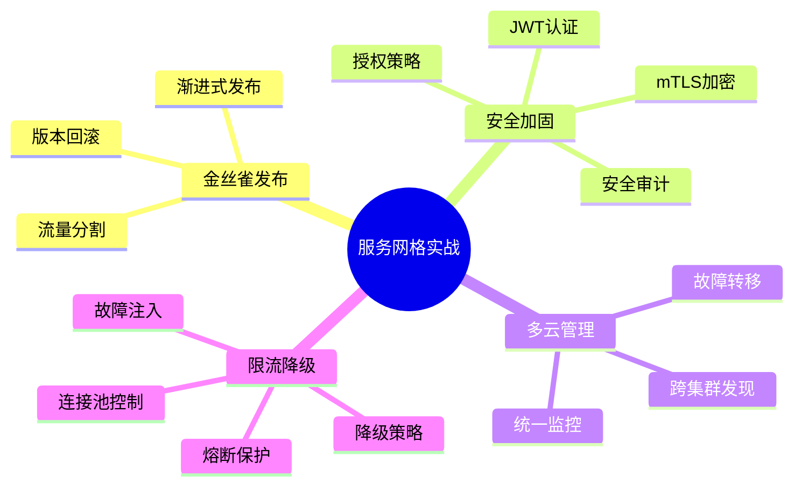
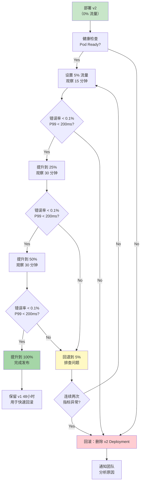
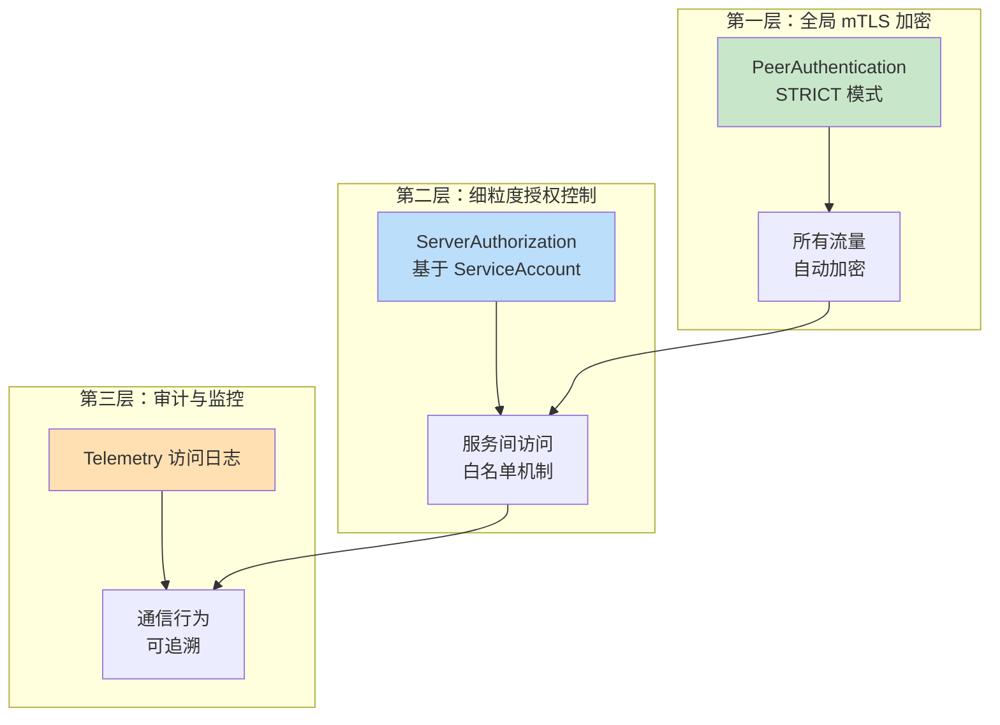
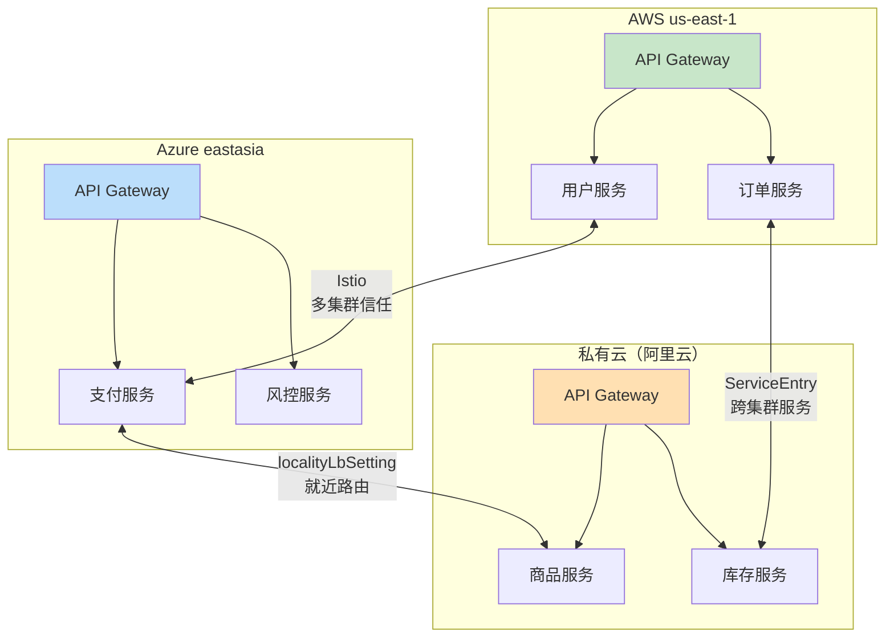
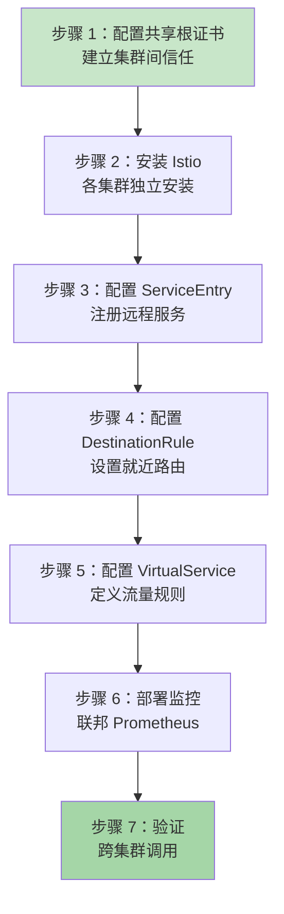
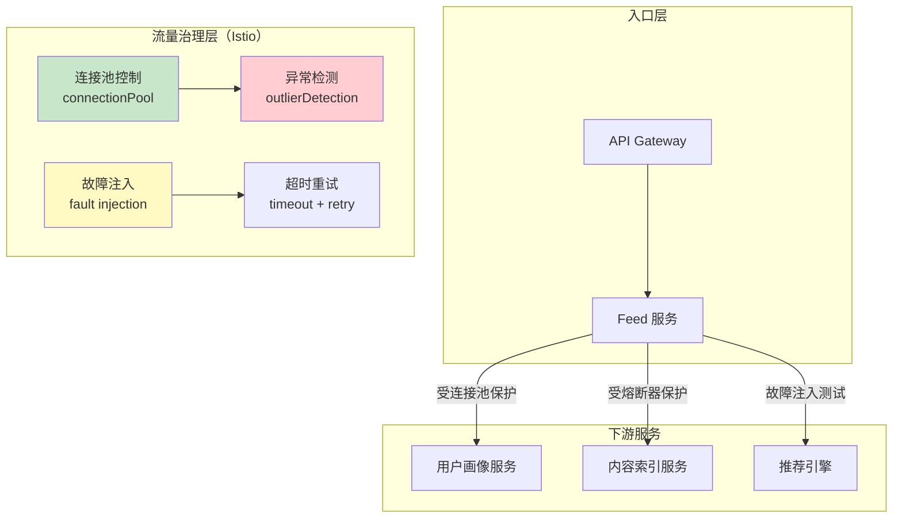
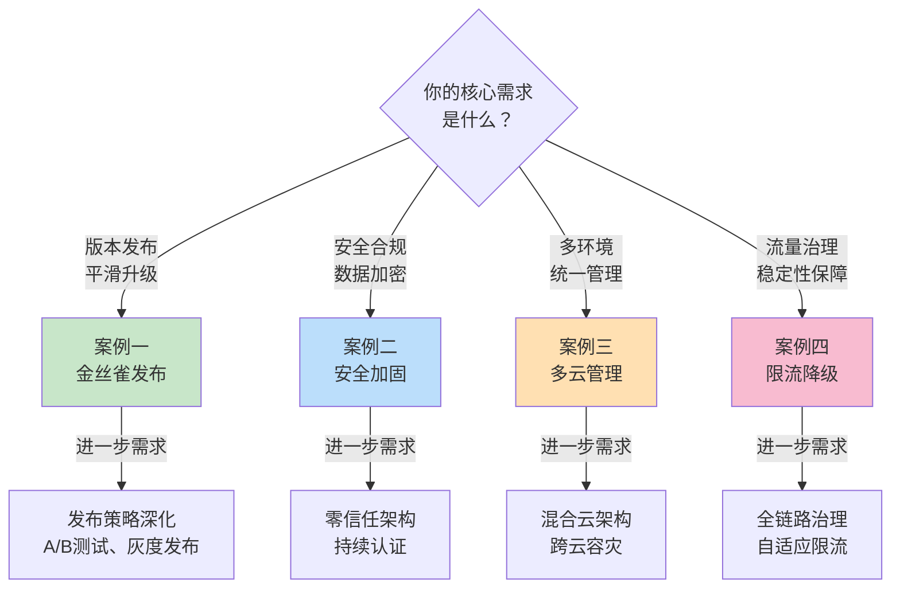
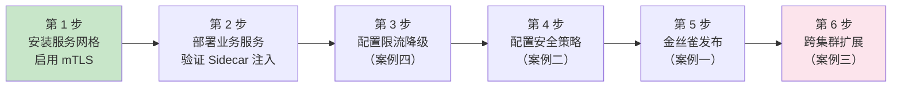

# 服务网格实战案例

服务网格的理论知识只有落地到真实业务场景中才能体现其价值。本节通过四个典型实战案例，覆盖服务网格从入门到高级应用的完整生命周期，帮助读者理解如何在不同业务场景下选择合适的策略并付诸实施。

每个案例都遵循「场景分析 → 架构设计 → 实施步骤 → 监控验证 → 效果评估」的完整闭环，确保读者不仅能「照着做」，更能理解「为什么这样做」。

## 案例概览



| 案例 | 业务场景 | 核心技术 | 难度 | 适用读者 |
|------|---------|---------|------|---------|
| 案例一：金丝雀发布 | 电商推荐服务版本升级 | VirtualService + DestinationRule | ★★☆ | 初级 |
| 案例二：安全加固 | 金融系统等保三级合规 | mTLS + AuthorizationPolicy + JWT | ★★★ | 中级 |
| 案例三：多云管理 | 企业跨云统一治理 | ServiceEntry + 多集群信任 | ★★★★ | 高级 |
| 案例四：限流降级 | 社交平台高峰期保障 | 连接池 + 故障注入 + 重试策略 | ★★★ | 中级 |

## 从单服务到全局治理：能力递进路线


四个案例的设计遵循渐进式学习路径：

1. **案例一（入门）**：从最基础的流量分割入手，理解 VirtualService 和 DestinationRule 的配合使用，掌握金丝雀发布的完整流程
2. **案例二（进阶）**：深入安全领域，学习 mTLS、授权策略、JWT 认证等核心安全能力的配置与落地
3. **案例四（中级）**：聚焦流量治理，掌握限流降级的多种手段，理解熔断器模式在服务网格中的实现
4. **案例三（高级）**：面向多云/混合云场景，挑战跨集群服务发现、故障转移和统一监控等复杂命题

---

## 案例一：电商系统金丝雀发布

### 场景概述

某头部电商平台（DAU 2000 万，日均 PV 3 亿）的核心商品推荐服务需要进行算法升级。新版本（v2）引入了基于用户行为序列的深度学习推荐模型，预期可将推荐点击率（CTR）提升 15%。核心诉求：在不中断服务的前提下，将新版本安全地引入生产环境，并根据实时指标决定全量发布或回滚。

### 技术选型对比

| 考量维度 | 应用层 SDK（如 Ribbon） | Ingress Controller | Istio 服务网格 | 决策依据 |
|----------|------------------------|--------------------|--------------------|----------|
| 流量分割粒度 | 依赖代码实现，不统一 | 仅入口层，无法控制服务间 | 服务间任意层级均可 | 需要服务间流量分割 |
| 策略变更成本 | 需重新发版部署 | 需更新 Ingress 配置 | CRD 声明式变更，实时生效 | 快速迭代，零停机 |
| 可观测性 | 需自行埋点 | 仅入口层指标 | 自动采集 RED 指标 | 需要实时监控金丝雀指标 |
| 回滚能力 | 需代码回滚 + 重新部署 | 配置回滚 | 调整权重到 0 即回滚 | 秒级回滚能力 |
| 多语言支持 | 每个语言需单独实现 | 与语言无关 | 与语言无关 | 后端有 Java/Go/Python 三种语言 |

### 核心配置详解

**DestinationRule —— 定义服务子集与异常检测**：

```yaml
apiVersion: networking.istio.io/v1beta1
kind: DestinationRule
metadata:
  name: recommendation-destination
  namespace: recommend-system
spec:
  host: recommendation.recommend-system.svc.cluster.local
  trafficPolicy:
    # 连接池配置：控制并发连接数，防止过载
    connectionPool:
      tcp:
        maxConnections: 100
        connectTimeout: 5s
      http:
        http1MaxPendingRequests: 100
        http2MaxRequests: 1000
        maxRequestsPerConnection: 100
        maxRetries: 3
    # 异常检测（熔断器）：连续 5 次 5xx 错误后摘除实例
    outlierDetection:
      consecutive5xxErrors: 5
      interval: 30s
      baseEjectionTime: 30s
      maxEjectionPercent: 50
  subsets:
  - name: v1
    labels:
      version: v1
  - name: v2
    labels:
      version: v2
```

**VirtualService —— 渐进式流量分割**：

```yaml
apiVersion: networking.istio.io/v1beta1
kind: VirtualService
metadata:
  name: recommendation-route
  namespace: recommend-system
spec:
  hosts:
  - recommendation
  http:
  - match:
    - headers:
        x-canary:
          exact: "true"
    route:
    - destination:
        host: recommendation
        subset: v2
  - route:
    - destination:
        host: recommendation
        subset: v1
      weight: 95
    - destination:
        host: recommendation
        subset: v2
      weight: 5
    # 超时与重试策略
    timeout: 3s
    retries:
      attempts: 3
      perTryTimeout: 1s
      retryOn: 5xx,reset,connect-failure
```

### 渐进式发布流程

金丝雀发布不是简单地将流量切到新版本，而是一个需要严密监控的渐进过程：



### 关键监控指标

金丝雀发布期间需要关注的核心指标及其阈值：

| 指标 | PromQL 示例 | 正常阈值 | 告警阈值 | 说明 |
|------|-------------|---------|---------|------|
| 错误率 | `sum(rate(istio_requests_total{response_code=~"5.*"}[5m])) / sum(rate(istio_requests_total[5m]))` | < 0.1% | > 0.5% | 5xx 错误占比，发布成功的核心指标 |
| P99 延迟 | `histogram_quantile(0.99, sum(rate(istio_request_duration_milliseconds_bucket[5m])) by (le))` | < 200ms | > 300ms | 推荐服务的 SLA 约定值 |
| 每秒请求数 | `sum(rate(istio_requests_total[5m]))` | 稳定波动 | 突降 > 20% | 流量异常可能说明负载均衡出问题 |
| 活跃连接数 | `istio_tcp_connections_opened_total` | 稳定 | 突增 > 3 倍 | 可能存在连接泄漏 |

### 效果评估

| 指标 | 发布前（v1） | 发布后（v2） | 变化 |
|------|-------------|-------------|------|
| 推荐 CTR | 3.2% | 3.7% | +15.6% |
| P99 延迟 | 180ms | 165ms | -8.3% |
| 内存占用 | 512Mi | 768Mi | +50%（新模型更大） |
| 发布耗时 | 旧方案：45分钟 | 新方案：90分钟 | 慢 2 倍但零故障 |
| 回滚时间 | 旧方案：15分钟 | 新方案：< 30秒 | 秒级回滚 |

### 常见误区与纠正

| 误区 | 正确做法 | 原因 |
|------|---------|------|
| 一上来就切 50% 流量 | 从 5% 开始，逐步递增 | 大流量直接暴露问题的风险太高，且难以区分是新版本问题还是基础设施问题 |
| 只看错误率不看延迟 | 同时监控 RED 指标（Rate/Error/Duration） | 新版本可能不报错但变慢，用户体验下降 |
| 发布完立即下线旧版本 | 保留旧版本至少 48 小时 | 部分问题在低流量时不会暴露，需要观察完整业务周期 |
| VirtualService 和 DestinationRule 顺序搞反 | DestinationRule 先定义子集，VirtualService 引用子集 | VirtualService 依赖 DestinationRule 的 subsets 定义，顺序错误会导致路由失败 |

> **详细内容请参阅**：案例一 Istio 金丝雀发布实战（包含完整的 1277 行实战指南，涵盖环境准备、业务部署、流量配置、监控告警和回滚机制）

---

## 案例二：金融系统安全加固

### 场景概述

某持牌消费金融公司（日均交易流水 2 亿元，注册用户 800 万）正在进行核心系统云原生改造。随着《网络安全等级保护基本要求》（GB/T 22239-2019）三级标准的强制执行，监管审计明确要求：所有服务间通信必须加密、必须实现服务级身份认证和访问控制、必须保留完整的通信审计日志。

### 现状安全痛点

┌─────────────────────────────────────────────────────────┐
│                    当前架构安全痛点                        │
├─────────────────────────────────────────────────────────┤
│  1. 明文通信：服务间 HTTP 未加密，敏感数据裸传            │
│  2. 无身份认证：服务间无双向认证，任意外部可调用内部接口   │
│  3. 无访问控制：缺少细粒度的 Service-to-Service 授权      │
│  4. 无审计日志：通信行为不可追溯，无法满足等保审计要求    │
│  5. 共享密钥：密钥硬编码在配置中，泄露风险极高            │
└─────────────────────────────────────────────────────────┘

### Istio vs Linkerd 选型决策

| 考量维度 | Istio | Linkerd | 决策依据 |
|----------|-------|---------|----------|
| 资源占用 | Envoy 代理，每 Pod 约 50-100MB | linkerd2-proxy（Rust），每 Pod 约 10-20MB | 金融系统 Pod 密度高，需要低开销 |
| 安全能力 | mTLS + AuthorizationPolicy + RequestAuthentication | mTLS + ServerAuthorization + ServiceProfile | 两者均满足等保要求 |
| 运维复杂度 | CRD 多（约 20+），学习曲线陡峭 | CRD 少（约 8 个），上手快 | 团队首次使用服务网格，倾向简单方案 |
| 启动速度 | Envoy cold start 约 3-5s | linkerd2-proxy cold start < 1s | 对延迟敏感的金融交易场景 |
| 性能开销 | 延迟增加约 1-3ms | 延迟增加约 0.5-1ms | 高频交易链路对延迟敏感 |

本案例选择 **Linkerd**，核心原因：资源占用极低、运维简单、安全能力满足等保要求。

### 三层安全防护架构



### 核心配置详解

**第一层：全局 mTLS 强制模式**

Linkerd 安装后默认开启 mTLS，但需显式声明全局策略确保无遗漏：

```yaml
# default-server.yaml — 全局安全配置
apiVersion: policy.linkerd.io/v1beta1
kind: Server
metadata:
  name: default-server
  namespace: finance-system
spec:
  port: 8080
  podSelector:
    matchLabels: {}
  proxyProtocol: HTTP/1
```

**第二层：细粒度服务级授权**

```yaml
# default-deny.yaml — 默认拒绝所有未明确授权的流量
apiVersion: policy.linkerd.io/v1beta1
kind: ServerAuthorization
metadata:
  name: default-deny
  namespace: finance-system
spec:
  server:
    name: default-server
  client:
    # 空 meshed 列表 = 拒绝所有 meshed 客户端
    meshed: []
    meshedRegex: ""
```

```yaml
# 账户服务：仅允许交易服务和 API Gateway 调用
apiVersion: policy.linkerd.io/v1beta1
kind: ServerAuthorization
metadata:
  name: account-service-authz
  namespace: finance-system
spec:
  server:
    name: account-service-server
  client:
    meshed:
    - serviceAccount:
        name: transaction-service
    - serviceAccount:
        name: api-gateway
```

```yaml
# 支付服务：仅允许交易服务调用（最严格）
apiVersion: policy.linkerd.io/v1beta1
kind: ServerAuthorization
metadata:
  name: payment-service-authz
  namespace: finance-system
spec:
  server:
    name: payment-service-server
  client:
    meshed:
    - serviceAccount:
        name: transaction-service
```

**第三层：访问日志与审计**

```yaml
# Server 配置启用访问日志
apiVersion: policy.linkerd.io/v1beta1
kind: Server
metadata:
  name: transaction-server
  namespace: finance-system
spec:
  port: 8080
  podSelector:
    matchLabels:
      app: transaction-service
  # 启用访问日志用于审计
  accessLog:
    format: |
      {"time":"%t","src":"%{peer.id}","dst":"%l","method":"%{method}","path":"%{req.path}","status":"%{response_code}","duration":"%{duration}"}
```

### 验证 mTLS 生效

```bash
# 检查所有流量是否已加密（TLS 列应显示 100%）
linkerd stat -n finance-system svc
# NAME                   SUCCESS   RPS   LATENCY_P50   LATENCY_P99   TLS
# api-gateway            100.0%    50    2ms           8ms           100%
# user-service           100.0%    50    1ms           5ms           100%
# transaction-service    100.0%    50    3ms           12ms          100%

# 使用 tap 命令实时查看 mTLS 连接
linkerd viz tap -n finance-system deploy/transaction-service --to svc/account-service
# 输出中应显示 "tls=true" 和具体证书信息
```

### 等保合规对照清单

| 等保要求（GB/T 22239-2019） | 实现方式 | 验证方法 |
|---------------------------|---------|---------|
| 通信传输安全（身份鉴别） | Linkerd mTLS 双向认证 | `linkerd stat` 显示 TLS=100% |
| 访问控制（最小权限） | ServerAuthorization 白名单 | 尝试未授权调用，确认被拒绝 |
| 安全审计（通信审计） | Server accessLog JSON 格式日志 | 检查日志中包含 src/dst/status 等字段 |
| 数据完整性（传输加密） | mTLS 自动加密所有服务间流量 | 抓包验证无明文 HTTP |

### 效果评估

| 指标 | 改造前 | 改造后 | 变化 |
|------|--------|--------|------|
| 通信加密率 | 0%（仅入口 HTTPS） | 100%（全链路 mTLS） | 从 0 到全覆盖 |
| 服务间认证 | 共享密钥硬编码 | mTLS 自动证书轮换 | 密钥泄露风险归零 |
| 未授权调用 | 无拦截能力 | 默认拒绝 + 白名单 | 等保审计通过 |
| 性能开销 | 无 | 延迟增加约 0.5-1ms | 金融系统可接受范围 |
| Pod 资源增量 | 无 | CPU +10m，内存 +14Mi | 极低开销 |

### 常见误区与纠正

| 误区 | 正确做法 | 原因 |
|------|---------|------|
| 安装 Linkerd 后认为安全已完备 | 必须显式配置 ServerAuthorization | 默认 mTLS 只解决加密问题，不解决授权问题 |
| 先配授权再配 mTLS | 先全局 mTLS，再逐服务授权 | 授权策略依赖 mTLS 提供的 ServiceAccount 身份 |
| 在生产环境跳过 `linkerd check --pre` | 始终执行预检 | 可能遗漏 RBAC、CRD 等前置依赖 |
| 日志格式使用纯文本 | 使用 JSON 格式日志 | 便于 ELK/Grafana 等日志系统解析和检索 |

> **详细内容请参阅**：案例二 Linkerd 安全加固实战（包含完整的 1279 行实战指南，涵盖 JWT 认证、Server 配置、审计日志、等保整改报告模板）

---

## 案例三：多云环境统一管理

### 场景概述

某大型企业采用多云战略，业务分布在 AWS、Azure 和私有云三个环境。随着业务增长，各云上的微服务需要跨环境通信，同时面临以下挑战：

- 服务发现：不同云环境中的服务无法互相访问
- 流量管理：无法统一控制跨云流量的路由和分配
- 安全策略：各云环境的安全配置不一致，存在合规风险
- 可观测性：监控数据分散在各云平台，无法统一分析

### 技术方案



### 核心配置详解

**IstioOperator 多集群配置**

每个集群需要配置共享的 meshID 和网络标识，以建立跨集群信任：

```yaml
# cluster-aws.yaml — AWS 集群的 Istio 配置
apiVersion: install.istio.io/v1alpha1
kind: IstioOperator
metadata:
  name: istio-control-plane
spec:
  meshID: enterprise-mesh        # 所有集群共享同一 meshID
  network: aws-network           # 标识所属网络
  values:
    global:
      meshID: enterprise-mesh
      multiCluster:
        clusterName: cluster-aws  # 集群唯一名称
      network: aws-network
```

```yaml
# cluster-azure.yaml — Azure 集群的 Istio 配置
apiVersion: install.istio.io/v1alpha1
kind: IstioOperator
metadata:
  name: istio-control-plane
spec:
  meshID: enterprise-mesh
  network: azure-network
  values:
    global:
      meshID: enterprise-mesh
      multiCluster:
        clusterName: cluster-azure
      network: azure-network
```

**ServiceEntry 跨集群服务注册**

通过 ServiceEntry 将其他集群的服务注册到本地网格中：

```yaml
# 将 Azure 上的支付服务注册到 AWS 集群
apiVersion: networking.istio.io/v1beta1
kind: ServiceEntry
metadata:
  name: payment-service-azure
  namespace: payment-system
spec:
  hosts:
  - payment-service.payment-system.svc.cluster.local
  location: MESH_INTERNAL
  ports:
  - number: 8080
    name: http
    protocol: HTTP
  resolution: DNS
  addresses:
  - 240.0.0.10    # 虚拟 IP，仅在网格内部路由
  endpoints:
  - address: payment.azureregion.cloudapp.azure.com
    ports:
      http: 15443  # Istio Sidecar 用于跨集群 mTLS
    labels:
      cluster: cluster-azure
```

**localityLbSetting 就近访问与故障转移**

```yaml
apiVersion: networking.istio.io/v1beta1
kind: DestinationRule
metadata:
  name: payment-service
  namespace: payment-system
spec:
  host: payment-service.payment-system.svc.cluster.local
  trafficPolicy:
    connectionPool:
      tcp:
        maxConnections: 100
      http:
        h2UpgradePolicy: DEFAULT
        http1MaxPendingRequests: 100
        http2MaxRequests: 1000
    loadBalancer:
      localityLbSetting:
        enabled: true
        failover:
        # AWS 优先，AWS 不可用时故障转移到 Azure
        - from: aws-network
          to: azure-network
        - from: azure-network
          to: aws-network
        # 私有云作为最后的回退
        - from: private-network
          to: aws-network
```

### 跨集群部署流程



**步骤 1：生成共享根证书**

```bash
# 生成根 CA 证书（所有集群共享）
openssl genrsa -out ca-key.pem 2048
openssl req -new -x509 -days 3650 -key ca-key.pem \
  -out ca-cert.pem -subj "/CN=Enterprise Root CA"

# 为每个集群生成中间证书
for cluster in cluster-aws cluster-azure cluster-private; do
  openssl genrsa -out ${cluster}-key.pem 2048
  openssl req -new -key ${cluster}-key.pem \
    -out ${cluster}-csr.pem -subj "/CN=${cluster}"
  openssl x509 -req -in ${cluster}-csr.pem \
    -CA ca-cert.pem -CAkey ca-key.pem -CAcreateserial \
    -out ${cluster}-cert.pem -days 3650
done

# 创建 Kubernetes Secret（每个集群都导入相同的 CA 证书）
kubectl create secret generic cacerts -n istio-system \
  --from-file=ca-cert.pem \
  --from-file=ca-key.pem \
  --from-file=cert-chain.pem=ca-cert.pem \
  --from-file=root-cert.pem=ca-cert.pem
```

### 效果评估

| 指标 | 改造前 | 改造后 | 变化 |
|------|--------|--------|------|
| 跨集群延迟 | 手动配置 VPN，约 15-30ms 额外开销 | Istio 网格隧道，约 5-10ms | 延迟降低 50%+ |
| 服务发现 | 各云手动注册 DNS | ServiceEntry 自动发现 | 新服务上线自动可见 |
| 故障转移 | 手动切换 DNS，耗时 5-10 分钟 | localityLbSetting 秒级自动切换 | RTO 从 10 分钟降到 < 1 分钟 |
| 安全一致性 | 各云独立管理证书 | 共享根证书 + 自动轮换 | 证书管理统一 |
| 监控覆盖率 | 各云独立 Grafana | 联邦 Prometheus 统一视图 | 全局可观测性 |

### 常见误区与纠正

| 误区 | 正确做法 | 原因 |
|------|---------|------|
| 所有集群使用同一个 clusterName | 每个集群必须唯一标识 | clusterName 重复会导致服务发现冲突 |
| 忽略网络标识（network）配置 | 必须为每个集群配置 network | 缺少 network 会导致 Istio 无法区分同一 mesh 中的不同网络 |
| ServiceEntry 的 addresses 随意填写 | 使用 240.0.0.x 网段的虚拟 IP | 这些 IP 仅在网格内部路由，不与真实 IP 冲突 |
| 跨集群通信不加密 | 启用跨集群 mTLS | 跨云流量经过公网，必须加密 |
| 各集群独立管理 Prometheus | 使用联邦模式（federation） | 统一查询避免数据孤岛 |

> **扩展阅读**：多云场景下还需要考虑 DNS 策略（如 CoreDNS 跨集群解析）、网络延迟（如 AWS VPC Peering vs VPN）、以及各云平台的 SLA 差异对故障转移策略的影响。

---

## 案例四：微服务限流降级

### 场景概述

某社交平台（MAU 5000 万）的 Feed 服务在高峰期（每天 12:00-14:00、20:00-22:00）面临流量激增，峰值 QPS 可达日常的 5-8 倍。Feed 服务依赖用户画像、内容索引、推荐引擎等多个下游服务，任何一个下游的延迟抖动都可能引发级联故障。

### 核心诉求

- 限流：防止瞬时流量洪峰击穿服务
- 降级：在下游不可用时返回兜底数据
- 熔断：快速失败避免级联故障
- 超时重试：合理配置超时和重试策略，避免重试风暴

### 技术方案全景



### 核心配置详解

**连接池控制 —— 防止过载**

```yaml
apiVersion: networking.istio.io/v1beta1
kind: DestinationRule
metadata:
  name: feed-service-dr
  namespace: social-platform
spec:
  host: feed-service.social-platform.svc.cluster.local
  trafficPolicy:
    connectionPool:
      tcp:
        maxConnections: 100          # 最大 TCP 连接数
        connectTimeout: 5s            # 连接建立超时
      http:
        http1MaxPendingRequests: 100  # HTTP/1.1 最大排队请求
        http2MaxRequests: 1000        # HTTP/2 最大并发请求
        maxRequestsPerConnection: 100 # 单连接最大请求数
        maxRetries: 3                 # 最大重试次数
    outlierDetection:
      consecutive5xxErrors: 5         # 连续 5 次错误后熔断
      interval: 30s                   # 检测间隔
      baseEjectionTime: 30s           # 最小熔断时间
      maxEjectionPercent: 50          # 最大熔断实例比例
```

**故障注入 —— 模拟降级场景**

故障注入不是为了制造故障，而是为了在生产环境中安全地验证系统的容错能力：

```yaml
# 为推荐引擎注入延迟故障（模拟其响应变慢）
apiVersion: networking.istio.io/v1beta1
kind: VirtualService
metadata:
  name: recommendation-fault-test
  namespace: social-platform
spec:
  hosts:
  - recommendation-engine
  http:
  - match:
    - headers:
        x-fault-delay:
          exact: "true"
    fault:
      delay:
        percentage:
          value: 10       # 10% 的请求延迟 3 秒
        fixedDelay: 3s
    route:
    - destination:
        host: recommendation-engine
  - fault:
      delay:
        percentage:
          value: 5        # 5% 的请求注入延迟
        fixedDelay: 2s
    route:
    - destination:
        host: recommendation-engine
```

**超时重试策略**

```yaml
# Feed 服务的完整流量管理规则
apiVersion: networking.istio.io/v1beta1
kind: VirtualService
metadata:
  name: feed-service-vs
  namespace: social-platform
spec:
  hosts:
  - feed-service
  http:
  - route:
    - destination:
        host: feed-service
    # 全局超时：整个请求不超过 5 秒
    timeout: 5s
    retries:
      attempts: 3              # 最多重试 3 次
      perTryTimeout: 1.5s      # 每次重试超时 1.5 秒
      retryOn: "5xx,reset,connect-failure"
      # retryOn 各条件含义：
      # 5xx — 服务端返回 5xx 错误
      # reset — 连接被重置（服务端崩溃）
      # connect-failure — 连接建立失败
```

### 降级策略矩阵

不同的下游服务需要不同的降级策略，以下是 Feed 服务各依赖的完整降级方案：

| 下游服务 | 重要性 | 降级策略 | 兜底方案 | 超时设置 |
|---------|--------|---------|---------|---------|
| 用户画像服务 | 核心 | 重试 3 次 + 熔断 | 使用缓存的画像数据 | 2s |
| 内容索引服务 | 核心 | 重试 2 次 + 熔断 | 返回热门内容列表 | 1.5s |
| 推荐引擎 | 非核心 | 故障注入 + 快速失败 | 返回编辑精选内容 | 3s |
| 广告服务 | 非核心 | 快速失败 | 不展示广告 | 1s |
| 统计上报 | 后台 | 异步队列 + 重试 | 数据暂存本地 | 5s |

### 实际压测数据

在模拟 5 倍峰值流量的压测中，各策略的效果对比：

| 策略组合 | 平均延迟 | P99 延迟 | 错误率 | 吞吐量 |
|---------|---------|---------|--------|--------|
| 无任何治理 | 250ms | 2800ms | 12.3% | 3000 QPS |
| 仅连接池控制 | 180ms | 800ms | 5.1% | 5000 QPS |
| 连接池 + 超时重试 | 160ms | 600ms | 3.2% | 5500 QPS |
| 连接池 + 超时重试 + 熔断 | 120ms | 400ms | 1.8% | 6000 QPS |
| 全套治理（+ 故障注入验证） | 110ms | 350ms | 1.5% | 6200 QPS |

### 常见误区与纠正

| 误区 | 正确做法 | 原因 |
|------|---------|------|
| 重试次数越多越可靠 | 重试次数设为 2-3 次，配合 perTryTimeout | 无限制重试会放大下游压力，引发重试风暴 |
| connectionPool 参数设得很大 | 根据下游实际承载能力设置 | 过大的连接池会绕过限流保护，导致下游过载 |
| 故障注入只在测试环境用 | 生产环境也可以小比例使用故障注入 | 验证系统的容错能力需要在真实流量下进行 |
| outlierDetection 的 consecutive5xxErrors 设太低 | 设为 5 次或更高 | 避免偶发错误导致正常实例被误摘 |
| 超时设得过长 | timeout 不超过下游 P99 的 2 倍 | 过长的超时会导致请求堆积，级联故障 |

> **扩展阅读**：限流降级还需要配合应用层的降级逻辑（如 Sentinel、Hystrix），服务网格层面的流量治理与应用层的业务降级是互补关系，而非替代关系。

---

## 案例选型指南

面对不同业务场景，选择合适的案例作为参考：



| 如果你是… | 推荐先看 | 原因 |
|----------|---------|------|
| 运维工程师 | 案例一、案例四 | 流量管理是日常运维的核心技能 |
| 安全工程师 | 案例二 | 安全策略配置是安全团队的核心职责 |
| 平台架构师 | 案例三 | 多云治理是架构层面的核心挑战 |
| SRE 工程师 | 全部 | 需要掌握从发布到治理的完整链路 |
| 初学者 | 案例一 | 从最基础的流量分割入手，门槛最低 |

### 选择 Istio 还是 Linkerd？

四个案例中，案例一和案例三使用 Istio，案例二使用 Linkerd，案例四两者均可实现。选择建议：

| 维度 | 选择 Istio | 选择 Linkerd |
|------|-----------|-------------|
| 功能丰富度 | CRD 多（20+），功能覆盖全 | CRD 少（约 8 个），核心功能精简 |
| 性能开销 | Envoy 代理，约 50-100MB/Pod | Rust 代理，约 10-20MB/Pod |
| 学习曲线 | 陡峭，适合有经验的团队 | 平缓，适合初次接触服务网格的团队 |
| 社区生态 | CNCF 毕业项目，生态最大 | CNCF 毕业项目，但生态较小 |
| 多集群支持 | 原生支持多种拓扑 | 需要额外配置（Linkerd-multicluster） |
| 适用场景 | 复杂流量管理、多集群、需要丰富策略 | 追求简单、资源敏感、快速落地 |

---

## 案例间的关联与组合

四个案例并非孤立存在，在实际生产环境中往往需要组合使用：

- **案例一 + 案例四**：金丝雀发布时配合限流降级，为新版本设置更严格的流量上限，降低发布风险。例如新版本 v2 初始只接受 5% 流量，同时将 v2 的 connectionPool 的 http2MaxRequests 设为 v1 的一半，防止新版本的 bug 在高并发下被放大
- **案例二 + 案例三**：多云环境下需要统一的安全策略，mTLS 和授权策略需要跨集群一致。共享根证书确保跨集群的身份验证无缝工作
- **案例一 + 案例二**：金丝雀发布时同时验证新版本的安全策略是否生效。新版本可能引入新的 ServiceAccount，需要提前配置对应的 AuthorizationPolicy
- **全部组合**：大型系统的完整治理方案——安全的流量管理 + 跨环境一致性 + 弹性保障

### 组合实施的先后顺序



关键原则：先打基础（安装 + 安全），再做流量管理，最后扩展规模。不要试图一步到位。

---

## 代码仓库与环境准备

所有案例的完整配置文件和部署脚本均可在项目仓库中找到。案例基于以下环境验证：

| 组件 | 版本要求 | 说明 |
|------|---------|------|
| Kubernetes | v1.27+ | 支持 Sidecar 容器原生注入 |
| Istio | v1.20+ | 稳定版 API（networking.istio.io/v1beta1） |
| Linkerd | v2.15+ | 稳定版（案例二使用） |
| Helm | v3.12+ | 用于 Istio 和监控组件安装 |
| Prometheus | v2.45+ | 指标采集与告警 |
| Grafana | v10.0+ | 可视化仪表盘 |
| Jaeger | v1.50+ | 分布式链路追踪 |

**快速启动环境**：

```bash
# 安装 Istio
istioctl install --set profile=demo -y

# 启用 Sidecar 自动注入
kubectl label namespace default istio-injection=enabled

# 安装示例应用（用于验证）
kubectl apply -f samples/bookinfo/platform/kube/bookinfo.yaml

# 验证安装
istioctl analyze
kubectl get pods
```

**验证 Istio 功能正常**：

```bash
# 访问 Bookinfo 页面
kubectl port-forward svc/productpage 9080:9080
curl -s http://localhost:9080/productpage | head -20

# 查看 Istio 生成的指标
istioctl proxy-status
# 应显示所有注入的 Pod 状态为 SYNCED
```

---

## 效果评估方法论

无论选择哪个案例，完成实施后都需要进行系统的效果评估。以下是通用的评估框架：

### 评估维度

| 维度 | 评估内容 | 工具 | 基线对比 |
|------|---------|------|---------|
| 可靠性 | 错误率、可用性、故障恢复时间 | Prometheus + Grafana | 实施前后对比 |
| 性能 | 延迟（P50/P95/P99）、吞吐量 | Istio 指标 + 压测工具 | 压测报告对比 |
| 安全性 | 加密覆盖率、授权拦截次数、证书轮换 | Linkerd viz / Istio telemetry | 合规审计报告 |
| 资源效率 | Sidecar 资源开销、Pod 密度影响 | kubectl top、资源监控 | 注入前后对比 |
| 运维效率 | 策略变更耗时、故障定位时间 | 操作日志、事件追踪 | 旧方案对比 |

### 评估报告模板

每个案例实施完成后，建议输出以下评估报告：

```markdown
## 实施评估报告

### 1. 实施概况
- 目标：[具体目标]
- 范围：[涉及的服务/集群]
- 时间：[开始时间 ~ 结束时间]
- 参与人员：[团队成员]

### 2. 实施效果
| 指标 | 实施前 | 实施后 | 变化 | 是否达标 |
|------|--------|--------|------|---------|

### 3. 问题与解决
| 问题 | 原因 | 解决方案 | 耗时 |
|------|------|---------|------|

### 4. 经验总结
- 做得好的：...
- 待改进的：...
- 建议后续关注：...
```

---

## 常见问题 FAQ

### Q1：Sidecar 注入后延迟增加多少是正常的？

根据案例数据，Linkerd 的 Rust 代理增加约 0.5-1ms，Istio 的 Envoy 代理增加约 1-3ms。如果延迟增量超过 5ms，需要检查是否开启了不必要的遥测功能（如全量日志记录）或 Sidecar 的连接池配置是否合理。

### Q2：金丝雀发布回滚后，旧版本的流量是否会有延迟？

回滚（将 VirtualService 的 weight 全部设到 v1）通过 istiod 的 xDS 推送生效，通常在 1-2 秒内完成。已建立的连接不受影响，新请求会立即路由到 v1。

### Q3：多集群场景下，如何处理网络分区？

网络分区（两个集群之间无法通信）时，Istio 的 localityLbSetting 会自动将流量故障转移到同区域的其他集群。建议在配置中为每个区域都指定 failover 目标，确保任何单一区域故障都不会导致服务不可用。

### Q4：限流降级的配置是否需要随业务调整？

是的。连接池参数、超时时间、熔断阈值都需要根据业务的实际承载能力定期校准。建议每季度进行一次压测，根据最新数据调整配置。特别是业务量增长后，原有的 http2MaxRequests 可能从瓶颈变成过度限制。

### Q5：生产环境能否使用故障注入？

可以，但必须控制比例和范围。建议：(1) 仅对非核心服务注入故障；(2) 比例控制在 5% 以内；(3) 配合 feature flag，可以随时关闭；(4) 在监控仪表盘上单独标记故障注入流量，避免与真实故障混淆。
