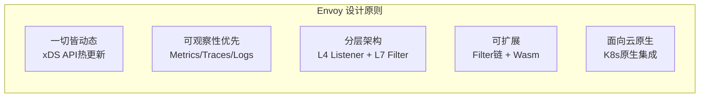
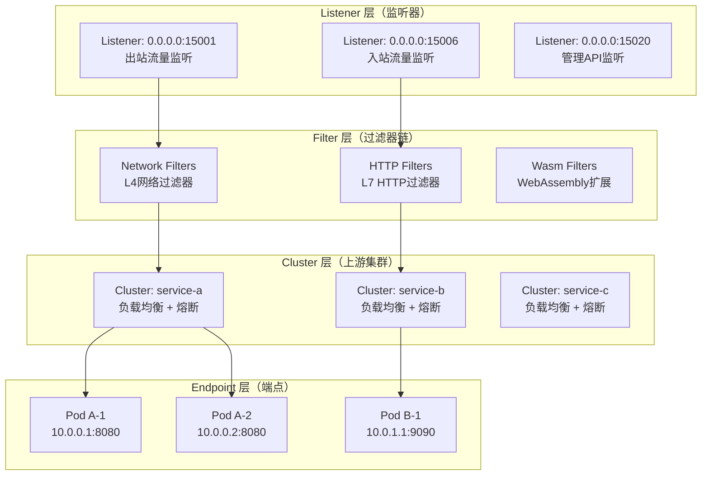
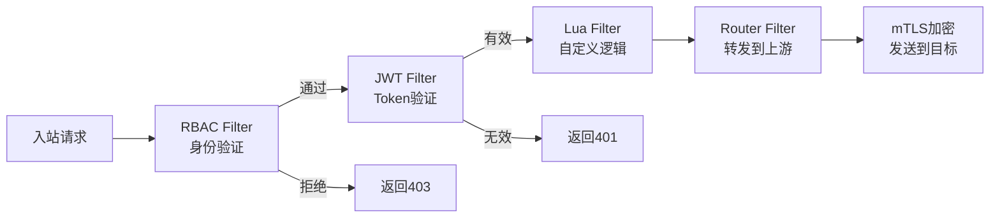
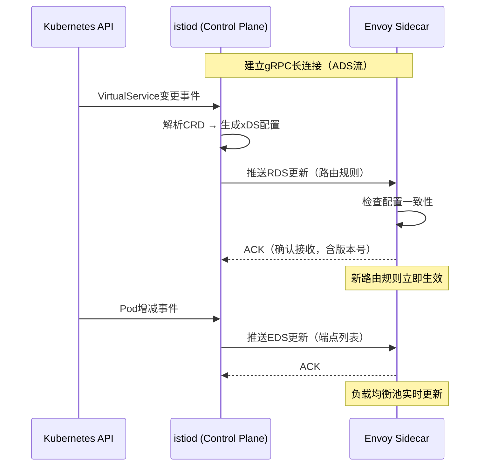
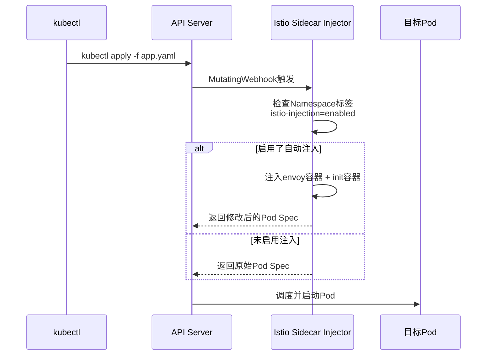
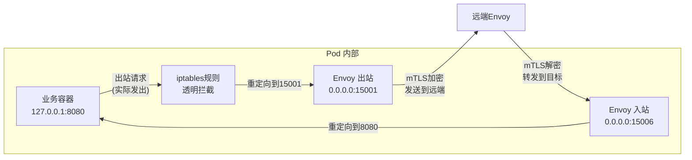
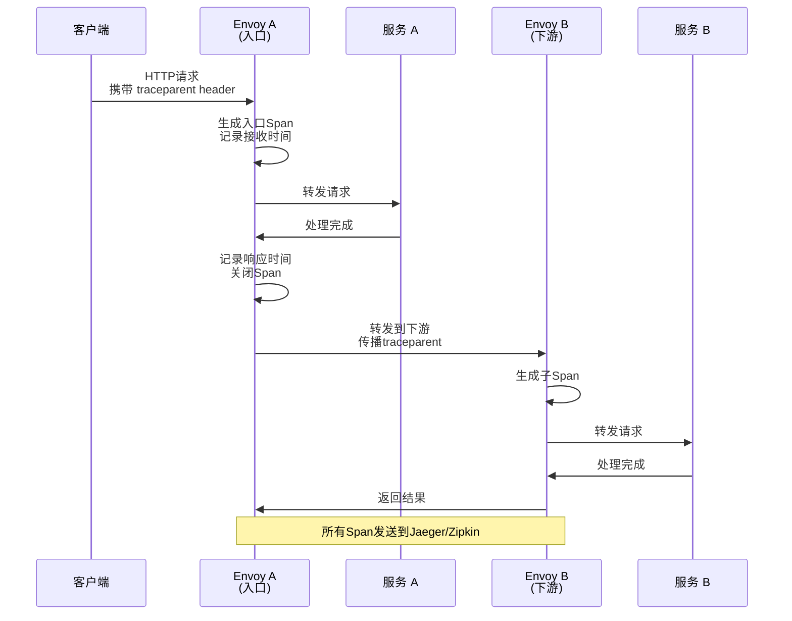
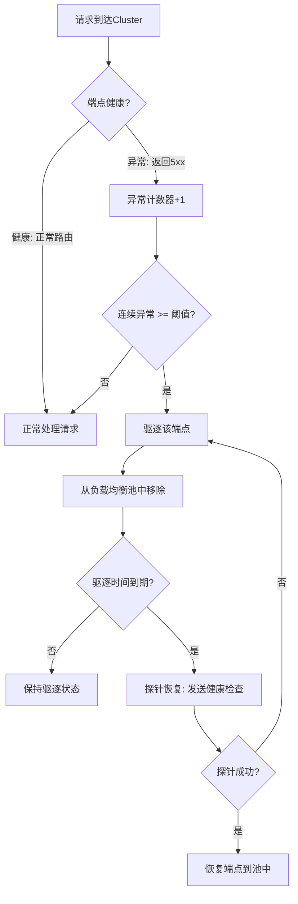
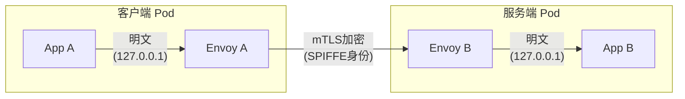
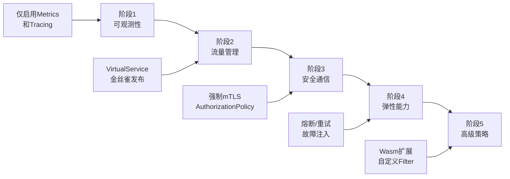

# 一、Envoy代理：服务网格的数据平面引擎

Envoy是CNCF毕业项目，也是Istio服务网格中数据平面的核心组件。它本质上是一个高性能的L4/L7网络代理，通过Sidecar模式透明地注入到每个服务Pod中，承担服务发现、负载均衡、流量管理、安全通信和可观测性等所有网络层面的横切关注点。理解Envoy，是掌握服务网格的第一步。

---

## 1. Envoy是什么：从传统代理到云原生代理

### 1.1 传统代理的局限

在Envoy出现之前，Nginx和HAProxy是应用最广泛的代理方案。它们在传统架构中表现优秀，但在云原生微服务场景下面临根本性挑战：

| 维度 | Nginx/HAProxy | Envoy |
|------|--------------|-------|
| 配置方式 | 文件配置，需reload | 动态API配置，热更新无需重启 |
| 服务发现 | 需要外部工具（Consul/etcd） | 原生xDS协议，动态感知端点变化 |
| 可观测性 | 需额外插件（Prometheus exporter等） | 内置完整的Metrics/Traces/Logs |
| 协议支持 | HTTP/1.1为主，gRPC支持有限 | HTTP/1.1、HTTP/2、gRPC、TCP原生支持 |
| 扩展机制 | C模块编译，需重编译Envoy | Lua脚本 + WebAssembly（Wasm）热加载 |
| 连接管理 | 连接池功能有限 | 完善的连接池 + 异常检测 + 熔断 |
| 部署模式 | 独立进程/集群 | Sidecar模式，与工作负载1:1绑定 |

**关键区别**：传统代理是"配置驱动"的静态代理，Envoy是"API驱动"的动态代理。这个区别决定了Envoy能否适应Kubernetes中Pod频繁创建销毁的环境。

### 1.2 Envoy的设计哲学

Envoy的设计遵循以下核心原则：

- **一切皆动态**：所有配置都可以在运行时通过API修改，无需重启或reload
- **可观察性优先**：内置详细的统计指标、分布式追踪和访问日志
- **分层架构**：L4（TCP/UDP）和L7（HTTP/gRPC）清晰分离
- **可扩展性**：通过Filter链和Wasm机制实现功能扩展
- **面向云原生**：原生支持服务发现、健康检查、负载均衡



---

## 2. Envoy的架构全景

### 2.1 核心组件关系

Envoy的内部架构可以分为四个核心层次，每一层承担不同的职责：



### 2.2 Listener（监听器）

Listener是Envoy的入口点，定义了Envoy在哪个端口、以什么协议接收流量。在Istio Sidecar模式下，Envoy会创建两个核心Listener：

**入站Listener（15006端口）**：拦截所有进入Pod的流量

0.0.0.0:15006 (Inbound)
├── FilterChainMatch: TCP/HTTP
│   ├── NetworkFilter: envoy.filters.network.rbac
│   │   └── 基于SPIFFE身份的访问控制
│   ├── HTTPConnectionManager
│   │   ├── RouteConfig → 路由到本地服务(127.0.0.1:实际端口)
│   │   ├── AccessLog Filter → 记录访问日志
│   │   └── Stats Filter → 采集请求指标
│   └── TLS Inspector → 检测TLS/SNI

**出站Listener（15001端口）**：拦截所有离开Pod的流量

0.0.0.0:15001 (Outbound)
├── FilterChainMatch: TCP/HTTP
│   ├── HTTPConnectionManager
│   │   ├── RouteConfig → 按VirtualService规则路由
│   │   ├── Fault Filter → 故障注入（可选）
│   │   ├── RateLimit Filter → 限流（可选）
│   │   └── CORS Filter → 跨域策略（可选）
│   └── TLS Inspector → 检测SNI，用于路由决策

**Listener的工作流程**：

外部请求 → iptables拦截 → 重定向到15006端口
    → Listener接收
    → FilterChain依次处理（RBAC → JWT → 路由 → 访问日志）
    → 路由决策：转发到哪个上游服务
    → Cluster层：选择具体的后端Pod
    → 通过mTLS加密发送到目标Envoy

### 2.3 Filter（过滤器链）

Filter是Envoy最核心的扩展机制，它决定了请求在经过Listener后如何被处理。Filter分为三个层级：

**Network Filter（L4层）**：

| Filter | 功能 | 典型用途 |
|--------|------|----------|
| `envoy.filters.network.rbac` | 基于身份的访问控制 | AuthorizationPolicy实现 |
| `envoy.filters.network.tcp_proxy` | TCP代理转发 | 非HTTP流量的透明代理 |
| `envoy.filters.network.mongo_proxy` | MongoDB协议解析 | MongoDB流量的指标采集 |
| `envoy.filters.network.redis_proxy` | Redis协议代理 | Redis集群的代理和路由 |

**HTTP Filter（L7层）**：

| Filter | 功能 | 典型用途 |
|--------|------|----------|
| `envoy.filters.http.jwt_authn` | JWT Token验证 | API网关认证 |
| `envoy.filters.http.fault` | 故障注入 | 混沌工程、延迟注入 |
| `envoy.filters.http.cors` | CORS策略 | 跨域资源共享控制 |
| `envoy.filters.http.ratelimit` | 速率限制 | API限流保护 |
| `envoy.filters.http.lua` | Lua脚本执行 | 自定义请求/响应处理 |
| `envoy.filters.http.ext_authz` | 外部授权服务 | 与外部IAM系统集成 |
| `envoy.filters.http.wasm` | WebAssembly扩展 | 自定义业务逻辑 |
| `envoy.filters.http.router` | 路由转发 | 将请求转发到上游集群 |

**Filter链的执行顺序**：Filter按声明顺序依次执行，前一个Filter的输出是后一个Filter的输入。如果某个Filter决定拦截请求（如RBAC拒绝），后续Filter不会被执行。



### 2.4 Cluster（上游集群）

Cluster定义了一组逻辑上相同的服务端点（Endpoints）。每个Cluster配置了独立的负载均衡策略、熔断规则和健康检查参数：

```yaml
# Envoy Cluster 配置示例（由istiod自动生成）
clusters:
  - name: outbound|http|reviews.default.svc.cluster.local
    type: EDS                          # 端点通过EDS动态发现
    lb_policy: ROUND_ROBIN             # 负载均衡策略
    eds_cluster_config:
      eds_config:
        api_config_source:
          api_type: GRPC
          grpc_services:
            - envoy_grpc:
                cluster_name: xds-grpc   # 通过xDS获取端点
    circuit_breakers:                  # 熔断器配置
      thresholds:
        - max_connections: 1024
          max_pending_requests: 1024
          max_requests: 1024
          max_retries: 3
    outlier_detection:                 # 异常检测
      consecutive_5xx: 5               # 连续5次5xx则移除端点
      interval: 10s
      base_ejection_time: 30s
      max_ejection_percent: 50
```

### 2.5 Endpoint（端点）

Endpoint是Cluster中的具体实例，在Kubernetes环境中对应一个Pod的IP:Port。Endpoint通过EDS（Endpoint Discovery Service）动态更新，当Pod被创建、销毁或就绪状态变更时，Envoy会实时感知端点变化，无需重启或重新加载配置。

---

## 3. xDS协议：Envoy的动态配置引擎

xDS（x Discovery Service）是Envoy与控制平面（istiod）之间通信的核心协议族。它使得Envoy的所有配置都可以在运行时动态更新，这是Envoy区别于传统代理的关键能力。

### 3.1 xDS协议族详解

| xDS类型 | 全称 | 功能 | 触发场景 |
|---------|------|------|----------|
| LDS | Listener Discovery Service | 动态更新监听器配置 | Gateway/端口变更 |
| RDS | Route Discovery Service | 动态更新路由规则 | VirtualService变更 |
| CDS | Cluster Discovery Service | 动态更新上游集群 | DestinationRule变更 |
| EDS | Endpoint Discovery Service | 动态更新集群端点 | Pod增减/就绪状态变更 |
| SDS | Secret Discovery Service | 动态更新TLS证书 | 证书签发/轮转 |
| ADS | Aggregated Discovery Service | 聚合所有xDS，保证配置一致性 | 所有配置变更 |

### 3.2 xDS的推送机制



**关键机制**：

- **长轮询（Long Polling）**：Envoy与istiod保持gRPC长连接，配置变更时主动推送
- **版本控制**：每次配置更新携带版本号（version_info），Envoy通过ACK/NACK确认接收或拒绝
- **一致性保证**：通过ADS聚合通道，确保LDS→RDS→CDS→EDS的更新顺序一致
- **幂等更新**：相同配置重复推送不会产生副作用

### 3.3 xDS的性能考量

在大规模集群（数千个Pod）中，xDS的推送频率和效率直接影响系统性能：

- **EDS增量推送**：Istio 1.11+支持增量EDS（Delta xDS），只推送变化的端点而非全量列表
- **CDS批量聚合**：多个Cluster的变更合并为一次推送，减少网络开销
- **RDS按需推送**：只有受影响的路由配置被更新，而非整个RouteConfig
- **ADS有序保证**：通过聚合通道避免配置不一致导致的瞬态错误

---

## 4. Envoy在Istio中的工作模式

### 4.1 Sidecar注入机制

Istio通过Kubernetes的MutatingWebhook机制自动将Envoy代理注入到Pod中：



**注入后的Pod结构**：

```yaml
# 注入Envoy Sidecar后的Pod结构
apiVersion: v1
kind: Pod
metadata:
  labels:
    sidecar.istio.io/inject: "true"
spec:
  initContainers:
  - name: istio-init           # 初始化iptables规则
    image: proxyv2
    command: ["sh", "-c", "iptables -t nat -A OUTPUT ..."]
  containers:
  - name: app                  # 业务容器（原始）
    image: my-service:v1
    ports:
    - containerPort: 8080
  - name: istio-proxy          # Envoy Sidecar容器
    image: proxyv2
    env:
    - name: POD_NAME
      valueFrom:
        fieldRef:
          fieldPath: metadata.name
    ports:
    - containerPort: 15001     # 出站监听
    - containerPort: 15006     # 入站监听
    - containerPort: 15020     # 管理API
    - containerPort: 15090     # Prometheus指标
    resources:
      requests:
        cpu: 100m
        memory: 128Mi
      limits:
        cpu: 2000m
        memory: 1Gi
    readinessProbe:
      httpGet:
        path: /healthz/ready
        port: 15021
```

**init容器的作用**：`istio-init`容器在Envoy启动前配置iptables规则，将Pod的所有入站和出站流量透明地重定向到Envoy的监听端口。具体规则：

# 入站流量重定向（15006端口）
iptables -t nat -A ISTIO_IN_REDIRECT -p tcp -j REDIRECT --to-ports 15006

# 出站流量重定向（15001端口）
iptables -t nat -A ISTIO_OUTPUT -p tcp -j REDIRECT --to-ports 15001

# 排除Envoy自身流量（避免循环）
iptables -t nat -A ISTIO_OUTPUT -o lo -p tcp ! --dport 15001 -j RETURN

### 4.2 流量拦截与转发

Envoy通过iptables实现透明的流量拦截，对业务容器完全无感知：



**关键细节**：

- 业务容器使用`127.0.0.1`访问目标服务，iptables将这些请求重定向到Envoy
- Envoy通过服务发现获取真实的目标Pod IP，建立mTLS连接
- 整个过程对业务代码完全透明，无需修改一行代码
- Envoy自身发出的流量会被排除在外（避免流量循环）

### 4.3 Envoy Sidecar的资源管理

在生产环境中，合理配置Envoy Sidecar的资源限制至关重要：

| 场景 | CPU Request | CPU Limit | Memory Request | Memory Limit |
|------|------------|-----------|---------------|-------------|
| 开发/测试 | 50m | 500m | 64Mi | 256Mi |
| 一般服务 | 100m | 1000m | 128Mi | 512Mi |
| 高流量服务 | 200m | 2000m | 256Mi | 1Gi |
| 核心网关 | 500m | 4000m | 512Mi | 2Gi |

**资源优化建议**：

```yaml
# 通过Pod注解自定义Sidecar资源（按需覆盖）
metadata:
  annotations:
    sidecar.istio.io/proxyCPU: "200m"           # 自定义CPU Request
    sidecar.istio.io/proxyCPULimit: "1000m"      # 自定义CPU Limit
    sidecar.istio.io/proxyMemory: "256Mi"        # 自定义内存Request
    sidecar.istio.io/proxyMemoryLimit: "1Gi"     # 自定义内存Limit
    sidecar.istio.io/proxyResourceClaim: "my-proxy-claim"  # 使用ResourceClaim（K8s 1.31+）
```

---

## 5. Envoy的负载均衡算法

Envoy内置了多种负载均衡算法，适用于不同的流量特征：

### 5.1 算法对比

| 算法 | 工作原理 | 适用场景 | 性能特点 |
|------|---------|---------|---------|
| ROUND_ROBIN | 轮询分配到每个端点 | 通用场景，默认选择 | 最简单，无状态 |
| LEAST_CONN | 选择当前连接数最少的端点 | 长连接（WebSocket/gRPC） | 需维护连接计数 |
| RANDOM | 随机选择一个端点 | 大规模集群 | 简单高效，大规模下趋于均匀 |
| RING_HASH | 基于请求属性（Header/Cookie）的一致性哈希 | 需要会话亲和性 | 缓存友好，但可能倾斜 |
| MAGLEV | Google Maglev一致性哈希 | 大规模一致性哈希 | 比RING_HASH更均匀 |
| P2C | 随机选两个端点，选负载较低的 | gRPC流量推荐 | 兼顾随机性和负载感知 |

### 5.2 一致性哈希的选择

一致性哈希通过相同的请求属性（如Header、Cookie、源IP）始终路由到同一个后端，这对于有状态服务和缓存亲和性至关重要：

```yaml
# 在DestinationRule中配置一致性哈希
apiVersion: networking.istio.io/v1beta1
kind: DestinationRule
metadata:
  name: my-service-dr
spec:
  host: my-service
  trafficPolicy:
    loadBalancer:
      consistentHash:
        # 基于HTTP Header哈希
        httpHeaderName: "x-user-id"
        
        # 或基于Cookie哈希
        # httpCookie:
        #   name: "session-id"
        #   ttl: 3600s
        
        # 或基于源IP哈希
        # useSourceIp: true
```

### 5.3 负载均衡的Locality感知

在多区域部署中，Envoy支持基于地域的负载均衡优先级：

```yaml
apiVersion: networking.istio.io/v1beta1
kind: DestinationRule
metadata:
  name: locality-aware-dr
spec:
  host: my-service
  trafficPolicy:
    loadBalancer:
      localityLbSetting:
        enabled: true
        distribute:
        - from: "us-west-2/*"
          to:
            "us-west-2/*": 80       # 本区域80%流量
            "us-east-1/*": 15       # 同大陆跨区域15%
            "eu-west-1/*": 5        # 跨大洲5%
    outlierDetection:
      consecutive5xx: 5
```

---

## 6. Envoy的可观测性体系

Envoy内置了完善的可观测性能力，是服务网格可观测性的基石。

### 6.1 指标（Metrics）

Envoy自动生成数百个运行时指标，覆盖请求、连接、资源使用等维度：

| 指标类别 | 核心指标 | 含义 |
|---------|---------|------|
| 请求指标 | `envoy_cluster_upstream_rq_total` | 上游请求总数 |
| | `envoy_cluster_upstream_rq_completed` | 已完成的请求数 |
| | `envoy_cluster_upstream_rq_xx` | 按状态码分类的请求数（2xx/4xx/5xx） |
| | `envoy_cluster_upstream_rq_time` | 请求延迟直方图 |
| 连接指标 | `envoy_listener_downstream_cx_total` | 下游连接总数 |
| | `envoy_listener_downstream_cx_active` | 当前活跃连接数 |
| | `envoy_cluster_upstream_cx_total` | 上游连接总数 |
| | `envoy_cluster_upstream_cx_active` | 当前活跃上游连接数 |
| 重试指标 | `envoy_cluster_upstream_rq_retry` | 重试请求总数 |
| | `envoy_cluster_upstream_rq_retry_success` | 重试成功数 |
| 熔断指标 | `envoy_cluster_circuit_breaker_default_cx_open` | 熔断打开的连接数 |
| | `envoy_cluster_circuit_breaker_default_rq_open` | 熔断打开的请求数 |

**访问Prometheus指标**：

```bash
# 查看Envoy的Prometheus指标
kubectl exec -it <pod-name> -c istio-proxy -- \
  curl -s http://localhost:15090/stats/prometheus

# 常用的PromQL查询示例
# 服务请求速率（按状态码分组）
rate(envoy_cluster_upstream_rq_xx{response_code_class="5"}[1m])

# P99延迟
histogram_quantile(0.99, rate(envoy_cluster_upstream_rq_time_bucket[5m]))

# 请求成功率
sum(rate(envoy_cluster_upstream_rq_completed[5m]))
  / sum(rate(envoy_cluster_upstream_rq_total[5m]))
```

### 6.2 分布式追踪（Tracing）

Envoy原生支持分布式追踪，自动生成Span并传播Trace Context：



**追踪采样配置**：

```yaml
# 通过Pod注解配置采样率
metadata:
  annotations:
    # 全部采样（调试环境）
    proxy.istio.io/config: |
      tracing:
        sampling: 100.0
    
    # 或按比例采样（生产环境）
    # proxy.istio.io/config: |
    #   tracing:
    #     sampling: 1.0    # 1%采样率
```

### 6.3 访问日志（Access Logging）

Envoy的访问日志默认输出到stdout，可通过配置发送到文件或外部服务：

```yaml
# 通过MeshConfig配置访问日志格式
apiVersion: install.istio.io/v1alpha1
kind: IstioOperator
spec:
  meshConfig:
    accessLogFile: /dev/stdout        # 输出到stdout
    accessLogEncoding: JSON            # JSON格式
    accessLogFormat: |
      {
        "protocol": "%PROTOCOL%",
        "upstream_service": "%UPSTREAM_HOST%",
        "upstream_cluster": "%UPSTREAM_CLUSTER%",
        "response_code": "%RESPONSE_CODE%",
        "response_flags": "%RESPONSE_FLAGS%",
        "duration": "%DURATION%",
        "request_duration": "%REQUEST_DURATION%",
        "response_duration": "%RESPONSE_DURATION%",
        "bytes_received": "%BYTES_RECEIVED%",
        "bytes_sent": "%BYTES_SENT%",
        "user_agent": "%REQ(USER-AGENT)%",
        "request_id": "%REQ(X-REQUEST-ID)%",
        "x_forwarded_for": "%REQ(X-FORWARDED-FOR)%",
        "trace_id": "%REQ(TRACEPARENT)%"
      }
```

**访问日志字段详解**：

| 字段 | 含义 | 用途 |
|------|------|------|
| `%PROTOCOL%` | 协议类型（HTTP/1.1, HTTP/2） | 协议分析 |
| `%RESPONSE_CODE%` | HTTP响应码 | 错误统计 |
| `%RESPONSE_FLAGS%` | Envoy响应标志 | 故障诊断 |
| `%DURATION%` | 总请求时长（毫秒） | 延迟分析 |
| `%REQUEST_DURATION%` | 服务端处理时长 | 服务性能评估 |
| `%RESPONSE_DURATION%` | 响应传输时长 | 网络性能评估 |
| `%UPSTREAM_HOST%` | 上游目标地址 | 路由追踪 |
| `%RESPONSE_FLAGS%` | 响应标志码 | 异常诊断 |

**响应标志码（Response Flags）详解**：

| 标志 | 含义 | 常见原因 |
|------|------|---------|
| `UH` | 上游无健康端点 | 后端全部不健康 |
| `UF` | 上游连接失败 | 网络不通/DNS解析失败 |
| `UO` | 上游过载（熔断触发） | 连接池耗尽 |
| `UR` | 上游发送过reset | 后端主动断开连接 |
| `UC` | 上游连接超时 | 网络延迟/后端过载 |
| `LR` | 本地重试 | 请求被本地重试 |
| `UT` | 请求超时 | 整体超时 |

---

## 7. Envoy的健康检查机制

### 7.1 两种健康检查方式

| 方式 | 主动健康检查（Active） | 被动健康检查（Passive/Outlier Detection） |
|------|----------------------|---------------------------------------|
| 工作原理 | Envoy定期向端点发送健康检查请求 | Envoy监控实际请求的响应，发现异常端点 |
| 检测频率 | 可配置（如每5秒一次） | 基于实际流量 |
| 适用场景 | 启动时快速发现可用端点 | 运行时发现性能下降/异常的端点 |
| 开销 | 有额外的健康检查请求开销 | 无额外开销 |
| 检测内容 | TCP连通性/HTTP状态码 | 5xx错误率/连接失败率 |

### 7.2 异常检测（Outlier Detection）

异常检测是Envoy最重要的弹性能力之一，它能自动发现并隔离不健康的端点：

```yaml
apiVersion: networking.istio.io/v1beta1
kind: DestinationRule
metadata:
  name: my-service-dr
spec:
  host: my-service
  trafficPolicy:
    outlierDetection:
      consecutive5xx: 5               # 连续5个5xx响应触发驱逐
      consecutiveGatewayFailure: 3    # 连续3个网关错误(502/503/504)
      interval: 10s                   # 检测间隔
      baseEjectionTime: 30s           # 基础驱逐时间
      maxEjectionPercent: 50          # 最大驱逐比例（保留至少50%端点）
      minHealthPercent: 30            # 健康端点低于30%时停止驱逐
```

**异常检测工作流程**：



---

## 8. Envoy的熔断与限流

### 8.1 连接池熔断

Envoy通过限制每个Cluster的连接池大小来实现熔断保护：

```yaml
apiVersion: networking.istio.io/v1beta1
kind: DestinationRule
metadata:
  name: my-service-dr
spec:
  host: my-service
  trafficPolicy:
    connectionPool:
      tcp:
        maxConnections: 100          # 最大TCP连接数
        connectTimeout: 5s           # 连接建立超时
        tcpKeepalive:
          time: 7200s                # keepalive探测间隔
          interval: 75s
      http:
        http1MaxPendingRequests: 1024    # HTTP/1.1最大等待请求数
        http2MaxRequests: 1024           # HTTP/2最大并发请求数
        maxRequestsPerConnection: 100    # 单连接最大请求数
        maxRetries: 3                    # 最大重试次数
        idleTimeout: 300s                # 空闲连接超时
```

### 8.2 限流（Rate Limiting）

Envoy支持两种限流模式：

**本地限流（Local Rate Limit）**：每个Envoy实例独立限流，无需外部服务

```yaml
apiVersion: networking.istio.io/v1beta1
kind: EnvoyFilter
metadata:
  name: local-rate-limit
spec:
  workloadSelector:
    labels:
      app: my-service
  configPatches:
  - applyTo: HTTP_FILTER
    match:
      context: SIDECAR_INBOUND
      listener:
        filterChain:
          filter:
            name: envoy.filters.network.http_connection_manager
            subFilter:
              name: envoy.filters.http.router
    patch:
      operation: INSERT_BEFORE
      value:
        name: envoy.filters.http.local_ratelimit
        typed_config:
          "@type": type.googleapis.com/udpa.type.v1.TypedStruct
          type_url: type.googleapis.com/envoy.extensions.filters.http.local_ratelimit.v3.LocalRateLimit
          value:
            stat_prefix: http_local_rate_limiter
            tokenBucket:
              maxTokens: 1000           # 桶容量
              tokensPerFill: 100         # 每次填充的token数
              fillInterval: 1s           # 填充间隔
            filterEnabled:
              runtimeKey: local_rate_limit_enabled
              defaultValue:
                numerator: 100
                denominator: HUNDRED
```

---

## 9. Envoy的TLS与mTLS

### 9.1 Envoy支持的TLS模式

| 模式 | 说明 | Envoy行为 | 适用场景 |
|------|------|----------|---------|
| 无TLS | 明文通信 | 透传 | 内部调试环境 |
| 单向TLS（Simple TLS） | 客户端验证服务端证书 | 作为TLS客户端 | 访问外部HTTPS服务 |
| 双向TLS（mTLS） | 双方互相验证证书 | TLS客户端 + TLS服务端 | 网格内部服务间通信 |
| TLS终止（TLS Termination） | 在Envoy处终止TLS | TLS服务端 | Ingress网关 |

### 9.2 mTLS在Envoy中的实现



**Envoy的mTLS证书配置**（由istiod通过SDS自动管理）：

```yaml
# Envoy的TLS上下文（由istiod自动生成）
transport_socket:
  name: envoy.transport_sockets.tls
  typed_config:
    "@type": type.googleapis.com/envoy.extensions.transport_sockets.tls.v3.DownstreamTlsContext
    require_client_certificate: true
    common_tls_context:
      tls_certificates:
      - certificate_chain:
          filename: /etc/certs/cert-chain.pem    # 由istiod签发
        private_key:
          filename: /etc/certs/key.pem
      validation_context:
        trusted_ca:
          filename: /etc/certs/root-cert.pem      # istiod CA根证书
        match_typed_subject_alt_names:
        - matcher:
            exact: "spiffe://cluster.local/ns/default/sa/default"
```

---

## 10. Envoy的独立部署模式

除了Sidecar模式，Envoy也可以作为独立的反向代理或API网关使用：

### 10.1 独立Envoy配置示例

```yaml
# envoy.yaml - 独立部署的Envoy配置
admin:
  address:
    socket_address:
      address: 0.0.0.0
      port_value: 9901              # 管理界面端口

static_resources:
  listeners:
  - name: listener_0
    address:
      socket_address:
        address: 0.0.0.0
        port_value: 8080
    filter_chains:
    - filters:
      - name: envoy.filters.network.http_connection_manager
        typed_config:
          "@type": type.googleapis.com/envoy.extensions.filters.network.http_connection_manager.v3.HttpConnectionManager
          stat_prefix: ingress_http
          route_config:
            name: local_route
            virtual_hosts:
            - name: backend
              domains: ["*"]
              routes:
              - match:
                  prefix: "/api/v1"
                route:
                  cluster: upstream_service
                  timeout: 10s
              - match:
                  prefix: "/health"
                direct_response:
                  status: 200
                  body:
                    inline_string: '{"status":"healthy"}'
          http_filters:
          - name: envoy.filters.http.router
            typed_config:
              "@type": type.googleapis.com/envoy.extensions.filters.http.router.v3.Router

  clusters:
  - name: upstream_service
    type: STRICT_DNS
    lb_policy: ROUND_ROBIN
    load_assignment:
      cluster_name: upstream_service
      endpoints:
      - lb_endpoints:
        - endpoint:
            address:
              socket_address:
                address: upstream-service.default.svc.cluster.local
                port_value: 8080
```

### 10.2 独立部署的适用场景

| 场景 | 说明 | 优势 |
|------|------|------|
| API网关 | 作为微服务的统一入口 | 统一的路由、认证、限流 |
| 边缘代理 | 替代Nginx/HAProxy | 动态配置、丰富的可观测性 |
| Egress代理 | 统一管理出站流量 | 外部服务访问的统一管控 |
| 非K8s环境 | VM或裸机部署 | 不依赖Kubernetes也能使用Envoy |
| 开发调试 | 本地模拟Sidecar行为 | 快速验证Envoy配置 |

---

## 11. Envoy的性能调优

### 11.1 关键性能指标

| 指标 | 典型值 | 优化方向 |
|------|--------|---------|
| 请求延迟开销 | 0.5-2ms（Sidecar模式） | 减少Filter层数、禁用不必要的Feature |
| 内存占用 | 50-100MB（Sidecar） | 调整连接池大小、限制统计前缀 |
| CPU占用 | 1-5%（正常负载） | 优化Filter逻辑、减少Regex匹配 |
| 最大连接数 | 数万级 | 调整系统ulimit和内核参数 |
| 最大QPS | 数万级/实例 | 连接池优化、减少日志量 |

### 11.2 调优配置

```yaml
# Envoy全局配置调优
static_resources:
  listeners:
  - name: listener_0
    per_connection_buffer_limit_bytes: 32768   # 每连接缓冲区32KB
    socket_options:
      SO_SNDBUF: 65536                         # 发送缓冲区64KB
      SO_RCVBUF: 65536                         # 接收缓冲区64KB
      TCP_NODELAY: 1                           # 禁用Nagle算法

  clusters:
  - name: upstream
    circuit_breakers:
      thresholds:
      - priority: DEFAULT
        max_connections: 1024
        max_pending_requests: 1024
        max_requests: 1024
        max_retries: 3
    upstream_connection_options:
      tcp_keepalive:
        keepalive_time: 7200s
        keepalive_interval: 75s
        keepalive_probes: 9
    common_lb_config:
      healthy_panic_threshold: 50              # 健康端点低于50%时进入恐慌模式
```

### 11.3 内核参数优化

```bash
# 系统内核参数调优（K8s节点级别）
sysctl -w net.core.somaxconn=65535              # 监听队列最大长度
sysctl -w net.ipv4.tcp_max_syn_backlog=65535     # SYN队列最大长度
sysctl -w net.ipv4.ip_local_port_range="1024 65535"  # 本地端口范围
sysctl -w net.ipv4.tcp_tw_reuse=1               # TIME_WAIT重用
sysctl -w net.ipv4.tcp_fin_timeout=15           # FIN_WAIT2超时
sysctl -w net.core.netdev_max_backlog=65535     # 网络设备队列长度
sysctl -w fs.file-max=2097152                   # 系统最大文件描述符数
```

---

## 12. Envoy vs 其他代理方案

### 12.1 Envoy vs Nginx vs HAProxy

| 维度 | Envoy | Nginx | HAProxy |
|------|-------|-------|---------|
| 定位 | 云原生数据平面 | Web服务器/反向代理 | TCP/HTTP负载均衡 |
| 配置方式 | 动态API（xDS） | 文件配置（需reload） | 文件配置（需reload） |
| 服务发现 | 原生xDS动态发现 | 需要第三方模块 | 需要外部脚本 |
| gRPC支持 | 原生支持HTTP/2 + gRPC | 有限支持（1.13.10+） | 不原生支持 |
| 可观测性 | 内置Metrics/Traces/Logs | 需要扩展模块 | 基础统计 |
| 扩展机制 | Wasm + Lua + Filter链 | C模块 + Lua | 不支持扩展 |
| 学习曲线 | 较陡峭 | 平缓 | 平缓 |
| 服务网格 | Istio数据平面核心 | 不适用 | 不适用 |
| 性能 | 高（C++，事件驱动） | 极高（C，异步IO） | 极高（C，事件驱动） |

### 12.2 Envoy vs Linkerd2-proxy

| 维度 | Envoy（Istio） | Linkerd2-proxy |
|------|---------------|----------------|
| 语言 | C++ | Rust |
| 二进制大小 | ~60MB | ~15MB |
| 内存占用 | 50-100MB | 10-20MB |
| 启动时间 | 1-3秒 | <100ms |
| 功能丰富度 | 极高（全功能L4/L7） | 中等（聚焦核心能力） |
| 配置复杂度 | 高（CRD多） | 低（自动配置） |
| 性能 | 高 | 极高（Rust零开销抽象） |
| 扩展性 | Wasm + Filter | 有限 |
| 适用场景 | 大型复杂微服务架构 | 轻量级服务网格 |

---

## 13. 常见误区与排错

### 13.1 常见误区

| 误区 | 正确理解 |
|------|---------|
| "Envoy Sidecar会增加显著延迟" | 实测延迟增加约0.5-2ms，对绝大多数应用可忽略 |
| "Envoy配置太复杂，不如直接用SDK" | Envoy的复杂性换来的是语言无关、统一管控、零代码侵入 |
| "Sidecar模式是唯一选择" | Istio Ambient Mesh已支持无Sidecar模式（ztunnel） |
| "Envoy只能用于Kubernetes" | Envoy支持独立部署，可用于VM、裸机等非K8s环境 |
| "高流量场景需要关闭Sidecar" | 正确做法是调整资源限制和连接池配置，而非关闭Sidecar |

### 13.2 排错工具

```bash
# 1. 查看Envoy的完整配置（热更新后的配置）
kubectl exec -it <pod-name> -c istio-proxy -- \
  pilot-agent request GET config_dump

# 2. 查看Envoy的统计指标
kubectl exec -it <pod-name> -c istio-proxy -- \
  pilot-agent request GET stats

# 3. 查看Envoy的活跃连接
kubectl exec -it <pod-name> -c istio-proxy -- \
  pilot-agent request GET connections

# 4. 查看Envoy的日志级别（可动态调整）
kubectl exec -it <pod-name> -c istio-proxy -- \
  pilot-agent request POST logging \
  '{"level": "debug"}'

# 5. 使用istioctl分析Envoy配置
istioctl analyze <pod-name> -n <namespace>

# 6. 查看Envoy的Listener配置
kubectl exec -it <pod-name> -c istio-proxy -- \
  pilot-agent request GET listeners

# 7. 查看Envoy的Route配置
kubectl exec -it <pod-name> -c istio-proxy -- \
  pilot-agent request GET routes

# 8. 查看Envoy的Cluster配置
kubectl exec -it <pod-name> -c istio-proxy -- \
  pilot-agent request GET clusters
```

### 13.3 典型故障场景

| 故障现象 | 可能原因 | 排查步骤 |
|---------|---------|---------|
| 503 UH | 后端无健康端点 | 检查`outlierDetection`配置，查看端点健康状态 |
| 503 UF | 上游连接失败 | 检查目标服务是否运行，网络策略是否允许 |
| 504 UC | 上游超时 | 检查VirtualService的`timeout`配置，检查后端延迟 |
| 503 UO | 熔断触发 | 检查连接池配置，查看`circuit_breaker`指标 |
| 403 RBAC | 访问控制拒绝 | 检查AuthorizationPolicy，确认SPIFFE身份匹配 |
| 连接重置 | mTLS证书问题 | 检查证书是否过期，查看SDS推送状态 |

---

## 14. 最佳实践总结

### 14.1 生产环境配置清单

| 领域 | 最佳实践 |
|------|---------|
| 资源管理 | 为Sidecar设置合理的CPU/Memory Request和Limit |
| 连接池 | 根据流量特征调整`maxConnections`和`maxRequests` |
| 超时设置 | 为每个服务设置合理的`timeout`，避免级联超时 |
| 重试策略 | 仅对幂等操作启用重试，设置合理的`perTryTimeout` |
| 熔断保护 | 启用`outlierDetection`，自动隔离不健康端点 |
| 可观测性 | 启用Prometheus指标、分布式追踪和结构化日志 |
| 安全 | 强制mTLS，配置AuthorizationPolicy |
| 限流 | 在入口层配置Rate Limiting，保护后端服务 |

### 14.2 渐进式引入策略



**阶段一（可观测性）**：先只启用Envoy的指标采集和链路追踪，观察系统行为，建立性能基线。这个阶段零风险，不会影响现有流量。

**阶段二（流量管理）**：引入VirtualService和DestinationRule，实现金丝雀发布、A/B测试等流量管理能力。

**阶段三（安全通信）**：逐步启用mTLS，从PERMISSIVE模式过渡到STRICT模式，确保所有服务间通信加密。

**阶段四（弹性能力）**：配置超时、重试、熔断、故障注入等弹性策略，提升系统的容错能力。

**阶段五（高级策略）**：通过Wasm扩展和自定义Filter实现业务特定的逻辑，如自定义鉴权、协议转换等。
