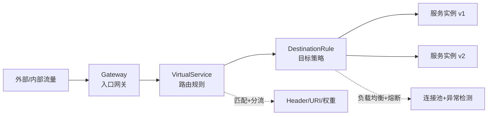
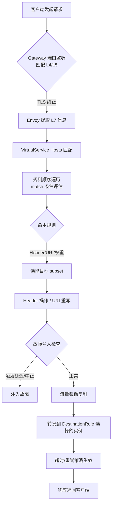
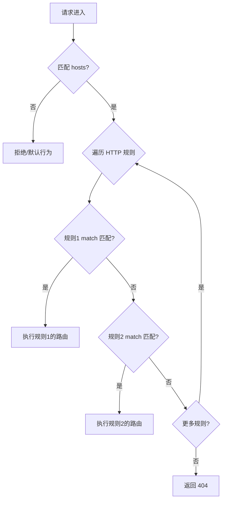
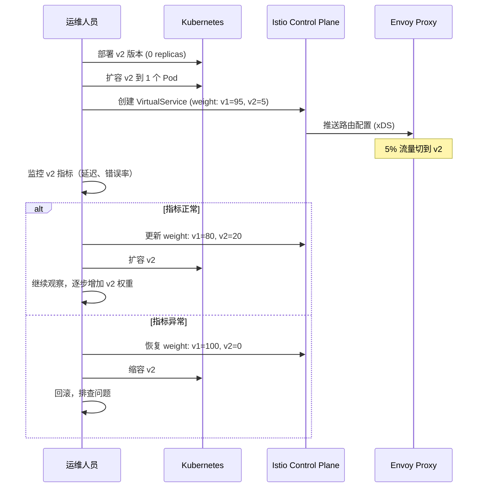
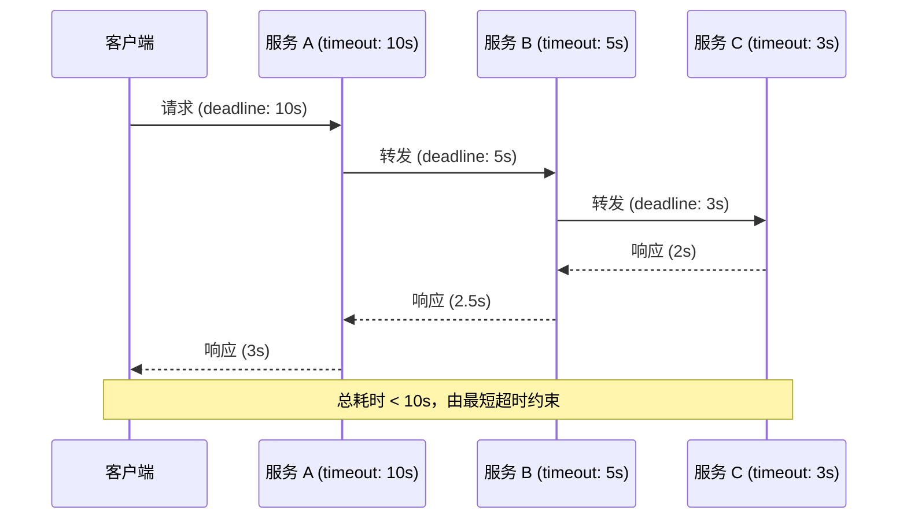
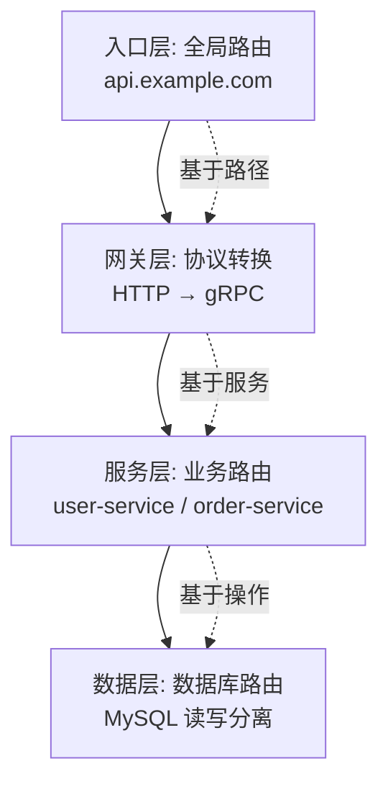

# 二、VirtualService 深度实践

VirtualService 是 Istio 流量管理体系中最核心的配置资源，它定义了一组流量路由规则，将满足特定条件的流量精确地路由到指定的目标服务。如果说 Envoy 代理是服务网格的"执行者"，那么 VirtualService 就是指挥这些执行者的"调度蓝图"。本节将从 API 结构、匹配条件、路由策略、高级特性到调试排错，全面深入地剖析 VirtualService 的每一个细节。

---

## 1. VirtualService 在流量管理中的定位

在 Istio 的流量管理体系中，VirtualService 承担着"流量分发决策"的角色。理解它的定位需要先理清三个核心资源的协作关系：



| 资源类型 | 核心职责 | 生效层级 | 类比 |
|---------|---------|---------|------|
| Gateway | 定义 L4/L5 端口监听和 TLS 配置 | 网格入口/出口 | 酒店大堂 |
| VirtualService | 定义流量路由规则（条件匹配、分流、重试、超时等） | L7 层路由决策 | 前台分诊台 |
| DestinationRule | 定义目标服务的连接策略（负载均衡、熔断、mTLS） | L4 连接策略 | 后厨调度 |
| ServiceEntry | 将外部服务注册到网格的服务注册表 | 外部服务发现 | 外部供应商名录 |

**关键理解**：VirtualService 回答的是"流量往哪里去"，DestinationRule 回答的是"到达之后怎么处理"。二者缺一不可——没有 VirtualService，流量无法被路由到正确的子集；没有 DestinationRule，子集的负载均衡和熔断策略无法生效。

### 1.1 请求生命周期视角下的 VirtualService

从一个 HTTP 请求进入网格到被服务实例处理的完整链路中，VirtualService 在以下阶段发挥作用：



这条链路揭示了一个重要原则：**VirtualService 是请求处理链中的中间层**，它在 Gateway 完成 L4/L7 解析之后、在 DestinationRule 执行连接策略之前进行路由决策。理解这个时序对调试至关重要——如果请求在 Gateway 层就被拒绝（如端口不匹配），VirtualService 根本不会被触及。

### 1.2 VirtualService 的配置生效机制

VirtualService 的变更通过 xDS（Envoy Discovery Service）API 实时推送到所有相关的 Envoy Sidecar。这个过程的关键特性包括：

- **热更新无需重启**：配置变更在秒级生效，不会中断现有连接
- **增量推送**：Istiod 只推送变更的配置片段，而非全量配置
- **一致性保证**：所有 Envoy 实例最终会收敛到相同配置，但存在短暂的传播延迟
- **配置回滚**：通过 `kubectl apply` 重新应用旧版本 YAML 即可回滚，同样秒级生效

```bash
# 查看 VirtualService 的配置同步状态
kubectl get virtualservice my-service-vs -n default -o jsonpath='{.status}'
# 通常没有 status 字段，说明配置已被 Istiod 正确接受
# 如果配置有问题，istiod 会在 events 中报告错误
kubectl get events -n default --field-selector reason=NetworkingStatus
```

---

## 2. API 结构全解析

### 2.1 完整资源结构

```yaml
apiVersion: networking.istio.io/v1beta1
kind: VirtualService
metadata:
  name: my-service-vs
  namespace: default
  labels:
    app: my-service
  annotations:
    # 可选：关联的 Gateway 注解
spec:
  # ── 基础字段 ──
  hosts:                          # 流量匹配的目标主机列表
    - my-service                  # 短名称（同命名空间内服务）
    - my-service.default.svc.cluster.local  # FQDN（跨命名空间）
    - "myapp.example.com"         # 外部域名（配合 Gateway 使用）
  
  # ── 网关关联（可选，控制流量入口） ──
  gateways:                       # 关联的 Gateway 资源列表
    - istio-system/ingress-gateway # 外部流量入口（格式：命名空间/Gateway名）
    - mesh                         # 特殊值：网格内部流量（Sidecar 间通信）
  
  # ── 网格范围声明（可选） ──
  exportTo:                       # 控制 VirtualService 的可见范围
    - "."                         # 仅当前命名空间
    # - "*"                       # 所有命名空间（默认行为）
  
  # ── 路由规则 ──
  http:                           # HTTP/1.1 和 HTTP/2 流量路由
    - name: "route-rule-1"        # 规则名称（用于调试和指标标签）
      match: [...]                # 匹配条件
      route: [...]                # 路由目标
      timeout: ...                # 超时设置
      retries: ...                # 重试策略
      fault: ...                  # 故障注入
      mirror: ...                 # 流量镜像
      corsPolicy: ...             # CORS 策略
      headers: ...                # Header 操作
      rewrite: ...                # URI 重写
      delegate: ...               # 委托给另一个 VirtualService（实验特性）
  
  tls:                            # 非终止 TLS 路由（SNI 匹配）
    - match: [...]
      route: [...]
  
  tcp:                            # TCP 流量路由（非 HTTP 协议）
    - match: [...]
      route: [...]
```

### 2.2 Hosts 字段的路由匹配逻辑

`hosts` 是 VirtualService 最基础的匹配维度，Istio 按以下优先级匹配请求的目标主机：

1. **精确 FQDN 匹配**：`reviews.default.svc.cluster.local`
2. **短名称匹配**：`reviews`（自动补全当前命名空间）
3. **通配符匹配**：`*.example.com`

```yaml
# 示例：一个 VirtualService 同时匹配内部服务和外部域名
spec:
  hosts:
    - productpage                  # 内部服务
    - "api.external.com"          # 外部 API
    - "*.internal.example.com"    # 内部通配域名
  http:
    - match:
        - uri:
            prefix: "/api/v2"
      route:
        - destination:
            host: productpage
            port:
              number: 9080
```

**常见陷阱**：当多个 VirtualService 的 `hosts` 列表重叠时，Istio 会合并匹配的规则。如果存在冲突，后加载的规则优先级更高。建议通过命名约定（如 `vs-<service>-<namespace>`）避免命名冲突。

**Hosts 与 ServiceEntry 的关系**：当 VirtualService 引用的 host 不在网格服务注册表中（即没有对应的 Kubernetes Service），流量会被直接丢弃。要路由到外部服务，必须先通过 ServiceEntry 将其注册到网格：

```yaml
# Step 1: 通过 ServiceEntry 注册外部服务
apiVersion: networking.istio.io/v1beta1
kind: ServiceEntry
metadata:
  name: external-api
spec:
  hosts:
    - api.external.com
  ports:
    - number: 443
      name: https
      protocol: TLS
  resolution: DNS
  location: MESH_EXTERNAL

---
# Step 2: VirtualService 引用已注册的外部主机
apiVersion: networking.istio.io/v1beta1
kind: VirtualService
metadata:
  name: external-api-routing
spec:
  hosts:
    - api.external.com            # 必须与 ServiceEntry 中的 hosts 对应
  http:
    - route:
        - destination:
            host: api.external.com
            port:
              number: 443
```

### 2.3 Gateways 字段：控制流量的入口

`gateways` 字段是 VirtualService 与 Gateway 资源之间的桥梁，决定了路由规则在哪些入口点生效。这个字段的行为常常被误解：

```yaml
# 场景1：仅处理外部流量（通过入口网关）
spec:
  hosts:
    - "app.example.com"
  gateways:
    - istio-system/ingress-gateway  # 只在入口网关上生效

# 场景2：同时处理外部和网格内部流量
spec:
  hosts:
    - "app.example.com"
  gateways:
    - istio-system/ingress-gateway  # 外部流量
    - mesh                           # 网格内部流量

# 场景3：仅处理网格内部流量（省略 gateways 默认等同 mesh）
spec:
  hosts:
    - my-service
  # 未声明 gateways，默认值为 ["mesh"]
```

**gateways 字段的行为规则**：

| 声明方式 | 行为 | 适用场景 |
|---------|------|---------|
| 不声明 | 默认等同于 `["mesh"]`，仅网格内部流量生效 | 纯内部服务路由 |
| 仅 `mesh` | 显式声明仅网格内部生效 | 与其他 VirtualService 区分意图 |
| 仅具体 Gateway | 仅在该 Gateway 关联的端口上生效 | 外部入口路由 |
| `mesh` + 具体 Gateway | 两个入口同时生效 | 内外共享路由规则 |

**常见错误**：声明了外部域名但没有关联 Gateway，导致外部流量永远无法到达服务：

```yaml
# 错误 ❌ — 外部流量无法进入
spec:
  hosts:
    - "app.example.com"
  # 缺少 gateways 字段
  http:
    - route:
        - destination:
            host: my-app

# 正确 ✅ — 明确关联入口网关
spec:
  hosts:
    - "app.example.com"
  gateways:
    - istio-system/ingress-gateway
  http:
    - route:
        - destination:
            host: my-app
```

**跨命名空间引用 Gateway**：默认情况下，VirtualService 只能引用同命名空间的 Gateway。要引用其他命名空间的 Gateway，需要 Gateway 资源显式导出：

```yaml
# Gateway 侧：导出到特定命名空间
apiVersion: networking.istio.io/v1beta1
kind: Gateway
metadata:
  name: ingress-gateway
  namespace: istio-system
spec:
  selector:
    istio: ingressgateway
  servers:
    - port:
        number: 443
        name: https
        protocol: HTTPS
      hosts:
        - "*.example.com"
      tls:
        mode: SIMPLE

---
# VirtualService 侧：引用跨命名空间的 Gateway
apiVersion: networking.istio.io/v1beta1
kind: VirtualService
metadata:
  name: app-routing
  namespace: production
spec:
  hosts:
    - "app.example.com"
  gateways:
    - istio-system/ingress-gateway    # 跨命名空间引用
  http:
    - route:
        - destination:
            host: my-app
```

### 2.4 ExportTo：控制虚拟服务的作用域

`exportTo` 字段控制 VirtualService 可被哪些命名空间中的代理感知：

```yaml
spec:
  exportTo:
    - "."            # 仅本命名空间可见
    - "frontend"     # 仅 frontend 命名空间可见
    - "*"            # 全网格可见（默认）
```

**实战建议**：在多团队共享的网格环境中，将 VirtualService 限制为 `exportTo: ["."]` 可以避免团队间的配置冲突，每个团队只管理自己命名空间内的路由规则。

**ExportTo 的限制**：`exportTo` 不会影响 Gateway 关联的路由——即使 VirtualService 设置了 `exportTo: ["."]`，只要 Gateway 引用了它，外部流量仍然可以被路由。`exportTo` 只影响网格内部 Sidecar 之间的路由可见性。

### 2.5 API 版本选择

Istio 的 VirtualService 支持两个 API 版本：

| 版本 | API Group | 说明 |
|------|-----------|------|
| v1alpha3 | networking.istio.io/v1alpha3 | 历史版本，Istio 1.0 引入，仍可使用 |
| v1beta1 | networking.istio.io/v1beta1 | 推荐版本，Istio 1.6+ 支持，功能完整 |

```yaml
# 推荐使用 v1beta1
apiVersion: networking.istio.io/v1beta1
kind: VirtualService
# ...

# v1alpha3 仍然有效，但不推荐
apiVersion: networking.istio.io/v1alpha3
kind: VirtualService
# ...
```

---

## 3. HTTP 路由匹配条件

VirtualService 的强大之处在于其丰富的匹配条件体系。所有 HTTP 规则中的 `match` 字段支持以下维度的组合匹配。

### 3.1 URI 匹配

```yaml
match:
  # 精确匹配
  - uri:
      exact: "/api/v1/users"
  
  # 前缀匹配
  - uri:
      prefix: "/api/v2"
  
  # 正则匹配（RE2 语法）
  - uri:
      regex: "^/users/[0-9]+/profile$"
  
  # 不区分大小写的正则匹配
  - uri:
      regex: "(?i)^/health$"
```

| 匹配类型 | 语义 | 适用场景 | 注意事项 |
|---------|------|---------|---------|
| exact | 完全精确匹配 | 单个固定路径 | 路径必须完全一致 |
| prefix | 前缀匹配 | API 版本路由、资源分类 | `/api/v2` 也会匹配 `/api/v2-beta` |
| regex | 正则匹配（RE2） | 复杂模式匹配 | 性能略低于前缀匹配，避免贪婪模式 |

**prefix 匹配的边界行为**：prefix 匹配在路径的 `/` 边界上工作。例如 `prefix: "/api/v2"` 会匹配 `/api/v2`、`/api/v2/users`、`/api/v2-beta`（注意连字符不是路径分隔符）。如果需要严格匹配 `/api/v2/` 开头的路径，应使用 `prefix: "/api/v2/"`。

**regex 性能警告**：RE2 正则引擎不支持回溯（backtracking），因此不会产生 ReDoS（正则拒绝服务）攻击。但正则匹配的 CPU 开销仍然比前缀匹配高 2-5 倍。在高 QPS（每秒万级请求）场景下，应尽量使用 prefix 或 exact 替代 regex。如果必须使用 regex，避免嵌套量词（如 `(a+)+`）和过于复杂的模式。

### 3.2 Header 匹配

```yaml
match:
  # 精确匹配指定 Header
  - headers:
      x-user-type:
        exact: "beta"
      x-request-id:
        regex: "^trace-[0-9]+$"
  
  # 存在性匹配（Header 存在即可）
  - headers:
      x-canary:
        present: true
  
  # 不存在性匹配（Header 不存在时匹配）
  - headers:
      x-debug:
        present: false
```

**最佳实践**：在生产环境中使用 Header 匹配实现灰度发布时，建议在入口网关或认证层设置统一的标记 Header（如 `x-env: canary`），而非依赖客户端自行传递。

**Header 匹配的大小写敏感性**：HTTP/2 规范规定 Header 的 key 必须是小写的，但 HTTP/1.1 不做此要求。Envoy 在内部会将 Header 的 key 统一转换为小写后进行匹配。因此，在 VirtualService 中使用 Header 匹配时，key 建议统一使用小写（如 `x-user-type` 而非 `X-User-Type`），避免混淆。

### 3.3 Query 参数匹配

```yaml
match:
  # 精确匹配查询参数
  - queryParams:
      version:
        exact: "v2"
  
  # 正则匹配查询参数
  - queryParams:
      search:
        regex: ".*test.*"
  
  # 存在性匹配
  - queryParams:
      debug:
        present: true
```

**Query 参数匹配的限制**：Query 参数匹配仅适用于 HTTP 流量。TCP 和 TLS 路由不支持 queryParams。此外，query 参数匹配不支持 `regex` 之外的通配符模式——如果需要匹配 `version=v2` 或 `version=v3`，必须使用 regex：`regex: "v[23]"`。

### 3.4 方法匹配

```yaml
match:
  # 匹配特定 HTTP 方法
  - method:
      exact: "POST"
  
  # 匹配 GET 请求
  - method:
      exact: "GET"
```

**方法匹配与重试的关系**：HTTP 方法是决定是否启用重试的关键因素。GET、HEAD、PUT、DELETE 通常是幂等的（副作用可预期），可以安全重试。POST 通常非幂等，重试可能导致重复操作。最佳实践是根据方法分流到不同的路由规则：

```yaml
http:
  # 幂等请求：允许重试
  - match:
      - method:
          exact: "GET"
    route:
      - destination:
          host: order-service
    retries:
      attempts: 3
      retryOn: "5xx,reset,connect-failure"
  
  # 非幂等请求：禁用重试
  - match:
      - method:
          exact: "POST"
    route:
      - destination:
          host: order-service
    # 不设置 retries 字段
```

### 3.5 来源标签匹配（Source Labels）

```yaml
match:
  # 匹配来自特定 Pod 标签的请求
  - sourceLabels:
      app: frontend
      version: v2
  
  # 匹配来自特定命名空间的请求
  - sourceNamespace: "testing"
```

**关键理解**：`sourceLabels` 匹配的是发送请求方 Pod 上的标签（注意：不是 Service 的标签），这使得细粒度的 A/B 测试成为可能。

**Source Labels 的安全考量**：`sourceLabels` 基于 Pod 标签进行匹配，而 Pod 标签可以被集群管理员修改。因此，`sourceLabels` 不能作为安全访问控制手段，只能用于流量管理目的。如果需要细粒度的访问控制，应结合 `AuthorizationPolicy` 使用。

### 3.6 统计端口匹配

```yaml
match:
  # 匹配特定的监听端口
  - port: 8080
  
  # 匹配 gRPC 方法（Istio 1.16+）
  - authority:
      exact: "grpc-service:8080"
```

**端口匹配的注意事项**：`port` 匹配的是请求到达 Envoy Sidecar 时的监听端口，而非目标服务的端口。在 Sidecar 注入模式下，这个端口通常是被拦截的端口号。如果服务同时暴露 HTTP 和 gRPC 端口，可以通过端口匹配将不同协议的流量路由到不同的子集或策略。

### 3.7 Authority 匹配

`authority` 匹配用于精确控制请求的目标主机头（`:authority` header），特别适用于虚拟主机（virtual hosting）场景：

```yaml
match:
  # 匹配特定的 authority（主机名:端口）
  - authority:
      exact: "api.staging.example.com"
  
  # 匹配 staging 子域下的所有主机
  - authority:
      regex: ".*\\.staging\\.example\\.com"
```

**Authority 匹配的适用场景**：
- 同一端口上托管多个虚拟主机（如多租户 SaaS）
- 根据请求的 Host 头路由到不同版本的后端服务
- 在 Service Mesh 中实现基于域名的流量隔离

### 3.8 匹配条件的组合逻辑

Istio 中的匹配条件遵循以下组合规则：

- **同一 match 数组内的多个规则**：**OR**（任一匹配即可）
- **同一规则内的多个条件**：**AND**（全部匹配才生效）
- **HTTP 路由数组中的多个规则**：**顺序优先**（从上到下依次匹配，首个命中即停止）

```yaml
http:
  # 规则1：满足任一 OR 条件即可
  - match:
      - uri:
          prefix: "/api/v2"
        headers:
          x-user-type:
            exact: "beta"
      - uri:
          prefix: "/api/v2"
        queryParams:
          debug:
            present: true
    route:
      - destination:
          host: api-service
          subset: v2
  
  # 规则2：兜底规则（无 match = 匹配所有剩余流量）
  - route:
      - destination:
          host: api-service
          subset: v1
```

**路由匹配流程图**：



**顺序优先的实际影响**：规则的顺序至关重要。一旦某个规则被命中，后续规则不会被评估。这意味着：

- 兜底规则（无 match 条件）必须放在最后
- 更具体的规则应该放在更通用的规则之前
- 如果需要匹配多个条件分支，每个分支都应该是一条独立的规则

```yaml
http:
  # 错误 ❌ — 兜底规则在前，后面的规则永远不会被匹配
  - route:
      - destination:
          host: api-service
          subset: v1
  - match:
      - headers:
          x-canary:
            exact: "true"
    route:
      - destination:
          host: api-service
          subset: v2

# 正确 ✅ — 特定规则在前，兜底规则在后
  - match:
      - headers:
          x-canary:
            exact: "true"
    route:
      - destination:
          host: api-service
          subset: v2
  - route:
      - destination:
          host: api-service
          subset: v1
```

### 3.9 匹配条件的否定逻辑

Istio 的匹配条件默认是"包含"语义，不直接支持"排除"（NOT）操作。要实现排除逻辑，需要通过规则组合来变通：

```yaml
http:
  # 场景：所有不带 x-debug header 的请求走正式路由
  # 实现方式：先匹配带 x-debug 的请求，再用兜底规则处理其余
  
  # 规则1：带 x-debug 的请求走调试路由
  - match:
      - headers:
          x-debug:
            present: true
    route:
      - destination:
          host: api-service
          subset: debug
  
  # 规则2：不带 x-debug 的请求走正式路由（兜底）
  - route:
      - destination:
          host: api-service
          subset: stable
```

---

## 4. 路由策略详解

### 4.1 简单路由（单目标）

```yaml
http:
  - route:
      - destination:
          host: reviews
          subset: v1
          port:
            number: 9080
```

**port 字段的作用**：当目标服务暴露多个端口时（如 HTTP 8080 和 gRPC 9090），通过 `port.number` 指定路由到哪个端口。如果目标服务只有一个端口，此字段可省略。

### 4.2 加权分流（金丝雀发布）

通过 `weight` 字段实现按比例分流，所有权重之和必须等于 100：

```yaml
http:
  - route:
      - destination:
          host: reviews
          subset: v1
        weight: 80            # 80% 流量到稳定版
      - destination:
          host: reviews
          subset: v2
        weight: 15            # 15% 流量到灰度版
      - destination:
          host: reviews
          subset: v3
        weight: 5             # 5% 流量到新特性版
```

**权重不等于 100 的行为**：当所有 weight 之和不等于 100 时，Istio 的行为取决于缺失的比例：

- **总和小于 100**：缺失比例的流量将被路由到第一个目标（weight 最高的那个），而不是被丢弃。例如 v1=80, v2=10（总和 90），则 v1 实际承载 80/(80+10) ≈ 88.9% 的流量
- **总和大于 100**：Istio 会按比例归一化。例如 v1=60, v2=50（总和 110），则 v1=60/110≈54.5%, v2=50/110≈45.5%

无论哪种情况，这都是一个配置错误，应该修复。在生产环境中，建议使用 CI/CD 流水线中的校验步骤来自动检测权重总和：

```bash
# 权重校验脚本（在 CI/CD 中使用）
#!/bin/bash
VS_FILE="$1"
TOTAL=$(grep -A2 'weight:' "$VS_FILE" | grep 'weight:' | awk '{print $2}' | paste -sd+ | bc)
if [ "$TOTAL" -ne 100 ]; then
  echo "ERROR: Weight sum is $TOTAL, expected 100"
  exit 1
fi
```

**金丝雀发布操作流程**：



**自动金丝雀推广的运维脚本**：

```bash
#!/bin/bash
# canary-promote.sh — 逐步推广金丝雀流量
# 用法: ./canary-promote.sh <service-name> <namespace> <target-weight>

SERVICE="$1"
NAMESPACE="${2:-default}"
STAGE_FILE="/tmp/canary-${SERVICE}.stage"

# 读取当前阶段
CURRENT_STAGE=$(cat "$STAGE_FILE" 2>/dev/null || echo "0")
STAGES=(0 5 10 25 50 75 100)

# 计算下一个阶段
NEXT_STAGE=$((CURRENT_STAGE + 1))
if [ $NEXT_STAGE -ge ${#STAGES[@]} ]; then
  echo "Canary fully promoted to 100%. Done."
  exit 0
fi

CANARY_WEIGHT=${STAGES[$NEXT_STAGE]}
STABLE_WEIGHT=$((100 - CANARY_WEIGHT))

echo "Promoting canary: stable=${STABLE_WEIGHT}%, canary=${CANARY_WEIGHT}%"

# 更新 VirtualService
cat <<EOF | kubectl apply -n "$NAMESPACE" -f -
apiVersion: networking.istio.io/v1beta1
kind: VirtualService
metadata:
  name: ${SERVICE}-canary
  annotations:
    canary.stage: "${CANARY_WEIGHT}"
spec:
  hosts:
    - ${SERVICE}
  http:
    - route:
        - destination:
            host: ${SERVICE}
            subset: stable
          weight: ${STABLE_WEIGHT}
        - destination:
            host: ${SERVICE}
            subset: canary
          weight: ${CANARY_WEIGHT}
      timeout: 5s
      retries:
        attempts: 2
        perTryTimeout: 2s
        retryOn: "5xx,reset,connect-failure"
EOF

echo "$NEXT_STAGE" > "$STAGE_FILE"
echo "Canary weight updated to ${CANARY_WEIGHT}%"
```

### 4.3 基于 Header 的 A/B 测试

```yaml
http:
  # 新特性只对 beta 用户开放
  - match:
      - headers:
          x-user-tier:
            exact: "beta"
    route:
      - destination:
          host: productpage
          subset: v2
  
  # 正常用户走稳定版
  - route:
      - destination:
          host: productpage
          subset: v1
```

**A/B 测试的指标收集**：在使用 Header 匹配进行 A/B 测试时，Envoy 会自动在指标中记录目标 subset 的标签。通过 Prometheus 查询可以精确对比不同版本的性能和业务指标：

```promql
# 对比不同 subset 的请求延迟
histogram_quantile(0.99,
  sum(rate(istio_request_duration_milliseconds_bucket{
    destination_workload="productpage"
  }[5m])) by (le, destination_version)
)
```

### 4.4 蓝绿部署

蓝绿部署通过路由切换实现瞬间切换，而非渐进式流量转移：

```yaml
# 阶段一：全部流量指向蓝色（当前版本）
apiVersion: networking.istio.io/v1beta1
kind: VirtualService
metadata:
  name: myapp-blue-green
spec:
  hosts:
    - myapp
  http:
    - route:
        - destination:
            host: myapp
            subset: blue     # 100% 流量到蓝色
          weight: 100

# 阶段二：验证绿色后，一次性切换全部流量
# http:
#   - route:
#       - destination:
#           host: myapp
#           subset: green    # 100% 流量切到绿色
#         weight: 100
```

**蓝绿部署的回滚策略**：蓝绿部署的核心优势是回滚极快——只需将路由切回旧版本即可，无需重新部署。回滚操作就是一个 `kubectl apply` 命令：

```bash
# 紧急回滚：将流量切回蓝色版本
kubectl patch virtualservice myapp-blue-green -n default --type merge -p '
spec:
  http:
    - route:
        - destination:
            host: myapp
            subset: blue
          weight: 100
'
```

**蓝绿部署的资源成本**：蓝绿部署需要同时运行两套完整的生产环境，资源成本翻倍。在云原生环境中，这通常意味着需要维护两组 Deployment（如 blue 和 green），每组都有完整的副本数。如果集群资源紧张，可以考虑在验证阶段临时缩减绿色的副本数。

### 4.5 地理路由

根据请求来源的地理位置进行路由决策：

```yaml
http:
  # 北美用户的请求路由到北美集群
  - match:
      - sourceLabels:
          topology: us-west
    route:
      - destination:
          host: api-service
          subset: us-west
  
  # 亚洲用户的请求路由到亚洲集群
  - match:
      - sourceLabels:
          topology: ap-east
    route:
      - destination:
          host: api-service
          subset: ap-east
  
  # 兜底路由
  - route:
      - destination:
          host: api-service
          subset: default
```

**多集群地理路由的实现**：在多集群 Istio 网格中，地理路由需要配合多集群 ServiceEntry 使用。每个集群的 Sidecar 上需要标记对应的区域标签（如 `topology.istio.io/region`），然后通过 `sourceLabels` 匹配：

```yaml
# 在每个集群的 Sidecar 注入配置中标记区域
# 集群配置（通过 Helm values）
pilot:
  env:
    ISTIO_META_REGION: "us-west"

# VirtualService 中使用拓扑标签匹配
http:
  - match:
      - sourceLabels:
          topology_istio_io_region: "us-west"
    route:
      - destination:
          host: api-service
          subset: us-west
```

### 4.6 基于路径权重的灰度（Path-based Canary）

在某些场景下，不是所有路径都需要灰度。例如，新的搜索算法只需要在 `/api/search` 路径上验证，而 `/api/product` 路径仍然使用稳定版本：

```yaml
http:
  # 搜索接口：灰度到 v2
  - match:
      - uri:
          prefix: "/api/search"
    route:
      - destination:
          host: api-service
          subset: v2
    timeout: 3s
  
  # 产品接口：保持 v1
  - match:
      - uri:
          prefix: "/api/product"
    route:
      - destination:
          host: api-service
          subset: v1
    timeout: 5s
  
  # 兜底：所有其他接口走 v1
  - route:
      - destination:
          host: api-service
          subset: v1
```

---

## 5. 超时与重试配置

### 5.1 超时设置

超时是防止请求无限期挂起的安全网：

```yaml
http:
  - route:
      - destination:
          host: payment-service
    timeout: 10s                    # 整个请求的总超时时间
```

**超时链路传递**：当调用链为 A → B → C 时，如果 A 的超时是 10s，B 的超时是 5s，C 的超时是 3s，实际 C 最多只有 3s（而非 10s）。Istio 通过在请求头中传播 `x-envoy-deadline` 来实现超时预算的传递。



**超时的最佳实践**：

| 服务类型 | 推荐超时范围 | 说明 |
|---------|-------------|------|
| 简单查询 | 1-3s | 数据库查询、缓存读取 |
| 复杂业务 | 3-10s | 订单处理、支付流程 |
| 批量操作 | 10-30s | 报表生成、数据同步 |
| 外部调用 | 5-15s | 第三方 API、短信发送 |

**超时配置的常见误区**：

1. **超时设得太短**：正常请求也会超时，导致大量误报。例如数据库查询需要 2s，但超时设为 1s
2. **超时设得太长**：异常请求长时间挂起，占用连接池资源。例如超时设为 60s，但正常响应在 3s 内返回
3. **未考虑调用链深度**：A→B→C→D 的调用链中，每层的超时应该递减，确保上游调用者有足够的剩余时间处理下游返回的结果

### 5.2 重试策略

```yaml
http:
  - route:
      - destination:
          host: order-service
    retries:
      attempts: 3                      # 最大重试次数（含首次请求，总共3次）
      perTryTimeout: 2s                # 每次尝试的超时时间
      retryOn: "5xx,reset,connect-failure"  # 触发重试的条件
      retryRemoteLocalities: true      # 允许跨区域重试
```

**retryOn 条件详解**：

| 条件 | 含义 | 适用场景 |
|------|------|---------| 
| `5xx` | 服务端返回 5xx 状态码 | 所有服务端错误 |
| `reset` | 连接被重置 | 网络抖动 |
| `connect-failure` | 连接建立失败 | 目标服务不可达 |
| `retriable-status-codes` | 可重试的状态码（配合 `retriableStatusCodes` 使用） | 自定义错误码 |
| `retriable-4xx` | 可重试的 4xx 错误（如 409 冲突） | 幂等写操作 |
| `gateway-error` | 502/503/504 | 网关层错误 |
| `envoy-ratelimited` | Envoy 限流触发 | 限流场景 |

**幂等性警告**：重试可能导致非幂等操作（如扣款、下单）被重复执行。对于非幂等操作，应该：
- 在应用层实现幂等性保障（如幂等 Token）
- 或者只对 GET 请求启用重试
- 配合 `retriable-status-codes` 仅重试特定错误码

**重试退避策略**：Istio 的重试没有内置的指数退避机制，每次重试之间的间隔由 Envoy 的连接建立时间决定。如果需要指数退避，需要在应用层自行实现。在高负载场景下，无退避的重试可能引发"重试风暴"——大量重试请求同时涌入已经过载的服务，进一步加剧问题。可以通过 `connectionPool` 限制并发请求数来缓解：

```yaml
# DestinationRule 中限制并发，防止重试风暴
apiVersion: networking.istio.io/v1beta1
kind: DestinationRule
metadata:
  name: order-service
spec:
  host: order-service
  trafficPolicy:
    connectionPool:
      http:
        h1MaxPendingRequests: 100    # 排队等待的最大请求数
        h2MaxRequests: 1000           # HTTP/2 最大并发流数
        maxRequestsPerConnection: 10  # 单连接最大请求数
        maxRetries: 3                 # 最大重试并发数
```

### 5.3 超时 + 重试的协同配置

```yaml
http:
  - route:
      - destination:
          host: recommendation-service
    timeout: 15s              # 端到端超时 15 秒
    retries:
      attempts: 3             # 最多重试 3 次
      perTryTimeout: 4s       # 每次尝试 4 秒超时
      retryOn: "5xx,gateway-error,reset,connect-failure"
```

**时间预算计算**：总超时 15s，3 次尝试各 4s → 理论最多 12s < 15s，留有 3s 的处理余量。如果 `perTryTimeout × attempts > timeout`，则总超时兜底生效。

**超时与重试的交互矩阵**：

| 场景 | timeout | perTryTimeout | attempts | 实际行为 |
|------|---------|---------------|----------|---------|
| 正常情况 | 10s | 3s | 3 | 首次请求 2s 返回，成功 |
| 首次失败 | 10s | 3s | 3 | 首次超时，重试 2 次，总耗时 10s 内 |
| 全部失败 | 10s | 4s | 3 | 3 次各 4s=12s，但总超时 10s 兜底 |
| 无重试 | 10s | - | 1 | 首次请求最多 10s |
| 无超时 | 无 | 3s | 3 | 最多 9s（3×3s），但无总超时保护 |

### 5.4 重试预算（Retry Budget，实验特性）

Istio 1.19+ 引入了重试预算功能，用于防止重试风暴。通过设置 `numRetries` 和 `retryOn` 的组合，可以限制重试请求占总请求的比例：

```yaml
http:
  - route:
      - destination:
          host: payment-service
    retries:
      attempts: 3
      perTryTimeout: 2s
      retryOn: "5xx"
  # 通过 DestinationRule 中的 retryBudget 控制重试比例
---
apiVersion: networking.istio.io/v1beta1
kind: DestinationRule
metadata:
  name: payment-service
spec:
  host: payment-service
  trafficPolicy:
    connectionPool:
      http:
        maxRetries: 3          # 最大并发重试数
```

---

## 6. Header 操作

VirtualService 支持在路由过程中动态修改请求和响应的 Header，实现流量整形和调试辅助。

### 6.1 请求 Header 操作

```yaml
http:
  - route:
      - destination:
          host: backend-service
    headers:
      request:
        set:                                # 设置（覆盖已有值）
          x-forwarded-by: istio-proxy
          x-request-source: mesh
        add:                                # 追加（不覆盖已有值）
          x-trace-id: "%START_TIME(%Y%m%d%H%M%S)%"
        remove:                             # 移除
          - x-debug-token
          - x-internal-flag
```

**set vs add 的区别**：

| 操作 | 行为 | 适用场景 |
|------|------|---------|
| `set` | 如果 Header 已存在则覆盖，不存在则创建 | 设置标准 Header（如 `x-request-id`） |
| `add` | 如果 Header 已存在则追加新值（允许重复 Header），不存在则创建 | 追加自定义追踪标记 |

**Envoy 内置变量**：在 Header 操作中可以使用 Envoy 内置的变量模板：

| 变量 | 说明 | 示例 |
|------|------|------|
| `%START_TIME(%Y%m%d%H%M%S)%` | 请求开始时间 | 20260626153045 |
| `%DOWNSTREAM_REMOTE_ADDRESS_WITH_PORT%` | 客户端地址+端口 | 10.0.0.1:54321 |
| `%UPSTREAM_HOST%` | 上游服务实例地址 | 10.244.1.5:8080 |
| `%REQUESTED_SERVER_NAME%` | SNI 主机名 | api.example.com |
| `%PROTOCOL%` | 协议版本 | HTTP/1.1 |

### 6.2 响应 Header 操作

```yaml
http:
  - route:
      - destination:
          host: frontend-service
    headers:
      response:
        set:
          x-served-by: "mesh-{{.DestinationHost}}"
        add:
          x-cache-status: "miss"
        remove:
          - x-server-version
          - x-upstream-ip
```

**响应 Header 操作的安全考量**：移除响应 Header 可以防止内部实现细节泄露给客户端。常见的应移除的 Header 包括：

- `x-server-version`：暴露后端服务版本，可能被攻击者利用
- `x-upstream-ip`：暴露内部服务 IP，可能被用于 SSRF 攻击
- `x-powered-by`：暴露技术栈信息
- `server`：暴露 Web 服务器版本

### 6.3 URI 重写

```yaml
http:
  # 将 /api/v2/users 重写为 /internal/users 并路由到后端
  - match:
      - uri:
          prefix: "/api/v2"
    rewrite:
      uri: "/internal"                    # 替换匹配的前缀部分
      authority: "internal.svc:8080"      # 重写 Host 头
    route:
      - destination:
          host: internal-service
          port:
            number: 8080
```

**重写规则**：
- `prefix` 匹配 + `rewrite.uri`：将匹配的前缀替换为指定路径
- `exact` 匹配 + `rewrite.uri`：整个路径替换
- `regex` 匹配 + `rewrite.uri`：支持捕获组替换（`$1`, `$2`）

**正则捕获组重写示例**：

```yaml
http:
  # 将 /users/12345/profile 重写为 /internal/user/12345
  - match:
      - uri:
          regex: "^/users/([0-9]+)/profile$"
    rewrite:
      uri: "/internal/user/%DYNAMIC_METADATA([\"envoy.filters.http.lua\", \"user_id\"])%"
    route:
      - destination:
          host: user-service
```

**更实用的正则重写**：

```yaml
http:
  # 使用 regex 捕获组实现路径转换
  - match:
      - uri:
          regex: "^/api/v1/users/([0-9]+)/orders/([0-9]+)$"
    rewrite:
      uri: "/legacy/users/%1/orders/%2"   # 使用 $1 和 $2 捕获组
    route:
      - destination:
          host: legacy-order-service
```

### 6.4 Authority 重写

`authority` 重写用于修改请求的 Host 头，特别适用于将外部域名映射到内部服务：

```yaml
http:
  - match:
      - uri:
          prefix: "/api"
    rewrite:
      authority: "api.internal.svc.local"  # 将 Host 头改为内部服务名
    route:
      - destination:
          host: api-internal
          port:
            number: 8080
```

**Authority 重写的典型场景**：
- 外部域名到内部服务的映射（如 `api.example.com` → `api.internal.svc.local`）
- 虚拟主机路由（同一端口上多个域名的路由）
- 旧域名到新域名的平滑迁移

---

## 7. 故障注入

故障注入是混沌工程的核心工具，用于验证系统在异常条件下的弹性表现。

### 7.1 延迟注入

模拟网络延迟或服务响应缓慢：

```yaml
http:
  - fault:
      delay:
        percentage:
          value: 10.0           # 10% 的请求受影响
        fixedDelay: 5s          # 固定延迟 5 秒
    route:
      - destination:
          host: payment-service
```

### 7.2 中止注入

模拟服务不可用（返回错误码）：

```yaml
http:
  - fault:
      abort:
        percentage:
          value: 5.0            # 5% 的请求被中止
        httpStatus: 503         # 返回 503 Service Unavailable
    route:
      - destination:
          host: inventory-service
```

### 7.3 组合故障注入

```yaml
http:
  - fault:
      delay:
        percentage:
          value: 15.0
        fixedDelay: 3s
      abort:
        percentage:
          value: 5.0
        httpStatus: 500
    route:
      - destination:
          host: catalog-service
```

**注意**：延迟和中止的百分比是独立计算的，一个请求可能同时被延迟和中止。

### 7.4 gRPC 故障注入

```yaml
http:
  - fault:
      abort:
        percentage:
          value: 10.0
        grpcStatus: 14          # UNAVAILABLE
    route:
      - destination:
          host: grpc-service
```

**gRPC 状态码参考**：

| 状态码 | 名称 | 说明 |
|--------|------|------|
| 0 | OK | 成功 |
| 1 | CANCELLED | 调用者取消 |
| 2 | UNKNOWN | 未知错误 |
| 3 | INVALID_ARGUMENT | 无效参数 |
| 4 | DEADLINE_EXCEEDED | 超时 |
| 5 | NOT_FOUND | 资源不存在 |
| 6 | ALREADY_EXISTS | 资源已存在 |
| 7 | PERMISSION_DENIED | 权限不足 |
| 13 | INTERNAL | 内部错误 |
| 14 | UNAVAILABLE | 服务不可用 |
| 16 | UNAUTHENTICATED | 未认证 |

### 7.5 故障注入的安全边界

故障注入在生产环境中使用时必须谨慎：

1. **流量百分比控制**：生产环境的故障注入百分比建议控制在 1-5% 以内，避免影响用户体验
2. **时间窗口限制**：配合定时任务在特定时间窗口内启用故障注入，测试完成后立即关闭
3. **监控告警**：启用故障注入前确保监控告警系统正常工作，以便在实际故障发生时能快速识别
4. **一键回滚**：准备回滚脚本，确保在发现问题时能在秒级关闭故障注入

```yaml
# 生产安全的故障注入模板
http:
  - fault:
      delay:
        percentage:
          value: 1.0              # 仅 1% 的请求
        fixedDelay: 500ms         # 500ms 延迟（不是 5s）
      abort:
        percentage:
          value: 0.5              # 仅 0.5% 的请求
        httpStatus: 503
    route:
      - destination:
          host: payment-service
    # 同时设置合理的超时和重试，防止故障注入引发连锁反应
    timeout: 5s
    retries:
      attempts: 2
      perTryTimeout: 2s
      retryOn: "5xx,reset,connect-failure"
```

---

## 8. 流量镜像（Traffic Mirroring）

流量镜像（也称影子流量）将生产流量复制一份发送到测试服务，用于在不影响用户的前提下验证新版本：

```yaml
http:
  - route:
      - destination:
          host: reviews
          subset: v1           # 主路由：所有流量到 v1
    mirror:
      host: reviews
      subset: v2               # 镜像：复制流量到 v2
    mirrorPercentage:
      value: 50.0              # 镜像 50% 的流量（默认 100%）
```

**镜像流量的行为特征**：

| 特征 | 说明 |
|------|------|
| 响应丢弃 | 镜像请求的响应被 Envoy 丢弃，不影响客户端 |
| 延迟不传递 | 镜像请求的延迟不计入主请求的超时 |
| Header 标记 | Envoy 在镜像请求中添加 `x-envoy-original-path` 标识 |
| 异步发送 | 镜像请求是异步发送的，不阻塞主请求 |
| 状态修改 | 如果镜像服务修改了共享状态（如数据库），可能产生数据问题 |

**安全使用建议**：确保镜像服务的副作用不会影响生产数据。理想情况下，镜像服务应该使用独立的数据库或只读副本。

**镜像流量的最佳实践**：

1. **使用独立数据库**：镜像服务不应该写入生产数据库，否则可能导致数据不一致
2. **限制镜像比例**：在验证初期使用 1-5% 的镜像比例，逐步增加到 50%
3. **监控镜像服务**：虽然镜像流量不影响客户端，但镜像服务的资源消耗需要监控
4. **设置镜像超时**：为镜像请求设置独立的超时，避免慢请求占用过多资源

```yaml
# 镜像流量的安全配置
http:
  - route:
      - destination:
          host: reviews
          subset: v1
    mirror:
      host: reviews
      subset: v2
    mirrorPercentage:
      value: 10.0              # 仅镜像 10% 的流量
    # 主路由的超时和重试
    timeout: 5s
    retries:
      attempts: 2
      retryOn: "5xx,reset,connect-failure"
```

**镜像流量的监控指标**：Envoy 会自动收集镜像流量的指标，可以通过 Prometheus 查询镜像服务的健康状况：

```promql
# 镜像请求的延迟
histogram_quantile(0.99,
  sum(rate(envoy_cluster_upstream_rq_time_bucket{
    cluster_name="reviews-v2"
  }[5m])) by (le)
)

# 镜像请求的错误率
sum(rate(envoy_cluster_upstream_rq_xx{
  cluster_name="reviews-v2",
  response_code_class="5"
}[5m])) / sum(rate(envoy_cluster_upstream_rq_total{
  cluster_name="reviews-v2"
}[5m]))
```

---

## 9. CORS 策略

VirtualService 可以在网格层统一管理跨域资源共享策略：

```yaml
http:
  - route:
      - destination:
          host: api-service
    corsPolicy:
      allowOrigins:
        - exact: "https://app.example.com"
        - regex: "https://.*\\.example\\.com"
        - prefix: "https://staging."
      allowMethods:
        - GET
        - POST
        - PUT
        - DELETE
        - OPTIONS
      allowHeaders:
        - authorization
        - content-type
        - x-request-id
      allowCredentials: true
      maxAge: "24h"
      exposeHeaders:
        - x-total-count
        - x-page-count
```

**Mesh 层 CORS 的优势**：
- 避免在每个服务中重复配置 CORS
- 策略变更无需重新部署应用
- 统一的跨域策略便于审计和合规

**CORS 策略的完整参数说明**：

| 参数 | 类型 | 说明 | 推荐值 |
|------|------|------|--------|
| `allowOrigins` | 字符串数组 | 允许的来源域名 | 明确列出可信域名 |
| `allowMethods` | 字符串数组 | 允许的 HTTP 方法 | GET, POST, PUT, DELETE, OPTIONS |
| `allowHeaders` | 字符串数组 | 允许的自定义 Header | authorization, content-type |
| `allowCredentials` | 布尔值 | 是否允许携带凭证 | 生产环境设为 false（除非必须） |
| `maxAge` | Duration | 预检请求缓存时间 | "24h"（减少 OPTIONS 请求） |
| `exposeHeaders` | 字符串数组 | 暴露给前端的响应 Header | 业务相关的自定义 Header |

**CORS 安全配置示例**：

```yaml
# 严格的生产环境 CORS 配置
corsPolicy:
  allowOrigins:
    - exact: "https://app.production.example.com"  # 仅允许生产域名
  allowMethods:
    - GET
    - POST
    - PUT
  allowHeaders:
    - authorization
    - content-type
  allowCredentials: false  # 不允许携带 Cookie
  maxAge: "1h"             # 缓存 1 小时
  exposeHeaders:
    - x-request-id
```

---

## 10. TCP 与 TLS 路由

### 10.1 TCP 路由

对于非 HTTP 协议（如 MySQL、Redis、MongoDB），使用 `tcp` 字段定义路由：

```yaml
tcp:
  - match:
      - port: 3306
    route:
      - destination:
          host: mysql-primary
          port:
            number: 3306
  - match:
      - port: 3306
        sourceLabels:
          app: read-replica-consumer
    route:
      - destination:
          host: mysql-replica
          port:
            number: 3306
```

**TCP 路由的限制**：TCP 路由不支持 Header、URI、方法等 L7 层匹配条件，只能基于端口和来源标签进行路由。这是因为 TCP 流量在 L7 层是不可见的——Envoy 无法解析 TCP 载荷中的应用层协议（除非使用协议嗅探或 Lua 过滤器）。

**常见 TCP 协议的路由模式**：

| 协议 | 默认端口 | 路由策略 | 注意事项 |
|------|---------|---------|---------|
| MySQL | 3306 | 读写分离 | 写操作路由到主库，读操作路由到从库 |
| Redis | 6379 | 集群路由 | 根据 key 的 slot 分片路由 |
| MongoDB | 27017 | 副本集路由 | 写操作路由到 Primary，读操作路由到 Secondary |
| Kafka | 9092 | 分区路由 | 根据 topic 的分区数路由 |
| gRPC | 9090 | HTTP/2 路由 | 可使用 HTTP 路由规则（gRPC over HTTP/2） |

### 10.2 TLS 路由（基于 SNI）

```yaml
tls:
  - match:
      - sniHosts:
          - "api.internal.example.com"
        port: 443
    route:
      - destination:
          host: internal-api
          port:
            number: 8443
  - match:
      - sniHosts:
          - "*.external.example.com"
        port: 443
    route:
      - destination:
          host: external-api
          port:
            number: 8443
```

**SNI 路由的工作原理**：TLS 握手阶段，客户端会在 ClientHello 消息中包含 SNI（Server Name Indication）扩展，指定要连接的主机名。Envoy 可以在不解密 TLS 的情况下读取 SNI 字段，从而实现基于主机名的路由。

**TLS 路由的典型场景**：
- 单个端口上托管多个 HTTPS 服务（如 Ingress Gateway）
- 根据 SNI 将流量路由到不同的后端 TLS 终止点
- 实现 SNI-based 的多租户隔离

### 10.3 gRPC 路由

gRPC 基于 HTTP/2 协议，因此可以使用 HTTP 路由规则进行路由。Istio 原生支持 gRPC 流量的路由、负载均衡和故障注入：

```yaml
http:
  # 基于 gRPC 方法的路由
  - match:
      - authority:
          exact: "grpc-service:9090"
      - uri:
          exact: "/grpc.service.UserService/GetUser"
    route:
      - destination:
          host: user-service
          subset: v2
    timeout: 3s
  
  # gRPC 重试配置
  - match:
      - authority:
          regex: ".*grpc.*"
    route:
      - destination:
          host: grpc-service
    retries:
      attempts: 3
      perTryTimeout: 2s
      retryOn: "5xx,reset,connect-failure,cancelled"
```

**gRPC 重试的特殊性**：gRPC 使用 HTTP/2 的流（stream）机制，一个连接可以同时承载多个请求。gRPC 的重试需要考虑：
- `cancelled` 状态码：客户端取消请求时不应该重试（避免重复取消）
- `deadline-exceeded` 状态码：超时错误通常应该重试
- `unavailable` 状态码：服务临时不可用，适合重试

### 10.4 WebSocket 路由

VirtualService 对 WebSocket 流量的路由是透明的——WebSocket 升级请求（`Upgrade: websocket` Header）会被 Envoy 正常处理，路由规则中的 Header 匹配和 URI 匹配同样适用：

```yaml
http:
  # WebSocket 连接路由
  - match:
      - uri:
          prefix: "/ws"
      - headers:
          upgrade:
            exact: "websocket"
    route:
      - destination:
          host: websocket-service
          port:
            number: 8080
    timeout: 0s               # WebSocket 连接不应设置超时（设为 0 表示无限制）
  
  # WebSocket 连接的特殊配置
  - route:
      - destination:
          host: websocket-service
    # WebSocket 流量的超时配置
    timeout: 0s               # 长连接必须设为 0
    retries:
      attempts: 0             # WebSocket 不应该重试（连接已建立）
```

**WebSocket 路由的注意事项**：
1. **超时必须设为 0**：WebSocket 是长连接，设置超时会导致连接被意外断开
2. **不启用重试**：WebSocket 连接一旦建立，重试没有意义（应用层需要自行处理重连）
3. **负载均衡策略**：WebSocket 连接应该使用 `connectionAffinity: true`（或 `sticky sessions`），确保同一客户端的请求路由到同一后端实例

---

## 11. 多服务路由

一个 VirtualService 可以同时定义多个服务的路由规则，这在微服务数量较多时可以减少配置文件数量：

```yaml
apiVersion: networking.istio.io/v1beta1
kind: VirtualService
metadata:
  name: bookinfo-routes
spec:
  hosts:
    - productpage
    - reviews
    - ratings
  http:
    # ---- productpage 路由 ----
    - match:
        - uri:
            prefix: "/api/v2/products"
      route:
        - destination:
            host: productpage
            subset: v2
    - route:
        - destination:
            host: productpage
            subset: v1
    
    # ---- reviews 路由 ----
    - match:
        - headers:
            x-use-canary:
              exact: "true"
      route:
        - destination:
            host: reviews
            subset: v2
    
    # ---- ratings 路由 ----
    - match:
        - uri:
            prefix: "/ratings"
      route:
        - destination:
          host: ratings
          retries:
            attempts: 3
            perTryTimeout: 1s
```

**合并规则**：当多个 VirtualService 的 `hosts` 重叠时，Istio 会按 VirtualService 的资源名称排序合并。如果路由产生冲突，最后加载的规则获胜。

**多服务路由的管理挑战**：虽然单个 VirtualService 可以管理多个服务，但在大规模微服务架构中（50+ 服务），建议按功能域拆分为多个 VirtualService，便于团队独立管理。可以通过 `exportTo` 字段控制每个 VirtualService 的可见范围。

### 11.1 按功能域拆分的命名规范

```yaml
# 电商平台的 VirtualService 命名规范
# 格式: vs-<功能域>-<命名空间>

# 用户域
metadata:
  name: vs-user-production
  namespace: production

# 订单域
metadata:
  name: vs-order-production
  namespace: production

# 支付域
metadata:
  name: vs-payment-production
  namespace: production

# 搜索域
metadata:
  name: vs-search-production
  namespace: production
```

---

## 12. 与 DestinationRule 的协作

VirtualService 和 DestinationRule 是"路由决策"与"到达策略"的配合关系：

```yaml
# VirtualService：决定流量去哪里
apiVersion: networking.istio.io/v1beta1
kind: VirtualService
metadata:
  name: ratings
spec:
  hosts:
    - ratings
  http:
    - route:
        - destination:
            host: ratings
            subset: stable
          weight: 90
        - destination:
            host: ratings
            subset: canary
          weight: 10

---
# DestinationRule：定义每个子集的连接策略
apiVersion: networking.istio.io/v1beta1
kind: DestinationRule
metadata:
  name: ratings
spec:
  host: ratings
  trafficPolicy:
    connectionPool:
      tcp:
        maxConnections: 100
      http:
        h1MaxPendingRequests: 10
        h2MaxRequests: 100
    outlierDetection:
      consecutive5xxErrors: 5
      interval: 30s
      baseEjectionTime: 30s
      maxEjectionPercent: 50
    loadBalancer:
      simple: LEAST_REQUEST
  subsets:
    - name: stable
      labels:
        version: v1
    - name: canary
      labels:
        version: v2
      trafficPolicy:           # canary 子集使用独立的策略
        connectionPool:
          tcp:
            maxConnections: 20
        loadBalancer:
          simple: ROUND_ROBIN
```

**关键点**：
- VirtualService 中的 `subset` 名称必须与 DestinationRule 中的 `subsets[].name` 对应
- DestinationRule 可以为每个 subset 定义独立的 `trafficPolicy`，覆盖全局策略
- 全局 `trafficPolicy` 应用到所有子集，子集级别的策略优先级更高

### 12.1 VirtualService 与 PeerAuthentication 的交互

PeerAuthentication 控制 mTLS（双向 TLS）策略，它与 VirtualService 的交互点在于：

```yaml
# PeerAuthentication：控制 mTLS 策略
apiVersion: security.istio.io/v1beta1
kind: PeerAuthentication
metadata:
  name: default
  namespace: production
spec:
  mtls:
    mode: STRICT              # 强制 mTLS

---
# VirtualService：路由规则不受 mTLS 影响
apiVersion: networking.istio.io/v1beta1
kind: VirtualService
metadata:
  name: my-service
spec:
  hosts:
    - my-service
  http:
    - route:
        - destination:
            host: my-service
            subset: v2
    # 注意：mTLS 在 L4 层生效，VirtualService 的 L7 路由规则不受影响
```

**mTLS 对路由的影响**：
- mTLS 在 L4 层工作，VirtualService 在 L7 层工作，两者互不干扰
- 如果目标服务不支持 mTLS 但 PeerAuthentication 设为 STRICT，连接会在 TLS 握手阶段失败
- 可以通过 `PERMISSIVE` 模式（同时接受 mTLS 和明文流量）实现渐进式迁移

---

## 13. 调试与排错

### 13.1 常用调试命令

```bash
# 查看 VirtualService 配置是否被 Istio 正确识别
istioctl analyze -n default

# 查看特定 VirtualService 的详细状态
istioctl describe virtualservice my-service-vs -n default

# 查看 Envoy 的实际路由配置
istioctl proxy-config routes <pod-name> -n default

# 查看 Envoy 的监听器配置
istioctl proxy-config listeners <pod-name> -n default

# 查看 Envoy 的集群配置
istioctl proxy-config clusters <pod-name> -n default

# 验证 VirtualService 的配置同步状态
kubectl get virtualservice my-service-vs -n default -o yaml
```

### 13.2 Envoy 访问日志分析

```bash
# 启用访问日志（全局）
kubectl apply -f - <<EOF
apiVersion: install.istio.io/v1alpha1
kind: IstioOperator
spec:
  meshConfig:
    accessLogFile: /dev/stdout
    accessLogFormat: |
      [%START_TIME%] "%REQ(:METHOD)% %REQ(X-ENVOY-ORIGINAL-PATH?:PATH)% %PROTOCOL%"
      %RESPONSE_CODE% %RESPONSE_FLAGS% %BYTES_RECEIVED% %BYTES_SENT%
      %DURATION% "%REQ(X-FORWARDED-FOR)%" "%REQ(USER-AGENT)%"
      "%REQ(X-REQUEST-ID)%" "%REQ(:AUTHORITY)%" "%UPSTREAM_HOST%"
      %UPSTREAM_CLUSTER% %UPSTREAM_LOCAL_ADDRESS%
      %DOWNSTREAM_LOCAL_ADDRESS% %DOWNSTREAM_REMOTE_ADDRESS%
      %REQUESTED_SERVER_NAME% %RESPONSE_FLAGS%
EOF
```

**关键响应标志（RESPONSE_FLAGS）**：

| 标志 | 含义 | 排查方向 |
|------|------|---------| 
| `NR` | No Route — 无匹配路由 | 检查 VirtualService 的 hosts 和匹配条件 |
| `UF` | 上游连接失败 | 检查目标服务健康状态和网络连通性 |
| `UH` | 上游无健康主机 | 检查 DestinationRule 子集标签匹配 |
| `UC` | 上游连接超时 | 检查超时配置和目标服务负载 |
| `LR` | 本地重试 | 重试策略触发，检查重试条件 |
| `UT` | 上游请求超时 | 调整 timeout 或检查目标服务性能 |
| `RL` | 本地限流 | RateLimit 限制触发 |
| `LH` | 下游连接健康检查失败 | Ingress Gateway 健康检查配置 |
| `SI` | Stream idle | 连接空闲超时 |
| `DPE` | Downstream Protocol Error | 下游协议错误（如 HTTP/2 帧错误） |

### 13.3 istioctl analyze 诊断

```bash
# 全面诊断所有资源
istioctl analyze -n default

# 诊断特定文件
istioctl analyze -f virtualservice.yaml

# 常见诊断输出示例
# [Warning] [virtualservice.yaml:1] VirtualService "my-vs" references
# host "unknown-service" which is not found in the mesh
# [Error] [virtualservice.yaml:1] VirtualService "my-vs" route to
# subset "v2" but DestinationRule "my-dr" has no such subset
```

**istioctl analyze 的常见诊断信息**：

| 严重级别 | 消息模式 | 含义 |
|---------|---------|------|
| Error | references host "X" which is not found | hosts 引用了不存在的服务 |
| Error | route to subset "X" but DestinationRule has no such subset | subset 名称不匹配 |
| Warning | VirtualService "X" references gateway "Y" not found | 关联的 Gateway 不存在 |
| Warning | host "X" is not a valid short name | host 格式不正确 |
| Info | exportTo "." only applies within namespace | exportTo 的作用域说明 |

### 13.4 配置验证 Checklist

在生产环境发布 VirtualService 前，务必确认以下检查项：

□ hosts 字段引用的服务是否存在
□ route 中的 subset 名称是否在对应 DestinationRule 中定义
□ weight 百分比之和是否等于 100
□ timeout 值是否合理（太短导致误判，太长浪费资源）
□ retryOn 条件是否覆盖了预期的失败场景
□ 非幂等操作是否禁用了重试
□ 故障注入的百分比是否在安全范围内
□ exportTo 是否限制了不必要的命名空间可见性
□ 规则顺序是否正确（条件路由在前，兜底路由在后）
□ Header 匹配的 key 是否大小写正确（HTTP Header 默认不区分大小写，但 Envoy 中可能区分）
□ gateways 字段是否正确关联了入口网关
□ 是否为 WebSocket 长连接设置了 timeout: 0s
□ 正则匹配的 pattern 是否有性能隐患
□ 是否在 staging 环境验证过配置变更

### 13.5 常见故障场景与排查

**场景1：路由返回 404（NR 标志）**

```bash
# 排查步骤
# 1. 检查 VirtualService 是否存在
kubectl get virtualservice -A | grep my-service

# 2. 检查 hosts 字段是否匹配
kubectl get virtualservice my-service -o jsonpath='{.spec.hosts}'

# 3. 检查 Envoy 实际路由配置
istioctl proxy-config routes <pod-name> | grep my-service

# 4. 检查匹配条件
# 问题：URI 前缀 /api/v2 不匹配请求 /api/v1/users
```

**场景2：流量未按权重分配**

```bash
# 排查步骤
# 1. 检查 VirtualService 的权重配置
kubectl get virtualservice my-service -o yaml | grep -A10 weight

# 2. 检查 DestinationRule 的 subset 定义
kubectl get destinationrule my-service -o yaml | grep -A5 subsets

# 3. 检查 Pod 标签是否匹配 subset
kubectl get pods -l version=v2 --show-labels

# 4. 检查 Envoy 指标
# 问题：subset v2 的 Pod 标签不匹配，导致所有流量都到 v1
```

**场景3：重试风暴导致服务过载**

```bash
# 排查步骤
# 1. 检查重试配置
kubectl get virtualservice my-service -o yaml | grep -A5 retries

# 2. 检查连接池配置
kubectl get destinationrule my-service -o yaml | grep -A10 connectionPool

# 3. 检查重试相关的 Envoy 指标
# istio_requests_total{response_code="5xx"} 的增长速率
# 问题：retryOn 条件太宽泛 + 没有限制并发重试数
```

---

## 14. 高级模式与最佳实践

### 14.1 分层路由模式

在大规模微服务架构中，推荐采用分层路由策略：

```yaml
# 入口层 VirtualService（处理全局路由）
apiVersion: networking.istio.io/v1beta1
kind: VirtualService
metadata:
  name: global-routing
spec:
  hosts:
    - "api.example.com"
  gateways:
    - istio-system/ingress-gateway
  http:
    - match:
        - uri:
            prefix: "/api/v2"
      route:
        - destination:
            host: api-gateway
            subset: v2
    - route:
        - destination:
            host: api-gateway
            subset: v1
```

**分层路由的层次结构**：



### 14.2 渐进式灰度模板

```yaml
# 阶段模板：可复用的金丝雀发布流程
apiVersion: networking.istio.io/v1beta1
kind: VirtualService
metadata:
  name: my-service-canary
  annotations:
    canary.stage: "initial"           # 标记当前灰度阶段
    canary.created-by: "ci-pipeline"
spec:
  hosts:
    - my-service
  http:
    - route:
        - destination:
            host: my-service
            subset: stable
          weight: 100
        - destination:
            host: my-service
            subset: canary
          weight: 0                   # 初始 0% 流量
```

### 14.3 GitOps 驱动的流量管理

在 GitOps 工作流中，VirtualService 的变更应该通过 Git 提交、CI/CD 验证、自动部署的流程进行：

```yaml
# GitOps 目录结构
├── base/
│   ├── virtualservice.yaml        # 基础 VirtualService 配置
│   └── destinationrule.yaml       # 基础 DestinationRule 配置
├── overlays/
│   ├── staging/
│   │   ├── kustomization.yaml     # Staging 环境的覆盖配置
│   │   └── canary-patch.yaml      # 灰度流量的 patch
│   └── production/
│       ├── kustomization.yaml     # 生产环境的覆盖配置
│       └── canary-patch.yaml      # 生产灰度流量的 patch
└── scripts/
    ├── canary-promote.sh          # 金丝雀推广脚本
    └── canary-rollback.sh         # 金丝雀回滚脚本
```

**Kustomize patch 示例**：

```yaml
# overlays/staging/canary-patch.yaml
apiVersion: networking.istio.io/v1beta1
kind: VirtualService
metadata:
  name: my-service
  annotations:
    canary.stage: "10"
spec:
  http:
    - route:
        - destination:
            host: my-service
            subset: stable
          weight: 90
        - destination:
            host: my-service
            subset: canary
          weight: 10
```

### 14.4 性能注意事项

| 影响因素 | 说明 | 优化建议 |
|---------|------|---------| 
| 规则数量 | 规则越多，匹配时间越长 | 控制单个 VirtualService 的规则数在 50 以内 |
| 正则匹配 | regex 比 prefix/exact 慢 | 能用 prefix 的不用 regex |
| 合并规则 | 多个 VirtualService 合并增加复杂度 | 使用 `exportTo` 隔离命名空间 |
| xDS 推送 | 大量规则变更产生配置推送开销 | 批量更新而非逐个修改 |

### 14.5 VirtualService 的规模限制

在生产环境中，VirtualService 的规模需要关注以下指标：

| 指标 | 建议上限 | 说明 |
|------|---------|------|
| 单个 VirtualService 的规则数 | 50 条 | 超过会导致匹配延迟增加 |
| 单个命名空间的 VirtualService 数 | 20 个 | 避免合并规则过于复杂 |
| 全网格的 VirtualService 总数 | 200 个 | 超过会导致 xDS 推送延迟 |
| 单条规则的 match 条件数 | 5 个 | 过多条件增加匹配时间 |

### 14.6 常见错误与纠正

**错误1：权重之和不等于 100**

```yaml
# 错误 ❌
http:
  - route:
      - destination:
          host: my-service
          subset: v1
        weight: 80
      - destination:
          host: my-service
          subset: v2
        weight: 10               # 总计 90，缺失 10% 流量

# 正确 ✅
# 确保所有 weight 之和恰好等于 100
```

**错误2：忽略兜底路由**

```yaml
# 风险 ❌ — 如果没有匹配任何规则，请求将被拒绝
http:
  - match:
      - headers:
          x-canary:
            exact: "true"
    route:
      - destination:
          host: my-service
          subset: canary

# 正确 ✅ — 添加无条件兜底规则
http:
  - match:
      - headers:
          x-canary:
            exact: "true"
    route:
      - destination:
          host: my-service
          subset: canary
  - route:                         # 兜底：所有未匹配的流量
      - destination:
          host: my-service
          subset: stable
```

**错误3：重试 + 非幂等操作**

```yaml
# 错误 ❌ — POST 请求被重试可能导致重复下单
http:
  - route:
      - destination:
          host: order-service
    retries:
      attempts: 3
      retryOn: "5xx"

# 正确 ✅ — 对非幂等操作禁用重试，或仅在应用层实现幂等
http:
  - match:
      - method:
          exact: "GET"
    route:
      - destination:
          host: order-service
    retries:
      attempts: 3
      retryOn: "5xx"
  - match:
      - method:
          exact: "POST"
    route:
      - destination:
          host: order-service
    # POST 请求不设置 retries
```

**错误4：配置了 Gateway 但忘记声明**

```yaml
# 错误 ❌ — VirtualService 没有关联 Gateway，外部流量无法进入
apiVersion: networking.istio.io/v1beta1
kind: VirtualService
metadata:
  name: my-app
spec:
  hosts:
    - "app.example.com"
  http:
    - route:
        - destination:
            host: my-app

# 正确 ✅ — 明确声明 gateways
spec:
  hosts:
    - "app.example.com"
  gateways:
    - istio-system/ingress-gateway   # 关联入口网关
    - mesh                           # 同时允许网格内部访问
```

**错误5：WebSocket 连接设置了超时**

```yaml
# 错误 ❌ — WebSocket 长连接会在 30s 后被断开
http:
  - match:
      - uri:
          prefix: "/ws"
    route:
      - destination:
          host: websocket-service
    timeout: 30s                 # WebSocket 不应设置超时

# 正确 ✅ — WebSocket 超时设为 0
http:
  - match:
      - uri:
          prefix: "/ws"
    route:
      - destination:
          host: websocket-service
    timeout: 0s                   # 无限制超时
```

**错误6：正则匹配的性能陷阱**

```yaml
# 风险 ❌ — 复杂正则在高 QPS 下性能差
match:
  - uri:
      regex: "^(?!.*(?:admin|debug|health)).*/api/(v[0-9]+)/(users|orders|products)(?:/[0-9]+)?(?:\\?.*)?$"

# 正确 ✅ — 使用多个简单的 prefix 匹配替代
http:
  - match:
      - uri:
          prefix: "/api/v1/users"
    route:
      - destination:
          host: api-service
  - match:
      - uri:
          prefix: "/api/v1/orders"
    route:
      - destination:
          host: api-service
  - route:
      - destination:
          host: api-service
```

---

## 15. 实战案例：电商平台灰度发布

以一个典型的电商系统为例，展示 VirtualService 在灰度发布中的完整应用：

```yaml
# 第一步：定义目标规则
apiVersion: networking.istio.io/v1beta1
kind: DestinationRule
metadata:
  name: product-service
spec:
  host: product-service
  trafficPolicy:
    connectionPool:
      http:
        h1MaxPendingRequests: 100
        http2MaxRequests: 1000
    outlierDetection:
      consecutive5xxErrors: 3
      interval: 10s
      baseEjectionTime: 60s
  subsets:
    - name: stable
      labels:
        version: v3
    - name: canary
      labels:
        version: v4

---
# 第二步：定义路由规则
apiVersion: networking.istio.io/v1beta1
kind: VirtualService
metadata:
  name: product-service-canary
spec:
  hosts:
    - product-service
  http:
    # 内部测试流量 → 全量走 canary
    - match:
        - headers:
            x-env:
              exact: "canary"
      route:
        - destination:
            host: product-service
            subset: canary
    # 金丝雀灰度发布：10% 流量
    - route:
        - destination:
            host: product-service
            subset: stable
          weight: 90
        - destination:
            host: product-service
            subset: canary
          weight: 10
      timeout: 5s
      retries:
        attempts: 2
        perTryTimeout: 2s
        retryOn: "5xx,reset,connect-failure"

---
# 第三步：入口网关关联
apiVersion: networking.istio.io/v1beta1
kind: VirtualService
metadata:
  name: product-ingress
spec:
  hosts:
    - "shop.example.com"
  gateways:
    - istio-system/ingress-gateway
  http:
    - match:
        - uri:
            prefix: "/product"
      route:
        - destination:
            host: product-service
            port:
              number: 8080
```

### 15.1 灰度发布的监控告警配置

在灰度发布过程中，需要实时监控 canary 版本的关键指标。以下是一个基于 Prometheus + Grafana 的监控方案：

```yaml
# 金丝雀版本错误率告警规则
apiVersion: monitoring.coreos.com/v1
kind: PrometheusRule
metadata:
  name: canary-error-rate
  namespace: monitoring
spec:
  groups:
    - name: canary
      rules:
        - alert: CanaryHighErrorRate
          expr: |
            sum(rate(istio_requests_total{
              destination_version="v4",
              response_code=~"5.*"
            }[5m])) /
            sum(rate(istio_requests_total{
              destination_version="v4"
            }[5m])) > 0.05
          for: 2m
          labels:
            severity: critical
          annotations:
            summary: "Canary version v4 error rate > 5%"
            description: "Canary version error rate is {{ $value | humanizePercentage }}"
```

### 15.2 灰度发布的回滚脚本

```bash
#!/bin/bash
# canary-rollback.sh — 紧急回滚金丝雀版本
# 用法: ./canary-rollback.sh <service-name> <namespace>

SERVICE="$1"
NAMESPACE="${2:-default}"
STABLE_VERSION="${3:-v3}"

echo "EMERGENCY ROLLBACK: Rolling back canary for $SERVICE in $NAMESPACE"

# 立即将所有流量切回稳定版
cat <<EOF | kubectl apply -n "$NAMESPACE" -f -
apiVersion: networking.istio.io/v1beta1
kind: VirtualService
metadata:
  name: ${SERVICE}-canary
  annotations:
    canary.stage: "rolled-back"
    canary.rolled-back-at: "$(date -u +%Y-%m-%dT%H:%M:%SZ)"
spec:
  hosts:
    - ${SERVICE}
  http:
    - route:
        - destination:
            host: ${SERVICE}
            subset: stable
          weight: 100
EOF

echo "Rollback complete: 100% traffic to stable version"
```

---

## 16. VirtualService 与其他服务网格的对比

虽然 Istio 是最主流的服务网格实现，但理解 VirtualService 在不同网格中的等价物有助于技术选型：

| 特性 | Istio VirtualService | Linkerd ServiceProfile | Consul Connect | Open Service Mesh |
|------|---------------------|------------------------|----------------|-------------------| 
| 路由规则 | HTTP match/route | Traffic split | Service Splitter | TrafficTarget |
| 流量分割 | weight 字段 | trafficSplit | Splitter | trafficSplit |
| Header 匹配 | 完整支持 | 有限支持 | 通过 Envoy 扩展 | 不支持 |
| 故障注入 | delay + abort | 不支持 | 通过 Envoy 扩展 | 不支持 |
| 流量镜像 | mirror 字段 | 不支持 | 不支持 | 不支持 |
| 配置语言 | YAML 声明式 | YAML 声明式 | YAML / HCL | YAML 声明式 |
| 动态更新 | xDS API 热更新 | API 热更新 | API 热更新 | xDS API |

---

## 本节小结

VirtualService 是 Istio 流量管理的基石资源。掌握它的关键在于：

1. **理解定位**：VirtualService 负责"流量往哪里去"，配合 DestinationRule 实现完整的流量管理
2. **精通匹配**：灵活组合 URI、Header、Query 参数、方法、来源标签等维度实现精细化路由
3. **掌握模式**：金丝雀发布、蓝绿部署、A/B 测试、流量镜像、故障注入等核心模式
4. **关注安全**：超时和重试的合理配置，非幂等操作的风险规避
5. **善于调试**：利用 istioctl analyze、访问日志、Envoy 配置查看等手段快速定位问题
6. **自动化运维**：结合 GitOps 和 CI/CD 流水线，实现流量管理的自动化和版本化
7. **规模化管理**：通过命名规范、exportTo、分层路由等手段，在大规模微服务架构中保持配置的可维护性

在实际项目中，建议从简单的路由规则起步，逐步引入金丝雀发布和故障注入等高级能力。每一次规则变更都应经过 staging 环境验证后再推向生产，确保流量管理策略的安全可靠。记住：VirtualService 的每一次变更都是实时生效的，这意味着错误的配置可能导致生产事故——因此，CI/CD 中的自动校验和 staging 环境的充分验证是必不可少的。
