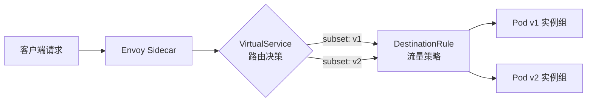
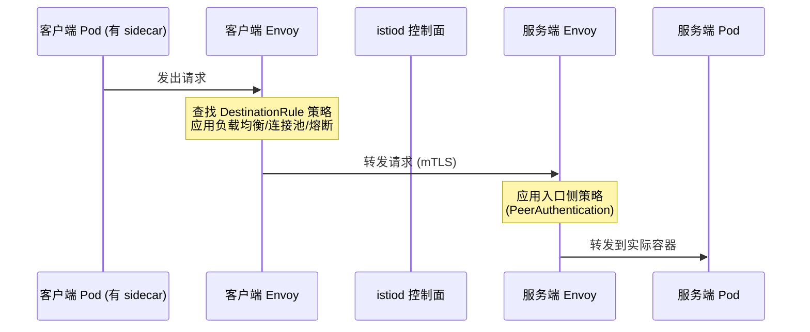
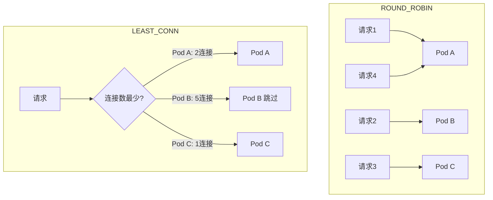
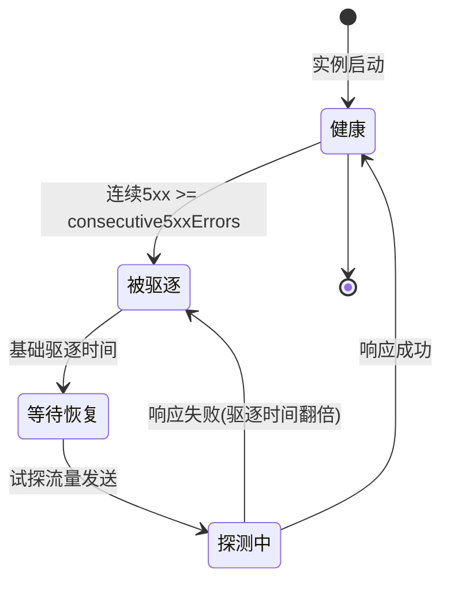
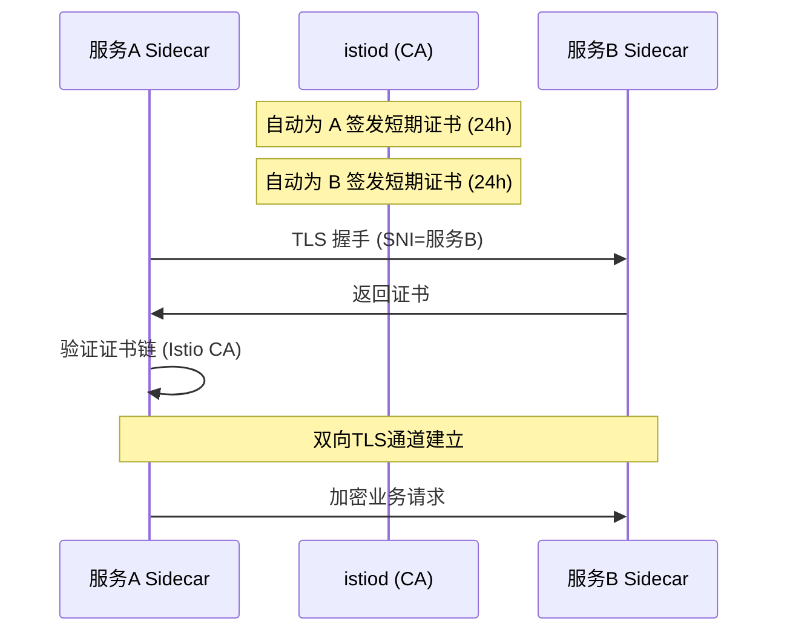
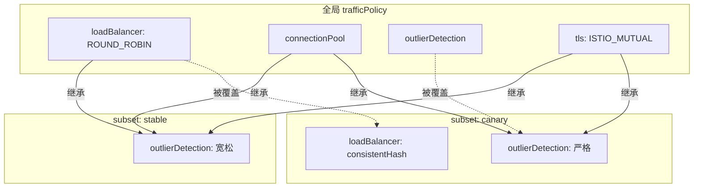
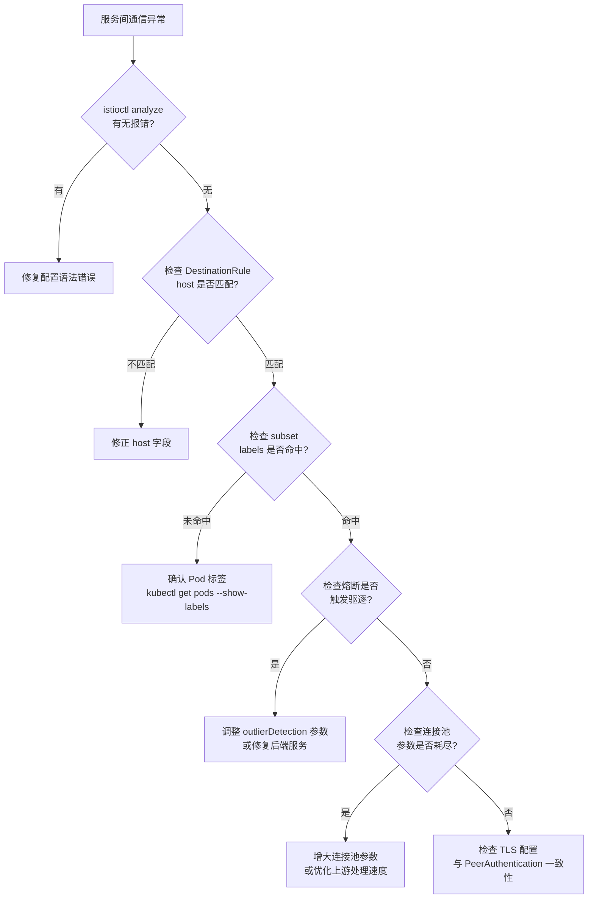
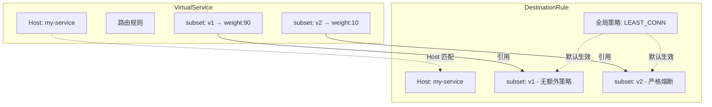

## DestinationRule：流量策略的精细化控制

### 1. 概述与背景

#### 1.1 什么是 DestinationRule

DestinationRule 是 Istio 服务网格中定义流量策略的核心 CRD（Custom Resource Definition）。如果说 VirtualService 负责将流量"路由到哪里"，那么 DestinationRule 则负责控制流量"到达之后怎么处理"——包括负载均衡算法、连接池管理、异常实例检测（熔断）以及 TLS 安全策略。

在 Istio 的流量管理模型中，VirtualService 和 DestinationRule 是一对不可分割的组合。VirtualService 通过 host 和 subset 字段引用 DestinationRule 中定义的子集，而 DestinationRule 则为这些子集注入具体的通信策略。缺少 DestinationRule，VirtualService 只能做路由分发，无法控制服务质量；缺少 VirtualService，DestinationRule 依然可以为整个服务生效，但粒度较粗。



#### 1.2 DestinationRule 在流量管理体系中的定位

Istio 流量管理的三大 CRD 各有分工：

| CRD | 职责 | 关键能力 | 生效阶段 |
|-----|------|----------|----------|
| Gateway | 入口流量管控 | 端口监听、TLS 终结、主机路由 | 流量进入网格前 |
| VirtualService | 路由规则定义 | 路径匹配、权重分配、重写/重定向 | 流量路由决策时 |
| DestinationRule | 目标服务策略 | 负载均衡、熔断、连接池、子集定义 | 流量路由决策后 |

三者的处理流程可以用一句话概括：Gateway 决定"流量能不能进来"，VirtualService 决定"流量往哪走"，DestinationRule 决定"流量到了之后怎么用"。

#### 1.3 为什么 DestinationRule 不可或缺

- **负载均衡控制**：默认的 round-robin 并非所有场景的最优解，粘性会话、最小连接数等算法在特定业务场景下有显著优势
- **故障隔离**：通过 outlier detection 自动剔除异常实例，防止故障扩散（雪崩效应）
- **连接池调优**：TCP/HTTP 连接池参数直接影响高并发场景下的吞吐量和延迟
- **安全通信**：控制服务间 mTLS 的行为模式，是零信任架构的关键组件
- **灰度发布支撑**：与 VirtualService 配合，基于 subset 实现精细的流量切分

#### 1.4 DestinationRule 与 Sidecar 注入的关系

DestinationRule 的策略最终由 Envoy sidecar 代理执行。当一个 Pod 被注入 sidecar 后，Istio 控制面（istiod）会将 DestinationRule 配置下发到该 Pod 的 Envoy 代理。这意味着：

- **未注入 sidecar 的 Pod 不受 DestinationRule 管控**：如果目标服务没有 sidecar，DestinationRule 中的负载均衡、熔断等策略不会生效
- **source 端也需要 sidecar**：流量从 source Pod 发出时，source 的 sidecar 负责执行 DestinationRule 策略。如果 source 没有 sidecar，请求直接发往目标，绕过所有网格策略
- **host 必须在网格可见范围内**：DestinationRule 的 host 必须是网格能解析到的服务名（Kubernetes Service 或 ServiceEntry 注册的外部服务）



### 2. 核心概念详解

#### 2.1 Host 与 Subset

**Host** 指定 DestinationRule 适用的目标服务，支持以下格式：

```yaml
# Kubernetes Service 名称（同命名空间）
host: my-service

# 完整限定名（跨命名空间）
host: my-service.production.svc.cluster.local

# 外部服务（需配合 ServiceEntry）
host: external-api.example.com
```

**Subset** 是 DestinationRule 中定义的服务子集，通过标签选择器将服务实例分组。每个 subset 必须拥有唯一的 `name`，并通过 `labels` 匹配 Pod 标签：

```yaml
subsets:
- name: v1
  labels:
    version: v1
- name: v2
  labels:
    version: v2
- name: canary
  labels:
    version: v2
    track: canary
```

subset 的核心价值在于：

1. **流量切分的基础**：VirtualService 通过 `route.destination.subset` 引用这些名称
2. **差异化策略**：可以为不同 subset 配置不同的负载均衡、连接池和熔断参数
3. **灰度发布**：将金丝雀流量定向到特定 subset
4. **故障注入隔离**：只对特定 subset 注入故障，不影响其他版本

#### 2.2 通配符 Host 与批量策略

DestinationRule 支持通配符 host，可为一类服务批量定义策略：

```yaml
apiVersion: networking.istio.io/v1beta1
kind: DestinationRule
metadata:
  name: default-dr
spec:
  # 匹配所有 .production.svc.cluster.local 的服务
  host: "*.production.svc.cluster.local"
  trafficPolicy:
    loadBalancer:
      simple: LEAST_CONN
    connectionPool:
      tcp:
        maxConnections: 100
        connectTimeout: 3s
    outlierDetection:
      consecutive5xxErrors: 5
      interval: 30s
      baseEjectionTime: 30s
    tls:
      mode: ISTIO_MUTUAL
```

通配符 host 的作用域和优先级：

| host 配置 | 作用范围 | 优先级 |
|-----------|---------|--------|
| `*.production.svc.cluster.local` | 匹配该命名空间所有服务 | 基线默认 |
| `my-service.production.svc.cluster.local` | 仅匹配特定服务 | 覆盖通配符 |
| `my-service` (同命名空间) | 仅匹配同 NS 特定服务 | 同上 |

当多个 DestinationRule 匹配同一个 host 时，Istio 按"最长匹配"原则选择——精确名称优先于通配符。

#### 2.3 TrafficPolicy 全局策略

`trafficPolicy` 是 DestinationRule 的顶层字段，为该 Host 下所有流量（未被 subset 级别策略覆盖时）设定默认策略：

```yaml
apiVersion: networking.istio.io/v1beta1
kind: DestinationRule
metadata:
  name: my-service-dr
  namespace: default
spec:
  host: my-service
  trafficPolicy:
    loadBalancer:
      simple: LEAST_CONN
    connectionPool:
      tcp:
        maxConnections: 100
        connectTimeout: 5s
      http:
        h2UpgradePolicy: DEFAULT
        maxRequestsPerConnection: 1000
    outlierDetection:
      consecutive5xxErrors: 5
      interval: 30s
      baseEjectionTime: 30s
      maxEjectionPercent: 50
    tls:
      mode: ISTIO_MUTUAL
  subsets:
  - name: v1
    labels:
      version: v1
  - name: v2
    labels:
      version: v2
```

策略生效的优先级规则：

subset级trafficPolicy > 全局trafficPolicy > Istio默认值

需要注意的是，subset 级别的 trafficPolicy 是**合并（merge）**而非完全覆盖全局策略。例如，如果全局配置了 `loadBalancer` 和 `outlierDetection`，而 subset 只配置了 `loadBalancer`，那么该 subset 仍会继承全局的 `outlierDetection`。

### 3. 负载均衡策略

#### 3.1 内置负载均衡算法

Istio 支持以下四种基础负载均衡算法，Envoy 作为底层代理原生实现了这些策略：

```yaml
trafficPolicy:
  loadBalancer:
    simple: ROUND_ROBIN  # 默认值
```

| 算法 | 工作原理 | 适用场景 | 性能特征 |
|------|----------|----------|----------|
| ROUND_ROBIN | 依次轮询每个后端实例 | 无状态服务、实例同构 | 均匀分布，无需额外状态 |
| LEAST_CONN | 选择当前活跃连接数最少的实例 | 长连接服务、请求处理时间差异大 | 避免慢实例过载 |
| RANDOM | 随机选择一个实例 | 大规模集群、实例均匀 | 实现简单，大集群下接近均匀 |
| PASSTHROUGH | 不做负载均衡，直接连接目标地址 | 直连特定 IP、调试场景 | 无额外开销 |



#### 3.2 一致性哈希（Consistent Hash）

一致性哈希是高级负载均衡策略，通过计算请求特征的哈希值将请求固定路由到特定后端实例。支持三种哈希源：

**基于 HTTP Header 的哈希：**

```yaml
trafficPolicy:
  loadBalancer:
    consistentHash:
      httpHeaderName: x-user-id
```

**基于 Cookie 的哈希（会话粘性）：**

```yaml
trafficPolicy:
  loadBalancer:
    consistentHash:
      httpCookie:
        name: user-session
        ttl: 3600s  # Cookie 过期时间
```

**基于请求源 IP 的哈希：**

```yaml
trafficPolicy:
  loadBalancer:
    consistentHash:
      useSourceIp: true
```

> 注意：`useSourceIp` 在客户端经过 NAT 的场景下效果较差，因为多个客户端可能映射到同一 IP。此时应优先使用 HTTP Header 或 Cookie 作为哈希源。

一致性哈希的典型应用场景：

- **有状态服务**：会话保持（session affinity），确保同一用户请求落到同一实例
- **缓存亲和性**：将同一资源的请求路由到已缓存数据的实例，提升缓存命中率
- **数据局部性**：在有本地数据存储的系统中，将请求路由到数据所在节点

**一致性哈希的数学优势**：当后端实例数量变化时，一致性哈希会重新分配映射关系，但影响范围仅限于约 `1/N` 的流量（N 为实例数）。相比之下，取模哈希（modulo hash）在实例变化时会导致几乎所有请求重新分配，造成缓存雪崩。

#### 3.3 区域感知负载均衡（Locality-Aware Load Balancing）

在多区域部署中，区域感知负载均衡优先将流量路由到同区域实例，减少跨区延迟和带宽成本：

```yaml
trafficPolicy:
  loadBalancer:
    localityLbSetting:
      enabled: true
      distribute:
      - from: "us-east-1/*"
        to:
          "us-east-1/*": 80
          "us-west-2/*": 15
          "eu-west-1/*": 5
      failover:
      - from: us-east-1
        to: us-west-2
```

**distribute** 精确控制流量分配比例，**failover** 定义故障转移目标。当本区域实例全部不可用时，流量按 failover 规则切换到指定区域。

区域格式遵循 `<region>/<zone>/<subzone>` 的层级结构。在 Kubernetes 中，这通常对应 Node 的 `topology.kubernetes.io/region`、`topology.kubernetes.io/zone` 和 `topology.kubernetes.io/subzone` 标签。

#### 3.4 慢启动（Slow Start）

慢启动是防止新加入实例在启动阶段被过多流量压垮的保护机制。新实例刚启动时处理能力尚未完全就绪，慢启动会使其在指定时间内逐步接收更多流量：

```yaml
trafficPolicy:
  loadBalancer:
    simple: LEAST_CONN
    slowStart:
      window: 60s  # 慢启动窗口时间
```

在慢启动窗口内，新实例接收的流量比例从接近 0 逐步增长到正常水平。慢启动窗口结束后，实例与其他实例同等对待。

> 慢启动仅在 `LEAST_CONN` 和 `ROUND_ROBIN` 算法下生效，一致性哈希和 RANDOM 不支持此特性。

### 4. 连接池管理

连接池是 Envoy 为上游服务维护的可复用连接集合。合理的连接池配置可以显著降低延迟（复用连接避免 TCP 握手开销）并保护上游服务免受过载冲击。

#### 4.1 TCP 连接池参数

```yaml
trafficPolicy:
  connectionPool:
    tcp:
      # 最大 TCP 连接数（默认 32767）
      maxConnections: 100
      # 连接超时时间（默认 5s）
      connectTimeout: 3s
      # TCP keepalive 探测配置
      tcpKeepalive:
        time: 7200s       # 空闲多久后开始发送 keepalive
        interval: 75s     # keepalive 探测间隔
        probes: 9         # 未收到响应的探测次数上限
      # TCP Keepalive 最大请求次数（0=不限制）
      maxRequestsPerConnection: 0
```

| 参数 | 默认值 | 说明 | 调优建议 |
|------|--------|------|----------|
| maxConnections | 32767 | 最大并发 TCP 连接数 | 按上游实例数×单实例承载能力设置 |
| connectTimeout | 5s | TCP 连接建立超时 | 内部服务设 1-3s，跨区域设 5-10s |
| maxRequestsPerConnection | 0 | 单连接最大请求数（0=不限） | 设为 1 可强制每次请求用新连接 |
| tcpKeepalive.time | 7200s | 空闲多久发送 keepalive 探测 | 生产环境建议 60-300s |
| tcpKeepalive.interval | 75s | keepalive 探测间隔 | 通常保持默认即可 |
| tcpKeepalive.probes | 9 | 最大探测失败次数 | 超过此次数连接被判定死亡 |

> **为什么 tcpKeepalive.time 默认 7200s 太长？** 云环境中的负载均衡器、防火墙和 NAT 网关通常有空闲连接超时（常见 300-600s）。如果 keepalive 间隔超过这个值，连接会被中间设备静默断开，导致后续请求失败（连接重置）。生产环境建议将 time 设为 60-300s，确保在中间设备超时之前发送探测。

#### 4.2 HTTP/1.1 连接池参数

```yaml
trafficPolicy:
  connectionPool:
    http:
      # HTTP/1.1 最大待处理（排队中）请求数（默认 1024）
      http1MaxPendingRequests: 1024
      # HTTP/1.1 最大并发（正在处理）请求数（默认 2^32-1）
      http1MaxRequests: 2147483647
      # 单个 HTTP/1.1 连接最大请求数（0=不限制，复用连接）
      maxRequestsPerConnection: 0
```

| 参数 | 默认值 | 说明 | 调优建议 |
|------|--------|------|----------|
| http1MaxPendingRequests | 1024 | 等待转发的请求排队上限 | 超出后返回 503；高并发场景设为 2048-4096 |
| http1MaxRequests | 2147483647 | 最大并发转发请求数 | 设为有限值以控制对上游的并发压力 |
| maxRequestsPerConnection | 0 | 单连接最大请求数（0=不限） | 设为 1 可禁用连接复用，用于调试 |

> **maxRequestsPerConnection 的实际影响**：当设为 1 时，每个请求都使用新连接，避免了连接复用可能导致的状态污染问题（如 HTTP/1.1 的 keep-alive 连接上某个请求的响应不完整导致后续请求读到错误数据）。代价是每次请求都有 TCP 握手开销（通常 1-3ms）。

#### 4.3 HTTP/2（gRPC）连接池参数

```yaml
trafficPolicy:
  connectionPool:
    http:
      # 单个 HTTP/2 连接上的最大并发流数（默认 100）
      maxConcurrentStreams: 100
      # HTTP/2 升级策略：DEFAULT / DO_NOT_UPGRADE / FORCE
      h2UpgradePolicy: DEFAULT
      # HTTP/2 最大待处理请求数（默认 1024）
      http2MaxPendingRequests: 1024
```

HTTP/2 的多路复用特性使得单个连接可以承载多个并发流，因此 `maxConcurrentStreams` 是控制单连接负载的关键参数。对于 gRPC 服务，通常将此值设为 100-200。

`h2UpgradePolicy` 控制 HTTP/1.1 到 HTTP/2 的升级行为：
- `DEFAULT`：由协议协商决定（ALPN）
- `DO_NOT_UPGRADE`：强制使用 HTTP/1.1
- `FORCE`：强制升级到 HTTP/2

#### 4.4 连接池参数的调优矩阵

不同服务类型需要不同的连接池策略：

| 服务类型 | 关键参数 | 推荐配置 | 原因 |
|----------|----------|----------|------|
| 高并发短连接 API | http1MaxPendingRequests, maxRequestsPerConnection | pending=2048, maxReqPerConn=1 | 请求量大但处理快，避免连接状态污染 |
| 长连接服务（WebSocket） | maxConnections, tcpKeepalive | conn=500, keepalive=60s | 连接生命周期长，需保持活跃 |
| gRPC 服务 | maxConcurrentStreams, http2MaxPendingRequests | streams=100, pending=1024 | HTTP/2 多路复用，控制单连接流数 |
| 数据库代理 | maxConnections, connectTimeout | conn=50, timeout=2s | 数据库连接资源珍贵，需严格限制 |
| 批处理/流式传输 | maxConnections, maxRequestsPerConnection | conn=10, maxReqPerConn=0 | 长耗时请求，需保持连接不被回收 |

#### 4.5 连接池级别的熔断

除了异常实例检测，连接池本身也有内置的熔断机制。当连接池资源耗尽时，Envoy 会直接拒绝新请求而非排队等待：

```yaml
trafficPolicy:
  connectionPool:
    tcp:
      maxConnections: 100    # 超过此值，新连接被拒绝
    http:
      http1MaxPendingRequests: 1024  # 超过此值，新请求返回 503
      http1MaxRequests: 2147483647   # 超过此值，新请求返回 503
```

与 outlier detection 的区别：

| 特性 | 连接池熔断 | Outlier Detection |
|------|-----------|-------------------|
| 触发条件 | 资源耗尽（连接数/请求数达上限） | 实例返回错误响应 |
| 保护对象 | 防止下游过载上游 | 隔离故障实例 |
| 恢复方式 | 资源释放后自动恢复 | 等待驱逐时间后试探恢复 |
| 作用粒度 | 全局（对整个服务） | 实例级 |

### 5. 异常实例检测与熔断

Outlier Detection（异常点检测）是 Istio 内置的被动健康检查机制。它持续监控每个上游实例的健康状态，当某实例的错误率超过阈值时，自动将其从负载均衡池中剔除（ejection），经过一定时间后尝试恢复（recovery）。

#### 5.1 核心参数

```yaml
trafficPolicy:
  outlierDetection:
    # 连续 5xx 错误次数阈值（超过则剔除）
    consecutive5xxErrors: 5
    # 检测间隔
    interval: 30s
    # 初始驱逐时间（指数退避的基准）
    baseEjectionTime: 30s
    # 最大驱逐实例百分比（防止全部剔除导致无可用实例）
    maxEjectionPercent: 50
    # 连续本地失败次数阈值（连接失败、超时等非 HTTP 错误）
    consecutiveLocalOriginFailures: 5
    # 最小健康实例百分比（低于此值时停止驱逐）
    minHealthPercent: 30
    # 最大驱逐时间上限（指数退避不超过此值）
    maxEjectionTime: 300s
```

**consecutiveLocalOriginFailures 详解**：这个参数检测的不是 HTTP 5xx 错误，而是"本地源"错误——即 Envoy 无法建立连接、连接超时、连接重置等 TCP 层面的问题。这类错误通常表明目标实例网络不可达或进程崩溃，比 HTTP 错误更严重。

**minHealthPercent 详解**：当健康实例占比低于此阈值时，istiod 会停止新的驱逐操作。例如，设置 `minHealthPercent: 30` 意味着如果只剩 30% 的健康实例，即使还有实例在报错也不会被驱逐——因为此时驱逐可能导致服务完全不可用。

#### 5.2 驱逐与恢复机制



驱逐时间的指数退避公式：

实际驱逐时间 = baseEjectionTime × 2^(被驱逐次数 - 1)

例如 baseEjectionTime=30s，maxEjectionTime=300s：

| 驱逐次数 | 计算过程 | 实际驱逐时间 |
|----------|----------|------------|
| 第 1 次 | 30 × 2^0 | 30s |
| 第 2 次 | 30 × 2^1 | 60s |
| 第 3 次 | 30 × 2^2 | 120s |
| 第 4 次 | 30 × 2^3 | 240s |
| 第 5 次 | 30 × 2^4 = 480s > 300s | 300s（上限） |

指数退避的设计意图：频繁被驱逐的实例通常存在根本性问题（如内存泄漏、依赖服务故障），短时间的试探性恢复只会增加错误率。指数退避让这类实例有更长的冷却时间。

#### 5.3 与主动健康检查的区别

| 特性 | 异常实例检测（Outlier Detection） | 主动健康检查（Health Check） |
|------|-----------------------------------|-------------------------------|
| 触发方式 | 被动——基于实际流量的响应 | 主动——定期发送探测请求 |
| 检测粒度 | 实例级 | 实例级 |
| 检测频率 | 依赖 interval 参数 | 依赖 probe 配置 |
| 适用场景 | 有流量的服务 | 所有服务（含无流量实例） |
| 配置位置 | DestinationRule | Pod Spec（readinessProbe/livenessProbe） |
| 恢复检测 | 发送试探流量验证 | 等待探测间隔后自动检测 |
| 额外开销 | 无（利用真实流量） | 有（定期消耗资源发送探测） |

生产环境中建议两者结合使用：主动健康检查用于探测新加入的实例和无流量实例，异常实例检测用于持续监控运行中的实例。

#### 5.4 熔断的典型配置模板

**宽松模式**（适合对可用性要求极高的核心服务）：

```yaml
outlierDetection:
  consecutive5xxErrors: 10    # 容忍更多错误
  interval: 10s               # 更频繁检测
  baseEjectionTime: 15s       # 短驱逐时间，快速恢复
  maxEjectionPercent: 30      # 保守驱逐比例
```

**严格模式**（适合对延迟敏感的实时服务）：

```yaml
outlierDetection:
  consecutive5xxErrors: 3     # 快速熔断
  interval: 5s                # 高频检测
  baseEjectionTime: 60s       # 长驱逐时间，充分冷却
  maxEjectionPercent: 70      # 激进驱逐比例
```

**自适应模式**（结合 5xx 和本地失败检测）：

```yaml
outlierDetection:
  consecutive5xxErrors: 5
  consecutiveLocalOriginFailures: 3   # 连接失败更快触发
  interval: 15s
  baseEjectionTime: 30s
  maxEjectionPercent: 50
  minHealthPercent: 30
```

### 6. TLS 安全策略

DestinationRule 的 `tls` 字段控制 Envoy 与上游服务之间的 TLS 行为。这在零信任安全架构中至关重要。

#### 6.1 TLS 模式

```yaml
trafficPolicy:
  tls:
    mode: ISTIO_MUTUAL  # 推荐模式
```

| 模式 | 说明 | 证书管理 | 适用场景 |
|------|------|----------|----------|
| DISABLE | 明文通信 | 无需证书 | 开发调试环境 |
| SIMPLE | 客户端验证服务端证书 | 需手动配置 caCertificates | 访问外部 HTTPS 服务 |
| MUTUAL | 双向 TLS，手动管理证书 | 需手动配置 certificateChain、privateKey、caCertificates | 与非 Istio 系统 mTLS 通信 |
| ISTIO_MUTUAL | 双向 TLS，Istio 自动管理 | 自动注入（通过 istiod） | 网格内服务间通信（推荐） |

> **ISTIO_MUTUAL vs MUTUAL 的选择**：ISTIO_MUTUAL 由 istiod 自动签发和轮转证书，无需手动干预，是网格内通信的首选。MUTUAL 模式需要手动管理证书的签发、分发和续期，仅在与非 Istio 控制的系统（如外部数据库、遗留服务）通信时使用。

#### 6.2 ISTIO_MUTUAL 的工作原理



证书自动轮转机制：
- istiod 默认每 24 小时签发新证书
- 旧证书在过期前仍可使用，避免轮转窗口期的连接中断
- 证书的 SPIFFE ID 格式为 `spiffe://cluster.local/ns/<namespace>/sa/<service-account>`

#### 6.3 外部服务的 TLS 配置

访问外部 HTTPS API 时，需要先创建 ServiceEntry，再配置 DestinationRule：

```yaml
apiVersion: networking.istio.io/v1beta1
kind: ServiceEntry
metadata:
  name: external-api
spec:
  hosts:
  - api.external.com
  ports:
  - number: 443
    name: https
    protocol: TLS
  resolution: DNS
---
apiVersion: networking.istio.io/v1beta1
kind: DestinationRule
metadata:
  name: external-api-dr
spec:
  host: api.external.com
  trafficPolicy:
    tls:
      mode: SIMPLE
      caCertificates: /etc/ssl/certs/ca-certificates.crt
```

如果外部服务使用客户端证书认证（双向 TLS），则需使用 MUTUAL 模式：

```yaml
apiVersion: networking.istio.io/v1beta1
kind: DestinationRule
metadata:
  name: external-mtls-dr
spec:
  host: secure-api.external.com
  trafficPolicy:
    tls:
      mode: MUTUAL
      clientCertificate: /etc/certs/client.pem
      privateKey: /etc/certs/client-key.pem
      caCertificates: /etc/certs/ca.pem
```

### 7. Subset 级别差异化策略

DestinationRule 允许为每个 subset 配置独立的流量策略，覆盖全局 trafficPolicy。这是实现精细灰度发布和差异化运维的关键能力。

#### 7.1 差异化负载均衡

```yaml
apiVersion: networking.istio.io/v1beta1
kind: DestinationRule
metadata:
  name: my-service-dr
spec:
  host: my-service
  trafficPolicy:
    loadBalancer:
      simple: ROUND_ROBIN  # 全局默认
  subsets:
  - name: stable
    labels:
      version: v1
    trafficPolicy:
      loadBalancer:
        simple: ROUND_ROBIN    # 稳定版：均匀分配
  - name: canary
    labels:
      version: v2
    trafficPolicy:
      loadBalancer:
        consistentHash:
          httpHeaderName: x-user-id  # 金丝雀：按用户粘性
      connectionPool:
        http:
          http1MaxPendingRequests: 100  # 限制金丝雀并发
          http1MaxRequests: 500
```

#### 7.2 差异化熔断策略

稳定版本采用宽松熔断，金丝雀版本采用严格熔断——因为金丝雀版本通常未经充分验证，需要更敏感的故障检测：

```yaml
subsets:
- name: stable
  labels:
    version: v1
  trafficPolicy:
    outlierDetection:
      consecutive5xxErrors: 10
      baseEjectionTime: 15s
      maxEjectionPercent: 30
- name: canary
  labels:
    version: v2
  trafficPolicy:
    outlierDetection:
      consecutive5xxErrors: 3
      baseEjectionTime: 60s
      maxEjectionPercent: 70
```

#### 7.3 Subset 策略继承机制

理解 subset 策略的继承机制对正确配置至关重要：



最终生效策略：

| 策略项 | stable subset | canary subset |
|--------|--------------|---------------|
| loadBalancer | ROUND_ROBIN（继承全局） | consistentHash（subset 覆盖） |
| connectionPool | 全局配置（继承） | 全局配置（继承） |
| outlierDetection | 宽松（subset 覆盖） | 严格（subset 覆盖） |
| tls | ISTIO_MUTUAL（继承全局） | ISTIO_MUTUAL（继承全局） |

### 8. 实战案例

#### 8.1 金丝雀发布完整配置

以下配置配合 VirtualService 实现 95%/5% 的流量切分，并为金丝雀版本设置严格限制：

```yaml
# DestinationRule - 定义子集和策略
apiVersion: networking.istio.io/v1beta1
kind: DestinationRule
metadata:
  name: order-service-dr
  namespace: production
spec:
  host: order-service
  trafficPolicy:
    loadBalancer:
      simple: LEAST_CONN
    connectionPool:
      tcp:
        maxConnections: 200
        connectTimeout: 3s
      http:
        h2UpgradePolicy: DEFAULT
        maxRequestsPerConnection: 100
    outlierDetection:
      consecutive5xxErrors: 5
      interval: 10s
      baseEjectionTime: 30s
      maxEjectionPercent: 50
    tls:
      mode: ISTIO_MUTUAL
  subsets:
  - name: stable
    labels:
      version: v1
  - name: canary
    labels:
      version: v2
    trafficPolicy:
      connectionPool:
        http:
          http1MaxPendingRequests: 50
          http1MaxRequests: 200
      outlierDetection:
        consecutive5xxErrors: 2
        baseEjectionTime: 60s
---
# VirtualService - 95/5 流量切分
apiVersion: networking.istio.io/v1beta1
kind: VirtualService
metadata:
  name: order-service-vs
  namespace: production
spec:
  hosts:
  - order-service
  http:
  - route:
    - destination:
        host: order-service
        subset: canary
      weight: 5
    - destination:
        host: order-service
        subset: stable
      weight: 95
    retries:
      attempts: 3
      perTryTimeout: 2s
      retryOn: 5xx,reset,connect-failure
```

**配置解读**：
- stable 和 canary 共享全局的 `LEAST_CONN` 负载均衡和 `ISTIO_MUTUAL` TLS
- canary 子集额外限制了并发（pending=50, requests=200），防止新版本过载
- canary 的熔断更严格（2 次 5xx 即驱逐），而 stable 容忍 5 次
- VirtualService 的重试策略确保偶尔的失败请求自动重试

#### 8.2 A/B 测试配置

通过一致性哈希将特定用户群体路由到实验版本：

```yaml
apiVersion: networking.istio.io/v1beta1
kind: DestinationRule
metadata:
  name: product-service-dr
spec:
  host: product-service
  trafficPolicy:
    loadBalancer:
      simple: ROUND_ROBIN
  subsets:
  - name: control
    labels:
      version: v1
  - name: experiment
    labels:
      version: v2
---
apiVersion: networking.istio.io/v1beta1
kind: VirtualService
metadata:
  name: product-service-vs
spec:
  hosts:
  - product-service
  http:
  - match:
    - headers:
        x-experiment-group:
          exact: "beta"
    route:
    - destination:
        host: product-service
        subset: experiment
  - route:
    - destination:
        host: product-service
        subset: control
```

#### 8.3 多区域容灾配置

```yaml
apiVersion: networking.istio.io/v1beta1
kind: DestinationRule
metadata:
  name: payment-service-dr
spec:
  host: payment-service
  trafficPolicy:
    loadBalancer:
      localityLbSetting:
        enabled: true
        distribute:
        - from: "cn-shanghai/cn-shanghai-a/*"
          to:
            "cn-shanghai/cn-shanghai-a/*": 80
            "cn-shanghai/cn-shanghai-b/*": 15
            "cn-beijing/cn-beijing-a/*": 5
        - from: "cn-shanghai/cn-shanghai-b/*"
          to:
            "cn-shanghai/cn-shanghai-b/*": 80
            "cn-shanghai/cn-shanghai-a/*": 15
            "cn-beijing/cn-beijing-a/*": 5
        failover:
        - from: cn-shanghai
          to: cn-beijing
    outlierDetection:
      consecutive5xxErrors: 3
      interval: 5s
      baseEjectionTime: 60s
      maxEjectionPercent: 70
```

**容灾设计要点**：
- 同可用区流量占 80%，跨可用区 15%，跨地域 5%——在性能和容灾之间取得平衡
- 跨可用区的 15% 流量是"热备"——持续有流量验证备用区的可用性
- failover 规则定义了上海全部不可用时的回退目标：北京
- 严格的 outlierDetection（3 次错误即驱逐）确保故障快速隔离

### 9. 监控与调试

#### 9.1 关键指标（Prometheus）

DestinationRule 相关的 Envoy 指标可通过 Prometheus 采集：

| 指标名 | 类型 | 说明 |
|--------|------|------|
| envoy_cluster_circuit_breakers_default_cx_open | Gauge | 当前打开的连接数（触发连接数断路器） |
| envoy_cluster_circuit_breakers_default_rq_open | Gauge | 当前打开的请求数（触发请求数断路器） |
| envoy_cluster_outlier_detection_ejections_active | Gauge | 当前被驱逐的实例数 |
| envoy_cluster_outlier_detection_ejections_enforced | Counter | 被强制驱逐的实例数 |
| envoy_cluster_outlier_detection_ejections_overloaded | Counter | 因过载被驱逐的实例数 |
| envoy_cluster_health_check_healthy | Gauge | 健康实例数 |
| envoy_cluster_upstream_cx_active | Gauge | 当前活跃的上游连接数 |
| envoy_cluster_upstream_rq_pending_active | Gauge | 当前排队中的请求数 |
| envoy_cluster_upstream_rq_active | Gauge | 当前正在处理的请求数 |
| envoy_cluster_upstream_rq_xx | Counter | 各类响应码计数（5xx/4xx/2xx） |

**Prometheus 查询示例**：

```promql
# 查询某服务的被驱逐实例数
envoy_cluster_outlier_detection_ejections_active{cluster_name="outbound|8080||order-service.production.svc.cluster.local"}

# 计算 5xx 错误率
rate(envoy_cluster_upstream_rq_5xx[5m]) / rate(envoy_cluster_upstream_rq_total[5m]) * 100

# 监控连接池利用率
envoy_cluster_upstream_cx_active / envoy_cluster_upstream_cx_max

# 检测是否有请求被排队（可能连接池满）
envoy_cluster_upstream_rq_pending_active > 0
```

#### 9.2 istioctl 调试命令

```bash
# 查看 DestinationRule 配置（含生效策略）
istioctl analyze -n production | grep -i destinationrule

# 导出 Envoy 完整配置，检查 DestinationRule 是否生效
istioctl proxy-config cluster <pod-name> -n production --subset v1

# 查看异常实例检测状态
istioctl proxy-config cluster <pod-name> -n production \
  --fqdn my-service -o json | jq '.[].outlier_detection'

# 验证 subset 路由是否生效
istioctl proxy-config route <pod-name> -n production

# 查看所有已配置的 DestinationRule
kubectl get destinationrules -n production -o wide

# 查看某个 DestinationRule 的详细配置
kubectl get destinationrule order-service-dr -n production -o yaml

# 检查 Envoy 配置同步状态
istioctl proxy-status

# 查看特定 Pod 的完整 Envoy 配置
istioctl proxy-config all <pod-name> -n production -o json
```

#### 9.3 Kiali 可视化

Kiali 是 Istio 官方推荐的可观测性工具，可直观展示 DestinationRule 的效果：

- **健康状态**：红/黄/绿三色标识服务健康程度，异常实例驱逐会触发告警
- **流量拓扑**：展示不同 subset 之间的流量分布
- **熔断事件**：在 Outbound Metrics 中观察 5xx 错误率变化
- **配置审计**：检测缺失的 DestinationRule 或 VirtualService 配置

#### 9.4 常见排障流程



#### 9.5 实际排障场景

**场景一：Subset 不生效，流量未按预期路由**

```bash
# 第一步：确认 DestinationRule 存在且语法正确
kubectl get destinationrule order-service-dr -n production -o yaml

# 第二步：检查 Pod 标签是否与 subset labels 匹配
kubectl get pods -n production -l app=order-service --show-labels
# 输出：
# NAME                          READY   STATUS    LABELS
# order-service-v1-xxx          2/2     Running   app=order-service,version=v1
# order-service-v2-yyy          2/2     Running   app=order-service,version=v2

# 第三步：检查 Envoy 是否已收到配置
istioctl proxy-config cluster <pod-name> -n production --fqdn order-service | grep subset
```

**场景二：间歇性 503 错误**

```bash
# 第一步：检查是否触发了连接池熔断
kubectl exec <pod-name> -n production -c istio-proxy -- \
  curl -s localhost:15000/stats | grep circuit_breakers
# 输出：
# cluster.outbound|8080||order-service.production.svc.cluster.local.circuit_breakers.default.cx_open: 0
# cluster.outbound|8080||order-service.production.svc.cluster.local.circuit_breakers.default.rq_open: 1

# 第二步：如果 rq_open > 0，说明请求级别断路器已触发，需要增大 http1MaxRequests 或减少并发

# 第三步：检查是否有实例被驱逐
kubectl exec <pod-name> -n production -c istio-proxy -- \
  curl -s localhost:15000/stats | grep outlier_detection_ejections_active
```

**场景三：连接池耗尽导致请求排队**

```bash
# 检查排队中的请求数
kubectl exec <pod-name> -n production -c istio-proxy -- \
  curl -s localhost:15000/stats | grep upstream_rq_pending
# 如果 pending_active 持续 > 0，说明连接池已满
# 解决方案：增大 http1MaxPendingRequests 或优化上游响应时间
```

### 10. 常见误区与最佳实践

#### 10.1 常见误区

**误区一：DestinationRule 和 VirtualService 可以独立使用**

虽然技术上可以只配置 DestinationRule 而不配置 VirtualService（此时 trafficPolicy 对整个 Host 生效），但缺乏 VirtualService 意味着无法做精细化的路由控制。反之，如果 VirtualService 引用了不存在的 subset，流量将无法到达后端（返回 503）。

**误区二：maxEjectionPercent 设为 100%**

将最大驱逐百分比设为 100% 意味着所有实例都可能被同时驱逐，导致服务完全不可用。生产环境建议不超过 50%，确保至少一半的实例始终在负载均衡池中。

**误区三：忽略 connectTimeout 的影响**

connectTimeout 默认 5s 在高并发场景下过长。如果上游服务响应慢，5s 的超时会导致请求大量堆积在连接队列中。对于内部服务间调用，建议设为 1-3s。

**误区四：subset 命名随意**

subset 名称一旦被 VirtualService 引用就会产生耦合。重命名或删除 subset 会导致路由失败。建议使用语义化的稳定命名（stable、canary、v1、v2），避免使用临时性名称。

**误区五：将 outlierDetection 当作唯一的容错手段**

异常实例检测是被动的——它只能在流量通过时发现问题。对于无流量的实例或启动阶段的实例，需要结合主动健康检查（readinessProbe / livenessProbe）使用。

**误区六：不理解 subset 策略的继承机制**

有些开发者以为 subset 的 trafficPolicy 会完全覆盖全局策略，实际上只是覆盖 subset 中明确声明的字段，未声明的字段仍继承全局配置。这可能导致意外行为——例如 subset 只设了 outlierDetection 而忘了 loadBalancer，结果 subset 使用了全局的负载均衡算法而非预期的。

**误区七：过度配置连接池参数**

过大的连接池（如 maxConnections=100000）会让 Envoy 消耗大量内存，同时给上游服务带来潜在的过载风险。连接池参数应基于实际业务需求和上游承载能力设置，而非"设大一点总没错"。

#### 10.2 最佳实践

1. **始终配置 outlierDetection**：即使使用默认值，也应显式声明，避免依赖隐式行为变化
2. **connectionPool 参数按服务类型调优**：不同服务（API、gRPC、数据库代理）的连接模型不同，需要差异化配置
3. **金丝雀版本使用更严格的策略**：更小的并发限制、更敏感的熔断阈值，快速发现新版本问题
4. **使用 ISTIO_MUTUAL 替代手动证书管理**：除非与非 Istio 系统通信，否则始终使用 Istio 自动管理的证书
5. **渐进式调整参数**：一次只修改一个参数，观察监控指标变化后再调整下一个，避免多变量干扰
6. **配合 PeerAuthentication 使用**：DestinationRule 的 TLS 是出口侧，PeerAuthentication 控制入口侧，两者配合实现端到端 mTLS
7. **使用通配符 host 设置基线策略**：为整个命名空间设置默认策略，再用精确 host 覆盖关键服务
8. **在 GitOps 流程中管理 DestinationRule**：所有配置变更通过代码审查和 CI/CD 流程，避免手动 kubectl apply

### 11. DestinationRule 与 VirtualService 协作关系

理解两者的协作关系是掌握 Istio 流量管理的关键：



关键协作规则：

| 场景 | VirtualService 配置 | DestinationRule 配置 | 效果 |
|------|---------------------|----------------------|------|
| 无 subset 路由 | 不指定 subset | 仅定义全局 trafficPolicy | 所有流量使用全局策略 |
| 有权重的 subset 路由 | 指定 subset + weight | 定义对应的 subset | 不同版本使用各自策略 |
| 无匹配 subset 的请求 | 引用了不存在的 subset | — | 请求返回 503 |
| 多 VirtualService 引用 | 多个 VS 指向同一 Host | 一个 DR 定义所有 subset | 按最长匹配前缀合并 |
| DestinationRule 无 VirtualService | 未配置 | 定义 trafficPolicy | 全局策略对所有入站流量生效 |
| VirtualService 引用 subset 但无 DR | 引用 subset | 未配置对应 subset | 请求返回 503 |

### 12. 与第三方服务网格的对比

不同服务网格对 DestinationRule 级功能的实现方式存在差异：

| 能力 | Istio (DestinationRule) | Linkerd (ServiceProfile) | Consul Connect (ServiceDefaults) |
|------|--------------------------|--------------------------|----------------------------------|
| 负载均衡 | 4种内置 + 一致性哈希 | Round Robin（有限） | Round Robin / Least Request / Random |
| 连接池 | TCP + HTTP 完整参数 | 有限配置 | Circuit Breaker 配置 |
| 异常检测 | 完整的 outlier detection | 有限的失败注入 | 连接超时 + 检查间隔 |
| TLS 控制 | 4种模式 | 自动 mTLS | 支持 TLS + auto encrypt |
| Subsets | 原生支持 | 不支持 | 不原生支持 |
| 复杂度 | 高 | 低 | 中 |
| 学习曲线 | 陡峭 | 平缓 | 中等 |
| 社区生态 | 最活跃 | 稳定但较小 | 与 HashiCorp 生态绑定 |

选择建议：功能丰富度和灵活性首选 Istio；轻量级和易用性首选 Linkerd；与 HashiCorp 栈（Consul/Vault/Nomad）集成首选 Consul Connect。

### 13. 进阶：自定义负载均衡与 EnvoyFilter

当内置的负载均衡策略无法满足需求时，可以通过 EnvoyFilter 对 Envoy 的 DestinationRule 配置进行注入和修改：

**示例一：启用 Ring Hash 负载均衡**

```yaml
apiVersion: networking.istio.io/v1alpha3
kind: EnvoyFilter
metadata:
  name: custom-lb
  namespace: production
spec:
  workloadSelector:
    labels:
      app: my-service
  configPatches:
  - applyTo: CLUSTER
    match:
      context: SIDECAR_OUTBOUND
    patch:
      operation: MERGE
      value:
        lb_policy: RING_HASH
        ring_hash_lb_config:
          minimum_ring_size: 1024
```

**示例二：自定义连接池参数（DestinationRule 不支持的高级参数）**

```yaml
apiVersion: networking.istio.io/v1alpha3
kind: EnvoyFilter
metadata:
  name: custom-connection-pool
  namespace: production
spec:
  workloadSelector:
    labels:
      app: my-service
  configPatches:
  - applyTo: CLUSTER
    match:
      context: SIDECAR_OUTBOUND
      cluster:
        service: my-service.production.svc.cluster.local
    patch:
      operation: MERGE
      value:
        upstream_connection_options:
          tcp_keepalive:
            keepalive_probes: 5
            keepalive_time: 120
            keepalive_interval: 30
```

**示例三：添加自定义负载均衡器子集选择逻辑**

```yaml
apiVersion: networking.istio.io/v1alpha3
kind: EnvoyFilter
metadata:
  name: subset-load-balancer
  namespace: production
spec:
  workloadSelector:
    labels:
      app: my-service
  configPatches:
  - applyTo: CLUSTER
    match:
      context: SIDECAR_OUTBOUND
      cluster:
        subset: v1
    patch:
      operation: MERGE
      value:
        lb_policy: LEAST_REQUEST
        least_request_lb_config:
          choice_count: 3
          slow_start_config:
            slow_start_window: 60s
```

**警告**：EnvoyFilter 是 Istio 中的"逃生舱"，绕过了 Istio 的 API 保护。使用 EnvoyFilter 会带来以下风险：
- **版本升级风险**：Istio 升级后 Envoy 的内部 API 可能变更，导致 EnvoyFilter 失效
- **调试困难**：EnvoyFilter 的修改不会在 `istioctl analyze` 中报告，排障更复杂
- **性能影响**：不当的 EnvoyFilter 配置可能引入额外延迟或内存开销

建议优先使用 DestinationRule 原生 API，仅在原生 API 无法满足需求时才使用 EnvoyFilter。

### 14. 本节小结

DestinationRule 是 Istio 流量管理中承上启下的核心组件。它将 VirtualService 的路由决策转化为具体的流量行为——负载均衡决定了请求分配到哪个实例，连接池决定了能同时承载多少并发，异常检测决定了如何隔离故障实例，TLS 决定了通信的安全级别。

掌握 DestinationRule 的关键在于理解三层策略体系：全局默认策略 → Subset 差异化策略 → 系统默认值。在实际运维中，建议从全局策略入手，逐步为关键服务的特定 subset 配置差异化策略，并通过 Prometheus 指标持续观察调整效果。

核心要点速查：

| 能力 | 关键配置项 | 生产建议 |
|------|-----------|---------|
| 负载均衡 | `loadBalancer.simple` 或 `consistentHash` | 无状态用 LEAST_CONN，需粘性用 consistentHash |
| 连接池 | `connectionPool.tcp/http` | 按服务类型调优，关注 connectTimeout 和 maxRequests |
| 异常检测 | `outlierDetection` | 始终显式配置，consecutive5xxErrors=5 是不错的起点 |
| TLS | `tls.mode` | 网格内用 ISTIO_MUTUAL，外部用 SIMPLE/MUTUAL |
| Subset 策略 | `subsets[].trafficPolicy` | 金丝雀用更严格的熔断和更小的连接池 |
