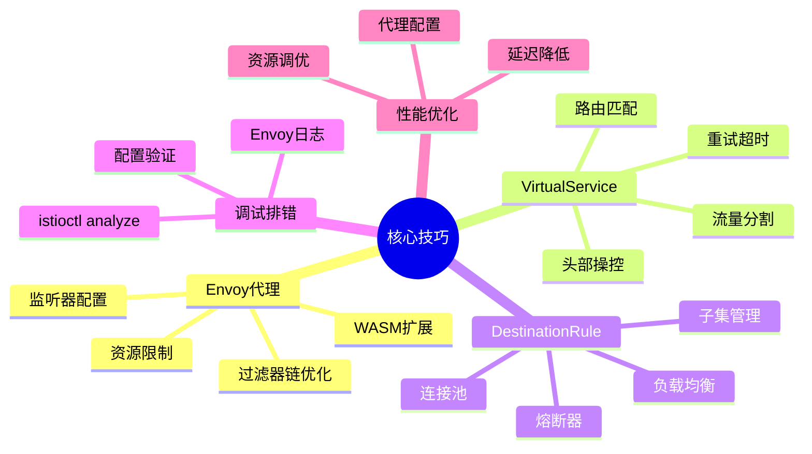
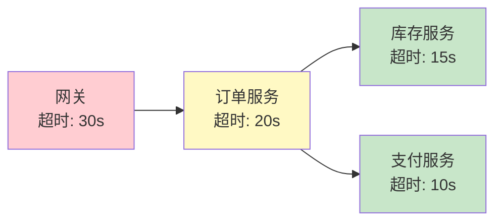
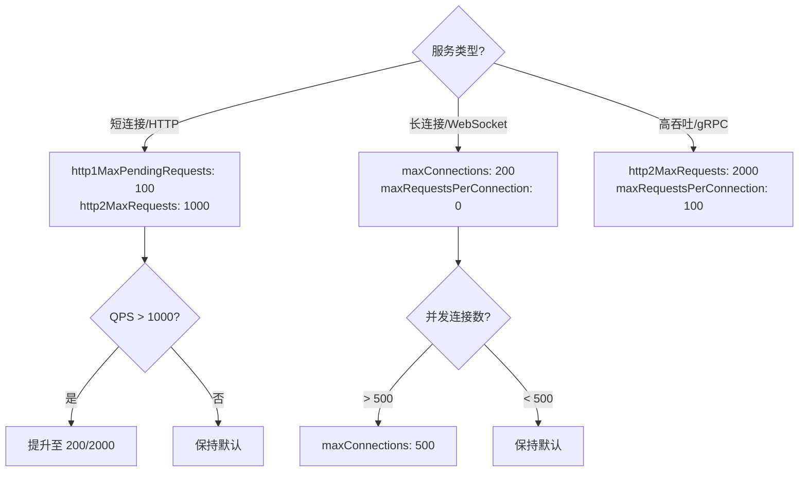
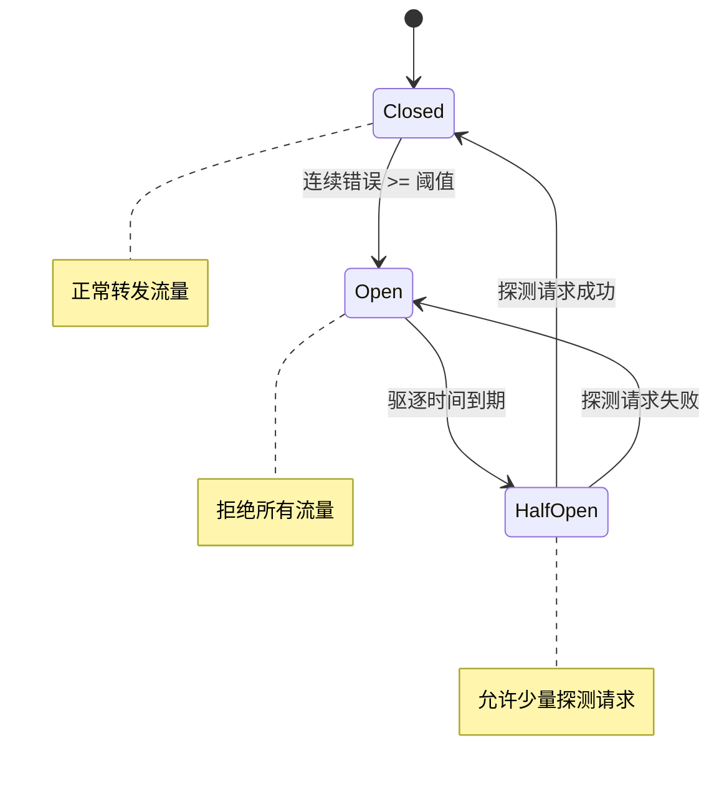
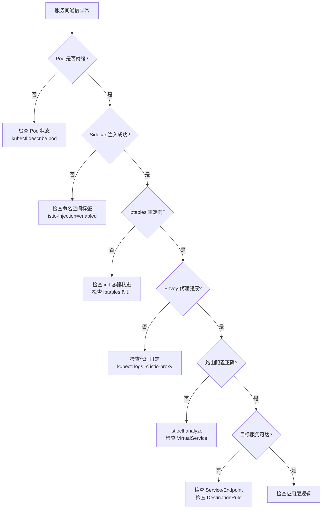
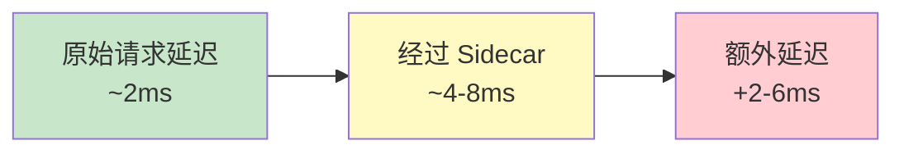

# 核心技巧

服务网格的理论知识固然重要，但真正决定落地成败的是一系列实操层面的核心技巧。本节围绕 **Envoy 代理调优**、**VirtualService 高级用法**、**DestinationRule 策略精调** 三大主题，系统性地分享配置、调试、性能优化的最佳实践。每个技巧都配有可直接复用的配置片段和排错思路，帮助你在生产环境中少走弯路。

## 技巧全景



| 技巧领域 | 核心能力 | 适用场景 | 难度 |
|---------|---------|---------|------|
| Envoy 代理调优 | 监听器、过滤器、WASM 扩展 | 任何使用 Istio 的环境 | ★★★ |
| VirtualService 高级用法 | 路由匹配、流量分割、重试策略 | 流量管理、灰度发布 | ★★☆ |
| DestinationRule 策略精调 | 负载均衡、连接池、熔断 | 服务稳定性保障 | ★★★ |
| 调试与排错 | 配置分析、日志排查、问题定位 | 生产环境故障排查 | ★★☆ |
| 性能优化 | 资源配置、延迟优化、代理调优 | 大规模集群、低延迟场景 | ★★★★ |

---

## 一、Envoy 代理核心技巧

Envoy 是服务网格数据平面的执行引擎，掌握其配置和调优技巧是驾驭服务网格的基础。

### 1.1 监听器（Listener）配置

监听器决定了 Envoy 如何接收和处理入站流量。合理配置监听器是流量管理的第一步。

**自定义监听器过滤器**：当默认的 HTTP 路由无法满足需求时，可以通过 Listener Filter 扩展处理逻辑：

```yaml
apiVersion: networking.istio.io/v1beta1
kind: EnvoyFilter
metadata:
  name: custom-listener-filter
  namespace: default
spec:
  configPatches:
    - applyTo: LISTENER_FILTER
      match:
        context: SIDECAR_INBOUND
        listener:
          filterChain:
            filter:
              name: envoy.filters.network.http_connection_manager
      patch:
        operation: INSERT_BEFORE
        value:
          name: envoy.filters.http.jwt_authn
          typed_config:
            "@type": type.googleapis.com/envoy.extensions.filters.http.jwt_authn.v3.JwtAuthentication
            providers:
              auth0:
                issuer: https://auth.example.com/
                audiences: ["my-service"]
                remote_jwks:
                  http_uri:
                    uri: https://auth.example.com/.well-known/jwks.json
                    cluster: outbound|443|https|auth.example.com
                    timeout: 5s
```

**过滤器链顺序至关重要**：Envoy 按照过滤器链中的注册顺序依次处理请求。典型的推荐顺序为：

入口 → TLS 终止 → JWT 鉴权 → RBAC 授权 → 路由 → 限流 → 故障注入 → 转发

如果顺序错误（例如把路由放在鉴权之前），会导致未经认证的请求直接被转发到后端服务，产生严重的安全漏洞。

### 1.2 WebAssembly（WASM）扩展

Envoy 的 WASM 扩展机制允许你在不修改 Envoy 二进制的情况下添加自定义处理逻辑。这比传统的 C++ 编译扩展更安全、更灵活。

**典型场景**：自定义认证逻辑、协议转换、请求/响应改写、自定义指标采集。

```yaml
# 通过 EnvoyFilter 注入 WASM 插件
apiVersion: networking.istio.io/v1beta1
kind: EnvoyFilter
metadata:
  name: custom-wasm-plugin
  namespace: default
spec:
  configPatches:
    - applyTo: HTTP_FILTER
      match:
        context: SIDECAR_INBOUND
        listener:
          filterChain:
            filter:
              name: envoy.filters.network.http_connection_manager
              subFilter:
                name: envoy.filters.http.router
      patch:
        operation: INSERT_BEFORE
        value:
          name: envoy.filters.http.wasm
          typed_config:
            "@type": type.googleapis.com/envoy.extensions.filters.http.wasm.v3.Wasm
            config:
              name: my_custom_filter
              root_id: my_root_id
              vm_config:
                runtime: envoy.wasm.runtime.v8
                code:
                  local:
                    filename: /etc/wasm/custom-filter.wasm
              configuration:
                "@type": type.googleapis.com/google.protobuf.StringValue
                value: '{"key": "value"}'
```

**WASM 扩展的性能考量**：

| 因素 | 影响 | 建议 |
|------|------|------|
| VM 运行时 | V8 启动慢但运行快，Wasmtime 启动快但运行稍慢 | 生产环境用 V8，开发环境用 Wasmtime |
| 内存限制 | WASM 模块有独立内存空间，不受 Envoy 主进程限制 | 设置合理上限（如 128MB），避免 OOM |
| 热更新 | WASM 模块支持热加载，无需重启 Envoy | 利用此特性实现零停机扩展更新 |

### 1.3 代理资源配置

每个 Sidecar 代理都需要合理的资源配额。资源过少会导致代理性能瓶颈，过多则浪费集群资源。

**推荐的默认资源配置**：

```yaml
apiVersion: install.istio.io/v1alpha1
kind: IstioOperator
spec:
  meshConfig:
    defaultConfig:
      # 代理资源配置
      proxyResources:
        requests:
          cpu: 100m
          memory: 128Mi
        limits:
          cpu: 500m
          memory: 512Mi
      # 应用容器资源（Sidecar 注入时自动设置）
      proxyApplicationContainer:
        resources:
          requests:
            cpu: 50m
            memory: 64Mi
```

**不同场景的资源配置建议**：

| 场景 | CPU Request | CPU Limit | 内存 Request | 内存 Limit | 说明 |
|------|------------|-----------|-------------|-----------|------|
| 开发/测试 | 50m | 200m | 64Mi | 256Mi | 轻量级，节省资源 |
| 一般服务 | 100m | 500m | 128Mi | 512Mi | 平衡性能与成本 |
| 高吞吐服务 | 200m | 1000m | 256Mi | 1Gi | 处理大量并发请求 |
| 低延迟服务 | 500m | 2000m | 512Mi | 2Gi | 优先保证响应速度 |

### 1.4 Envoy 访问日志定制

默认的 Envoy 访问日志格式较为简略，在生产环境中通常需要自定义以包含更多诊断信息：

```yaml
apiVersion: install.istio.io/v1alpha1
kind: IstioOperator
spec:
  meshConfig:
    accessLogFile: /dev/stdout
    accessLogEncoding: JSON
    accessLogFormat: |
      {
        "authority": "%REQ(:AUTHORITY)%",
        "bytes_received": "%BYTES_RECEIVED%",
        "bytes_sent": "%BYTES_SENT%",
        "downstream_remote_address": "%DOWNSTREAM_REMOTE_ADDRESS%",
        "duration": "%DURATION%",
        "method": "%REQ(:METHOD)%",
        "path": "%REQ(PATH)%",
        "protocol": "%PROTOCOL%",
        "request_id": "%REQ(X-REQUEST-ID)%",
        "response_code": "%RESPONSE_CODE%",
        "response_flags": "%RESPONSE_FLAGS%",
        "route_name": "%ROUTE_NAME%",
        "upstream_cluster": "%UPSTREAM_CLUSTER%",
        "upstream_host": "%UPSTREAM_HOST%",
        "upstream_response_time": "%RESP(X-ENVOY-UPSTREAM-SERVICE-TIME)%",
        "user_agent": "%REQ(USER-AGENT)%",
        "trace_id": "%REQ(X-B3-TRACEID)%",
        "span_id": "%REQ(X-B3-SPANID)%"
      }
```

---

## 二、VirtualService 高级技巧

VirtualService 是 Istio 流量管理的核心资源，掌握其高级用法可以实现精细的流量控制。

### 2.1 路由匹配的组合策略

单一匹配条件往往不够灵活，生产环境中通常需要组合多种匹配条件来实现复杂的路由逻辑。

**多条件组合匹配**：

```yaml
apiVersion: networking.istio.io/v1beta1
kind: VirtualService
metadata:
  name: advanced-routing
spec:
  hosts:
    - api.example.com
  http:
    # 规则1：内部测试用户 + 移动端 + 特定路径 → 灰度版本
    - match:
        - headers:
            x-user-type:
              exact: "internal"
            x-device-type:
              exact: "mobile"
          uri:
            prefix: "/api/v2"
          queryParams:
            beta:
              exact: "true"
      route:
        - destination:
            host: api-service
            subset: canary
    # 规则2：特定地区流量 → 就近部署
    - match:
        - headers:
            x-region:
              exact: "ap-southeast"
      route:
        - destination:
            host: api-service
            subset: ap-sea
          weight: 100
    # 规则3：默认路由 → 稳定版本，带权重分割
    - route:
        - destination:
            host: api-service
            subset: stable
          weight: 95
        - destination:
            host: api-service
            subset: canary
          weight: 5
      retries:
        attempts: 3
        perTryTimeout: 2s
        retryOn: "5xx,reset,connect-failure"
      timeout: 10s
```

**匹配条件类型速查表**：

| 匹配类型 | 语法 | 适用场景 | 示例 |
|---------|------|---------|------|
| exact | `exact: "value"` | 精确匹配字符串 | 用户类型、设备标识 |
| prefix | `prefix: "/api/v1"` | 路径前缀匹配 | API 版本路由 |
| regex | `regex: "^/user/\\d+$"` | 正则匹配复杂模式 | 用户 ID 路由 |
| range | `start: "100", end: "200"` | 数值范围匹配 | HTTP 状态码分流 |
| present | `present: true` | 头部/参数是否存在 | 区分有无特定标记的请求 |

### 2.2 头部操控（Header Manipulation）

VirtualService 支持在路由过程中动态修改请求和响应头部，这在 API 版本迁移、调试追踪、灰度标记等场景下非常实用。

**请求头部修改**：

```yaml
apiVersion: networking.istio.io/v1beta1
kind: VirtualService
metadata:
  name: header-manipulation
spec:
  hosts:
    - backend-service
  http:
    - route:
        - destination:
            host: backend-service
            subset: v2
      # 添加请求头部
      headers:
        request:
          add:
            x-forwarded-by: istio-proxy
            x-request-source: mesh
            x-canary-mark: "true"
          set:
            x-api-version: "v2"
          remove:
            - x-internal-debug
            - x-legacy-token
      # 修改响应头部
      headers:
        response:
          add:
            x-served-by: istio-mesh
          set:
            x-api-version: "v2"
          remove:
            - x-server-version
            - x-upstream-ip
```

**实际应用场景**：

| 场景 | 操作 | 配置要点 |
|------|------|---------|
| API 版本迁移 | set 请求头 `x-api-version` | 后端根据此头切换行为 |
| 灰度标记 | add `x-canary-mark` | 下游服务识别灰度流量 |
| 安全审计 | add `x-forwarded-for` | 追踪原始请求来源 |
| 调试模式 | add `x-debug: true` | 触发后端详细日志 |
| 协议降级 | set `x-protocol: http/1.1` | 强制使用 HTTP/1.1 |

### 2.3 重试策略的精细控制

重试机制看似简单，但配置不当会引发严重的级联故障。掌握以下技巧可以避免常见的重试陷阱。

**重试预算（Retry Budget）**：Istio 1.17+ 支持重试预算机制，防止单次请求的重试风暴：

```yaml
apiVersion: networking.istio.io/v1beta1
kind: VirtualService
metadata:
  name: retry-budget
spec:
  hosts:
    - payment-service
  http:
    - route:
        - destination:
            host: payment-service
      timeout: 30s
      retries:
        attempts: 5
        perTryTimeout: 5s
        retryOn: "5xx,reset,connect-failure"
        # 重试预算：最多触发原始流量 20% 的重试
        retryBudget:
          budgetPercent:
            value: 20.0
          minRetriesPerSec: 3
```

**重试配置的黄金法则**：

1. **始终设置 perTryTimeout**：不设置的话，单次重试可能占用全部 timeout 时间
2. **只对幂等操作重试**：GET/PUT/DELETE 可以重试，POST 需要业务层面保证幂等
3. **设置重试预算**：防止大规模故障时重试流量雪崩
4. **避免对有状态服务重试**：数据库写操作等不应自动重试

```yaml
# 错误示例：对非幂等操作设置重试
# 这会导致重复扣款等问题
retries:
  attempts: 3
  retryOn: "5xx"

# 正确示例：只在安全条件下重试
retries:
  attempts: 3
  perTryTimeout: 2s
  retryOn: "connect-failure,refused-stream,unavailable,cancelled,retriable-status-codes"
  retryRemoteLocalities: true
```

### 2.4 超时链配置

在多层调用链中，超时配置需要遵循"每层递减"的原则，避免上游超时后下游仍在处理：

```yaml
# 网关层：30s 超时
apiVersion: networking.istio.io/v1beta1
kind: VirtualService
metadata:
  name: gateway-vs
spec:
  hosts:
    - "api.example.com"
  http:
    - route:
        - destination:
            host: order-service
      timeout: 30s

---
# 订单服务层：20s 超时
apiVersion: networking.istio.io/v1beta1
kind: VirtualService
metadata:
  name: order-vs
spec:
  hosts:
    - order-service
  http:
    - route:
        - destination:
            host: inventory-service
      timeout: 15s
    - route:
        - destination:
            host: payment-service
      timeout: 10s
```



---

## 三、DestinationRule 策略精调

DestinationRule 定义了流量到达目标服务后的处理策略，是保障服务稳定性的关键配置。

### 3.1 负载均衡策略选择

Istio 支持多种负载均衡算法，选择合适的算法对性能和公平性有显著影响。

**负载均衡策略对比**：

| 策略 | 算法 | 适用场景 | 优点 | 缺点 |
|------|------|---------|------|------|
| ROUND_ROBIN | 轮询 | 通用场景，后端性能均匀 | 简单，公平 | 不考虑后端负载 |
| LEAST_REQUEST | 最少请求 | 后端性能不均匀 | 自适应负载 | 需要统计开销 |
| RANDOM | 随机 | 大规模集群 | 无状态，性能高 | 不保证均匀 |
| RING_HASH | 一致性哈希 | 需要会话亲和性 | 稳定路由 | 节点变化时抖动 |
| MAGLEV | 一致性哈希 | 需要会话亲和性 | 比 RING_HASH 更均匀 | 计算开销略高 |
| LEAST_CONN | 最少连接 | 长连接场景 | 适应连接数差异 | 需要连接池状态 |

**按场景选择**：

```yaml
# 场景1：通用微服务 → 最少请求
apiVersion: networking.istio.io/v1beta1
kind: DestinationRule
metadata:
  name: general-service
spec:
  host: general-service
  trafficPolicy:
    loadBalancer:
      simple: LEAST_REQUEST

---
# 场景2：WebSocket/长连接服务 → 最少连接
apiVersion: networking.istio.io/v1beta1
kind: DestinationRule
metadata:
  name: websocket-service
spec:
  host: websocket-service
  trafficPolicy:
    loadBalancer:
      simple: LEAST_CONN

---
# 场景3：有状态缓存服务 → 一致性哈希
apiVersion: networking.istio.io/v1beta1
kind: DestinationRule
metadata:
  name: cache-service
spec:
  host: cache-service
  trafficPolicy:
    loadBalancer:
      consistentHash:
        httpHeaderName: "x-user-id"
```

### 3.2 连接池参数调优

连接池参数直接影响服务的吞吐量和稳定性。配置过低会限制并发能力，配置过高则可能导致后端过载。

**关键参数详解**：

```yaml
apiVersion: networking.istio.io/v1beta1
kind: DestinationRule
metadata:
  name: connection-pool-tuning
spec:
  host: backend-service
  trafficPolicy:
    connectionPool:
      tcp:
        # 最大 TCP 连接数（所有 Envoy 实例合计）
        maxConnections: 100
        # 连接超时
        connectTimeout: 5s
        # TCP Keepalive 探测
        tcpKeepalive:
          time: 7200s
          interval: 75s
          probes: 9
      http:
        # HTTP/1.1 最大挂起请求数（排队等待连接的请求数）
        http1MaxPendingRequests: 100
        # HTTP/2 最大并发流数
        http2MaxRequests: 1000
        # 每个连接的最大并发流数（HTTP/2）
        maxRequestsPerConnection: 100
        # 最大重试请求数
        maxRetries: 3
        # 追加头部，标识连接来源
        h2UpgradePolicy: DEFAULT
```

**参数调优决策树**：



### 3.3 熔断器（Circuit Breaker）配置

熔断器模式在服务网格中通过 outlierDetection 实现，它会自动检测并隔离异常的后端实例。

**outlierDetection 参数详解**：

```yaml
apiVersion: networking.istio.io/v1beta1
kind: DestinationRule
metadata:
  name: circuit-breaker
spec:
  host: backend-service
  trafficPolicy:
    outlierDetection:
      # 连续 5xx 错误次数触发驱逐
      consecutive5xxErrors: 5
      # 检测间隔
      interval: 30s
      # 驱逐基础时间（被驱逐的实例在此时间内不会被选中）
      baseEjectionTime: 30s
      # 最大驱逐比例（防止所有实例同时被驱逐）
      maxEjectionPercent: 50
      # 最小驱逐数（即使比例未达上限，也至少驱逐这么多）
      minHealthPercent: 30
      # 连续本地 5xx 错误触发驱逐
      consecutiveLocalOriginFailures: 5
```

**熔断器状态转换**：



**不同场景的熔断配置建议**：

| 场景 | consecutive5xxErrors | interval | baseEjectionTime | maxEjectionPercent |
|------|---------------------|----------|------------------|--------------------|
| 核心支付服务 | 3 | 10s | 60s | 30% |
| 普通业务服务 | 5 | 30s | 30s | 50% |
| 容错性强的服务 | 10 | 30s | 15s | 70% |
| 灰度新版本 | 2 | 10s | 60s | 50% |

### 3.4 子集（Subset）管理技巧

子集管理是实现版本路由的基础。在大规模微服务架构中，子集管理需要遵循最佳实践。

**标签一致性**：子集的标签必须与 Kubernetes Deployment 的 Pod 标签完全匹配：

```yaml
apiVersion: networking.istio.io/v1beta1
kind: DestinationRule
metadata:
  name: versioned-service
spec:
  host: my-service
  trafficPolicy:
    loadBalancer:
      simple: LEAST_REQUEST
  subsets:
    - name: v1
      labels:
        version: v1
        # 可以组合多个标签实现更精确的匹配
        tier: frontend
    - name: v2
      labels:
        version: v2
        tier: frontend
    - name: v3-beta
      labels:
        version: v3
        tier: frontend
        track: beta
```

**子集的流量策略覆盖**：每个子集可以拥有独立的流量策略，覆盖全局策略：

```yaml
subsets:
  - name: v1
    labels:
      version: v1
    trafficPolicy:
      connectionPool:
        http:
          http1MaxPendingRequests: 200
          http2MaxRequests: 2000
      outlierDetection:
        consecutive5xxErrors: 3
        interval: 10s
        baseEjectionTime: 60s
  - name: v2-canary
    labels:
      version: v2
    trafficPolicy:
      # 新版本更严格的保护
      connectionPool:
        http:
          http1MaxPendingRequests: 50
          http2MaxRequests: 500
      outlierDetection:
        consecutive5xxErrors: 2
        interval: 10s
        baseEjectionTime: 120s
```

---

## 四、调试与排错技巧

生产环境中，服务网格的配置错误可能导致难以排查的问题。掌握以下调试技巧可以大幅缩短排错时间。

### 4.1 istioctl analyze 配置分析

`istioctl analyze` 是诊断 Istio 配置问题的首选工具，它能检测配置错误、潜在风险和最佳实践偏差：

```bash
# 分析整个集群
istioctl analyze -n default

# 分析特定命名空间
istioctl analyze -n istio-system

# 分析特定文件
istioctl analyze -f virtual-service.yaml

# 输出为 JSON 格式（便于自动化处理）
istioctl analyze -n default -o json

# 详细输出
istioctl analyze -n default -v
```

**常见诊断消息及处理方法**：

| 诊断级别 | 消息示例 | 含义 | 处理方法 |
|---------|---------|------|---------|
| Error | VirtualService references nonexistent host | 路由目标不存在 | 检查 hosts 字段和 Service 名称 |
| Warning | DestinationRule without trafficPolicy | 缺少流量策略 | 添加 trafficPolicy 配置 |
| Warning | Subset references nonexistent labels | 子集标签不匹配 | 对齐 Pod 标签和 DestinationRule 标签 |
| Info | Consider adding timeout | 建议配置超时 | 添加 timeout 字段 |

### 4.2 Envoy 代理调试

当配置分析无法定位问题时，需要深入 Envoy 代理层面进行调试。

**检查代理配置**：

```bash
# 查看代理的完整配置（输出较大，建议用 jq 过滤）
istioctl proxy-config routes <pod-name> -n <namespace>
istioctl proxy-config clusters <pod-name> -n <namespace>
istioctl proxy-config listeners <pod-name> -n <namespace>

# 查看特定路由的详细配置
istioctl proxy-config routes <pod-name> -o json | jq '.[0].virtualHosts[]'

# 查看特定集群的端点
istioctl proxy-config endpoints <pod-name> -n <namespace> --subset v2
```

**启用 Envoy 调试日志**：

```bash
# 临时开启调试日志（Pod 重启后失效）
kubectl exec -it <pod-name> -c istio-proxy -- \
  curl -X POST localhost:15000/logging?level=debug

# 针对特定模块开启调试
kubectl exec -it <pod-name> -c istio-proxy -- \
  curl -X POST localhost:15000/logging?upstream=debug

# 查看当前日志级别
kubectl exec -it <pod-name> -c istio-proxy -- \
  curl -s localhost:15000/logging
```

### 4.3 连通性排查流程

当服务间通信异常时，按照以下流程排查：



**快速排错命令集**：

```bash
# 1. 检查 Pod 是否有 2 个容器
kubectl get pods -n <namespace> -o jsonpath='{range .items[*]}{.metadata.name}{"\t"}{range .spec.containers[*]}{.name}{" "}{end}{"\n"}{end}'

# 2. 检查 iptables 规则是否正确设置
kubectl exec -it <pod-name> -c istio-proxy -- iptables -t nat -L -n

# 3. 检查 Envoy 是否监听了预期端口
kubectl exec -it <pod-name> -c istio-proxy -- ss -tlnp

# 4. 端到端连通性测试（从一个 Pod 到另一个）
kubectl exec -it <source-pod> -c istio-proxy -- \
  curl -v http://<target-service>.<namespace>.svc.cluster.local:8080/healthz

# 5. 检查 mTLS 状态
istioctl x describe pod <pod-name> -n <namespace>

# 6. 检查代理同步状态
istioctl proxy-status
```

### 4.4 配置热更新验证

Istio 支持配置热更新，无需重启 Pod。验证配置是否生效：

```bash
# 1. 检查代理是否已同步最新配置
istioctl proxy-status | grep <pod-name>

# 输出示例：
# default-pod-name.default  SYNCED  12345  istiod-xxx 1.20.0
# SYNCED 表示配置已同步

# 2. 对比期望配置和实际配置
istioctl proxy-config routes <pod-name> -n <namespace> -o yaml > /tmp/actual.yaml
# 检查 actual.yaml 中是否包含预期的路由规则

# 3. 通过 curl 测试路由是否生效
kubectl exec -it <test-pod> -c istio-proxy -- \
  curl -H "x-user-type: beta" \
  http://<service>.<namespace>.svc.cluster.local:8080/api

# 4. 强制同步（当 SYNCED 状态异常时）
kubectl exec -it <pod-name> -c istio-proxy -- \
  pilot-agent request POST /quitquitquit
# Pod 会自动重启并重新同步配置
```

---

## 五、性能优化技巧

服务网格引入的 Sidecar 代理会带来额外的延迟和资源开销。以下技巧可以帮助将性能影响降到最低。

### 5.1 延迟优化

**Sidecar 注入的典型延迟开销**：



**降低延迟的具体措施**：

| 措施 | 预期效果 | 实施难度 | 适用场景 |
|------|---------|---------|---------|
| 启用 HTTP/2（gRPC） | 减少连接建立开销 50%+ | 低 | 服务间 gRPC 通信 |
| 使用 CONNTRACK 跳过 | 减少 iptables 开销 | 中 | 高吞吐场景 |
| 预热连接池 | 避免冷启动延迟 | 低 | 对延迟敏感的服务 |
| 启用 DNS 预解析 | 减少 DNS 查询延迟 | 低 | 外部服务调用 |
| 优化过滤器链 | 减少不必要过滤器 | 中 | 自定义过滤器较多时 |

**启用 Conntrack 跳过（适用于高吞吐场景）**：

```yaml
apiVersion: install.istio.io/v1alpha1
kind: IstioOperator
spec:
  meshConfig:
    defaultConfig:
      # 跳过 conntrack，减少 iptables 开销
      trafficControlMode: "IPTABLES"
      proxyMetadata:
        ISTIO_META_DNS_CAPTURE: "false"
```

**HTTP/2 升级配置**：

```yaml
apiVersion: networking.istio.io/v1beta1
kind: DestinationRule
metadata:
  name: h2-upgrade
spec:
  host: grpc-service
  trafficPolicy:
    connectionPool:
      http:
        h2UpgradePolicy: UPGRADE
        http2MaxRequests: 2000
```

### 5.2 资源使用优化

**内存优化**：Envoy 代理的内存使用主要来自连接池、过滤器状态和缓存。可以通过以下方式降低内存占用：

```yaml
# 限制代理的并发连接数，降低内存使用
apiVersion: networking.istio.io/v1beta1
kind: DestinationRule
metadata:
  name: memory-optimized
spec:
  host: backend-service
  trafficPolicy:
    connectionPool:
      tcp:
        maxConnections: 50  # 降低最大连接数
      http:
        http1MaxPendingRequests: 50
        http2MaxRequests: 500
        maxRequestsPerConnection: 50
```

**CPU 优化**：避免在过滤器链中执行耗时操作，尤其是 WASM 扩展：

| 优化方向 | 具体做法 | 影响 |
|---------|---------|------|
| 减少正则匹配 | 优先使用 exact/prefix，避免 regex | 降低 CPU 密集型操作 |
| 简化过滤器链 | 移除不必要的过滤器 | 减少请求处理开销 |
| WASM 预编译 | 使用 AOT 编译代替 JIT | 加速 WASM 执行 |
| 批量指标上报 | 合并多个指标为批量请求 | 减少序列化开销 |

### 5.3 大规模集群优化

当集群规模超过 500 个服务时，需要特殊优化：

```yaml
apiVersion: install.istio.io/v1alpha1
kind: IstioOperator
spec:
  meshConfig:
    # 缩短 xDS 推送间隔，加快配置传播
    defaultConfig:
      proxyMetadata:
        ISTIO_META_DNS_CAPTURE: "true"
    # 优化 Pilot 性能
  components:
    pilot:
      k8s:
        resources:
          requests:
            cpu: 1000m
            memory: 4Gi
          limits:
            cpu: 4000m
            memory: 8Gi
        # 使用多个副本
        replicaCount: 3
        hpaSpec:
          minReplicas: 3
          maxReplicas: 10
          metrics:
            - type: Resource
              resource:
                name: cpu
                targetAverageUtilization: 70
```

**大规模集群的配置分片**：

| 组件 | 优化措施 | 说明 |
|------|---------|------|
| istiod | 多副本 + HPA | 控制平面水平扩展 |
| Envoy | 降低推送频率 | 减少 xDS 推送带宽 |
| Prometheus | 联邦采集 | 分散采集压力 |
| 服务发现 | 按命名空间分片 | 减少单次推送规模 |

### 5.4 资源请求和限制的平衡

Sidecar 资源配置需要在性能和成本之间取得平衡。以下是一个成熟的资源配置模板：

```yaml
apiVersion: install.istio.io/v1alpha1
kind: IstioOperator
spec:
  profile: default
  meshConfig:
    defaultConfig:
      # 根据实际负载调整
      proxyResources:
        requests:
          cpu: 100m
          memory: 128Mi
        limits:
          cpu: 500m
          memory: 512Mi
      # 应用容器资源配置
      proxyApplicationContainer:
        resources:
          requests:
            cpu: 50m
            memory: 64Mi
  components:
    pilot:
      k8s:
        resources:
          requests:
            cpu: 500m
            memory: 2Gi
```

**资源监控与告警**：配置 Prometheus 告警规则来监控 Sidecar 资源使用：

```yaml
# Prometheus 告警规则示例
groups:
  - name: istio-proxy-alerts
    rules:
      - alert: EnvoyHighMemoryUsage
        expr: |
          container_memory_working_set_bytes{
            container="istio-proxy"
          } /
          container_spec_memory_limit_bytes{
            container="istio-proxy"
          } > 0.85
        for: 5m
        labels:
          severity: warning
        annotations:
          summary: "Envoy proxy memory usage above 85%"
      
      - alert: EnvoyHighCPUUsage
        expr: |
          rate(container_cpu_usage_seconds_total{
            container="istio-proxy"
          }[5m]) * 1000 > 400
        for: 5m
        labels:
          severity: warning
        annotations:
          summary: "Envoy proxy CPU usage above 400m"
```

---

## 六、安全配置最佳实践

### 6.1 mTLS 渐进式迁移

在已有系统中引入 mTLS 需要分阶段进行，避免一次性切换导致流量中断：


```yaml
# 阶段1：PERMISSIVE 模式（兼容明文和 mTLS）
apiVersion: security.istio.io/v1beta1
kind: PeerAuthentication
metadata:
  name: default
  namespace: default
spec:
  mtls:
    mode: PERMISSIVE

---
# 阶段2：为目标命名空间启用 STRICT
apiVersion: security.istio.io/v1beta1
kind: PeerAuthentication
metadata:
  name: strict-mtls
  namespace: production
spec:
  mtls:
    mode: STRICT

---
# 阶段3：全局启用 STRICT
apiVersion: security.istio.io/v1beta1
kind: PeerAuthentication
metadata:
  name: default
  namespace: istio-system
spec:
  mtls:
    mode: STRICT
```

### 6.2 授权策略的最小权限原则

遵循最小权限原则，只允许必要的访问：

```yaml
# 默认拒绝所有流量
apiVersion: security.istio.io/v1beta1
kind: AuthorizationPolicy
metadata:
  name: deny-all
  namespace: default
spec:
  {}

---
# 只允许特定服务的特定方法访问
apiVersion: security.istio.io/v1beta1
kind: AuthorizationPolicy
metadata:
  name: allow-order-service
  namespace: default
spec:
  selector:
    matchLabels:
      app: payment-service
  action: ALLOW
  rules:
    - from:
        - source:
            principals:
              - "cluster.local/ns/default/sa/order-service"
      to:
        - operation:
            methods: ["POST"]
            paths: ["/api/v1/payments"]
```

### 6.3 安全审计日志

配置详细的访问日志用于安全审计：

```yaml
# 启用详细访问日志
apiVersion: install.istio.io/v1alpha1
kind: IstioOperator
spec:
  meshConfig:
    accessLogFile: /dev/stdout
    accessLogEncoding: JSON
    # 只记录非 200 的请求（减少日志量）
    defaultConfig:
      proxyMetadata:
        ISTIO_META_ACCESS_LOG_FILTER: "response_code!=200"
```

---

## 七、常见问题与排错速查

| 问题现象 | 可能原因 | 排查步骤 | 解决方案 |
|---------|---------|---------|---------|
| 服务间 503 错误 | 目标服务无可用端点 | `istioctl proxy-config endpoints` | 检查 Service/Endpoint 和 DestinationRule 标签 |
| 金丝雀流量未按权重分配 | VirtualService 未生效 | `istioctl analyze` + 检查路由 | 确认 VirtualService hosts 字段正确 |
| mTLS 握手失败 | 证书未同步或过期 | 检查 SDS 状态和证书 | `istioctl x describe pod` |
| Sidecar 注入失败 | 命名空间标签缺失 | `kubectl get ns -l istio-injection` | 标记命名空间 `istio-injection=enabled` |
| 超时后重试风暴 | 重试策略过于激进 | 检查重试配置 | 配置 retryBudget，降低 attempts |
| 连接池耗尽 | maxConnections 过低 | `istioctl proxy-config clusters` | 调大 connectionPool 参数 |
| 延迟显著增加 | 过滤器链过长或资源不足 | 检查过滤器链和资源使用 | 优化过滤器，增加 Sidecar 资源 |

---

## 本节小结

本节系统性地分享了服务网格落地过程中的核心技巧：

- **Envoy 代理调优**：监听器配置、WASM 扩展、资源配置、日志定制，确保代理高效运行
- **VirtualService 高级用法**：多条件路由匹配、头部操控、重试预算、超时链配置，实现精细流量控制
- **DestinationRule 策略精调**：负载均衡选择、连接池参数、熔断器配置、子集管理，保障服务稳定性
- **调试与排错**：配置分析、代理调试、连通性排查、热更新验证，快速定位问题根因
- **性能优化**：延迟降低、资源优化、大规模集群优化，在性能与成本之间取得平衡
- **安全最佳实践**：mTLS 渐进迁移、最小权限授权、安全审计日志，构建纵深防御体系

掌握这些技巧后，你将能够在生产环境中高效地配置、调试和优化服务网格，应对各种复杂的微服务通信挑战。下一节的实战案例将把这些技巧应用到真实的业务场景中。
