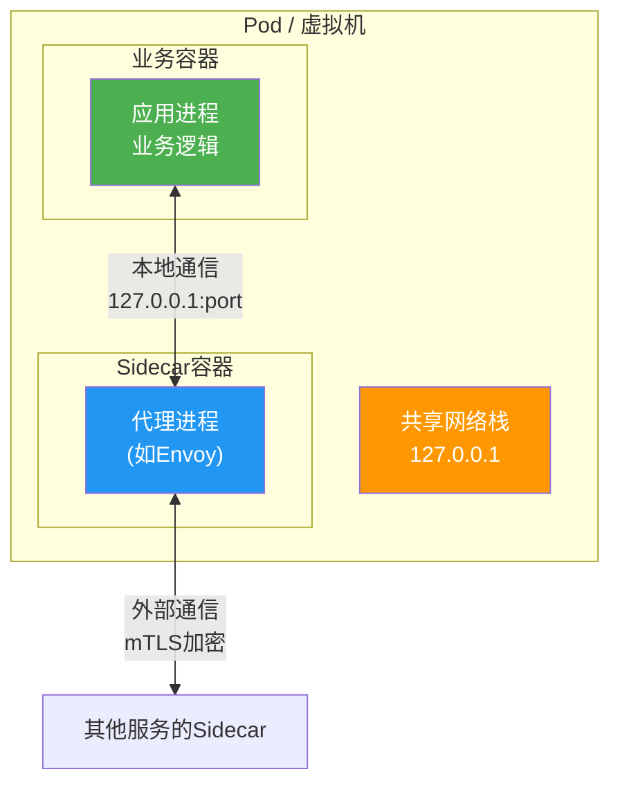
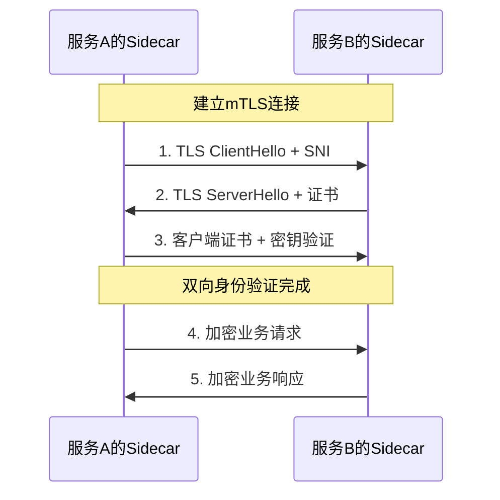

# Sidecar模式：服务网格的基石架构

## 1. 概述与背景

### 1.1 什么是Sidecar模式

Sidecar模式是一种结构型云原生设计模式，其核心思想是将应用程序的辅助功能（如网络通信、安全认证、可观测性、配置管理等）从主应用进程中剥离出来，部署为一个独立的伴生容器（即Sidecar），与主应用容器共享同一生命周期，运行在同一个Pod或虚拟机中。

用一个直观的类比来理解：Sidecar就像摩托车的边车。主容器是摩托车本身（负责核心业务逻辑），Sidecar是旁边的边车（负责通信、安全、监控等辅助工作）。两者协同前进，边车不改变摩托车本身的结构，却极大地扩展了摩托车的功能。

### 1.2 为什么需要Sidecar模式

在微服务架构中，每个服务都需要处理一系列横切关注点（Cross-Cutting Concerns）：

- **服务间通信**：负载均衡、重试、超时、熔断
- **安全**：mTLS双向认证、服务间授权
- **可观测性**：分布式链路追踪、指标采集、日志聚合
- **流量管理**：灰度发布、流量镜像、故障注入

如果将这些功能直接嵌入每个服务的代码中，会导致三个严重问题：

1. **技术栈耦合**：每个服务必须使用相同的语言和库来实现这些横切功能，限制了技术选型的灵活性
2. **重复开发**：每个团队都要重复实现相同的功能，造成巨大的资源浪费
3. **维护噩梦**：当横切功能需要升级时（如安全策略变更），必须修改并重新部署所有服务

Sidecar模式完美解决了这些问题——将横切关注点下沉到基础设施层，应用开发者只需专注于业务逻辑。

### 1.3 历史演进

Sidecar模式的演进经历了四个关键阶段：

| 阶段 | 时间 | 代表技术 | 特征 |
|------|------|----------|------|
| 萌芽期 | 2010-2014 | Netflix OSS (Eureka, Zuul) | 客户端SDK模式，功能嵌入应用代码 |
| 形成期 | 2015-2017 | Envoy, Linkerd 1.x | 独立代理进程出现，Sidecar概念初步形成 |
| 成熟期 | 2018-2020 | Istio, Linkerd 2.x | Sidecar作为服务网格的标准注入方式 |
| 演进期 | 2021至今 | eBPF, Ambient Mesh | 开始探索去除Sidecar的轻量化方案 |

值得注意的是，Sidecar模式并不是凭空出现的。早在2002年，Apache HTTP Server的模块化架构就体现了类似的思想——将功能以模块形式插入核心进程。Sidecar模式将这一思想推向了容器化和云原生的新高度。

## 2. 核心原理

### 2.1 架构模型

Sidecar模式的架构模型可以用以下结构描述：



关键架构特征：

- **共享网络命名空间**：Sidecar和主容器共享同一个网络命名空间，可以通过 `localhost` 直接通信，网络延迟在微秒级别
- **独立生命周期管理**：两者可以独立启动、停止和重启，但通常由同一编排系统（如Kubernetes）管理
- **资源隔离**：每个容器有独立的CPU、内存限制，Sidecar的资源消耗不应影响主应用的性能

### 2.2 工作流程

Sidecar模式的工作流程可以分为五个阶段：

**阶段一：流量拦截**

当主应用发起或接收网络请求时，Sidecar通过iptables规则或eBPF程序拦截所有进出流量：

```bash
# iptables拦截示意（简化版）
# 入站流量：重定向到Sidecar的监听端口
iptables -t nat -A PREROUTING -p tcp --dport 8080 \
    -j REDIRECT --to-port 15006

# 出站流量：重定向到Sidecar的监听端口
iptables -t nat -A OUTPUT -p tcp --dport 8080 \
    -j REDIRECT --to-port 15001
```

**阶段二：流量处理**

Sidecar代理接收到流量后，根据预配置的规则执行一系列处理：

```python
# Sidecar代理的处理流程（伪代码）
def handle_request(request):
    # 1. 服务发现：解析目标服务地址
    endpoint = service_discovery.resolve(request.destination)
    
    # 2. 负载均衡：选择最优实例
    target = load_balancer.select(endpoint)
    
    # 3. 安全处理：建立mTLS连接
    secure_conn = mtls.establish(target)
    
    # 4. 策略执行：检查访问控制策略
    if not policy.check(request):
        return Response(status=403)
    
    # 5. 转发请求
    response = secure_conn.forward(request)
    
    # 6. 可观测性：记录指标和追踪
    metrics.record(request, response)
    tracing.span.finish()
    
    return response
```

**阶段三：故障处理**

当目标服务不可用时，Sidecar会自动执行重试、超时和熔断等容错机制：

```yaml
# Istio故障处理配置示例
apiVersion: networking.istio.io/v1beta1
kind: DestinationRule
metadata:
  name: product-service
spec:
  host: product-service
  trafficPolicy:
    connectionPool:
      tcp:
        maxConnections: 100
      http:
        h2UpgradePolicy: DEFAULT
        http1MaxPendingRequests: 100
        http2MaxRequests: 1000
    outlierDetection:
      consecutive5xxErrors: 5
      interval: 30s
      baseEjectionTime: 30s
      maxEjectionPercent: 50
```

**阶段四：可观测性采集**

Sidecar在流量经过时自动采集三大可观测性信号：

| 信号类型 | 采集内容 | 典型工具 |
|----------|----------|----------|
| 指标(Metrics) | 请求量、延迟P99、错误率、饱和度 | Prometheus |
| 追踪(Tracing) | 请求链路、跨服务调用关系、时间分布 | Jaeger, Zipkin |
| 日志(Logging) | 访问日志、错误日志、审计日志 | ELK Stack |

**阶段五：安全加固**

Sidecar负责所有服务间通信的加密和认证：



### 2.3 与传统模式的对比

| 对比维度 | 嵌入式SDK模式 | Sidecar模式 | 无代理模式(eBPF) |
|----------|---------------|-------------|-------------------|
| 侵入性 | 高（需修改应用代码） | 低（透明注入） | 极低（内核层） |
| 性能开销 | 低（进程内调用） | 中（额外网络跳转，约1-2ms） | 极低（内核态处理） |
| 多语言支持 | 差（每种语言需独立SDK） | 优（与语言无关） | 优（与语言无关） |
| 功能丰富度 | 取决于SDK实现 | 非常丰富 | 功能受限 |
| 运维复杂度 | 低 | 中（额外资源消耗） | 高（需内核支持） |
| 灵活升级 | 需重编译部署 | 独立于应用升级 | 需内核升级 |
| 资源消耗 | 无额外消耗 | 每Pod约128MB内存/0.5CPU | 极少 |

## 3. Sidecar模式的核心能力

### 3.1 流量管理

Sidecar模式提供了细粒度的流量控制能力，是实现灰度发布、流量镜像等高级部署策略的基础：

**金丝雀发布**：通过权重分配，将一小部分流量路由到新版本：

```yaml
# 金丝雀发布配置（Istio VirtualService）
apiVersion: networking.istio.io/v1beta1
kind: VirtualService
metadata:
  name: product-service
spec:
  hosts:
    - product-service
  http:
    - route:
        - destination:
            host: product-service
            subset: stable
          weight: 90
        - destination:
            host: product-service
            subset: canary
          weight: 10
```

**流量镜像**：将生产流量复制一份发送到测试环境，用于验证新版本的兼容性：

```yaml
apiVersion: networking.istio.io/v1beta1
kind: VirtualService
metadata:
  name: product-service
spec:
  hosts:
    - product-service
  http:
    - route:
        - destination:
            host: product-service
            subset: stable
      mirror:
        host: product-service
        subset: canary
      mirrorPercentage:
        value: 100
```

### 3.2 安全通信

Sidecar模式实现了零信任安全模型中的核心能力——服务间身份认证和授权：

- **自动mTLS**：Sidecar自动为每个Pod签发短期证书（通常24小时有效期），无需应用代码介入
- **细粒度授权**：基于服务身份（而非IP地址）的访问控制策略

```yaml
# 基于服务身份的授权策略
apiVersion: security.istio.io/v1beta1
kind: AuthorizationPolicy
metadata:
  name: product-service-policy
spec:
  selector:
    matchLabels:
      app: product-service
  rules:
    - from:
        - source:
            principals: ["cluster.local/ns/default/sa/order-service"]
      to:
        - operation:
            methods: ["GET"]
            paths: ["/api/products/*"]
    - from:
        - source:
            principals: ["cluster.local/ns/default/sa/admin-service"]
      to:
        - operation:
            methods: ["GET", "POST", "PUT", "DELETE"]
            paths: ["/api/admin/*"]
```

### 3.3 可观测性

Sidecar模式让可观测性从"可选附加功能"变为"默认内置能力"。每个Sidecar代理自动采集：

**请求级指标**：
- `istio_requests_total`：请求总量（按源、目标、状态码分组）
- `istio_request_duration_milliseconds`：请求延迟分布
- `istio_request_bytes`：请求大小分布

**连接级指标**：
- `istio_tcp_sent_bytes_total`：TCP发送字节数
- `istio_tcp_received_bytes_total`：TCP接收字节数
- `istio_tcp_connections_opened_total`：TCP连接数

这些指标配合Grafana看板，可以构建出完整的"黄金信号"监控体系（延迟、流量、错误率、饱和度）。

## 4. 主流实现方案

### 4.1 Envoy Proxy

Envoy是目前最主流的Sidecar代理，由Lyft开发，现为CNCF毕业项目。

**核心特性**：
- **高性能**：基于C++编写，使用异步非阻塞架构（基于libevent），单进程可处理数万并发连接
- **xDS协议**：支持动态配置，无需重启即可更新路由、集群、监听器等配置
- **丰富的过滤器链**：HTTP/1.1、HTTP/2、gRPC、TCP代理等全协议支持
- **WASM扩展**：支持用WebAssembly编写自定义过滤器，实现业务逻辑扩展

Envoy架构概览：

┌─────────────────────────────────────────┐
│              Listener Manager           │
│  ┌───────────┐  ┌───────────┐          │
│  │ Listener  │  │ Listener  │  ...     │
│  └─────┬─────┘  └─────┬─────┘          │
│        │              │                 │
│  ┌─────▼──────────────▼─────┐          │
│  │     Filter Chain         │          │
│  │  ┌─────┐ ┌─────┐ ┌─────┐│          │
│  │  │TCP  │→│HTTP │→│WASM ││          │
│  │  │Proxy│ │     │ │     ││          │
│  │  └─────┘ └─────┘ └─────┘│          │
│  └───────────┬──────────────┘          │
│              │                          │
│  ┌───────────▼──────────────┐          │
│  │    Cluster Manager       │          │
│  │  (服务发现+负载均衡)      │          │
│  └──────────────────────────┘          │
│                                         │
│  ┌──────────────────────────┐          │
│  │    xDS API (控制面接口)   │          │
│  └──────────────────────────┘          │
└─────────────────────────────────────────┘

### 4.2 Linkerd

Linkerd是第一个服务网格项目（2016年），目前主流版本是Linkerd 2.x，使用Rust编写的`linkerd2-proxy`作为Sidecar。

**与Istio/Envoy的差异化定位**：
- **极简设计**：只做服务网格的核心功能，不追求大而全
- **极低资源消耗**：每个Sidecar约10-20MB内存（Envoy约40-60MB），启动时间约100ms
- **自动mTLS**：开箱即用，无需任何配置
- **安全审计**：通过CNCF安全审计，代码量小，攻击面小

### 4.3 方案对比

| 维度 | Istio + Envoy | Linkerd | Consul Connect |
|------|---------------|---------|----------------|
| 代理语言 | C++ | Rust | Go |
| 内存占用 | 40-60MB | 10-20MB | 30-50MB |
| 控制面 | Istiod (Go) | Control Plane (Go) | Consul Server (Go) |
| 功能丰富度 | ★★★★★ | ★★★ | ★★★★ |
| 学习曲线 | 陡峭 | 平缓 | 中等 |
| 社区生态 | 最大 | 中等 | 较大 |
| 适用场景 | 大型企业、多集群 | 中小团队、安全敏感 | 已用Consul的团队 |

## 5. 实操指南

### 5.1 Sidecar注入方式

**自动注入（推荐）**：通过Kubernetes Admission Webhook自动为Pod注入Sidecar容器：

```bash
# 为命名空间启用自动注入（Istio）
kubectl label namespace default istio-injection=enabled

# 验证注入是否生效
kubectl get pods -n default
# 输出中READY列会显示 2/2，表示Sidecar已注入
```

**手动注入**：用于调试或不支持自动注入的环境：

```bash
# 生成包含Sidecar的部署清单
istioctl kube-inject -f deployment.yaml -o deployment-with-sidecar.yaml

# 部署
kubectl apply -f deployment-with-sidecar.yaml
```

### 5.2 资源规划

Sidecar的资源开销是实际部署中最常被忽视的问题。以下是生产环境的资源规划建议：

| 工作负载规模 | Sidecar CPU请求 | Sidecar内存请求 | Sidecar CPU上限 | Sidecar内存上限 |
|-------------|----------------|----------------|----------------|----------------|
| 低流量服务 | 50m | 64Mi | 200m | 128Mi |
| 中等流量服务 | 100m | 128Mi | 500m | 256Mi |
| 高流量服务 | 200m | 256Mi | 1000m | 512Mi |
| 网关入口 | 500m | 512Mi | 2000m | 1024Mi |

**关键经验**：
- 在1000个Pod的集群中，Sidecar额外消耗约128GB内存和500个CPU核心——这是必须纳入容量规划的
- 通过Kubernetes ResourceQuota限制每个命名空间的Sidecar资源总量，防止资源被过度占用
- 使用PodDisruptionBudget确保在节点维护时不会因为Sidecar资源不足导致调度失败

### 5.3 常见问题排查

**问题一：Sidecar注入后应用启动失败**

原因：Sidecar的iptables规则可能拦截了应用的启动初始化请求（如连接配置中心）。

解决：使用holdApplicationUntilSidecarIsReady特性：

```yaml
annotations:
  proxy.istio.io/holdApplicationUntilProxyStarts: "true"
```

**问题二：Sidecar导致请求延迟增加**

原因：每次请求都经过额外的代理层，增加了一次网络跳转。

排查方法：
```bash
# 对比开启Sidecar前后的延迟
# 无Sidecar延迟基准
kubectl exec -it app-pod -- curl -w "%{time_total}" http://target-service:8080/health

# 有Sidecar延迟
curl -w "%{time_total}" http://target-service.default.svc.cluster.local:8080/health
```

通常额外延迟在1-5ms之间，如果超过10ms需要检查Envoy的配置和过滤器链是否过长。

**问题三：Sidecar OOM（内存溢出）**

原因：高并发场景下Sidecar的连接池和缓冲区占用过多内存。

解决：调整连接池参数和内存限制：

```yaml
apiVersion: networking.istio.io/v1beta1
kind: DestinationRule
metadata:
  name: high-traffic-service
spec:
  host: high-traffic-service
  trafficPolicy:
    connectionPool:
      tcp:
        maxConnections: 50
      http:
        http1MaxPendingRequests: 50
        http2MaxRequests: 100
        maxRequestsPerConnection: 100
```

## 6. 最佳实践

### 6.1 设计原则

1. **最小权限原则**：Sidecar只拦截必要的端口流量，避免全量拦截导致的性能损失
2. **资源预算原则**：在设计阶段就将Sidecar的资源消耗纳入总预算
3. **渐进式采用**：先在非核心服务上验证，再逐步推广到核心服务
4. **监控先行**：部署Sidecar前先建立完善的监控基线，以便对比性能影响

### 6.2 性能优化

- **启用HTTP/2**：Sidecar间的通信使用HTTP/2可以显著减少连接数和延迟
- **调整连接池大小**：根据实际流量调整连接池参数，避免连接频繁创建和销毁
- **使用本地负载均衡**：Envoy支持 locality-aware routing，优先将流量路由到同可用区的实例
- **WASM编译缓存**：如果使用WASM扩展，预编译并缓存二进制文件，避免运行时编译开销

### 6.3 安全加固

```yaml
# 限制Sidecar的网络权限
apiVersion: networking.k8s.io/v1
kind: NetworkPolicy
metadata:
  name: sidecar-network-policy
spec:
  podSelector: {}
  policyTypes:
    - Ingress
    - Egress
  egress:
    # 只允许Sidecar代理的出站流量
    - to:
        - namespaceSelector: {}
      ports:
        - port: 15001
          protocol: TCP
  ingress:
    # 只允许Sidecar代理的入站流量
    - from:
        - namespaceSelector: {}
      ports:
        - port: 15006
          protocol: TCP
```

## 7. 局限性与未来演进

### 7.1 当前局限

1. **资源开销**：每个Pod增加约128MB内存和0.5CPU，大规模集群下成本显著
2. **延迟增加**：额外的网络跳转增加1-5ms延迟，对延迟敏感的场景影响明显
3. **调试复杂度**：请求经过两层（应用→Sidecar→网络→Sidecar→应用），问题定位链路更长
4. **启动时序**：Sidecar与应用的启动顺序需要协调，不当的时序可能导致请求失败
5. **UDP支持有限**：大部分Sidecar代理对UDP协议的支持不如TCP/HTTP完善

### 7.2 轻量化演进方向

**eBPF方案**：以Cilium Service Mesh为代表，将网络拦截和部分代理逻辑下沉到Linux内核，消除Sidecar容器：

| 对比 | 传统Sidecar | eBPF方案 |
|------|-------------|----------|
| 资源消耗 | ~128MB/ Pod | ~10MB/ Pod |
| 延迟开销 | 1-5ms | < 0.5ms |
| 功能完整度 | 完整 | 部分（HTTP层功能仍在用户态） |
| 内核要求 | 无特殊要求 | Linux 4.19+（推荐5.10+） |

**Ambient Mesh**：Istio社区提出的无Sidecar方案，将服务网格功能拆分为ztunnel（L4层，每个节点一个）和waypoint proxy（L7层，按需部署），在保持功能完整性的同时大幅降低资源消耗。

Sidecar模式作为服务网格的基石架构，虽然面临轻量化方案的挑战，但其核心思想——将横切关注点从业务代码中剥离到基础设施层——已经成为云原生架构设计的共识。无论未来的技术形态如何演进，这一设计哲学将持续影响分布式系统的架构设计。
