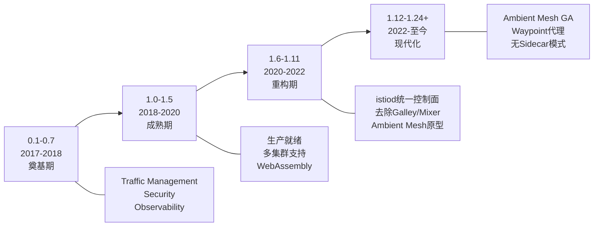
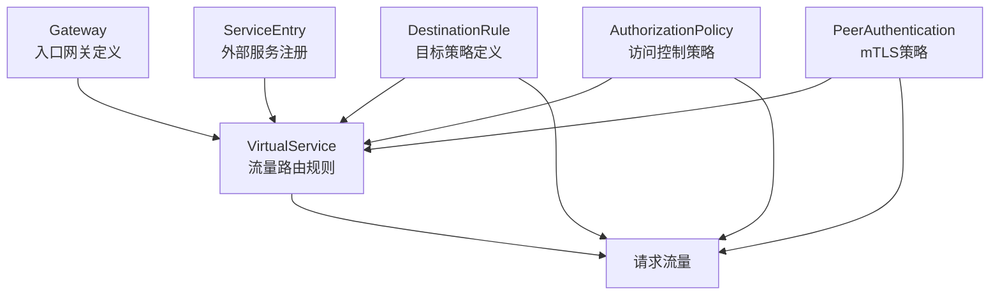
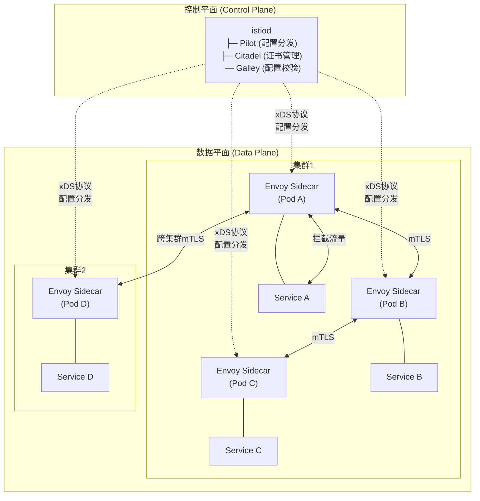
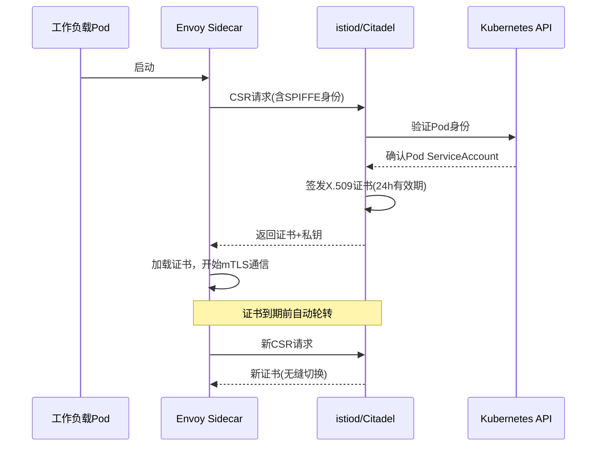
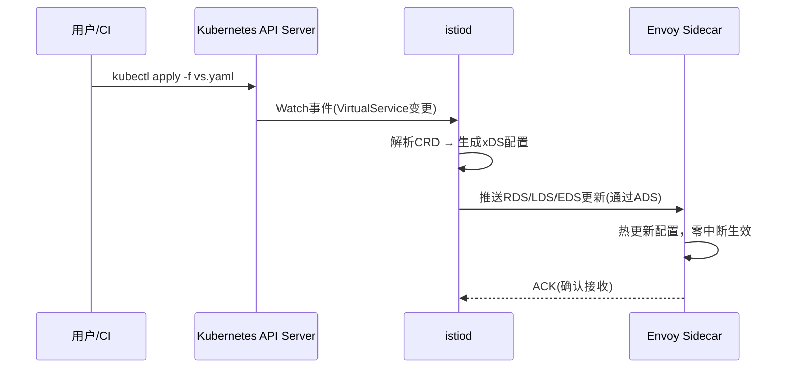
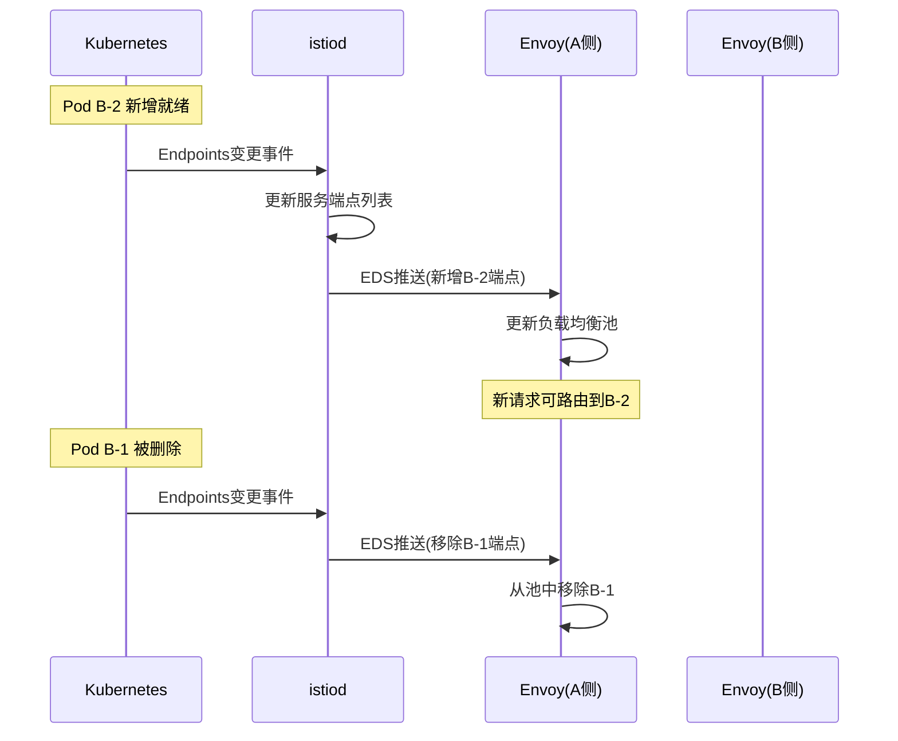
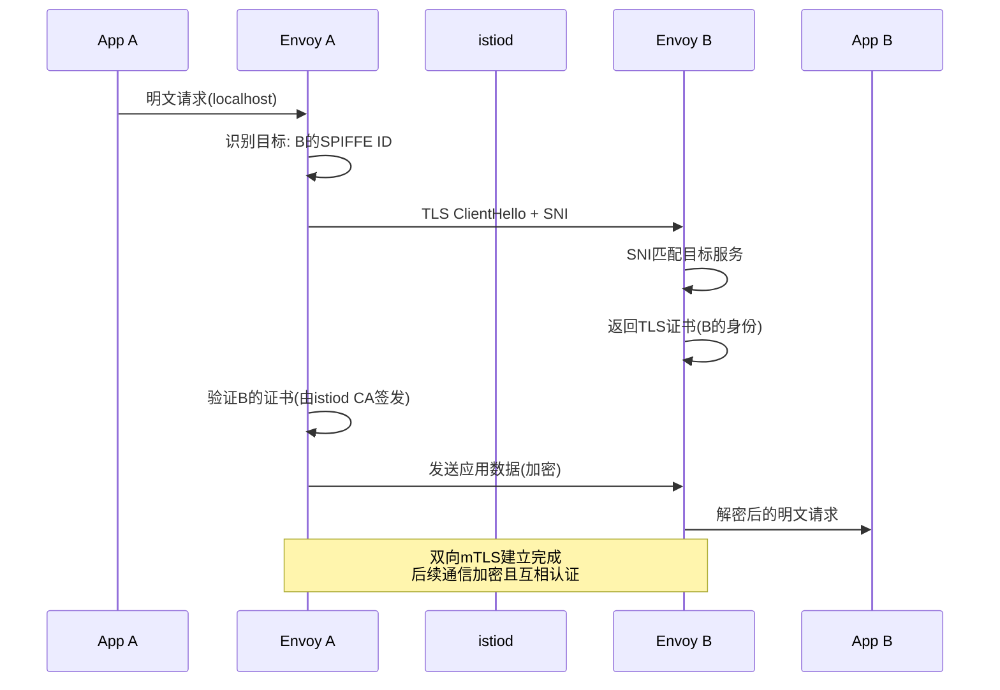
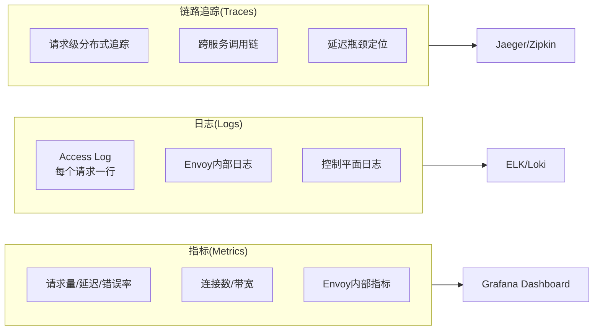
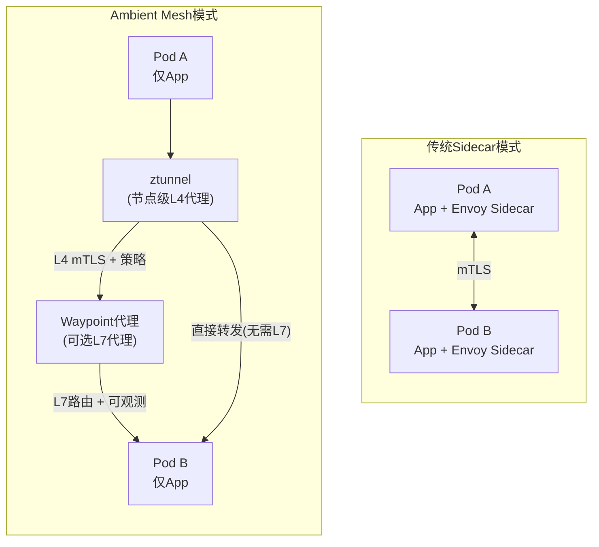
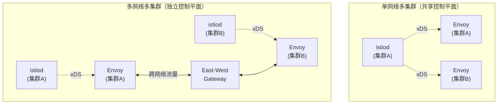

# Istio架构

Istio是目前最成熟、使用最广泛的服务网格解决方案。它通过在服务间透明地注入Sidecar代理，将流量管理、安全通信、可观测性等横切关注点从业务代码中剥离出来，实现了基础设施层的统一管控。本节将从架构全景到各组件细节，深入剖析Istio的设计哲学与实现机制。

---

## 1. 概述与背景

### 1.1 为什么需要服务网格

在微服务架构下，一个典型的业务系统可能包含数十到数百个服务实例。每个服务都需要处理一系列与业务逻辑无关但又至关重要的问题：

- **服务发现**：如何找到目标服务的实例？
- **负载均衡**：如何在多个实例间分配流量？
- **故障处理**：超时、重试、熔断如何统一管理？
- **安全通信**：服务间如何实现mTLS加密和身份认证？
- **可观测性**：请求链路如何追踪？指标如何采集？
- **策略执行**：速率限制、访问控制如何统一生效？

传统做法是在每个服务中集成SDK（如Netflix OSS全家桶），但这带来了三个根本性问题：

| 问题 | 具体表现 | 后果 |
|------|----------|------|
| **语言绑定** | 每种语言需要独立的SDK实现 | 多语言微服务维护成本指数级增长 |
| **升级困难** | SDK嵌入业务代码，升级需重新发布所有服务 | 安全补丁和功能更新周期长达数周到数月 |
| **逻辑分散** | 每个服务独立实现重试、熔断等逻辑 | 策略不一致，难以统一治理和审计 |

Istio的答案是：**将这些能力下沉到基础设施层，通过Sidecar代理统一处理**。业务代码只关注业务逻辑，所有网络层面的横切关注点由网格层透明处理。

### 1.2 Istio的定位

Istio的核心理念可以用一句话概括：**让微服务之间的网络通信变得可靠、安全、可观测，而无需修改业务代码**。

| 维度 | 传统方式 | Istio方式 | 收益 |
|------|----------|-----------|------|
| 流量管理 | 代码中硬编码重试/超时逻辑 | VirtualService声明式配置 | 策略与代码解耦，可独立演进 |
| 安全通信 | 手动管理证书，各语言SDK | 自动mTLS，证书轮转 | 零人工干预的加密通信 |
| 可观测性 | 各服务分别埋点 | Sidecar自动采集Metrics/Logs/Traces | 统一的遥测数据，无需业务代码修改 |
| 故障处理 | 分散在各服务中的熔断器 | DestinationRule统一声明 | 全局一致的韧性策略 |
| 灰度发布 | Ingress + 手动权重分配 | VirtualService细粒度流量分割 | 精确到百分比/头部/Cookie的流量控制 |
| 策略执行 | 代码中实现ACL/限流 | AuthorizationPolicy声明式 | 策略变更即时生效，无需重新部署 |

### 1.3 版本演进

Istio自2017年发起以来，经历了四个重要阶段：



**关键里程碑：**

- **1.0（2018年7月）**：首个生产就绪版本，确立了Pilot+Citadel+Galley+Mixer四组件架构
- **1.5（2020年3月）**：控制平面合并为istiod单体，大幅降低运维复杂度
- **1.6（2020年5月）**：引入WebAssembly扩展机制，替代Mixer的外部适配器模式
- **1.18（2023年6月）**：Ambient Mesh进入Beta，开创无Sidecar的服务网格新范式
- **1.22+（2024-至今）**：Ambient Mesh正式GA，成为推荐部署模式

### 1.4 Istio的资源模型

理解Istio的CRD（Custom Resource Definition）体系是掌握其架构的基础。Istio通过Kubernetes CRD扩展API，用户通过声明这些资源来定义流量行为：



| CRD | 作用 | 类比 |
|-----|------|------|
| **Gateway** | 定义网格入口/出口的负载均衡器配置 | 传统架构中的Ingress Controller |
| **VirtualService** | 定义路由规则：匹配条件、转发目标、重试策略 | Nginx的location + upstream配置 |
| **DestinationRule** | 定义目标服务的连接策略：负载均衡、熔断、TLS模式 | Nginx的upstream定义 |
| **ServiceEntry** | 将外部服务注册到网格的服务发现中 | 手动配置DNS解析 |
| **AuthorizationPolicy** | 基于身份的细粒度访问控制 | Kubernetes NetworkPolicy的L7增强版 |
| **PeerAuthentication** | 定义工作负载的mTLS策略（PERMISSIVE/STRICT） | 证书管理的策略层 |
| **EnvoyFilter** | 对Envoy配置进行细粒度定制 | Envoy原生配置的Kubernetes化封装 |
| **WasmPlugin** | 加载WebAssembly扩展到Envoy | EnvoyFilter的Wasm专用简化版 |

这些CRD之间的关系遵循**分层覆盖**原则：全局默认 < Namespace级 < 工作负载级。例如，在Namespace级设置了`PeerAuthentication`为STRICT mTLS，某个特定Pod可以通过注解覆盖为PERMISSIVE模式。

---

## 2. 整体架构

Istio的架构分为两个核心层面：**数据平面（Data Plane）** 和 **控制平面（Control Plane）**。这种分离是服务网格架构的经典范式，其核心思想是：将"决策"（控制平面）与"执行"（数据平面）解耦，使两者可以独立演进和扩展。

### 2.1 架构全景图



### 2.2 控制平面：istiod

Istio 1.5之后，控制平面从多个独立组件（Pilot、Citadel、Galley、Mixer）合并为单一部署的 **istiod**。这种简化带来了显著的运维优势：

- **部署简化**：一个Deployment替代四个，资源占用减少约40%
- **故障域缩小**：组件间通过进程内调用通信，消除了网络延迟和故障点
- **升级安全**：单镜像版本控制，避免组件版本不兼容问题
- **调试方便**：单一日志流，统一的健康检查端点

istiod内部承担三大职责：

| 职责 | 对应原组件 | 核心功能 |
|------|-----------|----------|
| 配置分发 | Pilot | 将用户定义的Istio CRD转化为Envoy能理解的xDS配置并推送 |
| 证书管理 | Citadel | 为每个工作负载签发X.509证书，实现mTLS身份认证 |
| 配置校验 | Galley | 校验用户提交的Istio资源是否合法，通过Webhook拦截非法配置 |

**istiod的内部数据流：**

用户kubectl apply
    │
    ▼
Kubernetes API Server
    │
    ▼ (Watch事件)
istiod ─────────────────────────────┐
    │                               │
    ├─ 配置校验模块                  ├─ 证书签发模块
    │  校验CRD语法和语义合法性       │  签发/轮转X.509证书
    │                               │  管理Trust Anchor
    ├─ 配置生成模块                  │
    │  CRD → xDS配置翻译            │
    │  增量计算差异                  │
    │                               │
    └─ xDS推送模块 ─────────────────┘
       通过gRPC流推送配置到Envoy
       支持ACK/NACK确认机制

### 2.3 数据平面：Envoy Sidecar

数据平面由部署在每个Pod中的 **Envoy代理** 构成。Envoy是CNCF毕业项目，专为云原生场景设计的高性能L4/L7代理。其核心特性包括：

- **多协议支持**：HTTP/1.1、HTTP/2、gRPC、TCP、UDP、WebSocket
- **热更新能力**：配置变更无需重启，通过xDS API动态生效
- **丰富的可观测性**：内置stats、tracing、logging三大支柱
- **可扩展性**：通过Lua、Wasm等机制支持自定义逻辑

**Envoy在Istio中的流量拦截机制：**

Istio通过iptables规则实现透明流量拦截，业务应用无需感知Sidecar的存在：

请求进入 Pod
    │
    ▼
┌──────────────────────────────────┐
│  iptables 规则（透明拦截）         │
│  入站流量 ──→ Envoy Sidecar      │
│  出站流量 ──→ Envoy Sidecar      │
└──────────────────────────────────┘
    │              │
    ▼              ▼
Envoy 执行：      Envoy 执行：
├ 身份验证(mTLS)  ├ 服务发现(从istiod获取)
├ 路由决策        ├ 负载均衡
├ 流量镜像        ├ 重试/超时/熔断
├ 指标采集        ├ 灰度分流
├ 访问日志        ├ 协议转换(HTTP/gRPC/TCP)
└ 链路追踪        └ TLS终结

**iptables规则示意：**

# Envoy Sidecar注入时会创建以下iptables链：
# ISTIO_INBOUND:   拦截入站流量 → 重定向到15006端口
# ISTIO_OUTBOUND:  拦截出站流量 → 重定向到15001端口
# ISTIO_REDIRECT:  统一的REDIRECT目标

# 示例规则（简化）：
iptables -t nat -A ISTIO_INBOUND -p tcp --dport 8080 -j REDIRECT --to-port 15006
iptables -t nat -A ISTIO_OUTBOUND -p tcp -j REDIRECT --to-port 15001

这种设计确保了：业务应用监听在原有端口（如8080），但实际流量经过Envoy处理后再转发到目标端口。对应用来说，它仍然在localhost上接收和发送请求，完全无感知。

---

## 3. 核心组件详解

### 3.1 istiod：控制平面大脑

#### 3.1.1 Pilot（配置分发引擎）

Pilot是Istio控制平面最核心的组件，负责将用户的高层配置转化为Envoy能理解的低层配置。它是控制平面与数据平面之间的"翻译层"。

**工作流程：**

1. **监听配置变更**：Pilot通过Kubernetes API Watch机制监听VirtualService、DestinationRule、Gateway等CRD资源的变化
2. **生成配置**：将CRD中的高层语义转化为Envoy的xDS（Discovery Service）配置
3. **推送配置**：通过ADS（Aggregated Discovery Service）通道将配置推送给所有Envoy Sidecar
4. **热更新生效**：Envoy接收到新配置后无需重启即可生效，实现零中断更新

**xDS协议族详解：**

xDS是Envoy的配置发现服务协议族，是控制平面与数据平面通信的核心协议。xDS使用gRPC双向流实现增量推送：

| xDS类型 | 功能 | 推送时机 | 数据量特点 |
|---------|------|----------|-----------|
| LDS (Listener Discovery Service) | 定义Envoy监听哪些端口、协议 | 虚拟服务/Gateway变更时 | 变化频率低，配置相对稳定 |
| RDS (Route Discovery Service) | 定义路由规则（匹配条件、转发目标、重试策略） | VirtualService变更时 | 变化频率中等，按路由规则粒度推送 |
| CDS (Cluster Discovery Service) | 定义上游服务集群（端点、负载均衡策略） | DestinationRule/Service变更时 | 变化频率低，集群拓扑变更时推送 |
| EDS (Endpoint Discovery Service) | 定义集群中的具体端点（Pod IP:Port） | Pod增减/就绪状态变更时 | 变化频率最高，每次扩缩容都会触发 |
| SDS (Secret Discovery Service) | 提供TLS证书和密钥 | 证书签发/轮转时 | 变化频率低，证书默认24h轮转 |

**ADS（Aggregated Discovery Service）的作用：**

ADS将所有xDS类型聚合到同一个gRPC流中，解决了以下问题：

- **配置一致性**：避免不同xDS类型之间配置不同步导致的短暂不一致
- **原子更新**：LDS+RDS+CDS可以作为一个事务提交，要么全部生效，要么全部不生效
- **减少连接数**：只需建立一条gRPC连接即可获取所有配置

传统模式（每个xDS独立连接）：
Envoy ─── LDS流 ──→ istiod
Envoy ─── RDS流 ──→ istiod
Envoy ─── CDS流 ──→ istiod
Envoy ─── EDS流 ──→ istiod

ADS模式（聚合流）：
Envoy ─── ADS流(统一) ──→ istiod
            ├── LDS
            ├── RDS
            ├── CDS
            ├── EDS
            └── SDS

#### 3.1.2 Citadel（证书管理）

Citadel负责Istio的PKI（公钥基础设施），为工作负载签发和管理身份证书。它是Istio安全模型的核心组件。

**mTLS证书生命周期：**



**SPIFFE身份格式：** 每个工作负载的SPIFFE ID格式为：
spiffe://cluster.local/ns/<namespace>/sa/<service-account>

例如，`default`命名空间中使用`default` ServiceAccount的Pod，其SPIFFE ID为：
spiffe://cluster.local/ns/default/sa/default

**证书链结构：**

Trust Anchor (istiod CA根证书)
    │
    ├── 中间证书 (istiod签发)
    │   │
    │   ├── 工作负载证书A (spiffe://.../ns/default/sa/app-a)
    │   ├── 工作负载证书B (spiffe://.../ns/default/sa/app-b)
    │   └── 工作负载证书C (spiffe://.../ns/prod/sa/app-c)
    │
    └── 自定义CA（可选，对接外部PKI）
        ├── 企业CA签发的中间证书
        └── 工作负载证书（由企业CA签发）

Istio支持三种CA模式：

| CA模式 | 描述 | 适用场景 |
|--------|------|----------|
| **istiod内置CA** | istiod自身作为CA签发证书 | 默认模式，适合大多数场景 |
| **外部CA（Cert-Manager）** | 使用Cert-Manager对接企业PKI | 企业合规要求使用统一CA |
| **Kubernetes CSR API** | 通过Kubernetes原生CSR API签发 | K8s 1.22+，利用集群原生能力 |

#### 3.1.3 配置校验与验证

istiod内置Webhook对Istio CRD进行校验，防止非法配置导致系统异常：

- **ValidatingWebhookConfiguration**：拦截`kubectl apply`操作，拒绝语法错误和语义冲突的配置。例如，引用不存在的Service、端口范围越界等
- **MutatingWebhookConfiguration**：自动为Pod注入Envoy Sidecar，添加必要的标签和注解。注入逻辑基于Namespace标签`istio-injection=enabled`
- **配置层次**：全局默认值 < Namespace级 < 工作负载级（注解覆盖）

**配置校验的三种时机：**

| 时机 | 机制 | 效果 |
|------|------|------|
| 提交时 | ValidatingWebhook | 非法配置被API Server拒绝 |
| 注入时 | MutatingWebhook | Sidecar配置自动调整 |
| 运行时 | istioctl analyze | 主动检测潜在问题 |

---

### 3.2 Envoy代理：数据平面引擎

#### 3.2.1 Listener（监听器）

Listener定义了Envoy在哪个端口、以什么协议接收流量。Istio中典型的Listener配置：

Listener 0.0.0.0:15006 (inbound)
├── FilterChain: HTTP
│   ├── HTTPConnectionManager
│   │   ├── RouteConfig → 本地服务
│   │   ├── RBAC Filter (访问控制)
│   │   ├── JWT Filter (可选)
│   │   └── AccessLog Filter
│   └── TLS Inspector

Listener 0.0.0.0:15001 (outbound)
├── FilterChain: HTTP
│   ├── HTTPConnectionManager
│   │   ├── RouteConfig → 按VirtualService分流
│   │   ├── Fault Injection Filter
│   │   ├── RateLimit Filter
│   │   └── CORS Filter
│   └── TLS Inspector

**关键端口约定：**

| 端口 | 方向 | 用途 | 访问方式 |
|------|------|------|----------|
| 15001 | 出站 | Envoy拦截所有出站流量 | iptables自动重定向 |
| 15006 | 入站 | Envoy拦截所有入站流量 | iptables自动重定向 |
| 15009 | 出站 | 直连Envoy管理端口（不拦截） | 应用直连istiod |
| 15021 | 无 | 健康检查端口（readiness/liveness） | K8s Probe探测 |
| 15090 | 无 | Prometheus指标采集端口 | Prometheus scrape |
| 15020 | 无 | Envoy管理API（admin interface） | 调试用，curl访问 |

#### 3.2.2 Filter链（过滤器链）

Envoy的Filter机制是其功能扩展的核心。每个Listener可以挂载多个Filter，形成处理链。请求按顺序经过每个Filter，每个Filter可以修改、拒绝或透传请求：


**Istio内置的核心Filter：**

| Filter | 层级 | 功能 | 对应Istio CRD |
|--------|------|------|---------------|
| `envoy.filters.network.rbac` | L4 | 基于身份的访问控制 | AuthorizationPolicy |
| `envoy.filters.http.jwt_authn` | L7 | JWT Token验证 | RequestAuthentication |
| `envoy.filters.http.fault` | L7 | 故障注入（延迟/中止） | VirtualService.fault |
| `envoy.filters.http.cors` | L7 | 跨域资源共享策略 | VirtualService.corsPolicy |
| `envoy.filters.http.ratelimit` | L7 | 速率限制 | EnvoyFilter（需配置） |
| `envoy.filters.http.lua` | L7 | Lua脚本自定义逻辑 | EnvoyFilter |
| `envoy.filters.http.ext_authz` | L7 | 外部授权服务集成 | EnvoyFilter |
| `envoy.filters.http.wasm` | L7 | WebAssembly扩展 | WasmPlugin |

#### 3.2.3 集群管理与负载均衡

Envoy将每个上游服务抽象为一个**Cluster（集群）**，每个Cluster包含一组Endpoints（即Pod实例）。

**负载均衡策略对比：**

| 策略 | 算法描述 | 适用场景 | 性能特点 |
|------|----------|----------|----------|
| `ROUND_ROBIN` | 轮询分配 | 默认策略，通用场景 | 简单高效，无额外开销 |
| `LEAST_CONN` | 选择连接数最少的实例 | 长连接场景（如WebSocket） | 需维护连接计数，开销略高 |
| `RANDOM` | 随机选择 | 大规模集群下接近均匀分布 | 无状态，性能最优 |
| `RING_HASH` | 一致性哈希（基于请求头/cookie） | 需要会话亲和性的场景 | 缓存友好，但扩缩容时可能抖动 |
| `MAGLEV` | Google的Maglev一致性哈希 | 大规模一致性哈希（优于RING_HASH） | 更均匀的分布，扩缩容影响更小 |
| `P2C` (Power of Two Choices) | 随机选两个，选负载低的 | gRPC流量的默认推荐策略 | 兼顾随机性和负载感知 |
| `LEAST_REQUEST` | 选择当前活跃请求数最少的实例 | 请求处理时间不均匀的场景 | 类似LEAST_CONN，但基于请求数 |

**健康检查机制：**

Envoy支持两种健康检查模式：

- **主动健康检查（Active Health Checking）**：Envoy定期向端点发送探测请求（HTTP/TCP），根据响应判断健康状态。Istio默认使用K8s的readiness probe结果
- **被动健康检查（Outlier Detection）**：基于实际流量的响应统计自动标记不健康端点。例如，连续5次返回5xx的端点会被临时从负载均衡池中移除（驱逐30秒后重新探测）

---

### 3.3 WebAssembly扩展机制

Istio 1.6+引入了WebAssembly（Wasm）支持，允许在Envoy中运行第三方扩展，无需重新编译Envoy二进制。这是Envoy可扩展性的重大进步，替代了早期依赖Mixer的外部适配器模式。

**Wasm扩展架构：**

┌─────────────────────────────────┐
│  Envoy 进程                      │
│  ┌─────────────────────────────┐│
│  │  Wasm Runtime (V8/Wasmtime) ││
│  │  ┌─────────────────────┐   ││
│  │  │  Wasm Module (沙箱)  │   ││
│  │  │  ┌───────────────┐  │   ││
│  │  │  │ 自定义Filter逻辑 │  │   ││
│  │  │  └───────────────┘  │   ││
│  │  └─────────────────────┘   ││
│  └─────────────────────────────┘│
│  Envoy Filter Chain              │
└─────────────────────────────────┘

**Wasm的优势：**

- **安全性**：沙箱隔离，扩展崩溃不影响Envoy主进程。Wasm模块运行在内存隔离的沙箱中，无法访问Envoy进程的内存空间
- **多语言**：可用Rust、Go、C++、AssemblyScript等语言编写。编译为Wasm字节码后在Envoy中运行
- **热部署**：通过EnvoyFilter或WasmPlugin CRD动态加载/卸载扩展，无需重启Pod
- **生态共享**：通过OCI Registry分发扩展包，类似容器镜像的分发模式
- **性能**：Wasm执行速度接近原生代码，比Mixer的gRPC调用模式快一个数量级

**WasmPlugin CRD示例：**

```yaml
apiVersion: extensions.istio.io/v1alpha1
kind: WasmPlugin
metadata:
  name: my-auth-filter
  namespace: default
spec:
  selector:
    matchLabels:
      app: my-service
  url: oci://my-registry.com/wasm/auth-filter:v1.0
  phase: AUTHN  # 在认证阶段执行
  pluginConfig:
    api_endpoint: "https://auth-service:8080"
    timeout_ms: 100
```

**典型使用场景：**

| 场景 | 描述 | 实现方式 |
|------|------|----------|
| 自定义鉴权 | 调用外部Auth服务进行细粒度鉴权 | AUTHN阶段Wasm模块 |
| 协议转换 | HTTP ↔ gRPC自动转换 | PROTOCOL_INVAL阶段 |
| 请求头注入 | 注入链路追踪ID、租户信息等 | LUA或Wasm |
| 自定义指标 | 采集业务特定的Prometheus指标 | STATS阶段 |
| 外部API调用 | 在请求链路中调用外部API进行实时决策 | HTTP Call异步模式 |
| 数据脱敏 | 对响应体中的敏感字段进行掩码处理 | RESPONSE阶段 |

---

## 4. 控制平面与数据平面的交互

### 4.1 配置分发流程



**配置分发的关键细节：**

1. **增量推送**：istiod只推送变更部分，而非全量配置。这大幅减少了网络传输量和Envoy的配置解析开销
2. **版本化**：每次配置推送都带有版本号（version_info），Envoy可以回滚到上一版本
3. **NACK机制**：如果Envoy无法接受新配置（如格式错误），会发送NACK（否定确认），istiod记录错误但不会回滚
4. **最终一致性**：不同Envoy实例可能在短暂时间内持有不同版本的配置，但最终会收敛到一致状态

### 4.2 服务发现流程

当Pod被创建或销毁时，Istio的服务发现机制如何工作：



**服务发现的效率优化：**

- **EDS推送是最快的xDS类型**：端点变更直接通过EDS推送，不需要重新生成LDS/RDS/CDS配置
- **多级Watch**：istiod同时Watch Service、Endpoints和Pod资源，综合判断端点可用性
- **预热机制**：新端点加入后，Envoy会逐步增加其流量权重，避免冷启动时被大量流量击垮

### 4.3 mTLS握手流程

两个启用mTLS的工作负载之间的通信建立过程：



**mTLS的三种模式：**

| 模式 | 行为 | 适用场景 |
|------|------|----------|
| **UNDISABLED** | 不设置mTLS策略（使用全局默认） | 初始部署阶段 |
| **PERMISSIVE** | 同时接受明文和mTLS流量 | 渐进式迁移期间，兼容未注入Sidecar的服务 |
| **STRICT** | 仅接受mTLS流量，拒绝明文 | 完成迁移后，确保全链路加密 |

---

## 5. 可观测性体系

Istio的可观测性是其三大核心能力之一（流量管理、安全、可观测性）。Sidecar代理天然处于流量路径上，可以零侵入地采集完整的遥测数据。

### 5.1 三大支柱



### 5.2 指标体系

Istio自动生成四个层级的指标：

| 指标层级 | 指标前缀 | 内容 | 默认开启 |
|----------|----------|------|----------|
| **代理级** | `envoy_` | Envoy内部运行指标（连接数、内存、CPU） | 是 |
| **工作负载级** | `istio_request_total`等 | 每个请求的延迟、状态码、协议 | 是 |
| **控制平面级** | `pilot_`、`citadel_` | istiod的配置推送、证书签发统计 | 是 |
| **自定义指标** | 用户定义 | 通过Wasm扩展或EnvoyFilter添加 | 否 |

**关键业务指标：**

```yaml
# Istio默认采集的RED指标
# Rate: 请求速率
istio_requests_total{
  source_workload="productpage",
  destination_workload="reviews",
  response_code="200",
  request_protocol="http"
}

# Error: 错误率（通过response_code过滤）
# Duration: 请求延迟
istio_request_duration_milliseconds_bucket{
  source_workload="productpage",
  destination_workload="reviews",
  le="100"  # 延迟分布桶
}
```

### 5.3 链路追踪

Istio通过Sidecar自动生成分布式追踪的Span，支持多种追踪后端：

| 追踪后端 | 集成方式 | 特点 |
|----------|----------|------|
| **Jaeger** | 原生支持，Istio自带采样配置 | 轻量级，适合中小规模 |
| **Zipkin** | 原生支持 | 老牌方案，社区成熟 |
| **OpenTelemetry** | 通过OTEL Collector转发 | 业界标准，支持多后端 |
| **SkyWalking** | 原生支持 | Java生态友好，内置拓扑图 |

**追踪采样策略：**

```yaml
# 在MeshConfig中配置全局采样率
apiVersion: install.istio.io/v1alpha1
kind: IstioOperator
spec:
  meshConfig:
    enableTracing: true
    defaultConfig:
      tracing:
        sampling: 1.0  # 1%采样率（生产环境推荐值）
        # 生产环境建议：
        # - 高流量服务：0.1-1%
        # - 关键路径：10-100%
        # - 调试环境：100%
```

### 5.4 访问日志

Istio的访问日志为每个经过Envoy的请求生成结构化日志记录：

[2024-01-15T10:30:00.000Z] "GET /api/v1/users HTTP/1.1" 200 
  - "-" "Mozilla/5.0..." 
  98 234 15 
  - "outbound|8080||reviews.default.svc.cluster.local" 
  reviews-default-abc123 
  sidecar~10.244.1.5~default~reviews.default.svc.cluster.local 
  - PassthroughCluster

关键字段含义：状态码（200）、响应大小（98字节）、延迟（15ms）、上游集群（reviews.default.svc.cluster.local）、源Pod（reviews-default-abc123）。

---

## 6. Istio的高可用架构设计

### 6.1 控制平面HA

Istiod本身无状态（配置状态通过Kubernetes API Server持久化），支持多副本部署实现高可用：

```yaml
# istiod高可用部署示例
apiVersion: apps/v1
kind: Deployment
metadata:
  name: istiod
  namespace: istio-system
spec:
  replicas: 3          # 多副本
  strategy:
    type: RollingUpdate
    rollingUpdate:
      maxUnavailable: 1  # 保证至少2个副本可用
  template:
    spec:
      affinity:
        podAntiAffinity:
          preferredDuringSchedulingIgnoredDuringExecution:
          - weight: 100
            podAffinityTerm:
              topologyKey: kubernetes.io/hostname  # 亲和到不同节点
      containers:
      - name: discovery
        resources:
          requests:
            cpu: 500m
            memory: 2Gi
          limits:
            cpu: "2"
            memory: 4Gi
```

**HA设计要点：**

- 3个istiod副本部署在不同节点上，使用Leader Election选举主实例
- Envoy通过xDS流连接到Leader，Leader故障时自动切换（选举基于Kubernetes Lease，通常在10秒内完成）
- 证书签发操作无状态，任何副本都可处理
- 配置校验通过Kubernetes API Server的watch机制实现，不依赖单点
- istiod重启时，已建立的xDS流会短暂断开，但Envoy会缓存最后的有效配置继续工作，不会影响现有流量

### 6.2 数据平面韧性

Envoy Sidecar的韧性设计：

| 韧性能力 | 实现方式 | 配置示例 |
|----------|----------|----------|
| 超时控制 | 请求级别的超时设定 | `timeout: 5s` in VirtualService |
| 重试策略 | 可配置的重试次数和条件 | `attempts: 3, retryOn: 5xx` |
| 熔断器 | 连接池和并发限制 | `connectionPool.maxConnections: 100` |
| 异常检测 | 自动移除不健康的端点 | `outlierDetection.consecutive5xx: 5` |
| 降级策略 | 返回备选响应 | `fault.delay` / `fault.abort` |

**故障注入配置示例：**

```yaml
apiVersion: networking.istio.io/v1
kind: VirtualService
metadata:
  name: reviews-test
spec:
  hosts:
  - reviews
  http:
  - fault:
      delay:
        percentage:
          value: 10.0  # 10%的请求
        fixedDelay: 5s  # 注入5秒延迟
      abort:
        percentage:
          value: 5.0   # 5%的请求
        httpStatus: 503  # 返回503错误
    route:
    - destination:
        host: reviews
```

---

## 7. 服务网格模式对比：Istio vs Linkerd vs Consul

| 特性 | Istio | Linkerd | Consul Connect |
|------|-------|---------|----------------|
| 代理实现 | Envoy (C++) | linkerd2-proxy (Rust) | Envoy / 内置代理 |
| 资源占用 | 较高（Sidecar ~50-100MB） | 极低（Sidecar ~10-20MB） | 中等 |
| 功能丰富度 | ★★★★★ | ★★★☆☆ | ★★★★☆ |
| 配置复杂度 | 高 | 低 | 中等 |
| 学习曲线 | 陡峭 | 平缓 | 中等 |
| 多集群支持 | 原生(多网络/多集群) | 多集群(Mirrored Services) | WAN Gossip + 数据中心 |
| Wasm扩展 | 支持 | 不支持 | 支持(通过Envoy) |
| Ambient Mesh | 有(无Sidecar模式) | 无 | 无 |
| CNCF状态 | 孵化 | 毕业 | 孵化(Consul) |
| 社区规模 | 最大 | 中等 | 较大 |
| 典型延迟开销 | 3-5ms (P99) | <1ms (P99) | 2-4ms (P99) |
| 安全模型 | SPIFFE + 自动mTLS | SPIFFE + 自动mTLS | ACL + Service Splitter |

**选型建议：**

- **选择Istio**：需要丰富的流量管理能力、Wasm扩展、Ambient Mesh、大规模多集群部署
- **选择Linkerd**：追求极低资源开销和简单运维，服务规模较小，对功能丰富度要求不高
- **选择Consul Connect**：已使用Consul做服务发现，需要与Consul生态深度集成

---

## 8. Istio的演进方向

### 8.1 Ambient Mesh：无Sidecar的新范式

Istio 1.18+引入的Ambient Mesh是Istio架构的重大革新，它将数据平面的功能从Pod内的Sidecar剥离出来，部署到节点级的**ztunnel**和可选的**Waypoint代理**：



**Ambient Mesh的分层架构：**

| 层级 | 组件 | 职责 | 部署方式 |
|------|------|------|----------|
| L4层（必需） | ztunnel | mTLS、L4策略、基本可观测性 | 每个节点一个DaemonSet |
| L7层（可选） | Waypoint代理 | HTTP路由、重试、故障注入、详细可观测性 | 每个Namespace一个Deployment |

**核心优势：**

- 无需修改Pod定义，通过Namespace标签`istio.io/dataplane-mode: ambient`一键启用
- 资源开销降低：移除Sidecar后每个Pod节省50-100MB内存
- 运维简化：无需Sidecar注入、就绪探针、资源预留等
- 渐进式迁移：L4自动启用，L7按需附加Waypoint
- 冷启动消除：新Pod无需等待Sidecar就绪即可接收流量

**启用Ambient Mesh：**

```bash
# 为Namespace启用Ambient模式
kubectl label namespace default istio.io/dataplane-mode=ambient

# 验证ztunnel DaemonSet已部署
kubectl get daemonset -n istio-system ztunnel

# 如需L7能力，部署Waypoint代理
istioctl waypoint apply -n default --enroll-namespace
```

### 8.2 多集群架构

Istio支持三种多集群部署模式，适应不同的网络拓扑和组织需求：



**单网络多集群（共享控制平面）：**
- 所有集群处于同一扁平网络
- istiod可以运行在任一集群，服务所有集群的Envoy
- 最简单的多集群方案，但网络要求高（需要Pod CIDR不重叠）
- 适合同一数据中心内的多集群部署

**多网络多集群（独立控制平面）：**
- 各集群有独立的istiod实例
- 通过East-West Gateway跨网络暴露服务
- 支持跨云厂商、跨数据中心部署
- 每个集群独立管理自己的控制平面，故障隔离性最好

**主从多集群（Primary-Remote）：**
- 一个集群作为Primary（运行istiod）
- 其他集群作为Remote（仅运行Envoy，连接远程istiod）
- 控制平面集中管理，数据平面分布式部署
- 折中方案：集中管控但降低了Remote集群的资源消耗

| 模式 | 网络要求 | 控制平面 | 适用场景 | 复杂度 |
|------|----------|----------|----------|--------|
| 单网络共享 | Pod网络互通 | 共享一个istiod | 同一数据中心 | 低 |
| 多网络独立 | 不要求互通 | 各集群独立istiod | 跨云/跨数据中心 | 高 |
| Primary-Remote | Remote可达Primary | Primary集中管理 | 中心化管控 | 中 |

---

## 9. 实践中的关键配置

### 9.1 安装Istio

```bash
# 1. 下载istioctl CLI
curl -L https://istio.io/downloadIstio | sh -
cd istio-*
export PATH=$PWD/bin:$PATH

# 2. 查看可用的安装配置文件
istioctl profile list
# PROFILE: default, demo, minimal, remote, etc.

# 3. 安装生产级配置
istioctl install --set profile=default -y

# 4. 验证安装状态
istioctl verify-install

# 5. 为命名空间启用Sidecar自动注入
kubectl label namespace default istio-injection=enabled

# 6. 部署示例应用并验证
kubectl apply -f samples/httpbin/httpbin.yaml
kubectl exec -it $(kubectl get pod -l app=httpbin -o jsonpath='{.items[0].metadata.name}') \
  -c istio-proxy -- pilot-agent request GET /server_info
```

**安装配置文件对比：**

| Profile | 组件 | 资源占用 | 适用场景 |
|---------|------|----------|----------|
| `default` | istiod + Ingress Gateway | 中等（~512MB RAM） | 生产环境标准部署 |
| `demo` | 全部组件 | 较高（~1GB RAM） | 功能体验和测试 |
| `minimal` | 仅istiod | 低（~256MB RAM） | 资源受限环境 |
| `remote` | 仅Ingress Gateway | 低 | Remote集群 |
| `empty` | 无组件 | 无 | 完全自定义安装 |

### 9.2 确认Envoy Sidecar注入

```bash
# 查看Pod中是否包含istio-proxy容器
kubectl get pod -o jsonpath='{range .items[*]}{.metadata.name}{"\t"}{range .spec.containers[*]}{.name}{" "}{end}{"\n"}{end}'

# 输出示例：
# httpbin-6d8b...   app istio-proxy

# 查看Envoy的完整配置（调试用）
kubectl exec -it <pod-name> -c istio-proxy -- \
  curl -s http://localhost:15000/config_dump | head -100
```

### 9.3 关键运维命令

```bash
# 查看Envoy的活跃连接状态
kubectl exec -it <pod-name> -c istio-proxy -- \
  curl -s http://localhost:15000/clusters | head -50

# 查看istiod推送的配置是否生效
istioctl analyze -n <namespace>

# 查看代理的同步状态
istioctl proxy-status

# 查看特定代理的配置摘要
istioctl proxy-config listeners <pod-name>

# 导出Envoy配置用于离线分析
istioctl proxy-config routes <pod-name> -o json > routes.json

# 查看istiod的内存和连接使用情况
kubectl exec -it -n istio-system deploy/istiod -- \
  pilot-agent request GET /debug/edsz

# 强制Envoy重新拉取配置（解决配置不同步问题）
kubectl rollout restart deployment <deployment-name> -n <namespace>
```

### 9.4 升级Istio

Istio支持**金丝雀升级**，可以零中断地从旧版本迁移到新版本：

```bash
# 1. 安装新版本到canary修订版
istioctl install --set profile=default --set revision=canary -y

# 2. 逐步将Namespace从旧版本迁移到新版本
kubectl label namespace default istio-injection=enabled --overwrite
kubectl label namespace default istio.io/rev=canary --overwrite

# 3. 滚动重启工作负载，新Pod使用新的控制平面
kubectl rollout restart deployment -n default

# 4. 确认新版本工作正常
istioctl proxy-status
istioctl analyze -n default

# 5. 确认无问题后，移除旧版本
istioctl uninstall --set revision=default -y
```

**升级过程中的流量影响：**

升级前：
  所有Pod → 连接到旧istiod → 使用旧版配置

升级中（canary阶段）：
  旧Pod → 旧istiod（旧配置）  ← 流量正常
  新Pod → 新istiod（新配置）  ← 流量正常
  两组Pod之间通过mTLS正常通信

升级后：
  所有Pod → 新istiod → 新版配置
  旧istiod已移除

---

## 10. 常见误区与注意事项

### 误区一：Sidecar注入后的延迟开销不可接受

**实际情况：** Istio Sidecar引入的额外延迟通常在 **3-5ms**（P99）级别，对大多数业务影响极小。通过以下手段可进一步优化：

- 启用**HTTP/2长连接复用**减少连接建立开销
- 使用**连接池**减少上游连接数
- 对延迟敏感的路径可考虑使用**Ambient Mesh**消除Sidecar开销
- 合理配置**连接池大小**（`connectionPool.http.h2UpgradePolicy`）

### 误区二：启用mTLS后性能大幅下降

**实际情况：** 现代硬件上的TLS 1.3握手开销极低。实测数据显示：
- mTLS引入的延迟约 **0.5-1ms**（TLS 1.3）
- CPU开销约 **2-5%**（取决于加密套件）
- Istiod的自动证书轮转完全透明，无需人工干预

### 误区三：Istio只能用于大规模微服务

**实际情况：** Istio同样适用于小规模部署（3-5个服务）。关键在于：
- 使用`minimal`配置文件减少资源消耗
- 仅在需要的服务上启用Sidecar注入
- 从`demo`配置开始体验，逐步过渡到生产配置
- 考虑Ambient Mesh模式，进一步降低资源门槛

### 误区四：升级Istio会导致服务中断

**实际情况：** 如第9.4节所示，Istio支持金丝雀升级，通过revision机制可以实现零中断的版本迁移。关键步骤：
1. 新版本安装到独立revision
2. 逐步切换Namespace到新revision
3. 滚动重启工作负载
4. 确认无误后移除旧版本

---

## 11. 本节小结

Istio架构的核心设计可以总结为以下要点：

1. **控制平面（istiod）** 集中管理配置和证书，通过xDS协议推送到数据平面
2. **数据平面（Envoy Sidecar）** 透明代理所有入站/出站流量，执行路由、安全、可观测性策略
3. **声明式配置** 通过VirtualService、DestinationRule等CRD定义流量行为，无需修改业务代码
4. **自动mTLS** 通过SPIFFE身份体系实现零配置的服务间加密通信
5. **热更新机制** 所有配置变更无需重启即可生效，支持金丝雀升级和快速回滚
6. **可观测性内建** Sidecar天然处于流量路径，零侵入采集Metrics/Logs/Traces三大支柱数据
7. **Wasm扩展** 通过WebAssembly机制实现Envoy功能的沙箱化扩展，替代Mixer外部适配器
8. **Ambient Mesh** 代表了服务网格的未来方向，通过节点级代理进一步简化部署和降低开销

理解Istio的架构是有效使用服务网格的前提。后续章节将深入讲解VirtualService、DestinationRule等核心CRD的具体用法和最佳实践。
