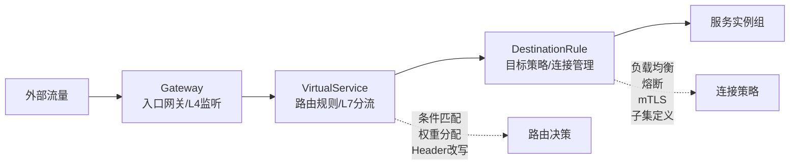
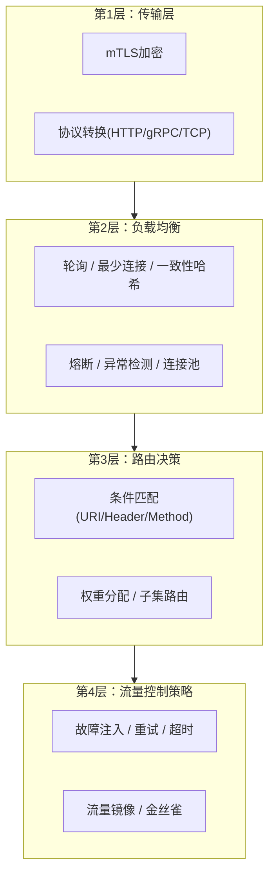
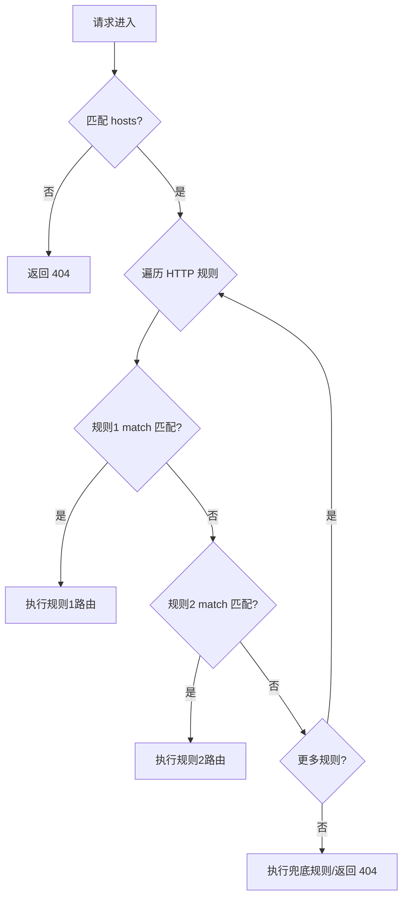
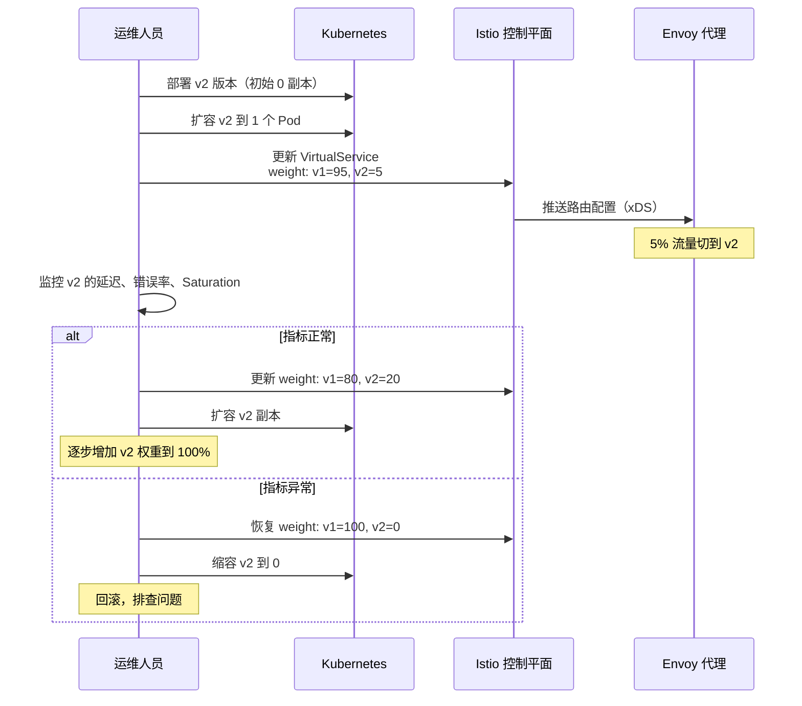
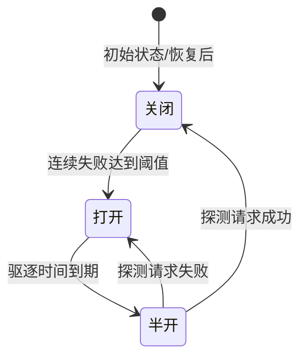
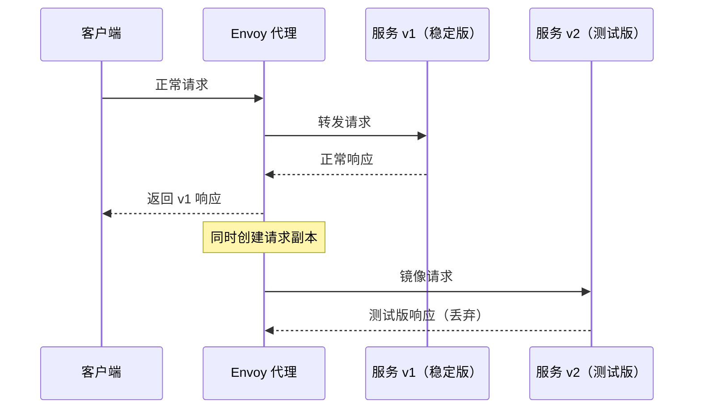

# 流量管理

流量管理是服务网格最核心的能力之一。在传统的微服务架构中，流量路由、负载均衡、故障处理等逻辑分散在每个服务的代码和基础设施配置中，修改一个路由规则可能需要改动多个服务的配置并重新部署。Istio 通过将流量管理能力从应用层剥离到 Sidecar 代理层，实现了声明式的、细粒度的、可动态变更的流量控制。本节将从流量管理的基本概念出发，深入剖析路由、负载均衡、故障处理、流量镜像等核心机制，帮助读者建立完整的流量管理知识体系。

---

## 1. 流量管理概述

### 1.1 为什么需要流量管理

在没有统一流量管理的微服务系统中，工程师面临以下困境：

- **路由变更困难**：调整服务间路由需要修改代码或 Ingress 配置，涉及发版流程
- **灰度发布高风险**：缺乏精确的流量控制手段，灰度往往依赖应用层标记，容易漏流
- **故障处理碎片化**：超时、重试、熔断逻辑散布在每个服务中，策略不一致
- **可观测性不足**：流量路径不透明，故障定位困难

服务网格的流量管理通过以下方式解决这些问题：

| 问题 | 传统方案 | 服务网格方案 |
|------|---------|-------------|
| 路由变更 | 修改代码/配置 → 测试 → 发版 | VirtualService 声明式配置 → 热生效 |
| 灰度发布 | 应用层 Header 标记 | 按权重/标签/Header 精确分流 |
| 故障处理 | 各服务独立实现，策略不一致 | DestinationRule 统一声明，全网格生效 |
| 流量镜像 | 无标准方案，需自建 | VirtualService 声明式镜像，零代码侵入 |
| 熔断限流 | 各语言 SDK 实现 | Envoy 代理层统一执行 |

### 1.2 流量管理的三大核心资源

Istio 的流量管理建立在三大核心资源之上，理解它们的分工协作是掌握流量管理的前提：



**三者协作的完整链路**：流量首先经过 Gateway（如果是外部流量）或直接进入网格内部，然后由 VirtualService 根据匹配条件（URI、Header、权重等）决定将流量路由到哪个目标服务的哪个子集，最后由 DestinationRule 定义该子集的负载均衡策略、熔断策略和连接参数。

| 资源 | 职责 | 生效层级 | 类比 |
|------|------|---------|------|
| Gateway | 定义 L4/L5 端口监听和 TLS 终结 | 网格入口/出口 | 城市的城门 |
| VirtualService | 定义流量路由规则（条件匹配、分流、重试、超时、故障注入） | L7 路由决策 | 交通指挥系统 |
| DestinationRule | 定义目标服务的连接策略（负载均衡、熔断、子集划分） | L4 连接策略 + L7 子集 | 交通信号灯与道路规划 |

### 1.3 流量管理的分层模型

Istio 的流量管理可以分为四个层次，从下到上依次为：



---

## 2. 路由规则与条件匹配

### 2.1 VirtualService 路由规则结构

VirtualService 是流量管理的核心配置资源。一条路由规则由三部分组成：**匹配条件（match）**、**路由目标（route）** 和 **附加策略（timeout/retries/fault 等）**。

```yaml
apiVersion: networking.istio.io/v1beta1
kind: VirtualService
metadata:
  name: order-service-vs
spec:
  hosts:
    - order-service
  http:
    # 第一条规则：精确匹配 /api/v1/orders 路径
    - name: "v1-routes"
      match:
        - uri:
            prefix: "/api/v1/orders"
          method:
            exact: "GET"
      route:
        - destination:
            host: order-service
            subset: v1
      timeout: 5s
      retries:
        attempts: 3
        perTryTimeout: 2s
        retryOn: "5xx,connect-failure"
    
    # 第二条规则：匹配 beta 用户
    - name: "beta-routes"
      match:
        - headers:
            x-user-tier:
              exact: "beta"
      route:
        - destination:
            host: order-service
            subset: v2
    
    # 第三条规则：默认兜底路由
    - name: "default-route"
      route:
        - destination:
            host: order-service
            subset: v1
```

### 2.2 匹配条件详解

Istio 的 VirtualService 支持多维度的匹配条件，每个维度支持精确匹配、前缀匹配、正则匹配和存在性匹配四种模式：

#### URI 匹配

```yaml
match:
  - uri:
      exact: "/api/v1/users"          # 精确匹配：路径必须完全一致
  - uri:
      prefix: "/api/v2"               # 前缀匹配：路径以 /api/v2 开头
  - uri:
      regex: "^/users/[0-9]+/profile" # 正则匹配：RE2 语法
```

| 匹配类型 | 语义 | 性能特点 | 适用场景 |
|---------|------|---------|---------|
| exact | 路径完全匹配 | 最快 | 固定路径的 API |
| prefix | 路径前缀匹配 | 快 | API 版本路由（`/api/v2`） |
| regex | RE2 正则匹配 | 略慢 | 复杂路径模式（`/users/{id}/profile`） |

**前缀匹配的注意事项**：`/api/v2` 会匹配 `/api/v2`、`/api/v2-beta`、`/api/v2/users` 等所有以 `/api/v2` 开头的路径。如果需要精确匹配 `/api/v2` 但不匹配 `/api/v2-beta`，应使用 regex `^/api/v2(/|$)`。

#### Header 匹配

```yaml
match:
  # 精确匹配：Header 值必须完全匹配
  - headers:
      x-user-type:
        exact: "beta"
  
  # 正则匹配：Header 值匹配正则表达式
  - headers:
      x-request-id:
        regex: "^trace-[0-9]+$"
  
  # 存在性匹配：只要 Header 存在即可
  - headers:
      x-canary:
        present: true
  
  # 不存在性匹配：Header 不存在时匹配
  - headers:
      x-debug:
        present: false
```

#### 多维度组合匹配

同一 match 条目内的多个条件按 AND 逻辑组合（全部满足才匹配），不同 match 条目之间按 OR 逻辑组合（任一满足即匹配）：

```yaml
match:
  # match 条目1（OR）：满足其中任一组 AND 条件
  - uri:
      prefix: "/api/v2"           # 条件A
    headers:
      x-user-tier:                # 条件B
        exact: "beta"             # A AND B 必须同时满足
  
  - queryParams:
      debug:                      # 条件C（独立 match 条目，OR）
        present: true

# 路由规则数组中的多个规则按顺序匹配，首个命中即停止
http:
  - match: [...]        # 规则1
    route: [...]
  - match: [...]        # 规则2
    route: [...]
  - route: [...]        # 规则3：无 match = 兜底，匹配所有剩余流量
```

**路由匹配流程**：



### 2.3 权重分流与金丝雀发布

权重分流是灰度发布的基础机制。通过 `weight` 字段将流量按比例分配到不同版本：

```yaml
apiVersion: networking.istio.io/v1beta1
kind: VirtualService
metadata:
  name: productpage-canary
spec:
  hosts:
    - productpage
  http:
    - route:
        - destination:
            host: productpage
            subset: stable
          weight: 90           # 90% 流量到稳定版
        - destination:
            host: productpage
            subset: canary
          weight: 10           # 10% 流量到灰度版
```

与 VirtualService 配套的 DestinationRule 需要定义子集（subset）：

```yaml
apiVersion: networking.istio.io/v1beta1
kind: DestinationRule
metadata:
  name: productpage-dr
spec:
  host: productpage
  trafficPolicy:
    loadBalancer:
      simple: ROUND_ROBIN
  subsets:
    - name: stable
      labels:
        version: v1
    - name: canary
      labels:
        version: v2
```

**金丝雀发布的完整操作流程**：



**金丝雀发布的关键实践要点**：

1. **渐进式放量**：5% → 20% → 50% → 100%，每步至少观察 15-30 分钟
2. **自动回滚**：结合 Prometheus + Flagger/Arsenal 等工具，当错误率超过阈值时自动回滚
3. **流量亲和**：通过 Header 标记让特定用户始终命中灰度版本，避免同一用户在不同版本间反复切换
4. **Shadow 测试**：在金丝雀上线前，先用流量镜像验证新版本的兼容性

### 2.4 基于 Header/标签的路由

除了权重分流，还可以根据请求特征进行更精细的路由：

```yaml
apiVersion: networking.istio.io/v1beta1
kind: VirtualService
metadata:
  name: ab-test-vs
spec:
  hosts:
    - frontend
  http:
    # A/B 测试：beta 用户走新版本
    - match:
        - headers:
            x-user-group:
              exact: "experiment-b"
      route:
        - destination:
            host: frontend
            subset: v2
      # 可选：对灰度流量注入故障以验证韧性
      fault:
        delay:
          percentage:
            value: 5.0
          fixedDelay: 500ms
    
    # 内部测试流量路由到测试环境
    - match:
        - sourceLabels:
            app: test-runner
      route:
        - destination:
            host: frontend
            subset: testing
    
    # 默认路由
    - route:
        - destination:
            host: frontend
            subset: v1
```

### 2.5 Header 改写与 URI 重写

在路由过程中可以对请求和响应的 Header 进行增删改操作：

```yaml
http:
  - route:
      - destination:
          host: backend
          subset: v2
    # 请求头改写
    headers:
      request:
        add:
          x-forwarded-by: "istio-proxy"
          x-request-source: "gateway"
        remove:
          - x-internal-debug
        set:
          x-version: "v2"
      response:
        add:
          x-served-by: "istio"
        remove:
          - x-server-id
```

URI 重写在前后端路径约定不一致时非常有用：

```yaml
http:
  - match:
      - uri:
          prefix: "/api/v2/orders"
    rewrite:
      uri: "/orders"                    # 将 /api/v2/orders 重写为 /orders
    route:
      - destination:
          host: order-service
          subset: v2
          port:
            number: 8080
```

---

## 3. 负载均衡策略

### 3.1 策略全景对比

负载均衡是流量管理的基础设施层。Istio 通过 DestinationRule 配置负载均衡策略，Envoy 代理在数据面执行：

| 策略 | 算法描述 | 适用场景 | 资源消耗 | 注意事项 |
|------|---------|---------|---------|---------|
| ROUND_ROBIN | 轮询分配请求到各实例 | 通用场景，默认策略 | 低 | 不考虑实例负载差异 |
| LEAST_CONN | 选择当前连接数最少的实例 | 长连接场景（WebSocket/gRPC streaming） | 中 | 连接数不等于请求量 |
| RANDOM | 随机选择实例 | 大规模集群，接近均匀分布 | 低 | 小规模集群可能分布不均 |
| RING_HASH | 一致性哈希（基于请求属性） | 需要会话亲和性 | 中 | 节点变更时仅影响部分流量 |
| MAGLEV | Google Maglev 一致性哈希 | 大规模一致性哈希（>1000 节点） | 中 | 比 RING_HASH 更均匀 |
| LEAST_REQUEST | 选择当前活跃请求数最少的实例 | 请求处理时间差异大的场景 | 中 | Envoy 1.26+ 支持 |
| P2C | 随机选两个实例，选负载低的 | gRPC 流量的推荐策略 | 中 | 结合 ORCA 负载指标效果更佳 |
| RANDOM_REQUEST | 随机选择实例 | 超大规模集群 | 低 | 适合无状态短连接服务 |

### 3.2 配置方式

```yaml
apiVersion: networking.istio.io/v1beta1
kind: DestinationRule
metadata:
  name: order-service-dr
spec:
  host: order-service
  trafficPolicy:
    # 默认负载均衡策略
    loadBalancer:
      simple: LEAST_CONN
    
    # 连接池配置
    connectionPool:
      tcp:
        maxConnections: 100        # 最大 TCP 连接数
        connectTimeout: 5s         # TCP 连接超时
        tcpKeepalive:
          time: 7200s              # Keepalive 探测间隔
          interval: 75s            # 探测重试间隔
          probes: 9                # 探测次数
      http:
        h2UpgradePolicy: DEFAULT
        http1MaxPendingRequests: 100   # HTTP/1.1 最大排队请求数
        http2MaxRequests: 1000         # HTTP/2 最大并发请求数
        maxRequestsPerConnection: 10   # 每连接最大请求数
        maxRetries: 3                  # 最大重试次数
    
    # 异常检测（自动驱逐不健康实例）
    outlierDetection:
      consecutive5xx: 5             # 连续 5 次 5xx 后驱逐
      interval: 30s                 # 检测间隔
      baseEjectionTime: 30s         # 基础驱逐时长
      maxEjectionPercent: 50        # 最大驱逐比例（防止雪崩）
      minHealthPercent: 30          # 健康实例低于 30% 时停止驱逐
```

### 3.3 会话亲和性（一致性哈希）

当服务需要会话亲和性时（如购物车、会话缓存），可以使用一致性哈希：

```yaml
apiVersion: networking.istio.io/v1beta1
kind: DestinationRule
metadata:
  name: session-dr
spec:
  host: shopping-cart
  trafficPolicy:
    loadBalancer:
      consistentHash:
        # 基于 HTTP Header 哈希
        httpHeaderName: "x-user-id"
        
        # 或基于 HTTP 查询参数哈希
        # httpQueryParameterName: "session_id"
        
        # 或基于 HTTP Cookie 哈希
        # httpCookie:
        #   name: "user_session"
        #   ttl: 3600s
        
        # 或基于来源 IP 哈希（简单但不够精确）
        # useSourceIp: true
```

**一致性哈希的原理**：当某个实例被驱逐或新增时，一致性哈希算法保证只有该实例负责的那部分流量会被重新分配，而不会影响其他实例的流量分配。这比简单的取模哈希更适合微服务场景，因为后者在实例数量变化时会导致大部分流量重新映射。

### 3.4 地域感知负载均衡

在多区域部署中，流量应优先路由到同区域的实例以降低延迟：

```yaml
apiVersion: networking.istio.io/v1beta1
kind: DestinationRule
metadata:
  name: locality-dr
spec:
  host: payment-service
  trafficPolicy:
    loadBalancer:
      localityLbSetting:
        enabled: true
        failover:
          - from: us-west-2     # 主区域
            to: us-east-1       # 故障转移目标区域
      distribute:
        - from: "us-west-2/us-west-2a/*"
          to:
            "us-west-2/us-west-2a/*": 80    # 80% 流量留在本可用区
            "us-west-2/us-west-2b/*": 15    # 15% 流量到同区域其他可用区
            "us-east-1/us-east-1a/*": 5     # 5% 流量到跨区域（预热）
```

**地域感知负载均衡的典型应用**：
- **延迟优化**：请求优先路由到同区域实例，跨区域延迟通常是同区域的 5-10 倍
- **故障转移**：当主区域不可用时，自动将流量切换到备用区域
- **渐进式流量分配**：在多区域部署初期，通过 distribute 字段控制跨区域流量比例

---

## 4. 故障处理机制

### 4.1 超时控制

超时是防止请求无限期挂起的安全网。合理的超时设置需要考虑下游服务的典型响应时间和最坏情况：

```yaml
apiVersion: networking.istio.io/v1beta1
kind: VirtualService
metadata:
  name: payment-vs
spec:
  hosts:
    - payment-service
  http:
    - route:
        - destination:
            host: payment-service
      timeout: 10s          # 端到端超时
```

**超时预算传递**：Istio 通过 `x-envoy-deadline` 请求头在调用链中传递超时预算。如果 A 的超时是 10s，A 调用 B 时已经耗时 3s，那么 B 实际只有 7s 的超时预算（而非独立的 10s）。这避免了下游服务在上游已超时的情况下仍然继续处理请求的浪费。

**超时设置的最佳实践**：

| 场景 | 推荐超时 | 说明 |
|------|---------|------|
| 同区域内部服务调用 | 1-3s | 内网延迟低，快速失败 |
| 跨区域服务调用 | 3-10s | 考虑网络延迟波动 |
| 外部 API 调用 | 5-30s | 依赖第三方服务稳定性 |
| 数据库查询 | 2-5s | 避免慢查询阻塞连接池 |
| 文件上传/下载 | 30-300s | 大文件传输需要更长超时 |

### 4.2 重试策略

重试是处理瞬时故障的有效手段，但不当的重试配置可能导致级联故障：

```yaml
http:
  - route:
      - destination:
          host: order-service
    timeout: 15s
    retries:
      attempts: 3                         # 总尝试次数（含首次）
      perTryTimeout: 4s                   # 每次尝试的超时
      retryOn: "5xx,reset,connect-failure" # 触发重试的条件
      retryRemoteLocalities: true         # 允许跨区域重试
```

**retryOn 条件详解**：

| 条件 | 含义 | 触发场景 | 建议使用场景 |
|------|------|---------|-------------|
| 5xx | 服务端返回 5xx 状态码 | 后端服务错误 | 通用场景 |
| reset | TCP 连接被重置 | 网络抖动、服务重启 | 内部服务调用 |
| connect-failure | TCP 连接建立失败 | 目标不可达 | 服务发现延迟 |
| retriable-status-codes | 自定义可重试状态码 | 配合 retriableStatusCodes 字段 | 特定业务码 |
| gateway-error | 502/503/504 | 网关/代理层错误 | 网关后端调用 |
| retriable-4xx | 可重试的 4xx（如 409 冲突） | 资源竞争 | 幂等写操作 |

**重试的幂等性警告**：重试会导致非幂等操作（如扣款、发消息）被执行多次。应对策略：

1. **应用层幂等**：在服务端实现幂等 Token 机制，相同 Token 的重复请求返回相同结果
2. **精确重试条件**：仅对 GET 等幂等方法启用重试，POST/PUT/DELETE 慎用
3. **自定义状态码**：通过 `retriable-status-codes` 仅重试特定的业务错误码

### 4.3 熔断器

熔断器是防止故障级联的关键机制。当某个服务实例持续失败时，自动将其从负载均衡池中移除，避免无效请求占用资源：

```yaml
apiVersion: networking.istio.io/v1beta1
kind: DestinationRule
metadata:
  name: notification-dr
spec:
  host: notification-service
  trafficPolicy:
    connectionPool:
      http:
        http1MaxPendingRequests: 50    # 最大排队请求
        http2MaxRequests: 200          # 最大并发请求
        maxRequestsPerConnection: 10   # 单连接最大请求数
      tcp:
        maxConnections: 100            # 最大 TCP 连接数
    outlierDetection:
      consecutive5xx: 5                # 连续 5 次 5xx 后驱逐
      interval: 10s                    # 每 10 秒检测一次
      baseEjectionTime: 30s            # 首次驱逐 30 秒
      maxEjectionPercent: 50           # 最多驱逐 50% 实例
      minHealthPercent: 30             # 健康实例低于 30% 时停止驱逐
```

**熔断器的状态转换**：



**熔断与异常检测的区别**：
- **连接池限制**：控制对单个服务的总体连接数和请求数上限，防止过载
- **异常检测**：自动检测并驱逐连续失败的实例，经过一段时间后尝试恢复
- **两者协同**：连接池限制保护整体服务不被打垮，异常检测确保流量不被路由到坏实例

### 4.4 故障注入

故障注入是混沌工程的核心能力，通过在流量路径中主动注入延迟或错误来验证系统的韧性：

```yaml
apiVersion: networking.istio.io/v1beta1
kind: VirtualService
metadata:
  name: review-fault-injection
spec:
  hosts:
    - review-service
  http:
    # 规则1：对 5% 的请求注入 3 秒延迟
    - match:
        - headers:
            x-test-mode:
              exact: "chaos"
      fault:
        delay:
          percentage:
            value: 5.0             # 5% 的请求受影响
          fixedDelay: 3s           # 注入 3 秒固定延迟
      route:
        - destination:
            host: review-service
            subset: v1
    
    # 规则2：对 1% 的请求返回 503 错误
    - match:
        - uri:
            prefix: "/api/v1/reviews"
      fault:
        abort:
          percentage:
            value: 1.0             # 1% 的请求被中止
          httpStatus: 503          # 返回 503 Service Unavailable
      route:
        - destination:
            host: review-service
            subset: v1
    
    # 规则3：默认路由（不注入故障）
    - route:
        - destination:
            host: review-service
            subset: v1
```

**故障注入的典型应用场景**：

1. **韧性验证**：验证上游服务在超时、5xx 错误下的重试和降级行为是否正常
2. **超时调优**：通过注入不同延迟，找到最合适的超时阈值
3. **混沌工程演练**：在生产环境对低风险流量注入故障，验证告警和应急流程
4. **依赖关系测试**：模拟下游服务不可用，验证服务的降级策略和兜底逻辑

**故障注入的安全实践**：
- 在生产环境中仅对标记了特定 Header 的流量注入故障
- 设置合理的故障比例上限（建议 < 5%）
- 配合实时监控，在异常指标出现时及时停止注入
- 每次故障注入前通知相关团队

---

## 5. 流量镜像

### 5.1 流量镜像的原理

流量镜像（Traffic Mirroring）也称为影子测试（Shadow Testing），它将生产流量的副本发送到测试版本，但测试版本的响应不会返回给客户端。客户端始终接收原版本的响应，因此镜像流量对用户完全透明。



### 5.2 配置方式

```yaml
apiVersion: networking.istio.io/v1beta1
kind: VirtualService
metadata:
  name: productpage-mirror
spec:
  hosts:
    - productpage
  http:
    - route:
        - destination:
            host: productpage
            subset: v1          # 主流量路由到 v1
      mirror:                    # 镜像流量到 v2
        host: productpage
        subset: v2
      mirrorPercentage:          # 镜像比例（Istio 1.11+）
        value: 25.0              # 25% 的流量被镜像
```

### 5.3 流量镜像的最佳实践

1. **性能开销评估**：镜像流量会额外消耗测试版本的资源，建议从低比例（5-10%）开始
2. **关注点分离**：镜像流量的监控指标应与主流量分开，避免污染核心指标
3. **错误日志收集**：虽然镜像响应不影响用户，但测试版本产生的错误需要被记录和分析
4. **适用场景**：
   - 新版本上线前的兼容性验证
   - 大规模重构后的回归验证
   - 数据库迁移后的流量验证

---

## 6. 流量策略与网关

### 6.1 入口网关（Ingress Gateway）

Istio 的入口网关替代了传统的 Ingress Controller，提供更强大的路由能力：

```yaml
apiVersion: networking.istio.io/v1beta1
kind: Gateway
metadata:
  name: api-gateway
spec:
  selector:
    istio: ingressgateway        # 使用默认的 Ingress 网关
  servers:
    - port:
        number: 443
        name: https
        protocol: HTTPS
      tls:
        mode: SIMPLE
        credentialName: api-tls-cert   # 引用 Kubernetes Secret
      hosts:
        - "api.example.com"
    - port:
        number: 80
        name: http
        protocol: HTTP
      hosts:
        - "api.example.com"
      # HTTP 到 HTTPS 的重定向
      tls:
        httpsRedirect: true
```

### 6.2 出口流量管理

在生产环境中，限制和管理出站流量（服务访问外部资源）是安全合规的重要环节：

```yaml
# 1. 定义外部服务（ServiceEntry）
apiVersion: networking.istio.io/v1beta1
kind: ServiceEntry
metadata:
  name: external-api
spec:
  hosts:
    - api.stripe.com
  ports:
    - number: 443
      name: https
      protocol: TLS
  resolution: DNS
  location: MESH_EXTERNAL

# 2. 定义路由规则
apiVersion: networking.istio.io/v1beta1
kind: VirtualService
metadata:
  name: stripe-vs
spec:
  hosts:
    - api.stripe.com
  tls:
    - match:
        - port: 443
          sniHosts:
            - api.stripe.com
      route:
        - destination:
            host: api.stripe.com
            port:
              number: 443

# 3. 定义访问策略（仅允许特定服务访问外部 API）
apiVersion: security.istio.io/v1
kind: AuthorizationPolicy
metadata:
  name: stripe-access
spec:
  selector:
    matchLabels:
      app: payment-service        # 仅 payment-service 可访问
  action: ALLOW
  rules:
    - to:
        - operation:
            hosts:
              - api.stripe.com
```

### 6.3 TCP 流量路由

除了 HTTP 流量，Istio 还支持 TCP 协议的流量路由（如 MySQL、Redis、Kafka 等）：

```yaml
apiVersion: networking.istio.io/v1beta1
kind: VirtualService
metadata:
  name: mysql-vs
spec:
  hosts:
    - mysql-primary
  tcp:
    - match:
        - port: 3306
      route:
        - destination:
            host: mysql-primary
            subset: primary
          weight: 90
        - destination:
            host: mysql-primary
            subset: replica
          weight: 10            # 10% 的只读流量路由到从库
```

---

## 7. 流量管理的可观测性

### 7.1 核心监控指标

Istio + Envoy 自动生成丰富的流量指标，无需在应用层埋点：

| 指标 | 含义 | 典型用途 |
|------|------|---------|
| `istio_requests_total` | 请求总数（按状态码、路由规则等标签） | 流量趋势、错误率计算 |
| `istio_request_duration_milliseconds` | 请求延迟分布（P50/P99） | 延迟监控、SLO 达成率 |
| `istio_request_bytes` | 请求体大小 | 流量带宽分析 |
| `istio_tcp_connections_opened_total` | TCP 连接打开数 | 连接池使用率 |
| `istio_tcp_connections_closed_total` | TCP 连接关闭数 | 连接泄漏检测 |
| `istio_tcp_sent_bytes_total` | TCP 发送字节数 | 出站流量统计 |

### 7.2 Prometheus 查询示例

```promql
# 各版本的错误率
sum(rate(istio_requests_total{response_code=~"5.*"}[5m])) by (destination_version)
/
sum(rate(istio_requests_total[5m])) by (destination_version)

# P99 延迟
histogram_quantile(0.99, sum(rate(istio_request_duration_milliseconds_bucket[5m])) by (le, destination_workload))

# 各路由规则的流量比例
sum(rate(istio_requests_total{reporter="destination"}[5m])) by (response_code, route_name)
```

### 7.3 分布式追踪

Istio 的 Sidecar 代理自动为每个请求生成追踪 Span，支持 Zipkin、Jaeger 等追踪系统：

```yaml
# 在 Istio 安装时启用追踪采样
apiVersion: install.istio.io/v1alpha1
kind: IstioOperator
spec:
  meshConfig:
    enableTracing: true
    defaultConfig:
      tracing:
        sampling: 10.0           # 10% 的请求被采样追踪
      zipkin:
        address: jaeger-collector.observability:9411
```

通过追踪数据可以清晰地看到请求在整个调用链中的路径、每一步的耗时和状态，是排查分布式系统性能问题和故障定位的利器。

---

## 8. 流量管理的常见误区

### 误区一：重试配置过于激进

```yaml
# 错误示范：3次重试 x 10秒超时 = 最坏情况下下游收到 40 倍请求
retries:
  attempts: 5
  perTryTimeout: 10s
  retryOn: "5xx"

# 正确做法：保守重试 + 短超时
retries:
  attempts: 2                   # 最多重试 2 次
  perTryTimeout: 2s             # 每次快速超时
  retryOn: "reset,connect-failure"  # 仅对连接级错误重试
```

### 误区二：熔断阈值设置不合理

```yaml
# 错误示范：阈值过低导致正常流量被误熔断
outlierDetection:
  consecutive5xx: 2             # 连续 2 次就驱逐，太敏感
  maxEjectionPercent: 80        # 可能驱逐大部分实例

# 正确做法：合理阈值 + 保护机制
outlierDetection:
  consecutive5xx: 5             # 连续 5 次 5xx 才驱逐
  interval: 30s                 # 每 30 秒检测一次
  baseEjectionTime: 30s         # 驱逐 30 秒后尝试恢复
  maxEjectionPercent: 50        # 最多驱逐一半实例
  minHealthPercent: 30          # 健康实例低于 30% 时停止驱逐
```

### 误区三：忽略超时链路传递

超时在调用链中是递减的，而非独立的。如果上游设了 10s 超时，下游也设了 10s 超时，当下游在第 8s 才开始处理时，实际只剩 2s 而非 10s。因此需要自上而下合理分配超时预算。

### 误区四：权重之和不为 100

VirtualService 中的 weight 字段之和必须等于 100。如果总和不为 100，Istio 不会报错但行为不可预测——剩余的流量比例会被丢弃或随机分配。

### 误区五：混淆 VirtualService 和 DestinationRule 的职责

- VirtualService 定义"流量往哪里去"（路由规则）
- DestinationRule 定义"到达之后怎么处理"（负载均衡、熔断、子集定义）
- 没有 DestinationRule，VirtualService 中引用的 subset 不存在
- 没有 VirtualService，DestinationRule 中的 subset 无法被路由到

---

## 9. 性能优化与调优

### 9.1 Envoy 代理的性能开销

每个 Sidecar 代理都会引入一定的延迟和资源消耗：

| 指标 | 典型值 | 优化方向 |
|------|-------|---------|
| 请求延迟增加 | 1-5ms（同区域） | 减少 Filter 链长度 |
| 内存开销 | 50-100MB/Sidecar | 启用 Ambient Mesh 减少开销 |
| CPU 开销 | 0.1-0.5 核/实例 | 合理设置资源 limit |
| 连接池大小 | 100-1000 | 根据实际负载调整 |

### 9.2 路由规则优化

- **规则排序**：将匹配概率高的规则放在前面，减少不必要的匹配开销
- **避免正则**：正则匹配比精确/前缀匹配慢 3-5 倍，优先使用精确或前缀匹配
- **减少规则数量**：合并相似的路由规则，避免每个 VirtualService 包含过多规则
- **exportTo 限定范围**：使用 `exportTo: ["."]` 将 VirtualService 限定在当前命名空间，减少 xDS 推送的数据量

### 9.3 连接池调优

连接池配置直接影响吞吐量和资源使用：

| 参数 | 默认值 | 调优建议 |
|------|-------|---------|
| `maxConnections` | 2^32-1 | 根据下游服务承载能力设置，一般 100-500 |
| `http1MaxPendingRequests` | 2^32-1 | 高并发场景设为 50-200，防止排队过长 |
| `http2MaxRequests` | 2^32-1 | gRPC 场景根据下游 QPS 设为 100-1000 |
| `maxRequestsPerConnection` | 0（不限制） | 设为 10-100，定期重建连接避免长连接问题 |

---

## 10. 本节小结

流量管理是服务网格最核心的能力之一，它将路由、负载均衡、故障处理等流量控制逻辑从业务代码中剥离出来，通过声明式配置实现细粒度的、可动态变更的流量控制。

**核心要点回顾**：

1. **三大资源协作**：Gateway → VirtualService → DestinationRule，分别负责入口监听、路由决策和目标策略
2. **路由匹配**：支持 URI、Header、Method、QueryParams、SourceLabels 等多维度匹配，OR/AND 组合逻辑
3. **负载均衡**：从简单的 ROUND_ROBIN 到复杂的地域感知负载均衡，根据场景选择合适策略
4. **故障处理**：超时 → 重试 → 熔断 → 异常检测，层层递进，每一层都不可缺失
5. **流量镜像**：零风险验证新版本，响应对客户端完全透明
6. **可观测性**：Istio 自动采集请求指标和追踪数据，无需应用层埋点

掌握流量管理的核心概念和配置方式，是构建可靠、可观测、可运维的微服务系统的基石。后续的核心技巧章节将深入实践 VirtualService、DestinationRule 和 Envoy 代理的高级用法。
