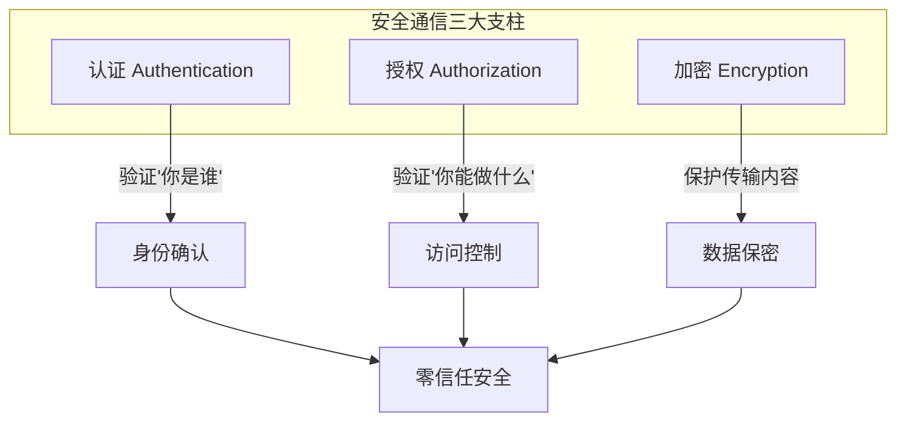
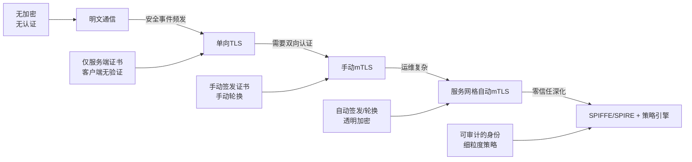
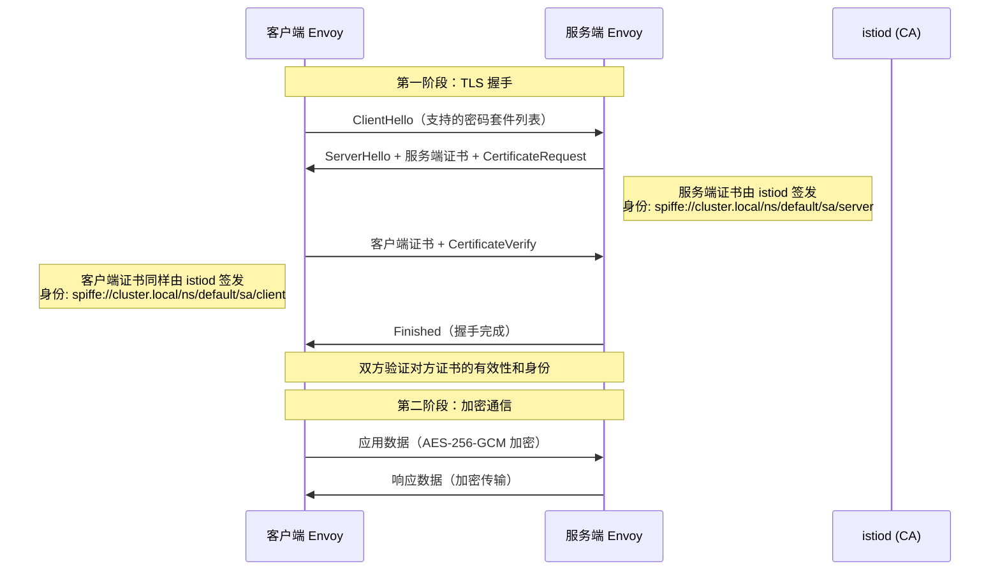
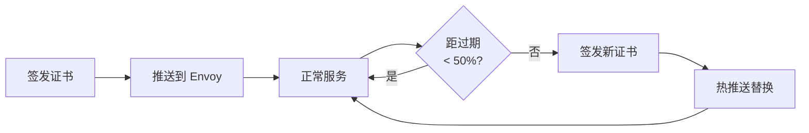
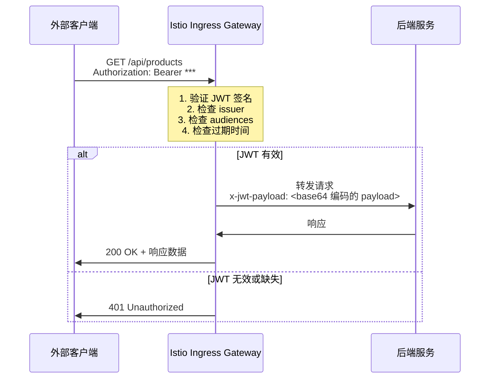
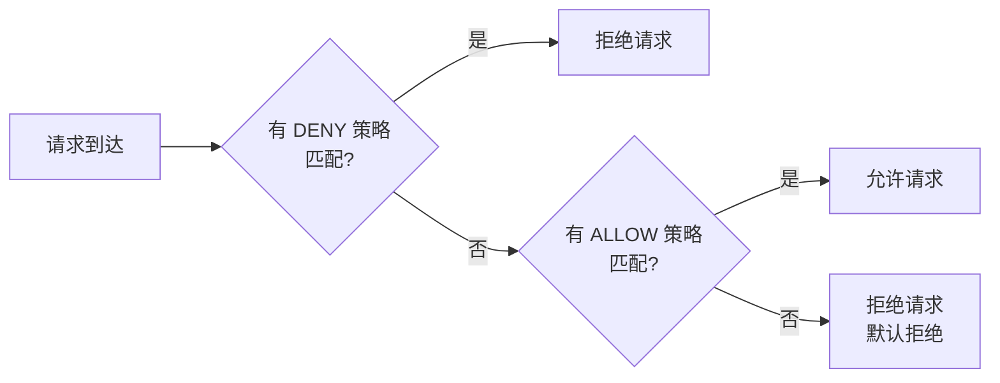
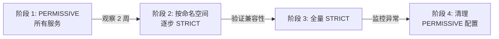
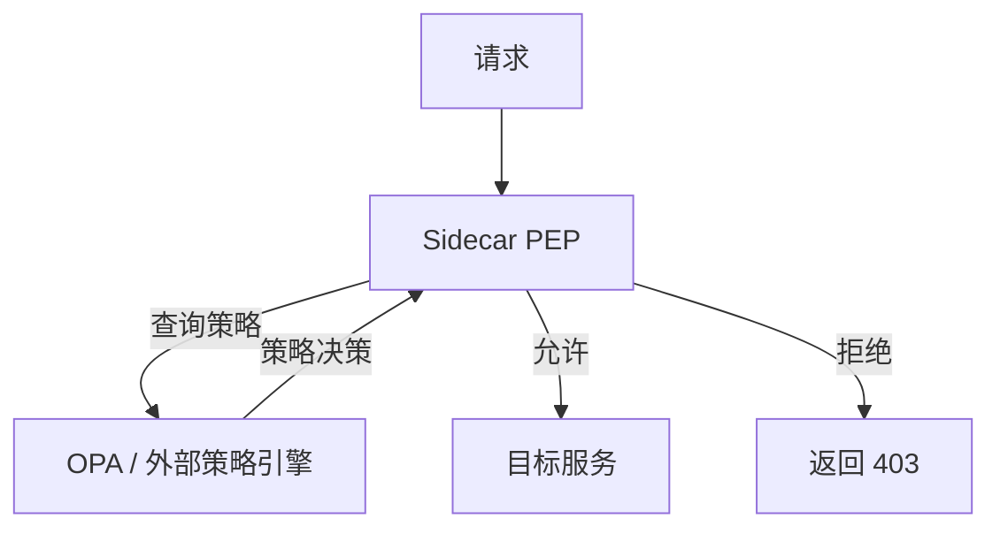

# 安全通信

## 1. 概述与背景

### 1.1 为什么服务网格需要安全通信

在传统的单体应用中，所有组件运行在同一个进程或同一台服务器内部，组件间的通信默认是安全的——数据根本不离开进程边界。然而，当架构演进为微服务后，情况发生了根本性变化：

- **网络暴露面急剧扩大**：一个中等规模的微服务系统可能有 200+ 个服务，服务间的调用关系形成一张复杂的网络图，每一次网络调用都是潜在的攻击入口
- **东西向流量（East-West Traffic）成为主体**：与南北向流量（North-South，即用户到服务）不同，东西向流量（服务到服务）的体量通常是前者的 10-100 倍，却长期缺乏安全防护
- **零信任（Zero Trust）成为行业共识**：NIST SP 800-207 明确指出，传统基于边界的安全模型已不足以应对现代威胁，"永远不信任，始终验证"成为基本准则
- **供应链攻击频发**：2020 年 SolarWinds 事件、2021 年 Log4Shell 漏洞等事件证明，一旦内网被突破，缺乏东西向防护的系统将面临毁灭性打击

服务网格通过将安全能力下沉到基础设施层，实现了对所有流量的透明加密和身份验证，让开发者无需在每个服务中重复实现安全逻辑。这就是服务网格安全通信的核心价值。

### 1.2 安全通信的三大支柱

服务网格的安全通信体系建立在三个核心能力之上，构成了一个完整的安全闭环：



| 支柱 | 核心问题 | 服务网格解决方案 | 传统方案对比 |
|------|----------|------------------|-------------|
| 认证（Authentication） | "你是谁？" | 基于证书的自动双向身份验证（mTLS + SPIFFE） | API Key / 硬编码 Token |
| 授权（Authorization） | "你能做什么？" | 声明式策略引擎（AuthorizationPolicy） | 代码内 if-else 判断 |
| 加密（Encryption） | "数据如何保护？" | 自动 TLS 加密，零开发成本 | 手动配置 SSL 证书 |

### 1.3 安全通信的历史演进



早期的微服务安全依赖于网络边界防御（防火墙 + VPN），认为内网是可信的。这种"城堡式安全模型"在容器化和 Kubernetes 环境中彻底失效——Pod 可以随时调度到任何节点，网络边界变得模糊。服务网格的出现，使得在不修改应用代码的前提下实现全链路加密成为可能。

### 1.4 安全通信的威胁模型

理解安全通信解决什么问题，需要先明确威胁模型：

| 威胁类型 | 攻击场景 | 服务网格防护机制 |
|----------|----------|------------------|
| 中间人攻击（MITM） | 攻击者在服务间链路上嗅探或篡改数据 | mTLS 双向认证 + 传输加密 |
| 身份伪造 | 攻击者伪装成合法服务发起请求 | SPIFFE 身份 + 证书验证 |
| 未授权访问 | 已认证的服务越权访问其他服务资源 | AuthorizationPolicy 细粒度策略 |
| 证书过期导致服务中断 | 手动证书管理遗忘轮换 | 自动证书签发与轮换 |
| 横向移动 | 攻击者在一个服务被攻破后扩散到其他服务 | 零信任 + 最小权限授权 |

---

## 2. 核心原理

### 2.1 mTLS（双向传输层安全协议）

mTLS（mutual TLS）是服务网格安全通信的基石。传统的 TLS 是单向的——客户端验证服务端身份；而 mTLS 要求双方都出示证书，实现双向身份验证。

#### 2.1.1 TLS 握手与 mTLS 的区别

| 特性 | 单向 TLS | mTLS |
|------|----------|------|
| 证书方向 | 仅服务端提供 | 双方各提供一份 |
| 身份验证 | 仅客户端验证服务端 | 双向验证 |
| 适用场景 | 浏览器 → Web 服务器 | 微服务 ↔ 微服务 |
| 证书管理 | 仅管理服务端证书 | 管理双向证书，复杂度更高 |
| 攻击防护 | 防中间人攻击（服务端身份） | 防中间人 + 防未授权客户端 |

#### 2.1.2 mTLS 握手的完整流程

在服务网格中，mTLS 握手由 Sidecar 代理（如 Envoy）自动完成，应用完全无感知。完整的握手流程如下：



关键步骤解析：

**第一步：ClientHello**

客户端 Envoy 向服务端发起 TLS 握手，携带支持的 TLS 版本（通常为 TLS 1.3）、密码套件列表（如 AES-256-GCM-SHA384）和一个随机数。该随机数用于后续密钥生成，防止重放攻击。

**第二步：ServerHello + 证书请求**

服务端 Envoy 选择密码套件，返回自己的 X.509 证书。该证书包含 SPIFFE URI（如 `spiffe://cluster.local/ns/default/sa/reviews`）作为服务身份标识。同时，服务端发送 CertificateRequest，要求客户端也提供证书——这是 mTLS 与普通 TLS 的关键区别。

**第三步：客户端证书响应**

客户端 Envoy 返回自己的 X.509 证书和对握手消息的数字签名（CertificateVerify），证明自己确实持有证书对应的私钥。

**第四步：双方验证**

双方互相验证对方证书的有效性：

- 证书是否由可信 CA（istiod）签发
- 证书是否过期
- 证书中的身份信息是否与预期匹配
- CertificateVerify 签名是否正确

**第五步：建立加密通道**

验证通过后，双方使用协商好的对称加密算法和密钥进行加密通信。后续所有数据传输都经过加密，即使被网络嗅探也无法解密。

#### 2.1.3 Envoy 中 mTLS 的实现

在 Envoy 的配置中，mTLS 通过 Transport Socket 和 TLS 上下文实现：

```yaml
# Envoy 配置中的 mTLS 实现（简化版）
static_resources:
  listeners:
  - name: inbound
    address:
      socket_address:
        address: 0.0.0.0
        port_value: 15006
    filter_chains:
    - filters:
      - name: envoy.filters.network.tcp_proxy
        typed_config:
          "@type": type.googleapis.com/envoy.extensions.filters.network.tcp_proxy.v3.TcpProxy
          cluster: inbound_service
      transport_socket:
        name: envoy.transport_sockets.tls
        typed_config:
          "@type": type.googleapis.com/envoy.extensions.transport_sockets.tls.v3.DownstreamTlsContext
          require_client_certificate: true  # 关键：要求客户端证书
          common_tls_context:
            tls_certificates:
            - certificate_chain:
                filename: /etc/certs/cert-chain.pem
              private_key:
                filename: /etc/certs/key.pem
            validation_context:
              trusted_ca:
                filename: /etc/certs/root-cert.pem
  clusters:
  - name: inbound_service
    transport_socket:
      name: envoy.transport_sockets.tls
      typed_config:
        "@type": type.googleapis.com/envoy.extensions.transport_sockets.tls.v3.UpstreamTlsContext
        common_tls_context:
          tls_certificates:
          - certificate_chain:
              filename: /etc/certs/cert-chain.pem
            private_key:
              filename: /etc/certs/key.pem
          validation_context:
            trusted_ca:
              filename: /etc/certs/root-cert.pem
```

#### 2.1.4 mTLS 模式对比：STRICT vs PERMISSIVE

| 维度 | STRICT 模式 | PERMISSIVE 模式 |
|------|-------------|-----------------|
| 明文流量 | 完全拒绝 | 允许通过 |
| mTLS 流量 | 正常处理 | 正常处理 |
| 安全等级 | 高（零信任） | 低（过渡态） |
| 迁移风险 | 不兼容旧客户端 | 无 |
| 生产推荐 | 是（目标状态） | 仅迁移期使用 |

实际影响：在 PERMISSIVE 模式下，一个未被网格覆盖的服务（如刚部署的新服务或 VM 上的遗留服务）仍能与网格内服务通信，但这些通信是明文的，攻击者可以嗅探和篡改。因此 PERMISSIVE 仅是过渡手段，不是终态。

### 2.2 证书管理与自动轮换

证书管理是 mTLS 落地过程中最复杂的环节之一。在大规模微服务系统中，手动管理成百上千个服务的证书几乎不可行。服务网格通过内置的 CA（Certificate Authority）和自动轮换机制解决了这一难题。

#### 2.2.1 istiod 内置 CA

Istio 1.5+ 将 CA 功能集成到 `istiod` 中（原 Citadel 组件），负责：

- **签发证书**：为每个服务实例签发短期 X.509 证书
- **证书分发**：通过 SDS（Secret Discovery Service）API 将证书推送给 Envoy
- **证书轮换**：在证书过期前自动签发新证书并推送
- **根证书管理**：管理集群根 CA 证书和中间 CA 证书

证书的生命周期管理：



默认配置下：

- 证书有效期：**24 小时**（可通过 `DEFAULT_WORKLOAD_CERT_TTL` 调整）
- 轮换时机：证书过期前自动触发（通常在剩余 50% 有效期时开始轮换）
- 推送方式：通过 SDS API 热更新，**无需重启 Envoy**

#### 2.2.2 证书签发流程

当一个 Pod 启动并被注入 Sidecar 后，证书签发流程如下：

1. Envoy 向 istiod 发送 SDS 请求，携带 ServiceAccount 信息
2. istiod 验证请求的合法性（Pod 身份、ServiceAccount 是否存在）
3. istiod 使用内置 CA 的私钥签发 X.509 证书
4. 证书通过 SDS 响应返回给 Envoy
5. Envoy 将证书加载到内存，用于后续 mTLS 握手

#### 2.2.3 外部 CA 集成

在企业环境中，通常需要将服务网格与现有的 PKI 基础设施集成。Istio 支持多种外部 CA 集成方式：

```yaml
# 配置 istiod 使用外部 CA（Vault PKI 示例）
apiVersion: install.istio.io/v1alpha1
kind: IstioOperator
metadata:
  name: istio-control-plane
spec:
  profile: default
  pilotCertProvider: custom
  meshConfig:
    defaultConfig:
      proxyMetadata:
        ISTIO_META_CERT_SIGNER: vault-pki
```

常见的外部 CA 集成方案：

| CA 类型 | 集成方式 | 适用场景 | 优势 |
|---------|----------|----------|------|
| HashiCorp Vault | Vault PKI + CSI Driver | 企业级安全需求 | 密钥不落盘，审计能力 |
| AWS Private CA | PCA Connector | AWS 云上部署 | 与 AWS IAM 集成 |
| Google CAS | Workload Identity | GCP 云上部署 | 与 GKE 深度集成 |
| cert-manager | Cert Manager CRD | 通用 Kubernetes | 社区生态丰富 |
| SPIRE | SPIFFE Runtime Env | 跨集群/跨云 | 标准化身份框架 |

**HashiCorp Vault 集成详解**：

Vault PKI 是企业环境中最常见的外部 CA 选择。集成步骤：

1. 在 Vault 中启用 PKI 引擎并配置中间 CA
2. 创建签发策略，限制 istiod 只能签发特定信任域的证书
3. 使用 Vault CSI Driver 将证书注入 Pod
4. 配置 istiod 使用 Vault 签发的证书

```bash
# 启用 Vault PKI 引擎
vault secrets enable -path=istio-pki pki

# 配置最大 TTL
vault secrets tune -max-lease-ttl=87600h istio-pki

# 生成中间 CA
vault write istio-pki/intermediate/generate/internal \
    common_name="Istio Intermediate CA" \
    ttl=43800h

# 创建签发角色
vault write istio-pki/roles/istio-role \
    allowed_domains="cluster.local" \
    allow_subdomains=true \
    max_ttl=24h
```

#### 2.2.4 证书验证与吊销

在实际生产环境中，证书的验证和吊销同样重要：

- **OCSP Stapling**：Envoy 支持 OCSP（在线证书状态协议），可以实时验证证书是否已被吊销
- **证书吊销列表（CRL）**：对于不支持 OCSP 的场景，可以通过 CRL 文件吊销特定证书
- **即时吊销**：通过 SDS API 推送新的空证书，可以立即停止某个服务的通信能力

#### 2.2.5 证书链验证的完整路径

当客户端 Envoy 收到服务端证书时，验证路径如下：

服务端证书 → 中间 CA 证书 → 根 CA 证书
   ↓              ↓              ↓
检查 SAN       检查签名        检查是否在
SPIFFE ID      由 CA 签发      可信列表中
   ↓              ↓              ↓
身份匹配?     链完整?         根可信?
   ↓              ↓              ↓
   └──────────────┴──────────────┘
              全部通过 → 允许连接

任何一步失败都会导致 TLS 握手中断，连接被拒绝。

### 2.3 SPIFFE 身份框架

SPIFFE（Secure Production Identity Framework For Everyone）是 CNCF 子项目，为服务网格提供了标准化的服务身份体系。

#### 2.3.1 SPIFFE ID 规范

每个服务的身份由一个 URI 标识，格式如下：

spiffe://<trust-domain>/<workload-identifier>

在 Kubernetes + Istio 环境中的典型格式：

spiffe://cluster.local/ns/default/sa/reviews
│         │              │   │    │
│         │              │   │    └── ServiceAccount 名称
│         │              │   └── 命名空间
│         │              └── namespace 缩写
│         └── 信任域（通常为集群域名）
└── SPIFFE URI 方案

#### 2.3.2 SPIFFE 与 X.509 的映射

SPIFFE 身份通过 X.509 证书的 SAN（Subject Alternative Name）字段承载：

```bash
# 查看 Envoy 持有的证书中的 SPIFFE ID
kubectl exec -it <pod-name> -c istio-proxy -- \
  openssl x509 -in /etc/certs/cert.pem -text -noout | grep -A2 "Subject Alternative Name"

# 输出示例：
# X509v3 Subject Alternative Name:
#     URI:spiffe://cluster.local/ns/default/sa/reviews
```

#### 2.3.3 SPIRE 与 Istio 的集成

SPIRE（SPIFFE Runtime Environment）是 SPIFFE 的生产级实现，可以在 Istio 中替代 istiod 内置 CA：

```yaml
# Istio + SPIRE 集成配置
apiVersion: install.istio.io/v1alpha1
kind: IstioOperator
spec:
  profile: default
  meshConfig:
    defaultConfig:
      proxyMetadata:
        SPIFFE_ENDPOINT_SOCKET: "unix:///run/spire/sockets/agent.sock"
  values:
    global:
      pilotCertProvider: "spire"
```

SPIRE 的优势在于：

- **跨平台身份验证**：不限于 Kubernetes，支持 VM、裸机等多种环境
- **联邦信任**：支持多个信任域之间的身份联邦
- **工作负载证明**：通过 node attestor 和 workload attestor 实现严格的身份证明
- **身份可移植**：同一工作负载迁移到不同集群时，SPIFFE ID 不变

---

## 3. 认证体系

### 3.1 对等认证（Peer Authentication）

对等认证（Peer Authentication）控制服务间通信的 TLS 模式。Istio 提供三种模式：

| 模式 | 行为 | 适用场景 | 安全性 |
|------|------|----------|--------|
| `STRICT` | 必须使用 mTLS，拒绝明文连接 | 安全敏感的服务 | 最高 |
| `PERMISSIVE` | 允许 mTLS 和明文并存 | 渐进式迁移期间 | 中等 |
| `DISABLE` | 禁用 mTLS，允许明文 | 非安全场景（不推荐） | 最低 |

```yaml
# 在命名空间级别强制 mTLS
apiVersion: security.istio.io/v1beta1
kind: PeerAuthentication
metadata:
  name: default
  namespace: production
spec:
  mtls:
    mode: STRICT
```

```yaml
# 为特定端口设置不同模式（渐进式迁移策略）
apiVersion: security.istio.io/v1beta1
kind: PeerAuthentication
metadata:
  name: per-port-mtls
  namespace: production
spec:
  selector:
    matchLabels:
      app: legacy-service
  portLevelMtls:
    8080:              # HTTP 端口：PERMISSIVE，兼容旧客户端
      mode: PERMISSIVE
    8443:              # HTTPS 端口：STRICT
      mode: STRICT
```

### 3.2 请求认证（Request Authentication）

请求认证用于验证进入网格的外部请求（通常是通过 API 网关进入的 HTTP 请求），最常见的方案是 JWT 验证。

```yaml
# 配置 JWT 验证策略
apiVersion: security.istio.io/v1beta1
kind: RequestAuthentication
metadata:
  name: jwt-auth
  namespace: istio-system
spec:
  selector:
    matchLabels:
      istio: ingressgateway
  jwtRules:
    - issuer: "https://auth.example.com/"
      jwksUri: "https://auth.example.com/.well-known/jwks.json"
      audiences:
        - "my-api"
        - "my-web-app"
      forwardOriginalToken: true
      outputPayloadToHeader: "x-jwt-payload"
      outputPayloadToBindings:
        - key: "user_id"
          value: "claims.sub"
      jwksFetchTimeout: 5s
      jwksAsyncFetch:
        enableCache: true
```

JWT 验证的工作流程：



### 3.3 JWT + mTLS 组合认证

在实际生产环境中，外部请求通常需要同时通过 JWT 验证（入口层）和 mTLS（网格内）：

```yaml
# 入口网关：JWT 验证（外部请求）
apiVersion: security.istio.io/v1beta1
kind: RequestAuthentication
metadata:
  name: jwt-auth
  namespace: istio-system
spec:
  selector:
    matchLabels:
      istio: ingressgateway
  jwtRules:
    - issuer: "https://auth.example.com/"
      jwksUri: "https://auth.example.com/.well-known/jwks.json"
---
# 命名空间：mTLS（服务间）
apiVersion: security.istio.io/v1beta1
kind: PeerAuthentication
metadata:
  name: default
  namespace: production
spec:
  mtls:
    mode: STRICT
```

这样形成了两层防护：

外部客户端 → [JWT 验证] → Ingress Gateway → [mTLS 加密] → 后端服务
                              ↑                    ↑
                         验证用户身份         验证服务身份

### 3.4 Linkerd 的认证实现

对于不使用 Istio 的服务网格实现（如 Linkerd），JWT 验证通常在应用层或 API 网关层处理。Linkerd 本身提供内置的 mTLS（无需配置，自动启用），但不提供 JWT 验证：

```yaml
# Linkerd + external authorization 适配器
# 在 Linkerd 外部部署 OAuth2 Proxy 进行 JWT 验证
apiVersion: v1
kind: Pod
metadata:
  name: oauth2-proxy
spec:
  containers:
  - name: oauth2-proxy
    image: quay.io/oauth2-proxy/oauth2-proxy:v7.5.0
    args:
    - --provider=oidc
    - --oidc-issuer-url=https://auth.example.com/
    - --client-id=my-app
    - --upstream=http://localhost:8080
```

| 能力 | Istio | Linkerd |
|------|-------|---------|
| mTLS | 需配置 PeerAuthentication | 默认自动启用 |
| JWT 验证 | 内置 RequestAuthentication | 需外部代理（如 OAuth2 Proxy） |
| 身份框架 | SPIFFE | 自有身份体系（基于证书） |
| 授权策略 | AuthorizationPolicy（ALLOW/DENY/CUSTOM） | Server/ServerAuthorization（基于角色） |
| 策略复杂度 | 高（支持 HTTP 属性、JWT Claims） | 中（基于身份和端口） |

---

## 4. 授权体系

### 4.1 授权策略模型

服务网格的授权体系遵循"默认拒绝"（Deny by Default）原则——没有显式允许的请求将被拒绝。授权策略支持三种动作：

| 动作 | 含义 | 典型用法 |
|------|------|----------|
| `ALLOW` | 允许匹配的请求 | 白名单模式 |
| `DENY` | 拒绝匹配的请求 | 黑名单模式 |
| `CUSTOM` | 委托给外部授权服务 | 复杂业务授权逻辑 |



策略评估顺序：**DENY 优先于 ALLOW**。如果一个请求同时匹配 DENY 和 ALLOW 策略，DENY 生效。这确保了安全基线不会被 ALLOW 策略覆盖。

### 4.2 基于源身份的授权

最简单的授权模式是基于服务身份（SPIFFE ID）进行访问控制：

```yaml
# 只允许 reviews 服务访问 ratings 服务
apiVersion: security.istio.io/v1beta1
kind: AuthorizationPolicy
metadata:
  name: ratings-reader
  namespace: default
spec:
  selector:
    matchLabels:
      app: ratings
  action: ALLOW
  rules:
    - from:
        - source:
            principals:
              - "cluster.local/ns/default/sa/reviews"
              - "cluster.local/ns/default/sa/productpage"
```

### 4.3 基于 HTTP 属性的细粒度授权

授权策略可以基于 HTTP 请求的多种属性进行精细控制：

```yaml
# 基于方法、路径、头和 JWT claims 的细粒度授权
apiVersion: security.istio.io/v1beta1
kind: AuthorizationPolicy
metadata:
  name: order-service-policy
  namespace: production
spec:
  selector:
    matchLabels:
      app: order-service
  action: ALLOW
  rules:
    # 规则 1：管理员可以执行任何操作
    - from:
        - source:
            requestPrincipals: ["https://auth.example.com/*"]
      to:
        - operation:
            methods: ["GET", "POST", "PUT", "DELETE"]
    # 规则 2：普通用户只能读取订单
    - from:
        - source:
            requestPrincipals: ["https://auth.example.com/*"]
      to:
        - operation:
            methods: ["GET"]
            paths: ["/api/v1/orders/*"]
      when:
        - key: request.auth.claims[role]
          values: ["user", "viewer"]
    # 规则 3：只有库存服务可以修改库存
    - from:
        - source:
            principals:
              - "cluster.local/ns/production/sa/inventory-service"
      to:
        - operation:
            methods: ["POST", "PUT"]
            paths: ["/api/v1/inventory/*"]
```

**`when` 条件支持的属性**：

| 属性键 | 含义 | 示例值 |
|--------|------|--------|
| `request.auth.claims[<key>]` | JWT claims 中的字段 | `["admin"]` |
| `request.headers[<name>]` | HTTP 请求头 | `["application/json"]` |
| `source.namespace` | 源服务所在命名空间 | `["production"]` |
| `source.principal` | 源服务的 SPIFFE ID | `["cluster.local/ns/*/sa/*"]` |
| `destination.ip` | 目标 IP 地址 | `["10.0.0.0/8"]` |
| `connection.sni` | TLS SNI 字段 | `["api.example.com"]` |

### 4.4 基于 namespace 的授权

在多团队协作的环境中，基于命名空间的授权策略可以实现团队间的隔离：

```yaml
# 允许 frontend 命名空间中的服务访问 backend 命名空间中的 API
apiVersion: security.istio.io/v1beta1
kind: AuthorizationPolicy
metadata:
  name: frontend-to-backend
  namespace: backend
spec:
  action: ALLOW
  rules:
    - from:
        - source:
            namespaces: ["frontend"]
      to:
        - operation:
            methods: ["GET", "POST"]
            paths: ["/api/*"]
```

### 4.5 DENY 策略的实际应用

DENY 策略在以下场景中特别有用：

```yaml
# 禁止直接访问后端服务（必须通过 API 网关）
apiVersion: security.istio.io/v1beta1
kind: AuthorizationPolicy
metadata:
  name: deny-direct-access
  namespace: production
spec:
  selector:
    matchLabels:
      app: payment-service
  action: DENY
  rules:
    - from:
        - source:
            notPrincipals:
              - "cluster.local/ns/istio-system/sa/istio-ingressgateway-service-account"
      to:
        - operation:
            methods: ["POST"]
            paths: ["/api/v1/payments"]
```

```yaml
# 禁止测试命名空间访问生产资源
apiVersion: security.istio.io/v1beta1
kind: AuthorizationPolicy
metadata:
  name: deny-test-to-prod
  namespace: production
spec:
  action: DENY
  rules:
    - from:
        - source:
            namespaces: ["testing", "staging"]
```

### 4.6 高级授权：外部授权（CUSTOM）

当业务授权逻辑过于复杂（如需要查询数据库、调用外部服务）时，可以使用 CUSTOM 动作将授权委托给外部服务：

```yaml
# 外部授权策略
apiVersion: security.istio.io/v1beta1
kind: AuthorizationPolicy
metadata:
  name: external-authz
  namespace: default
spec:
  selector:
    matchLabels:
      app: order-service
  action: CUSTOM
  rules:
    - to:
        - operation:
            paths: ["/api/v1/orders"]
      provider:
        name: "ext-authz-service"
```

外部授权服务需要实现 Envoy 的 ext_authz gRPC 接口：

```python
# 简单的外部授权服务示例（Python + gRPC）
import grpc
from envoy.service.auth.v3 import (
    authorization_pb2_grpc,
    authorization_pb2
)

class ExternalAuthzServicer(authorization_pb2_grpc.AuthorizationServicer):
    def Check(self, request, context):
        # 从请求中提取信息
        attributes = request.attributes
        http_request = attributes.http_request
        source = attributes.source
        
        # 实现自定义授权逻辑
        # 例如：检查用户的角色、资源的所有权等
        user_role = self.get_user_role(source.principal)
        
        if self.is_authorized(user_role, http_request.method, http_request.path):
            return authorization_pb2.CheckResponse(
                ok_response=authorization_pb2.OkHttpResponse()
            )
        else:
            return authorization_pb2.CheckResponse(
                denied_response=authorization_pb2.DeniedHttpResponse(
                    status=403,
                    body="Forbidden: insufficient permissions"
                )
            )
```

### 4.7 与 OPA（Open Policy Agent）集成

OPA 是 CNCF 治理项目，提供通用的策略引擎。通过 Istio 的 CUSTOM 动作，可以将复杂业务策略委托给 OPA：

```yaml
# Istio + OPA 集成
apiVersion: security.istio.io/v1beta1
kind: AuthorizationPolicy
metadata:
  name: opa-authz
spec:
  selector:
    matchLabels:
      app: sensitive-service
  action: CUSTOM
  rules:
    - provider:
        name: "opa-adapter"
```

OPA 的 Rego 策略示例：

```rego
# OPA Rego 策略：基于用户角色和资源所有权的授权
package authz

default allow = false

# 管理员可以访问所有资源
allow {
    input.attributes.metadata_context.filter_metadata["istio"].request_principal == "admin"
}

# 用户只能访问自己的资源
allow {
    input.attributes.request.http.method == "GET"
    input.attributes.request.http.path == concat("/", ["/api/v1/orders", input.user_id])
    input.user_id == jwt.payload.sub
}

# 库存服务可以修改库存
allow {
    input.attributes.source.principal == "cluster.local/ns/production/sa/inventory-service"
    input.attributes.request.http.method in ["POST", "PUT"]
    startswith(input.attributes.request.http.path, "/api/v1/inventory")
}
```

OPA 与 Istio 原生授权策略的选择建议：

| 场景 | 推荐方案 | 原因 |
|------|----------|------|
| 基于服务身份的简单授权 | Istio AuthorizationPolicy | 声明式、零依赖 |
| 需要查询外部数据源 | OPA | 支持任意数据源集成 |
| 多团队共享策略库 | OPA | 策略可版本化、可测试 |
| 实时 ABAC（属性基访问控制） | OPA | Rego 引擎支持复杂属性计算 |
| 需要审计日志 | OPA | 内置决策日志 |

---

## 5. 加密体系

### 5.1 传输加密

服务网格中的传输加密默认由 mTLS 提供，所有服务间通信都经过加密。加密算法的选择遵循安全最佳实践：

| 加密层 | 算法 | 说明 |
|--------|------|------|
| 密钥交换 | ECDHE (P-256/P-384) | 前向保密的密钥交换 |
| 身份认证 | RSA-2048 或 ECDSA-P256 | 证书签名算法 |
| 对称加密 | AES-256-GCM | 数据加密 |
| 哈希算法 | SHA-256 / SHA-384 | 完整性校验 |

TLS 1.3（Istio 默认支持）相比 TLS 1.2 的改进：

TLS 1.2 握手：2 个 RTT
  ClientHello → ServerHello + Certificate + ServerKeyExchange
  → ClientKeyExchange + ChangeCipherSpec + Finished
  → ChangeCipherSpec + Finished

TLS 1.3 握手：1 个 RTT（甚至 0-RTT）
  ClientHello + KeyShare → ServerHello + EncryptedExtensions + Certificate + Finished
  → Finished

TLS 1.3 的关键改进：

- **握手更快**：1-RTT（vs TLS 1.2 的 2-RTT），支持 0-RTT 恢复
- **更强的安全性**：移除了不安全的算法（RC4、3DES、SHA-1）
- **前向保密**：所有密码套件都支持 ECDHE，确保长期密钥泄露不影响历史会话
- **加密更多数据**：证书、服务端密钥交换等信息在握手阶段就已加密

### 5.2 出站流量加密（Egress TLS）

当服务网格中的服务需要访问网格外部的服务（如第三方 API、SaaS 服务）时，出站流量加密变得尤为重要：

```yaml
# 配置外部服务的 TLS 模式
apiVersion: networking.istio.io/v1beta1
kind: DestinationRule
metadata:
  name: external-service-dr
  namespace: default
spec:
  host: api.external-service.com
  trafficPolicy:
    tls:
      mode: SIMPLE  # 使用标准 TLS（单向）
      caCertificates: /etc/ssl/certs/ca-certificates.crt
```

对于不使用标准 CA 签发证书的外部服务：

```yaml
# 跳过证书验证（不推荐，仅用于测试环境）
apiVersion: networking.istio.io/v1beta1
kind: DestinationRule
metadata:
  name: external-service-dr
spec:
  host: api.external-service.com
  trafficPolicy:
    tls:
      mode: SIMPLE
```

### 5.3 敏感数据保护

服务网格本身不提供数据加密（Data Encryption at Rest），但通过以下机制保护敏感数据：

- **Secret Discovery Service（SDS）**：证书私钥通过 SDS API 分发，不会持久化到磁盘，减少泄露风险
- **环境变量隔离**：API Key 等敏感信息通过 Kubernetes Secret 挂载，不同服务间互不可见
- **日志脱敏**：通过 Envoy 的访问日志格式化，自动隐藏 Authorization 头、Cookie 等敏感字段

```yaml
# 配置 Envoy 访问日志脱敏
apiVersion: install.istio.io/v1alpha1
kind: IstioOperator
spec:
  meshConfig:
    accessLogFormat: |
      [%START_TIME%] "%REQ(:METHOD)% %REQ(X-ENVOY-ORIGINAL-PATH?:PATH)% 
      %PROTOCOL%" %RESPONSE_CODE% %RESPONSE_FLAGS% 
      %BYTES_RECEIVED% %BYTES_SENT% %DURATION% 
      "%REQ(X-FORWARDED-FOR)%" "%REQ(USER-AGENT)%" 
      "%REQ(X-REQUEST-ID)%" "%REQ(:AUTHORITY)%"
```

### 5.4 与 Kubernetes NetworkPolicy 的纵深防御

服务网格的 mTLS 提供应用层加密，但 Kubernetes NetworkPolicy 提供网络层隔离。两者结合形成纵深防御：

```yaml
# NetworkPolicy：限制 Pod 间网络通信（网络层）
apiVersion: networking.k8s.io/v1
kind: NetworkPolicy
metadata:
  name: backend-isolation
  namespace: production
spec:
  podSelector:
    matchLabels:
      app: payment-service
  policyTypes:
  - Ingress
  - Egress
  ingress:
  - from:
    - podSelector:
        matchLabels:
          app: order-service    # 仅允许 order-service 的 Pod 访问
    ports:
    - port: 8080
  egress:
  - to:
    - podSelector:
        matchLabels:
          app: inventory-service
    ports:
    - port: 8080
---
# AuthorizationPolicy：限制服务级授权（应用层）
apiVersion: security.istio.io/v1beta1
kind: AuthorizationPolicy
metadata:
  name: payment-authz
  namespace: production
spec:
  selector:
    matchLabels:
      app: payment-service
  action: ALLOW
  rules:
    - from:
        - source:
            principals:
              - "cluster.local/ns/production/sa/order-service"
      to:
        - operation:
            methods: ["POST"]
            paths: ["/api/v1/payments"]
```

纵深防御的价值在于：即使其中一层被突破，另一层仍然有效。例如，如果攻击者绕过了 AuthorizationPolicy（通过 bug 或配置错误），NetworkPolicy 仍然可以在网络层阻止未授权的流量。

---

## 6. 实际应用场景

### 6.1 场景一：零信任微服务平台

**背景**：一家金融科技公司的核心交易系统由 150+ 微服务组成，需要满足 PCI DSS 合规要求。

**挑战**：

- 所有服务间通信必须加密
- 每个服务的访问权限必须精确控制
- 证书必须自动轮换，不能有手动操作
- 审计日志必须完整记录所有通信

**解决方案**：

```yaml
# 步骤 1：命名空间级别强制 mTLS
apiVersion: security.istio.io/v1beta1
kind: PeerAuthentication
metadata:
  name: default
  namespace: trading-system
spec:
  mtls:
    mode: STRICT
---
# 步骤 2：支付服务只允许交易服务访问
apiVersion: security.istio.io/v1beta1
kind: AuthorizationPolicy
metadata:
  name: payment-access
  namespace: trading-system
spec:
  selector:
    matchLabels:
      app: payment-service
  action: ALLOW
  rules:
    - from:
        - source:
            principals:
              - "cluster.local/ns/trading-system/sa/trading-engine"
              - "cluster.local/ns/trading-system/sa/order-service"
      to:
        - operation:
            methods: ["POST"]
            paths: ["/api/v1/payments"]
---
# 步骤 3：拒绝所有未通过网关的直接访问
apiVersion: security.istio.io/v1beta1
kind: AuthorizationPolicy
metadata:
  name: deny-direct-payment
  namespace: trading-system
spec:
  selector:
    matchLabels:
      app: payment-service
  action: DENY
  rules:
    - from:
        - source:
            notPrincipals:
              - "cluster.local/ns/trading-system/sa/trading-engine"
              - "cluster.local/ns/trading-system/sa/order-service"
```

### 6.2 场景二：渐进式 mTLS 迁移

**背景**：一个已有 500+ 微服务的电商平台，部分服务已经支持 mTLS，部分还没有，需要在不中断业务的前提下完成全量迁移。

**迁移策略**：



```yaml
# 阶段 1：全局 PERMISSIVE 模式
apiVersion: security.istio.io/v1beta1
kind: PeerAuthentication
metadata:
  name: default
  namespace: istio-system  # 网格级别默认策略
spec:
  mtls:
    mode: PERMISSIVE
---
# 阶段 2：将已迁移的命名空间设为 STRICT
apiVersion: security.istio.io/v1beta1
kind: PeerAuthentication
metadata:
  name: default
  namespace: order-service  # 已就绪的命名空间
spec:
  mtls:
    mode: STRICT
```

关键监控指标：

```yaml
# 使用 Prometheus 查询 mTLS 覆盖率
# 连接中使用 mTLS 的比例
sum(envoy_server_ssl_ciphers_tls_connections) 
/ 
sum(envoy_listener_manager_total_connections) * 100
```

### 6.3 场景三：多集群联邦安全

**背景**：企业有多个 Kubernetes 集群分布在不同区域（如北京、上海、深圳），需要实现跨集群的安全通信。

**解决方案**：使用多主控（Multi-Primary）架构，每个集群运行独立的 istiod，通过共享的 CA 根证书实现跨集群信任：

```yaml
# 集群 A 的 istiod 配置（使用共享根证书）
apiVersion: install.istio.io/v1alpha1
kind: IstioOperator
metadata:
  name: cluster-a
spec:
  profile: default
  values:
    global:
      meshID: mesh1
      multiCluster:
        clusterName: cluster-a
      network: network-beijing
  meshConfig:
    defaultConfig:
      proxyMetadata:
        ISTIO_META_DNS_CAPTURE: "true"
```

**跨集群信任建立步骤**：

1. 生成共享根 CA 证书（在安全环境中一次性生成）
2. 将根 CA 证书分发到每个集群的 istiod
3. 每个集群的 istiod 使用同一根 CA 签发本地服务证书
4. 跨集群调用时，Envoy 通过 SAN 中的 SPIFFE ID 验证对方服务身份

集群 A (北京)                    集群 B (上海)
┌─────────────┐                ┌─────────────┐
│  istiod-A   │                │  istiod-B   │
│  (同根 CA)  │                │  (同根 CA)  │
└──────┬──────┘                └──────┬──────┘
       │                              │
  签发证书 A                     签发证书 B
  spiffe://.../sa/service-a    spiffe://.../sa/service-b
       │                              │
       └──────── mTLS ────────────────┘
              根 CA 相同 → 互信

跨集群通信时，Envoy 通过 SAN 中的 SPIFFE ID 验证对方服务身份，确保只有合法的集群间流量被允许。

---

## 7. mTLS 诊断与验证

在生产环境中，验证 mTLS 是否正确配置至关重要。以下是一套完整的诊断工具集。

### 7.1 验证 mTLS 模式

```bash
# 查看服务的 PeerAuthentication 配置
kubectl get peerauthentication -A -o wide

# 验证特定命名空间的 mTLS 模式
kubectl get peerauthentication default -n production -o yaml

# 查看 Istio 代理配置中的 mTLS 状态
kubectl exec -it <pod-name> -c istio-proxy -- \
  pilot-agent request GET config_dump | jq '.configs[].dynamic_activeListeners[]'
```

### 7.2 验证证书内容

```bash
# 查看 Pod 中的证书
kubectl exec -it <pod-name> -c istio-proxy -- \
  ls /etc/certs/

# 查看证书详情
kubectl exec -it <pod-name> -c istio-proxy -- \
  openssl x509 -in /etc/certs/cert.pem -text -noout

# 关键检查项：
# 1. Issuer 是否为 istiod CA
# 2. Subject Alternative Name 中的 SPIFFE URI 是否正确
# 3. 证书有效期是否合理（通常 24 小时）
# 4. 证书链是否完整
```

### 7.3 验证 mTLS 连接

```bash
# 使用 istioctl 查代理状态
istioctl proxy-status

# 查看特定代理的同步状态
istioctl proxy-status <pod-name>.<namespace>

# 使用 istioctl 描述代理配置
istioctl describe <pod-name> -n <namespace>

# 查看 Envoy 的 TLS 统计信息
kubectl exec -it <pod-name> -c istio-proxy -- \
  pilot-agent request GET stats | grep ssl
```

### 7.4 使用 istioctl analyze 诊断配置问题

```bash
# 分析整个网格的配置问题
istioctl analyze -A

# 分析特定命名空间
istioctl analyze -n production

# 分析特定资源
istioctl analyze <pod-name> -n <namespace>

# 常见诊断结果：
# - IST0101: 目标规则中的 TLS 模式与 PeerAuthentication 不兼容
# - IST0118: 服务引用了不存在的 ServiceAccount
# - IST0140: AuthorizationPolicy 引用了不存在的主体
```

### 7.5 端到端连通性测试

```bash
# 从一个 Pod 内部测试到另一个服务的 mTLS 连接
kubectl exec -it <source-pod> -c istio-proxy -- \
  curl -v https://<target-service>:<port>/healthz

# 使用 openssl 手动测试 TLS 握手
kubectl exec -it <source-pod> -c istio-proxy -- \
  openssl s_client -connect <target-service>:<port> -showcerts

# 检查 mTLS 是否生效（查看对端证书的 SPIFFE ID）
kubectl exec -it <source-pod> -c istio-proxy -- \
  openssl s_client -connect <target-service>:<port> 2>/dev/null | \
  openssl x509 -text -noout | grep "Subject Alternative Name"
```

---

## 8. 与其他安全方案的对比

| 维度 | 传统方案（手动 mTLS） | 服务网格 mTLS | API 网关 + JWT |
|------|----------------------|---------------|----------------|
| 加密粒度 | 需逐服务配置 | 网格级别自动覆盖 | 仅入口加密 |
| 证书管理 | 手动签发和轮换 | 自动签发、推送、轮换 | 管理网关证书即可 |
| 服务身份 | 基于域名/IP | 基于 SPIFFE（工作负载级别） | 基于 JWT Claims |
| 应用侵入性 | 需集成 TLS 库 | 零侵入 | 需解析 Token |
| 东西向加密 | 复杂，难以统一 | 自动，无死角 | 不覆盖 |
| 运维成本 | 高 | 低（自动化） | 低 |
| 适用规模 | 小规模 | 中大规模 | 中小规模 |

服务网格安全 vs 传统方案的核心优势总结：

1. **零开发成本**：安全能力由基础设施层提供，应用代码无需任何安全相关的修改
2. **统一策略**：安全策略在控制平面集中管理，自动分发到所有数据平面节点
3. **自动轮换**：证书自动签发和轮换，避免人工操作导致的证书过期事故
4. **全链路覆盖**：不仅保护南北向流量（入口），还保护东西向流量（服务间）
5. **可审计性**：所有通信都经过 Sidecar，天然具备流量审计能力

---

## 9. 关键指标与监控

### 9.1 安全通信相关指标

| 指标名称 | 类型 | 含义 | 典型值 |
|---------|------|------|--------|
| `pilot_xds_certs_sent` | Counter | istiod 签发的证书数量 | 随 Pod 数量增长 |
| `envoy_client_ssl_socket_factory_upstream_ssl_connect` | Counter | mTLS 握手成功次数 | 与请求量成正比 |
| `envoy_server_ssl_ciphers` | Counter | 使用的加密套件分布 | 以 AES-256-GCM 为主 |
| `istio_agent_cert_expiry_seconds` | Gauge | 证书剩余有效期 | 默认 > 23 小时 |
| `envoy_listener_tls_versions` | Counter | TLS 版本分布 | TLS 1.3 应占主导 |
| `envoy_ssl_socket_factory_downstream_ssl_connect` | Counter | 下游 mTLS 连接数 | 与入口流量成正比 |

### 9.2 告警规则

```yaml
# Prometheus 告警规则示例
groups:
- name: service-mesh-security
  rules:
  # 告警：证书即将过期（剩余 < 2 小时）
  - alert: IstioCertExpiringSoon
    expr: istio_agent_cert_expiry_seconds < 7200
    for: 5m
    labels:
      severity: critical
    annotations:
      summary: "Istio 证书即将过期"
      description: "Pod {{ $labels.pod }} 的证书将在 {{ $value }}s 内过期"
  
  # 告警：mTLS 握手失败率过高
  - alert: HighMTLSFailureRate
    expr: |
      rate(envoy_client_ssl_socket_factory_upstream_ssl_connect_failure[5m])
      / rate(envoy_client_ssl_socket_factory_upstream_ssl_connect[5m]) > 0.01
    for: 3m
    labels:
      severity: warning
    annotations:
      summary: "mTLS 握手失败率过高"
      description: "失败率: {{ $value | humanizePercentage }}"
  
  # 告警：使用非 TLS 1.3 的连接
  - alert: OldTLSVersionInUse
    expr: |
      sum(rate(envoy_listener_tls_versions{tls_version!="TLSv1.3"}[5m]))
      / sum(rate(envoy_listener_tls_versions[5m])) > 0.05
    for: 10m
    labels:
      severity: warning
    annotations:
      summary: "检测到非 TLS 1.3 连接"
      description: "{{ $value | humanizePercentage }} 的连接使用旧版 TLS"
```

### 9.3 可观测性最佳实践

- **mTLS 覆盖率仪表盘**：在 Grafana 中创建面板，实时展示网格中 mTLS 连接的比例。目标：生产环境应达到 100% mTLS 覆盖
- **证书生命周期仪表盘**：监控所有服务实例的证书过期时间分布，确保没有即将过期但未轮换的证书
- **授权拒绝仪表盘**：跟踪被授权策略拒绝的请求，识别异常访问模式和潜在攻击
- **TLS 版本分布仪表盘**：确保所有连接都使用 TLS 1.3，及时发现降级攻击

---

## 10. 常见误区与纠正

### 误区 1：开启 mTLS 后应用需要修改

**错误认知**：认为启用 mTLS 后，应用代码需要修改以处理证书和 TLS 连接。

**事实**：服务网格的 mTLS 完全由 Sidecar 代理透明处理。应用代码始终监听本地明文端口（如 8080），进出流量由 iptables 重定向到 Envoy，Envoy 负责 TLS 握手和加密。应用对安全通信完全无感知。

### 误区 2：PERMISSIVE 模式等同于安全

**错误认知**：启用了 PERMISSIVE 模式就等于实现了 mTLS。

**事实**：PERMISSIVE 模式允许明文和加密流量并存，这意味着攻击者可以通过明文连接绕过身份验证。PERMISSIVE 仅适用于迁移过渡期，生产环境应使用 STRICT 模式。

### 误区 3：服务网格的安全是万能的

**错误认知**：认为只要使用了服务网格，所有安全问题都自动解决了。

**事实**：服务网格主要解决传输层安全（mTLS）和服务间授权。以下安全领域仍需额外措施：

- **应用层安全**：SQL 注入、XSS 等应用层漏洞不在网格防护范围内
- **数据加密**：网格不提供数据存储加密（需要 Kubernetes Secret 加密或 Vault）
- **Secret 管理**：虽然 SDS 减少了私钥泄露风险，但仍需配合外部 Secret 管理工具
- **容器镜像安全**：网格不检查容器镜像的漏洞（需要 Trivy、Grype 等工具）
- **运行时安全**：容器逃逸、进程注入等运行时威胁需要 Falco 等工具

### 误区 4：证书过期会自动导致服务中断

**错误认知**：担心证书过期会导致大面积服务不可用。

**事实**：在默认配置下，istiod 在证书过期前会自动轮换（证书有效期 24 小时，通常在过期前数小时就完成轮换）。但如果 istiod 自身出现故障或配置错误，证书可能无法正常轮换。因此必须部署监控告警规则，及时发现证书轮换异常。

### 误区 5：mTLS 会显著影响性能

**错误认知**：认为 mTLS 的加密/解密开销会导致严重的性能下降。

**事实**：现代 CPU 的 AES-NI 指令集使 AES-256-GCM 加密的开销极低（通常 < 1ms 延迟增加）。TLS 1.3 的握手只需 1 个 RTT，且支持会话恢复（0-RTT）。实际生产环境中的基准测试表明，mTLS 带来的延迟增加通常在 5-15% 以内，吞吐量影响在 10% 以内。

### 误区 6：授权策略越多越安全

**错误认知**：认为堆叠大量 DENY 策略可以提升安全性。

**事实**：过多的策略会增加运维复杂度和策略冲突风险。正确的做法是：先用 ALLOW 策略定义"谁可以访问什么"（白名单），再用少量 DENY 策略补充"明确禁止什么"（黑名单）。策略数量应与服务数量成正比，而非越多越好。

---

## 11. 常见故障排查

### 11.1 mTLS 握手失败

**症状**：服务间调用返回 503 或连接超时。

**排查步骤**：

```bash
# 1. 检查 PeerAuthentication 配置
kubectl get peerauthentication -A

# 2. 检查两端的 mTLS 模式是否匹配
#    源服务 STRICT + 目标服务 PERMISSIVE → 握手可能失败
#    源服务 PERMISSIVE + 目标服务 STRICT → 取决于源是否发送证书

# 3. 检查证书是否有效
kubectl exec -it <pod> -c istio-proxy -- \
  openssl x509 -in /etc/certs/cert.pem -checkend 0

# 4. 检查 istiod 是否正常运行
kubectl get pods -n istio-system -l app=istiod

# 5. 查看 Envoy 日志中的 TLS 错误
kubectl logs <pod> -c istio-proxy | grep -i "ssl\|tls\|certificate"
```

### 11.2 新服务加入网格后无法通信

**症状**：新部署的服务 Pod 无法被其他服务访问。

**排查步骤**：

```bash
# 1. 确认 Sidecar 已注入
kubectl get pod <pod> -o jsonpath='{.spec.containers[*].name}'
# 应包含 "istio-proxy"

# 2. 确认 ServiceAccount 存在
kubectl get sa <service-account> -n <namespace>

# 3. 检查授权策略是否覆盖了新服务
kubectl get authorizationpolicy -A | grep <service-name>

# 4. 如果是 PERMISSIVE 模式，确认新服务能接收明文流量
# 5. 如果是 STRICT 模式，确认新服务的证书已签发
kubectl exec -it <pod> -c istio-proxy -- ls /etc/certs/
```

### 11.3 证书轮换失败

**症状**：Pod 中的证书过期时间停滞不更新，或 Prometheus 告警 `IstioCertExpiringSoon`。

**排查步骤**：

```bash
# 1. 检查 istiod 日志
kubectl logs -n istio-system deployment/istiod | grep -i "cert\|certificate\|sds"

# 2. 检查 Envoy 的 SDS 连接状态
kubectl exec -it <pod> -c istio-proxy -- \
  pilot-agent request GET stats | grep sds

# 3. 重启受影响的 Pod（临时恢复）
kubectl rollout restart deployment/<deployment-name> -n <namespace>

# 4. 检查 istiod 的证书存储空间
kubectl exec -it -n istio-system deployment/istiod -- df -h
```

### 11.4 授权策略不生效

**症状**：预期被拒绝的请求仍然被允许，或预期被允许的请求被拒绝。

**排查步骤**：

```bash
# 1. 使用 istioctl analyze 检查策略
istioctl analyze -n <namespace>

# 2. 检查策略的 selector 是否匹配目标 Pod
kubectl get authorizationpolicy <name> -n <namespace> -o yaml | grep -A5 selector

# 3. 检查 DENY 策略的优先级（DENY 优先于 ALLOW）
kubectl get authorizationpolicy -n <namespace> -o wide

# 4. 查看 Envoy 的 RBAC 日志
kubectl logs <pod> -c istio-proxy | grep -i "rbac\|denied\|allowed"

# 5. 检查请求中的 principal 是否正确
kubectl logs <pod> -c istio-proxy | grep "x-envoy-decorator"
```

---

## 12. 进阶主题

### 12.1 证书透明度（Certificate Transparency）

证书透明度是一种公开审计机制，确保所有签发的证书都可被追溯。在服务网格中集成 CT 日志：

- 所有由 istiod 签发的证书都记录到 CT 日志服务器
- 通过审计工具定期检查 CT 日志，发现异常证书
- 集成 SIEM 系统，自动告警可疑证书签发

### 12.2 服务网格安全审计

建立完整的安全审计体系：

```yaml
# 启用完整的访问日志用于审计
apiVersion: install.istio.io/v1alpha1
kind: IstioOperator
spec:
  meshConfig:
    accessLogFile: /dev/stdout
    accessLogEncoding: JSON
    defaultConfig:
      logging:
        level: "ROOT:INFO"
```

审计日志应包含的关键字段：

- **来源身份**：客户端 SPIFFE ID
- **目标身份**：服务端 SPIFFE ID
- **请求详情**：HTTP 方法、路径、状态码
- **时间戳**：精确到毫秒
- **延迟分布**：总耗时、网络耗时
- **TLS 信息**：TLS 版本、密码套件

### 12.3 Policy Enforcement Point（PEP）

在复杂的企业安全架构中，服务网格可以作为策略执行点（PEP），与外部策略管理平台集成：



### 12.4 Kubernetes RBAC 与 Istio 授权的协同

Kubernetes RBAC 控制"谁能操作 K8s API"，Istio AuthorizationPolicy 控制"谁能访问服务"。两者协同工作：

| 层级 | 控制对象 | 工具 | 典型场景 |
|------|----------|------|----------|
| K8s RBAC | K8s API 操作 | Role/ClusterRole/RoleBinding | 开发者不能删除生产 Deployment |
| Istio AuthZ | 服务间流量 | AuthorizationPolicy | 订单服务不能直接访问支付服务 |
| 网络层 | Pod 网络通信 | NetworkPolicy | 前端 Pod 只能访问后端 8080 端口 |

正确理解这三层的职责边界，避免重复配置或遗漏防护。

---

## 13. 最佳实践清单

### 部署阶段

| 序号 | 实践 | 优先级 | 说明 |
|------|------|--------|------|
| 1 | 全网格启用 STRICT mTLS | 高 | 生产环境必须使用 STRICT 模式 |
| 2 | 配置最小权限的 AuthorizationPolicy | 高 | 遵循最小权限原则，只允许必要的访问 |
| 3 | 启用证书轮换监控 | 高 | 确保证书不会过期导致服务中断 |
| 4 | 启用访问日志用于审计 | 中 | 满足合规审计需求 |
| 5 | 配置外部 CA 集成 | 中 | 企业环境建议对接现有 PKI |
| 6 | 部署 NetworkPolicy 纵深防御 | 中 | 与 mTLS 形成多层防护 |
| 7 | 运行 `istioctl analyze` 验证配置 | 高 | 部署前发现潜在问题 |

### 运维阶段

| 序号 | 实践 | 频率 | 说明 |
|------|------|------|------|
| 1 | 检查 mTLS 覆盖率 | 每日 | 确保 100% 覆盖 |
| 2 | 审查授权策略 | 每周 | 清理不再需要的策略 |
| 3 | 证书过期告警巡检 | 每日 | 确认无即将过期的证书 |
| 4 | 安全日志分析 | 每周 | 识别异常访问模式 |
| 5 | 策略变更审计 | 每次变更 | 记录所有安全策略的变更历史 |
| 6 | `istioctl analyze -A` 全网格扫描 | 每周 | 发现配置漂移和潜在冲突 |
| 7 | TLS 版本分布检查 | 每月 | 确保无降级攻击风险 |

---

## 14. 本节小结

安全通信是服务网格最核心的价值之一。通过本节的学习，你应该理解：

1. **mTLS 是基础**：自动化的双向 TLS 让所有服务间通信默认加密，实现零信任网络
2. **SPIFFE 是身份标准**：标准化的服务身份体系，为认证和授权提供可信基础
3. **授权策略是控制手段**：声明式的策略引擎，支持基于身份、HTTP 属性和 JWT Claims 的细粒度访问控制
4. **证书管理是关键**：自动签发、推送、轮换的证书生命周期管理，是 mTLS 落地的前提
5. **监控不可少**：mTLS 覆盖率、证书有效期、授权拒绝率等指标必须纳入监控体系
6. **诊断工具必备**：`istioctl analyze`、证书验证、Envoy 统计信息是排查问题的利器
7. **纵深防御**：mTLS + NetworkPolicy + AuthorizationPolicy 多层防护，不依赖单一安全机制

安全不是一次性工作，而是持续的过程。服务网格提供了强大的安全基础设施，但正确的配置、持续的监控和定期的策略审计仍然是保障系统安全的关键。在后续的核心技巧章节中，我们将深入探讨安全通信的配置调优、故障排查和性能优化实践。
