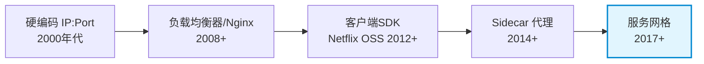
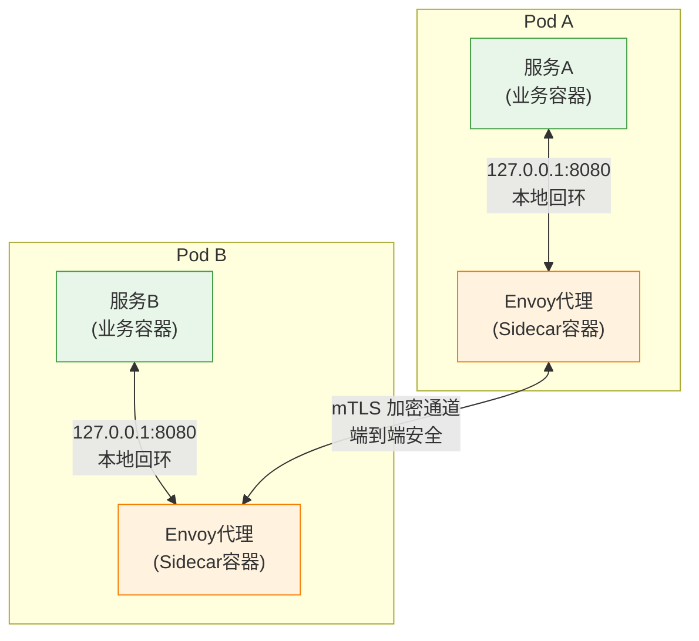
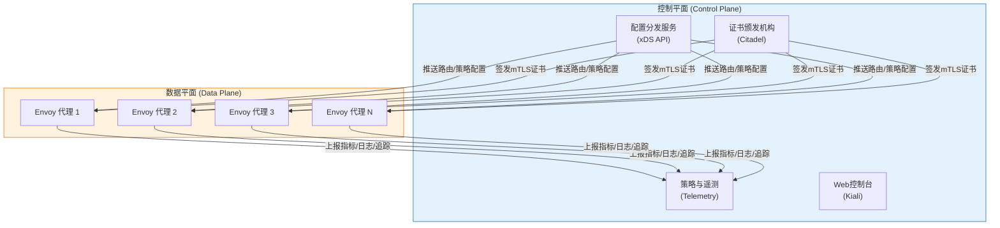
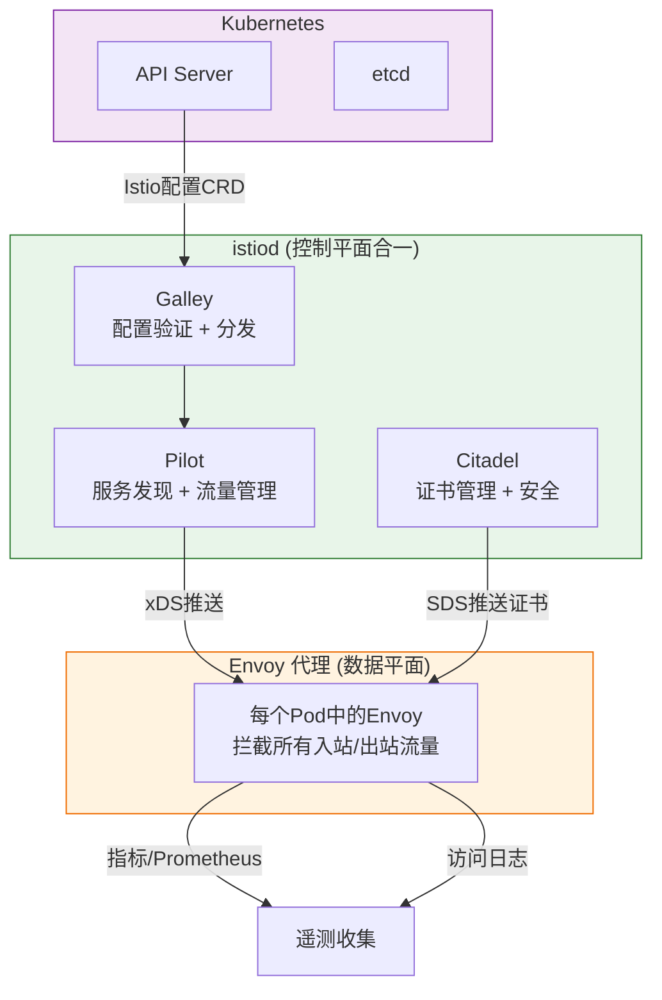
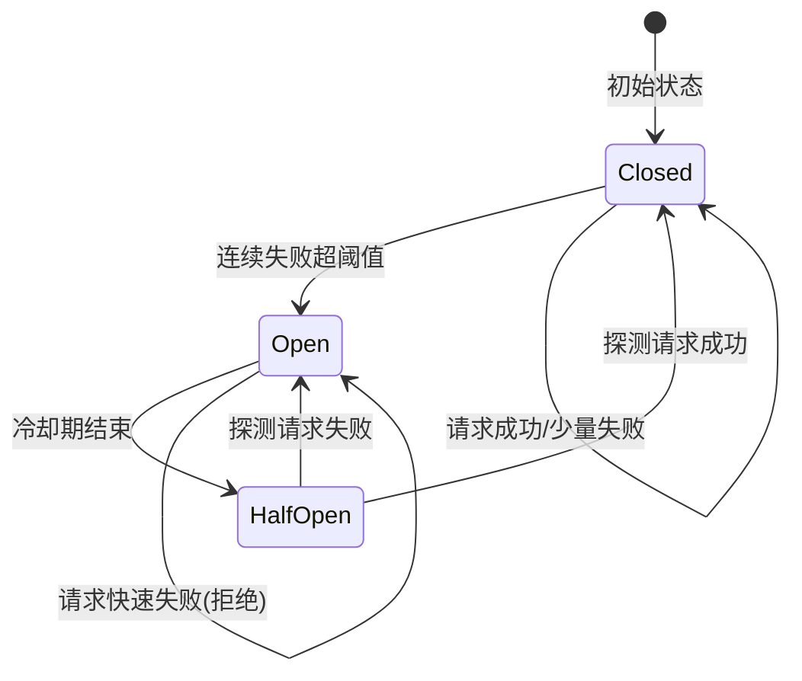
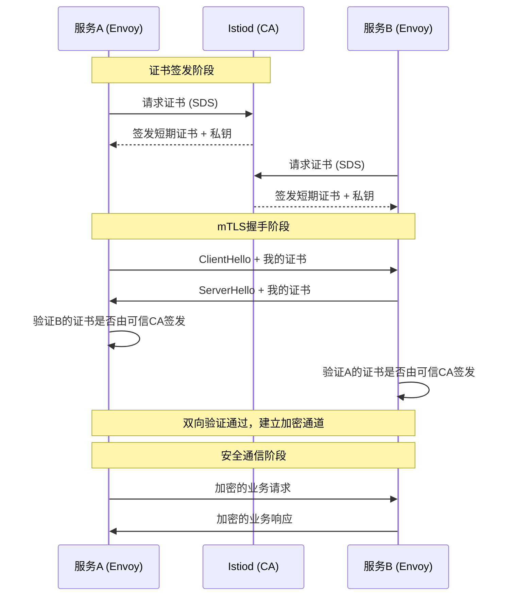
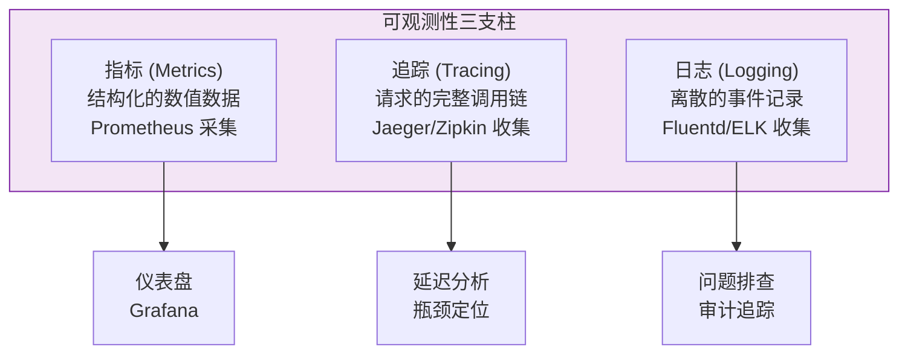
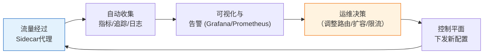

# 服务网格理论基础

服务网格（Service Mesh）是云原生架构中解决微服务间通信难题的核心基础设施层。它将服务发现、负载均衡、流量管理、安全通信、可观测性等横切关注点从应用代码中剥离，下沉到基础设施层统一处理。本节从理论根基出发，系统讲解服务网格的核心概念、架构原理和设计哲学，为后续的实操和工具章节奠定坚实基础。

---

## 一、服务网格的起源与定义

### 1.1 微服务通信的困境

在单体架构时代，函数调用是进程内的直接跳转，不涉及网络开销、序列化、服务发现等问题。而微服务化后，一次用户请求可能跨越数十个服务，每个服务之间的通信都面临一系列挑战：

| 挑战类别 | 具体问题 | 传统解决方式 |
|----------|----------|-------------|
| 服务发现 | 如何知道目标服务的IP和端口？ | 硬编码、DNS轮询、配置中心 |
| 负载均衡 | 如何在多个实例间均匀分配请求？ | Nginx、HAProxy、硬件LB |
| 流量控制 | 如何实现灰度发布、流量镜像、熔断降级？ | 客户端SDK（如Netflix Ribbon/Hystrix） |
| 安全通信 | 服务间如何加密通信、验证身份？ | 手动管理TLS证书、VPN |
| 可观测性 | 如何追踪跨服务调用链？ | Jaeger/SkyWalking埋点SDK |
| 弹性能力 | 超时、重试、限流如何统一实施？ | 各服务自行实现，标准不一 |

使用客户端SDK（如Netflix OSS套件）的方案将上述逻辑嵌入每个服务的进程内。这种方式存在三个根本性问题：

**第一，语言绑定。** 每种编程语言都需要独立的SDK实现。Netflix为Java构建了完善的微服务套件，但Go、Python、Node.js社区缺乏同等质量的替代品。在一个多语言技术栈的组织中，维护多套SDK的成本极高。

**第二，侵入性。** 服务开发者必须理解并正确使用SDK的API。重试策略配错了、熔断阈值设偏了、超时时间不合理——这些错误都会直接导致生产事故。业务逻辑和基础设施逻辑耦合在同一个代码库中，升级SDK版本可能引发兼容性问题。

**第三，缺乏统一策略。** 每个服务独立管理自己的通信策略，组织层面难以实施统一的安全策略、流量策略和可观测性标准。

### 1.2 服务网格的诞生

服务网格的核心思想是：**将服务间通信的复杂性从应用层剥离到基础设施层，通过代理（Proxy）拦截所有网络流量来统一处理。**

这个思想并非凭空而来，而是经历了明确的演进路径：



**2016年**，Buoyant公司的William Morgan在其论文《What's a service mesh? And why do I need one?》中首次定义了服务网格：

> "A service mesh is a dedicated infrastructure layer for handling service-to-service communication. It's responsible for the reliable delivery of requests through the complex topology of services that comprise a modern cloud-native application."

这个定义包含两个关键要素：
- **专用基础设施层**：不是应用代码，而是独立部署的系统组件
- **服务到服务的通信**：专注于东西向流量（East-West traffic），而非南北向流量（North-South traffic，即外部客户端到服务的流量）

### 1.3 服务网格的核心原则

| 原则 | 含义 | 解决的问题 |
|------|------|-----------|
| 应用透明 | 服务不知道代理的存在 | 无侵入，任何语言/框架均可接入 |
| 基础设施下沉 | 通信策略由运维而非开发实施 | 统一管理、策略一致性 |
| 可组合 | 功能按需启用 | 避免过度设计、渐进式采用 |
| 渐进式部署 | 可以逐步引入而非一步到位 | 降低迁移风险 |

---

## 二、Sidecar 模式

Sidecar（边车）模式是服务网格实现的技术基石。理解Sidecar模式，是理解整个服务网格架构的前提。

### 2.1 模式定义

Sidecar模式在每个服务实例旁边部署一个代理进程，该代理与服务实例运行在同一主机（或Pod）上，共享网络命名空间和存储。代理拦截进出服务的所有网络流量，在流量经过时透明地执行策略。

这个模式借用了摩托车侧车的形象——Sidecar就像摩托车旁边的边车，它本身不驱动摩托车前进，但为摩托车增加了额外的功能（载人、载货）。



### 2.2 工作机制

在Kubernetes环境中，Sidecar的注入方式和流量劫持机制如下：

**注入方式：**

- **手动注入**：使用 `kubectl inject` 命令在Pod创建时注入Sidecar容器定义
- **自动注入**：通过MutatingAdmissionWebhook，Kubernetes API Server在Pod创建时自动注入Sidecar容器。Istio的 `istio-injection=enabled` 命名空间标签触发此机制

**流量劫持（iptables方式）：**

Sidecar代理通过iptables规则拦截Pod的入站和出站流量：

```bash
# Istio的iptables规则简化示意
# 入站流量：拦截目标端口为8080的流量，重定向到Sidecar的15006端口
iptables -t nat -A ISTIO_IN_REDIRECT -p tcp --dport 8080 -j REDIRECT --to-port 15006

# 出站流量：拦截所有出站TCP流量，重定向到Sidecar的15001端口
iptables -t nat -A ISTIO_OUTPUT -p tcp -j REDIRECT --to-port 15001

# 排除Sidecar自身的流量（避免循环）
iptables -t nat -A ISTIO_OUTPUT -o lo -p tcp -d 127.0.0.6/32 -j ACCEPT
```

这意味着**应用完全无感知**——它仍然向 `127.0.0.1:8080` 发送请求，iptables在内核层面透明地将流量重定向给Sidecar。

### 2.3 Sidecar模式的优势

**语言无关性：** 无论服务用Java、Go、Python还是Rust编写，Sidecar都以相同方式处理通信。团队可以自由选择技术栈。

**关注点分离：** 开发者专注于业务逻辑，运维/SRE团队通过控制平面统一配置Sidecar行为（路由规则、安全策略、重试策略等），无需修改应用代码。

**独立升级：** Sidecar代理可以独立于应用升级。Envoy从1.20升级到1.24，不需要重新构建或部署业务容器。这在传统SDK方案中是不可能的。

**统一可观测性：** 所有经过Sidecar的流量都被自动收集指标、生成访问日志、注入追踪上下文。不需要在每个服务中手动集成可观测性SDK。

### 2.4 Sidecar模式的代价

Sidecar不是免费的午餐，它带来了明确的开销：

| 开销类型 | 具体影响 | 量化参考 |
|----------|---------|---------|
| 内存占用 | 每个Pod多一个代理容器 | Envoy基础占用约40-60MB内存 |
| CPU开销 | 代理处理每次请求的额外CPU周期 | 增加约1-3ms延迟（P99） |
| 启动时间 | Pod启动时需要同时启动Sidecar | 多出2-5秒的启动时间 |
| 复杂性 | 增加了故障点和调试难度 | 排查问题需要同时分析应用和代理日志 |
| 资源碎片 | 每个Pod的资源请求必须包含Sidecar | 小服务的Sidecar占比可能超过业务容器 |

这些代价在大规模微服务集群中尤为明显。一个有500个服务、每个服务10个副本的集群，意味着部署了5000个Sidecar代理，额外消耗约200-300GB内存。

---

## 三、数据平面与控制平面

服务网格的架构遵循经典的"数据平面-控制平面"（Data Plane / Control Plane）二分法，这是理解整个网格运作方式的核心框架。

### 3.1 数据平面（Data Plane）

数据平面由所有Sidecar代理组成，负责**实际的请求转发和策略执行**。每个Sidecar代理就是一个数据平面节点。

数据平面的核心职责：

1. **请求转发**：接收来自应用的请求，根据控制平面下发的路由规则将请求转发到正确的目标服务实例
2. **负载均衡**：在多个后端实例间分配请求，支持轮询、加权轮询、最少连接、一致性哈希等算法
3. **熔断保护**：当后端实例故障率超过阈值时，自动将其从负载均衡池中剔除
4. **重试与超时**：在请求失败时自动重试（带退避策略），超时后快速失败
5. **TLS终止**：处理服务间的mTLS加密和解密
6. **指标收集**：记录请求数、延迟、错误率等关键指标
7. **访问日志**：记录每个请求的详细信息，用于事后分析
8. **分布式追踪**：注入和传播追踪上下文（如W3C Trace Context）

### 3.2 控制平面（Control Plane）

控制平面不直接处理任何请求流量，而是**管理和配置所有数据平面代理**。它就像服务网格的"大脑"，负责收集信息、做出决策、下发配置。



### 3.3 xDS API——控制平面与数据平面的通信协议

Envoy代理通过xDS API与控制平面通信。xDS是一组标准化的发现服务（Discovery Service）API，定义了配置同步的协议：

| API | 全称 | 职责 |
|-----|------|------|
| LDS | Listener Discovery Service | 定义代理监听哪些端口、接受哪些协议 |
| RDS | Route Discovery Service | 定义路由规则：哪个请求去哪个服务 |
| CDS | Cluster Discovery Service | 定义后端服务集群：地址池、负载均衡策略、健康检查 |
| EDS | Endpoint Discovery Service | 定义集群中具体的实例地址（Pod IP + 端口） |
| SDS | Secret Discovery Service | 管理TLS证书和私钥的分发 |
| ADS | Aggregated Discovery Service | 聚合以上所有API到单一gRPC连接，保证配置变更的原子性 |

这种设计的精妙之处在于**关注点解耦**：路由规则（RDS）和服务发现（EDS）可以独立更新。当一个Pod被调度并获取IP时，只需更新EDS；当运维修改流量规则时，只需更新RDS。两者互不干扰。

### 3.4 配置推送的最终一致性

控制平面到数据平面的配置推送是**最终一致**的，而非强一致。这源于一个关键的架构决策：

- 强一致需要分布式共识协议（如Raft），增加延迟和复杂性
- 微服务通信对配置的短暂不一致有容忍度（秒级延迟可接受）
- Envoy支持配置的渐进式推送（通过ADS保证单次推送的原子性）

这意味着在控制平面推送新路由规则后，数据平面可能需要数秒才能生效。在灰度发布等场景中，这个延迟需要被纳入设计考量。

---

## 四、Istio 架构

Istio是目前最广泛部署的服务网格实现，由IBM、Google和Lyft于2017年联合发布，是CNCF毕业项目。理解Istio架构就是理解服务网格工业级实现的范本。

### 4.1 架构总览

Istio的架构分为两大部分：



早期Istio将Pilot、Citadel、Galley作为独立的Deployment部署。从1.5版本起，Istio将它们合并为**istiod**单一进程，大幅简化了部署和运维复杂度。

### 4.2 istiod 各组件职责

**Pilot（流量管理核心）：**

Pilot负责将用户定义的流量管理规则（VirtualService、DestinationRule等CRD）转化为Envoy可执行的配置，通过xDS API推送。

Pilot的核心抽象：
- **VirtualService**：定义流量路由规则——"来自A的请求如何到达B"
- **DestinationRule**：定义服务级别的策略——负载均衡算法、连接池大小、熔断阈值
- **Gateway**：定义南北向流量的入口/出口规则——类似Ingress但更强大
- **ServiceEntry**：将外部服务纳入网格管理——让网格内的服务也能被追踪和控制

**Citadel（安全核心）：**

Citadel负责服务间的身份认证和证书管理。它作为内部证书颁发机构（CA），为每个服务实例签发短期证书（默认24小时有效期），通过SDS API动态分发给Envoy代理，实现了零人工干预的mTLS证书轮转。

**Galley（配置管理核心）：**

Galley负责验证用户提交的Istio配置资源是否合法，将其规范化后存储，并在配置变更时通知Pilot。它还负责从底层平台（如Kubernetes）读取服务信息。

### 4.3 Istio 的流量管理核心概念

**VirtualService——流量路由规则：**

```yaml
# 按权重分流：90%到v1，10%到v2（灰度发布）
apiVersion: networking.istio.io/v1beta1
kind: VirtualService
metadata:
  name: reviews-route
spec:
  hosts:
  - reviews
  http:
  - route:
    - destination:
        host: reviews
        subset: v1
      weight: 90
    - destination:
        host: reviews
        subset: v2
      weight: 10
```

```yaml
# 按请求头匹配路由：特定用户走金丝雀版本
  http:
  - match:
    - headers:
        end-user:
          exact: "kyle"
    route:
    - destination:
        host: reviews
        subset: v2
  - route:
    - destination:
        host: reviews
        subset: v1
```

**DestinationRule——服务策略：**

```yaml
apiVersion: networking.istio.io/v1beta1
kind: DestinationRule
metadata:
  name: reviews-dr
spec:
  host: reviews
  trafficPolicy:
    loadBalancer:
      simple: LEAST_CONN    # 最少连接数算法
    connectionPool:
      tcp:
        maxConnections: 100
      http:
        h2UpgradePolicy: DEFAULT
        maxRequestsPerConnection: 10
    outlierDetection:       # 异常检测/熔断
      consecutive5xxErrors: 5
      interval: 30s
      baseEjectionTime: 60s
      maxEjectionPercent: 50
  subsets:
  - name: v1
    labels:
      version: v1
  - name: v2
    labels:
      version: v2
```

### 4.4 多集群与多网络部署

在生产环境中，服务网格通常需要跨多个Kubernetes集群工作。Istio支持多种拓扑：

| 拓扑模式 | 网络连通性 | 适用场景 |
|----------|-----------|---------|
| 主从集群（Primary-Remote） | 主集群运行控制平面，远程集群只运行数据平面 | 灾备、边缘部署 |
| 多主集群（Multi-Primary） | 每个集群运行独立控制平面，共享数据平面 | 多区域对等部署 |
| 单网络 vs 多网络 | 同一网络直接通信，跨网络通过网关通信 | 跨云、跨VPC部署 |

---

## 五、流量管理

流量管理是服务网格最核心的能力之一，也是Istio等网格相对于传统方案最大的差异化优势。

### 5.1 负载均衡

服务网格中的负载均衡发生在Sidecar代理层面，而非集中式负载均衡器层面。这带来了几个关键差异：

**客户端负载均衡 vs 服务端负载均衡：**

| 对比维度 | 集中式LB（Nginx） | Sidecar LB |
|----------|-------------------|------------|
| 延迟 | 增加一跳网络延迟 | 同Pod内通信，延迟极低 |
| 单点故障 | LB自身可能成为瓶颈 | 分布式，无单点 |
| 健康感知 | 需要额外健康检查配置 | 可直接访问服务发现信息 |
| 流量可观测 | 只能看到经过LB的流量 | 看到所有服务间流量 |

**负载均衡算法对比：**

| 算法 | 原理 | 适用场景 | 优劣 |
|------|------|---------|------|
| ROUND_ROBIN | 轮询分配 | 后端实例性能均等 | 简单高效，但不感知实例负载 |
| LEAST_CONN | 优先分配给连接数最少的实例 | 请求处理时间差异大 | 更均衡，但需要维护连接计数 |
| RANDOM | 随机选择 | 大规模集群（统计上趋于均匀） | 无状态，但可能短期不均 |
| CONSISTENT_HASH | 基于请求特征的一致性哈希 | 需要会话亲和性/缓存亲和 | 减少缓存失效，但可能热点不均 |

### 5.2 流量路由

服务网格的流量路由能力远超传统的DNS或负载均衡器路由：

**基于权重的流量分配（金丝雀发布）：**

这是灰度发布的基础能力。控制平面修改DestinationRule中的权重配置，数据平面秒级生效，无需重启任何服务。与传统金丝雀发布方案（如Kubernetes滚动更新 + 自定义脚本）相比，服务网格方案具备：

- 实时权重调整（秒级生效，非分钟级）
- 多维度分流（同时按权重+header+路径组合路由）
- 自动回滚能力（监控指标异常时自动将流量切回稳定版本）

**流量镜像（Traffic Mirroring / Shadowing）：**

流量镜像将生产流量的副本发送到新版本服务，同时原请求仍然返回给调用者。新版本服务的响应被丢弃，不会影响用户体验。这是在生产环境中测试新版本最安全的方式。

```yaml
apiVersion: networking.istio.io/v1beta1
kind: VirtualService
metadata:
  name: reviews-mirror
spec:
  hosts:
  - reviews
  http:
  - route:
    - destination:
        host: reviews
        subset: v1
    mirror:
      host: reviews
      subset: v2
    mirrorPercentage:
      value: 100.0   # 镜像100%的流量
```

### 5.3 弹性模式

服务网格提供的弹性能力是微服务高可用性的基石：

**超时（Timeout）：**

```yaml
# 为特定路由设置超时
apiVersion: networking.istio.io/v1beta1
kind: VirtualService
metadata:
  name: reviews-timeout
spec:
  hosts:
  - reviews
  http:
  - timeout: 3s        # 请求超时3秒
    route:
    - destination:
        host: reviews
```

超时设置需要考虑下游服务的实际响应时间分布。过短会导致正常请求被误杀，过长会让调用者长时间阻塞。建议基于P99延迟的1.5-2倍设置。

**重试（Retry）：**

```yaml
  http:
  - route:
    - destination:
        host: reviews
    retries:
      attempts: 3           # 最多重试3次
      perTryTimeout: 2s     # 每次重试超时2秒
      retryOn: "5xx,reset,connect-failure,retriable-4xx"
```

重试必须谨慎配置。不当的重试会引发**重试风暴**：当下游服务已经过载时，大量重试请求会进一步加重其负担，形成正反馈循环，导致整个系统雪崩。最佳实践包括：

- 设置重试预算（retry budget）：限制重试请求不超过总请求量的20%
- 使用退避策略（exponential backoff）
- 避免在非幂等操作上重试（如写操作）
- 设置 `retryOn` 条件，只在可重试的错误码上重试

**熔断（Circuit Breaking）：**

熔断器模式模拟了电路保险丝的行为：当下游服务故障率超过阈值时，"断开电路"，快速失败而非继续发送注定失败的请求。



Istio通过DestinationRule中的 `outlierDetection` 实现熔断：

```yaml
outlierDetection:
  consecutive5xxErrors: 5    # 连续5个5xx错误
  interval: 30s              # 检查间隔30秒
  baseEjectionTime: 60s      # 初始驱逐时间60秒
  maxEjectionPercent: 50     # 最多驱逐50%实例
  minHealthPercent: 30       # 健康实例低于30%时关闭熔断
```

### 5.4 入口流量管理（Gateway）

服务网格的Gateway资源用于管理南北向流量（外部客户端到网格内部）：

```yaml
apiVersion: networking.istio.io/v1beta1
kind: Gateway
metadata:
  name: my-gateway
spec:
  selector:
    istio: ingressgateway     # 绑定到Istio的Ingress网关Pod
  servers:
  - port:
      number: 443
      name: https
      protocol: HTTPS
    tls:
      mode: SIMPLE
      credentialName: my-tls-cert
    hosts:
    - "api.example.com"
---
apiVersion: networking.istio.io/v1beta1
kind: VirtualService
metadata:
  name: api-routes
spec:
  hosts:
  - "api.example.com"
  gateways:
  - my-gateway
  http:
  - match:
    - uri:
        prefix: /api/v2
    route:
    - destination:
        host: api-service
        subset: v2
  - route:
    - destination:
        host: api-service
        subset: v1
```

与Kubernetes原生Ingress相比，Istio Gateway支持更丰富的功能：TLS终止、基于路径/主机的路由、WebSocket支持、gRPC代理、请求改写等。

---

## 六、安全通信

安全通信是服务网格的核心价值之一，特别是零信任（Zero Trust）安全模型在微服务架构中的落地，离不开服务网格的支持。

### 6.1 零信任安全模型

传统的网络安全模型基于"城堡-护城河"假设：外网是不安全的，内网是安全的。但在微服务架构中，服务间通信可能被横向攻击（lateral movement），内部网络不再可信。

零信任模型的核心假设是**永远不信任，始终验证**：

| 传统模型 | 零信任模型 |
|----------|-----------|
| 信任内网流量 | 每次通信都验证身份 |
| 网络边界即安全边界 | 每个服务独立认证 |
| 一次性认证（登录时） | 持续认证（每次请求） |
| 基于IP/网络位置的访问控制 | 基于身份的访问控制 |

服务网格通过mTLS和细粒度授权策略，为微服务架构提供了零信任安全的基础设施能力。

### 6.2 双向TLS（mTLS）

mTLS（Mutual TLS）是服务网格安全通信的核心机制。与标准TLS（仅客户端验证服务端证书）不同，mTLS要求双方都出示并验证证书：



Istio的mTLS实现具有以下关键特性：

**短期证书：** 默认证书有效期24小时，由Citadel自动签发和轮转。短期证书大幅缩小了证书泄露的攻击窗口——即使证书被盗，24小时后即失效。

**自动轮转：** 证书到期前自动通过SDS API分发新证书，整个过程无需人工干预或服务重启。

**SPIFFE身份：** 每个服务的证书中嵌入SPIFFE ID（如 `spiffe://cluster.local/ns/default/sa/reviews`），作为服务的加密身份。SPIFFE（Secure Production Identity Framework for Everyone）是一个标准化的微服务身份框架。

**PeerAuthentication策略：**

```yaml
# 全网格启用mTLS
apiVersion: security.istio.io/v1beta1
kind: PeerAuthentication
metadata:
  name: default
  namespace: istio-system
spec:
  mtls:
    mode: STRICT    # 强制mTLS，拒绝明文通信
---
# 特定命名空间降级为PERMISSIVE（允许明文和mTLS共存）
apiVersion: security.istio.io/v1beta1
kind: PeerAuthentication
metadata:
  name: legacy-ns
  namespace: legacy
spec:
  mtls:
    mode: PERMISSIVE   # 过渡期使用
```

三种mTLS模式对比：

| 模式 | 行为 | 适用场景 |
|------|------|---------|
| STRICT | 只接受mTLS连接，拒绝明文 | 已完成mTLS全覆盖的生产环境 |
| PERMISSIVE | 同时接受mTLS和明文 | 迁移过渡期 |
| DISABLE | 不使用mTLS | 纯内部开发环境 |

### 6.3 授权策略（AuthorizationPolicy）

Istio的AuthorizationPolicy提供了基于身份的细粒度访问控制，替代了传统的基于网络策略（NetworkPolicy）的控制方式：

```yaml
# 只允许reviews服务的前端组件访问reviews的v2版本
apiVersion: security.istio.io/v1beta1
kind: AuthorizationPolicy
metadata:
  name: reviews-viewer
  namespace: bookinfo
spec:
  selector:
    matchLabels:
      app: reviews
  action: ALLOW
  rules:
  - from:
    - source:
        principals: ["cluster.local/ns/bookinfo/sa/productpage"]
    to:
    - operation:
        paths: ["/reviews/*"]
        methods: ["GET"]
```

```yaml
# 默认拒绝所有入站流量（零信任基线）
apiVersion: security.istio.io/v1beta1
kind: AuthorizationPolicy
metadata:
  name: deny-all
  namespace: bookinfo
spec:
  {}    # 空规则 = 拒绝所有
```

授权策略支持的匹配维度：

| 维度 | 字段 | 示例 |
|------|------|------|
| 源身份 | `source.principals` | SPIFFE ID |
| 源命名空间 | `source.namespaces` | `production` |
| 目标端口 | `to.ports` | `8080` |
| 请求路径 | `to.operation.paths` | `/api/v1/*` |
| HTTP方法 | `to.operation.methods` | `GET`, `POST` |
| 请求头 | `when.request.headers` | `Authorization: Bearer ...` |

### 6.4 JWT认证

Istio支持通过RequestAuthentication和AuthorizationPolicy组合实现JWT（JSON Web Token）认证：

```yaml
# 验证JWT令牌的有效性
apiVersion: security.istio.io/v1beta1
kind: RequestAuthentication
metadata:
  name: jwt-auth
spec:
  selector:
    matchLabels:
      app: my-service
  jwtRules:
  - issuer: "https://auth.example.com"
    jwksUri: "https://auth.example.com/.well-known/jwks.json"
    audiences:
    - "my-api"
    forwardOriginalToken: true
```

---

## 七、可观测性

可观测性（Observability）是服务网格的第三大支柱能力（前两大为流量管理和安全）。通过Sidecar代理自动收集遥测数据，服务网格极大降低了微服务系统的可观测性门槛。

### 7.1 三大可观测性支柱



**指标（Metrics）：**

Sidecar代理自动采集四大黄金指标（由Google SRE提出）：

| 指标 | 含义 | Istio默认指标名 |
|------|------|----------------|
| 请求数（Rate） | 单位时间内的请求量 | `istio_requests_total` |
| 延迟（Latency） | 请求处理时间分布 | `istio_request_duration_milliseconds_bucket` |
| 错误率（Errors） | 失败请求占比 | 基于 `istio_requests_total` 的 `response_code` 标签过滤 |
| 饱和度（Saturation） | 资源使用率 | 连接数 `istio_tcp_connections_opened_total` |

Istio生成的指标自动包含丰富的标签维度：源服务、目标服务、请求方法、响应码、协议版本等。这些标签使得从多维度分析系统行为成为可能。

**分布式追踪（Distributed Tracing）：**

服务网格的Sidecar自动为每个请求生成追踪Span，注入追踪上下文到请求头中。下游服务的Sidecar接收到请求后自动创建子Span，无需应用代码修改。

支持的追踪协议：
- **Zipkin**：最早的服务追踪系统，使用B3传播格式
- **Jaeger**：CNCF项目，支持OpenTracing和OpenTelemetry
- **OpenTelemetry**：统一的可观测性标准，支持metrics+tracing+logs三合一

**访问日志（Access Logging）：**

Sidecar代理自动生成结构化的访问日志，包含请求时间、源/目标服务、请求方法、路径、响应码、延迟等信息。在Istio中可以通过Telemetry资源控制日志格式和输出目标。

### 7.2 可观测性与策略的闭环

可观测性数据不仅是被动的监控工具，更是主动策略调整的依据。服务网格形成了一个完整的闭环：



例如：当Grafana仪表盘显示某服务的P99延迟从200ms飙升到2s时，运维可以通过调整VirtualService权重将更多流量切到健康的实例，或者通过调整DestinationRule的outlierDetection参数更积极地熔断故障实例。整个过程无需修改任何应用代码。

---

## 八、主流服务网格方案对比

理解不同服务网格方案的设计哲学和实现差异，有助于根据实际场景做出正确的技术选型。

### 8.1 Istio vs Linkerd vs Consul Connect

| 对比维度 | Istio | Linkerd | Consul Connect |
|----------|-------|---------|----------------|
| 数据平面代理 | Envoy（C++） | linkerd2-proxy（Rust） | Envoy（C++）或内置代理 |
| 控制平面语言 | Go | Go | Go |
| 复杂度 | 高（功能丰富，学习曲线陡） | 低（设计简洁，聚焦核心功能） | 中（与Consul生态深度集成） |
| 资源占用 | 较高（Envoy约40-60MB） | 极低（Rust代理约10-15MB） | 中等 |
| 安全特性 | mTLS + AuthorizationPolicy + JWT | mTLS + Server端认证 | mTLS + ACL + intentions |
| 多集群支持 | 成熟（多主/主从拓扑） | 成熟（多集群共享控制平面） | 成熟（Consul多数据中心） |
| 可观测性 | 内置Prometheus + Kiali + Jaeger | 内置Prometheus + Grafana | 集成Prometheus |
| 平台依赖 | 主要Kubernetes | 主要Kubernetes | Kubernetes + VM + Nomad |
| 适用场景 | 大规模复杂微服务架构 | 中小规模追求简单高效 | 混合环境（K8s + VM） |

### 8.2 Envoy Proxy 设计哲学

Envoy是Istio的数据平面核心，也是CNCF毕业项目。理解Envoy的设计哲学对理解服务网格至关重要：

**事件驱动架构：** Envoy基于libevent实现非阻塞I/O，单进程支持数万并发连接。每个连接的处理是异步的，避免了线程模型的复杂性。

**L4/L7双层处理：** Envoy在L4层（TCP）处理连接管理、TLS终止、TCP流量镜像；在L7层（HTTP/gRPC）处理路由匹配、头部改写、故障注入、重试等高级功能。

**可扩展性：** 通过Wasm（WebAssembly）插件，用户可以在不修改Envoy源码的情况下扩展其功能。例如，自定义的认证逻辑、协议转换、流量标记等都可以通过Wasm实现。

---

## 九、服务网格的适用场景与局限性

### 9.1 适合使用服务网格的场景

| 场景 | 网格价值 |
|------|---------|
| 微服务数量超过20个 | 统一管理通信策略，避免"SDK地狱" |
| 多语言技术栈 | Sidecar对应用透明，语言无关 |
| 需要金丝雀发布/流量镜像 | 精细化流量控制能力 |
| 合规要求服务间加密 | mTLS自动加密，零人工维护 |
| 跨团队/跨组织的服务协作 | 统一策略执行，不依赖各团队自行实现 |
| 混合云/多集群部署 | 统一的安全和流量管理视图 |

### 9.2 不适合使用服务网格的场景

| 场景 | 原因 |
|------|------|
| 服务数量少于10个 | 运维复杂度收益不足以覆盖引入网格的成本 |
| 单体架构或简单分层架构 | 没有足够的服务间通信需求 |
| 延迟极其敏感（<1ms要求） | Sidecar的额外延迟可能不可接受 |
| 团队规模小、运维能力有限 | 服务网格本身需要专业运维能力 |
| 服务间通信模式简单 | 点对点通信用DNS + 负载均衡器即可满足 |
| 无容器化/非Kubernetes环境 | 大部分服务网格对Kubernetes有强依赖 |

### 9.3 渐进式采用策略

对于大多数组织，推荐采用渐进式引入服务网格的策略：

**阶段一：可观测性优先。** 先启用Sidecar代理的指标采集和分布式追踪能力，不做任何流量或安全策略变更。这样可以在不影响现有系统的前提下，获得服务间通信的完整视图。

**阶段二：安全加固。** 启用mTLS（先PERMISSIVE模式，再STRICT模式），实现服务间身份认证和加密通信。这一步通常对应用完全透明，风险较低。

**阶段三：流量管理。** 引入金丝雀发布、故障注入、重试超时等流量管理能力。这一步需要修改VirtualService和DestinationRule配置，需要充分测试。

**阶段四：全面策略。** 部署AuthorizationPolicy，实施细粒度的服务间访问控制。这一步影响最大，建议逐步收紧，避免因策略配置错误导致服务不可用。

---

## 十、服务网格的性能优化

### 10.1 代理资源调优

默认的Sidecar资源配置可能不适合所有场景。以下是关键调优参数：

```yaml
# 通过注解调整Sidecar资源配置
apiVersion: v1
kind: Pod
metadata:
  annotations:
    # CPU限制（毫核）
    proxy.istio.io/config: |
      concurrency: 4              # Worker线程数，匹配CPU核数
      proxyStatsMatcher:
        inclusionRegexps:
        - ".*"                    # 采集所有指标（默认只采集一部分）
```

**关键资源参数：**

| 参数 | 默认值 | 调优建议 |
|------|--------|---------|
| requests.cpu | 100m | 根据QPS计算：约1m per 100 QPS |
| requests.memory | 128MB | 高流量场景可能需要256MB+ |
| concurrency | 2 | 匹配Pod的CPU limit |
| holdApplicationUntilProxyStarts | false | 设为true确保Sidecar就绪后再启动应用 |

### 10.2 避免常见的性能陷阱

**不必要的L7策略：** 如果只需要L4层的mTLS和基本负载均衡，可以避免配置VirtualService等L7策略。L7处理的开销高于L4。

**过度的header匹配：** 基于大量HTTP header的路由匹配规则会增加每次请求的处理时间。尽量减少match规则的数量和复杂度。

**过多的分布式追踪采样：** 100%追踪采样在高流量场景下会产生巨大的存储和网络开销。生产环境通常使用5-10%的采样率，配合尾部采样（tail-based sampling）只保留异常请求的完整追踪。

---

## 本节小结

服务网格通过Sidecar代理模式，将微服务间的通信复杂性从应用层下沉到基础设施层。其核心价值体现在三个维度：

1. **流量管理**：精细化的流量路由、负载均衡、弹性能力，无需修改应用代码
2. **安全通信**：自动化的mTLS证书管理和细粒度授权策略，实现零信任安全
3. **可观测性**：统一的指标、追踪、日志采集，获得服务间通信的完整视图

理解这些理论基础，是掌握服务网格实操能力的前提。在后续章节中，我们将深入Istio的安装部署、配置调优和生产实践。
