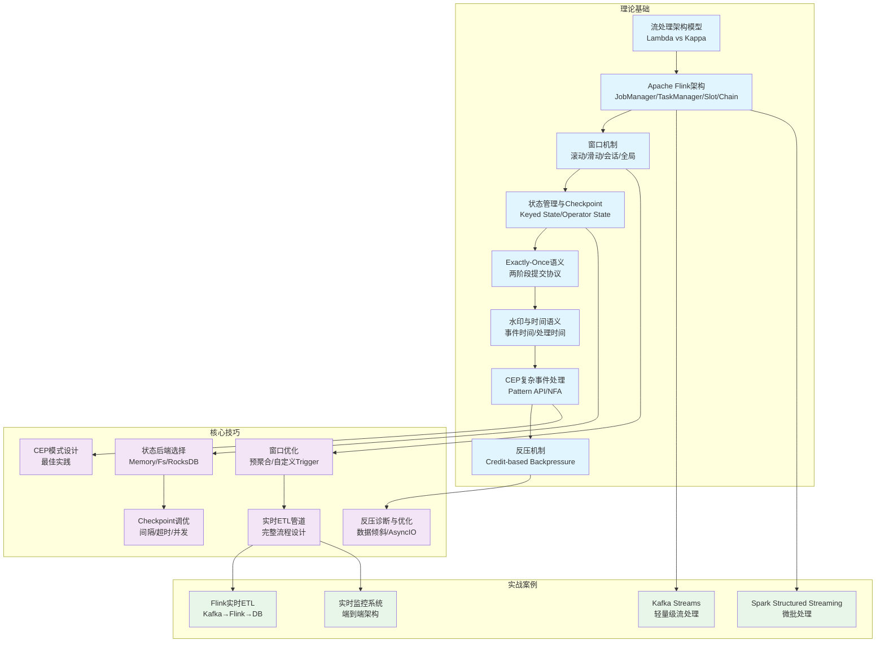

## 章节概览：实时计算——流式数据处理的架构与实践

### 1. 为什么需要实时计算

在传统的批处理模式下，数据从产生到被处理往往需要经历数小时甚至数天的延迟。Hadoop MapReduce 以"小时级"为处理单位，Spark Batch 也将延迟压缩到了"分钟级"。但对于实时推荐、欺诈检测、运维监控、物联网告警等场景，分钟级的延迟意味着：用户已经流失、资金已经损失、设备已经损坏。

实时计算的核心使命，是将数据处理延迟从"小时/分钟"压缩到"秒/毫秒"级别，让系统能够在数据产生的瞬间就做出反应。

#### 1.1 批处理与流处理的本质区别

| 维度 | 批处理（Batch） | 流处理（Stream） |
|------|-----------------|------------------|
| 数据模型 | 有界数据集（Bounded） | 无界数据集（Unbounded） |
| 处理触发 | 人工/定时调度 | 数据到达即处理 |
| 延迟 | 分钟～小时 | 毫秒～秒 |
| 吞吐量 | 高（批量IO优化） | 中～高（受反压影响） |
| 典型引擎 | Hadoop MR, Spark Batch | Flink, Kafka Streams, Spark Streaming |
| 适用场景 | 报表、数据仓库ETL | 实时监控、实时推荐、CEP |

#### 1.2 实时计算的技术演进

实时计算经历了三个主要阶段：

**第一阶段：单机流处理（2007-2010）**。Apache Storm（2011）是第一个广泛使用的分布式流处理引擎，采用"逐条处理"模型，但不支持状态管理和Exactly-Once语义，容错能力弱。Twitter的实时分析系统最早基于Storm构建。

**第二阶段：微批处理（2010-2014）**。Spark Streaming（2013）引入了微批（Micro-batch）模型——将连续的流数据切分成小的时间窗口（默认1秒），以批处理的方式处理每个窗口。这种设计复用了Spark Batch的成熟基础设施，但牺牲了真正的低延迟（最小延迟约为一个微批的时间间隔）。

**第三阶段：真正的流处理（2014至今）**。Apache Flink（2014）回归了"逐条处理"的设计理念，同时通过分布式快照算法实现了高吞吐和Exactly-Once语义。Flink已经成为当前最主流的流处理引擎，在阿里巴巴、字节跳动、Netflix等公司的大规模生产环境中运行。

### 2. 本章知识地图

本章从架构到实践，系统性地覆盖实时计算的核心知识体系。以下是完整的学习路径：

### 3. 流处理架构模型：Lambda 与 Kappa

实时计算的架构设计需要在延迟、准确性和复杂度之间做出权衡。两种经典架构代表了两种不同的设计哲学：

**Lambda架构**（Nathan Marz提出）采用双路径设计：
- **批处理层**：对全量历史数据离线计算，保证结果准确性
- **速度层**：对实时数据流近实时计算，保证低延迟
- **服务层**：合并两层结果，对外提供查询

核心思想是"用批处理的准确性弥补流处理的近似性"。优势是容错性强、准确性高；劣势是需要维护两套代码，结果合并增加复杂度。

**Kappa架构**（Jay Kreps提出）采用纯流处理设计：
- 只保留流处理路径，移除批处理层
- 需要重新计算时，通过重放消息系统的历史消息实现
- 假设消息系统（如Kafka）能长期保留历史数据

核心思想是"用流处理解决一切问题"。优势是系统简单、一致性好；劣势是对消息系统要求高、大规模重放效率低。

**架构选型建议**：如果团队技术栈统一、消息系统可靠，优先选择Kappa；如果已有成熟的批处理基础设施，或需要批处理做兜底校验，选择Lambda。

### 4. Apache Flink：当前最主流的流处理引擎

Flink 的核心优势在于三个"真正的"：

**真正的流处理**：数据逐条（Record-at-a-time）处理，而非微批。延迟可低至毫秒级。

**真正的时间语义**：原生支持事件时间（Event Time），通过水印机制处理乱序数据，保证结果的确定性和可重现性。

**真正的容错**：通过基于Chandy-Lamport算法的分布式快照，在不影响吞吐量的前提下实现Exactly-Once语义。

#### Flink架构核心组件

                        ┌─────────────────────┐
                        │     JobManager       │
                        │ ┌─────────────────┐  │
                        │ │ ResourceManager  │  │ ← 资源分配与回收
                        │ ├─────────────────┤  │
                        │ │   Dispatcher    │  │ ← REST API入口
                        │ ├─────────────────┤  │
                        │ │   JobMaster     │  │ ← 单作业生命周期管理
                        │ └─────────────────┘  │
                        └──────────┬──────────┘
                                   │
              ┌────────────────────┼────────────────────┐
              │                    │                     │
     ┌────────▼────────┐ ┌────────▼────────┐  ┌────────▼────────┐
     │  TaskManager 1  │ │  TaskManager 2  │  │  TaskManager N  │
     │ ┌──────┐┌──────┐│ │ ┌──────┐┌──────┐│  │ ┌──────┐┌──────┐│
     │ │Slot 1││Slot 2││ │ │Slot 1││Slot 2││  │ │Slot 1││Slot 2││
     │ └──────┘└──────┘│ │ └──────┘└──────┘│  │ └──────┘└──────┘│
     └─────────────────┘ └─────────────────┘  └─────────────────┘
              │                    │                     │
              └────────────────────┼────────────────────┘
                                   │
                        ┌──────────▼──────────┐
                        │   State Backend     │
                        │ (RocksDB / Heap)    │
                        └─────────────────────┘

**Operator Chain优化**：当两个算子之间的数据传输在同一TaskManager内时，Flink会将它们链接在一起，避免序列化/反序列化和网络传输开销。Chain中的算子在同一线程中执行，数据通过方法调用传递，效率极高。

### 5. 核心技术模块速览

#### 5.1 窗口机制：处理无界数据的核心抽象

窗口将无限的数据流划分为有限的数据块进行计算：

| 窗口类型 | 特点 | 典型场景 |
|----------|------|----------|
| 滚动窗口（Tumbling） | 固定大小、不重叠 | 每分钟PV/UV统计 |
| 滑动窗口（Sliding） | 固定大小、允许重叠 | 最近5分钟移动平均 |
| 会话窗口（Session） | 动态大小、按活跃度划分 | 用户行为会话分析 |
| 全局窗口（Global） | 不自动关闭、需自定义Trigger | 按计数触发的聚合 |

**关键权衡**：窗口越小 → 结果越实时但计算开销越大；滑动步长越小 → 重叠越多但计算量成倍增长。

#### 5.2 状态管理与Checkpoint：容错的基石

**状态类型**：
- **Keyed State**：与Key关联，每个Key独立副本（ValueState / ListState / MapState）
- **Operator State**：与算子实例关联，如Kafka Source的消费偏移量

**State Backend选型**：

| 后端 | 存储位置 | 状态上限 | 适用场景 |
|------|----------|----------|----------|
| MemoryStateBackend | JVM堆内存 | 5MB | 开发测试 |
| FsStateBackend | 内存 + 文件系统 | GB级 | 中等状态 |
| RocksDBStateBackend | 本地RocksDB | TB级 | 超大状态 |

**Checkpoint机制**：通过Chandy-Lamport分布式快照算法，定期将整个数据流图的状态一致性地保存到外部存储。当任务失败时，从最近一次成功的Checkpoint恢复，实现Exactly-Once语义。

#### 5.3 Exactly-Once语义：端到端的一致性保证

端到端的Exactly-Once需要三个环节协同：

Source (Kafka)          Processing (Flink)          Sink (Kafka)
┌──────────────┐     ┌──────────────────┐     ┌──────────────────┐
│ 消费位点保存  │────▶│ Checkpoint对齐    │────▶│ 两阶段提交        │
│ 在Checkpoint │     │ 状态快照          │     │ 预提交→确认/回滚  │
│ 中           │     │ Barrier传播       │     │                  │
└──────────────┘     └──────────────────┘     └──────────────────┘

**关键理解**：Exactly-Once不是"数据只被处理一次"，而是"数据对结果的影响恰好一次"。即使数据被重试处理多次，对外部系统的效果与只处理一次相同。

#### 5.4 水印与时间语义：处理乱序数据

**核心问题**：数据在网络传输中可能乱序到达，处理时间 ≠ 事件时间。

**水印（Watermark）**：表示"时间戳小于水印值的事件已经全部到达"。当水印到达窗口边界时，触发窗口计算。

**设计权衡**：
- 水印延迟太小 → 可能遗漏迟到数据
- 水印延迟太大 → 窗口触发延迟增加
- 解决方案：允许迟到（Allowed Lateness）+ 侧输出（Side Output）兜底

#### 5.5 CEP复杂事件处理：模式检测

从事件流中检测特定模式序列，底层基于NFA（非确定性有限自动机）实现。

**典型应用**：
- 金融欺诈：同一卡短时间不同城市消费
- 网络安全：DDoS攻击、暴力破解检测
- IoT监控：设备异常运行模式识别

#### 5.6 反压机制：流量波动下的稳定器

当下游处理速度跟不上上游数据产生速度时，Flink通过基于信用（Credit）的反压机制向上游传播压力，防止内存溢出。

**反压根因**：数据倾斜、算子处理慢、Checkpoint开销大、序列化开销大。

### 6. 本章结构与学习路径

| 小节 | 主题 | 核心内容 | 学习目标 |
|------|------|----------|----------|
| 01-04 | 理论基础 | 架构模型、Flink架构、窗口、状态、Exactly-Once、水印、CEP、反压 | 理解实时计算的完整知识体系 |
| 05-08 | 核心技巧 | 窗口优化、状态后端、Checkpoint调优、反压诊断、CEP设计、ETL管道 | 掌握工程实践中的关键技巧 |
| 09-10 | 实战案例 | Flink ETL、Kafka Streams、Structured Streaming、实时监控 | 能独立构建实时计算系统 |
| 11 | 常见误区 | 水印设置、状态膨胀、Checkpoint失败、窗口语义混淆 | 避开典型陷阱 |
| 12 | 练习方法 | 环境搭建、窗口实验、状态管理实验、CEP匹配、反压模拟 | 动手实践巩固知识 |
| 13 | 本章小结 | 核心回顾、选型框架、延伸阅读 | 建立全局视野 |

### 7. 读者定位与前置知识

**适合谁读**：
- 有Java/Python编程基础的后端开发
- 了解Kafka等消息系统基础概念
- 对数据处理有一定经验（至少用过一种数据管道）

**建议学习顺序**：
1. 先通读理论基础（59.1-59.8），建立完整的概念框架
2. 再学习核心技巧（59.9-59.14），掌握工程实践要点
3. 通过实战案例动手操作，加深理解
4. 查阅常见误区，避免踩坑
5. 完成练习方法中的实验，巩固所学

**关键学习建议**：实时计算是一个高度实践性的领域。只看理论不写代码，很难真正掌握水印、状态管理、Checkpoint等核心概念。建议读者在学习每个技术点时，都在本地Flink环境中跑一遍示例代码，观察实际的运行效果。
