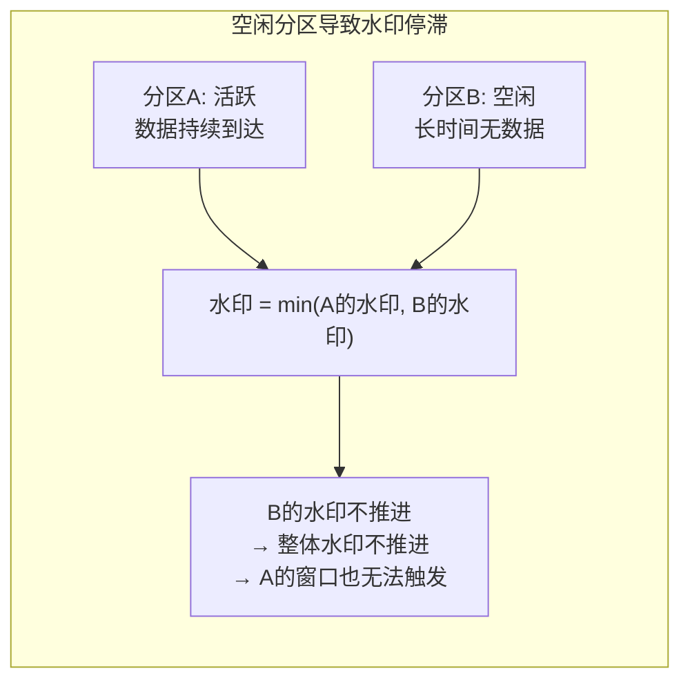
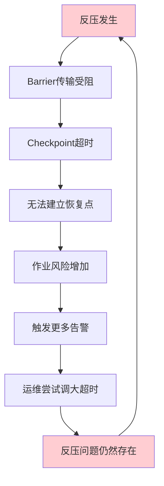

# 第59章 实时计算 常见误区

***

## 59.19 误区全景：为什么实时计算容易踩坑

流处理与批处理在思维模型上有本质差异。批处理面对的是有限数据集——数据全部到位后一次性计算，结果确定且可重现。流处理面对的是无界数据流——数据持续到达，计算必须在"数据还没到齐"的假设下持续产出结果。这种根本性的差异决定了流处理的每一个环节都存在陷阱。

**流处理误区的三大特征**：

| 特征 | 说明 | 举例 |
|------|------|------|
| 隐蔽性 | 错误不会立即暴露，可能在数据量增大或流量波动时才显现 | 水印延迟设置过大，小流量时表现正常，大流量时窗口触发严重滞后 |
| 级联性 | 一个环节的错误会向下游传播，导致整条链路结果错误 | 水印设置不当 → 窗口触发时机错误 → 聚合结果不完整 → 下游报表数据不准 |
| 不可逆性 | 一旦产出错误结果并被下游消费，很难回滚和修正 | 实时推荐系统基于错误的用户行为统计给出推荐，影响已经产生 |

本节系统梳理实时计算中的八大误区类别，每个误区都包含**错误表现、根因分析、正确做法和诊断方法**，帮助读者建立"防坑地图"。

**误区全景图**：

```text
实时计算常见误区全景
├── 1. 水印设置不当 ──────────── 数据丢失/延迟增加
│   ├── 水印延迟过小
│   ├── 未处理迟到数据
│   ├── 全局统一水印策略
│   └── 空闲分区问题
├── 2. 状态膨胀 ──────────────── 性能下降/作业崩溃
│   ├── 未设置State TTL
│   ├── 窗口状态未清理
│   ├── 序列化效率低
│   └── 缺少监控告警
├── 3. Checkpoint失败 ─────────── 数据积压/无法恢复
│   ├── 超时设置过短
│   ├── Checkpoint期间背压
│   ├── 同步Checkpoint阻塞
│   └── 外部化策略配置错误
├── 4. 窗口语义混淆 ──────────── 计算结果错误
│   ├── 事件时间vs处理时间混淆
│   ├── 滚动vs滑动语义差异
│   ├── 聚合输出语义不理解
│   └── 忽略Early Trigger
├── 5. 反压处理不当 ──────────── 系统不稳定
│   ├── 增大缓冲区掩盖问题
│   ├── 忽略数据倾斜
│   ├── 盲目增加并行度
│   └── 未使用异步IO
├── 6. Exactly-Once误解 ──────── 一致性保证失效
│   ├── 误解为"只处理一次"
│   ├── 忽略Sink端配合
│   ├── 未考虑性能代价
│   └── 偏移量提交策略错误
├── 7. 资源配置与部署 ────────── 启动失败/资源浪费
│   ├── TaskManager内存配置不当
│   ├── Slot共享组配置错误
│   ├── 数据本地性差
│   └── Kubernetes资源限制不合理
└── 8. 测试与监控 ────────────── 生产环境才暴露问题
    ├── 测试数据量不足
    ├── 未模拟乱序数据
    ├── 监控指标不全
    └── 未规划Schema演进
```

***

## 59.20 水印设置不当导致数据丢失

水印（Watermark）的设置是流处理中最容易出错的地方之一。水印推进过快会导致迟到数据被忽略，窗口结果不完整；水印推进过慢会增加窗口触发的延迟，影响实时性。水印的本质是回答一个核心问题："什么时候可以认为某个时间窗口的数据已经全部到齐？"——这个问题回答错了，整个时间语义体系就崩塌了。

### 59.20.1 误区一：水印延迟设置过小

如果将水印延迟设置为0，意味着假设数据完全按顺序到达，任何乱序数据都会被当作迟到数据处理。在分布式系统中，数据乱序是常态——不同分区的写入时间不同，网络传输时间不同，客户端缓存和批量上传都可能导致数据乱序到达。

**乱序的常见来源**：

| 乱序来源 | 典型延迟 | 场景说明 |
|----------|---------|---------|
| 移动端离线缓存 | 秒级到分钟级 | 用户在地铁中操作App，联网后批量上传 |
| 多级消息队列 | 百毫秒到秒级 | 数据经过Kafka多级转发，各partition消费速度不同 |
| 跨机房传输 | 毫秒到秒级 | 异地机房数据汇聚，网络延迟导致乱序 |
| 日志收集Agent | 秒级到分钟级 | Filebeat/Fluentd批量收集后批量发送 |
| 数据库CDC | 秒级 | Debezium读取binlog，网络抖动导致延迟 |
| 边缘设备批量上报 | 分钟级 | IoT设备在网络恢复后批量上传缓存数据 |

**水印延迟的设置原则**：根据数据的实际乱序程度来设置，通常在几秒到几分钟之间。设置过小会导致迟到数据丢失，设置过大会增加窗口触发延迟。实践中建议通过离线分析历史数据的乱序分布来确定——统计P95/P99乱序延迟，将水印延迟设置在P99以上。

**如何测量乱序程度**：从Kafka中采样一段时间的数据，按事件时间排序后计算每个事件与其实际到达顺序的偏差。具体步骤：

1. 从Kafka消费一批数据，记录`event_time`和`ingest_time`（数据到达时间）
2. 按`event_time`排序后，计算每个事件的乱序延迟 = `ingest_time - max(ingest_time of all events with smaller event_time)`
3. 统计延迟分布的P95和P99分位值
4. 水印延迟设置为P99值（确保99%的乱序数据不会丢失）

### 59.20.2 误区二：没有处理迟到数据

即使设置了合理的水印延迟，仍然可能有少量数据超过延迟到达（比如网络分区恢复后的突发数据）。如果不对这些迟到数据进行处理，计算结果可能不完整。Flink提供了两层保护机制：

**第一层：Allowed Lateness**——窗口触发后的一段时间内仍然接受迟到数据并更新结果。这相当于给了迟到数据一个"宽限期"。

**第二层：Side Output**——超过Allowed Lateness的数据输出到单独的流中，进行后续补偿处理。这是兜底机制，确保极端迟到的数据不丢失。

```python
# 正确的水印和迟到数据处理
from pyflink.datastream.window import TumblingEventTimeWindows

# 设置合理的水印延迟（允许5秒乱序）
watermark_strategy = WatermarkStrategy \
    .for_bounded_out_of_orderness(Duration.of_seconds(5))

# 配置Allowed Lateness（窗口触发后仍接受迟到数据1分钟）
late_output_tag = OutputTag("late-data")

windowed_stream = stream \
    .key_by(lambda e: e["user_id"]) \
    .window(TumblingEventTimeWindows.of(Time.minutes(1))) \
    .allowed_lateness(Time.minutes(1)) \
    .side_output_late_data(late_output_tag) \
    .aggregate(MyAggregator())

# 处理迟到数据
late_data_stream = windowed_stream.get_side_output(late_output_tag)
late_data_stream.add_sink(LateDataSink())  # 单独处理迟到数据
```

**Allowed Lateness的权衡**：设置过长会导致窗口状态长时间不释放，增加内存消耗；设置过短会导致迟到数据来不及处理就被丢弃。实践中建议Allowed Lateness设置为水印延迟的2-5倍，并根据业务对数据完整性的要求来调整。

**迟到数据的处理策略选择**：

| 策略 | 适用场景 | 实现方式 | 优缺点 |
|------|---------|---------|--------|
| 丢弃 | 不要求100%精确（如实时监控） | 不配置Allowed Lateness | 简单但数据不完整 |
| 更新结果 | 需要精确统计（如计费） | Allowed Lateness + 更新聚合 | 结果准确但状态不释放 |
| 侧输出补偿 | 极端迟到的数据也需要处理 | Side Output + 离线补算 | 完整但系统复杂度高 |
| 多版本结果 | 允许"近似实时"和"最终精确"两套结果 | Early Trigger + 最终窗口触发 | 灵活但下游需处理两套数据 |

### 59.20.3 误区三：全局使用统一的水印策略

不同来源的数据可能有不同的乱序程度。对不同来源的数据应该使用不同的水印策略。例如，用户行为数据可能有较大的乱序（用户在离线时缓存的操作在联网后批量上传），而系统日志数据通常乱序较小（日志产生后立即发送）。将两者混用同一水印策略，要么对行为数据过于激进导致数据丢失，要么对日志数据过于保守导致延迟增加。

```python
# 不同数据源使用不同水印策略
# 来源1：用户行为数据（乱序较大，允许30秒）
behavior_stream = env.add_source(behavior_source) \
    .assign_timestamps_and_watermarks(
        WatermarkStrategy.for_bounded_out_of_orderness(Duration.of_seconds(30))
        .with_timestamp_assigner(lambda e, t: e["event_time"])
    )

# 来源2：系统日志数据（乱序较小，允许2秒）
log_stream = env.add_source(log_source) \
    .assign_timestamps_and_watermarks(
        WatermarkStrategy.for_bounded_out_of_orderness(Duration.of_seconds(2))
        .with_timestamp_assigner(lambda e, t: e["event_time"])
    )

# 合并后统一处理（使用各自的水印）
merged_stream = behavior_stream.union(log_stream)
```

> **注意**：`union()`操作不会合并水印——合并后的流仍然保留各子流独立的水印。这意味着水印取的是所有子流的最小值，如果其中一个子流的水印推进缓慢，会拖慢整个流的窗口触发。

### 59.20.4 误区四：忽略水印的空闲分区问题

在Keyed Stream中，如果某些分区长时间没有数据到达（例如某些Key的用户长期不活跃），水印不会推进——因为水印取的是所有分区的最小值。这会导致其他活跃分区的窗口也无法触发，整个作业被"卡住"。



Flink 1.11+ 提供了`withIdleness()`方法来解决这个问题：如果一个分区在指定时间内没有收到数据，将其标记为空闲，不再参与水印的计算。

```python
# 处理空闲分区的水印策略
watermark_strategy = WatermarkStrategy \
    .for_bounded_out_of_orderness(Duration.of_seconds(5)) \
    .with_timestamp_assigner(lambda e, t: e["event_time"]) \
    .with_idleness(Duration.of_minutes(1))  # 1分钟无数据标记为空闲
```

**Idleness超时时间的选择**：设置过短会导致正常波动的分区被误判为空闲，设置过长则空闲分区仍然会拖慢水印。实践中建议设为水印延迟的5-10倍——例如水印延迟5秒，Idleness超时设为30-60秒。

### 59.20.5 误区五：水印单调递增的假设被破坏

在某些场景下（如Kafka分区重平衡、Consumer Rebalance），同一条数据可能被多个TaskManager处理，导致水印出现短暂的"回退"。如果下游算子依赖水印的严格单调递增来触发定时器，这种回退可能导致定时器被重复触发或遗漏触发。

**诊断方法**：在水印监控中增加水印回退检测：

```python
class WatermarkMonitor(ProcessFunction):
    def __init__(self):
        self.last_watermark = float('-inf')

    def process_element(self, value, ctx):
        current_watermark = ctx.timer_service().current_watermark()
        if current_watermark < self.last_watermark:
            print(f"[WATERMARK REGRESSION] "
                  f"prev={self.last_watermark}, curr={current_watermark}, "
                  f"regression={self.last_watermark - current_watermark}ms")
        self.last_watermark = current_watermark
```

### 59.20.6 水印诊断方法

当怀疑水印设置有问题时，可以通过以下方式诊断：

```python
# 水印监控：输出当前水印值
class WatermarkMonitor(ProcessFunction):
    def process_element(self, value, ctx):
        current_watermark = ctx.timer_service().current_watermark()
        timestamp = ctx.timestamp()
        late_by = current_watermark - timestamp
        if late_by > 0:
            print(f"[WATERMARK] watermark={current_watermark}, "
                  f"event_time={timestamp}, late_by={late_by}ms")
```

在Flink Web UI中，可以通过`Watermark`指标监控各算子的水印推进速度。如果水印长时间不推进，说明存在空闲分区或数据源延迟。

**水印问题排查清单**：

| 现象 | 可能原因 | 排查步骤 |
|------|---------|---------|
| 水印长时间不推进 | 空闲分区、数据源断流 | 检查各分区是否有数据到达，配置withIdleness |
| 水印推进但窗口不触发 | 窗口结束时间未到达、水印延迟设置过大 | 检查窗口边界和水印延迟配置 |
| 大量迟到数据 | 水印延迟设置过小 | 统计乱序分布，调整水印延迟 |
| 窗口触发后结果不完整 | Allowed Lateness不足、Side Output未处理 | 检查迟到数据比例，调整宽限期 |

***

## 59.21 状态膨胀导致性能下降

流处理中的状态会随着时间不断增长，如果不对状态进行管理，可能导致状态膨胀（State Bloat），最终耗尽内存或磁盘空间，甚至导致Checkpoint超时和作业崩溃。状态膨胀是流处理作业从"运行良好"到"完全不可用"的最常见退化路径。

**典型的状态膨胀时间线**：

```text
Day 1:  作业启动，状态 100MB，运行正常
Day 7:  状态增长到 500MB，Checkpoint时间从 5s 增加到 15s
Day 14: 状态增长到 2GB，Checkpoint时间增加到 45s，偶发超时
Day 21: 状态增长到 5GB，Checkpoint频繁超时，作业开始频繁重启
Day 28: 状态增长到 8GB，内存溢出，作业完全不可用
```

### 59.21.1 误区一：没有设置状态TTL

如果Keyed State没有设置过期时间，历史Key的状态永远不会被清理。例如，用户会话状态——如果用户长期不活跃，其会话状态仍然保留在内存中。在用户量达到百万甚至亿级别的场景下，这些"僵尸状态"会迅速耗尽资源。

**状态膨胀的典型场景**：

| 场景 | 状态类型 | 膨胀速度 | 不设TTL的后果 |
|------|---------|---------|-------------|
| 用户行为统计 | ValueState | 每个新用户一个状态 | 用户量×状态大小，可达数百GB |
| 实时去重 | SetState | 每个时间窗口内的所有ID | 高并发场景下Set快速膨胀 |
| CEP模式匹配 | ListState | 每个匹配中的事件序列 | 模式未关闭时持续积累事件 |
| 维度关联缓存 | MapState | 所有维度数据 | 维度表数据量决定状态大小 |

Flink提供了State TTL机制，可以为状态设置过期时间，过期的状态会在下次访问时被清理。

**State TTL配置示例**：

```python
from pyflink.common import Configuration
from pyflink.datastream.state import StateTtlConfig, ValueStateDescriptor

# 代码中的状态TTL配置
ttl_config = StateTtlConfig.builder(Time.hours(1)) \
    .set_update_type(StateTtlConfig.UpdateType.OnCreateAndWrite) \
    .set_state_visibility(StateTtlConfig.StateVisibility.NeverReturnExpired) \
    .cleanup_full_snapshot() \
    .build()

value_state_descriptor = ValueStateDescriptor("user-state", Types.STRING())
value_state_descriptor.enable_time_to_live(ttl_config)
```

**State TTL的清理策略选择**：

| 清理策略 | 触发时机 | 性能影响 | 适用场景 |
|---------|---------|---------|---------|
| OnCreateAndWrite | 每次写入时检查 | 低 | 高频写入、需要及时清理 |
| OnReadAndWrite | 每次读取时检查 | 中 | 读多写少、需要精确过期 |
| Full Snapshot | Checkpoint时清理 | 中 | 不需要即时清理 |
| Incremental Cleanup | 后台线程扫描 | 可配置 | 通用场景 |
| RocksDB Compaction | RocksDB压缩时清理 | 低 | RocksDB后端、大状态 |

> **关键决策**：对于需要精确过期的场景（如计费统计），使用`OnReadAndWrite` + `NeverReturnExpired`；对于允许短暂过期的场景（如缓存），使用`OnCreateAndWrite` + `ReturnExpiredIfNotCleanedUp`。

### 59.21.2 误区二：窗口状态未及时清理

滑动窗口和会话窗口可能产生大量窗口实例——滑动窗口的重叠导致一个数据被复制到多个窗口，会话窗口的动态特性可能导致大量未关闭的窗口。

**滑动窗口的状态放大问题**：假设窗口大小为10分钟，滑动步长为1分钟，那么同一时刻最多存在10个活跃窗口，每个数据会被复制到10个窗口的状态中。如果数据量为每秒1万条，那么状态的写入速率是数据量的10倍。

```text
数据量: 10,000 条/秒
窗口大小: 10分钟, 滑动步长: 1分钟
活跃窗口数: 10个
实际状态写入: 100,000 次/秒（10倍放大）
状态读写比: 每条数据在10个窗口中各读写1次
```

**会话窗口的窗口泄漏**：会话窗口依赖`gap`来判断会话是否结束。如果gap设置过大，大量"准会话"窗口长时间不关闭，持续消耗内存。

```python
# 窗口状态清理配置
# 滑动窗口：注意状态放大效应
windowed_stream = stream \
    .key_by(lambda e: e["user_id"]) \
    .window(SlidingEventTimeWindows.of(Time.minutes(10), Time.minutes(1))) \
    .allowed_lateness(Time.minutes(5)) \
    .side_output_late_data(late_output_tag) \
    .reduce(lambda a, b: (a[0], a[1] + b[1]))

# 对于会话窗口，合理设置gap
session_stream = stream \
    .key_by(lambda e: e["user_id"]) \
    .window(EventTimeSessionWindows.with_gap(Time.minutes(30))) \
    .allowed_lateness(Time.minutes(5)) \
    .reduce(lambda a, b: (a[0], a[1] + b[1]))
```

**窗口参数选择指南**：

| 窗口类型 | 状态放大倍数 | 内存消耗 | 适用场景 |
|---------|------------|---------|---------|
| 滚动窗口（1分钟） | 1x | 低 | 每分钟PV统计 |
| 滑动窗口（10分钟/1分钟步长） | 10x | 高 | 移动平均、趋势分析 |
| 会话窗口（gap=5分钟） | 取决于活跃会话数 | 中 | 用户会话分析 |
| 会话窗口（gap=30分钟） | 取决于活跃会话数 | 高 | 长周期会话分析 |

### 59.21.3 误区三：状态序列化效率低

Flink的状态会定期序列化写入Checkpoint。如果状态的序列化效率低（如使用Java原生序列化），Checkpoint的大小和时间都会增加。

**状态后端与序列化的关系**：

| 状态后端 | 序列化方式 | 性能特点 | 适用场景 |
|---------|-----------|---------|---------|
| MemoryStateBackend | Java序列化 | 速度快但体积大 | 测试环境、极小状态 |
| FsStateBackend | Java序列化 | 中等速度和体积 | 中等状态（GB级） |
| RocksDBStateBackend | 二进制编码 | 体积小、支持增量 | 大状态（TB级） |

建议使用Flink的POJO类型或自定义TypeSerializer来提高序列化效率。避免使用`Map<String, Object>`这类泛型类型作为状态——Flink无法优化其序列化，会退化为通用的Kryo序列化。

**序列化性能对比**（10万条用户状态记录）：

| 数据类型 | 序列化时间 | 反序列化时间 | 序列化大小 |
|---------|-----------|------------|-----------|
| POJO（UserState类） | 120ms | 95ms | 8.2MB |
| Map<String, Object> | 850ms | 720ms | 24.6MB |
| Protobuf | 95ms | 78ms | 5.1MB |

### 59.21.4 误区四：忽略状态大小的监控和告警

很多团队只在作业崩溃后才发现状态膨胀问题，此时往往已经积累了大量数据，恢复困难。应该建立状态大小的监控和告警机制。

**状态膨胀的预警阈值建议**：

| 指标 | 告警阈值 | 告警级别 | 处理方式 |
|------|---------|---------|---------|
| Checkpoint大小环比增长 | >20%持续30分钟 | Warning | 排查状态增长原因 |
| 状态大小/TM可用内存 | >60% | Critical | 扩容或清理状态 |
| Checkpoint耗时/超时时间 | >50% | Warning | 优化状态大小或调整超时 |
| 活跃Key数量增长 | >50%/小时 | Warning | 检查是否有异常Key |
| State Backend磁盘使用 | >80% | Critical | 扩容或清理 |

**Prometheus监控配置示例**：

```yaml
# prometheus-rules.yml
groups:
  - name: flink-state-alerts
    rules:
      - alert: FlinkStateSizeGrowing
        expr: |
          rate(flink_taskmanager_job_task_state_size[5m]) > 10485760
        for: 30m
        labels:
          severity: warning
        annotations:
          summary: "Flink状态快速增长: {{ $value | humanize1024 }}B/s"

      - alert: FlinkCheckpointDurationHigh
        expr: |
          flink_jobmanager_job_lastCheckpointDuration
          / flink_jobmanager_job_lastCheckpointSize > 0.02
        for: 10m
        labels:
          severity: critical
        annotations:
          summary: "Checkpoint耗时异常，请检查状态大小"

      - alert: FlinkCheckpointFailures
        expr: |
          increase(flink_jobmanager_job_numberOfFailedCheckpoints[5m]) > 3
        for: 5m
        labels:
          severity: critical
        annotations:
          summary: "Checkpoint连续失败超过3次"
```

***

## 59.22 Checkpoint失败导致数据积压

Checkpoint失败是流处理作业中常见的问题，如果不及时处理可能导致数据积压和作业无法恢复。Checkpoint是Flink容错机制的基石——如果Checkpoint持续失败，作业实际上失去了故障恢复能力。

### 59.22.1 误区一：Checkpoint超时设置过短

如果状态很大或存储系统较慢，Checkpoint可能需要较长时间。如果超时设置过短，Checkpoint会被频繁取消，导致作业无法建立有效的恢复点。在生产环境中，Checkpoint超时时间应该根据状态大小和存储性能来设置。

**Checkpoint超时的计算方法**：

```text
推荐超时时间 = 状态大小 / 存储写入速度 × 安全系数

安全系数取值：
- 普通场景（SSD + HDFS）：× 2
- 大状态场景（TB级）：× 3
- 跨机房写入：× 4

示例：
状态大小: 5GB
HDFS写入速度: 200MB/s
推荐超时时间 = 5GB / 200MB/s × 2 = 50秒
建议设置为 120秒（留有余量）
```

**Checkpoint参数配置建议**：

| 参数 | 推荐值 | 说明 |
|------|-------|------|
| `execution.checkpointing.interval` | 60s-5min | Checkpoint触发间隔 |
| `execution.checkpointing.timeout` | 120s-600s | 单次Checkpoint超时时间 |
| `execution.checkpointing.min-pause` | interval的一半 | 两次Checkpoint最小间隔 |
| `execution.checkpointing.max-concurrent` | 1 | 最大同时进行的Checkpoint数 |
| `state.backend.incremental` | true（RocksDB） | 增量Checkpoint减少写入量 |

### 59.22.2 误区二：Checkpoint期间出现背压

Checkpoint的执行需要在数据流中注入Barrier，如果算子出现反压，Barrier可能长时间无法到达算子，导致Checkpoint超时。这是一个恶性循环：反压 → Checkpoint超时 → 无法建立恢复点 → 作业风险增加。

**解决路径**：先优化反压问题（参见59.24节），再调整Checkpoint配置。不要试图通过调大Checkpoint超时来"掩盖"反压问题——这只是延缓了问题的爆发。



### 59.22.3 误区三：使用同步Checkpoint

默认情况下Flink使用异步Checkpoint（状态快照在后台线程中完成），但如果状态后端不支持异步操作（如某些自定义状态后端），会退化为同步Checkpoint，阻塞算子的处理。在同步Checkpoint期间，所有数据处理暂停，可能导致数据积压。

建议使用支持异步Checkpoint的状态后端（如RocksDB），并确保`state.backend.async`配置为`true`。

**同步vs异步Checkpoint的性能对比**：

| 指标 | 同步Checkpoint | 异步Checkpoint | 增量Checkpoint（RocksDB） |
|------|---------------|---------------|------------------------|
| 数据处理阻塞时间 | 全部阻塞 | 仅Barrier对齐时阻塞 | 仅Barrier对齐时阻塞 |
| Checkpoint写入时间 | 长（串行） | 中（后台线程） | 短（只写增量） |
| 对吞吐量影响 | 严重下降 | 轻微下降 | 几乎无影响 |
| 状态大小影响 | 线性增长 | 线性增长 | 增量大小 |

### 59.22.4 误区四：Checkpoint外部化策略配置错误

默认情况下，作业取消时会删除所有Checkpoint数据。这意味着如果你因为代码bug或配置错误取消了作业，所有恢复点都会丢失，必须从头开始。

```python
# 正确的Checkpoint外部化配置
from pyflink.common import Configuration

config = Configuration()
# RETAIN_ON_CANCELLATION: 作业取消后保留Checkpoint，可用于恢复
config.set_string(
    "execution.checkpointing.externalized-checkpoint-retention",
    "RETAIN_ON_CANCELLATION"
)
```

> **生产环境强制要求**：必须设置`RETAIN_ON_CANCELLATION`。很多线上事故都是因为取消作业后Checkpoint被删除，无法从中间点恢复，只能从头计算——而从头计算可能需要数小时甚至数天。

### 59.22.5 误区五：未利用未对齐Checkpoint

在高反压场景下，传统的对齐Checkpoint（Aligned Checkpoint）需要等待所有Barrier到达算子，这会导致Checkpoint时间大幅增加。Flink 1.11+引入了未对齐Checkpoint（Unaligned Checkpoint），Barrier到达后立即开始快照，不等待对齐，显著缩短高反压场景下的Checkpoint时间。

```python
# 启用未对齐Checkpoint
config.set_string("execution.checkpointing.mode", "EXACTLY_ONCE")
config.set_boolean("execution.checkpointing.unaligned.enabled", True)
config.set_string("execution.checkpointing.aligned-checkpoint-timeout", "30s")
```

**未对齐Checkpoint的适用条件**：RocksDB状态后端（支持增量Checkpoint）、高反压场景、对Checkpoint延迟敏感的作业。不建议在低反压场景使用——未对齐Checkpoint会增加状态快照的数据量。

**对齐vs未对齐Checkpoint选择**：

| 场景 | 推荐方式 | 原因 |
|------|---------|------|
| 低反压、小状态 | Aligned Checkpoint | 快照数据量小，无需额外开销 |
| 高反压、小状态 | Unaligned Checkpoint | 避免Barrier对齐等待时间 |
| 高反压、大状态 | Unaligned + 增量Checkpoint | 综合两者优势 |
| 低反压、大状态 | Aligned + 增量Checkpoint | 最小化快照数据量 |

### 59.22.6 误区六：Savepoint与Checkpoint的混淆

Savepoint和Checkpoint都是状态快照，但用途和管理方式完全不同：

| 维度 | Checkpoint | Savepoint |
|------|-----------|-----------|
| 触发方式 | Flink自动触发 | 用户手动触发 |
| 存储格式 | 绑定具体Flink版本 | 与版本无关（可跨版本恢复） |
| 生命周期 | 作业取消时可能删除 | 手动删除前永久存在 |
| 用途 | 故障恢复 | 代码升级、并行度调整、集群迁移 |
| 存储位置 | 配置的Checkpoint目录 | 用户指定的目录 |

**Savepoint使用最佳实践**：

```bash
# 触发Savepoint
flink savepoint <job_id> hdfs:///flink/savepoints/

# 从Savepoint恢复
flink run -s hdfs:///flink/savepoints/savepoint-xxxxxx -c com.example.MyJob my-job.jar

# 从Savepoint恢复并调整并行度（需要状态兼容性）
flink run -s hdfs:///flink/savepoints/savepoint-xxxxxx \
  -p 8 \
  -c com.example.MyJob my-job.jar
```

> **关键注意**：从Savepoint恢复时，如果代码中State的序列化格式发生了变化（如修改了POJO字段），恢复会失败。必须保证状态的向前兼容性——只新增字段，不修改或删除已有字段。

***

## 59.23 窗口语义混淆导致结果错误

不同的窗口类型和触发策略产生不同的语义，混淆这些语义可能导致计算结果错误。窗口是流处理中用户最容易"以为自己理解了但实际上理解错了"的组件。

### 59.23.1 误区一：混淆事件时间和处理时间

使用处理时间窗口时，结果取决于数据到达的时间，不同时间运行同一作业可能得到不同的结果。使用事件时间窗口时，结果取决于数据产生的时间，具有确定性和可重现性。

**事件时间 vs 处理时间的典型影响**：

| 场景 | 事件时间窗口 | 处理时间窗口 |
|------|------------|------------|
| 数据延迟到达 | 窗口在数据的事件时间触发，结果正确 | 窗口在数据到达时触发，数据被分到错误的窗口 |
| 作业重启重放 | 结果完全一致（确定性） | 结果可能不同（数据到达时间变化） |
| 跨时区数据 | 可以统一到UTC处理 | 各服务器时区不同导致结果不一致 |
| 实时性要求 | 需要等待水印推进，有延迟 | 立即触发，延迟最低 |
| 数据回溯重算 | 可以精确重现 | 无法重现（处理时间已变化） |

**实践建议**：如果业务需要可重现的结果（如计费、统计），必须使用事件时间窗口。如果只追求极低延迟且能容忍结果偏差（如实时监控告警），处理时间窗口可以接受。

```python
# 事件时间窗口（推荐）
stream.key_by(lambda e: e["user_id"]) \
    .window(TumblingEventTimeWindows.of(Time.hours(1))) \
    .process(MyWindowFunction())

# 处理时间窗口（仅在特殊场景使用）
stream.key_by(lambda e: e["user_id"]) \
    .window(TumblingProcessingTimeWindows.of(Time.hours(1))) \
    .process(MyWindowFunction())
```

### 59.23.2 误区二：滚动窗口和滑动窗口的语义差异

滚动窗口中每个数据只属于一个窗口，而滑动窗口中一个数据可以属于多个窗口。如果对数据进行计数，滑动窗口的计数总和会大于实际数据量（因为数据被重复计算）。

**窗口语义对比**：

| 窗口类型 | 数据归属 | 计数结果 | 典型应用 |
|---------|---------|---------|---------|
| 滚动窗口（1分钟） | 每条数据属于1个窗口 | 精确计数 | 每分钟PV统计 |
| 滑动窗口（10分钟/1分钟步长） | 每条数据属于10个窗口 | 计数×10 | 10分钟移动平均 |
| 会话窗口 | 动态归属 | 取决于gap设置 | 用户会话分析 |
| 全局窗口 | 所有数据属于1个窗口 | 总计数 | 自定义触发逻辑 |

**滑动窗口的重复计数陷阱**：假设每分钟有1000条数据，使用10分钟/1分钟步长的滑动窗口统计"每分钟UV"。每条数据出现在10个窗口中，每个窗口的UV统计都会包含这条数据。如果下游系统将各窗口的UV直接求和，结果会膨胀10倍。

**正确做法**：滑动窗口的聚合结果应直接使用窗口级别的聚合值，不要跨窗口累加。如果需要"最近10分钟的每分钟UV"，应该用10分钟滚动窗口 + 自定义Trigger每分钟输出一次中间结果，而不是用滑动窗口。

### 59.23.3 误区三：窗口聚合的输出语义

使用增量聚合（Reduce/Aggregate）时，每个窗口只输出一个最终结果。使用全量聚合（ProcessWindowFunction）时，可以在窗口触发时访问窗口内的所有数据，但内存消耗更大。增量聚合+全量处理的组合模式是最佳实践——增量聚合负责状态维护，全量处理负责访问窗口元数据（如窗口时间范围）。

```python
# 增量聚合 + 全量处理（最佳实践）
windowed_stream.key_by(lambda e: e["user_id"]) \
    .window(TumblingEventTimeWindows.of(Time.minutes(5))) \
    .aggregate(
        MyAggregateFunction(),      # 增量聚合：维护状态
        MyWindowFunction()          # 全量处理：访问窗口元数据
    )
```

**聚合方式选择指南**：

| 聚合方式 | 内存消耗 | 状态大小 | 能否访问窗口元数据 | 适用场景 |
|---------|---------|---------|------------------|---------|
| ReduceFunction | 低 | 仅增量结果 | 否 | 简单聚合（求和、计数） |
| AggregateFunction | 中 | 仅增量结果 | 否 | 复杂聚合（平均、分位数） |
| ProcessWindowFunction | 高 | 全部窗口数据 | 是 | 需要窗口时间范围、触发次数等元数据 |
| 增量+全量组合 | 中 | 仅增量结果 | 是 | **最佳实践**：兼顾效率和功能 |

### 59.23.4 误区四：忽略窗口的Early Trigger和延迟触发

默认情况下，窗口在水印到达窗口结束时间时才触发。但在某些场景下，我们希望窗口在触发前就输出中间结果（Early Trigger），或者在窗口触发后仍然可以更新结果（延迟触发由Allowed Lateness支持）。

```python
# Early Trigger：每10秒输出一次中间结果
from pyflink.datastream.window import Trigger, TriggerResult

class EarlyTrigger(Trigger):
    def on_element(self, element, timestamp, window, ctx):
        # 注册定时器，每10秒触发一次
        now = ctx.get_current_processing_time()
        next_fire = (now // 10000 + 1) * 10000
        ctx.register_processing_time_timer(next_fire)
        return TriggerResult.CONTINUE

    def on_processing_time(self, time, window, ctx):
        if time < window.get_end():
            return TriggerResult.FIRE  # 提前触发，输出中间结果
        return TriggerResult.FIRE_AND_PURGE  # 窗口关闭

    def on_event_time(self, time, window, ctx):
        if time >= window.get_end():
            return TriggerResult.FIRE_AND_PURGE
        return TriggerResult.CONTINUE
```

**Trigger结果语义对照**：

| TriggerResult | 行为 | 典型场景 |
|--------------|------|---------|
| CONTINUE | 不触发，继续等待 | 窗口未关闭 |
| FIRE | 触发计算，不清除状态 | Early Trigger中间结果 |
| PURGE | 清除窗口状态，不触发计算 | 清理过期窗口 |
| FIRE_AND_PURGE | 触发计算并清除状态 | 窗口最终触发 |

***

## 59.24 反压处理不当导致系统不稳定

反压是流处理系统中正常的现象——当上游数据产生速度超过下游处理能力时，反压机制会自动传播压力信号，减缓上游的数据发送速率。但不当的处理方式可能导致系统不稳定甚至崩溃。

### 59.24.1 误区一：增加缓冲区大小来"解决"反压

增大缓冲区只是延迟了反压的发生时间，并没有真正解决问题。当缓冲区填满后，反压仍然会发生，而且此时可能已经积累了大量数据，导致恢复时间更长。这就像用更大的容器来"解决"水管漏水问题——容器越大，最终溢出时的水量越多。

**缓冲区大小与反压的关系**：

| 缓冲区大小 | 反压延迟 | 积压数据量 | 恢复时间 |
|-----------|---------|-----------|---------|
| 256KB（默认） | 短 | 小 | 快 |
| 1MB | 中 | 中 | 中 |
| 4MB | 长 | 大 | 慢 |

### 59.24.2 误区二：忽略数据倾斜问题

数据倾斜是导致反压的常见原因——某些Key的数据量远大于其他Key，导致部分并行实例处理压力大。即使总并行度足够，单个实例的瓶颈也会通过反压传播到整条链路。

**数据倾斜的诊断方法**：在Flink Web UI中观察各并行实例的背压状态，如果只有部分实例显示HIGH反压而其他实例正常，很可能存在数据倾斜。

**数据倾斜的解决方案**：

```python
# 数据倾斜优化示例
import random

# 方式1：两阶段聚合（通用方案）
def two_phase_aggregation(stream):
    # 第一阶段：添加随机前缀，局部聚合
    phase1 = stream \
        .map(lambda e: (str(random.randint(0, 9)) + "_" + e["key"], e["value"])) \
        .key_by(lambda x: x[0]) \
        .reduce(lambda a, b: (a[0], a[1] + b[1]))

    # 第二阶段：去除前缀，全局聚合
    phase2 = phase1 \
        .map(lambda e: (e[0][2:], e[1])) \
        .key_by(lambda x: x[0]) \
        .reduce(lambda a, b: (a[0], a[1] + b[1]))

    return phase2

# 方式2：热点Key拆分（针对已知热点）
def split_hot_key(stream, hot_keys, num_splits=10):
    """将热点Key拆分为多个子Key"""
    def split_key(e):
        if e["key"] in hot_keys:
            return f"{e['key']}_{random.randint(0, num_splits-1)}"
        return e["key"]
    return stream.map(lambda e: (split_key(e), e["value"])) \
        .key_by(lambda x: x[0]) \
        .reduce(lambda a, b: (a[0], a[1] + b[1]))
```

**数据倾斜方案选择**：

| 方案 | 适用场景 | 优点 | 缺点 |
|------|---------|------|------|
| 两阶段聚合 | 热点Key分布未知 | 通用，无需预知热点 | 增加一次Shuffle |
| 热点Key拆分 | 已知热点Key | 精准，无额外Shuffle | 需要预分析热点 |
| 自适应负载均衡 | 热点动态变化 | 自动调整 | 实现复杂 |
| 广播维表+预聚合 | 可以预聚合的场景 | 避免倾斜 | 需要预聚合逻辑 |

### 59.24.3 误区三：盲目增加并行度

增加并行度可以提升处理能力，但也增加了资源消耗和调度开销。如果反压的根因是数据倾斜或外部系统瓶颈，增加并行度可能无法有效解决问题。

**并行度调整的决策框架**：

| 反压原因 | 增加并行度是否有效 | 推荐方案 |
|---------|-----------------|---------|
| 数据倾斜 | 无效 | 两阶段聚合、Key拆分 |
| 算子处理慢 | 部分有效 | 优化处理逻辑 + 适度增加并行度 |
| 外部系统瓶颈 | 无效 | 异步IO、批量写入、本地缓存 |
| Checkpoint开销 | 无效 | 启用增量Checkpoint、优化状态大小 |
| 整体吞吐量不足 | 有效 | 增加并行度 + 优化数据本地性 |

### 59.24.4 误区四：不使用异步IO访问外部系统

同步访问外部系统（如数据库查询、HTTP调用）会阻塞算子的数据处理线程，导致反压。Flink提供了AsyncDataStream来将同步调用转为异步调用，显著提升吞吐量。

```python
# 异步IO优化外部系统访问
from pyflink.datastream.functions import AsyncFunction
from pyflink.datastream.connectors import AsyncDataStream

class AsyncDatabaseLookup(AsyncFunction):
    def async_invoke(self, input_value, result_future):
        # 异步访问外部数据库
        db_client.query(input_value["user_id"]) \
            .add_callback(lambda result: result_future.complete(
                [EnrichedEvent(input_value, result)]
            ))

# 使用AsyncDataStream将同步调用转为异步调用
enriched_stream = AsyncDataStream.unordered_wait(
    data_stream,
    AsyncDatabaseLookup(),
    timeout=30,      # 超时时间30秒
    time_unit=TimeUnit.SECONDS,
    capacity=100     # 异步请求的并发数量
)
```

**同步vs异步IO性能对比**（单并行度，每次查询延迟10ms）：

| 指标 | 同步IO | 异步IO（capacity=100） | 提升倍数 |
|------|--------|----------------------|---------|
| 吞吐量 | 100条/秒 | 8,000条/秒 | 80x |
| 平均延迟 | 10ms | 12ms | - |
| P99延迟 | 15ms | 25ms | - |
| CPU利用率 | 低 | 中 | - |

### 59.24.5 误区五：忽略背压的信号价值

反压本身不是问题，而是系统的健康信号。反压告诉你："下游处理能力不足，需要关注"。正确的做法不是消除反压信号，而是解决信号背后的根因。

**反压诊断完整流程**：

```text
发现反压（Flink Web UI标记HIGH）
    ↓
定位反压算子（从下游往上游逐级排查）
    ↓
分析反压原因：
    ├── 数据倾斜 → 统计Key分布，使用两阶段聚合
    ├── 算子处理慢 → 检查处理逻辑，优化或增加并行度
    ├── 外部系统瓶颈 → 使用异步IO、批量写入、本地缓存
    ├── Checkpoint开销 → 启用增量Checkpoint
    └── 序列化开销 → 使用POJO类型、减少Shuffle数据量
    ↓
实施优化方案
    ↓
验证优化效果（观察反压状态和吞吐量指标）
```

***

## 59.25 Exactly-Once语义的常见误解

Exactly-Once语义是流处理中最重要的保证之一，但也存在很多误解。理解Exactly-Once的真正含义和实现机制，是正确使用流处理系统的基础。

### 59.25.1 误解一：Exactly-Once意味着数据只被处理一次

实际上，Exactly-Once指的是数据对外部系统的效果恰好一次——数据可能被重试处理多次，但通过幂等性和事务机制保证结果只生效一次。

**Exactly-Once的实现机制**：

| 环节 | 机制 | 说明 |
|------|------|------|
| Source | 偏移量管理 | 记录消费偏移量，故障恢复时从上次偏移量重新消费 |
| Processing | Checkpoint Barrier对齐 | 状态快照保证算子状态的一致性 |
| Sink | 幂等性/事务性写入 | 确保外部系统的效果恰好一次 |

**幂等性写入示例**：使用`INSERT ... ON DUPLICATE KEY UPDATE`或`REPLACE INTO`语句，即使同一条数据写入多次，结果也是一样的。

```sql
-- 幂等性写入示例
INSERT INTO user_stats (user_id, total_orders, total_amount)
VALUES (12345, 1, 99.9)
ON DUPLICATE KEY UPDATE
    total_orders = total_orders + 1,
    total_amount = total_amount + 99.9;
```

### 59.25.2 误解二：只配置Checkpoint就能实现端到端的Exactly-Once

Checkpoint只保证算子侧的Exactly-Once，要实现端到端的Exactly-Once，Sink侧也需要支持。端到端Exactly-Once需要三个环节协同工作：

```text
Source (Kafka)          Processing (Flink)          Sink (Kafka)
┌──────────────┐     ┌──────────────────┐     ┌──────────────────┐
│ 消费位点保存  │────▶│ Checkpoint对齐    │────▶│ 两阶段提交        │
│ 在Checkpoint │     │ 状态快照          │     │ 预提交→确认/回滚  │
│ 中           │     │ Barrier传播       │     │                  │
└──────────────┘     └──────────────────┘     └──────────────────┘
```

**Kafka Sink的两阶段提交（2PC）详解**：

1. **预提交阶段**（Checkpoint触发时）：Flink将数据写入Kafka的临时Topic（以`__transactional-`开头），但不提交事务
2. **确认阶段**（Checkpoint完成后）：JobManager通知TaskManager提交事务，Kafka事务变为可见
3. **回滚阶段**（Checkpoint失败时）：取消所有未提交的事务，数据不生效

**常见的端到端Exactly-Once实现方式**：

- **Kafka Sink**：使用事务性写入（Kafka Transactions），Flink通过两阶段提交协议协调事务的开启、预提交和提交
- **数据库Sink**：使用幂等性写入，配合Checkpoint的偏移量管理实现
- **文件系统Sink**：使用原子性的文件重命名操作

> **关键限制**：Kafka事务的`isolation.level=read_committed`会影响Consumer的延迟——Consumer需要等待事务提交后才能读到数据。如果对延迟敏感，可以考虑使用`read_uncommitted` + 幂等性写入作为替代方案。

### 59.25.3 误解三：Exactly-Once没有任何代价

Exactly-Once需要Barrier对齐和两阶段提交，会增加处理延迟和系统复杂度。对于某些场景（如实时监控、日志分析），At-Least-Once可能更合适——允许少量数据重复处理，换取更低的延迟和更高的吞吐量。

**Exactly-Once vs At-Least-Once的权衡**：

| 指标 | Exactly-Once | At-Least-Once |
|------|------------|--------------|
| 数据准确性 | 100%精确 | 可能有少量重复 |
| 处理延迟 | 较高（Barrier对齐） | 较低 |
| 吞吐量 | 较低 | 较高 |
| 系统复杂度 | 高（需要两阶段提交） | 低 |
| 适用场景 | 金融、计费、精确统计 | 监控、日志、推荐 |

**选型决策流程**：

```text
数据重复是否会造成业务问题？
├── 是 → Exactly-Once
│   ├── Kafka → 事务性写入
│   ├── 数据库 → 幂等性写入
│   └── 文件系统 → 原子写入
└── 否 → At-Least-Once（更低延迟、更高吞吐）
```

### 59.25.4 误解四：忽略Kafka Source的偏移量提交策略

Flink Kafka Source的偏移量提交策略直接影响Exactly-Once语义的正确性。如果偏移量提交过早（在Checkpoint完成之前），故障恢复时可能导致数据重复；如果提交过晚，可能导致数据丢失。

```python
# Kafka Source偏移量配置
kafka_source = KafkaSource.builder() \
    .set_bootstrap_servers("localhost:9092") \
    .set_topics("input-topic") \
    .set_group_id("flink-group") \
    .set_starting_offsets(OffsetsInitializer.latest()) \
    .set_property("partition.discovery.interval.ms", "30000") \
    .build()

# 关键配置：
# - execution.checkpointing.mode: EXACTLY_ONCE（确保偏移量随Checkpoint一起提交）
# - checkpointing.externalized-checkpoint-retention: RETAIN_ON_CANCELLATION
```

**偏移量提交策略对比**：

| 策略 | 提交时机 | Exactly-Once保证 | At-Least-Once保证 |
|------|---------|-----------------|------------------|
| Checkpoint内提交 | Checkpoint完成时 | 是 | 是 |
| 定时提交 | 固定间隔（如30秒） | 否 | 是 |
| 手动提交 | 代码控制 | 取决于实现 | 取决于实现 |

> **生产环境建议**：始终使用Checkpoint内提交（默认行为），确保偏移量和状态的一致性。

***

## 59.26 资源配置与部署误区

资源配置和部署是实时计算从开发到生产的关键环节，错误的配置可能导致作业无法启动、性能低下或资源浪费。

### 59.26.1 误区一：TaskManager内存配置不当

TaskManager的内存配置直接影响状态存储能力和GC行为。常见的错误是将所有内存都分配给JVM堆内存，忽略了Flink框架本身和网络缓冲区的内存需求。

**TaskManager内存构成**：

| 内存区域 | 用途 | 配置参数 |
|---------|------|---------|
| JVM堆内存 | 算子处理、状态存储（Memory/Fs后端） | taskmanager.memory.task.heap.size |
| JVM堆外内存 | 框架开销、网络缓冲 | taskmanager.memory.task.off-heap.size |
| 网络缓冲区 | 数据传输 | taskmanager.network.memory.* |
| Managed Memory | RocksDB状态后端使用 | taskmanager.memory.managed.size |
| JVM Metaspace | 类元数据 | taskmanager.memory.jvm-metaspace.size |

**常见配置错误及后果**：

| 错误配置 | 后果 | 正确做法 |
|---------|------|---------|
| 堆内存过大（占总内存90%+） | 网络缓冲不足，数据传输失败 | 预留10-20%给堆外和网络 |
| 未配置Managed Memory | RocksDB无法使用堆外内存，状态受堆内存限制 | 显式配置managed.size |
| Metaspace过小 | 频繁Full GC，作业卡顿 | 设置为256MB以上 |
| 所有TaskManager共享同一JVM | 互相影响GC，一个OOM影响全部 | 每个Slot独立JVM进程 |

**内存配置参考**（总内存4GB的TaskManager）：

```text
总内存: 4096MB
├── JVM堆内存: 2048MB (50%)
├── Managed Memory: 1024MB (25%) ← RocksDB使用
├── JVM堆外内存: 512MB (12.5%)
├── 网络缓冲区: 256MB (6.25%)
├── JVM Metaspace: 128MB (3.125%)
└── 其他: 128MB (3.125%)
```

### 59.26.2 误区二：Slot共享组配置不当

默认情况下，同一个SlotShareGroup中的所有算子共享Slot资源。如果一个Slot中包含多个计算密集型算子，可能导致资源竞争。在高吞吐场景下，需要合理划分Slot共享组。

```python
# 控制Slot共享
stream.key_by(...) \
    .window(...) \
    .process(...) \
    .slot_sharing_group("compute-intensive")  # 计算密集型算子单独分组

# 不同数据源使用不同Slot
source1_stream.slot_sharing_group("source-group-1")
source2_stream.slot_sharing_group("source-group-2")
```

**Slot共享组划分原则**：

| 场景 | 建议分组 | 原因 |
|------|---------|------|
| 计算密集型算子 | 独立分组 | 避免与其他算子竞争CPU |
| IO密集型算子 | 独立分组 | 避免与其他算子竞争IO |
| 同一数据源链路 | 共享分组 | 减少序列化和网络开销 |
| 不同数据源 | 不同分组 | 避免一个数据源的反压影响另一个 |

### 59.26.3 误区三：忽略数据本地性

在YARN或Kubernetes部署模式下，如果TaskManager和数据源（如Kafka Broker）不在同一个物理节点上，数据需要跨网络传输，增加了延迟和网络带宽消耗。

**数据本地性优化策略**：

- **Kafka部署**：将Flink TaskManager部署在与Kafka Broker相同的节点上（机架感知部署）
- **RocksDB数据目录**：将RocksDB的本地数据目录配置在SSD上，减少磁盘IO延迟
- **Checkpoint存储**：将Checkpoint目录配置在高带宽的存储系统上（如HDFS或S3）
- **Rack Awareness**：在YARN/K8s中配置机架感知，让调度器优先将TM部署在与Kafka同机架的节点上

### 59.26.4 误区四：Kubernetes部署中的资源限制不合理

在Kubernetes环境中部署Flink时，常见的错误包括CPU/内存限制设置不当、未配置Pod反亲和性导致单节点资源争抢、以及未正确设置持久卷导致Checkpoint写入慢。

**Kubernetes资源配置最佳实践**：

```yaml
# Flink TaskManager Pod资源配置示例
apiVersion: v1
kind: Pod
spec:
  containers:
    - name: taskmanager
      resources:
        requests:
          memory: "4Gi"
          cpu: "2"
        limits:
          memory: "4Gi"    # 必须与request一致，避免OOMKilled
          cpu: "2"
      volumeMounts:
        - name: rocksdb-storage
          mountPath: /tmp/flink-rocksdb  # SSD存储
  volumes:
    - name: rocksdb-storage
      hostPath:
        path: /mnt/ssd/flink-rocksdb     # 本地SSD
```

**Kubernetes部署常见错误**：

| 错误 | 后果 | 正确做法 |
|------|------|---------|
| limits.memory > requests.memory | Pod可能被OOMKilled（突发内存使用） | 设置limits = requests |
| 未设置Pod反亲和性 | 多个TM调度到同一节点，资源争抢 | 配置nodeAffinity或podAntiAffinity |
| 未配置持久卷 | Checkpoint写入到容器临时目录，重启丢失 | 挂载PV用于Checkpoint |
| 未配置JVM选项 | 默认堆内存不适配容器环境 | 设置-XX:MaxRAMPercentage=75.0 |

**关键JVM配置**：

```bash
# 容器环境JVM配置
export JVM_ARGS="-XX:+UseG1GC \
  -XX:MaxRAMPercentage=75.0 \
  -XX:+UseContainerSupport \
  -XX:MaxGCPauseMillis=200 \
  -Xlog:gc*:file=/tmp/flink-gc.log"
```

***

## 59.27 测试与监控误区

实时计算的测试和监控比批处理更复杂，因为流处理程序的正确性不仅取决于逻辑正确性，还取决于时间语义的正确性。

### 59.27.1 误区一：只用少量测试数据验证

批处理测试通常用少量数据验证逻辑正确性。但流处理的问题往往在高并发、长时间运行后才暴露——如状态膨胀、内存泄漏、Checkpoint超时。测试数据量不足无法覆盖这些场景。

**流处理测试的正确方法**：

| 测试类型 | 数据量 | 验证重点 | 工具 |
|---------|-------|---------|------|
| 单元测试 | 少量（100条） | 窗口逻辑、状态更新、水印生成 | Flink MiniCluster |
| 集成测试 | 中等（1万条） | 端到端流程、Source/Sink对接 | Testcontainers |
| 压力测试 | 大量（百万条） | 吞吐量、延迟、资源消耗 | 自定义数据生成器 |
| 长时间运行测试 | 持续数据流 | 状态膨胀、内存泄漏、Checkpoint稳定性 | 夜间运行测试 |
| 故障恢复测试 | 中等 | Checkpoint恢复、Savepoint恢复 | 手动Kill TaskManager |

**Flink MiniCluster单元测试示例**：

```python
from pyflink.testing import MiniClusterResource

# 使用MiniCluster进行流处理单元测试
class WindowTest:
    def test_tumbling_window(self):
        env = StreamExecutionEnvironment.get_execution_environment()
        env.set_parallelism(1)

        # 创建测试数据流
        test_data = [
            {"user_id": "u1", "event_time": 1000, "value": 10},
            {"user_id": "u1", "event_time": 2000, "value": 20},
            {"user_id": "u1", "event_time": 70000, "value": 30},  # 下一窗口
        ]

        stream = env.from_collection(test_data) \
            .assign_timestamps_and_watermarks(
                WatermarkStrategy.for_bounded_out_of_orderness(Duration.of_seconds(5))
                .with_timestamp_assigner(lambda e, t: e["event_time"])
            )

        result = stream \
            .key_by(lambda e: e["user_id"]) \
            .window(TumblingEventTimeWindows.of(Time.minutes(1))) \
            .reduce(lambda a, b: (a[0], a[1] + b[1]))

        # 验证结果
        result.add_sink(test_sink)
        env.execute()

        assert test_sink.get_results() == [("u1", 30)]
```

### 59.27.2 误区二：不模拟乱序和迟到数据

如果测试数据都是按时间顺序到达的，无法验证水印和迟到数据处理逻辑的正确性。在生产环境中，乱序和迟到数据是常态，测试阶段必须模拟这些场景。

```python
# 测试数据生成：模拟乱序和迟到
import random

def generate_test_data(num_events):
    """生成带有乱序和迟到的数据"""
    base_time = int(time.time() * 1000)
    events = []
    for i in range(num_events):
        # 90%的数据在合理范围内乱序（±5秒）
        if random.random() < 0.9:
            offset = random.randint(-5000, 5000)
        # 10%的数据严重乱序（±30秒）
        else:
            offset = random.randint(-30000, 30000)
        # 5%的数据作为迟到数据（晚于当前时间5分钟）
        if random.random() < 0.05:
            offset = random.randint(300000, 600000)
        events.append({
            "event_time": base_time + offset,
            "value": i
        })
    return sorted(events, key=lambda e: e["event_time"])
```

**乱序数据模拟策略**：

| 场景 | 乱序比例 | 乱序范围 | 迟到数据比例 |
|------|---------|---------|------------|
| 正常生产环境 | 5-10% | ±5秒 | 1-2% |
| 高延迟网络 | 20-30% | ±30秒 | 5-10% |
| 离线缓存批量上传 | 50%+ | ±5分钟 | 20%+ |
| 跨机房汇聚 | 10-15% | ±10秒 | 3-5% |

### 59.27.3 误区三：监控指标不全面

流处理作业的监控需要覆盖多个维度，只监控吞吐量和延迟是不够的。

**流处理监控的关键指标**：

| 指标类别 | 具体指标 | 告警阈值 | 告警级别 |
|---------|---------|---------|---------|
| 水印延迟 | Watermark Lag | > 阈值（如30秒） | Warning |
| Checkpoint | Checkpoint Duration | > Checkpoint超时时间的80% | Critical |
| Checkpoint | Checkpoint Failures Count | > 0（连续失败3次告警） | Critical |
| 状态 | State Size | > TaskManager可用内存的60% | Critical |
| 反压 | Backpressure Status | HIGH持续5分钟 | Warning |
| 吞吐量 | Records Sent/Received | 环比下降30% | Warning |
| 延迟 | End-to-End Latency | > 业务SLA | Critical |
| 资源 | GC Time | Full GC > 1次/分钟 | Warning |
| 资源 | Memory Usage | > 80%持续5分钟 | Warning |
| 端到端 | Data Freshness | 延迟数据占比>5% | Warning |

**Grafana Dashboard关键面板**：

```text
面板1: 实时吞吐量
  - Records In/Out per Second（按算子）
  - Bytes In/Out per Second

面板2: 延迟分布
  - 端到端延迟P50/P95/P99
  - 水印延迟（Watermark Lag）
  - 各算子处理延迟

面板3: Checkpoint状态
  - Checkpoint Duration趋势
  - Checkpoint Size趋势
  - Checkpoint成功/失败计数

面板4: 资源使用
  - JVM Heap使用率
  - Full GC频率
  - 状态大小趋势
  - 网络缓冲区使用率

面板5: 反压状态
  - 各算子反压等级（LOW/MEDIUM/HIGH）
  - 反压持续时间
```

### 59.27.4 误区四：不进行Schema演进规划

流处理作业一旦上线，数据格式可能随业务需求变化。如果在设计阶段没有考虑Schema演进，后续修改数据格式可能导致作业无法消费新格式的数据，或者新旧格式不兼容导致处理错误。

**Schema演进的最佳实践**：

1. **使用支持Schema演进的序列化格式**：Avro、Protobuf、JSON Schema等格式支持字段的新增、删除（有默认值）和类型兼容性检查
2. **在数据中携带Schema版本号**：通过header或字段标记数据的Schema版本
3. **作业代码兼容新旧格式**（向前兼容）：只新增字段，不修改或删除已有字段的含义
4. **通过Savepoint平滑升级作业**：升级前触发Savepoint，升级后从Savepoint恢复

**Schema兼容性矩阵**：

| 变更类型 | Avro | Protobuf | JSON Schema |
|---------|------|----------|-------------|
| 新增字段（有默认值） | ✅ 向前兼容 | ✅ 向前兼容 | ✅ 向前兼容 |
| 新增字段（无默认值） | ❌ 不兼容 | ✅ 向前兼容 | ❌ 不兼容 |
| 删除字段（有默认值） | ✅ 向后兼容 | ✅ 向后兼容 | ✅ 向后兼容 |
| 删除字段（无默认值） | ❌ 不兼容 | ✅ 向后兼容 | ❌ 不兼容 |
| 修改字段类型 | ❌ 不兼容 | ❌ 不兼容 | ❌ 不兼容 |
| 重命名字段 | ⚠️ 需要别名 | ✅ 兼容（按序号） | ⚠️ 需要alias |

**推荐做法**：新字段始终设置默认值（如`null`、空字符串、空数组），确保向前和向后兼容。使用Avro时，配置`schema.registry.url`自动管理Schema版本。

***

## 59.28 部署生命周期误区

实时计算作业的部署不是"部署一次就完事"——它涉及代码升级、配置变更、集群迁移等多个阶段，每个阶段都有独特的陷阱。

### 59.28.1 误区一：升级时不使用Savepoint

直接取消旧作业、启动新作业是最常见的错误做法。这会导致所有Checkpoint丢失，新作业必须从头处理所有数据——可能需要数小时甚至数天。

**正确的升级流程**：

```bash
# 1. 触发Savepoint（等待完成）
flink savepoint <job_id> hdfs:///flink/savepoints/upgrade-$(date +%Y%m%d)

# 2. 取消旧作业（不删除Checkpoint，保留用于回滚）
flink cancel --withSavepoint <job_id>

# 3. 从Savepoint启动新作业
flink run -s hdfs:///flink/savepoints/savepoint-xxxxxx \
  -c com.example.MyJobV2 my-job.jar

# 4. 验证新作业正常运行后，清理旧Savepoint
```

### 59.28.2 误区二：忽略状态兼容性检查

代码升级时修改了State的序列化格式（如修改了POJO字段、更改了Map的Key类型），从Savepoint恢复时会失败——因为新的序列化格式与Savepoint中的不兼容。

**状态兼容性检查清单**：

| 检查项 | 兼容 | 不兼容 |
|-------|------|--------|
| POJO新增字段 | ✅ | - |
| POJO删除字段 | ⚠️（需有默认值） | - |
| POJO修改字段类型 | - | ❌ |
| Map Key类型变更 | - | ❌ |
| ValueState描述符名称变更 | - | ❌ |
| 并行度调整（仅减小） | ✅ | - |
| 并行度调整（增大） | ✅ | - |
| 添加新的State | ✅ | - |

> **安全升级原则**：只新增字段、只新增State、不修改已有State的语义。使用Avro或Protobuf等支持Schema演进的序列化格式作为状态序列化方式。

### 59.28.3 误区三：Checkpoint目录管理不当

Checkpoint目录随时间增长可能占用大量存储空间，如果不进行清理，最终会耗尽存储。但清理时如果不小心，可能删除了正在使用的Checkpoint，导致作业恢复失败。

**Checkpoint目录管理策略**：

```text
hdfs:///flink/checkpoints/
├── <job_id>/            ← 每个作业独立目录
│   ├── chk-1/           ← Checkpoint编号递增
│   ├── chk-2/
│   ├── chk-3/
│   └── chk-100/         ← 最新的Checkpoint
│
清理策略：
1. 保留最近 N 个Checkpoint（如保留最近5个）
2. 保留最近 M 小时内的Checkpoint（如保留最近24小时）
3. 保留所有Savepoint（手动删除）
4. 使用Flink内置的Checkpoint清理机制（state.checkpoints.num-retained）
```

**配置Checkpoint保留数量**：

```python
# 保留最近3个Checkpoint
config.set_integer("state.checkpoints.num-retained", 3)

# 注意：此配置只影响作业运行时的清理
# 取消作业后，如果设置了RETAIN_ON_CANCELLATION，所有Checkpoint都会保留
# 需要手动清理
```

***

## 59.29 常见误区速查表

以下是实时计算中最常见的错误及其修正方案速查表：

| 误区 | 错误表现 | 根因分析 | 修正方案 |
|------|---------|---------|---------|
| 水印延迟=0 | 乱序数据全部丢失 | 假设数据完全有序 | 设置为数据P99乱序延迟 |
| 无Allowed Lateness | 迟到数据被丢弃 | 未考虑网络延迟 | 设置为水印延迟的2-5倍 |
| 全局统一水印策略 | 某些数据源延迟过大或数据丢失 | 未区分数据源的乱序程度 | 不同数据源使用不同水印策略 |
| 空闲分区未处理 | 窗口无法触发 | 水印取最小值 | 配置withIdleness |
| 无State TTL | 状态无限增长 | 未清理过期Key | 根据业务设置合适的TTL |
| 窗口状态未清理 | 内存持续消耗 | 滑动窗口放大效应 | 合理设置窗口参数 |
| 序列化效率低 | Checkpoint超时 | 使用泛型类型 | 使用POJO或Protobuf |
| Checkpoint超时过短 | Checkpoint频繁失败 | 未考虑状态大小 | 按公式计算并留余量 |
| 同步Checkpoint | 处理延迟增加 | 未使用异步Checkpoint | 启用RocksDB + async=true |
| 未设置外部化Checkpoint | 作业取消后无法恢复 | 默认行为是删除Checkpoint | 设置RETAIN_ON_CANCELLATION |
| 混淆事件时间/处理时间 | 结果不可重现 | 未理解时间语义差异 | 需要确定性结果时用事件时间 |
| 滑动窗口重复计数 | 统计结果膨胀 | 未理解窗口归属语义 | 使用窗口级聚合，不跨窗口累加 |
| 缓冲区过大 | 反压延迟更久 | 试图用缓冲区掩盖问题 | 定位并解决反压根因 |
| 盲目增加并行度 | 资源浪费但问题未解决 | 未分析反压根因 | 先诊断原因再针对性优化 |
| 未使用异步IO | 吞吐量低 | 阻塞算子线程 | 使用AsyncDataStream |
| Exactly-Once误解 | Sink端未配合 | 只配置了Checkpoint | 确保Sink支持事务性/幂等性写入 |
| 内存配置不当 | OOM或资源浪费 | 堆内存占比过高 | 预留10-20%给堆外和网络 |
| K8s limits>requests | Pod被OOMKilled | 内存突发使用 | 设置limits=requests |
| 只用少量数据测试 | 生产环境才暴露问题 | 测试不充分 | 压力测试+长时间运行测试 |
| 不模拟乱序数据 | 水印逻辑验证不充分 | 测试数据过于理想化 | 按生产环境比例模拟乱序 |
| 不进行Schema演进 | 升级后作业无法运行 | 数据格式变更不兼容 | 使用Avro/Protobuf + 默认值 |
| 升级不用Savepoint | 必须从头计算 | 直接取消旧作业 | 先Savepoint再升级 |
| 不管理Checkpoint目录 | 存储耗尽 | 未清理历史Checkpoint | 配置保留策略 + 定期清理 |

***

## 本节小结

实时计算中的常见误区可以归纳为八大类别：

1. **水印设置**影响时间语义的正确性，设置不当会导致数据丢失或延迟增加。关键是根据数据的实际乱序程度来设置，并配置合理的迟到数据处理策略。

2. **状态管理**影响系统的长期稳定性，需要通过TTL和清理策略防止状态膨胀。关键是建立状态大小的监控告警机制，在状态膨胀成为问题之前就发现并处理。

3. **Checkpoint配置**影响容错能力，需要在吞吐量和恢复时间之间找到平衡。关键是理解Checkpoint失败的根因——通常是反压或状态过大，而非超时设置过短。

4. **窗口语义**影响计算结果的准确性，必须正确理解事件时间与处理时间的差异、滚动窗口和滑动窗口的归属语义。

5. **反压处理**影响系统的稳定性，需要从根因出发而非表面缓解。反压是信号而非问题——它告诉你系统的瓶颈在哪里。

6. **Exactly-Once语义**需要正确理解其实现机制和代价——它不是"数据只处理一次"，而是"对外部系统的效果恰好一次"。需要Source、Processing、Sink三端协同。

7. **资源配置与部署**需要综合考虑内存、网络、存储等多个维度。在Kubernetes环境中还需要特别注意Pod资源限制和JVM配置。

8. **测试与监控**需要覆盖流处理特有的维度——时间语义正确性、长时间运行稳定性、乱序数据处理能力。

避免这些误区需要深入理解流处理的底层机制——水印如何驱动窗口触发、状态如何在Checkpoint中保存和恢复、反压如何在算子链中传播。在实践中建立完善的监控体系（覆盖水印、Checkpoint、状态、反压四个维度），配合充分的测试（单元测试+压力测试+长时间运行测试+故障恢复测试），才能构建出稳定可靠的实时计算系统。
