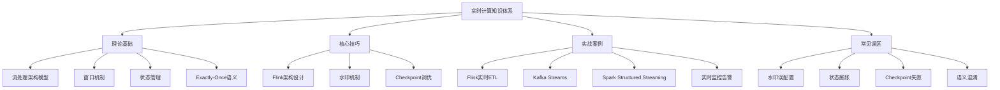
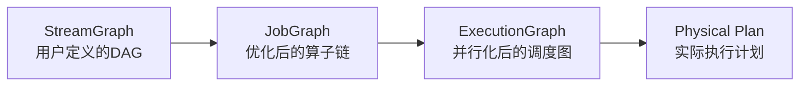
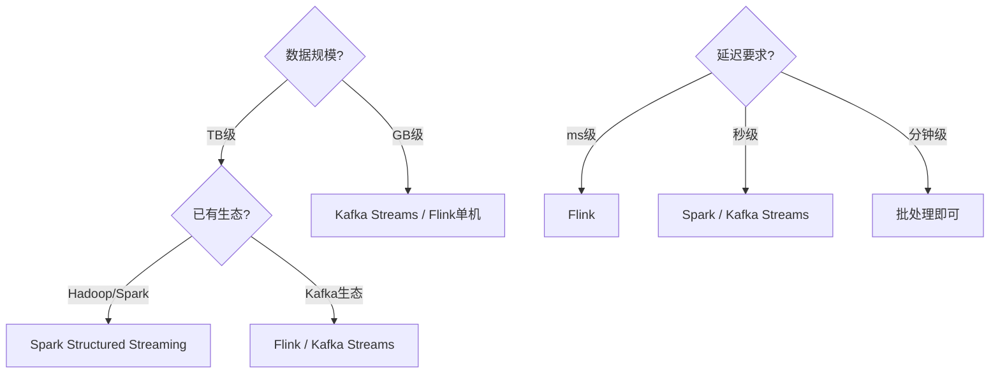

## 本章小结

本章系统地介绍了实时计算从理论到实践的完整知识体系。以下从核心知识回顾、关键模型总结、最佳实践清单、常见误区速查、进阶路径五个维度进行归纳，帮助读者构建完整的认知框架。

---

### 一、核心知识体系总览

本章内容可以归纳为"四大理论基石 + 三大核心技巧 + 四个实战案例"的知识架构：

### 二、理论基础回顾

#### 2.1 流处理架构模型

实时计算的核心是处理"无限数据流"。与批处理（处理有限数据集、小时级延迟）不同，流处理追求毫秒到秒级延迟，同时面对乱序数据、状态管理、故障恢复等挑战。

**三种架构模式的对比与选型：**

| 架构 | 核心思想 | 优势 | 劣势 | 适用场景 |
|------|---------|------|------|---------|
| Lambda | 批+速双链路 | 容错性好、结果精确 | 双套代码维护、结果不一致 | 对准确性要求极高的金融场景 |
| Kappa | 纯流处理，重放回算 | 代码统一、运维简单 | 依赖消息队列重放能力 | 日志分析、指标聚合 |
| 流批一体 | Flink统一引擎 | 一套代码覆盖批流 | 框架复杂度高 | 新项目首选、流批混合场景 |

**Push vs Pull模型：**

- **Push模型**（Storm、Flink）：数据主动推给下游，延迟低但需要反压机制
- **Pull模型**（Kafka Consumer）：下游主动拉取，天然具备反压但延迟略高
- 现代系统趋向**混合模型**，结合两者优势

**状态处理范式：**

- **无状态处理**：每条数据独立处理，实现简单但功能有限（如过滤、映射）
- **有状态处理**：依赖历史数据，功能强大但面临存储、一致性、可扩展性等挑战（如窗口聚合、CEP模式匹配）

#### 2.2 窗口机制

窗口是流处理中处理"无限流"的核心抽象，将无限数据切分为有限片段进行计算。

**四种窗口类型详解：**

| 窗口类型 | 触发条件 | 特点 | 典型场景 |
|---------|---------|------|---------|
| 滚动窗口(Tumbling) | 固定大小、无重叠 | 每条数据只属于一个窗口 | 每分钟PV统计、固定周期报表 |
| 滑动窗口(Sliding) | 固定大小、按步长滑动 | 数据可属于多个窗口 | 最近5分钟平均值、移动平均 |
| 会话窗口(Session) | 活动间隙超时即关闭 | 动态大小、按活跃度分组 | 用户行为分析、在线时长统计 |
| 全局窗口(Global) | 所有数据归入同一窗口 | 需自定义Trigger | 去重、全局聚合 |

**窗口与水印的交互：** 窗口不会在数据到达时立即触发，而是等待水印（Watermark）越过窗口结束时间后才触发计算。这保证了即使数据延迟到达，也能被正确纳入窗口结果。

#### 2.3 状态管理

状态是流处理的"灵魂"——没有状态，流处理只能做简单的数据转发。

**Flink 三种托管状态：**

| 状态类型 | 绑定对象 | 粒度 | 典型用途 |
|---------|---------|------|---------|
| Keyed State | 按key分区的算子实例 | 每个key独立 | 按用户ID聚合、按设备ID统计 |
| Operator State | 算子实例 | 每个并行实例独立 | Kafka offset管理、缓冲区管理 |
| Broadcast State | 所有并行实例 | 全局一致 | 动态规则引擎、配置热加载 |

**五种 Keyed State 接口：**

- `ValueState<T>`：单值状态，最常用（如记录最新温度值）
- `ListState<T>`：列表状态，存储多个元素（如收集最近10条记录）
- `MapState<K,V>`：键值对状态，最灵活（如维护用户偏好映射）
- `ReducingState<T>`：自动归约状态（如实时累加求和）
- `AggregatingState<IN,OUT>`：聚合状态，输入输出类型可不同（如从原始数据聚合为统计结果）

**State TTL（状态生存时间）：** 防止状态无限膨胀的关键机制。三种清理策略：

- **增量清理**：每次访问状态时检查并清理过期条目
- **全量快照清理**：Checkpoint时扫描并移除过期数据
- **RocksDB Compaction Filter**：利用RocksDB的compaction过程异步清理

#### 2.4 Exactly-Once语义

三种消息投递语义的递进关系：

- **At-Most-Once**：数据可能丢失，但不重复。实现最简单（fire-and-forget）
- **At-Least-Once**：数据不丢失，但可能重复。需ACK确认机制+重试
- **Exactly-Once**：不丢不重。核心在于**幂等性**——相同结果执行多次与执行一次等价

**端到端 Exactly-Once 的实现路径：**

1. **Source端**：保存offset快照（如Kafka Consumer Offset）
2. **处理端**：Flink Checkpoint保证内部状态一致性
3. **Sink端**：两阶段提交（2PC）或幂等写入

**两阶段提交（2PC）流程：**

1. 预提交（Pre-Commit）：写入临时文件/事务，不对外可见
2. Checkpoint完成：所有算子确认状态已持久化
3. 正式提交（Commit）：将临时数据正式写入Sink
4. 失败回滚：任意环节失败则丢弃预提交数据

---

### 三、核心技巧回顾

#### 3.1 Flink 运行时架构

Flink 采用经典的**主从架构**：

- **JobManager**：协调者，负责Job调度、Checkpoint协调、故障恢复
- **TaskManager**：执行者，运行实际的数据处理任务，管理内存和状态
- **Slot**：TaskManager上的资源隔离单元，一个Slot运行一个或多个算子

**四层图转换流程：**

**算子链（Operator Chain）优化：** 将多个算子合并到一个Task中执行，减少线程切换和网络传输开销。合并条件包括：输出分区策略为Forward、无shuffle操作等。

**七种数据分发策略：**

| 策略 | 分发方式 | 用途 |
|------|---------|------|
| Forward | 1对1直连 | 上下游并行度相同的链式处理 |
| Broadcast | 一对多广播 | 规则分发、配置同步 |
| Rebalance | 轮询均匀分配 | 解决数据倾斜前的预处理 |
| Rescale | 局部轮询 | 仅在本地SubTask间轮询 |
| Shuffle | 随机均匀分配 | 打散数据 |
| KeyPartition | 按key哈希分区 | 保证相同key到同一实例 |
| Global | 全部发送到第一个实例 | 全局汇总 |

#### 3.2 水印机制

水印（Watermark）是处理乱序数据的核心机制，本质上是一个**单调递增的时间戳**，表示"小于等于该时间戳的数据已经全部到达"。

**两种生成策略：**

- **周期性水印（Periodic）**：每隔固定时间从数据中提取最大时间戳生成水印。适合数据量大、对延迟要求不极端的场景
- **标点水印（Punctuated）**：每条数据到达时检查是否满足条件生成水印。适合数据稀疏、需要快速响应的场景

**迟到数据三层防御体系：**

1. **允许迟到（Allowed Lateness）**：窗口触发后继续等待迟到数据，到期后更新结果
2. **侧输出（Side Output）**：将超过容忍窗口的数据导向独立流，后续可人工或离线处理
3. **离线修正**：对侧输出数据进行批处理，修正实时计算结果

**常见水印陷阱：**

- 未处理空分区（Idle Partition）：某些分区长时间无数据，水印停滞导致窗口不触发
- 混淆事件时间与处理时间：水印基于事件时间而非系统时间
- 水印生成粒度过粗：相同水印无法区分不同精度的时间窗口

#### 3.3 Checkpoint机制

Checkpoint是Flink实现容错和Exactly-Once语义的基础，基于**Chandy-Lamport分布式快照算法**。

**Checkpoint六阶段生命周期：**

1. **触发（Trigger）**：JobManager定期向所有Source注入Barrier
2. **注入Barrier**：Barrier随数据流向下游传播
3. **传播（Propagate）**：Barrier经过算子时触发本地状态快照
4. **本地快照（Local Snapshot）**：算子将当前状态写入State Backend
5. **确认（ACK）**：所有算子向JobManager报告快照完成
6. **全局确认（Global Confirmation）**：JobManager确认所有算子快照成功，Checkpoint完成

**对齐 vs 非对齐Checkpoint：**

| 特性 | 对齐Checkpoint(Aligned) | 非对齐Checkpoint(Unaligned) |
|------|------------------------|---------------------------|
| 延迟影响 | Barrier对齐期间阻塞数据处理 | 不阻塞数据处理 |
| 状态大小 | 仅保存算子状态 | 额外保存缓冲区中的数据 |
| 适用场景 | 一般场景 | 反压严重、低延迟要求场景 |
| Flink版本 | 原始机制 | Flink 1.11+ |

**Checkpoint调优核心参数：**

| 参数 | 作用 | 建议值 |
|------|------|--------|
| `checkpointing.interval` | 触发间隔 | 30s-3min（根据状态大小） |
| `checkpointing.timeout` | 单次超时时间 | 10-15min |
| `checkpointing.min-pause` | 两次最小间隔 | interval的50%-80% |
| `checkpointing.max-concurrent` | 同时进行数 | 1（避免资源竞争） |
| `checkpointing.mode` | 语义模式 | EXACTLY_ONCE（默认） |

**Savepoint vs Checkpoint：**

| 特性 | Checkpoint | Savepoint |
|------|-----------|-----------|
| 触发方式 | 自动定时 | 手动触发 |
| 存储格式 | State Backend原生格式 | 标准化可移植格式 |
| 生命周期 | 取消Job后可保留 | 持久保存 |
| 主要用途 | 故障恢复 | 版本升级、参数调优、集群迁移 |

---

### 四、关键公式与性能模型

| 概念 | 公式/模型 | 说明 |
|------|-----------|------|
| 吞吐量 | Little定律：`L = λ × W`（L=平均在途数，λ=到达率，W=平均等待时间） | 系统设计基础 |
| 可用性 | `SLA = 正常运行时间 / 总时间` | 99.9% = 年停机8.76h，99.99% = 年停机52.6min |
| 延迟分位 | P50/P95/P99/P999 | P99比均值更真实反映用户体验 |
| 容量规划 | `所需并发度 = 目标QPS / 单实例吞吐` | 资源预估基础公式 |
| 状态膨胀 | `状态大小 = key基数 × 每key状态大小` | RocksDB方案下每key开销约100-500字节 |
| Checkpoint耗时 | `T = 数据量 / 写入带宽 + 网络传输延迟 + 对齐等待时间` | 调优切入点 |

---

### 五、四大实战案例总结

| 案例 | 技术栈 | 核心场景 | 关键技术点 |
|------|--------|---------|-----------|
| Flink实时ETL | Flink + Kafka + MySQL | 数据清洗转换 | Keyed State管理、Sink端2PC、Schema演进 |
| Kafka Streams订单聚合 | Kafka Streams DSL | 分类/区域/大额订单聚合 | 窗口聚合、状态存储、Changelog Topic |
| Spark Structured Streaming日志监控 | Spark Streaming + HDFS | 实时日志分析告警 | Trigger模式、Watermark、聚合查询 |
| Flink实时监控告警 | Flink + CEP + 告警引擎 | 多规则告警系统 | 动态规则加载、告警抑制、分级告警 |

**技术选型决策框架：**

---

### 六、最佳实践清单

#### 设计阶段

- 明确延迟和吞吐量目标（P99延迟、QPS、数据量级）
- 评估数据特征（乱序程度、key基数、状态大小）
- 选择架构模式（Lambda/Kappa/流批一体）
- 设计容错方案（Checkpoint策略、降级逻辑、报警阈值）
- 规划状态管理方案（State Backend选型、TTL策略）

#### 实现阶段

- 使用 `StateDescriptor` 显式声明状态，设置默认值避免NPE
- 为所有算子设置独立的 `uid`，保证升级后状态兼容
- 使用侧输出（Side Output）分离迟到数据，避免全局逻辑污染
- 为状态设置 TTL，防止无界增长导致OOM
- 生产环境使用 RocksDB StateBackend（非 HashMapStateBackend）

#### 部署阶段

- Checkpoint配置：间隔30s-3min，超时10-15min，对齐模式优先
- 设置反压监控（Flink Web UI + Prometheus + Grafana）
- 压测覆盖正常负载和峰值场景，预留30%-50%资源余量
- 准备Savepoint用于版本升级和回滚
- 配置告警规则：Checkpoint失败率、状态大小增长率、反压持续时间

#### 运维阶段

- 每日检查Checkpoint成功率和耗时趋势
- 监控状态大小增长曲线，及时发现状态膨胀
- 定期分析GC日志，优化内存配置
- 跟踪反压热点，优化数据倾斜和慢算子
- 保持与业务方同步SLA达成情况

---

### 七、常见误区速查

| 误区 | 正确做法 | 影响 |
|------|---------|------|
| 水印等待时间设为0 | 设置合理的 `maxOutOfOrderness`（通常为数据最大延迟的1.5-2倍） | 迟到数据丢失 |
| 不设置State TTL | 为所有Keyed State设置TTL，定期清理过期数据 | 状态无限膨胀→OOM |
| HashMapStateBackend用于生产 | 生产环境使用RocksDB（内存受限场景尤为重要） | 大状态场景频繁Full GC |
| 同步Checkpoint | 使用异步Checkpoint，避免阻塞数据处理 | Checkpoint期间吞吐下降 |
| 只看平均延迟 | 关注P99/P999尾延迟 | 平均值掩盖长尾问题 |
| 盲目增加并行度 | 先定位瓶颈（数据倾斜、单点热点、IO瓶颈）再调整 | 资源浪费、可能加剧问题 |
| 混淆Exactly-Once与At-Least-Once+幂等 | 理解2PC在Sink端的作用，确认Sink支持事务 | 数据重复或丢失 |
| 忽略空分区水印 | 配置空闲分区超时，避免水印停滞 | 窗口永远不触发 |

---

### 八、技术演进趋势

实时计算领域正处于快速演进期，以下趋势值得持续关注：

1. **流批一体深化**：Flink已实现引擎层统一，未来在SQL层、Catalog层将进一步融合批流体验
2. **Serverless流计算**：阿里云Realtime Compute、AWS Kinesis Data Analytics等已提供免运维的流计算服务
3. **AI+流计算融合**：Flink ML、实时特征存储（Feature Store）、在线学习（Online Learning）将实时数据与模型训练/推理紧密结合
4. **边缘流处理**：在IoT网关、边缘节点上运行轻量级流处理，减少云端传输延迟
5. **CDC（变更数据捕获）**：Debezium + Flink CDC实现数据库实时同步，成为流批一体数仓的核心数据入口

---

### 九、下一步学习建议

**进阶阅读：**

1. **源码深入**：阅读Flink Runtime层源码，理解TaskManager线程模型、网络缓冲区（NetworkBuffer）管理、Slot分配策略
2. **论文精读**：Google Dataflow论文（2015）、Chandy-Lamport分布式快照论文（1985）、Lambda Architecture论文（Nathan Marz）
3. **规范研究**：Flink Improvement Proposals (FIPs)了解框架演进方向

**实践路径：**

1. **搭建实验环境**：本地部署Flink Standalone集群（1个JobManager + 2个TaskManager），用WordCount入门
2. **模拟生产场景**：使用 `flink-datagen` 或 `kafka-producer` 生成测试数据，验证窗口、水印、Checkpoint行为
3. **故障注入练习**：手动Kill TaskManager观察故障恢复流程，调整Checkpoint参数观察行为变化
4. **完整项目实战**：从零搭建"Kafka→Flink→MySQL/ClickHouse"实时数仓链路

**推荐学习资源：**

| 类型 | 资源 | 说明 |
|------|------|------|
| 官方文档 | [Flink Documentation](https://flink.apache.org/docs/) | 权威参考，版本更新及时 |
| 书籍 | 《Flink原理与实践》（孙梦姝等） | 中文Flink专著，理论与实践结合 |
| 书籍 | 《Stream Processing with Apache Flink》（Fabian Hueske） | Flink核心贡献者撰写 |
| 在线课程 | Ververica Flink Training | Flink商业公司出品的官方培训 |
| 开源项目 | Apache Flink、Apache Kafka、Apache Spark | 阅读源码理解实现原理 |
| 社区 | Flink中文社区、Apache Flink GitHub Issues | 追踪最新动态和问题讨论 |

---

### 十、本章核心公式速查卡

┌──────────────────────────────────────────────────────────┐
│                  实时计算核心公式速查                       │
├──────────────────────────────────────────────────────────┤
│  Little定律:    L = λ × W                                │
│  系统容量:      并发度 = 目标QPS / 单实例吞吐              │
│  水印延迟:      W = 当前时间 - maxOutOfOrderness          │
│  状态大小:      S = key基数 × 每key状态量                  │
│  Checkpoint耗时: T = 状态大小/写入带宽 + 网络延迟           │
│  可用性等级:    99.9%=8.76h/年  99.99%=52.6min/年        │
│  延迟预算:      P99 < SLA要求 / 2（预留缓冲）              │
└──────────────────────────────────────────────────────────┘

---

### 十一、思考与回顾

1. **架构选型**：在你的业务场景中，Lambda、Kappa、流批一体哪种架构最合适？核心考量因素有哪些？
2. **窗口选择**：滚动窗口和滑动窗口的本质区别是什么？如果需要计算"每分钟内最近5秒的平均值"，应该选择哪种窗口？
3. **状态管理**：Keyed State和Operator State分别适用于什么场景？为什么Broadcast State不能设置TTL？
4. **Checkpoint调优**：如果Checkpoint频繁超时失败，你会从哪些维度排查和优化？列出至少3个可能原因和对应解决方案。
5. **Exactly-Once**：端到端Exactly-Once为什么需要Sink端支持事务或幂等？如果Sink不支持事务（如写入HTTP API），有什么替代方案？
6. **水印设计**：如果数据的最大延迟是5分钟，水印的 `maxOutOfOrderness` 应该设多大？太小会怎样？太大又会怎样？
7. **反压定位**：如何判断反压的根因是数据倾斜还是算子处理慢？两种情况分别怎么解决？
8. **技术趋势**：Flink的"流批一体"和Spark的"Structured Streaming"在设计理念上有什么本质区别？各自的演进方向是什么？
