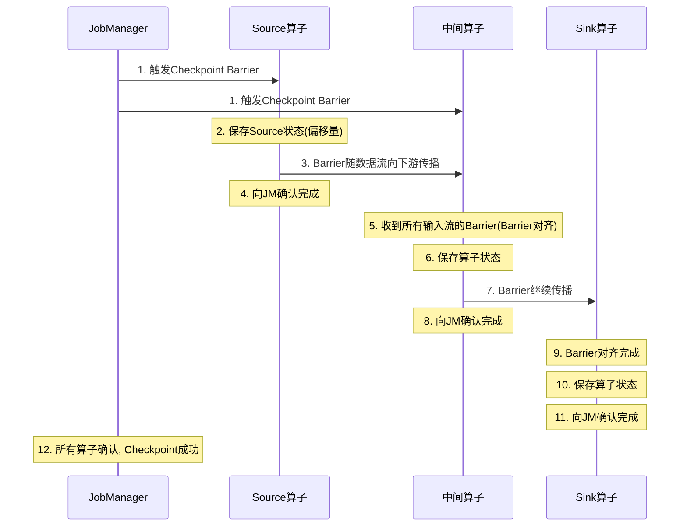
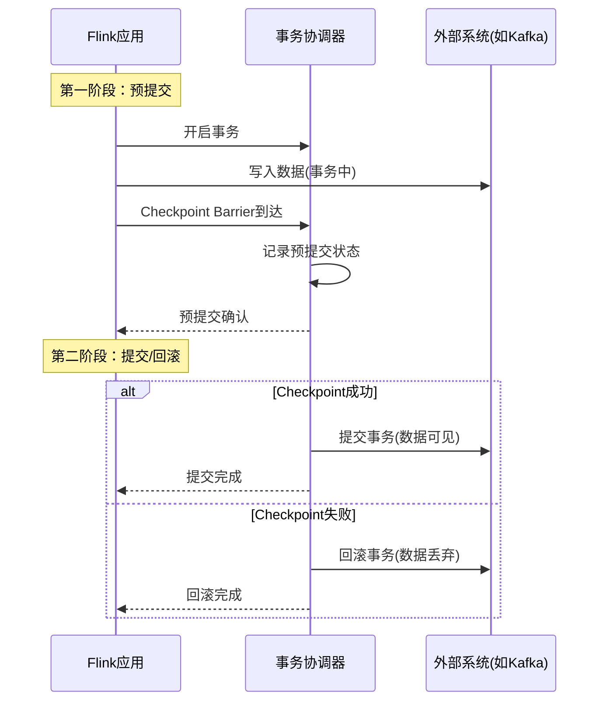
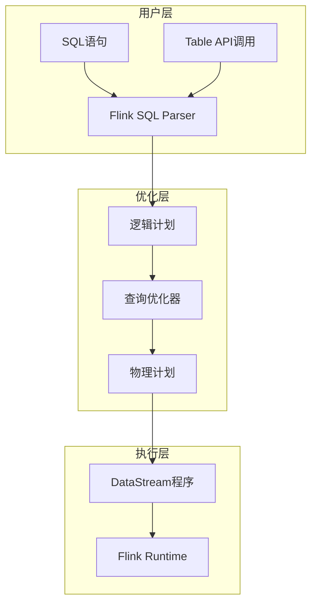
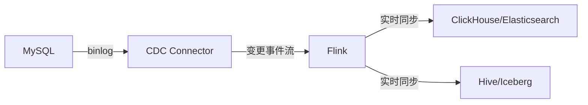

# 第59章 实时计算：流式数据处理的架构与实践

---

## 章节定位

实时计算是大数据技术体系中的核心组成部分，负责对持续到达的流式数据进行低延迟的处理和分析。在互联网时代，数据以前所未有的速度产生——用户点击流、物联网传感器数据、金融交易记录、日志数据等，这些数据的价值随着时间的流逝而迅速衰减。传统的批处理模式（如Hadoop MapReduce）以小时甚至天为单位处理数据，已经无法满足实时监控、实时推荐、实时风控等业务场景的需求。实时计算通过流式处理架构，将数据处理延迟从小时级降低到秒级甚至毫秒级，使得企业能够在数据产生的瞬间就做出反应。

本章从流处理架构到工程实践，系统性地探讨实时计算的方方面面。内容涵盖Lambda/Kappa架构模型、Apache Flink的完整技术栈（DataStream API、Flink SQL/Table API、状态管理、窗口机制、水印语义、CEP、反压机制）、Flink CDC实时数据集成、流式Join、Flink部署与运维、以及与Kafka Streams、Spark Structured Streaming的全面对比。

---

## 核心内容概览

**流处理架构模型** 是实时计算的顶层设计。Lambda架构同时维护批处理和流处理两条路径，通过服务层合并结果，保证了结果的准确性和低延迟，但需要维护两套代码。Kappa架构简化了这一设计，只保留流处理路径，通过重放消息来实现批处理语义，降低了系统复杂度但对消息系统的要求更高。

**Apache Flink架构** 采用JobManager/TaskManager的分布式设计，通过Operator Chain优化减少网络开销，通过Slot机制实现资源隔离。Flink的核心优势在于其真正的流处理设计——数据逐条处理而非微批处理，配合精确的事件时间语义和灵活的窗口机制，能够实现毫秒级的处理延迟和精确的结果。

**窗口机制** 是流处理中处理无界数据集的核心抽象。滚动窗口将数据划分为固定大小的不重叠区间；滑动窗口在滚动窗口的基础上允许窗口重叠；会话窗口根据数据的活跃度动态调整窗口大小；全局窗口则需要自定义触发器来控制结果的输出。窗口的选择直接影响计算结果的准确性和系统资源的消耗。

**状态管理与容错** 是流处理引擎的核心技术挑战。Keyed State为每个Key维护独立的状态，Operator State为算子维护状态。Checkpoint机制通过异步分布式快照实现Exactly-Once语义——Flink基于Chandy-Lamport算法，通过Barrier对齐将整个数据流图的状态一致性地保存到外部存储。Savepoint则提供了手动触发的状态快照，用于版本升级和运维操作。

**事件时间与水印** 解决了流处理中的时间语义问题。事件时间（Event Time）是数据产生的时间，处理时间（Processing Time）是数据被处理的时间。水印（Watermark）是一种特殊的标记，表示"小于该时间戳的事件已经全部到达"，用于在乱序数据中确定窗口的触发时机。水印的设置需要在延迟和完整性之间做出权衡——过早触发可能遗漏迟到数据，过晚触发会增加延迟。

**Flink SQL与Table API** 是Flink的声明式编程接口，让开发者用SQL即可完成流处理逻辑。Table API提供Java/Python的DSL，Flink SQL提供标准SQL语法。底层通过关系代数优化器自动生成高效的DataStream执行计划，在保持易用性的同时不牺牲性能。

**Flink CDC（Change Data Capture）** 是实时数据集成的核心技术，通过捕获数据库的变更日志（如MySQL binlog、PostgreSQL WAL），将数据库的增删改操作实时同步到数据仓库、搜索引擎等下游系统，实现毫秒级的数据同步延迟。

**CEP（复杂事件处理）** 从流式数据中检测特定的事件模式。Flink CEP提供了声明式的Pattern API，支持序列模式、循环模式、条件模式等，底层通过NFA（非确定性有限自动机）实现模式匹配。CEP广泛应用于金融欺诈检测、网络安全威胁检测和业务异常监控等场景。

**反压（Backpressure）处理** 是流处理系统在面对数据流量波动时的关键能力。当下游算子处理速度跟不上上游数据产生速度时，反压机制会向上游传播压力信号，减缓上游的数据发送速率。Flink通过基于信用的反压机制实现背压传播，通过缓冲区管理控制数据流量。

---

## 学习目标

完成本章学习后，读者应能：
1. 理解Lambda和Kappa两种流处理架构的差异和适用场景
2. 掌握Apache Flink的核心架构（JobManager/TaskManager/Slot/Chain）和运行机制
3. 熟练运用DataStream API和Flink SQL/Table API处理流式数据
4. 理解状态管理和Checkpoint机制如何保证Exactly-Once语义
5. 掌握水印和事件时间语义在处理乱序数据中的应用
6. 了解Flink CDC的原理和实时数据集成方案
7. 掌握流式Join的类型和适用场景
8. 了解CEP复杂事件处理的原理和应用场景
9. 能在实际项目中进行实时计算系统的选型、部署和调优

---

## 本章结构

| 小节 | 主题 | 核心内容 |
|------|------|----------|
| 01 | 理论基础 | 流处理架构、Flink架构、窗口类型、状态管理、Exactly-Once、水印机制 |
| 02 | 核心技巧 | 窗口优化、状态后端选择、Checkpoint调优、反压处理、CEP模式设计 |
| 03 | Flink SQL与Table API | SQL语法、动态表、时间属性、流表对偶性、与DataStream互操作 |
| 04 | Flink CDC与流式Join | CDC原理、Debezium集成、CDC Source、Window Join、Interval Join |
| 05 | 实战案例 | Flink实时ETL、Kafka Streams、Spark Structured Streaming、实时监控 |
| 06 | 常见误区 | 水印设置不当、状态膨胀、Checkpoint失败、窗口语义混淆、反压处理 |
| 07 | 练习方法 | Flink开发环境搭建、窗口实验、状态管理实验、CEP模式匹配、反压模拟 |
| 08 | 本章小结 | 核心概念回顾、技术选型框架、部署模式、延伸阅读 |

---

# 第59章 实时计算 理论基础

---

## 59.1 流处理架构模型：Lambda与Kappa

实时计算的架构设计需要在数据处理的延迟、准确性和系统复杂度之间做出权衡。两种经典的架构模型——Lambda架构和Kappa架构——代表了两种不同的设计哲学。

**Lambda架构** 由Nathan Marz提出，将数据处理分为三条路径：批处理层（Batch Layer）、速度层（Speed Layer）和服务层（Serving Layer）。批处理层对全量历史数据进行离线计算，保证结果的准确性；速度层对实时数据流进行近实时计算，保证低延迟；服务层将批处理和实时计算的结果合并，对外提供查询服务。Lambda架构的核心思想是"用批处理的准确性弥补流处理的近似性"——批处理定期重新计算全量数据，修正流处理可能产生的误差。

Lambda架构的优势在于容错性强——即使流处理出现错误，批处理会定期修正；准确性高——批处理对全量数据计算，结果准确；灵活性好——不同层可以使用不同的技术栈。但其劣势同样明显：需要维护两套代码逻辑（批处理和流处理），增加了开发和维护成本；两套系统的结果合并增加了系统复杂度；批处理的结果存在延迟，在修正之前的窗口期内可能提供不准确的结果。

**Kappa架构** 由Jay Kreps（Kafka的创始人）提出，核心思想是"用流处理解决一切问题"。Kappa架构只保留流处理路径，移除了批处理层。当需要重新计算历史数据时，通过重放消息系统中的历史消息来实现——流处理程序从消息系统的最早偏移量开始重新消费，计算出新的结果表，然后切换到新的结果表。这种设计假设消息系统（如Kafka）能够长期保留历史消息。

Kappa架构的优势在于：系统简单——只有一套代码，降低了开发和维护成本；一致性好——不存在批处理和流处理结果不一致的问题；延迟更低——所有数据都通过流处理路径。其劣势在于：对消息系统的要求高——消息系统需要能够长期保留大量历史消息，存储成本较高；重放效率——大规模历史数据的重放可能需要较长时间；容错性不如Lambda——流处理出现错误时需要重放大量数据来修正。

```python
# Lambda架构示意
class LambdaArchitecture:
    """Lambda架构：批处理 + 流处理双路径"""

    def __init__(self, batch_engine, stream_engine, serving_layer):
        self.batch_engine = batch_engine      # 如Spark、Hadoop
        self.stream_engine = stream_engine    # 如Flink、Storm
        self.serving_layer = serving_layer    # 合并层

    async def process(self, data_stream, historical_data):
        # 路径1：流处理层（低延迟，近似结果）
        realtime_result = await self.stream_engine.process(data_stream)

        # 路径2：批处理层（高延迟，准确结果）
        batch_result = await self.batch_engine.process(historical_data)

        # 服务层合并
        merged_result = self.serving_layer.merge(
            realtime_result, batch_result
        )
        return merged_result

# Kappa架构示意
class KappaArchitecture:
    """Kappa架构：纯流处理"""

    def __init__(self, stream_engine, message_store):
        self.stream_engine = stream_engine
        self.message_store = message_store    # 如Kafka

    async def process(self, data_stream):
        # 所有数据都通过流处理
        result = await self.stream_engine.process(data_stream)
        return result

    async def recompute(self, from_offset=0):
        """重放历史消息重新计算"""
        history_stream = self.message_store.replay(from_offset)
        new_result = await self.stream_engine.process(history_stream)
        await self.serving_layer.switch_to(new_result)
```

**架构选型决策框架**：

| 维度 | Lambda架构 | Kappa架构 |
|------|-----------|-----------|
| 系统复杂度 | 高（双路径+合并层） | 低（单路径） |
| 代码维护成本 | 高（两套逻辑） | 低（一套逻辑） |
| 结果准确性 | 高（批处理兜底） | 依赖流处理正确性 |
| 实时延迟 | 受批处理修正周期影响 | 全链路低延迟 |
| 历史重算能力 | 批处理天然支持 | 依赖消息系统重放 |
| 运维成本 | 高（两套系统） | 低（一套系统） |
| 消息系统要求 | 低 | 高（长期存储+高吞吐） |
| 适用场景 | 金融、风控等准确性要求极高的场景 | 互联网业务、日志分析等对延迟敏感的场景 |

**业界实践**：Uber早期采用Lambda架构（批处理用Presto，流处理用Flink），后来逐步迁移到Kappa架构（统一用Flink）。LinkedIn作为Kafka的创始公司，天然采用Kappa架构。大多数互联网公司在新项目中倾向于选择Kappa架构，但对已有Lambda架构系统的改造需要渐进式迁移。

---

## 59.2 Apache Flink架构详解

Apache Flink是目前最主流的分布式流处理引擎，其架构设计体现了真正的流处理理念。

### 59.2.1 整体架构

**JobManager** 是Flink集群的大脑，负责作业的调度、协调和容错。每个Flink集群有一个活跃的JobManager（HA模式下有多个备选）。JobManager的核心职责包括：接收用户提交的作业（JobGraph），将其转换为可执行的执行图（ExecutionGraph）；将执行图中的任务分配给TaskManager执行；协调全局的Checkpoint过程；监控任务执行状态，在任务失败时触发恢复。

JobManager内部由三个核心组件构成：
- **ResourceManager**：负责资源的分配和回收，管理TaskManager的Slot资源。Flink支持多种ResourceManager实现（Standalone、YARN、Kubernetes、Mesos）
- **Dispatcher**：提供REST API接口，接收作业提交请求，是客户端与JobManager之间的桥梁
- **JobMaster**：负责单个作业的生命周期管理，包括作业调度、Checkpoint协调和故障恢复

**TaskManager** 是Flink集群的工作节点，负责执行具体的计算任务。每个TaskManager拥有一定数量的Slot（计算资源槽位），每个Slot可以运行一个或多个算子任务。TaskManager的核心职责包括：启动和运行算子任务；管理任务的状态（包括State Backend中的状态数据）；执行Checkpoint操作——在收到JobManager的Checkpoint Barrier后，将本地状态快照保存到外部存储；提供数据交换——TaskManager之间通过Netty进行数据传输。

**Slot** 是TaskManager中的资源隔离单元。每个Slot拥有固定比例的内存和CPU资源。默认情况下，一个Slot可以运行一个算子子任务（SubTask），但通过Slot Sharing机制，同一个作业的多个算子子任务可以共享同一个Slot，减少数据交换开销。Slot Sharing Group允许用户自定义哪些算子可以共享Slot。

**Operator Chain** 是Flink的优化手段之一。当两个算子之间的数据传输是本地的（即同一个TaskManager内），Flink会将它们链接在一起（Chain），避免序列化/反序列化和网络传输的开销。Chain中的算子在同一个线程中执行，数据通过方法调用传递，效率极高。

Flink架构全景图：

  +-------------------+
  |    JobManager     |  (ResourceManager + Dispatcher + JobMaster)
  +---------+---------+
            |
     +------+------+
     |             |
+----v----+  +----v----+
||TaskManager| |TaskManager|  (运行算子任务)
|| Slot1    | | Slot1    ||
|| Slot2    | | Slot2    ||
+----+----+  +----+----+
     |             |
     +------+------+
            |
  +---------v---------+
  | State Backend     |  (RocksDB / Heap / Filesystem)
  +-------------------+

算子链示例：
  [Source] -> [Map] -> [KeyBy] -> [Window] -> [Sink]
  \---Chain---/       \---Chain---/

### 59.2.2 执行模型

Flink的执行模型从用户代码到实际执行经过四个阶段：

1. **StreamGraph**：用户通过DataStream API或Table API定义的数据流图，是最接近用户代码的表示
2. **JobGraph**：StreamGraph经过优化后生成的图，将可以链接的算子合并为Operator Chain，减少Task数量
3. **ExecutionGraph**：JobGraph在JobMaster中转换为可执行的分布式执行图，为每个算子创建并行的SubTask实例
4. **物理执行**：ExecutionGraph被提交到TaskManager上执行，TaskManager根据Slot分配情况启动SubTask

这种分层设计使得Flink能够在不同层次上进行优化——StreamGraph层的算子融合优化、JobGraph层的Chain优化、ExecutionGraph层的并行度和调度优化。

### 59.2.3 数据交换机制

Flink中的数据交换分为两种模式：

**Forward模式**：上游算子和下游算子的并行度相同，数据点对点传输。这是最高效的数据交换方式，不需要网络传输，通过内存缓冲区直接传递。Flink默认在满足条件时使用Forward模式。

**Shuffle模式**：上游算子和下游算子的并行度不同，或者需要按Key分区。数据需要通过Netty进行网络传输。Shuffle模式根据分区策略分为：Hash Shuffle（按Key的哈希值分区）、Rebalance（轮询分配）、Rescale（局部轮询）、Broadcast（广播到所有下游）、Random（随机分配）。

---

## 59.3 窗口类型详解

窗口是流处理中将无界数据集划分为有限数据集的核心机制。不同的窗口类型适用于不同的业务场景。

**滚动窗口（Tumbling Window）** 将数据划分为固定大小的、不重叠的区间。每个数据只属于一个窗口。滚动窗口的大小决定了计算的粒度——窗口越小，结果越实时但计算开销越大；窗口越大，结果延迟越高但计算效率越高。典型应用场景包括：每分钟的PV/UV统计、每小时的订单量统计等。

**滑动窗口（Sliding Window）** 由窗口大小和滑动步长两个参数定义。当滑动步长小于窗口大小时，窗口之间存在重叠，一个数据可以属于多个窗口。滑动窗口的典型应用场景是移动平均——例如计算最近5分钟的平均值，每30秒更新一次。滑动窗口的计算开销与重叠程度成正比——重叠越大，计算量越大。

**会话窗口（Session Window）** 根据数据的活跃度动态调整窗口大小。当数据在指定的时间间隔（Gap）内没有新的数据到达时，当前会话窗口关闭。会话窗口的典型应用场景是用户行为分析——将用户的一系列连续操作归为一个会话，会话之间的间隔超过阈值时认为会话结束。会话窗口的实现复杂度较高，因为窗口的大小是动态的。

**全局窗口（Global Window）** 将所有数据归入一个窗口，窗口永远不会自动关闭。全局窗口需要配合自定义的触发器（Trigger）来控制结果的输出。全局窗口的典型应用场景是需要自定义窗口逻辑的场景，例如基于计数的窗口（每100条数据触发一次计算）。

```python
# Flink窗口类型示例
from pyflink.datastream import Time

# 滚动窗口：每分钟统计一次
tumbling_window = TumblingEventTimeWindows.of(Time.minutes(1))

# 滑动窗口：窗口大小5分钟，滑动步长30秒
sliding_window = SlidingEventTimeWindows.of(
    Time.minutes(5), Time.seconds(30)
)

# 会话窗口：10分钟无数据则关闭会话
session_window = EventTimeSessionWindows.with_gap(Time.minutes(10))

# 全局窗口（需要配合自定义Trigger）
global_window = GlobalWindows.create()
```

**窗口类型的选型指南**：

| 窗口类型 | 窗口大小 | 数据归属 | 适用场景 | 资源消耗 |
|---------|---------|---------|---------|---------|
| 滚动窗口 | 固定 | 每条数据只属于一个窗口 | 定时聚合（PV/UV统计） | 低 |
| 滑动窗口 | 固定 | 每条数据可属于多个窗口 | 移动平均、趋势分析 | 中-高（取决于重叠度） |
| 会话窗口 | 动态 | 按活跃度分组 | 用户行为分析、会话统计 | 中 |
| 全局窗口 | 无限 | 所有数据归入同一窗口 | 自定义触发逻辑（计数窗口） | 高（需自定义Trigger） |

---

## 59.4 状态管理与Checkpoint机制

状态管理是流处理引擎的核心技术挑战。流处理程序需要维护中间结果（如窗口中的数据、聚合的累计值、机器学习模型的参数等），这些中间结果就是"状态"。

### 59.4.1 状态类型

**Keyed State** 是与Key关联的状态，每个Key拥有独立的状态副本。Flink提供了多种Keyed State类型：

| 状态类型 | 存储内容 | 适用场景 | 示例 |
|---------|---------|---------|------|
| ValueState | 单个值 | 计数器、累加器 | 记录每个用户的访问次数 |
| ListState | 值的列表 | 需要存储多个值的场景 | 记录用户最近10次的浏览记录 |
| MapState | 键值对 | 需要按Key查询的场景 | 记录用户的偏好标签及其权重 |
| ReducingState | 聚合结果 | 可结合的聚合操作 | 实时计算销售额总和 |
| AggregatingState | 聚合结果 | 通用聚合操作 | 计算平均值（不可结合的聚合） |

Keyed State的有效范围是当前Key的上下文——只有在KeyBy之后的算子中才能使用Keyed State。

**Operator State** 是与算子实例关联的状态，每个算子实例拥有独立的状态副本。Operator State不与Key关联，适用于Source算子（如记录Kafka的消费偏移量）等场景。当算子实例发生变化（如并行度调整）时，Operator State需要重新分配——Flink支持均匀分配（Even Split Redistribution）和联合分配（Union Redistribution）两种策略。

### 59.4.2 状态后端

**State Backend** 决定了状态的存储位置和方式。

| 状态后端 | 存储位置 | Checkpoint方式 | 最大状态规模 | 适用场景 |
|---------|---------|---------------|------------|---------|
| MemoryStateBackend | TaskManager JVM堆内存 | 写入JobManager内存 | MB级 | 开发测试、小状态作业 |
| FsStateBackend | TaskManager JVM堆内存 | 写入文件系统（HDFS/S3） | GB级 | 中等状态、需要快速访问 |
| RocksDBStateBackend | 本地RocksDB实例 | 写入文件系统（支持增量） | TB级 | 超大状态、生产环境 |

### 59.4.3 Checkpoint机制

**Checkpoint** 是Flink实现容错的核心机制。Checkpoint通过异步分布式快照（基于Chandy-Lamport算法）将整个数据流图在某个时间点的状态一致性地保存到外部存储。当任务失败时，从最近一次成功的Checkpoint恢复状态，实现Exactly-Once语义。

Checkpoint的执行过程如下：



关键步骤详解：
1. **Barrier注入**：JobManager定期向Source算子注入Checkpoint Barrier
2. **Barrier传播**：Barrier随数据流向下游传播
3. **Barrier对齐**（仅Exactly-Once模式）：当算子收到所有输入流的Barrier时，触发本地状态的快照
4. **状态快照**：算子将本地状态异步写入外部存储（如HDFS）
5. **确认完成**：快照完成后向JobManager确认
6. **Checkpoint完成**：当所有算子都确认完成时，本次Checkpoint标记为成功

```python
# Flink状态管理与Checkpoint配置
from pyflink.common import Configuration
from pyflink.datastream import StreamExecutionEnvironment

# 配置Flink环境
config = Configuration()
config.set_string("state.backend", "rocksdb")
config.set_string("state.checkpoints.dir", "hdfs:///flink/checkpoints")
config.set_string("state.savepoints.dir", "hdfs:///flink/savepoints")
config.set_integer("execution.checkpointing.interval", 60000)  # 1分钟
config.set_string("execution.checkpointing.mode", "EXACTLY_ONCE")
config.set_integer("execution.checkpointing.min-pause", 30000)
config.set_integer("execution.checkpointing.timeout", 600000)
config.set_integer("execution.checkpointing.max-concurrent-checkpoints", 1)

env = StreamExecutionEnvironment.get_execution_environment()
env.configure(config)
```

---

## 59.5 Exactly-Once语义与两阶段提交

流处理系统中的一致性保证分为三个级别：At-Most-Once（最多一次，可能丢数据）、At-Least-Once（至少一次，可能重复）和Exactly-Once（精确一次，不丢不重）。需要明确的是，Exactly-Once并不是指数据只被处理一次，而是指数据对结果的影响恰好一次——即使数据被重试处理多次，对外部系统的效果与只处理一次相同。

**算子侧的Exactly-Once** 通过Checkpoint机制实现。Flink的Checkpoint基于Chandy-Lamport分布式快照算法：JobManager定期向Source注入Barrier，Barrier随数据流传播。当算子收到所有输入流的Barrier时，触发本地状态的快照。如果处理过程中出现故障，从最近一次成功的Checkpoint恢复状态，重新消费数据——由于状态和消费位点都恢复到Checkpoint时刻，数据会被重新处理，但状态是一致的。

**Sink侧的Exactly-Once** 通过两阶段提交（Two-Phase Commit）协议实现。仅靠算子侧的Checkpoint无法保证对外部系统的写入也是Exactly-Once的——如果在写入外部系统之后但在Checkpoint完成之前任务失败，恢复后数据会被重新写入，导致重复。两阶段提交协议的流程如下：



Flink提供了TwoPhaseCommitSinkFunction抽象类，用户只需实现preCommit和commit方法即可实现端到端的Exactly-Once。Kafka作为Source和Sink时，配合Flink的Checkpoint机制可以实现端到端的Exactly-Once——Kafka的事务性生产者支持两阶段提交，Flink在Checkpoint时开启Kafka事务，在Checkpoint完成后提交事务。

```python
# 端到端Exactly-Once的配置
# Source: Kafka Consumer - 设置消费位点为Checkpoint中的位点
kafka_source = KafkaSource.builder() \
    .set_bootstrap_servers("kafka:9092") \
    .set_topics("input-topic") \
    .set_group_id("flink-consumer") \
    .set_starting_offsets(OffsetsInitializer.committed_offsets()) \
    .build()

# Processing: Flink算子 - 通过Checkpoint保证状态一致性
# (使用Keyed State + Checkpoint)

# Sink: Kafka Producer - 使用两阶段提交
kafka_sink = KafkaSink.builder() \
    .set_bootstrap_servers("kafka:9092") \
    .set_record_serializer(...) \
    .set_delivery_guarantee(DeliveryGuarantee.EXACTLY_ONCE) \
    .set_transactional_id_prefix("flink-tx-") \
    .build()

# Checkpoint配置
env.enable_checkpointing(60000, CheckpointingMode.EXACTLY_ONCE)
```

**Exactly-Once的代价**：Barrier对齐会引入延迟——算子必须等待所有输入流的Barrier到达才能继续处理，这会导致处理延迟增加。在多输入流的场景中，如果某个流的数据量远大于其他流，Barrier对齐的等待时间会更长。Flink 1.11引入了非对齐Checkpoint（Unaligned Checkpoint）来缓解这个问题——Barrier不需要等待对齐，直接覆盖缓冲区中的数据，减少Checkpoint对处理延迟的影响。

---

## 59.6 水印与时间语义

流处理中的时间语义是一个复杂但关键的问题。由于数据在网络传输中可能乱序到达，处理时间（数据被算子处理的时间）和事件时间（数据实际产生的时间）往往不一致。使用事件时间语义可以得到确定性的、可重现的结果，但需要处理乱序和迟到数据的问题。

**时间语义的三种类型**：

| 时间类型 | 定义 | 特点 | 适用场景 |
|---------|------|------|---------|
| 事件时间（Event Time） | 数据产生的时间 | 确定性、可重现 | 需要准确结果的场景 |
| 处理时间（Processing Time） | 数据被算子处理的时间 | 简单、低延迟 | 对准确性要求不高的实时监控 |
| 摄入时间（Ingestion Time） | 数据进入Flink的时间 | 介于事件时间和处理时间之间 | 作为事件时间的近似替代 |

**水印（Watermark）** 是Flink处理事件时间语义的核心机制。水印是一种特殊的标记，随数据流一起传播，表示"时间戳小于水印值的事件已经全部到达"。当算子收到水印时，可以认为该水印之前的数据已经全部到达，可以安全地关闭和触发该时间范围内的窗口。

水印的生成策略主要有两种：
- **周期性水印（Periodic Watermark）**：每隔固定时间间隔生成一次水印，适用于大部分场景
- **标点水印（Punctuated Watermark）**：根据数据中的特定标记生成水印，适用于数据中有明确时间标记的场景

水印的设置需要在延迟和完整性之间做出权衡。如果水印推进过于激进（延迟设置太小），可能过早关闭窗口，导致迟到数据被遗漏。如果水印推进过于保守（延迟设置太大），会增加窗口触发的延迟。Flink提供了允许迟到数据（Allowed Lateness）机制——在窗口触发后的一段时间内，仍然接受迟到数据并更新结果。当迟到数据超过允许的时间后，可以通过侧输出（Side Output）将数据输出到单独的流中进行后续处理。

```python
# 水印策略配置
from pyflink.datastream.functions import WatermarkStrategy
from pyflink.datastream import Time

# 周期性水印：允许5秒的乱序
watermark_strategy = WatermarkStrategy \
    .for_bounded_out_of_orderness(Duration.of_seconds(5)) \
    .with_timestamp_assigner(MyTimestampAssigner())

# 自定义水印生成器
class MyWatermarkGenerator(WatermarkGenerator):
    def __init__(self, max_out_of_orderness):
        self.max_out_of_orderness = max_out_of_orderness
        self.current_max_timestamp = Long.MIN_VALUE

    def on_event(self, event, event_timestamp, output):
        self.current_max_timestamp = max(
            self.current_max_timestamp, event_timestamp
        )

    def on_periodic_emit(self, output):
        output.emit_watermark(
            Watermark(self.current_max_timestamp - self.max_out_of_orderness - 1)
        )
```

**水印延迟的设置建议**：

| 数据乱序程度 | 建议水印延迟 | 典型场景 |
|------------|------------|---------|
| 几乎无乱序 | 0-1秒 | 系统日志、传感器数据 |
| 轻微乱序 | 1-5秒 | 用户行为数据（正常网络） |
| 中等乱序 | 5-30秒 | 移动端数据（网络不稳定） |
| 严重乱序 | 30秒-5分钟 | 离线缓存数据（批量上传） |
| 极端乱序 | 5分钟以上 | 跨时区数据、批量导入数据 |

---

## 59.7 CEP复杂事件处理

复杂事件处理（Complex Event Processing, CEP）是从流式数据中检测特定事件模式的技术。CEP将原始事件流视为"字母表"，将模式视为"正则表达式"，在事件流中寻找匹配模式的子序列。

**Pattern API** 是Flink CEP的核心接口。Pattern定义了一个或多个事件的匹配条件和它们之间的关系。Pattern分为：
- **简单模式**：匹配单个事件的条件
- **循环模式**：匹配重复出现的事件序列
- **组合模式**：多个模式的组合（如连续、非确定性宽松连续等）

**NFA（非确定性有限自动机）** 是Flink CEP的底层实现。Pattern被编译为NFA，事件流作为NFA的输入，NFA在事件流上运行，跟踪所有可能的匹配状态。当NFA到达接受状态时，表示发现了一个完整的模式匹配。NFA的优势在于能够高效地处理多个并行的匹配路径——由于模式匹配可能有多种可能的路径，NFA可以同时跟踪所有路径。

CEP的典型应用场景包括：
- **金融欺诈检测**：检测信用卡的异常消费模式（如同一卡在短时间内在不同城市消费）
- **网络安全**：检测DDoS攻击、暴力破解等攻击模式
- **物联网**：检测设备的异常运行模式（如温度持续升高超过阈值）
- **业务流程监控**：检测业务流程中的异常模式（如订单长时间未支付）

```python
# Flink CEP示例：检测异常登录模式
from pyflink.cep import CEP, Pattern

# 定义模式：连续3次登录失败后1次登录成功
login_pattern = Pattern.begin("failures") \
    .where(lambda event: event["type"] == "LOGIN_FAIL") \
    .times_or_more(3) \
    .within(Time.minutes(5)) \
    .followed_by("success") \
    .where(lambda event: event["type"] == "LOGIN_SUCCESS") \
    .within(Time.minutes(1))

# 在数据流上应用CEP
pattern_stream = CEP.pattern(
    login_stream.key_by(lambda e: e["user_id"]),
    login_pattern
)

# 提取匹配结果
def pattern_handler(pattern):
    failures = pattern["failures"]
    success = pattern["success"]
    return Alert(
        user_id=success["user_id"],
        message=f"可疑登录：{len(failures)}次失败后成功",
        timestamp=success["timestamp"]
    )

alerts = pattern_stream.select(pattern_handler)
```

**CEP模式的连续性类型**：

| 连续性类型 | 说明 | 示例 |
|-----------|------|------|
| 严格连续（Strict Contiguity） | 事件必须连续出现，中间不能有其他事件 | A, B, C |
| 松弛连续（Relaxed Contiguity） | 事件之间可以有其他事件 | A, ..., B, ..., C |
| 非确定性松弛连续（Non-deterministic Relaxed） | 事件之间可以有其他事件，且匹配路径可以回溯 | A, ..., B, ..., C（允许多种匹配路径） |

---

## 59.8 反压机制与背压传播

反压（Backpressure）是流处理系统中的一个重要机制。当数据流入速率超过系统的处理能力时，如果没有反压机制，数据会在缓冲区中堆积，最终导致内存溢出或数据丢失。反压机制通过向上游传播压力信号，减缓上游的数据发送速率，使系统的数据流速与处理能力相匹配。

**基于信用的反压（Credit-based Backpressure）** 是Flink 1.5之后采用的反压机制。每个输入通道（InputGate）被分配一定数量的信用（Credit），信用代表可以接收的缓冲区数量。上游算子在发送数据之前需要获取信用，当信用耗尽时停止发送。下游算子在消费完缓冲区后释放信用，通知上游可以继续发送。这种机制将反压信号通过信用的消耗和释放自然地传播到上游。

**反压的工作流程**：


**反压的表现和影响**：当反压发生时，上游的Source算子会被限速，导致数据消费速度下降。对于Kafka Source，这意味着消费延迟增加（Consumer Lag增长）。对于处理延迟敏感的业务，反压可能导致窗口触发延迟，影响实时性。

**反压的诊断**：Flink Web UI提供了反压监控功能——当某个算子出现反压时，其状态会显示为"Back Pressured"。通过监控指标（如缓冲区使用率、发送/接收队列长度）可以精确定位反压的来源。

```python
# 反压相关配置
config = {
    # 网络缓冲区配置
    "taskmanager.memory.network.fraction": 0.1,
    "taskmanager.memory.network.min": "64mb",
    "taskmanager.memory.network.max": "1gb",

    # 反压采样配置
    "taskmanager.network.netty.server.numThreads": 1,
    "taskmanager.network.netty.client.numThreads": 1,

    # 缓冲区超时配置
    "taskmanager.network.memory.buffers-per-channel": 2,
    "taskmanager.network.memory.floating-buffers-per-gate": 8,
}
```

---

## 本节小结

本节从理论层面系统性地探讨了实时计算的核心架构和关键技术。Lambda架构和Kappa架构代表了两种不同的流处理设计哲学，各有优劣。Apache Flink通过JobManager/TaskManager/Slot/Chain的架构设计，实现了高效的分布式流处理。窗口机制（滚动/滑动/会话/全局）提供了处理无界数据集的灵活抽象。状态管理和Checkpoint机制是流处理容错的基础——Checkpoint通过异步分布式快照实现算子侧的Exactly-Once，两阶段提交实现Sink侧的Exactly-Once。水印机制解决了事件时间语义下的乱序数据处理问题。CEP复杂事件处理从事件流中检测特定的模式序列。反压机制保证了流处理系统在面对流量波动时的稳定性。

---

# 第59章 实时计算 核心技巧

---

## 59.9 窗口优化与自定义Trigger

窗口是流处理中最常用的算子之一，窗口的配置和优化直接影响系统的性能和结果的准确性。

**预聚合优化**：在窗口计算中，如果在窗口触发时才对所有数据进行聚合，会消耗大量内存（需要缓存窗口内所有数据）。更好的做法是在数据进入窗口时就进行预聚合——例如，对于求和操作，每条数据到达时就更新累计值，窗口触发时只需输出最终结果，而不需要遍历所有数据。Flink提供了ReduceFunction和AggregateFunction支持预聚合，可以显著减少窗口的状态大小。

```python
# 预聚合 vs 全量聚合
from pyflink.datastream.window import TumblingEventTimeWindows

# 方式1：全量聚合（需要缓存所有数据，内存消耗大）
windowed_stream.window(TumblingEventTimeWindows.of(Time.minutes(1))) \
    .process(MyProcessWindowFunction())

# 方式2：预聚合（只缓存聚合结果，内存消耗小）
windowed_stream.window(TumblingEventTimeWindows.of(Time.minutes(1))) \
    .reduce(lambda a, b: (a[0] + b[0], a[1] + b[1]))

# 方式3：增量聚合 + 全量处理（最佳实践）
windowed_stream.window(TumblingEventTimeWindows.of(Time.minutes(1))) \
    .aggregate(MyIncrementalAggregate(), MyWindowFunction())
```

**预聚合的性能对比**：

| 聚合方式 | 状态大小 | 触发时计算量 | 内存消耗 | 适用场景 |
|---------|---------|------------|---------|---------|
| 全量聚合（ProcessWindowFunction） | O(N)（N为窗口内数据量） | O(N) | 高 | 需要访问窗口内所有数据 |
| 预聚合（ReduceFunction） | O(1) | O(1) | 低 | 可结合的聚合（求和、计数） |
| 增量聚合（AggregateFunction） | O(1) | O(1) | 低 | 通用聚合（平均值、方差） |
| 增量+全量组合 | O(1)（增量部分） | O(1) + O(N)（全量部分） | 中 | 需要增量结果+窗口元数据 |

**自定义Trigger**：Flink提供了默认的Trigger（如EventTimeTrigger在水印到达时触发窗口），但在某些场景下需要自定义Trigger。例如：基于计数的Trigger——每收到N条数据就触发一次窗口；基于处理时间的Trigger——每隔固定时间就触发一次窗口；混合Trigger——满足任一条件就触发（如计数达到1000或时间达到1分钟）。

```python
# 自定义Trigger：每100条数据或每分钟触发一次
class CountAndTimeTrigger(Trigger):
    def __init__(self, max_count, interval_ms):
        self.max_count = max_count
        self.interval_ms = interval_ms
        self.count_state = ValueState("count", 0)
        self.timer_state = ValueState("timer", None)

    def on_element(self, element, timestamp, window, ctx):
        self.count_state.update(self.count_state.value() + 1)
        if self.timer_state.value() is None:
            timer = ctx.get_current_processing_time() + self.interval_ms
            ctx.register_processing_time_timer(timer)
            self.timer_state.update(timer)
        if self.count_state.value() >= self.max_count:
            self.count_state.update(0)
            return TriggerResult.FIRE
        return TriggerResult.CONTINUE

    def on_processing_time(self, time, window, ctx):
        self.count_state.update(0)
        self.timer_state.update(None)
        return TriggerResult.FIRE
```

---

## 59.10 状态后端选择与优化

状态后端的选择对流处理作业的性能和可扩展性有重大影响。不同的状态后端适用于不同的场景。

**MemoryStateBackend** 将状态存储在TaskManager的JVM堆内存中，Checkpoint时将状态写入JobManager的内存。优势是访问速度快（纯内存操作），劣势是状态大小受TaskManager内存限制，默认最大5MB。适用于：开发和测试环境；状态很小的作业（如简单的计数器）。

**FsStateBackend** 将状态存储在TaskManager的JVM堆内存中，Checkpoint时将状态写入文件系统（如HDFS、S3）。优势是支持大状态（受文件系统容量限制），劣势是Checkpoint时需要序列化和传输大量数据。适用于：状态中等大小（GB级别）、需要快速访问的场景。

**RocksDBStateBackend** 将状态存储在本地RocksDB实例中，Checkpoint时将RocksDB的数据文件写入文件系统。优势是支持超大状态（TB级别）、支持增量Checkpoint（只传输变化的部分），劣势是状态访问需要经过RocksDB的JNI调用，比纯内存操作慢。适用于：超大状态的作业（如需要缓存大量历史数据的CEP作业）。

```python
# 状态后端配置
from pyflink.common import Configuration

# 方式1：FsStateBackend（适合中等状态）
config = Configuration()
config.set_string("state.backend", "filesystem")
config.set_string("state.checkpoints.dir", "hdfs:///flink/checkpoints")

# 方式2：RocksDBStateBackend（适合大状态）
config.set_string("state.backend", "rocksdb")
config.set_string("state.checkpoints.dir", "hdfs:///flink/checkpoints")
config.set_boolean("state.backend.incremental", True)  # 启用增量Checkpoint

# RocksDB调优参数
config.set_string("state.backend.rocksdb.block.cache-size", "256mb")
config.set_string("state.backend.rocksdb.writebuffer.size", "128mb")
config.set_integer("state.backend.rocksdb.writebuffer.count", 4)
config.set_string("state.backend.rocksdb.predefined-options", "SPINNING_DISK_OPTIMIZED_HIGH_MEM")
```

**RocksDB调优要点**：
- **Block Cache大小**：控制RocksDB缓存数据块的内存大小，增大Block Cache可以减少磁盘读取。建议设置为TaskManager可用内存的20-30%
- **Write Buffer大小和数量**：控制RocksDB的写缓冲区大小和数量，增大可以提高写入性能但增加内存消耗。默认Write Buffer为64MB，生产环境建议128-256MB
- **Compaction策略**：RocksDB的压缩策略影响读取性能和磁盘空间占用。Level Compaction适合读多写少场景，Universal Compaction适合写多读少场景
- **预定义选项**：Flink提供了多种预定义选项（如SPINNING_DISK_OPTIMIZED、FLASH_SSD_OPTIMIZED），可以根据存储介质选择

**状态后端选型决策树**：

状态大小 < 1GB？
├── 是 → 状态访问频率高？
│   ├── 是 → FsStateBackend
│   └── 否 → MemoryStateBackend
└── 否 → 状态大小 < 100GB？
    ├── 是 → FsStateBackend + 大内存
    └── 否 → RocksDBStateBackend + 增量Checkpoint

---

## 59.11 Checkpoint调优与故障恢复

Checkpoint的配置对流处理作业的吞吐量和恢复时间有直接影响。合理的Checkpoint配置需要在吞吐量、延迟和恢复时间之间做出权衡。

**Checkpoint间隔**：间隔越短，故障恢复时需要重放的数据越少，但Checkpoint本身的开销越大，影响作业的吞吐量。建议设置为业务可接受的最大恢复时间——如果业务能接受1分钟的恢复延迟，设置Checkpoint间隔为1分钟。

**最小间隔（min-pause）**：两次Checkpoint之间的最小时间间隔。如果一次Checkpoint耗时接近Checkpoint间隔，会导致连续不断的Checkpoint，影响吞吐量。建议设置为Checkpoint间隔的一半。

**超时时间（timeout）**：Checkpoint的最长执行时间。如果Checkpoint超时，会被强制取消。超时时间应根据最大状态大小和存储系统的写入速度来设置。

**并发Checkpoint数**：同时执行的Checkpoint数量。默认为1——上一次Checkpoint完成或失败后才开始下一次。设置为大于1可以减少Checkpoint之间的间隔，但会增加资源消耗。

```python
# Checkpoint调优配置
checkpoint_config = {
    # Checkpoint间隔：1分钟
    "execution.checkpointing.interval": "60s",

    # 最小间隔：30秒
    "execution.checkpointing.min-pause": "30s",

    # 超时时间：10分钟
    "execution.checkpointing.timeout": "600s",

    # 并发Checkpoint数：1
    "execution.checkpointing.max-concurrent-checkpoints": 1,

    # Checkpoint模式：EXACTLY_ONCE
    "execution.checkpointing.mode": "EXACTLY_ONCE",

    # 外部化Checkpoint：任务取消时保留Checkpoint
    "execution.checkpointing.externalized-checkpoint-retention":
        "RETAIN_ON_CANCELLATION",
}
```

**故障恢复流程**：当TaskManager宕机时，JobManager检测到心跳丢失，触发故障恢复；JobManager从最近一次成功的Checkpoint获取状态和消费位点；在所有TaskManager上重新部署任务；从Checkpoint的消费位点重新消费数据；恢复状态到Checkpoint时刻的值。恢复时间取决于：Checkpoint状态的大小（影响状态下载和加载时间）和需要重放的数据量（影响恢复到故障时刻的时间）。

**Savepoint** 是手动触发的Checkpoint，用于运维操作。Savepoint的典型应用场景包括：版本升级——Flink版本升级或作业代码变更时，通过Savepoint保存状态，然后从Savepoint恢复；并行度调整——修改作业的并行度时，需要通过Savepoint来迁移状态；A/B测试——从同一个Savepoint启动两个版本的作业，比较结果。

```bash
# Savepoint操作命令
# 触发Savepoint
bin/flink savepoint -s hdfs:///flink/savepoints <job-id>

# 从Savepoint恢复作业
bin/flink run -s hdfs:///flink/savepoints/savepoint-xxx <jar-file>

# 取消作业并触发Savepoint
bin/flink cancel -s hdfs:///flink/savepoints <job-id>
```

---

## 59.12 反压诊断与优化

反压是流处理系统中常见的性能问题，需要从诊断和优化两个方面来应对。

**反压诊断**：通过Flink Web UI可以直观地看到反压状态——算子状态为"OK"表示正常，"LOW"表示反压不严重，"HIGH"表示严重反压。进一步的诊断可以通过以下方式：检查各算子的输入/输出速率——反压算子的输入速率通常很高但输出速率很低；检查缓冲区使用率——反压算子的缓冲区使用率通常很高；检查GC日志——频繁的Full GC可能导致反压。

**常见反压原因及优化**：

| 原因 | 表现 | 优化方案 |
|------|------|---------|
| 数据倾斜 | 部分并行实例CPU/内存使用率远高于其他实例 | 两阶段聚合、热点Key拆分、加盐分散 |
| 算子处理慢 | 算子处理时间远大于数据到达间隔 | 增加并行度、异步IO、优化处理逻辑 |
| Checkpoint开销大 | Checkpoint时间接近或超过间隔 | 增量Checkpoint、优化状态大小、更快的存储 |
| 序列化开销 | 网络传输成为瓶颈 | 使用POJO类型、减少Shuffle数据量 |
| 外部系统瓶颈 | 算子等待外部系统响应 | 异步IO、批量写入、本地缓存 |

```python
# 异步IO优化外部系统访问
from pyflink.datastream.functions import AsyncFunction
from pyflink.datastream.connectors import AsyncDataStream

class AsyncDatabaseLookup(AsyncFunction):
    async def async_invoke(self, input_value, result_future):
        # 异步访问外部数据库
        result = await db_client.query(input_value["user_id"])
        result_future.complete([EnrichedEvent(input_value, result)])

# 使用AsyncDataStream将同步调用转为异步调用
enriched_stream = AsyncDataStream.unordered_wait(
    data_stream,
    AsyncDatabaseLookup(),
    timeout=30,      # 超时时间30秒
    time_unit=TimeUnit.SECONDS,
    capacity=100     # 异步请求的并发数量
)
```

---

## 59.13 CEP模式设计最佳实践

CEP的模式设计直接影响检测的准确性和性能。以下是CEP模式设计的最佳实践。

**模式设计原则**：
- 尽量使用宽松连续（Relaxed Contiguity）而非严格连续（Strict Contiguity），因为实际场景中事件之间可能夹杂无关事件
- 合理设置时间约束（within），避免匹配跨度过大的模式消耗过多内存
- 对可选事件使用optional()，提高模式的灵活性

```python
# CEP模式设计示例：交易欺诈检测
from pyflink.cep import Pattern

# 模式：同一用户在5分钟内在不同城市消费超过3次
fraud_pattern = Pattern.begin("first_transaction") \
    .where(lambda e: e["amount"] > 100) \
    .followed_by("other_transactions") \
    .where(lambda e: e["amount"] > 100) \
    .where(lambda e, ctx: e["city"] != ctx.get_event_for("first_transaction")["city"]) \
    .times(2) \
    .within(Time.minutes(5))

# 模式：温度持续升高超过阈值
temp_rise_pattern = Pattern.begin("start") \
    .where(lambda e: e["temperature"] > 80) \
    .followed_by("rising") \
    .where(lambda e, ctx: e["temperature"] > ctx.get_event_for("rising")[-1]["temperature"]) \
    .times_or_more(3) \
    .within(Time.minutes(10))
```

**性能优化**：
- 限制模式的匹配时间窗口——通过within()约束模式的时间跨度，避免无限匹配消耗内存
- 使用迭代条件（IterativeCondition）而非简单条件——迭代条件可以在匹配过程中访问已匹配的事件，实现更复杂的条件判断
- 合理使用量词（times、oneOrMore等）——过多的量词会导致NFA状态爆炸

---

## 59.14 实时ETL管道设计

实时ETL（Extract-Transform-Load）是流处理最常见的应用场景之一，将数据从源系统实时提取、转换后加载到目标系统。

**实时ETL的关键设计考虑**：
- **数据源适配**：支持多种数据源（Kafka、数据库CDC、文件系统等）
- **转换逻辑**：数据清洗、格式转换、字段映射、数据丰富（Lookup关联）
- **目标系统适配**：支持多种目标系统（数据库、数据仓库、搜索引擎等）
- **错误处理**：数据格式错误、转换异常、目标系统不可用时的处理策略
- **监控告警**：数据延迟监控、处理量监控、异常数据监控

```python
# 实时ETL管道示例
class RealTimeETL:
    """实时ETL管道"""

    def build_pipeline(self, env):
        # 1. 数据源：Kafka
        source = KafkaSource.builder() \
            .set_topics("raw-events") \
            .set_deserializer(JsonDeserializationSchema()) \
            .build()

        stream = env.from_source(source, WatermarkStrategy.no_watermarks(), "Kafka")

        # 2. 数据清洗：过滤无效数据
        cleaned = stream \
            .filter(lambda e: e is not None and e.get("id") is not None)

        # 3. 数据转换：格式转换和字段映射
        transformed = cleaned.map(lambda e: {
            "event_id": e["id"],
            "event_type": e["type"].upper(),
            "timestamp": parse_timestamp(e["ts"]),
            "payload": json.dumps(e["data"]),
            "partition_date": extract_date(e["ts"])
        })

        # 4. 数据丰富：关联维度数据
        enriched = AsyncDataStream.unordered_wait(
            transformed,
            DimensionLookup(),
            timeout=10,
            time_unit=TimeUnit.SECONDS,
            capacity=50
        )

        # 5. 数据加载：写入目标系统
        sink = JdbcSink.sink(
            "INSERT INTO events VALUES (?, ?, ?, ?, ?)",
            JdbcStatementBuilder(...),
            JdbcExecutionOptions.builder()
                .with_batch_size(1000)
                .with_batch_interval_ms(5000)
                .build()
        )
        enriched.add_sink(sink)
```

---

## 本节小结

本节从工程实践角度详细介绍了实时计算的核心技巧。窗口优化通过预聚合和自定义Trigger提升性能。状态后端的选择需要根据状态大小和访问模式来决定——小状态用Memory/Fs，大状态用RocksDB。Checkpoint调优需要在吞吐量和恢复时间之间找到平衡。反压诊断和优化需要从数据倾斜、算子处理速度、Checkpoint开销和序列化开销等方面综合考虑。CEP模式设计需要考虑灵活性和性能。实时ETL管道需要处理数据清洗、转换、丰富和加载的完整流程。

---

# 第59章 实时计算 Flink SQL与Table API

---

## 59.15 Flink SQL与Table API概述

Flink SQL和Table API是Flink的声明式编程接口，让开发者用SQL即可完成流处理逻辑。相比DataStream API，Flink SQL/Table API具有以下优势：

- **声明式编程**：只需描述"做什么"，不需要描述"怎么做"
- **自动优化**：Flink的查询优化器会自动优化执行计划（如算子融合、Join reorder）
- **易于维护**：SQL语句比DataStream代码更易读、易维护
- **跨引擎统一**：同一份SQL可以在流处理和批处理模式下运行



### 59.15.1 动态表与流表对偶性

Flink SQL的核心概念是**动态表（Dynamic Table）**——与传统数据库的静态表不同，动态表的内容随时间不断变化。动态表是流的逻辑表示，流是动态表的具体化。

**流到表的转换**：一个-append-only的事件流（如用户点击事件流）可以被看作一个只追加的动态表，每条事件是表中的一行新记录。一个更新流（如用户状态变更流）可以被看作一个更新动态表，每条事件是对表中某行的插入、更新或删除。

**表到流的转换**：
- **Append-only流**：只包含插入操作的动态表，直接转换为流
- **Retract流**：包含插入和撤回操作的动态表，转换为带有标记（+I表示插入，-D表示删除）的流
- **Upsert流**：包含插入、更新和删除操作的动态表，转换为带有键值的变更流

### 59.15.2 Flink SQL核心语法

```sql
-- 1. 创建Source表（从Kafka读取用户行为数据）
CREATE TABLE user_events (
    user_id STRING,
    event_type STRING,
    product_id STRING,
    amount DECIMAL(10, 2),
    event_time TIMESTAMP(3),
    -- 水印定义：允许5秒乱序
    WATERMARK FOR event_time AS event_time - INTERVAL '5' SECOND
) WITH (
    'connector' = 'kafka',
    'topic' = 'user-events',
    'properties.bootstrap.servers' = 'kafka:9092',
    'properties.group.id' = 'flink-sql-consumer',
    'format' = 'json',
    'scan.startup.mode' = 'latest-offset'
);

-- 2. 创建Sink表（写入MySQL）
CREATE TABLE order_stats (
    user_id STRING,
    window_start TIMESTAMP(3),
    window_end TIMESTAMP(3),
    order_count BIGINT,
    total_amount DECIMAL(10, 2),
    PRIMARY KEY (user_id, window_start) NOT ENFORCED
) WITH (
    'connector' = 'jdbc',
    'url' = 'jdbc:mysql://db:3306/analytics',
    'table-name' = 'order_stats',
    'username' = 'etl_user',
    'password' = 'password'
);

-- 3. 流式聚合查询：每5分钟统计每个用户的订单数和总金额
INSERT INTO order_stats
SELECT
    user_id,
    TUMBLE_START(event_time, INTERVAL '5' MINUTE) AS window_start,
    TUMBLE_END(event_time, INTERVAL '5' MINUTE) AS window_end,
    COUNT(*) AS order_count,
    SUM(amount) AS total_amount
FROM user_events
WHERE event_type = 'PURCHASE'
GROUP BY
    user_id,
    TUMBLE(event_time, INTERVAL '5' MINUTE);
```

**Flink SQL窗口函数对照表**：

| 窗口类型 | SQL函数 | 示例 |
|---------|--------|------|
| 滚动窗口 | TUMBLE(time_col, size) | TUMBLE(event_time, INTERVAL '1' MINUTE) |
| 滑动窗口 | HOP(time_col, slide, size) | HOP(event_time, INTERVAL '30' SECOND, INTERVAL '5' MINUTE) |
| 会话窗口 | SESSION(time_col, gap) | SESSION(event_time, INTERVAL '10' MINUTE) |
| 累积窗口 | CUMULATE(time_col, step, size) | CUMULATE(event_time, INTERVAL '1' HOUR, INTERVAL '1' DAY) |

### 59.15.3 Flink SQL与DataStream互操作

在实际项目中，往往需要在Flink SQL和DataStream API之间灵活切换——SQL处理标准化逻辑，DataStream处理复杂自定义逻辑。

```java
// Java示例：DataStream与Table API互操作
StreamExecutionEnvironment env = StreamExecutionEnvironment.get_execution_environment();
StreamTableEnvironment tableEnv = StreamTableEnvironment.create(env);

// 从DataStream创建Table
DataStream<Event> eventStream = env.addSource(new EventSource());
Table eventTable = tableEnv.fromDataStream(eventStream);

// 对Table执行SQL查询
Table resultTable = tableEnv.sqlQuery(
    "SELECT user_id, COUNT(*) as cnt " +
    "FROM " + eventTable + " " +
    "GROUP BY user_id"
);

// 将Table转换回DataStream
DataStream<Row> resultStream = tableEnv.toDataStream(resultTable);
```

---

## 本节小结

Flink SQL和Table API是Flink生态中最重要的编程接口之一。动态表和流表对偶性是理解Flink SQL的核心概念——流是动态表的具体化，动态表是流的逻辑表示。Flink SQL提供了标准的DDL/DML语法，支持各种窗口函数和聚合操作。通过DataStream与Table API的互操作，可以在同一作业中混合使用两种编程范式，发挥各自的优势。

---

# 第59章 实时计算 Flink CDC与流式Join

---

## 59.16 Flink CDC实时数据集成

CDC（Change Data Capture，变更数据捕获）是实时数据集成的核心技术。通过捕获数据库的变更日志，将数据的增删改操作实时同步到下游系统，实现毫秒级的数据同步延迟。

### 59.16.1 CDC工作原理

CDC的核心原理是读取数据库的事务日志（如MySQL的binlog、PostgreSQL的WAL），解析其中的变更操作，将其转换为标准化的变更事件流。



**CDC的两种实现方式**：

| 方式 | 原理 | 优势 | 劣势 |
|------|------|------|------|
| 日志解析（Log-based） | 读取数据库事务日志 | 低延迟、低侵入性 | 依赖数据库日志格式 |
| 查询比对（Query-based） | 定期查询并比对数据 | 实现简单、兼容性好 | 高延迟、高数据库负载 |

Flink CDC使用日志解析方式，基于Debezium库实现。Flink CDC 2.x版本引入了增量快照读取算法，支持无锁读取，大幅降低了对源数据库的影响。

### 59.16.2 Flink CDC实战

```java
// Flink CDC示例：MySQL到ClickHouse的实时同步
import org.apache.flink.streaming.api.environment.StreamExecutionEnvironment;
import org.apache.flink.table.api.bridge.java.StreamTableEnvironment;
import org.apache.flink.table.api.*;

public class MySQLToClickHouse {
    public static void main(String[] args) {
        StreamExecutionEnvironment env = StreamExecutionEnvironment.get_execution_environment();
        StreamTableEnvironment tableEnv = StreamTableEnvironment.create(env);

        // 启用Checkpoint以保证Exactly-Once
        env.enableCheckpointing(60000);

        // 创建MySQL Source表（使用Flink CDC Connector）
        tableEnv.executeSql(
            "CREATE TABLE mysql_orders (" +
            "  order_id BIGINT," +
            "  user_id BIGINT," +
            "  product_id BIGINT," +
            "  amount DECIMAL(10,2)," +
            "  order_time TIMESTAMP(3)," +
            "  update_time TIMESTAMP(3)," +
            "  PRIMARY KEY (order_id) NOT ENFORCED" +
            ") WITH (" +
            "  'connector' = 'mysql-cdc'," +
            "  'hostname' = 'mysql-host'," +
            "  'port' = '3306'," +
            "  'username' = 'cdc_user'," +
            "  'password' = 'cdc_password'," +
            "  'database-name' = 'shop'," +
            "  'table-name' = 'orders'," +
            "  'server-time-zone' = 'Asia/Shanghai'" +
            ")"
        );

        // 创建ClickHouse Sink表
        tableEnv.executeSql(
            "CREATE TABLE clickhouse_orders (" +
            "  order_id BIGINT," +
            "  user_id BIGINT," +
            "  product_id BIGINT," +
            "  amount DECIMAL(10,2)," +
            "  order_time TIMESTAMP(3)," +
            "  update_time TIMESTAMP(3)," +
            "  PRIMARY KEY (order_id) NOT ENFORCED" +
            ") WITH (" +
            "  'connector' = 'jdbc'," +
            "  'url' = 'jdbc:clickhouse://ck-host:8123/shop'," +
            "  'table-name' = 'orders'" +
            ")"
        );

        // 执行实时同步
        tableEnv.executeSql(
            "INSERT INTO clickhouse_orders SELECT * FROM mysql_orders"
        );
    }
}
```

### 59.16.3 Flink CDC的最佳实践

**数据库配置要求**：
- MySQL需要开启binlog，设置`binlog_format=ROW`，`binlog_row_image=FULL`
- 建议为CDC用户授予`SELECT, REPLICATION SLAVE, REPLICATION CLIENT`权限
- 对于大表初始化，建议使用Flink CDC的增量快照功能，避免长时间锁表

**性能优化**：
- **并行度设置**：CDC Source的并行度建议与数据库表的分片数一致
- **Chunk大小**：对于大表，调整snapshot chunk.size参数控制初始快照的分片大小
- **历史位点**：通过scan.startup.mode参数控制启动位点（initial、earliest、latest）

**数据一致性保证**：
- 配合Checkpoint使用，实现端到端的Exactly-Once语义
- 下游系统需要支持幂等写入或事务写入
- 监控binlog位点延迟，确保同步的及时性

---

## 59.17 流式Join

流式Join是将两个或多个数据流按照某种关联条件合并的操作。与批处理Join不同，流式Join需要处理无界数据和时间窗口的约束。

### 59.17.1 Stream-Stream Join的类型

**Window Join**：将两个流中落在同一时间窗口内的数据进行关联。

```sql
-- Flink SQL Window Join示例：用户点击流与订单流关联
SELECT
    c.user_id,
    c.product_id,
    c.click_time,
    o.order_id,
    o.amount
FROM clicks c
JOIN orders o
    ON c.user_id = o.user_id
    AND c.product_id = o.product_id
    AND o.order_time BETWEEN c.click_time AND c.click_time + INTERVAL '10' MINUTE
```

**Interval Join**：基于时间区间的Join，不需要定义窗口大小，而是定义两个流的时间区间关系。

```sql
-- Flink SQL Interval Join示例：用户行为与用户画像关联
SELECT
    e.user_id,
    e.event_type,
    p.user_level,
    p.preferred_category
FROM events e
JOIN user_profiles p
    ON e.user_id = p.user_id
    AND p.update_time BETWEEN e.event_time - INTERVAL '1' HOUR
    AND e.event_time + INTERVAL '1' HOUR
```

**Join类型对比**：

| Join类型 | 时间约束 | 状态管理 | 适用场景 |
|---------|---------|---------|---------|
| Window Join | 固定窗口 | 窗口内数据 | 需要精确窗口对齐的场景 |
| Interval Join | 时间区间 | 区间内数据 | 事件驱动的关联（如订单+物流） |
| Lookup Join | 无时间约束 | 外部表缓存 | 流与维度表关联（如事件+用户画像） |
| Temporal Join | 版本化时间 | 版本表 | 需要历史版本关联的场景 |

### 59.17.2 Lookup Join（维表关联）

Lookup Join是流处理中最常见的Join类型——将事件流与外部维表（如MySQL、Redis）关联，获取维度信息。

```sql
-- Flink SQL Lookup Join示例
SELECT
    o.order_id,
    o.amount,
    u.user_name,
    u.user_level
FROM orders o
JOIN user_dim FOR SYSTEM_TIME AS OF o.proc_time AS u
    ON o.user_id = u.user_id;
```

**Lookup Join的优化策略**：
- **异步Lookup**：启用异步查询，避免阻塞算子处理
- **本地缓存**：对维表数据进行本地缓存，减少外部查询次数
- **全量缓存**：对于小维表，可以全量加载到内存中

```sql
-- Lookup Join优化配置
SELECT /*+ OPTIONS('lookup.async'='true', 'lookup.cache'='PARTIAL',
                   'lookup.max-retries'='3') */
    o.order_id, u.user_name
FROM orders o
JOIN user_dim FOR SYSTEM_TIME AS OF o.proc_time AS u
    ON o.user_id = u.user_id;
```

---

## 本节小结

Flink CDC通过读取数据库事务日志实现低延迟、低侵入性的实时数据同步，是构建实时数据仓库的核心技术。流式Join包括Window Join、Interval Join、Lookup Join和Temporal Join四种类型，各有不同的时间约束和适用场景。在实际项目中，Lookup Join（维表关联）是最常见的场景，需要通过异步查询和本地缓存来优化性能。

---

# 第59章 实时计算 实战案例

---

## 59.18 Flink实时ETL实战

以下是一个完整的Flink实时ETL作业示例，从Kafka读取数据，经过清洗、转换后写入数据库。

```python
from pyflink.datastream import StreamExecutionEnvironment
from pyflink.datastream.connectors.kafka import KafkaSource, KafkaOffsetsInitializer
from pyflink.common import WatermarkStrategy, Types
from pyflink.datastream.functions import MapFunction, FilterFunction
import json

class EventTransformer(MapFunction):
    """事件转换器"""

    def map(self, raw_event):
        try:
            event = json.loads(raw_event)
            return {
                "event_id": event["id"],
                "user_id": event["user_id"],
                "event_type": event["type"],
                "timestamp": event["timestamp"],
                "properties": json.dumps(event.get("properties", {})),
                "date": event["timestamp"][:10]
            }
        except Exception as e:
            # 格式错误的事件记录到侧输出
            return None

class ValidEventFilter(FilterFunction):
    """过滤无效事件"""

    def filter(self, event):
        return event is not None \
            and event.get("event_id") is not None \
            and event.get("user_id") is not None

def build_realtime_etl():
    """构建实时ETL作业"""
    env = StreamExecutionEnvironment.get_execution_environment()
    env.set_parallelism(4)

    # 配置Checkpoint
    env.enable_checkpointing(60000)

    # Source: Kafka
    kafka_source = KafkaSource.builder() \
        .set_bootstrap_servers("kafka:9092") \
        .set_topics("raw-events") \
        .set_group_id("etl-consumer") \
        .set_starting_offsets(KafkaOffsetsInitializer.latest()) \
        .set_value_only_deserializer(
            SimpleStringSchema()
        ) \
        .build()

    stream = env.from_source(
        kafka_source,
        WatermarkStrategy.for_monotonous_timestamps(),
        "Kafka Source"
    )

    # Transform: 清洗 + 转换
    result = stream \
        .map(EventTransformer()) \
        .filter(ValidEventFilter())

    # Sink: JDBC写入MySQL
    jdbc_sink = JdbcSink.sink(
        "INSERT INTO user_events "
        "(event_id, user_id, event_type, timestamp, properties, date) "
        "VALUES (?, ?, ?, ?, ?, ?) "
        "ON DUPLICATE KEY UPDATE properties=VALUES(properties)",
        JdbcStatementBuilder(lambda stmt, event: (
            stmt.setString(1, event["event_id"]),
            stmt.setString(2, event["user_id"]),
            stmt.setString(3, event["event_type"]),
            stmt.setString(4, event["timestamp"]),
            stmt.setString(5, event["properties"]),
            stmt.setString(6, event["date"])
        )),
        JdbcExecutionOptions.builder()
            .with_batch_size(1000)
            .with_batch_interval_ms(5000)
            .with_max_retries(3)
            .build(),
        JdbcConnectionOptions.builder()
            .with_url("jdbc:mysql://db:3306/analytics")
            .with_user_name("etl_user")
            .with_password("password")
            .build()
    )
    result.add_sink(jdbc_sink)

    env.execute("Real-time ETL Job")

if __name__ == "__main__":
    build_realtime_etl()
```

此ETL作业的关键设计点包括：使用Kafka作为数据源，通过Checkpoint保证消费位点的一致性；数据清洗和转换通过Map和Filter算子实现；通过JDBC Sink将数据写入MySQL，使用批量写入提升性能；配置了重试机制处理临时性的数据库故障。

---

## 59.19 Kafka Streams实时处理

Kafka Streams是Kafka自带的轻量级流处理库，无需独立的集群部署，适合简单的流处理场景。

```java
// Kafka Streams实时聚合示例
import org.apache.kafka.streams.*;
import org.apache.kafka.streams.kstream.*;

public class OrderAggregator {

    public static void main(String[] args) {
        Properties props = new Properties();
        props.put(StreamsConfig.APPLICATION_ID_CONFIG, "order-aggregator");
        props.put(StreamsConfig.BOOTSTRAP_SERVERS_CONFIG, "kafka:9092");
        props.put(StreamsConfig.DEFAULT_KEY_SERDE_CLASS_CONFIG, Serdes.StringSerde.class);
        props.put(StreamsConfig.DEFAULT_VALUE_SERDE_CLASS_CONFIG, Serdes.StringSerde.class);
        // Exactly-Once语义
        props.put(StreamsConfig.PROCESSING_GUARANTEE_CONFIG, "exactly_once_v2");

        StreamsBuilder builder = new StreamsBuilder();

        // 从Kafka读取订单事件
        KStream<String, OrderEvent> orders = builder.stream("order-events",
            Consumed.with(Serdes.String(), orderEventSerde));

        // 按商户ID分组，每5分钟统计一次交易额
        KTable<Windowed<String>, OrderStats> stats = orders
            .groupBy(
                (key, order) -> order.getMerchantId(),
                Grouped.with(Serdes.String(), orderEventSerde)
            )
            .windowedBy(TimeWindows.ofSizeWithNoGrace(Duration.ofMinutes(5)))
            .aggregate(
                OrderStats::new,
                (merchantId, order, currentStats) -> {
                    currentStats.addOrder(order);
                    return currentStats;
                },
                Materialized.with(Serdes.String(), orderStatsSerde)
            );

        // 将结果输出到另一个Kafka Topic
        stats.toStream()
            .map((windowedKey, stats) -> KeyValue.pair(
                windowedKey.key(), stats))
            .to("order-stats", Produced.with(Serdes.String(), orderStatsSerde));

        KafkaStreams streams = new KafkaStreams(builder.build(), props);
        streams.start();

        // 优雅关闭
        Runtime.getRuntime().addShutdownHook(new Thread(streams::close));
    }
}
```

---

## 59.20 Spark Structured Streaming实战

Spark Structured Streaming是Apache Spark的流处理模块，采用微批处理（Micro-Batch）的方式处理流式数据，对熟悉Spark批处理的开发者非常友好。

```python
# Spark Structured Streaming实时监控示例
from pyspark.sql import SparkSession
from pyspark.sql.functions import *
from pyspark.sql.types import *

spark = SparkSession.builder \
    .appName("RealTimeMonitoring") \
    .getOrCreate()

# 从Kafka读取日志数据
logs = spark.readStream \
    .format("kafka") \
    .option("kafka.bootstrap.servers", "kafka:9092") \
    .option("subscribe", "application-logs") \
    .option("startingOffsets", "latest") \
    .load()

# 解析JSON日志
log_schema = StructType([
    StructField("timestamp", TimestampType()),
    StructField("service", StringType()),
    StructField("level", StringType()),
    StructField("latency_ms", IntegerType()),
    StructField("status_code", IntegerType()),
])

parsed_logs = logs.select(
    from_json(col("value").cast("string"), log_schema).alias("log")
).select("log.*")

# 实时统计：每分钟每个服务的错误率和P99延迟
window_stats = parsed_logs \
    .withWatermark("timestamp", "30 seconds") \
    .groupBy(
        window("timestamp", "1 minute"),
        "service"
    ).agg(
        count("*").alias("total_requests"),
        sum(when(col("status_code") >= 500, 1).otherwise(0)).alias("error_count"),
        expr("percentile_approx(latency_ms, 0.99)").alias("p99_latency"),
        avg("latency_ms").alias("avg_latency")
    ) \
    .withColumn("error_rate", col("error_count") / col("total_requests"))

# 告警：错误率超过5%或P99延迟超过2秒
alerts = window_stats.filter(
    (col("error_rate") > 0.05) | (col("p99_latency") > 2000)
)

# 输出到控制台（实际生产环境写入数据库或告警系统）
query = alerts.writeStream \
    .outputMode("update") \
    .format("console") \
    .option("truncate", "false") \
    .trigger(processingTime="30 seconds") \
    .start()

query.awaitTermination()
```

**三大流处理框架对比**：

| 维度 | Flink | Kafka Streams | Spark Structured Streaming |
|------|-------|--------------|--------------------------|
| 部署模式 | 独立集群/YARN/K8s | 嵌入式（无需独立集群） | 独立集群/YARN/K8s |
| 处理模型 | 真正的流处理（逐条） | 真正的流处理（逐条） | 微批处理（默认） |
| 延迟级别 | 毫秒级 | 毫秒级 | 秒级（微批）/毫秒级（Continuous） |
| 状态管理 | RocksDB（Checkpoint） | RocksDB（Changelog） | 内存/HDFS |
| Exactly-Once | 端到端支持 | 端到端支持 | 支持 |
| API | DataStream + SQL/Table | DSL + Processor API | DataFrame/SQL |
| 复杂流处理 | 强（窗口、CEP、JOIN） | 中（窗口、JOIN） | 中（窗口、JOIN） |
| 生态集成 | Hadoop/Spark生态 | Kafka生态 | Spark生态 |
| 适用场景 | 复杂流处理、实时数仓 | Kafka-to-Kafka、简单聚合 | 已有Spark集群、批流一体 |

---

## 59.21 实时监控与告警系统

以下是一个基于Flink的实时监控与告警系统的完整示例，展示如何对应用指标进行实时计算和告警。

```python
# 实时监控与告警系统
class MetricAlertPipeline:
    """基于Flink的实时监控告警管道"""

    def __init__(self, env):
        self.env = env

    def build(self):
        # 数据源：Kafka中的指标数据
        metric_source = KafkaSource.builder() \
            .set_topics("metrics") \
            .set_deserializer(JsonDeserializationSchema()) \
            .build()

        metrics = self.env.from_source(
            metric_source,
            WatermarkStrategy.for_bounded_out_of_orderness(Duration.seconds(10)),
            "Metric Source"
        )

        # 计算滑动窗口统计
        stats = metrics \
            .key_by(lambda m: m["service"] + ":" + m["metric_name"]) \
            .window(SlidingEventTimeWindows.of(
                Time.minutes(5), Time.seconds(30))) \
            .aggregate(StatsAggregator())

        # 告警规则评估
        alerts = stats \
            .key_by(lambda s: s["key"]) \
            .process(AlertEvaluator())

        # 告警输出
        alerts.add_sink(AlertSink())  # 发送到告警系统

        return self.env

class StatsAggregator(AggregateFunction):
    """统计聚合器：计算均值、最大值、最小值"""

    def create_accumulator(self):
        return {"sum": 0, "count": 0, "max": float("-inf"), "min": float("inf")}

    def add(self, value, acc):
        acc["sum"] += value["value"]
        acc["count"] += 1
        acc["max"] = max(acc["max"], value["value"])
        acc["min"] = min(acc["min"], value["value"])
        return acc

    def get_result(self, acc):
        return {
            "avg": acc["sum"] / acc["count"] if acc["count"] > 0 else 0,
            "max": acc["max"],
            "min": acc["min"],
            "count": acc["count"]
        }

    def merge(self, acc1, acc2):
        return {
            "sum": acc1["sum"] + acc2["sum"],
            "count": acc1["count"] + acc2["count"],
            "max": max(acc1["max"], acc2["max"]),
            "min": min(acc1["min"], acc2["min"])
        }

class AlertEvaluator(KeyedProcessFunction):
    """告警规则评估器"""

    def __init__(self):
        self.rules = {
            "error_rate": {"threshold": 0.05, "window": 5},
            "latency_p99": {"threshold": 2000, "window": 5},
            "cpu_usage": {"threshold": 0.9, "window": 3}
        }

    def process_element(self, stats, ctx):
        metric_name = stats["metric_name"]
        if metric_name in self.rules:
            rule = self.rules[metric_name]
            if stats["avg"] > rule["threshold"]:
                yield Alert(
                    service=stats["service"],
                    metric=metric_name,
                    current_value=stats["avg"],
                    threshold=rule["threshold"],
                    severity="CRITICAL" if stats["avg"] > rule["threshold"] * 1.5 else "WARNING",
                    timestamp=stats["window_end"]
                )
```

---

## 本节小结

本节通过多个实战案例展示了实时计算在不同场景中的应用。Flink实时ETL展示了从Kafka到数据库的完整数据管道。Kafka Streams展示了轻量级的流处理方案。Spark Structured Streaming展示了基于DataFrame API的流处理方式。实时监控与告警系统展示了如何将流处理应用于运维监控场景。每个案例都展示了不同的技术选型和设计权衡，实际项目中需要根据业务需求、团队技能和基础设施来选择合适的方案。

---

# 第59章 实时计算 常见误区

---

## 59.22 水印设置不当导致数据丢失

水印（Watermark）的设置是流处理中最容易出错的地方之一。水印推进过快会导致迟到数据被忽略，窗口结果不完整；水印推进过慢会增加窗口触发的延迟，影响实时性。

**误区一：水印延迟设置过小**。如果将水印延迟设置为0，意味着假设数据完全按顺序到达，任何乱序数据都会被当作迟到数据处理。在分布式系统中，数据乱序是常态——不同分区的写入时间不同，网络传输时间不同，都可能导致数据乱序到达。建议根据数据的实际乱序程度来设置水印延迟，通常在几秒到几分钟之间。

**误区二：没有处理迟到数据**。即使设置了合理的水印延迟，仍然可能有少量数据超过延迟到达。如果不对这些迟到数据进行处理，计算结果可能不完整。Flink提供了Allowed Lateness机制——在窗口触发后的一段时间内仍然接受迟到数据并更新结果。同时，可以使用Side Output将超过Allowed Lateness的数据输出到单独的流中，进行后续处理。

**误区三：全局使用统一的水印策略**。不同来源的数据可能有不同的乱序程度——例如，用户行为数据可能有较大的乱序（用户在离线时缓存的操作在联网后批量上传），而系统日志数据通常乱序较小。对不同来源的数据应该使用不同的水印策略。

```python
# 正确的水印和迟到数据处理
from pyflink.datastream.window import TumblingEventTimeWindows

# 设置合理的水印延迟（允许5秒乱序）
watermark_strategy = WatermarkStrategy \
    .for_bounded_out_of_orderness(Duration.of_seconds(5))

# 配置Allowed Lateness（窗口触发后仍接受迟到数据1分钟）
windowed_stream = stream \
    .key_by(lambda e: e["user_id"]) \
    .window(TumblingEventTimeWindows.of(Time.minutes(1))) \
    .allowed_lateness(Time.minutes(1)) \
    .side_output_late_data(late_output_tag) \
    .aggregate(MyAggregator())

# 处理迟到数据
late_data_stream = windowed_stream.get_side_output(late_output_tag)
late_data_stream.add_sink(LateDataSink())  # 单独处理迟到数据
```

---

## 59.23 状态膨胀导致性能下降

流处理中的状态会随着时间不断增长，如果不对状态进行管理，可能导致状态膨胀（State Bloat），最终耗尽内存或磁盘空间。

**误区一：没有设置状态TTL**。如果Keyed State没有设置过期时间，历史Key的状态永远不会被清理。例如，用户会话状态——如果用户长期不活跃，其会话状态仍然保留在内存中。Flink提供了State TTL机制，可以为状态设置过期时间，过期的状态会在下次访问时被清理。

**误区二：窗口状态未及时清理**。滑动窗口和会话窗口可能产生大量窗口实例——滑动窗口的重叠导致一个数据被复制到多个窗口，会话窗口的动态特性可能导致大量未关闭的窗口。需要合理设置窗口的Allowed Lateness和清理策略。

**误区三：状态序列化效率低**。Flink的状态会定期序列化写入Checkpoint。如果状态的序列化效率低（如使用Java原生序列化），Checkpoint的大小和时间都会增加。建议使用Flink的POJO类型或自定义TypeSerializer来提高序列化效率。

```python
# 状态TTL配置
from pyflink.common import Configuration

# 全局状态TTL配置
config = Configuration()
config.set_string("table.exec.state.ttl", "3600000")  # 1小时

# 代码中的状态TTL配置
ttl_config = StateTtlConfig.builder(Time.hours(1)) \
    .set_update_type(StateTtlConfig.UpdateType.OnCreateAndWrite) \
    .set_state_visibility(StateTtlConfig.StateVisibility.NeverReturnExpired) \
    .cleanup_full_snapshot() \
    .build()

value_state_descriptor = ValueStateDescriptor("user-state", UserState.class)
value_state_descriptor.enable_time_to_live(ttl_config)
```

**状态TTL配置选项**：

| 配置项 | 说明 | 推荐值 |
|-------|------|-------|
| UpdateType.NeverUpdate | 只在创建时设置TTL | 适合一次写入的场景 |
| UpdateType.OnCreateAndWrite | 创建和写入时重置TTL | 适合频繁更新的场景 |
| UpdateType.OnReadAndWrite | 读取和写入时都重置TTL | 适合偶尔读取的场景 |
| StateVisibility.NeverReturnExpired | 过期状态不返回 | 推荐，避免使用过期数据 |
| StateVisibility.ReturnExpiredIfNotCleanedUp | 过期但未清理时仍返回 | 仅在特殊场景使用 |
| cleanup_full_snapshot | 全量快照时清理过期状态 | 推荐 |
| cleanup_incremental_cleanup | 增量清理过期状态 | 适合大状态 |
| cleanup_compact_filter | Compaction时清理过期状态 | RocksDB专用 |

---

## 59.24 Checkpoint失败导致数据积压

Checkpoint失败是流处理作业中常见的问题，如果不及时处理可能导致数据积压和作业无法恢复。

**误区一：Checkpoint超时设置过短**。如果状态很大或存储系统较慢，Checkpoint可能需要较长时间。如果超时设置过短，Checkpoint会被频繁取消，导致作业无法建立有效的恢复点。建议根据状态大小和存储性能来设置合理的超时时间。

**误区二：Checkpoint期间出现背压**。Checkpoint的执行需要在数据流中注入Barrier，如果算子出现反压，Barrier可能长时间无法到达算子，导致Checkpoint超时。解决方式是先优化反压问题，再调整Checkpoint配置。

**误区三：使用同步Checkpoint**。默认情况下Flink使用异步Checkpoint（状态快照在后台线程中完成），但如果状态后端不支持异步操作（如某些自定义状态后端），会退化为同步Checkpoint，阻塞算子的处理。建议使用支持异步Checkpoint的状态后端（如RocksDB）。

```python
# Checkpoint故障排查检查清单
checkpoint_checklist = {
    "1. 超时时间": "检查checkpoint.timeout是否足够大",
    "2. 最小间隔": "检查checkpoint.min-pause是否合理",
    "3. 状态大小": "检查state大小是否在可控范围内",
    "4. 存储性能": "检查checkpoint.dir的存储系统性能",
    "5. 反压状态": "检查是否有算子存在反压",
    "6. GC日志": "检查是否有频繁的Full GC",
    "7. 网络状况": "检查TaskManager之间的网络延迟",
}
```

---

## 59.25 窗口语义混淆导致结果错误

不同的窗口类型和触发策略产生不同的语义，混淆这些语义可能导致计算结果错误。

**误区一：混淆事件时间和处理时间**。使用处理时间窗口时，结果取决于数据到达的时间，不同时间运行同一作业可能得到不同的结果。使用事件时间窗口时，结果取决于数据产生的时间，具有确定性和可重现性。如果业务需要可重现的结果，应该使用事件时间窗口。

**误区二：滚动窗口和滑动窗口的语义差异**。滚动窗口中每个数据只属于一个窗口，而滑动窗口中一个数据可以属于多个窗口。如果对数据进行计数，滑动窗口的计数总和会大于实际数据量（因为数据被重复计算）。

**误区三：窗口聚合的输出语义**。使用增量聚合（Reduce/Aggregate）时，每个窗口只输出一个最终结果。使用全量聚合（ProcessWindowFunction）时，可以在窗口触发时访问窗口内的所有数据，但内存消耗更大。

---

## 59.26 反压处理不当导致系统不稳定

反压是流处理系统中正常的现象，但不当的处理方式可能导致系统不稳定。

**误区一：增加缓冲区大小来"解决"反压**。增大缓冲区只是延迟了反压的发生时间，并没有真正解决问题。当缓冲区填满后，反压仍然会发生，而且此时可能已经积累了大量数据，导致恢复时间更长。

**误区二：忽略数据倾斜问题**。数据倾斜是导致反压的常见原因——某些Key的数据量远大于其他Key，导致部分并行实例处理压力大。解决方式包括：使用两阶段聚合（先局部聚合再全局聚合）、对热点Key进行拆分或随机前缀、重新设计Key的分布。

**误区三：盲目增加并行度**。增加并行度可以提升处理能力，但也增加了资源消耗和调度开销。如果反压的根因是数据倾斜或外部系统瓶颈，增加并行度可能无法有效解决问题。应该先定位反压的根因，再针对性地优化。

```python
# 数据倾斜优化示例
# 方式1：两阶段聚合
def two_phase_aggregation(stream):
    # 第一阶段：添加随机前缀，局部聚合
    phase1 = stream \
        .map(lambda e: (str(random.randint(0, 9)) + "_" + e["key"], e["value"])) \
        .key_by(lambda x: x[0]) \
        .reduce(lambda a, b: (a[0], a[1] + b[1]))

    # 第二阶段：去除前缀，全局聚合
    phase2 = phase1 \
        .map(lambda e: (e[0][2:], e[1])) \
        .key_by(lambda x: x[0]) \
        .reduce(lambda a, b: (a[0], a[1] + b[1]))

    return phase2
```

---

## 59.27 Exactly-Once语义的常见误解

Exactly-Once语义是流处理中最重要的保证之一，但也存在很多误解。

**误解一：Exactly-Once意味着数据只被处理一次**。实际上，Exactly-Once指的是数据对外部系统的效果恰好一次——数据可能被重试处理多次，但通过幂等性和事务机制保证结果只生效一次。

**误解二：只配置Checkpoint就能实现端到端的Exactly-Once**。Checkpoint只保证算子侧的Exactly-Once，要实现端到端的Exactly-Once，Sink侧也需要支持（如Kafka的事务性写入或数据库的幂等写入）。

**误解三：Exactly-Once没有任何代价**。Exactly-Once需要Barrier对齐和两阶段提交，会增加处理延迟和系统复杂度。对于某些场景（如实时监控），At-Least-Once可能更合适。

---

## 本节小结

本节总结了实时计算中的常见误区。水印设置不当会导致数据丢失或延迟增加。状态膨胀会消耗大量资源，需要通过TTL和清理策略来管理。Checkpoint失败可能导致数据积压，需要合理配置超时和间隔。窗口语义混淆会导致计算结果错误。反压处理不当会加剧系统不稳定。Exactly-Once语义存在多种误解，需要正确理解其实现机制和代价。避免这些误区需要深入理解流处理的底层机制，并在实践中不断积累经验。

---

# 第59章 实时计算 部署与运维

---

## 59.28 Flink部署模式

Flink支持多种部署模式，适用于不同的基础设施环境。

### 59.28.1 部署模式对比

| 部署模式 | 特点 | 适用场景 | 运维复杂度 |
|---------|------|---------|-----------|
| Standalone | 独立部署，Flink自有集群管理 | 开发测试、小规模生产 | 低 |
| YARN | 共享Hadoop集群资源 | 已有Hadoop生态的公司 | 中 |
| Kubernetes | 容器化部署，云原生 | 云环境、微服务架构 | 中-高 |
| Session Mode | 集群共享，多作业共存 | 多个小作业共享集群 | 低 |
| Application Mode | 作业独占集群 | 大规模生产作业 | 中 |

### 59.28.2 Kubernetes部署

Flink on Kubernetes是目前最主流的生产部署方式。Flink提供了两种Kubernetes部署模式：

**Session Mode**：先部署一个Flink集群，然后向集群提交作业。多个作业共享同一个集群的资源。适合开发测试和小规模生产环境。

```yaml
# Flink Session Mode on Kubernetes
apiVersion: flink.apache.org/v1beta1
kind: FlinkDeployment
metadata:
  name: flink-session-cluster
spec:
  image: flink:1.18
  flinkVersion: v1_18
  serviceAccount: flink
  jobManager:
    resource:
      memory: "2048m"
      cpu: 1
  taskManager:
    resource:
      memory: "4096m"
      cpu: 2
  flinkConfiguration:
    taskmanager.numberOfTaskSlots: "4"
    state.checkpoints.dir: "s3://flink/checkpoints"
    state.savepoints.dir: "s3://flink/savepoints"
```

**Application Mode**：每个作业独占一个Flink集群。作业的main方法在集群中执行，不需要将jar上传到客户端。适合大规模生产作业。

```yaml
# Flink Application Mode on Kubernetes
apiVersion: flink.apache.org/v1beta1
kind: FlinkDeployment
metadata:
  name: flink-etl-job
spec:
  image: flink:1.18
  flinkVersion: v1_18
  mode: application
  application:
    args: ["--input-topic", "raw-events", "--output-topic", "processed-events"]
    jarURI: "local:///opt/flink/usrlib/my-job.jar"
  serviceAccount: flink
  jobManager:
    resource:
      memory: "2048m"
      cpu: 1
  taskManager:
    replicas: 4
    resource:
      memory: "4096m"
      cpu: 2
  flinkConfiguration:
    taskmanager.numberOfTaskSlots: "4"
    execution.checkpointing.interval: "60s"
    state.checkpoints.dir: "s3://flink/checkpoints"
```

### 59.28.3 高可用配置

生产环境必须配置Flink的高可用（HA），避免JobManager单点故障。

```yaml
# Flink HA配置（基于Kubernetes）
flinkConfiguration:
  high-activation-mode: kubernetes
  kubernetes.jobmanager.service-account: flink
  high-availability: org.apache.flink.kubernetes.highavailability.KubernetesHaServicesFactory
  high-availability.storageDir: s3://flink/ha
  # ZooKeeper作为备选方案
  # high-availability: org.apache.flink.highavailability.zookeeper.ZooKeeperHaServiceFactory
  # high-availability.zookeeper.quorum: zk1:2181,zk2:2181,zk3:2181
```

---

## 59.29 Flink监控与运维

### 59.29.1 关键监控指标

| 指标类别 | 指标名称 | 说明 | 告警阈值建议 |
|---------|---------|------|------------|
| 吞吐量 | numRecordsInPerSecond | 每秒处理的记录数 | 低于预期值的50% |
| 吞吐量 | numRecordsOutPerSecond | 每秒输出的记录数 | 低于预期值的50% |
| 延迟 | currentInputWatermark | 当前水印值 | 落后当前时间超过30秒 |
| 反压 | isBackPressured | 是否存在反压 | 持续为true超过5分钟 |
| Checkpoint | lastCheckpointDuration | 最后一次Checkpoint耗时 | 超过Checkpoint间隔的80% |
| Checkpoint | lastCheckpointSize | 最后一次Checkpoint大小 | 增长率异常（环比超过50%） |
| 状态 | numActiveCheckpoints | 活跃的Checkpoint数量 | 持续大于1 |
| 资源 | Status.Flink.Memory.Managed.Used | 已使用的托管内存 | 超过可用内存的90% |
| 消费延迟 | KafkaConsumerLag | Kafka消费延迟 | 超过预期延迟的10倍 |

### 59.29.2 常见运维操作

```bash
# 查看作业状态
bin/flink list -a

# 触发Savepoint（用于版本升级）
bin/flink savepoint -s hdfs:///flink/savepoints <job-id>

# 从Savepoint恢复作业
bin/flink run -s hdfs:///flink/savepoints/savepoint-xxx my-job.jar

# 调整并行度（需要通过Savepoint）
bin/flink cancel -s hdfs:///flink/savepoints <job-id>
bin/flink run -s hdfs:///flink/savepoints/savepoint-xxx -p 8 my-job.jar

# 监控Consumer Lag
bin/kafka-consumer-groups.sh --bootstrap-server kafka:9092 \
    --describe --group flink-consumer
```

---

## 本节小结

Flink支持Standalone、YARN、Kubernetes等多种部署模式。生产环境推荐使用Kubernetes部署，配合Application Mode实现作业隔离。高可用配置是生产环境的必要条件。监控指标体系需要覆盖吞吐量、延迟、反压、Checkpoint和状态等维度。常见的运维操作包括Savepoint触发、版本升级、并行度调整等。

---

# 第59章 实时计算 练习方法

---

## 59.30 Flink开发环境搭建与第一个作业

第一个练习是搭建Flink开发环境并运行第一个流处理作业。

**环境搭建**：下载Flink二进制包并启动本地集群（./bin/start-cluster.sh），访问Flink Web UI（http://localhost:8081）确认集群正常运行。配置Python或Java开发环境，安装Flink依赖。

**基础练习**：实现一个简单的WordCount流处理作业。从Socket读取文本数据（使用nc -lk 9999模拟），对文本进行分词和计数，将结果输出到控制台。重点理解Flink的DataStream API——Source、Transformation和Sink的基本用法。

**进阶练习**：将WordCount改为从Kafka读取数据，使用窗口聚合实现每分钟的词频统计。理解窗口的概念——滚动窗口的定义、事件时间和水印的配置。

**测试要点**：作业启动和停止——验证Flink作业能正常提交和取消；数据流处理——验证数据能正确地从Source流向Sink；窗口聚合——验证窗口触发时机和聚合结果的正确性；Web UI监控——学会通过Flink Web UI查看作业状态、吞吐量和反压信息。

---

## 59.31 窗口类型实验

第二个练习是深入实验各种窗口类型，理解它们的行为差异。

**滚动窗口实验**：创建一个每10秒触发一次的滚动窗口，计算窗口内事件的数量和平均值。观察窗口触发时机——在不同的水印延迟下，窗口触发的时间是否有变化。验证每个数据只属于一个窗口。

**滑动窗口实验**：创建一个窗口大小30秒、滑动步长10秒的滑动窗口，统计窗口内的事件数量。观察一个数据被几个窗口包含——应该被3个窗口包含。计算窗口内的总事件数，验证总和大于实际数据量（因为数据被重复计算）。

**会话窗口实验**：创建一个间隔为10秒的会话窗口，模拟用户行为数据。当两个事件之间的间隔超过10秒时，应该产生一个新的会话窗口。验证会话窗口的动态性——不同用户的会话窗口大小可能不同。

**Allowed Lateness实验**：在事件时间窗口中设置Allowed Lateness为1分钟。发送几条迟到数据（事件时间在已触发的窗口范围内），验证迟到数据是否被正确处理。观察超过Allowed Lateness的数据是否被输出到Side Output。

```python
# 窗口实验代码模板
def window_experiments():
    env = StreamExecutionEnvironment.get_execution_environment()

    # 模拟数据源：带时间戳的事件
    source = env.add_source(SimulatedEventSource())

    # 实验1：滚动窗口
    tumbling_result = source \
        .key_by(lambda e: e["category"]) \
        .window(TumblingEventTimeWindows.of(Time.seconds(10))) \
        .aggregate(CountAndAvgAggregator())

    # 实验2：滑动窗口
    sliding_result = source \
        .key_by(lambda e: e["category"]) \
        .window(SlidingEventTimeWindows.of(Time.seconds(30), Time.seconds(10))) \
        .aggregate(CountAggregator())

    # 实验3：会话窗口
    session_result = source \
        .key_by(lambda e: e["user_id"]) \
        .window(EventTimeSessionWindows.with_gap(Time.seconds(10))) \
        .process(SessionWindowProcessFunction())

    env.execute("Window Experiments")
```

---

## 59.32 状态管理实验

第三个练习是深入实验Flink的状态管理机制。

**Keyed State实验**：实现一个带状态的计数器——对每个Key维护一个计数状态和一个最大值状态。验证不同Key的状态是独立的——修改一个Key的状态不影响其他Key的状态。观察状态在Checkpoint中的存储——通过Flink Web UI查看Checkpoint的状态大小。

**状态TTL实验**：为Keyed State设置TTL（如10秒）。在Key的状态过期后再次访问该Key，验证状态已经被清空。观察状态过期对Checkpoint大小的影响——过期的状态不会被写入Checkpoint。

**状态后端对比实验**：分别使用FsStateBackend和RocksDBStateBackend运行同一个作业。对比两种状态后端下的Checkpoint时间、Checkpoint大小和作业吞吐量。

```python
# 状态管理实验
from pyflink.datastream.functions import KeyedProcessFunction
from pyflink.datastream.state import ValueStateDescriptor

class StatefulCounter(KeyedProcessFunction):
    """带状态的计数器"""

    def __init__(self):
        self.count_state = None
        self.max_value_state = None

    def open(self, runtime_context):
        # 注册Keyed State
        self.count_state = runtime_context.get_state(
            ValueStateDescriptor("count", Types.INT())
        )
        self.max_value_state = runtime_context.get_state(
            ValueStateDescriptor("max-value", Types.DOUBLE())
        )

    def process_element(self, value, ctx):
        # 更新计数状态
        current_count = self.count_state.value() or 0
        self.count_state.update(current_count + 1)

        # 更新最大值状态
        current_max = self.max_value_state.value() or float("-inf")
        new_max = max(current_max, value["amount"])
        self.max_value_state.update(new_max)

        yield {
            "key": ctx.get_current_key(),
            "count": current_count + 1,
            "max_value": new_max
        }
```

---

## 59.33 CEP模式匹配实验

第四个练习是实现CEP复杂事件模式匹配。

**基础练习**：实现一个简单的序列模式——检测连续3次登录失败事件。使用Pattern API定义模式，在登录事件流上应用CEP，提取匹配结果。

**进阶练习**：实现一个复杂的模式——检测"先在A城市消费，5分钟内在B城市消费"的可疑交易模式。使用followed_by()定义事件之间的关系，使用within()约束时间窗口。

**高级练习**：实现一个循环模式——检测温度持续升高的模式。使用times_or_more()定义循环条件，使用迭代条件（IterativeCondition）实现动态的匹配条件。

**测试要点**：模式匹配的准确性——验证只有符合模式的事件序列被检测到；时间约束——验证within()约束是否正确生效；循环模式——验证循环条件的正确匹配；模式输出——验证匹配结果包含所有相关的事件。

---

## 59.34 反压模拟与优化实验

第五个练习是模拟反压场景并实验各种优化策略。

**反压模拟**：创建一个流处理作业，其中某个算子的处理速度远低于数据产生速度（如在算子中添加Thread.sleep）。观察Flink Web UI中的反压状态——上游算子应该显示为"OK"，慢速算子显示为"BACKPRESSURED"。观察Kafka Consumer Lag的增长——由于反压，数据消费速度下降，Lag持续增长。

**优化实验1——增加并行度**：将慢速算子的并行度从1增加到4，观察反压是否缓解、Consumer Lag是否下降。记录优化前后的吞吐量变化。

**优化实验2——使用异步IO**：将慢速算子中的同步外部调用改为异步IO，观察反压是否缓解。对比同步调用和异步IO的吞吐量差异。

**优化实验3——数据倾斜处理**：构造数据倾斜场景（某些Key的数据量远大于其他Key），观察反压情况。然后使用两阶段聚合优化，验证优化效果。

```python
# 反压模拟实验
def backpressure_experiment():
    env = StreamExecutionEnvironment.get_execution_environment()

    source = env.add_source(FastEventSource(10000))  # 每秒10000条

    # 模拟慢速算子（每条处理10ms，单并行度最大100条/秒）
    slow_result = source \
        .map(lambda e: slow_process(e))  # Thread.sleep(10)

    # 优化：增加并行度
    optimized = source \
        .map(lambda e: slow_process(e)).set_parallelism(4)

    # 优化：异步IO
    async_result = AsyncDataStream.unordered_wait(
        source, AsyncSlowProcess(), timeout=30, time_unit=TimeUnit.SECONDS,
        capacity=100
    )
```

---

## 本节小结

本节提供了五个递进式的练习，覆盖了实时计算的核心实践技能。从Flink环境搭建和第一个作业，到窗口类型实验、状态管理实验、CEP模式匹配实验和反压模拟优化实验。这些练习帮助理解流处理的底层机制——窗口如何触发、状态如何管理、Checkpoint如何工作、反压如何传播和优化。建议按照顺序完成练习，每个练习都在前一个的基础上增加复杂度和实战性。通过这些练习，可以建立起对实时计算系统的直觉和经验。

---

# 第59章 实时计算 本章小结

---

## 核心概念回顾

本章系统性地探讨了实时计算的架构设计、核心机制和工程实践。以下是对本章核心概念的回顾：

**流处理架构模型** 有两种经典设计：Lambda架构同时维护批处理和流处理两条路径，通过服务层合并结果，保证准确性和低延迟但复杂度高；Kappa架构只保留流处理路径，通过重放消息实现批处理语义，简化了系统但对消息系统要求更高。选择哪种架构取决于对准确性、延迟和系统复杂度的权衡。

**Apache Flink架构** 采用JobManager/TaskManager的分布式设计。JobManager负责作业调度和Checkpoint协调，TaskManager负责执行算子任务。Slot是资源隔离单元，Operator Chain通过将相邻算子链接在一起来减少序列化和网络开销。Flink的真正流处理设计使其在延迟和吞吐量方面优于微批处理方案。

**窗口机制** 是处理无界数据集的核心抽象。滚动窗口将数据划分为固定大小的不重叠区间，适合定时聚合；滑动窗口允许窗口重叠，适合移动平均等场景；会话窗口根据活跃度动态调整大小，适合用户行为分析；全局窗口需要自定义触发器，适合特殊场景。预聚合是窗口优化的关键——增量聚合比全量聚合更高效。

**状态管理与容错** 是流处理的核心技术挑战。Keyed State为每个Key维护独立状态，Operator State为算子实例维护状态。状态后端的选择（Memory/Fs/RocksDB）取决于状态大小和访问模式。Checkpoint通过异步分布式快照实现算子侧的Exactly-Once，Savepoint提供了手动状态快照用于运维操作。

**Exactly-Once语义** 通过Checkpoint（算子侧）和两阶段提交（Sink侧）的协同实现。正确理解Exactly-Once的含义——不是数据只处理一次，而是效果恰好一次——是使用流处理系统的基础。

**水印与时间语义** 解决了流处理中的乱序数据问题。水印表示"小于该值的事件已全部到达"，用于确定窗口的触发时机。水印的设置需要在延迟和完整性之间权衡。Allowed Lateness和Side Output提供了处理迟到数据的机制。

**Flink SQL与Table API** 是Flink的声明式编程接口，通过动态表和流表对偶性概念，将流处理抽象为表操作。Flink SQL支持标准SQL语法，自动优化执行计划，在保持易用性的同时不牺牲性能。

**Flink CDC** 通过读取数据库事务日志实现低延迟、低侵入性的实时数据同步。配合Flink的Checkpoint机制，可以实现端到端的Exactly-Once语义。

**流式Join** 包括Window Join、Interval Join、Lookup Join和Temporal Join四种类型，各有不同的时间约束和适用场景。

**CEP复杂事件处理** 从事件流中检测特定的模式序列。Flink CEP提供了声明式的Pattern API，底层通过NFA实现模式匹配。CEP广泛应用于欺诈检测、安全监控和异常检测等场景。

**反压机制** 保证了流处理系统在面对流量波动时的稳定性。Flink通过基于信用的反压机制实现背压传播。反压的诊断和优化需要从数据倾斜、算子处理速度、Checkpoint开销和序列化效率等方面综合考虑。

---

## 技术选型框架

选择合适的流处理技术需要综合考虑以下因素：

**延迟要求**：毫秒级延迟——选择Flink（真正流处理）；秒级延迟——选择Spark Structured Streaming（微批处理）或Kafka Streams；分钟级延迟——可以使用定时批处理。

**状态大小**：小状态（MB级别）——任何流处理框架都能胜任；中等状态（GB级别）——选择支持RocksDB的框架（如Flink）；大状态（TB级别）——必须选择支持增量Checkpoint的框架（如Flink + RocksDB）。

**Exactly-Once要求**：需要端到端的Exactly-Once——选择Flink（原生支持两阶段提交）或Kafka Streams（exactly_once_v2语义）；At-Least-Once足够——任何框架都能满足。

**运维能力**：无独立集群运维能力——选择Kafka Streams（嵌入式库，无需独立集群）；有Flink运维能力——选择Flink（功能最全面）；已有Spark集群——选择Spark Structured Streaming。

**编程范式**：偏好SQL——选择Flink SQL/Table API；偏好代码——选择DataStream API；偏好DataFrame——选择Spark Structured Streaming。

| 技术 | 延迟 | 状态管理 | Exactly-Once | 适用场景 |
|------|------|---------|-------------|---------|
| Flink（DataStream） | 毫秒级 | 完善（RocksDB） | 端到端支持 | 复杂流处理、大状态 |
| Flink（SQL/Table） | 毫秒级 | 完善（RocksDB） | 端到端支持 | SQL优先的流处理、实时数仓 |
| Kafka Streams | 毫秒级 | 完善（RocksDB） | 支持 | Kafka-to-Kafka、简单聚合 |
| Spark Structured Streaming | 秒级 | 基础 | 支持 | Spark生态集成、批流一体 |

---

## 延伸阅读

**官方文档**：Apache Flink官方文档（https://flink.apache.org/docs/）是学习Flink最权威的资料；Apache Kafka Streams文档（https://kafka.apache.org/documentation/streams/）详细介绍了Kafka Streams的API和配置；Spark Structured Streaming编程指南提供了完整的API参考。

**经典论文**：《Lightweight Asynchronous Snapshots for Distributed Data Systems》（Kostas Tzoumas等）介绍了Flink的Checkpoint机制；《The Dataflow Model》（Google）提出了事件时间和水印的核心思想；《MillWheel: Fault-Tolerant Stream Processing at Internet Scale》（Google）介绍了大规模流处理系统的设计。

**工程实践**：Flink Forward和Kafka Summit的演讲视频包含大量生产环境的最佳实践；《Stream Processing with Apache Flink》（Fabian Hueske和Vasiliki Kalavri）是Flink的权威参考书。

---

## 关键要点总结

实时计算的核心挑战在于处理无界数据流的延迟、准确性和容错之间的权衡。Flink通过真正的流处理设计、完善的窗口机制、强大的状态管理和精确的Checkpoint机制，成为当前最主流的流处理引擎。Flink SQL/Table API让流处理变得更加易用，Flink CDC解决了实时数据集成的难题。理解水印和事件时间语义是正确使用流处理系统的基础——水印设置不当是导致数据丢失或延迟增加的最常见原因。状态管理需要根据场景选择合适的状态后端，并配置TTL防止状态膨胀。端到端的Exactly-Once需要Source、Processing和Sink三个环节的协同保证。反压是流处理中的正常现象，关键在于正确诊断原因并针对性优化。在技术选型时，需要根据延迟要求、状态大小、一致性需求和运维能力来选择合适的流处理框架。
