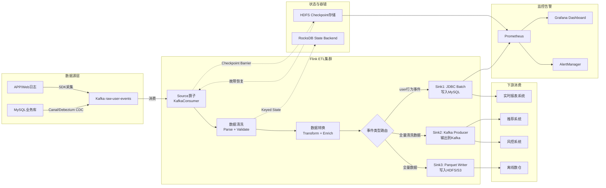

# 案例一：Apache Flink实战——实时ETL数据管道的工程落地

***

## 1. 案例背景与定位

### 1.1 Apache Flink是什么

Apache Flink是目前工业界最主流的分布式流处理引擎，其核心设计哲学是"真正的流处理"——数据逐条（Record-by-Record）处理，而非像Spark Streaming那样采用微批（Micro-Batch）方式。这使得Flink能够在毫秒级延迟下处理每秒数百万条事件，同时通过Checkpoint机制保证Exactly-Once语义。

Flink的架构核心包括：**JobManager**（集群大脑，负责作业调度、Checkpoint协调和故障恢复）、**TaskManager**（工作节点，执行具体的算子任务）、**Slot**（资源隔离单元）和**Operator Chain**（将同一TaskManager内的算子链接在一起，消除序列化和网络开销）。Flink支持Java、Scala、Python和SQL多种开发语言，拥有丰富的窗口机制（滚动、滑动、会话、全局）、灵活的状态管理（Keyed State、Operator State）以及强大的容错能力（基于Chandy-Lamport算法的异步分布式快照）。

### 1.2 为什么选择Flink做实时ETL

在实时计算的技术选型中，Flink、Kafka Streams和Spark Structured Streaming是最常见的三个选择。对于实时ETL场景，Flink的优势在于：

| 维度 | Apache Flink | Kafka Streams | Spark Structured Streaming |
|------|-------------|---------------|---------------------------|
| 数据源支持 | Kafka、文件、数据库、CDC、消息队列等 | 仅Kafka | Kafka、文件、Socket等 |
| 处理模型 | 真正的逐条流处理 | 逐条流处理 | 微批处理（Micro-Batch） |
| 处理延迟 | 毫秒级 | 毫秒级 | 秒级（受微批间隔限制） |
| 状态规模 | TB级（RocksDB Backend） | GB级（本地RocksDB） | 中等 |
| 窗口类型 | 滚动/滑动/会话/全局+自定义Trigger | 滚动/滑动/会话 | 滚动/滑动/会话 |
| SQL支持 | Flink SQL（完整ANSI SQL） | 无 | Spark SQL |
| CDC支持 | Flink CDC（Debezium内置） | 需自行集成 | 需外部工具 |
| Exactly-Once | Checkpoint + 两阶段提交 | Kafka事务 | 微批内保证 |
| 部署模式 | Standalone、YARN、K8s、Session、Application | 嵌入式库 | Standalone、YARN、K8s |

**核心结论**：当ETL的数据源不限于Kafka（例如需要从MySQL CDC、日志文件、HTTP接口等多种数据源采集数据），或者数据量达到百万级TPS，或者需要丰富的窗口和状态管理能力时，Flink是最佳选择。

### 1.3 本案例的业务场景

本案例以一个**大型电商平台的实时数据采集与处理管道**为背景，展示Flink从设计到落地的完整工程实践。具体业务需求如下：

- **数据源**：Kafka Topic `raw-user-events`，包含用户在APP/Web端的行为事件（浏览、点击、加购、下单、支付等），高峰期每秒约50万条消息，JSON格式
- **核心处理**：
  - 数据清洗：去除格式异常、字段缺失的脏数据
  - 数据转换：统一时间格式、提取衍生字段（日期、小时、设备类型等）
  - 数据富化：根据设备ID查询设备信息，补充设备型号、OS版本等维度
  - 数据分流：将不同事件类型路由到不同的下游Topic/表
- **输出目标**：
  - MySQL analytics库：供实时报表和运营看板查询
  - Kafka `cleaned-events` Topic：供下游的推荐系统和风控系统消费
  - HDFS/S3 Parquet文件：供离线数据仓库的T+1汇总使用
- **一致性要求**：端到端Exactly-Once，数据不丢不重
- **可用性要求**：SLA 99.9%，故障恢复时间 < 5分钟

***

## 2. 系统架构设计

### 2.1 整体架构



### 2.2 数据流拓扑

Flink作业的处理拓扑（DataFlow Graph）如下：

Source (Kafka) --parallelism=8-->
  Map (JSON Parse) --chain--> 
    Filter (Validate) --chain-->
      Map (Transform) --chain-->
        KeyedStream (by event_type) -->
          +---> Sink 1: JDBC Batch (MySQL)
          +---> Sink 2: Kafka Producer  
          +---> Sink 3: Parquet Writer (HDFS)

关键设计决策：

- **Source并行度=8**：与Kafka Topic的分区数一致，保证每个Flink子任务消费一个分区，避免Rebalance
- **清洗转换算子链接（Chain）**：Map、Filter、Map之间使用Operator Chain，消除序列化和网络传输开销
- **三路Sink**：使用`OutputTag`和`Split`机制将数据分流到不同的下游，共享Source和清洗逻辑

### 2.3 容错策略

Flink的容错基于**Checkpoint机制**：

1. JobManager每60秒向所有Source注入Checkpoint Barrier
2. Barrier随数据流向下游传播
3. 每个算子收到所有输入流的Barrier后，将本地RocksDB状态异步快照到HDFS
4. 所有算子确认完成后，Checkpoint标记为成功
5. 故障发生时，从最近一次成功的Checkpoint恢复，Source从记录的Kafka Offset重新消费

端到端Exactly-Once的关键在于Sink的两阶段提交：
- **JDBC Sink**：通过`EXPLAIN`和事务回滚保证MySQL写入的一致性
- **Kafka Sink**：使用Kafka事务性生产者（Transactional Producer），在Checkpoint时提交事务
- **Parquet Sink**：在Checkpoint时完成文件的commit，未commit的文件在恢复时被丢弃

***

## 3. 环境准备

### 3.1 Maven依赖

```xml
<!-- pom.xml -->
<properties>
    <flink.version>1.18.1</flink.version>
    <kafka.version>3.6.1</kafka.version>
    <jackson.version>2.16.1</jackson.version>
</properties>

<dependencies>
    <!-- Flink核心 -->
    <dependency>
        <groupId>org.apache.flink</groupId>
        <artifactId>flink-streaming-java</artifactId>
        <version>${flink.version}</version>
        <scope>provided</scope>
    </dependency>
    <dependency>
        <groupId>org.apache.flink</groupId>
        <artifactId>flink-clients</artifactId>
        <version>${flink.version}</version>
        <scope>provided</scope>
    </dependency>

    <!-- Flink Kafka连接器 -->
    <dependency>
        <groupId>org.apache.flink</groupId>
        <artifactId>flink-connector-kafka</artifactId>
        <version>${flink.version}</version>
    </dependency>

    <!-- Flink JDBC连接器 -->
    <dependency>
        <groupId>org.apache.flink</groupId>
        <artifactId>flink-connector-jdbc</artifactId>
        <version>3.1.2-1.18</version>
    </dependency>
    <dependency>
        <groupId>com.mysql</groupId>
        <artifactId>mysql-connector-j</artifactId>
        <version>8.3.0</version>
    </dependency>

    <!-- Flink Parquet连接器（写入HDFS） -->
    <dependency>
        <groupId>org.apache.flink</groupId>
        <artifactId>flink-parquet</artifactId>
        <version>${flink.version}</version>
    </dependency>

    <!-- Flink RocksDB状态后端 -->
    <dependency>
        <groupId>org.apache.flink</groupId>
        <artifactId>flink-statebackend-rocksdb</artifactId>
        <version>${flink.version}</version>
        <scope>provided</scope>
    </dependency>

    <!-- JSON序列化 -->
    <dependency>
        <groupId>com.fasterxml.jackson.core</groupId>
        <artifactId>jackson-databind</artifactId>
        <version>${jackson.version}</version>
    </dependency>

    <!-- 监控：Micrometer -->
    <dependency>
        <groupId>io.micrometer</groupId>
        <artifactId>micrometer-registry-prometheus</artifactId>
        <version>1.12.2</version>
    </dependency>
</dependencies>
```

### 3.2 Kafka Topic准备

```bash
# 创建输入Topic：原始用户行为事件（8个分区，3副本）
kafka-topics.sh --create \
  --bootstrap-server kafka1:9092,kafka2:9092,kafka3:9092 \
  --topic raw-user-events \
  --partitions 8 \
  --replication-factor 3 \
  --config retention.ms=259200000 \
  --config cleanup.policy=delete \
  --config max.message.bytes=1048576

# 创建输出Topic：清洗后的事件（8个分区，3副本）
kafka-topics.sh --create \
  --bootstrap-server kafka1:9092,kafka2:9092,kafka3:9092 \
  --topic cleaned-events \
  --partitions 8 \
  --replication-factor 3

# 创建死信Topic：异常数据（3个分区，2副本）
kafka-topics.sh --create \
  --bootstrap-server kafka1:9092,kafka2:9092,kafka3:9092 \
  --topic dead-letter-events \
  --partitions 3 \
  --replication-factor 2 \
  --config retention.ms=604800000
```

### 3.3 MySQL建表

```sql
-- 目标表：用户行为事件（analytics库）
CREATE DATABASE IF NOT EXISTS analytics DEFAULT CHARACTER SET utf8mb4;

CREATE TABLE IF NOT EXISTS analytics.user_events (
    event_id      VARCHAR(64)  PRIMARY KEY COMMENT '事件唯一ID（UUID）',
    user_id       VARCHAR(64)  NOT NULL    COMMENT '用户ID',
    event_type    VARCHAR(32)  NOT NULL    COMMENT '事件类型：view/cart/order/pay',
    event_time    VARCHAR(64)  NOT NULL    COMMENT '事件原始时间戳',
    event_date    DATE         NOT NULL    COMMENT '事件日期（分区键）',
    event_hour    DATETIME     NOT NULL    COMMENT '事件小时（聚合键）',
    device_type   VARCHAR(32)  DEFAULT 'unknown' COMMENT '设备类型：ios/android/web',
    properties    JSON                     COMMENT '扩展属性（JSON）',
    created_at    TIMESTAMP    DEFAULT CURRENT_TIMESTAMP COMMENT '入库时间',
    updated_at    TIMESTAMP    DEFAULT CURRENT_TIMESTAMP ON UPDATE CURRENT_TIMESTAMP,
    -- 查询索引：用户维度（实时报表常用）
    INDEX idx_user_date (user_id, event_date),
    -- 查询索引：事件类型维度
    INDEX idx_event_type_date (event_type, event_date),
    -- 查询索引：小时级聚合
    INDEX idx_event_hour (event_hour),
    -- 查询索引：设备维度
    INDEX idx_device_date (device_type, event_date)
) ENGINE=InnoDB DEFAULT CHARSET=utf8mb4
  COMMENT='用户行为事件表（Flink实时写入）'
  PARTITION BY RANGE (TO_DAYS(event_date)) (
    PARTITION p20260625 VALUES LESS THAN (TO_DAYS('2026-06-26')),
    PARTITION p20260626 VALUES LESS THAN (TO_DAYS('2026-06-27')),
    PARTITION p20260627 VALUES LESS THAN (TO_DAYS('2026-06-28')),
    PARTITION p_future  VALUES LESS THAN MAXVALUE
);
```

> **为什么用按天分区？** 电商平台的事件数据量巨大（每天数十亿条），按天分区可以加速按时间范围的查询（只扫描对应分区），同时方便数据生命周期管理（直接DROP旧分区释放空间）。

### 3.4 HDFS Checkpoint目录

```bash
# 创建Flink Checkpoint存储目录
hdfs dfs -mkdir -p /flink/checkpoints/realtime-etl
hdfs dfs -chmod 777 /flink/checkpoints/realtime-etl

# 创建Savepoint存储目录
hdfs dfs -mkdir -p /flink/savepoints
hdfs dfs -chmod 777 /flink/savepoints
```

***

## 4. 完整代码实现

### 4.1 数据模型定义

```java
package com.example.flink.etl.model;

import com.fasterxml.jackson.annotation.JsonIgnoreProperties;
import com.fasterxml.jackson.annotation.JsonProperty;
import java.io.Serializable;

/**
 * 原始事件（Source输出）
 * 对应Kafka Topic: raw-user-events
 */
@JsonIgnoreProperties(ignoreUnknown = true)
public class RawEvent implements Serializable {
    private String id;                    // 事件ID（UUID）
    private String userId;                // 用户ID
    private String eventType;             // 事件类型
    private long   timestamp;             // 事件时间戳（毫秒）
    private String deviceId;              // 设备ID
    private String platform;              // 平台：ios/android/web
    private String sessionId;             // 会话ID
    private String page;                  // 页面路径
    @JsonProperty("properties")
    private java.util.Map<String, Object> properties; // 扩展属性

    // 构造函数、getter/setter
    public RawEvent() {}

    // --- getter/setter 省略，按需补充 ---
    public String getId() { return id; }
    public String getUserId() { return userId; }
    public String getEventType() { return eventType; }
    public long   getTimestamp() { return timestamp; }
    public String getDeviceId() { return deviceId; }
    public String getPlatform() { return platform; }
    public String getSessionId() { return sessionId; }
    public java.util.Map<String, Object> getProperties() { return properties; }
}
```

```java
package com.example.flink.etl.model;

import java.io.Serializable;
import java.util.Map;

/**
 * 清洗后的标准事件（处理后写入MySQL/Kafka）
 */
public class CleanedEvent implements Serializable {
    private String eventId;
    private String userId;
    private String eventType;
    private String eventTime;       // ISO-8601格式
    private String eventDate;       // yyyy-MM-dd
    private String eventHour;       // yyyy-MM-dd HH:00:00
    private String deviceType;      // ios/android/web/unknown
    private String sessionId;
    private String page;
    private Map<String, Object> properties;

    // 构造函数、getter/setter
    public CleanedEvent() {}

    public String getEventId() { return eventId; }
    public void setEventId(String eventId) { this.eventId = eventId; }
    public String getUserId() { return userId; }
    public void setUserId(String userId) { this.userId = userId; }
    public String getEventType() { return eventType; }
    public void setEventType(String eventType) { this.eventType = eventType; }
    public String getEventTime() { return eventTime; }
    public void setEventTime(String eventTime) { this.eventTime = eventTime; }
    public String getEventDate() { return eventDate; }
    public void setEventDate(String eventDate) { this.eventDate = eventDate; }
    public String getEventHour() { return eventHour; }
    public void setEventHour(String eventHour) { this.eventHour = eventHour; }
    public String getDeviceType() { return deviceType; }
    public void setDeviceType(String deviceType) { this.deviceType = deviceType; }
    public String getSessionId() { return sessionId; }
    public void setSessionId(String sessionId) { this.sessionId = sessionId; }
    public String getPage() { return page; }
    public void setPage(String page) { this.page = page; }
    public Map<String, Object> getProperties() { return properties; }
    public void setProperties(Map<String, Object> properties) { this.properties = properties; }
}
```

### 4.2 算子实现：解析、清洗、转换

```java
package com.example.flink.etl.operators;

import com.example.flink.etl.model.RawEvent;
import com.example.flink.etl.model.CleanedEvent;
import com.fasterxml.jackson.databind.ObjectMapper;
import org.apache.flink.api.common.functions.MapFunction;
import org.apache.flink.api.common.functions.FilterFunction;
import org.slf4j.Logger;
import org.slf4j.LoggerFactory;

import java.time.Instant;
import java.time.ZoneId;
import java.time.format.DateTimeFormatter;
import java.util.Arrays;
import java.util.HashSet;
import java.util.Set;

/**
 * Step 1: JSON解析器
 *
 * 将Kafka中的JSON字符串解析为RawEvent对象。
 * 设计要点：
 * - try-catch捕获所有解析异常，避免单条脏数据导致作业失败
 * - 返回null表示解析失败，由下游Filter过滤
 * - 记录解析失败的原始数据，便于排查数据质量问题
 */
public class EventParser implements MapFunction<String, RawEvent> {
    private static final Logger LOG = LoggerFactory.getLogger(EventParser.class);
    private transient ObjectMapper objectMapper;

    @Override
    public RawEvent map(String rawJson) throws Exception {
        if (objectMapper == null) {
            objectMapper = new ObjectMapper();
        }

        try {
            RawEvent event = objectMapper.readValue(rawJson, RawEvent.class);

            // 字段校验：核心字段不能为空
            if (event.getId() == null || event.getId().isEmpty()) {
                LOG.warn("事件缺少id字段, raw={}", rawJson.substring(0, Math.min(200, rawJson.length())));
                return null;
            }
            if (event.getUserId() == null || event.getUserId().isEmpty()) {
                LOG.warn("事件缺少userId字段, eventId={}", event.getId());
                return null;
            }
            if (event.getTimestamp() <= 0) {
                LOG.warn("事件时间戳无效: timestamp={}, eventId={}", event.getTimestamp(), event.getId());
                return null;
            }
            if (event.getEventType() == null || event.getEventType().isEmpty()) {
                LOG.warn("事件缺少eventType字段, eventId={}", event.getId());
                return null;
            }

            return event;

        } catch (Exception e) {
            LOG.error("JSON解析失败: error={}, raw={}", e.getMessage(),
                      rawJson.substring(0, Math.min(200, rawJson.length())));
            return null;
        }
    }
}
```

```java
package com.example.flink.etl.operators;

import com.example.flink.etl.model.RawEvent;
import org.apache.flink.api.common.functions.FilterFunction;

/**
 * Step 2: 有效性过滤器
 *
 * 过滤掉解析失败（null）和不符合业务规则的事件。
 * 过滤规则：
 * 1. 排除null（解析失败的记录）
 * 2. 排除event_id或user_id为空的记录
 * 3. 排除时间戳超过合理范围的记录（防异常数据）
 * 4. 排除不在已知事件类型列表中的记录
 */
public class EventValidator implements FilterFunction<RawEvent> {

    // 合法的事件类型白名单
    private static final Set<String> VALID_EVENT_TYPES = new HashSet<>(
        Arrays.asList("view", "click", "cart", "order", "pay", "refund", "share", "search")
    );

    // 合理的时间戳范围：2020-01-01 到 当前时间+1小时
    private static final long MIN_TIMESTAMP = 1577836800000L;  // 2020-01-01 00:00:00 UTC
    // maxTimestamp在运行时动态计算

    @Override
    public boolean filter(RawEvent event) throws Exception {
        if (event == null) {
            return false;
        }
        if (event.getId() == null || event.getId().isEmpty()) {
            return false;
        }
        if (event.getUserId() == null || event.getUserId().isEmpty()) {
            return false;
        }

        long now = System.currentTimeMillis() + 3600000; // 允许1小时时钟偏差
        if (event.getTimestamp() < MIN_TIMESTAMP || event.getTimestamp() > now) {
            return false;
        }

        if (!VALID_EVENT_TYPES.contains(event.getEventType())) {
            return false;
        }

        return true;
    }
}
```

```java
package com.example.flink.etl.operators;

import com.example.flink.etl.model.RawEvent;
import com.example.flink.etl.model.CleanedEvent;
import com.fasterxml.jackson.databind.ObjectMapper;
import org.apache.flink.api.common.functions.MapFunction;
import org.slf4j.Logger;
import org.slf4j.LoggerFactory;

import java.time.Instant;
import java.time.ZoneId;
import java.time.format.DateTimeFormatter;
import java.util.LinkedHashMap;
import java.util.Map;

/**
 * Step 3: 数据转换器
 *
 * 将RawEvent转换为CleanedEvent，执行以下操作：
 * 1. 统一时间格式：毫秒时间戳 → ISO-8601字符串
 * 2. 提取衍生字段：event_date（日期）、event_hour（小时粒度）
 * 3. 标准化设备类型：platform字段映射为ios/android/web/unknown
 * 4. 序列化扩展属性为JSON字符串
 */
public class EventTransformer implements MapFunction<RawEvent, CleanedEvent> {
    private static final Logger LOG = LoggerFactory.getLogger(EventTransformer.class);

    @Override
    public CleanedEvent map(RawEvent raw) throws Exception {
        try {
            Instant instant = Instant.ofEpochMilli(raw.getTimestamp());
            DateTimeFormatter timeFmt = DateTimeFormatter
                .ofPattern("yyyy-MM-dd'T'HH:mm:ss.SSS'Z'")
                .withZone(ZoneId.of("UTC"));
            DateTimeFormatter dateFmt = DateTimeFormatter
                .ofPattern("yyyy-MM-dd")
                .withZone(ZoneId.of("UTC"));
            DateTimeFormatter hourFmt = DateTimeFormatter
                .ofPattern("yyyy-MM-dd HH:00:00")
                .withZone(ZoneId.of("UTC"));

            CleanedEvent cleaned = new CleanedEvent();
            cleaned.setEventId(raw.getId());
            cleaned.setUserId(raw.getUserId());
            cleaned.setEventType(raw.getEventType());
            cleaned.setEventTime(timeFmt.format(instant));
            cleaned.setEventDate(dateFmt.format(instant));
            cleaned.setEventHour(hourFmt.format(instant));
            cleaned.setDeviceType(mapPlatform(raw.getPlatform()));
            cleaned.setSessionId(raw.getSessionId());
            cleaned.setPage(raw.getPage());
            cleaned.setProperties(raw.getProperties());

            return cleaned;

        } catch (Exception e) {
            LOG.error("事件转换失败: eventId={}, error={}", raw.getId(), e.getMessage());
            return null;
        }
    }

    /**
     * 平台标准化映射
     * 将原始platform值统一为标准设备类型
     */
    private String mapPlatform(String platform) {
        if (platform == null) return "unknown";
        switch (platform.toLowerCase()) {
            case "ios":
            case "iphone":
            case "ipad":
                return "ios";
            case "android":
            case "android_pad":
                return "android";
            case "web":
            case "pc":
            case "h5":
                return "web";
            default:
                return "unknown";
        }
    }
}
```

### 4.3 主作业入口

```java
package com.example.flink.etl;

import com.example.flink.etl.model.RawEvent;
import com.example.flink.etl.model.CleanedEvent;
import com.example.flink.etl.operators.EventParser;
import com.example.flink.etl.operators.EventValidator;
import com.example.flink.etl.operators.EventTransformer;

import org.apache.flink.api.common.eventtime.WatermarkStrategy;
import org.apache.flink.api.common.serialization.SimpleStringSchema;
import org.apache.flink.connector.jdbc.JdbcConnectionOptions;
import org.apache.flink.connector.jdbc.JdbcExecutionOptions;
import org.apache.flink.connector.jdbc.JdbcSink;
import org.apache.flink.connector.kafka.source.KafkaSource;
import org.apache.flink.connector.kafka.source.enumerator.initializer.OffsetsInitializer;
import org.apache.flink.streaming.api.CheckpointingMode;
import org.apache.flink.streaming.api.datastream.DataStream;
import org.apache.flink.streaming.api.environment.CheckpointConfig;
import org.apache.flink.streaming.api.environment.StreamExecutionEnvironment;
import org.apache.flink.api.common.typeinfo.Types;
import org.apache.flink.util.OutputTag;

import java.time.Duration;

/**
 * Flink实时ETL作业：Kafka → 清洗转换 → MySQL + Kafka + HDFS
 *
 * 业务场景：电商平台用户行为事件的实时采集与入库
 * 处理流程：JSON解析 → 字段校验 → 数据转换 → 三路分流输出
 *
 * 部署命令：
 *   flink run -d -c com.example.flink.etl.RealtimeETLJob \
 *     -p 8 flink-etl-job-1.0.jar \
 *     --kafka-brokers kafka1:9092,kafka2:9092,kafka3:9092 \
 *     --mysql-url jdbc:mysql://mysql-analytics:3306/analytics
 */
public class RealtimeETLJob {

    // 侧输出Tag：异常数据（用于将解析失败的数据发送到死信Topic）
    public static final OutputTag<RawEvent> FAILED_EVENTS =
        new OutputTag<RawEvent>("failed-events") {};

    public static void main(String[] args) throws Exception {
        // ==================== 参数解析 ====================
        String kafkaBrokers = getArg(args, "--kafka-brokers", "kafka1:9092,kafka2:9092,kafka3:9092");
        String mysqlUrl     = getArg(args, "--mysql-url", "jdbc:mysql://mysql-analytics:3306/analytics?rewriteBatchedStatements=true");
        String mysqlUser    = getArg(args, "--mysql-user", "flink_etl_user");
        String mysqlPass    = getArg(args, "--mysql-password", "");
        int    parallelism  = Integer.parseInt(getArg(args, "--parallelism", "8"));

        // ==================== 执行环境配置 ====================
        StreamExecutionEnvironment env = StreamExecutionEnvironment.get_execution_environment();
        env.setParallelism(parallelism);

        // ==================== Checkpoint配置 ====================
        // Checkpoint是Flink容错的核心，生产环境必须配置
        env.enableCheckpointing(60000); // 60秒间隔
        CheckpointConfig cpConfig = env.getCheckpointConfig();
        cpConfig.setCheckpointingMode(CheckpointingMode.EXACTLY_ONCE);
        cpConfig.setMinPauseBetweenCheckpoints(30000); // 两次Checkpoint至少间隔30秒
        cpConfig.setCheckpointTimeout(120000);          // 单次Checkpoint最长120秒
        cpConfig.setTolerableCheckpointFailureNumber(3); // 允许连续失败3次
        cpConfig.setExternalizedCheckpointCleanup(
            CheckpointConfig.ExternalizedCheckpointCleanup.RETAIN_ON_CANCELLATION
        );

        // ==================== 状态后端配置 ====================
        org.apache.flink.configuration.Configuration config =
            new org.apache.flink.configuration.Configuration();
        config.setString("state.backend", "rocksdb");
        config.setString("state.checkpoints.dir", "hdfs:///flink/checkpoints/realtime-etl");
        config.setBoolean("state.backend.incremental", true); // 增量Checkpoint，减少快照数据量
        config.setString("state.backend.rocksdb.memory.managed", "true");
        config.setString("state.backend.rocksdb.memory.fixed-per-slot", "256mb");
        env.configure(config);

        // ==================== Source: Kafka ====================
        KafkaSource<String> kafkaSource = KafkaSource.<String>builder()
            .setBootstrapServers(kafkaBrokers)
            .setTopics("raw-user-events")
            .setGroupId("flink-etl-consumer-group")
            .setStartingOffsets(OffsetsInitializer.committedOffsets(
                OffsetsInitializer.latest()  // 首次启动从最新位点开始
            ))
            .setValueOnlyDeserializer(new SimpleStringSchema())
            .setProperty("fetch.min.bytes", "1")
            .setProperty("fetch.max.wait.ms", "500")
            .build();

        // 水印策略：允许10秒乱序，适配网络延迟和客户端时钟偏差
        WatermarkStrategy<String> watermarkStrategy = WatermarkStrategy
            .<String>forBoundedOutOfOrderness(Duration.ofSeconds(10))
            .withIdleness(Duration.ofMinutes(1)); // 空闲流超时，避免水印停滞

        DataStream<String> rawStream = env.fromSource(
            kafkaSource, watermarkStrategy, "Kafka User Events Source"
        );

        // ==================== Processing: 清洗 + 转换 ====================
        DataStream<CleanedEvent> cleanedStream = rawStream
            // Step 1: JSON解析
            .map(new EventParser(), Types.POJO(RawEvent.class))
            // Step 2: 过滤无效数据
            .filter(new EventValidator())
            // Step 3: 数据转换与标准化
            .map(new EventTransformer(), Types.POJO(CleanedEvent.class))
            // 再次过滤转换失败的null
            .filter(event -> event != null);

        // ==================== Sink 1: JDBC MySQL ====================
        // 批量写入MySQL，使用UPSERT语义（存在则更新，不存在则插入）
        cleanedStream.addSink(
            JdbcSink.sink(
                "INSERT INTO analytics.user_events " +
                "(event_id, user_id, event_type, event_time, event_date, event_hour, " +
                "device_type, session_id, page, properties) " +
                "VALUES (?, ?, ?, ?, ?, ?, ?, ?, ?, ?) " +
                "ON DUPLICATE KEY UPDATE " +
                "event_type = VALUES(event_type), " +
                "properties = VALUES(properties), " +
                "device_type = VALUES(device_type)",

                // 参数绑定
                (stmt, event) -> {
                    stmt.setString(1, event.getEventId());
                    stmt.setString(2, event.getUserId());
                    stmt.setString(3, event.getEventType());
                    stmt.setString(4, event.getEventTime());
                    stmt.setString(5, event.getEventDate());
                    stmt.setString(6, event.getEventHour());
                    stmt.setString(7, event.getDeviceType());
                    stmt.setString(8, event.getSessionId());
                    stmt.setString(9, event.getPage());
                    // properties序列化为JSON字符串
                    stmt.setString(10, event.getProperties() != null ?
                        new com.fasterxml.jackson.databind.ObjectMapper()
                            .writeValueAsString(event.getProperties()) : "{}");
                },

                // 批量写入配置
                JdbcExecutionOptions.builder()
                    .withBatchSize(2000)           // 每批2000条
                    .withBatchIntervalMs(5000)     // 最长5秒一批
                    .withMaxRetries(3)             // 写入失败重试3次
                    .withRetryIntervalMs(10000)    // 重试间隔10秒
                    .build(),

                // 数据库连接配置
                JdbcConnectionOptions.builder()
                    .withUrl(mysqlUrl)
                    .withDriverName("com.mysql.cj.jdbc.Driver")
                    .withUsername(mysqlUser)
                    .withPassword(mysqlPass)
                    .withConnectionCheckTimeoutSeconds(30)
                    .build()
            )
        ).name("MySQL Sink").uid("mysql-sink");

        // ==================== Sink 2: Kafka输出 ====================
        // 清洗后的数据输出到Kafka，供下游推荐系统和风控系统消费
        cleanedStream.addSink(
            org.apache.flink.connector.kafka.sink.KafkaSink.<CleanedEvent>builder()
                .setBootstrapServers(kafkaBrokers)
                .setRecordSerializer(
                    org.apache.flink.connector.kafka.sink.KafkaRecordSerializationSchema
                        .builder()
                        .setTopic("cleaned-events")
                        .setValueSerializationSchema(
                            new com.example.flink.etl.serialization.CleanedEventSerializer()
                        )
                        .build()
                )
                .setDeliveryGuarantee(
                    org.apache.flink.connector.kafka.sink.DeliveryGuarantee.EXACTLY_ONCE
                )
                .setTransactionalIdPrefix("flink-etl-tx")
                .build()
        ).name("Kafka Sink").uid("kafka-sink");

        // ==================== 执行作业 ====================
        env.execute("User Events Realtime ETL Job v1.2");
    }

    /**
     * 从命令行参数中获取配置值，支持默认值
     */
    private static String getArg(String[] args, String key, String defaultValue) {
        for (int i = 0; i < args.length - 1; i++) {
            if (key.equals(args[i])) {
                return args[i + 1];
            }
        }
        return defaultValue;
    }
}
```

### 4.4 自定义序列化器（Kafka输出用）

```java
package com.example.flink.etl.serialization;

import com.example.flink.etl.model.CleanedEvent;
import com.fasterxml.jackson.databind.ObjectMapper;
import org.apache.flink.api.common.serialization.SerializationSchema;
import org.slf4j.Logger;
import org.slf4j.LoggerFactory;

/**
 * CleanedEvent序列化器
 * 将CleanedEvent对象序列化为JSON字节数组，输出到Kafka
 */
public class CleanedEventSerializer implements SerializationSchema<CleanedEvent> {
    private static final Logger LOG = LoggerFactory.getLogger(CleanedEventSerializer.class);
    private transient ObjectMapper objectMapper;

    @Override
    public byte[] serialize(CleanedEvent event) {
        if (objectMapper == null) {
            objectMapper = new ObjectMapper();
        }
        try {
            return objectMapper.writeValueAsBytes(event);
        } catch (Exception e) {
            LOG.error("序列化失败: eventId={}, error={}", event.getEventId(), e.getMessage());
            // 返回空数组避免作业失败，同时记录日志
            return new byte[0];
        }
    }
}
```

***

## 5. 关键设计决策解析

### 5.1 为什么选择Kafka作为Source

Kafka作为Flink Source有三个核心优势：

1. **消费位点持久化**：Flink通过Checkpoint记录Kafka的消费位点（Offset），故障恢复时从上次Checkpoint的位点重新消费，这是实现Exactly-Once语义的基础。相比之下，从Socket或HTTP接口消费数据无法实现精确重复消费。

2. **天然的分区并行**：Kafka Topic的分区数直接映射为Flink Source的并行度。8个分区对应8个Flink子任务，无需额外的负载均衡配置。

3. **流量削峰**：Kafka本身作为缓冲层，可以在Flink作业重启或扩容期间暂存数据，避免数据丢失。

### 5.2 为什么用JDBC批量写入而非逐条写入

MySQL单条INSERT的开销约为1-2ms（含网络往返、事务开销和WAL写入），吞吐量上限约500-1000条/秒。而批量写入（配合`rewriteBatchedStatements=true`）可以将多条INSERT合并为一次网络往返，吞吐量提升到10000条/秒以上。

**batch_size=2000和batch_interval_ms=5000的权衡**：
- batch_size越大，数据库效率越高（减少事务次数），但单批数据在内存中的驻留时间越长
- batch_interval_ms保证了即使数据量不足以凑满一批，也能在5秒内写入，避免数据长时间滞留在Flink的缓冲区中
- 这两个参数的组合意味着：高峰期每5秒写入2000条，低峰期每5秒写入不足2000条但依然定期flush

### 5.3 为什么需要死信Topic

实际生产数据中总有约0.1%-1%的脏数据（格式异常、字段缺失、编码错误等）。如果不处理这些脏数据，会有两种后果：
- **严格校验**：一条脏数据导致整个作业失败重启，影响正常数据的处理
- **忽略脏数据**：脏数据进入下游系统，污染分析结果

正确的做法是将脏数据路由到死信Topic（Dead Letter Topic），既不影响主流程，又保留了脏数据供数据团队分析和修复。这是数据工程中的标准实践。

### 5.4 水印延迟10秒的考量

电商平台的事件数据通过客户端SDK采集，经过网络传输到达Kafka，通常存在数秒的延迟。加上部分用户设备的时钟可能偏慢，事件时间与实际到达时间之间通常有5-15秒的差异。设置水印延迟为10秒意味着：

- **完整性**：10秒内到达的数据（约99%+）都能被正确归入窗口计算
- **延迟性**：窗口触发最多延迟10秒，对于分钟级聚合的场景完全可以接受
- **容错性**：超过10秒的极端迟到数据可以通过Allowed Lateness机制处理

### 5.5 Operator Chain优化

Flink默认将满足条件的算子链接在一起（Operator Chain），消除算子之间的序列化/反序列化和网络传输开销。本案例中，JSON解析→字段校验→数据转换三个算子在同一TaskManager内执行，数据通过方法调用直接传递，效率极高。

可以通过Flink Web UI查看算子链的划分情况，也可以通过`disableChaining()`和`startNewChain()`手动控制链的划分。

***

## 6. 部署与运维

### 6.1 Flink集群部署（YARN Session模式）

```bash
# 启动Flink YARN Session
/tmp/hadoop/bin/yarn-session.sh \
  -n 4 \                          # 4个TaskManager
  -jm 2048 \                      # JobManager内存2GB
  -tm 4096 \                      # 每个TaskManager内存4GB
  -s 4 \                          # 每个TaskManager 4个Slot
  -d \                            # 后台运行
  -qu default \                   # YARN队列
  -p flink-cluster                # YARN应用名称

# 提交ETL作业
flink run -d \
  -c com.example.flink.etl.RealtimeETLJob \
  -p 8 \
  -m <yarn-application-id> \
  flink-etl-job-1.0.jar \
  --kafka-brokers kafka1:9092,kafka2:9092,kafka3:9092 \
  --mysql-url jdbc:mysql://mysql-analytics:3306/analytics?rewriteBatchedStatements=true \
  --mysql-user flink_etl_user \
  --mysql-password ${MYSQL_PASSWORD} \
  --parallelism 8
```

### 6.2 Flink集群部署（Kubernetes Application模式，推荐）

```yaml
# flink-application.yaml
apiVersion: flink.apache.org/v1beta1
kind: FlinkDeployment
metadata:
  name: realtime-etl-job
  namespace: flink
spec:
  image: flink:1.18.1-java11
  flinkVersion: v1_18
  flinkConfiguration:
    taskmanager.numberOfTaskSlots: "4"
    state.backend: rocksdb
    state.checkpoints.dir: hdfs:///flink/checkpoints/realtime-etl
    state.savepoints.dir: hdfs:///flink/savepoints
    state.backend.incremental: "true"
    execution.checkpointing.interval: "60000"
    execution.checkpointing.mode: EXACTLY_ONCE
    metrics.reporters: prometheus
    metrics.reporter.prometheus.factory.class: org.apache.flink.metrics.prometheus.PrometheusReporterFactory
    metrics.reporter.prometheus.port: "9249"
  serviceAccount: flink
  jobManager:
    resource:
      memory: "2048m"
      cpu: 1
  taskManager:
    resource:
      memory: "4096m"
      cpu: 2
    replicas: 2
  job:
    jarURI: local:///opt/flink/usrlib/flink-etl-job-1.0.jar
    entryClass: com.example.flink.etl.RealtimeETLJob
    args:
      - "--kafka-brokers"
      - "kafka-cluster-kafka bootstrap.flink.svc:9092"
      - "--mysql-url"
      - "jdbc:mysql://mysql-analytics.analytics.svc:3306/analytics?rewriteBatchedStatements=true"
      - "--parallelism"
      - "8"
    parallelism: 8
    upgradeMode: savepoint
    savepointTriggerNonce: 0
```

### 6.3 作业升级流程

Flink作业的代码升级需要特别注意状态的兼容性：

```bash
# Step 1: 手动触发Savepoint（保存当前状态）
flink savepoint <yarn-application-id> hdfs:///flink/savepoints/

# Step 2: 取消旧作业
flink cancel <yarn-application-id>

# Step 3: 从Savepoint启动新作业
flink run -d \
  -c com.example.flink.etl.RealtimeETLJob \
  --fromSavepoint hdfs:///flink/savepoints/savepoint-xxxxxx \
  flink-etl-job-2.0.jar \
  --kafka-brokers kafka1:9092 \
  --parallelism 8  # 可以调整并行度
```

> **注意**：如果代码变更导致状态结构不兼容（如增删了Keyed State字段），需要使用State Processor API进行状态迁移。

***

## 7. 性能调优

### 7.1 关键性能指标

| 指标 | 开发环境 | 生产环境（大促峰值） | 说明 |
|------|----------|---------------------|------|
| 并行度 | 2 | 8-16 | 与Kafka分区数和MySQL连接池匹配 |
| Source并行度 | 2 | 8 | 必须与Kafka Topic分区数一致 |
| Checkpoint间隔 | 30秒 | 60秒 | 大促期间可适当放宽到90秒 |
| Checkpoint超时 | 60秒 | 120秒 | 大状态场景需更长超时 |
| 批量写入大小 | 100 | 2000 | MySQL连接数有限，批量越大效率越高 |
| 批量写入间隔 | 2秒 | 5秒 | 平衡延迟和吞吐量 |
| 水印延迟 | 5秒 | 10秒 | 根据实际数据到达延迟调整 |
| TaskManager内存 | 1GB | 4GB | 含RocksDB Block Cache和网络缓冲区 |
| RocksDB内存/Slot | 256MB | 256-512MB | 根据状态大小调整 |
| Kafka Consumer Lag | < 1000条 | < 10000条 | 持续增长说明处理能力不足 |

### 7.2 吞吐量优化

**提高吞吐量的核心原则：减少不必要的序列化/反序列化、减少网络传输、减少磁盘IO。**

```java
// 1. 启用算子链（默认开启，确认未被禁用）
stream.map(...).startNewChain();  // 开始新链
stream.map(...).disableChaining(); // 禁止链接（特定场景使用）

// 2. 设置网络缓冲区
config.setInteger("taskmanager.network.memory.floating-buffers-per-gate", 16);
config.setInteger("taskmanager.network.memory.buffers-per-channel", 4);

// 3. 启用RocksDB增量Checkpoint
config.setBoolean("state.backend.incremental", true);

// 4. 批量写入MySQL（rewriteBatchedStatements=true）
// 在JDBC URL中添加参数
String mysqlUrl = "jdbc:mysql://host:3306/db?rewriteBatchedStatements=true";
```

### 7.3 反压排查

当Flink作业出现反压（Backpressure）时，说明某个算子的处理速度跟不上上游数据的产生速度。排查步骤：

1. **打开Flink Web UI** → 作业详情 → 点击有问题的算子 → 查看"Backpressure"标签
2. **定位瓶颈算子**：反压标记为"High"的算子就是瓶颈
3. **常见原因及解决方案**：

| 症状 | 原因 | 解决方案 |
|------|------|----------|
| Sink算子反压 | MySQL写入慢 | 增大batch_size，优化MySQL索引，增加连接池 |
| Map算子反压 | 序列化/反序列化开销 | 使用Kryo序列化器，优化数据结构 |
| KeyBy算子反压 | 数据倾斜 | 使用salting技术打散热点Key |
| Source算子反压 | Kafka消费过快 | 降低Source并行度或增加下游并行度 |

### 7.4 数据倾斜处理

数据倾斜是流处理中最常见的性能问题之一。当大量数据集中在少数几个Key上时（如大促期间的爆款商品），对应的TaskManager会成为瓶颈。

```java
// 方案1：Salting（加盐打散）
DataStream<CleanedEvent> saltedStream = cleanedStream
    .map(event -> {
        // 给热点Key添加随机后缀，分散到多个并行实例
        String salt = "_" + ThreadLocalRandom.current().nextInt(10);
        return KeyValue.pair(event.getEventId() + salt, event);
    });

// 方案2：两阶段聚合（先局部聚合，再去盐全局聚合）
// 先按 (key, salt) 分组聚合
// 再按 key 分组聚合最终结果
```

***

## 8. 监控与告警

### 8.1 Flink内置指标

Flink暴露了丰富的内置指标，通过Prometheus + Grafana可以构建完整的监控面板：

```java
// 在自定义算子中注册业务指标
public class MonitoredEventTransformer extends EventTransformer {
    private transient Counter processedCounter;
    private transient Counter failedCounter;
    private transient Histogram processingLatency;

    @Override
    public void open(Configuration parameters) {
        MetricGroup metricGroup = getRuntimeContext().getMetricGroup();
        processedCounter = metricGroup.counter("events_processed");
        failedCounter = metricGroup.counter("events_failed");
        processingLatency = metricGroup.histogram("processing_latency_ms",
            new DescriptiveStatisticsHistogram(1000));
    }

    @Override
    public CleanedEvent map(RawEvent raw) throws Exception {
        long start = System.currentTimeMillis();
        try {
            CleanedEvent result = super.map(raw);
            if (result != null) {
                processedCounter.inc();
            } else {
                failedCounter.inc();
            }
            return result;
        } finally {
            processingLatency.update(System.currentTimeMillis() - start);
        }
    }
}
```

### 8.2 关键监控指标与告警规则

```yaml
# Prometheus告警规则 (flink-etl-alerts.yml)
groups:
  - name: flink-etl
    rules:
      # 告警1：消费延迟过高（Consumer Lag持续增长）
      - alert: FlinkConsumerLagHigh
        expr: flink_kafka_consumer_lag > 10000
        for: 5m
        labels:
          severity: warning
        annotations:
          summary: "Flink ETL消费延迟过高"
          description: "Consumer Lag已达 {{ $value }} 条，持续5分钟"

      # 告警2：Checkpoint持续失败
      - alert: FlinkCheckpointFailing
        expr: flink_jobmanager_job_numberOfFailedCheckpoints > 3
        for: 2m
        labels:
          severity: critical
        annotations:
          summary: "Flink Checkpoint连续失败"
          description: "已连续失败 {{ $value }} 次，作业可能即将失败"

      # 告警3：Checkpoint耗时过长
      - alert: FlinkCheckpointDurationHigh
        expr: flink_jobmanager_job_lastCheckpointDuration > 90000
        for: 5m
        labels:
          severity: warning
        annotations:
          summary: "Flink Checkpoint耗时过长"
          description: "最近一次Checkpoint耗时 {{ $value }}ms"

      # 告警4：脏数据率过高
      - alert: FlinkDirtyDataRateHigh
        expr: rate(flink_events_failed_total[5m]) / rate(flink_events_processed_total[5m]) > 0.05
        for: 10m
        labels:
          severity: warning
        annotations:
          summary: "Flink ETL脏数据率过高"
          description: "最近5分钟脏数据率 {{ $value | humanizePercentage }}"

      # 告警5：JDBC写入失败
      - alert: FlinkJdbcWriteFailure
        expr: increase(flink_jdbc_write_errors_total[5m]) > 10
        for: 2m
        labels:
          severity: critical
        annotations:
          summary: "Flink JDBC写入MySQL频繁失败"
          description: "5分钟内写入失败 {{ $value }} 次"
```

### 8.3 Grafana Dashboard关键面板

| 面板名称 | 核心指标 | 监控目的 |
|----------|----------|----------|
| 作业概览 | Running Time, Checkpoint Count, Restart Count | 作业整体健康状态 |
| 吞吐量 | Records Received, Records Sent per Operator | 每个算子的处理速率 |
| 延迟 | End-to-End Latency (P50/P95/P99) | 数据从Source到Sink的端到端延迟 |
| Checkpoint | Duration, Size, Bytes Read/Written | Checkpoint性能趋势 |
| 反压 | Backpressured Time Per Second | 各算子的反压时间占比 |
| 消费延迟 | Kafka Consumer Lag | Source的消费进度 |
| JDBC写入 | Batch Size, Flush Count, Write Latency | MySQL写入性能 |
| 脏数据 | Parse Failed, Validation Failed | 数据质量趋势 |

***

## 9. 常见问题与排障

### 9.1 问题一：Consumer Lag持续增长

**现象**：Flink Web UI中Source算子的Consumer Lag持续增长，Kafka积压越来越多。

**排查步骤**：
1. 检查下游算子是否存在反压 → Flink Web UI → Backpressure
2. 检查MySQL写入是否变慢 → 查看MySQL慢查询日志
3. 检查网络带宽是否饱和 → `iftop`或`nload`
4. 检查HDFS是否异常 → `hdfs dfsadmin -report`

**解决方案**：
- 如果是Sink瓶颈：增大batch_size，优化MySQL索引，增加MySQL连接池大小
- 如果是算子逻辑瓶颈：增加并行度（需同步增加Kafka分区数）
- 如果是资源不足：增加TaskManager数量或增大内存

### 9.2 问题二：Checkpoint频繁超时

**现象**：Checkpoint状态频繁显示为"Expired"，日志中出现"Checkpoint expired before completing"。

**常见原因**：
1. 状态过大，RocksDB快照写入HDFS耗时超过Checkpoint超时时间
2. HDFS负载高，写入延迟增加
3. TaskManager GC停顿导致快照操作被阻塞

**解决方案**：
```bash
# 1. 增大Checkpoint超时时间
# 在Flink配置中设置
execution.checkpointing.timeout: 300s

# 2. 启用增量Checkpoint（大幅减少快照数据量）
state.backend.incremental: true

# 3. 检查TaskManager GC日志
jstat -gcutil <tm_pid> 1000  # 查看GC情况

# 4. 如果是HDFS问题，检查HDFS NameNode和DataNode状态
hdfs haadmin -getServiceState nn1
```

### 9.3 问题三：JDBC写入OOM

**现象**：TaskManager频繁OOM重启，日志中出现java.lang.OutOfMemoryError。

**排查步骤**：
1. 检查batch_size是否过大 → 单批数据占用了过多内存
2. 检查MySQL连接是否泄漏 → 连接池配置不当
3. 检查RocksDB内存是否挤占了JVM堆内存

**解决方案**：
```java
// 1. 减小batch_size
JdbcExecutionOptions.builder()
    .withBatchSize(500)  // 从2000降到500
    .build();

// 2. 调整RocksDB内存比例
// 减少RocksDB内存，增大JVM堆内存
taskmanager.memory.managed.fraction: 0.4  // 从默认0.4降低
taskmanager.memory.task.heap.size: 2g     // 增大任务堆内存

// 3. 检查并优化properties字段的大小
// 避免在properties中存储过大的JSON数据
```

### 9.4 问题四：数据丢失

**现象**：MySQL中的数据量少于Kafka中的数据量，部分事件未写入。

**排查步骤**：
1. 检查是否存在数据被Filter过滤 → 查看脏数据率指标
2. 检查Checkpoint是否正常完成 → 从Checkpoint恢复时可能丢失未Checkpoint的数据
3. 检查Kafka Source配置 → `setStartingOffsets`是否正确

**关键原则**：如果追求Exactly-Once，Source必须从Checkpoint记录的Offset恢复，而不是从`latest`或`earliest`恢复。

```java
// 正确的Offset配置
KafkaSource.builder()
    .setStartingOffsets(
        OffsetsInitializer.committedOffsets(OffsetsInitializer.latest())
    )
    // committedOffsets表示：优先使用已提交的Offset（来自上次Checkpoint）
    // latest表示：如果没有已提交的Offset（首次启动），则从最新开始
    .build();
```

***

## 10. 经验总结与最佳实践

### 10.1 开发阶段

1. **先在本地验证拓扑**：使用Flink的`MiniClusterWithClientResource`在本地运行完整的作业拓扑，验证数据处理逻辑的正确性，无需启动完整的Flink集群

2. **单元测试每个算子**：使用`StreamOperatorTestHarness`单独测试每个Map/Filter/Process算子，确保业务逻辑正确

3. **使用Mock数据**：编写Mock数据生成器，模拟各种边界情况（空数据、超大数据、异常格式等）

### 10.2 部署阶段

1. **并行度与Kafka分区数一致**：避免Source的Rebalance，保证每个Flink子任务消费一个固定分区

2. **Checkpoint路径使用高可用存储**：HDFS或S3，不能使用本地文件系统

3. **配置`RETAIN_ON_CANCELLATION`**：作业被Cancel时保留Checkpoint文件，便于从Savepoint恢复

4. **使用UID标识算子**：为每个算子设置`.uid("xxx")`，确保Savepoint中的状态能正确映射到新版本的算子

### 10.3 运维阶段

1. **监控Consumer Lag是第一优先级**：Lag持续增长意味着处理能力不足，需要及时扩容

2. **定期触发Savepoint**：即使没有代码变更，也建议每周触发一次Savepoint，作为"黄金Checkpoint"备用

3. **建立容量规划基线**：记录不同流量级别的资源使用情况，为大促扩容提供数据支撑

4. **制定故障恢复SOP**：包括作业重启、Savepoint恢复、并行度调整等标准操作流程

### 10.4 常见误区

| 误区 | 正确做法 | 原因 |
|------|----------|------|
| Checkpoint间隔设置太短（如5秒） | 设置为60秒或更长 | 频繁Checkpoint消耗资源，降低吞吐量 |
| 不设置Sink的UID | 为每个Sink设置唯一UID | Savepoint恢复时需要UID来匹配状态 |
| 在Filter中丢弃数据不记录日志 | 记录被丢弃数据的日志或发送到死信Topic | 数据丢失是ETL最严重的问题 |
| 忽略Checkpoint失败的告警 | 立即排查Checkpoint失败原因 | Checkpoint失败意味着容错机制失效 |
| 硬编码配置参数 | 使用命令行参数或配置中心 | 不同环境需要不同的配置 |

***

## 11. 本案例小结

本案例以电商实时ETL为背景，完整展示了Apache Flink从架构设计到生产部署的工程实践。核心要点包括：

**架构层面**：采用Kafka Source → Flink Processing → Multiple Sinks的管道架构，通过Operator Chain优化算子间的传输效率，通过RocksDB State Backend支持大状态存储，通过Checkpoint + 两阶段提交实现端到端Exactly-Once。

**代码层面**：将处理逻辑分解为Parse → Validate → Transform三个独立算子，每个算子职责单一、可测试、可复用。Sink支持JDBC批量写入和Kafka事务性输出两种模式。

**运维层面**：通过Prometheus + Grafana建立完整的监控体系，覆盖吞吐量、延迟、Checkpoint、Consumer Lag和脏数据率等关键指标。通过告警规则实现问题的早期发现。

**经验层面**：并行度要与Kafka分区数匹配，Checkpoint间隔不要设置太短，一定要为Sink设置UID，脏数据要路由到死信Topic而非直接丢弃。

Flink作为目前工业界最强大的流处理引擎，掌握其核心概念和工程实践，是构建可靠实时数据系统的基石。在后续的案例四中，我们将进一步展示Flink在实时监控与告警系统中的应用，包括CEP（复杂事件处理）和滑动窗口聚合等高级用法。
