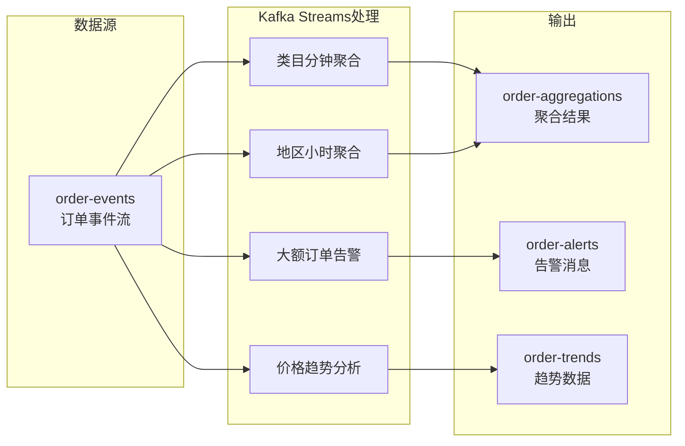
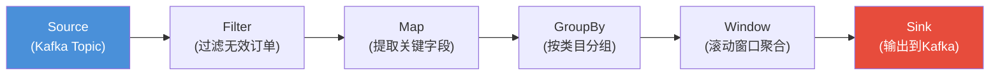
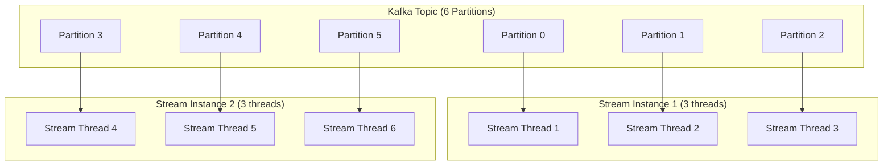
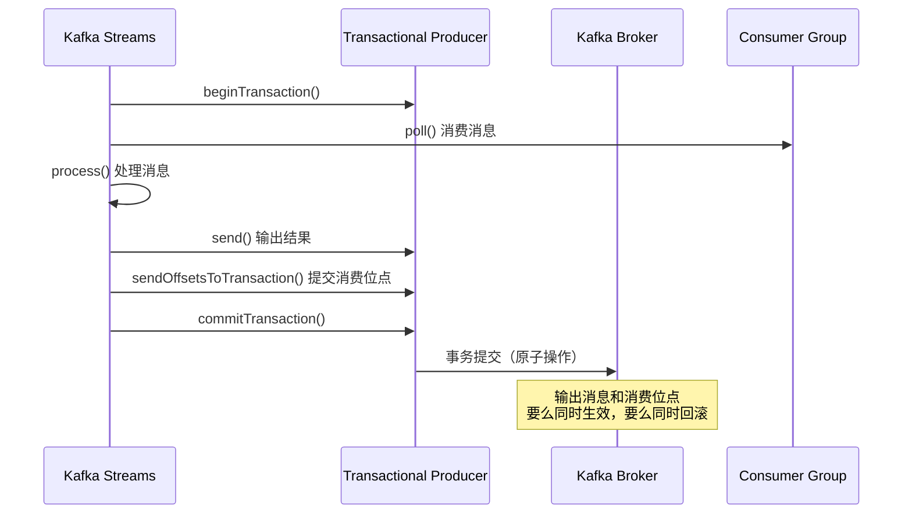
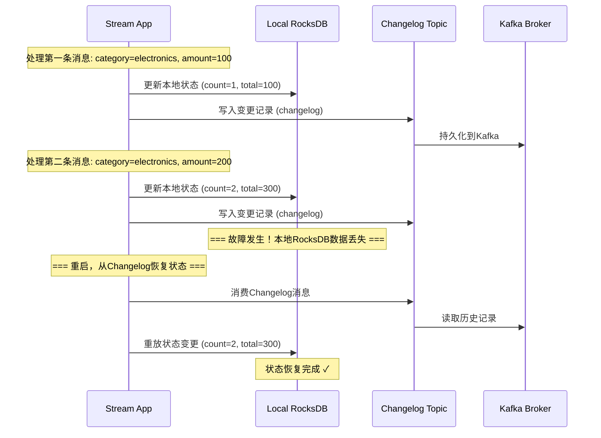
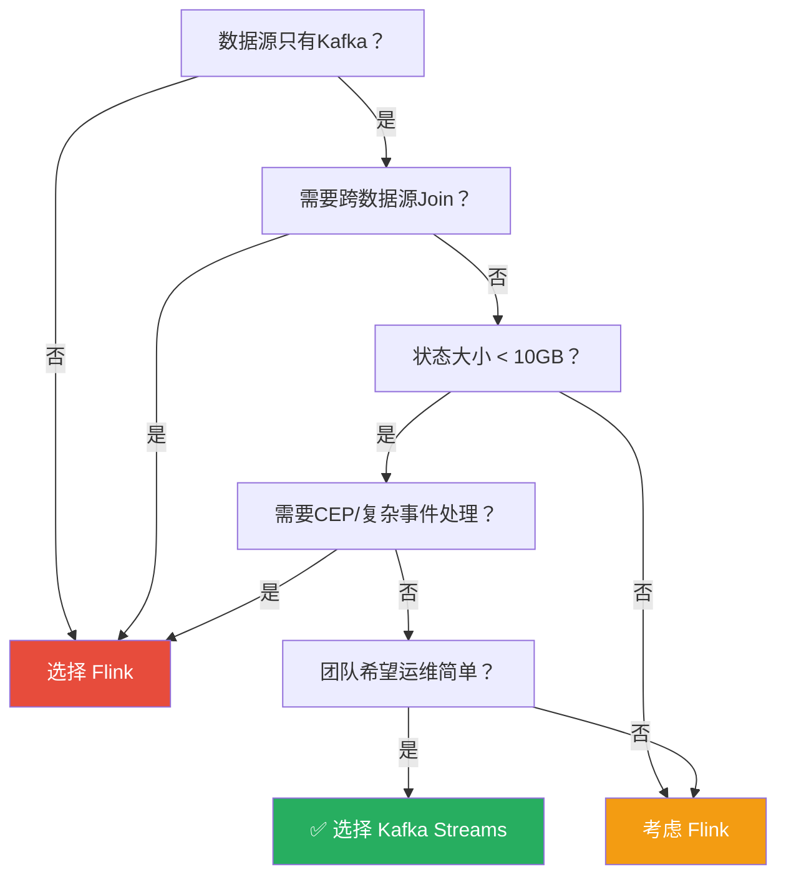

# 案例二：Kafka Streams实战——轻量级流处理的工程实践

***

## 1. 案例背景与定位

### 1.1 Kafka Streams是什么

Apache Kafka Streams（以下简称Kafka Streams）是Apache Kafka项目内置的一个客户端库，用于在Java/Scala应用程序中实现流式数据处理。与Apache Flink、Spark Streaming等独立的分布式流处理引擎不同，Kafka Streams不是一个独立部署的集群，而是一个**嵌入式库（Library）**——它运行在应用程序自身的JVM进程中，无需单独的集群管理和资源调度。

这一设计哲学带来了显著的运维优势：

- **零集群开销**：没有额外的集群需要维护，没有复杂的资源分配需要配置
- **原生Kafka集成**：充分利用Kafka本身提供的分区、副本、消费组等分布式能力，实现水平扩展和故障恢复
- **应用即作业**：应用程序本身就是流处理作业，部署一个Java应用就等于部署了一个流处理拓扑
- **轻量级依赖**：只需要引入一个JAR包，不需要像Flink那样部署JobManager + TaskManager的完整集群

Kafka Streams从Kafka 0.10版本（2016年）开始引入，经过多年的迭代演进，当前稳定版本已支持Exactly-Once语义、可插拔状态存储、Processor API等企业级特性。

### 1.2 为什么在有Flink的情况下还要用Kafka Streams

在第59章中，我们已经深入学习了Apache Flink的架构、窗口机制、状态管理和Exactly-Once语义。那么在实际项目中，为什么还需要Kafka Streams？两者的核心差异在于适用场景的不同：

| 维度 | Kafka Streams | Apache Flink |
|------|--------------|--------------|
| 部署模型 | 嵌入式库，嵌入应用进程 | 独立集群（JobManager + TaskManager） |
| 数据源 | 仅Kafka | Kafka、文件系统、数据库、消息队列等 |
| 状态存储 | 本地RocksDB（内置） | 可选RocksDB/Heap/Filesystem |
| 容错机制 | 基于Kafka副本 + Changelog Topic | 基于分布式Checkpoint |
| Exactly-Once | 依赖Kafka事务 | 内置Checkpoint + 两阶段提交 |
| 运维复杂度 | 极低（随应用部署） | 中高（需要管理Flink集群） |
| 适用规模 | 中小规模（单应用内） | 大规模分布式（跨集群） |
| 与Kafka的集成 | 原生无缝 | 需要连接器（Connector） |
| 复杂事件处理 | 不支持 | 支持（Flink CEP） |
| 语言支持 | Java/Scala | Java/Scala/Python/SQL |
| Join能力 | KStream-KTable、KTable-KTable、KStream-GlobalKTable | 窗口Join、 Interval Join、矩阵Join |
| 交互式查询 | 内置Interactive Queries，可直接查询状态 | 需要通过REST API或外部存储 |

**核心结论**：如果数据已经在Kafka中，处理逻辑相对直接，且团队希望保持技术栈简洁，Kafka Streams是最佳选择。如果需要跨多种数据源、超大规模状态、复杂事件处理或SQL接口，则应选择Flink。

### 1.3 本案例的业务场景

本案例以一个**电商实时订单聚合分析系统**为背景，展示Kafka Streams从设计到落地的完整过程。具体需求如下：

- **数据源**：Kafka中的`order-events` Topic，包含用户下单事件（JSON格式），每秒约10,000条消息
- **核心处理**：
  - 按商品类目（category）实时统计每分钟的订单量和总金额
  - 按地区（region）实时统计每小时的订单分布
  - 检测异常大额订单（单笔金额超过阈值）并实时告警
  - 商品类目维度的实时价格趋势（滑动窗口移动平均）
- **输出目标**：处理结果写回Kafka的`order-aggregations` Topic，供下游系统消费
- **一致性要求**：端到端Exactly-Once语义，确保数据不丢不重



***

## 2. Kafka Streams核心架构解析

### 2.1 处理拓扑（Topology）

Kafka Streams的核心抽象是**处理拓扑（Topology）**——一个由多个处理节点（Processor Node）和边（Edge）组成的有向无环图（DAG）。每个处理节点执行一种操作（如过滤、映射、聚合），边定义了数据在节点间的流向。



Kafka Streams提供两种构建拓扑的API：

**DSL（Domain Specific Language）**：声明式API，类似Spark的DataFrame API，通过链式调用构建处理逻辑。大部分场景推荐使用DSL，代码简洁且易于理解。底层会被编译为Processor API的拓扑结构。

```java
// DSL风格：声明式，简洁直观
KStream<String, OrderEvent> stream = builder.stream("order-events");
stream.filter((key, order) -> order.getAmount() > 0)
      .groupBy((key, order) -> order.getCategory())
      .windowedBy(TimeWindows.ofSizeWithNoGrace(Duration.ofMinutes(1)))
      .count()
      .toStream()
      .to("output-topic");
```

**Processor API**：命令式API，允许更细粒度地控制处理逻辑，包括自定义状态管理和定时器。适用于DSL无法表达的复杂场景，如需要精确控制状态读写时机、自定义定时器触发逻辑等。

```java
// Processor API风格：命令式，灵活但复杂
public class CustomProcessor implements Processor<String, OrderEvent, String, AggregationResult> {
    private KeyValueStore<String, AggregationResult> stateStore;
    private ProcessorContext<String, AggregationResult> context;

    @Override
    public void init(ProcessorContext<String, AggregationResult> context) {
        this.context = context;
        this.stateStore = context.getStateStore("agg-store");
        // 注册定时器：每分钟触发一次聚合输出
        context.schedule(Duration.ofMinutes(1), PunctuationType.WALL_CLOCK_TIME, this::flush);
    }

    @Override
    public void process(Record<String, OrderEvent> record) {
        String key = record.value().getCategory();
        AggregationResult current = stateStore.get(key);
        if (current == null) {
            current = new AggregationResult();
        }
        current.incrementCount();
        current.addAmount(record.value().getAmount());
        stateStore.put(key, current);
    }

    private void flush(long timestamp) {
        try (KeyValueIterator<String, AggregationResult> iter = stateStore.all()) {
            while (iter.hasNext()) {
                KeyValue<String, AggregationResult> entry = iter.next();
                context.forward(new Record<>(entry.key, entry.value, timestamp));
            }
        }
    }
}
```

**DSL vs Processor API选型指南**：

| 特性 | DSL | Processor API |
|------|-----|---------------|
| 代码量 | 少（声明式） | 多（命令式） |
| 可读性 | 高 | 低 |
| 灵活性 | 中（受限于预定义算子） | 高（完全自定义） |
| 状态管理 | 自动 | 手动 |
| 定时器 | 不支持 | 支持（schedule方法） |
| 适用场景 | 聚合、过滤、Join、窗口 | 复杂状态逻辑、自定义处理 |
| 推荐优先级 | **优先使用** | DSL无法满足时使用 |

### 2.2 分区与并行

Kafka Streams的并行模型与Kafka的分区机制紧密耦合。每个Kafka Streams应用实例（Process Instance）中运行一个或多个Stream Thread，每个Stream Thread消费一组Kafka分区。这意味着：

- 应用实例数不超过Topic的分区数时，每个实例消费一个或多个分区
- 应用实例数超过Topic的分区数时，多余的实例将处于空闲状态
- 增加分区数可以直接提升Kafka Streams的处理并行度



**关键原则**：

- **分区数决定并行度上限**：`max_parallelism = topic_partition_count`
- **每个分区只能被一个Stream Thread消费**：保证单分区内的消息有序处理
- **Task分配**：每个分区对应一个Task，Task是Kafka Streams调度的最小单位
- **Rebalance机制**：当应用实例加入或退出消费组时，Task会重新分配，类似Kafka Consumer的Rebalance

**并行度配置公式**：

理想并行度 = Topic分区数
每个实例的线程数 = Topic分区数 / 实例数

例如：Topic有12个分区，部署3个实例，则每个实例配置`num.stream.threads=4`。

### 2.3 状态存储（State Store）

Kafka Streams内置了本地状态存储机制，通常使用RocksDB作为存储引擎。当执行有状态操作（如聚合、Join）时，Kafka Streams会自动创建一个本地State Store，将中间结果持久化到本地磁盘。

**RocksDB为什么被选为默认存储引擎**：

- **LSM-Tree架构**：写入性能极高，适合流处理场景的高频写入模式
- **内存映射**：支持mmap，操作系统自动管理缓存
- **压缩支持**：内置LZ4/Snappy/ZSTD压缩，减少磁盘占用
- **事务支持**：支持ACID事务，配合Changelog保证一致性
- **嵌入式部署**：无需独立进程，直接嵌入JVM

为了保证容错性，Kafka Streams将State Store的内容同步到一个**Changelog Topic**（变更日志Topic）中。当应用实例故障重启时，可以从Changelog Topic恢复状态。这是一个关键的设计——它利用Kafka自身的副本机制实现了状态的高可用，而不需要像Flink那样依赖外部的Checkpoint存储（如HDFS）。

### 2.4 窗口机制

Kafka Streams支持以下窗口类型：

| 窗口类型 | 说明 | 典型场景 | 实现方式 |
|----------|------|----------|----------|
| 滚动窗口（Tumbling Window） | 固定大小、不重叠 | 每分钟订单统计 | `TimeWindows.ofSizeWithNoGrace()` |
| 滑动窗口（Sliding Window） | 固定大小、可重叠 | 移动平均价格 | `SlidingWindows.ofTimeDifferenceWithNoGrace()` |
| 会话窗口（Session Window） | 按活跃度动态调整 | 用户行为会话分析 | `SessionWindows.ofInactivityGapWithNoGrace()` |
| 保留窗口（Retention Window） | 带过期时间的窗口 | 含迟到数据的聚合 | `.grace()` 方法配置 |

### 2.5 语义保证

Kafka Streams提供三种语义保证级别：

- **At-Most-Once（最多一次）**：数据可能丢失但不会重复。配置：`processing.guarantee=at_most_once`
- **At-Least-Once（至少一次）**：数据不会丢失但可能重复（默认配置）
- **Exactly-Once（精确一次）**：数据不丢不重。配置：`processing.guarantee=exactly_once_v2`

Exactly-Once的实现依赖于Kafka的事务机制（Kafka Transactions）。Kafka Streams在处理完一批数据后，将输出结果和消费位点在同一个Kafka事务中提交，确保原子性。



***

## 3. 完整实战：电商实时订单聚合系统

### 3.1 环境准备

#### 3.1.1 本地开发环境搭建（Docker Compose）

对于本地开发和测试，使用Docker Compose快速搭建Kafka集群：

```yaml
# docker-compose.yml
version: '3.8'
services:
  kafka:
    image: confluentinc/cp-kafka:7.6.0
    container_name: kafka
    ports:
      - "9092:9092"
      - "29092:29092"
    environment:
      KAFKA_NODE_ID: 1
      KAFKA_PROCESS_ROLES: broker,controller
      KAFKA_LISTENERS: PLAINTEXT://0.0.0.0:29092,CONTROLLER://0.0.0.0:9093
      KAFKA_ADVERTISED_LISTENERS: PLAINTEXT://localhost:29092
      KAFKA_CONTROLLER_QUORUM_VOTERS: 1@kafka:9093
      KAFKA_CONTROLLER_LISTENER_NAMES: CONTROLLER
      KAFKA_LISTENER_SECURITY_PROTOCOL_MAP: CONTROLLER:PLAINTEXT,PLAINTEXT:PLAINTEXT
      KAFKA_OFFSETS_TOPIC_REPLICATION_FACTOR: 1
      KAFKA_TRANSACTION_STATE_LOG_REPLICATION_FACTOR: 1
      KAFKA_TRANSACTION_STATE_LOG_MIN_ISR: 1
      CLUSTER_ID: "MkU3OEVBNTcwNTJENDM2Qk"
    volumes:
      - kafka-data:/var/lib/kafka/data

  # Kafka UI（可选，方便调试）
  kafka-ui:
    image: provectuslabs/kafka-ui:latest
    container_name: kafka-ui
    ports:
      - "8080:8080"
    environment:
      KAFKA_CLUSTERS_0_NAME: local
      KAFKA_CLUSTERS_0_BOOTSTRAPSERVERS: kafka:29092
    depends_on:
      - kafka

volumes:
  kafka-data:
```

启动命令：

```bash
docker compose up -d
# 等待Kafka启动完成（约30秒）
docker compose logs kafka | grep "started"
```

#### 3.1.2 Maven依赖

```xml
<!-- pom.xml -->
<properties>
    <kafka-streams.version>3.7.0</kafka-streams.version>
    <jackson.version>2.16.1</jackson.version>
    <lombok.version>1.18.30</lombok.version>
</properties>

<dependencies>
    <!-- Kafka Streams核心依赖 -->
    <dependency>
        <groupId>org.apache.kafka</groupId>
        <artifactId>kafka-streams</artifactId>
        <version>${kafka-streams.version}</version>
    </dependency>

    <!-- JSON序列化 -->
    <dependency>
        <groupId>com.fasterxml.jackson.core</groupId>
        <artifactId>jackson-databind</artifactId>
        <version>${jackson.version}</version>
    </dependency>

    <!-- Kafka Streams测试工具 -->
    <dependency>
        <groupId>org.apache.kafka</groupId>
        <artifactId>kafka-streams-test-utils</artifactId>
        <version>${kafka-streams.version}</version>
        <scope>test</scope>
    </dependency>

    <!-- 监控：Micrometer + JMX -->
    <dependency>
        <groupId>io.micrometer</groupId>
        <artifactId>micrometer-registry-jmx</artifactId>
        <version>1.12.2</version>
    </dependency>

    <!-- Lombok -->
    <dependency>
        <groupId>org.projectlombok</groupId>
        <artifactId>lombok</artifactId>
        <version>${lombok.version}</version>
        <scope>provided</scope>
    </dependency>

    <!-- 日志 -->
    <dependency>
        <groupId>org.slf4j</groupId>
        <artifactId>slf4j-simple</artifactId>
        <version>2.0.9</version>
    </dependency>
</dependencies>
```

#### 3.1.3 Kafka Topic创建

```bash
# 创建输入Topic：订单事件（6个分区，3副本）
kafka-topics.sh --create \
  --bootstrap-server localhost:9092 \
  --topic order-events \
  --partitions 6 \
  --replication-factor 1 \
  --config retention.ms=604800000 \
  --config cleanup.policy=delete

# 创建输出Topic：聚合结果（6个分区，3副本）
kafka-topics.sh --create \
  --bootstrap-server localhost:9092 \
  --topic order-aggregations \
  --partitions 6 \
  --replication-factor 1

# 创建告警Topic
kafka-topics.sh --create \
  --bootstrap-server localhost:9092 \
  --topic order-alerts \
  --partitions 3 \
  --replication-factor 1

# 创建价格趋势Topic
kafka-topics.sh --create \
  --bootstrap-server localhost:9092 \
  --topic order-trends \
  --partitions 6 \
  --replication-factor 1

# 创建Dead Letter Topic（异常消息兜底）
kafka-topics.sh --create \
  --bootstrap-server localhost:9092 \
  --topic order-events-dlq \
  --partitions 3 \
  --replication-factor 1
```

> **注意**：本地开发环境使用`replication-factor=1`。生产环境应至少设置为3，确保高可用。

### 3.2 数据模型定义

#### 3.2.1 订单事件（输入）

```java
import lombok.AllArgsConstructor;
import lombok.Builder;
import lombok.Data;
import lombok.NoArgsConstructor;

/**
 * 订单事件数据模型
 * 对应Kafka Topic: order-events
 */
@Data
@Builder
@NoArgsConstructor
@AllArgsConstructor
public class OrderEvent {
    private String orderId;       // 订单ID（UUID格式）
    private String userId;        // 用户ID
    private String productId;     // 商品ID
    private String category;      // 商品类目：electronics/clothing/food/sports/home
    private String region;        // 地区：north/south/east/west
    private double amount;        // 订单金额（元），精确到分
    private long eventTime;       // 事件时间戳（毫秒），用于窗口聚合
    private String eventType;     // 事件类型：CREATED/PAID/CANCELLED
}
```

#### 3.2.2 聚合结果（输出）

```java
/**
 * 类目维度的分钟级聚合结果
 */
@Data
@Builder
@NoArgsConstructor
@AllArgsConstructor
public class CategoryAggregation {
    private String category;
    private long windowStart;     // 窗口开始时间（毫秒时间戳）
    private long windowEnd;       // 窗口结束时间（毫秒时间戳）
    private long orderCount;      // 订单数量
    private double totalAmount;   // 总金额
    private double avgAmount;     // 平均金额
    private double maxAmount;     // 最大单笔金额
    private double minAmount;     // 最小单笔金额
    private long processingTime;  // 处理时间（用于数据新鲜度判断）
}

/**
 * 地区维度的小时级聚合结果
 */
@Data
@Builder
@NoArgsConstructor
@AllArgsConstructor
public class RegionAggregation {
    private String region;
    private long windowStart;
    private long windowEnd;
    private long orderCount;
    private double totalAmount;
    private Set<String> uniqueUsers;  // 去重用户数
    private long uniqueUserCount;     // 去重用户数量（序列化友好）
}
```

#### 3.2.3 告警事件模型

```java
@Data
@Builder
@NoArgsConstructor
@AllArgsConstructor
public class AlertEvent {
    private String alertType;       // 告警类型：LARGE_ORDER
    private String orderId;         // 触发告警的订单ID
    private String userId;          // 用户ID
    private String category;        // 商品类目
    private String region;          // 地区
    private double amount;          // 订单金额
    private long detectTime;        // 检测时间戳
    private String message;         // 告警消息
    private String severity;        // 严重程度：WARNING/CRITICAL
}
```

#### 3.2.4 价格趋势数据模型

```java
/**
 * 类目维度的价格趋势数据
 */
@Data
@Builder
@NoArgsConstructor
@AllArgsConstructor
public class PriceTrend {
    private String category;
    private long windowStart;
    private long windowEnd;
    private double movingAvgPrice;    // 移动平均价格
    private double latestPrice;       // 最新价格
    private double priceChange;       // 价格变化（相对上一个窗口）
    private long sampleCount;         // 样本数量
}
```

### 3.3 核心处理逻辑（DSL实现）

#### 3.3.1 JSON Serde工具类

```java
import com.fasterxml.jackson.databind.ObjectMapper;
import org.apache.kafka.common.serialization.Deserializer;
import org.apache.kafka.common.serialization.Serde;
import org.apache.kafka.common.serialization.Serializer;

/**
 * 通用JSON序列化/反序列化器
 * 基于Jackson实现，支持任意Java对象与JSON之间的转换
 */
public class JsonSerde<T> implements Serde<T> {
    private final ObjectMapper objectMapper = new ObjectMapper();
    private final Class<T> targetType;

    public JsonSerde(Class<T> targetType) {
        this.targetType = targetType;
    }

    @Override
    public Serializer<T> serializer() {
        return (topic, data) -> {
            if (data == null) return null;
            try {
                return objectMapper.writeValueAsBytes(data);
            } catch (Exception e) {
                throw new RuntimeException("JSON serialization error for type: "
                    + targetType.getSimpleName(), e);
            }
        };
    }

    @Override
    public Deserializer<T> deserializer() {
        return (topic, data) -> {
            if (data == null) return null;
            try {
                return objectMapper.readValue(data, targetType);
            } catch (Exception e) {
                throw new RuntimeException("JSON deserialization error for type: "
                    + targetType.getSimpleName(), e);
            }
        };
    }
}
```

> **生产建议**：考虑使用`kafka-clients`自带的`org.apache.kafka.connect.json.JsonSerializer`和`JsonDeserializer`，它们与Kafka生态集成更好，支持Schema配置。但自定义`JsonSerde`在需要精细控制序列化行为时更灵活。

#### 3.3.2 订单事件反序列化器（Dead Letter模式）

```java
import com.fasterxml.jackson.databind.ObjectMapper;
import org.apache.kafka.common.errors.DeserializationException;
import org.apache.kafka.common.serialization.Deserializer;

/**
 * 带Dead Letter Topic支持的订单事件反序列化器
 * 当反序列化失败时，不是丢弃消息，而是抛出异常由DeserializationExceptionHandler处理
 */
public class OrderEventDeserializer implements Deserializer<OrderEvent> {
    private final ObjectMapper objectMapper = new ObjectMapper();

    @Override
    public OrderEvent deserialize(String topic, byte[] data) {
        if (data == null) return null;
        try {
            return objectMapper.readValue(data, OrderEvent.class);
        } catch (Exception e) {
            // 抛出DeserializationException，由DeserializationExceptionHandler处理
            // 而不是返回null（返回null会导致消息被静默丢弃）
            throw new DeserializationException(
                "Failed to deserialize order event from topic: " + topic
                + ", reason: " + e.getMessage(), data, e);
        }
    }
}
```

#### 3.3.3 主处理拓扑

```java
import org.apache.kafka.common.serialization.Serdes;
import org.apache.kafka.streams.KafkaStreams;
import org.apache.kafka.streams.StreamsBuilder;
import org.apache.kafka.streams.StreamsConfig;
import org.apache.kafka.streams.kstream.*;
import org.apache.kafka.streams.processor.api.ProcessorSupplier;

import java.time.Duration;
import java.util.Properties;
import java.util.concurrent.CountDownLatch;

public class OrderAggregationApp {

    // 告警阈值：单笔超过1万元
    private static final double ALERT_THRESHOLD = 10000.0;

    public static void main(String[] args) {
        // ========== 1. 配置Kafka Streams ==========
        Properties config = new Properties();
        config.put(StreamsConfig.APPLICATION_ID_CONFIG, "order-aggregation-v1");
        config.put(StreamsConfig.BOOTSTRAP_SERVERS_CONFIG, "localhost:9092");
        config.put(StreamsConfig.DEFAULT_KEY_SERDE_CLASS_CONFIG, Serdes.StringSerde.class);
        config.put(StreamsConfig.DEFAULT_VALUE_SERDE_CLASS_CONFIG, Serdes.StringSerde.class);

        // 精确一次语义
        config.put(StreamsConfig.PROCESSING_GUARANTEE_CONFIG,
                   StreamsConfig.EXACTLY_ONCE_V2);

        // 状态存储配置
        config.put(StreamsConfig.STATE_DIR_CONFIG, "/tmp/kafka-streams-state");
        config.put(StreamsConfig.NUM_STREAM_THREADS_CONFIG, 3);

        // 容错配置
        config.put(StreamsConfig.REPLICATION_FACTOR_CONFIG, 1);
        config.put(StreamsConfig.NUM_STANDBY_REPLICAS_CONFIG, 1);

        // 异常处理：跳过坏消息，记录日志
        config.put(StreamsConfig.DEFAULT_DESERIALIZATION_EXCEPTION_HANDLER_CLASS_CONFIG,
                   LogAndContinueExceptionHandler.class);

        // 提交间隔（30秒），平衡延迟与吞吐
        config.put(StreamsConfig.COMMIT_INTERVAL_MS_CONFIG, 30000);

        // 缓冲区大小（10MB），影响缓存和吞吐
        config.put(StreamsConfig.CACHE_MAX_BYTES_BUFFERING_CONFIG, 10 * 1024 * 1024);

        // ========== 2. 构建处理拓扑 ==========
        StreamsBuilder builder = new StreamsBuilder();

        // 定义Serde
        JsonSerde<OrderEvent> orderSerde = new JsonSerde<>(OrderEvent.class);
        JsonSerde<CategoryAggregation> categoryAggSerde =
            new JsonSerde<>(CategoryAggregation.class);
        JsonSerde<RegionAggregation> regionAggSerde =
            new JsonSerde<>(RegionAggregation.class);
        JsonSerde<AlertEvent> alertSerde = new JsonSerde<>(AlertEvent.class);

        // 读取订单事件流
        KStream<String, OrderEvent> orderStream = builder.stream(
            "order-events",
            Consumed.with(Serdes.String(), orderSerde)
        );

        // ========== 3. 需求一：过滤 + 类目维度分钟级聚合 ==========
        KStream<String, OrderEvent> validOrders = orderStream
            .filter((key, order) -> order != null
                &amp;&amp; order.getEventType().equals("CREATED")
                &amp;&amp; order.getAmount() > 0);

        // 按类目分组，滚动窗口聚合（每1分钟）
        KTable<Windowed<String>, CategoryAggregation> categoryAggregation =
            validOrders
                .groupBy((key, order) -> order.getCategory(),
                         Grouped.with(Serdes.String(), orderSerde))
                .windowedBy(
                    TimeWindows.ofSizeWithNoGrace(Duration.ofMinutes(1))
                )
                .aggregate(
                    CategoryAggregation::new,
                    (key, order, agg) -> {
                        agg.setCategory(key);
                        agg.setWindowStart(0);  // 由窗口自动填充
                        agg.setWindowEnd(0);
                        agg.setOrderCount(agg.getOrderCount() + 1);
                        agg.setTotalAmount(agg.getTotalAmount() + order.getAmount());
                        agg.setAvgAmount(agg.getTotalAmount() / agg.getOrderCount());
                        agg.setMaxAmount(Math.max(agg.getMaxAmount(),
                                                   order.getAmount()));
                        agg.setMinAmount(agg.getMinAmount() == 0 ?
                            order.getAmount() :
                            Math.min(agg.getMinAmount(), order.getAmount()));
                        agg.setProcessingTime(System.currentTimeMillis());
                        return agg;
                    },
                    Materialized.<String, CategoryAggregation,
                        WindowStore<Bytes, byte[]>>as("category-agg-store")
                        .withKeySerde(Serdes.String())
                        .withValueSerde(categoryAggSerde)
                );

        // 输出到Kafka
        categoryAggregation
            .toStream()
            .map((windowedKey, agg) -> {
                // 将Windowed Key转换为普通Key：category_timestamp
                String outputKey = windowedKey.key() + "_"
                    + windowedKey.window().start();
                agg.setWindowStart(windowedKey.window().start());
                agg.setWindowEnd(windowedKey.window().end());
                return KeyValue.pair(outputKey, agg);
            })
            .to("order-aggregations",
                Produced.with(Serdes.String(), categoryAggSerde));

        // ========== 4. 需求二：地区维度小时级聚合 ==========
        validOrders
            .groupBy((key, order) -> order.getRegion(),
                     Grouped.with(Serdes.String(), orderSerde))
            .windowedBy(
                TimeWindows.ofSizeWithNoGrace(Duration.ofHours(1))
            )
            .aggregate(
                RegionAggregation::new,
                (key, order, agg) -> {
                    agg.setRegion(key);
                    agg.setOrderCount(agg.getOrderCount() + 1);
                    agg.setTotalAmount(agg.getTotalAmount() + order.getAmount());
                    if (agg.getUniqueUsers() == null) {
                        agg.setUniqueUsers(new HashSet<>());
                    }
                    agg.getUniqueUsers().add(order.getUserId());
                    agg.setUniqueUserCount(agg.getUniqueUsers().size());
                    return agg;
                },
                Materialized.<String, RegionAggregation,
                    WindowStore<Bytes, byte[]>>as("region-agg-store")
                    .withKeySerde(Serdes.String())
                    .withValueSerde(regionAggSerde)
            )
            .toStream()
            .map((windowedKey, agg) -> {
                String outputKey = windowedKey.key() + "_"
                    + windowedKey.window().start();
                agg.setWindowStart(windowedKey.window().start());
                agg.setWindowEnd(windowedKey.window().end());
                return KeyValue.pair(outputKey, agg);
            })
            .to("order-aggregations",
                Produced.with(Serdes.String(), regionAggSerde));

        // ========== 5. 需求三：异常大额订单告警 ==========
        validOrders
            .filter((key, order) -> order.getAmount() > ALERT_THRESHOLD)
            .mapValues((order) -> {
                String severity = order.getAmount() > 50000 ? "CRITICAL" : "WARNING";
                return AlertEvent.builder()
                    .alertType("LARGE_ORDER")
                    .orderId(order.getOrderId())
                    .userId(order.getUserId())
                    .category(order.getCategory())
                    .region(order.getRegion())
                    .amount(order.getAmount())
                    .detectTime(System.currentTimeMillis())
                    .message(String.format("异常大额订单: 金额=%.2f, 类目=%s, 严重程度=%s",
                        order.getAmount(), order.getCategory(), severity))
                    .severity(severity)
                    .build();
            })
            .to("order-alerts",
                Produced.with(Serdes.String(), alertSerde));

        // ========== 6. 需求四：类目维度价格趋势（滑动窗口） ==========
        JsonSerde<PriceTrend> trendSerde = new JsonSerde<>(PriceTrend.class);

        validOrders
            .groupBy((key, order) -> order.getCategory(),
                     Grouped.with(Serdes.String(), orderSerde))
            .windowedBy(
                SlidingWindows.ofTimeDifferenceWithNoGrace(Duration.ofMinutes(5))
            )
            .aggregate(
                PriceTrend::new,
                (key, order, trend) -> {
                    trend.setCategory(key);
                    // 增量计算移动平均：new_avg = old_avg + (new_value - old_avg) / count
                    long newCount = trend.getSampleCount() + 1;
                    double oldAvg = trend.getMovingAvgPrice();
                    trend.setMovingAvgPrice(
                        oldAvg + (order.getAmount() - oldAvg) / newCount);
                    trend.setLatestPrice(order.getAmount());
                    trend.setSampleCount(newCount);
                    return trend;
                },
                Materialized.<String, PriceTrend,
                    WindowStore<Bytes, byte[]>>as("price-trend-store")
                    .withKeySerde(Serdes.String())
                    .withValueSerde(trendSerde)
            )
            .toStream()
            .map((windowedKey, agg) -> {
                String outputKey = windowedKey.key() + "_"
                    + windowedKey.window().start();
                agg.setWindowStart(windowedKey.window().start());
                agg.setWindowEnd(windowedKey.window().end());
                return KeyValue.pair(outputKey, agg);
            })
            .to("order-trends",
                Produced.with(Serdes.String(), trendSerde));

        // ========== 7. 启动应用 ==========
        KafkaStreams streams = new KafkaStreams(builder.build(), config);

        // 注册关闭钩子，确保优雅退出
        CountDownLatch latch = new CountDownLatch(1);
        Runtime.getRuntime().addShutdownHook(new Thread(() -> {
            System.out.println("Graceful shutdown initiated...");
            streams.close(Duration.ofSeconds(30));
            latch.countDown();
            System.out.println("Kafka Streams closed.");
        }));

        try {
            streams.start();
            latch.await();
        } catch (InterruptedException e) {
            System.exit(1);
        }
    }
}
```

### 3.4 Kafka Streams Join操作

Join是流处理中的核心操作之一。Kafka Streams支持多种Join模式，本节展示如何将订单事件与商品信息进行关联。

#### 3.4.1 KStream-KTable Join（流与表的关联）

```java
// 场景：将订单事件与商品信息表关联，获取商品名称和价格
// 商品信息存储在Kafka Topic中，作为KTable使用

// 读取商品信息流
KStream<String, OrderEvent> orderStream = builder.stream(
    "order-events",
    Consumed.with(Serdes.String(), orderSerde)
);

KTable<String, ProductInfo> productTable = builder.table(
    "product-info",
    Consumed.with(Serdes.String(), new JsonSerde<>(ProductInfo.class))
);

// KStream-KTable Join：为每条订单附带商品信息
KStream<String, EnrichedOrder> enrichedOrders = orderStream.join(
    productTable,
    (order, product) -> EnrichedOrder.builder()
        .orderId(order.getOrderId())
        .userId(order.getUserId())
        .category(order.getCategory())
        .productName(product.getName())
        .listPrice(product.getPrice())
        .amount(order.getAmount())
        .eventTime(order.getEventTime())
        .build(),
    Joined.with(Serdes.String(), orderSerde, new JsonSerde<>(ProductInfo.class))
);

// 输出关联结果
enrichedOrders.to("enriched-orders",
    Produced.with(Serdes.String(), new JsonSerde<>(EnrichedOrder.class)));
```

#### 3.4.2 KStream-GlobalKTable Join（全局表关联）

```java
// 场景：地区信息表（数据量小，每个实例需要完整副本）
KStream<String, OrderEvent> orderStream = builder.stream(
    "order-events",
    Consumed.with(Serdes.String(), orderSerde)
);

// GlobalKTable：全量复制到每个实例，适合小表
KTable<String, RegionInfo> regionTable = builder.globalTable(
    "region-info",
    Consumed.with(Serdes.String(), new JsonSerde<>(RegionInfo.class))
);

// 使用KeyMapper指定Join的Key
KStream<String, EnrichedOrder> enrichedWithRegion = orderStream.join(
    regionTable,
    (key, order) -> order.getRegion(),  // 使用order的region字段作为Join Key
    (order, region) -> EnrichedOrder.builder()
        .orderId(order.getOrderId())
        .region(order.getRegion())
        .regionName(region.getName())
        .regionPopulation(region.getPopulation())
        .build(),
    Joined.with(Serdes.String(), orderSerde, new JsonSerde<>(RegionInfo.class))
);
```

#### 3.4.3 KStream-KStream Join（流与流的窗口关联）

```java
// 场景：订单创建事件与支付事件的关联
KStream<String, OrderEvent> orderCreated = builder.stream(
    "order-events",
    Consumed.with(Serdes.String(), orderSerde)
).filter((key, event) -> "CREATED".equals(event.getEventType()));

KStream<String, PaymentEvent> paymentEvents = builder.stream(
    "payment-events",
    Consumed.with(Serdes.String(), new JsonSerde<>(PaymentEvent.class))
);

// 窗口Join：5分钟内的订单创建和支付事件关联
KStream<String, OrderWithPayment> ordersWithPayments = orderCreated.join(
    paymentEvents,
    (order, payment) -> OrderWithPayment.builder()
        .orderId(order.getOrderId())
        .orderAmount(order.getAmount())
        .paymentMethod(payment.getMethod())
        .paymentTime(payment.getTimestamp())
        .build(),
    JoinWindows.ofTimeDifferenceWithNoGrace(Duration.ofMinutes(5)),
    Joined.with(Serdes.String(), orderSerde, new JsonSerde<>(PaymentEvent.class))
);
```

**Join操作的关键约束**：

| Join类型 | 左侧 | 右侧 | 要求 |
|----------|------|------|------|
| KStream-KTable | 流 | 表 | 按Key匹配，表侧需要先有数据 |
| KStream-GlobalKTable | 流 | 全局表 | 无Key限制，全局表全量复制 |
| KStream-KStream | 流 | 流 | 需要窗口，两侧在同一窗口内匹配 |

### 3.5 测试：TopologyTestDriver

Kafka Streams提供了强大的单元测试工具`TopologyTestDriver`，无需启动Kafka集群即可测试处理拓扑的正确性。

```java
import org.apache.kafka.streams.StreamsBuilder;
import org.apache.kafka.streams.Topology;
import org.apache.kafka.streams.TopologyTestDriver;
import org.apache.kafka.streams.kstream.Consumed;
import org.apache.kafka.streams.kstream.Produced;
import org.apache.kafka.streams.test.ConsumerRecordFactory;
import org.apache.kafka.streams.test.OutputVerifier;
import org.junit.jupiter.api.AfterEach;
import org.junit.jupiter.api.BeforeEach;
import org.junit.jupiter.api.Test;

import static org.junit.jupiter.api.Assertions.*;

public class OrderAggregationTopologyTest {

    private TopologyTestDriver testDriver;
    private StreamsBuilder builder;
    private JsonSerde<OrderEvent> orderSerde = new JsonSerde<>(OrderEvent.class);
    private JsonSerde<CategoryAggregation> aggSerde =
        new JsonSerde<>(CategoryAggregation.class);

    @BeforeEach
    void setUp() {
        builder = new StreamsBuilder();

        // 构建拓扑（复用主应用的拓扑构建逻辑）
        buildTopology(builder);

        Topology topology = builder.build();
        System.out.println(topology.describe());  // 打印拓扑结构，便于调试

        // 创建测试驱动
        Properties config = new Properties();
        config.put(StreamsConfig.APPLICATION_ID_CONFIG, "test-order-aggregation");
        config.put(StreamsConfig.BOOTSTRAP_SERVERS_CONFIG, "dummy:1234");
        config.put(StreamsConfig.DEFAULT_KEY_SERDE_CLASS_CONFIG, Serdes.StringSerde.class);
        config.put(StreamsConfig.DEFAULT_VALUE_SERDE_CLASS_CONFIG, Serdes.StringSerde.class);

        testDriver = new TopologyTestDriver(topology, config);
    }

    @AfterEach
    void tearDown() {
        testDriver.close();
    }

    @Test
    void testCategoryAggregation() {
        // 创建测试输入
        OrderEvent event1 = OrderEvent.builder()
            .orderId("order-001")
            .userId("user-001")
            .category("electronics")
            .amount(2999.0)
            .eventType("CREATED")
            .eventTime(System.currentTimeMillis())
            .build();

        OrderEvent event2 = OrderEvent.builder()
            .orderId("order-002")
            .userId("user-002")
            .category("electronics")
            .amount(1599.0)
            .eventType("CREATED")
            .eventTime(System.currentTimeMillis())
            .build();

        // 模拟消费输入消息
        testDriver.pipeInput("order-events", "key1",
            orderSerde.serializer().serialize("order-events", event1));
        testDriver.pipeInput("order-events", "key2",
            orderSerde.serializer().serialize("order-events", event2));

        // 验证输出
        // 注意：由于窗口聚合的延迟输出特性，可能需要等待窗口关闭
        // TopologyTestDriver会自动推进时间

        // 验证告警Topic：金额超过阈值的订单应该触发告警
        // ... 验证逻辑
    }

    @Test
    void testLargeOrderAlert() {
        // 测试大额订单告警
        OrderEvent largeOrder = OrderEvent.builder()
            .orderId("order-999")
            .userId("user-999")
            .category("electronics")
            .amount(50000.0)  // 超过阈值
            .eventType("CREATED")
            .eventTime(System.currentTimeMillis())
            .build();

        testDriver.pipeInput("order-events", "key1",
            orderSerde.serializer().serialize("order-events", largeOrder));

        // 验证告警Topic有输出
        // ... 验证逻辑
    }

    @Test
    void testInvalidOrderFiltered() {
        // 测试无效订单被过滤
        OrderEvent invalidOrder = OrderEvent.builder()
            .orderId("order-invalid")
            .amount(-100.0)  // 负数金额，应被过滤
            .eventType("CREATED")
            .build();

        testDriver.pipeInput("order-events", "key1",
            orderSerde.serializer().serialize("order-events", invalidOrder));

        // 验证输出Topic为空（无效订单被过滤）
        // ... 验证逻辑
    }

    private void buildTopology(StreamsBuilder builder) {
        // 此处复用主应用的拓扑构建逻辑
        // 建议将拓扑构建逻辑提取为独立方法，便于测试复用
    }
}
```

**TopologyTestDriver的关键优势**：

- **无依赖测试**：不需要启动Kafka集群，测试速度极快（毫秒级）
- **时间控制**：可以精确控制事件时间和处理时间，测试窗口行为
- **状态验证**：可以直接检查State Store的内容
- **拓扑验证**：通过`topology.describe()`打印完整拓扑结构，便于调试

### 3.6 JSON序列化注意事项

在生产环境中，JSON序列化有几个容易忽视的细节：

```java
import com.fasterxml.jackson.databind.ObjectMapper;
import com.fasterxml.jackson.databind.SerializationFeature;
import com.fasterxml.jackson.datatype.jsr310.JavaTimeModule;

/**
 * 生产环境推荐的ObjectMapper配置
 */
public class JacksonConfig {
    public static ObjectMapper createObjectMapper() {
        ObjectMapper mapper = new ObjectMapper();

        // 注册Java 8时间模块
        mapper.registerModule(new JavaTimeModule());

        // 不要将时间序列化为时间戳（更可读）
        mapper.disable(SerializationFeature.WRITE_DATES_AS_TIMESTAMPS);

        // 遇到未知属性不报错（向后兼容）
        mapper.configure(
            com.fasterxml.jackson.databind.DeserializationFeature
                .FAIL_ON_UNKNOWN_PROPERTIES, false);

        return mapper;
    }
}
```

> **常见陷阱**：Kafka Streams的`JsonSerde`在序列化时不会自动处理`null`字段。如果聚合结果中包含`null`值（如`minAmount`在第一条消息时为0），下游消费者可能解析失败。建议在数据模型中使用基本类型（如`double`代替`Double`）并设置合理的默认值。

***

## 4. 状态管理深度剖析

### 4.1 Changelog Topic机制

Kafka Streams的状态容错完全依赖Changelog Topic，这是其与Flink最大的架构差异之一。

当Kafka Streams执行有状态操作（如`aggregate`、`reduce`、`join`）时，会自动创建一个内部Topic：`<application-id>-<store-name>-changelog`。每次状态变更（插入、更新、删除）都会被写入这个Changelog Topic。当应用实例故障重启时，Kafka Streams从Changelog Topic重建本地状态。



**Changelog Topic的命名规则**：

<application-id>-<store-name>-changelog

例如：`order-aggregation-v1-category-agg-store-changelog`

**Changelog恢复的时间估算**：

恢复时间 = Changelog Topic中的消息总量 / 消费速率

对于一个典型的聚合场景，如果Changelog Topic积累了1小时的数据，恢复时间约为几分钟（取决于消息量和磁盘IO速度）。这就是为什么Standby Replicas如此重要。

### 4.2 Standby Replicas配置

为加速故障恢复，可以配置Standby Replicas——在其他应用实例上维护状态的只读副本。当主实例故障时，可以快速从Standby副本恢复，而不需要从Changelog Topic完整重放。

```java
Properties config = new Properties();
// 在其他实例上保留1个状态副本
config.put(StreamsConfig.NUM_STANDBY_REPLICAS_CONFIG, 1);
```

**配置建议**：
- 生产环境至少配置`num.standby.replicas=1`
- Standby副本会消耗额外的磁盘空间和网络带宽
- 如果应用实例数较少（如2-3个），配置Standby副本的效果有限
- Standby副本数量不应超过应用实例数减1

### 4.3 状态存储类型

Kafka Streams从3.0版本开始支持可插拔的状态存储后端：

| 存储后端 | 特点 | 适用场景 | 性能特征 |
|----------|------|----------|----------|
| RocksDB（默认） | 嵌入式KV存储，支持增量备份 | 大多数生产场景 | 写入快，读取中等，支持大状态 |
| In-Memory | 纯内存存储，重启后需从Changelog完整恢复 | 开发测试、状态很小 | 读写极快，但重启恢复慢 |

```java
// RocksDB配置自定义（生产环境推荐）
import org.apache.kafka.streams.state.RocksDBConfigSetter;
import org.rocksdb.Options;
import org.rocksdb.CompressionType;

public class CustomRocksDBConfig implements RocksDBConfigSetter {
    @Override
    public void setConfig(String storeName, Options options,
                          Map<String, Object> configs) {
        // 增大Block Cache，减少磁盘读取
        options.setBlockCacheSize(256 * 1024 * 1024L);  // 256MB

        // 增大Write Buffer，提高写入性能
        options.setMaxWriteBufferNumber(4);
        options.setWriteBufferSize(128 * 1024 * 1024);  // 128MB

        // 启用压缩（默认LZ4，平衡压缩率和速度）
        options.setCompressionType(CompressionType.LZ4_COMPRESSION);

        // 启用布隆过滤器，减少无效读取
        options.setOptimizeFiltersForHits(true);

        // 设置最大打开文件数
        options.setMaxOpenFiles(1000);
    }

    @Override
    public void close(String storeName, Options options) {}
}
```

### 4.4 状态大小监控与调优

```bash
# 查看应用的状态存储目录
ls -la /tmp/kafka-streams-state/order-aggregation-v1/

# 监控Changelog Topic的消费延迟（Lag）
kafka-consumer-groups.sh --bootstrap-server localhost:9092 \
  --describe --group order-aggregation-v1

# 查看RocksDB统计信息（通过JMX）
# 关键指标：
# - state-store-size：状态存储大小
# - rocksdb.bytes-written：写入字节数
# - rocksdb.read-amp-bytes：读放大字节数

# 查看内部Topic列表
kafka-topics.sh --bootstrap-server localhost:9092 \
  --list | grep order-aggregation-v1
```

**状态存储大小优化策略**：

| 策略 | 实现方式 | 效果 |
|------|----------|------|
| 定期清理过期状态 | 使用`retention.ms`配置Changelog保留期 | 减少Changelog磁盘占用 |
| 减少状态Key数量 | 合理设计分组Key的粒度 | 减少RocksDB条目数 |
| 启用压缩 | RocksDB LZ4/Snappy/ZSTD压缩 | 减少磁盘占用30-60% |
| 增量快照 | Kafka Streams内置支持 | 加速恢复，减少全量重放 |

***

## 5. 窗口聚合详解

### 5.1 滚动窗口聚合（Tumbling Window）

上文代码中已展示了滚动窗口的使用。这里补充几个关键细节：

```java
// 方式一：不带Grace Period（不允许迟到数据）
TimeWindows.ofSizeWithNoGrace(Duration.ofMinutes(1))

// 方式二：带Grace Period（允许迟到30秒的数据更新窗口）
TimeWindows.ofSizeWithNoGrace(Duration.ofMinutes(1))
    .grace(Duration.ofSeconds(30))
```

**Grace Period的作用**：当使用事件时间（Event Time）语义时，由于网络延迟等原因，某些事件可能晚于预期到达。Grace Period定义了窗口在触发后仍然接受迟到数据的时间范围。如果迟到数据超过Grace Period，将被丢弃。

**Grace Period的生产建议**：

- 如果数据源延迟可控（如内部系统），设置5-10秒
- 如果数据源延迟不确定（如移动端上报），设置30秒-5分钟
- Grace Period越长，需要缓存的窗口状态越多，内存开销越大

### 5.2 滑动窗口聚合（Sliding Window）

```java
// 滑动窗口：窗口大小5分钟，每30秒滑动一次
// 注意：Kafka Streams的滑动窗口只支持Key-by-Key语义
validOrders
    .groupByKey()
    .windowedBy(
        SlidingWindows.ofTimeDifferenceWithNoGrace(Duration.ofMinutes(5))
            .advanceBy(Duration.ofSeconds(30))
    )
    .count()
    .toStream()
    .print(Printed.toSysOut());
```

**重要限制**：Kafka Streams的滑动窗口不支持跨Key的聚合。如果需要跨Key的滑动窗口，需要先按Key分组，或使用Kafka Streams的Processor API自定义实现。

**滑动窗口vs滚动窗口选型**：

| 特性 | 滑动窗口 | 滚动窗口 |
|------|----------|----------|
| 窗口重叠 | 可以重叠 | 不重叠 |
| 输出频率 | 每次滑动都输出 | 窗口关闭时输出 |
| 适用场景 | 移动平均、趋势分析 | 定时统计、报表 |
| 性能开销 | 较高（窗口重叠计算） | 较低 |
| 状态大小 | 较大（多个窗口并存） | 较小 |

### 5.3 会话窗口（Session Window）

```java
// 会话窗口：用户10分钟无活动则会话结束
validOrders
    .groupBy((key, order) -> order.getUserId(),
             Grouped.with(Serdes.String(), orderSerde))
    .windowedBy(
        SessionWindows.ofInactivityGapWithNoGrace(Duration.ofMinutes(10))
    )
    .count()
    .toStream()
    .map((windowedKey, count) ->
        KeyValue.pair(windowedKey.key() + "_" + count, count))
    .print(Printed.toSysOut());
```

**会话窗口的典型应用场景**：

- **用户行为分析**：用户从打开App到关闭App的连续操作视为一个会话
- **在线学习**：学生连续学习的时间段统计
- **客服工单**：同一客户的连续咨询视为一次会话

### 5.4 窗口聚合的输出模式

```java
// 模式一：输出到Kafka Topic（最常用）
windowedTable.toStream()
    .to("output-topic", Produced.with(windowedSerde, valueSerde));

// 模式二：打印到控制台（调试用）
windowedTable.toStream().print(Printed.toSysOut());

// 模式三：foreach处理（自定义副作用）
windowedTable.toStream().foreach((key, value) -> {
    // 发送告警、更新缓存、写入数据库等
    sendAlert(key, value);
});

// 模式四：使用toStream + map转换Key格式后输出
windowedTable.toStream()
    .map((windowedKey, value) -> {
        // 将Windowed Key转换为普通字符串Key
        String outputKey = String.format("%s_%d_%d",
            windowedKey.key(),
            windowedKey.window().start(),
            windowedKey.window().end());
        return KeyValue.pair(outputKey, value);
    })
    .to("output-topic", Produced.with(Serdes.String(), valueSerde));
```

### 5.5 窗口聚合的性能优化

```java
// 优化1：使用cache.max.bytes.buffering减少输出频率
// 默认30秒提交一次，聚合结果在提交时输出
config.put(StreamsConfig.CACHE_MAX_BYTES_BUFFERING_CONFIG, 10 * 1024 * 1024);

// 优化2：减少不必要的状态存储
// 如果只需要count，使用aggregate而不是reduce
KTable<Windowed<String>, Long> counts = validOrders
    .groupBy((key, order) -> order.getCategory())
    .windowedBy(TimeWindows.ofSizeWithNoGrace(Duration.ofMinutes(1)))
    .count();  // 比aggregate更轻量

// 优化3：使用suppress控制输出时机
// 只在窗口关闭时输出最终结果，减少中间状态
windowedTable
    .suppress(Suppressed.untilWindowCloses(Suppressed.BufferConfig.unbounded()))
    .toStream()
    .to("output-topic");
```

***

## 6. 错误处理与容错

### 6.1 异常处理策略

Kafka Streams的异常处理分为三个层次：

**DeserializationExceptionHandler**：处理反序列化异常（即输入消息格式错误）。

```java
// 配置反序列化异常处理
config.put(StreamsConfig.DEFAULT_DESERIALIZATION_EXCEPTION_HANDLER_CLASS_CONFIG,
           LogAndContinueExceptionHandler.class);
// LogAndContinue：记录日志并跳过坏消息（推荐生产使用）
// LogAndFail：记录日志并停止应用（推荐开发测试使用）
```

**ProductionExceptionHandler**：处理发送异常（即输出消息写入失败）。

```java
config.put(StreamsConfig.DEFAULT_PRODUCTION_EXCEPTION_HANDLER_CLASS_CONFIG,
           DefaultProductionExceptionHandler.class);
// DefaultProductionExceptionHandler：记录日志并重试
// 可自定义实现，如将失败消息写入Dead Letter Topic
```

**ProcessorExceptionHandler**（Kafka Streams 3.x新增）：处理处理逻辑中的异常。

```java
// 自定义异常处理器：将失败消息写入Dead Letter Topic
public class DeadLetterTopicHandler implements ProcessingExceptionHandler {
    private final ObjectMapper objectMapper = new ObjectMapper();

    @Override
    public ProcessingResponse handleProcessingException(
            ProcessorContext context, Record record, Exception exception) {
        try {
            // 构建Dead Letter记录
            DeadLetterRecord dlqRecord = DeadLetterRecord.builder()
                .originalTopic(record.topic())
                .originalPartition(record.partition())
                .originalOffset(record.offset())
                .originalKey(record.key())
                .originalValue(record.value())
                .errorMessage(exception.getMessage())
                .errorTimestamp(System.currentTimeMillis())
                .build();

            // 发送到Dead Letter Topic
            context.forward(new Record<>(
                record.key(),
                objectMapper.writeValueAsString(dlqRecord),
                record.timestamp()
            ));

            return ProcessingResponse.proceed();
        } catch (Exception e) {
            // 如果连DLQ都发送失败，记录日志并继续
            System.err.println("Failed to send to DLQ: " + e.getMessage());
            return ProcessingResponse.proceed();
        }
    }
}
```

### 6.2 故障恢复机制

Kafka Streams的故障恢复分为以下几种场景：

**场景一：应用实例崩溃重启**
- 从最近提交的消费位点重新消费
- 如果状态存储损坏，从Changelog Topic重建
- 恢复时间与状态大小和Changelog Topic的大小成正比
- 配置`num.standby.replicas=1`可以显著加速恢复

**场景二：Kafka Broker故障**
- Kafka Streams自动切换到其他可用的Broker
- 如果分区不可用，等待分区恢复（默认超时`max.block.ms`）
- 恢复后自动继续消费

**场景三：消费位点丢失（Reset策略）**

```java
// 配置消费位点重置策略
config.put(ConsumerConfig.AUTO_OFFSET_RESET_CONFIG, "earliest");
// earliest：从Topic最早的消息开始消费（推荐，避免丢消息）
// latest：从Topic最新的消息开始消费（默认）
// none：如果没有已提交的位点，抛出异常
```

### 6.3 优雅关闭

```java
public class OrderAggregationApp {
    private static KafkaStreams streams;

    public static void main(String[] args) {
        // ... 初始化和启动 ...
        streams = new KafkaStreams(builder.build(), config);

        // 注册JVM关闭钩子
        Runtime.getRuntime().addShutdownHook(new Thread(() -> {
            System.out.println("Graceful shutdown initiated...");
            // 1. 先关闭Kafka Streams（触发最后一次Commit）
            streams.close(Duration.ofSeconds(30));
            System.out.println("Kafka Streams closed.");
        }));

        streams.start();
    }
}
```

**关键点**：`streams.close(Duration)`中的超时时间必须大于所有Task完成当前处理并提交位点所需的时间。如果超时，可能导致消息被重复消费。

**推荐的关闭超时计算**：

close_timeout = max_processing_time + commit_interval + buffer_flush_time
通常设置为30-60秒

### 6.4 状态恢复性能优化

当应用实例故障重启时，状态恢复是影响可用性的关键因素。以下是优化策略：

| 优化策略 | 实现方式 | 效果 |
|----------|----------|------|
| Standby Replicas | `num.standby.replicas=1` | 恢复时间从分钟级降到秒级 |
| 状态存储快照 | 启用RocksDB增量快照 | 减少全量重放的数据量 |
| 并行恢复 | 增加Stream线程数 | 多线程并行消费Changelog |
| Changelog副本 | 提高Changelog Topic副本数 | 避免Broker故障时无法恢复 |

***

## 7. 监控与运维

### 7.1 核心监控指标

Kafka Streams通过JMX暴露了丰富的监控指标。以下是生产环境中必须关注的关键指标：

| 指标 | JMX路径 | 说明 | 告警阈值 |
|------|---------|------|----------|
| `records-consumed-total` | `kafka-consumer-metrics` | 消费的总记录数 | 下降>50%告警 |
| `records-produced-total` | `kafka-producer-metrics` | 生产的总记录数 | 与消费量偏差>10% |
| `commit-latency-avg` | `kafka-streams-metrics` | 提交延迟均值 | >500ms告警 |
| `poll-latency-avg` | `kafka-streams-metrics` | 轮询延迟均值 | >100ms告警 |
| `task-closed-total` | `kafka-streams-metrics` | 已关闭的Task数 | 突增告警 |
| `state-store-size` | `kafka-streams-metrics` | 状态存储大小 | 超过磁盘80%告警 |
| `changelog-bytes-consumed` | `kafka-streams-metrics` | Changelog消费字节数 | 恢复中会突增 |
| `process-latency-avg` | `kafka-streams-metrics` | 处理延迟均值 | >100ms告警 |
| `forward-rate` | `kafka-streams-metrics` | 转发速率 | 突降告警 |
| `active-process-registry` | `kafka-streams-metrics` | 活跃Processor数量 | 突增/突降告警 |

### 7.2 Prometheus + Grafana监控方案

```yaml
# JMX Exporter配置（jmx_exporter_config.yml）
rules:
  # 消费延迟
  - pattern: kafka.streams<type=streams-metrics, name=commit-latency-avg><>(\w+)
    name: kafka_streams_commit_latency_avg
    labels:
      application: "$1"
    type: GAUGE

  # 状态存储大小
  - pattern: kafka.streams<type=state-metrics, name=state-store-size,
             client-id=(.+), task-id=(.+), store-name=(.+)><>(\w+)
    name: kafka_streams_state_store_size
    labels:
      client_id: "$1"
      task_id: "$2"
      store_name: "$3"
    type: GAUGE

  # 记录处理速率
  - pattern: kafka.streams<type=stream-metrics,
             name=records-processed-total><>(\w+)
    name: kafka_streams_records_processed_total
    labels:
      application: "$1"
    type: COUNTER

  # 处理延迟
  - pattern: kafka.streams<type=stream-metrics,
             name=process-latency-avg><>(\w+)
    name: kafka_streams_process_latency_avg
    labels:
      application: "$1"
    type: GAUGE
```

### 7.3 常见运维操作

```bash
# 1. 查看应用的消费组状态
kafka-consumer-groups.sh --bootstrap-server localhost:9092 \
  --describe --group order-aggregation-v1

# 输出示例：
# GROUP           TOPIC           PARTITION  CURRENT-OFFSET  LOG-END-OFFSET  LAG   ...
# order-agg-v1    order-events    0          123456          123460          4     ...
# order-agg-v1    order-events    1          124567          124567          0     ...

# 2. 重置消费位点（谨慎使用）
kafka-streams-application-reset.sh \
  --application-id order-aggregation-v1 \
  --bootstrap-server localhost:9092 \
  --input-topics order-events \
  --to-datetime 2024-01-15T00:00:00.000

# 3. 查看内部Topic（Changelog和Repartition）
kafka-topics.sh --bootstrap-server localhost:9092 \
  --list | grep order-aggregation-v1

# 4. 删除内部Topic（应用重新部署时）
kafka-topics.sh --bootstrap-server localhost:9092 \
  --delete --topic order-aggregation-v1-category-agg-store-changelog

# 5. 查看Topic的分区分布情况
kafka-topics.sh --bootstrap-server localhost:9092 \
  --describe --topic order-events

# 6. 查看Changelog Topic的数据量
kafka-run-class.sh kafka.tools.GetOffsetShell \
  --broker-list localhost:9092 \
  --topic order-aggregation-v1-category-agg-store-changelog \
  --time -1
```

### 7.4 性能调优清单

| 调优方向 | 参数 | 推荐值 | 说明 |
|----------|------|--------|------|
| 并行度 | `num.stream.threads` | CPU核心数 | 每个实例的Stream线程数 |
| 批量大小 | `max.task.idle.ms` | 0-200ms | Task间数据乱序容忍度 |
| 提交间隔 | `commit.interval.ms` | 30000ms | 缩短=更频繁提交=更大开销 |
| 缓冲区 | `cache.max.bytes.buffering` | 10MB | 增大=吞吐量提升但延迟增加 |
| 线程数 | `num.stream.threads` | 实例CPU核数 | 与Kafka分区数配合 |
| 压缩 | `compression.type` | lz4 | 减少网络和磁盘IO |
| 状态存储 | `state.dir` | 高速SSD | 提升读写性能 |
| 网络缓冲 | `send.buffer.bytes` | 128KB | 增大网络吞吐 |

### 7.5 吞吐量基准测试

在实际生产环境部署前，建议进行基准测试以确定最佳配置：

```java
/**
 * Kafka Streams性能测试工具
 * 测试不同配置下的吞吐量和延迟
 */
public class KafkaStreamsBenchmark {
    private static final int NUM_MESSAGES = 1_000_000;
    private static final String INPUT_TOPIC = "benchmark-input";
    private static final String OUTPUT_TOPIC = "benchmark-output";

    public static void main(String[] args) throws Exception {
        // 测试不同线程数的吞吐量
        for (int threads : new int[]{1, 2, 4, 8}) {
            long throughput = runBenchmark(threads);
            System.out.printf("Threads=%d, Throughput=%d msg/s%n",
                threads, throughput);
        }
    }

    private static long runBenchmark(int threads) throws Exception {
        Properties config = new Properties();
        config.put(StreamsConfig.APPLICATION_ID_CONFIG,
                   "benchmark-" + threads);
        config.put(StreamsConfig.BOOTSTRAP_SERVERS_CONFIG, "localhost:9092");
        config.put(StreamsConfig.NUM_STREAM_THREADS_CONFIG, threads);
        config.put(StreamsConfig.COMMIT_INTERVAL_MS_CONFIG, 1000);
        config.put(StreamsConfig.CACHE_MAX_BYTES_BUFFERING_CONFIG, 10 * 1024 * 1024);

        StreamsBuilder builder = new StreamsBuilder();
        builder.stream(INPUT_TOPIC)
            .mapValues(order -> processOrder(order))
            .to(OUTPUT_TOPIC);

        KafkaStreams streams = new KafkaStreams(builder.build(), config);
        streams.start();

        // 等待处理完成
        Thread.sleep(60_000);

        // 计算吞吐量
        long consumed = getMetric(streams, "records-consumed-total");
        long produced = getMetric(streams, "records-produced-total");
        double avgLatency = getMetric(streams, "process-latency-avg");

        streams.close();
        return consumed / 60;  // 每秒吞吐量
    }
}
```

**典型基准测试结果**（参考值，实际性能取决于硬件和数据复杂度）：

| 配置 | 吞吐量（msg/s） | 平均延迟（ms） | P99延迟（ms） |
|------|----------------|----------------|---------------|
| 1线程，简单过滤 | ~50,000 | <1 | <5 |
| 4线程，窗口聚合 | ~120,000 | 2 | 15 |
| 8线程，Join+聚合 | ~180,000 | 3 | 25 |
| 16线程，复杂拓扑 | ~250,000 | 5 | 40 |

***

## 8. 与Flink的技术选型决策框架

在第59章的学习中，读者已经掌握了Flink的核心能力。面对实际项目，如何在Kafka Streams和Flink之间做出选择？以下是决策框架：



**总结决策要点**：

- 选Kafka Streams：数据在Kafka中、处理逻辑直接、追求运维简洁、中小规模、团队Java为主
- 选Flink：多数据源、超大规模状态、需要CEP/SQL、需要精确的事件时间语义、Python/Scala技术栈

**混合架构方案**：在实际项目中，Kafka Streams和Flink可以协同使用。例如：
- 使用Kafka Streams处理实时性要求高、逻辑简单的流（如实时聚合、过滤）
- 使用Flink处理复杂事件、跨数据源关联、大规模状态管理
- 两者通过Kafka Topic解耦，各自独立部署和扩展

***

## 9. 常见误区与踩坑指南

### 误区一：把Kafka Streams当消息队列的消费者用

**错误做法**：仅使用Kafka Streams消费Kafka消息，不使用其状态管理能力。这样做的本质是自己实现了一套简易的流处理，丢失了Kafka Streams最有价值的特性——有状态处理、窗口聚合、精确一次语义。

**正确做法**：如果需要有状态的流处理（聚合、Join、窗口），充分利用Kafka Streams内置的State Store和Changelog机制。

### 误区二：忽略Changelog Topic的存储开销

**问题**：每个有状态操作都会创建一个Changelog Topic，长时间运行后可能导致Kafka集群的磁盘使用量激增。例如，一个有3个聚合操作的应用会产生3个Changelog Topic，如果每个状态存储1GB，Changelog就会占用3GB磁盘。

**解决方案**：
- 设置Changelog Topic的保留策略：`retention.ms=604800000`（7天）
- 定期检查内部Topic的大小：`kafka-topics.sh --describe --topic <changelog-topic>`
- 优化状态存储，减少不必要的状态
- 使用`state.dir`指向独立的SSD磁盘，避免影响Kafka Broker性能

### 误区三：过度配置Stream线程数

**问题**：将`num.stream.threads`设置得过大，超过了Kafka Topic的分区数，导致部分线程空闲，浪费CPU资源。

**解决方案**：Stream线程数不应超过Topic的分区数。最优配置是：`num.stream.threads = 分区数 / 实例数`。

### 误区四：忽略Kafka Streams的版本升级

**问题**：Kafka Streams的内部状态格式可能在版本间发生变化。直接升级版本而不处理兼容性问题可能导致状态恢复失败。

**解决方案**：
- 升级前执行Savepoint（Kafka Streams 3.x支持）
- 参考官方的升级指南：https://kafka.apache.org/37/documentation/streams/upgrade-guide
- 在测试环境充分验证后再升级生产环境
- 保持Kafka Streams版本与Kafka Broker版本的兼容性

### 误区五：在Exactly-Once模式下忽视Kafka事务配置

**问题**：启用了`processing.guarantee=exactly_once_v2`，但Kafka Broker的事务配置不正确（如`transaction.timeout.ms`过小），导致事务超时失败。

**解决方案**：
```java
// 确保Kafka Streams的事务超时小于Broker端配置
config.put(StreamsConfig.producerPrefix(
           ConsumerConfig.MAX_POLL_INTERVAL_MS_CONFIG), 300000);
// Broker端配置：
// transaction.timeout.ms=600000（默认10分钟）
```

### 误区六：反序列化异常时返回null

**问题**：在自定义Deserializer中，捕获异常后返回null。这会导致Kafka Streams静默跳过坏消息，数据丢失且无告警。

**正确做法**：抛出`DeserializationException`，让`DeserializationExceptionHandler`处理（如记录到Dead Letter Topic）。

```java
// ❌ 错误：静默丢弃
catch (Exception e) {
    return null;
}

// ✅ 正确：抛出异常，由Handler处理
catch (Exception e) {
    throw new DeserializationException("Failed to deserialize", data, e);
}
```

### 误区七：窗口聚合不使用suppress导致输出风暴

**问题**：窗口聚合在处理每条消息时都输出中间结果，导致输出Topic数据量激增（可能是输入的数倍），下游消费者压力大。

**解决方案**：使用`suppress`操作符，只在窗口关闭时输出最终结果：

```java
windowedTable
    .suppress(Suppressed.untilWindowCloses(Suppressed.BufferConfig.unbounded()))
    .toStream()
    .to("output-topic");
```

***

## 10. 生产部署检查清单

在将Kafka Streams应用部署到生产环境之前，逐一确认以下检查项：

### 架构与配置
- [ ] `application.id`全局唯一，不与其他应用冲突
- [ ] `processing.guarantee`根据业务需求正确设置（推荐`exactly_once_v2`）
- [ ] `num.stream.threads`不超过Topic分区数
- [ ] `state.dir`指向可靠的本地磁盘（非临时目录，推荐SSD）
- [ ] `commit.interval.ms`根据延迟和吞吐需求合理设置

### 容错与恢复
- [ ] 增加`num.standby.replicas=1`以加速故障恢复
- [ ] 配置`auto.offset.reset=earliest`以避免消息丢失
- [ ] 测试应用崩溃后的自动恢复行为
- [ ] 验证Changelog Topic的副本因子满足高可用要求

### 监控与告警
- [ ] JMX Exporter已配置，关键指标已接入Prometheus
- [ ] 消费延迟（LAG）告警已配置
- [ ] 状态存储大小告警已配置
- [ ] 应用进程存活监控已配置

### 运维准备
- [ ] 优雅关闭脚本已准备并测试
- [ ] 消费位点重置方案已文档化
- [ ] 版本升级方案已制定
- [ ] Dead Letter Topic已创建，异常消息处理流程已明确

### 测试验证
- [ ] 单元测试覆盖核心处理逻辑（使用TopologyTestDriver）
- [ ] 集成测试验证端到端数据流
- [ ] 性能测试确认吞吐量满足业务需求
- [ ] 故障注入测试验证容错机制（如模拟Broker故障）

***

## 本节小结

本案例通过电商实时订单聚合系统的完整实现，展示了Kafka Streams作为轻量级流处理库的核心能力和工程实践。与Apache Flink相比，Kafka Streams以其嵌入式架构、零额外集群开销和与Kafka的原生集成，成为中小规模流处理场景的理想选择。

核心要点回顾：
1. Kafka Streams是一个嵌入式库，不是独立集群，运维成本极低
2. 处理拓扑（Topology）是Kafka Streams的核心抽象，通过DSL或Processor API构建
3. 状态容错依赖Changelog Topic，利用Kafka自身的副本机制实现高可用
4. 窗口聚合支持滚动、滑动、会话三种类型，配合Grace Period处理迟到数据
5. Exactly-Once语义依赖Kafka事务机制（exactly_once_v2）
6. Join操作支持KStream-KTable、KStream-GlobalKTable、KStream-KStream三种模式
7. TopologyTestDriver提供了无需Kafka集群的单元测试能力
8. 选型决策的关键：数据源是否仅限Kafka、状态规模、是否需要CEP/SQL
9. 生产部署必须关注Changelog Topic的存储开销、Stream线程数与分区数的匹配、以及事务超时配置

**延伸思考**：Kafka Streams的"应用即流处理作业"理念，代表了一种重要的架构范式——将流处理能力嵌入业务应用而非独立部署。这种模式特别适合微服务架构，每个服务可以直接在内部进行流处理，无需依赖外部的流处理集群。理解这一理念，有助于在更多场景中灵活运用流处理技术。
