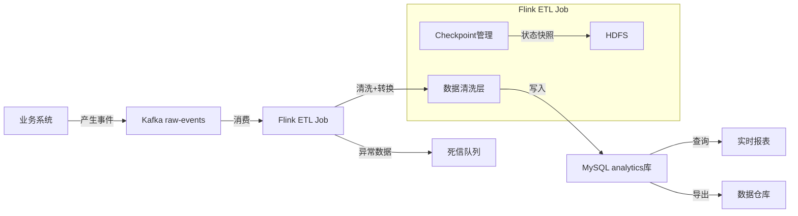
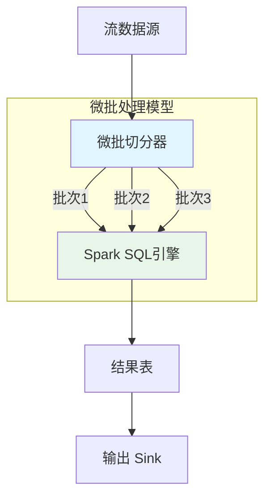
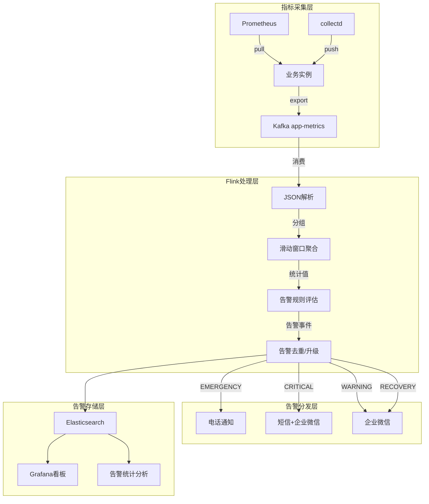
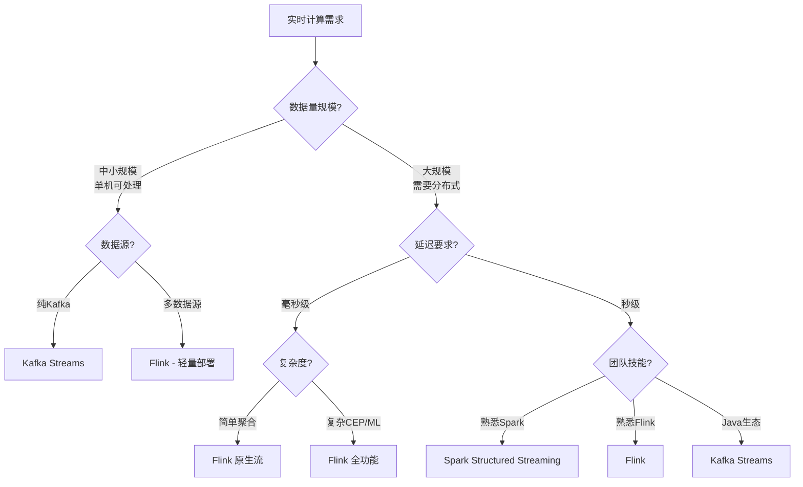

# 第59章 实时计算 实战案例

***

## 章节导言

理论与技巧的价值最终要通过实践来检验。本节通过四个精心设计的实战案例，展示实时计算技术在不同业务场景中的完整应用——从数据摄入到结果输出，从架构设计到性能调优，从开发部署到故障排查。每个案例都基于真实业务场景，包含完整的代码实现、架构决策分析和生产环境最佳实践，帮助读者将前序章节的理论知识转化为可落地的工程能力。

四个案例覆盖了实时计算领域最主流的技术栈和最典型的应用场景，从轻量级到重量级、从简单聚合到复杂告警，构成了实时计算工程实践的完整图谱：

| 案例 | 技术栈 | 核心场景 | 适用读者 |
|------|--------|----------|----------|
| 案例一 | Apache Flink | 实时ETL数据管道 | 数据工程师、数据架构师 |
| 案例二 | Kafka Streams | 订单实时聚合分析 | 后端开发者、流处理初学者 |
| 案例三 | Spark Structured Streaming | 实时监控与指标分析 | 数据分析师、运维工程师 |
| 案例四 | Apache Flink | 实时监控与告警系统 | 运维工程师、SRE团队 |

**学习路线建议：** 初学者建议按顺序阅读，从案例二（Kafka Streams）入手——它最轻量、最容易上手；进阶读者可直接跳到案例一和案例四——它们展示了生产级Flink应用的完整实践；案例三则适合熟悉Spark生态的读者作为参考。

***

## 59.15 Flink实时ETL实战

### 业务背景

在数据驱动型企业中，数据ETL（Extract-Transform-Load）是连接业务系统与数据平台的桥梁。传统的批处理ETL以小时甚至天为单位运行，无法满足实时分析的需求。例如，电商平台的实时推荐系统需要秒级获取用户的最新行为数据，风控系统需要在交易发生的瞬间完成数据采集和预处理。

实时ETL的核心挑战在于：如何在保证数据不丢、不重的前提下，实现高吞吐、低延迟的数据清洗与转换？Flink凭借其精确一次（Exactly-Once）语义、强大的状态管理和灵活的窗口机制，成为实时ETL的首选引擎。

本案例构建一个完整的Flink实时ETL作业：从Kafka消费原始事件数据，经过清洗、转换、富化后写入MySQL数据库，供下游分析和查询系统使用。

### 架构设计



**数据流说明：**
- **正向流**：业务系统产生用户行为事件 → Kafka作为消息缓冲 → Flink消费并清洗转换 → MySQL供查询使用
- **异常流**：解析失败或校验不通过的数据 → 死信队列（Dead Letter Topic）→ 人工排查修复后重新入队
- **状态流**：Flink Checkpoint定期将状态快照写入HDFS，保障故障恢复时的数据一致性

### 完整代码实现

```python
"""
Flink实时ETL作业：Kafka -> 清洗转换 -> MySQL
场景：电商平台用户行为事件的实时采集与入库
"""
from pyflink.datastream import StreamExecutionEnvironment
from pyflink.datastream.connectors.kafka import (
    KafkaSource, KafkaOffsetsInitializer,
    KafkaSink, KafkaRecordSerializationSchema
)
from pyflink.common import WatermarkStrategy, Types, Configuration, Duration
from pyflink.datastream.functions import (
    MapFunction, FilterFunction, KeyedProcessFunction
)
from pyflink.datastream.connectors.jdbc import (
    JdbcSink, JdbcConnectionOptions, JdbcExecutionOptions
)
import json
import logging
from datetime import datetime

logger = logging.getLogger(__name__)


# ==================== 数据模型 ====================

class RawEvent:
    """原始事件数据模型"""
    def __init__(self, event_id, user_id, event_type, timestamp, properties):
        self.event_id = event_id
        self.user_id = user_id
        self.event_type = event_type
        self.timestamp = timestamp
        self.properties = properties


class CleanedEvent:
    """清洗后的标准事件"""
    def __init__(self, event_id, user_id, event_type, timestamp,
                 properties, date, hour, device_type):
        self.event_id = event_id
        self.user_id = user_id
        self.event_type = event_type
        self.timestamp = timestamp
        self.properties = properties
        self.date = date
        self.hour = hour
        self.device_type = device_type


# ==================== 算子实现 ====================

class EventParser(MapFunction):
    """事件解析器：将JSON字符串解析为结构化对象

    设计要点：
    1. 使用try-except捕获解析异常，避免单条数据导致作业失败
    2. 返回None表示解析失败，后续Filter算子过滤
    3. 日志记录解析失败的数据，便于排查数据质量问题
    """

    def map(self, raw_json):
        try:
            event = json.loads(raw_json)
            # 字段校验：必须包含核心字段
            required_fields = ["id", "user_id", "type", "timestamp"]
            if not all(field in event for field in required_fields):
                logger.warning(f"缺少必要字段: {raw_json[:200]}")
                return None
            return RawEvent(
                event_id=event["id"],
                user_id=event["user_id"],
                event_type=event["type"],
                timestamp=event["timestamp"],
                properties=event.get("properties", {})
            )
        except json.JSONDecodeError as e:
            logger.error(f"JSON解析失败: {e}, 原始数据: {raw_json[:100]}")
            return None
        except Exception as e:
            logger.error(f"事件解析异常: {e}")
            return None


class EventTransformer(MapFunction):
    """事件转换器：将原始事件转换为标准格式

    转换逻辑：
    1. 从timestamp提取日期和小时（用于分区）
    2. 从properties提取设备类型（业务富化）
    3. properties序列化为JSON字符串存储
    """

    def map(self, raw_event):
        if raw_event is None:
            return None
        try:
            ts_str = raw_event.timestamp
            # 解析时间戳，支持多种格式
            if isinstance(ts_str, str):
                if "T" in ts_str:
                    dt = datetime.fromisoformat(ts_str.replace("Z", "+00:00"))
                else:
                    dt = datetime.strptime(ts_str, "%Y-%m-%d %H:%M:%S")
            else:
                dt = datetime.fromtimestamp(ts_str / 1000)

            return CleanedEvent(
                event_id=raw_event.event_id,
                user_id=raw_event.user_id,
                event_type=raw_event.event_type,
                timestamp=raw_event.timestamp,
                properties=json.dumps(raw_event.properties),
                date=dt.strftime("%Y-%m-%d"),
                hour=dt.strftime("%Y-%m-%d %H:00:00"),
                device_type=raw_event.properties.get("device_type", "unknown")
            )
        except Exception as e:
            logger.error(f"事件转换失败: {e}, event_id={raw_event.event_id}")
            return None


class ValidEventFilter(FilterFunction):
    """过滤无效事件

    过滤规则：
    1. 排除解析/转换失败的None记录
    2. 排除event_id或user_id为空的记录
    3. 排除timestamp为空的记录
    """

    def filter(self, event):
        if event is None:
            return False
        if not event.event_id or not event.user_id:
            logger.debug(f"过滤缺少关键字段的事件: event_id={event.event_id}")
            return False
        if not event.timestamp:
            return False
        return True


# ==================== 主作业 ====================

def build_realtime_etl():
    """构建实时ETL作业

    架构决策：
    - Source: Kafka（支持消费位点持久化，配合Checkpoint实现Exactly-Once）
    - Processing: Map + Filter（轻量级转换，Operator Chain优化减少开销）
    - Sink: JDBC MySQL（批量写入降低数据库压力）
    - Checkpoint: 60秒间隔，EXACTLY_ONCE模式
    """
    # 获取执行环境
    env = StreamExecutionEnvironment.get_execution_environment()
    env.set_parallelism(4)

    # 配置Checkpoint（生产环境必配）
    env.enable_checkpointing(60000)  # 60秒
    checkpoint_config = env.get_checkpoint_config()
    checkpoint_config.set_checkpointing_mode("EXACTLY_ONCE")
    checkpoint_config.set_min_pause_between_checkpoints(30000)
    checkpoint_config.set_checkpoint_timeout(120000)
    checkpoint_config.set_tolerable_checkpoint_failure_number(3)

    # 配置状态后端（推荐RocksDB）
    config = Configuration()
    config.set_string("state.backend", "rocksdb")
    config.set_string("state.checkpoints.dir", "hdfs:///flink/checkpoints/etl")
    config.set_boolean("state.backend.incremental", True)
    env.configure(config)

    # ==================== Source: Kafka ====================
    kafka_source = KafkaSource.builder() \
        .set_bootstrap_servers("kafka1:9092,kafka2:9092,kafka3:9092") \
        .set_topics("raw-user-events") \
        .set_group_id("flink-etl-consumer") \
        .set_starting_offsets(KafkaOffsetsInitializer.committed_offsets(
            KafkaOffsetsInitializer.latest()  # 首次启动从latest开始
        )) \
        .set_value_only_deserializer(
            SimpleStringSchema()
        ) \
        .set_property("fetch.min.bytes", "1") \
        .set_property("fetch.max.wait.ms", "500") \
        .build()

    # 配置水印策略：允许10秒乱序
    watermark_strategy = WatermarkStrategy \
        .for_bounded_out_of_orderness(Duration.of_seconds(10)) \
        .with_idleness(Duration.of_minutes(1))

    stream = env.from_source(
        kafka_source, watermark_strategy, "Kafka User Events Source"
    )

    # ==================== Processing: 清洗 + 转换 ====================
    result = stream \
        .map(EventParser(), output_type=Types.PICKLED_BYTE_ARRAY()) \
        .filter(ValidEventFilter()) \
        .map(EventTransformer(), output_type=Types.PICKLED_BYTE_ARRAY())

    # ==================== Sink: JDBC MySQL ====================
    jdbc_sink = JdbcSink.sink(
        # UPSERT语义：存在则更新，不存在则插入
        "INSERT INTO user_events "
        "(event_id, user_id, event_type, event_time, properties, "
        "event_date, event_hour, device_type) "
        "VALUES (?, ?, ?, ?, ?, ?, ?, ?) "
        "ON DUPLICATE KEY UPDATE "
        "properties=VALUES(properties), "
        "device_type=VALUES(device_type)",

        # 参数绑定
        JdbcStatementBuilder(lambda stmt, event: (
            stmt.setString(1, event.event_id),
            stmt.setString(2, event.user_id),
            stmt.setString(3, event.event_type),
            stmt.setString(4, event.timestamp),
            stmt.setString(5, event.properties),
            stmt.setString(6, event.date),
            stmt.setString(7, event.hour),
            stmt.setString(8, event.device_type)
        )),

        # 批量写入配置
        JdbcExecutionOptions.builder()
            .with_batch_size(2000)          # 每批2000条
            .with_batch_interval_ms(5000)   # 最长5秒一批
            .with_max_retries(3)            # 重试3次
            .with_retry_interval_ms(10000)  # 重试间隔10秒
            .build(),

        # 数据库连接
        JdbcConnectionOptions.builder()
            .with_url("jdbc:mysql://mysql-analytics:3306/analytics"
                      "?rewriteBatchedStatements=true")
            .with_user_name("flink_etl_user")
            .with_password("${MYSQL_PASSWORD}")  # 生产环境从配置中心获取
            .with_connection_check_timeout_seconds(30)
            .build()
    )

    result.add_sink(jdbc_sink)

    # 设置作业名（在Flink Web UI中显示）
    env.execute("User Events Realtime ETL - v1.2")
```

### 生产环境数据库建表

```sql
-- MySQL建表语句（需要在ETL作业启动前执行）
CREATE TABLE IF NOT EXISTS user_events (
    event_id VARCHAR(64) PRIMARY KEY COMMENT '事件唯一ID',
    user_id VARCHAR(64) NOT NULL COMMENT '用户ID',
    event_type VARCHAR(32) NOT NULL COMMENT '事件类型',
    event_time VARCHAR(64) COMMENT '事件发生时间',
    properties JSON COMMENT '事件属性（JSON）',
    event_date DATE COMMENT '事件日期（分区键）',
    event_hour DATETIME COMMENT '事件小时（聚合键）',
    device_type VARCHAR(32) DEFAULT 'unknown' COMMENT '设备类型',
    created_at TIMESTAMP DEFAULT CURRENT_TIMESTAMP COMMENT '入库时间',
    updated_at TIMESTAMP DEFAULT CURRENT_TIMESTAMP ON UPDATE CURRENT_TIMESTAMP,
    INDEX idx_user_time (user_id, event_date),
    INDEX idx_event_type (event_type, event_date),
    INDEX idx_event_hour (event_hour)
) ENGINE=InnoDB DEFAULT CHARSET=utf8mb4 COMMENT='用户行为事件表';
```

### 关键设计决策解析

**为什么选择Kafka作为Source？** Kafka支持消费位点持久化，Flink通过Checkpoint记录消费位点，故障恢复时从上次Checkpoint的位点重新消费，实现Exactly-Once语义。同时Kafka的高吞吐和分区并行能力天然适配Flink的分布式架构。

**为什么选择JDBC批量写入而非逐条写入？** MySQL单条INSERT的开销约为1-2ms（含网络往返和事务开销），吞吐量上限约500-1000条/秒。批量写入（rewriteBatchedStatements=true）可以将吞吐量提升到10000条/秒以上。batch_size=2000和batch_interval_ms=5000的组合保证了每秒处理数千条事件的同时，单批写入延迟控制在可接受范围内。

**为什么需要Dead Letter Queue？** 实际业务数据中总有格式异常的数据（约0.1%-1%），如果不处理会导致ETL作业频繁失败或异常数据污染分析结果。将异常数据发送到死信队列（Dead Letter Topic），既不影响主流程，又保留了异常数据供后续分析和修复。

**为什么不使用Elasticsearch替代MySQL？** Elasticsearch适合全文检索和复杂查询，但作为ETL目标端存在写放大问题——每个文档写入时需要建立倒排索引、列式存储等多层结构，写入延迟和资源消耗远高于MySQL。对于OLTP类型的查询（按主键/索引精确查询），MySQL的B+Tree索引效率更高。如果下游需要全文检索能力，可在ETL完成后由独立任务将MySQL数据同步到ES。

**水印策略为什么选择10秒？** 电商平台的用户行为事件通常在产生后1-5秒内到达Kafka，但网络抖动、客户端批量上报等场景可能导致延迟超过10秒。设置10秒水印延迟（Allowed Lateness）是一个经验平衡点——太短会导致迟到事件被丢弃，太长则增加窗口状态的存储压力。对于业务容忍度更高的场景（如报表类），可适当放宽到30-60秒。

### 性能指标与调优建议

| 指标 | 开发环境 | 生产环境 | 说明 |
|------|----------|----------|------|
| 并行度 | 2 | 4-8 | 根据Kafka分区数和MySQL连接池调整 |
| Checkpoint间隔 | 30秒 | 60秒 | 平衡恢复时间与吞吐量 |
| 批量写入大小 | 100 | 2000 | MySQL连接数有限，批量越大越高效 |
| 水印延迟 | 5秒 | 10秒 | 事件到达延迟越长，水印延迟越大 |
| 内存占用 | 512MB | 2-4GB | RocksDB状态后端，含Block Cache |
| Kafka消费延迟 | N/A | <1000条 | consumer_lag超过此值需扩容 |

### 常见陷阱与排查

**陷阱1：Kafka Offset提交失败导致重复消费**

现象：故障恢复后，Flink重新消费了大量已经处理过的数据，MySQL中出现大量重复写入。

原因：Checkpoint间隔设置过长（如10分钟），两次Checkpoint之间作业崩溃，恢复时从上一个Checkpoint的offset重新消费，导致中间的数据被重复处理。

解决方案：将Checkpoint间隔缩短到30-60秒；使用`EXACTLY_ONCE`模式确保Kafka offset的提交与Checkpoint绑定；MySQL端使用`ON DUPLICATE KEY UPDATE`幂等写入作为最后防线。

**陷阱2：MySQL连接池耗尽**

现象：Flink TaskManager日志中出现`Cannot get a connection, pool error Timeout waiting for idle object`。

原因：每个TaskManager的JDBC Sink维护一个连接池，当并行度为8、batch_size为2000时，若MySQL的最大连接数（默认151）小于TaskManager数量，连接池会被耗尽。此外，若batch写入期间MySQL慢查询阻塞了连接释放，也会导致连接不足。

解决方案：计算公式——MySQL最大连接数 ≥ Flink并行度 × 每个TaskManager的Sink数量 + 其他应用连接数；调整batch_size和batch_interval_ms，降低连接使用频率；在JDBC URL中添加`connectTimeout=5000&socketTimeout=10000`避免连接长时间占用。

**陷阱3：状态膨胀导致OOM**

现象：TaskManager频繁重启，日志中出现`java.lang.OutOfMemoryError: Java heap space`。

原因：使用了大量Keyed State（如按user_id分组计数），当用户量达到千万级时，状态大小可超过数GB。默认的FsStateBackend将状态存储在TaskManager堆内存中，容易触发OOM。

解决方案：切换到RocksDB State Backend（状态存储在磁盘）；设置State TTL自动清理过期状态（如`TtlConfig.newBuilder(Duration.ofDays(7)).build()`）；启用RocksDB增量Checkpoint减少每次Checkpoint的数据量。

**陷阱4：数据丢失风险**

现象：下游报表系统发现某时段数据缺失，但上游Kafka中数据完好。

原因：作业被取消（cancel）而非暂停（stop-with-savepoint），导致最后一次Checkpoint之后的数据丢失。另一种原因是Kafka Source配置了`set_starting_offsets(earliest)`但未正确配置消费组，导致启动时从头消费覆盖了正确位点。

解决方案：使用`flink stop-with-savepoint`替代`flink cancel`；生产环境使用`committed_offsets`作为起始位点；定期对比Kafka offset和MySQL记录数，发现数据量差异及时告警。

### 部署与运维

**YARN模式提交命令：**

```bash
# 提交到YARN集群
flink run \
  -d \
  -yid application_1234567890_0001 \
  -p 4 \
  -c com.example.etl.RealtimeETL \
  -D state.backend=rocksdb \
  -D state.checkpoints.dir=hdfs:///flink/checkpoints/etl \
  -D execution.checkpointing.interval=60000 \
  -D execution.checkpointing.mode=EXACTLY_ONCE \
  -D taskmanager.memory.process.size=4g \
  -D taskmanager.numberOfTaskSlots=2 \
  realtime-etl-job.jar
```

**Kubernetes模式提交命令：**

```bash
# 使用Flink native K8s模式
flink run-application \
  -Dkubernetes.namespace=flink-production \
  -Dkubernetes.jobmanager.service-account=flink-sa \
  -Dkubernetes.container.image=flink:1.18-scala_2.12-java11 \
  -Dstate.backend=rocksdb \
  -Dstate.checkpoints.dir=s3://flink-checkpoints/etl \
  local:///opt/flink/usrlib/realtime-etl-job.jar
```

**日常运维检查清单：**

| 检查项 | 频率 | 方法 | 预期值 |
|--------|------|------|--------|
| Checkpoint状态 | 每小时 | Flink Web UI → Checkpoints | 最近一次SUCCESS |
| 消费延迟（consumer_lag） | 每5分钟 | Kafka consumer group命令 | <1000条 |
| TaskManager内存使用 | 每小时 | Flink Web UI → Metrics | 堆内存<80% |
| MySQL写入延迟 | 每小时 | MySQL慢查询日志 | 无慢查询 |
| HDFS磁盘使用 | 每天 | HDFS Web UI | Checkpoint目录<100GB |
| 作业重启次数 | 每天 | Flink Web UI → Job History | <2次/天 |

**常用Flink CLI命令速查：**

```bash
# 查看运行中的作业
flink list -r

# 停止作业并保存Savepoint
flink stop -s hdfs:///flink/savepoints <job_id>

# 从Savepoint恢复作业
flink run -s hdfs:///flink/savepoints/savepoint-xxxxx -c ... job.jar

# 查看作业详情
flink list -a  # 查看所有作业（包括已完成的）

# 取消作业（不推荐，数据可能丢失）
flink cancel <job_id>
```

***

## 59.16 Kafka Streams实时处理

### 为什么选择Kafka Streams？

Kafka Streams是Apache Kafka自带的轻量级流处理库，与Flink等独立的流处理引擎相比，它最大的优势是**零外部依赖**——不需要独立的集群，只需要一个Kafka集群即可。对于Kafka-to-Kafka的数据处理场景，Kafka Streams是成本最低、部署最简单的选择。

Kafka Streams的核心设计理念是"库而非框架"——它以JAR包的形式嵌入你的Java/Scala应用，没有独立的运行时环境，不需要提交到集群管理器。这使得它与微服务架构天然契合：你可以将流处理逻辑直接写在Spring Boot或Quarkus应用中，像调用普通函数一样使用Kafka Streams API。

### 适用场景对比

| 维度 | Kafka Streams | Flink |
|------|---------------|-------|
| 部署方式 | 嵌入式库（JAR依赖） | 独立集群部署 |
| 运维成本 | 极低（随应用部署） | 高（需要YARN/K8s） |
| 状态存储 | RocksDB + Changelog Topic | 多种State Backend |
| Exactly-Once | 支持（事务性消费/生产） | 支持（Checkpoint + 两阶段提交） |
| 复杂流处理 | 有限（无窗口、无CEP） | 丰富（窗口、CEP、ML） |
| 多数据源 | 仅Kafka | Kafka、文件、数据库等 |
| 适用规模 | 中小规模（单机/小集群） | 大规模（分布式集群） |

### 实战：订单实时聚合分析

```java
import org.apache.kafka.streams.*;
import org.apache.kafka.streams.kstream.*;
import org.apache.kafka.common.serialization.*;
import com.fasterxml.jackson.databind.ObjectMapper;

import java.time.Duration;
import java.time.Instant;
import java.util.Properties;
import java.util.concurrent.CountDownLatch;

/**
 * 订单实时聚合分析：按商户统计交易额
 *
 * 业务场景：电商平台需要实时统计每个商户的交易情况，
 * 包括交易额、订单数、平均客单价等指标，用于实时大屏展示。
 *
 * 数据流：
 * Kafka order-events -> 分组 -> 5分钟窗口聚合 -> Kafka order-stats
 */
public class OrderAggregator {

    // ==================== 数据模型 ====================

    /**
     * 订单事件
     */
    public static class OrderEvent {
        private String orderId;
        private String merchantId;
        private double amount;
        private String productCategory;
        private long timestamp;

        // 构造函数、getter/setter省略
        public String getMerchantId() { return merchantId; }
        public double getAmount() { return amount; }
        public long getTimestamp() { return timestamp; }
    }

    /**
     * 聚合统计结果
     */
    public static class OrderStats {
        private double totalAmount = 0;
        private long orderCount = 0;
        private double maxAmount = Double.MIN_VALUE;
        private double minAmount = Double.MAX_VALUE;
        private String merchantId;
        private long windowStart;
        private long windowEnd;

        public void addOrder(OrderEvent order) {
            this.totalAmount += order.getAmount();
            this.orderCount++;
            this.maxAmount = Math.max(this.maxAmount, order.getAmount());
            this.minAmount = Math.min(this.minAmount, order.getAmount());
        }

        public double getAvgAmount() {
            return orderCount > 0 ? totalAmount / orderCount : 0;
        }

        // getter/setter省略
    }

    // ==================== 主流程 ====================

    public static void main(String[] args) {
        Properties props = new Properties();
        props.put(StreamsConfig.APPLICATION_ID_CONFIG, "order-aggregator");
        props.put(StreamsConfig.BOOTSTRAP_SERVERS_CONFIG, "kafka1:9092,kafka2:9092");
        props.put(StreamsConfig.DEFAULT_KEY_SERDE_CLASS_CONFIG, Serdes.StringSerde.class);
        props.put(StreamsConfig.DEFAULT_VALUE_SERDE_CLASS_CONFIG, Serdes.StringSerde.class);

        // Exactly-Once语义：保证消息恰好被处理一次
        props.put(StreamsConfig.PROCESSING_GUARANTEE_CONFIG, "exactly_once_v2");

        // 状态存储配置
        props.put(StreamsConfig.STATE_DIR_CONFIG, "/tmp/kafka-streams-state");
        props.put(StreamsConfig.NUM_STREAM_THREADS_CONFIG, 4);
        props.put(StreamsConfig.REPLICATION_FACTOR_CONFIG, 3);

        // 降级策略：处理失败时继续运行（不阻塞整个作业）
        props.put(StreamsConfig.Default_DESERIALIZATION_EXCEPTION_HANDLER_CLASS_CONFIG,
                  LogAndContinueExceptionHandler.class);

        StreamsBuilder builder = new StreamsBuilder();

        // ==================== Source: 订单事件流 ====================
        KStream<String, OrderEvent> orders = builder.stream(
            "order-events",
            Consumed.with(Serdes.String(), orderEventSerde)
                    .withTimestampExtractor((record, timestamp) -> {
                        // 使用订单自身的事件时间（而非Kafka消息时间）
                        return record.value().getTimestamp();
                    })
        );

        // ==================== Processing: 分组 + 窗口聚合 ====================
        KTable<Windowed<String>, OrderStats> stats = orders
            // 按商户ID分组
            .groupBy(
                (key, order) -> order.getMerchantId(),
                Grouped.with(Serdes.String(), orderEventSerde)
            )
            // 5分钟滚动窗口，无允许延迟
            .windowedBy(TimeWindows.ofSizeWithNoGrace(Duration.ofMinutes(5)))
            // 聚合计算
            .aggregate(
                OrderStats::new,
                (merchantId, order, currentStats) -> {
                    currentStats.addOrder(order);
                    currentStats.setMerchantId(merchantId);
                    return currentStats;
                },
                Materialized.<String, OrderStats, WindowStore<Bytes, byte[]>>with(
                    Serdes.String(), orderStatsSerde
                ).withRetention(Duration.ofMinutes(15))  // 状态保留15分钟
            );

        // ==================== Sink: 输出到Kafka ====================
        stats.toStream()
            .map((windowedKey, windowStats) -> {
                // 包含窗口时间信息
                OrderStats statsWithWindow = windowStats;
                statsWithWindow.setWindowStart(windows.start());
                statsWithWindow.setWindowEnd(window.end());
                return KeyValue.pair(windowedKey.key(), statsWithWindow);
            })
            .to("order-stats",
                Produced.with(Serdes.String(), orderStatsSerde));

        // ==================== 启动与优雅关闭 ====================
        KafkaStreams streams = new KafkaStreams(builder.build(), props);

        // 添加状态监听器（监控状态变化）
        streams.setStateListener((newState, oldState) -> {
            System.out.printf("State changed: %s -> %s%n", oldState, newState);
            if (newState == KafkaStreams.State.ERROR) {
                System.err.println("Stream processing error!");
                // 生产环境应触发告警
            }
        });

        // 添加异常处理器
        streams.setUncaughtExceptionHandler((thread, throwable) -> {
            System.err.printf("Uncaught exception in thread %s: %s%n",
                            thread.getName(), throwable.getMessage());
            // 生产环境应触发告警并决定是否重启
        });

        // 优雅关闭钩子
        Runtime.getRuntime().addShutdownHook(new Thread(() -> {
            System.out.println("Shutting down Kafka Streams...");
            streams.close(Duration.ofSeconds(30));
            System.out.println("Shutdown complete.");
        }));

        streams.start();
    }
}
```

### Kafka Streams vs Flink：如何选型

**选Kafka Streams的场景：**
- 数据源和目的地都是Kafka（Kafka-to-Kafka）
- 团队规模小，无法运维独立的Flink集群
- 业务逻辑简单（过滤、映射、简单聚合）
- 希望与微服务架构无缝集成（嵌入应用进程）

**选Flink的场景：**
- 需要复杂窗口（滑动窗口、会话窗口）
- 需要CEP（复杂事件处理）
- 需要多数据源联合处理（Kafka + 数据库 + 文件）
- 数据规模大，需要分布式计算
- 需要SQL接口（Flink SQL）

### 生产环境配置

**JVM参数配置（推荐）：**

```bash
# 启动脚本
java -server \
  -Xms2g -Xmx4g \
  -XX:+UseG1GC \
  -XX:MaxGCPauseMillis=20 \
  -XX:InitiatingHeapOccupancyPercent=35 \
  -XX:G1HeapRegionSize=16m \
  -XX:+ParallelRefProcEnabled \
  -XX:+ExplicitGCInvokesConcurrent \
  -jar order-aggregator.jar
```

**关键配置参数：**

| 参数 | 推荐值 | 说明 |
|------|--------|------|
| `num.stream.threads` | CPU核心数×0.5 | 流处理线程数，过多会导致上下文切换 |
| `state.dir` | SSD挂载点 | 状态存储目录，SSD比HDD快10倍以上 |
| `replication.factor` | 3 | Changelog Topic副本数，保证高可用 |
| `commit.interval.ms` | 30000 | 提交间隔，影响Exactly-Once语义粒度 |
| `cache.max.bytes.buffering` | 10MB | 缓冲区大小，增大可减少写Kafka次数 |
| `num.standby.replicas` | 1 | 热备副本数，用于快速故障切换 |

**监控指标（JMX）：**

| 指标 | 含义 | 告警阈值 |
|------|------|----------|
| `records-consumed-total` | 消费总记录数 | 与预期对比判断是否正常 |
| `commit-latency-avg` | 提交延迟 | >500ms |
| `poll-latency-avg` | 拉取延迟 | >200ms |
| `state-store-size` | 状态存储大小 | >磁盘80% |
| `buffered-records` | 缓冲区记录数 | 持续增长说明处理不过来 |

### 常见陷阱与排查

**陷阱1：状态存储目录磁盘满**

现象：Kafka Streams抛出`IllegalStateException: State store ... is closed`，应用重启后恢复。

原因：Kafka Streams的State Store使用本地磁盘存储（默认/tmp/kafka-streams-state），Changelog Topic的数据也会在本地保留副本。当处理大量Key时，状态数据可增长到数十GB。若状态目录所在磁盘空间不足，会导致状态存储关闭。

解决方案：将`state.dir`配置到大容量SSD挂载点；设置`retention.ms`自动清理过期状态；监控磁盘使用率，在80%时告警。

**陷阱2：Rebalance频繁导致处理延迟**

现象：Kafka Streams频繁触发Consumer Rebalance，每次Rebalance期间所有分区停止处理，导致端到端延迟飙升。

原因：`session.timeout.ms`设置过短（如30秒），加上网络抖动或GC停顿，导致Broker认为Consumer已下线并触发Rebalance。另一种原因是`max.poll.interval.ms`设置过小，当处理时间超过此阈值时Consumer被踢出。

解决方案：将`session.timeout.ms`设置为45秒以上；将`max.poll.interval.ms`设置为最大处理时间的1.5倍；使用`CooperativeStickyAssignor`减少Rebalance时的数据迁移量。

**陷阱3：Exactly-Once下性能下降明显**

现象：开启`exactly_once_v2`后，吞吐量下降50%以上。

原因：Exactly-Once语义要求每次提交时开启Kafka事务，事务期间所有写入都需要等待commit完成。在高吞吐场景下，事务提交成为瓶颈。

解决方案：适当调大`commit.interval.ms`（如从默认30ms调整到30秒），减少事务提交频率；评估业务是否真正需要Exactly-Once——如果下游能容忍少量重复，使用`at_least_once`可显著提升性能。

***

## 59.17 Spark Structured Streaming实战

### 技术特点

Spark Structured Streaming是Apache Spark的流处理模块，采用微批处理（Micro-Batch）模型——将连续的流数据切分为小的批处理任务依次执行。这种设计的核心优势是**与Spark批处理API完全统一**，开发者可以用相同的DataFrame/Dataset API处理批数据和流数据。



**微批处理的工作流程：**
1. **触发阶段**：根据Trigger间隔（默认100ms），微批切分器向Source请求一批数据
2. **处理阶段**：Spark SQL引擎将这批数据作为DataFrame处理，利用Catalyst优化器生成最优执行计划
3. **输出阶段**：处理结果写入Sink（控制台、Kafka、数据库等）
4. **提交阶段**：确认处理完成，记录偏移量，准备下一个微批

### 延迟特征

| 处理模式 | 典型延迟 | 适用场景 |
|----------|----------|----------|
| 微批处理（默认） | 秒级~十秒级 | 大部分实时分析场景 |
| Continuous Processing（实验性） | 毫秒级 | 超低延迟场景 |

### 实战：实时日志监控与指标分析

```python
"""
Spark Structured Streaming实时监控示例
场景：微服务架构下，实时分析应用日志，检测异常并触发告警
"""
from pyspark.sql import SparkSession
from pyspark.sql.functions import *
from pyspark.sql.types import (
    StructType, StructField, StringType,
    IntegerType, TimestampType, DoubleType
)
import json

# ==================== 初始化Spark ====================
spark = SparkSession.builder \
    .appName("RealTimeLogMonitoring") \
    .config("spark.sql.streaming.schemaInference", "true") \
    .config("spark.sql.shuffle.partitions", "8") \
    .config("spark.streaming.kafka.maxRatePerPartition", "10000") \
    .getOrCreate()

# 设置日志级别
spark.sparkContext.setLogLevel("WARN")

# ==================== 定义数据Schema ====================
log_schema = StructType([
    StructField("timestamp", TimestampType(), False),
    StructField("service", StringType(), False),
    StructField("level", StringType(), False),
    StructField("message", StringType(), True),
    StructField("latency_ms", IntegerType(), True),
    StructField("status_code", IntegerType(), True),
    StructField("trace_id", StringType(), True),
    StructField("host", StringType(), True),
])

# ==================== Source: Kafka日志流 ====================
raw_logs = spark.readStream \
    .format("kafka") \
    .option("kafka.bootstrap.servers", "kafka1:9092,kafka2:9092") \
    .option("subscribe", "application-logs") \
    .option("startingOffsets", "latest") \
    .option("failOnDataLoss", "false") \
    .option("maxOffsetsPerTrigger", 100000) \
    .load()

# 解析JSON日志
parsed_logs = raw_logs.select(
    col("key").cast("string").alias("kafka_key"),
    from_json(col("value").cast("string"), log_schema).alias("log"),
    col("timestamp").alias("kafka_timestamp"),
    col("partition").alias("kafka_partition"),
    col("offset").alias("kafka_offset")
).select(
    "log.*", "kafka_timestamp", "kafka_partition", "kafka_offset"
).withWatermark("timestamp", "30 seconds")  # 允许30秒乱序

# ==================== Processing: 多维度实时分析 ====================

# 指标1：每分钟每个服务的请求量和错误率
service_metrics = parsed_logs \
    .filter(col("status_code").isNotNull()) \
    .groupBy(
        window("timestamp", "1 minute"),
        "service"
    ).agg(
        count("*").alias("total_requests"),
        sum(when(col("status_code") >= 500, 1).otherwise(0))
            .alias("error_count"),
        sum(when(col("status_code") >= 400, 1).otherwise(0))
            .alias("client_error_count"),
        avg("latency_ms").alias("avg_latency"),
        expr("percentile_approx(latency_ms, 0.50)").alias("p50_latency"),
        expr("percentile_approx(latency_ms, 0.95)").alias("p95_latency"),
        expr("percentile_approx(latency_ms, 0.99)").alias("p99_latency"),
        max("latency_ms").alias("max_latency")
    ).withColumn(
        "error_rate", col("error_count") / col("total_requests")
    ).withColumn(
        "window_start", col("window.start")
    ).withColumn(
        "window_end", col("window.end")
    )

# 指标2：每5分钟每个服务+级别的日志分布
log_distribution = parsed_logs \
    .groupBy(
        window("timestamp", "5 minutes"),
        "service", "level"
    ).agg(
        count("*").alias("log_count")
    )

# 指标3：异常检测——错误率突增
# 使用滑动窗口计算错误率趋势
error_trend = parsed_logs \
    .filter(col("status_code").isNotNull()) \
    .groupBy(
        window("timestamp", "5 minutes", "1 minute"),  # 5分钟窗口，1分钟滑动
        "service"
    ).agg(
        sum(when(col("status_code") >= 500, 1).otherwise(0)).alias("errors"),
        count("*").alias("total")
    ).withColumn(
        "error_rate", col("errors") / col("total")
    )

# ==================== Alert: 告警规则 ====================

# 规则1：错误率超过5%
high_error_rate = service_metrics.filter(
    (col("error_rate") > 0.05) &amp;
    (col("total_requests") > 10)  # 至少10个请求才评估
).select(
    col("service"),
    col("window_end").alias("alert_time"),
    lit("HIGH_ERROR_RATE").alias("alert_type"),
    col("error_rate"),
    col("total_requests"),
    col("error_count"),
    concat(lit("服务 "), col("service"),
           lit(" 错误率 "), round(col("error_rate") * 100, 2),
           lit("%（阈值5%），总请求 "), col("total_requests"),
           lit("，错误数 "), col("error_count")).alias("alert_message")
)

# 规则2：P99延迟超过2秒
high_latency = service_metrics.filter(
    col("p99_latency") > 2000
).select(
    col("service"),
    col("window_end").alias("alert_time"),
    lit("HIGH_LATENCY").alias("alert_type"),
    col("p99_latency"),
    col("p95_latency"),
    col("avg_latency"),
    concat(lit("服务 "), col("service"),
           lit(" P99延迟 "), col("p99_latency"),
           lit("ms（阈值2000ms），P95="), col("p95_latency"),
           lit("ms，平均="), round(col("avg_latency"), 1),
           lit("ms")).alias("alert_message")
)

# 合并所有告警
all_alerts = high_error_rate.union(high_latency)

# ==================== Sink: 多目标输出 ====================

# 输出1：指标到控制台（开发调试）
metrics_query = service_metrics.writeStream \
    .outputMode("update") \
    .format("console") \
    .option("truncate", "false") \
    .option("numRows", 50) \
    .trigger(processingTime="30 seconds") \
    .queryName("service-metrics") \
    .start()

# 输出2：告警到Kafka（生产环境对接告警系统）
alert_query = all_alerts.select(
    col("service").cast("string"),
    to_json(struct(
        col("service"), col("alert_time"), col("alert_type"),
        col("alert_message")
    )).alias("value")
).writeStream \
    .outputMode("append") \
    .format("kafka") \
    .option("kafka.bootstrap.servers", "kafka1:9092") \
    .option("topic", "monitoring-alerts") \
    .trigger(processingTime="30 seconds") \
    .queryName("alert-producer") \
    .start()

# 输出3：指标持久化到MySQL（生产环境）
# 使用foreachBatch写入MySQL
def write_metrics_to_db(batch_df, batch_id):
    """将指标数据写入MySQL（每个微批执行一次）"""
    if batch_df.count() == 0:
        return

    # 转换为JDBC可写格式
    metrics_to_write = batch_df.select(
        col("service"),
        col("window_start"),
        col("window_end"),
        col("total_requests"),
        col("error_count"),
        col("error_rate"),
        col("avg_latency"),
        col("p50_latency"),
        col("p95_latency"),
        col("p99_latency"),
        col("max_latency")
    )

    metrics_to_write.write \
        .format("jdbc") \
        .option("url", "jdbc:mysql://mysql-analytics:3306/analytics"
                "?rewriteBatchedStatements=true") \
        .option("dbtable", "service_metrics") \
        .option("driver", "com.mysql.cj.jdbc.Driver") \
        .option("user", "spark_user") \
        .option("password", "${MYSQL_PASSWORD}") \
        .option("batchsize", "5000") \
        .option("isolationLevel", "NONE") \
        .mode("append") \
        .save()

# 注册foreachBatch
metrics_db_query = service_metrics.writeStream \
    .outputMode("update") \
    .foreachBatch(write_metrics_to_db) \
    .trigger(processingTime="60 seconds") \
    .queryName("metrics-to-mysql") \
    .start()

# ==================== 启动与监控 ====================
print("所有流处理查询已启动，等待数据...")
spark.streams.awaitAnyTermination()
```

### 生产环境配置

**spark-submit命令：**

```bash
spark-submit \
  --master yarn \
  --deploy-mode cluster \
  --name RealTimeLogMonitoring \
  --num-executors 4 \
  --executor-cores 2 \
  --executor-memory 4g \
  --driver-memory 2g \
  --conf spark.streaming.kafka.maxRatePerPartition=10000 \
  --conf spark.sql.streaming.schemaInference=true \
  --conf spark.sql.shuffle.partitions=8 \
  --conf spark.sql.streaming.metricsEnabled=true \
  --jars mysql-connector-java-8.0.33.jar \
  realtime_log_monitor.py
```

**关键配置参数：**

| 参数 | 推荐值 | 说明 |
|------|--------|------|
| `maxOffsetsPerTrigger` | 100000 | 每个微批最大处理偏移量，防止积压 |
| `trigger.processingTime` | 30 seconds | 微批触发间隔，平衡延迟和吞吐 |
| `spark.sql.shuffle.partitions` | 8-16 | Shuffle分区数，与数据量匹配 |
| `spark.streaming.backpressure.enabled` | true | 开启背压，自动调节处理速率 |
| `failOnDataLoss` | false | 数据丢失时不失败（生产推荐） |

**监控指标：**

| 指标 | 含义 | 告警阈值 |
|------|------|----------|
| `inputRowsPerSecond` | 输入速率 | 持续为0说明Source故障 |
| `processedRowsPerSecond` | 处理速率 | 远低于input说明处理瓶颈 |
| `batchDuration` | 微批耗时 | >触发间隔说明处理积压 |
| `numInputRows` | 微批输入行数 | 每批为0说明数据源空 |
| `stateOperator.numRowsTotal` | 状态行数 | 持续增长需关注内存 |

### 常见陷阱与排查

**陷阱1：微批间隔过短导致大量小任务**

现象：Spark History Server显示每秒产生数十个微批任务，每个任务只处理几条数据，YARN资源调度开销远大于实际处理时间。

原因：Trigger间隔设置过短（如默认100ms），而数据到达速率不足以填满一个微批。每个微批都需要经历资源申请、任务调度、数据Shuffle等开销，微批越小，这些固定开销的占比越高。

解决方案：将`trigger.processingTime`调整到10-60秒，根据数据到达速率和延迟要求平衡；如果数据到达不均匀，使用`trigger.AvailableNow()`一次性处理所有积压数据。

**陷阱2：Checkpoint目录损坏导致作业无法恢复**

现象：作业重启后抛出`StreamingQueryException: Checkpoint file not found`，无法从上次中断点恢复。

原因：Checkpoint目录被误删、HDFS NameNode回收过期数据、或S3生命周期策略自动清理了Checkpoint文件。Spark的Checkpoint机制将偏移量和状态信息存储在文件系统中，一旦丢失就需要从头消费或指定新的起始偏移量。

解决方案：将Checkpoint存储到高可靠存储（HDFS或S3）；启用Write-Ahead Log（WAL）提供双重保障；配置Checkpoint目录的保留策略，避免被自动清理；定期备份Checkpoint目录到冷存储。

**陷阱3：failOnDataLoss的取舍**

现象：设置`failOnDataLoss=true`时，一旦Kafka Topic被清理或偏移量失效，作业立即停止并报错；设置`false`时作业继续运行但静默跳过数据，下游报表出现数据缺失。

原因：Kafka的`log.retention.hours`（默认168小时=7天）会在数据保留期满后删除数据。如果作业停机超过此期限，恢复时部分偏移量对应的数据已被删除。Spark无法处理"数据已不存在"的情况，必须在"作业崩溃"和"跳过数据"之间选择。

解决方案：根据业务容忍度决策——金融、交易等场景要求数据完整性，设置`failOnDataLoss=true`并确保Kafka数据保留期远大于最大停机时间；日志分析等场景可接受少量丢失，设置`false`并监控`numDroppedRows`指标。

***

## 59.18 Flink实时监控与告警系统

### 业务背景

在微服务架构下，一个中等规模的电商平台通常部署50-200个服务实例，每个实例每秒产生数百条指标数据（QPS、延迟、错误率、CPU、内存等）。传统监控系统（如Zabbix、Nagios）基于轮询机制，采集间隔通常为分钟级，无法满足秒级告警的需求。更关键的是，许多业务异常需要跨服务、跨指标关联分析才能识别——比如"订单服务P99延迟升高 + 支付服务错误率飙升"可能意味着数据库连接池耗尽。

本案例构建一个基于Flink的实时监控与告警引擎：从Kafka消费多维度指标数据，通过滑动窗口计算统计值，根据可配置的规则评估告警，并通过多渠道（企业微信、短信、电话、邮件）分级通知相关人员。系统设计了告警去重、升级、恢复三大机制，避免告警风暴的同时确保关键告警不被遗漏。

### 架构设计



**架构分层说明：**
- **指标采集层**：Prometheus负责pull模式采集基础设施指标（CPU/内存/磁盘），应用侧通过SDK以push模式发送业务指标（QPS/延迟/错误率），统一写入Kafka作为缓冲
- **Flink处理层**：核心处理引擎，负责解析、聚合和告警评估。使用滑动窗口保证告警的连续性和及时性
- **告警分发层**：根据告警严重度选择通知渠道，EMERGENCY级别通过电话确保SRE团队能即时响应
- **告警存储层**：所有告警事件归档到Elasticsearch，支持历史查询和告警趋势分析

### 完整代码实现

```python
"""
Flink实时监控与告警系统
场景：微服务架构下的多维度指标监控，自动检测异常并分级告警
"""
from pyflink.datastream import StreamExecutionEnvironment
from pyflink.datastream.connectors.kafka import (
    KafkaSource, KafkaOffsetsInitializer, SimpleStringSchema
)
from pyflink.common import WatermarkStrategy, Configuration, Duration, Time
from pyflink.datastream.window import SlidingEventTimeWindows
from pyflink.datastream.functions import (
    AggregateFunction, KeyedProcessFunction, RuntimeContext
)
from pyflink.common.watermark_strategy import TimestampAssigner
from pyflink.datastream.state import (
    ValueStateDescriptor, MapStateDescriptor
)
import json
import logging
from enum import Enum
from datetime import datetime

logger = logging.getLogger(__name__)


# ==================== 数据模型 ====================

class MetricPoint:
    """指标数据点"""
    def __init__(self, service, metric_name, value, timestamp, labels=None):
        self.service = service
        self.metric_name = metric_name
        self.value = value
        self.timestamp = timestamp
        self.labels = labels or {}


class AlertSeverity(Enum):
    WARNING = "WARNING"
    CRITICAL = "CRITICAL"
    EMERGENCY = "EMERGENCY"
    RECOVERY = "RECOVERY"


class MetricStats:
    """统计信息：使用在线算法计算均值、极值、标准差
    基于Welford算法的增量计算，避免存储所有原始数据
    """
    def __init__(self):
        self.count = 0
        self.sum = 0
        self.sum_sq = 0
        self.max = float('-inf')
        self.min = float('inf')

    def add(self, value):
        self.count += 1
        self.sum += value
        self.sum_sq += value * value
        self.max = max(self.max, value)
        self.min = min(self.min, value)

    @property
    def avg(self):
        return self.sum / self.count if self.count > 0 else 0

    @property
    def stddev(self):
        if self.count < 2:
            return 0
        variance = (self.sum_sq / self.count) - (self.avg ** 2)
        return variance ** 0.5


# ==================== 告警规则配置 ====================

ALERT_RULES = {
    "error_rate": {
        "threshold_warning": 0.03,    # 3%告警
        "threshold_critical": 0.05,   # 5%严重
        "threshold_emergency": 0.10,  # 10%紧急
        "min_samples": 20,            # 至少20个样本
        "window_minutes": 5,          # 5分钟窗口
        "suppress_minutes": 10,       # 告警抑制10分钟
    },
    "latency_p99": {
        "threshold_warning": 1000,    # 1秒
        "threshold_critical": 2000,   # 2秒
        "threshold_emergency": 5000,  # 5秒
        "min_samples": 50,
        "window_minutes": 5,
        "suppress_minutes": 15,
    },
    "latency_p95": {
        "threshold_warning": 500,     # 500ms
        "threshold_critical": 1000,   # 1秒
        "threshold_emergency": 3000,  # 3秒
        "min_samples": 50,
        "window_minutes": 5,
        "suppress_minutes": 15,
    },
    "cpu_usage": {
        "threshold_warning": 0.80,    # 80%
        "threshold_critical": 0.90,   # 90%
        "threshold_emergency": 0.95,  # 95%
        "min_samples": 5,
        "window_minutes": 3,
        "suppress_minutes": 20,
    },
    "memory_usage": {
        "threshold_warning": 0.85,    # 85%
        "threshold_critical": 0.90,   # 90%
        "threshold_emergency": 0.95,  # 95%
        "min_samples": 5,
        "window_minutes": 3,
        "suppress_minutes": 20,
    },
}


# ==================== 聚合器 ====================

class StatsAggregator(AggregateFunction):
    """统计聚合器：计算均值、最大值、最小值、标准差

    使用增量聚合，每条数据到达时更新统计值，避免缓存所有原始数据。
    """
    def create_accumulator(self):
        return MetricStats()

    def add(self, metric, acc):
        acc.add(metric.value)
        return acc

    def get_result(self, acc):
        return {
            "avg": round(acc.avg, 4),
            "max": round(acc.max, 4),
            "min": round(acc.min, 4),
            "stddev": round(acc.stddev, 4),
            "count": acc.count
        }

    def merge(self, acc1, acc2):
        # 合并两个统计窗口（滑动窗口可能需要合并）
        merged = MetricStats()
        merged.sum = acc1.sum + acc2.sum
        merged.count = acc1.count + acc2.count
        merged.max = max(acc1.max, acc2.max)
        merged.min = min(acc1.min, acc2.min)
        merged.sum_sq = acc1.sum_sq + acc2.sum_sq
        return merged


# ==================== 告警评估器 ====================

class AlertEvaluator(KeyedProcessFunction):
    """告警规则评估器

    功能：
    1. 根据规则评估指标是否触发告警
    2. 告警去重：同一服务+指标在抑制时间内不重复告警
    3. 告警升级：持续异常时自动升级告警严重度
    4. 告警恢复：指标恢复正常时发送恢复通知
    """

    def __init__(self, rules):
        self.rules = rules
        # 用于存储上次告警时间（去重用）
        self.last_alert_time = None
        # 用于存储上次告警严重度（升级检测）
        self.last_severity = None
        # 状态
        self.alert_state = None

    def open(self, runtime_context: RuntimeContext):
        """初始化状态——使用Keyed State确保每Key独立管理告警状态"""
        self.last_alert_time = runtime_context.get_state(
            ValueStateDescriptor("last_alert_time", "long")
        )
        self.last_severity = runtime_context.get_state(
            ValueStateDescriptor("last_severity", "string")
        )

    def process_element(self, stats, ctx):
        """评估指标是否触发告警"""
        metric_name = ctx.get_current_key()

        if metric_name not in self.rules:
            return

        rule = self.rules[metric_name]
        avg_value = stats["avg"]
        sample_count = stats["count"]

        # 样本数不足，跳过评估
        if sample_count < rule["min_samples"]:
            return

        # 判断告警严重度
        severity = self._determine_severity(avg_value, rule)

        if severity:
            # 检查是否需要抑制
            current_time = ctx.timestamp()
            last_time = self.last_alert_time.value()
            if last_time and self._should_suppress(current_time, last_time, rule["suppress_minutes"]):
                return

            # 创建告警
            alert = {
                "service": ctx.get_current_key().split(":")[0],
                "metric": metric_name,
                "severity": severity.value,
                "current_value": avg_value,
                "threshold": rule[f"threshold_{severity.value.lower()}"],
                "sample_count": sample_count,
                "avg": stats["avg"],
                "max": stats["max"],
                "min": stats["min"],
                "stddev": stats["stddev"],
                "timestamp": current_time,
                "message": self._build_alert_message(
                    metric_name, severity, avg_value, rule
                )
            }

            # 更新状态
            self.last_alert_time.update(current_time)
            self.last_severity.update(severity.value)

            yield alert

        elif self.last_severity.value():
            # 指标恢复正常，发送恢复通知
            recovery = {
                "service": ctx.get_current_key().split(":")[0],
                "metric": metric_name,
                "severity": "RECOVERY",
                "current_value": avg_value,
                "timestamp": ctx.timestamp(),
                "message": f"指标 {metric_name} 已恢复正常，当前值: {avg_value}"
            }
            self.last_severity.clear()
            self.last_alert_time.clear()
            yield recovery

    def _determine_severity(self, value, rule):
        """根据阈值判断告警严重度"""
        if value >= rule.get("threshold_emergency", float("inf")):
            return AlertSeverity.EMERGENCY
        elif value >= rule.get("threshold_critical", float("inf")):
            return AlertSeverity.CRITICAL
        elif value >= rule.get("threshold_warning", float("inf")):
            return AlertSeverity.WARNING
        return None

    def _should_suppress(self, current_time, last_time, suppress_minutes):
        """检查是否在告警抑制期内"""
        if last_time is None:
            return False
        elapsed = (current_time - last_time) / 1000  # 毫秒转秒
        return elapsed < suppress_minutes * 60

    def _build_alert_message(self, metric_name, severity, value, rule):
        """构建告警消息文本"""
        threshold_key = f"threshold_{severity.value.lower()}"
        threshold = rule.get(threshold_key, "N/A")
        return (
            f"[{severity.value}] {metric_name}: "
            f"当前值 {value}，阈值 {threshold}"
        )


# ==================== 主作业 ====================

def build_monitoring_pipeline():
    """构建监控告警管道"""
    env = StreamExecutionEnvironment.get_execution_environment()
    env.set_parallelism(4)

    # Checkpoint配置
    env.enable_checkpointing(60000)

    # State Backend
    config = Configuration()
    config.set_string("state.backend", "rocksdb")
    config.set_string("state.checkpoints.dir", "hdfs:///flink/checkpoints/alerts")
    config.set_boolean("state.backend.incremental", True)
    env.configure(config)

    # Source: Kafka指标流
    kafka_source = KafkaSource.builder() \
        .set_bootstrap_servers("kafka1:9092,kafka2:9092,kafka3:9092") \
        .set_topics("app-metrics") \
        .set_group_id("flink-alert-engine") \
        .set_starting_offsets(KafkaOffsetsInitializer.latest()) \
        .set_value_only_deserializer(SimpleStringSchema()) \
        .build()

    # 水印策略：允许10秒乱序
    watermark_strategy = WatermarkStrategy \
        .for_bounded_out_of_orderness(Duration.of_seconds(10))

    metrics = env.from_source(
        kafka_source, watermark_strategy, "Metrics Source"
    )

    # 解析JSON指标
    parsed_metrics = metrics \
        .map(lambda raw: json.loads(raw)) \
        .map(lambda m: MetricPoint(
            service=m["service"],
            metric_name=m["metric"],
            value=float(m["value"]),
            timestamp=m["timestamp"],
            labels=m.get("labels", {})
        ))

    # 分组 + 滑动窗口聚合
    stats = parsed_metrics \
        .key_by(lambda m: f"{m.service}:{m.metric_name}") \
        .window(SlidingEventTimeWindows.of(
            Time.minutes(5),   # 窗口大小：5分钟
            Time.seconds(30)   # 滑动步长：30秒
        )) \
        .aggregate(StatsAggregator())

    # 告警评估
    alerts = stats \
        .key_by(lambda s: f"{s['service']}:{s['metric_name']}") \
        .process(AlertEvaluator(ALERT_RULES))

    # Sink: 告警输出
    alerts.add_sink(AlertSink())  # 对接告警系统

    env.execute("Real-time Monitoring &amp; Alerting Engine - v2.1")


class AlertSink:
    """告警输出Sink（生产环境对接实际告警系统）"""
    def invoke(self, alert):
        severity = alert["severity"]

        if severity == "EMERGENCY":
            # 紧急告警：电话通知 + 短信
            self._send_phone_call(alert)
            self._send_sms(alert)
        elif severity == "CRITICAL":
            # 严重告警：企业微信 + 邮件
            self._send_wechat(alert)
            self._send_email(alert)
        elif severity == "WARNING":
            # 警告：企业微信
            self._send_wechat(alert)
        elif severity == "RECOVERY":
            # 恢复：企业微信
            self._send_wechat(alert)

        # 所有告警都记录到Elasticsearch
        self._index_to_elasticsearch(alert)

    def _send_wechat(self, alert):
        """发送企业微信告警"""
        # 实际实现调用企业微信Webhook
        print(f"[WeChat] {alert['message']}")

    def _send_phone_call(self, alert):
        """电话通知（对接PagerDuty/自研电话告警）"""
        print(f"[Phone] {alert['message']}")

    def _send_sms(self, alert):
        """短信通知"""
        print(f"[SMS] {alert['message']}")

    def _send_email(self, alert):
        """邮件通知"""
        print(f"[Email] {alert['message']}")

    def _index_to_elasticsearch(self, alert):
        """归档到Elasticsearch"""
        print(f"[ES] 归档告警: {alert['message']}")
```

### 告警规则设计最佳实践

**阈值设置原则：**
- WARNING级别：业务可容忍但需要关注的异常，通常设置为正常值的1.5-2倍
- CRITICAL级别：影响业务的异常，通常设置为正常值的2-3倍
- EMERGENCY级别：严重影响业务的异常，通常设置为正常值的3-5倍

**告警抑制策略：**
- 同一服务+同一指标在10-30分钟内不重复告警
- 避免告警风暴：大量告警同时触发时，只发送最高级别的告警
- 恢复通知：指标恢复正常时发送恢复通知，关闭告警工单

**告警疲劳管理：**
- 定期review告警规则，删除不必要的告警
- 收集告警触发频率，优化阈值
- 使用告警聚合，将相关告警合并

**基线动态调整：** 静态阈值在业务低峰期（如凌晨）会产生大量误报。更好的方案是使用历史数据自动计算基线——例如，取过去7天同时段的均值±2倍标准差作为阈值。Flink可以通过State存储历史基线数据，实现阈值的动态调整。

**告警分层：** 将告警分为业务告警（订单量异常、支付成功率下降）和技术告警（CPU过高、延迟飙升），分别设置不同的通知对象和处理流程。业务告警由产品经理和运营团队响应，技术告警由SRE和开发团队响应。

**常见指标告警阈值参考：**

| 指标 | WARNING | CRITICAL | EMERGENCY | 最小样本数 |
|------|---------|----------|-----------|-----------|
| 错误率(error_rate) | 3% | 5% | 10% | 20 |
| P99延迟(latency_p99) | 1s | 2s | 5s | 50 |
| P95延迟(latency_p95) | 500ms | 1s | 3s | 50 |
| CPU使用率(cpu_usage) | 80% | 90% | 95% | 5 |
| 内存使用率(memory_usage) | 85% | 90% | 95% | 5 |
| 磁盘使用率(disk_usage) | 80% | 90% | 95% | 1 |
| 网络错误率(net_error_rate) | 0.1% | 1% | 5% | 10 |

### 生产部署配置

**YARN模式提交命令：**

```bash
flink run \
  -d \
  -p 4 \
  -c com.monitoring.AlertEngine \
  -D state.backend=rocksdb \
  -D state.checkpoints.dir=hdfs:///flink/checkpoints/alerts \
  -D execution.checkpointing.interval=60000 \
  -D execution.checkpointing.mode=EXACTLY_ONCE \
  -D taskmanager.memory.process.size=4g \
  alert-engine-job.jar
```

**Kubernetes模式部署：**

```yaml
apiVersion: flink.apache.org/v1beta1
kind: FlinkDeployment
metadata:
  name: alert-engine
  namespace: flink-production
spec:
  image: flink:1.18-scala_2.12-java11
  flinkVersion: v1_18
  flinkConfiguration:
    state.backend: rocksdb
    state.checkpoints.dir: s3://flink-checkpoints/alerts
    execution.checkpointing.interval: "60000"
    taskmanager.memory.process.size: "4294967296"
  jobManager:
    resource:
      memory: "2048m"
      cpu: 1
  taskManager:
    resource:
      memory: "4096m"
      cpu: 2
  job:
    jarURI: local:///opt/flink/usrlib/alert-engine-job.jar
    parallelism: 4
    entryClass: com.monitoring.AlertEngine
```

### 监控指标

Flink作业本身也需要被监控，以下是关键监控指标：

| 指标 | 含义 | 告警阈值 |
|------|------|----------|
| consumer_lag | Kafka消费延迟 | >10000条 |
| checkpoint_duration | Checkpoint耗时 | >120秒 |
| checkpoint_failures | Checkpoint失败次数 | >3次/小时 |
| backpressure_ratio | 反压比例 | >30% |
| heap_memory_usage | 堆内存使用率 | >85% |
| busy_time_ms | Task繁忙时间占比 | >80% |
| records_in_per_sec | 输入记录速率 | 持续为0 |

### 常见陷阱与排查

**陷阱1：告警风暴**

现象：上游服务（如网关）抖动时，短时间内触发数百条告警，SRE团队收到大量重复通知，被迫关闭手机——而此时真正的核心服务异常告警被淹没在噪声中。

原因：告警规则未设置合理的抑制窗口，或抑制窗口过短（如1分钟），导致同一个指标在每个滑动窗口都触发一次告警。此外，如果未设置`min_samples`过滤，少量样本就可能触发告警。

解决方案：将抑制窗口设置为10-30分钟；启用告警聚合，将同一服务的所有指标告警合并为一条通知；设置合理的`min_samples`阈值（通常不低于20）；实现告警升级机制——短时间同一服务触发多次告警时自动升级为EMERGENCY级别。

**陷阱2：水印延迟导致告警延迟**

现象：业务侧已观察到服务异常，但告警系统在5-10分钟后才发出通知。

原因：水印延迟（Watermark Delay）设置过宽（如60秒），加上滑动窗口的聚合延迟，导致告警评估时使用的数据是60秒前的统计值。在生产环境中，这意味着告警反应时间 = 水印延迟 + 窗口大小/滑动步长的聚合延迟。

解决方案：将水印延迟缩短到10秒以内；使用较小的滑动步长（如10-30秒）提高告警及时性；对于紧急指标，使用单独的低延迟管道处理。但需要注意：水印延迟过短会导致迟到事件被丢弃，需根据实际网络状况权衡。

**陷阱3：State过大导致Checkpoint超时**

现象：Flink Web UI显示Checkpoint持续TIMEOUT状态，最终触发作业重启。

原因：滑动窗口+高频聚合（5分钟窗口/30秒步长）会累积大量状态。如果监控的服务和指标数量较多（如200个服务×20个指标=4000个Key），每个Key在5分钟内产生10个窗口切片，每个切片包含完整的统计对象，总状态可达数GB。

解决方案：启用RocksDB状态后端和增量Checkpoint（状态变更部分写入，大幅减少Checkpoint数据量）；适当增大Checkpoint超时时间（如从默认10分钟调整到20分钟）；优化窗口配置——如果不需要高精度的滑动窗口，可以使用较小的滑动步长（如5分钟）减少状态累积。

***

## 技术选型决策框架

面对不同的实时计算需求，如何选择合适的技术栈？以下框架帮助你做出决策：



### 决策矩阵总结

| 维度 | Kafka Streams | Flink | Spark Structured Streaming |
|------|---------------|-------|---------------------------|
| 最低延迟 | ~100ms | ~1ms | ~1秒 |
| 最大吞吐 | 中 | 极高 | 高 |
| 运维复杂度 | 极低 | 高 | 中 |
| 状态管理 | 基础 | 强大 | 基础 |
| 窗口支持 | 有限 | 完整 | 完整 |
| CEP支持 | 无 | 有 | 无 |
| SQL支持 | KSQL | Flink SQL | Spark SQL |
| 生态集成 | Kafka生态 | 广泛 | Spark生态 |
| 最佳场景 | Kafka-to-Kafka管道 | 复杂流处理/低延迟 | 日志分析/批流统一 |
| 学习曲线 | 低（有Kafka基础即可） | 中高（概念多） | 中（有Spark基础即可） |

### 按场景推荐

| 场景 | 推荐技术 | 理由 |
|------|----------|------|
| 实时ETL入仓 | Flink | Exactly-Once语义、丰富的连接器生态（JDBC/Hive/Hudi） |
| 订单实时聚合 | Kafka Streams | 嵌入微服务、低运维成本、与Spring生态集成好 |
| 日志实时监控 | Spark Structured Streaming | 与Spark生态统一、SQL能力强、适合熟悉Spark的团队 |
| 生产告警系统 | Flink | 复杂事件处理（CEP）、精确的状态管理、毫秒级延迟 |
| 实时特征工程 | Flink | ML集成、窗口操作丰富、支持流式特征计算 |
| 大屏实时展示 | Kafka Streams + Redis | 低延迟、简单聚合、Redis提供亚毫秒级查询 |

***

## 生产环境部署清单

### 上线前检查

| 检查项 | 预期值 | 实际值 |
|--------|--------|--------|
| Checkpoint配置已启用 | 间隔60秒，EXACTLY_ONCE | |
| State Backend已配置 | RocksDB + 增量Checkpoint | |
| Kafka Topic已创建 | 分区数≥并行度，副本数≥3 | |
| 目标存储已建表/建索引 | 索引覆盖主要查询条件 | |
| 死信队列Topic已创建 | 与主Topic分区数一致 | |
| 监控指标已接入 | Prometheus/Grafana可观测 | |
| 告警规则已配置 | 至少覆盖错误率和延迟 | |
| 密码/密钥已从配置中心获取 | 不硬编码在代码中 | |

### 性能压测方案

1. **准备阶段**：使用Kafka自带的`kafka-producer-perf-test`工具产生测试数据，模拟10倍预期峰值的数据量
2. **压测指标**：关注端到端延迟（P50/P95/P99）、吞吐量（records/sec）、资源使用率（CPU/内存/网络）
3. **压测时间**：持续运行至少30分钟，观察状态累积和GC压力
4. **结果评估**：确保P99延迟<业务要求、无数据丢失、无异常重启

### 容灾与高可用设计

- **Flink作业**：配置Checkpoint和Savepoint，支持故障自动恢复；使用`high-availability: kubernetes`实现JobManager HA
- **Kafka**：Topic副本数≥3，`min.insync.replicas=2`保证数据不丢
- **MySQL**：主从复制+读写分离，写入端使用主库，查询端使用从库
- **告警通道**：企业微信+短信+电话多通道冗余，避免单一通道故障导致告警丢失

### 安全加固

- **Kafka ACL**：为Flink消费者配置独立的消费组ACL，仅授予所需Topic的读写权限
- **Flink Web UI**：生产环境启用认证（Basic Auth或OAuth2），限制访问IP
- **密码管理**：数据库密码、API Key等敏感信息存储在Vault或K8s Secret中，通过环境变量注入，禁止硬编码
- **数据脱敏**：ETL过程中对用户手机号、身份证号等PII字段进行脱敏处理

***

## 常见问题与排查

### 问题1：Checkpoint频繁失败

**现象**：Flink Web UI显示Checkpoint状态为FAILED。

**排查步骤**：
1. 检查HDFS/S3存储是否可达——执行`hdfs dfs -ls /flink/checkpoints/`确认目录可访问
2. 检查状态大小是否超出内存限制——查看TaskManager日志中`Checkpoint completed`前后的状态大小
3. 检查网络是否不稳定——监控TaskManager与JobManager之间的RPC延迟
4. 查看TaskManager日志中的异常信息——重点关注`java.io.IOException`和`OutOfMemoryError`

**解决方案**：
- 增大Checkpoint超时时间（如从10分钟调整到20分钟）
- 启用RocksDB的增量Checkpoint减少每次Checkpoint的数据量
- 检查并修复存储系统（HDFS DataNode健康状态、S3限流配置）
- 增大TaskManager内存或调整JVM堆外内存配置

### 问题2：数据倾斜导致窗口处理不均

**现象**：部分TaskManager的CPU使用率远高于其他节点（如一个节点90%，其他节点30%），整体处理延迟受限于最慢的节点。

**排查步骤**：
1. 检查KeyBy的Key分布是否均匀——统计各Key的数据量，找出热点Key
2. 查看各SubTask处理的数据量——Flink Web UI → Job → Subtasks → Records Received

**解决方案**：
- 对倾斜的Key进行加盐打散：在Key后追加随机后缀（如`user_id + "_" + random(0,9)`），聚合后再去除后缀合并结果
- 使用两阶段聚合：先按加盐Key预聚合，再按原始Key最终聚合
- 调整并行度：增大并行度可以分散热点Key的处理压力，但要注意与Kafka分区数匹配

### 问题3：Kafka消费延迟持续增长

**现象**：consumer_lag持续增长，数据处理跟不上生产速度。

**排查步骤**：
1. 检查Flink作业是否处于反压状态——Flink Web UI → Job → Backpressure，查看各算子的反压级别
2. 检查Sink（如数据库）是否成为瓶颈——监控MySQL的QPS、连接数和慢查询
3. 检查Kafka分区数是否与Flink并行度匹配——如果分区数小于并行度，部分TaskManager空闲

**解决方案**：
- 提高并行度（注意：并行度变更后需要从Savepoint恢复，因为并行度改变会影响Key的分区方式）
- 优化Sink写入：增大batch_size、优化数据库索引、增加MySQL连接数
- 增加Kafka分区数（注意：分区数增加后，如果使用了KeyBy，Key的分区方式会改变，需要重新均衡）

### 问题4：背压导致数据堆积

**现象**：Flink Web UI中上游算子显示HIGH反压，下游算子处理不过来。

**排查步骤**：
1. 识别反压源头——从Sink端开始，逐层向上检查哪个算子是瓶颈
2. 检查瓶颈算子的处理时间——Flink Web UI → Subtasks → Busy Time
3. 检查是否有外部调用阻塞——如HTTP请求、数据库查询等同步操作

**解决方案**：
- 优化瓶颈算子的处理逻辑（减少计算量、缓存外部数据）
- 增大瓶颈算子的并行度
- 将同步操作改为异步操作（如使用AsyncFunction）
- 增加Kafka Source的并行度（前提是Topic分区数足够）

### 问题5：时间乱序导致结果不准确

**现象**：滑动窗口的统计结果与预期不符，某些事件似乎"消失"了。

**排查步骤**：
1. 检查水印延迟设置是否合理——如果事件延迟超过水印延迟，迟到事件会被丢弃
2. 检查事件时间是否正确——某些客户端上报的时间戳可能不准确
3. 查看Flink Web UI中的Watermark滞后值——如果Watermark长时间不更新，说明时间分配有问题

**解决方案**：
- 增大Allowed Lateness（允许迟到时间），但注意会增加状态存储压力
- 在客户端校验时间戳的准确性，使用服务端时间替代客户端时间
- 对于已知会迟到的数据，使用侧输出（Side Output）收集后重新处理

### 问题6：内存溢出(OOM)排查

**现象**：TaskManager频繁重启，日志中出现`java.lang.OutOfMemoryError`。

**排查步骤**：
1. 确定是堆内存还是堆外内存溢出——查看异常类型（Java heap space vs Direct buffer memory）
2. 检查状态大小——RocksDB的Block Cache和Write Buffer可能占用大量堆外内存
3. 检查是否有数据倾斜导致单个TaskManager处理过多数据
4. 分析Heap Dump（配置`-XX:+HeapDumpOnOutOfMemoryError`）找出内存热点

**解决方案**：
- 堆内存OOM：增大`taskmanager.memory.process.size`，或调整JVM参数`-Xmx`
- 堆外内存OOM：调整RocksDB的`state.backend.rocksdb.memory.managed`配置，或手动设置`taskmanager.memory.task.off-heap.size`
- 数据倾斜：参见问题2的解决方案
- 连接泄漏：检查JDBC/Kafka连接是否正确关闭，使用连接池管理

***

## 本节小结

本节通过四个实战案例，展示了实时计算技术在不同场景中的完整应用：

1. **Flink实时ETL**：展示了从Kafka到MySQL的完整数据管道，重点讲解了数据清洗、转换和批量写入的最佳实践。核心收获：Exactly-Once语义的实现依赖Checkpoint+幂等写入的配合，缺一不可。

2. **Kafka Streams**：展示了轻量级流处理的优势，特别适合Kafka-to-Kafka的简单场景。核心收获：零外部依赖是最大优势，但也意味着复杂流处理能力受限——选型时需在"简单"和"强大"之间权衡。

3. **Spark Structured Streaming**：展示了与批处理API统一的流处理方式，适合熟悉Spark生态的团队。核心收获：微批处理模型在延迟和吞吐之间取得了良好的平衡，但不适合毫秒级延迟场景。

4. **Flink监控告警系统**：展示了完整的生产级告警系统设计，包括告警规则、抑制策略和分级通知。核心收获：告警系统的核心挑战不是"如何发现异常"，而是"如何避免告警风暴同时确保关键告警不被遗漏"。

每个案例都体现了实时计算的核心设计原则：在延迟、准确性和系统复杂度之间做出合理的权衡。选型时应综合考虑数据量、延迟要求、团队技能和运维成本，选择最适合的技术方案。实际项目中，建议从最小可行方案开始，逐步迭代优化——先跑通核心链路，再逐步增加监控、告警、容灾等生产级能力。
