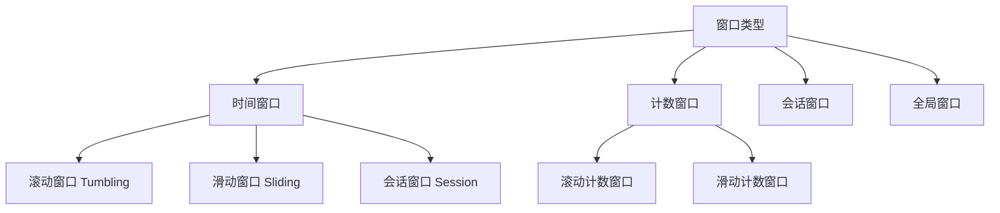
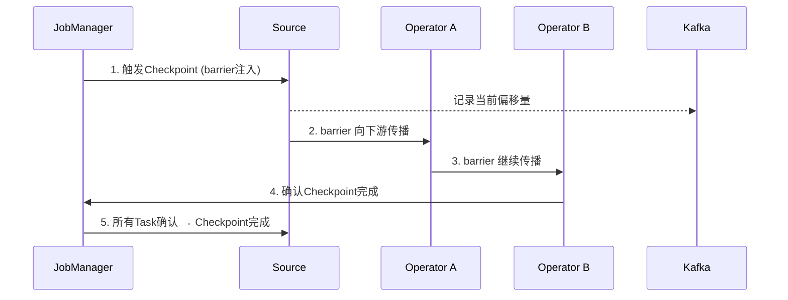

## Flink架构全景：从设计哲学到运行时机制

### 一、Flink是什么：实时计算的事实标准

Apache Flink 是一个面向分布式数据流处理和批处理的计算框架，诞生于柏林工业大学的 Stratosphere 研究项目（2014年进入Apache基金会）。它的核心设计哲学是 **"流批一体"（Stream-first）**：将批处理视为有界流的特殊情况，所有计算都以数据流模型统一抽象。

**Flink 在大数据生态中的定位：**

| 特性 | Flink | Spark Streaming | Storm | Kafka Streams |
|------|-------|-----------------|-------|---------------|
| 计算模型 | 流批一体（原生流） | 微批 | 逐条 | 逐条 |
| 状态管理 | 内置（RocksDB/Heap） | 有限 | 需外部 | 内置 |
| 容错机制 | 分布式快照（Chandy-Lamport） | WAL/Checkpoint | Ack机制 | 依赖Kafka |
| 窗口支持 | 灵活（时间/计数/会话） | 固定/滑动 | 基础 | 时间/计数/会话 |
| 延迟 | 毫秒级 | 秒级 | 毫秒级 | 毫秒级 |
| 吞吐量 | 极高 | 高 | 中等 | 中高 |
| Exactly-Once | 端到端Exactly-Once | 端到端（需配合） | At-least-Once | 端到端（依赖Kafka） |

Flink 被广泛应用于实时风控、实时数仓、事件驱动型应用、流式ETL等场景，是目前实时计算领域事实上的标准。

---

### 二、整体架构：Master-Worker 双层模型

Flink 采用经典的 **Master-Worker（JobManager + TaskManager）** 架构，整体分为三层：

1. **客户端层**：提交作业、获取结果
2. **集群管理层**：JobManager 调度与协调
3. **任务执行层**：TaskManager 实际执行计算

┌─────────────────────────────────────────────────┐
│                   Client                         │
│          (提交JobGraph / 获取结果)                │
└──────────────────────┬──────────────────────────┘
                       │
              ┌────────▼────────┐
              │    Dispatcher   │  (接收作业提交)
              └────────┬────────┘
                       │
              ┌────────▼────────┐
              │  ResourceManager │  (分配资源)
              └────────┬────────┘
                       │
         ┌─────────────┼─────────────┐
         │             │             │
    ┌────▼────┐  ┌─────▼─────┐  ┌───▼─────┐
    │  JobMaster│ │ TaskManager│ │TaskManager│
    └─────────┘  └───────────┘  └─────────┘

#### 2.1 JobManager：集群的大脑

JobManager 是整个集群的协调者，由三个核心子组件构成：

**（1）Dispatcher**

- 负责接收客户端提交的作业（Flink Job）
- 为每个作业启动一个 JobMaster
- 提供 REST API 和 Web UI 入口
- 在 Session 模式下常驻，Per-Job 模式下随作业启停

**（2）ResourceManager**

- 管理 TaskManager 的 Slot 资源池
- 接收 JobMaster 的资源请求，分配空闲 Slot
- 当 Slot 不足时，向外部资源管理器（YARN/K8s/Mesos）申请容器
- 支持 SlotSharingGroup：多个子任务可共享一个 Slot，提升资源利用率

**（3）JobMaster**

- 一个作业对应一个 JobMaster 实例
- 负责将作业的 ExecutionGraph 拆分为 Task，分发到 TaskManager
- 管理 Checkpoint 协调（触发、确认、完成）
- 监控 Task 的执行状态，处理故障恢复

#### 2.2 TaskManager：执行引擎

TaskManager 是实际执行计算任务的工作节点，每个 TaskManager 是一个 JVM 进程。

**核心概念——Slot：**

- Slot 是 TaskManager 中的资源单元，每个 Slot 对应一定的内存资源
- 一个 TaskManager 可以有多个 Slot（通过 `taskmanager.numberOfTaskSlots` 配置）
- Slot 内可以运行一个或多个 Task（取决于 Slot Sharing Group）

**Slot 与资源的关系：**

TaskManager (JVM进程, 例如 8GB内存)
├── Slot 1 (2GB) → 运行 Map Task + FlatMap Task (Slot Sharing)
├── Slot 2 (2GB) → 运行 Filter Task + KeyedProcess Function
├── Slot 3 (2GB) → 运行 Window Aggregate Task
└── Slot 4 (2GB) → 运行 Sink Task

#### 2.3 部署模式

Flink 支持多种部署模式，适应不同规模和场景：

| 模式 | 特点 | 适用场景 |
|------|------|----------|
| **Local** | 单机单进程，所有组件在同一个JVM | 本地开发调试 |
| **Standalone** | 自管理集群，手动启停 | 小规模测试环境 |
| **YARN** | 作业运行在YARN容器中 | Hadoop生态企业 |
| **Kubernetes** | 容器化部署，弹性伸缩 | 云原生环境 |
| **Session** | 集群共享，多个作业复用 | 低延迟提交、多作业 |
| **Per-Job** | 一个作业独占集群资源 | 生产环境强隔离 |
| **Application** | 应用级隔离，K8s原生 | 最新推荐方式 |

---

### 三、作业执行模型：从代码到物理执行

Flink 作业从用户代码到实际执行，经历四个转换阶段：

Source Code → StreamGraph → JobGraph → ExecutionGraph → Task
 (用户API)    (逻辑拓扑)    (优化后的作业图) (物理执行图)    (实际运行单元)

#### 3.1 StreamGraph：逻辑数据流图

用户通过 DataStream API/SQL/Table API 编写的代码，首先被转换为 StreamGraph。它表达了数据的逻辑流向：

Source → Map → KeyBy → Reduce → Sink

每个节点是一个 StreamNode（算子），每条边是一个 StreamEdge（数据传输通道）。

#### 3.2 JobGraph：优化后的作业图

StreamGraph 经过优化生成 JobGraph，主要优化包括：

- **算子链化（Operator Chaining）**：将可以合并的算子链化到同一个 Task 中，减少序列化/网络开销
- **迭代优化**：识别并优化迭代逻辑

算子链化的条件（默认启用，可配置）：
- 下游算子的入度为1（无其他输入）
- 两个算子之间没有 Shuffle/Rebalance 等分区策略
- 两个算子在同一个 Slot Sharing Group 中

#### 3.3 ExecutionGraph：物理执行图

JobMaster 将 JobGraph 转换为 ExecutionGraph，这是真正的调度依据：

- 将一个 Task 拆分为多个并行的 SubTask
- 确定数据的分区方式（Forward/Rebalance/Hash/Broadcast等）
- 管理每个 SubTask 的生命周期

#### 3.4 数据分区策略

| 分区策略 | 说明 | 使用场景 |
|----------|------|----------|
| **Forward** | 一对一传输，上下游并行度相同 | 算子链内、Map→Filter |
| **Rebalance** | 轮询分发（Round-Robin） | 均匀分配数据 |
| **Shuffle** | 随机分发 | 均匀但不需要Key语义 |
| **KeyBy/Hash** | 按Key的Hash值分区 | 聚合、Join、窗口 |
| **Broadcast** | 广播到所有下游分区 | 配置分发、小表Join |
| **Rescale** | 局部轮询（仅在上下游TaskManager间） | 轻量级负载均衡 |
| **Global** | 全部发送到下游第一个分区 | 全局聚合 |

---

### 四、时间语义与窗口机制

实时计算中最核心也最容易混淆的概念是 **时间语义**。

#### 4.1 三种时间

| 时间类型 | 定义 | 典型场景 | 精确性 |
|----------|------|----------|--------|
| **Event Time** | 数据自身携带的时间戳 | 用户行为分析、日志处理 | 最精确，处理乱序 |
| **Processing Time** | 算子处理数据时的系统时间 | 对延迟敏感但容忍不精确的场景 | 最快，但可能不准 |
| **Ingestion Time** | 数据进入Flink Source的时间 | 作为Event Time的近似替代 | 折中方案 |

**为什么Event Time如此重要？**

在分布式系统中，数据从产生到到达Flink可能经过多个中间环节，产生秒级甚至分钟级延迟。如果用 Processing Time，一个在 `T1` 时刻产生的事件可能在 `T2` 时刻才被处理，导致时间窗口计算不准确。Event Time 直接使用数据自身的时间戳，保证了时间语义的正确性。

#### 4.2 Watermark：处理乱序的核心机制

Watermark（水位线）是 Flink 处理乱序数据的核心机制，本质是一个时间戳 `T`，表示 "小于等于 T 的数据都已到齐"。

事件流:  [t=1] [t=3] [t=2] [t=5] [t=4] [t=7] [t=6]
Watermark:    w=1       w=3              w=5       w=7

**Watermark 的生成策略：**

```java
// 1. 固定延迟策略：允许数据最多延迟指定时间
WatermarkStrategy.forBoundedOutOfOrderness(Duration.ofSeconds(5))
    .withTimestampAssigner((event, timestamp) -> event.getTimestamp());

// 2. 周期性生成：每N毫秒生成一次Watermark
WatermarkStrategy.forMonotonousTimestamps()
    .withIdleness(Duration.ofMinutes(1));  // 处理空闲分区
```

**关键理解：** Watermark 不是一个精确的时间点，而是一个全局推进的"水位线"。当 Watermark 推进到窗口的结束时间时，窗口才会被触发计算。

#### 4.3 窗口类型



**滚动窗口（Tumbling Window）：** 固定大小、不重叠。每个事件只属于一个窗口。

时间轴:  |----窗口1----|----窗口2----|----窗口3----|
数据:    [1,3,2]       [5,4]         [7,6]

**滑动窗口（Sliding Window）：** 固定大小、按步长滑动。一个事件可能属于多个窗口。

时间轴:  |---窗口1---|
               |---窗口2---|
                    |---窗口3---|
数据:    [1,3,2,5,4,7,6]
窗口大小=3s, 滑动步长=1s → 事件会被重复计算

**会话窗口（Session Window）：** 按事件间的间隔动态划分。超过 gap 时间没有新数据，则关闭当前会话。

数据:  [1] [2]    [gap>3s]    [5] [6] [7]          [gap>3s]    [10]
窗口:  |---会话1---|           |----会话2----|                    |会话3|

#### 4.4 窗口在Flink中的内部实现

Flink 窗口的底层实现基于 `WindowAssigner` + `WindowFunction` 的两阶段模式：

1. **WindowAssigner**：决定每个元素属于哪个窗口（分配到对应的键值桶）
2. **Trigger**：决定何时触发窗口计算（基于 Watermark、事件时间、处理时间等）
3. **Evictor**：在触发前后，可以驱逐某些元素（例如只保留最近N个）
4. **WindowFunction**：实际的聚合/处理逻辑

---

### 五、状态管理：Flink 的灵魂

状态管理是 Flink 区别于其他流处理框架的核心竞争力。

#### 5.1 状态类型

| 状态类型 | 说明 | 使用场景 |
|----------|------|----------|
| **ValueState** | 存储单个值 | 计数器、累加器 |
| **ListState** | 存储元素列表 | 收集一批数据后处理 |
| **MapState** | 存储键值对 | 维护一张动态表 |
| **ReducingState** | 自动聚合（Reduce语义） | 实时聚合 |
| **AggregatingState** | 自动聚合（Aggregate语义） | 复杂聚合逻辑 |
| **AppendingState** | 向列表追加元素（超集） | 所有List/Reducing/Aggregating的基础 |

#### 5.2 Keyed State vs Operator State

Keyed State（键控状态）:
  - 绑定到特定的Key
  - 通过 KeyContext 保证同一 Key 的状态只在一个线程中访问
  - 自动按 Key 分区存储
  - 适用于: 统计、聚合、Join

Operator State（算子状态）:
  - 绑定到特定的算子实例（SubTask）
  - 不区分Key
  - 适用于: 累加器、广播状态、Source的偏移量

#### 5.3 状态后端：如何存储状态

| 状态后端 | 存储位置 | 特点 | 适用场景 |
|----------|----------|------|----------|
| **HashMapStateBackend** | JVM 堆内存 | 读写最快，GC压力大 | 开发测试、小状态 |
| **EmbeddedRocksDBStateBackend** | 磁盘（RocksDB） | 支持超大状态，读写较慢 | 生产环境、TB级状态 |
| **FsStateBackend**（已合并） | 本地内存+HDFS | 堆内状态+Checkpoint写HDFS | 中等规模 |

**RocksDB 的关键配置：**

```yaml
# 启用增量Checkpoint（大幅减少Checkpoint时间）
state.backend.incremental: true

# RocksDB Block Cache 大小（影响读性能）
state.backend.rocksdb.block.cache-size: 256mb

# 写缓冲区（影响写性能）
state.backend.rocksdb.writebuffer.size: 128mb
state.backend.rocksdb.writebuffer.count: 4

# 后台合并频率（减少读放大）
state.backend.rocksdb.compaction.style: level
state.backend.rocksdb.writeoptions.sync: false  # 非同步写，提升性能
```

#### 5.4 状态TTL：防止状态无限膨胀

生产环境中，状态如果不做清理，会持续增长导致内存和磁盘耗尽。Flink 提供了灵活的 State TTL 机制：

```java
StateTtlConfig ttlConfig = StateTtlConfig.newBuilder(Time.days(7))
    .setUpdateType(OnCreateAndWrite)     // 访问/写入时刷新过期时间
    .setStateVisibility(NeverReturnExpired) // 永不返回过期数据
    .cleanupInRocksdbCompactFilter(1000)   // 在RocksDB压缩时清理
    .build();

ValueStateDescriptor<String> stateDescriptor =
    new ValueStateDescriptor<>("my-state", String.class);
stateDescriptor.enableTimeToLive(ttlConfig);
```

**TTL 策略选择：**

| 更新方式 | 效果 |
|----------|------|
| `OnCreateAndWrite` | 仅在创建和写入时刷新，读不刷新 |
| `OnReadAndWrite` | 每次读写都刷新（但读多写少时性能略差） |

---

### 六、容错机制：精确一次的保障

Flink 的容错基于 **分布式快照（Distributed Snapshot）** 算法，灵感来源于 Chandy-Lamport 算法。

#### 6.1 Checkpoint 机制



**Checkpoint 的核心步骤：**

1. **JobManager 定期触发 Checkpoint**（默认间隔1分钟）
2. **向 Source 注入 Barrier**（屏障），并记录 Source 的偏移量
3. **Barrier 沿数据流传播**，每个算子在收到所有输入的 Barrier 后，将自己的状态快照到持久化存储
4. **所有算子完成快照后**，JobManager 确认 Checkpoint 完成

#### 6.2 Barrier 对齐（Exactly-Once的关键）

当一个算子有多个输入时（例如 Join），需要等待所有输入的 Barrier 都到达后才触发快照：

Input 1:  [data] [data] [barrier] [data] [data]
Input 2:  [data] [data] [data] [barrier] [data]

算子行为: 等待 Input 2 的 barrier 到达 → 所有输入 barrier 对齐 → 触发快照
期间 Input 2 的数据被缓存（不处理），保证状态的一致性

**Unaligned Checkpoint（非对齐Checkpoint）**：Flink 1.11+ 引入，当某个输入的 Barrier 到达时，立即将所有输入的数据纳入快照状态，无需等待对齐。大幅减少 Checkpoint 时间，但增加了状态大小。

```yaml
# 启用非对齐Checkpoint
execution.checkpointing.unaligned: true
execution.checkpointing.aligned-checkpoint-timeout: 30s  # 回退到对齐模式的超时
```

#### 6.3 故障恢复流程

Task失败 → TaskManager报告故障
    ↓
JobMaster检测到故障
    ↓
取消当前作业的所有Task
    ↓
从最近一次成功的Checkpoint恢复
    ↓
重新调度所有Task
    ↓
Source从Checkpoint记录的偏移量重新消费数据
    ↓
所有算子从Checkpoint快照恢复状态
    ↓
作业恢复正常运行

#### 6.4 Savepoint：手动快照

Savepoint 是用户手动触发的全局一致性快照，功能上与 Checkpoint 类似，但用途不同：

| 特性 | Checkpoint | Savepoint |
|------|-----------|-----------|
| 触发方式 | 自动（定期） | 手动（命令行/API） |
| 生命周期 | 作业取消后自动删除（可配置保留） | 用户手动管理 |
| 格式 | 可能随Flink版本变化 | 标准化格式，跨版本兼容 |
| 用途 | 故障恢复 | 升级、迁移、调参、A/B测试 |

```bash
# 触发 Savepoint
bin/flink savepoint :jobId [:targetDirectory]

# 从 Savepoint 恢复
bin/flink savepoint -s :savepointPath [:jobId]

# 取消作业并触发 Savepoint
bin/flink cancel -s [:savepointPath] :jobId
```

#### 6.5 Checkpoint 调优实践

| 问题 | 调优方案 |
|------|----------|
| Checkpoint 太慢 | 增大间隔、启用 Unaligned Checkpoint、增大并行度 |
| Checkpoint 频繁失败 | 检查 State 大小是否过大、增大 RPC 超时时间 |
| 状态后端 OOM | 切换到 RocksDB、启用 State TTL、增大磁盘空间 |
| Checkpoint 文件过大 | 启用增量Checkpoint、清理过期状态 |
| 恢复时间过长 | 减小单个 State 大小、启用 Changelog State Backend |

```yaml
# 推荐的生产级Checkpoint配置
execution.checkpointing.interval: 60000           # 1分钟
execution.checkpointing.min-pause: 30000           # 最小间隔30秒
execution.checkpointing.timeout: 600000            # 超时10分钟
execution.checkpointing.max-concurrent: 1          # 同时只进行1个
execution.checkpointing.mode: EXACTLY_ONCE        # 精确一次
state.backend.incremental: true                    # 增量Checkpoint
state.checkpoints.dir: hdfs:///flink/checkpoints
state.savepoints.dir: hdfs:///flink/savepoints
```

---

### 七、网络数据传输：Netty Shuffle

TaskManager 之间的数据传输基于 **Netty** 实现的 Shuffle Service，这是 Flink 吞吐量的关键。

#### 7.1 数据传输架构

TaskManager A                              TaskManager B
┌──────────┐    Netty Channel     ┌──────────┐
│ Task 1   │─────────────────────→│ Task 4   │
│ Task 2   │─────────────────────→│ Task 5   │
│ Task 3   │                      │ Task 6   │
└──────────┘                      └──────────┘
       │                                │
   ResultPartition              InputGate
   (发送缓冲区)                  (接收缓冲区)

**核心组件：**

- **ResultPartition**：输出缓冲区，按下游 Task 分区
- **BufferPool**：内存池管理，实现背压（Backpressure）机制
- **Netty Shuffle Service**：底层网络传输，支持零拷贝

#### 7.2 背压机制

当下游处理速度跟不上上游发送速度时，Flink 通过 **反压（Backpressure）** 自适应调节：

Source → Map → [瓶颈] → Agg → Sink
                ↑
           处理速度慢 → 缓冲池满 → 反压传播到上游 → 上游减速

**如何检测背压：**

1. Flink Web UI → 作业拓扑图 → 选择 Task → 查看 Backpressure 状态
2. 检查 `Buffers out/back/ready` 指标
3. 使用 `flink-metrics` 监控 Netty 层的吞吐指标

---

### 八、内存管理：JVM 上的精细控制

Flink 没有完全依赖 JVM 的内存管理，而是在 JVM 之上实现了自己的内存管理机制。

#### 8.1 内存布局

TaskManager JVM 进程内存
├── Flink 队列内存
│   ├── Execution Memory (执行内存)
│   │   ├── Task Heap (任务堆内存)
│   │   └── Task Off-Heap (任务堆外内存)
│   ├── Managed Memory (托管内存 - Flink直接管理)
│   │   ├── RocksDB State Backend 使用
│   │   ├── 聚合/排序的中间结果
│   │   └── 框架缓存
│   └── Network Memory (网络缓冲区内存)
│       └── Netty Shuffle 的数据缓冲
├── JVM Metaspace (类元数据)
└── JVM Overhead (JVM开销, 默认7%)

#### 8.2 关键配置

```yaml
# 总进程内存（K8s/K8s模式）
taskmanager.memory.process.size: 4096m

# 或者分别指定（YARN模式）
taskmanager.memory.task.heap.size: 1536m
taskmanager.memory.managed.size: 1024m
taskmanager.memory.network.fraction: 0.1  # 网络内存占总内存的比例
```

**内存计算的黄金法则：**

- 执行内存占总内存的 60-70%
- 托管内存占 15-25%（RocksDB用户取高值）
- 网络内存占 5-10%
- JVM Overhead 默认 7%，不能低于 256MB

---

### 九、实战：本地搭建与第一个Flink作业

#### 9.1 环境准备

**系统要求：** Linux/Mac，4GB+ 可用内存，JDK 11 或 17

```bash
# 安装 JDK 11
sudo apt-get update &amp;&amp; sudo apt-get install -y openjdk-11-jdk
java -version

# 下载 Flink 1.18
cd /opt
wget https://dlcdn.apache.org/flink/flink-1.18.1/flink-1.18.1-bin-scala_2.12.tgz
tar xzf flink-1.18.1-bin-scala_2.12.tgz
export FLINK_HOME=/opt/flink-1.18.1
export PATH=$FLINK_HOME/bin:$PATH

# 配置系统参数（高并发场景）
echo "net.core.somaxconn = 65535" | sudo tee -a /etc/sysctl.conf
echo "net.ipv4.tcp_max_syn_backlog = 65535" | sudo tee -a /etc/sysctl.conf
sudo sysctl -p
```

#### 9.2 启动集群

```bash
# 启动本地集群（单节点，1个JobManager + 1个TaskManager）
start-cluster.sh

# 验证启动成功
jps  # 应看到 StandaloneSessionClusterEntrypoint 和 TaskManagerRunner

# 访问 Web UI
# http://localhost:8081
```

#### 9.3 运行WordCount示例

```bash
# 使用内置示例
flink run $FLINK_HOME/examples/streaming/WordCount.jar \
  --input /opt/flink-1.18.1/README.txt \
  --output /tmp/flink-wordcount-output
```

#### 9.4 编写自定义作业

```java
import org.apache.flink.api.common.functions.FlatMapFunction;
import org.apache.flink.api.common.serialization.SimpleStringEncoder;
import org.apache.flink.api.java.tuple.Tuple2;
import org.apache.flink.connector.file.sink.FileSink;
import org.apache.flink.connector.file.sink.assigners.SimpleDirectoryAssigner;
import org.apache.flink.streaming.api.datastream.DataStream;
import org.apache.flink.streaming.api.environment.StreamExecutionEnvironment;
import org.apache.flink.util.Collector;

public class WordCount {
    public static void main(String[] args) throws Exception {
        // 1. 创建执行环境
        final StreamExecutionEnvironment env =
            StreamExecutionEnvironment.getExecutionEnvironment();

        // 2. 设置并行度
        env.setParallelism(2);

        // 3. 读取数据源（从Socket读取）
        DataStream<String> text = env.socketTextStream("localhost", 9999);

        // 4. 数据处理管道
        DataStream<Tuple2<String, Integer>> counts = text
            .flatMap(new Tokenizer())          // 分词
            .keyBy(value -> value.f0)          // 按单词分组
            .sum(1);                           // 累加计数

        // 5. 输出结果
        counts.print();

        // 6. 执行作业
        env.execute("Streaming WordCount");
    }

    public static class Tokenizer
            implements FlatMapFunction<String, Tuple2<String, Integer>> {
        @Override
        public void flatMap(String value, Collector<Tuple2<String, Integer>> out) {
            String[] words = value.toLowerCase().split("\\s+");
            for (String word : words) {
                if (!word.isEmpty()) {
                    out.collect(new Tuple2<>(word, 1));
                }
            }
        }
    }
}
```

```bash
# 终端1：启动nc服务
nc -lk 9999

# 终端2：编译并运行
mvn clean package -DskipTests
flink run -c com.example.WordCount target/wordcount-1.0.jar

# 终端1输入：
hello flink
hello world
hello flink streaming
```

#### 9.5 关键运维命令

```bash
# 作业管理
flink list                          # 列出运行中的作业
flink cancel <jobId>                # 取消作业
flink savepoint <jobId> /savepoints # 触发Savepoint
flink modify <jobId> -p 4           # 动态修改并行度

# 集群管理
stop-cluster.sh                     # 停止集群
flink list -a                       # 列出所有作业（含已完成）
flink list -r                       # 列出正在运行的作业

# 监控
flink list -s /savepoints           # 查看Savepoint列表
```

---

### 十、Flink vs Spark Structured Streaming：架构差异

理解 Flink 与 Spark 的架构差异，有助于选择正确的技术方案：

| 维度 | Flink | Spark Structured Streaming |
|------|-------|---------------------------|
| **执行模型** | 真正的逐条流处理 | 微批（Micro-batch） |
| **状态访问** | 直接读写，低延迟 | 需要查询，延迟较高 |
| **Checkpoint** | 基于Barrier的Chandy-Lamport | 基于WAL |
| **时间窗口** | 水印驱动，支持复杂窗口 | 固定/滑动，会话支持有限 |
| **反压** | 基于Credit的流控 | 微批天然解决 |
| **迭代** | 原生支持（Delta迭代） | 需要多作业串联 |
| **SQL能力** | Flink SQL（成熟度提升中） | Spark SQL（生态更成熟） |

**选择建议：**

- 需要毫秒级延迟、复杂状态、事件时间语义 → **Flink**
- 已有Spark生态、批量分析为主、偶尔流处理 → **Spark**
- 两者混合使用：Flink做实时层，Spark做批处理/近实时层，是非常成熟的Lambda架构实践

---

### 十一、常见误区与避坑指南

**误区1：Flink只适合大规模集群**

Flink 可以单机运行（Local模式），适合开发测试。对于中等规模（几GB/天），单节点Flink也能胜任。

**误区2：Checkpoint间隔越短越好**

过短的 Checkpoint 间隔会增加系统开销，影响吞吐量。生产环境建议 1-5 分钟，并配合增量 Checkpoint。

**误区3：所有状态都放在JVM堆内存**

超过几GB的状态就应该使用 RocksDB 后端。堆内存过大导致 Full GC 长时间停顿，反而比 RocksDB 的磁盘读写更慢。

**误区4：忽略 Watermark 的影响**

不设置 Watermark 或设置不当，会导致：
- 窗口永远不触发（数据到达太晚）
- 数据丢失（过期被丢弃）
- 内存溢出（窗口数据无限积压）

**误区5：并行度设得越大越好**

并行度受限于上游数据源的分区数。例如 Kafka Topic 只有6个分区，Flink 并行度设为12，有6个Task永远不会被分配到数据。

---

### 十二、进阶：Flink的可扩展性设计

#### 12.1 动态扩缩容

Flink 1.13+ 支持作业的动态扩缩容（Rescaling），无需重启作业：

```bash
# 在Savepoint基础上恢复，修改并行度
flink run -s /savepoints/savepoint-xxx -p 8 \
  -c com.example.MyJob target/job.jar
```

#### 12.2 作业图优化最佳实践

1. **合理设置算子链**：将高频交互的算子链化，减少网络传输
2. **避免不必要的 Shuffle**：KeyBy 会触发 Shuffle，非必要不使用
3. **合理分配 Slot Sharing**：将计算密集型和IO密集型算子分开
4. **利用 Async I/O**：外部系统调用使用 AsyncFunction，避免阻塞

#### 12.3 生产级监控体系

监控维度：
├── 作业级指标
│   ├── Checkpoint 成功率 / 耗时 / 大小
│   ├── Records Sent / Received（吞吐量）
│   └── Backpressure 状态
├── TaskManager级指标
│   ├── JVM Heap / Off-Heap 使用率
│   ├── GC 频率和耗时
│   ├── CPU / 内存 / 网络带宽
│   └── RocksDB 指标（读/写/压缩）
└── 告警规则
    ├── Checkpoint 连续失败 > 3次 → 严重
    ├── 反压持续 > 5分钟 → 警告
    ├── GC 停顿 > 1秒 → 严重
    └── 状态大小增长速率异常 → 预警

```java
// 代码中注册自定义指标
public class MyMapFunction extends RichMapFunction<Event, Event> {
    private transient Counter processedCount;
    private transient Histogram latencyHistogram;

    @Override
    public void open(Configuration parameters) {
        this.processedCount = getRuntimeContext()
            .getMetricGroup()
            .counter("processedRecords");
        this.latencyHistogram = getRuntimeContext()
            .getMetricGroup()
            .histogram("processingLatency",
                new DescriptiveStatisticsHistogram(1000));
    }

    @Override
    public Event map(Event value) {
        long start = System.currentTimeMillis();
        // 处理逻辑...
        processedCount.inc();
        latencyHistogram.update(System.currentTimeMillis() - start);
        return value;
    }
}
```

---

### 小结

Flink 架构的核心设计思想可以总结为：

1. **流批一体**：一切计算都是流，批只是有界流
2. **状态即核心**：强大的状态管理是实时计算的基础
3. **精确一次**：通过分布式快照和 Barrier 对齐实现端到端Exactly-Once
4. **弹性伸缩**：从单机到千节点集群的无缝扩展
5. **流控自适应**：背压机制自动平衡上下游处理速度

理解这些设计原则，比记住具体的 API 调用更重要——因为 API 会变，但架构思想是持久的。
