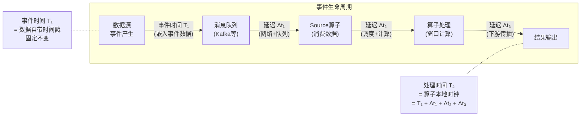
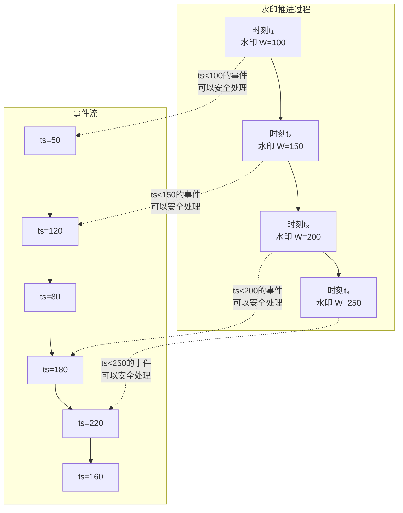
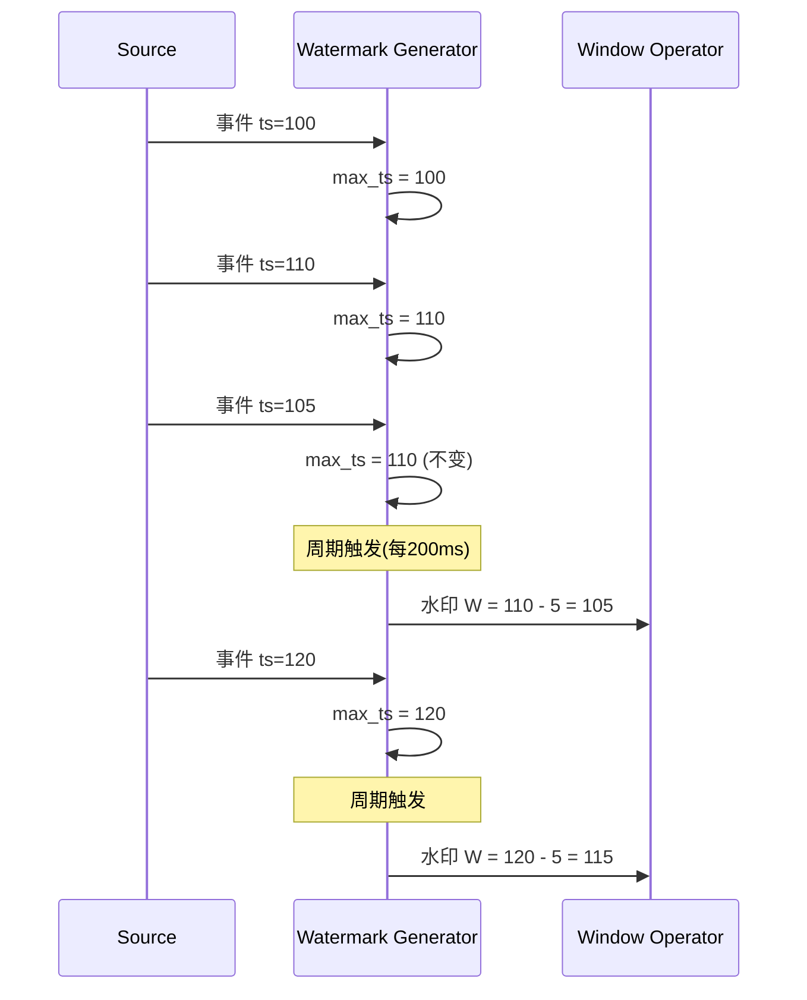
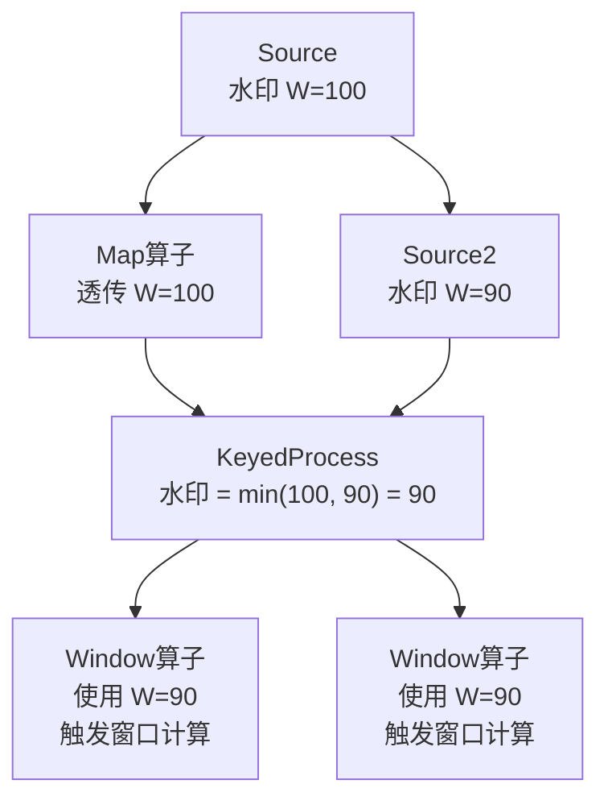
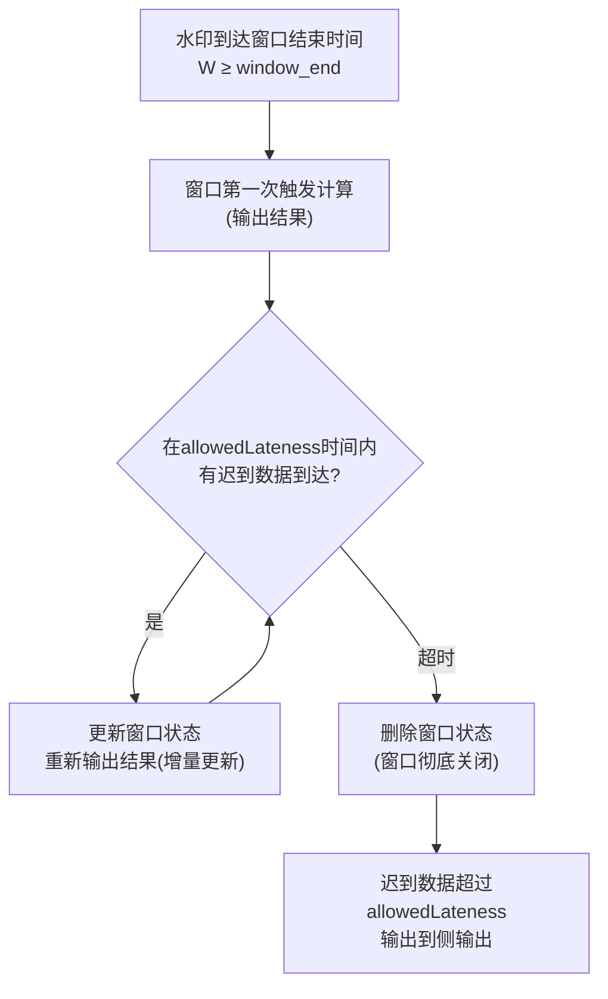
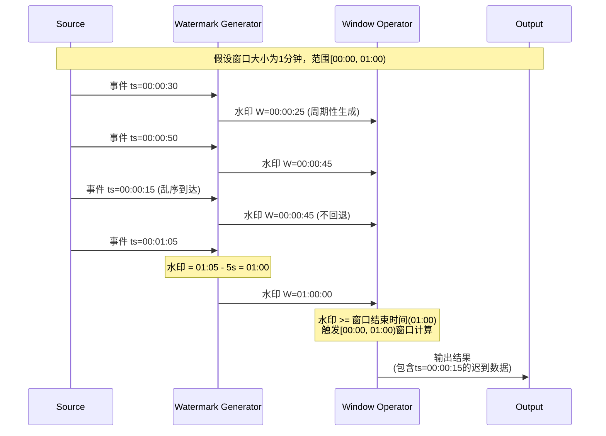
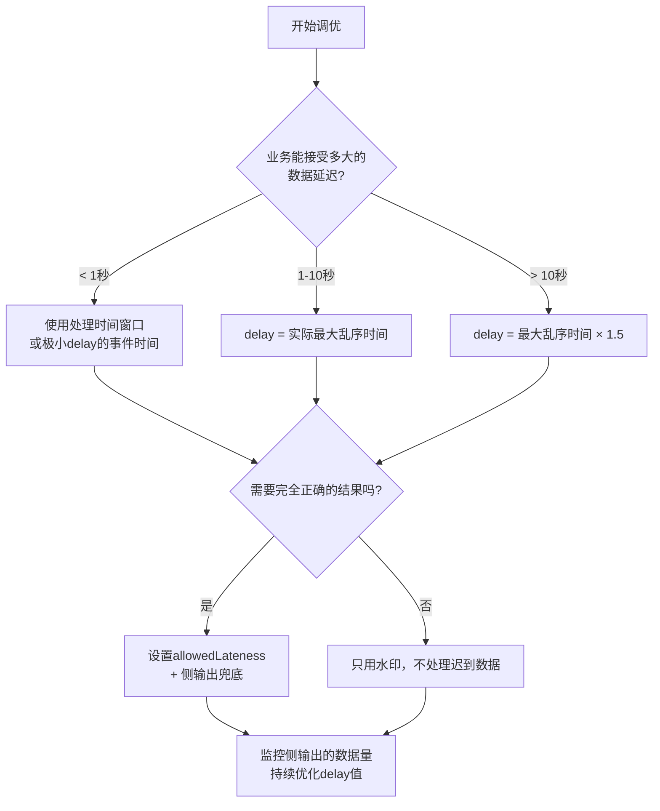

## 二水印机制：事件时间处理的核心基石

在分布式流处理系统中，数据到达的顺序往往与事件发生的顺序不一致——网络延迟、分区策略、生产者突发等因素都会导致乱序。如果简单地按数据到达的先后顺序来计算结果，就会产生不正确甚至荒谬的输出。水印（Watermark）机制正是为了解决这一根本矛盾而设计的：它让系统能够在数据乱序的现实条件下，仍然给出正确的时间语义计算结果。

"二水印机制"的核心含义是：流处理系统同时维护两种时间视角——**事件时间（Event Time）** 和 **处理时间（Processing Time）**——并用水印作为桥接这两种时间的度量标尺。理解双水印机制，是掌握Flink事件时间语义、窗口计算、迟到数据处理等一切高级话题的前提。

***

### 1. 为什么需要水印：从一个错误的聚合说起

**问题的根源**。假设有一个实时监控系统，需要每分钟统计一次网站的访问量。事件流如下：

时间线 →

事件到达顺序：  e1(T=00:00)  e3(T=00:00)  e2(T=00:00)  e4(T=00:01)  e5(T=00:01)
实际发生时间：  e1(T=00:00)  e2(T=00:00)  e3(T=00:00)  e4(T=00:01)  e5(T=00:01)

如果没有水印机制，系统只能按"到达顺序"判断"什么时候一分钟的窗口可以关闭并输出结果"。但问题在于：在第00:01分钟内，可能仍然有第00:00分钟的事件在到达。如果系统在看到第一个00:01事件时就立即关闭00:00窗口，那么迟到的00:00事件就会被丢弃或错误归入01:00窗口。

**朴素方案的三种缺陷**：

| 缺陷 | 描述 | 后果 |
|------|------|------|
| 乱序数据 | 同一时间窗口内的事件以乱序到达 | 窗口提前关闭导致数据遗漏 |
| 迟到数据 | 部分事件因网络延迟在窗口关闭后才到达 | 数据丢失或计算结果不准确 |
| 时间语义模糊 | 无法区分"事件发生时间"和"系统处理时间" | 无法实现可重现的计算结果 |

水印机制的本质作用就是：**提供一个系统级别的"时间进度信号"，告诉下游算子"时间戳小于T的事件已经全部到齐，可以安全地处理或关闭窗口了"**。

***

### 2. 两种时间模型：事件时间与处理时间

理解双水印机制的第一步是区分流处理中的两种核心时间模型。

**事件时间（Event Time）**：事件在数据源处实际发生的时间。这个时间通常嵌入在事件本身的数据中，比如一条日志的 `timestamp` 字段、一个传感器读数的采集时间。事件时间在事件产生时就已经确定，不会因为网络传输、队列积压等系统因素而改变。

**处理时间（Processing Time）**：事件被流处理引擎某个算子处理时的系统时钟时间。处理时间取决于算子所在机器的本地时钟，受网络延迟、系统负载、GC停顿等因素影响，同一个事件在不同算子上可能有不同的处理时间戳。



**两种时间模型的对比**：

| 维度 | 事件时间 | 处理时间 |
|------|---------|---------|
| 时间来源 | 数据本身携带 | 系统时钟 |
| 确定性 | 确定（同一事件时间戳固定） | 不确定（受系统环境影响） |
| 可重现性 | ✅ 相同输入产生相同输出 | ❌ 重放可能得到不同结果 |
| 延迟 | 需要等待乱序数据（延迟较高） | 无需等待（延迟最低） |
| 适用场景 | 对正确性要求高的业务（金融、计费） | 对延迟敏感的场景（实时监控、告警） |
| 实现复杂度 | 高（需要水印机制） | 低（直接使用系统时钟） |

**为什么不直接用处理时间？** 处理时间虽然简单高效，但它有一个致命缺陷：计算结果不可重现。同样的输入数据流，由于网络延迟和系统负载的不同，重放时可能产生不同的聚合结果。在金融交易、用户行为分析等场景中，这种不确定性是不可接受的。事件时间保证了：**给定相同的输入数据，无论何时重放、在何种硬件上运行，计算结果都完全一致**。

***

### 3. 水印的本质：时间进度的信号量

水印（Watermark）是一个特殊的时间戳标记，它的语义是：**"时间戳小于水印值W的所有事件都已经到达（或至少可以认为已经全部到达），系统可以安全地对这些事件进行时间窗口计算"**。



**水印的数学定义**。设水印 W(t) 是处理时间 t 时刻的水印值，则：

> 对于任意事件 e，如果 e.eventTime < W(t)，则在处理时间 t 之后，系统假设不会再收到事件 e（或与 e 时间戳相同的其他事件）。

这个定义是水印机制的基石——它将不确定的"事件什么时候全部到齐"问题，转化为了确定性的"水印推进到哪里"问题。

**水印的两种语义**：

| 类型 | 语义 | 延迟容忍 | 适用场景 |
|------|------|---------|---------|
| 严格水印（Strict） | 水印 W 到达后，时间戳 < W 的事件保证不再出现 | 0 | 数据源保证全局有序 |
| 宽松水印（Lax） | 水印 W 到达后，时间戳 < W 的事件**极大概率**不再出现，但允许少量迟到 | 可配置 | 绝大多数实际场景 |

实际生产中几乎都使用宽松水印，因为严格水印要求数据源全局有序，这在分布式系统中几乎不可能实现。

***

### 4. 水印的生成策略：Flink的三种内置方案

Flink提供了三种内置的水印生成策略，分别对应不同的数据源特性。选择正确的策略直接决定了计算结果的正确性和延迟。

#### 策略一：周期性水印（Periodic Watermark）

最常用的策略。每隔固定时间间隔（默认200ms）从当前处理时间戳或数据中提取的最大时间戳生成一个水印。

```java
// Flink WatermarkStrategy — 周期性水印示例
// 适用场景：数据源已经基本有序，允许固定延迟
WatermarkStrategy<Event> strategy = WatermarkStrategy
    .<Event>forBoundedOutOfOrderness(Duration.ofSeconds(5))  // 允许5秒乱序
    .withTimestampAssigner((event, timestamp) -> event.getEventTime());
```

**工作原理**：



**优点**：实现简单，水印生成开销低，适合大多数场景。  
**缺点**：水印推进速度取决于数据中的最大时间戳，如果某个窗口没有数据，水印不会前进，可能导致下游窗口"饿死"。

#### 策略二：周期性水印 + 空闲检测（With Idle Source）

当某个并行度的数据源暂时没有数据时（空闲），水印不会前进，导致整个作业的水印被这个空闲的源卡住。空闲检测机制通过设置一个超时阈值，超过阈值没有新数据的源会被标记为"空闲"，其水印不再影响全局水印。

```java
// 适用场景：多分区数据源中某些分区可能暂时没有数据
WatermarkStrategy<Event> strategy = WatermarkStrategy
    .<Event>forBoundedOutOfOrderness(Duration.ofSeconds(5))
    .withTimestampAssigner((event, timestamp) -> event.getEventTime())
    .withIdleness(Duration.ofMinutes(1));  // 1分钟无数据则标记为空闲
```

**为什么需要空闲检测？** 假设一个作业从Kafka的12个分区读取数据，使用`forBoundedOutOfOrderness`生成水印。全局水印 = min(所有分区的水印)。如果第8个分区因为消费端rebalance暂时没有数据，该分区的水印停滞不前，导致全局水印被拖住——即使其他11个分区的数据已经推进到了很晚的时间戳，窗口仍然无法关闭。`withIdleness`解决的就是这个问题。

#### 策略三：自定义水印（Punctuated Watermark）

当数据中存在明确的"水印标记事件"时使用。例如，某些数据源会在数据流中插入特殊的标记记录，表示"之前的事件已经全部发出"。

```java
// 适用场景：数据源自带水印标记
WatermarkStrategy<Event> strategy = new WatermarkStrategy<Event>() {
    @Override
    public WatermarkGenerator<Event> createWatermarkGenerator(
            WatermarkGeneratorSupplier.Context context) {
        return new WatermarkGenerator<Event>() {
            private long maxTimestamp = Long.MIN_VALUE;

            @Override
            public void onEvent(Event event, long eventTimestamp, WatermarkOutput output) {
                if (event.isWatermarkMarker()) {
                    // 遇到标记事件，立即发出水印
                    output.emitWatermark(new Watermark(event.getEventTime()));
                }
                maxTimestamp = Math.max(maxTimestamp, event.getEventTime());
            }

            @Override
            public void onPeriodicEmit(WatermarkOutput output) {
                // 不使用周期性水印，仅依赖标记事件
            }
        };
    }
};
```

**优点**：水印精确度高，只在数据源确认"一批数据已全部发出"时才推进。  
**缺点**：依赖数据源的特殊格式，如果数据源没有标记事件则不适用；需要逐条检查每个事件，计算开销较大。

**三种策略的对比**：

| 策略 | 水印推进方式 | 延迟 | 精确度 | 实现复杂度 | 适用场景 |
|------|-------------|------|--------|-----------|---------|
| 周期性水印 | 定时器触发，基于max_ts - delay | 可配置 | 中等 | 低 | 通用场景 |
| 周期性+空闲检测 | 同上 + 空闲源自动跳过 | 可配置 | 中等 | 低 | 多分区、不均匀流量 |
| 自定义标记水印 | 数据驱动，遇到标记立即推进 | 最低 | 高 | 高 | 数据源有明确批次边界 |

***

### 5. 水印的传播机制：从Source到Sink

水印在Flink的DAG图中从Source向Sink逐级传播。理解传播机制对排查"窗口不关闭"和"数据丢失"等问题至关重要。



**关键规则一：水印取最小值**。当一个算子有多个输入流时，它的输出水印 = min(所有输入流的水印)。这是因为只有所有输入流的时间都推进到了某个点，下游才能确信"时间戳小于该点的事件已经全部到齐"。

**关键规则二：水印不回退**。水印是单调递增的——水印值永远不会减小。如果某个算子因为某种原因需要"回退"水印（比如处理了一个时间戳很早的事件），这是不允许的。水印的单调性保证了下游窗口一旦触发就不会被再次触发。

**关键规则三：水印与Checkpoint的交互**。水印会在Checkpoint Barrier对齐时被保存到快照中。恢复时，水印也会从快照中恢复，保证事件时间语义的正确性。

```java
// 水印传播的代码演示
// 在Flink作业中观察水印传播
env.fromSource(kafkaSource, watermarkStrategy, "Kafka Source")
    .map(event -> {
        System.out.println("处理事件: ts=" + event.getTimestamp());
        return event;
    })
    .keyBy(event -> event.getCategory())
    .window(TumblingEventTimeWindows.of(Time.minutes(1)))
    .reduce((a, b) -> a合并b)
    .print();
```

**水印传播延迟的影响**。水印从Source传播到Window算子需要时间，这个延迟取决于：
- Source算子到Window算子之间的算子数量（算子越多，传播延迟越大）
- 数据量和并行度（数据越多，Barrier传播越慢）
- 背压情况（下游处理慢会减缓上游水印传播）

***

### 6. 迟到数据处理：Allowed Lateness与侧输出

水印机制的一个必然代价是：**水印永远不可能100%准确**。总会有一些事件因为极端延迟而晚于水印到达。Flink提供了两种处理迟到数据的机制。

#### 6.1 Allowed Lateness（允许延迟）

在窗口触发计算后，不立即删除窗口状态，而是保留一段时间。在这段时间内到达的迟到数据仍然可以更新窗口结果。

```java
// 设置允许延迟为10分钟
// 窗口关闭后，窗口状态保留10分钟
// 迟到数据在这10分钟内到达仍然会被处理
WindowedStream<Event, String, TimeWindow> windowedStream = stream
    .keyBy(event -> event.getKey())
    .window(TumblingEventTimeWindows.of(Time.minutes(1)))
    .allowedLateness(Time.minutes(10))  // 关键配置
    .sideOutputLateData(lateOutputTag)  // 超过延迟的输出到侧输出
    .reduce((a, b) -> a合并b);
```

**Allowed Lateness的工作流程**：



**allowedLateness的代价**：窗口状态需要额外保留allowedLateness这段时间，这意味着State Backend需要额外的存储空间。如果allowedLateness设置过长，状态大小可能显著增长，影响Checkpoint性能。

#### 6.2 侧输出（Side Output）

当迟到数据超过了allowedLateness，或者不允许任何迟到数据影响主输出时，侧输出机制将这些数据导流到一个单独的输出流，供后续单独处理。

```java
// 侧输出示例：将无法处理的迟到数据写入日志
OutputTag<Event> lateOutputTag = new OutputTag<Event>("late-data") {};

SingleOutputStreamOperator<Result> mainStream = stream
    .keyBy(event -> event.getKey())
    .window(TumblingEventTimeWindows.of(Time.minutes(1)))
    .allowedLateness(Time.minutes(5))
    .sideOutputLateData(lateOutputTag)
    .process(new ProcessWindowFunction<Event, Result, String, TimeWindow>() {
        @Override
        public void process(String key, Context context, Iterable<Event> elements, 
                           Collector<Result> out) {
            // 正常窗口计算
            long count = 0;
            double sum = 0;
            for (Event e : elements) {
                count++;
                sum += e.getValue();
            }
            out.collect(new Result(key, count, sum / count));
        }
    });

// 获取侧输出流，单独处理迟到数据
DataStream<Event> lateStream = mainStream.getSideOutput(lateOutputTag);

// 方案A：写入日志/监控
lateStream.addSink(new LateDataLogger());

// 方案B：写入Kafka的专门topic，后续批量修正
lateStream.addSink(KafkaSink.<Event>builder()
    .setBootstrapServers("kafka:9092")
    .setRecordSerializer(...)
    .build());

// 方案C：触发修正计算
lateStream.keyBy(e -> e.getKey())
    .window(TumblingProcessingTimeWindows.of(Time.seconds(30)))
    .aggregate(new LateDataAggregator(), new LateResultEmitter());
```

**迟到数据处理策略的选择**：

| 策略 | 数据保证 | 延迟 | 状态开销 | 适用场景 |
|------|---------|------|---------|---------|
| 不处理迟到数据 | 可能丢失 | 最低 | 最低 | 允许近似结果的实时监控 |
| allowedLateness | 窗口关闭前的数据不丢 | 增加 | 增加 | 金融计费、用户行为分析 |
| 侧输出 + 批量修正 | 最终全部处理 | 较高 | 较高 | 对数据完整性要求极高的场景 |
| 允许延迟 + 侧输出组合 | 窗口内不丢，超时的单独处理 | 中等 | 中等 | 生产环境的通用方案 |

***

### 7. 水印与窗口的协作：触发计算的完整流程

水印和窗口是Flink事件时间处理的两大核心机制，它们的协作关系直接决定了"什么时候计算结果可以输出"。



**窗口触发规则总结**：

窗口 [window_start, window_end) 的触发条件：
  当前水印 W ≥ window_end
  
前提条件：
  1. 窗口内至少有一条数据（空窗口不会触发）
  2. 窗口没有被触发过（或者allowedLateness内有新数据到达）

**Flink的三种窗口类型在事件时间下的行为**：

| 窗口类型 | 水印触发条件 | 窗口范围 | 典型用途 |
|---------|-------------|---------|---------|
| 滚动窗口（Tumbling） | W ≥ window_end | 固定大小，无重叠 | 每分钟PV统计 |
| 滑动窗口（Sliding） | W ≥ window_end | 固定大小，按步长滑动 | 最近5分钟平均值 |
| 会话窗口（Session） | W ≥ window_end（根据gap计算） | 动态大小，按gap分割 | 用户会话分析 |

***

### 8. 水印机制的常见陷阱与排查

#### 陷阱一：水印不推进（窗口永远不触发）

**症状**：Flink Web UI显示某个窗口长时间处于"OPEN"状态，没有触发计算。

**常见原因与解决方案**：

| 原因 | 排查方法 | 解决方案 |
|------|---------|---------|
| 某个Source分区空闲 | 检查各分区的水印值差异 | 使用`withIdleness()` |
| 数据中缺少时间戳 | 检查TimestampAssigner是否正确 | 确保事件时间戳字段正确设置 |
| 数据源时间戳异常 | 检查最大时间戳是否有回退 | 添加数据校验逻辑 |
| 水印生成器配置错误 | 检查forBoundedOutOfOrderness的delay值 | 合理设置延迟容忍值 |
| 窗口没有数据 | 检查keyBy是否正确分流 | 确认数据能路由到窗口 |

```bash
# 排查水印问题的Flink CLI命令
# 查看作业的水印进度
flink list -r  # 查看运行中的作业
flink list -a  # 查看所有状态的作业

# 在Flink Web UI中：
# Jobs > [Job Name] > 检查各算子的 Watermark 值
# 关注：上游算子和下游算子的水印差异
```

#### 陷阱二：全局水印被单个Source拖慢

**症状**：其他Source的水印已经推进到很晚的时间，但某个Source的水印停滞不前，导致全局水印被卡住。

**根因分析**：Flink的全局水印 = min(所有Source的水印)。任何一个Source的水印不推进，全局水印就会被拖住。这在多分区Kafka源中非常常见——某些分区可能因为消费端rebalance、分区空闲等原因暂时没有数据。

```java
// 解决方案：为每个Source设置独立的空闲检测
KafkaSource<Event> source = KafkaSource.<Event>builder()
    .setBootstrapServers("kafka:9092")
    .setTopics("events")
    .setGroupId("flink-consumer")
    .setStartingOffsets(OffsetsInitializer.latest())
    .setValueOnlyDeserializer(new EventDeserializer())
    .build();

WatermarkStrategy<Event> watermarkStrategy = WatermarkStrategy
    .<Event>forBoundedOutOfOrderness(Duration.ofSeconds(5))
    .withTimestampAssigner((event, ts) -> event.getTimestamp())
    .withIdleness(Duration.ofMinutes(1));  // 关键：空闲检测

DataStream<Event> stream = env.fromSource(source, watermarkStrategy, "Kafka Source");
```

#### 陷阱三：水印推进太快导致数据丢失

**症状**：部分数据没有被任何窗口包含，直接被丢弃。

**根因分析**：`forBoundedOutOfOrderness`中的delay值设置过小。例如，数据实际可能有10秒的乱序，但delay只设了3秒，那么乱序超过3秒的事件（事件时间 < 当前水印 - 3s）会被直接丢弃。

**解决方法**：监控迟到数据的数量。通过侧输出收集超过窗口范围的事件，分析其分布，据此调整delay值。一般建议将delay设为实际观测到的最大乱序时间的1.5~2倍。

#### 陷阱四：处理时间与事件时间混淆

**症状**：使用`ProcessingTime`语义的窗口在重放数据时产生不同结果。

**根因分析**：开发者误将处理时间当作事件时间使用。在Window算子中使用了`TumblingProcessingTimeWindows`而非`TumblingEventTimeWindows`。

```java
// 错误：使用处理时间窗口
stream.keyBy(...).window(TumblingProcessingTimeWindows.of(Time.minutes(1)));

// 正确：使用事件时间窗口
stream.keyBy(...).window(TumblingEventTimeWindows.of(Time.minutes(1)));
```

**排查技巧**：在Flink Web UI中观察算子的"Event Time"和"Processing Time"水印值。如果两者始终同步增长（几乎相同），说明可能使用了处理时间语义。

***

### 9. 水印调优实战：延迟与正确性的权衡

水印配置的核心矛盾是：**延迟（latency）vs 正确性（correctness）**。delay越大，能容忍的乱序越大，结果越正确，但输出延迟也越高。

**调优决策框架**：



**生产环境的推荐配置**：

```java
// 通用推荐配置：平衡延迟、正确性和运维成本
WatermarkStrategy<Event> strategy = WatermarkStrategy
    .<Event>forBoundedOutOfOrderness(Duration.ofSeconds(10))  // 10秒乱序容忍
    .withTimestampAssigner((event, ts) -> event.getEventTime())
    .withIdleness(Duration.ofMinutes(1));  // 空闲检测

OutputTag<Event> lateTag = new OutputTag<Event>("late-data") {};

stream
    .keyBy(event -> event.getKey())
    .window(TumblingEventTimeWindows.of(Time.minutes(1)))
    .allowedLateness(Time.minutes(5))          // 5分钟允许延迟
    .sideOutputLateData(lateTag)               // 超时数据走侧输出
    .process(new MyWindowProcessFunction())
    .print();

// 侧输出的迟到数据写入Kafka，后续离线修正
stream.getSideOutput(lateTag)
    .addSink(new FlinkKafkaProducer<>("late-data-topic", ...));
```

**调优参数速查表**：

| 参数 | 作用 | 默认值 | 调优建议 |
|------|------|--------|---------|
| forBoundedOutOfOrderness(delay) | 水印延迟容忍值 | 无默认，必须指定 | 设为观测最大乱序的1.5~2倍 |
| withIdleness(timeout) | 空闲Source检测超时 | 无默认（不启用） | 多分区源建议设为1分钟 |
| allowedLateness | 窗口保留时间 | 0（不保留） | 金融场景5~10分钟，监控场景可不设 |
| 窗口大小 | 事件时间窗口的持续时间 | 取决于业务 | 越大延迟越高，但计算更完整 |
| watermarkInterval | 水印生成器的周期间隔 | 200ms | 一般不需调整 |

***

### 10. 深入理解：水印机制的数学模型

为了更精确地理解水印的行为，可以建立一个简单的数学模型。

设事件流为 $e_1, e_2, \ldots$，其中每个事件 $e_i$ 有事件时间戳 $T(e_i)$。设水印生成器在处理时间 $t$ 时产生的水印值为 $W(t)$。

**水印生成的数学描述**：

$$W(t) = \max_{e_i: T(e_i) \leq t_{\text{wall}}} T(e_i) - \delta$$

其中 $t_{\text{wall}}$ 是当前的处理时间（系统时钟），$\delta$ 是延迟容忍值。

**水印的正确性条件**：对于任何事件 $e_i$，如果在处理时间 $t$ 时刻 $T(e_i) < W(t)$，则在 $t$ 之后到达的所有事件 $e_j$ 满足 $T(e_j) \geq T(e_i)$ 的概率足够高（由 $\delta$ 控制）。

**空闲Source的影响**：假设系统有 $N$ 个Source，并行度分别为 $p_1, p_2, \ldots, p_N$。全局水印：

$$W_{\text{global}}(t) = \min_{k=1}^{N} W_k(t)$$

如果某个Source $k$ 空闲，其水印 $W_k(t)$ 停滞，导致 $W_{\text{global}}(t)$ 被卡在 $\min(W_k(t), \ldots)$。`withIdleness`机制通过将空闲Source的水印设为无穷大来消除其影响。

***

### 11. 水印在其他流处理框架中的实现

水印机制并非Flink独创，而是流处理领域的通用概念。不同框架的实现方式有异同。

| 框架 | 水印支持 | 实现方式 | 特点 |
|------|---------|---------|------|
| Apache Flink | 完整支持 | WatermarkStrategy API | 最成熟的水印实现，支持多种策略 |
| Apache Spark Structured Streaming | 支持 | watermark() API | 只支持基于处理时间的水印推进，不支持自定义 |
| Apache Beam | 完整支持 | Windowing + Watermark | 与Flink类似的完整语义 |
| Kafka Streams | 不直接支持 | 基于wall-clock的窗口 | 无显式水印，使用处理时间 |
| Apache Storm | 基本支持 | TimestampExtractor | 早期实现，功能有限 |

**Spark Structured Streaming的水印对比**：

```python
# Spark的水印机制相对简单
from pyspark.sql.streaming import Watermark

# 只需要指定事件时间列和延迟容忍值
result = (spark.readStream
    .format("kafka")
    .load()
    .selectExpr("CAST(value AS STRING)", "timestamp")
    .withWatermark("timestamp", "10 minutes")  # 只有一个参数
    .groupBy(
        F.window("timestamp", "1 minute"),
        "category"
    )
    .count())
```

**Flink vs Spark水印的关键差异**：

| 维度 | Flink | Spark Structured Streaming |
|------|-------|---------------------------|
| 水印生成 | 多种策略可选 | 固定基于wall-clock |
| 空闲Source处理 | withIdleness支持 | 不直接支持 |
| 迟到数据处理 | allowedLateness + 侧输出 | 仅watermark延迟 |
| 粒度 | 每个分区独立 | 全局统一 |
| 定制性 | 高（可自定义WatermarkGenerator） | 低 |

***

### 12. 最佳实践总结

**实践一：永远不要用默认配置上线**。Flink的默认水印行为不一定适合你的业务。必须根据实际数据的乱序程度、业务延迟容忍度、数据完整性要求来定制水印策略。

**实践二：监控水印差距**。持续监控各算子之间的水印值差异。如果某个算子的水印比上游慢很多，说明该算子可能是瓶颈。

**实践三：为所有Source设置空闲检测**。在多分区/多Source的场景下，`withIdleness`是必须的，否则某个空闲源会拖住整个作业的水印。

**实践四：侧输出是你的安全网**。即使allowedLateness设得再大，也总会有极少数极端迟到的事件。侧输出确保这些事件不会被静默丢弃，而是被记录下来供后续处理。

**实践五：用测试数据验证水印行为**。在上线前，构造包含乱序、迟到、空闲分区的测试数据集，验证水印行为是否符合预期。Flink的MiniCluster支持本地集成测试。

```java
// 单元测试：验证水印触发行为
@Test
public void testWatermarkTriggersWindow() throws Exception {
    StreamExecutionEnvironment env = StreamExecutionEnvironment.getExecutionEnvironment();
    env.setParallelism(1);

    // 构造测试数据：模拟乱序事件
    List<Event> testEvents = Arrays.asList(
        new Event("key1", 1000L),  // ts=1000
        new Event("key1", 3000L),  // ts=3000
        new Event("key1", 2000L),  // ts=2000 (乱序)
        new Event("key1", 5000L),  // ts=5000 (触发ts<4000的水印)
        new Event("key1", 4500L)   // ts=4500 (乱序，但已被水印包含)
    );

    DataStream<Event> stream = env.fromCollection(testEvents)
        .assignTimestampsAndWatermarks(
            WatermarkStrategy.<Event>forBoundedOutOfOrderness(Duration.ofMillis(1000))
                .withTimestampAssigner((e, ts) -> e.getTimestamp())
        );

    List<Result> results = new ArrayList<>();
    stream.keyBy(Event::getKey)
        .window(TumblingEventTimeWindows.of(Time.seconds(3)))
        .process(new CollectResultsFunction(results))
        .print();

    env.execute("Watermark Test");

    // 验证：窗口[0, 3000)应包含ts=1000, 2000, 3000的事件
    // 窗口[3000, 6000)应包含ts=4500, 5000的事件
    Assert.assertEquals(2, results.size());
}
```

**实践六：理解水印不是万能的**。水印解决的是"什么时候可以认为时间窗口的数据已经齐全"的问题，它不解决数据本身的正确性问题。如果数据源本身就有错误（时间戳错误、重复数据等），水印机制无能为力。在数据源层保证时间戳的准确性，是水印机制发挥作用的前提。

***

### 13. 本节小结

二水印机制是实时计算中最核心也最容易被误解的概念之一。本节从三个维度系统梳理了这一机制：

**理论层面**：水印是事件时间语义的实现基础，它通过在数据流中建立"时间进度信号"，解决了分布式系统中乱序数据和迟到数据的根本问题。事件时间和处理时间的双时间模型，是理解所有实时计算框架时间语义的起点。

**方法层面**：Flink提供了三种水印生成策略（周期性、空闲检测、自定义标记），配合Allowed Lateness和侧输出机制，构成了一套完整的事件时间处理方案。选择正确的策略和参数配置，需要在延迟、正确性和运维成本之间找到平衡。

**实操层面**：水印配置不当是生产环境最常见的问题之一。通过监控水印差距、设置空闲检测、使用侧输出兜底，可以有效规避绝大多数水印相关的故障。
